# 二、线性在金融中的重要性

非线性动力学在我们的世界中扮演着至关重要的角色。线性模型在经济学中经常被采用，因为它更容易研究，建模也更容易。在金融领域，线性模型被广泛用于帮助证券定价和执行最优投资组合配置，以及其他有用的东西。金融建模中线性的一个重要方面是保证问题以全局最优解结束。

为了进行预测和预测，回归分析在统计学领域被广泛用于估计变量之间的关系。Python 最大的优点之一是拥有丰富的数学库，因此 Python 经常被用作科学脚本语言来帮助解决这些问题。SciPy 和 NumPy 软件包等模块包含各种线性回归函数，供数据科学家使用。

在传统的投资组合管理中，资产配置遵循线性模式，投资者有各自的投资风格。我们可以将投资组合分配问题描述为一个包含等式或不等式的线性方程组。这些线性系统可以用矩阵形式表示为*Ax=B*，其中*a*是我们已知的系数值，*B*是观测结果，*x*是我们想要找出的值向量。通常情况下，*x*包含最佳安全权重，以最大化我们的效用。利用矩阵代数，我们可以用直接或间接的方法有效地求解*x*。

在本章中，我们将介绍以下主题：

*   检验资本资产定价模型和证券市场线
*   用回归法求解证券市场线
*   检查 APT 模型并执行多元线性回归
*   理解投资组合配置中的线性优化
*   使用纸浆包装执行线性优化
*   理解线性规划的结果
*   整数规划导论
*   二元条件下线性整数规划模型的实现
*   用矩阵线性代数求解等式线性方程组
*   用 LU、Cholesky 和 QR 分解直接求解线性方程组
*   用 Jacobi 和 Gauss-Seidel 方法间接求解线性方程组

# 资本资产定价模型与证券市场线

许多金融文献专门讨论了**资本资产定价模型**（**CAPM**）。在本节中，我们将探讨强调线性在金融中重要性的关键概念。

在著名的 CAPM 中，证券的风险和收益率之间的关系描述如下：

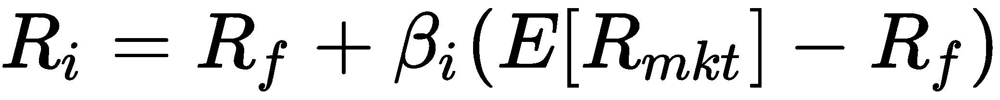

对于一种证券，*i*，其收益定义为*R<sub>i</sub>*，其β定义为*β<sub>i</sub>*。CAPM 将证券回报定义为无风险利率*R<sub>f</sub>*及其贝塔值与风险溢价之和。风险溢价可以被认为是市场投资组合的超额收益，不包括无风险利率。以下是 CAPM 的视觉表示：


贝塔系数是衡量股票系统性风险的指标，这种风险无法分散。本质上，它描述了股票回报对市场波动的敏感性。例如，无论市场走向如何，贝塔系数为零的股票都不会产生超额回报。它只能以无风险的速度增长。贝塔系数为 1 的股票表明该股票完全随市场波动。

贝塔系数是用股票和市场之间收益的协方差除以市场收益的方差得到的。

CAPM 模型衡量投资组合篮子中每只股票的风险和股票回报之间的关系。通过概述这种关系的总和，我们获得了风险证券的组合或权重，这些组合或权重为每一级别的投资组合回报产生最低的投资组合风险。希望获得特定回报的投资者将拥有一个这样的组合，即提供尽可能低风险的最优投资组合。最优投资组合的组合沿着一条称为**有效前沿**的线。

沿着有效边界，存在一个切点，表示可用的最佳投资组合，并以尽可能低的风险换取最高的回报率。该切点处的最优投资组合称为**市场投资组合**。

存在一条从市场投资组合到无风险利率的直线。这条线被称为**资本市场线**（**CML**。CML 可以被认为是最佳投资组合的所有其他夏普比率中最高的夏普比率。**夏普比率**是一种经风险调整的绩效衡量指标，定义为投资组合每单位风险的超额收益率（标准差）。投资者对持有 CML 沿线的资产组合特别感兴趣。下图说明了有效前沿、市场组合和 CML：


CAPM 研究中的另一个兴趣线是**证券市场线**（**SML**。SML 根据资产的贝塔值绘制资产的预期回报。对于 beta 值为 1 的证券，其回报与市场回报完全匹配。任何定价高于 SML 的证券都被视为被低估，因为在相同的风险水平下，投资者期望获得更高的回报。相反，任何定价低于 SML 的证券被视为估值过高，如下所示：


假设我们有兴趣找到证券的 beta，*β<sub>i</sub>*。我们可以将公司的股票收益率*R<sub>i</sub>*与市场收益率*R<sub>M</sub>*进行回归，并以*R<sub>i</sub>=α+βR<sub>M</sub>*方程的形式进行截距*α*。

考虑在五个时间段内测量的下列股票回报和市场回报数据：

| **时段** | **股票收益** | **市场回报** |
| 1. | 0.065 | 0.055 |
| 2. | 0.0265 | -0.09 |
| 3. | -0.0593 | -0.041 |
| 4. | -0.001 | 0.045 |
| 5. | 0.0346 | 0.022 |

使用 SciPy 的`stats`模块，我们将对 CAPM 模型进行最小二乘回归，并通过在 Python 中运行以下代码推导出α和*β<sub>i</sub>*的值：

```py
In [ ]:
    """ 
    Linear regression with SciPy 
    """
    from scipy import stats

    stock_returns = [0.065, 0.0265, -0.0593, -0.001, 0.0346]
    mkt_returns = [0.055, -0.09, -0.041, 0.045, 0.022]
    beta, alpha, r_value, p_value, std_err = \
        stats.linregress(stock_returns, mkt_returns)
```

`scipty.stats.linregress`函数返回五个值：回归线的斜率、回归线的截距、相关系数、零斜率零假设的假设检验的 p 值以及估计的标准误差。我们感兴趣的是通过分别打印`beta`和`alpha`的值来查找直线的斜率和截距：

```py
In [ ]:
    print(beta, alpha)
Out[ ]:
    0.5077431878770808 -0.008481900352462384 
```

股票的贝塔系数为 0.5077，阿尔法系数几乎为零。

描述 SML 的方程式可以写成如下：


术语*E[R<sub>M</sub>−R<sub>f</sub>*为市场风险溢价，*E【R<sub>M</sub>*为市场组合的预期收益。*R<sub>f</sub>*为无风险利率回报，*E【R<sub>i</sub>*为资产预期回报，*i*，*β<sub>i</sub>*为资产贝塔值。

假设无风险利率为 5%，市场风险溢价为 8.5%。股票的预期收益是多少？根据资本资产定价模型，贝塔系数为 0.5077 的股票的风险溢价为 0.5077×8.5%，即 4.3%。无风险利率为 5%，因此预期股本回报率为 9.3%。

如果在同一时间段内观察到该证券的回报率（例如，10.5%）高于预期股票回报率，则可以说该证券被低估了，因为投资者可以预期在相同的风险金额下获得更高的回报。

相反，如果观察到证券的回报率低于 SML 所暗示的预期回报率（例如，7%），则可以说证券估值过高。投资者在承担相同风险的同时获得的回报减少。

# 套利定价理论模型

CAPM 有几个局限性，例如使用均值-方差框架以及收益由一个风险因素（市场风险因素）捕获的事实。在一个高度多样化的投资组合中，各种股票的非系统性风险被抵消，基本上被消除。

针对这些不足，提出了**套利定价理论**（**APT**模型），并提供了确定资产价格的一般方法，而非均值和方差。

APT 模型假设证券回报是根据多因素模型产生的，多因素模型由若干系统风险因素的线性组合组成。这些因素可能是通货膨胀率、GDP 增长率、实际利率或股息。

根据 APT 模型，均衡资产定价方程如下：


这里，*E【R<sub>i</sub>*是*i*证券的预期收益率，*α<sub>i</sub>*是*i*股票的预期收益率，如果所有因素都可以忽略不计，*β<sub>i，j</sub>*是*的敏感性 i*<sup xmlns:xsi="http://www.w3.org/2001/XMLSchema-instance" xmlns:epub="http://www.idpf.org/2007/ops">th</sup>资产对*j*<sup xmlns:xsi="http://www.w3.org/2001/XMLSchema-instance" xmlns:epub="http://www.idpf.org/2007/ops">th</sup>因素的影响，*F<sub>j</sub>*是影响【T32 i】证券收益的*j*T30】th 因素的价值。

由于我们的目标是找到*α<sub>i</sub>*和*β*的所有值，因此我们将对 APT 模型进行**多元线性回归**。

# 因子模型的多元线性回归

许多 Python 软件包，如 SciPy，都附带了回归函数的几个变体。特别是，`statsmodels`包是 SciPy 的补充，包括描述性统计和统计模型估计。Statsmodels 的官方页面为[https://www.statsmodels.org](https://www.statsmodels.org) 。

如果 Python 环境中尚未安装 Statsmodels，请运行以下命令：

```py
$ pip install -U statsmodels
```

If you have an existing package installed, the `-U` switch tells `pip` to upgrade the selected package to the newest available version.

在本例中，我们将使用`statsmodels`模块的`ols`函数执行普通最小二乘回归并查看其摘要。

假设您已经实现了一个 APT 模型，其中包含七个返回值为*Y*的因子。考虑在九个时间段收集的以下数据集，即 T2，T3，T3，1，T4，T5，T，T7，9，T8，T9。*X*<sub>1</sub>至*X<sub>7</sub>*为各时段观察到的自变量。因此，回归问题的结构如下：


可以使用以下代码对*X*和*Y*的值进行简单的普通最小二乘回归：

```py
In [ ]:
    """ 
    Least squares regression with statsmodels 
    """
    import numpy as np
    import statsmodels.api as sm

    # Generate some sample data
    num_periods = 9
    all_values = np.array([np.random.random(8) \
                           for i in range(num_periods)])

    # Filter the data
    y_values = all_values[:, 0] # First column values as Y
    x_values = all_values[:, 1:] # All other values as X
    x_values = sm.add_constant(x_values) # Include the intercept
    results = sm.OLS(y_values, x_values).fit() # Regress and fit the model
```

让我们查看回归的详细统计信息：

```py
In [ ]:
    print(results.summary())
```

OLS 回归结果将输出一个相当长的统计信息表。然而，我们的兴趣在于给出 APT 模型系数的一个特定部分：

```py
===================================================================
                 coef    std err          t      P>|t|      [0.025      
-------------------------------------------------------------------
const          0.7229      0.330      2.191      0.273      -3.469
x1             0.4195      0.238      1.766      0.328      -2.599
x2             0.4930      0.176      2.807      0.218      -1.739
x3             0.1495      0.102      1.473      0.380      -1.140
x4            -0.1622      0.191     -0.847      0.552      -2.594
x5            -0.6123      0.172     -3.561      0.174      -2.797
x6            -0.2414      0.161     -1.499      0.375      -2.288
x7            -0.5079      0.200     -2.534      0.239      -3.054
```

`coef`列给出了*c*常数和*X<sub>1</sub>到*X<sub>7</sub>*的回归系数值。类似地，我们可以使用`params`属性来显示这些感兴趣的系数：*

```py
In [ ]:    
    print(results.params)
Out[ ]:
    [ 0.72286627  0.41950411  0.49300959  0.14951292 -0.16218313 -0.61228465 -0.24143028 -0.50786377]
```

两个函数调用以相同的顺序为 APT 模型生成相同的系数值。

# 线性优化

在 CAPM 和 APT 定价理论中，我们在模型中假设线性，并使用 Python 中的回归求解预期证券价格。

随着我们投资组合中证券数量的增加，也引入了某些限制。投资组合经理在追求投资者要求的某些目标时会发现自己受到这些规则的约束。

线性优化有助于克服投资组合分配问题。优化的重点是最小化或最大化目标函数的值。一些例子包括最大化回报和最小化波动。这些目标通常受到某些法规的约束，例如禁止卖空规则，或投资证券数量的限制。

不幸的是，在 Python 中，没有一个官方软件包支持此解决方案。但是，有第三方软件包可用于线性规划单纯形算法的实现。在本演示中，我们将使用开源线性规划建模工具纸浆来帮助我们解决这个特定的线性规划问题。

# 获取纸浆

您可以从[获取矿浆 https://github.com/coin-or/pulp](https://github.com/coin-or/pulp) 。项目页面包含一个全面的文档列表，帮助您开始优化过程。

您也可以通过`pip`包装管理器获取纸浆包装：

```py
$ pip install pulp
```

# 线性规划最大化的一个例子

假设我们有兴趣投资两种证券，*X*和*Y*。我们希望了解每三个证券单位*X*和两个证券单位*Y*的实际投资单位数量，以便尽可能使投资单位总数最大化。然而，我们的投资策略存在某些限制：

*   每投资 2 支*X*证券和 1 支*Y*证券，总数量不得超过 100
*   每投资一个*X*和*Y*证券单位，总数量不得超过 80
*   允许投资证券*X*的总量不得超过 40
*   证券不允许卖空

最大化问题在数学上可以表示为：

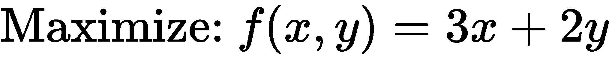

从属于：


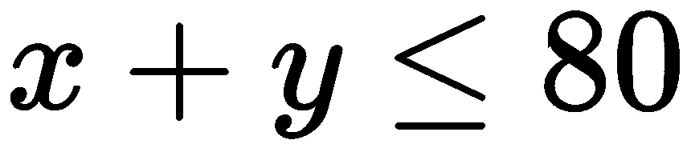

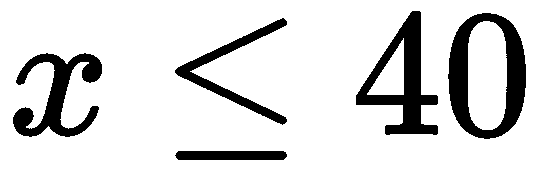


通过*y*图形在*x*上绘制约束，可以看到一组可行的解决方案，阴影区域给出：


这个问题可以通过`pulp`包翻译成 Python，如下所示：

```py
In [ ]:
    """ 
    A simple linear optimization problem with 2 variables 
    """
    import pulp

    x = pulp.LpVariable('x', lowBound=0)
    y = pulp.LpVariable('y', lowBound=0)

    problem = pulp.LpProblem(
        'A simple maximization objective', 
        pulp.LpMaximize)
    problem += 3*x + 2*y, 'The objective function'
    problem += 2*x + y <= 100, '1st constraint'
    problem += x + y <= 80, '2nd constraint'
    problem += x <= 40, '3rd constraint'
    problem.solve()
```

`LpVariable`函数声明要求解的变量。`LpProblem`函数使用问题和优化类型的文本描述初始化问题，在本例中为最大化方法。`+=`操作允许添加任意数量的约束以及文本描述。最后，调用`.solve()`方法开始执行线性优化。要显示优化器求解的值，请使用`.variables()`方法循环遍历每个变量并打印其`varValue`。

代码运行时将生成以下输出：

```py
In [ ]:
    print("Maximization Results:")
    for variable in problem.variables():
        print(variable.name, '=', variable.varValue)
Out[ ]:
    Maximization Results:
    x = 20.0
    y = 60.0
```

结果表明，在满足给定约束集的情况下，当*x*的值为 20，*y*的值为 60 时，可以获得 180 的最大值。

# 线性规划的结果

线性优化有三个结果，如下所示：

*   一个线性规划的局部最优解是一个可行解，其目标函数值比所有其他接近它的可行解更接近。它可能是也可能不是**全局最优解**，一个比所有可行解都好的解。
*   如果无法找到解，则线性规划是不可行的。
*   如果最优解是无界的或无限的，则线性规划是无界的。

# 整数规划

在我们前面研究的简单优化问题中，*线性规划的最大化示例*，变量可以是连续的或分数的。如果分数值或结果的使用不现实怎么办？这个问题被称为**线性整数规划**问题，其中所有变量都被限制为整数。整数变量的一种特殊情况是二进制变量，它可以是 0 或 1。当给定一组选择时，二进制变量在模型决策中特别有用。

整数规划模型在运筹学中经常被用来模拟现实世界中的工作问题。通常，以线性甚至二元的方式表述非线性问题需要更多的艺术而不是科学。

# 整数规划的一个极小化例子

假设我们必须从三个交易商那里购买 150 份特定场外异国情调证券的合同。经销商*X*报价为每份合同 500 美元，加上 4000 美元的手续费，无论售出的合同数量如何。经销商*Y*每份合同收取 450 美元，外加 2000 美元的交易费。经销商*Z*每份合同收取 450 美元，外加 6000 美元的费用。经销商*X*最多卖出 100 份合约，经销商*Y*最多卖出 90 份，经销商*Z*最多卖出 70 份。任何经销商的最低交易量为 30 份合同（如有）。我们应该如何最大限度地降低采购 150 份合同的成本？

使用`pulp`包，让我们设置所需的变量：

```py
In [ ]:
    """ 
    An example of implementing an integer 
    programming model with binary conditions 
    """
    import pulp

    dealers = ['X', 'Y', 'Z']
    variable_costs = {'X': 500, 'Y': 350, 'Z': 450}
    fixed_costs = {'X': 4000, 'Y': 2000, 'Z': 6000}

    # Define PuLP variables to solve
    quantities = pulp.LpVariable.dicts('quantity', 
                                       dealers, 
                                       lowBound=0,
                                       cat=pulp.LpInteger)
    is_orders = pulp.LpVariable.dicts('orders', 
                                      dealers,
                                      cat=pulp.LpBinary)
```

`dealers`变量仅包含用于稍后引用列表和词典的词典标识符。`variable_costs`和`fixed_costs`变量是字典对象，包含每个经销商各自收取的合同成本和费用。纸浆解算器求解由`LpVariable`函数定义的`quantities`和`is_orders`值。`dicts()`方法告诉 Pulp 将分配的变量作为字典对象，使用`dealers`变量进行引用。请注意，`quantities`变量有一个下限（0），防止我们在任何证券中进入空头头寸。`is_orders`值被视为二进制对象，表示我们是否应该与任何经销商进行交易。

对这个整数规划问题建模的最佳方法是什么？乍一看，应用这个等式似乎相当简单：

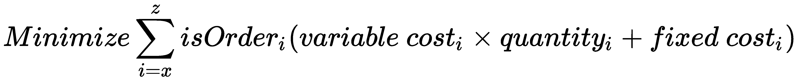

如果以下情况属实：


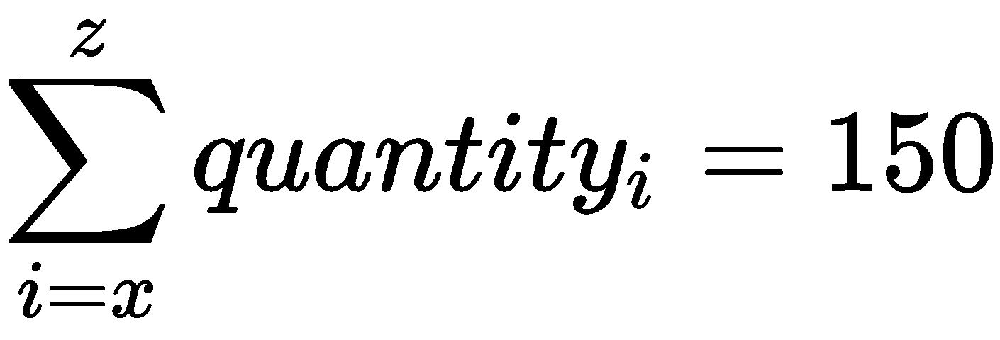

方程式简单地说明，我们希望通过二元变量*isOrder<sub>i</sub>*最小化总成本，以确定是否考虑与从特定经销商处购买相关的成本。

让我们用 Python 实现这个模型：

```py
In [ ]:
    """
    This is an example of implementing an integer programming model
    with binary variables the wrong way.
    """
    # Initialize the model with constraints
    model = pulp.LpProblem('A cost minimization problem',
                           pulp.LpMinimize)
    model += sum([(variable_costs[i] * \
                   quantities[i] + \
                   fixed_costs[i])*is_orders[i] \
                  for i in dealers]), 'Minimize portfolio cost'
    model += sum([quantities[i] for i in dealers]) == 150\
        , 'Total contracts required'
    model += 30 <= quantities['X'] <= 100\
        , 'Boundary of total volume of X'
    model += 30 <= quantities['Y'] <= 90\
        , 'Boundary of total volume of Y'
    model += 30 <= quantities['Z'] <= 70\
        , 'Boundary of total volume of Z'
    model.solve() # You will get an error running this code!
```

当我们运行解算器时会发生什么？过来看：

```py
Out[ ]:
    TypeError: Non-constant expressions cannot be multiplied
```

事实证明，我们试图在两个未知变量上执行乘法运算，`quantities`和`is_order`，这在不知不觉中导致我们执行非线性规划。这就是执行整数规划时遇到的陷阱。

我们应该如何解决这个问题？我们可以考虑使用 Tyt T0.二进制变量 AUT1，如下一节所示。

# 带二进制条件的整数规划

制定最小化目标的另一种方法是以线性方式放置所有未知变量，使其具有相加性：


与之前的目标方程相比，我们将获得相同的固定成本值。然而，未知变量*数量<sub>i</sub>*仍保留在方程的第一项中。因此，需要将*数量<sub>i</sub>*变量作为*同位序<sub>i</sub>*的函数进行求解，这样约束条件陈述如下：


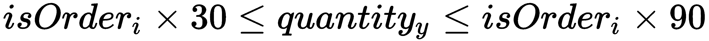


让我们在 Python 中应用这些公式：

```py
In [ ]:
    """
    This is an example of implementing an 
    IP model with binary variables the correct way.
    """
    # Initialize the model with constraints
    model = pulp.LpProblem('A cost minimization problem',
                           pulp.LpMinimize)
    model += sum(
        [variable_costs[i]*quantities[i] + \
             fixed_costs[i]*is_orders[i] for i in dealers])\
        , 'Minimize portfolio cost'
    model += sum([quantities[i] for i in dealers]) == 150\
        ,  'Total contracts required'
    model += is_orders['X']*30 <= quantities['X'] <= \
        is_orders['X']*100, 'Boundary of total volume of X'
    model += is_orders['Y']*30 <= quantities['Y'] <= \
        is_orders['Y']*90, 'Boundary of total volume of Y'
    model += is_orders['Z']*30 <= quantities['Z'] <= \
        is_orders['Z']*70, 'Boundary of total volume of Z'
    model.solve()
```

当我们尝试运行解算器时会发生什么？让我们看看：

```py
In [ ]:
    print('Minimization Results:')
    for variable in model.variables():
        print(variable, '=', variable.varValue)

    print('Total cost:',  pulp.value(model.objective))
Out[ ]:
    Minimization Results:
    orders_X = 0.0
    orders_Y = 1.0
    orders_Z = 1.0
    quantity_X = 0.0
    quantity_Y = 90.0
    quantity_Z = 60.0
    Total cost: 66500.0
```

输出告诉我们，从经销商*Y*购买 90 份合同，从经销商*Z*购买 60 份合同，在满足所有其他约束条件的同时，成本最低，为 66500 美元。

正如我们所看到的，在设计整数规划模型时需要仔细规划，以获得准确的解，从而使它们在决策中有用。

# 用矩阵解线性方程组

在上一节中，我们研究了如何求解具有不等式约束的线性方程组。如果一组系统线性方程组具有确定性约束，我们可以将问题表示为矩阵并应用矩阵代数。矩阵方法在使用现有矩阵库函数的同时，以紧凑的方式表示多个线性方程组。

假设我们想要建立一个由三种证券组成的投资组合：*a*、*b*和*c*。投资组合的分配必须满足一定的约束条件：它必须由六个在证券*a*中持有多头头寸的单位组成。每投资两个单位的证券*a*、一个单位的证券*b*和一个单位的证券*c*，净头寸必须为四个单位。每投资一个单位的证券*a*、三个单位的证券*b*和两个单位的*证券*c**，净头寸必须为五个单位。**

 **为了找出要投资的证券数量，我们可以用数学的方法来构建问题，如下所示：


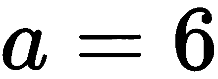

在所有系数可见的情况下，方程式如下：


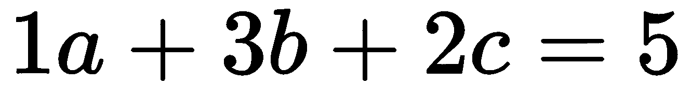


让我们取方程的系数，用矩阵形式表示：

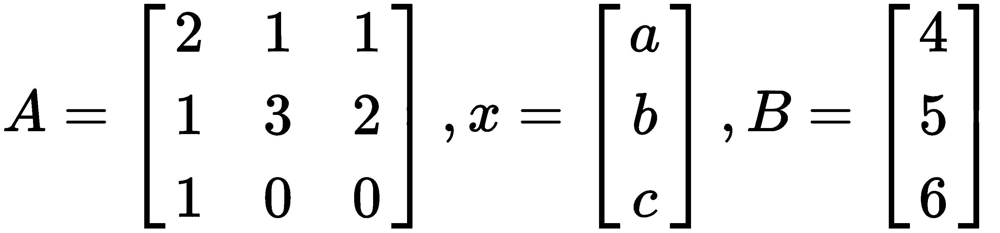

线性方程现在可以表述如下：


为求解包含投资证券数量的*x*向量，取*A*矩阵的逆，方程如下：

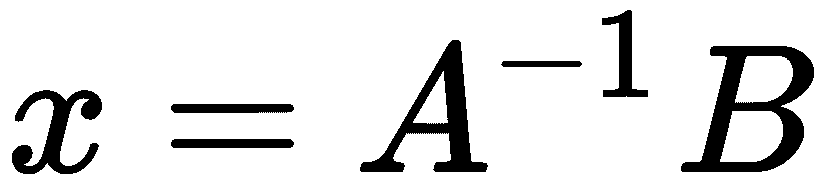

使用 NumPy 阵列，*A*和*B*矩阵分配如下：

```py
In [ ]:
    """ 
    Linear algebra with NumPy matrices 
    """
    import numpy as np

    A = np.array([[2, 1, 1],[1, 3, 2],[1, 0, 0]])
    B = np.array([4, 5, 6])
```

我们可以使用 NumPy 的`linalg.solve`函数来求解线性标量方程组：

```py
In [ ]:
    print(np.linalg.solve(A, B))
Out[ ]:
   [  6\.  15\. -23.]
```

该投资组合将需要 6 个*a*证券单位的多头仓位，15 个*b*证券单位的多头仓位，以及 23 个*c*证券单位的空头仓位。

在投资组合管理中，在给定一组约束条件的情况下，我们可以使用矩阵方程组来求解证券的最优权重分配。随着投资组合中证券数量的增加，*A*矩阵的大小增加，计算*A*的矩阵求逆变得非常昂贵。因此，可以考虑诸如 Cholesky 分解、LU 分解、QR 分解、雅可比方法或高斯席德尔方法等方法来将胡特 T4-ε分解为更简单的分解矩阵。

# LU 分解

**LU 分解**或也称为**上下因式分解**，是求解平方线性方程组的方法之一。顾名思义，LU 分解将*A*矩阵*分解为两个矩阵的乘积：下三角矩阵*L*和上三角矩阵*U*。分解可表示为如下所示：*

 *


在这里，我们可以看到*a=l<sub>11</sub>u<sub>11</sub>*、*b=l<sub>11</sub>u<sub>12</sub>*等等。下三角矩阵是在其下三角中包含值的矩阵，剩余的上三角用零填充。对于上三角矩阵，情况正好相反。

与 Cholesky 分解方法相比，LU 分解方法的明显优势在于它适用于任何平方矩阵。后者只适用于对称矩阵和正定矩阵。

回想上一个例子，在*中使用 3 x 3*a*矩阵*的矩阵*解线性方程组。*这次我们将使用 SciPy 模块的`linalg`包执行 LU 分解，代码如下：

```py
In  [ ]:
    """ 
    LU decomposition with SciPy 
    """
    import numpy as np
    import scipy.linalg as linalg

    # Define A and B
    A = np.array([
        [2., 1., 1.],
        [1., 3., 2.],
        [1., 0., 0.]])
    B = np.array([4., 5., 6.])

    # Perform LU decomposition
    LU = linalg.lu_factor(A)
    x = linalg.lu_solve(LU, B)
```

要查看`x`的值，请执行以下命令：

```py
In  [ ]:
   print(x)
Out[ ]:
   [  6\.  15\. -23.]
```

对于*a*、*b*和*c*、*，我们分别得到了相同的`6`、`15`和`-23`值。*

 *注意，我们在这里使用了`scipy.linalg`的`lu_factor()`方法，该方法将`LU`变量作为*A*矩阵*的旋转 LU 分解。*我们使用`lu_solve()`方法，采用旋转 LU 分解和`B`向量来求解方程组。

我们可以使用`scipy.linalg`的`lu()`方法显示矩阵的 LU 分解。`lu()`方法分别返回三个变量：置换矩阵*P*、下三角矩阵*L*和上三角矩阵*U*：

```py
In [ ]:
    import scipy

    P, L, U = scipy.linalg.lu(A)

    print('P=\n', P)
    print('L=\n', L)
    print('U=\n', U)
```

当我们打印出这些变量时，我们可以得出 LU 分解与*A*矩阵之间的关系，如下所示：

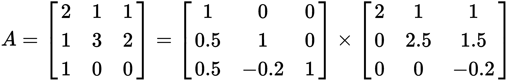

LU 分解可以看作是在两个简单矩阵上执行的高斯消去的矩阵形式：上三角矩阵和下三角矩阵。

# Cholesky 分解

Cholesky 分解是求解线性方程组的另一种方法。通过利用对称矩阵的特性，它可以比 LU 分解快得多，占用的内存也少得多。然而，被分解的矩阵必须是厄米特矩阵（或实值对称矩阵，因此是平方矩阵）和正定矩阵。这意味着将*A*矩阵分解为*A=LL<sup>T</sup>*，其中*L*是一个在对角线上有实数和正数的下三角矩阵，*L<sup>T</sup>*是*L*的共轭转置。

让我们考虑一个线性方程组的另一个例子，其中一个方程是一个 Hymite 和正定。同样，方程式的形式为*Ax=B*，其中*A*和*B*取以下值：

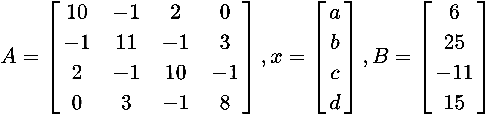

让我们将这些矩阵表示为 NumPy 数组：

```py
In  [ ]:
    """ 
    Cholesky decomposition with NumPy 
    """
    import numpy as np

    A = np.array([
        [10., -1., 2., 0.],
        [-1., 11., -1., 3.],
        [2., -1., 10., -1.],
        [0., 3., -1., 8.]])
    B = np.array([6., 25., -11., 15.])

    L = np.linalg.cholesky(A)
```

`numpy.linalg`的`cholesky()`函数将计算*A*矩阵的下三角因子。让我们来看下三角矩阵：

```py
In  [ ]:
    print(L)
Out[ ]:
   [[ 3.16227766  0\.          0\.          0\.        ]
    [-0.31622777  3.3015148   0\.          0\.        ]
    [ 0.63245553 -0.24231301  3.08889696  0\.        ]
    [ 0\.          0.9086738  -0.25245792  2.6665665 ]]
```

为了验证 Cholesky 分解结果是否正确，我们可以使用 Cholesky 分解的定义，将*L*乘以其共轭转置，这将使我们返回*A*矩阵的值：

```py
In  [ ]:
    print(np.dot(L, L.T.conj())) # A=L.L*
Out [ ]:
    [[10\. -1\.  2\.  0.]
     [-1\. 11\. -1\.  3.]
     [ 2\. -1\. 10\. -1.]
     [ 0\.  3\. -1\.  8.]]
```

在求解*x*之前，我们需要将*L<sup>T</sup>x*解为*y*。我们使用`numpy.linalg`的`solve()`方法：

```py
In  [ ]:
    y = np.linalg.solve(L, B)  # L.L*.x=B; When L*.x=y, then L.y=B
```

为了求解*x*，我们需要使用*L*和*y*的共轭转置再次求解：

```py
In  [ ]:
    x = np.linalg.solve(L.T.conj(), y)  # x=L*'.y
```

我们打印*x*的结果：

```py
In  [ ]:
    print(x)
Out[ ]:
   [ 1\.  2\. -1\.  1.]
```

输出为我们提供了*a*、*b*、*c*和*d*的*x*值。

为了证明 Cholesky 分解给出了正确的值，我们可以通过将*A*矩阵乘以*x*的转置来验证答案，以返回*B*的值：

```py
In [ ] :
    print(np.mat(A) * np.mat(x).T)  # B=Ax
Out[ ]:
    [[  6.]
     [ 25.]
     [-11.]
     [ 15.]]
```

这表明通过 Cholesky 分解得到的*x*的值将导致与*B*给出的值相同。

# QR 分解

**QR 分解**，也称为**QR 分解**，是另一种使用矩阵求解线性方程组的方法，非常类似于 LU 分解。需要求解的方程形式为*Ax*＝*B*，其中矩阵*A*＝*QR*。然而，在这种情况下，*A*是正交矩阵*Q*和上三角矩阵*R*的乘积。QR 算法通常用于求解线性最小二乘问题。

正交矩阵具有以下特性：

*   它是一个正方形矩阵。
*   将正交矩阵与其转置相乘将返回单位矩阵：

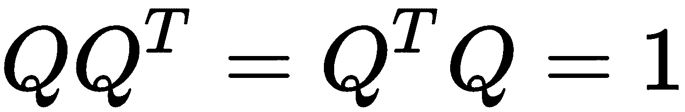

*   正交矩阵的逆等于其转置：

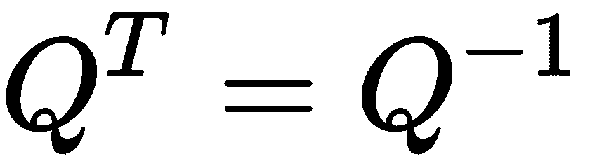

单位矩阵也是一个方阵，其主对角线包含 1 和 0。

*Ax=B*的问题现在可以重述如下：


使用 LU 分解示例中相同的变量，我们将使用`scipy.linalg`的`qr()`方法来计算我们的*Q*和*R*的值，并让*y*变量用以下代码表示我们的*BQ<sup>T</sup>*的值：

```py
In  [ ]:
    """ 
    QR decomposition with scipy 
    """
    import numpy as np
    import scipy.linalg as linalg

    A = np.array([
        [2., 1., 1.],
        [1., 3., 2.],
        [1., 0., 0]])
    B = np.array([4., 5., 6.])

    Q, R = scipy.linalg.qr(A)  # QR decomposition
    y = np.dot(Q.T, B)  # Let y=Q'.B
    x = scipy.linalg.solve(R, y)  # Solve Rx=y
```

注意，`Q.T`只是`Q`的转置，与*Q*的倒数相同：

```py
In [ ]:
    print(x)
Out[ ]:
    [  6\.  15\. -23.]
```

我们得到了与 LU 分解示例中相同的答案。

# 用其它矩阵代数方法求解

到目前为止，我们已经研究了使用矩阵求逆、LU 分解、Cholesky 分解和 QR 分解来求解线性方程组。如果我们在*A*矩阵*中的金融数据规模较大，可以通过多种方案进行分解，以便使用矩阵代数更快地收敛。定量投资组合分析师应该熟悉这些方法。*

 *在某些情况下，我们正在寻找的解决方案可能不会收敛。因此，您可能会考虑使用迭代方法。迭代求解线性方程组的常用方法有雅可比法、高斯-赛德尔法和 SOR 法。我们将简要介绍实现 Jacobi 和 Gauss-Seidel 方法的示例。

# 雅可比方法

雅可比方法沿对角线元素迭代求解线性方程组。当解收敛时，迭代过程终止。同样，要求解的方程的形式为*Ax=B*，其中矩阵*A*可以分解为两个大小相同的矩阵，使得*A=D+R*。矩阵 D 仅由 A 的对角分量组成，而另一个矩阵 R 由其余分量组成。让我们来看一个 4×4πT6 的例子：一个 T7 矩阵：

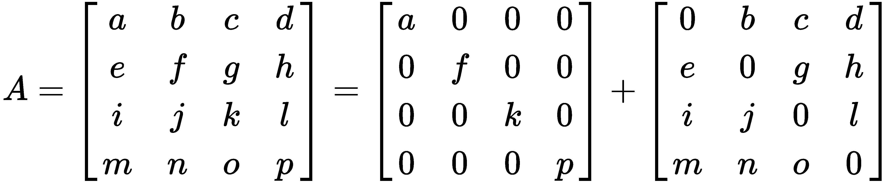

然后迭代获得解决方案，如下所示：


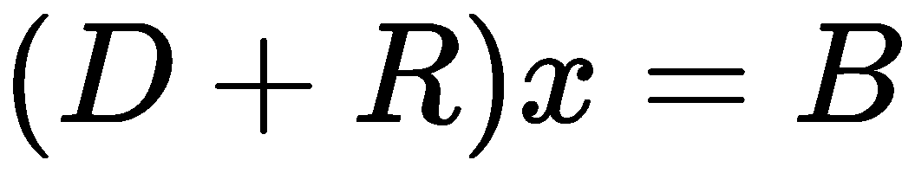


与 Gauss-Siedel 方法相反，Jacobi 方法中的*x<sub>n</sub>*值在每次迭代中都需要，以便计算*x<sub>n+1</sub>*，并且不能被覆盖。这将占用两倍的存储量。但是，每个元素的计算可以并行进行，这有助于加快计算速度。

如果*A*矩阵严格不可约对角占优，则该方法保证收敛。严格不可约对角占优矩阵是指每行中的绝对对角元素大于其他项绝对值之和的矩阵。

在某些情况下，即使不满足这些条件，雅可比方法也可以收敛。Python 代码如下所示：

```py
In [ ]:
    """
    Solve Ax=B with the Jacobi method 
    """
    import numpy as np

    def jacobi(A, B, n, tol=1e-10):
        # Initializes x with zeroes with same shape and type as B
        x = np.zeros_like(B)

        for iter_count in range(n):
            x_new = np.zeros_like(x)
            for i in range(A.shape[0]):
                s1 = np.dot(A[i, :i], x[:i])
                s2 = np.dot(A[i, i + 1:], x[i + 1:])
                x_new[i] = (B[i] - s1 - s2) / A[i, i]

            if np.allclose(x, x_new, tol):
                break

            x = x_new

        return x
```

在 Cholesky 分解例子中考虑相同的矩阵值。我们将在`jacobi`函数中使用 25 次迭代来查找*x*的值：

```py
In [ ] :
    A = np.array([
        [10., -1., 2., 0.], 
        [-1., 11., -1., 3.], 
        [2., -1., 10., -1.], 
        [0.0, 3., -1., 8.]])
    B = np.array([6., 25., -11., 15.])
    n = 25
```

初始化值后，我们现在可以调用函数并求解*x*：

```py
In [ ]:
    x = jacobi(A, B, n)
    print('x', '=', x)
Out[ ]:
    x = [ 1\.  2\. -1\.  1.]
```

我们求解了*x*的值，这与 Cholesky 分解的结果类似。

# 高斯-赛德尔方法

高斯-赛德尔方法的工作原理与雅可比方法非常相似。这是另一种通过迭代程序求解线性方程组的方法，方程的形式为*Ax**=**B*。这里，将*A*矩阵分解为*A**=**L+U*，其中*A*矩阵是下三角矩阵*L*和上三角矩阵*U*的和。让我们来看一个 4×4πT20 矩阵的例子：一个 T21 矩阵：


然后迭代获得解决方案，如下所示：


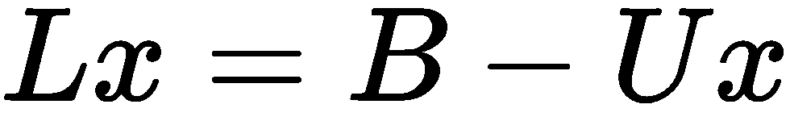


使用下三角矩阵*L*，其中零填充上三角，可以在每次迭代中覆盖*x<sub>n</sub>*的元素，以计算*x<sub>n+1</sub>*。这使得使用 Jacobi 方法时需要一半的存储空间。

Gauss-Seidel 方法的收敛速度在很大程度上取决于*A*矩阵的性质，特别是当*A*矩阵需要严格对角占优或对称正定时。即使不满足这些条件，Gauss-Seidel 方法也可能收敛。

Gauss-Seidel 方法的 Python 实现如下所示：

```py
In  [ ]:
    """ 
    Solve Ax=B with the Gauss-Seidel method 
    """
    import numpy as np

    def gauss(A, B, n, tol=1e-10):
        L = np.tril(A)  # returns the lower triangular matrix of A
        U = A-L  # decompose A = L + U
        L_inv = np.linalg.inv(L)
        x = np.zeros_like(B)

        for i in range(n):
            Ux = np.dot(U, x)
            x_new = np.dot(L_inv, B - Ux)

            if np.allclose(x, x_new, tol):
                break

            x = x_new

        return x
```

这里，NumPy 的`tril()`方法返回下三角*A*矩阵，从中我们可以找到下三角*U*矩阵。将剩余值反复插入*x*将导致我们得到以下解决方案，其中一些公差由`tol`定义。

让我们考虑相同的矩阵值在雅可比方法和 Cholesky 分解的例子。我们将在`gauss()`函数中使用最多 100 次迭代来查找*x*的值，如下所示：

```py
In  [ ]:
    A = np.array([
        [10., -1., 2., 0.], 
        [-1., 11., -1., 3.], 
        [2., -1., 10., -1.], 
        [0.0, 3., -1., 8.]])
    B = np.array([6., 25., -11., 15.])
    n = 100
    x = gauss(A, B, n)
```

让我们看看我们的*x*值是否与雅可比方法和 Cholesky 分解的值匹配：

```py
In [ ]:
    print('x', '=', x)
Out[ ]:   
    x = [ 1\.  2\. -1\.  1.]
```

我们求解了*x*的值，这与雅可比方法和 Cholesky 分解的结果类似。

# 总结

在本章中，我们简要介绍了 CAPM 模型和 APT 模型在金融中的应用。在 CAPM 模型中，我们访问了 CML 的有效前沿，以确定最优投资组合和市场投资组合。然后，我们使用回归求解 SML，这有助于我们确定资产是被低估还是被高估。在 APT 模型中，我们探讨了除使用均值-方差框架外，各种因素如何影响证券收益。我们进行了多元线性回归，以帮助我们确定导致证券价格估值的因素系数。

在投资组合分配中，投资者通常会要求投资组合经理在遵循某些约束的同时实现一组目标。我们可以用线性规划来模拟这个问题。使用 Palm Python 包，我们可以定义一个最小化或最大化目标函数，并在问题中添加不等式约束以解决未知变量。线性优化的三个结果可以是无界解、只有一个解或根本没有解。

线性优化的另一种形式是整数规划，其中所有变量都被限制为整数而不是分数。整数变量的一个特例是二进制变量，它可以是 0 或 1，当给定一组选择时，它对决策建模特别有用。我们研究了一个包含二进制条件的简单整数规划模型，并看到了陷入陷阱是多么容易。为了使整数规划模型在决策中有用，需要对整数规划模型的设计进行仔细规划。

投资组合分配问题也可以表示为一个具有等式的线性方程组，该方程组可以使用*Ax=B*形式的矩阵进行求解。为了找到*x*的值，我们对*A<sup>进行了求解−1</sup>B*使用*A*矩阵的各种类型的分解。矩阵分解的两种方法是直接法和间接法。直接法以固定的迭代次数执行矩阵代数，包括 LU 分解、Cholesky 分解和 QR 分解方法。间接法或迭代法迭代计算*x*的下一个值，直到达到一定的精度公差。这种方法对于计算大型矩阵特别有用，但它也面临解决方案无法收敛的风险。我们使用的间接方法是雅可比方法和高斯-赛德尔方法。

在下一章中，我们将研究金融学中的非线性建模。*****