# 金融中的非线性

近年来，人们对经济和金融理论中的非线性现象的研究越来越感兴趣。由于非线性序列相关性在许多金融时间序列的收益中扮演着重要的角色，这使得证券估值和定价变得非常重要，导致对金融产品非线性建模的研究日益增多。

金融业从业人员使用非线性模型预测波动率、价格衍生品，并计算**风险价值**（**VAR**。与线性模型不同，线性代数用于寻找解决方案，非线性模型不一定推断出全局最优解。数值寻根方法通常用于收敛到最近的局部最优解，即根。

在本章中，我们将讨论以下主题：

*   非线性建模
*   非线性模型示例
*   寻根算法
*   根查找中的 SciPy 实现

# 非线性建模

虽然线性关系旨在以尽可能简单的方式解释观察到的现象，但许多复杂的物理现象无法用这种模型来解释。非线性关系定义如下：

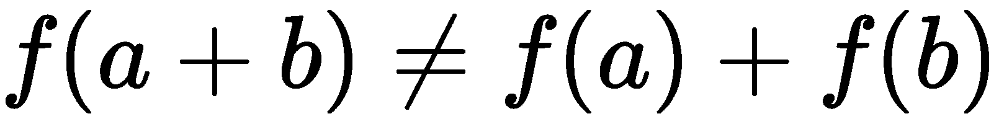

尽管非线性关系可能很复杂，但为了充分理解和建模它们，我们将看看在金融和时间序列模型中应用的示例。

# 非线性模型示例

许多非线性模型被提出用于学术和应用研究，以解释线性模型无法解释的经济和金融数据的某些方面。金融学中关于非线性的文献过于广泛和深入，本书无法充分解释。在本节中，我们将简要讨论一些实际应用中可能遇到的非线性模型示例：隐含波动率模型、马尔可夫转换模型、阈值模型和平滑过渡模型。

# 隐含波动率模型

也许研究最广泛的期权定价模型之一是 Black-Scholes-Merton 模型，或者简称为 Black-Scholes 模型。看涨期权是以特定价格和时间购买标的证券的权利，而不是义务。看跌期权是以特定价格和时间出售标的证券的权利，但不是义务。Black-Scholes 模型有助于确定期权的公平价格，假设基础证券的收益为正态分布（N（.））或资产价格为对数正态分布。

该公式采用以下假设变量：履约价格（*K*）、到期时间（*T*）、无风险利率（*r*）、标的收益波动率（σ）、标的资产当前价格（*S*）及其收益率（*q*）。看涨期权的数学公式*C**S，t*表示如下：

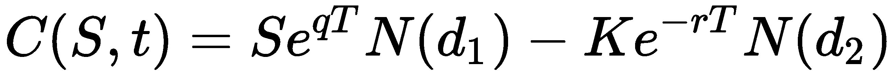

在这里：

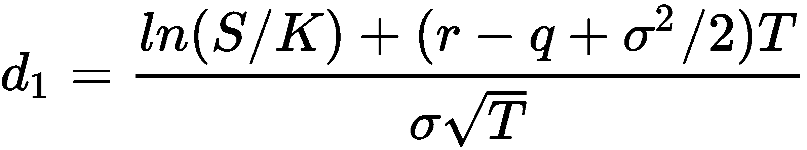

通过市场力量，期权的价格可能会偏离布莱克-斯科尔斯公式得出的价格。特别是，已实现的波动率（即，从历史市场价格观察到的潜在收益的波动率）可能不同于 Black-Scholes 模型所暗示的波动率值，其由σ表示。

回顾[第二章](02.html)*中讨论的**资本资产定价模型**（**CAPM**），线性在金融中的重要性*。总的来说，回报率较高的证券表现出较高的风险，如回报率的波动性或标准差所示。

由于波动性是证券定价中的一个重要因素，人们提出了许多波动性模型进行研究。其中一个模型是期权价格的隐含波动率模型。

假设我们绘制了 Black-Scholes 公式给出的股票期权的隐含波动率值，对于每个可用的执行价格，该公式具有特定的到期日。通常，我们得到一条曲线，通常称为**波动微笑**，因为它的形状：

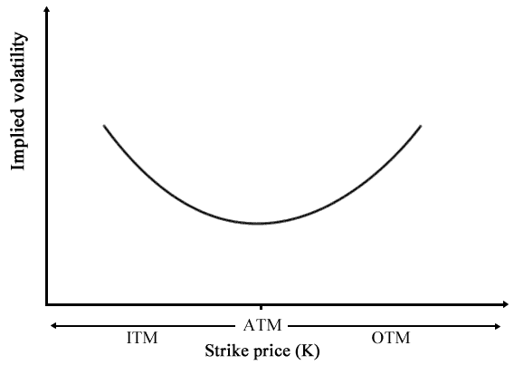

**隐含波动率**通常在大量投机驱动的资金内和资金外期权中处于最高水平，而在资金期权中处于最低水平。

The characteristics of options are explained as follows:

*   **在货币期权**（**ITM**中）：当看涨期权的执行价格低于标的资产的市场价格时，看涨期权被视为 ITM。当行使价格高于标的资产的市场价格时，看跌期权被视为 ITM。ITM 期权在行使时具有内在价值。
*   **货币外期权**（**OTM**）：当看涨期权的执行价格高于标的资产的市场价格时，视为 OTM。当行使价格低于标的资产的市场价格时，看跌期权被视为 OTM。OTM 期权在行使时没有内在价值，但可能仍然具有时间价值。
*   **在货币期权****ATM**：当期权的执行价格与标的资产的市场价格相同时，该期权被视为 ATM。ATM 选项没有内在价值，但可能仍有时间价值。

从前面的波动率曲线来看，隐含波动率建模的目标之一是寻找可能的最低隐含波动率值，或者换句话说，*找到根*。当发现时，可以推导特定到期日的 ATM 期权的理论价格，并与潜在机会的市场价格进行比较，如研究近 ATM 期权或远 OTM 期权。然而，由于曲线是非线性的，线性代数无法充分求解根。我们将在下一节*寻根算法*中介绍一些寻根方法。

# 马尔可夫状态转换模型

为了模拟经济和金融时间序列中的非线性行为，马尔可夫切换模型可以用来描述世界不同状态或制度下的时间序列。这些国家的例子可能是 2008 年全球经济衰退中出现的*波动*状态，或者是经济稳步复苏的*增长*状态。在这些结构之间转换的能力使模型能够捕获复杂的动态模式。

股票价格的马尔可夫性意味着只有现值与预测未来相关。过去的股价走势与现在的走势无关。

让我们以一个马尔可夫状态切换模型为例，其中*m=2*状态：


ϵ<sub>t</sub>是一个**独立同分布的**（**i**。**i**。**d**白噪声。白噪声是一个均值为零的正态分布随机过程。同一模型可以用虚拟变量表示：

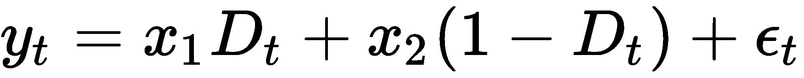

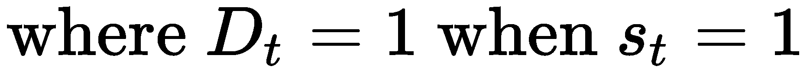

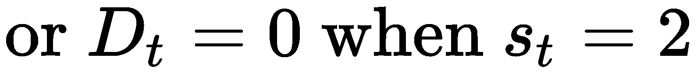

马尔可夫转换模型的应用包括代表实际 GDP 增长率和通货膨胀率动态。这些模型反过来又推动了利率衍生品的估值模型。从前一状态*i*切换到当前状态*j*的概率可以写为：

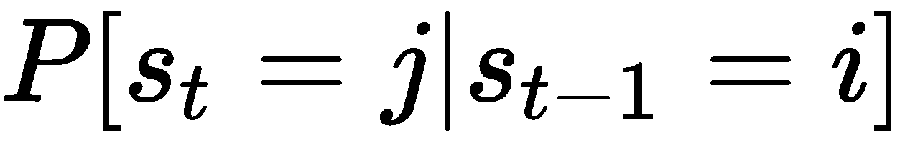

# 门限自回归模型

一类流行的非线性时间序列模型是**阈值自回归**（**TAR**）模型，它看起来非常类似于马尔可夫切换模型。使用回归方法，简单 AR 模型可以说是解释非线性行为最流行的模型。阈值模型中的状态由过去的*d*及其自身时间序列的值相对于阈值*c*确定。

以下是一个**自激 TAR**（**SETAR**模型的示例。SETAR 模型是自激的，因为不同模式之间的切换取决于其自身时间序列的过去值：


使用虚拟变量，SETAR 模型也可以表示为：


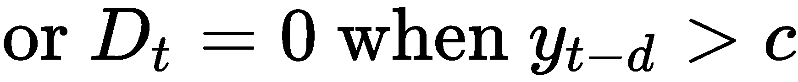

The use of the TAR model may result in sharp transitions between the states as controlled by the threshold variable, *c*.

# 平滑过渡模型

阈值模型中的突然制度变化似乎不符合现实世界的动态。这个问题可以通过引入一个平稳变化的连续函数来克服。SETAR 模型成为一个逻辑斯蒂函数为*G（y<sub>t 的**逻辑斯蒂平滑转移阈值自回归**（**LSTAR**）模型−1</sub>；γ，c】*：


SETAR 模型现在变为 LSTAR 模型，如下式所示：

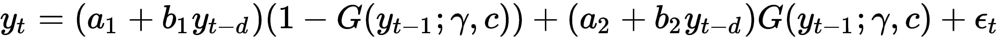

γ参数控制着从一个区域到另一个区域的平滑过渡。对于较大的γ值，转变最快，如*y<sub>t−d</sub>*接近阈值变量*c*。当γ=0 时，LSTAR 模型相当于一个简单的*AR（1）*单区模型。

# 寻根算法

在前一节中，我们讨论了一些常用于研究经济和金融时间序列的非线性模型。因此，从连续时间内给出的模型数据中，目的是寻找可能推断出有价值信息的极值。使用数值方法，如寻根算法，可以帮助我们找到连续函数*f*的根，这样*f（x）=0*，它可以是函数的最大值或最小值。一般来说，一个方程可能包含许多根，也可能根本不包含根。

在非线性模型上使用寻根方法的一个例子是前面在*隐含波动率模型*部分讨论的 Black-Scholes 隐含波动率模型。期权交易者有兴趣根据布莱克-斯科尔斯模型得出隐含价格，并将其与市场价格进行比较。在下一章[期权定价数值方法](04.html)中，我们将了解如何将寻根方法与数值期权定价程序相结合，以基于特定期权的市场价格创建隐含波动率模型。

根查找方法使用一个迭代例程，需要一个起点或根的估计。根的估计要么收敛到一个解，要么收敛到一个未求的根，甚至可能根本找不到解。因此，找到一个很好的根近似值是至关重要的。

并非所有的非线性函数都能用寻根法求解。下图显示了一个连续函数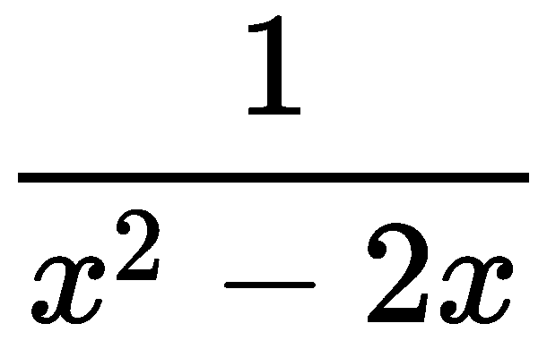的示例，其中根查找方法可能无法找到解决方案。对于在-20 到 20 范围内的*y*值，在*x=0*和*x=2*处存在不连续性：


关于如何定义好的近似值，没有固定的规则。建议在开始根查找迭代过程之前，使用括号或定义搜索下限和搜索上限。我们当然不想不断朝着错误的方向寻找我们的根。

# 增量搜索

求解非线性函数的一种粗略方法是进行增量搜索。使用任意起点*a*，我们可以获得*dx*每增加一次的*f（a）*值。我们假设*f*（*a+dx*）、*f*（*a+2dx*）、*f*（*a+3dx*）的值按照其符号指示的方向移动。一旦符号发生变化，则认为找到了解决方案。否则，当迭代搜索越过边界点*b*时，迭代搜索终止。

下图给出了迭代的根查找器方法的图示示例：


可以从以下 Python 代码中看到一个示例：

```py
In [ ]:
    """ 
    An incremental search algorithm 
    """
    import numpy as np

    def incremental_search(func, a, b, dx):
        """
        :param func: The function to solve
        :param a: The left boundary x-axis value
        :param b: The right boundary x-axis value
        :param dx: The incremental value in searching
        :return: 
            The x-axis value of the root,
            number of iterations used
        """
        fa = func(a)
        c = a + dx
        fc = func(c)
        n = 1
        while np.sign(fa) == np.sign(fc):
            if a >= b:
                return a - dx, n

            a = c
            fa = fc
            c = a + dx
            fc = func(c)
            n += 1

        if fa == 0:
            return a, n
        elif fc == 0:
            return c, n
        else:
            return (a + c)/2., n
```

在每次迭代过程中，`a`将被`c`替换，`c`将被`dx`递增，然后再进行下一次比较。如果找到一个根，它可能位于`a`和`c`之间，两者都包括在内。如果解决方案不在任何一点上，我们将简单地返回两个点的平均值作为最佳估计值。*n*变量跟踪在寻找根的过程中经过的迭代次数。

我们将使用解析解为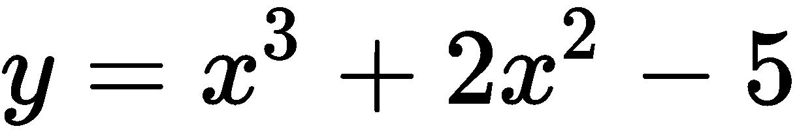的方程来演示和测量我们的寻根器，其中*x*在-5 和 5 之间有界。给出了一个小的*dx*值 0.001，该值也可用作精密工具。*dx*的较小值产生更好的精度，但也需要更多的搜索迭代：

```py
In [ ]:
    # The keyword 'lambda' creates an anonymous function
    # with input argument x
    y = lambda x: x**3 + 2.*x**2 - 5.
    root, iterations = incremental_search (y, -5., 5., 0.001)
    print("Root is:", root)
    print("Iterations:", iterations)
Out[ ]:
    Root is: 1.2414999999999783
    Iterations: 6242
```

增量搜索根查找器方法是根查找算法基本行为的基本演示。当由*dx*定义时，精度处于最佳状态，并且在最坏的情况下消耗极长的计算时间。精度要求越高，解决方案收敛所需的时间就越长。出于实际原因，此方法是所有寻根算法中最不受欢迎的，我们将研究其他方法，以找到方程的根，从而提供更好的性能。

# 二分法

对分法被认为是最简单的一维寻根算法。一般的兴趣是找到连续函数*f*的值*x*，使得*f（x）=0*。

假设我们知道区间的两点，*a*和*b*，其中*a*<*b*，*f（a）<0*和*f（b）>0*位于连续函数上，以该区间的中点为【T12 c】，其中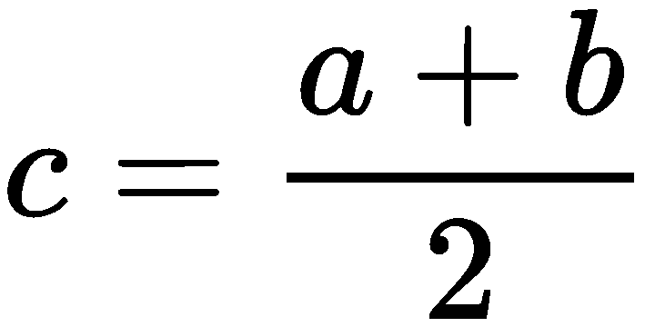；然后，二分法将该值评估为*f（c）*。

让我们用下图说明沿非线性函数的点设置：

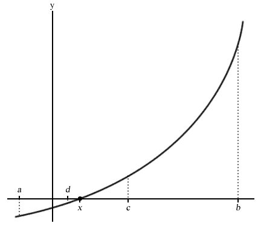

由于*f（a）*的值为负值，而*f（b）*的值为正值，所以对分法假设根*x*位于*a*和*b*之间，并给出*f（x）=0*。

如果*f（c）=0*或通过某个预定的误差容限值非常接近于零，则声明根已找到。如果*f（c）<0*，我们可以认为根沿着*c*和*b*区间存在，否则沿着*a*和*c*区间存在。

在下一次评估中，*c*被相应地替换为*a*或*b*。随着新间隔的缩短，对分法以相同的评估重复，以确定*c*的下一个值。这一过程继续进行，缩小*ab*间隔的宽度，直到认为找到了根。

使用二分法的最大优点是，在给定预定的容错水平和允许的最大迭代次数的情况下，可以保证收敛到根的近似值。应该注意的是，二分法不需要了解未知函数的导数。在某些连续函数中，导数可能很复杂，甚至无法计算。这使得二分法对于处理不平滑的函数非常有价值。

由于二分法不需要连续函数的导数信息，其主要缺点是在迭代计算中比其他寻根方法占用更多的计算时间。此外，由于二分法的搜索边界位于*a*和*b*区间，因此需要良好的近似，以确保根位于该范围内。否则，可能会得到错误的解决方案，甚至根本没有。使用较大的*a*和*b*值可能会消耗更多的计算时间。

对分被认为是稳定的，不需要使用初始猜测值来进行收敛。通常，它与其他方法（如更快的牛顿法）结合使用，以快速精确地收敛。

二分法的 Python 代码如下所示。另存为`bisection.py`：

```py
In [ ]:
    """ 
    The bisection method 
    """
    def bisection(func, a, b, tol=0.1, maxiter=10):
        """
        :param func: The function to solve
        :param a: The x-axis value where f(a)<0
        :param b: The x-axis value where f(b)>0
        :param tol: The precision of the solution
        :param maxiter: Maximum number of iterations
        :return: 
            The x-axis value of the root,
            number of iterations used
        """
        c = (a+b)*0.5  # Declare c as the midpoint ab
        n = 1  # Start with 1 iteration
        while n <= maxiter:
            c = (a+b)*0.5
            if func(c) == 0 or abs(a-b)*0.5 < tol:
                # Root is found or is very close
                return c, n

            n += 1
            if func(c) < 0:
                a = c
            else:
                b = c

        return c, n
In [ ]:
    y = lambda x: x**3 + 2.*x**2 - 5
    root, iterations = bisection(y, -5, 5, 0.00001, 100)
    print("Root is:", root)
    print("Iterations:", iterations)
Out[ ]:
    Root is: 1.241903305053711
    Iterations: 20
```

再次，我们用输入参数`x`将匿名`lambda`函数限定为`y`变量，并尝试像以前一样求解方程，时间间隔为-5 到 5，精度为 0.00001，最大迭代次数为 100 次。

正如我们所看到的，二分法的结果比增量搜索法在更少的迭代次数中为我们提供了更好的精度。

# 牛顿法

**牛顿法**，也称为**牛顿-拉斐逊法**，使用迭代过程，利用函数导数信息求解根。导数被视为一个要求解的线性问题。函数*f*的一阶导数*f′*表示切线。*x*的下一个值的近似值为*x<sub>1</sub>*，如下所示：

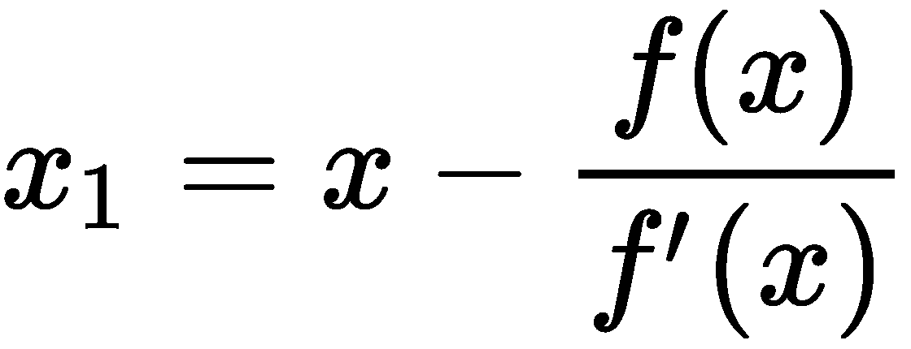

此处，切线与*x<sub>1</sub>*处的*x*轴相交，产生*y=0*。这也代表了关于*x<sub>1</sub>*的一阶泰勒展开式，使得新点**解出以下方程：

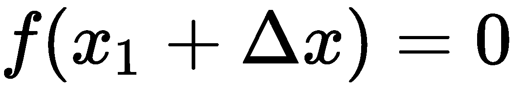

重复此过程，使用*x*取*x<sub>1</sub>*的值，直到达到最大迭代次数，或者*x<sub>1</sub>*和*x*之间的绝对差在可接受的精度水平内。

计算*f（x）*和*f'（x）*的值需要一个初始猜测值。收敛速度是二次的，这被认为在获得高精度的解时非常快。

牛顿方法的缺点是它不能保证解的全局收敛性。当函数包含多个根时，或当算法到达局部极值且无法计算下一步时，就会出现这种情况。由于该方法需要了解其输入函数的导数，因此要求输入函数是可微的。然而，在某些情况下，函数的导数不可能已知，或者在数学上很容易计算。

下面的屏幕截图显示了牛顿方法的图形表示。*x<sub>0</sub>*为初始*x*值。对*f（x<sub>0</sub>*的导数进行求值，它是一条在*x<sub>1</sub>*处穿过*x*轴的切线。重复迭代，在点*x<sub>1</sub>*、*x<sub>2</sub>*、*x<sub>3</sub>*等处求导：

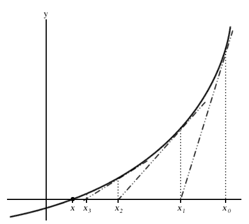

牛顿方法在 Python 中的实现如下：

```py
In  [ ]:
    """ 
    The Newton-Raphson method 
    """
    def newton(func, df, x, tol=0.001, maxiter=100):
        """
        :param func: The function to solve
        :param df: The derivative function of f
        :param x: Initial guess value of x
        :param tol: The precision of the solution
        :param maxiter: Maximum number of iterations
        :return: 
            The x-axis value of the root,
            number of iterations used
        """
        n = 1
        while n <= maxiter:
            x1 = x - func(x)/df(x)
            if abs(x1 - x) < tol: # Root is very close
                return x1, n

            x = x1
            n += 1

        return None, n
```

我们将使用对分示例中使用的相同函数，并查看牛顿法的结果：

```py
In  [ ]:
    y = lambda x: x**3 + 2*x**2 - 5
    dy = lambda x: 3*x**2 + 4*x
    root, iterations = newton(y, dy, 5.0, 0.00001, 100)
    print("Root is:", root)
    print("Iterations:", iterations)
Out [ ]:
    Root is: 1.241896563034502
    Iterations: 7
```

小心被零除的例外情况！在 Python2 中，使用诸如 5.0 之类的值而不是 5，可以让 Python 将变量识别为浮点，避免在计算中将变量视为整数的问题，并为我们提供更好的精度。

利用牛顿法，我们在对分法上以较少的迭代次数得到了一个非常接近的解。

# 割线法

割线方法使用割线来查找根。割线是与曲线的两点相交的直线。在割线法中，在连续函数的两点之间画一条线，使其延伸并与*x*轴相交。这种方法可以看作是一种拟牛顿法。通过连续绘制这样的割线，函数的根可以近似。

割线方法在下面的屏幕截图中以图形表示。需要对两个*x*轴值*a*和*b*进行初始猜测，以找到*f（a）*和*f（b）*。从*f（b）*到*f（A）*绘制一条割线*y*，并在*x*轴上的*c*点处相交，以便：


因此*c*的解决方案如下：


在下一次迭代中，*a*和*b*将分别采用*b*和*c*的值。该方法重复自身，为*a*和*b*、*b*和*c*、*c*和*d*等的*x*轴值绘制割线。当达到最大迭代次数，或*b*和*c*之间的差异达到预先规定的公差水平时，解决方案终止，如下图所示：


割线法的收敛速度被认为是超线性的。它的割线法收敛速度比对分法快得多，比牛顿法慢得多。在牛顿法中，在每次迭代计算其函数和导数时，浮点运算的次数占用的时间是割线法的两倍。由于割线法只需要在每一步计算其函数，因此可以认为它在绝对时间上更快。

割线法的初始猜测值必须接近根，否则无法保证收敛到解。

割线方法的 Python 代码如下所示：

```py
In [ ]:
    """ 
    The secant root-finding method 
    """
    def secant(func, a, b, tol=0.001, maxiter=100):
        """
        :param func: The function to solve
        :param a: Initial x-axis guess value
        :param b: Initial x-axis guess value, where b>a
        :param tol: The precision of the solution
        :param maxiter: Maximum number of iterations
        :return: 
            The x-axis value of the root,
            number of iterations used
        """
        n = 1
        while n <= maxiter:
            c = b - func(b)*((b-a)/(func(b)-func(a)))
            if abs(c-b) < tol:
                return c, n

            a = b
            b = c
            n += 1

        return None, n
```

同样，我们将重用相同的非线性函数，并返回割线法的结果：

```py
In [ ]:
    y = lambda x: x**3 + 2.*x**2 - 5.
    root, iterations = secant(y, -5.0, 5.0, 0.00001, 100)
    print("Root is:", root)
    print("Iterations:", iterations)
Out[ ]:   
    Root is: 1.2418965622558549
    Iterations: 14
```

尽管前面所有的求根方法都给出了非常接近的解，但割线法的迭代次数比对分法少，但比牛顿法多。

# 组合寻根方法

使用前面提到的根查找方法的组合编写自己的根查找算法是完全可能的。例如，您可以使用以下实现：

1.  使用更快的割线方法将问题收敛到预先指定的容错值或最大迭代次数
2.  一旦达到预先指定的公差水平，通过每次迭代将搜索间隔减半，直到找到根，切换到使用二分法收敛到根

**Brent 方法**或**Wijngaarden Dekker Brent 方法**或**方法**结合了对分寻根法、割线法和逆二次插值法。该算法尽可能使用割线法或逆二次插值法，必要时使用对分法。布伦特的方法也可以在 SciPy 的`scipy.optimize.brentq`函数中找到。

# 根查找中的 SciPy 实现

在开始编写用于解决非线性甚至线性问题的寻根算法之前，先看一下`scipy.optimize`方法的文档。SciPy 包含一组科学计算函数，作为 Python 的扩展。这些开源算法很可能适合您现成的应用程序。

# 寻根标量函数

在`scipy.optimize`模块中可以找到的一些根查找功能包括`bisect`、`newton`、`brentq`和`ridder`。让我们使用 SciPy 的实现来设置我们在*增量搜索*节中讨论的示例：

```py
In [ ]:
    """
    Documentation at
    http://docs.scipy.org/doc/scipy/reference/optimize.html
    """
    import scipy.optimize as optimize

    y = lambda x: x**3 + 2.*x**2 - 5.
    dy = lambda x: 3.*x**2 + 4.*x

    # Call method: bisect(f, a, b[, args, xtol, rtol, maxiter, ...])
    print("Bisection method:", optimize.bisect(y, -5., 5., xtol=0.00001))

    # Call method: newton(func, x0[, fprime, args, tol, ...])
    print("Newton's method:", optimize.newton(y, 5., fprime=dy))
    # When fprime=None, then the secant method is used.
    print("Secant method:", optimize.newton(y, 5.))

    # Call method: brentq(f, a, b[, args, xtol, rtol, maxiter, ...])
    print("Brent's method:", optimize.brentq(y, -5., 5.))
```

当我们运行上述代码时，将生成以下输出：

```py
Out[ ]:
    Bisection method: 1.241903305053711
    Newton's method: 1.2418965630344798
    Secant method: 1.2418965630344803
    Brent's method: 1.241896563034559
```

我们可以看到，SciPy 实现为我们提供了与派生实现非常相似的答案。

应该注意的是，SciPy 对每个实现都有一组定义良好的条件。例如，文档中对分例程的函数调用如下所示：

```py
scipy.optimize.bisect(f, a, b, args=(), xtol=1e-12, rtol=4.4408920985006262e-16, maxiter=100, full_output=False, disp=True)
```

函数将严格评估函数*f*，以返回函数的零。*f（a）*和*f（b）*不能有相同的符号。在某些情况下，很难满足这些约束条件。例如，在求解非线性隐含波动率模型时，波动率值不能为负值。在活跃市场中，如果不修改基本实现，几乎不可能找到波动函数的根或零。在这种情况下，实现我们自己的根查找方法可能会让我们对应用程序的行为有更多的权限。

# 一般非线性解算器

`scipy.optimize`模块还包含多维通用解算器，我们可以利用它们发挥优势。`root`和`fsolve`函数是具有以下函数属性的一些示例：

*   `root(fun, x0[, args, method, jac, tol, ...])`：查找向量函数的根。
*   `fsolve(func, x0[, args, fprime, ...])`：查找函数的根。

输出作为字典对象返回。使用我们的示例作为这些函数的输入，我们将获得以下输出：

```py
In [ ]:
    import scipy.optimize as optimize

    y = lambda x: x**3 + 2.*x**2 - 5.
    dy = lambda x: 3.*x**2 + 4.*x

    print(optimize.fsolve(y, 5., fprime=dy))
Out[ ]:    
    [1.24189656]
In [ ]:
    print(optimize.root(y, 5.))
Out[ ]:
    fjac: array([[-1.]])
     fun: array([3.55271368e-15])
 message: 'The solution converged.'
    nfev: 12
     qtf: array([-3.73605502e-09])
       r: array([-9.59451815])
  status: 1
 success: True
       x: array([1.24189656])
```

使用初始猜测值`5`，我们的解收敛到`1.24189656`处的根，这与我们目前得到的答案非常接近。当我们在图形的另一侧选择一个值时会发生什么？让我们使用初始猜测值`-5`：

```py
In [ ]:
    print(optimize.fsolve(y, -5., fprime=dy))
Out[ ]:
   [-1.33306553]
   c:\python37\lib\site-packages\scipy\optimize\minpack.py:163:         RuntimeWarning: The iteration is not making good progress, as measured by the 
  improvement from the last ten iterations.
  warnings.warn(msg, RuntimeWarning)
In [ ]:
    print(optimize.root(y, -5.))
Out[ ]:
    fjac: array([[-1.]])
     fun: array([-3.81481496])
 message: 'The iteration is not making good progress, as measured by the \n  improvement from the last ten iterations.'
    nfev: 28
     qtf: array([3.81481521])
       r: array([-0.00461503])
  status: 5
 success: False
       x: array([-1.33306551])
```

从显示输出中可以看到，算法没有收敛，返回的根与我们之前的答案略有不同。如果我们看一看图上的方程，曲线上有许多点非常靠近根。需要根查找器来获得所需的精度级别，而解算器则试图以最快的时间求解最近的答案。

# 总结

在本章中，我们简要讨论了非线性在经济和金融中的持续性。我们研究了一些金融学中常用的非线性模型，以解释线性模型无法解释的数据的某些方面：Black-Scholes 隐含波动率模型、马尔可夫转换模型、阈值模型和平滑过渡模型。

在 Black-Scholes 隐含波动率模型中，我们讨论了波动率微笑，它由通过 Black-Scholes 模型从特定到期日的看涨期权或看跌期权的市场价格得出的隐含波动率组成。您可能有足够的兴趣寻求可能的最低隐含波动率值，这有助于推断理论价格并与潜在机会的市场价格进行比较。然而，由于曲线是非线性的，线性代数无法充分求解最优点。为此，我们需要使用根查找方法。

根查找方法尝试查找函数的根或其零。我们讨论了常见的求根方法，如对分法、牛顿法和割线法。结合使用寻根算法可以帮助我们更快地找到复杂函数的根。布伦特的方法就是这样一个例子。

我们探讨了`scipy.optimize`模块中包含这些根查找方法的功能，尽管有一些限制。其中一个约束要求使用一对负值和一对正值来计算两个边界输入值，以使解成功收敛。在隐含波动率模型中，这种评估几乎是不可能的，因为波动率没有负值。实现我们自己的根查找方法可能会让我们对应用程序应该如何执行有更多的权限。

使用通用解算器是另一种求根的方法。它们也可能更快地收敛到我们的解，但初始给定值不能保证这种收敛。

非线性建模和优化本质上是一项复杂的任务，没有通用的解决方案或确定的方法得出结论。本章主要介绍金融学的非线性研究。

在下一章中，我们将介绍期权定价常用的数值方法。通过将数值过程与寻根算法相结合，我们将学习如何利用股票期权的市场价格建立隐含波动率模型。