# 期权定价的数值方法

衍生工具是一种合同，其收益取决于某些基础资产的价值。在封闭式衍生工具定价可能很复杂甚至不可能的情况下，数值计算程序非常有用。数值程序是使用迭代计算方法试图收敛到一个解。一个这样的基本实现是二叉树。在二叉树中，节点表示资产在与价格相关联的特定时间点的状态。在下一个时间步中，每个节点指向另外两个节点。类似地，在三项式树中，每个节点在下一个时间步中指向其他三个节点。然而，随着节点数量或树的时间步长的增加，消耗的计算资源也会增加。Lattice pricing 试图通过在每个时间步仅存储新信息来解决此问题，同时尽可能重用值。

在有限差分定价中，树的节点也可以表示为网格。网格上的终端值由终端条件组成，而网格的边缘表示资产定价中的边界条件。我们将讨论有限差分格式的显式方法、隐式方法和 Crank-Nicolson 方法来确定资产价格。

虽然可以发现普通期权和某些异国情调（如欧洲障碍期权和回望期权）具有封闭形式的解决方案，但其他异国情调产品（如亚洲期权）不包含封闭形式的解决方案。在这些情况下，期权的定价可与数值程序一起使用。

在本章中，我们将介绍以下主题：

*   基于二叉树的欧式和美式期权定价
*   使用 Cox-Ross-Rubinstein 二叉树
*   使用 Leisen-Reimer 树的定价选项
*   使用三项式树的期权定价
*   从树上免费得到希腊人
*   使用二项式和三项式晶格的期权定价
*   显式、隐式和 Crank-Nicolson 方法的有限差分
*   使用 LR 树和二分法的隐含波动率建模

# 选项简介

**期权**是一种资产衍生工具，赋予所有者权利而非义务在特定日期以特定价格（分别称为到期日和履约价格）交易标的资产。

**看涨期权**赋予买方在特定日期以特定价格购买资产的权利。如果买方在约定日期行使其权利，看涨期权的卖方或卖方有义务以约定价格向买方出售标的证券。

**看跌期权**赋予买方在特定日期以特定价格出售标的资产的权利。如果买方在约定日期行使其权利，看跌期权的卖方或卖方有义务以约定价格从买方购买标的证券。

最常见的可用选项是欧洲选项和美国选项。其他奇异期权包括百慕大期权和亚洲期权。本章将主要讨论欧洲和美国的选择。欧洲期权只能在到期日行使。另一方面，美式期权可在期权有效期内的任何时间行使。

# 期权定价中的二项式树

在二项式期权定价模型中，假设一个时间段的基础证券（表示为具有给定价格的节点）在下一个时间步中遍历到另外两个节点，表示上升状态和下降状态。由于期权是基础资产的衍生产品，二项式定价模型在离散时间基础上跟踪基础条件。二项式期权定价可用于评估欧洲期权、美国期权以及百慕大期权。

根节点的初始值为下一时间步标的证券的现货价格*S<sub>0</sub>*，风险中性概率增加*q*，风险中性损失概率*1-q*。基于这些概率，针对每一时间步的每种价格上涨或下跌状态计算证券的预期值。终端节点表示每个上升状态和下降状态组合的预期安全价格的每个值。然后，我们可以在每个节点计算期权的价值，通过风险中性预期遍历该树，并从远期利率贴现后，我们可以得出看涨期权或看跌期权的价值。

# 欧洲期权定价

考虑两步二叉树。无股息支付的股票价格从 50 美元开始，在这两个时间步中，股票可能上涨 20%，也可能下跌 20%。假设无风险利率为每年 5%，到期时间*T*为两年。我们想找出执行价为 52 美元的欧洲看跌期权的价值。下图显示了使用二叉树在终端节点的股票定价和收益：


此处，节点计算如下：


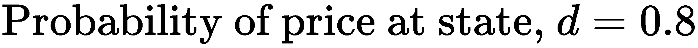

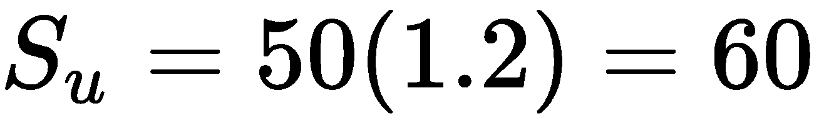

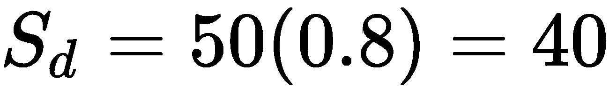

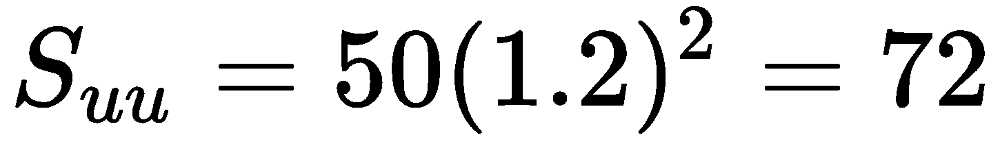


在终端节点，行使欧式看涨期权的收益如下所示：


在欧洲看跌期权的情况下，收益如下：


European call and put options are usually denoted by lowercase letters, *c* and *p*, while American call and put options are usually denoted by uppercase letters, *C* and *P*.

从期权支付值，我们可以向后遍历二叉树到当前时间，从无风险利率贴现后，我们将获得期权的现值。向后遍历树会考虑期权的上升状态和下降状态的风险中性概率。

我们可以假设投资者对风险漠不关心，所有资产的预期回报是相等的。在以风险中性概率投资股票的情况下，持有股票并考虑上升和下降状态的可能性产生的收益将等于下一时间步预期的持续复合无风险利率，如下所示：

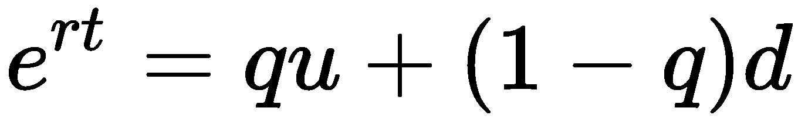

投资该股票的风险中性概率*q*可以改写如下：

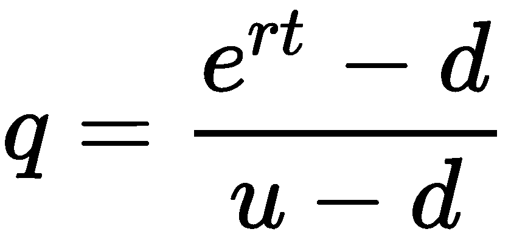

**Are these formulas relevant to stocks? What about futures?** 
Unlike investing in stocks, investors do not have to make an upfront payment to take a position in a futures contract. In a risk-neutral sense, the expected growth rate from holding a futures contract is zero, and the risk-neutral probability *q* of investing in futures can be rewritten as follows:


让我们计算上例中给出的股票的风险中性概率*q*：

```py
In [ ]:
    import math

    r = 0.05
    T = 2
    t = T/2
    u = 1.2
    d = 0.8

    q = (math.exp(r*t)-d)/(u-d)
In [ ]:
    print('q is', q)
Out[ ]:   
    q is 0.6281777409400603
```

在终端节点行使欧式看跌期权的收益分别为 0 美元、4 美元和 20 美元。看跌期权的现值可按如下方式定价：


这使我们的看跌期权价格为 4.19 美元。对每个节点都有收益的欧洲看跌期权进行估值的两步二叉树如下图所示：


# 编写股票期权基类

在进一步实施我们将要讨论的各种定价模型之前，让我们创建一个`StockOption`类来存储和计算股票期权的公共属性，这些属性将在本章中重复使用：

```py
In [ ]:
    import math

    """ 
    Stores common attributes of a stock option 
    """
    class StockOption(object):
        def __init__(
            self, S0, K, r=0.05, T=1, N=2, pu=0, pd=0, 
            div=0, sigma=0, is_put=False, is_am=False):
            """
            Initialize the stock option base class.
            Defaults to European call unless specified.

            :param S0: initial stock price
            :param K: strike price
            :param r: risk-free interest rate
            :param T: time to maturity
            :param N: number of time steps
            :param pu: probability at up state
            :param pd: probability at down state
            :param div: Dividend yield
            :param is_put: True for a put option,
                    False for a call option
            :param is_am: True for an American option,
                    False for a European option
            """
            self.S0 = S0
            self.K = K
            self.r = r
            self.T = T
            self.N = max(1, N)
            self.STs = [] # Declare the stock prices tree

            """ Optional parameters used by derived classes """
            self.pu, self.pd = pu, pd
            self.div = div
            self.sigma = sigma
            self.is_call = not is_put
            self.is_european = not is_am

        @property
        def dt(self):
            """ Single time step, in years """
            return self.T/float(self.N)

        @property
        def df(self):
            """ The discount factor """
            return math.exp(-(self.r-self.div)*self.dt)  
```

当前基础价格、履约价格、无风险利率、到期时间和时间步数是期权定价的强制性公共属性。时间步长`dt`的增量和折扣因子`df`被计算为类的属性，如果需要，可以通过实现类来覆盖。

# 使用二叉树的欧式期权类

欧式期权的二项式期权定价模型的 Python 实现作为`BinomialEuropeanOption`类给出，继承了`StockOption`类中期权的公共属性。此类中方法的实现如下：

1.  `BinomialEuropeanOption`类的`price()`方法是该类所有实例的入口点
2.  调用`setup_parameters()`方法设置所需的模型参数，然后调用`init_stock_price_tree()`方法模拟截至*T*期间的股价预期值
3.  最后，调用`begin_tree_traversal()`方法初始化支付数组并存储折扣支付值，因为它遍历二叉树回到当前时间
4.  支付树节点作为 NumPy 数组对象返回，其中在初始节点处找到欧式期权的现值

`BinomialEuropeanOption`的类实现在以下 Python 代码中给出：

```py
In [ ]:
    import math
    import numpy as np
    from decimal import Decimal

    """ 
    Price a European option by the binomial tree model 
    """
    class BinomialEuropeanOption(StockOption):

        def setup_parameters(self):
            # Required calculations for the model
            self.M = self.N+1  # Number of terminal nodes of tree
            self.u = 1+self.pu  # Expected value in the up state
            self.d = 1-self.pd  # Expected value in the down state
            self.qu = (math.exp(
                (self.r-self.div)*self.dt)-self.d)/(self.u-self.d)
            self.qd = 1-self.qu

        def init_stock_price_tree(self):
            # Initialize terminal price nodes to zeros
            self.STs = np.zeros(self.M)

            # Calculate expected stock prices for each node
            for i in range(self.M):
                self.STs[i] = self.S0 * \
                    (self.u**(self.N-i)) * (self.d**i)

        def init_payoffs_tree(self):
            """
            Returns the payoffs when the option 
            expires at terminal nodes
            """ 
            if self.is_call:
                return np.maximum(0, self.STs-self.K)
            else:
                return np.maximum(0, self.K-self.STs)

        def traverse_tree(self, payoffs):
            """
            Starting from the time the option expires, traverse
            backwards and calculate discounted payoffs at each node
            """
            for i in range(self.N):
                payoffs = (payoffs[:-1]*self.qu + 
                           payoffs[1:]*self.qd)*self.df

            return payoffs

        def begin_tree_traversal(self):
            payoffs = self.init_payoffs_tree()
            return self.traverse_tree(payoffs)

        def price(self):
            """ Entry point of the pricing implementation """
            self.setup_parameters()
            self.init_stock_price_tree()
            payoffs = self.begin_tree_traversal()

            # Option value converges to first node
            return payoffs[0]
```

让我们以前面讨论的两步二叉树示例中的值为例，对欧洲看跌期权进行定价：

```py
In [ ]:
    eu_option = BinomialEuropeanOption(
        50, 52, r=0.05, T=2, N=2, pu=0.2, pd=0.2, is_put=True)
In [ ]:
    print('European put option price is:', eu_option.price())
Out[ ]:    
    European put option price is: 4.1926542806038585
```

使用二项式期权定价模型，欧洲看跌期权的现值为 4.19 美元。

# 使用二叉树的美式期权类

与欧洲期权（只能在到期时行使）不同，美国期权可以在其存续期间的任何时间行使。

为了在 Python 中实现美式期权的定价，与我们对`BinomialEuropeanOption`类所做的一样，创建一个名为`BinomialTreeOption`的类，该类继承`Stockoption`类。`setup_parameters()`方法中使用的参数保持不变，只是删除了一个未使用的`M`参数。

美式期权中使用的方法如下：

*   `init_stock_price_tree`：使用二维 NumPy 数组存储所有时间步的股价预期收益。该信息用于计算每个期间行使期权的回报值。该方法编写如下：

```py
def init_stock_price_tree(self):
    # Initialize a 2D tree at T=0
    self.STs = [np.array([self.S0])]

    # Simulate the possible stock prices path
    for i in range(self.N):
        prev_branches = self.STs[-1]
        st = np.concatenate(
            (prev_branches*self.u, 
             [prev_branches[-1]*self.d]))
        self.STs.append(st) # Add nodes at each time step
```

*   `init_payoffs_tree`：以二维 NumPy 数组的形式创建支付树，从到期时期权的内在值开始。该方法编写如下：

```py
def init_payoffs_tree(self):
    if self.is_call:
        return np.maximum(0, self.STs[self.N]-self.K)
    else:
        return np.maximum(0, self.K-self.STs[self.N])
```

*   `check_early_exercise`：返回提前行使美式期权和根本不行使期权之间的最大回报值。该方法编写如下：

```py
def check_early_exercise(self, payoffs, node):
    if self.is_call:
        return np.maximum(payoffs, self.STs[node] - self.K)
    else:
        return np.maximum(payoffs, self.K - self.STs[node])
```

*   `traverse_tree`：这还包括调用`check_early_exercise()`方法，以检查在每个时间步早期行使美式期权是否最佳。该方法编写如下：

```py
def traverse_tree(self, payoffs):
    for i in reversed(range(self.N)):
        # The payoffs from NOT exercising the option
        payoffs = (payoffs[:-1]*self.qu + 
                   payoffs[1:]*self.qd)*self.df

        # Payoffs from exercising, for American options
        if not self.is_european:
            payoffs = self.check_early_exercise(payoffs,i)

    return payoffs
```

`begin_tree_traversal()`和`price()`方法的实现保持不变。

当`is_put`关键字参数在类实例化期间分别设置为`False`或`True`时，`BinomialTreeOption`类可以为欧洲和美国选项定价。

以下代码用于美式期权的定价：

```py
In [ ]:
    am_option = BinomialTreeOption(50, 52, 
        r=0.05, T=2, N=2, pu=0.2, pd=0.2, is_put=True, is_am=True)
In [ ]:
    print('American put option price is:', am_option.price())
Out[ ]:    
    American put option price is: 5.089632474198373
```

美国看跌期权的价格为 5.0896 美元。由于美式期权可以在任何时候行使，而欧洲期权只能在到期时行使，因此美式期权增加了灵活性，在某些情况下，其价值高于欧洲期权。

对于不支付股息的标的资产的美国看涨期权，其价值可能不会超过欧洲看涨期权。由于货币的时间价值，今天在行使美国看涨期权到期前以执行价格行使的成本要高于未来以相同执行价格行使的成本。对于货币内美式看涨期权，提前行使期权将失去对低于执行价的不利价格变动的保护，以及其内在时间价值。由于没有股息支付的权利，因此没有提前行使美国看涨期权的激励。

# 考克斯-罗斯-鲁宾斯坦模型

在前面的例子中，我们假设在*u*上升状态和*d*下降状态下，标的股票价格将分别上升 20%和下降 20%。**Cox-Ross-Rubinstein**（**CRR】**模型提出，在风险中性的短期内，二项模型与标的股票的均值和方差相匹配。标的股票的波动性，或股票回报的标准偏差，考虑如下：

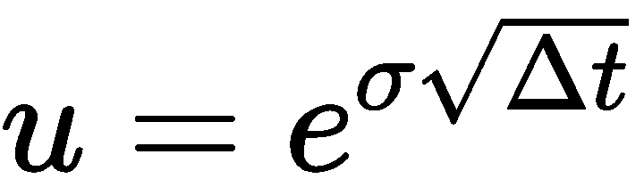


# CRR 二叉树期权定价模型的一类

除了`u`和`d`模型参数外，二项式 CRR 模型的实现与我们前面讨论的二项式树相同。

在 Python 中，让我们创建一个名为`BinomialCRROption`的类，并简单地继承`BinomialTreeOption`类。然后，我们需要做的就是用 CRR 模型中的值覆盖`setup_parameters()`方法。

`BinomialCRROption`对象的实例将调用`price()`方法，该方法调用父`BinomialTreeOption`类的所有其他方法，但被覆盖的`setup_parameters()`方法除外：

```py
In [ ]:
    import math

    """ 
    Price an option by the binomial CRR model 
    """
    class BinomialCRROption(BinomialTreeOption):
        def setup_parameters(self):
            self.u = math.exp(self.sigma * math.sqrt(self.dt))
            self.d = 1./self.u
            self.qu = (math.exp((self.r-self.div)*self.dt) - 
                       self.d)/(self.u-self.d)
            self.qd = 1-self.qu
```

再次，考虑两步二叉树。无股息支付股票的当前价格为 50 美元，波动率为 30%。假设无风险利率为每年 5%，到期时间*T*为两年。我们希望通过 CRR 模型找到执行价*K*为 52 美元的欧洲看跌期权的价值：

```py
In [ ]:
    eu_option = BinomialCRROption(
        50, 52, r=0.05, T=2, N=2, sigma=0.3, is_put=True)
In [ ]:
    print('European put:', eu_option.price())
Out[ ]:
    European put: 6.245708445206436
In [ ]:
    am_option = BinomialCRROption(50, 52, 
        r=0.05, T=2, N=2, sigma=0.3, is_put=True, is_am=True)
In [ ]:
    print('American put option price is:', am_option.price())
Out[ ]:
    American put option price is: 7.428401902704834
```

通过使用 CRR 两步二叉树模型，欧洲看跌期权和美国看跌期权的价格分别为 6.2457 美元和 7.4284 美元。

# 使用 Leisen-Reimer 树

在前面讨论的二项式模型中，我们对上升和下降状态的概率以及由此产生的风险中性概率进行了一些假设。除了我们讨论的带有 CRR 参数的二项式模型外，数学金融学中广泛讨论的其他形式的参数化包括 Jarrow-Rudd 参数化、Tian 参数化和 Leisen-Reimer 参数化。让我们来详细看看 Laseer-Reimver 模型。

Dietmar Leisen 博士和 Matthias Reimer 提出了一个二叉树模型，其目的是随着步长的增加近似于 Black-Scholes 解。它被称为**Leisen-Reimer**（**LR**）树，节点不会在每一个交替步骤重新组合。它使用了一个反演公式，以在树遍历期间获得更好的精度。

1995 年 3 月发表的论文*期权估值的二项模型——检验和改进收敛性*对该公式进行了详细解释，该论文可在[上查阅 http://papers.ssrn.com/sol3/papers.cfm?abstract_id=5976](http://papers.ssrn.com/sol3/papers.cfm?abstract_id=5976) 。我们将使用 Pezer 和 Pratt 反演函数*f*的方法二，并具有以下特征参数：


*S<sub>0</sub>*参数为当前股票价格，*K*为期权的执行价，σ为标的股票的年化波动率，*T*为期权的到期时间，*r*为年化无风险利率，*y*是股息收益率，*Δt*是每个树步骤之间的时间间隔。

# LR 二叉树期权定价模型的一类

LR 树的 Python 实现在下面的`BinomialLROption`类中给出。与`BinomialCRROption`类类似，我们只是继承`BinomialTreeOption`类，并用 LR 树模型的变量覆盖`setup_parameters`方法中的变量：

```py
In [ ]:
    import math

    """ 
    Price an option by the Leisen-Reimer tree
    """
    class BinomialLROption(BinomialTreeOption):

        def setup_parameters(self):
            odd_N = self.N if (self.N%2 == 0) else (self.N+1)
            d1 = (math.log(self.S0/self.K) +
                  ((self.r-self.div) +
                   (self.sigma**2)/2.)*self.T)/\
                (self.sigma*math.sqrt(self.T))
            d2 = (math.log(self.S0/self.K) +
                  ((self.r-self.div) -
                   (self.sigma**2)/2.)*self.T)/\
                (self.sigma * math.sqrt(self.T))

            pbar = self.pp_2_inversion(d1, odd_N)
            self.p = self.pp_2_inversion(d2, odd_N)
            self.u = 1/self.df * pbar/self.p
            self.d = (1/self.df-self.p*self.u)/(1-self.p)
            self.qu = self.p
            self.qd = 1-self.p

        def pp_2_inversion(self, z, n):
            return .5 + math.copysign(1, z)*\
                math.sqrt(.25 - .25*
                    math.exp(
                        -((z/(n+1./3.+.1/(n+1)))**2.)*(n+1./6.)
                    )
                )
```

使用我们之前使用的相同示例，我们可以使用 LR 树对选项进行定价：

```py
In [ ]:
    eu_option = BinomialLROption(
        50, 52, r=0.05, T=2, N=4, sigma=0.3, is_put=True)
In [ ]:
    print('European put:', eu_option.price())
Out[ ]:      
    European put: 5.878650106601964
In [ ]:
    am_option = BinomialLROption(50, 52, 
        r=0.05, T=2, N=4, sigma=0.3, is_put=True, is_am=True)
In [ ]:
    print('American put:', am_option.price())
Out[ ]:
    American put: 6.763641952939979
```

通过使用具有四个时间步长的 LR 二叉树模型，欧洲看跌期权和美国看跌期权的价格分别为 5.87865 美元和 6.7636 美元。

# 希腊人是免费的

在我们到目前为止所讨论的二叉树定价模型中，我们在每个时间点上下遍历树以确定节点值。从每个节点的信息中，我们可以很容易地重用这些计算值。希腊语的计算就是这样一种用法。

希腊人衡量衍生品价格的敏感性，例如期权与标的资产参数变化的关系，通常用希腊字母表示。在数学金融学中，与希腊人有关的常见名称包括α、β、δ、γ、织女星、θ和ρ。

两个特别有用的选项是 delta 和 gamma。Delta 衡量期权价格相对于标的资产价格的敏感性。Gamma 测量与基础价格相关的增量变化率。

如下图所示，在原始的两步树周围添加了一层额外的节点，使其成为一个四步树，在时间上向后扩展了两步。即使有额外的终端支付节点，所有节点都将包含与原始两步树相同的信息。我们选择的兴趣值现在位于树的中部，在 T0＝0＝T1。


请注意，在**t=0**处，存在两个额外的节点值信息，我们可以使用它们来计算 delta 公式，如下所示：

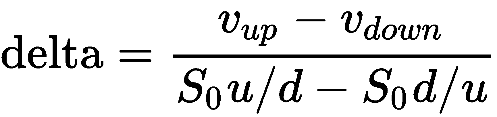

delta 公式表明，在上升和下降状态下，期权价格的差异表示为**t=0**时各股票价格之间的差异单位。

相反，伽马公式可按如下方式计算：


gamma 公式表明，上行节点和下行节点中的期权价格与初始节点值之间的差值计算为各个状态下股票价格差值的单位。

# 具有 LR 二叉树的希腊类

为了说明使用 LR 树进行的计算，让我们创建一个名为`BinomialLRWithGreeks`的新类，该类通过我们自己的`price`方法实现继承`BinomialLROption`类。

在`price`方法中，我们将首先调用父类的`setup_parameters()`方法来初始化 LR 树所需的所有变量。然而，这一次，我们还将调用`new_stock_price_tree()`方法，这是一种新方法，用于在原始树周围创建额外的节点层。

调用`begin_tree_traversal()`方法在父类中执行通常的 LR 树实现。返回的 NumPy 数组对象现在包含**t=0**处三个节点的信息，其中中间节点是期权价格。在**t=0**时处于上升和下降状态的支付分别位于数组的第一个和最后一个索引中。

有了这些信息，`price()`方法计算并返回期权价格、delta 和 gamma 值：

```py
In [ ]:
    import numpy as np

    """ 
    Compute option price, delta and gamma by the LR tree 
    """
    class BinomialLRWithGreeks(BinomialLROption):

        def new_stock_price_tree(self):
            """
            Creates an additional layer of nodes to our
            original stock price tree
            """
            self.STs = [np.array([self.S0*self.u/self.d,
                                  self.S0,
                                  self.S0*self.d/self.u])]

            for i in range(self.N):
                prev_branches = self.STs[-1]
                st = np.concatenate((prev_branches*self.u,
                                     [prev_branches[-1]*self.d]))
                self.STs.append(st)

        def price(self):
            self.setup_parameters()
            self.new_stock_price_tree()
            payoffs = self.begin_tree_traversal()

            # Option value is now in the middle node at t=0
            option_value = payoffs[len(payoffs)//2]

            payoff_up = payoffs[0]
            payoff_down = payoffs[-1]
            S_up = self.STs[0][0]
            S_down = self.STs[0][-1]
            dS_up = S_up - self.S0
            dS_down = self.S0 - S_down

            # Calculate delta value
            dS = S_up - S_down
            dV = payoff_up - payoff_down
            delta = dV/dS

            # calculate gamma value
            gamma = ((payoff_up-option_value)/dS_up - 
                     (option_value-payoff_down)/dS_down) / \
                ((self.S0+S_up)/2\. - (self.S0+S_down)/2.)

            return option_value, delta, gamma

```

使用 LR 树中的相同示例，我们可以计算 300 个时间步长的欧洲看涨期权和看跌期权的期权值和价格：

```py
In [ ]:
    eu_call = BinomialLRWithGreeks(50, 52, r=0.05, T=2, N=300, sigma=0.3)
    results = eu_call.price()
In [ ]:
    print('European call values')
    print('Price: %s\nDelta: %s\nGamma: %s' % results)
Out[ ]:
    European call values
    Price: 9.69546807138366
    Delta: 0.6392477816643529
    Gamma: 0.01764795890533088

In [ ]:
    eu_put = BinomialLRWithGreeks(
        50, 52, r=0.05, T=2, N=300, sigma=0.3, is_put=True)
    results = eu_put.price()
In [ ]:
    print('European put values')
    print('Price: %s\nDelta: %s\nGamma: %s' % results)
Out[ ]:   
    European put values
    Price: 6.747013809252746
    Delta: -0.3607522183356649
    Gamma: 0.0176479589053312
```

正如我们从`price()`方法和结果中所看到的，我们成功地从改进的二叉树中获得了关于希腊人的额外信息，而没有任何额外的计算复杂度开销。

# 期权定价中的三项式树

在二叉树中，每个节点在下一个时间步中指向另外两个节点。类似地，在三项式树中，每个节点在下一个时间步中指向其他三个节点。除了有上升和下降状态，三项式树的中间节点表示状态没有变化。当扩展到两个以上的时间步时，三项式树可以被认为是一个重组树，其中中间节点始终保留与前一个时间步相同的值。

让我们考虑波义耳三项式树，其中树被校准，使得上、下、平运动的概率，Po.t0，u，t2，d，t2，t3，m，t，t5，具有风险中性概率。m 如下：


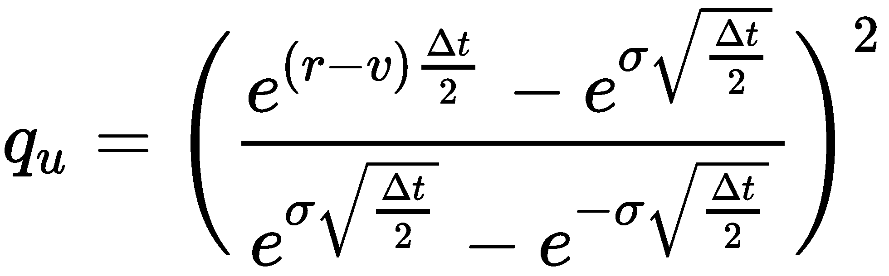


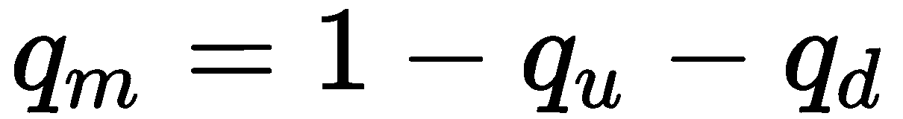

我们可以看到，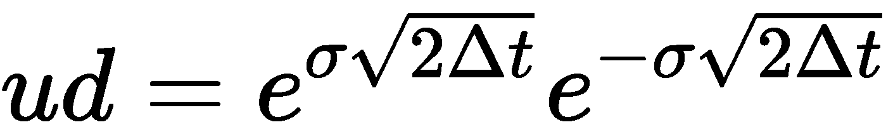重组为*m=1*。通过校准，无状态运动*m*以 1 的固定速率增长，而不是以无风险速率增长。变量*v*为年化股息收益率，*σ*为标的股票的年化波动率。

一般来说，随着要处理的节点数量的增加，当建模的时间步长较少时，三项式树比二项式树具有更好的精度，从而节省了计算速度和资源。下图用两个时间步长说明了三项式树的股价运动：


# 三项式树期权定价模型的一个类

让我们创建一个继承自`BinomialTreeOption`类的`TrinomialTreeOption`类。

`TrinomialTreeOption`的方法如下：

*   `setup_parameters()`方法实现了三项式树的模型参数。该方法编写如下：

```py
def setup_parameters(self):
    """ Required calculations for the model """
    self.u = math.exp(self.sigma*math.sqrt(2.*self.dt))
    self.d = 1/self.u
    self.m = 1
    self.qu = ((math.exp((self.r-self.div) *
                         self.dt/2.) -
                math.exp(-self.sigma *
                         math.sqrt(self.dt/2.))) /
               (math.exp(self.sigma *
                         math.sqrt(self.dt/2.)) -
                math.exp(-self.sigma *
                         math.sqrt(self.dt/2.))))**2
    self.qd = ((math.exp(self.sigma *
                         math.sqrt(self.dt/2.)) -
                math.exp((self.r-self.div) *
                         self.dt/2.)) /
               (math.exp(self.sigma *
                         math.sqrt(self.dt/2.)) -
                math.exp(-self.sigma *
                         math.sqrt(self.dt/2.))))**2.

    self.qm = 1 - self.qu - self.qd
```

*   `init_stock_price_tree()`方法建立三项式树，以包含股票价格的平坦运动。该方法编写如下：

```py
def init_stock_price_tree(self):
    # Initialize a 2D tree at t=0
    self.STs = [np.array([self.S0])]

    for i in range(self.N):
        prev_nodes = self.STs[-1]
        self.ST = np.concatenate(
            (prev_nodes*self.u, [prev_nodes[-1]*self.m,
                                 prev_nodes[-1]*self.d]))
        self.STs.append(self.ST)
```

*   `traverse_tree()`方法考虑了支付折扣后的中间节点：

```py
def traverse_tree(self, payoffs):
    # Traverse the tree backwards 
    for i in reversed(range(self.N)):
        payoffs = (payoffs[:-2] * self.qu +
                   payoffs[1:-1] * self.qm +
                   payoffs[2:] * self.qd) * self.df

        if not self.is_european:
            payoffs = self.check_early_exercise(payoffs,i)

    return payoffs
```

*   使用二叉树的相同示例，我们得到以下结果：

```py
In [ ]:
   eu_put = TrinomialTreeOption(
        50, 52, r=0.05, T=2, N=2, sigma=0.3, is_put=True)
In [ ]:
   print('European put:', eu_put.price())
Out[ ]:
   European put: 6.573565269142496
In [ ]:
   am_option = TrinomialTreeOption(50, 52, 
        r=0.05, T=2, N=2, sigma=0.3, is_put=True, is_am=True)
In [ ]:
   print('American put:', am_option.price())
Out[ ]:
   American put: 7.161349217272585
```

通过三项式树模型，我们得到欧洲和美国看跌期权的价格分别为 6.57 美元和 7.16 美元。

# 期权定价中的格

在二叉树中，每个节点在每个备选节点处重新组合。在三项式树中，每个节点在另一个节点上重新组合。重组树的这种属性也可以表示为晶格，以节省内存，而无需重新计算和存储重组的节点。

# 使用二项式格

我们将从二项式 CRR 树创建一个二项式晶格，因为在每个交替的上下节点，价格重新组合为相同的概率*ud=1*。在下图中，**S<sub>u</sub>**和**S<sub>d</sub>**与**S<sub>du</sub>**=**S<sub>ud</sub>**=**S*<sub>0</sub>***重组。该树现在可以表示为单个列表：


对于*N*步二叉树，需要一个大小为*2N+1*的列表来包含相关股票价格的信息。对于欧式期权定价，列表中的奇数支付节点表示到期时的期权价值。树向后遍历以获取选项值。对于美式期权定价，当树向后遍历时，列表的两端都会收缩，奇数节点表示任何时间步的相关股票价格。然后，可以考虑早期活动的收益。

# CRR 二项格型期权定价模型的一类

让我们通过 CRR 将二叉树定价转换为格。我们可以继承`BinomialCRROption`类（该类又继承`BinomialTreeOption`类），并创建一个名为`BinomialCRRLattice`的新类，如下所示：

```py
In [ ]:
    import numpy as np

    class BinomialCRRLattice(BinomialCRROption):

        def setup_parameters(self):
            super(BinomialCRRLattice, self).setup_parameters()
            self.M = 2*self.N + 1

        def init_stock_price_tree(self):
            self.STs = np.zeros(self.M)
            self.STs[0] = self.S0 * self.u**self.N

            for i in range(self.M)[1:]:
                self.STs[i] = self.STs[i-1]*self.d

        def init_payoffs_tree(self):
            odd_nodes = self.STs[::2]  # Take odd nodes only
            if self.is_call:
                return np.maximum(0, odd_nodes-self.K)
            else:
                return np.maximum(0, self.K-odd_nodes)

        def check_early_exercise(self, payoffs, node):
            self.STs = self.STs[1:-1]  # Shorten ends of the list
            odd_STs = self.STs[::2]  # Take odd nodes only
            if self.is_call:
                return np.maximum(payoffs, odd_STs-self.K)
            else:
                return np.maximum(payoffs, self.K-odd_STs)
```

在保留所有其他定价函数的行为的同时，晶格的实现会覆盖以下方法：

*   `setup_parameters`：重写父方法初始化父类的 CRR 参数，并将新变量`M`声明为列表大小
*   `init_stock_price_tree`：覆盖父方法，将一维 NumPy 数组设置为具有`M`大小的晶格
*   `init_payoffs_tree`和`check_early_exercise`：覆盖父方法，只考虑奇数节点的支付

使用我们的二项式 CRR 模型示例中的相同股票信息，我们可以使用二项式晶格定价对欧洲和美国看跌期权进行定价：

```py
In [ ]:
    eu_option = BinomialCRRLattice(
        50, 52, r=0.05, T=2, N=2, sigma=0.3, is_put=True)
In [ ] :
    print('European put:', eu_option.price())
Out[ ]:
    European put: 6.245708445206432
In [ ]:
    am_option = BinomialCRRLattice(50, 52, 
        r=0.05, T=2, N=2, sigma=0.3, is_put=True, is_am=True)
In [ ] :
    print("American put:", am_option.price())
Out[ ]:   
    American put: 7.428401902704828
```

通过使用 CRR 二叉树晶格定价模型，我们获得了欧洲和美国看跌期权的价格分别为 6.2457 美元和 7.428 美元。

# 使用三项式晶格

三项式晶格的工作原理与二项式晶格非常相似。由于每个节点在每个其他节点而不是备用节点上重新组合，因此不需要从列表中提取奇数节点。由于列表的大小与二项式晶格中的大小相同，因此三项式晶格定价中没有额外的存储要求，如下图所示：


# 三项式格型期权定价模型的一类

在 Python 中，让我们为继承自`TrinomialTreeOption`类的三项式晶格实现创建一个名为`TrinomialLattice`的类。

正如我们对`BinomialCRRLattice`类所做的那样，`setup_parameters`、`init_stock_price_tree`、`init_payoffs_tree`和`check_early_exercise`方法被覆盖，而不必考虑奇数节点的回报：

```py
In [ ]:
    import numpy as np

    """ 
    Price an option by the trinomial lattice 
    """
    class TrinomialLattice(TrinomialTreeOption):

        def setup_parameters(self):
            super(TrinomialLattice, self).setup_parameters()
            self.M = 2*self.N + 1

        def init_stock_price_tree(self):
            self.STs = np.zeros(self.M)
            self.STs[0] = self.S0 * self.u**self.N

            for i in range(self.M)[1:]:
                self.STs[i] = self.STs[i-1]*self.d

        def init_payoffs_tree(self):
            if self.is_call:
                return np.maximum(0, self.STs-self.K)
            else:
                return np.maximum(0, self.K-self.STs)

        def check_early_exercise(self, payoffs, node):
            self.STs = self.STs[1:-1]  # Shorten ends of the list
            if self.is_call:
                return np.maximum(payoffs, self.STs-self.K)
            else:
                return np.maximum(payoffs, self.K-self.STs)
```

使用与前面相同的示例，我们可以使用三项式晶格模型对欧洲和美国期权进行定价：

```py
In [ ]:
    eu_option = TrinomialLattice(
        50, 52, r=0.05, T=2, N=2, sigma=0.3, is_put=True)
    print('European put:', eu_option.price())
Out[ ]:
    European put: 6.573565269142496
In [ ]:
    am_option = TrinomialLattice(50, 52, 
        r=0.05, T=2, N=2, sigma=0.3, is_put=True, is_am=True)
    print('American put:', am_option.price())
Out[ ]:
    American put: 7.161349217272585
```

输出结果与从三项式树期权定价模型获得的结果一致。

# 期权定价的有限差分

有限差分格式与三项式树期权定价非常相似，其中每个节点依赖于另外三个节点，分别具有向上运动、向下运动和平坦运动。有限差分法背后的动机是 Black-Scholes**偏微分方程**（**PDE**框架的应用（涉及函数及其偏导数），其中价格*S（t）*是*f（S，t）*的函数，带有*r*作为无风险利率，*t*作为到期时间，*σ*作为标的证券的波动率：

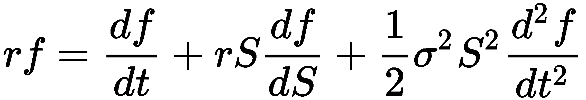

有限差分技术的收敛速度往往快于晶格，并能很好地逼近复杂的奇异选项。

为了通过有限差分在时间上向后工作来求解 PDE，将建立一个大小为*M*乘以*N*的离散时间网格，以反映一段时间内的资产价格，以便*S*和*t*在网格上的每个点上取以下值：

通过网格表示法，*f<sub>i，j</sub>=f（idS，jdt）*。*S<sub>max</sub>*是到期日*T*无法达到的适当大的资产价格。因此，*dS*和*dt*是网格中每个节点之间的间隔，分别按价格和时间递增。对于*S*的每个值，在到期时间*T*处的终止条件为*max（S− K、 0）*对于具有行使*K*和*max（K）的看涨期权− S、 0）*用于看跌期权。网格从终端条件向后遍历，遵守 PDE，同时遵守网格的边界条件，如先前练习的回报。

边界条件是在节点的最末端定义的值，其中每次在*t*处的*i=0*和*i=N*。边界处的值用于使用 PDE 迭代计算所有其他晶格节点的值。

下图给出了网格的可视化表示。随着*i*和*j*从网格左上角开始增加，价格*S*趋于网格右下角*S<sub>max</sub>*（可能的最高价格）：

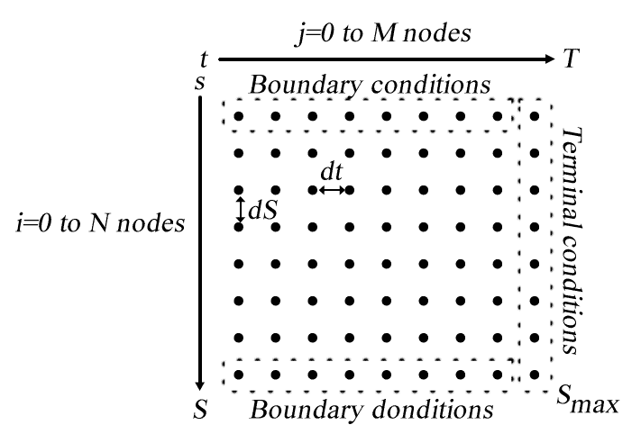

估算 PDE 的多种方法如下：

*   远期差额：

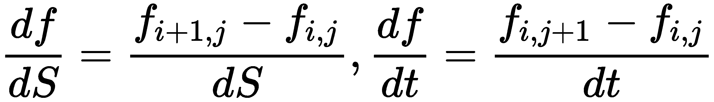

*   向后差分：

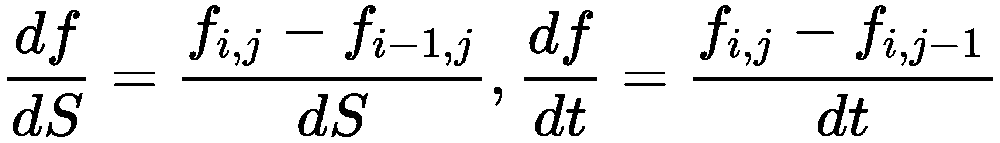

*   中心差或对称差：


*   二阶导数：

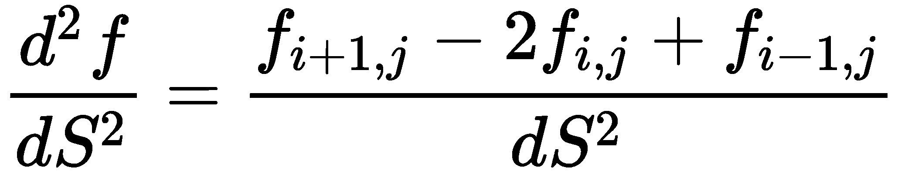

一旦我们设置了边界条件，我们现在可以使用显式、隐式或 Crank-Nicolson 方法应用迭代方法。

# 显式方法

近似于*f<sub>i，j</sub>*的显式方法由下式给出：

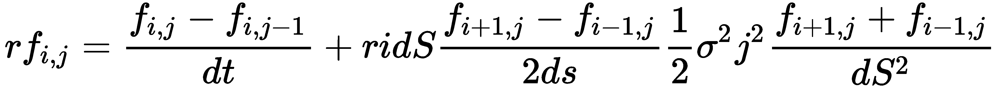

这里我们可以看到，第一个差异是相对于*t*的向后差异，第二个差异是相对于*S*的中心差异，第三个差异是相对于*S*的二阶差异。当我们重新排列这些项时，我们得到以下等式：


哪里：

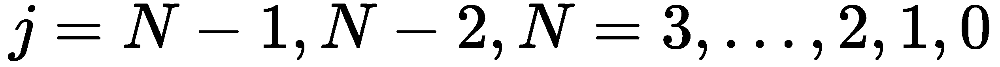


然后：

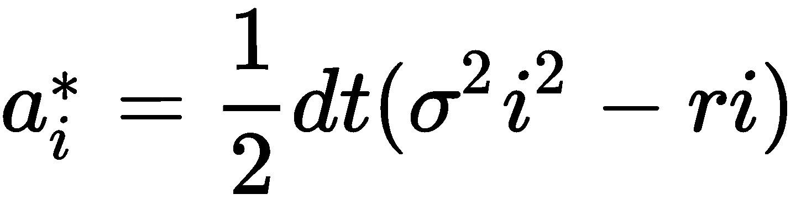


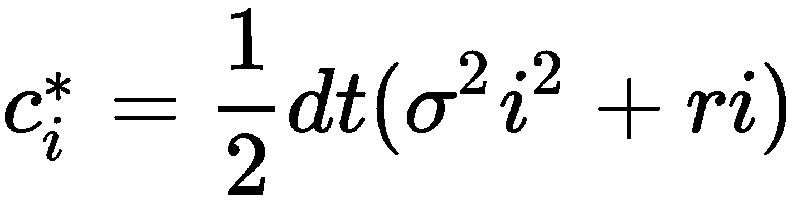

显式方法的迭代方法可用下图直观表示：


# 编写有限差分基类

因为我们将在 Python 中编写显式、隐式和 Crank-Nicolson 有限差分方法，所以让我们编写一个基类，继承这三种方法的公共属性和函数。

我们将创建一个名为`FiniteDifferences`的类，该类接受并分配`__init__`构造函数方法中所有必需的参数。`price()`方法是调用特定有限差分方案实现的入口点，将按以下顺序调用这些方法：`setup_boundary_conditions()`、`setup_coefficients()`、`traverse_grid()`和`interpolate()`。这些方法解释如下：

*   `setup_boundary_conditions`：将网格结构的边界条件设置为 NumPy 二维数组
*   `setup_coefficients`：设置用于遍历网格结构的必要系数
*   `traverse_grid`：及时向后迭代网格结构，将计算值存储到网格的第一列
*   `interpolate`：使用网格第一列上的最终计算值，该方法将对这些值进行插值，以找到与初始股价密切相关的期权价格`S0`

所有这些方法都是可以由派生类实现的抽象方法。如果我们忘记实现这些方法，将抛出异常类型`NotImplementedError`。

具有强制方法的基类应如下所示：

```py
In [ ]:
    from abc import ABC, abstractmethod
    import numpy as np

    """ 
    Base class for sharing 
    attributes and functions of FD 
    """
    class FiniteDifferences(object):

        def __init__(
            self, S0, K, r=0.05, T=1, 
            sigma=0, Smax=1, M=1, N=1, is_put=False
        ):
            self.S0 = S0
            self.K = K
            self.r = r
            self.T = T
            self.sigma = sigma
            self.Smax = Smax
            self.M, self.N = M, N
            self.is_call = not is_put

            self.i_values = np.arange(self.M)
            self.j_values = np.arange(self.N)
            self.grid = np.zeros(shape=(self.M+1, self.N+1))
            self.boundary_conds = np.linspace(0, Smax, self.M+1)

        @abstractmethod
        def setup_boundary_conditions(self):
            raise NotImplementedError('Implementation required!')

        @abstractmethod
        def setup_coefficients(self):
            raise NotImplementedError('Implementation required!')

        @abstractmethod
        def traverse_grid(self):
            """  Iterate the grid backwards in time"""
            raise NotImplementedError('Implementation required!')

        @abstractmethod
        def interpolate(self):
            """ Use piecewise linear interpolation on the initial
            grid column to get the closest price at S0.
            """
            return np.interp(
                self.S0, self.boundary_conds, self.grid[:,0])
```

**Abstract base classes** (**ABCs**) provide a way to define interfaces for a class. The `@abstractmethod()` decorator declares abstract methods that child classes should implement. Unlike Java's abstract methods, these methods may have an implementation and may be called via the `super()` mechanism from the class that overrides it.

除了这些方法之外，我们还需要分别定义`dS`和`dt`、单位时间`S`的变化以及每次迭代`T`的变化。我们可以将其作为类属性编写：

```py
@property
def dS(self):
    return self.Smax/float(self.M)

@property
def dt(self):
    return self.T/float(self.N)
```

最后，添加`price()`方法作为入口点，显示调用我们讨论的抽象方法的步骤：

```py
def price(self):
    self.setup_boundary_conditions()
    self.setup_coefficients()
    self.traverse_grid()
    return self.interpolate()
```

# 一类欧式期权定价的显式有限差分法

下面的`FDExplicitEu`类给出了使用显式方法实现有限差分的 Python 实现，它继承了`FiniteDifferences`类并覆盖了所需的实现方法：

```py
In [ ]:
    import numpy as np

    """ 
    Explicit method of Finite Differences 
    """
    class FDExplicitEu(FiniteDifferences):

        def setup_boundary_conditions(self):
            if self.is_call:
                self.grid[:,-1] = np.maximum(
                    0, self.boundary_conds - self.K)
                self.grid[-1,:-1] = (self.Smax-self.K) * \
                    np.exp(-self.r*self.dt*(self.N-self.j_values))
            else:
                self.grid[:,-1] = np.maximum(
                    0, self.K-self.boundary_conds)
                self.grid[0,:-1] = (self.K-self.Smax) * \
                    np.exp(-self.r*self.dt*(self.N-self.j_values))

        def setup_coefficients(self):
            self.a = 0.5*self.dt*((self.sigma**2) *
                                  (self.i_values**2) -
                                  self.r*self.i_values)
            self.b = 1 - self.dt*((self.sigma**2) *
                                  (self.i_values**2) +
                                  self.r)
            self.c = 0.5*self.dt*((self.sigma**2) *
                                  (self.i_values**2) +
                                  self.r*self.i_values)

        def traverse_grid(self):
            for j in reversed(self.j_values):
                for i in range(self.M)[2:]:
                    self.grid[i,j] = \
                        self.a[i]*self.grid[i-1,j+1] +\
                        self.b[i]*self.grid[i,j+1] + \
                        self.c[i]*self.grid[i+1,j+1]
```

穿越网格结构完成后，第一列包含初始资产价格在**t=0**时的现值。NumPy 的`interp`函数用于执行线性插值，以近似选项值。

除了使用线性插值作为插值方法的最常见选择外，还可以使用其他方法（如样条曲线或三次曲线）来近似选项值。

考虑一下欧洲看跌期权的例子。基本股价为 50 美元，波动率为 40%。看跌期权的执行价为 50 美元，有效期为五个月。无风险利率为 10%。

我们可以使用显式方法对该期权进行定价，其`Smax`值为`100`、`M`值为`100`、`N`值为`1000`：

```py
In [ ]:
    option = FDExplicitEu(50, 50, r=0.1, T=5./12., 
        sigma=0.4, Smax=100, M=100, N=1000, is_put=True)
    print(option.price())
Out[ ]:
    4.072882278148043
```

当`M`和`N`的其他值选择不当时会发生什么情况？

```py
In [ ]:
    option = FDExplicitEu(50, 50, r=0.1, T=5./12., 
        sigma=0.4, Smax=100, M=80, N=100, is_put=True)
    print(option.price())
Out[ ]:   
    -8.109445694129245e+35
```

有限差分格式的显式方法似乎存在不稳定性问题。

# 隐式方法

显式方法的不稳定性问题可以通过使用关于时间的正向差分来克服。逼近*f<sub>i，j</sub>*的隐式方法由下式给出：


这里可以看出，隐式近似格式和显式近似格式之间的唯一区别在于第一个差异，其中隐式格式中使用了关于*t*的正向差异。当我们重新排列术语时，我们得到以下表达式：

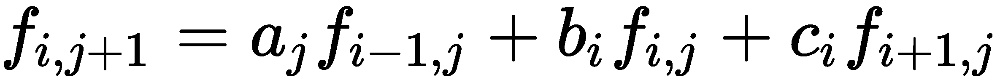

哪里：


在这里：


隐式方案的迭代方法可用下图直观表示：


从上图中，我们可以注意到，*j+1*的值需要先计算，然后才能用于下一个迭代步骤，因为网格向后遍历。在隐式格式中，可以将网格视为在每次迭代时表示线性方程组，如下所示：


通过重新排列这些项，我们得到以下等式：


线性方程组可以用*Ax=B*的形式表示，我们希望在每次迭代中求解*x*的值。由于矩阵*A*是三对角的，我们可以使用 LU 分解，其中*A=LU*，以加快计算速度。请记住，我们在[第 2](02.html)章*中使用 LU 分解解决了线性方程组，线性在金融中的重要性*。

# 用隐式有限差分法定价欧式期权的一类

隐式方案的 Python 实现在下面的`FDImplicitEu`类中给出。我们可以从前面讨论过的`FDExplicitEu`类继承显式方法的实现，并覆盖感兴趣的必要方法，即`setup_coefficients`和`traverse_grid`方法：

```py
In [ ]:
    import numpy as np
    import scipy.linalg as linalg

    """ 
    Explicit method of Finite Differences 
    """
    class FDImplicitEu(FDExplicitEu):

        def setup_coefficients(self):
            self.a = 0.5*(self.r*self.dt*self.i_values -
                          (self.sigma**2)*self.dt*\
                              (self.i_values**2))
            self.b = 1 + \
                     (self.sigma**2)*self.dt*\
                        (self.i_values**2) + \
                    self.r*self.dt
            self.c = -0.5*(self.r*self.dt*self.i_values +
                           (self.sigma**2)*self.dt*\
                               (self.i_values**2))
            self.coeffs = np.diag(self.a[2:self.M],-1) + \
                          np.diag(self.b[1:self.M]) + \
                          np.diag(self.c[1:self.M-1],1)

        def traverse_grid(self):
            """ Solve using linear systems of equations """
            P, L, U = linalg.lu(self.coeffs)
            aux = np.zeros(self.M-1)

            for j in reversed(range(self.N)):
                aux[0] = np.dot(-self.a[1], self.grid[0, j])
                x1 = linalg.solve(L, self.grid[1:self.M, j+1]+aux)
                x2 = linalg.solve(U, x1)
                self.grid[1:self.M, j] = x2
```

使用与显式方案相同的示例，我们可以使用隐式方案对欧洲看跌期权进行定价：

```py
In [ ]:
    option = FDImplicitEu(50, 50, r=0.1, T=5./12., 
        sigma=0.4, Smax=100, M=100, N=1000, is_put=True)
    print(option.price())
Out[ ]:
    4.071594188049893
In [ ]:
    option = FDImplicitEu(50, 50, r=0.1, T=5./12., 
        sigma=0.4, Smax=100, M=80, N=100, is_put=True)
    print(option.price())
Out[ ]:
    4.063684691731647
```

给定当前参数和输入数据，我们可以看到隐式格式不存在稳定性问题。

# Crank-Nicolson 方法

另一种避免不稳定性问题的方法，如显式方法所示，是使用 Crank-Nicolson 方法。Crank-Nicolson 方法使用显式和隐式方法的组合，取两者的平均值，收敛速度更快。这使我们得出以下等式：

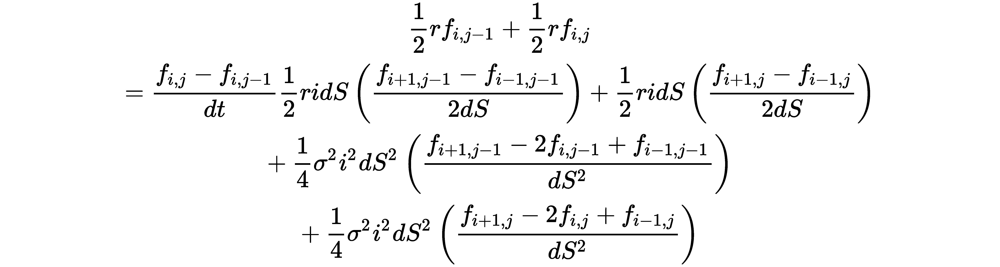

该方程也可以改写如下：


哪里：


隐式方案的迭代方法可用下图直观表示：


我们可以将方程视为矩阵形式的线性方程组：


哪里：


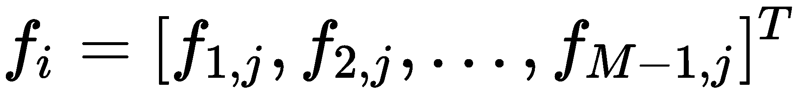

我们可以在每个迭代过程中求解矩阵*M*。

# 用 Crank-Nicolson 有限差分法定价欧式期权的一类

Crank-Nicolson 方法的 Python 实现在以下`FDCnEu`类中给出，该类继承自`FDExplicitEu`类，仅重写`setup_coefficients`和`traverse_grid`方法：

```py
In [ ]:
    import numpy as np
    import scipy.linalg as linalg

    """ 
    Crank-Nicolson method of Finite Differences 
    """
    class FDCnEu(FDExplicitEu):

        def setup_coefficients(self):
            self.alpha = 0.25*self.dt*(
                (self.sigma**2)*(self.i_values**2) - \
                self.r*self.i_values)
            self.beta = -self.dt*0.5*(
                (self.sigma**2)*(self.i_values**2) + self.r)
            self.gamma = 0.25*self.dt*(
                (self.sigma**2)*(self.i_values**2) +
                self.r*self.i_values)
            self.M1 = -np.diag(self.alpha[2:self.M], -1) + \
                      np.diag(1-self.beta[1:self.M]) - \
                      np.diag(self.gamma[1:self.M-1], 1)
            self.M2 = np.diag(self.alpha[2:self.M], -1) + \
                      np.diag(1+self.beta[1:self.M]) + \
                      np.diag(self.gamma[1:self.M-1], 1)

        def traverse_grid(self):
            """ Solve using linear systems of equations """
            P, L, U = linalg.lu(self.M1)

            for j in reversed(range(self.N)):
                x1 = linalg.solve(
                    L, np.dot(self.M2, self.grid[1:self.M, j+1]))
                x2 = linalg.solve(U, x1)
                self.grid[1:self.M, j] = x2
```

使用与显式和隐式方法相同的示例，我们可以使用 Crank-Nicolson 方法为不同时间点区间的欧洲看跌期权定价：

```py
In [ ]:
    option = FDCnEu(50, 50, r=0.1, T=5./12.,
        sigma=0.4, Smax=100, M=100, N=1000, is_put=True)
    print(option.price())
Out[ ]:   
    4.072238354486825
In [ ]:
    option = FDCnEu(50, 50, r=0.1, T=5./12., 
        sigma=0.4, Smax=100, M=80, N=100, is_put=True)
    print(option.price())
Out[ ]: 
    4.070145703042843
```

从观测值来看，Crank-Nicolson 方法不仅避免了显式格式中的不稳定性问题，而且比显式和隐式方法收敛更快。隐式方法需要更多的迭代，或更大的*N*值，以产生接近 Crank-Nicolson 方法的值。

# 奇异障碍期权的定价

有限差分在奇异期权定价中特别有用。选项的性质将决定边界条件的规格。

在本节中，我们将看一个使用 Crank-Nicolson 有限差分法为向下和向外障碍期权定价的示例。由于其相对的复杂性，其他分析方法，如蒙特卡罗方法，通常采用有利于有限差分格式。

# 穷途末路的选择

让我们来看一个下拉选项的例子。在期权有效期内的任何时候，如果标的资产价格低于*S<sub>障碍</sub>*障碍价格，则期权被视为无价值。由于在网格中，有限差分方案代表所有可能的价格点，我们只需要考虑具有以下价格范围的节点：


然后，我们可以设置如下边界条件：


# 使用 Crank-Nicolson 有限差分法的一类期权定价

让我们创建一个名为`FDCnDo`的类，它继承了前面讨论过的`FDCnEu`类。我们将在构造函数方法中考虑屏障价格，同时保持`FDCnEu`类中 Crank Nicolson 实现的其余部分不变：

```py
In [ ]:
    import numpy as np

    """
    Price a down-and-out option by the Crank-Nicolson
    method of finite differences.
    """
    class FDCnDo(FDCnEu):

        def __init__(
            self, S0, K, r=0.05, T=1, sigma=0, 
            Sbarrier=0, Smax=1, M=1, N=1, is_put=False
        ):
            super(FDCnDo, self).__init__(
                S0, K, r=r, T=T, sigma=sigma,
                Smax=Smax, M=M, N=N, is_put=is_put
            )
            self.barrier = Sbarrier
            self.boundary_conds = np.linspace(Sbarrier, Smax, M+1)
            self.i_values = self.boundary_conds/self.dS

        @property
        def dS(self):
            return (self.Smax-self.barrier)/float(self.M)
```

让我们考虑一个下拉期权的例子。基本股价为 50 美元，波动率为 40%。期权的执行价为 50 美元，有效期为五个月。无风险利率为 10%。障碍价格是 40 美元。

我们可以用`Smax`作为`100`、`M`作为`120`、`N`作为`500`对看涨期权和卖出期权进行定价：

```py
In [ ]:
    option = FDCnDo(50, 50, r=0.1, T=5./12., 
        sigma=0.4, Sbarrier=40, Smax=100, M=120, N=500)
    print(option.price())
Out[ ]:   
    5.491560552934787
In [ ]:
    option = FDCnDo(50, 50, r=0.1, T=5./12., sigma=0.4, 
        Sbarrier=40, Smax=100, M=120, N=500, is_put=True)
    print(option.price())
Out[ ]:
   0.5413635028954452
```

买入期权和卖出期权的价格分别为 5.4916 美元和 0.5414 美元。

# 有限差分美式期权定价

到目前为止，我们已经为欧洲期权和奇异期权定价。由于美式期权具有提前行使的可能性，因此此类期权的定价就不那么简单了。隐式 Crank-Nicolson 方法中需要一个迭代程序，其中本期早期行权的收益考虑了前期早期行权的收益。在 Crank-Nicolson 方法中，提出了美式期权定价的 Gauss-Siedel 迭代法。

回想一下在[第 2 章](02.html)*【金融学中线性的重要性*中，我们介绍了以*Ax=B*形式求解线性方程组的高斯-西格德方法。这里，将矩阵*A*分解为*A=L+U*，其中*L*为下三角矩阵，*U*为上三角矩阵。让我们来看一个 4×4 矩阵的例子，{ Tyt14}。

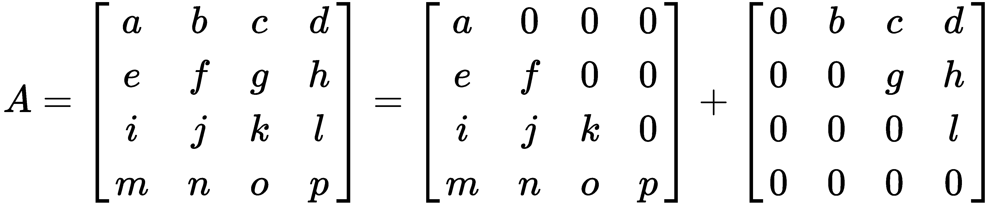

然后迭代获得解决方案，如下所示：


我们可以将 Gauss-Siedel 方法应用于我们的 Crank-Nicolson 实现，如下所示：


该等式满足早期行使特权等式：

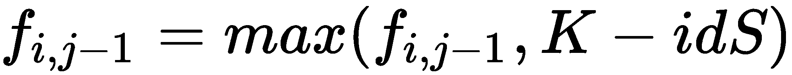

# 用 Crank-Nicolson 有限差分法定价美式期权的一类

让我们创建一个名为`FDCnAm`的类，该类继承自`FDCnEu`类，这是 Crank-Nicolson 方法对欧洲期权定价的对应方法。`setup_coefficients`方法可以重复使用，同时覆盖所有其他方法，以包含先前练习的收益（如果有）。

构造函数`__init__()`和`setup_boundary_conditions()`方法在`FDCnAm`类中给出：

```py
In [ ]:
    import numpy as np
    import sys

    """ 
    Price an American option by the Crank-Nicolson method 
    """
    class FDCnAm(FDCnEu):

        def __init__(self, S0, K, r=0.05, T=1, 
                Smax=1, M=1, N=1, omega=1, tol=0, is_put=False):
            super(FDCnAm, self).__init__(S0, K, r=r, T=T, 
                sigma=sigma, Smax=Smax, M=M, N=N, is_put=is_put)
            self.omega = omega
            self.tol = tol
            self.i_values = np.arange(self.M+1)
            self.j_values = np.arange(self.N+1)

        def setup_boundary_conditions(self):
            if self.is_call:
                self.payoffs = np.maximum(0, 
                    self.boundary_conds[1:self.M]-self.K)
            else:
                self.payoffs = np.maximum(0, 
                    self.K-self.boundary_conds[1:self.M])

            self.past_values = self.payoffs
            self.boundary_values = self.K * np.exp(
                    -self.r*self.dt*(self.N-self.j_values))
```

接下来，在同一类中实现`traverse_grid()`方法：

```py
def traverse_grid(self):
    """ Solve using linear systems of equations """
    aux = np.zeros(self.M-1)
    new_values = np.zeros(self.M-1)

    for j in reversed(range(self.N)):
        aux[0] = self.alpha[1]*(self.boundary_values[j] +
                                self.boundary_values[j+1])
        rhs = np.dot(self.M2, self.past_values) + aux
        old_values = np.copy(self.past_values)
        error = sys.float_info.max

        while self.tol < error:
            new_values[0] = \
                self.calculate_payoff_start_boundary(
                    rhs, old_values)    

            for k in range(self.M-2)[1:]:
                new_values[k] = \
                    self.calculate_payoff(
                        k, rhs, old_values, new_values)                  

            new_values[-1] = \
                self.calculate_payoff_end_boundary(
                    rhs, old_values, new_values)

            error = np.linalg.norm(new_values-old_values)
            old_values = np.copy(new_values)

        self.past_values = np.copy(new_values)

    self.values = np.concatenate(
        ([self.boundary_values[0]], new_values, [0]))
```

在`while`循环的每个迭代过程中，在考虑开始和结束边界的情况下计算收益。此外，`new_values`不断被基于现有值和以前值的新支付计算所取代。

在索引为 0 的起始边界处，将使用忽略的 alpha 值计算收益。在类内实现`calculate_payoff_start_boundary()`方法：

```py
 def calculate_payoff_start_boundary(self, rhs, old_values):
    payoff = old_values[0] + \
        self.omega/(1-self.beta[1]) * \
            (rhs[0] - \
             (1-self.beta[1])*old_values[0] + \
             self.gamma[1]*old_values[1])

    return max(self.payoffs[0], payoff)       
```

在最后一个索引所在的结束边界处，使用忽略的 gamma 值计算收益。在类内实现`calculate_payoff_end_boundary()`方法：

```py
 def calculate_payoff_end_boundary(self, rhs, old_values, new_values):
    payoff = old_values[-1] + \
        self.omega/(1-self.beta[-2]) * \
            (rhs[-1] + \
             self.alpha[-2]*new_values[-2] - \
             (1-self.beta[-2])*old_values[-1])

    return max(self.payoffs[-1], payoff)
```

对于不在边界的支付，通过考虑 alpha 和 gamma 值来计算支付。在类内实现`calculate_payoff()`方法：

```py
def calculate_payoff(self, k, rhs, old_values, new_values):
    payoff = old_values[k] + \
        self.omega/(1-self.beta[k+1]) * \
            (rhs[k] + \
             self.alpha[k+1]*new_values[k-1] - \
             (1-self.beta[k+1])*old_values[k] + \
             self.gamma[k+1]*old_values[k+1])

    return max(self.payoffs[k], payoff)
```

由于新变量`values`将我们的终端支付值包含为一维数组，因此使用以下代码覆盖父`interpolate`方法来解释此更改：

```py
def interpolate(self):
    # Use linear interpolation on final values as 1D array
    return np.interp(self.S0, self.boundary_conds, self.values)
```

Gauss-Siedel 方法中使用公差参数作为收敛准则。`omega`变量为过松弛参数。较高的`omega`值提供更快的收敛速度，但这也带来了更高的算法不收敛的可能性。

让我们给一个标的资产价格为 50、波动率为 40%、执行价格为 50、无风险利率为 10%、到期日为 5 个月的美式看涨期权定价。我们选择`Smax`值`100`、`M`为`100`、`N`为`42`、`omega`参数值`1.2`、公差值`0.001`：

```py
In [ ]:
    option = FDCnAm(50, 50, r=0.1, T=5./12., 
        sigma=0.4, Smax=100, M=100, N=42, omega=1.2, tol=0.001)
    print(option.price())
Out[ ]:
    6.108682815392217
In [ ]:
    option = FDCnAm(50, 50, r=0.1, T=5./12., sigma=0.4, Smax=100, 
        M=100, N=42, omega=1.2, tol=0.001, is_put=True)
    print(option.price())
Out[ ]:   
    4.277764229383736
```

使用 Crank-Nicolson 方法计算的美国股票期权的看涨期权和看跌期权的价格分别为 6.109 美元和 4.2778 美元。

# 综合起来——隐含波动率建模

到目前为止，在我们学习的期权定价方法中，许多参数被假定为常数：利率、执行价格、股息和波动性。这里，兴趣的参数是波动性。在定量研究中，波动率用于预测价格趋势。

为了推导隐含波动率，我们需要参考[第 3 章](03.html)*、金融中的非线性*，其中我们讨论了非线性函数的寻根方法。在下一个示例中，我们将使用数值程序的二分法创建隐含波动率曲线。

# AAPL 美式看跌期权的隐含波动率

让我们考虑股票期权 T0（Apple ToeT1）的期权数据（Apple T2 AtApple To3Tr），它是在 2014 年 10 月 3 日结束时收集的。下表提供了这些详细信息。该期权于 2014 年 12 月 20 日到期。所列价格是出价和要价的中点：

| **执行价** | **买入价** | **卖出价** |
| 75 | 30 | 0.16 |
| 80 | 24.55 | 0.32 |
| 85 | 20.1 | 0.6 |
| 90 | 15.37 | 1.22 |
| 92.5 | 10.7 | 1.77 |
| 95 | 8.9 | 2.54 |
| 97.5 | 6.95 | 3.55 |
| 100 | 5.4 | 4.8 |
| 105 | 4.1 | 7.75 |
| 110 | 2.18 | 11.8 |
| 115 | 1.05 | 15.96 |
| 120 | 0.5 | 20.75 |
| 125 | 0.26 | 25.8 |

AAPL 的最后交易价格为 99.62，利率为 2.48%，股息率为 1.82%。美国期权 78 天后到期。

使用这些信息，让我们创建一个名为`ImpliedVolatilityModel`的新类，该类在构造函数中接受股票期权的参数。如果需要，导入我们为本章前面章节中介绍的 LR 二叉树创建的`BinomialLROption`类，*是 LR 二叉树期权定价模型*的类。我们在[第 3 章](03.html)*中介绍的`bisection`功能，金融中的非线性*也是必需的。

`option_valuation()`方法接受`K`履约价格和`sigma`波动率值来计算期权的价值。在本例中，我们使用的是`BinomialLROption`定价方法。

`get_implied_volatilities()`方法接受一份履约和期权价格清单，通过`bisection`方法计算每个可用价格的隐含波动率。因此，两个列表的长度必须相同。

`ImpliedVolatilityModel`类的 Python 代码如下：

```py
In [ ]:
    """
    Get implied volatilities from a Leisen-Reimer binomial
    tree using the bisection method as the numerical procedure.
    """
    class ImpliedVolatilityModel(object):

        def __init__(self, S0, r=0.05, T=1, div=0, 
                     N=1, is_put=False):
            self.S0 = S0
            self.r = r
            self.T = T
            self.div = div
            self.N = N
            self.is_put = is_put

        def option_valuation(self, K, sigma):
            """ Use the binomial Leisen-Reimer tree """
            lr_option = BinomialLROption(
                self.S0, K, r=self.r, T=self.T, N=self.N, 
                sigma=sigma, div=self.div, is_put=self.is_put
            )
            return lr_option.price()

        def get_implied_volatilities(self, Ks, opt_prices):
            impvols = []
            for i in range(len(strikes)):
                # Bind f(sigma) for use by the bisection method
                f = lambda sigma: \
                    self.option_valuation(Ks[i], sigma)-\
                    opt_prices[i]
                impv = bisection(f, 0.01, 0.99, 0.0001, 100)[0]
                impvols.append(impv)

            return impvols

```

导入上一章讨论过的`bisection`函数：

```py
In [ ]:
    def bisection(f, a, b, tol=0.1, maxiter=10):
        """
        :param f: The function to solve
        :param a: The x-axis value where f(a)<0
        :param b: The x-axis value where f(b)>0
        :param tol: The precision of the solution
        :param maxiter: Maximum number of iterations
        :return: The x-axis value of the root,
                    number of iterations used
        """
        c = (a+b)*0.5  # Declare c as the midpoint ab
        n = 1  # Start with 1 iteration
        while n <= maxiter:
            c = (a+b)*0.5
            if f(c) == 0 or abs(a-b)*0.5 < tol:
                # Root is found or is very close
                return c, n

            n += 1
            if f(c) < 0:
                a = c
            else:
                b = c

        return c, n
```

使用此模型，我们使用这组特定数据找出美式看跌期权的隐含波动率：

```py
In [ ]:
    strikes = [75, 80, 85, 90, 92.5, 95, 97.5, 
               100, 105, 110, 115, 120, 125]
    put_prices = [0.16, 0.32, 0.6, 1.22, 1.77, 2.54, 3.55, 
                  4.8, 7.75, 11.8, 15.96, 20.75, 25.81]
In [ ]:
    model = ImpliedVolatilityModel(
        99.62, r=0.0248, T=78/365., div=0.0182, N=77, is_put=True)
    impvols_put = model.get_implied_volatilities(strikes, put_prices)
```

隐含波动率值现在存储在`impvols_put`变量中作为`list`对象。让我们将这些值与执行价格进行对比，以获得隐含波动率曲线：

```py
In [ ]:
    %matplotlib inline
    import matplotlib.pyplot as plt

    plt.plot(strikes, impvols_put)
    plt.xlabel('Strike Prices')
    plt.ylabel('Implied Volatilities')
    plt.title('AAPL Put Implied Volatilities expiring in 78 days')
    plt.show()
```

这将给我们带来波动微笑，如下图所示。在这里，我们用 77 个步骤对 LR 树进行建模，每个步骤代表一天：

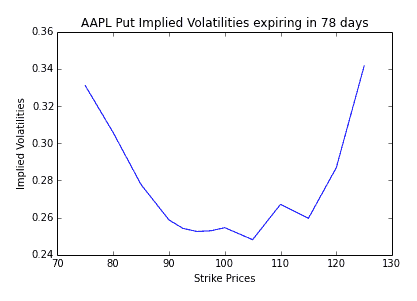

当然，每天为期权定价可能并不理想，因为市场会以几分之一毫秒的速度变化。与直接从市场价格观察到的实际波动率值相反，我们使用二分法来解决二叉树隐含的隐含波动率。

我们是否应该将该曲线与多项式曲线拟合，以确定潜在的套利机会？或者通过外推该曲线，从“远超货币”和“远超货币”期权的隐含波动性中进一步洞察潜在机会？好吧，这些问题是给像你这样的期权交易者去发现的！

# 总结

在本章中，我们研究了衍生品定价中的一些数值程序，其中最常见的是期权。其中一个过程是使用树，二项式树是建模资产信息的最简单结构，其中一个节点在每个时间步扩展到另外两个节点，分别表示上升状态和下降状态。在三项式树中，每个节点在每个时间步长中扩展到其他三个节点，分别表示向上状态、向下状态和不移动状态。当树向上遍历时，在每个节点上计算并表示基础资产。然后，期权采用这棵树的结构，从终端收益开始，这棵树向后并向根方向移动，从而收敛到当前的贴现期权价格。除了二项式和三项式树外，树还可以采用 CRR、Jarrow-Rudd、Tian 或 LR 参数的形式。

通过在树的周围添加另一层节点，我们引入了额外的信息，从中我们可以导出希腊语，如 delta 和 gamma，而不会产生额外的计算成本。

格被引入作为一种比二叉树和三叉树节省存储成本的方法。在 lattice pricing 中，具有新信息的节点只保存一次，然后在不需要更改信息的节点上重新使用。

我们还讨论了期权定价中的有限差分格式，包括终端条件和边界条件。从终端条件出发，网格使用显式方法、隐式方法和 Crank-Nicolson 方法在时间上向后遍历。除了对欧洲和美国期权进行定价外，有限差分定价方案还可用于对奇异期权进行定价，我们在这里看了一个对向下和向外障碍期权进行定价的示例。

通过引入[第 3 章](03.html)*中学习的二分法寻根法、金融中的非线性*以及本章中的二项式 LR 树模型，我们使用美式期权的市场价格创建了一条隐含波动率曲线，以供进一步研究。

在下一章中，我们将了解利率和衍生品的建模。