# 五、利率和衍生品建模

利率影响各级经济活动。中央银行，包括**美联储**（非正式称为**美联储**）将利率作为影响经济活动的政策工具。利率衍生品深受需要定制现金流需求或对利率变动有特定看法的投资者的欢迎。

利率衍生品交易员面临的关键挑战之一是为这些产品制定一套良好而稳健的定价程序。这涉及到理解单个利率运动的复杂行为。金融研究中已经提出了几种利率模型。金融学中研究的一些常见模型是 Vasicek、CIR 和 Hull-White 模型。这些利率模型涉及对短期利率进行建模，并依赖于各种因素（或不确定性来源），其中大多数仅使用一个因素。提出了双因素和多因素利率模型。

在本章中，我们将介绍以下主题：

*   理解收益率曲线
*   零息债券的估值
*   引导收益率曲线
*   计算远期利率
*   计算债券的到期收益率和价格
*   用 Python 计算键长和凸度
*   短期利率模型
*   Vasicek 短期利率模型
*   债券期权的类型
*   可赎回债券期权的定价

# 固定收益证券

公司和政府发行固定收益证券作为筹集资金的手段。这些债务的所有者借钱，并期望在债务到期时收到本金。希望借钱的发行人可在债务存续期内，在预先规定的时间发行固定金额的利息支付。

美国国债、票据和债券等债务证券的持有人面临发行人违约的风险。人们认为，联邦政府和市政府面临的违约风险最小，因为它们可以轻松提高税收，创造更多资金来偿还未偿债务。

大多数债券每半年支付一次固定金额的利息，而有些债券每季度或每年支付一次。这些利息支付也被称为息票。它们被引用为债券年面值或票面金额的百分比。

例如，息票率为 5%的 5 年期 10000 美元国债每年支付 500 美元的息票，或每 6 个月支付 250 美元的息票，直至到期日。如果利率下降，新国债支付 3%的票面利率，新债券的购买者每年只能获得 300 美元的票面利率，而 5%债券的现有持有人每年将继续获得 500 美元的票面利率。由于债券的特性会影响其价格，因此它们与当前的利率水平密切相关，而利率水平与之相反：债券的价值随着利率的升高而降低。随着利率下降，债券价格上升。

# 屈服曲线

在正常收益率曲线环境中，长期利率高于短期利率。由于投资者面临更高的违约风险，他们希望在贷款期限更长的情况下获得更高的回报。正常或正收益率曲线称为向上倾斜，如下图所示：


在某些经济条件下，收益率曲线可以反转。长期利率低于短期利率。当货币供应紧张时，就会出现这种情况。投资者愿意放弃长期收益，在短期内保存财富。在高通胀期间，当通胀率超过票面利率时，可能会观察到负利率。投资者愿意在短期内支付，只是为了确保他们的长期财富。反向收益率曲线称为向下倾斜，如下图所示：

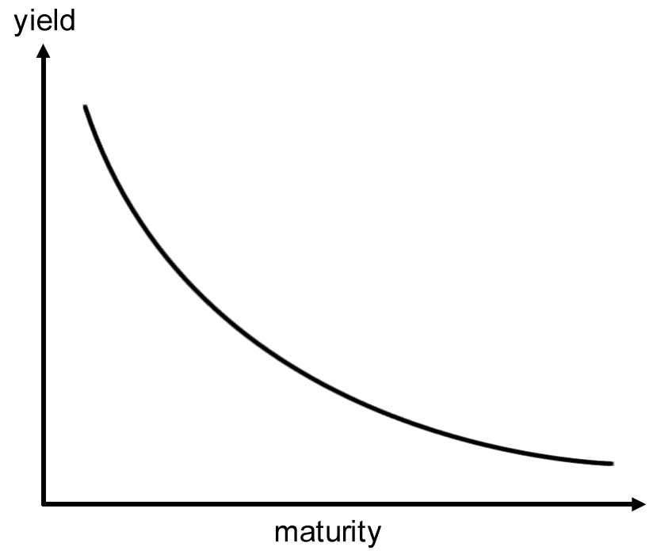

# 零息债券的估值

**零息债券**是一种不支付任何定期利息的债券，除非到期时本金或面值得到偿还。零息债券也称为**纯贴现债券**。

零息债券的估值如下：


这里，*y*是债券的年复合收益率或利率，*t*是债券到期的剩余时间。

让我们来看一个面值为 100 美元的五年零息票债券的例子。收益率为 5%，每年复利。价格计算如下：


可以使用一个简单的 Python 零息债券计算器来说明此示例：

```py
In [ ]:
    def zero_coupon_bond(par, y, t):
        """
        Price a zero coupon bond.

        :param par: face value of the bond.
        :param y: annual yield or rate of the bond.
        :param t: time to maturity, in years.
        """
        return par/(1+y)**t
```

使用前面的示例，我们得到以下结果：

```py
In [ ]:
    print(zero_coupon_bond(100, 0.05, 5))
Out[ ]:
    78.35261664684589

```

在前面的例子中，我们假设投资者能够以 5%的现行年利率投资 78.35 美元，为期 5 年，每年复利。

现在我们有了一个零息票债券计算器，我们可以使用它通过引导收益率曲线来确定零利率，如下一节所述。

# 即期和零利率

随着复利频率的增加（比如，从每年复利到每天复利），货币的未来价值达到了指数极限。也就是说，当以持续复合利率*R*投资一段时间*T*时，100 美元今天的价值将达到 100 美元*e*<sup>*RT*</sup>的未来价值。如果我们对未来某个时间支付 100 美元的证券进行贴现，*T*，采用连续复合贴现率，*R*，其在时间零点的价值为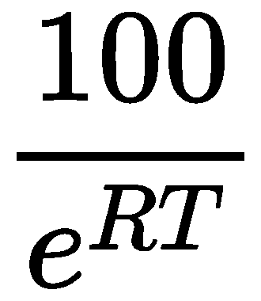。该利率称为**即期利率**。

即期利率代表了我们现在想借钱还是想借钱的几个到期日的当前利率。零利率代表零息债券的内部收益率。

通过推导不同期限债券的即期利率，我们可以通过使用零息票债券的自举过程构建当前收益率曲线。

# 引导收益率曲线

短期即期利率可以直接从各种短期证券中获得，如零息债券、国库券、票据和欧洲美元存款。然而，长期即期利率通常是通过自举过程从长期债券的价格中衍生出来的，同时考虑到与息票支付日期相对应的到期即期利率。在获得短期和长期即期利率后，可以构建收益率曲线。

# 收益率曲线的自举示例

让我们用一个例子来说明收益率曲线的自举。下表列出了不同期限和价格的债券：

| 

**债券面值（美元）**

 | 

**到期时间（年）**

 | 

**美元年票**

 | 

**美元债券现金价格**

 |
| --- | --- | --- | --- |
| 100 | 0.25 | 0 | 97.50 |
| 100 | 0.50 | 0 | 94.90 |
| 100 | 1 | 0 | 90 |
| 100 | 1.50 | 8. | 96 |
| 100 | 2 | 12 | 101.60 |

今天，一名投资者以 97.50 美元的价格购买三个月期零息债券，将获得 2.50 美元的利息。三个月即期汇率的计算方法如下：


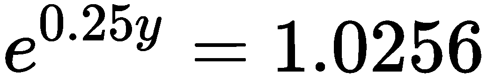


因此，连续复利的 3 个月零利率为 10.127%。零息债券的即期利率如下表所示：

| 

**到期时间（年）**

 | 

**即期汇率（百分比）**

 |
| --- | --- |
| 0.25 | 10.127 |
| 0.50 | 10.469 |
| 1 | 10.536 |

使用这些即期利率，我们现在可以对 1.5 年期债券定价如下：


*y*的值可以通过重新排列方程来轻松求解，如下所示：


1.5 年期债券的即期利率为 10.681%，我们可以用它来为 2 年期债券定价，每半年息票 6 美元，如下所示：

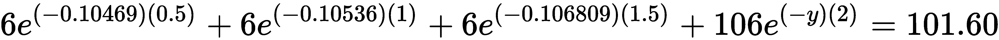

重新排列方程并求解*y*得到 2 年期债券的即期利率为 10.808。

通过按到期日的递增顺序计算每种债券的即期利率并在下一次迭代中使用的迭代过程，我们获得了不同到期日的即期利率列表，可用于构建收益率曲线。

# 编写收益率曲线引导类

编写 Python 代码以引导收益率曲线并使用绘图输出运行的步骤概述如下：

1.  创建一个名为`BootstrapYieldCurve`的类，该类将在 Python 代码中实现收益率曲线的引导：

```py
import math

class BootstrapYieldCurve(object):    

    def __init__(self):
        self.zero_rates = dict()
        self.instruments = dict()
```

2.  在构造函数中，两个`zero_rates`和`instruments`字典变量被声明，并将被几种方法使用，如下所示：

*   添加一个名为`add_instrument()`的方法，该方法将债券信息的元组附加到`instruments`字典中，并按到期时间进行索引。该方法编写如下：

```py
def add_instrument(self, par, T, coup, price, compounding_freq=2):
    self.instruments[T] = (par, coup, price, compounding_freq)
```

*   添加一个名为`get_maturities()`的方法，该方法简单地以升序返回可用到期日的列表。该方法编写如下：

```py
def get_maturities(self):
    """ 
    :return: a list of maturities of added instruments 
    """
    return sorted(self.instruments.keys())
```

*   添加一个名为`get_zero_rates()`的方法，该方法引导收益率曲线，沿该收益率曲线计算即期利率，并按到期日升序返回零利率列表。该方法编写如下：

```py
def get_zero_rates(self):
    """ 
    Returns a list of spot rates on the yield curve.
    """
    self.bootstrap_zero_coupons()    
    self.get_bond_spot_rates()
    return [self.zero_rates[T] for T in self.get_maturities()]
```

*   添加一个名为`bootstrap_zero_coupons()`的方法，该方法计算给定零息债券的即期利率，并将其添加到`zero_rates`字典中，以到期日为索引。该方法编写如下：

```py
def bootstrap_zero_coupons(self):
    """ 
    Bootstrap the yield curve with zero coupon instruments first.
    """
    for (T, instrument) in self.instruments.items():
        (par, coup, price, freq) = instrument
        if coup == 0:
            spot_rate = self.zero_coupon_spot_rate(par, price, T)
            self.zero_rates[T] = spot_rate  
```

*   添加名为`zero_coupon_spot_rate()`的方法，用于计算零息债券的即期利率。此方法由`bootstrap_zero_coupons()`调用，编写如下：

```py
def zero_coupon_spot_rate(self, par, price, T):
    """ 
    :return: the zero coupon spot rate with continuous compounding.
    """
    spot_rate = math.log(par/price)/T
    return spot_rate
```

*   添加一个名为`get_bond_spot_rates()`的方法，该方法计算非零息债券的即期利率，并将其添加到`zero_rates`字典中，以到期日为索引。该方法编写如下：

```py
def get_bond_spot_rates(self):
    """ 
    Get spot rates implied by bonds, using short-term instruments.
    """
    for T in self.get_maturities():
        instrument = self.instruments[T]
        (par, coup, price, freq) = instrument
        if coup != 0:
            spot_rate = self.calculate_bond_spot_rate(T, instrument)
            self.zero_rates[T] = spot_rate
```

*   增加一个名为`calculate_bond_spot_rate()`的方法，`get_bond_spot_rates()`调用该方法来计算特定到期日的即期汇率。该方法编写如下：

```py
def calculate_bond_spot_rate(self, T, instrument):
    try:
        (par, coup, price, freq) = instrument
        periods = T*freq
        value = price
        per_coupon = coup/freq
        for i in range(int(periods)-1):
            t = (i+1)/float(freq)
            spot_rate = self.zero_rates[t]
            discounted_coupon = per_coupon*math.exp(-spot_rate*t)
            value -= discounted_coupon

        last_period = int(periods)/float(freq)        
        spot_rate = -math.log(value/(par+per_coupon))/last_period
        return spot_rate
    except:
        print("Error: spot rate not found for T=", t)
```

3.  实例化`BootstrapYieldCurve`类并从上表中添加每个键的信息：

```py
In [ ]:
    yield_curve = BootstrapYieldCurve()
    yield_curve.add_instrument(100, 0.25, 0., 97.5)
    yield_curve.add_instrument(100, 0.5, 0., 94.9)
    yield_curve.add_instrument(100, 1.0, 0., 90.)
    yield_curve.add_instrument(100, 1.5, 8, 96., 2)
    yield_curve.add_instrument(100, 2., 12, 101.6, 2)
In [ ]:
    y = yield_curve.get_zero_rates()
    x = yield_curve.get_maturities()
```

4.  在类实例中调用`get_zero_rates()`方法将返回一个即期汇率列表，其顺序与到期日相同，分别存储在`x`和`y`变量中。发出以下 Python 代码在图形上绘制`x`和`y`：

```py
In [ ]:
    %pylab inline

    fig = plt.figure(figsize=(12, 8))
    plot(x, y)
    title("Zero Curve") 
    ylabel("Zero Rate (%)")
    xlabel("Maturity in Years");
```

5.  我们得到以下收益率曲线：

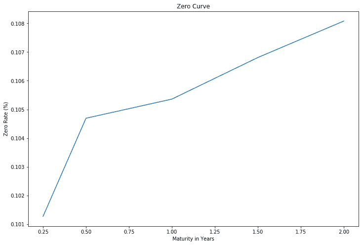

在正常收益率曲线环境中，利率随着到期日的增加而增加，我们获得了向上倾斜的收益率曲线。

# 远期汇率

计划稍后投资的投资者可能会好奇地想知道未来利率会是什么样子，正如今天的利率期限结构所暗示的那样。例如，你可能会问，*一年后的即期汇率是多少？*为了回答这个问题，您可以使用以下公式计算*T<sub>1</sub>*和*T<sub>2</sub>*期间的远期利率：


其中，*r<sub>1</sub>*和*r<sub>2</sub>*分别为*T<sub>1</sub>*和*T<sub>2</sub>*期间的连续复合年利率。

以下`ForwardRates`类帮助我们从即期汇率列表生成远期汇率列表：

```py
class ForwardRates(object):

    def __init__(self):
        self.forward_rates = []
        self.spot_rates = dict()

    def add_spot_rate(self, T, spot_rate):
        self.spot_rates[T] = spot_rate

    def get_forward_rates(self):
        """
        Returns a list of forward rates
        starting from the second time period.
        """
        periods = sorted(self.spot_rates.keys())
        for T2, T1 in zip(periods, periods[1:]):
            forward_rate = self.calculate_forward_rate(T1, T2)
            self.forward_rates.append(forward_rate)

        return self.forward_rates

    def calculate_forward_rate(self, T1, T2):
        R1 = self.spot_rates[T1]
        R2 = self.spot_rates[T2]
        forward_rate = (R2*T2-R1*T1)/(T2-T1)
        return forward_rate        
```

使用从前面收益率曲线得出的即期汇率，我们得到以下结果：

```py
In [ ]:
    fr = ForwardRates()
    fr.add_spot_rate(0.25, 10.127)
    fr.add_spot_rate(0.50, 10.469)
    fr.add_spot_rate(1.00, 10.536)
    fr.add_spot_rate(1.50, 10.681)
    fr.add_spot_rate(2.00, 10.808)
In [ ]:
    print(fr.get_forward_rates())
Out[ ]:
    [10.810999999999998, 10.603, 10.971, 11.189]
```

调用`ForwardRates`类的`get_forward_rates()`方法返回一个从下一个时间段开始的远期利率列表。

# 计算到期收益率

**到期收益率**（**年初至今**）衡量债券隐含的利率，该利率考虑了所有未来息票支付的现值和本金。假设债券持有人可以按年初至今利率投资收到的息票，直至债券到期；根据风险中性预期，收到的付款应与债券支付的价格相同。

让我们来看一个 5.75%债券的例子，它将在 1.5 年内成熟，票面价值为 100。债券价格为 95.0428 美元，息票每半年支付一次。定价公式可表述如下：


在这里：

*   *c*是每个时间段支付的票面金额
*   *T*为付款期限，以年为单位
*   *n*为优惠券支付频率
*   *y*是我们感兴趣解决的 YTM

求解 YTM 通常是一个复杂的过程，大多数 bond YTM 计算器使用牛顿法作为迭代过程。

债券 YTM 计算器通过以下`bond_ytm()`功能进行说明：

```py
import scipy.optimize as optimize

def bond_ytm(price, par, T, coup, freq=2, guess=0.05):
    freq = float(freq)
    periods = T*2
    coupon = coup/100.*par
    dt = [(i+1)/freq for i in range(int(periods))]
    ytm_func = lambda y: \
        sum([coupon/freq/(1+y/freq)**(freq*t) for t in dt]) +\
        par/(1+y/freq)**(freq*T) - price

    return optimize.newton(ytm_func, guess)
```

请记住，我们在[第 3 章](03.html)、*金融中的非线性*中介绍了牛顿方法和其他非线性函数根解算器的使用。对于这个 YTM 计算器函数，我们使用`scipy.optimize`包来求解 YTM。

使用 bond 示例中的参数，我们得到以下结果：

```py
In [ ] :
    ytm = bond_ytm(95.0428, 100, 1.5, 5.75, 2)
In [ ]:
    print(ytm)
Out[ ]:
    0.09369155345239522
```

该债券的年收益率为 9.369%。现在我们有了一个债券 YTM 计算器，它可以帮助我们比较债券与其他证券的预期回报。

# 计算债券的价格

当 YTM 已知时，我们可以用与定价方程相同的方法得到债券价格。这是通过`bond_price()`功能实现的：

```py
In [ ]:
    def bond_price(par, T, ytm, coup, freq=2):
        freq = float(freq)
        periods = T*2
        coupon = coup/100.*par
        dt = [(i+1)/freq for i in range(int(periods))]
        price = sum([coupon/freq/(1+ytm/freq)**(freq*t) for t in dt]) + \
            par/(1+ytm/freq)**(freq*T)
        return price
```

插入前面示例中相同的值，我们得到以下结果：

```py
In [ ]:
    price = bond_price(100, 1.5, ytm, 5.75, 2)
    print(price)
Out[ ]:   
    95.04279999999997
```

这为我们提供了与前面示例中讨论的相同的原始债券价格，*计算到期收益率*。通过`bond_ytm()`和`bond_price()`函数，我们可以将其应用于债券定价中的进一步用途，例如找到债券的修改期限和凸性。债券的这两个特征对债券交易者制定各种交易策略和对冲风险非常重要。

# 债券期限

久期是衡量债券价格对收益率变化的敏感性指标。一些持续时间度量是有效持续时间、Macaulay 持续时间和修改的持续时间。我们将讨论的期限类型是修改期限，它衡量债券价格相对于收益率百分比变化的百分比变化（通常为 1%或 100**基点**（**基点**）。

债券的期限越长，它对收益率变化越敏感。相反，债券的期限越短，其对收益率变化的敏感性就越低。

债券的修改期限可视为价格与收益率关系的一阶导数：


在这里：

*   *dY*是给定的产量变化
*   *P<sup>−</sup>* 是收益率下降*dY*后的债券价格
*   *P<sup>+</sup>*是收益率增加*dY*后的债券价格
*   *P<sub>0</sub>*为本次债券的初始价格

需要注意的是，持续时间描述了*Y*微小变化的线性价格收益关系。由于收益率曲线不是线性的，因此使用较大的值*dY*不能很好地逼近持续时间度量。

下面的`bond_mod_duration()`函数给出了修改后的持续时间计算器的实现。它使用本章前面讨论的`bond_ytm()`函数*计算到期收益率*，以确定给定初始值的债券收益率。此外，它还使用`bond_price()`函数来确定债券价格与给定的收益率变化：

```py
In [ ]:
    def bond_mod_duration(price, par, T, coup, freq, dy=0.01):
        ytm = bond_ytm(price, par, T, coup, freq)

        ytm_minus = ytm - dy    
        price_minus = bond_price(par, T, ytm_minus, coup, freq)

        ytm_plus = ytm + dy
        price_plus = bond_price(par, T, ytm_plus, coup, freq)

        mduration = (price_minus-price_plus)/(2*price*dy)
        return mduration
```

我们可以发现，早先讨论的 5.75%个债券的修正持续时间，即计算到期收益率，即在 1.5 年内成熟，票面价值为 100，债券价格为 95.0428：

```py
In [ ]:
    mod_duration = bond_mod_duration(95.0428, 100, 1.5, 5.75, 2)
In [ ]:
    print(mod_duration)
Out[ ]:
    1.3921935426561034
```

债券的修改期限为 1.392 年。

# 键凸性

**凸度**是债券持续时间对收益率变化的敏感性度量。将凸度视为价格和收益率之间关系的二阶导数：

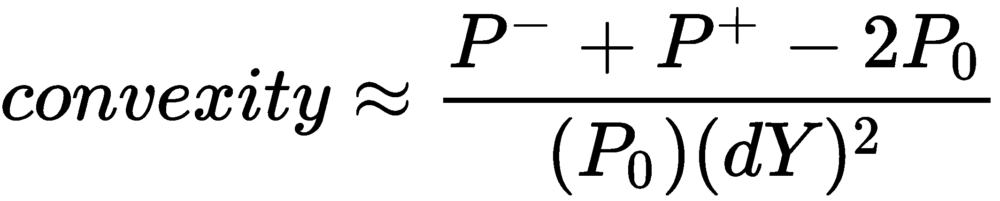

债券交易者使用凸性作为风险管理工具来衡量其投资组合中的市场风险量。在债券期限和收益率相同的情况下，与低凸度投资组合相比，高凸度投资组合受利率波动的影响较小。因此，在其他条件相同的情况下，高凸度债券比低凸度债券更昂贵。

键凸性的实现如下所示：

```py
In [ ]:
    def bond_convexity(price, par, T, coup, freq, dy=0.01):
        ytm = bond_ytm(price, par, T, coup, freq)

        ytm_minus = ytm - dy    
        price_minus = bond_price(par, T, ytm_minus, coup, freq)

        ytm_plus = ytm + dy
        price_plus = bond_price(par, T, ytm_plus, coup, freq)

        convexity = (price_minus + price_plus - 2*price)/(price*dy**2)
        return convexity
```

我们现在可以找到前面讨论的 5.75%个债券的凸性，在席 0t0 中计算出到期收益率的 T1 段，它将在 1.5 年内成熟，票面价值为 100，债券价格为 95.0428：

```py
In [ ]:
    convexity = bond_convexity(95.0428, 100, 1.5, 5.75, 2)
In [ ]:
    print(convexity)
Out[ ] :    
    2.633959390331875
```

键的凸度为 2.63。对于具有相同票面价值、息票和到期日的两种债券，它们的凸性可能不同，这取决于它们在收益曲线上的位置。对于相同的收益率变化，高凸度债券将表现出更高的价格变化。

# 短期利率模型

在短期利率建模中，短期利率*r（t）*是特定时间的即期利率。它被描述为收益率曲线上无限短时间内的连续复合年化利率期限。短期利率在利率模型中表现为随机变量的形式，其中利率在每个时间点都可能发生少量变化。短期利率模型试图模拟利率随时间的演变，并有望描述特定时期的经济状况。

短期利率模型常用于利率衍生品的评估。债券、信用工具、抵押贷款和贷款产品对利率变化非常敏感。短期利率模型作为利率组成部分与定价实施（如数值方法）结合使用，以帮助为此类衍生品定价。

利率建模被认为是一个相当复杂的话题，因为利率受多种因素的影响，如经济状况、政治决策、政府干预以及供求规律。已经提出了许多利率模型来解释利率的各种特征。

在本节中，我们将介绍金融研究中使用的一些最流行的单因素短期利率模型，即 Vasicek、Cox Ingersoll-Ross、Rendleman 和 Bartter 以及 Brennan 和 Schwartz 模型。使用 Python，我们将执行单路径模拟，以获得利率路径过程的一般概述。金融界通常讨论的其他模式包括 Ho-Lee、Hull-White 和 Black Karasinki。

# 瓦西塞克模型

在单因素 Vasicek 模型中，短期利率被建模为单个随机因素：


这里，*K*、*θ*和*σ*是常数，*σ*是瞬时标准偏差。*W（t）*是随机维纳过程。Vasicek 遵循 Ornstein-Uhlenbeck 过程，模型围绕均值*θ*进行回复，均值回复速度为*K*。因此，利率可能变为负值，这在大多数正常经济条件下都是不可取的。

为了帮助我们理解此模型，以下代码生成了一个利率列表：

```py
In [ ]:
    import math
    import numpy as np

    def vasicek(r0, K, theta, sigma, T=1., N=10, seed=777):    
        np.random.seed(seed)
        dt = T/float(N)    
        rates = [r0]
        for i in range(N):
            dr = K*(theta-rates[-1])*dt + \
                sigma*math.sqrt(dt)*np.random.normal()
            rates.append(rates[-1]+dr)

        return range(N+1), rates
```

`vasicek()`函数从 Vasicek 模型返回时间段和利率列表。它接受许多输入参数：`r0`是*t=0*时的初始利率；`K`、`theta`、`sigma`为常数；`T`是以年数表示的期间；`N`是建模过程的间隔数；`seed`是 NumPy 标准正态随机数生成器的初始化值。

假设当前利率接近零，为 0.5%，长期平均水平`theta`为`0.15`，瞬时波动率`sigma`为 5%。我们将使用`T`值`10`和`N`值`200`对不同均值回归速度下的利率`K`进行建模，其值分别为`0.002`、`0.02`和`0.2`：

```py
In [ ]:
    %pylab inline

    fig = plt.figure(figsize=(12, 8))

    for K in [0.002, 0.02, 0.2]:
        x, y = vasicek(0.005, K, 0.15, 0.05, T=10, N=200)
        plot(x,y, label='K=%s'%K)
        pylab.legend(loc='upper left');

    pylab.legend(loc='upper left')
    pylab.xlabel('Vasicek model');
```

运行上述命令后，我们得到以下图形：

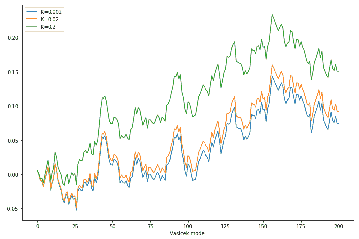

在本例中，我们只运行一个模拟，以查看 Vasicek 模型中的利率是什么样子。观察到利率确实在某个时候变为负值。随着均值回归速度的提高，`K`，该过程提前达到 0.15 的长期水平。

# 考克斯-英格索尔-罗斯模型

**Cox-Ingersoll-Ross**（**CIR**模型）是一个单因素模型，旨在解决 Vasicek 模型中发现的负利率问题。过程如下所示：


随着短期利率的增加，一词增加了标准偏差。现在，`vasicek()`函数可以重写为 Python 中的 CIR 模型：

```py
In [ ]:
    import math
    import numpy as np

    def CIR(r0, K, theta, sigma, T=1.,N=10,seed=777):        
        np.random.seed(seed)
        dt = T/float(N)    
        rates = [r0]
        for i in range(N):
            dr = K*(theta-rates[-1])*dt + \
                sigma*math.sqrt(rates[-1])*\
                math.sqrt(dt)*np.random.normal()
            rates.append(rates[-1] + dr)

        return range(N+1), rates

```

使用*Vasicek 模型*部分给出的相同示例，假设当前利率为 0.5%，`theta`为`0.15`，而`sigma`为`0.05`。我们将使用`10`的`T`值和`200`的`N`值来模拟不同均值回归速度下的利率，`K`，使用`0.002`、`0.02`和`0.2`值：

```py
In [ ] :
    %pylab inline

    fig = plt.figure(figsize=(12, 8))

    for K in [0.002, 0.02, 0.2]:
        x, y = CIR(0.005, K, 0.15, 0.05, T=10, N=200)
        plot(x,y, label='K=%s'%K)

    pylab.legend(loc='upper left')
    pylab.xlabel('CRR model');
```

以下是上述命令的输出：

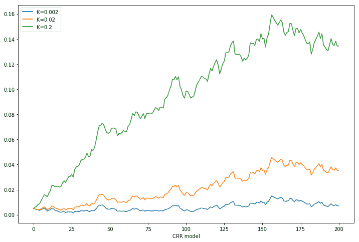

请注意，CIR 利率模型没有负利率值。

# 伦德曼和巴特模型

在 Rendleman 和 Bartter 模型中，短期利率过程如下所示：


这里，瞬时漂移为*θr（t）*，瞬时标准偏差为*σr（t）*。Rendleman 和 Bartter 模型可视为几何布朗运动，类似于对数正态分布的股价随机过程。该模型缺乏均值回归特性。均值回归是一种利率似乎被拉回到长期平均水平的现象。

以下 Python 代码为 Rendleman 和 Bartter 利率过程建模：

```py
In [ ]:
    import math
    import numpy as np

    def rendleman_bartter(r0, theta, sigma, T=1.,N=10,seed=777):        
        np.random.seed(seed)
        dt = T/float(N)    
        rates = [r0]
        for i in range(N):
            dr = theta*rates[-1]*dt + \
                sigma*rates[-1]*math.sqrt(dt)*np.random.normal()
            rates.append(rates[-1] + dr)

        return range(N+1), rates
```

我们将继续使用前面章节中的示例并比较模型。

假设当前利率为 0.5%，且`sigma`为`0.05`。我们将使用`10`的`T`值和`200`的`N`值来模拟具有不同瞬时漂移的利率`theta`，使用`0.01`、`0.05`和`0.1`值：

```py
In [ ]:
    %pylab inline

    fig = plt.figure(figsize=(12, 8))

    for theta in [0.01, 0.05, 0.1]:
        x, y = rendleman_bartter(0.005, theta, 0.05, T=10, N=200)
        plot(x,y, label='theta=%s'%theta)

    pylab.legend(loc='upper left')
    pylab.xlabel('Rendleman and Bartter model');
```

下图是上述命令的输出：


一般来说，该模型缺乏均值回归特性，并向长期平均水平发展。

# Brennan 和 Schwartz 模型

Brennan 和 Schwartz 模型是一个双因素模型，其中短期利率回复为长期利率作为平均值，这也遵循一个随机过程。短期利率过程如下所示：

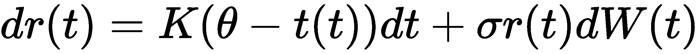

可以看出，Brennan 和 Schwartz 模型是几何布朗运动的另一种形式。

我们的 Python 代码现在可以实现如下：

```py
In [ ]:
    import math
    import numpy as np

    def brennan_schwartz(r0, K, theta, sigma, T=1., N=10, seed=777):    
        np.random.seed(seed)
        dt = T/float(N)    
        rates = [r0]
        for i in range(N):
            dr = K*(theta-rates[-1])*dt + \
                sigma*rates[-1]*math.sqrt(dt)*np.random.normal()
            rates.append(rates[-1] + dr)

        return range(N+1), rates
```

假设当前利率保持在 0.5%，长期平均水平`theta`为 0.006。`sigma`是`0.05`。我们将使用`10`的`T`值和`200`的`N`值来模拟不同均值回归速度下的利率`K`，使用`0.2`、`0.02`和`0.002`值：

```py
In [ ]:
    %pylab inline

    fig = plt.figure(figsize=(12, 8))

    for K in [0.2, 0.02, 0.002]:
        x, y = brennan_schwartz(0.005, K, 0.006, 0.05, T=10, N=200)
        plot(x,y, label='K=%s'%K)

    pylab.legend(loc='upper left')
    pylab.xlabel('Brennan and Schwartz model');
```

运行上述命令后，我们将获得以下输出：


当 k 为 0.2 时，平均值回复速度最快，接近长期平均值 0.006。

# 债券期权

当公司等债券发行人发行债券时，他们面临的风险之一就是利率风险。当利率下降时，债券价格上升。虽然现有债券持有人会发现自己的债券更有价值，但债券发行人却会发现自己处于亏损状态，因为他们将支付高于现行利率的利息。相反，当利率上升时，债券发行人处于有利地位，因为他们能够继续按照债券合同规范的约定发放相同的低息付款。

为了利用利率变化，债券发行人可以在债券中嵌入期权。这使得发行人有权，但没有义务，在规定的时间内，以预定的价格购买或出售已发行债券。美式债券期权允许发行人在债券存续期间的任何时间点行使期权权利。欧洲类型的债券期权允许发行人在特定日期行使期权权利。行使日期的确切方式因债券期权而异。当债券在市场上流通超过一年时，一些发行人可能会选择行使债券期权的权利。一些发行人可能会选择在几个特定日期之一行使债券期权。无论债券的行权日期如何，您都可以使用嵌入期权对债券进行定价，如下所示：

债券价格=无期权债券价格-嵌入期权价格

没有期权的债券的定价相当简单：未来某一天收到的债券的现值，包括所有息票支付。关于未来息票支付可能再投资的理论利率，将作出若干假设。其中一个假设可能是短期利率模型隐含的利率变动，我们在前面的章节*短期利率模型*中介绍了这一点。另一个假设可能是利率在二项或三项树中的移动。为简单起见，在债券定价研究中，我们将对在债券有效期内不会发行息票的零息票债券进行定价。

为期权定价，必须确定可用的行权日期。从债券的未来价值开始，将债券价格与期权的行权价格进行比较，并使用数值程序（如二叉树）返回到当前时间。这种价格比较是在债券期权可以行使的时间点进行的。利用无套利理论，考虑到债券行权时的当前超额价值，我们得到了期权的价格。为简单起见，在本章后面部分的债券定价研究中，*可赎回债券期权的定价*，我们将零息债券的嵌入期权视为美式期权。

# 可赎回债券

在高利率的经济条件下，债券发行人可能面临利率下降的风险，并且必须继续发行高于现行利率的利息。因此，他们可以选择发行可赎回债券。可赎回债券包含在约定日期赎回债券的嵌入协议。现有债券持有人被视为已向债券发行人出售看涨期权。

如果利率下降，且公司有权在该期间以特定价格回购债券，则他们可以选择这样做。然后，该公司可以以较低的利率发行新债券。这也意味着该公司能够以更高的债券价格筹集更多资金。

# 可回售债券

与可赎回债券不同，可赎回债券的持有人有权但无义务在一定时期内以约定价格将债券出售给发行人。可出售债券的所有者被视为已从债券发行人处购买了卖出期权。当利率上升时，现有债券的价值降低，可出售债券持有人更有动力行使以更高行使价格出售债券的权利。由于可售债券对买方的好处大于对发行人的好处，因此它们通常不如可赎回债券常见。可出售债券的变体可以在贷款和存款工具的形式中找到。向金融机构存入固定利率存款的客户在指定日期收到利息付款。他们有权随时提取押金。因此，固定利率存款工具可以被视为带有嵌入式美国看跌期权的债券。

希望从银行借款的投资者签订贷款协议，在协议有效期内支付利息，直到债务连同本金和约定利息全部偿还。银行可以被视为购买债券的看跌期权。在某些情况下，银行可行使赎回贷款协议全部价值的权利。

因此，可出售债券的价格可以考虑如下：

可售债券价格=无期权债券价格+卖出期权价格

# 可转换债券

可转换债券由公司发行，包含嵌入期权，允许持有人将债券转换为若干普通股。债券转换股份的金额定义为转换比率，转换比率的确定应确保股份的美元金额与债券的价值相同。

可转换债券与可赎回债券有相似之处。它们允许债券持有人在约定的时间以规定的转换率以同等数量的股份行使债券。可转换债券的票面利率通常低于不可转换债券，以补偿行使权利的附加价值。

当可转换债券持有人行使其股票权利时，公司债务减少。另一方面，随着流通股数量的增加，公司股票变得更加稀释，预计公司股票价格将下跌。

随着公司股票价格的上涨，可转换债券的价格往往会上涨。相反，随着公司股票价格的下降，可转换债券的价格也会下降。

# 优先股

优先股是具有债券性质的股票。优先股的拥有者对普通股的股利支付要求有一定的资格，通常按其票面价值的固定百分比进行协商。虽然没有股息支付的保证，但所有股息都是优先股优先于普通股支付的。在某些优先股协议中，未按约定支付的股息可能会累积到以后支付。这些优先股被称为**累积**。

优先股的价格通常与其普通股同步变动。他们可能拥有与普通股股东相关的投票权。在破产的情况下，优先股在清算时有其优先权的优先留置权。

# 可赎回债券期权的定价

在本节中，我们将了解可赎回债券的定价。我们假设要定价的债券是一种零息票支付债券，带有嵌入式欧洲看涨期权。可赎回债券的价格可以考虑如下：

可赎回债券价格=无期权债券价格− 看涨期权价格

# 基于 Vasicek 模型的零息债券定价

票面价值为 1 的零息票债券的价值在时间上为 t0；


由于利率*r*一直在变化，我们将零息债券改写如下：


现在，利率*r*是一个随机过程，它解释了从*t*到*t*的债券价格，其中*t*是零息债券的到期时间。

为了对利率*r*进行建模，我们可以将其中一个短期利率模型用作随机过程。为此，我们将使用 Vasicek 模型对短期利率过程进行建模。

对数正态分布变量*X*的期望值如下所示：

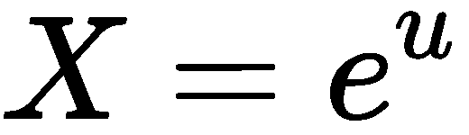


取对数正态分布变量*X*的矩：


我们得到了对数正态分布变量的期望值，我们将在零息债券的利率过程中使用该值。

记住 Vasicek 短期利率流程模型：


然后，*r（t）*的推导如下：

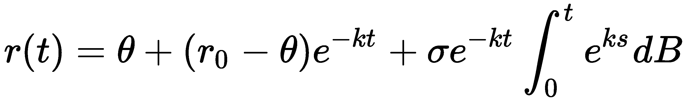

利用 Vasicek 模型的特征方程和利率变动，我们可以根据预期改写零息债券价格：


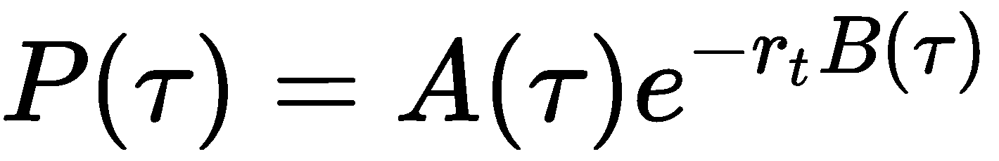

在这里：


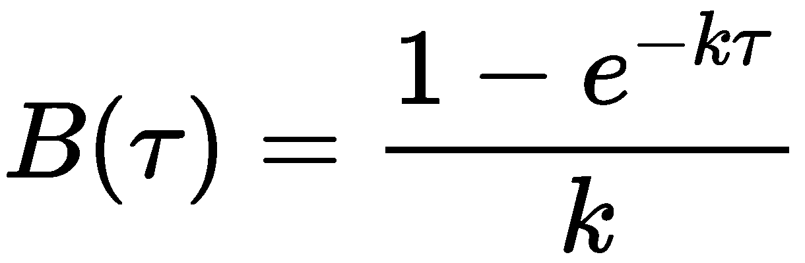

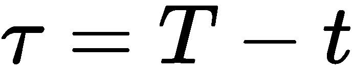

零息票债券价格的 Python 实现在`exact_zcb`函数中给出：

```py
In [ ]:
    import numpy as np
    import math

    def exact_zcb(theta, kappa, sigma, tau, r0=0.):
        B = (1 - np.exp(-kappa*tau)) / kappa
        A = np.exp((theta-(sigma**2)/(2*(kappa**2)))*(B-tau) - \
                   (sigma**2)/(4*kappa)*(B**2))
        return A * np.exp(-r0*B)
```

例如，我们有兴趣了解一些到期日的零息票债券价格。我们用`theta`值`0.5`、`kappa`值`0.02`、`sigma`值`0.03`以及初始利率`r0`和`0.015`对 Vasicek 短期利率过程进行建模。

将这些值插入到`exact_zcb`函数中，我们得到 0 至 25 年期间的零息票债券价格，间隔为 0.5 年，并绘制出图表：

```py
In [ ]:    
    Ts = np.r_[0.0:25.5:0.5]
    zcbs = [exact_zcb(0.5, 0.02, 0.03, t, 0.015) for t in Ts]
In [ ]:
    %pylab inline

    fig = plt.figure(figsize=(12, 8))
    plt.title("Zero Coupon Bond (ZCB) Values by Time")
    plt.plot(Ts, zcbs, label='ZCB')
    plt.ylabel("Value ($)")
    plt.xlabel("Time in years")
    plt.legend()
    plt.grid(True)
    plt.show()
```

下图是上述命令的输出：

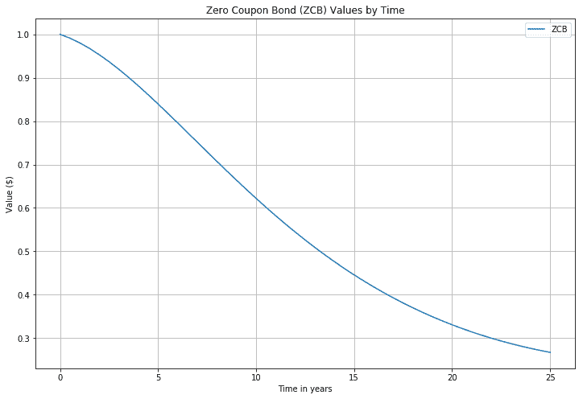

# 早期锻炼的价值

可赎回债券的发行人可以按照合同规定的约定价格赎回债券。为给此类债券定价，贴现的早期行使价值可定义如下：

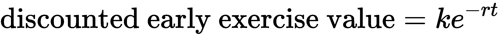

在这里，Po.t0\. k 是 Talk T1 的价格比。

早期练习选项的 Python 实现可以编写如下：

```py
In [ ]:
    import math

    def exercise_value(K, R, t):
        return K*math.exp(-R*t)
```

在前面的例子中，我们感兴趣的是对行使率为 0.95、初始利率为 1.5%的看涨期权进行估值。然后，我们可以将这些值绘制为时间的函数，并将其叠加到零息票债券价格图上，以便更好地直观地表示零息票债券价格和可赎回债券价格之间的关系：

```py
In [ ]:
    Ts = np.r_[0.0:25.5:0.5]
    Ks = [exercise_value(0.95, 0.015, t) for t in Ts]
    zcbs = [exact_zcb(0.5, 0.02, 0.03, t, 0.015) for t in Ts]
In [ ]:
    import matplotlib.pyplot as plt

    fig = plt.figure(figsize=(12, 8))
    plt.title("Zero Coupon Bond (ZCB) and Strike (K) Values by Time")
    plt.plot(Ts, zcbs, label='ZCB')
    plt.plot(Ts, Ks, label='K', linestyle="--", marker=".")
    plt.ylabel("Value ($)")
    plt.xlabel("Time in years")
    plt.legend()
    plt.grid(True)
    plt.show()
```

以下是上述命令的输出：


从上图中，我们可以近似得出可赎回零息票债券的价格。由于债券发行人拥有赎回权，可赎回零息票债券的价格可表述如下：


鉴于当前利率水平，该可赎回债券价格是一个近似值。下一步是通过政策迭代的形式来处理早期演习，这是一个用于确定最佳早期演习价值及其对其他节点的影响的循环，并检查这些价值是否应提前演习。实际上，这样的迭代只发生一次。

# 有限差分策略迭代

到目前为止，我们在短期利率过程中使用了 Vasicek 模型来模拟零息票债券。我们可以通过有限差分进行策略迭代，以检查早期练习条件及其对其他节点的影响。我们将使用隐式有限差分法进行数值定价程序，如[第 4 章](04.html)*【期权定价的数值程序*所述。

让我们创建一个名为`VasicekCZCB`的类，该类将包含用于通过 Vasicek 模型实现可赎回零息票债券定价的所有方法。类及其构造函数定义如下所示：

```py
import math
import numpy as np
import scipy.stats as st

class VasicekCZCB:

    def __init__(self):
        self.norminv = st.distributions.norm.ppf
        self.norm = st.distributions.norm.cdf    
```

在构造函数中，`norminv`和`normv`变量可用于所有需要分别计算 SciPy 的逆正态累积分布函数和正态累积分布函数的方法。

通过这个基类，让我们讨论所需的方法，并将它们添加到我们的类中：

*   添加`vasicek_czcb_values()`方法作为开始定价过程的切入点。`r0`变量为*t=0*时的短期利率；`R`为债券价格的执行零利率；A. T3 是债券每面值的执行价格；`T`为到期时间；`sigma`是短期利率的波动性，`r`；`kappa`为均值回复率；`theta`是短速率过程的平均值；`M`是有限差分格式中的步数；`prob`是`vasicek_limits`方法用于确定短期利率的正态分布曲线上的概率；`max_policy_iter`是用于查找早期练习节点的最大策略迭代次数；`grid_struct_const`是`calculate_N()`方法中确定`N`的`dt`运动的最大阈值；`rs`是短期利率过程所遵循的利率列表。

此方法返回一个等距短期利率列表和一个期权价格列表，如下所示：

```py
def vasicek_czcb_values(self, r0, R, ratio, T, sigma, kappa, theta,
                        M, prob=1e-6, max_policy_iter=10, 
                        grid_struct_const=0.25, rs=None):
    (r_min, dr, N, dtau) = \
        self.vasicek_params(r0, M, sigma, kappa, theta,
                            T, prob, grid_struct_const, rs)
    r = np.r_[0:N]*dr + r_min
    v_mplus1 = np.ones(N)

    for i in range(1, M+1):
        K = self.exercise_call_price(R, ratio, i*dtau)
        eex = np.ones(N)*K
        (subdiagonal, diagonal, superdiagonal) = \
            self.vasicek_diagonals(
                sigma, kappa, theta, r_min, dr, N, dtau)
        (v_mplus1, iterations) = \
            self.iterate(subdiagonal, diagonal, superdiagonal,
                         v_mplus1, eex, max_policy_iter)
    return r, v_mplus1
```

*   添加`vasicek_params()`方法来计算 Vasicek 模型的隐式方案参数。它返回一个元组`r_min`、`dr`、`N`和`dt`。如果没有向`rs`提供值，`r_min`到`r_max`的值将由`vasicek_limits()`方法自动生成，作为`prob`的函数，遵循正态分布。该方法编写如下：

```py
def vasicek_params(self, r0, M, sigma, kappa, theta, T,
                  prob, grid_struct_const=0.25, rs=None):
    if rs is not None:
        (r_min, r_max) = (rs[0], rs[-1])
    else:
        (r_min, r_max) = self.vasicek_limits(
            r0, sigma, kappa, theta, T, prob)      

    dt = T/float(M)
    N = self.calculate_N(grid_struct_const, dt, sigma, r_max, r_min)
    dr = (r_max-r_min)/(N-1)

    return (r_min, dr, N, dt)

```

*   增加`calculate_N()`方法，用于`vasicek_params()`方法计算网格尺寸参数`N`。该方法编写如下：

```py
def calculate_N(self, max_structure_const, dt, sigma, r_max, r_min):
    N = 0
    while True:
        N += 1
        grid_structure_interval = \
            dt*(sigma**2)/(((r_max-r_min)/float(N))**2)
        if grid_structure_interval > max_structure_const:
            break
    return N

```

*   添加`vasicek_limits()`方法，通过正态分布过程计算 Vasicek 利率过程的最小值和最大值。Vasicek 模型下短期利率过程的预期值`r(t)`如下所示：


差异定义如下：


此方法返回由正态分布过程概率定义的最小和最大利率水平的元组，并编写如下：

```py
def vasicek_limits(self, r0, sigma, kappa, theta, T, prob=1e-6):
    er = theta+(r0-theta)*math.exp(-kappa*T)
    variance = (sigma**2)*T if kappa==0 else \
                (sigma**2)/(2*kappa)*(1-math.exp(-2*kappa*T))
    stdev = math.sqrt(variance)
    r_min = self.norminv(prob, er, stdev)
    r_max = self.norminv(1-prob, er, stdev)
    return (r_min, r_max)
```

*   添加`vasicek_diagonals()`方法，返回隐式有限差分格式的对角线，其中：


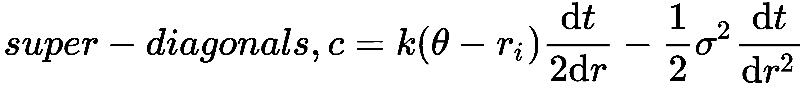

边界条件使用 Neumann 边界条件实现。该方法编写如下：

```py
def vasicek_diagonals(self, sigma, kappa, theta, r_min,
                      dr, N, dtau):
    rn = np.r_[0:N]*dr + r_min
    subdiagonals = kappa*(theta-rn)*dtau/(2*dr) - \
                    0.5*(sigma**2)*dtau/(dr**2)
    diagonals = 1 + rn*dtau + sigma**2*dtau/(dr**2)
    superdiagonals = -kappa*(theta-rn)*dtau/(2*dr) - \
                    0.5*(sigma**2)*dtau/(dr**2)

    # Implement boundary conditions.
    if N > 0:
        v_subd0 = subdiagonals[0]
        superdiagonals[0] = superdiagonals[0]-subdiagonals[0]
        diagonals[0] += 2*v_subd0
        subdiagonals[0] = 0

    if N > 1:
        v_superd_last = superdiagonals[-1]
        superdiagonals[-1] = superdiagonals[-1] - subdiagonals[-1]
        diagonals[-1] += 2*v_superd_last
        superdiagonals[-1] = 0

    return (subdiagonals, diagonals, superdiagonals)

```

The Neumann boundary condition specifies the boundaries of a given ordinary or partial differential equation. Further information can be found at [http://mathworld.wolfram.com/NeumannBoundaryConditions.html](http://mathworld.wolfram.com/NeumannBoundaryConditions.html).

*   添加`check_exercise()`方法，该方法返回一个布尔值列表，指示表明早期练习的最佳回报的指数。该方法编写如下：

```py
def check_exercise(self, V, eex):
    return V > eex
```

*   添加`exercise_call_price()`方法，该方法以比率形式返回履约价格的贴现值，如下所示：

```py
def exercise_call_price(self, R, ratio, tau):
    K = ratio*np.exp(-R*tau)
    return K
```

*   添加`vasicek_policy_diagonals()`方法，该方法由策略迭代过程调用，该过程更新一次迭代的子对角线、对角线和超级对角线。在索引中，如果进行了早期练习，则次对角线和超对角线的这些值将设置为 0，对角线上的其余值将设置为 0。该方法返回新的次对角线、对角线和超对角线值的逗号分隔值。该方法编写如下：

```py
 def vasicek_policy_diagonals(self, subdiagonal, diagonal, \
                             superdiagonal, v_old, v_new, eex):
    has_early_exercise = self.check_exercise(v_new, eex)
    subdiagonal[has_early_exercise] = 0
    superdiagonal[has_early_exercise] = 0
    policy = v_old/eex
    policy_values = policy[has_early_exercise]
    diagonal[has_early_exercise] = policy_values
    return (subdiagonal, diagonal, superdiagonal)
```

*   添加`iterate()`方法，该方法通过执行策略迭代来实现隐式有限差分格式，其中每个循环涉及求解三对角方程组，调用`vasicek_policy_diagonals()`方法来更新三对角，如果没有进一步的提前行使机会，则返回可赎回零息票债券价格。它还返回执行的策略迭代次数。该方法编写如下：

```py
def iterate(self, subdiagonal, diagonal, superdiagonal,
            v_old, eex, max_policy_iter=10):
    v_mplus1 = v_old
    v_m = v_old
    change = np.zeros(len(v_old))
    prev_changes = np.zeros(len(v_old))

    iterations = 0
    while iterations <= max_policy_iter:
        iterations += 1

        v_mplus1 = self.tridiagonal_solve(
                subdiagonal, diagonal, superdiagonal, v_old)
        subdiagonal, diagonal, superdiagonal = \
            self.vasicek_policy_diagonals(
                subdiagonal, diagonal, superdiagonal, 
                v_old, v_mplus1, eex)

        is_eex = self.check_exercise(v_mplus1, eex)
        change[is_eex] = 1

        if iterations > 1:
            change[v_mplus1 != v_m] = 1

        is_no_more_eex = False if True in is_eex else True
        if is_no_more_eex:
            break

        v_mplus1[is_eex] = eex[is_eex]
        changes = (change == prev_changes)

        is_no_further_changes = all((x == 1) for x in changes)
        if is_no_further_changes:
            break

        prev_changes = change
        v_m = v_mplus1

    return v_mplus1, iterations-1
```

*   添加`tridiagonal_solve()`方法，该方法实现了求解三对角方程组的 Thomas 算法。方程组可写成如下：

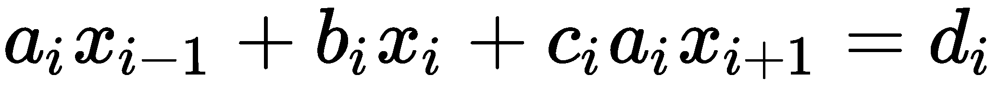

该方程以矩阵形式表示：


这里，*a*是次对角线的列表，*b*是对角线的列表，*c*是矩阵的超对角线。

The Thomas algorithm is a matrix algorithm for solving tridiagonal systems of equations using a simplified form of Gaussian elimination. Further information can be found at [http://faculty.washington.edu/finlayso/ebook/algebraic/advanced/LUtri.htm](http://faculty.washington.edu/finlayso/ebook/algebraic/advanced/LUtri.htm).

`tridiagonal_solve()`方法编写如下：

```py
def tridiagonal_solve(self, a, b, c, d):
    nf = len(a)  # Number of equations
    ac, bc, cc, dc = map(np.array, (a, b, c, d))  # Copy the array
    for it in range(1, nf):
        mc = ac[it]/bc[it-1]
        bc[it] = bc[it] - mc*cc[it-1] 
        dc[it] = dc[it] - mc*dc[it-1]

    xc = ac
    xc[-1] = dc[-1]/bc[-1]

    for il in range(nf-2, -1, -1):
        xc[il] = (dc[il]-cc[il]*xc[il+1])/bc[il]

    del bc, cc, dc  # Delete variables from memory

    return xc
```

定义了这些方法之后，我们现在可以运行代码，并使用 Vasicek 模型为可调用的零息票债券定价。

假设我们使用以下参数运行该模型：`r0`是`0.05`、`R`是`0.05`、`ratio`是`0.95`、`sigma`是`0.03`、`kappa`是`0.15`、`theta`是`0.05`、`prob`是`1e-6`、`M`是`250`、`max_policy_iter`是`10`、`grid_struc_interval`是`0.25`，我们对 0%到 2%之间的利率值感兴趣。

以下 Python 代码演示了 1 年期、5 年期、7 年期、10 年期和 20 年期的此模型：

```py
In [ ]:
    r0 = 0.05
    R = 0.05
    ratio = 0.95
    sigma = 0.03
    kappa = 0.15
    theta = 0.05
    prob = 1e-6
    M = 250
    max_policy_iter=10
    grid_struct_interval = 0.25
    rs = np.r_[0.0:2.0:0.1]
In [ ]:
    vasicek = VasicekCZCB()
    r, vals = vasicek.vasicek_czcb_values(
        r0, R, ratio, 1., sigma, kappa, theta, 
        M, prob, max_policy_iter, grid_struct_interval, rs)
In [ ]:
    %pylab inline

    fig = plt.figure(figsize=(12, 8))
    plt.title("Callable Zero Coupon Bond Values by r")
    plt.plot(r, vals, label='1 yr')

    for T in [5., 7., 10., 20.]:
        r, vals = vasicek.vasicek_czcb_values(
            r0, R, ratio, T, sigma, kappa, theta, 
            M, prob, max_policy_iter, grid_struct_interval, rs)
        plt.plot(r, vals, label=str(T)+' yr', linestyle="--", marker=".")

    plt.ylabel("Value ($)")
    plt.xlabel("r")
    plt.legend()
    plt.grid(True)
    plt.show()
```

运行上述命令后，应获得以下输出：


我们得到了不同利率下不同到期日的可赎回零息债券定价的理论值。

# 可赎回债券定价中的其他考虑因素

在为可赎回零息债券定价时，我们使用 Vasicek 利率过程，借助正态分布过程对利率变动进行建模。在*Vasicek 模型*一节中，我们证明了 Vasicek 模型可以产生负利率，这在大多数经济周期中可能不实用。定量分析师通常在衍生工具定价中使用多个模型以获得实际结果。CIR 和 Hull-White 模型是金融研究中常用的模型之一。这些模型的局限性在于，它们只涉及一个因素或单一的不确定性来源。

我们还研究了用于早期实践的策略迭代的隐式有限差分格式。另一种考虑的方法是有限差分的 Crank-Nicolson 方法。其他方法包括用于校准该模型的蒙特卡罗模拟。

最后，我们得到了短期利率和可赎回债券价格的最终清单。为了推断特定短期利率下可赎回债券的公允价值，需要插入债券价格列表。通常使用线性插值方法。考虑的其他插值方法有三次插值法和样条插值法。

# 总结

在本章中，我们重点介绍了 Python 的利率和相关衍生品定价。大多数债券，如美国国债，每半年支付一次固定金额的利息，而其他债券可能每季度或每年支付一次。债券的一个特点是，它们的价格与当前的利率水平呈反比关系。长期利率高于短期利率的正常或正收益率曲线被称为向上倾斜。在某些经济条件下，收益率曲线可以反转，并被称为向下倾斜。

零息票债券是指在其有效期内不支付息票的债券，除非到期时本金或面值已偿还。我们用 Python 实现了一个简单的零息票债券计算器。

收益率曲线可以通过使用自举过程从短期零利率或即期证券（如零息票债券、国库券、票据和欧洲美元存款）中得出。使用 Python，我们使用大量债券信息绘制收益率曲线，并从收益率曲线中导出远期利率、到期收益率和债券价格。

债券交易者的两个重要指标是持续时间和凸度。久期是债券价格对收益率变化的敏感性度量。凸度是债券持续时间对收益率变化的敏感性度量。我们使用 Python 中修改的持续时间模型和凸度计算器实现了计算。

短期利率模型常用于利率衍生品的评估。利率建模是一个相当复杂的话题，因为它们受到多种因素的影响，如经济状况、政治决策、政府干预以及供求规律。已经提出了许多利率模型来解释利率的各种特征。我们讨论的一些利率模型包括 Vasicek、CIR、Rendleman 和 Bartter 模型。

债券发行人可在债券中嵌入期权，使其有权（而非义务）在规定时间内以预定价格购买或出售已发行债券。可赎回债券的价格可以被认为是没有期权的债券与嵌入期权的价格之差。使用 Python，我们通过将 Vasicek 模型应用于隐式有限差分法来研究可赎回零息票债券的定价。然而，这种方法只是定量分析师在债券期权建模中使用的众多方法之一。

在下一章中，我们将讨论时间序列数据的统计分析。