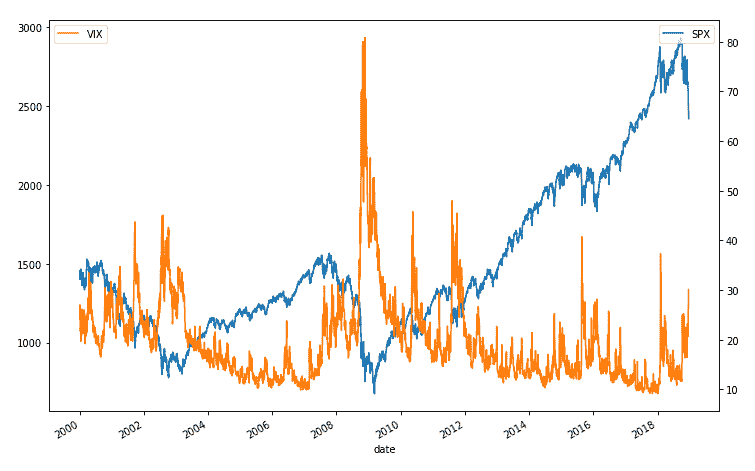
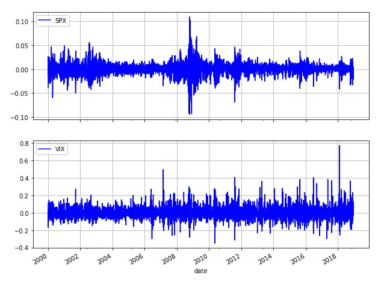
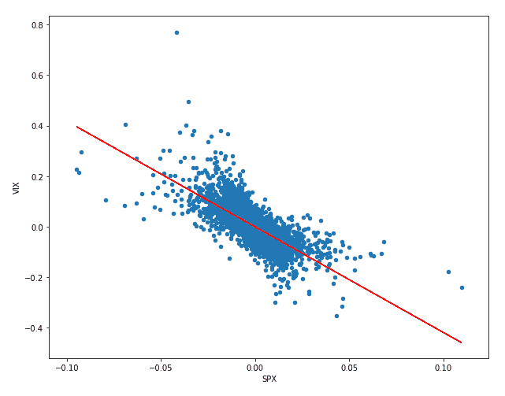
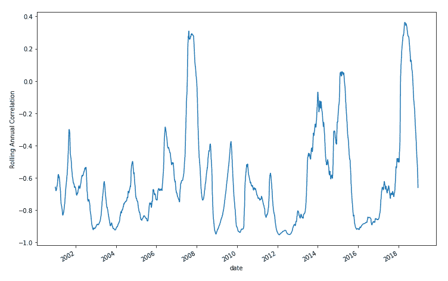
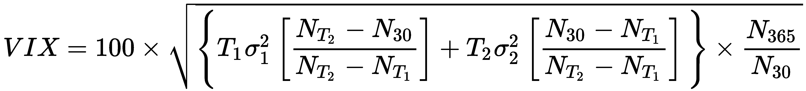
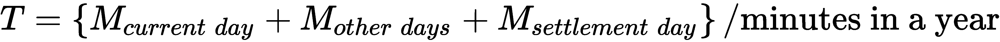
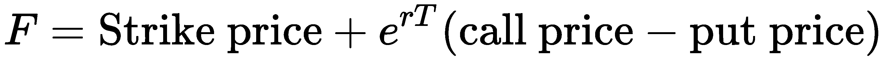
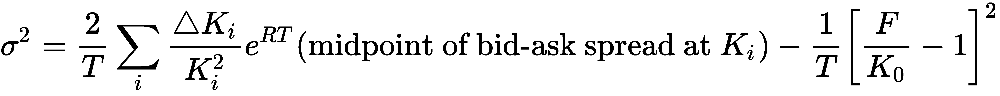
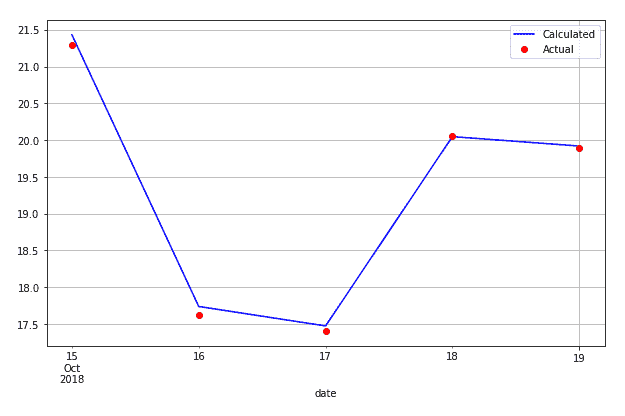

# 与 VIX 的互动金融分析

投资者使用波动性衍生工具分散和对冲股票和信贷组合中的风险。由于股票基金的长期投资者面临下行风险，波动性可以用作尾部风险的对冲和看跌期权的替代品。在美国，**芝加哥期权交易所**（**CBOE**）**波动率指数**（**VIX**）或简称为**VIX**的机构测量 S&P500 股指期权隐含的短期波动率，平均到期日为 30 天。世界各地的许多人使用波动率指数来衡量未来 30 天内的股市波动。在欧洲，等价波动率对应指标为**欧元斯托克 50 波动率**（**VSTOXX**）**市场指数**。对于使用 S&P500 指数的基准策略，其与波动率指数负相关的性质为避免基准再平衡成本提供了一种可行的方法。波动性的统计性质允许交易者执行均值回复策略、分散交易和波动性价差交易等。

在本章中，我们将了解如何对波动率指数和标准普尔 500 指数进行数据分析。使用标准普尔 500 指数期权，我们可以重建波动率指数，并将其与观测值进行比较。这里给出的代码运行在 Jupyter 笔记本上，这是 Python 的交互组件，可以帮助我们可视化数据并研究它们之间的关系。

在本章中，我们将讨论以下主题：

*   欧元斯托克 50 指数、VSTOXX 指数和 VIX 指数简介
*   对标准普尔 500 指数和波动率指数进行财务分析
*   根据 CBOE VIX 白皮书逐步重建 VIX 指数
*   寻找 VIX 指数的近期和下一期期权
*   确定期权数据集的执行价格边界
*   按执行价格列出对波动率指数的贡献
*   计算近期和下一期期权的远期水平
*   计算近期和下一期期权的波动率值
*   一次计算多个 VIX 指数
*   将计算出的指数结果与实际的标准普尔 500 指数进行比较

# 波动性衍生品

全球最流行的两个波动率指数是 VIX 和 VSTOXX，分别在美国和欧洲提供。波动率指数基于标准普尔 500 指数，该指数在 CBOE 上发布。虽然波动率指数不是直接交易的，但投资者可以使用波动率指数的衍生产品，如期权、期货、交易所交易基金和一系列基于波动率的证券。CBOE 网站提供了许多期权和市场指数的综合信息，如标准普尔 500 指数、每周期权和波动率指数，我们可以对其进行分析。我们首先了解这些产品的背景，然后在本章后面的章节中对其进行财务分析。

# 斯托克和欧洲交易所

在美国，标准普尔 500 指数是最受关注的股票市场指数之一，由标准普尔道琼斯指数创建。在欧洲，STOXX 有限公司就是这样一家公司。

斯托克有限公司成立于 1997 年，总部位于瑞士苏黎世，在全球范围内计算约 7000 个指数。作为一家指数提供商，它开发、维护、分发和营销一系列全面的指数，这些指数都严格以规则为基础且透明。

斯托克指数在这些类别中提供了大量股票指数：基准指数、蓝筹股指数、股息指数、规模指数、行业指数、风格指数、优化指数、战略指数、主题指数、可持续性指数、信仰指数、智能贝塔指数和计算产品。

Eurex 交易所是德国法兰克福的一家衍生品交易所，提供 1900 多种产品，包括股票指数、期货、期权、ETF、股息、债券和回购。斯托克的许多产品和衍生品在欧洲交易所交易。

# 欧元斯托克 50 指数

欧洲斯托克 50 指数由斯托克有限公司设计，是全球流动性最强的股票指数之一，服务于欧洲交易所上市的许多指数产品。它于 1998 年 2 月 26 日推出，由来自 12 个欧元区国家的 50 只蓝筹股组成：奥地利、比利时、芬兰、法国、德国、希腊、爱尔兰、意大利、卢森堡、荷兰、葡萄牙和西班牙。欧元斯托克 50 指数期货和期权合约可在欧洲期货交易所（Eurex Exchange）交易。根据实时价格，指数的重新计算通常每 15 秒进行一次。

欧洲斯托克 50 指数的股票代码是 SX5E。欧洲斯托克 50 指数期权的股票代码为 OESX。

# VSTOXX

VSTOXX 或 EURO STOXX 50 波动性是由欧洲交易所提供服务的一类波动性衍生品。VSTOXX 市场指数基于一篮子 OESX 的市场价格，该篮子 OESX 以货币报价或**货币报价**。它衡量未来 30 天欧元斯托克 50 指数的隐含市场波动性。

投资者使用波动性衍生品作为基准策略，利用欧元斯托克 50 指数；其与 VSTOXX 负相关的性质为避免基准再平衡成本提供了一种可行的方法。波动性的统计性质允许交易者执行均值回复策略、分散交易和波动性价差交易等。每 5 秒重新计算一次索引。

VSTOXX 的股票代码为 V2TX。基于欧洲交易所的 VSTOXX 指数交易的 VSTOXX 期权和 VSTOXX 迷你期货。

# 标准普尔 500 指数

**S&P500 指数**（**SPX**）的历史可以追溯到 1923 年，当时被称为**综合指数**。最初，它跟踪了少量股票。1957 年，追踪股票的数量扩大到 500 只，成为 SPX。

构成 SPX 的股票在**纽约证券交易所**（**纽约证券交易所**）或**全国证券交易商协会自动报价系统**（**纳斯达克**上公开上市。该指数被认为是美国经济通过大盘股普通股的领先代表。该指数每 15 秒重新计算一次，由路透社美国控股公司（Reuters America Holdings，Inc.）发布。

交易所常用的股票代码是*SPX*和*INX*，在一些网站上是*^GSPC*。

# SPX 选项

CBOE 提供多种可交易的期权合约，包括 SPX 等股指期权。SPX 指数期权产品具有不同的到期日期。标准或传统 SPX 期权在每个月的第三个星期五到期，并在业务开始时结算。**SPX Weekly**（**SPXW**）期权产品可能在每周、周一、周三和周五到期，或在每月最后一个交易日到期。如果到期日适逢外汇假日，则到期日将提前至前一个营业日。其他 SPX 期权包括 Mini 和**SPDR ETF**（**S&P 的存托凭证交易所买卖基金**）。大多数 SPX 指数期权为欧洲风格，但 SPDR ETF 除外，SPDR ETF 为美国风格。

# VIX

与斯托克指数一样，CBOE VIX 衡量标准普尔 500 指数期权价格隐含的短期波动性。CBOE VIX 始于 1993 年，以标准普尔 100 指数为基础，于 2003 年更新为以 SPX 为基础，并于 2014 年再次更新，纳入 SPXW 期权。世界各地的许多人都认为波动率指数是未来 30 天股市波动性的一种流行衡量工具。VIX 每 15 秒重新计算一次，由 CBOE 分发。

VIX 期权和 VIX 期货基于 VIX，在 CBOE 上交易。

# 标准普尔 500 指数和波动率指数的财务分析

在本节中，我们将研究波动率指数和标准普尔 500 指数之间的关系。

# 收集数据

我们将使用 Alpha Vantage 作为我们的数据提供商。让我们按照以下步骤下载 SPX 和 VIX 数据集：

1.  查询股票代码为`^GSPC`的标普 500 历史数据：

```py
In [ ]:
    from alpha_vantage.timeseries import TimeSeries

     # Update your Alpha Vantage API key here...
     ALPHA_VANTAGE_API_KEY = 'PZ2ISG9CYY379KLI'

     ts = TimeSeries(key=ALPHA_VANTAGE_API_KEY, output_format='pandas')
     df_spx_data, meta_data = ts.get_daily_adjusted(
         symbol='^GSPC', outputsize='full')
```

2.  对股票代码为`^VIX`的波动率指数也进行同样的操作：

```py
In [ ]:
    df_vix_data, meta_data = ts.get_daily_adjusted(
         symbol='^VIX', outputsize='full')
```

3.  检查数据帧对象`df_spx_data`的内容：

```py
In [ ]:
    df_spx_data.info()
Out[ ]:   
    <class 'pandas.core.frame.DataFrame'>
    Index: 4774 entries, 2000-01-03 to 2018-12-21
    Data columns (total 8 columns):
    1\. open                 4774 non-null float64
    2\. high                 4774 non-null float64
    3\. low                  4774 non-null float64
    4\. close                4774 non-null float64
    5\. adjusted close       4774 non-null float64
    6\. volume               4774 non-null float64
    7\. dividend amount      4774 non-null float64
    8\. split coefficient    4774 non-null float64
    dtypes: float64(8)
    memory usage: 317.0+ KB
```

4.  检查数据帧对象`df_vix_data`的内容：

```py
In [ ]:
    df_vix_data.info()
Out[ ]: 
    <class 'pandas.core.frame.DataFrame'>
    Index: 4774 entries, 2000-01-03 to 2018-12-21
    Data columns (total 8 columns):
    1\. open                 4774 non-null float64
    2\. high                 4774 non-null float64
    3\. low                  4774 non-null float64
    4\. close                4774 non-null float64
    5\. adjusted close       4774 non-null float64
    6\. volume               4774 non-null float64
    7\. dividend amount      4774 non-null float64
    8\. split coefficient    4774 non-null float64
    dtypes: float64(8)
    memory usage: 317.0+ KB
```

5.  请注意，这两个数据集的开始日期都从 2000 年 1 月 3 日开始，第五列标记为`5\. adjusted close`包含我们感兴趣的值。提取这两列并将它们组合成一个`pandas`数据帧：

```py
In [ ]:
    import pandas as pd

    df = pd.DataFrame({
        'SPX': df_spx_data['5\. adjusted close'],
        'VIX': df_vix_data['5\. adjusted close']
    })
    df.index = pd.to_datetime(df.index)
```

6.  `pandas`的最后一行`to_datetime()`方法将作为字符串对象给出的交易日期转换为熊猫`DatetimeIndex`对象。检查最终数据帧对象`df`的头部，我们得到以下信息：

```py
In [ ]:
    df.head(3)
```

这为我们提供了下表：

| 

**日期**

 | 

**SPX**

 | 

**VIX**

 |
| --- | --- | --- |
| 

2000-01-03

 | 1455.22 | 24.21 |
| 

2000-01-04

 | 1399.42 | 27.01 |
| 

2000-01-05

 | 1402.11 | 26.41 |

查看格式化索引会显示以下内容：

```py
In [ ]:
    df.index
Out[ ]:
    DatetimeIndex(['2000-01-03', '2000-01-04', '2000-01-05', '2000-01-06',
                   '2000-01-07', '2000-01-10', '2000-01-11', '2000-01-12',
                   '2000-01-13', '2000-01-14',
                   ...
                   '2018-10-11', '2018-10-12', '2018-10-15', '2018-10-16',
                   '2018-10-17', '2018-10-18', '2018-10-19', '2018-10-22',
                   '2018-10-23', '2018-10-24'],
                  dtype='datetime64[ns]', name='date', length=4734, freq=None)
```

`pandas`数据帧格式正确后，让我们继续处理此数据集。

# 执行分析

`pandas`的`describe()`方法为我们提供了`pandas`数据框对象每列内值的汇总统计和分布：

```py
In [ ]:
    df.describe()
```

这为我们提供了下表：

|  | 

**SPX**

 |
| --- | --- |
| 

**计数**

 | 4734 |
| 

**平均值**

 | 1493.538998 |
| 

**标准**

 | 500.541938 |
| 

**分钟**

 | 676.530000 |
| 

**25%**

 | 1140.650000 |
| 

**50%**

 | 1332.730000 |
| 

**75%**

 | 1840.515000 |
| 

**最大值**

 | 2930.750000 |

前面使用的另一个相关方法`info()`为我们提供了数据帧的技术总结，例如索引范围和内存使用情况：

```py
In [ ]:
    df.info()
Out[ ]:    
    <class 'pandas.core.frame.DataFrame'>
    DatetimeIndex: 4734 entries, 2000-01-03 to 2018-10-24
    Data columns (total 2 columns):
    SPX    4734 non-null float64
    VIX    4734 non-null float64
    dtypes: float64(2)
    memory usage: 111.0 KB
```

让我们绘制标准普尔 500 指数和波动率指数，看看它们从 2010 年起的走势：

```py
In [ ]:
    %matplotlib inline
    import matplotlib.pyplot as plt

    plt.figure(figsize = (12, 8))

    ax_spx = df['SPX'].plot()
    ax_vix = df['VIX'].plot(secondary_y=True)

    ax_spx.legend(loc=1)
    ax_vix.legend(loc=2)

    plt.show();
```

这为我们提供了以下图表：



观察到，当标准普尔 500 指数上扬时，波动率指数似乎向下移动，呈现负相关关系。我们需要进行更多的统计分析才能确定。

也许我们对这两个指数的日收益率感兴趣。`diff()`方法返回前期值之间的差异集。柱状图可用于让我们大致了解 bin 间隔为 100 的数据密度估计：

```py
In [ ]:
    df.diff().hist(
        figsize=(10, 5),
        color='blue',
        bins=100);
```

`hist()`方法给出了以下直方图：


同样的效果也可以通过`pct_change()`命令实现，该命令给出了与前期值相比的百分比变化：

```py
In [ ]:
    df.pct_change().hist(
         figsize=(10, 5),
          color='blue',
          bins=100);
```

我们得到了相同的百分比变化直方图：


对于收益的定量分析，我们感兴趣的是每日收益的对数。为什么使用日志返回而不是简单返回？有几个原因，但最重要的是正常化，这避免了负价格问题。

我们可以使用`pandas`的`shift()`函数将数值移动一定数量的周期。`dropna()`方法删除对数计算转换结束时未使用的值。NumPy 的`log()`方法帮助计算 DataFrame 对象中所有值的对数作为向量，并将作为 DataFrame 对象存储在`log_returns`变量中。然后可以绘制对数值，为我们提供每日日志返回的图表。以下是绘制对数值的代码：

```py
In [ ]:
    import numpy as np

    log_returns = np.log(df / df.shift(1)).dropna()
    log_returns.plot(
        subplots=True,
        figsize=(10, 8),
        color='blue',
        grid=True
    );
    for ax in plt.gcf().axes:
        ax.legend(loc='upper left')
```

我们得到以下输出：



上图和下图分别显示了从 2000 年到当前期间的 SPX 和 VIX 的对数收益率。

# SPX 和 VIX 之间的相关性

我们可以使用`corr()`方法推导`pandas`DataFrame 对象中每列值之间的相关值，如下面的 Python 示例所示：

```py
In [ ]:
    log_returns.corr()
```

这为我们提供了以下相关表：

|  | 

**SPX**

 | 

**VIX**

 |
| --- | --- | --- |
| 

**SPX**

 | 1 | -0.733161 |
| 

**VIX**

 | -0.733161 | 1 |

在-0.731433，SPX 与 VIX 呈负相关。为了帮助我们更好地可视化这种关系，我们可以将两组每日日志返回值绘制为散点图。`statsmodels.api`模块用于获取散乱数据之间的普通最小二乘回归线：

```py
In [ ]:
    import statsmodels.api as sm

    log_returns.plot(
        figsize=(10,8),
         x="SPX",
         y="VIX",
         kind='scatter')

    ols_fit = sm.OLS(log_returns['VIX'].values,
    log_returns['SPX'].values).fit()

    plt.plot(log_returns['SPX'], ols_fit.fittedvalues, 'r');
```

我们得到以下输出：



如上图所示，向下倾斜的回归线证实了标准普尔 500 指数与波动率指数之间的负相关关系。

`pandas`的`rolling().corr()`方法计算两个时间序列之间的移动窗口相关性。我们使用`252`值表示移动窗口中的交易日数，以计算年度滚动相关性，使用以下命令：

```py
In [ ]:
    plt.ylabel('Rolling Annual Correlation')

    df_corr = df['SPX'].rolling(252).corr(other=df['VIX'])
    df_corr.plot(figsize=(12,8));
```

我们得到以下输出：



从上图可以看出，SPX 和 VIX 呈负相关，在指数生命周期的大部分时间内（每年 252 个交易日）在 0.0 和-0.9 之间波动。

# 计算波动率指数

在本节中，我们将逐步复制 VIX 索引。VIX 指数的计算记录在 CBOE 网站上。您可以通过[获取 CBOE VIX 白皮书的副本 http://www.cboe.com/micro/vix/vixwhite.pdf](http://www.cboe.com/micro/vix/vixwhite.pdf) 。

# 导入 SPX 选项数据

假设您从经纪人处收集了 SPX 期权数据，或从 CBOE 网站等外部来源购买了历史数据。在本章中，观察 2018 年 10 月 15 日星期一至 2018 年 10 月 19 日星期五的日终 SPX 期权链价格，并将其保存在**逗号分隔值**（**CSV**文件中。这些文件的示例副本位于源代码存储库的“文件”文件夹下。

在以下示例中，编写一个函数`read_file()`，该函数在其指示 CSV 文件位置的第一个参数中接受文件路径，并返回元数据列表和选项链数据列表的元组：

```py
In [ ]:
    import csv 

    META_DATA_ROWS = 3  # Header data starts at line 4
    COLS = 7  # Each option data occupy 7 columns

    def read_file(filepath):
        meta_rows = []
        calls_and_puts = []

        with open(filepath, 'r') as file:
            reader = csv.reader(file)
            for row, cells in enumerate(reader):
                if row < META_DATA_ROWS:
                    meta_rows.append(cells)
                else:
                    call = cells[:COLS]
                    put = cells[COLS:-1]

                    calls_and_puts.append((call, put))                        

        return (meta_rows, calls_and_puts)
```

请注意，您自己的选项数据的结构可能与此示例不同。请谨慎检查并相应修改此功能。导入数据集后，我们可以继续解析和提取有用的信息。

# 解析 SPX 选项数据

在本例中，我们假设 CSV 文件的前三行包含元信息，其余选项链价格从第四行开始。对于每行期权定价数据，前七列包含看涨期权合同的买入和卖出报价，后七列包含看跌期权合同。每七列中的第一列包含一个字符串，描述到期日期、履约价格和合同代码。按照以下步骤解析 CSV 文件中的信息：

1.  每行元信息被附加到名为`meta_data`的列表变量中，而每行选项数据被附加到名为`calls_and_puts`的列表变量中。使用此函数读取单个文件可提供以下信息：

```py
In [ ]:
    (meta_rows, calls_and_puts) = \
        read_file('files/chapter07/SPX_EOD_2018_10_15.csv')
```

2.  打印每行元数据可提供以下功能：

```py
In [ ]:
    for line in meta_rows:
        print(line)
Out[ ]:
    ['SPX (S&P 500 INDEX)', '2750.79', '-16.34']
    ['Oct 15 2018 @ 20:00 ET']
    ['Calls', 'Last Sale', 'Net', 'Bid', 'Ask', 'Vol', 'Open Int', 'Puts', 'Last Sale', 'Net', 'Bid', 'Ask', 'Vol', 'Open Int']
```

3.  选项引号的当前时间可以在元数据的第二行找到。由于东部时间比**格林威治标准时间**（**格林威治标准时间**）晚 5 小时，我们替换`ET`字符串，并将整个字符串解析为`datetime`对象。以下函数`get_dt_current()`演示了这一点：

```py
In [ ]:
    from dateutil import parser

    def get_dt_current(meta_rows):
        """
        Extracts time information.

        :param meta_rows: 2D array
        :return: parsed datetime object
        """
        # First cell of second row contains time info
        date_time_row = meta_rows[1][0]

        # Format text as ET time string
        current_time = date_time_row.strip()\
            .replace('@ ', '')\
            .replace('ET', '-05:00')\
            .replace(',', '')

        dt_current =  parser.parse(current_time)
        return dt_current
```

4.  从期权数据的元信息中，将日期和时间信息提取为芝加哥当地时间：

```py
In [ ]:
    dt_current =  get_dt_current(meta_rows)
    print(dt_current)
Out[ ]:    
    2018-10-15 20:00:00-05:00
```

5.  现在，让我们看一下期权报价数据的前两行：

```py
In [ ]:
    for line in calls_and_puts[:2]:
        print(line)
Out[ ]:
    (['2018 Oct 15 1700.00 (SPXW1815J1700)', '0.0', '0.0', '1039.30', '1063.00', '0',     '0'], ['2018 Oct     15 1700.00 (SPXW1815V1700)', '0.15', '0.0', ' ', '0.05', '0'])
    (['2018 Oct 15 1800.00 (SPXW1815J1800)', '0.0', '0.0', '939.40', '963.00', '0',     '0'], ['2018 Oct     15 1800.00 (SPXW1815V1800)', '0.10', '0.0', ' ', '0.05', '0'])
```

列表中的每个项目都包含一个由两个对象组成的元组，每个对象包含具有相同执行价格的看涨期权和看跌期权定价数据的列表。参考我们打印的标题，每个期权价格表数据的七项包含合同代码和到期日、上次销售价格、价格净变动、出价、要价、交易量和未平仓。

让我们编写一个函数来解析每个 SPX 选项数据集的描述：

```py
In [ ]:
    from decimal import Decimal

    def parse_expiry_and_strike(text):
        """
        Extracts information about the contract data.

        :param text: the string to parse.
        :return: a tuple of expiry date and strike price
        """
        # SPXW should expire at 3PM Chicago time.
        [year, month, day, strike, option_code] = text.split(' ')
        expiry = '%s %s %s 3:00PM -05:00' % (year, month, day)
        dt_object = parser.parse(expiry)    

        """
        Third friday SPX standard options expire at start of trading
        8.30 A.M. Chicago time.
        """
        if is_third_friday(dt_object):
            dt_object = dt_object.replace(hour=8, minute=30)

        strike = Decimal(strike)    
        return (dt_object, strike)
```

实用函数`parse_expiry_and_strike()`返回到期日期对象的元组，执行价格作为`Decimal`对象。

每个合同数据都是一个字符串，包含到期年、月、日和履约价格，后跟合同代码，所有数据都用空格分隔。我们获取日期组件并重构一个日期和时间字符串，通过前面导入的解析函数`dateutil`轻松解析。每周期权在纽约时间下午 4 点或芝加哥时间下午 3 点到期。标准的第三个星期五期权在上午结算，并在交易日上午 8:30 开始时到期。我们按照执行`is_third_friday()`检查来替换到期时间，执行如下：

```py
In [ ]:
    def is_third_friday(dt_object):
        return dt_object.weekday() == 4 and 15 <= dt_object.day <= 21
```

通过使用简单的合同代码数据测试我们的功能，并打印结果，我们得到以下结果：

```py
In [ ]:
    test_contract_code = '2018 Sep 26 1800.00 (*)'
    (expiry, strike) = parse_expiry_and_strike(test_contract_code)
In [ ]:
    print('Expiry:', expiry)
    print('Strike price:', strike)
Out[ ]:
    Expiry: 2018-09-26 15:00:00-05:00
    Strike price: 1800.00
```

由于 2018 年 9 月 26 日是星期三，SPXW 期权将于芝加哥当地时间 CDT 下午 3 点到期。

这次，让我们用第三个星期五的合同代码数据测试我们的函数：

```py
In [ ]:
    test_contract_code = '2018 Oct 19 2555.00 (*)'
    (expiry, strike) = parse_expiry_and_strike(test_contract_code)
In [ ]:    
    print('Expiry:', expiry)
    print('Strike price:', strike)
Out[ ]:
    Expiry: 2018-10-19 08:30:00-05:00
    Strike price: 2555.00
```

我们使用的测试合同代码数据是 2018 年 10 月 19 日，这是 10 月的第三个星期五。这是一个标准的 SPX 期权，在交易日开始时，芝加哥时间上午 8:30 结算。

使用我们的实用功能，我们现在可以继续分析单个看涨期权或看跌期权价格条目，并返回我们可以使用的有用信息：

```py
In [ ]:
    def format_option_data(option_data):
        [desc, _, _, bid_str, ask_str] = option_data[:5]
        bid = Decimal(bid_str.strip() or '0')
        ask = Decimal(ask_str.strip() or '0')
        mid = (bid+ask) / Decimal(2)
        (expiry, strike) = parse_expiry_and_strike(desc)
        return (expiry, strike, bid, ask, mid)
```

效用函数`format_option_data()`以`option_data`为参数，包含我们前面看到的数据列表。索引 0 处的描述性数据包含我们可以使用`parse_expiry_and_strike()`函数解析的合同代码数据。指数 3 和 4 包含买入价和卖出价，用于计算中间价。中间价是买入价和卖出价的平均值。此函数返回期权到期日期的元组，以及作为`Decimal`对象的执行价、出价、要价和中间价。

# 寻找近期和下一期的选择

VIX 指数使用 24 天至 36 天到期的看涨期权和看跌期权的市场报价来衡量 SPX 的 30 天预期波动性。在这两个日期之间，将有两个 SPX 期权合同到期日。最近到期的期权称为短期期权，而稍后到期的期权称为下一期期权。每周发生一次，当期权到期日超出 24 至 36 天范围时，将选择新的合同到期日作为新的近期和下一期期权。

为了帮助我们找到短期和下一期期权，让我们组织按到期日索引的看跌期权和看涨期权数据，每个数据都有一个按执行价格索引的`pandas`数据框架。我们需要以下 DataFrame 列定义：

```py
In [ ]:
    CALL_COLS = ['call_bid', 'call_ask', 'call_mid']
    PUT_COLS = ['put_bid', 'put_ask', 'put_mid']
    COLUMNS = CALL_COLS + PUT_COLS + ['diff']
```

以下函数`generate_options_chain()`将我们的列表数据集`calls_and_puts`组织到一个字典变量链中：

```py
In [ ]:
    import pandas as pd

    def generate_options_chain(calls_and_puts):
        chain = {}

        for row in calls_and_puts:
            (call, put) = row

            (call_expiry, call_strike, call_bid, call_ask, call_mid) = \
                format_option_data(call)
            (put_expiry, put_strike, put_bid, put_ask, put_mid) = \
                format_option_data(put)

            # Ensure each line contains the same put and call maturity
            assert(call_expiry == put_expiry)

            # Get or create the DataFrame at the expiry
            df = chain.get(call_expiry, pd.DataFrame(columns=COLUMNS))

            df.loc[call_strike, CALL_COLS] = \
                [call_bid, call_ask, call_mid]
            df.loc[call_strike, PUT_COLS] = \
                [put_bid, put_ask, put_mid]
            df.loc[call_strike, 'diff'] = abs(put_mid-call_mid)

            chain[call_expiry] = df

        return chain
In [ ]:
    chain = generate_options_chain(calls_and_puts)
```

`chain`变量的键作为选项到期日，每个键都引用`pandas`数据帧对象。对`format_option_data()`函数进行两次调用，以派生调用并放置感兴趣的数据。`assert`关键字确保了我们的通话和卖出到期日的完整性，前提是数据集中的每一行都指向相同的到期日。否则，将引发异常并提醒我们注意检查数据集是否存在任何损坏迹象。

`loc`关键字为特定的执行价格为看涨期权和看跌期权数据分配列值。此外，`diff`列包含买入和卖出报价中间价之间的绝对差额，我们将在后面使用。

让我们查看`chain`字典中的第一个和最后两个键：

```py
In [ ]:
    chain_keys = list(chain.keys())
    for row in chain_keys[:2]:
        print(row)
    print('...')
    for row in chain_keys[-2:]:
        print(row)
Out[ ]:
    2018-10-15 15:00:00-05:00
    2018-10-17 15:00:00-05:00
    ...
    2020-06-19 08:30:00-05:00
    2020-12-18 08:30:00-05:00
```

我们的数据集包含未来两年到期的期权价格。从中，我们选择具有以下功能的近期和下一期到期日：

```py
In [ ]:
    def find_option_terms(chain, dt_current):
        """
        Find the near-term and next-term dates from
        the given indexes of the dictionary.

        :param chain: dictionary object
        :param dt_current: DateTime object of option quotes
        :return: tuple of 2 datetime objects
        """
        dt_near = None
        dt_next = None

        for dt_object in chain.keys():
            delta = dt_object - dt_current
            if delta.days > 23:
                # Skip non-fridays
                if dt_object.weekday() != 4:
                    continue

                # Save the near term date
                if dt_near is None:
                    dt_near = dt_object            
                    continue

                # Save the next term date
                if dt_next is None:
                    dt_next = dt_object            
                    break

        return (dt_near, dt_next)
Out[ ]:
    (dt_near, dt_next) = find_option_terms(chain, dt_current)
```

在这里，我们只是选择前两个选项，其到期日从该数据集发布之日起超过 23 天。这两种期权到期日如下：

```py
In [ ]:
    print('Found near-term maturity', dt_near, 
          'with', dt_near-dt_current, 'to expiry')
    print('Found next-term maturity', dt_next, 
          'with', dt_next-dt_current, 'to expiry')
Out[ ]:
    Found near-term maturity 2018-11-09 15:00:00-05:00 with 24 days, 19:00:00 to expiry
    Found next-term maturity 2018-11-16 08:30:00-05:00 with 31 days, 12:30:00 to expiry
```

近期到期日为 2018 年 11 月 9 日，下一期到期日为 2018 年 11 月 16 日。

# 计算所需的分钟数

计算 VIX 的公式如下所示：



在这里，以下内容适用：

*   T<sub>1</sub>为近期期权结算的年数
*   T<sub>2</sub>为下一期期权结算的年数
*   N<sub>T1</sub>为近期期权结算的分钟数
*   N<sub>T2</sub>是下一期期权结算的分钟数
*   N<sub>30</sub>是 30 天内的分钟数
*   N<sub>365</sub>是一年中 365 天的分钟数

让我们在 Python 中找出这些值：

```py
In [ ]:
    dt_start_year = dt_current.replace(
        month=1, day=1, hour=0, minute=0, second=0)
    dt_end_year = dt_start_year.replace(year=dt_current.year+1)

    N_t1 = Decimal((dt_near-dt_current).total_seconds() // 60)
    N_t2 = Decimal((dt_next-dt_current).total_seconds() // 60)
    N_30 = Decimal(30 * 24 * 60)
    N_365 = Decimal((dt_end_year-dt_start_year).total_seconds() // 60)
```

两个`datetime`对象的差异返回一个`timedelta`对象，其`total_seconds()`方法给出秒数的差异。分钟数可以用秒数除以六十得到。一年中的分钟数是通过计算下一年年初和今年年初之间的差值来计算的，而一个月中的分钟数只是 30 天内秒数的总和。

获得的值如下所示：

```py
In [ ]:
    print('N_365:', N_365)
    print('N_30:', N_30)
    print('N_t1:', N_t1)
    print('N_t2:', N_t2)
Out[ ]:
    N_365: 525600
    N_30: 43200
    N_t1: 35700
    N_t2: 45390
```

计算 T 的一般公式如下：



在这里，以下内容适用：

*   M<sub>当天</sub>为当天午夜前剩余的分钟数
*   M<sub>其他天数</sub>为当日与到期日之间的分钟数之和
*   M<sub>结算日</sub>为到期日午夜至到期时间的分钟数

有了这些，我们可以找到 T<sub>1</sub>和 T<sub>2</sub>，即近期和下一期期权每年剩余的时间量：

```py
In [ ]:
    t1 = N_t1 / N_365
    t2 = N_t2 / N_365
In [ ]:
    print('t1:%.5f'%t1)
    print('t2:%.5f'%t2)
Out[ ]:
    t1:0.06792
    t2:0.08636
```

短期期权的到期日为 0.6792 年，下一期期权的到期日为 0.08636 年。

# 计算远期 SPX 指数水平

对于每个合同月，远期 SPX 水平*F*如下所示：



在这里，选择执行价时，买入价和卖出价之间的绝对差值最小。请注意，VIX 指数计算不考虑零出价的期权。这表明，随着 SPX 和期权的波动性变化，投标报价可能变为零，计算 VIX 指数时使用的期权数量随时可能变化！

我们可以用`determine_forward_level()`函数来表示远期指数水平的计算，如下代码所示：

```py
In [ ]:
    import math

    def determine_forward_level(df, r, t):
        """
        Calculate the forward SPX Index level.

        :param df: pandas DataFrame for a single option chain
        :param r: risk-free interest rate for t
        :param t: time to settlement in years
        :return: Decimal object
        """
        min_diff = min(df['diff'])
        pd_k = df[df['diff'] == min_diff]
        k = pd_k.index.values[0]

        call_price = pd_k.loc[k, 'call_mid']
        put_price = pd_k.loc[k, 'put_mid']
        return k + Decimal(math.exp(r*t))*(call_price-put_price
```

`df`参数是包含近期或下一期期权价格的数据帧。`min_diff`变量包含之前在 diff 列中计算的所有绝对价格差异的最小值。`pd_k`变量包含数据帧，我们将在该数据帧上选择具有最小绝对价差的执行价格。

请注意，为了简单起见，我们假设两条期权链的利率均为 2.17%。实际上，短期和下一期期权的利率基于美国国债收益率曲线利率的三次样条计算，或**恒定到期国债利率**（**CMTs**）。收益率曲线利率可从美国财政部网站[获取 https://www.treasury.gov/resource-center/data-chart-center/interest-rates/Pages/TextView.aspx?data=yieldYear &年=2018 年](https://www.treasury.gov/resource-center/data-chart-center/interest-rates/Pages/TextView.aspx?data=yieldYear&year=2018)。

让我们将短期期权的远期 SPX 水平计算为`f1`：

```py
In [ ]:
    r = Decimal(2.17/100)
In [ ]:
    df_near = chain.get(dt_near)
    f1 = determine_forward_level(df_near, r, t1)
In [ ]:
    print('f1:', f1)
Out[ ]:
    f1: 2747.596459994546094129930225
```

我们将使用远期 SPX 水平*F*作为 2747.596。

# 寻找所需的远期履约价格

远期履约价格是直接低于远期 SPX 水平的履约价格，用`k0`表示，由`find_k0()`函数确定，如下所示：

```py
In [ ]:
    def find_k0(df, f):
        return df[df.index<f].tail(1).index.values[0]
```

短期期权的`k0`值可以通过函数调用简单地找到：

```py
In [ ]:
    k0_near = find_k0(df_near, f1)
In [ ]:
    print('k0_near:', k0_near)
Out[ ]:
    k0_near: 2745.00
```

近期远期履约价格为 2745。

# 确定执行价格边界

选择 VIX 指数计算中使用的期权时，将忽略出价为零的看涨期权和看跌期权。对于行权价格低于`k0`的远**缺钱**（**OTM**）看跌期权，当遇到两个连续的零出价时，较低的价格边界终止。类似地，对于执行价大于`k0`的远 OTM 看涨期权，当遇到两个连续的零出价时，价格上限终止。

以下函数`find_lower_and_upper_bounds()`演示了在 Python 代码中查找上下限的过程：

```py
In [ ]:
    def find_lower_and_upper_bounds(df, k0):
        """
        Find the lower and upper boundary strike prices.

        :param df: the pandas DataFrame of option chain
        :param k0: the forward strike price
        :return: a tuple of two Decimal objects
        """
        # Find lower bound
        otm_puts = df[df.index<k0].filter(['put_bid', 'put_ask'])
        k_lower = 0
        for i, k in enumerate(otm_puts.index[::-1][:-2]):
            k_lower = k
            put_bid_t1 = otm_puts.iloc[-i-1-1]['put_bid']
            put_bid_t2 = otm_puts.iloc[-i-1-2]['put_bid']
            if put_bid_t1 == 0 and put_bid_t2 == 0:
                break
            if put_bid_t2 == 0:
                k_lower = otm_puts.index[-i-1-1]

        # Find upper bound
        otm_calls = df[df.index>k0].filter(['call_bid', 'call_ask'])    
        k_upper = 0
        for i, k in enumerate(otm_calls.index[:-2]):
            call_bid_t1 = otm_calls.iloc[i+1]['call_bid']
            call_bid_t2 = otm_calls.iloc[i+2]['call_bid']
            if call_bid_t1 == 0 and call_bid_t2 == 0:
                k_upper = k
                break

        return (k_lower, k_upper)
```

`df`参数是期权价格的`pandas`数据帧。`otm_puts`变量包含 OTM puts 数据，并由`for`循环按降序向后迭代。在每次迭代中，`k_lower`变量存储当前的执行价格，同时我们查看循环中前面的两个出价。当`for`循环因遇到两个零出价而终止或到达列表末尾时，`k_lower`将包含下边界的执行价格。

同样的方法也适用于寻找上边界的执行价格。由于 OTM 调用的执行价格已经按降序排列，我们只需使用`iloc`命令上的正向索引引用来读取价格。

当我们向该函数提供短期期权链数据时，可以分别从`k_lower`和`k_upper`变量中获得履约价格下限和上限，如下代码所示：

```py
In [ ]:
    (k_lower_near, k_upper_near) = \
        find_lower_and_upper_bounds(df_near, k0_near)
In [ ]:
    print(k_lower_near, k_upper_near
Out[ ]:
    1250.00 3040.00
```

在计算 VIX 指数时，将使用履约价格在 1500 至 3200 之间的短期期权。

# 按执行价格列出捐款

由于 VIX 指数由平均 30 天到期的看涨期权和看跌期权的价格组成，因此所选到期日的每个期权都会对 VIX 指数的计算产生一定的影响。该金额按一般公式计算：


其中，*T*为期权到期时间，*R*为期权到期的无风险利率，*K<sub>i</sub>*为第*i*号 OTM 期权的履约价格，且△K<sub>i</sub>是*K<sub>i</sub>*两侧的一半差值，因此△K<sub>i</sub>=0.5（K<sub>i+1</sub>-K<sub>i-1</sub>）。

我们可以用下面的`calculate_contrib_by_strike()`函数来表示这个公式：

```py
In [ ]:
    def calculate_contrib_by_strike(delta_k, k, r, t, q):
        return (delta_k / k**2)*Decimal(math.exp(r*t))*q
```

计算中△K<sub>i</sub>=0.5（K<sub>i+1</sub>-K<sub>i-1</sub>，我们使用效用函数`find_prev_k()`搜索*K<sub>i-1</sub>*，如下所示：

```py
In [ ]:
    def find_prev_k(k, i, k_lower, df, bid_column):
        """
        Finds the strike price immediately below k 
        with non-zero bid.

        :param k: current strike price at i
        :param i: current index of df
        :param k_lower: lower strike price boundary of df
        :param bid_column: The column name that reads the bid price.
            Can be 'put_bid' or 'call_bid'.
        :return: strike price as Decimal object.
        """    
        if k <= k_lower:
            k_prev = df.index[i-1]
            return k_prev

        # Iterate backwards to find put bids           
        k_prev = 0
        prev_bid = 0
        steps = 1
        while prev_bid == 0:                                
            k_prev = df.index[i-steps]
            prev_bid = df.loc[k_prev][bid_column]
            steps += 1

        return k_prev
```

类似地，我们使用效用函数`find_next_k()`搜索 K<sub>i+1</sub>时使用相同的过程，如下所示：

```py
In [ ]:
    def find_next_k(k, i, k_upper, df, bid_column):
        """
        Finds the strike price immediately above k 
        with non-zero bid.

        :param k: current strike price at i
        :param i: current index of df
        :param k_upper: upper strike price boundary of df
        :param bid_column: The column name that reads the bid price.
            Can be 'put_bid' or 'call_bid'.
        :return: strike price as Decimal object.
        """    
        if k >= k_upper:
            k_next = df.index[i+1]
            return k_next

        k_next = 0
        next_bid = 0
        steps = 1
        while next_bid == 0:
            k_next = df.index[i+steps]
            next_bid = df.loc[k_next][bid_column]
            steps += 1

        return k_next
```

通过前面的效用函数，我们现在可以创建一个函数`tabulate_contrib_by_strike()`，该函数使用迭代过程来计算`pandas`数据帧`df`中每一个可用执行价格的每个期权的贡献，返回包含用于计算 VIX 指数的最终数据集的新数据帧：

```py
In [ ]:
    import pandas as pd

    def tabulate_contrib_by_strike(df, k0, k_lower, k_upper, r, t):
        """
        Computes the contribution to the VIX index
        for every strike price in df.

        :param df: pandas DataFrame containing the option dataset
        :param k0: forward strike price index level
        :param k_lower: lower boundary strike price
        :param k_upper: upper boundary strike price
        :param r: the risk-free interest rate
        :param t: the time to expiry, in years
        :return: new pandas DataFrame with contributions by strike price
        """
        COLUMNS = ['Option Type', 'mid', 'contrib']
        pd_contrib = pd.DataFrame(columns=COLUMNS)

        for i, k in enumerate(df.index):
            mid, bid, bid_column = 0, 0, ''
            if k_lower <= k < k0:
                option_type = 'Put'
                bid_column = 'put_bid'
                mid = df.loc[k]['put_mid']
                bid = df.loc[k][bid_column]
            elif k == k0:
                option_type = 'atm'
            elif k0 < k <= k_upper:
                option_type = 'Call'
                bid_column = 'call_bid'
                mid = df.loc[k]['call_mid']
                bid = df.loc[k][bid_column]
            else:
                continue  # skip out-of-range strike prices

            if bid == 0:
                continue  # skip zero bids

            k_prev = find_prev_k(k, i, k_lower, df, bid_column)
            k_next = find_next_k(k, i, k_upper, df, bid_column)
            delta_k = Decimal((k_next-k_prev)/2)

            contrib = calculate_contrib_by_strike(delta_k, k, r, t, mid)
            pd_contrib.loc[k, COLUMNS] = [option_type, mid, contrib]

        return pd_contrib
```

生成的数据帧按执行价格进行索引，包含三列选项类型，即*看涨*或*看跌*、买卖价差的平均值以及对 VIX 指数的贡献。

将我们近期选择的贡献制成表格，我们得到以下信息：

```py
In [ ]:
    pd_contrib_near = tabulate_contrib_by_strike(
        df_near, k0_near, k_lower_near, k_upper_near, r, t1)
```

查看结果的开头可以提供以下信息：

```py
In [ ]:
    pd_contrib_near.head()
```

这为我们提供了下表：

|  | 

**期权类型**

 | 

**中期**

 | 

**合同**

 |
| --- | --- | --- | --- |
| 

**1250.00**

 | 放 | 0.10 | 0.000003204720007271874493426366826 |
| 

**1300.00**

 | 放 | 0.125 | 0.000003703679742131881579865901010 |
| 

**1350.00**

 | 放 | 0.15 | 0.000004121296305647986745661479970 |
| 

**1400.00**

 | 放 | 0.20 | 0.000005109566338124799893855814454 |
| 

**1450.00**

 | 放 | 0.20 | 0.000004763258036967708819004706934 |

查看结果的尾部可提供以下信息：

```py
In [ ]:
    pd_contrib_near.tail()
```

这也为我们提供了下表：

|  | 

**期权类型**

 | 

**中期**

 | 

**合同**

 |
| --- | --- | --- | --- |
| 

**3020.00**

 | 呼叫 | 0.175 | 9.60802842572290489411343569E-8 |
| 

**3025.00**

 | 呼叫 | 0.225 | 1.231237623174939828257858985E-7 |
| 

**3030.00**

 | 呼叫 | 0.175 | 9.544713775211615220689389699E-8 |
| 

**3035.00**

 | 呼叫 | 0.20 | 1.08723324234557774601901086E-7 |
| 

**3040.00**

 | 呼叫 | 0.15 | 8.127448187590304540304760266E-8 |

`pd_contrib_near`变量包含单个数据帧中包含的短期看涨期权和看跌期权。

# 计算挥发率

所选期权的波动率计算如下：



由于我们已经计算了求和项的贡献，这个公式可以简单地用 Python 写成`calculate_volatility()`函数：

```py
In [ ]:
    def calculate_volatility(pd_contrib, t, f, k0):
        """
        Calculate the volatility for a single-term option

        :param pd_contrib: pandas DataFrame 
            containing contributions by strike
        :param t: time to settlement of the option
        :param f: forward index level
        :param k0: immediate strike price below the forward level
        :return: volatility as Decimal object
        """
        term_1 = Decimal(2/t)*pd_contrib['contrib'].sum()
        term_2 = Decimal(1/t)*(f/k0 - 1)**2
        return term_1 - term_2
```

通过计算短期期权的波动性，我们得出以下结论：

```py
In [ ]:
    volatility_near = calculate_volatility(
        pd_contrib_near, t1, f1, k0_near)
In [ ]:
    print('volatility_near:', volatility_near)
Out[ ]:
    volatility_near: 0.04891704334249740486501736967
```

短期期权的波动率为 0.04891。

# 计算下一学期的期权

正如我们对短期选项所做的那样，通过对已定义的函数的以下 Python 调用，计算下一个术语选项非常简单：

```py
In [ ] :
    df_next = chain.get(dt_next)

    f2 = determine_forward_level(df_next, r, t2)
    k0_next = find_k0(df_next, f2)
    (k_lower_next, k_upper_next) = \
        find_lower_and_upper_bounds(df_next, k0_next)
    pd_contrib_next = tabulate_contrib_by_strike(
        df_next, k0_next, k_lower_next, k_upper_next, r, t2)
    volatility_next = calculate_volatility(
        pd_contrib_next, t2, f2, k0_next)
In [ ]:
    print('volatility_next:', volatility_next)
Out[ ]:
    volatility_next: 0.04524308316212813982254693873
```

由于`dt_next`是我们的下一个期限到期日，调用`chain.get()`从期权连锁店获取下一个期限的期权价格。利用这些数据，我们确定下一期期权的远期 SPX 水平`f2`，找到其远期履约价格`k0_next`，并找到其上下履约价格边界。接下来，我们将每个期权在计算履约价格边界内的 VIX 指数时的贡献制成表格，从中我们使用`calculate_volatility()`函数计算下一期波动率。

下一期期权的波动率为 0.0452。

# 计算波动率指数

最后，VIX 指数的 30 天加权平均值如下所示：


在 Python 代码中表示此公式可提供以下信息：

```py
In [ ]:
    def calculate_vix_index(t1, volatility_1, t2, 
                            volatility_2, N_t1, N_t2, N_30, N_365):
        inner_term_1 = t1*Decimal(volatility_1)*(N_t2-N_30)/(N_t2-N_t1)
        inner_term_2 = t2*Decimal(volatility_2)*(N_30-N_t1)/(N_t2-N_t1)
        sqrt_terms = math.sqrt((inner_term_1+inner_term_2)*N_365/N_30)
        return 100 * sqrt_terms
```

用近期和下一期期权的值替换，可提供以下内容：

```py
In [ ]:
    vix = calculate_vix_index(
        t1, volatility_near, t2, 
        volatility_next, N_t1, N_t2, 
        N_30, N_365)
In [ ]:
    print('At', dt_current, 'the VIX is', vix)
Out[ ]:
    At 2018-10-15 20:00:00-05:00 the VIX is 21.431114075693934
```

2018 年 10 月 15 日收盘时，我们获得的波动率指数为 21.43。

# 计算多个 VIX 指数

通过为特定交易日计算单个 VIX 值，我们可以重用定义的函数来计算一段时间内的 VIX 值。

让我们编写一个函数`process_file()`来处理单个文件路径，并返回计算出的 VIX 索引：

```py
In [ ]:
    def process_file(filepath):
        """
        Reads the filepath and calculates the VIX index.

        :param filepath: path the options chain file
        :return: VIX index value
        """
        headers, calls_and_puts = read_file(filepath)    
        dt_current = get_dt_current(headers)

        chain = generate_options_chain(calls_and_puts)
        (dt_near, dt_next) = find_option_terms(chain, dt_current)

        N_t1 = Decimal((dt_near-dt_current).total_seconds() // 60)
        N_t2 = Decimal((dt_next-dt_current).total_seconds() // 60)
        t1 = N_t1 / N_365
        t2 = N_t2 / N_365

        # Process near-term options
        df_near = chain.get(dt_near)
        f1 = determine_forward_level(df_near, r, t1)
        k0_near = find_k0(df_near, f1)
        (k_lower_near, k_upper_near) = find_lower_and_upper_bounds(
            df_near, k0_near)
        pd_contrib_near = tabulate_contrib_by_strike(
            df_near, k0_near, k_lower_near, k_upper_near, r, t1)
        volatility_near = calculate_volatility(
            pd_contrib_near, t1, f1, k0_near)

        # Process next-term options
        df_next = chain.get(dt_next)
        f2 = determine_forward_level(df_next, r, t2)
        k0_next = find_k0(df_next, f2)
        (k_lower_next, k_upper_next) = find_lower_and_upper_bounds(
            df_next, k0_next)
        pd_contrib_next = tabulate_contrib_by_strike(
            df_next, k0_next, k_lower_next, k_upper_next, r, t2)
        volatility_next = calculate_volatility(
            pd_contrib_next, t2, f2, k0_next)

        vix = calculate_vix_index(
            t1, volatility_near, t2, 
            volatility_next, N_t1, N_t2, 
            N_30, N_365)

        return vix
```

假设我们观察了期权链数据，并将其收集到 2018 年 10 月 15 日至 19 日这一周的 CSV 文件中。我们可以将文件名和文件路径模式定义为常量变量：

```py
In [ ]:
    FILE_DATES = [
        '2018_10_15',
        '2018_10_16',
        '2018_10_17',
        '2018_10_18',
        '2018_10_19',
    ]
    FILE_PATH_PATTERN = 'files/chapter07/SPX_EOD_%s.csv'
```

迭代日期并将计算出的 VIX 值设置为一个名为`'VIX'`列的`pandas`数据帧，我们得到以下结果：

```py
In [ ] :
    pd_calcs = pd.DataFrame(columns=['VIX'])

    for file_date in FILE_DATES:
        filepath = FILE_PATH_PATTERN % file_date

        vix = process_file(filepath)    
        date_obj = parser.parse(file_date.replace('_', '-'))

        pd_calcs.loc[date_obj, 'VIX'] = vix
```

通过`head()`命令观察我们的数据，可提供以下信息：

```py
In [ ]:
    pd_calcs.head(5)
```

这为我们提供了下表，其中包含 5 天期间的 VIX 值：

|  | 

**VIX**

 |
| --- | --- |
| 

**2018-10-15**

 | 21.4311 |
| 

**2018-10-16**

 | 17.7384 |
| 

**2018-10-17**

 | 17.4741 |
| 

**2018-10-18**

 | 20.0477 |
| 

**2018-10-19**

 | 19.9196 |

# 比较结果

让我们通过重复使用前一节中下载的 DataFrame`df_vix_data`VIX 索引，将计算出的 VIX 值与实际 VIX 值进行比较，并仅提取 2018 年 10 月 15 日至 19 日相应周的相关值：

```py
In [ ]:
    df_vix = df_vix_data['2018-10-14':'2018-10-21']['5\. adjusted close']
```

该期间的实际日终 VIX 值如下所示：

```py
In [ ]:
    df_vix.head(5)
Out [ ]:
    date
    2018-10-15    21.30
    2018-10-16    17.62
    2018-10-17    17.40
    2018-10-18    20.06
    2018-10-19    19.89
    Name: 5\. adjusted close, dtype: float64
```

让我们将实际 VIX 值和计算值合并到一个数据帧中，并绘制它们：

```py
In [ ]:
    df_merged = pd.DataFrame({
         'Calculated': pd_calcs['VIX'],
         'Actual': df_vix,
    })
    df_merged.plot(figsize=(10, 6), grid=True, style=['b', 'ro']);

```

这为我们提供了以下输出：



红色圆点中的计算值似乎非常接近实际 VIX 值。

# 总结

在本章中，我们研究了波动性衍生品以及投资者在股票和信贷组合中分散和对冲风险的用途。由于股票基金的长期投资者面临下行风险，波动性可作为尾部风险的对冲工具，并替代看跌期权。在美国，CBOE VIX 衡量 SPX 期权价格隐含的短期波动性。在欧洲，VSTOXX 市场指数基于一篮子 OESX 的市场价格，衡量未来 30 天欧元斯托克 50 指数的隐含市场波动性。世界各地的许多人都将波动率指数作为未来 30 天内股市波动性的常用衡量工具。为了帮助我们更好地理解 VIX 指数是如何计算的，我们研究了它的组成部分以及用于确定其值的公式。

为了帮助我们确定 SPX 和 VIX 之间的关系，我们下载了这些数据，并进行了各种财务分析，得出结论，它们是负相关的。这种关系提供了一种可行的方法，通过基于基准的交易策略来避免频繁的再平衡成本。波动性的统计性质允许波动性衍生品交易员利用均值回复策略、分散交易和波动性价差交易等产生回报。

在研究基于波动率指数的交易策略时，我们在一个时间段内复制了波动率指数。由于 VIX 指数是未来 30 天波动性展望的情绪，它由两个 SPX 期权链组成，在 24 至 36 天之间到期。随着 SPX 的上升和下降，SPX 期权的波动性发生变化，期权出价可能变为零。VIX 指数计算中包含的期权数量可能因此发生变化。为了简化本章中的波动率计算，我们假设包含的期权数量是静态的。我们还假设 5 天期间的 CMT 是恒定的。事实上，期权价格和无风险利率在不断变化，VIX 指数大约每 15 秒重新计算一次。

在下一节中，我们将构建一个算法交易平台。