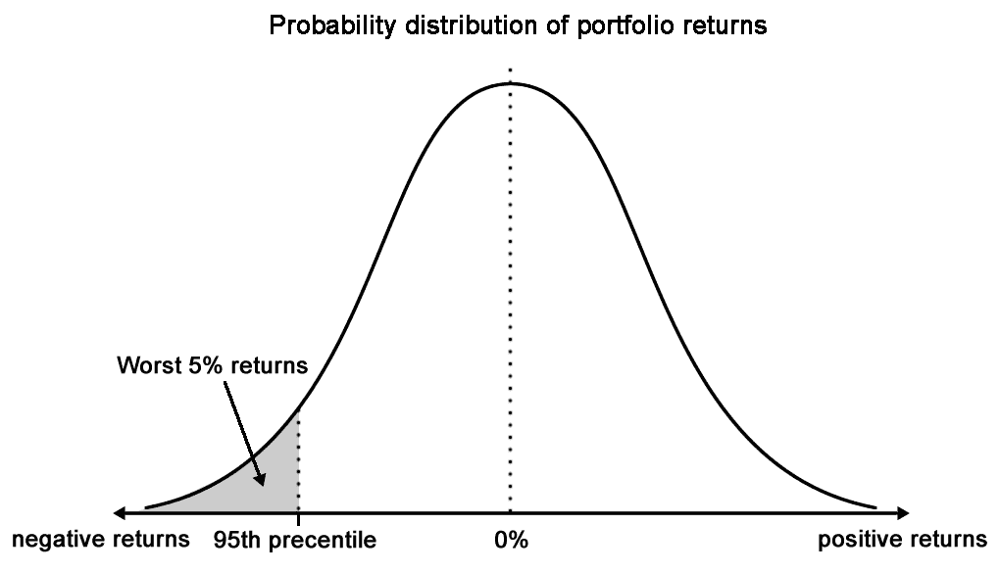
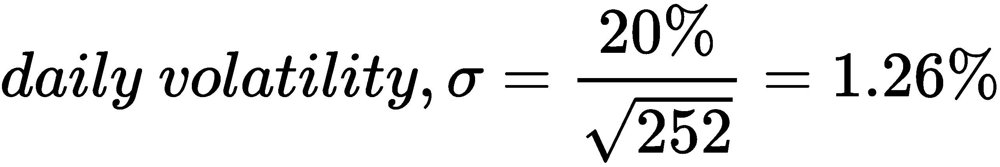
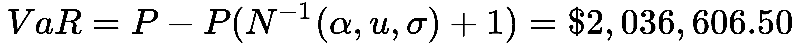

# 构建算法交易平台

算法交易使系统交易过程自动化，在系统交易过程中，基于各种因素（如定价、时间和数量）以尽可能最佳的价格执行订单。经纪公司可以提供**应用程序编程接口**（**API**）作为其服务的一部分，为希望部署自己交易算法的客户提供服务。算法交易系统必须具有高度鲁棒性，以处理订单执行期间的任何故障点。网络配置、硬件、内存管理、速度和用户体验是设计用于执行命令的系统时需要考虑的许多因素。设计更大的系统不可避免地增加了框架的复杂性。

一旦市场中的头寸被打开，它就会面临各种类型的风险，如市场风险、利率风险和流动性风险。为了尽可能保护交易资本，将风险管理措施纳入交易系统非常重要。也许金融业最常用的风险度量是**风险价值**（**VaR**技术。我们将讨论 VaR 的优点和缺陷，以及如何将其纳入我们将在本章中开发的交易系统。

在本章中，我们将介绍以下主题：

*   算法交易概述
*   具有公共 API 的代理和系统供应商列表
*   为交易系统选择编程语言
*   设计一个算法交易平台
*   在 OANDAV20 Python 模块上设置 API 访问
*   实施均值回复算法交易策略
*   实施趋势跟踪算法交易策略
*   在我们的交易系统中引入 VaR 进行风险管理
*   在 AAPL 上用 Python 执行 VaR 计算

# 引入算法交易

20 世纪 90 年代，交易所已经开始使用电子交易系统。到 1997 年，全世界有 44 家交易所使用自动化系统进行期货和期权交易，更多的交易所正在开发自动化技术。**芝加哥交易所**（**芝加哥期货交易所**）和**伦敦国际金融期货和期权交易所**（**伦敦金融期货和期权交易所**）等交易所使用其电子交易系统作为传统公开叫价交易平台的下班后补充，因此，交易员可以 24 小时使用交易所的风险管理工具。随着技术的进步，基于技术的交易变得更加便宜，推动了更快、更强大的交易平台的发展。订单执行的高可靠性和较低的消息传输错误率加深了金融机构对技术的依赖。此后，大多数资产管理公司、自营交易员和做市商都从交易场所转移到了电子交易场所。

随着系统化或计算机化交易变得越来越普遍，速度是决定交易结果的最重要因素。定量投资者通过利用复杂的基本面模型，能够动态地重新计算交易产品的公允价值，并执行交易决策，使他们能够以使用传统工具的基本面交易者为代价获取利润。这已经让位于术语**高频交易**（**高频交易**），它依靠快速计算机在其他人之前执行交易决策。事实上，HFT 已经发展成为一个价值十亿美元的产业。

算法交易是指系统交易过程的自动化，其中订单执行经过大量优化，以提供可能的最佳价格。这不是投资组合分配过程的一部分。

银行、对冲基金、经纪公司、清算公司和交易公司通常将其服务器放在电子交易所旁边，以接收最新的市场价格，并在可能的情况下以最快的速度执行订单。他们给交易所带来了巨大的交易量。任何希望通过获得 exchange 连接参与低延迟、高交易量交易活动（如复杂事件处理或捕捉短暂的价格差异）的人都可以通过共址的形式参与，其服务器硬件可以免费放置在 exchange 旁边的机架上。

**金融信息交换**（**FIX**协议）是从专用服务器**直接市场准入**（**DMA**）到实时信息交换的电子通信行业标准。C++是常用的固定 FIX 协议的编程语言，但也可以使用其他语言，如.NETFramework 通用语言和 java 语言。对于散户投资者来说，**代表性状态转移**（**REST**）API 产品正变得越来越普遍。在创建算法交易平台之前，您需要评估各种因素，例如学习的速度和容易程度，然后再决定使用特定的语言。

经纪公司将为其客户提供某种交易平台，以便他们在选定的交易所执行订单，以换取佣金。一些经纪公司可能会向希望运行自己的交易算法的有技术倾向的客户提供 API 作为其服务的一部分。在大多数情况下，客户还可以从第三方供应商提供的许多商业交易平台中进行选择。其中一些交易平台还可以提供 API 访问，以电子方式将订单发送至交易所。事先阅读 API 文档对于理解经纪人提供的技术能力和制定开发算法交易系统的方法非常重要。

# 使用公共 API 的交易平台

下表列出了一些公开 API 文档的经纪人和交易平台供应商：

| 

**经纪人/卖方**

 | 

**URL**

 | 

**支持的编程语言**

 |
| --- | --- | --- |
| CQG | [https://www.cqg.com](https://www.cqg.com) | REST、FIX、C++、C++和 VB/VBA |
| 坎宁安交易系统 | [http://www.ctsfutures.com](http://www.ctsfutures.com) | Microsoft.Net Framework 4.0 及其修复程序 |
| E*贸易 | [https://developer.etrade.com/home](https://developer.etrade.com/home) | Python、Java 和 Node.js |
| 互动经纪人 | [https://www.interactivebrokers.com/en/index.php?f=5041](https://www.interactivebrokers.com/en/index.php?f=5041) | java，C++，Python，C++，C++，DDE |
| 免疫球蛋白 | [https://labs.ig.com/](https://labs.ig.com/) | REST、Java、JavaScript、.NET、Clojure 和 Node.js |
| 贸易家 | [https://developer.tradier.com/](https://developer.tradier.com/) | 休息 |
| 贸易技术 | [https://www.tradingtechnologies.com/trading/apis/](https://www.tradingtechnologies.com/trading/apis/) | REST、.NET 和 FIX |
| 奥达 | [https://developer.oanda.com/](https://developer.oanda.com/) | REST、Java 和 FIX |
| FXCM | [https://www.fxcm.com/uk/algorithmic-trading/api-trading/](https://www.fxcm.com/uk/algorithmic-trading/api-trading/) | REST、Java 和 FIX |

# 选择编程语言

由于有许多编程语言可供选择以与经纪人或供应商进行交互，任何一个刚开始从事算法交易平台开发的人都会自然而然地想到的问题是*我应该使用哪种语言？*

在回答这个问题之前，了解您的代理是否提供开发人员工具是很重要的。RESTful API 正在成为与修复协议访问一起最常见的产品。少数代理支持 Java 和 C#。使用 RESTful API，几乎可以用任何支持**超文本传输协议**（**HTTP**的编程语言搜索，甚至编写一个包装器。

请记住，每个工具选项都有其自身的局限性。您的经纪人可能会对限价和事件更新进行评级。您的产品将如何开发、要遵循的性能指标、涉及的成本、延迟阈值、风险度量以及预期的用户界面都是需要考虑的难题。风险管理器、执行引擎和投资组合优化器是影响系统设计的一些主要组件。您现有的交易基础设施、操作系统的选择、编程语言编译器功能以及可用的软件工具对系统设计、开发和部署构成了进一步的限制。

# 系统功能

定义交易系统的结果很重要。结果可能是建立一个基于研究的系统，从数据供应商处获取高质量数据，执行计算或运行模型，并通过信号生成评估策略。研究组件的一部分可能包括一个数据清理模块或一个回溯测试接口，用于在历史数据上运行带有理论参数的策略。CPU 速度、内存大小和带宽是设计系统时需要考虑的因素。

另一个结果可能是基于执行的系统，它更关注风险管理和订单处理功能，以确保多个订单的及时执行。为了处理订单执行期间的任何故障点，系统必须具有高度的鲁棒性。因此，在设计执行命令的系统时，需要考虑网络配置、硬件、内存管理和速度以及用户体验等因素。

一个系统可以包含一个或多个这些功能。设计更大的系统不可避免地增加了框架的复杂性。建议您选择一种或多种编程语言，以解决和平衡交易系统的开发速度、易开发性、可扩展性和可靠性。

# 构建算法交易平台

在本节中，我们将用 Python 设计并构建一个实时算法交易系统。由于每个经纪人的开发工具和产品各不相同，因此必须考虑与我们自己的交易系统集成所需的不同编程实现。通过良好的系统设计，我们可以构建一个通用服务，允许不同经纪人的配置与我们的交易系统很好地配合使用。

# 设计代理接口

在设计交易平台时，以下三项功能是实现任何给定交易计划的理想功能：

*   **获取价格**：定价数据是交易所提供的最基本的信息单位之一。它表示市场为买卖交易产品而制定的报价。代理可以重新分发来自 exchange 的数据，并以其自己的格式发送给您。可用价格数据的最基本形式是报价的日期和时间、交易产品的符号以及交易产品的报价和要价。通常情况下，这些定价数据对您的交易决策非常有用。

The best quoted bidding and asking prices are known as the **Level 1** quote. In most cases, it is possible to request for Level 2, 3, or even additional quote levels from your broker.

*   **向市场发送订单**：向市场发送订单时，您的经纪人或交易所可能会执行，也可能不会执行。如果它真的被执行，你将在交易产品中打开一个仓位，并承受所有形式的风险和回报。最简单的订单形式包括要交易的产品（通常用符号表示）、要交易的数量、你想采取的立场（即，你是买还是卖），以及非市场订单的交易价格。根据您的需要，有许多不同类型的订单可用于帮助管理您的交易风险。

Your broker may not support all order types. It is prudent to check with your broker which types of order are available and which can best manage your trading risks. The most common order type used by market participants are market orders, limit orders, and good-till-canceled orders. A **market order** is an order to buy or sell a product right away in the market. Because it is executed based on the current market prices, an execution price is not required for this type of order. A **limit order** is an order to buy or sell a product at a specific or better price. A **good-till-canceled** (**GTC**) order is an order that remains in the exchange queue for execution until the stated expiry time. Unless specified, most orders are GTC orders that expire at the end of the trading day. You can find more information of various order types at [https://www.investopedia.com/university/how-start-trading/how-start-trading-order-types.asp](https://www.investopedia.com/university/how-start-trading/how-start-trading-order-types.asp).

*   **跟踪位置：**您的订单一经执行，即进入一个位置。跟踪你的未平仓头寸将有助于确定你的交易策略做得有多好（或糟糕！），以及管理和规划你的风险。您的未平仓损益随市场波动而变化，称为**未实现损益**。平仓后，您将获得**已实现损益**，这是您交易策略的最终结果。

考虑到这三个基本功能，我们可以设计一个实现这些功能的通用`Broker`类，该类可以轻松地扩展到任何特定于代理的配置。

# Python 库要求

在本章中，我们将使用公开的 v20 模块，Oanda 作为我们的代理。本章中提到的所有方法实现都以`v20`Python 库为例。

# 安装 v20

OANDA v20 REST API 的官方存储库位于[https://github.com/oanda/v20-python](https://github.com/oanda/v20-python) 。使用 pip 和 terminal 命令安装：

```py
pip install v20 
```

Detailed documentation on the use of the OANDA v20 REST API can be found at [http://developer.oanda.com/rest-live-v20/introduction/](http://developer.oanda.com/rest-live-v20/introduction/). The use of APIs varies with each broker, so make sure that you consult with your broker for the appropriate documentation before writing your trading system implementation.

# 编写事件驱动的代理类

无论我们是获取价格、发送订单还是跟踪头寸，事件驱动的系统设计都将以多线程方式触发系统的关键部分，而不会阻塞主线程。

让我们开始用 Python 编写`Broker`类，如下所示：

```py
from abc import abstractmethod

class Broker(object):
    def __init__(self, host, port):
        self.host = host
        self.port = port

        self.__price_event_handler = None
        self.__order_event_handler = None
        self.__position_event_handler = None
```

在构造函数中，我们可以为继承的子类提供代理的`host`和`port`公共连接配置。声明了三个变量，分别用于存储价格、订单和位置更新的事件处理程序。在这里，我们只为每个事件设计一个侦听器。更复杂的交易系统可能支持同一事件处理程序上的多个侦听器。

# 存储价格事件处理程序

在`Broker`类中，分别添加以下两个方法作为 price 事件处理程序的 getter 和 setter：

```py
@property
def on_price_event(self):
    """
    Listeners will receive: symbol, bid, ask
    """
    return self.__price_event_handler

@on_price_event.setter
def on_price_event(self, event_handler):
    self.__price_event_handler = event_handler
```

继承的子类将通过`on_price_event`方法调用符号、出价和要价通知侦听器。稍后，我们将使用这些基本信息进行交易决策。

# 存储订单事件处理程序

分别添加以下两个方法作为 order 事件处理程序的 getter 和 setter：

```py
@property
def on_order_event(self):
    """
    Listeners will receive: transaction_id
    """
    return self.__order_event_handler

@on_order_event.setter
def on_order_event(self, event_handler):
    self.__order_event_handler = event_handler
```

将订单路由到代理后，继承子类将通过`on_order_event`方法调用以及订单事务 ID 通知侦听器。

# 存储位置事件处理程序

添加以下两个方法作为 position 事件处理程序的 getter 和 setter：

```py
@property
def on_position_event(self):
    """
    Listeners will receive:
    symbol, is_long, units, unrealized_pnl, pnl
    """
    return self.__position_event_handler

@on_position_event.setter
def on_position_event(self, event_handler):
    self.__position_event_handler = event_handler
```

当从经纪人处收到头寸更新事件时，继承子类将通过包含符号信息、指示多头或空头头寸的标志、交易单位数量、未实现损益和已实现损益的`on_position_event`方法调用通知侦听器。

# 声明获取价格的抽象方法

由于从数据源获取价格是任何交易系统的主要需求，因此创建一个名为`get_prices()`的抽象方法来执行此功能。它期望一个`symbols`参数包含代理定义的符号列表，用于从我们的代理查询数据。继承的子类应实现此方法，否则会引发`NotImplementedError`异常：

```py
@abstractmethod
def get_prices(self, symbols=[]):
    """
    Query market prices from a broker
    :param symbols: list of symbols recognized by your broker
    """
    raise NotImplementedError('Method is required!')
```

请注意，此`get_prices()`方法预计将一次性获取当前市场价格。这给了我们一个特定时间的市场快照。对于一个持续运行的交易系统，我们将要求流式市场价格实时提供我们的交易逻辑，我们将在下一步进行定义。

# 声明流式价格的抽象方法

添加一个`stream_prices()`抽象方法，该方法使用以下代码接受流媒体价格中的符号列表：

```py
@abstractmethod
def stream_prices(self, symbols=[]):
    """"
    Continuously stream prices from a broker.
    :param symbols: list of symbols recognized by your broker
    """
    raise NotImplementedError('Method is required!')
```

希望继承的子类在从代理流式传输价格时实现此方法，否则将抛出一条`NotImplementedError`异常消息。

# 声明用于发送订单的抽象方法

为继承子类添加一个`send_market_order()`抽象方法，以便在向您的经纪人发送市场订单时实现：

```py
@abstractmethod
def send_market_order(self, symbol, quantity, is_buy):
    raise NotImplementedError('Method is required!')
```

使用前面在`Broker`基类中编写的方法，我们现在可以在下一节中编写特定于代理的类。

# 实现代理类

在本节中，我们将实现`Broker`类的抽象方法，这些方法特定于我们的代理 Oanda。这需要使用`v20`库。但是，您可以轻松地更改特定于您选择的代理的配置和任何实现的方法。

# 初始化代理类

编写以下`OandaBroker`类，该类特定于我们的代理，扩展了泛型`Broker`类：

```py
import v20

class OandaBroker(Broker):
    PRACTICE_API_HOST = 'api-fxpractice.oanda.com'
    PRACTICE_STREAM_HOST = 'stream-fxpractice.oanda.com'

    LIVE_API_HOST = 'api-fxtrade.oanda.com'
    LIVE_STREAM_HOST = 'stream-fxtrade.oanda.com'

    PORT = '443'

    def __init__(self, accountid, token, is_live=False):
        if is_live:
            host = self.LIVE_API_HOST
            stream_host = self.LIVE_STREAM_HOST
        else:
            host = self.PRACTICE_API_HOST
            stream_host = self.PRACTICE_STREAM_HOST

        super(OandaBroker, self).__init__(host, self.PORT)

        self.accountid = accountid
        self.token = token

        self.api = v20.Context(host, self.port, token=token)
        self.stream_api = v20.Context(stream_host, self.port, token=token)
```

注意，Oanda 对常规 API 端点和流式 API 端点使用两个不同的主机。这些端点因其实践和实时交易环境而异。所有端点都连接在标准的**安全套接字层**（**SSL**端口 440）上。在构造函数中，`is_live`布尔标志为所选交易环境选择适当的端点，以保存在父类中。`is_live`的`True`值表示实时交易环境。构造函数参数还保存帐户 ID 和令牌，这是验证用于交易的帐户所必需的。此信息可从您的经纪人处获得。

`api`和`stream_api`变量保存`v20`库的`Context`对象，调用方法使用这些对象向代理发送指令。

# 实现获取价格的方法

以下代码实现了`OandaBroker`类中的父`get_prices()`方法，用于从经纪人处获取价格：

```py
def get_prices(self, symbols=[]):
    response = self.api.pricing.get(
        self.accountid,
        instruments=",".join(symbols),
        snapshot=True,
        includeUnitsAvailable=False
    )
    body = response.body
    prices = body.get('prices', [])
    for price in prices:
        self.process_price(price)
```

响应的主体包含一个`prices`属性和一个对象列表。列表中的每个项目都通过`process_price()`方法进行处理。让我们在`OandaBroker`类中也实现这个方法：

```py
def process_price(self, price):
    symbol = price.instrument

    if not symbol:
        print('Price symbol is empty!')
        return

    bids = price.bids or []
    price_bucket_bid = bids[0] if bids and len(bids) > 0 else None
    bid = price_bucket_bid.price if price_bucket_bid else 0

    asks = price.asks or []
    price_bucket_ask = asks[0] if asks and len(asks) > 0 else None
    ask = price_bucket_ask.price if price_bucket_ask else 0

    self.on_price_event(symbol, bid, ask)
```

`price`对象包含字符串对象的`instrument`属性，以及`bids`和`asks`属性中的`list`对象。通常，1 级引号是可用的，所以我们阅读每个列表的第一项。列表中的每个项目都是一个`price_bucket`对象，我们从中提取出价和要价。

提取完这些信息后，我们将其传递给`on_price_event()`事件处理程序方法。注意，在本例中，我们只传递三个值。在更复杂的交易系统中，您可能需要考虑提取更详细的信息，如交易量、上次交易价格或多级报价，并将其传递给价格事件监听器。

# 流式定价方法的实现

在`OandaBroker`类中添加以下`stream_prices()`方法，开始从您的经纪人处进行价格流式传输：

```py
def stream_prices(self, symbols=[]):
    response = self.stream_api.pricing.stream(
        self.accountid,
        instruments=",".join(symbols),
        snapshot=True
    )

    for msg_type, msg in response.parts():
        if msg_type == "pricing.Heartbeat":
            continue
        elif msg_type == "pricing.ClientPrice":
            self.process_price(msg)
```

因为主机连接需要一个连续的流，`response`对象有一个`parts()`方法监听传入的数据。`msg`对象本质上是一个`price`对象，我们可以使用`process_price()`方法重用它来通知监听器传入的价格事件。

# 实现发送市场订单的方法

在`OandaBroker`类中添加以下`send_market_order()`方法，将向您的经纪人发送市场订单：

```py
def send_market_order(self, symbol, quantity, is_buy):
    response = self.api.order.market(
        self.accountid,
        units=abs(quantity) * (1 if is_buy else -1),
        instrument=symbol,
        type='MARKET',
    )
    if response.status != 201:
        self.on_order_event(symbol, quantity, is_buy, None, 'NOT_FILLED')
        return

    body = response.body
    if 'orderCancelTransaction' in body:
        self.on_order_event(symbol, quantity, is_buy, None, 'NOT_FILLED')
        return

    transaction_id = body.get('lastTransactionID', None) 
    self.on_order_event(symbol, quantity, is_buy, transaction_id, 'FILLED')
```

当调用 v20`order`库的`market()`方法时，响应的状态预计为`201`，以指示与代理的连接成功。建议对响应主体进行进一步检查，以查看执行订单时出现的错误迹象。在成功执行的情况下，通过调用`on_order_event()`事件处理程序将事务 ID 和订单的详细信息传递给侦听器。否则，订单事件将以空交易 ID 和`NOT_FILLED`状态触发，表示订单未完成。

# 位置提取方法的实现

在`OandaBroker`类中增加以下`get_positions()`方法，获取给定账户的所有可用头寸信息：

```py
def get_positions(self):
    response = self.api.position.list(self.accountid)
    body = response.body
    positions = body.get('positions', [])
    for position in positions:
        symbol = position.instrument
        unrealized_pnl = position.unrealizedPL
        pnl = position.pl
        long = position.long
        short = position.short

        if short.units:
            self.on_position_event(
                symbol, False, short.units, unrealized_pnl, pnl)
        elif long.units:
            self.on_position_event(
                symbol, True, long.units, unrealized_pnl, pnl)
        else:
            self.on_position_event(
                symbol, None, 0, unrealized_pnl, pnl)
```

在响应主体中，`position`属性包含一个`position`对象列表，每个对象都具有合同符号、未实现和已实现损益以及多头和空头头寸数量的属性。此信息通过`on_position_event()`事件处理程序传递给侦听器。

# 获取价格

使用现在定义的`broker`方法，我们可以通过读取当前市场价格来测试我们的经纪人之间建立的联系。`Broker`类可以使用以下 Python 代码进行实例化：

```py
# Replace these 2 values with your own!
ACCOUNT_ID = '101-001-1374173-001'
API_TOKEN = '6ecf6b053262c590b78bb8199b85aa2f-d99c54aecb2d5b4583a9f707636e8009'

broker = OandaBroker(ACCOUNT_ID, API_TOKEN)
```

将两个常量变量`ACCOUNT_ID`和`API_TOKEN`替换为经纪人提供的您自己的凭证，该凭证标识您自己的交易账户。`broker`变量是`OandaBroker`的一个实例，我们可以使用它执行各种特定于代理的调用。

假设我们有兴趣了解欧元/美元货币对的当前市场价格。让我们定义一个常量变量来保存经纪人认可的该工具的符号：

```py
SYMBOL = 'EUR_USD'
```

接下来，使用以下代码定义来自我们的代理的价格事件侦听器：

```py
import datetime as dt

def on_price_event(symbol, bid, ask):
   print(
        dt.datetime.now(), '[PRICE]',
        symbol, 'bid:', bid, 'ask:', ask
    )

broker.on_price_event = on_price_event
```

`on_price_event()`函数定义为传入价格信息的侦听器，并分配给`broker.on_price_event`事件处理程序。我们期望定价事件中有三个值–合同符号、出价和要价–我们只需打印到控制台即可。

调用`get_prices()`方法从我们的经纪人处获取当前市场价格：

```py
broker.get_prices(symbols=[SYMBOL])
```

我们应该在控制台上获得类似的输出，如下所示：

```py
2018-11-19 21:29:13.214893 [PRICE] EUR_USD bid: 1.14361 ask: 1.14374
```

输出为单行，显示欧元/美元货币对的买入价和卖出价分别为`1.14361`和`1.14374`。

# 发送简单的市场订单

与我们获取价格的方式相同，我们可以重用`broker`变量向我们的经纪人发送市场订单。

现在假设我们有兴趣购买同一欧元/美元货币对的一个单位；以下代码执行此操作：

```py
def on_order_event(symbol, quantity, is_buy, transaction_id, status):
    print(
        dt.datetime.now(), '[ORDER]',
        'transaction_id:', transaction_id,
        'status:', status,
        'symbol:', symbol,
        'quantity:', quantity,
        'is_buy:', is_buy,
    )

broker.on_order_event = on_order_event
broker.send_market_order(SYMBOL, 1, True)
```

`on_order_event()`函数被定义为从我们的代理接收订单更新的侦听器，并被分配给`broker.on_order_event`事件处理程序。例如，此方法将调用已执行的限制订单或已取消的订单。最后，`send_market_order()`方法表明我们有兴趣购买欧元/美元货币对中的一个单位。

如果在运行上述代码时货币市场是开放的，则应使用不同的交易 ID 获得以下结果：

```py
2018-11-19 21:29:13.484685 [ORDER] transaction_id: 754 status: FILLED symbol: EUR_USD quantity: 1 is_buy: True
```

输出显示订单已成功填写，以购买交易 ID 为`754`的欧元/美元货币对的一个单位。

# 获取职位更新

通过发送市场订单买入多头头寸，我们应该能够查看我们当前的欧元/美元头寸。我们可以使用以下代码对`broker`对象执行此操作：

```py
def on_position_event(symbol, is_long, units, upnl, pnl):
    print(
        dt.datetime.now(), '[POSITION]',
        'symbol:', symbol,
        'is_long:', is_long,
        'units:', units,
        'upnl:', upnl,
        'pnl:', pnl
    )

broker.on_position_event = on_position_event
broker.get_positions()
```

`on_position_event()`函数被定义为从我们的代理接收位置更新的侦听器，并被分配给`broke.on_position_event`事件处理程序。调用`get_positions()`方法时，经纪人返回头寸信息并触发以下输出：

```py
2018-11-19 21:29:13.752886 [POSITION] symbol: EUR_USD is_long: True units: 1.0 upnl: -0.0001 pnl: 0.0
```

我们的头寸报表目前为欧元/美元货币对中的一个多头单位，未实现损失为 0.0001 美元。由于这是我们的第一笔交易，我们还没有实现任何盈利或亏损。

# 建立均值回复算法交易系统

随着我们的经纪人现在接受订单并响应我们的请求，我们可以开始设计一个完全自动化的交易系统。在本节中，我们将探讨如何设计和实现均值回复算法交易系统。

# 均值回归算法的设计

假设我们相信，在正常市场条件下，价格会波动，但往往会恢复到某个短期水平，如最近价格的平均值。在本例中，我们假设欧元/美元货币对在短期内表现出均值回归特性。首先，我们将原始的滴答级别数据重新采样为标准的时间序列间隔，例如，每隔一分钟。然后，以最近几个时段计算短期平均价格（例如，五个时段），我们认为欧元/美元价格将恢复到前五分钟的平均价格。

一旦欧元/美元货币对的投标价格超过短期平均价格，以 5 分钟为例，我们的交易系统将生成卖出信号，我们可以选择通过卖出市场指令进入空头头寸。同样，当欧元/美元的要价低于平均价格时，会产生买入信号，我们可以选择通过买入市场指令进入多头头寸。

一旦仓位打开，我们可以使用相同的信号关闭仓位。当多头仓位打开时，我们根据卖出信号关闭仓位，在市场上输入卖出指令。同样，当空头仓位打开时，我们通过在市场上输入买入指令，在买入信号下平仓。

你可能会注意到我们的交易策略有很多缺陷。平仓并不能保证盈利。我们对市场的信念可能是错误的；在不利的市场条件下，信号可能会在一个方向上保持一段时间，并且很有可能以巨大损失结束我们的头寸！作为一个交易者，你应该找出一个适合你的信念和风险偏好的个人交易策略。

# 实现均值回归交易员类

我们计算中的重采样间隔和周期数是我们交易系统要求的两个重要参数。首先，创建一个名为`MeanReversionTrader`的类，我们可以将其实例化并作为交易系统运行：

```py
import time
import datetime as dt
import pandas as pd

class MeanReversionTrader(object):
    def __init__(
        self, broker, symbol=None, units=1,
        resample_interval='60s', mean_periods=5
    ):
        """
        A trading platform that trades on one side
            based on a mean-reverting algorithm.

        :param broker: Broker object
        :param symbol: A str object recognized by the broker for trading
        :param units: Number of units to trade
        :param resample_interval: 
            Frequency for resampling price time series
        :param mean_periods: Number of resampled intervals
            for calculating the average price
        """
        self.broker = self.setup_broker(broker)

        self.resample_interval = resample_interval
        self.mean_periods = mean_periods
        self.symbol = symbol
        self.units = units

        self.df_prices = pd.DataFrame(columns=[symbol])
        self.pnl, self.upnl = 0, 0

        self.mean = 0
        self.bid_price, self.ask_price = 0, 0
        self.position = 0
        self.is_order_pending = False
        self.is_next_signal_cycle = True
```

构造器中的五个参数初始化交易系统的状态–使用的经纪人、交易符号、交易单位数量、价格数据的重采样间隔以及平均计算周期数。这些值仅存储为类变量。

`setup_broker()`方法调用将我们的类设置为处理`broker`对象中的事件，我们将很快定义该对象。当我们收到价格数据时，这些数据存储在`pandas`数据帧变量`df_prices`中。最新的买卖价格存储在`bid_price`和`ask_price`变量中，用于计算信号。`mean`变量将存储先前数量的`mean_period`价格的计算平均值。`position`变量将存储当前位置的单位数。负值表示空头仓位，正值表示多头仓位。

`is_order_pending`布尔标志表示我们的经纪人是否正在等待执行订单，`is_next_signal_cycle`布尔标志表示当前交易状态周期是否打开。请注意，我们的系统状态可以如下所示：

1.  等待买入或卖出信号。
2.  在买入或卖出信号上下订单。
3.  开仓后，等待卖出或买入信号。
4.  在卖出或买入信号上下订单。
5.  当位置关闭时，转至步骤 1。

对于从 1 到 5 的每个步骤周期，我们将只交易一个单位。这些布尔标志充当锁，以防止多个订单同时进入系统。

# 添加事件侦听器

让我们在`MeanReversionTrader`课程中连接价格、订单和位置事件。

将`setup_broker()`方法添加到此类中，如下所示：

```py
def setup_broker(self, broker):
    broker.on_price_event = self.on_price_event
    broker.on_order_event = self.on_order_event
    broker.on_position_event = self.on_position_event
    return broker
```

我们只是在任何代理生成的事件上分配三个类方法作为侦听器，以侦听价格、订单和头寸更新。

将`on_price_event()`方法添加到此类中，如下所示：

```py
def on_price_event(self, symbol, bid, ask):
    print(dt.datetime.now(), '[PRICE]', symbol, 'bid:', bid, 'ask:', ask)

    self.bid_price = bid
    self.ask_price = ask
    self.df_prices.loc[pd.Timestamp.now(), symbol] = (bid + ask) / 2.

    self.get_positions()
    self.generate_signals_and_think()

    self.print_state()
```

当收到价格事件时，我们将其存储在我们的`bid_price`、`ask_price`和`df_prices`类变量中。随着价格的变化，我们的未平仓头寸和信号值也会随之变化。`get_position()`方法调用检索我们头寸的最新信息，`generate_signals_and_think()`调用重新计算我们的信号并决定是否进行交易。使用`print_state()`命令将系统的当前状态打印到控制台。

编写`get_position()`方法从我们的经纪人处检索头寸信息，如下所示：

```py
def get_positions(self):
    try:
        self.broker.get_positions()
    except Exception as ex:
        print('get_positions error:', ex)
```

将`on_order_event()`方法添加到我们的类中，如下所示：

```py
def on_order_event(self, symbol, quantity, is_buy, transaction_id, status):
    print(
        dt.datetime.now(), '[ORDER]',
        'transaction_id:', transaction_id,
        'status:', status,
        'symbol:', symbol,
        'quantity:', quantity,
        'is_buy:', is_buy,
    )
    if status == 'FILLED':
        self.is_order_pending = False
        self.is_next_signal_cycle = False

        self.get_positions()  # Update positions before thinking
        self.generate_signals_and_think()
```

当收到订单事件时，我们将它们打印到控制台。在我们经纪人的`on_order_event`实现中，成功执行的订单将传递`status`值`FILLED`或`UNFILLED`。只有订单成功，我们才能关闭布尔锁，检索最新位置，并执行关闭位置的决策。

将`on_position_event()`方法添加到我们的类中，如下所示：

```py
def on_position_event(self, symbol, is_long, units, upnl, pnl):
    if symbol == self.symbol:
        self.position = abs(units) * (1 if is_long else -1)
        self.pnl = pnl
        self.upnl = upnl
        self.print_state()
```

当收到预期交易符号的头寸更新事件时，我们存储头寸信息、已实现收益和未实现收益。使用`print_state()`命令将系统的当前状态打印到控制台。

将`print_state()`方法添加到我们的类中，如下所示：

```py
def print_state(self):
    print(
        dt.datetime.now(), self.symbol, self.position_state, 
        abs(self.position), 'upnl:', self.upnl, 'pnl:', self.pnl
    )
```

一旦我们的订单、头寸或市场价格有任何更新，我们就会将系统的最新状态打印到控制台上。

# 编写均值回复信号发生器

我们希望我们的决策算法能够在每次价格或订单更新时重新计算交易信号。让我们在`MeanReversionTrader`类中创建一个`generate_signals_and_think()`方法来实现这一点：

```py
def generate_signals_and_think(self):
    df_resampled = self.df_prices\
        .resample(self.resample_interval)\
        .ffill()\
        .dropna()
    resampled_len = len(df_resampled.index)

    if resampled_len < self.mean_periods:
        print(
            'Insufficient data size to calculate logic. Need',
            self.mean_periods - resampled_len, 'more.'
        )
        return

    mean = df_resampled.tail(self.mean_periods).mean()[self.symbol]

    # Signal flag calculation
    is_signal_buy = mean > self.ask_price
    is_signal_sell = mean < self.bid_price

    print(
        'is_signal_buy:', is_signal_buy,
        'is_signal_sell:', is_signal_sell,
        'average_price: %.5f' % mean,
        'bid:', self.bid_price,
        'ask:', self.ask_price
    )

    self.think(is_signal_buy, is_signal_sell)
```

由于价格数据以数据帧的形式存储在`df_prices`变量中，因此我们可以按照构造函数中给出的`resample_interval`变量的定义，定期对其重新采样。`ffill()`方法向前填充任何缺失的数据，`dropna()`命令删除重新采样后的第一个缺失值。必须有足够的数据可用于计算平均值，否则该方法简单可行。`mean_periods`变量表示必须可用的重采样数据的最小长度。

`tail(self.mean_periods)`方法采用最近的重采样间隔，并使用`mean()`方法计算平均值，从而产生另一个数据帧。平均水平通过引用数据框列的索引获取，该列只是仪器符号。

使用均值回归算法可用的平均价格，我们可以生成买入和卖出信号。这里，当平均价格超过市场要价时生成买入信号，当平均价格超过市场竞价时生成卖出信号。我们的短期信念是，市场价格将恢复到平均价格。

在将这些计算值打印到控制台以进行更好的调试之后，我们现在可以利用买入和卖出信号在同一类中以一个名为`think()`的单独方法执行实际交易：

```py
def think(self, is_signal_buy, is_signal_sell):
    if self.is_order_pending:
        return

    if self.position == 0:
        self.think_when_flat_position(is_signal_buy, is_signal_sell)
    elif self.position > 0:
        self.think_when_position_long(is_signal_sell)
    elif self.position < 0: 
        self.think_when_position_short(is_signal_buy)       
```

如果代理的订单仍处于挂起状态，我们只需不执行任何操作并退出该方法。由于市场状况随时可能发生变化，您可能需要添加自己的逻辑来处理处于待定状态太长时间的订单，然后尝试另一种策略。

当我们的仓位持平、多头或空头时，三个 if-else 语句分别处理交易逻辑。当我们的位置平坦时，调用`think_when_position_flat()`方法，如下所示：

```py
def think_when_position_flat(self, is_signal_buy, is_signal_sell):
    if is_signal_buy and self.is_next_signal_cycle:
        print('Opening position, BUY', 
              self.symbol, self.units, 'units')
        self.is_order_pending = True
        self.send_market_order(self.symbol, self.units, True)
        return

    if is_signal_sell and self.is_next_signal_cycle:
        print('Opening position, SELL', 
              self.symbol, self.units, 'units')
        self.is_order_pending = True
        self.send_market_order(self.symbol, self.units, False)
        return

    if not is_signal_buy and not is_signal_sell:
        self.is_next_signal_cycle = True
```

第一个`if`语句处理的条件是，在收到买入信号且当前交易周期开放时，我们通过发送市场指令买入并将该指令标记为待定，从而进入多头头寸。相反，第二个`if`语句处理在卖出信号时进入空头头寸的条件。否则，由于持仓持平，没有买入或卖出信号，我们只需将`is_next_signal_cycle`设置为`True`，直到信号可用。

当我们处于多头位置时，调用`think_when_position_long()`方法，如下所示：

```py
def think_when_position_long(self, is_signal_sell):
    if is_signal_sell:
        print('Closing position, SELL', 
              self.symbol, self.units, 'units')
        self.is_order_pending = True
        self.send_market_order(self.symbol, self.units, False)
```

在卖出信号下，我们将订单标记为待定，并通过发送市场订单立即平仓。

同样，当我们处于空头头寸时，调用`think_when_position_short()`方法，如下所示：

```py
def think_when_position_short(self, is_signal_buy):
    if is_signal_buy:
        print('Closing position, BUY', 
              self.symbol, self.units, 'units')
        self.is_order_pending = True
        self.send_market_order(self.symbol, self.units, True)
```

在买入信号下，我们将订单标记为待定，并通过发送市场订单进行买入，立即平仓。

要执行订单路由功能，请将以下`send_market_order()`类方法添加到我们的`MeanReversionTrader`类中：

```py
def send_market_order(self, symbol, quantity, is_buy):
    self.broker.send_market_order(symbol, quantity, is_buy)
```

订单信息被简单地转发给我们的`Broker`类执行。

# 管理我们的交易系统

最后，要开始运行我们的交易系统，我们需要一个入口点。将以下`run()`类方法添加到`MeanReversionTrader`类中：

```py
def run(self):
    self.get_positions()
    self.broker.stream_prices(symbols=[self.symbol])
```

在交易系统的第一次运行期间，我们读取当前头寸，并使用该信息初始化所有与头寸相关的信息。然后，我们请求我们的代理开始为给定符号流式传输价格，并保持连接，直到程序终止。

定义了入口点后，我们只需初始化`MeanReversionTrader`类并使用以下代码调用`run()`命令：

```py
trader = MeanReversionTrader(
    broker, 
    symbol='EUR_USD', 
    units=1
    resample_interval='60s', 
    mean_periods=5,
)
trader.run()
```

请记住，`broker`变量包含一个`OandaBroker`类的实例，该类是在前面的*获取价格*部分中定义的，我们可以将其用于该类。我们的交易系统将使用此 broker 对象执行与 broker 相关的调用。我们对欧元/美元货币对感兴趣，每次交易一个单位。值为`60s`的`resample_interval`变量表示我们的存储价格将每隔一分钟重新采样一次。值为`5`的`mean_periods`变量表示，我们将取最近五个区间的平均值，或过去五分钟的平均价格。

要启动我们的交易系统，请致电`run()`；价格更新将开始慢慢进入，使我们的系统能够自行交易。您应该在控制台上看到类似于以下内容的输出：

```py
...
2018-11-21 15:19:34.487216 [PRICE] EUR_USD bid: 1.1393 ask: 1.13943
2018-11-21 15:19:35.686323 EUR_USD FLAT 0 upnl: 0.0 pnl: 0.0
Insufficient data size to calculate logic. Need 5 more.
2018-11-21 15:19:35.694619 EUR_USD FLAT 0 upnl: 0.0 pnl: 0.0
...
```

从产出来看，我们的头寸目前似乎持平，没有足够的定价数据来计算我们的交易信号。

五分钟后，当有足够的数据进行交易信号计算时，我们应该能够观察到以下结果：

```py
...
2018-11-21 15:25:07.075883 EUR_USD FLAT 0 upnl: 0.0 pnl: -0.3246
is_signal_buy: False is_signal_sell: True average_price: 1.13934 bid: 1.13936 ask: 1.13949
Opening position, SELL EUR_USD 1 units
2018-11-21 15:25:07.356520 [ORDER] transaction_id: 2848 status: FILLED symbol: EUR_USD quantity: 1 is_buy: False
2018-11-21 15:25:07.688082 EUR_USD SHORT 1.0 upnl: -0.0001 pnl: 0.0
is_signal_buy: False is_signal_sell: True average_price: 1.13934 bid: 1.13936 ask: 1.13949
2018-11-21 15:25:07.692292 EUR_USD SHORT 1.0 upnl: -0.0001 pnl: 0.0

...
```

过去五分钟的平均价格为`1.13934`。由于欧元/美元的当前市场竞价为`1.13936`，高于平均价格，因此产生卖出信号。生成卖出市场指令，以欧元/美元的单位空头头寸。这导致未实现损失 0.0001 美元。

让系统自己运行一段时间，它应该能够自己结算头寸。要停止交易，请使用*Ctrl*+*Z*或类似方式终止运行过程。记住，一旦程序停止运行，手动平仓任何剩余的交易头寸。您现在拥有一个功能齐全的自动化交易系统！

The system design and trading parameters here are stated as an example and don't necessarily lead to positive outcomes! You should experiment with various trading parameters and improve the handling of events to figure out the optimal strategy for your trading plan.

# 建立趋势跟踪交易平台

在上一节中，我们遵循了构建均值回复交易平台的步骤。同样的功能可以很容易地扩展到包含任何其他交易策略。在本节中，我们将了解如何重用`MeanReversionTrader`类来实现趋势跟踪交易系统。

# 设计趋势跟踪算法

假设这一次，我们认为当前的市场状况呈现出一种趋势跟踪模式，可能是由于季节变化、经济预测或政府政策。当价格波动时，当短期平均价格水平超过长期平均价格水平一定阈值时，我们产生买入或卖出信号。

首先，我们将原始滴答级别的数据重新采样为标准的时间序列间隔，例如，每隔一分钟。其次，以一些最近的时段为例，以五个时段为例，我们计算过去五分钟的短期平均价格。最后，以大量最近的时段为例，以十个时段为例，我们计算过去十分钟的长期平均价格。

在一个没有波动的市场中，平均短期价格应与平均长期价格相同，比率为 1–该比率也称为贝塔。当平均短期价格涨幅超过平均长期价格时，贝塔系数不止一个，市场可以被视为处于上升趋势。当短期价格下跌超过平均长期价格时，贝塔系数小于 1，市场可视为下跌趋势。

在上升趋势中，一旦贝塔超过某个价格阈值水平，我们的交易系统将产生买入信号，我们可以选择以买入市场指令进入多头头寸。类似地，在下跌趋势中，当贝塔值低于某个价格阈值水平时，会产生卖出信号，我们可以选择通过卖出市场指令进入空头头寸。

当一个位置被打开时，同样的信号可能被用来关闭我们的位置。当多头仓位打开时，我们根据卖出信号关闭仓位，在市场上输入卖出指令。同样，当空头头寸打开时，我们通过在市场上输入买入指令，在买入信号下平仓。

所提到的机制与均值回归交易系统的设计非常相似。请记住，这种算法并不能保证任何利润，只是对市场的一种过于简单的信念。你应该有一个不同（更好）的视角。

# 编写趋势跟踪交易员课程

让我们为趋势跟踪交易系统编写一个名为`TrendFollowingTreader`的新类，该类使用以下 Python 代码简单地扩展了`MeanReversionTrader`类：

```py
class TrendFollowingTrader(MeanReversionTrader):
    def __init__(
        self, *args, long_mean_periods=10,
        buy_threshold=1.0, sell_threshold=1.0, **kwargs
    ):
        super(TrendFollowingTrader, self).__init__(*args, **kwargs)

        self.long_mean_periods = long_mean_periods
        self.buy_threshold = buy_threshold
        self.sell_threshold = sell_threshold
```

在我们的构造函数中，我们定义了三个额外的关键字参数，`long_mean_periods`、`buy_threshold`和`sell_threshold`保存为类变量。`long_mean_periods`变量定义了时间序列价格的重采样间隔数，用于计算长期平均价格。请注意，父构造函数中现有的`mean_periods`变量用于计算短期平均价格。`buy_threshold`和`sell_threshold`变量包含确定生成买入或卖出信号时β边界的值。

# 编写趋势跟踪信号发生器

因为只有我们的父`MeanReversionTrader`类的决策逻辑需要修改，而其他一切，包括订单、放置和流式价格，都保持不变，所以我们只需覆盖`generate_signals_and_think()`方法，并使用以下代码实现新的趋势跟踪信号发生器：

```py
def generate_signals_and_think(self):
    df_resampled = self.df_prices\
        .resample(self.resample_interval)\
        .ffill().dropna()
    resampled_len = len(df_resampled.index)

    if resampled_len < self.long_mean_periods:
        print(
            'Insufficient data size to calculate logic. Need',
            self.mean_periods - resampled_len, 'more.'
        )
        return

    mean_short = df_resampled\
        .tail(self.mean_periods).mean()[self.symbol]
    mean_long = df_resampled\
        .tail(self.long_mean_periods).mean()[self.symbol]
    beta = mean_short / mean_long

    # Signal flag calculation
    is_signal_buy = beta > self.buy_threshold
    is_signal_sell = beta < self.sell_threshold

    print(
        'is_signal_buy:', is_signal_buy,
        'is_signal_sell:', is_signal_sell,
        'beta:', beta,
        'bid:', self.bid_price,
        'ask:', self.ask_price
    )

    self.think(is_signal_buy, is_signal_sell)
```

和以前一样，每次调用`generate_signals_and_think()`方法时，我们都会按照`resample_interval`定义的固定时间间隔对价格进行重新采样。计算信号所需的最小间隔现在由`long_mean_periods`而不是`mean_periods`定义。`mean_short`变量为短期平均重采样价格，`mean_long`变量为长期平均重采样价格。

`beta`变量是短期平均价格与长期平均价格的比率。当β值高于`buy_threshold`值时，生成买入信号，`is_signal_buy`变量为`True`。同样，当贝塔值低于`sell_threshold`值时，生成卖出信号，`is_signal_sell`变量为`True`。

交易参数被打印到控制台以进行调试，对父`think()`类方法的调用触发通常的市场订单买卖逻辑。

# 运行趋势跟踪交易系统

让我们通过实例化`TrendFollowingTrader`类并使用以下代码运行它来启动趋势跟踪交易系统：

```py
trader = TrendFollowingTrader(
    broker,
    resample_interval='60s',
    symbol='EUR_USD',
    units=1,
    mean_periods=5,
    long_mean_periods=10,
    buy_threshold=1.000010,
    sell_threshold=0.99990,
)
trader.run()
```

第一个参数`broker`与上一节中为我们的代理创建的对象相同。同样，我们每隔一分钟对时间序列价格进行重新采样，我们有兴趣交易欧元/美元货币对，在任何给定时间进入最多一个单位的头寸。`mean_periods`值为`5`，我们有兴趣将最近五次重新采样的时间间隔作为我们的短期平均价格来计算过去五分钟的平均价格。鉴于`long_mean_period`为`10`，我们有兴趣以最近 10 次重采样间隔计算过去 10 分钟的平均价格，作为我们的长期平均价格。

短期平均价格与长期平均价格之比作为贝塔系数。当贝塔值高于`buy_threshold`定义的值时，产生买入信号。当贝塔值低于`sell_threshold`定义的值时，产生卖出信号。

设置好交易参数后，调用`run()`方法启动交易系统。我们应该在控制台上看到类似于以下内容的输出：

```py
...
2018-11-23 08:51:12.438684 [PRICE] EUR_USD bid: 1.14018 ask: 1.14033
2018-11-23 08:51:13.520880 EUR_USD FLAT 0 upnl: 0.0 pnl: 0.0
Insufficient data size to calculate logic. Need 10 more.
2018-11-23 08:51:13.529919 EUR_USD FLAT 0 upnl: 0.0 pnl: 0.0
... 
```

在交易开始时，我们获得了当前的市场价格，处于平仓状态，既没有盈利也没有亏损。没有足够的数据来做出任何交易决定，我们必须等待 10 分钟才能看到计算出的参数生效。

If your trading system depends on a longer period of past data and you do not wish to wait for all this data to be collected, consider bootstrapping your trading system with historical data.

一段时间后，您将看到类似于以下内容的输出：

```py
...
is_signal_buy: True is_signal_sell: False beta: 1.0000333228980047 bid: 1.14041 ask: 1.14058
Opening position, BUY EUR_USD 1 units
2018-11-23 09:01:01.579208 [ORDER] transaction_id: 2905 status: FILLED symbol: EUR_USD quantity: 1 is_buy: True
2018-11-23 09:01:01.844743 EUR_USD LONG 1.0 upnl: -0.0002 pnl: 0.0
...
```

让系统自己运行一段时间，它应该能够自己结算头寸。要停止交易，请使用*Ctrl*+*Z*或类似方式终止运行过程。记住，一旦程序停止运行，手动平仓任何剩余的交易头寸。采取措施改变你的交易参数和决策逻辑，使你的交易系统成为一个有利可图的系统！

Note that the author is not responsible for any outcomes of your trading system! In a live trading environment, it takes more control parameters, order management, and position tracking to manage your risk effectively.

在下一节中，我们将讨论可应用于交易计划的风险管理策略。

# 风险管理的 VaR

一旦我们在市场上开仓，我们就面临各种类型的风险，如波动性风险和信用风险。为了尽可能保护我们的交易资本，将某种形式的风险管理措施纳入我们的交易系统是很重要的。

也许金融业中最常用的风险度量是 VaR 技术。它旨在简单地回答以下问题：*给定特定的概率水平，比如说 95%，在一定时间内，最坏的预期损失量是多少？*VaR 的美妙之处在于它可以应用于多个层面，从特定头寸的微观层面到基于投资组合的宏观层面。例如，100 万美元的风险值（1 天时间范围内 95%的置信水平）表明，平均而言，20 天中只有 1 天会因市场波动而损失超过 100 万美元。

下图显示了平均值为 0%的正态分布投资组合回报，其中 VaR 是与投资组合回报分布第 95 个百分位对应的损失：



假设我们管理着 1 亿美元的基金，该基金声称与标准普尔 500 指数基金具有相同的风险，预期回报率为 9%，标准差为 20%。为了使用方差-协方差法计算 5%风险水平或 95%置信水平下的每日 VaR，我们将使用以下公式：






这里，*P*是投资组合的价值，*N<sup>−1</sup>（α，u，σ）*为逆正态概率分布，风险等级为*α*，均值为*u*，标准差为*σ*。假设每年的交易天数为 252 天。结果表明，5%水平的日 VaR 为 2036606.50 美元。

然而，VaR 的使用并非没有缺陷。它没有考虑正态分布曲线尾部远端发生的极端事件的损失概率。超过某个 VaR 水平的损失规模也很难估计。我们调查的 VaR 使用历史数据和假设的恒定波动率水平——这些指标并不表明我们的未来表现。

让我们用一个实际的方法来计算股票价格的每日 VaR；我们将通过从数据源下载来调查 AAPL 股票价格：

```py
"""
Download the all-time AAPL dataset
"""
from alpha_vantage.timeseries import TimeSeries

# Update your Alpha Vantage API key here...
ALPHA_VANTAGE_API_KEY = 'PZ2ISG9CYY379KLI'

ts = TimeSeries(key=ALPHA_VANTAGE_API_KEY, output_format='pandas')
df, meta_data = ts.get_daily_adjusted(symbol='AAPL', outputsize='full')
```

数据集将作为数据帧下载到`df`变量：

```py
df.info()
```

这为我们提供了以下输出：

```py
<class 'pandas.core.frame.DataFrame'>
Index: 5259 entries, 1998-01-02 to 2018-11-23
Data columns (total 8 columns):
1\. open                 5259 non-null float64
2\. high                 5259 non-null float64
3\. low                  5259 non-null float64
4\. close                5259 non-null float64
5\. adjusted close       5259 non-null float64
6\. volume               5259 non-null float64
7\. dividend amount      5259 non-null float64
8\. split coefficient    5259 non-null float64
dtypes: float64(8)
memory usage: 349.2+ KB
```

我们的数据框架包含八列，价格从 1998 年开始到现在的交易日。兴趣栏是调整后的收盘价。假设我们有兴趣计算 2017 年的每日 VaR；让我们使用以下代码获取此数据集：

```py
import datetime as dt
import pandas as pd

# Define the date range
start = dt.datetime(2017, 1, 1)
end = dt.datetime(2017, 12, 31)

# Cast indexes as DateTimeIndex objects
df.index = pd.to_datetime(df.index)
closing_prices = df['5\. adjusted close']
prices = closing_prices.loc[start:end]
```

`prices`变量包含 2017 年的 AAPL 数据集。

使用前面讨论的公式，您可以使用以下代码实现`calculate_daily_var()`函数：

```py
from scipy.stats import norm

def calculate_daily_var(
    portfolio, prob, mean, 
    stdev, days_per_year=252.
):
    alpha = 1-prob
    u = mean/days_per_year
    sigma = stdev/np.sqrt(days_per_year)
    norminv = norm.ppf(alpha, u, sigma)
    return portfolio - portfolio*(norminv+1)
```

假设我们持有 1 亿美元的 AAPL 股票，我们有兴趣在 95%的置信水平下找到每日 VaR。我们可以使用以下代码定义 VaR 参数：

```py
import numpy as np

portfolio = 100000000.00
confidence = 0.95

daily_returns = prices.pct_change().dropna()
mu = np.mean(daily_returns)
sigma = np.std(daily_returns)
```

`mu`和`sigma`变量分别代表每日平均收益率百分比和每日收益率标准差。

我们可以通过调用`calculate_daily_var()`函数获得 VaR，如下所示：

```py
VaR = calculate_daily_var(
    portfolio, confidence, mu, sigma, days_per_year=252.)
print('Value-at-Risk: %.2f' % VaR)
```

我们将获得以下输出：

```py
Value-at-Risk: 114248.72
```

假设每年有 252 个交易日，置信度为 95%的 AAPL 股票 2017 年的每日风险值为 114248.72 美元。

# 总结

在本章中，我们介绍了交易从坑到电子交易平台的演变，并了解了算法交易是如何产生的。我们研究了一些提供 API 访问其交易服务的经纪人。为了帮助我们开始开发算法交易系统，我们使用 Oanda`v20`库实现了均值回归交易系统。

在设计事件驱动的代理接口类时，我们定义了用于侦听订单、价格和位置更新的事件处理程序。继承`Broker`类的子类只是使用特定于经纪人的函数扩展这个接口类，同时仍然保持底层交易函数与我们的交易系统兼容。通过获取市场价格、发送市场订单和接收头寸更新，我们成功地测试了与经纪人的联系。

我们讨论了一个简单的均值回归交易系统的设计，该系统根据历史平均价格的变动生成买入或卖出信号，并根据市场指令开仓和平仓。由于该交易系统仅使用一种交易逻辑源，因此需要进行更多的工作来构建一个强健、可靠和有利可图的交易系统。

我们还讨论了趋势跟踪交易系统的设计，该系统根据短期平均价格对长期平均价格的变动生成买入或卖出信号。有了一个设计良好的系统，我们看到通过简单地扩展均值回归父类并覆盖决策方法来修改现有交易逻辑是多么容易。

交易的一个关键方面是有效地管理风险。在金融行业，VaR 是最常用的风险度量技术。使用 Python，我们采用了一种实用的方法来计算 AAPL 上过去数据集的每日 VaR。

一旦我们建立了一个有效的算法交易系统，我们就可以探索其他方法来衡量我们交易策略的表现。其中一个领域是回溯测试；我们将在下一章讨论这个话题。