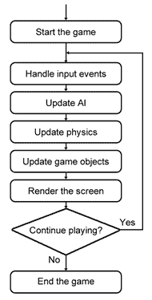
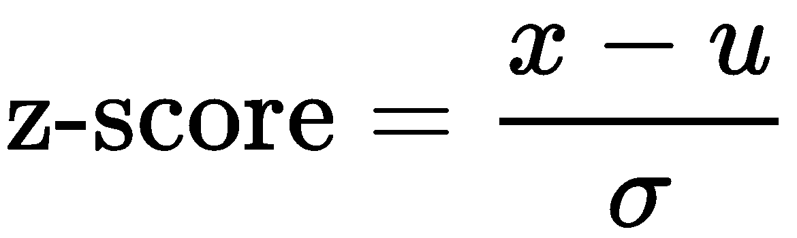

# 九、实现回溯测试系统

**回溯测试**是模拟模型驱动的投资策略对历史数据的反应。在设计和开发回溯测试的过程中，从创建视频游戏的概念来思考是很有帮助的。

在本章中，我们将使用面向对象的方法设计和实现一个事件驱动的回溯测试系统。我们的交易模型产生的利润和损失可以绘制在图表上，以帮助可视化我们交易策略的表现。然而，这是否足以确定它是否是一个好的模型？

在回溯测试中有许多问题需要解决，例如，交易成本的影响、订单的执行延迟、对详细交易的访问以及历史数据的质量。尽管有这些因素，创建回溯测试系统的主要目标是尽可能准确地测试模型。

回溯测试涉及到大量值得自己参考的研究。我们将简要地介绍一些在执行反测试时可能要考虑的想法。通常，在回溯测试中使用了许多算法。我们将简要讨论其中的一些：k-均值聚类、k-近邻、分类和回归树、2k 因子设计和遗传算法。

在本章中，我们将介绍以下主题：

*   引入回溯测试
*   回溯测试中的关注点
*   事件驱动的回溯测试系统的概念
*   回溯测试系统的设计与实现
*   编写类来存储交易数据和市场数据
*   为订单和职位编写类
*   写一个均值回复策略
*   运行一次或多次回测引擎
*   回溯测试模型的十点考虑
*   回溯测试算法探讨

# 引入回溯测试

回溯测试是模拟模型驱动的投资策略对历史数据的反应。使用回溯测试进行实验的目的是发现流程或系统。通过使用历史数据，您可以节省测试未来时期投资策略的时间。它可以帮助你根据测试期间的变动来测试投资理论。它还用于评估和校准投资模型。创建模型只是第一步。投资策略通常会使用该模型来帮助您推动模拟交易决策，并计算与风险或回报相关的各种因素。这些因素通常一起使用，以找到预测回报的组合。

# 回溯测试中的关注点

然而，在回溯测试中有许多问题需要解决：

*   回溯测试永远无法准确复制实际交易环境中投资策略的表现。
*   历史数据的质量值得怀疑，因为它受到第三方数据供应商的异常值的影响。
*   前瞻性偏见有多种形式。例如，上市公司可能拆分、合并或摘牌，导致其股价发生重大变化。
*   对于基于订单信息的策略，市场微观结构极难真实模拟，因为它代表了连续时间内的集体可见供需。这种供求关系反过来又受到世界各地新闻事件的影响。
*   冰山和静息订单是市场的一些隐藏因素，一旦激活，可能会影响市场结构
*   需要考虑的其他因素包括交易成本、订单的执行延迟以及从回溯测试中获取详细交易的权限。

尽管有这些因素，创建回溯测试系统的主要目标是尽可能准确地测试模型。

Look-ahead bias is the use of available future data during the period it is being analyzed, resulting in inaccurate results in the simulation or study. It is vital to use information that would be only available during the period of study. In finance, iceberg orders are large orders that are broken up into several small orders. Only a small portion of the order is visible to the public—just like the *tip of the iceberg*—while the mass of the actual order is hidden. A **resting order** is an order whose price is away from the market and is waiting to be executed.

# 事件驱动的回溯测试系统的概念

在设计和开发回溯测试的过程中，从创建视频游戏的概念来思考是很有帮助的。毕竟，我们正试图创建一个模拟的市场定价和订购环境，这与创建虚拟游戏世界非常相似。交易也可以被视为一种低买高卖的惊险游戏。

在虚拟交易环境中，模拟价格反馈、订单匹配引擎、订单簿管理以及账户和头寸更新功能都需要组件。为了实现这些功能，我们可以探索事件驱动的回溯测试系统的概念。

让我们从理解贯穿游戏开发过程的事件驱动编程范式的概念开始。系统通常接收事件作为其输入。它可能是用户输入的击键或鼠标移动。其他事件可能是由另一个系统、进程或传感器生成的消息，用于通知主机系统传入事件。

下图说明了游戏引擎系统中涉及的各个阶段：



让我们来看看一个主要游戏引擎循环的伪代码实现：

```py
while is_main_loop:  # Main game engine loop
     handle_input_events()
     update_AI()
     update_physics()
     update_game_objects()
     render_screen()
     sleep(1/60)  # Assuming a 60 frames-per-second video game rate
```

主游戏引擎循环中的核心功能可以处理生成的系统事件，如处理键盘事件的`handle_input_events()`功能：

```py
def handle_input_events()
    event = get_latest_event()
    if event.type == 'UP_KEY_PRESS':
        move_player_up()
    elif event.type == 'DOWN_KEY_PRESS':
        move_player_down()
```

使用事件驱动的系统，如前面的示例，通过能够交换和使用来自不同系统组件的类似事件，帮助我们实现代码模块化和可重用性。进一步加强了面向对象编程的使用，类在游戏中定义对象。在设计我们的交易平台时，这些功能对于与不同的市场数据源、多种交易算法和运行时环境进行接口特别有用。模拟的交易环境接近现实，有助于我们防止前瞻性偏见。

# 回溯测试系统的设计与实现

现在，我们已经有了设计一个视频游戏来创建一个回溯测试交易系统的想法，我们可以开始我们的面向对象方法，首先为交易系统中的各个组件定义所需的类。

我们感兴趣的是实现一个简单的回溯测试系统来测试均值回复策略。使用数据源提供商提供的每日历史价格，我们将以 AAPL 股票价格为例，以每天的收盘价计算特定工具的价格回报波动率。我们想测试一种理论，即如果经过数天的收益标准偏差远未达到某个特定阈值的零均值，则会生成买入或卖出信号。当这种信号确实产生时，市场指令被发送到交易所，以下一个交易日的开盘价执行。

一旦我们开始持仓，我们希望跟踪我们迄今为止未实现和实现的利润。当产生相反信号时，我们的开放位置可以关闭。在完成回溯测试后，我们将绘制我们的损益图，以查看我们的策略是否有效。

我们的理论听起来像是可行的交易策略吗？让我们看看！以下各节解释了用于实现回溯测试系统的类。

# 编写一个类来存储刻度数据

编写一个名为`TickData`的类，用以下 Python 代码表示从市场数据源接收的单个数据单元：

```py
class TickData(object):
    """ Stores a single unit of data """

    def __init__(self, timestamp='', symbol='', 
                 open_price=0, close_price=0, total_volume=0):
        self.symbol = symbol
        self.timestamp = timestamp
        self.open_price = open_price
        self.close_price = close_price
        self.total_volume = total_volume
```

在本例中，我们感兴趣的是存储时间戳、工具符号、开盘价和收盘价以及总交易量。随着我们系统的发展，可以添加单个单位的滴答数据的详细描述，例如达到的最高价格或上次交易量。

# 编写一个类来存储市场数据

`MarketData`类的一个实例在整个系统中用于存储和检索各个组件引用的价格。本质上，它是一个容器，用于存储最后可用的滴答数据。附加的`get`辅助功能可提供对所需信息的方便参考：

```py
class MarketData(object):
    """ Stores the most recent tick data for all symbols """

    def __init__(self):
        self.recent_ticks = dict()  # indexed by symbol

    def add_tick_data(self, tick_data):
        self.recent_ticks[tick_data.symbol] = tick_data

    def get_open_price(self, symbol):
        return self.get_tick_data(symbol).open_price

    def get_close_price(self, symbol):
        return self.get_tick_data(symbol).close_price

    def get_tick_data(self, symbol):
        return self.recent_ticks.get(symbol, TickData())

    def get_timestamp(self, symbol):
        return self.recent_ticks[symbol].timestamp
```

# 编写类以生成市场数据源

编写一个名为`MarketDataSource`的类来帮助我们从外部数据提供者获取历史数据。在本例中，我们将使用**Quandl**作为数据提供者。该类的构造函数定义如下：

```py
class MarketDataSource(object):
    def __init__(self, symbol, tick_event_handler=None, start='', end=''):
        self.market_data = MarketData()

        self.symbol = symbol
        self.tick_event_handler = tick_event_handler
        self.start, self.end = start, end
        self.df = None
```

在构造函数中，`symbol`参数包含我们的数据提供者为下载所需数据集而识别的值。实例化了一个`MarketData`对象，用于存储最新的可用市场数据。当我们遍历数据源时，`tick_event_handler`参数存储方法处理程序。`start`和`end`参数是指我们希望保存在`pandas`数据帧变量`df`中的数据集的开始和结束日期。

在`MarketDataSource`方法中添加`fetch_historical_prices()`方法，该方法包含从我们的数据提供商下载并返回所需的`pandas`数据帧对象的具体说明，该数据帧对象保存我们的每日市场价格，如下代码所示：

```py
def fetch_historical_prices(self):
   import quandl

   # Update your Quandl API key here...
   QUANDL_API_KEY = 'BCzkk3NDWt7H9yjzx-DY'
   quandl.ApiConfig.api_key = QUANDL_API_KEY
   df = quandl.get(self.symbol, start_date=self.start, end_date=self.end)
   return df
```

由于此方法特定于 Quandl 的 API，因此您可以相应地重写此方法以从您自己的数据提供商下载。

另外，在`MarketDataSource`类中添加`run()`方法，以模拟回溯测试期间来自我们的数据提供商的流媒体价格：

```py
def run(self):
    if self.df is None:
        self.df = self.fetch_historical_prices()

    total_ticks = len(self.df)
    print('Processing total_ticks:', total_ticks)

    for timestamp, row in self.df.iterrows():
        open_price = row['Open']
        close_price = row['Close']
        volume = row['Volume']

        print(timestamp.date(), 'TICK', self.symbol,
              'open:', open_price,
              'close:', close_price)
        tick_data = TickData(timestamp, self.symbol, open_price,
                            close_price, volume)
        self.market_data.add_tick_data(tick_data)

        if self.tick_event_handler:
            self.tick_event_handler(self.market_data)
```

请注意，第一条`if`语句在从我们的数据提供商下载之前，会检查现有市场数据的存在。这允许我们使用缓存的数据在回测上运行多个模拟，避免不必要的下载开销，并使回测运行得更快。

我们的`df`市场数据变量上的`for`循环用于模拟流媒体价格。每个记号数据被转换和格式化为`TickData`的实例，并作为该特定符号的最新可用记号数据添加到`market_data`对象中。然后将此对象传递给任何侦听 tick 事件的 tick 数据事件处理程序。

# 编写 order 类

下面代码中的`Order`类表示策略发送给服务器的单个订单。每个订单都包含一个时间戳、符号、数量和一个表示买入或卖出订单的标志。在以下示例中，我们将仅使用市场订单，`is_market_order`预计为`True`。如果需要，可以执行其他订单类型，如限制和停止订单。订单完成后，订单将进一步更新为已完成的价格、时间和数量。按照以下代码编写此类：

```py
class Order(object):
    def __init__(self, timestamp, symbol, 
        qty, is_buy, is_market_order, 
        price=0
    ):
        self.timestamp = timestamp
        self.symbol = symbol
        self.qty = qty
        self.price = price
        self.is_buy = is_buy
        self.is_market_order = is_market_order
        self.is_filled = False
        self.filled_price = 0
        self.filled_time = None
        self.filled_qty = 0
```

# 编写一个类来跟踪位置

`Position`类帮助我们跟踪交易工具的当前市场头寸和账户余额，具体如下：

```py
class Position(object):
    def __init__(self, symbol=''):
        self.symbol = symbol
        self.buys = self.sells = self.net = 0
        self.rpnl = 0
        self.position_value = 0
```

买入、卖出和净值的单位数量分别声明为`buys`、`sells`和`net`变量。`rpnl`变量存储符号最近实现的损益。请注意，`position_value`变量以零值开始。购买证券时，证券的价值从该账户中扣除。出售证券时，证券的价值记入该账户。

订单完成后，账户的头寸发生变化。在`Position`类中编写一个名为`on_position_event()`的方法来处理这些位置事件：

```py
def on_position_event(self, is_buy, qty, price):
    if is_buy:
        self.buys += qty
    else:
        self.sells += qty

    self.net = self.buys - self.sells
    changed_value = qty * price * (-1 if is_buy else 1)
    self.position_value += changed_value

    if self.net == 0:
        self.rpnl = self.position_value
        self.position_value = 0
```

当我们的头寸发生变化时，我们更新并跟踪买卖证券的数量以及证券的当前价值。当净头寸为零时，头寸被平仓，我们获得当前实现的损益。

无论何时持仓，我们的证券价值都会受到市场波动的影响。对未实现利润和损失进行衡量有助于跟踪每一个滴答声的市场价值变化。在`Position`类中添加以下`calculate_unrealized_pnl()`方法：

```py
def calculate_unrealized_pnl(self, price):
    if self.net == 0:
        return 0

    market_value = self.net * price
    upnl = self.position_value + market_value
    return upnl
```

用当前市场价格调用`calculate_unrealized_pnl()`方法，我们可以得到特定证券头寸的当前市场价值。

# 编写一个抽象的策略类

以下代码中给出的`Strategy`类是所有其他策略实现的基类，编写如下：

```py
from abc import abstractmethod

class Strategy:
    def __init__(self, send_order_event_handler):
        self.send_order_event_handler = send_order_event_handler

    @abstractmethod
    def on_tick_event(self, market_data):
        raise NotImplementedError('Method is required!')

    @abstractmethod
    def on_position_event(self, positions):
        raise NotImplementedError('Method is required!')

    def send_market_order(self, symbol, qty, is_buy, timestamp):
        if self.send_order_event_handler:
            order = Order(
                timestamp,
                symbol,
                qty,
                is_buy,
                is_market_order=True,
                price=0,
            )
            self.send_order_event_handler(order)
```

当新的市场行情数据到达时，调用`on_tick_event()`抽象方法。子类必须实现这种抽象方法，以根据传入的市场价格进行操作。只要我们的位置有更新，`on_position_event()`抽象方法就会被调用。子类必须实现这个抽象方法才能对传入的位置更新进行操作。

子策略类调用`send_market_order()`方法将市场订单发送给经纪人。此类事件的处理程序存储在构造函数中，在下一节中，实际实现由此类的所有者完成，并直接与代理 API 接口。

# 写一个均值回复策略类

在本例中，我们正在对 AAPL 股票价格实施**均值回复交易策略**。编写继承上一节中`Strategy`类的`MeanRevertingStrategy`子类：

```py
import pandas as pd

class MeanRevertingStrategy(Strategy):
    def __init__(self, symbol, trade_qty,
        send_order_event_handler=None, lookback_intervals=20,
        buy_threshold=-1.5, sell_threshold=1.5
    ):
        super(MeanRevertingStrategy, self).__init__(
            send_order_event_handler)

        self.symbol = symbol
        self.trade_qty = trade_qty
        self.lookback_intervals = lookback_intervals
        self.buy_threshold = buy_threshold
        self.sell_threshold = sell_threshold

        self.prices = pd.DataFrame()
        self.is_long = self.is_short = False
```

在构造函数中，我们接受参数值，用于告诉策略要交易的安全符号以及每次交易的单位数量。`send_order_event_handler`函数变量被传递给父类进行存储。`lookback_intervals`、`buy_threshold`和`sell_threshold`变量是与使用均值回归计算生成交易信号有关的参数。

`pandas`DataFrame`prices`变量将用于存储传入的价格，`is_long`和`is_short`布尔变量存储该策略的当前位置，并且在任何时候只有一个变量可以是`True`。这些在`MeanRevertingStrategy`类中的`on_position_event()`方法中分配：

```py
def on_position_event(self, positions):
    position = positions.get(self.symbol)

    self.is_long = position and position.net > 0
    self.is_short = position and position.net < 0
```

`on_position_event()`方法实现父抽象方法，并在位置的每次更新时被调用。

另外，在`MeanRevertingStrategy`类中实现`on_tick_event()`抽象方法：

```py
def on_tick_event(self, market_data):
    self.store_prices(market_data)

    if len(self.prices) < self.lookback_intervals:
        return

    self.generate_signals_and_send_order(market_data)
```

在每个滴答数据事件中，市场价格存储在当前策略类中，用于计算交易信号，前提是有足够的数据。在本例中，我们使用的是回顾期为 20 天的每日历史价格。换句话说，我们将使用过去 20 天价格的平均值来确定均值回归。在没有足够的数据之前，我们只需跳过这一步。

在`MeanRevertingStrategy`类中增加`store_prices()`方法：

```py
def store_prices(self, market_data):
    timestamp = market_data.get_timestamp(self.symbol)
    close_price = market_data.get_close_price(self.symbol)
    self.prices.loc[timestamp, 'close'] = close_price
```

在每个滴答声事件中，`prices`数据帧存储每日收盘价，以时间戳为索引。

生成交易信号的逻辑在`MeanRevertingStrategy`类中的`generate_signals_and_send_order()`方法中给出：

```py
def generate_signals_and_send_order(self, market_data):
    signal_value = self.calculate_z_score()
    timestamp = market_data.get_timestamp(self.symbol)

    if self.buy_threshold > signal_value and not self.is_long:
        print(timestamp.date(), 'BUY signal')
        self.send_market_order(
            self.symbol, self.trade_qty, True, timestamp)
    elif self.sell_threshold < signal_value and not self.is_short:
        print(timestamp.date(), 'SELL signal')
        self.send_market_order(
            self.symbol, self.trade_qty, False, timestamp)
```

在每个滴答声事件中，计算当前期间的**z 分数**，我们将在稍后介绍。一旦 z 分数超过我们的购买阈值，就会产生购买信号。我们可以通过向我们的经纪人发送买入市场指令来结束空头头寸或进入多头头寸。相反，当 z 分数超过我们的销售阈值时，会生成销售信号。我们可以通过向我们的经纪人发送卖出市场指令来平仓多头头寸或空头头寸。在我们的回溯测试系统中，订单在第二天开始时执行。

在`MeanRevertingStrategy`类中增加`calculate_z_score()`方法，用于计算每个勾号事件的 z 分数：

```py
def calculate_z_score(self):
    self.prices = self.prices[-self.lookback_intervals:]
    returns = self.prices['close'].pct_change().dropna()
    z_score = ((returns - returns.mean()) / returns.std())[-1]
    return z_score
```

收盘价的日收益率百分比采用以下公式进行 z 评分：



这里，*x*是最近的收益，*μ*是收益的平均值，*σ*是收益的标准差。z 分数值为 0 表示分数与平均值相同。例如，购买阈值为-1.5。当 z 分数降至-1.5 以下时，这表明有强烈的购买信号，因为预计接下来时期的 z 分数将恢复为零的平均值。类似地，销售阈值为 1.5 可能表示强烈的销售信号，z 分数有望恢复到平均值。

因此，该回溯测试系统的目标是找到利润最大化的最佳阈值。

# 使用回溯测试引擎绑定我们的模块

在定义了我们所有的核心模块化组件之后，我们现在准备将回溯测试引擎实现为具有以下代码的`BacktestEngine`类：

```py
class BacktestEngine:
    def __init__(self, symbol, trade_qty, start='', end=''):
        self.symbol = symbol
        self.trade_qty = trade_qty
        self.market_data_source = MarketDataSource(
            symbol,
            tick_event_handler=self.on_tick_event,
            start=start, end=end
        )

        self.strategy = None
        self.unfilled_orders = []
        self.positions = dict()
        self.df_rpnl = None
```

在 backtest 引擎中，我们存储符号和要交易的单位数。`MarketDataSource`的一个实例被创建为带有符号，以及定义数据集时间框架的开始和结束日期。发出的滴答声事件将由我们的本地`on_tick_event()`方法处理，我们将很快实现。`strategy`变量用于存储均值回复策略类的实例。`unfilled_orders`变量充当我们的订单簿，它将存储传入的市场订单，以便在下一个交易日执行。`positions`变量用于存储由符号索引的`Position`对象的实例。`df_rpnl`变量用于存储回溯测试期间实现的利润和损失，我们可以在回溯测试结束时使用该变量进行绘图。

运行回测引擎的入口点是`Backtester`类中给出的`start()`方法，如下所示：

```py
def start(self, **kwargs):
    print('Backtest started...')

    self.unfilled_orders = []
    self.positions = dict()
    self.df_rpnl = pd.DataFrame()

    self.strategy = MeanRevertingStrategy(
        self.symbol,
        self.trade_qty,
        send_order_event_handler=self.on_order_received,
        **kwargs
    )
    self.market_data_source.run()

    print('Backtest completed.')
```

`Backtester`的单个实例可以通过调用`start()`方法多次运行。在每次运行开始时，我们初始化`unfilled_orders`、`positions`和`df_rpl`变量。策略类的一个新实例实例化为符号和交易单位数量，一个名为`on_order_received()`的方法用于接收策略触发的订单，以及策略所需的任何关键字`kwargs`参数。

在`BacktestEngine`类中实现`on_order_received()`方法：

```py
def on_order_received(self, order):
    """ Adds an order to the order book """
    print(
        order.timestamp.date(),
        'ORDER',
        'BUY' if order.is_buy else 'SELL',
        order.symbol,
        order.qty
    )
    self.unfilled_orders.append(order)
```

当订单生成并添加到订单簿时，控制台会通知我们。

在`BacktestEngine`类中实现`on_tick_event()`方法，处理市场数据源发出的勾号事件：

```py
def on_tick_event(self, market_data):
    self.match_order_book(market_data)
    self.strategy.on_tick_event(market_data)
    self.print_position_status(market_data)
```

本例中的市场数据源预计为每日历史价格。收到的勾号事件表示新的交易日。在交易日开始时，我们通过调用`match_order_book()`方法检查我们的订单簿，并在开盘时匹配任何未完成的订单。之后，我们将`market_data`变量表示的最新市场数据传递给策略的勾号事件处理程序，以执行交易功能。在交易日结束时，我们将我们的头寸信息打印到控制台上。

在`BacktestEngine`类中实现`match_order_book()`和`match_unfilled_orders()`方法：

```py
def match_order_book(self, market_data):
    if len(self.unfilled_orders) > 0:
        self.unfilled_orders = [
            order for order in self.unfilled_orders
            if self.match_unfilled_orders(order, market_data)
        ]

def match_unfilled_orders(self, order, market_data):
    symbol = order.symbol
    timestamp = market_data.get_timestamp(symbol)

    """ Order is matched and filled """
    if order.is_market_order and timestamp > order.timestamp:
        open_price = market_data.get_open_price(symbol)

        order.is_filled = True
        order.filled_timestamp = timestamp
        order.filled_price = open_price

        self.on_order_filled(
            symbol, order.qty, order.is_buy,
            open_price, timestamp
        )
        return False

    return True
```

每次调用`match_order_book()`命令时，都会检查存储在`unfilled_orders`变量中的未决订单列表，以便在市场中执行，并在该操作成功时从列表中删除。`match_unfilled_orders()`方法中的`if`语句验证订单处于正确状态，并以当前开盘价将订单标记为立即填写。这将触发`on_order_filled()`方法上的一系列事件。在`BacktestEngine`类中实现此方法：

```py
def on_order_filled(self, symbol, qty, is_buy, filled_price, timestamp):
    position = self.get_position(symbol)
    position.on_position_event(is_buy, qty, filled_price)
    self.df_rpnl.loc[timestamp, "rpnl"] = position.rpnl

    self.strategy.on_position_event(self.positions)

    print(
        timestamp.date(),
        'FILLED', "BUY" if is_buy else "SELL",
        qty, symbol, 'at', filled_price
    )
```

一旦完成订单，交易符号的相应位置就需要更新。`position`变量包含检索到的`Position`实例，对其`on_position_event()`命令的调用将更新其状态。计算实现的损益并将其与时间戳一起保存到`pandas`数据帧`df_rpnl`。该策略还通过调用`on_position_event()`命令通知位置变化。当此类事件发生时，控制台会通知我们。

在`BacktestEngine`类中添加以下`get_position()`方法：

```py
 def get_position(self, symbol):
    if symbol not in self.positions:
        self.positions[symbol] = Position(symbol)

    return self.positions[symbol]
```

`get_position()`方法是一个助手方法，它只获取交易符号的当前`Position`对象。如果找不到实例，则创建实例。

`on_tick_event()`的最后一次命令调用是`print_position_status()`。在`BacktestEngine`类中实现此方法：

```py
def print_position_status(self, market_data):
    for symbol, position in self.positions.items():
        close_price = market_data.get_close_price(symbol)
        timestamp = market_data.get_timestamp(symbol)

        upnl = position.calculate_unrealized_pnl(close_price)

        print(
            timestamp.date(),
            'POSITION',
            'value:%.3f' % position.position_value,
            'upnl:%.3f' % upnl,
            'rpnl:%.3f' % position.rpnl
        )
```

在每个滴答事件中，我们都会将当前市场价值、已实现和未实现利润以及亏损的任何可用头寸信息打印到控制台。

# 运行我们的回溯测试引擎

在`BacktestEngine`类中定义了所有必需的方法之后，我们现在可以继续使用以下代码创建该类的实例：

```py
engine = BacktestEngine(
    'WIKI/AAPL', 1,
    start='2015-01-01',
    end='2017-12-31'
)
```

在本例中，我们希望每次交易一股 AAPL 股票，使用三年的每日历史数据进行回溯测试，从 2015 年到 2017 年。

发出`start()`命令运行回测引擎：

```py
engine.start(
    lookback_intervals=20,
    buy_threshold=-1.5,
    sell_threshold=1.5
)
```

值为 20 的`lookback_interval`参数参数告诉我们的策略是使用最近 20 天的每日历史价格计算 z 分数。`buy_threshold`和`sell_threshold`参数参数定义了生成买入或卖出信号的边界限制。在本例中，买入阈值为-1.5 表示当 z 分数低于-1.5 时，需要多头仓位。类似地，卖出阈值为 1.5 表示当 z 分数高于 1.5 时，需要空头头寸。

当发动机运行时，您将看到以下输出：

```py
Backtest started...
Processing total_ticks: 753
2015-01-02 TICK WIKI/AAPL open: 111.39 close: 109.33
...
2015-02-25 TICK WIKI/AAPL open: 131.56 close: 128.79
2015-02-25 BUY signal
2015-02-25 ORDER BUY WIKI/AAPL 1
2015-02-26 TICK WIKI/AAPL open: 128.785 close: 130.415
2015-02-26 FILLED BUY 1 WIKI/AAPL at 128.785
2015-02-26 POSITION value:-128.785 upnl:1.630 rpnl:0.000
2015-02-27 TICK WIKI/AAPL open: 130.0 close: 128.46
```

根据输出日志，2015 年 2 月 25 日生成买入信号，并将市场订单添加到订单簿中，以便在 2 月 26 日的下一个交易日开始时以 128.785 美元的价格执行。到交易日结束时，我们的多头头寸将有 1.63 美元的未实现利润：

```py
...
2015-03-30 TICK WIKI/AAPL open: 124.05 close: 126.37
2015-03-30 SELL signal
2015-03-30 ORDER SELL WIKI/AAPL 1
2015-03-30 POSITION value:-128.785 upnl:-2.415 rpnl:0.000
2015-03-31 TICK WIKI/AAPL open: 126.09 close: 124.43
2015-03-31 FILLED SELL 1 WIKI/AAPL at 126.09
2015-03-31 POSITION value:0.000 upnl:0.000 rpnl:-2.695
...
```

进一步向下滚动日志，您会看到 2015 年 3 月 30 日生成了卖出信号，第二天（3 月 31 日）以 126.09 美元的价格执行卖出市场订单。这结束了我们的多头头寸，使我们的实际损失为 2.695 美元。

当回溯测试引擎完成时，我们可以将已实现的策略和利润绘制到图表上，以使用以下 Python 代码可视化此交易策略：

```py
%matplotlib inline
import matplotlib.pyplot as plt

engine.df_rpnl.plot(figsize=(12, 8));
```

这为我们提供了以下输出：


Note that the realized profits and losses are not complete at the end of the backtest. We may still be holding on to a long or short position with unrealized profits or losses. Be sure to account for this remaining value when evaluating your strategy.

# 多次运行回测引擎

使用**固定策略参数**，我们能够让回溯测试引擎运行一次并可视化其性能。由于回溯测试的目标是找到在交易系统中考虑的最佳策略参数，我们希望我们的回溯测试引擎在不同的策略参数上运行多次。

例如，定义要在名为`THRESHOLDS`的常量变量中测试的阈值列表：

```py
THRESHOLDS = [
    (-0.5, 0.5),
    (-1.5, 1.5),
    (-2.5, 2.0),
    (-1.5, 2.5),
]
```

列表常量中的每一项都是买入和卖出阈值的元组。我们可以使用`for`循环迭代这些值，调用`engine.start()`命令，并使用以下代码在每次迭代中绘制图形：

```py
%matplotlib inline
import matplotlib.pyplot as plt

fig, axes = plt.subplots(nrows=len(THRESHOLDS)//2, 
    ncols=2, figsize=(12, 8))
fig.subplots_adjust(hspace=0.4)
for i, (buy_threshold, sell_threshold) in enumerate(THRESHOLDS):
     engine.start(
         lookback_intervals=20,
         buy_threshold=buy_threshold,
         sell_threshold=sell_threshold
     )
     df_rpnls = engine.df_rpnl
     ax = axes[i // 2, i % 2]
     ax.set_title(
         'B/S thresholds:(%s,%s)' % 
         (buy_threshold, sell_threshold)
     )
     df_rpnls.plot(ax=ax)
```

我们得到以下输出：


这四个图显示了我们策略中使用的各种阈值的结果。通过改变策略参数，我们得到了不同的风险和回报曲线。也许你可以找到更好的策略参数来获得更好的结果！

# 改进您的回溯测试系统

在本章中，我们着眼于基于均值回复策略的每日收盘价创建一个简单的回溯测试系统。要使这种回溯测试模型更现实，需要考虑几个方面。历史每日价格是否足以测试我们的模型？是否应改为使用日内限额订单？我们的账户价值从零开始；我们如何准确反映我们的资本要求？我们可以借股票做空吗？

既然我们在创建回溯测试系统时采用了面向对象的方法，那么将来集成其他组件有多容易呢？交易系统可以接受多个市场数据来源。我们还可以创建允许我们将系统部署到生产环境的组件。

所提到的问题清单并非详尽无遗。为了指导我们实现一个健壮的回溯测试模型，下一节阐述了设计这样一个系统时的十个注意事项。

# 回溯测试模型的十点考虑

在上一节中，我们执行了一次回溯测试的复制。我们的结果看起来相当乐观。然而，这是否足以推断这是一个好的模型？事实上，回溯测试涉及到大量值得自己参考的研究。下面的列表简要介绍了在实现反向测试时可能需要考虑的一些思想。

# 限制模型的资源

回溯测试系统可用的资源限制了回溯测试的实现。仅使用最后收盘价生成信号的金融模型需要一组关于收盘价的历史数据。一个需要从订单簿中读取数据的交易系统要求在每一次交易中都能获得所有级别的订单簿数据。这增加了存储的复杂性。其他资源（如交换数据、估计技术和计算机资源）对可使用的模型的性质造成了限制。

# 模型的评价标准

我们如何得出模型是好的结论？要考虑的一些因素是夏普比率、命中率、平均回报率、VAR 统计量，以及遇到的最小和最大降级。这些因素的组合如何平衡，从而使模型可用？在实现高夏普比率的过程中，可以容忍的最大下降量是多少？

# 估计回测参数的质量

在模型上使用各种参数通常会得到不同的结果。从多个模型中，我们可以获得每个模型的附加数据集。具有最佳性能的模型参数是否可信？使用模型平均等方法可以帮助我们纠正乐观估计。

The model-averaging technique is the average fit for a number of models as opposed to using a single best model.

# 准备好面对模型风险

也许在广泛的回溯测试之后，您会发现自己拥有一个高质量的模型。那样会持续多久？在**模型风险**中，市场结构或模型参数可能会随时间变化，或者制度变化可能会导致模型的功能形式突然变化。到那时，你甚至可能不确定你的模型是否正确。解决模型风险的解决方案是**模型平均**。

# 使用样本内数据执行回溯测试

回溯测试帮助我们执行广泛的参数搜索，以优化模型的结果。这利用了样本数据的真实性和特殊性。此外，历史数据永远无法模仿整个数据来自实时市场的方式。这些优化结果将始终产生对模型和所用策略的乐观评估。

# 解决回溯测试中的常见陷阱

回溯测试中最常见的错误是**前瞻性偏差**，它有多种形式。例如，参数估计可以从样本数据的整个周期中导出，该周期使用来自未来的信息构成。此类统计估计和模型选择应按顺序进行估计，这实际上可能很难做到。

数据中的错误有各种形式，包括硬件、软件和人为错误，这些错误可能在数据分发供应商路由时发生。上市公司可能拆分、合并或摘牌，导致其股价发生重大变化。这些行为可能导致我们模型中的生存偏差。未能正确清理数据将对数据的特殊方面产生不当影响，从而影响模型参数。

**Survivorship bias** is the logical error of concentrating on results that have survived some past selection process. For example, a stock-market index may report a strong performance even in bad times because poor performing stocks are dropped from its component weightage, resulting in an overestimation of past returns.

如果不使用收缩率估计器或模型平均值，可能会报告包含极值的结果，从而难以进行比较和评估。

In statistics, a shrinkage estimator is used as an alternative to an ordinary least-squares estimator to produce the smallest mean-squared error. They can be used to shrink raw estimates from the model output toward zero or another fixed constant value.

# 对你的模型有一个常识性的想法

通常，我们的模型可能缺乏常识。我们可以尝试用趋势变量解释无趋势变量，或从相关性中推断原因。当上下文需要或不需要对数值时，是否可以使用对数值？让我们看下一节。

# 理解模型的上下文

对模型有一个常识性的想法几乎是不够的。一个好的模型需要考虑历史、涉及的人员、操作约束、常见特性以及对模型基本原理的所有理解。商品价格是否随季节变化而变化？数据是如何收集的？变量计算中使用的公式可靠吗？这些问题可以帮助我们确定出问题的原因。

# 确保你有正确的数据

我们中没有多少人能够访问刻度级别的数据。低分辨率刻度数据可能会遗漏详细信息。即使是刻度级别的数据也可能充满错误。使用汇总统计数据，如平均值、标准误差、最大值、最小值和相关性，可以告诉我们很多关于数据性质的信息，无论我们是否真的可以使用它，或者推断回测参数估计值。

当执行数据清理时，我们可能会问以下问题：需要注意什么？价值观是否现实合理？丢失的数据是如何编码的？

设计一个报告数据和结果的系统。图形的使用有助于人眼将可能被认为是意外的图案形象化。直方图可能显示意外的分布，或者残差图可能显示意外的预测错误模式。剩余数据的散点图可能显示其他建模机会。

Residualized data is the difference or *residuals* between the observed values and those of the model.

# 数据挖掘你的结果

通过多次迭代的回溯测试，结果代表了有关模型的信息源。在实时条件下运行模型会产生另一个结果源。通过对所有这些丰富的信息进行数据挖掘，我们可以获得数据驱动的结果，从而避免将模型规范裁剪为样本数据。报告结果时，建议使用收缩估计值或模型平均值。

# 回溯测试算法探讨

在考虑了回溯测试模型的设计之后，可以使用一个或多个算法持续改进模型。本节简要介绍了一些用于回溯测试领域的算法技术，如数据挖掘和机器学习。

# K-均值聚类

**k-均值聚类**算法是数据挖掘中的一种聚类分析方法。根据*n*观测值的回溯测试结果，设计了 k-均值算法，根据数据之间的相对距离将数据分类为*k*类。计算每个簇的中心点。然后，目标是找到簇内平方和，从而为我们提供一个模型平均点。模型平均点表示模型的可能平均性能，可用于与其他模型的性能进行进一步比较。

# K-最近邻机器学习算法

**k-最近邻**（**KNN**）是一种不建立任何模型的惰性学习技术。

通过随机或最佳猜测选择一组初始回溯测试模型参数。

在分析模型结果后，下一步将使用与原始参数集最接近的*k*个参数集进行计算。然后，该模型将采用一组给出最佳结果的参数。

该过程将继续，直到达到终止条件，从而始终提供可用的最佳模型参数集。

# 分类回归树分析

**分类回归树**（**CART**分析包含两个用于数据挖掘的决策树。分类树使用分类规则，使用决策树中的节点和分支对模型的结果进行分类。回归树尝试为分类结果指定一个实际值。将所得值取平均值，以提供决策质量的度量。

# 2k 析因设计

在设计回测实验时，我们可以考虑使用 Tyt T0E.2K 析因设计。假设我们有两个因子，A 和 B。每个因子的行为就像一个布尔值，值为+1 或-1。值+1 表示数量上的高值，而-1 表示低值。这给了我们 2<sup>2</sup>=4 个结果的组合。对于一个三因素模型，这为我们提供了 2<sup>3</sup>=8 个结果的组合。下表举例说明了一个结果为 W、X、Y 和 Z 的两个因素：

|  | 

**A**

 | 

**B**

 | 

**复制 I**

 |
| --- | --- | --- | --- |
| 价值 | +1 | +1 | W |
| 价值 | +1 | -1 | X |
| 价值 | -1 | +1 | Y |
| 价值 | -1 | -1 | Z |

请注意，我们正在生成一个 backtest 复制，以生成一组结果。执行其他复制可以为我们提供更多信息。根据这些数据，我们可以进行回归并分析其方差。这些测试的目的是确定哪些因素（A 或 B）对其他因素的影响更大，以及应选择哪些值，以便结果接近某个期望值，能够实现低方差，或将不可控变量的影响降至最低。

# 遗传算法

**遗传算法**（**GA**）是一种技术，每个个体通过自然选择过程进行进化，以优化问题。一个优化问题中的候选解群体经过一个选择的迭代过程成为父母，经历变异和交叉以产生下一代后代。在连续几代的循环中，种群向最优解进化。

GAs 的应用可应用于各种优化问题，包括回溯测试，尤其适用于解决标准优化、不连续或不可微问题或非线性结果。

# 总结

回溯测试是模拟模型驱动的投资策略对历史数据的反应。使用回溯测试进行实验的目的是发现流程或系统，并计算与风险或回报相关的各种因素。这些因素通常一起使用，以找到预测回报的组合。

在设计和开发回溯测试的过程中，从创建视频游戏的概念来思考是很有帮助的。在虚拟交易环境中，模拟价格反馈、订单匹配引擎、订单簿管理以及账户和头寸更新功能都需要组件。为了实现这些功能，我们可以探索事件驱动的回溯测试系统的概念。

在本章中，我们设计并实现了一个回溯测试系统，该系统与处理滴答数据、从数据提供商获取历史价格、处理订单和头寸更新以及模拟触发我们执行均值回归计算策略的流式价格反馈的各种组件交互。每个时段的 z 分数针对交易信号进行评估，从而生成市场订单，以便在下一个交易日开始时执行。我们在不同的策略参数下进行了一次回溯测试和多次回溯测试，绘制了由此产生的利润和损失，以帮助我们可视化交易策略的表现。

回溯测试涉及大量值得自己参考文献的研究。在本章中，我们探讨了设计回溯测试模型的十个考虑因素。为了持续改进我们的模型，可以在回溯测试中使用许多算法。我们简要讨论了其中的一些：k-均值聚类、k-近邻、分类和回归树、2k 因子设计和遗传算法。

在下一章中，我们将学习使用机器学习进行预测。