# 金融机器学习

机器学习正在金融服务业的一系列应用中迅速得到采用。金融服务业采用机器学习的驱动力既有供给因素，如数据存储、算法和计算基础设施方面的技术进步，也有需求因素，如盈利能力需求、与其他公司的竞争以及监管要求。金融领域的机器学习包括算法交易、投资组合管理、保险承保和欺诈检测，仅举几个主题领域。

有几种类型的机器学习算法，但在机器学习文献中通常会遇到的两种主要算法是有监督和无监督机器学习。我们在本章中的讨论重点是监督学习。监督机器学习包括提供输入和输出数据，以帮助机器预测新的输入数据。有监督机器学习可以是基于回归或基于分类的。基于回归的机器学习算法预测连续值，而基于分类的机器学习算法预测类别或标签。

在本章中，我们将介绍机器学习，研究它的概念和在金融中的应用，并看一些应用机器学习辅助交易决策的实例。我们将讨论以下主题：

*   探索机器学习在金融中的应用
*   有监督和无监督机器学习
*   基于分类和回归的机器学习
*   使用 scikit learn 实现机器学习算法
*   基于单资产回归的机器学习在价格预测中的应用
*   理解度量回归模型中的风险度量
*   基于多元资产回归的机器学习在收益预测中的应用
*   基于分类的机器学习在趋势预测中的应用
*   理解度量分类模型中的风险度量

# 机器学习导论

在机器学习算法成熟之前，许多软件应用决策都是基于规则的，由一组`if`和`else`语句组成，以生成适当的响应来交换一些输入数据。一个常见的例子是电子邮件收件箱中的垃圾邮件过滤功能。邮箱可能包含由邮件服务器管理员或所有者定义的黑名单单词。收到的电子邮件会根据列入黑名单的单词扫描其内容，如果黑名单条件为真，则邮件会标记为垃圾邮件并发送到`Junk`文件夹。由于不需要的电子邮件的性质不断演变，以避免被发现，垃圾邮件过滤机制也必须不断更新自己，以跟上做得更好的工作。但是，通过机器学习，垃圾邮件过滤器可以自动从过去的电子邮件数据中学习，并在收到一封电子邮件后，计算将新电子邮件分类为垃圾邮件与否的可能性。

人脸识别和图像检测的算法基本上是以相同的方式工作的。根据所有者提供的预期响应，收集、分析和分类以位和字节形式存储的数字图像。此过程称为**培训**，使用**监督学习**方法。经过训练的数据随后可用于预测下一组输入数据，作为具有一定置信度的一些输出响应。另一方面，当训练数据不包含期望响应时，机器学习算法期望从训练数据中学习，该过程称为**无监督学习**。

# 机器学习在金融中的应用

机器学习越来越多地应用于金融的许多领域，如数据安全、客户服务、预测和金融服务。许多用例也利用了大数据和**人工智能**（**人工智能**）；它们不是机器学习的专利。在本节中，我们将研究机器学习改变金融部门的一些方式。

# 算法交易

机器学习算法研究高度相关资产价格的统计特性，在回溯测试期间测量其对历史数据的预测能力，并在一定精度内预测价格。机器学习交易算法可能涉及对订单簿、市场深度和交易量、新闻稿、收益通知或财务报表的分析，其中分析转化为价格变动可能性，并在生成交易信号时予以考虑。

# 投资组合管理

近年来，*机器人顾问*作为自动对冲基金经理的概念越来越流行。他们协助投资组合构建、优化、分配和再平衡，甚至根据客户的风险承受能力和投资工具的首选向客户建议投资工具。这些咨询服务作为与数字财务规划师互动的平台，提供财务咨询和投资组合管理。

# 监管职能

金融机构和监管机构正在采用人工智能和机器学习来分析、识别和标记需要进一步调查的可疑交易。**证券交易委员会**（**SEC**等监管机构采用数据驱动的方法，利用人工智能、机器学习和自然语言处理来识别需要强制执行的行为。在世界范围内，中央当局正在发展监管职能方面的机器学习能力。

# 保险和贷款承保

保险公司积极使用人工智能和机器学习来增强某些保险部门的功能，改进保险产品的定价和营销，并减少理赔处理时间和运营成本。在贷款承销中，单个消费者的许多数据点（如年龄、收入和信用评分）与候选数据库进行比较，以建立信用风险档案、确定信用评分和计算贷款违约的可能性。这些数据依赖于金融机构的交易和支付历史记录。然而，贷款人正越来越多地转向社交媒体活动、手机使用和短信活动，以获取更全面的信用度观，加快贷款决策，限制增量风险，并提高贷款评级的准确性。

# 新闻情绪分析

自然语言处理（机器学习的一个子集）可用于分析替代数据、财务报表、新闻公告甚至推特提要，用于创建对冲基金、高频交易公司、社交交易和投资平台用于实时分析市场的投资情绪指标。政客们的演讲，或重要的新发布，如央行发布的演讲，也在进行实时分析，每一个字都在被仔细检查和计算，以预测哪些资产价格会变动，变动幅度有多大。机器学习不仅可以了解股票价格和交易的动态，还可以了解社交媒体提要、新闻趋势和其他数据源。

# 金融之外的机器学习

机器学习越来越多地应用于面部识别、语音识别、生物特征识别、贸易结算、聊天机器人、销售推荐、内容创建等领域。随着机器学习算法的改进和采用率的提高，用例列表变得越来越长。

让我们从了解机器学习文献中的一些术语开始机器学习之旅。

# 有监督和无监督学习

有许多类型的机器学习算法，但您通常会遇到的两种主要算法是有监督和无监督机器学习。

# 监督学习

监督学习从给定的输入中预测一定的输出。这些输入到输出数据的配对称为**训练数据**。预测的质量完全取决于训练数据；不正确的训练数据会降低机器学习模型的有效性。一个例子是交易数据集，带有标识哪些是欺诈的，哪些不是欺诈的标签。然后可以建立一个模型来预测新交易是否具有欺诈性。

监督学习中常用的算法有 logistic 回归、支持向量机和随机森林

# 无监督学习

无监督学习基于给定的输入数据构建模型，该数据不包含标签，而是要求检测数据中的模式。这可能涉及识别具有类似基本特征的观测集群。无监督学习旨在对从未见过的新数据做出准确预测。

例如，无监督学习模型可以通过寻找具有类似特征的证券集群来为非流动性证券定价。常见的无监督学习算法包括 k-均值聚类、主成分分析和自动编码器。

# 有监督机器学习中的分类与回归

有两种主要类型的监督机器算法，主要是分类和回归。分类机器学习模型试图根据预定义的可能性列表对响应进行预测和分类。这些预定义的可能性可能是二进制分类（例如对问题的*是*或*否*响应：*这是垃圾邮件吗？*）或多类分类。

回归机器学习模型试图预测连续的输出值。例如，预测房价或温度需要一个连续的输出值范围。常见的回归形式有**普通最小二乘**（**OLS**）回归、套索回归、岭回归和弹性网正则化。

# 过拟合和欠拟合模型

机器学习模型中的性能差可能是由于过度拟合或拟合不足造成的。过度拟合的机器学习模型是一种使用训练数据训练得太好的模型，它会导致新数据的负面性能。当训练数据与每个微小变化（包括噪声和随机波动）进行拟合时，就会出现这种情况。无监督学习算法很容易过度拟合，因为模型从每一段数据中学习，无论是好的还是坏的。

拟合不足的机器学习模型预测精度较差。这可能是因为可用的训练数据太少，无法建立准确的模型，或者数据不适合提取其潜在趋势。不合适的型号很容易被发现，因为它们的性能一直很差。为了改进这些模型，提供更多的训练数据或使用另一种机器学习算法。

# 特征工程

特征是定义其特征的数据属性。通过使用数据的领域知识，可以创建特征，以帮助机器学习算法提高其预测性能。这可以很简单，只需对现有数据的相关部分进行分组或分组，即可形成定义特征。甚至删除不需要的特征也是特征工程。

例如，假设我们有如下的时间序列价格数据：

| 

**第**号

 | 

**日期和时间**

 | 

**价格**

 | 

**价格行为**

 |
| --- | --- | --- | --- |
| 1. | 2019-01-02 09:00:01 | 55 | 向上的 |
| 2. | 2019-01-02 10:03:42 | 45 | 向下 |
| 3. | 2019-01-02 10:31:23 | 48 | 向上的 |
| 4. | 2019-01-02 11:14:02 | 33 | 向下 |

按一天中的小时将时间序列分组到各个桶中，并在每个桶中执行最后一个价格操作，我们最终得到如下功能：

| 

**第**号

 | 

**一天中的一小时**

 | 

**上次价格动作**

 |
| --- | --- | --- |
| 1. | 9 | 向上的 |
| 2. | 10 | 向上的 |
| 3. | 11 | 向下 |

特征工程的过程包括以下四个步骤：

1.  培训模型中包含的头脑风暴功能
2.  创建这些功能
3.  检查特征如何与模型配合使用
4.  从步骤 1 开始重复，直到功能正常工作

在创建特性的构成方面，绝对没有硬性规定。特征工程被认为是一门艺术，而不是一门科学。

# Scikit 学习用于机器学习

Scikit learn 是一个专为科学计算而设计的 Python 库，包含许多用于分类、回归、聚类、降维、模型选择和预处理的最新机器学习算法。它的名称来源于 SciPy 工具包，它是 SciPy 模块的扩展。有关 scikit 学习的全面文档可在[上找到 https://scikit-learn.org](https://scikit-learn.org) 。

SciPy is a collection of Python modules for scientific computing, containing a number of core packages, such as NumPy, Matplotlib, IPython, and others.

在本章中，我们将使用 scikit learn 的机器学习算法预测证券走势。Scikit 学习需要一个 NumPy 和 SciPy 的工作安装。使用以下命令，使用`pip`软件包管理器安装 scikit learn：

```py
 pip install scikit-learn
```

# 用单资产回归模型预测价格

成对交易是一种常见的统计套利交易策略，交易员使用一对协整且高度正相关的资产，但也可以考虑负相关对。

在本节中，我们将使用机器学习，使用成对交易中可能使用的一对证券的历史价格来训练基于回归的模型。鉴于一种证券在特定日期的当前价格，我们每天预测另一种证券的价格。以下示例使用在**纽约证券交易所****纽约证券交易所**交易的**高盛**（**GS**）和**摩根大通**（**摩根大通**）的历史每日价格。我们将预测 2018 年摩根大通股价的价格。

# OLS 线性回归

让我们从一个简单的线性回归模型开始研究基于回归的机器学习。直线的形式如下：


这试图通过 OLS 拟合数据：

*   *a*为斜率或系数
*   *c*为*y*截距的值
*   *x*为输入数据集
*   为直线预测值

通过最小化成本函数确定系数和截距：

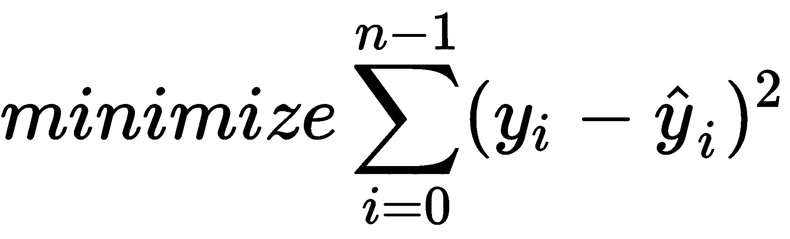

*y*是用于进行直线拟合的观测实际值的数据集。换句话说，我们在寻找系数*a*和*c*时进行了误差平方和最小的运算，从中我们可以预测当期。

在开发模型之前，让我们下载并准备所需的数据集。

# 准备自变量和目标变量

让我们使用以下代码从 Alpha Vantage 获取 GS 和 JPM 价格的数据集：

```py
In [ ]:
    from alpha_vantage.timeseries import TimeSeries

    # Update your Alpha Vantage API key here...
    ALPHA_VANTAGE_API_KEY = 'PZ2ISG9CYY379KLI'

    ts = TimeSeries(key=ALPHA_VANTAGE_API_KEY, output_format='pandas')
    df_jpm, meta_data = ts.get_daily_adjusted(
        symbol='JPM', outputsize='full')
    df_gs, meta_data = ts.get_daily_adjusted(
        symbol='GS', outputsize='full')
```

`pandas`数据帧对象`df_jpm`和`df_gs`分别包含 JPM 和 GS 的下载价格。我们将从每个数据集的第五列中提取调整后的收盘价。

让我们用以下代码准备自变量：

```py
In [ ]:
    import pandas as pd

    df_x = pd.DataFrame({'GS': df_gs['5\. adjusted close']})
```

调整后的 GS 收盘价被提取到一个新的数据帧对象`df_x`。接下来，使用以下代码获取我们的目标变量：

```py
In [ ]: 
    jpm_prices = df_jpm['5\. adjusted close']
```

JPM 调整后的收盘价被提取到`jpm_prices`变量中，作为`pandas`系列对象。准备好用于建模的数据集后，让我们继续开发线性回归模型。

# 编写线性回归模型

我们将创建一个类，用于使用线性回归模型拟合和预测值。该类还用作实现本章中其他模型的基类。以下步骤说明了此过程。

1.  声明一个名为`LinearRegressionModel`的类，如下所示：

```py
from sklearn.linear_model import LinearRegression

class LinearRegressionModel(object):
    def __init__(self):
        self.df_result = pd.DataFrame(columns=['Actual', 'Predicted'])

    def get_model(self):
        return LinearRegression(fit_intercept=False)

    def get_prices_since(self, df, date_since, lookback):
        index = df.index.get_loc(date_since)
        return df.iloc[index-lookback:index]        
```

在我们新类的构造函数中，我们声明了一个名为`df_result`的数据帧来存储实际值和预测值，以便以后在图表上绘制。`get_model()`方法返回`sklearn.linear_model`模块中`LinearRegression`类的一个实例，用于拟合和预测数据。由于数据未居中，`set_intercept`参数被设置为`True`（即在*x*和*y*轴上约为 0）。

More information about the `LinearRegression` of scikit-learn can be found at [https://scikit-learn.org/stable/modules/generated/sklearn.linear_model.LinearRegression.html](https://scikit-learn.org/stable/modules/generated/sklearn.linear_model.LinearRegression.html).

`get_prices_since()`方法使用`iloc`命令从给定的日期索引`date_since`到由回溯值定义的若干早期时段，对所提供数据集的子集进行切片。

2.  在`LinearRegressionModel`类中添加一个名为`learn()`的方法，如下所示：

```py
def learn(self, df, ys, start_date, end_date, lookback_period=20):
     model = self.get_model()

     for date in df[start_date:end_date].index:
         # Fit the model
         x = self.get_prices_since(df, date, lookback_period)
         y = self.get_prices_since(ys, date, lookback_period)
         model.fit(x, y.ravel())

         # Predict the current period
         x_current = df.loc[date].values
         [y_pred] = model.predict([x_current])

         # Store predictions
         new_index = pd.to_datetime(date, format='%Y-%m-%d')
         y_actual = ys.loc[date]
         self.df_result.loc[new_index] = [y_actual, y_pred]
```

`learn()`方法作为运行模型的入口点。它接受`df`和`ys`参数作为我们的自变量和目标变量，`start_date`和`end_date`作为我们将要预测的期间数据集索引对应的字符串，`lookback_period`参数作为用于拟合当前期间模型的历史数据点数。

`for`循环每天模拟一次回溯测试。对`get_prices_since()`的调用获取数据集的子集，以便使用`fit()`命令在*x*和*y*轴上拟合模型。`ravel()`命令将给定的`pandas`系列对象转换为用于拟合模型的目标值的扁平列表。

`x_current`变量表示指定日期的自变量值，输入`predict()`方法。预测输出是一个`list`对象，我们从中提取第一个值。实际值和预测值都保存到`df_result`数据帧中，并按当前日期作为`pandas`对象进行索引。

3.  让我们实例化这个类，并通过发出以下命令来运行我们的机器学习模型：

```py
In [ ]:
    linear_reg_model = LinearRegressionModel()
    linear_reg_model.learn(df_x, jpm_prices, start_date='2018', 
                           end_date='2019', lookback_period=20)
```

在`learn()`命令中，我们提供了我们准备好的数据集`df_x`和`jpm_prices`，并指定了 2018 年的预测。对于这个例子，我们假设一个月有 20 个交易日。使用`lookback_period`值`20`，我们使用过去一个月的价格来拟合每日预测模型。

4.  让我们从模型中检索得到的`df_result`数据帧，并绘制实际值和预测值：

```py
In [ ]:
    %matplotlib inline

    linear_reg_model.df_result.plot(
        title='JPM prediction by OLS', 
        style=['-', '--'], figsize=(12,8));
```

在`style`参数中，我们指定将实际值绘制为实线，将预测值绘制为虚线。这为我们提供了下图：

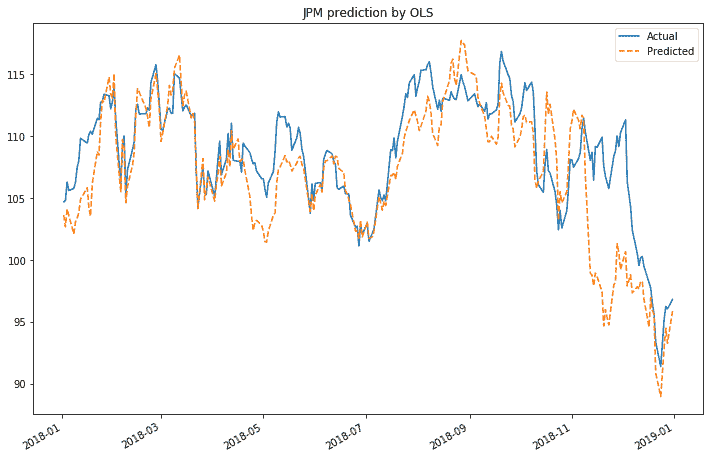

图表显示我们的预测结果在一定程度上紧随实际值。我们的模型实际表现如何？在下一节中，我们将讨论用于测量基于回归的模型的几种常见风险度量。

# 衡量预测绩效的风险度量

`sklearn.metrics`模块实现了几个用于测量预测性能的回归指标。我们将在后续章节中讨论平均绝对误差、均方误差、解释方差得分和 R<sup>2</sup>得分。

# 作为风险度量的平均绝对误差

**平均绝对误差**（**MAE**是衡量平均绝对预测误差的一种风险度量，可以写成如下：

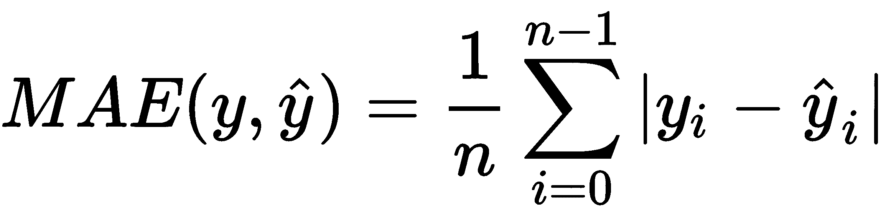

这里，*y*和分别是实际值和预测值列表，长度相同*n*。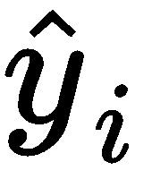和*y<sub>i</sub>*分别为*i**指标处的预测值和实际值。*取误差的绝对值意味着我们的输出结果是一个正的十进制值。高度期望 MAE 的低值。满分为 0 意味着我们的预测能力与实际值完全一致，因为两者之间没有差异。

使用带有以下代码的`sklearn.metrics `模块的`mean_abolute_error`功能获取我们预测的 MAE 值：

```py
In [ ]:
    from sklearn.metrics import mean_absolute_error

    actual = linear_reg_model.df_result['Actual']
    predicted = linear_reg_model.df_result['Predicted']

    mae = mean_absolute_error(actual, predicted)
    print('mean absolute error:', mae)
Out[ ]:
    mean absolute error: 2.4581692107823367
```

我们的线性回归模型的 MAE 为 2.458。

# 作为风险度量的均方误差

与 MAE 一样，**均方误差**（**均方误差**）是一种风险度量，用于测量预测误差平方的平均值，可写成如下：


平方误差意味着 MSE 的值始终为正，而 MSE 的低值是非常理想的。完美的 MSE 分数为 0 意味着我们的预测能力与实际值完全一致，并且这种差异的平方可以忽略不计。虽然 MSE 和 MAE 的应用有助于确定我们模型预测能力的强弱，但 MSE 通过惩罚远离平均值的错误而战胜了 MAE。平方误差会对风险度量产生更大的偏差。

使用具有以下代码的`sklearn.metrics`模块的`mean_squared_error`函数获取我们预测的 MSE 值：

```py
In [ ]:
    from sklearn.metrics import mean_squared_error
    mse = mean_squared_error(actual, predicted)
    print('mean squared error:', mse)
Out[ ]:
    mean squared error: 12.156835196436589
```

我们的线性回归模型的均方误差为 12.156。

# 解释差异分数作为风险度量

解释方差分数解释了给定数据集的误差分散情况，公式如下：

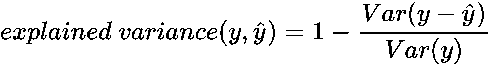

其中，**和*Var**y*分别是预测误差和实际值的方差。非常需要接近 1.0 的分数，这表明误差标准偏差的平方更好。

使用具有以下代码的`sklearn.metrics`模块的`explained_variance_score`函数获取我们预测的解释方差分数：

```py
In [ ]:
    from sklearn.metrics import explained_variance_score
    eva = explained_variance_score(actual, predicted)
    print('explained variance score:', eva)
Out[ ]:
    explained variance score: 0.5332235487812286
```

我们的线性回归模型的解释方差得分为 0.533。

# R2 作为风险度量

R<sup>2</sup>分数也被称为**决定系数**，它衡量模型预测未来样本的可能性。内容如下:

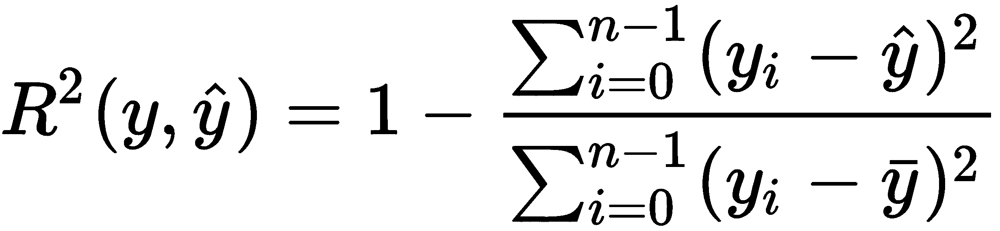

这里，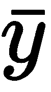是实际值的平均值，可以写为：


R<sup>2</sup>得分范围从负值到 1.0。完美的 R<sup>2</sup>分数为 1 表示回归分析没有错误，而分数为 0 表示模型总是预测目标值的平均值。负 R<sup>2</sup>分数表示预测结果低于平均水平。

使用`sklearn.metrics`模块的`r2_score`功能获得我们预测的 R<sup>2</sup>分数，代码如下：

```py
In [ ]:
    from sklearn.metrics import r2_score
    r2 = r2_score(actual, predicted) 
    print('r2 score:', r2)
Out[ ]:
    r2 score: 0.41668246393290576
```

我们的线性回归模型的 R<sup>2</sup>为 0.4167。这意味着 41.67%的目标变量的可变性已经得到了解释。

# 岭回归

岭回归或 L2 正则化通过惩罚模型系数的平方和来解决 OLS 回归的一些问题。岭回归的成本函数可以写成如下：

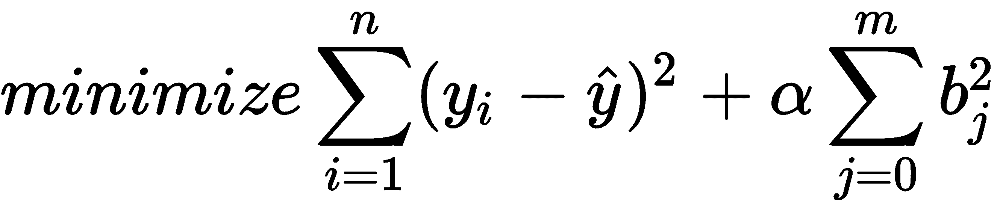

此处，α参数预计为控制收缩量的正值。alpha 值越大，收缩越大，使系数对共线性更为稳健。

`sklearn.linear_model`模块的`Ridge`类实现岭回归。要实现此模型，请创建一个名为`RidgeRegressionModel`的类来扩展`LinearRegressionModel`类，并运行以下代码：

```py
In [ ]:
    from sklearn.linear_model import Ridge

    class RidgeRegressionModel(LinearRegressionModel): 
        def get_model(self):
            return Ridge(alpha=.5)

    ridge_reg_model = RidgeRegressionModel()
    ridge_reg_model.learn(df_x, jpm_prices, start_date='2018', 
                          end_date='2019', lookback_period=20)
```

在新类中，`get_model()`方法被重写以返回 scikit learn 的岭回归模型，同时重用父类中的其他方法。`alpha`值设置为 0.5，其余的模型参数保留为默认值。`ridge_reg_model`变量表示我们的岭回归模型的一个实例，`learn()`命令使用通常的参数值运行

创建一个名为`print_regression_metrics()`的函数来打印前面介绍的各种风险度量：

```py
In [ ]:
    from sklearn.metrics import (
        accuracy_score, mean_absolute_error, 
        explained_variance_score, r2_score
    )
    def print_regression_metrics(df_result):
        actual = list(df_result['Actual'])
        predicted = list(df_result['Predicted'])
        print('mean_absolute_error:', 
            mean_absolute_error(actual, predicted))
        print('mean_squared_error:', mean_squared_error(actual, predicted))
        print('explained_variance_score:', 
            explained_variance_score(actual, predicted))
        print('r2_score:', r2_score(actual, predicted)) 
```

将`df_result`变量传递到此函数，并向控制台显示风险度量：

```py
In [ ]:
    print_regression_metrics(ridge_reg_model.df_result)
Out[ ]:
    mean_absolute_error: 1.5894879428144535
    mean_squared_error: 4.519795633665941
    explained_variance_score: 0.7954229624785825
    r2_score: 0.7831280913202121
```

岭回归模型的平均误差得分均低于线性回归模型，且接近于零。解释方差得分和 R<sup>2</sup>得分高于线性回归模型，且更接近 1。这表明我们的岭回归模型比线性回归模型做得更好。除了具有更好的性能外，岭回归计算比原始线性回归模型的成本更低。

# 其他回归模型

在我们的模型中，我们可以考虑各种回归模型。其余各节简要介绍了它们。有关线性模型的完整列表，请访问[https://scikit-learn.org/stable/modules/classes.html#module-sklearn.linear_ 模型](https://scikit-learn.org/stable/modules/classes.html#module-sklearn.linear_model)。

# 套索回归

与岭回归类似，**最小绝对收缩和选择算子**（**套索**）回归也是另一种正则化形式，涉及惩罚回归系数绝对值之和。它使用 L1 正则化技术。套索回归的成本函数可以写成如下：

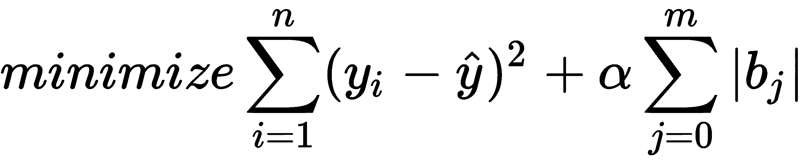

与岭回归一样，α参数α控制惩罚的强度。然而，由于几何原因，套索回归产生的结果不同于岭回归，因为它强制大多数系数设置为零。它更适合于估计稀疏系数和参数值较少的模型。

`sklearn.linear_model`的`Lasso`类实现套索回归。

# 弹性网

弹性网是另一种正则化回归方法，它结合了套索和岭回归方法的 L1 和 L2 惩罚。弹性网的成本函数可以写成如下：


此处解释了 alpha 值：


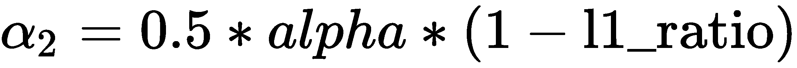

这里，`alpha`和`l1_ratio`是`ElasticNet`函数的参数。当`alpha`为零时，成本函数相当于 OLS。当`l1_ratio`为零时，罚款为岭或 L2 罚款。当`l1_ratio`为 1 时，惩罚为套索或 L1 惩罚。当`l1_ratio`介于 0 和 1 之间时，惩罚是 L1 和 L2 的组合。

`sklearn.linear_model`的`ElasticNet`类实现弹性净回归。

# 结论

我们使用单一资产，通过回归趋势跟踪动量策略，使用 GS 预测 JPM 的价格，假设这对资产是协整且高度相关的。我们也可以考虑跨资产的势头，以获得更好的结果多样化。下一节探讨预测证券回报的多元资产回归。

# 用跨资产动量模型预测收益

在本节中，我们将创建一个跨资产动量模型，通过四种多样化资产的价格预测 2018 年摩根大通的每日收益。标准普尔 500 指数、10 年期国债指数、美元指数和黄金价格的前 1 个月、3 个月、6 个月和 1 年滞后回报将用于拟合我们的模型。这给我们提供了总共 16 个特性。让我们首先准备数据集以开发模型。

# 准备自变量

我们将再次使用 Alpha Vantage 作为我们的数据提供商。由于此免费服务不提供我们调查所需的所有数据集，因此我们将考虑其他封闭资产作为代理。标准普尔 500 指数的股票代码是 SPX。我们将使用 SPDR 黄金信托基金（股票代码：GLD）来表示黄金的一部分，作为黄金价格的代表。Invesco DB 美元指数看涨基金（股票代码：UUP）将代理美元指数。iShares 7-10 年期国债 ETF（股票代码：IEF）将代理 10 年期国债指数。运行以下代码下载我们的数据集：

```py
In [ ]:
    df_spx, meta_data = ts.get_daily_adjusted(
        symbol='SPX', outputsize='full')
    df_gld, meta_data = ts.get_daily_adjusted(
        symbol='GLD', outputsize='full')
    df_dxy, dxy_meta_data = ts.get_daily_adjusted(
        symbol='UUP', outputsize='full')
    df_ief, meta_data = ts.get_daily_adjusted(
        symbol='IEF', outputsize='full')
```

`ts`变量是上一节中创建的 Alpha Vantage 的`TimeSeries`对象。将调整后的收盘价与以下代码组合成一个名为`df_assets`的`pandas`数据帧，并使用`dropna()`命令删除空值：

```py
In [ ]:
    import pandas as pd

    df_assets = pd.DataFrame({
        'SPX': df_spx['5\. adjusted close'],
        'GLD': df_gld['5\. adjusted close'],
        'UUP': df_dxy['5\. adjusted close'],
        'IEF': df_ief['5\. adjusted close'],
    }).dropna()
```

使用以下代码计算我们的`df_assets`数据集的滞后百分比回报：

```py
IN [ ]:
    df_assets_1m = df_assets.pct_change(periods=20)
    df_assets_1m.columns = ['%s_1m'%col for col in df_assets.columns]

    df_assets_3m = df_assets.pct_change(periods=60)
    df_assets_3m.columns = ['%s_3m'%col for col in df_assets.columns]

    df_assets_6m = df_assets.pct_change(periods=120)
    df_assets_6m.columns = ['%s_6m'%col for col in df_assets.columns]

    df_assets_12m = df_assets.pct_change(periods=240)
    df_assets_12m.columns = ['%s_12m'%col for col in df_assets.columns]
```

在`pct_change()`命令中，`periods`参数指定要移位的时段数。在计算滞后回报时，我们假设一个月有 20 个交易日。使用`join()`命令将四个`pandas`数据帧对象组合成一个数据帧：

```py
In [ ]:
    df_lagged = df_assets_1m.join(df_assets_3m)\
        .join(df_assets_6m)\
        .join(df_assets_12m)\
        .dropna()
```

使用`info()`命令查看其属性：

```py
In [ ]:
    df_lagged.info()
Out[ ]:
    <class 'pandas.core.frame.DataFrame'>
    Index: 2791 entries, 2008-02-12 to 2019-03-14
    Data columns (total 16 columns):
    ...
```

输出被截断，但您可以看到 16 个功能作为我们 2008 年至 2019 年的自变量。让我们继续获取目标变量的数据集。

# 准备目标变量

JPM 的收盘价已下载到之前的`pandas`系列对象`jpm_prices`中，只需使用以下代码计算实际收益百分比：

```py
In [ ]:
    y = jpm_prices.pct_change().dropna()
```

我们获得一个`pandas`系列对象作为我们的目标变量`y`。

# 多资产线性回归模型

在上一节中，我们使用单一资产和 GS 的价格来拟合我们的线性回归模型。同一模型`LinearRegressionModel`可容纳多个资产。运行以下命令创建此模型的实例并使用我们的新数据集：

```py
In [ ]:
    multi_linear_model = LinearRegressionModel()
    multi_linear_model.learn(df_lagged, y, start_date='2018', 
                             end_date='2019', lookback_period=10)
```

在线性回归模型实例`multi_linear_model`中，`learn()`命令提供了具有 16 个特征的`df_lagged`数据集和`y`作为 JPM 的百分比变化。考虑到可用的有限滞后回报数据，`lookback_period`值降低。让我们绘制 JPM 的实际与预测百分比变化：

```py
In [ ]:
    multi_linear_model.df_result.plot(
        title='JPM actual versus predicted percentage returns',
        style=['-', '--'], figsize=(12,8));
```

这将为我们提供以下图表，其中实线显示 JPM 的实际百分比回报，而虚线显示预测的百分比回报：


我们的模型表现如何？让我们在上一节定义的`print_regression_metrics()`函数中运行相同的性能指标：

```py
In [ ]:
    print_regression_metrics(multi_linear_model.df_result)
Out[ ]:
    mean_absolute_error: 0.01952328066607389
    mean_squared_error: 0.0007225502867195044
    explained_variance_score: -2.729798588246765
    r2_score: -2.738404583097052

```

解释方差得分和 R<sup>2</sup>得分均在负范围内，表明模型表现低于平均水平。我们能表现得更好吗？让我们探索回归中使用的更复杂的树模型。

# 决策树的集合

决策树是分类和回归任务中广泛使用的模型，非常类似于二叉树，其中每个节点表示一个问题，该问题导致遍历相应的左、右节点的是非答案。目标是通过提出尽可能少的问题来获得正确答案。

A paper describing deep neural decision trees can be found at [https://arxiv.org/pdf/1806.06988.pdf](https://arxiv.org/pdf/1806.06988.pdf).

遍历深层决策树可能会很快导致给定数据的过度拟合，而不是推断从中提取数据的分布的总体属性。为了解决过度拟合的问题，可以将数据分成子集，并在不同的树上进行训练，每个树都在一个子集中。这样，我们就得到了不同决策树模型的集成。当随机抽取样本子集进行替换预测时，这种方法称为**装袋**或**引导聚合**。我们可能会也可能不会在这些模型中得到一致的结果，但是通过平均自举模型得到的最终模型比使用单个决策树得到的结果更好。使用随机决策树的集合称为**随机森林**。

让我们访问 SCIKIT 中的一些决策树模型，了解我们可以考虑在我们的多资产回归模型中实现。

# 装袋回归器

`sklearn.ensemble`的`BaggingRegressor`类实现了装袋回归器。我们可以看到套袋回归器是如何对摩根大通的多资产回报率进行预测的。以下代码说明了这一点：

```py
In [ ]:
    from sklearn.ensemble import BaggingRegressor

    class BaggingRegressorModel(LinearRegressionModel):
        def get_model(self):
            return BaggingRegressor(n_estimators=20, random_state=0) 
In [ ]:
    bagging = BaggingRegressorModel()
    bagging.learn(df_lagged, y, start_date='2018', 
                  end_date='2019', lookback_period=10)

```

我们创建了一个名为`BaggingRegressorModel`的类，该类扩展了`LinearRegressionModel`，并重写了`get_model()`方法以返回 bagging 回归器。`n_estimators`参数指定集合中的`20`基估计器或决策树，`random_state`参数作为随机数生成器使用的`0`种子。其余参数为默认值。我们使用相同的数据集运行此模型。

运行相同的性能指标，查看我们的模型执行情况：

```py
In [ ]:
    print_regression_metrics(bagging.df_result)
Out[ ]:
    mean_absolute_error: 0.0114699264723
    mean_squared_error: 0.000246352185742
    explained_variance_score: -0.272260304849
    r2_score: -0.274602137956
```

MAE 和 MSE 值表明，决策树集合产生的预测误差小于简单线性回归模型。此外，尽管解释方差得分和 R<sup>2</sup>得分为负，但这表明数据相对于简单线性回归模型提供的均值的方差更好。

# 梯度树 boosting 回归模型

梯度树增强，或简单的梯度增强，是一种使用梯度下降过程来最小化损失函数来改善或提高弱学习者学习成绩的技术。树模型（通常是决策树）一次添加一个，并以阶段方式构建模型，同时保持模型中的现有树不变。由于梯度增强是一种贪婪算法，它可以快速地过拟合训练数据集。然而，它可以受益于正则化方法，这些方法惩罚算法的各个部分，并减少过度拟合以提高其性能。

`sklearn.ensemble`模块提供一个称为`GradientBoostingRegressor`的梯度增强回归器。

# 随机森林回归

随机森林由多个决策树组成，每个决策树基于训练数据的随机子样本，并使用平均值来提高预测精度和控制过拟合。随机选择无意中引入了某种形式的偏差。然而，由于平均化，它的方差也减少了，有助于补偿偏差的增加，并且被认为是产生一个整体更好的模型。

`sklearn.ensemble`模块提供了一个名为`RandomForestRegressor`的随机森林回归器。

# 更多集合模型

`sklearn.ensemble`模块包含各种其他集成回归器以及分类器模型。更多信息请访问[https://scikit-learn.org/stable/modules/classes.html#module-sklearn.ensemble](https://scikit-learn.org/stable/modules/classes.html#module-sklearn.ensemble)。

# 基于分类的机器学习预测趋势

基于分类的机器学习是一种有监督的机器学习方法，其中模型从给定的输入数据中学习，并根据新的观察结果对其进行分类。分类可以是双类，如确定是否应行使期权，也可以是多类，如价格变化的方向，可以是上升、下降或不变。

在本节中，我们将通过让四种多样化资产的价格预测 2018 年日元的每日趋势，再次探讨如何创建跨资产动量模型。标准普尔 500 指数、10 年期国债指数、美元指数和黄金价格的前 1 个月和 3 个月滞后收益将用于拟合预测模型。我们的目标变量由布尔指标组成，其中`True`值表示较前一交易日收盘价上涨或无变化，而`False`值表示下跌。

让我们首先准备模型的数据集。

# 准备目标变量

在上一节中，我们已经将 JPM 数据集下载到`pandas`数据帧`df_jpm`，并且`y`变量包含 JPM 的每日百分比变化。使用以下代码将这些值转换为标签：

```py
In [ ]:
    import numpy as np
    y_direction = y >= 0
    y_direction.head(3)
Out[ ]:
    date
    1998-01-05     True
    1998-01-06    False
    1998-01-07     True
    Name: 5\. adjusted close, dtype: bool
```

使用`head()`命令，我们可以看到`y_direction`变量变成了布尔值的`pandas`系列对象。零或更多的百分比变化将使用`True`标签对值进行分类，否则使用`False`标签对值进行分类。让我们使用`unique()`命令提取唯一值作为列名，以供以后使用：

```py
In [ ]:
    flags = list(y_direction.unique())
    flags.sort()
    print(flags)
Out[ ]:    
    [False, True]
```

列名被提取到名为`flags`的变量中。目标变量就绪后，让我们继续获取独立的多资产变量。

# 准备多个资产的数据集作为输入变量

我们将重用上一节中的`pandas`数据帧变量`df_assets_1m`和`df_assets_3m`，其中包含四项资产的滞后 1 个月和 3 个月百分比回报，并将它们组合成一个变量`df_input`，代码如下：

```py
In [ ]:    
    df_input = df_assets_1m.join(df_assets_3m).dropna()
```

使用`info()`命令查看其属性：

```py
In [ ]:
    df_input.info()
Out[ ]:
    <class 'pandas.core.frame.DataFrame'>
    Index: 2971 entries, 2007-05-25 to 2019-03-14
    Data columns (total 8 columns):
    ...
```

输出被截断，但您可以看到，我们在 2007 年至 2019 年期间有八个功能作为自变量。创建了输入和目标变量后，让我们探索 scikit learn for modeling 中提供的各种分类器。

# 逻辑回归

尽管它的名字，逻辑回归实际上是一个用于分类的线性模型。它使用逻辑函数（也称为**乙状结肠**函数）来模拟描述单个试验可能结果的概率。逻辑函数有助于将任何实数映射到 0 和 1 之间的值。标准物流功能编写如下：


*e*是自然对数的基数，*x*是乙状结肠中点的*x*-值。是 0 到 1 之间的预测实数值，可以通过舍入或截止值转换为 0 或 1 的二进制等价物。

`sklean.linear_model`模块的`LogisticRegression`类实现逻辑回归。让我们通过编写一个名为`LogisticRegressionModel`的新类来实现这个分类器模型，该类使用以下代码扩展`LinearRegressionModel`：

```py
In [ ]:
    from sklearn.linear_model import LogisticRegression

    class LogisticRegressionModel(LinearRegressionModel):
        def get_model(self):
            return LogisticRegression(solver='lbfgs')
```

在我们的新分类器模型中使用了相同的基本线性回归逻辑。在优化问题中使用 LBFGS 解算器算法，重写`get_model()`方法以返回`LogisticRegression`分类器模型的实例。

A paper on the **limited-memory** **Broyden**–**Fletcher**–**Goldfarb**–**Shanno** (**LBFGS**) algorithm for machine learning can be read at [https://arxiv.org/pdf/1802.05374.pdf](https://arxiv.org/pdf/1802.05374.pdf)

创建此模型的实例并提供我们的数据：

```py
In [ ]:
    logistic_reg_model = LogisticRegressionModel()
    logistic_reg_model.learn(df_input, y_direction, start_date='2018', 
                             end_date='2019', lookback_period=100)
```

同样，参数值表明我们有兴趣对 2018 年进行预测，在拟合模型时，我们将使用`lookback_period`值`100`作为每日历史数据点的数量。让我们用`head()`命令检查`df_result`中存储的结果：

```py
In [ ]:
    logistic_reg_model.df_result.head()
```

这将生成下表：

| 

**日期**

 | 

**实际**

 | 

**预测**

 |
| --- | --- | --- |
| 

**2018-01-02**

 | 符合事实的 | 符合事实的 |
| 

**2018-01-03**

 | 符合事实的 | 符合事实的 |
| 

**2018-01-04**

 | 符合事实的 | 符合事实的 |
| 

**2018-01-05**

 | 错误的 | 符合事实的 |
| 

**2018-01-08**

 | 符合事实的 | 符合事实的 |

由于我们的目标变量是布尔值，因此模型输出也会预测布尔值。但我们的模型表现如何？在以下部分中，我们将探讨用于衡量预测的风险指标。这些指标与前面章节中用于基于回归的预测的指标不同。基于分类的机器学习采用另一种方法来测量输出标签。

# 用于测量基于分类的预测的风险度量

在本节中，我们将探讨用于测量基于分类的机器学习预测的常见风险度量，即混淆矩阵、准确度得分、精确度得分、回忆得分和 F1 得分。

# 混淆矩阵

混淆矩阵或误差矩阵是一种方形矩阵，有助于可视化和描述已知真实值的分类模型的性能。`sklearn.metrics`模块的`confusion_matrix`功能帮助我们计算这个矩阵，如下代码所示：

```py
In [ ]:
    from sklearn.metrics import confusion_matrix

    df_result = logistic_reg_model.df_result 
    actual = list(df_result['Actual'])
    predicted = list(df_result['Predicted'])

    matrix = confusion_matrix(actual, predicted)
In [ ]:
    print(matrix)
Out[ ]:
    [[60 66]
     [55 70]]
```

我们以单独列表的形式获得实际值和预测值。因为我们有两种类型的类标签，所以我们得到了一个二乘二矩阵。`seaborn`库的`heatmap`模块帮助我们理解这个矩阵。

Seaborn is a data visualization library based on Matplotlib. It provides a high-level interface for drawing attractive and informative statistical graphics, and is a popular tool for data scientists. If you do not have Seaborn installed, simply run the command: `pip install seaborn`

运行以下 Python 代码以生成混淆矩阵：

```py
In [ ]:
    %matplotlib inline
    import seaborn as sns
    import matplotlib.pyplot as plt

    plt.subplots(figsize=(12,8))
    sns.heatmap(matrix.T, square=True, annot=True, fmt='d', cbar=False, 
                xticklabels=flags, yticklabels=flags)
    plt.xlabel('Actual')
    plt.ylabel('Predicted')
    plt.title('JPM percentage returns 2018');
```

这将产生以下输出：

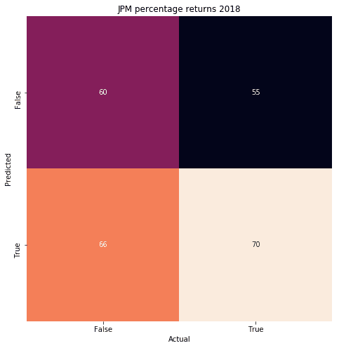

不要让混乱矩阵迷惑你。让我们以逻辑的方式分解这些数字，看看混淆矩阵是多么容易工作。从左栏开始，我们总共有 126 个样本被分类为假，其中分类器正确预测了 60 次，这些被称为**真阴性**（**TNs**。然而，分类器错误地预测了 66 次，这些被称为**假阴性**（**FNs**。在右栏中，我们总共有 125 个样本属于 True 类。分类器错误预测了 55 次，称为**误报**（**FPs**。然而，分类器确实正确预测了 70 次，这些被称为**真阳性**（**TPs**。这些计算出的费率用于其他风险度量，我们将在以下章节中发现。

# 准确度得分

准确度得分是正确预测与观察总数的比率。默认情况下，它表示为介于 0 和 1 之间的分数值。当准确度得分为 1.0 时，表示样本中的整个预测标签集与真实标签集匹配。准确度得分可以写如下：

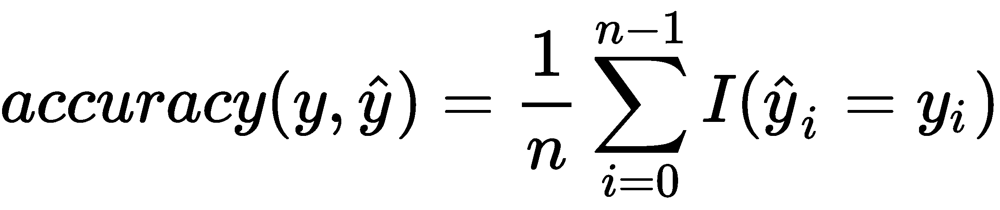

这里，*I（x）*是指示函数，返回 1 表示正确预测，否则返回 0。`sklearn.metrics`模块的`accuracy_score`功能使用以下代码为我们计算该分数：

```py
In [ ]:
    from sklearn.metrics import accuracy_score
    print('accuracy_score:', accuracy_score(actual, predicted))
Out[ ]:
    accuracy_score: 0.5179282868525896
```

准确度得分表明，我们的模型在 52%的情况下是正确的。准确度分数在测量对称数据集时非常有用，其中误报和漏报的值几乎相同。为了全面评估我们模型的性能，我们需要查看其他风险度量。

# 精确分数

精度分数是正确预测的积极观察值与预测的积极观察值总数的比率，可写为：


这将给出介于 0 和 1 之间的精度分数，其中 1 为最佳值，表示模型始终正确分类。`sklearn.metrics`模块的`precision_score`功能使用以下代码为我们计算该分数：

```py
In [ ]:
    from sklearn.metrics import precision_score
    print('precision_score:', precision_score(actual, predicted))
Out[ ]:
    precision_score: 0.5147058823529411
```

精度得分表明，我们的模型能够在 52%的时间内正确预测分类。

# 回忆分数

回忆分数是正确预测的积极观察值与实际课堂中所有观察值的比率，可以写为：


这将给出介于 0 和 1 之间的召回分数，1 为最佳值。`sklearn.metrics`模块的`recall_score`功能使用以下代码为我们计算该分数：

```py
In [ ]:
    from sklearn.metrics import recall_score
    print('recall_score:', recall_score(actual, predicted))
Out[ ]:
    recall_score: 0.56
```

回忆得分表明，我们的逻辑回归模型在 56%的时间内正确识别阳性样本。

# F1 成绩

F1 分数或 F-度量值是精确性分数和召回率分数的加权平均值，可写为：

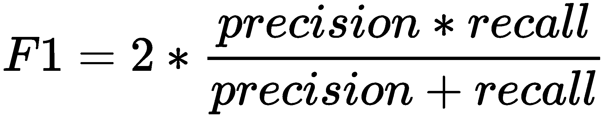

这将给出介于 0 和 1 之间的 F1 分数。当精度分数或召回分数为 0 时，F1 分数将为 0。然而，当精确性得分和召回率得分都为正值时，F1 得分对这两个指标的权重相等。最大化 F1 分数创建了一个平衡的分类模型，具有召回率和准确率的最佳平衡。

`sklearn.metrics`模块的`f1_score`功能使用以下代码为我们计算该分数：

```py
In [ ]:
    from sklearn.metrics import f1_score
    print('f1_score:', f1_score(actual, predicted))
Out[ ]:
    f1_score: 0.5363984674329502
```

我们的逻辑回归模型的 F1 得分为 0.536。

# 支持向量分类器

**支持向量分类器**（**SVC**是使用支持向量对数据集进行分类的**支持向量机**（**SVM**的概念。

More information on SVMs can be found at [http://www.statsoft.com/textbook/support-vector-machines](http://www.statsoft.com/textbook/support-vector-machines).

`sklean.svm`模块的`SVC`类实现了 SVM 分类器。编写一个名为`SVCModel`的类，并使用以下代码扩展`LogisticRegressionModel`：

```py
In [ ]:
    from sklearn.svm import SVC

    class SVCModel(LogisticRegressionModel):
        def get_model(self):
            return SVC(C=1000, gamma='auto')
In [ ]:
    svc_model = SVCModel()
    svc_model.learn(df_input, y_direction, start_date='2018', 
                    end_date='2019', lookback_period=100)
```

这里，我们重写`get_model()`方法返回 scikit 学习的`SVC`类。指定了一个高惩罚`C`值`1000`。`gamma`参数是内核系数，默认值为`auto`。`learn()`命令使用我们常用的模型参数执行。这样，让我们在此模型上运行风险度量：

```py
In [ ]:
    df_result = svc_model.df_result
    actual = list(df_result['Actual'])
    predicted = list(df_result['Predicted'])
In [ ]:
    print('accuracy_score:', accuracy_score(actual, predicted))
    print('precision_score:', precision_score(actual, predicted))
    print('recall_score:', recall_score(actual, predicted))
    print('f1_score:', f1_score(actual, predicted)) 
Out[ ]:
    accuracy_score: 0.5577689243027888
    precision_score: 0.5538461538461539
    recall_score: 0.576
    f1_score: 0.5647058823529412
```

我们得到了比 logistic 回归分类器模型更好的分数。默认情况下，线性支持向量机的`C`值为 1.0，这将在实践中为我们提供与逻辑回归模型大致相当的性能。选择`C`值绝对没有经验法则，因为它完全依赖于训练数据集。可以通过向`SVC()`模型提供`kernel`参数来考虑非线性 SVM 核。有关 SVM 内核的更多信息，请访问[https://scikit-learn.org/stable/modules/svm.html#svm-果仁](https://scikit-learn.org/stable/modules/svm.html#svm-kernels)。

# 其他类别的量词

除了逻辑回归和 SVC，scikit 学习还包含许多其他类型的机器学习分类器。下面的章节讨论了一些分类器，我们也可以考虑在基于分类的模型中实现。

# 随机梯度下降算法

**随机梯度下降**（**SGD**是**梯度下降**的一种形式，通过使用迭代过程来估计梯度以最小化目标损失函数，如线性支持向量机或逻辑回归。随机项是在随机选择样本时产生的。当使用较少的迭代时，会采取更大的步骤来获得解决方案，据说该模型具有**高学习率**。同样，随着迭代次数的增加，所采取的步骤也越来越小，从而形成了一个学习率**很小的模型**。SGD 是机器学习算法在实践者中的一种流行选择，因为它已被有效地应用于大规模文本分类和自然语言处理模型中。

`sklearn.linear_model`模块的`SGDClassifier`类实现了 SGD 分类器。

# 线性判别分析

**线性判别分析**（**LDA**）是一种经典的分类器，它使用线性决策面来估计每类数据的均值和方差。它假设数据是高斯分布的，每个属性具有相同的方差，每个变量的值都在平均值附近。LDA 使用贝叶斯定理计算每个观察的*判别分数*，以确定它属于哪个类别。

`sklearn.discriminant_analysis`模块的`LinearDiscriminantAnalysis`类实现了 LDA 分类器。

# 二次判别分析

**二次判别分析**（**QDA**）与 LDA 非常相似，但使用二次决策边界，每个类别使用自己的方差估计。运行风险度量表明，QDA 模型不一定比 LDA 模型提供更好的性能。对于所需的模型，必须考虑决策边界的类型。QDA 更适合于大型数据集，因为它倾向于具有较低的偏差和较高的方差。另一方面，LDA 适用于具有较低偏差和较高方差的较小数据集。

`sklearn.discriminant_analysis`模块的`QuadraticDiscriminantAnalysis`类实现了 QDA 模型。

# KNN 分类器

**k-最近邻**（**k-NN**分类器是一种简单算法，对每个点的最近邻进行简单多数投票，并将该点分配给在该点的最近邻中具有最多代表性的类。虽然不需要训练用于泛化的模型，但预测阶段在时间和内存方面更慢、成本更高。

`sklearn.neighbors`模块的`KNeighborsClassifier`类实现 KNN 分类器。

# 关于使用机器学习算法的结论

您可能已经注意到，我们模型的预测值与实际值相差甚远。本章旨在展示 scikit learn 提供的最佳机器学习功能，这些功能可能用于预测时间序列数据。迄今为止还没有研究表明，机器学习算法甚至可以在接近 100%的时间内预测价格。更多的精力投入到有效地构建和运行机器学习系统上。

# 总结

在本章中，我们介绍了金融背景下的机器学习。我们讨论了人工智能和机器学习如何改变金融业。机器学习可以是有监督的或无监督的，有监督的算法可以是基于回归和基于分类的。scikit learn Python 库提供了各种机器学习算法和风险度量。

我们讨论了基于回归的机器学习模型（如 OLS 回归、岭回归、套索回归和弹性网正则化）在预测证券价格等连续值时的使用。还讨论了决策树的集成，如 bagging 回归器、梯度树提升和随机森林。为了衡量回归模型的性能，我们访问了 MSE、MAE、解释方差得分和 R<sup>2</sup>得分。

基于分类的机器学习将输入值分类为类或标签。此类类可以是双类或多类。我们讨论了使用逻辑回归、SVC、LDA 和 QDA 以及 k-NN 分类器预测价格趋势。为了衡量分类模型的性能，我们访问了混淆矩阵、准确度评分、精确度和召回率评分以及 F1 评分。

在下一章中，我们将探讨深度学习在金融中的应用。