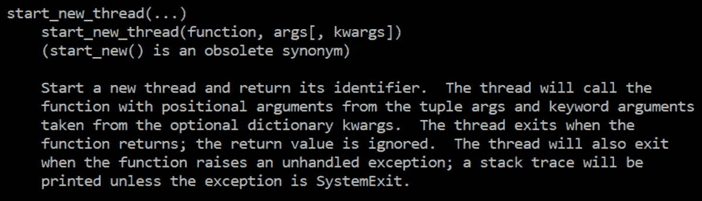
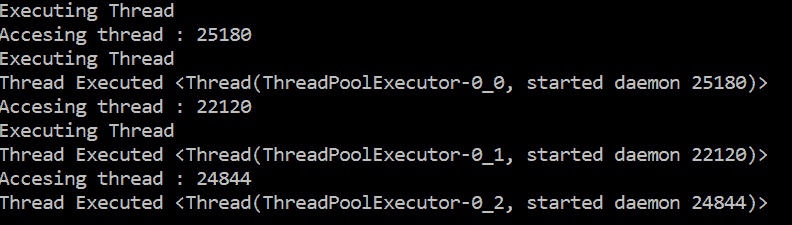

# 系统编程包

在本章中，我们将介绍 Python 中用于使用 Python 解释器、操作系统和执行命令的主要模块。我们将回顾如何使用文件系统、读取和创建文件。此外，我们还将回顾线程管理和其他多线程和并发模块。在本章的结尾，我们将回顾一下用于实现异步服务器的`socket.io`模块。

本章将介绍以下主题：

*   介绍 Python 中的系统模块
*   使用文件系统
*   Python 中的线程
*   Python 中的多线程和并发
*   蟒蛇`Socket.io`

# 技术要求

本章的示例和源代码可在 GitHub 存储库的`chapter 2`文件夹[中找到 https://github.com/PacktPublishing/Mastering-Python-for-Networking-and-Security.](https://github.com/PacktPublishing/Mastering-Python-for-Networking-and-Security.)

您需要一些关于操作系统中命令执行的基本知识，以及在本地机器上安装 Python 发行版。

# 介绍 python 中的系统模块

在本节中，我们将解释 Python 中用于使用 Python 解释器、操作系统和使用 sub-procces 模块执行命令的主要模块。

# 系统模块

`sys`模块将允许我们与解释器进行交互，它包含与正在执行、由解释器更新的执行相关的大部分信息，以及一系列函数和低级对象。

`**sys.argv**`包含执行脚本的参数列表。列表中的第一项是脚本名称，后跟参数列表。

例如，我们可能希望在运行时解析命令行参数。sys.argv 列表包含所有命令行参数。第一个 sys.argv[0]索引包含 Python 解释器脚本的名称。argv 数组中的其余项包含下一个命令行参数。因此，如果我们要传递三个附加参数，sys.argv 应该包含四项。

您可以在中的`**sys_arguments.py**`文件中找到以下代码：

```py
import sys
print "This is the name of the script:",sys.argv[0]
print "The number of arguments is: ",len(sys.argv)
print "The arguments are:",str(sys.argv)
print "The first argument is ",sys.argv[1]
```

可以使用一些参数执行前面的脚本，例如：

```py
$ python sys_arguments.py one two three
```

如果我们使用三个参数执行前面的脚本，我们可以看到以下结果：


在本例中，我们获得了许多系统变量：


以下是恢复该信息的主要属性和方法：

*   **sys.platform**：返回当前操作系统
*   **sys.stdin、sys、stdout、sys.stderr**：分别指向标准输入、标准输出和标准错误输出的文件对象
*   **sys.version**：返回解释器版本
*   **sys.getfilesystemencoding（）**：返回文件系统使用的编码
*   **sys.getdefaultencoding（）**：返回默认编码

*   **sys.path**：返回当使用 import 指令或使用文件名时，解释器在其中搜索模块的所有目录的列表，但没有完整路径

You can find more information on the Python online module documents at [http://docs.python.org/library/sys](http://docs.python.org/library/sys).

# 操作系统模块

操作系统（os）模块是访问操作系统中不同功能的最佳机制。此模块的使用取决于所使用的操作系统。如果我们使用这个模块，我们将不得不调整脚本，如果我们从一个操作系统转到另一个操作系统。

这个模块允许我们与操作系统环境、文件系统和权限进行交互。在本例中，我们检查作为命令行参数传递的文本文件的名称是否作为文件存在于当前执行路径中，并且当前用户是否具有该文件的读取权限。

您可以在`os`模块子文件夹的`check_filename.py`文件中找到以下代码：

```py
import sys
import os

if len(sys.argv) == 2:
    filename = sys.argv[1]
    if not os.path.isfile(filename):
        print '[-] ' + filename + ' does not exist.'
        exit(0)
if not os.access(filename, os.R_OK):
        print '[-] ' + filename + ' access denied.'
        exit(0)
```

# 当前工作目录的内容

在本例中，`os`模块使用`os.getcwd()`方法列出当前工作目录的内容。

您可以在`os`模块子文件夹的`show_content_directory.py`文件中找到以下代码：

```py
import os
pwd = os.getcwd()
list_directory = os.listdir(pwd)
for directory in list_directory:
    print directory
```

以下是前面代码的主要步骤：

1.  导入`os`模块。
2.  使用`os`模块，调用`**os.getcwd()**`方法检索当前工作目录路径，并将该值存储在 pwd 变量上。
3.  从当前目录路径获取目录列表。使用`**os.listdir()**`方法获取当前工作目录中的文件名和目录。
4.  迭代列表目录以获取文件和目录。

以下是从操作系统模块恢复信息的主要方法：

*   **os.system（）**：允许我们执行 shell 命令
*   **os.listdir（path）**：返回一个列表，其中包含作为参数传递的目录内容
*   **os.walk（path）**：导航提供的路径目录中的所有目录，并返回三个值：路径目录、子目录的名称和当前目录路径中的文件名列表。

在本例中，我们检查当前路径中的文件和目录。

您可以在`os`模块子文件夹的**`check_files_directory.py`**文件中找到以下代码：

```py
import os
for root,dirs,files in os.walk(".",topdown=False):
    for name in files:
        print(os.path.join(root,name))
    for name in dirs:
        print name
```

# 确定操作系统

下一个脚本确定代码是在 Windows 操作系统上运行还是在 Linux 平台上运行。`**platform.system()**`方法通知我们正在运行的操作系统。根据返回值的不同，我们可以看到 ping 命令在 Windows 和 Linux 中有所不同。Windows 操作系统使用 ping–n1 发送 ICMP 回显请求的一个数据包，而 Linux 或其他操作系统使用 ping–c1。

您可以在`os`模块子文件夹的**`operating_system.py`**文件中找到以下代码：

```py
import os
import platform
operating_system = platform.system()
print operating_system
if (operating_system == "Windows"):
    ping_command = "ping -n 1 127.0.0.1"
elif (operating_system == "Linux"):
    ping_command = "ping -c 1 127.0.0.1"
else :
    ping_command = "ping -c 1 127.0.0.1"
print ping_command
```

# 子流程模块

标准子流程模块允许您从 Python 调用流程并与之通信，将数据发送到输入（stdin），并接收输出信息（stdout）。建议使用此模块执行操作系统命令或启动程序（而不是传统的`os.system ()`），并可选地与它们交互。

使用子流程运行子流程很简单。在这里，**Popen**构造函数**启动流程**。您还可以将 Python 程序中的数据管道化到子流程中，并检索其输出。通过**help（subprocess）**命令，我们可以看到以下信息：


执行命令或调用进程的最简单方法是通过`call()`函数（从 Python 2.4 到 3.4）或`run()`（对于 Python 3.5+）。例如，以下代码执行一个命令，列出当前路径中的文件。

您可以在子流程子文件夹中的**`SystemCalls.py`**文件中找到此代码：

```py
import os
import subprocess
# using system
os.system("ls -la")
# using subprocess
subprocess.call(["ls", "-la"])
```

为了能够使用终端命令（例如 clear 或 cls 来清理控制台，cd 在目录树中移动，等等），需要指示 shell=True 参数：

```py
>> subprocess.call("cls", shell=True)
```

在本例中，它要求用户写下自己的姓名，然后在屏幕上打印问候语。通过子流程，我们可以使用 Popen 方法调用它，以编程方式输入名称，并以 Python 字符串的形式获取问候语。

`Popen ()`实例分别合并了`terminate ()`和`kill ()`方法来终止或终止进程。Linux 发行版区分 SIGTERM 和 SIGKILL 信号：

```py
>>> p = subprocess.Popen(["python", "--version"])
>>> p.terminate()
```

Popen 函数与 call 函数相比，它提供了更大的灵活性，因为它在新进程中作为子程序执行命令。例如，在 Unix 系统上，类使用`os.execvp()`。在 Windows 上，它使用 Windows`CreateProcess()`功能。

您可以在官方文档中获得有关 Popen 构造函数和提供 Popen 类的方法的更多信息：[https://docs.python.org/2/library/subprocess.html#popen-建造商](https://docs.python.org/3.5/library/subprocess.html#popen-constructor)。

在本例中，我们使用`subprocess`模块调用`ping`命令并获取该命令的输出，以评估特定 IP 地址是否响应`ECHO_REPLY`。此外，我们使用`sys`模块检查执行脚本的操作系统。

您可以在子流程子文件夹中的**`PingScanNetWork.py`**文件中找到以下代码：

```py
#!/usr/bin/env python
from subprocess import Popen, PIPE
import sys
import argparse
parser = argparse.ArgumentParser(description='Ping Scan Network')

# Main arguments
parser.add_argument("-network", dest="network", help="NetWork segment[For example 192.168.56]", required=True)
parser.add_argument("-machines", dest="machines", help="Machines number",type=int, required=True)

parsed_args = parser.parse_args()    
for ip in range(1,parsed_args.machines+1):
    ipAddress = parsed_args.network +'.' + str(ip)
    print "Scanning %s " %(ipAddress)
    if sys.platform.startswith('linux'):
    # Linux
        subprocess = Popen(['/bin/ping', '-c 1 ', ipAddress], stdin=PIPE, stdout=PIPE, stderr=PIPE)
    elif sys.platform.startswith('win'):
    # Windows
        subprocess = Popen(['ping', ipAddress], stdin=PIPE, stdout=PIPE, stderr=PIPE)
stdout, stderr= subprocess.communicate(input=None)
print stdout
if "Lost = 0" in stdout or "bytes from " in stdout:
    print "The Ip Address %s has responded with a ECHO_REPLY!" %(stdout.split()[1])
```

要执行此脚本，我们需要将正在分析的网络和要检查的机器号作为参数传递：

```py
python PingScanNetWork.py -network 192.168.56 -machines 1
```

以下是扫描 129.168.56 网络和一台机器的结果：


# 在 Python 中使用文件系统

在本节中，我们将介绍 Python 中的主要模块，这些模块用于使用文件系统、访问文件和目录、读取和创建文件，以及使用和不使用上下文管理器的操作。

# 访问文件和目录

在本节中，我们将回顾如何使用文件系统并执行诸如浏览目录或单独读取每个文件之类的任务。

# 通过目录递归

在某些情况下，有必要递归地遍历主目录以发现新目录。在本例中，我们将看到如何递归浏览目录并检索该目录中所有文件的名称：

```py
import os
 # you can change the "/" to a directory of your choice
 for file in os.walk("/"):
    print(file)
```

# 检查特定路径是文件还是目录

我们可以检查某个字符串是文件还是目录。为此，我们可以使用`os.path.isfile()`方法，如果是文件，则返回`True`，如果是目录，则返回`False`：

```py
 >>> import os
 >>> os.path.isfile("/")
 False
 >>> os.path.isfile("./main.py")
 True
```

# 检查文件或目录是否存在

如果要检查当前工作路径目录中是否存在文件，可以使用`os.path.exists()`功能，将要检查的文件或目录作为参数传递：

```py
 >>> import os
 >>> os.path.exists("./main.py")
 True
 >>> os.path.exists("./not_exists.py")
 False
```

# 在 Python 中创建目录

您可以使用`os.makedirs()`功能创建自己的目录：

```py
 >>> if not os.path.exists('my_dir'):
 >>>    os.makedirs('my_dir')
```

此代码检查 my_dir 目录是否存在；如果不存在，则调用`os.makedirs`**（**`my_dir`**）**创建目录。

如果在验证目录不存在后创建目录，则在执行对`os.makedirs`（“`my_dir`”）的调用之前，可能会生成错误或异常。

如果您想格外小心并捕获任何潜在的异常，可以将对 os.makedirs（“`my_dir`”）的调用包装在一个**try 中……除了**块：

```py
if not os.path.exists('my_dir'):
    try:
        os.makedirs('my_dir')
    except OSError as e:
       print e
```

# 用 Python 读写文件

现在，我们将回顾读写文件的方法。

# 文件方法

这些是可以在文件对象上使用的函数。

*   **file.write（string）**：将字符串打印到文件中，不返回。
*   **file.read（[bufsize]）**：从文件中读取最多“bufsize”个字节。如果在不使用缓冲区大小选项的情况下运行，则读取整个文件。
*   **file.readline（[bufsize]）**：从文件中读取一行（保留换行符）。
*   **file.close（）**：关闭文件并销毁文件对象。Python 会自动完成这项工作，但在处理完文件后，这仍然是一种很好的做法。

# 打开文件

处理文件的经典方法是使用`open()`方法。此方法允许您打开文件，返回文件类型的对象：

**打开（名称[，模式[，缓冲]]）**

文件的打开模式可以是 r（读）、w（写）和 a（附加）。我们可以将 b（二进制）、t（文本）和+（开放读写）模式添加到这些模式中。例如，您可以在选项中添加“+”，允许对同一对象执行读/写操作：

```py
>>> my_file=open("file.txt","r”)
```

要读取文件，我们有几种可能：

*   `readlines()`方法，读取文件的所有行并按顺序连接它们。如果您想一次读取整个文件，此方法非常有用：` >>> allLines = file.readlines()`。

*   如果我们想逐行读取文件，我们可以使用`readline()`方法。这样，如果我们想要逐个读取文件的所有行，我们可以使用 file 对象作为迭代器：

```py
>>> for line in file:
>>>  print line
```

# 使用上下文管理器

Python 中有多种创建文件的方法，但最干净的方法是使用带关键字的**，在本例中，我们使用的是**上下文管理器方法**。**

最初，Python 提供了 open 语句来打开文件。当我们使用 open 语句时，Python 将不再需要使用文件时关闭文件的责任委托给开发人员。这种做法会导致错误，因为开发人员有时会忘记关闭它。自 Python 2.5 以来，开发人员可以使用 with 语句安全地处理这种情况。即使引发异常，**with 语句**也会自动关闭文件。

with 命令允许对文件执行许多操作：

```py
>>> with open("somefile.txt", "r") as file:
>>> for line in file:
>>> print line
```

这样做的好处是：文件自动关闭，不需要调用`close()`方法。

您可以在文件名`**create_file.py**`中找到以下代码

```py
def main():
    with open('test.txt', 'w') as file:
        file.write("this is a test file")

 if __name__ == '__main__':
    main()
```

前面的脚本使用上下文管理器打开文件，并将其作为文件对象返回。在这个块中，我们调用 file.write（“这是一个测试文件”），它将它写入我们创建的文件中。在本例中，with 语句为我们处理关闭文件的问题，我们不必担心。

For more information about the with statement, you can check out the official documentation at [https://docs.python.org/2/reference/compound_stmts.html#the-with-statement](https://docs.python.org/2/reference/compound_stmts.html#the-with-statement).

# 逐行读取文件

我们可以逐行迭代文件：

```py
>>> with open('test.txt', 'r') as file:
>>>    for line in file:
>>>        print(line)
```

在本例中，我们在处理文件时将所有这些功能与异常管理结合起来。

您可以在**`create_file_exceptions.py`**文件中找到以下代码：

```py
def main():
    try:
        with open('test.txt', 'w') as file:
            file.write("this is a test file")
    except IOError as e:
        print("Exception caught: Unable to write to file", e)
    except Exception as e:
        print("Another error occurred ", e)
    else:
        print("File written to successfully")

if __name__ == '__main__':
    main()
```

# Python 中的线程

在本节中，我们将介绍线程的概念，以及如何使用`Python`模块管理线程。

# 线程简介

线程是可由操作系统调度的流，可在单个内核上以并发方式或在多个内核上以并行方式执行。线程可以与共享资源（如内存）交互，还可以同时甚至并行地修改内容。

# 螺纹类型

有两种不同类型的线程：

*   **内核级线程**：底层线程，用户不能直接与之交互。
*   **用户级线程**：高级线程，我们可以在代码中与它们交互。

# 进程与线程

流程是完整的程序。它们有自己的 PID（流程 ID）和 PEB（流程环境块）。这些是流程的主要功能：

*   进程可以包含多个线程。
*   如果进程终止，关联的线程也会终止。

线程是一个类似于进程的概念：它们也是执行中的代码。但是，线程是在进程内执行的，进程的线程之间共享资源，如内存。这些是线程的主要特征：

*   线程只能与一个进程关联。
*   进程可以在线程终止后继续（只要至少剩下一个线程）。

# 创建简单线程

线程是程序并行多次执行任务的机制。因此，在脚本中，我们可以在单个处理器上启动相同的任务一定次数。

对于在 Python 中使用线程，我们有两个选项：

*   线程模块提供编写多线程程序的基本操作。
*   线程模块提供了更方便的接口。

`thread`模块将允许我们使用多个线程：

在本例中，我们创建了四个线程，每个线程在屏幕上打印一条不同的消息，该消息在`thread_message (message)`方法中作为参数传递。

您可以在 threads 子文件夹中的**`threads_init.py`**文件中找到以下代码：

```py
import thread
import time

num_threads = 4

def thread_message(message):
  global num_threads
  num_threads -= 1
  print('Message from thread %s\n' %message)

while num_threads > 0:
  print "I am the %s thread" %num_threads
  thread.start_new_thread(thread_message,("I am the %s thread" %num_threads,))
  time.sleep(0.1)
```

如果调用 help（thread）命令，我们可以看到更多关于`start_new_thread()`方法的信息：



# 线程模块

除了`thread`模块之外，我们还有另一种使用`threading`模块的方法。线程模块依赖于`thread`模块为我们提供更高级别、更完整、面向对象的 API。线程模块稍微基于 Java 线程模型。

线程模块包含一个线程类，我们必须扩展该类以创建自己的执行线程。run 方法将包含我们希望线程执行的代码。如果我们想指定自己的构造函数，它必须调用线程。`Thread .__ init __ (self)`正确初始化对象。

在 Python 中创建新线程之前，我们先回顾一下 Python 线程类 init method 构造函数，看看需要传入哪些参数：

```py
# Python Thread class Constructor
 def __init__(self, group=None, target=None, name=None, args=(), kwargs=None, verbose=None):
```

线程类构造函数接受五个参数作为参数：

*   **组**：为以后扩展预留的特殊参数。
*   **目标**：run 方法（）调用的可调用对象。
*   **名称**：我们的线程名称。
*   **args**：用于目标调用的参数元组。
*   **kwargs**：调用基类构造函数的 Dictionary 关键字参数。

如果在 Python 解释器控制台中调用**help（threading）**命令，我们可以获得有关`init()`方法的更多信息：


让我们创建一个简单的脚本，然后使用它创建第一个线程：

您可以在 threads 子文件夹中的**`threading_init.py`**文件中找到以下代码：

```py
import threading

def myTask():
    print("Hello World: {}".format(threading.current_thread()))

 # We create our first thread and pass in our myTask function
 myFirstThread = threading.Thread(target=myTask)
 # We start out thread
 myFirstThread.start()
```

为了让线程开始执行其代码，创建我们刚刚定义的类的实例并调用其 start 方法就足够了。主线程和我们刚刚创建的主线程的代码将同时执行。

我们必须实例化一个线程对象并调用`start()`方法。Run 是我们希望在每个线程内并行运行的逻辑，因此我们可以使用`run()`方法启动一个新线程。此方法将包含我们希望并行执行的代码。

在这个脚本中，我们创建了四个线程。

您可以在 threads 子文件夹中的**`threading_example.py`**文件中找到以下代码：

```py
import threading

class MyThread(threading.Thread):

    def __init__ (self, message):
        threading.Thread.__init__(self)
        self.message = message

    def run(self):
        print self.message

threads = []
for num in range(0, 5):
    thread = MyThread("I am the "+str(num)+" thread")
    thread.name = num
    thread.start()
```

我们也可以使用`thread.join()`方法等待线程终止。使用 join 方法可以阻止执行调用的线程，直到调用它的线程结束。在这种情况下，使用它是为了使主线程不会在子线程之前完成其执行，这可能导致某些平台在完成其执行之前终止子线程。join 方法可以将浮点数作为参数，指示等待的最大秒数。

您可以在 threads 子文件夹中的**`threading_join.py`**文件中找到以下代码：

```py
import threading

class thread_message(threading.Thread):
    def __init__ (self, message):
         threading.Thread.__init__(self)
         self.message = message

    def run(self):
         print self.message

threads = []
for num in range(0, 10):
 thread = thread_message("I am the "+str(num)+" thread")
 thread.start()
 threads.append(thread)

# wait for all threads to complete by entering them
for thread in threads:
 thread.join()
```

# Python 中的多线程和并发

在本节中，我们将介绍多线程和并发的概念，以及如何使用 python 模块管理它们。

# 多线程简介

多线程应用程序背后的思想是，它们允许我们拥有代码的副本，并在其他线程上执行它们。这允许程序同时执行多个操作。此外，当进程被阻塞时，例如等待输入/输出操作，操作系统可以将计算时间分配给其他进程。

当我们提到多处理器时，我们指的是可以同时执行多个线程的处理器。这些线程通常有两个或多个线程，它们在内核中积极竞争执行时间，当一个线程停止时，处理内核开始执行另一个线程。

这些子进程之间的上下文变化非常快，给人的印象是计算机正在并行运行这些进程，这给了我们多任务的能力。

# Python 中的多线程

Python 有一个 API，允许我们使用多线程编写应用程序。为了开始使用多线程，我们将在`python`类中创建一个新线程，并将其命名为**`ThreadWorker.py`。**此类从`threading.Thread`扩展而来，包含管理一个线程的代码：

```py
import threading
class ThreadWorker(threading.Thread):
    # Our workers constructor
    def __init__(self):
        super(ThreadWorker, self).__init__()
    def run(self):
        for i in range(10):
           print(i)
```

现在我们有了线程工作者类，我们可以开始处理我们的主类了。创建一个新的 python 文件，将其命名为`main.py`，并放入以下代码：

```py
import threading
from ThreadWorker import ThreadWorker 
def main():
    # This initializes ''thread'' as an instance of our Worker Thread
   thread = ThreadWorker()
    # This is the code needed to run our thread
    thread.start()

if __name__ == "__main__":  
    main()
```

Documentation about the threading module is available at [https://docs.python.org/3/library/threading.html](https://docs.python.org/3/library/threading.html).

# 经典 python 线程的限制

Python 线程的经典实现的主要问题之一是它们的执行不是完全异步的。众所周知，python 线程的执行不是完全并行的，添加多个线程通常会增加执行时间。因此，执行这些任务可以缩短执行时间。

Python 中线程的执行由 GIL（全局解释器锁）控制，因此同一时间只能执行一个线程，与机器计数的处理器数量无关。

这使得为 Python 编写 C 扩展变得更加容易，但它的缺点是性能受到很大限制，因此尽管如此，在 Python 中，有时我们可能对使用进程比使用线程更感兴趣，因为线程不受此限制。

默认情况下，线程更改每 10 个字节码指令执行一次，尽管可以使用 sys.setcheckinterval 函数进行修改。当线程随时间进入睡眠状态时，它也会更改线程。睡眠或当输入/输出操作开始时，这可能需要很长时间才能完成，因此，如果不进行更改，CPU 将有很长时间不执行代码，等待 I/O 操作完成。

为了最小化 GIL 对应用程序性能的影响，可以方便地使用-O 标志调用解释器，这将生成具有较少指令的优化字节码，从而减少上下文更改。我们也可以考虑使用进程而不是线程，如我们所讨论的，如 AutoT0.E.模块。

More about the **GIL** can be found at [https://wiki.python.org/moin/GlobalInterpreterLock](https://wiki.python.org/moin/GlobalInterpreterLock).

# python 中使用 ThreadPoolExecutor 的并发性

在本节中，我们将回顾**ThreadPoolExecutor**类，该类提供异步执行任务的接口。

# 创建线程池执行器

我们可以使用 init 构造函数定义我们的**ThreadPoolExecutor**对象：

```py
executor = ThreadPoolExecutor(max_workers=5)
```

如果将最大工作线程数作为参数传递给构造函数，则可以创建 ThreadPoolExecutor。在本例中，我们定义了五个线程作为最大线程数，这意味着这组子进程将只有五个线程同时工作。

为了使用我们的`ThreadPoolExecutor`，我们可以调用`submit()`方法，该方法将异步执行该代码的函数作为参数：
`executor.submit(myFunction())`

# 线程池执行器在实践中的应用

在本例中，我们分析了`ThreadPoolExecutor`类对象的创建。我们定义了一个`view_thread()`函数，允许我们使用`threading.get_ident()`方法显示当前线程标识符。

我们定义了主函数，其中 executor 对象被初始化为 ThreadPoolExecutor 类的一个实例，并在此对象上执行一组新的线程。然后我们得到线程已经用`threading.current_thread()`方法执行了。

您可以在并发子文件夹的`**threadPoolConcurrency.py**`文件中找到以下代码：

```py
#python 3
from concurrent.futures import ThreadPoolExecutor
import threading
import random

def view_thread():
 print("Executing Thread")
 print("Accesing thread : {}".format(threading.get_ident()))
 print("Thread Executed {}".format(threading.current_thread()))

def main():
 executor = ThreadPoolExecutor(max_workers=3)
 thread1 = executor.submit(view_thread)
 thread1 = executor.submit(view_thread)
 thread3 = executor.submit(view_thread)

if __name__ == '__main__':
 main()

```

我们看到脚本输出中的三个不同值是三个不同的线程标识符，我们获得了三个不同的守护进程线程：



# 使用上下文管理器执行 ThreadPoolExecutor

实例化 ThreadPoolExecutor 的另一种方法是使用`with`语句将其用作上下文管理器：
`with ThreadPoolExecutor(max_workers=2) as executor:`

在本例中，在我们的主函数中，我们使用 ThreadPoolExecutor 作为上下文管理器，然后调用`future = executor.submit(message, (message))`两次来处理 threadpool 中的每条消息。

您可以在并发子文件夹的`threadPoolConcurrency2.py`文件中找到以下代码：

```py
from concurrent.futures import ThreadPoolExecutor

def message(message):
 print("Processing {}".format(message))

def main():
 print("Starting ThreadPoolExecutor")
 with ThreadPoolExecutor(max_workers=2) as executor:
   future = executor.submit(message, ("message 1"))
   future = executor.submit(message, ("message 2"))
 print("All messages complete")

if __name__ == '__main__':
 main()
```

# pythonsocket.io

在本节中，我们将回顾如何使用 socket.io 模块创建基于 Python 的 Web 服务器。

# 介绍 WebSocket

WebSockets 是一种通过 TCP 连接在客户机和服务器之间提供实时通信的技术，客户无需不断检查 API 端点是否有更新或新内容。客户端创建到 WebSocket 服务器的单个连接，并保持挂起状态以侦听来自服务器的新事件或消息。

WebSocket 的主要优点是，它们更高效，因为它们减少了网络负载，并以消息的形式向大量客户端发送信息。

# aiohttp 和 asyncio

aiohttp 是一个用于构建异步 IO 中内置的服务器和客户端应用程序的库。该库利用 WebSocket 的固有优势，异步地与应用程序的不同部分进行通信。

文件可在[上查阅 http://aiohttp.readthedocs.io/en/stable](http://aiohttp.readthedocs.io/en/stable/) 。

asyncio 是一个 python 模块，它有助于在 python 中对单个线程进行并发编程。该文档已经在 python 3.6 中，可在[上找到 https://docs.python.org/3/library/asyncio.html](https://docs.python.org/3/library/asyncio.html) 。

# 使用 socket.io 实现服务器

Socket.IO 服务器在官方 python 存储库中可用，可以通过 pip:`pip install python-socketio.`安装

完整文件可在[上查阅 https://python-socketio.readthedocs.io/en/latest/](https://python-socketio.readthedocs.io/en/latest/) 。

下面是一个在 python 3.5 中工作的示例，其中我们使用异步 IO 的 aiohttp 框架实现了一个 Socket.IO 服务器：

```py
from aiohttp import web
import socketio

socket_io = socketio.AsyncServer()
app = web.Application()
socket_io.attach(app)

async def index(request):
        return web.Response(text='Hello world from socketio' content_type='text/html')

# You will receive the new messages and send them by socket
@socket_io.on('message')
def print_message(sid, message):
    print("Socket ID: " , sid)
    print(message)

app.router.add_get('/', index)

if __name__ == '__main__':
    web.run_app(app)
```

在前面的代码中，我们实现了一个基于 socket.io 的服务器，它使用 aiohttp 模块。正如您在代码中所看到的，我们定义了两种方法，`index ()`方法，在收到“/”根端点上的请求时返回响应消息，以及包含`@socketio.on`（‘消息’）注释的`print_message ()`方法。此注释使函数侦听消息类型的事件，当这些事件发生时，它将对这些事件执行操作。

# 总结

在本章中，我们学习了 python 编程的主要系统模块，例如用于操作系统的 os、用于文件系统的 sys 以及用于执行命令的子进程。我们还回顾了如何使用文件系统、读取和创建文件、管理线程以及并发性。

在下一个[章节](03.html)中，我们将探索用于解析 IP 地址和域的套接字包，并使用 TCP 和 UDP 协议实现客户端和服务器。

# 问题

1.  允许我们与 python 解释器交互的主要模块是什么？
2.  允许我们与操作系统环境、文件系统和权限交互的主要模块是什么？
3.  用于列出当前工作目录内容的模块和方法是什么？
4.  通过 call（）函数执行命令或调用进程的模块是什么？
5.  在 python 中，我们可以采用什么方法来轻松安全地处理文件和管理异常？

6.  进程和线程之间有什么区别？
7.  python 中用于创建和管理线程的主要模块是什么？
8.  python 在处理线程时有什么限制？
9.  哪个类提供了一个高级接口，用于以异步方式执行输入/输出任务？
10.  线程模块中确定执行了哪个线程的功能是什么？

# 进一步阅读

在这些链接中，您将找到有关上述工具的更多信息以及我们讨论的一些模块的官方 python 文档：

*   [https://docs.python.org/3/tutorial/inputoutput.html](https://docs.python.org/3/tutorial/inputoutput.html)
*   [https://docs.python.org/3/library/threading.html](https://docs.python.org/3/library/threading.html)
*   [https://wiki.python.org/moin/GlobalInterpreterLock](https://wiki.python.org/moin/GlobalInterpreterLock)
*   [https://docs.python.org/3/library/concurrent.futures.html](https://docs.python.org/3/library/concurrent.futures.html)

对使用 aiohttp 和 asyncio 等技术进行 web 服务器编程感兴趣的读者应该参考 Flask（[等框架）http://flask.pocoo.org](http://flask.pocoo.org) 和 Django（[https://www.djangoproject.com](https://www.djangoproject.com) ）。