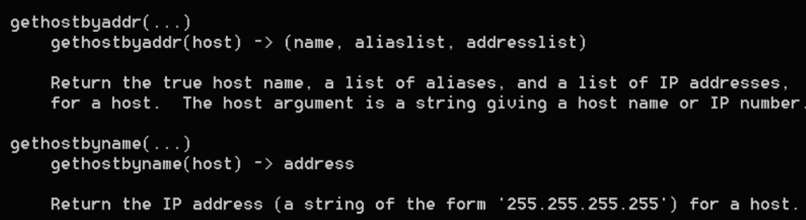
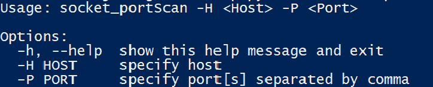

# 套接字编程

本章将向您介绍使用`socket`模块的 Python 网络的一些基础知识。在此过程中，我们将使用 TCP 和**用户数据报****协议**（**UDP**协议）构建客户端、服务器。套接字编程包括使用 Python 中的 TCP 和 UDP 套接字编写低级网络应用程序。我们还将介绍用于安全数据传输的 HTTPS 和 TLS。

本章将介绍以下主题：

*   了解套接字以及如何在 Python 中实现它们
*   了解 Python 中的 TCP 客户端和服务器编程
*   了解 Python 中的 UDP 客户端和服务器编程
*   了解解析 IP 地址和域的套接字方法
*   在实际用例中应用所有概念，例如端口扫描和管理异常

# 技术要求

本章的示例和源代码可在 GitHub 存储库的`chapter 3`文件夹[中找到 https://github.com/PacktPublishing/Mastering-Python-for-Networking-and-Security](https://github.com/PacktPublishing/Mastering-Python-for-Networking-and-Security) 。

您需要在本地计算机上安装一个 Python 发行版，该发行版至少有 2GB 内存和一些关于网络协议的基本知识。

# 插座简介

套接字是允许我们利用操作系统的功能与网络交互的主要组件。您可以将套接字视为客户端和服务器之间的点对点通信通道。

网络套接字是在相同或不同计算机上的进程之间建立通信的一种简单方法。套接字的概念与 UNIX 文件描述符的概念非常相似。像`read()`和`write()`（用于文件系统）这样的命令的工作方式与套接字类似。

网络套接字地址由 IP 地址和端口号组成。套接字的目标是通过网络与进程通信。

# Python 中的网络套接字

网络中不同实体之间的通信基于 Python 的经典套接字概念。套接字由机器的 IP 地址、侦听端口及其使用的协议定义。

在 Python 中创建套接字是通过`socket.socket()`方法完成的。套接字方法的一般语法如下所示：

```py
s = socket.socket (socket_family, socket_type, protocol=0)
```

这些**参数**表示传输层的地址族和协议。

根据套接字类型，根据服务使用的是 TCP 还是 UDP，套接字分为流套接字（`socket.SOCK_STREAM`或数据报套接字（`socket.SOCK_DGRAM`），其中`socket.SOCK_DGRAM`用于 UDP 通信，`socket.SOCK_STREAM`用于 TCP 连接。

插座也可以根据系列进行分类。我们有 UNIX 套接字（`socket.AF_UNIX`），它是在网络概念出现之前创建的，基于文件，我们感兴趣的是`socket.AF_INET`套接字，`socket.AF_INET6 for IPv6`套接字，等等：


# 插座模块

使用套接字所需的类型和函数可以在 Python 的`socket`模块中找到。`socket`模块公开了快速写入 TCP 和 UDP 客户端和服务器所需的所有部分。`socket`模块几乎拥有构建套接字服务器或客户端所需的一切。对于 Python，套接字返回一个可以应用套接字方法的对象。

安装 Python 发行版时，默认情况下会安装此模块。

要检查它，我们可以从 Python 解释器执行此操作：


在这个屏幕截图中，我们看到了本模块中可用的所有常量和方法。我们在返回对象的结构的第一个实例中看到的常量。在最常用的常量中，我们可以突出显示以下内容：

```py
socket.AF_INET
socket.SOCK_STREAM
```

构建在 TCP 级别工作的套接字的典型调用是：

```py
socket.socket(socket.AF_INET,socket.SOCK_STREAM)
```

# 套接字方法

以下是我们可以在客户端和服务器中使用的通用套接字方法：

*   `socket.recv(buflen)`：此方法从套接字接收数据。method 参数指示它可以接收的最大数据量。
*   `socket.recvfrom(buflen)`：此方法接收数据和发送方地址。
*   `socket.recv_into(buffer)`：此方法将数据接收到缓冲区。
*   `socket.recvfrom_into(buffer)`：此方法将数据接收到缓冲区。
*   `socket.send(bytes)`：此方法向指定目标发送字节数据。
*   `socket.sendto(data, address)`：此方法将数据发送到给定的地址。
*   `socket.sendall(data)`：此方法将缓冲区中的所有数据发送到套接字。
*   `socket.close()`：此方法释放内存并完成连接。

# 服务器套接字方法

在**客户机-服务器体系结构**中，有一个中央服务器，为一组连接的机器提供服务。从服务器的角度来看，我们可以使用以下主要方法：

*   `socket.bind(address)`：此方法允许我们将地址与套接字连接，要求在与地址建立连接之前必须打开套接字
*   `socket.listen(count)`：此方法接受来自客户端的最大连接数作为参数，并为传入连接启动 TCP 侦听器
*   `socket.accept()`：此方法允许我们接受来自客户端的连接。此方法返回两个值：`client_socket`和客户端地址。`client_socket`是用于发送和接收数据的新套接字对象。在使用此方法之前，必须调用`socket.bind(address)`和`socket.listen(q)`方法

# 客户端套接字方法

这是我们可以在套接字客户端中用于连接服务器的套接字方法：

*   `socket.connect(ip_address)`：此方法将客户端连接到服务器 IP 地址

我们可以通过`help(socket)`命令获得有关此方法的更多信息。我们了解到，该方法与`connect_ex`方法相同，并且在无法连接该地址的情况下，还提供了返回错误的可能性。

我们可以通过`help(socket)`命令获得关于这些方法的更多信息：


# 带套接字模块的基本客户端

在本例中，我们正在测试如何从网站发送和接收数据。一旦建立连接，我们就可以发送和接收数据。由于用于 TCP 通信的两个功能`send ()`和`recv ()`，可以非常轻松地与套接字进行通信。对于 UDP 通信，我们使用`sendto ()`和`recvfrom ()`

在这个`socket_data.py`脚本中，我们使用`AF_INET`和`SOCK_STREAM`参数创建了一个套接字对象。然后，我们将客户端连接到远程主机并向其发送一些数据。最后一步是接收一些数据并打印出响应。我们使用无限循环（而`True`），并检查数据变量是否为空。如果出现这种情况，我们将完成循环。

您可以在`socket_data.py`文件中找到以下代码：

```py
import socket
print 'creating socket ...'
# create a socket object
client = socket.socket(socket.AF_INET, socket.SOCK_STREAM)
print 'socket created'
print "connection with remote host"
s.connect(('www.google.com',80))
print 'connection ok'
s.send( 'GET /index.html HTML/1.1\r\n\r\n')
while 1:
   data=s.recv(128)
    print data
    if data== "":
        break
print 'closing the socket'
s.close()
```

# 创建简单的 TCP 客户端和 TCP 服务器

创建此应用程序的想法是，套接字客户端可以针对给定的主机、端口和协议建立连接。套接字服务器负责以特定端口和协议接收来自客户端的连接。

# 使用套接字创建服务器和客户端

要创建套接字，使用`socket.socket()`构造函数，它可以将族、类型和协议作为可选参数。默认情况下，使用`AF_INET`族和`SOCK_STREAM`类型。

在本节中，我们将以创建两个客户端和服务器脚本为例。

我们要做的第一件事是为服务器创建套接字对象：

```py
server = socket.socket(socket.AF_INET, socket.SOCK_STREAM)
```

我们现在必须指出服务器将使用 bind 方法侦听哪个端口。对于 IP 套接字，就像我们的例子一样，bind 参数是一个包含主机和端口的元组。主机可以保留为空，向方法指示可以使用任何可用名称。

`bind(IP,PORT)`方法允许您将主机和端口与特定套接字相关联，同时考虑到端口`1-1024`是为标准协议保留的：

```py
server.bind(("localhost", 9999))
```

最后，我们使用 listen 使套接字接受传入连接并开始侦听。listen 方法需要一个参数，该参数指示我们要接受的最大连接数。

`accept`方法一直在等待传入的连接，直到消息到达才阻止执行。

要接受来自客户端套接字的请求，应使用`accept()`方法。这样，服务器套接字将等待从另一台主机接收输入连接：

```py
server.listen(10)
socket_client, (host, port) = server.accept()
```

我们可以通过`help(socket)`命令获得关于这些方法的更多信息：


一旦我们有了这个套接字对象，我们就可以通过它与客户机通信，使用`recv`和`send`方法（或者 UDP 中的`recvfrom`和`sendfrom`方法），分别允许我们接收或发送消息。send 方法将要发送的数据作为参数，`recv`方法将要接受的最大字节数作为参数：

```py
received = socket_client.recv(1024)
print "Received: ", received
socket_client.send(received)
```

要创建客户机，我们必须创建 socket 对象，使用 connect 方法连接到服务器，并使用前面看到的 send 和 recv 方法。connect 参数是一个具有主机和端口的元组，与 bind 完全相同：

```py
socket_client = socket.socket(socket.AF_INET, socket.SOCK_STREAM)
socket_client.connect(("localhost", 9999))
socket_client.send("message")
```

让我们看一个完整的例子。在本例中，客户端向服务器发送用户写入的任何消息，服务器重复接收到的消息。

# 实现 TCP 服务器在本例中，我们将创建一个多线程 TCP 服务器。

服务器套接字在`localhost:9999`上打开一个 TCP 套接字，并在无限循环中侦听请求。当您收到来自客户端套接字的请求时，它将返回一条消息，指示已从另一台计算机建立连接。

while 循环使服务器程序保持活动状态，不允许代码结束。`server.listen(5)`语句侦听连接并等待客户端。此指令告诉服务器开始侦听，最大积压连接数设置为`5`。

您可以在`tcp_client_server`文件夹内的`tcp_server.py`文件中找到以下代码：

```py
import socket
import threading

bind_ip = "localhost"
bind_port = 9999

server = socket.socket(socket.AF_INET, socket.SOCK_STREAM)server.bind((bind_ip,bind_port))
server.listen(5)
print "[*] Listening on %s:%d" % (bind_ip,bind_port)

# this is our client-handling thread
def handle_client(client_socket):
# print out what the client sends
    request = client_socket.recv(1024)
    print "[*] Received: %s" % request
    # send back a packet
    client_socket.send("Message received")
    client_socket.close()

while True:
    client,addr = server.accept()
    print "[*] Accepted connection from: %s:%d" % (addr[0],addr[1])
    # spin up our client thread to handle incoming data
    client_handler = threading.Thread(target=handle_client,args=(client,))
    client_handler.start()
```

# TCP 客户端的实现

客户端套接字打开的套接字类型与服务器正在侦听的套接字类型相同，并发送消息。服务器响应并结束其执行，关闭客户端套接字。

您可以在`tcp_client_server`文件夹内的`tcp_client.py`文件中找到以下代码：

```py
import socket
s = socket.socket(socket.AF_INET, socket.SOCK_STREAM)
host = "127.0.0.1" # server address
port =9999 #server port
s.connect((host,port))
print s.recv(1024)
while True:
    message = raw_input("> ")
    s.send(message)
    if message== "quit":
        break
s.close()
```

在前面的代码中，`new: s.connect((host,port))`方法将客户端连接到服务器，`s.recv(1024)`方法接收服务器发送的字符串。

# 创建简单的 UDP 客户端和 UDP 服务器

在本节中，我们将介绍如何使用 Python 的`Socket`模块设置自己的 UDP 客户机服务器应用程序。应用程序将是一个服务器，通过特定端口侦听所有连接和消息，并将所有消息打印到控制台。

# UDP 协议简介

UDP 是与 TCP 处于同一级别的协议，即 IP 层之上。它以断开连接模式向使用它的应用程序提供服务。此协议适用于需要高效通信且不必担心数据包丢失的应用程序。UDP 的典型应用是互联网电话和视频流。UDP 帧的标头由四个字段组成：

*   UDP 源端口
*   UDP 目标端口
*   UDP 消息的长度
*   chekSum 作为错误控制字段

在 Python 中使用 TCP 的唯一区别是，在创建套接字时，必须使用`SOCK_DGRAM`而不是`SOCK_STREAM`。

The main difference between TCP and UDP is that UDP is not connection-oriented, this means that there is no guarantee our packets will reach their destinations, and no error notification if a delivery fails.

# 带有套接字模块的 UDP 客户端和服务器

在本例中，我们将创建一个同步 UDP 服务器，这意味着每个请求必须等到上一个请求的处理结束。将使用`bind()`方法将端口与 IP 地址关联。对于消息的接收，我们使用`recvfrom()`和`sendto()`方法进行发送。

# 实现 UDP 服务器

与 TCP 的主要区别在于 UDP 不控制发送的数据包的错误。TCP 套接字和 UDP 套接字之间的唯一区别是，在创建套接字对象时必须指定`SOCK_DGRAM`而不是`SOCK_STREAM`。使用以下代码创建 UDP 服务器：

您可以在`udp_client_server`文件夹中的**`udp_server.py`**文件中找到以下代码：

```py
import socket,sys
buffer=4096
host = "127.0.0.1"
port = 6789
socket_server=socket.socket(socket.AF_INET,socket.SOCK_DGRAM)
socket_server.bind((host,port))

while True:
    data,addr = socket_server.recvfrom(buffer)
    data = data.strip()
    print "received from: ",addr
    print "message: ", data
    try:
        response = "Hi %s" % sys.platform
    except Exception,e:
        response = "%s" % sys.exc_info()[0]
    print "Response",response
    socket_server.sendto("%s "% response,addr)

socket_server.close()
```

在前面的代码中，我们看到`socket.SOCK_DGRAM`创建了一个 UDP 套接字，数据**`addr = s.recvfrom(buffer)`**返回数据和源地址。

现在我们已经完成了我们的服务器，我们需要实现我们的客户端程序。将持续侦听我们定义的 IP 地址和端口号的任何 UDP 消息的服务器。必须在执行 Python 客户端脚本之前运行此服务器，否则客户端脚本将失败。

# 实现 UDP 客户端

要开始实现客户机，我们需要声明我们将尝试向其发送 UDP 消息的 IP 地址以及端口号。此端口号是任意的，但您必须确保未使用已使用的套接字：

```py
UDP_IP_ADDRESS = "127.0.0.1"
 UDP_PORT = 6789
 message = "Hello, Server"
```

现在是创建套接字的时候了，我们将通过该套接字向服务器发送 UDP 消息：

```py
clientSocket = socket.socket(socket.AF_INET, socket.SOCK_DGRAM)
```

最后，一旦我们构建了新的套接字，就可以编写代码来发送 UDP 消息了：

```py
clientSocket.sendto(Message, (UDP_IP_ADDRESS, UDP_PORT))
```

您可以在`udp_client_server`文件夹内的**`udp_client.py`**文件**中找到以下代码：**

 **```py
import socket
UDP_IP_ADDRESS = "127.0.0.1"
UDP_PORT = 6789
buffer=4096
address = (UDP_IP_ADDRESS ,UDP_PORT)
socket_client=socket.socket(socket.AF_INET,socket.SOCK_DGRAM)
while True:
    message = raw_input('?: ').strip()
    if message=="quit":
        break
    socket_client.sendto("%s" % message,address)
    response,addr = socket_client.recvfrom(buffer)
    print "=> %s" % response

socket_client.close()
```

If we try to use `SOCK_STREAM` with the UDP socket, we get  `error: Traceback (most recent call last): File ".\udp_server.py", line 15, in <module> data,addr = socket_server.recvfrom(buffer)socket.error: [Errno 10057] A request to send or receive data was disallowed because the socket is not connected and no address was supplied`.

# 解析 IP 地址和域

在本章中，我们研究了如何在 Python 中构建套接字，既面向 TCP 连接，又不面向 UDP 连接。在本节中，我们将回顾一些有用的方法，以获取有关 IP 地址或域的更多信息。

# 使用套接字收集信息

收集更多信息的有用方法有：

*   `gethostbyaddr(address)`：允许我们从 IP 地址获取域名
*   `gethostbyname(hostname)`：允许我们从域名获取 IP 地址

我们可以通过`help(socket)`命令获得关于这些方法的更多信息：



现在我们将详细介绍一些与主机、IP 地址和域解析相关的方法。对于每一个，我们将展示一个简单的示例：

*   `socket.gethostbyname(hostname)`：此方法将主机名转换为 IPv4 地址格式。IPv4 地址以字符串形式返回。此方法相当于我们在许多操作系统中可以找到的`nslookup`命令：

```py
>>> import socket
> socket.gethostbyname('packtpub.com')
'83.166.169.231'
>> socket.gethostbyname('google.com')
'216.58.210.142'
```

*   `socket.gethostbyname_ex(name)`：此方法返回单个域名的多个 IP 地址。这意味着一个域在多个 IP 上运行：

```py
>> socket.gethostbyname_ex('packtpub.com')
 ('packtpub.com', [], ['83.166.169.231'])
>>> socket.gethostbyname_ex('google.com')
 ('google.com', [], ['216.58.211.46'])
```

*   `socket.getfqdn([domain])`：用于查找域的完全限定名：

```py
>> socket.getfqdn('google.com')
```

*   `socket.gethostbyaddr(ip_address)`：此方法返回一个元组（`hostname`、`name`、`ip_address_list`），其中主机名是响应给定 IP 地址的主机名，名称是与同一地址关联的名称列表，`the_address_list`是同一主机上同一网络接口的 IP 地址列表：

```py
>>> socket.gethostbyaddr('8.8.8.8')
('google-public-dns-a.google.com', [], ['8.8.8.8'])
```

*   `socket.getservbyname(servicename[, protocol_name])`：此方法允许您从端口名称中获取端口号：

```py
>>> import socket
>>> socket.getservbyname('http')
80
>>> socket.getservbyname('smtp','tcp')
25
```

*   `socket.getservbyport(port[, protocol_name])`：此方法执行前一种方法的反向操作，允许您从端口号中获取端口名：

```py
>>> socket.getservbyport(80)
'http'
>>> socket.getservbyport(23)
'telnet'
```

下面的脚本是我们如何使用这些方法从 Google 服务器获取信息的示例。

您可以在`socket_methods.py`文件中找到以下代码：

```py
import socket
import sys
try:
    print "gethostbyname"
    print socket.gethostbyname_ex('www.google.com')
    print "\ngethostbyaddr"
    print socket.gethostbyaddr('8.8.8.8')
    print "\ngetfqdn"
    print socket.getfqdn('www.google.com')
    print "\ngetaddrinfo"
    print socket.getaddrinfo('www.google.com',socket.SOCK_STREAM)
except socket.error as error:
    print (str(error))
    print ("Connection error")
    sys.exit()
```

`socket.connect_ex(address)`方法使用套接字实现端口扫描。此脚本显示本地主机上的端口已打开，环回 IP 地址接口为`127.0.0.1`。

您可以在`socket_ports_open.py`文件中找到以下代码：

```py
import socket
ip ='127.0.0.1'
portlist = [22,23,80,912,135,445,20]
for port in portlist:
    sock= socket.socket(socket.AF_INET,socket.SOCK_STREAM)
    result = sock.connect_ex((ip,port))
    print port,":", result
    sock.close()
```

# 反向查找

此命令从 IP 地址获取主机名。对于此任务，我们可以使用`gethostbyaddr()`函数。在这个脚本中，我们从`8.8.8.8`的 IP 地址获取主机名。

您可以在`socket_reverse_lookup.py`文件中找到以下代码：

```py
import sys, socket
try :
    result=socket.gethostbyaddr("8.8.8.8")
    print "The host name is:"
    print " "+result[0]
    print "\nAddress:"
    for item in result[2]:
        print " "+item
except socket.herror,e:
    print "error for resolving ip address:",e
```

# 插座的实际使用案例

在本节中，我们将回顾如何使用套接字实现端口扫描，以及如何在使用套接字时管理异常。

# 带插座的端口扫描仪

套接字是网络通信的基本构建块，我们可以通过调用`connect_ex`方法轻松检查特定端口是否打开、关闭或过滤。

例如，我们可以有一个函数，通过参数接受 IP 和端口列表，并返回每个端口的打开或关闭状态。

在本例中，我们需要导入套接字和`sys`模块。如果我们从主程序执行函数，就会看到它如何检查每个端口，并返回特定 IP 地址的打开或关闭状态。第一个参数可以是 IP 地址或域名，因为模块能够从 IP 解析名称，反之亦然。

您可以在`port_scan`文件夹中的`check_ports_socket.py`**文件中找到以下代码：**

 **```py
import socket
import sys

def checkPortsSocket(ip,portlist):
    try:
        for port in portlist:
            sock= socket.socket(socket.AF_INET,socket.SOCK_STREAM)
            sock.settimeout(5)
            result = sock.connect_ex((ip,port))
            if result == 0:
                print ("Port {}: \t Open".format(port))
            else:
                print ("Port {}: \t Closed".format(port))
            sock.close()
    except socket.error as error:
        print (str(error))
        print ("Connection error")
        sys.exit()

checkPortsSocket('localhost',[80,8080,443])
```

下面的 Python 代码将允许您扫描本地或远程主机以查找打开的端口。程序扫描用户输入的特定 IP 地址上的选定端口，并将打开的端口反映回用户。如果端口关闭，它还会显示有关原因的信息，例如超时连接。

您可以在`port_scan`文件夹中的`socket_port_scanner.py`**文件中找到以下代码。**

 **脚本以与用户引入的 IP 地址和端口相关的信息开始：

```py
#!/usr/bin/env python
#--*--coding:UTF-8--*--
# Import modules
import socket
import sys
from datetime import datetime
import errno

# RAW_INPUT IP / HOST
remoteServer    = raw_input("Enter a remote host to scan: ")
remoteServerIP  = socket.gethostbyname(remoteServer)

# RAW_INPUT START PORT / END PORT
print "Please enter the range of ports you would like to scan on the machine"
startPort    = raw_input("Enter a start port: ")
endPort    = raw_input("Enter a end port: ")

print "Please wait, scanning remote host", remoteServerIP
#get Current Time as T1
t1 = datetime.now()

```

我们使用从`startPort`到`endPort`的 for 循环继续脚本，以分析其间的每个端口。我们通过显示完成端口扫描的总时间来完成：

```py
#Specify Range - From startPort to startPort
try:
    for port in range(int(startPort),int(endPort)):
    print ("Checking port {} ...".format(port))
    sock = socket.socket(socket.AF_INET, socket.SOCK_STREAM)
    result = sock.connect_ex((remoteServerIP, port))
    if result == 0:
        print "Port {}: Open".format(port)
    else:
        print "Port {}: Closed".format(port)
        print "Reason:",errno.errorcode[result]
    sock.close()
# If interrupted
except KeyboardInterrupt:
    print "You pressed Ctrl+C"
    sys.exit()
# If Host is wrong
except socket.gaierror:
    print 'Hostname could not be resolved. Exiting'
    sys.exit()
# If server is down
except socket.error:
    print "Couldn't connect to server"
    sys.exit()
#get current Time as t2
t2 = datetime.now()
#total Time required to Scan
total =  t2 - t1
# Time for port scanning
print 'Port Scanning Completed in: ', total
```

在执行上一个脚本时，我们可以看到打开的端口以及完成端口扫描的时间（以秒为单位）：


下面的 Python 脚本将允许我们使用`portScanning`和`socketScan`函数扫描 IP 地址。该程序扫描特定域上的选定端口，该域根据用户按参数输入的 IP 地址进行解析。

在此脚本中，用户必须输入主机和端口作为强制参数，并用逗号分隔：



您可以在`port_scan`文件夹中的`socket_portScan.py`**文件中找到以下代码：**

 **```py
#!/usr/bin/python
# -*- coding: utf-8 -*-
import optparse
from socket import *
from threading import *

def socketScan(host, port):
    try:
        socket_connect = socket(AF_INET, SOCK_STREAM)
        socket_connect.connect((host, port))
        results = socket_connect.recv(100)
        print '[+] %d/tcp open \n' % port
        print '[+] ' + str(results)
    except:
        print '[-] %d/tcp closed \n' % port
    finally:
        socket_connect.close()

def portScanning(host, ports):
    try:
        ip = gethostbyname(host)
    except:
        print "[-] Cannot resolve '%s': Unknown host" %host
        return
    try:
        name = gethostbyaddr(ip)
        print '\n[+] Scan Results for: ' + name[0]
    except:
        print '\n[+] Scan Results for: ' + ip

    for port in ports:
        t = Thread(target=socketScan,args=(host,int(port)))
        t.start()
```

这是我们的主程序，当我们获得脚本执行的必需参数主机和端口时。获得这些参数后，我们调用`portScanning`函数解析 IP 地址和主机名，调用`socketScan`函数使用`socket`模块确定端口状态：

```py
def main():
    parser = optparse.OptionParser('socket_portScan '+ '-H <Host> -P <Port>')
    parser.add_option('-H', dest='host', type='string', help='specify host')                parser.add_option('-P', dest='port', type='string', help='specify port[s] separated by comma')

(options, args) = parser.parse_args()
host = options.host
ports = str(options.port).split(',')

if (host == None) | (ports[0] == None):
    print parser.usage
    exit(0)

portScanning(host, ports)

if __name__ == '__main__':
    main()
python .\socket_portScan.py -H 8.8.8.8 -P 80,21,22,23
```

在上一个脚本的执行过程中，我们可以看到`google-public-dns-a.google.com`域中的所有端口都是关闭的：


# 管理套接字异常

为了处理异常，我们将使用 try 和 except 块。Python 的套接字库中为不同的错误定义了不同类型的异常。这些例外情况如下所述：

*   `exception socket.timeout`：此块捕获与等待时间到期相关的异常。
*   `exception socket.gaierror`：此块在搜索 IP 地址信息时捕获错误，例如当我们使用`getaddrinfo()`和`getnameinfo()`方法时。
*   `exception socket.error`：此块捕获一般输入和输出错误以及通信。这是一个通用块，您可以在其中捕获任何类型的异常。

下一个示例演示如何处理异常。

您可以在`manage_socket_errors.py`文件中找到以下代码：

```py
import socket,sys
host = "127.0.0.1"
port = 9999
try:
    s=socket.socket(socket.AF_INET,socket.SOCK_STREAM)
except socket.error,e:
    print "socket create error: %s" %e
    sys.exit(1)

try:
    s.connect((host,port))
except socket.timeout,e :
    print "Timeout %s" %e
    sys.exit(1)
except socket.gaierror, e:
    print "connection error to the server:%s" %e
    sys.exit(1)
except socket.error, e:
    print "Connection error: %s" %e
    sys.exit(1)
```

在前面的脚本中，当 IP 地址的连接超时时，它抛出与服务器的套接字连接相关的异常。如果您试图获取关于不存在的特定域或 IP 地址的信息，它可能会抛出带有`connection error to the server:[Errno 11001] getaddrinfo failed`消息的`socket.gaierror`异常。如果无法连接到我们的目标，它将抛出一个带有`Connection error: [Errno 10061] No connection could be made because the target machine actively refused it`消息的`socket.error`异常。

# 总结

在本章中，我们回顾了使用 TCP 和 UDP 协议在 Python 中实现客户机-服务器体系结构的`socket`模块。我们还回顾了从域解析 IP 地址的主要功能和方法，反之亦然。最后，我们实现了实际的用例，例如使用套接字扫描端口，以及在产生错误时如何管理异常。

在下一个*[章节](04.html)*中，我们将探讨用于使用 Python、REST API 和服务器中的身份验证的 http 请求包。

# 问题

1.  `sockets`模块的哪种方法允许从 IP 地址解析域名
2.  `socket`模块的哪种方法允许服务器套接字接受来自另一台主机的客户端套接字的请求
3.  `socket`模块的哪种方法允许您将数据发送到给定的地址？
4.  `socket`模块的哪种方法允许您将主机和端口与特定套接字相关联？

5.  TCP 和 UDP 协议之间的区别是什么？如何在 Python 中通过`socket`模块实现它们？
6.  `socket`模块的哪种方法允许您将主机名转换为 IPv4 地址格式？
7.  `socket`模块的哪种方式允许您使用套接字进行端口扫描并检查端口状态？
8.  `socket`模块的哪个异常允许您捕获与等待时间到期相关的异常
9.  `socket`模块的哪个异常允许您在搜索 IP 地址信息时捕获错误？
10.  套接字`module`的哪个异常允许您捕获一般输入和输出错误以及通信

# 进一步阅读

在这些链接中，您将找到有关上述工具的更多信息以及一些已注释模块的官方 Python 文档：

*   [https://wiki.python.org/moin/HowTo/Sockets](https://wiki.python.org/moin/HowTo/Sockets)
*   [https://docs.python.org/2/library/socket.html](https://docs.python.org/2/library/socket.html)
*   [https://docs.python.org/3/library/socket.html](https://docs.python.org/3/library/socket.html)
*   [https://www.geeksforgeeks.org/socket-programming-python/](https://www.geeksforgeeks.org/socket-programming-python/)
*   [https://realpython.com/python-sockets/](https://realpython.com/python-sockets/)

Python 3.7 的 Socket 中有什么新功能：[https://www.agnosticdev.com/blog-entry/python/whats-new-sockets-python-37](https://www.agnosticdev.com/blog-entry/python/whats-new-sockets-python-37)********