# 六、从服务器收集信息

在本章中，我们将介绍一些主要模块，这些模块允许我们提取服务器以公开方式公开的信息。使用我们讨论过的工具，我们可以获得对我们测试或审计过程的后续阶段有用的信息。我们将看到 Shodan 和 Banner Grabbing 等工具，通过`DNSPython`模块为 DNS 服务器获取信息，通过`pywebfuzz`模块进行模糊处理。

本章将介绍以下主题：

*   信息收集导论
*   `Shodan`包作为从服务器提取信息的工具
*   `Shodan`软件包作为在 Shodan 应用过滤器和搜索的工具
*   如何通过`socket`模块从服务器中提取横幅信息
*   `DNSPython`模块作为从 DNS 服务器提取信息的工具
*   `pywebfuzz`模块用作获取特定服务器上可能存在漏洞的地址的工具

# 技术要求

本章的示例和源代码可在 GitHub 存储库的`chapter 6`文件夹[中找到 https://github.com/PacktPublishing/Mastering-Python-for-Networking-and-Security](https://github.com/PacktPublishing/Mastering-Python-for-Networking-and-Security) 。

您需要在本地计算机上安装 Python，并且需要一些关于 TCP 协议和请求的基本知识。

# 信息收集导论

收集信息的过程可以使用 Python 发行版中默认安装的模块和以简单方式安装的外部模块实现自动化。我们将看到的一些模块允许我们从正在运行的服务器和服务中提取信息，如域名和横幅等信息。

从服务器收集信息的方法有很多：

*   我们可以使用 Shodan 从公共服务器提取信息
*   我们可以使用`socket`模块从公共和私有服务器提取横幅信息
*   我们可以使用`DNSPython`模块从 DNS 服务器提取信息
*   我们可以使用`pywebfuzz`模块获取可能的漏洞

# 使用 Shodan 从服务器提取信息

在本节中，您将学习 Shodan 从端口扫描、横幅服务器和操作系统版本获取信息的基础知识。它没有索引 web 内容，而是索引有关标题、横幅和操作系统版本的信息。

# 肖丹简介

Shodan 是 Senient 超优化数据访问网络的首字母缩写。与传统的搜索引擎通过抓取网页来显示结果不同，Shodan 试图从端口抓取数据。免费版提供 50 个结果。如果您知道如何创造性地使用它，您可以发现 web 服务器的漏洞。

Shodan 是一个搜索引擎，可以让您从路由器、服务器和任何具有 IP 地址的设备中查找特定信息。我们可以从这项服务中提取的所有信息都是公开的。

Shodan 索引了大量数据，这在搜索碰巧连接到 internet 的特定设备时非常有用。我们可以从这项服务中提取的所有信息都是公开的。

With Shodan, we also have available a REST API for making searches, scans, and queries: [https://developer.shodan.io/api](https://developer.shodan.io/api).

# 访问 Shodan 服务

Shodan 是一个搜索引擎，负责跟踪互联网上的服务器和各种类型的设备（例如，IP 摄像头），并提取有关这些目标上运行的服务的有用信息。

与其他搜索引擎不同，Shodan 不搜索 web 内容，它从 HTTP 请求的标题（如操作系统、横幅、服务器类型和版本）中搜索有关服务器的信息。

Shodan 的工作方式与互联网上的搜索引擎非常相似，不同之处在于它不索引找到的服务器的内容，而是服务返回的标题和横幅。

它被称为“黑客谷歌”，因为它允许我们通过应用不同类型的过滤器来恢复使用特定协议的服务器来执行搜索。

为了以编程方式使用 Python 中的 Shodan，有必要在 Shodan 中拥有一个具有开发人员 Shodan 密钥的帐户，这样，Python 开发人员就可以通过其 API 自动化其服务中的搜索。如果我们注册为开发人员，我们将获得`SHODAN_API_KEY`，我们将使用 Python 中的脚本来执行与[相同的搜索 https://developer.shodan.io](https://developer.shodan.io) 服务。如果我们注册为开发者，除了能够获得`API_KEY`之外，我们还有其他优势，比如获得更多的结果或使用搜索过滤器。

我们还为开发人员提供了一些选项，允许我们发现 Shodan 服务：


要安装`Python`模块，我们可以运行`pip install shodan`命令。

Shodan 还有一个 REST API，可以向其服务发出请求，您可以在[找到该 APIhttps://developer.shodan.io/api](https://developer.shodan.io/api) 。

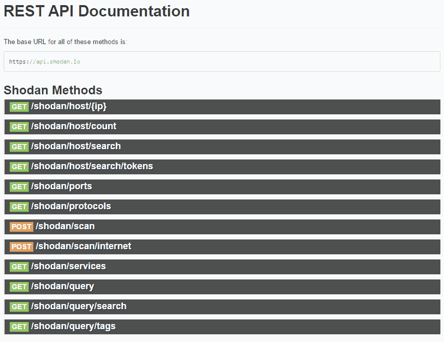

例如，如果我们想要执行搜索，我们可以使用`/shodan/host/`端点搜索。为了正确地发出请求，需要指出我们注册时获得的`API_KEY`。

例如，对于这个请求，我们使用“apache”搜索获得搜索结果，该搜索返回 JSON 格式的响应：[https://api.shodan.io/shodan/host/search?key= <您的【api】密钥>&查询=apache](https://api.shodan.io/shodan/host/search?key=v4YpsPUJ3wjDxEqywwu6aF5OZKWj8kik&query=apache)。

您可以在官方文档中找到更多信息：

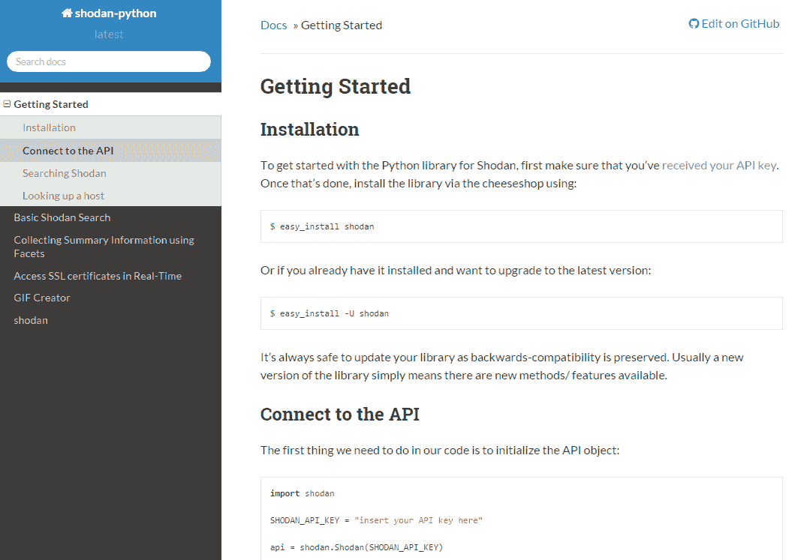

# 肖丹过滤器

Shodan 有一系列特殊的过滤器，允许我们优化搜索结果。在这些过滤器中，我们可以突出显示：

*   **在**之后/之前：按日期过滤结果
*   **国家**：按两位国家代码过滤结果
*   **城市**：按城市过滤结果
*   **geo**：按纬度/经度过滤结果
*   **主机名**：按主机或域名过滤结果
*   **网络**：按特定 IP 范围或网段过滤结果
*   **操作系统**：搜索特定的操作系统
*   **端口**：允许我们根据端口号进行过滤

You can find more information about shodan filters at [http://www.shodanhq.com/help/filters](http://www.shodanhq.com/help/filters).

# 用 python 进行 Shodan 搜索

通过 Python API 提供的`search`函数，您可以使用与 web 界面相同的方式进行搜索。如果我们从 Python 解释器执行以下示例，我们会看到如果我们查找“apache”字符串，就会得到 15684960 个结果。

在这里，我们可以从解释器中看到总的结果和`Shodan`模块的执行情况：

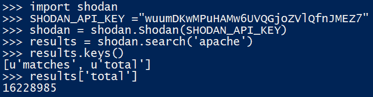

我们也可以创建我们自己的类（**ShodanSearch**），它有`__init__`方法从注册时获得的`API_KEY`初始化 Shodan 对象。我们还可以使用一种方法通过参数搜索搜索字符串，并调用 shodan API 的搜索方法。

您可以在 github 存储库中 shodan 文件夹的`ShodanSearch.py`文件中找到以下代码：

```py
#!/usr/bin/env python
# -*- coding: utf-8 -*-
import shodan
import re

class ShodanSearch:
    """ Class for search in Shodan """
    def __init__(self,API_KEY):
        self.api =  shodan.Shodan(API_KEY)    

    def search(self,search):
        """ Search from the search string"""
        try:
            result = self.api.search(str(search))
            return result
        except Exception as e:
            print 'Exception: %s' % e
            result = []
            return result
```

# 由给定主机执行搜索

在本例中，从 Python 解释器执行，我们可以看到使用`shodan.host()`方法，可以从某个 IP 获取信息，例如国家、城市、服务提供商、服务器或版本：

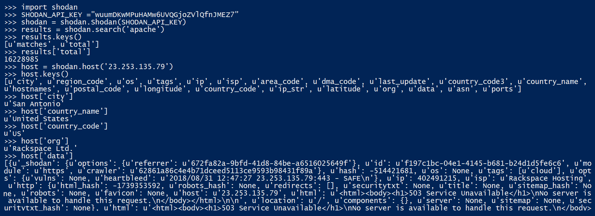

我们可以通过**数据阵列**来详细了解**ISP**、**位置、纬度、经度**的更多信息：


在前面定义的`ShodanSearch`类中，我们可以定义一个由主机的 IP 参数传递的方法，调用 shodan API 的`host ()`方法：

```py
def get_host_info(self,IP):
""" Get the information that may have shodan on an IP""
    try:
        host = self.api.host(IP)
        return host
    except Exception as e:
        print 'Exception: %s' % e
        host = []
        return host
```

`ShodanSearch`脚本接受一个搜索字符串和主机的 IP 地址：


在此示例执行中，我们正在测试 IP 地址 22.253.135.79，以从此服务器获取所有公共信息：

**`python .\ShodanSearch.py -h 23.253.135.79`**


# 搜索 FTP 服务器

您可以搜索具有匿名用户 FTP 访问权限且无需用户名和密码即可访问的服务器。

如果我们使用“**端口：21 匿名用户登录**字符串进行搜索，我们将获得这些易受攻击的 FTP 服务器：


此脚本允许您获取允许匿名 FTP 访问的服务器中的 IP 地址列表。

您可以在**`ShodanSearch_FTP_Vulnerable.py`文件中找到以下代码：**

 **```py
import shodan
import re
sites =[]
shodanKeyString = 'v4YpsPUJ3wjDxEqywwu6aF5OZKWj8kik'
shodanApi = shodan.Shodan(shodanKeyString)
results = shodanApi.search("port: 21 Anonymous user logged in")
print "hosts number: " + str(len( results['matches']))
for match in results['matches']:
    if match['ip_str'] is not None:
        print match['ip_str']
        sites.append(match['ip_str'])
```

通过执行前面的脚本，我们获得了一个 IP 地址列表，其中的服务器容易在 ftp 服务中匿名登录：

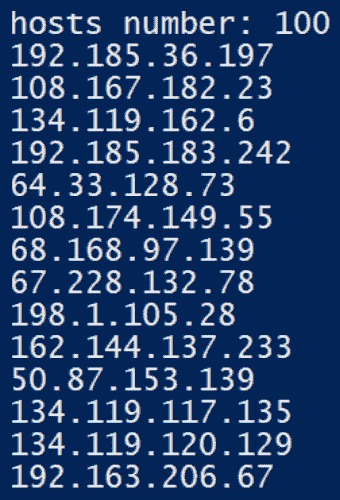

# 使用 python 获取服务器信息

在本节中，您将学习使用 socket 和`python-whois`模块从服务器获取横幅和 whois 信息的基础知识。

# 用 python 提取服务器横幅

横幅显示与 web 服务器名称和服务器上运行的版本相关的信息。有些公开了使用的后端技术（PHP、Java、Python）及其版本。生产版本可能会出现公共或非公共故障，因此测试返回我们已公开的服务器的横幅始终是一种良好的做法，以查看它们是否公开了我们不想公开的某些类型的信息。

使用标准 Python 库，可以创建一个简单的程序，该程序连接到服务器并捕获请求响应中包含的服务的标题。获取服务器横幅的最简单方法是使用`socket`模块**。**我们可以通过`recvfrom()`方法发送 get 请求并获取响应，该方法将返回一个带有结果的元组。

您可以在`BannerServer.py`文件中找到以下代码：

```py
import socket
import argparse
import re
parser = argparse.ArgumentParser(description='Get banner server')
# Main arguments
parser.add_argument("-target", dest="target", help="target IP", required=True)
parser.add_argument("-port", dest="port", help="port", type=int, required=True)
parsed_args = parser.parse_args()
sock = socket.socket(socket.AF_INET, socket.SOCK_STREAM)
sock.connect((parsed_args.target, parsed_args.port))
sock.settimeout(2)
http_get = b"GET / HTTP/1.1\nHost: "+parsed_args.target+"\n\n"
data = ''
try:
    sock.sendall(http_get)
    data = sock.recvfrom(1024)
    data = data[0]
    print data
    headers = data.splitlines()
    #  use regular expressions to look for server header
    for header in headers:
        if re.search('Server:', header):
            print(header)
except socket.error:
    print ("Socket error", socket.errno)
finally:
    sock.close()
```

上一个脚本接受**目标**和**端口**作为**参数**：


在本例中，我们在端口 80 上获得 web 服务器版本：

`**python .\BannerServer.py -target www.google.com -port 80**`


# 查找有关服务器的 whois 信息

我们可以使用 WHOIS 协议来查看谁是域名的注册所有者。这个协议有一个名为 python whois 的`Python`模块，记录在[中 https://pypi.python.org/pypi/python-whois](https://pypi.python.org/pypi/python-whois) ，可使用`pip install python-whois`命令通过 pip 安装。

例如，如果我们想查询服务器的名称和某个域的所有者，我们可以通过`get_whois()`方法进行查询。此方法返回字典结构（`key-> value`：

```py
>>> import pythonwhois
>>> whois = pythonwhois.get_whois(domain)
>>> for key in whois.keys():
>>  print "%s : %s \n" %(key, whois[key])
```

通过`pythonwhois.net.get_root_server()`方法，可以恢复给定域的根服务器：

```py
>>> whois = pythonwhois.net.get_root_server(domain)
```

通过`pythonwhois.net.get_whois_raw()`方法，可以检索给定域的所有信息：

```py
>>> whois = pythonwhois.net.get_whois_raw(domain)
```

在下面的脚本中，我们看到了一个完整的示例，其中我们将域作为参数传递，我们将从中提取信息。

您可以在**`PythonWhoisExample.py`文件中找到以下代码：**

 **```py
if len(sys.argv) != 2:
    print “[-] usage python PythonWhoisExample.py <domain_name>”
    sys.exit()
print sys.argv[1]
whois = pythonwhois.get_whois(sys.argv[1])
for key in whois.keys():
    print “[+] %s : %s \n” %(key, whois[key])
whois = pythonwhois.net.get_root_server(sys.argv[1])
print whois
whois = pythonwhois.net.get_whois_raw(sys.argv[1])
print whois
```

# 使用 DNSPython 获取有关 dns 服务器的信息

在本节中，我们将用 Python 创建一个 DNS 客户机，并了解该客户机将如何获取有关名称服务器、邮件服务器和 IPV4/IPV6 地址的信息。

# DNS 协议

DNS 代表域名服务器，用于将 IP 地址与域名链接的域名服务。DNS 是主机名和 IP 地址之间映射的全局分布式数据库。它是一个开放的分层系统，许多组织选择运行自己的 DNS 服务器。

DNS 协议用于不同的目的。最常见的是：

*   **名称解析：**给定主机的完整名称，可以获取其 IP 地址。
*   **反向地址解析：**是上一个的反向机制。它可以在给定 IP 地址的情况下获取与其关联的名称。
*   **邮件服务器解析：**给定一个邮件服务器域名（如 gmail.com），可以获取进行通信的服务器（如.l.google.com 中的 gmail smtp）。

DNS 也是一种协议，设备用来查询 DNS 服务器，以便将主机名解析为 IP 地址（反之亦然）。`nslookup`工具随大多数 Linux 和 Windows 系统提供，它允许我们在命令行上查询 DNS。这里，我们确定 python.org 主机具有 IPv4 地址`23.253.135.79`：

`$ nslookup python.org`

这是 python.org 域的地址解析：


# DNS 服务器

与长序列的数字相比，人类更善于记住与物体相关的名称。记住 google.com 域名比记住 IP 要容易得多。此外，IP 地址可以随着网络基础设施的移动而改变，而域名保持不变。

它的运作基于使用分布式分层数据库，其中存储域名和 IP 地址，以及提供邮件服务器定位服务的能力。

DNS 服务器位于应用层，通常使用端口 53（UDP）。当客户端发送 DNS 数据包以执行某种类型的查询时，必须发送要查询的记录类型。一些最常用的记录包括：

*   **A:**允许您查询 IPv4 地址
*   **AAAA:**允许您查询 IPv6 地址
*   **MX:**允许您咨询邮件服务器
*   **NS:**允许您查询服务器名称（名称服务器）
*   **TXT:**允许您以文本格式查阅信息

# DNSPython 模块

DnsPython 是一个用 Python 编写的开源库，它允许操作根据 DNS 服务器查询记录。它允许访问高电平和低电平。高级允许查询 DNS 记录，低级允许直接操作区域、名称和寄存器。

PyPI 提供了一些 DNS 客户端库。我们将重点关注`dnspython`图书馆，该图书馆位于[http://www.dnspython.org](http://www.dnspython.org) 。

可以使用 python 存储库或下载 github 源代码（[完成安装 https://github.com/rthalley/dnspython](https://github.com/rthalley/dnspython) 并运行`setup.py`安装文件。

您可以使用`easy_install`命令或`pip`命令安装此库：

```py
$ pip install dnspython
```

本模块的主要软件包包括：

```py
import dns
import dns.resolver
```

我们可以从特定领域获得的信息包括：

*   **邮件服务器记录**：ansMX=dns.resolver.query（'domain'，'MX'）
*   **名称服务器记录**：ansNS=dns.resolver.query（'domain'，'NS'）
*   **IPV4 地址记录**：ANSPV4=dns.resolver.query（'domain'，'A'）
*   **IPV6 地址记录**：ansipv6=dns.resolver.query（'domain'，'AAAA'）

在本例中，我们对具有`dns.resolver`子模块的主机的 IP 地址进行简单查询：

```py
import dns.resolver
answers = dns.resolver.query('python.org', 'A')
for rdata in answers:
    print('IP', rdata.to_text())
```

我们可以通过`is_subdomain()`方法检查一个域是否是另一个域的**子域**：

```py
domain1= dns.name.from_text('domain1')
domain2= dns.name.from_text('domain2')
domain1.is_subdomain(domain2)
```

从 IP 地址获取域名：

```py
import dns.reversename
domain = dns.reversename.from_address("ip_address")
```

从域名获取 IP：

```py
import dns.reversename
ip = dns.reversename.to_address("domain")
```

如果要进行**反向查找**，需要使用`dns.reversename`子模块，如下例所示：

您可以在**`DNSPython-reverse-lookup.py`文件中找到以下代码：**

 **```py
import dns.reversename

name = dns.reversename.from_address("ip_address")
print name
print dns.reversename.to_address(name)
```

在这个完整的示例中，我们将要从中提取信息的域作为参数传递。

您可以在`DNSPythonServer_info.py`文件中找到以下代码：

```py
import dns
import dns.resolver
import dns.query
import dns.zone
import dns.name
import dns.reversename
import sys

if len(sys.argv) != 2:
    print "[-] usage python DNSPythonExample.py <domain_name>"
    sys.exit()

domain = sys.argv[1]
ansIPV4,ansMX,ansNS,ansIPV6=(dns.resolver.query(domain,'A'), dns.resolver.query(domain,'MX'),
dns.resolver.query(domain, 'NS'),
dns.resolver.query(domain, 'AAAA'))

print('Name Servers: %s' % ansNS.response.to_text())
print('Name Servers: %s' %[x.to_text() for x in ansNS])
print('Ipv4 addresses: %s' %[x.to_text() for x in ansIPV4])
print('Ipv4 addresses: %s' % ansIPV4.response.to_text())
print('Ipv6 addresses: %s' %[x.to_text() for x in ansIPV6])
print('Ipv6 addresses: %s' % ansIPV6.response.to_text())
print('Mail Servers: %s' % ansMX.response.to_text())
for data in ansMX:
    print('Mailserver', data.exchange.to_text(), 'has preference', data.preference)
```

例如，如果我们尝试从 python.org 域获取信息，我们会得到以下结果。

使用前面的脚本，我们可以从 python.org 域获取名称服务器：


在这个屏幕截图中，我们可以看到 python.org 上的**IPV4 和 IPV6 地址**解析：

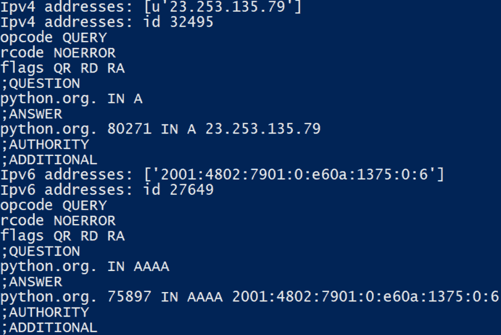

在此屏幕截图中，我们可以看到来自`python.org`的**邮件服务器**分辨率：

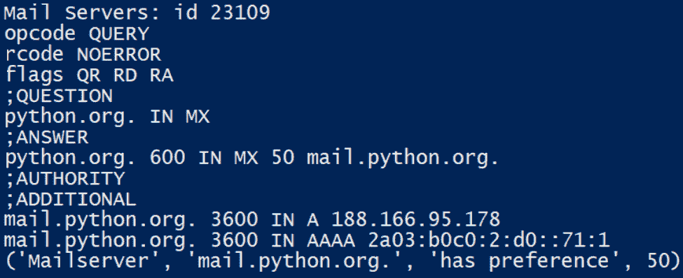

# 在服务器中使用模糊获取易受攻击的地址

在本节中，我们将了解模糊化过程，以及如何在 python 项目中使用这种做法来获取易受攻击者攻击的 URL 和地址。

# 模糊化过程

fuzzer 是一个程序，其中我们有一个包含 URL 的文件，该 URL 对于特定的应用或服务器是可预测的。基本上，我们对每个可预测的 URL 进行请求，如果我们看到响应正常，这意味着我们找到了一个非公开或隐藏的 URL，但后来我们看到我们可以访问它。

与大多数可利用的情况一样，模糊化过程仅对不正确地清理输入或接收的数据超过其处理能力的系统有用。

一般而言，模糊化过程包括以下**阶段**：

*   **识别目标**：要模糊应用，我们必须识别目标应用。
*   **识别输入**：该漏洞的存在是因为目标应用接受格式错误的输入并在未进行清理的情况下对其进行处理。
*   **创建模糊数据**：获取所有输入参数后，我们必须创建无效的输入数据发送到目标应用。
*   **模糊化**：在创建模糊数据后，我们必须将其发送到目标应用。我们可以在调用服务时使用模糊数据来监视异常。
*   **确定可利用性**：模糊化后，我们必须检查导致崩溃的输入。

# FuzzDB 项目

FuzzDB 是一个项目，我们在其中找到一组文件夹，其中包含在多个 pentesting 测试中收集的已知攻击模式，主要在 web 环境中：[https://github.com/fuzzdb-project/fuzzdb](https://github.com/fuzzdb-project/fuzzdb) 。

FuzzDB 类别分为不同的目录，其中包含可预测的资源位置模式、用于检测具有恶意有效负载或易受攻击路由的漏洞的模式：

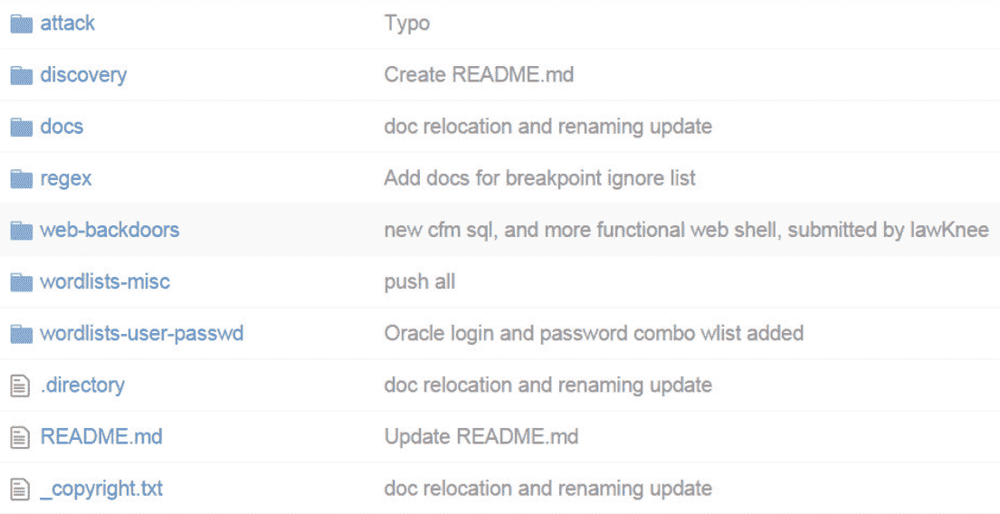

# 使用 pywebfuzz 使用 python 进行模糊化

pywebfuzz 是一个 Python 模块，用于通过蛮力方法帮助识别 web 应用中的漏洞，并为测试服务器和 web 应用（如 apache 服务器、jboss 和数据库）中的漏洞提供资源。

该项目的目标之一是促进 web 应用的测试。pywebfuzz 项目提供值和逻辑，用于针对 web 应用测试用户、密码和代码。

在 Python 中，我们找到了`pywebfuzz`模块，其中我们有一组允许访问 FuzzDB 目录并使用其有效负载的类。PyWebFuzz 中创建的类的结构由不同的攻击方案组织；这些方案表示 FuzzDB 中可用的不同有效负载。

它有一个类结构，负责读取 FuzzDB 中可用的文件，以便稍后在脚本中使用 Python 中的文件。

首先，我们需要导入`fuzzdb`模块：

```py
from pywebfuzz import fuzzdb
```

例如，如果我们想在服务器上搜索登录页面，我们可以使用`fuzzdb.Discovery.PredictableRes.Logins`模块：

```py
logins = fuzzdb.Discovery.PredictableRes.Logins
```

这将返回一个可预测资源的列表，其中每个元素对应一个 URL，如果该 URL 存在于 web 服务器中，则可能会受到攻击：

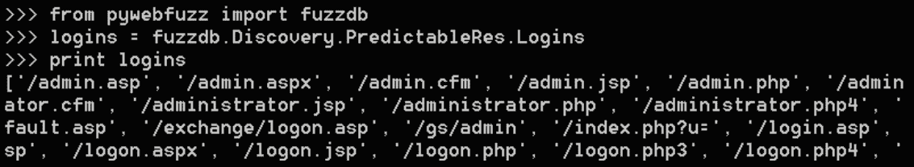

我们可以用 Python 编写一个脚本，在这个脚本中，给定一个我们正在分析的 URL，我们可以测试到每个登录路由的连接，如果请求返回一个代码`200`，那么这些页面已经在服务器中找到了。

在这个脚本中，我们可以获得可预测的 URL，例如登录、管理员、管理员和默认页面，对于每个组合域+可预测 URL，我们验证返回的状态代码。

您可以在`pywebfuzz_folder`内的`demofuzzdb.py`文件**中找到以下代码：**

 **```py
from pywebfuzz import fuzzdb
import requests

logins = fuzzdb.Discovery.PredictableRes.Logins
domain = "http://testphp.vulnweb.com"
  for login in logins:
 print("Testing... "+ domain + login)
 response = requests.get(domain + login)
 if response.status_code == 200:
 print("Login Resource detected: " +login)
```

您还可以获取服务器支持的 HTTP 方法：

```py
httpMethods= fuzzdb.attack_payloads.http_protocol.http_protocol_methods
```

python 解释器的上一个命令的输出显示了可用的 HTTP 方法：

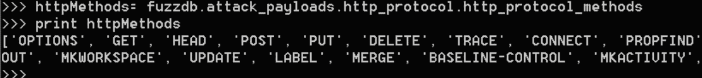

您可以在`pywebfuzz_folder`内的`demofuzzdb2.py`**文件中找到以下代码：**

 **```py
from pywebfuzz import fuzzdb
import requests
httpMethods= fuzzdb.attack_payloads.http_protocol.http_protocol_methods
domain = "http://www.google.com" for method in httpMethods:
    print("Testing... "+ domain +"/"+ method)
    response = requests.get(domain, method)
    if response.status_code not in range(400,599):
        print(" Method Allowed: " + method)
```

有一个模块允许您在 Apache tomcat 服务器上搜索可预测的资源：

```py
tomcat = fuzzdb.Discovery. PredictableRes.ApacheTomcat
```

此子模块允许您获取字符串以检测 SQL 注入漏洞：

```py
fuzzdb.attack_payloads.sql_injection.detect.GenericBlind
```

在这个屏幕截图中，我们可以看到`fuzzdb sql_injection`模块的执行情况：


The information returned in this case matches that found in the GitHub repository of the project. [https://github.com/fuzzdb-project/fuzzdb/tree/master/attack/sql-injection/detect](https://github.com/fuzzdb-project/fuzzdb/tree/master/attack/sql-injection/detect) contains many files for detecting situations of SQL injection, for example, we can find the **GenericBlind.txt** file, which contains the same strings that the module returns from Python.

在 GitHub 存储库中，我们看到一些文件，具体取决于 SQL 攻击和我们正在测试的数据库类型：


我们还可以在 MySQL 数据库中找到其他用于测试 SQL 注入的文件：[https://github.com/fuzzdb-project/fuzzdb/blob/master/attack/sql-injection/detect/MySQL.txt](https://github.com/fuzzdb-project/fuzzdb/blob/master/attack/sql-injection/detect/MySQL.txt) 。

在`Mysql.txt`文件中，我们可以看到所有可用的攻击向量，以发现 SQL 注入漏洞：

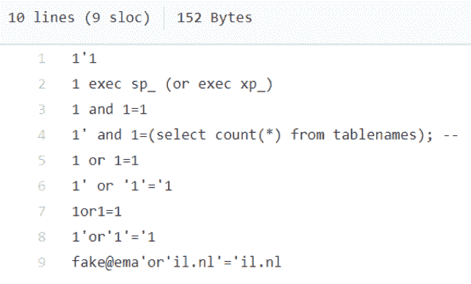

我们可以使用前面的文件检测特定站点中的 SQL 注入漏洞：testphp.vulnweb.com。

您可以在 pywebfuzz_ 文件夹内的`demofuzz_sql.py`文件中找到以下代码：

```py
from pywebfuzz import fuzzdb
import requests

mysql_attacks= fuzzdb.attack_payloads.sql_injection.detect.MySQL

domain = "http://testphp.vulnweb.com/listproducts.php?cat="

for attack in mysql_attacks:
    print "Testing... "+ domain + attack
    response = requests.get(domain + attack)
    if "mysql" in response.text.lower(): 
        print("Injectable MySQL detected")
        print("Attack string: "+attack)
```

上一个脚本的执行显示了输出：

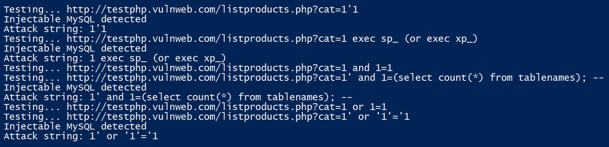

以下示例将创建一个 Python 列表，其中包含 fuzzdb for LDAP Injection 的所有值：

```py
from pywebfuzz import fuzzdb ldap_values=fuzzdb.attack_payloads.ldap.ldap_injection
```

现在，`ldap_values`变量将是一个 Python 字典，其中包含 fuzzdb 的`ldap_injection`文件中的值。然后，您可以使用测试在该变量的顶部进行迭代。

我们可以在 fuzzbd 项目中找到 ldap 文件夹：[https://github.com/fuzzdb-project/fuzzdb/tree/master/attack/ldap](https://github.com/fuzzdb-project/fuzzdb/tree/master/attack/ldap) 。

# 总结

本章的目标之一是了解允许我们提取服务器以公开方式公开的信息的模块。使用我们讨论过的工具，我们可以获得足够的信息，这些信息可能对我们测试或审计过程的后续阶段有用。

在下一章[中](07.html)，我们将探讨与 FTP、SSH 和 SNMP 服务器交互的 python 编程包。

# 问题

1.  我们需要什么来访问 Shodan 开发者 API
2.  在 ShodanAPI 中应该调用哪个方法来获取关于给定主机的信息，以及该方法返回什么数据结构？
3.  哪个模块可用于获取服务器的横幅？
4.  使用`DNSPython`模块获取 IPv6 地址记录需要调用哪种方法和传递哪些参数？
5.  使用`DNSPython`模块获取邮件服务器的记录需要调用哪种方法和传递哪些参数？
6.  使用`DNSPython`模块获取名称服务器的记录需要调用哪种方法和传递哪些参数？
7.  哪个项目包含包含已知攻击模式的文件和文件夹，这些模式是在 web 应用的各种 pentesting 测试中收集的？
8.  应该使用哪个模块查找服务器上可能存在漏洞的登录页面？
9.  哪个`FuzzDB`项目模块允许我们获取字符串来检测 SQL 注入型漏洞？
10.  DNS 服务器使用什么端口来解析邮件服务器名称请求？

# 进一步阅读

在这些链接中，您将找到有关上述工具的更多信息以及一些已注释模块的官方 python 文档：

[https://developer.shodan.io/api](https://developer.shodan.io/api)

[http://www.dnspython.org](http://www.dnspython.org)

您可以使用 python`dnslib`模块[创建自己的 DNS 服务器 https://pypi.org/project/dnslib/](https://pypi.org/project/dnslib/)

[https://github.com/fuzzdb-project/fuzzdb](https://github.com/fuzzdb-project/fuzzdb) 。

在 Python 生态系统中，我们可以找到其他 fuzzer，例如**wfuzz**。

Wfuzz 是一个 web 应用安全模糊工具，您可以从命令行使用它，也可以通过 Python 库以编程方式使用它：[https://github.com/xmendez/wfuzz](https://github.com/xmendez/wfuzz) 。

官方文件可在[查阅 http://wfuzz.readthedocs.io](http://wfuzz.readthedocs.io/) 。

使用`python Shodan`模块的项目示例：

*   [https://www.programcreek.com/python/example/107467/shodan.Shodan](https://www.programcreek.com/python/example/107467/shodan.Shodan)
*   [https://github.com/NullArray/Shogun](https://github.com/NullArray/Shogun)
*   [https://github.com/RussianOtter/networking/blob/master/8oScanner.py](https://github.com/RussianOtter/networking/blob/master/8oScanner.py)
*   [https://github.com/Va5c0/Shodan_cmd](https://github.com/Va5c0/Shodan_cmd)
*   [https://github.com/sjorsng/osint-combinerhttps://github.com/carnal0wnage/pentesty_scripts](https://github.com/sjorsng/osint-combinerhttps://github.com/carnal0wnage/pentesty_scripts)
*   [https://github.com/ffmancera/pentesting-multitool](https://github.com/ffmancera/pentesting-multitool)
*   [https://github.com/ninj4c0d3r/ShodanCli](https://github.com/ninj4c0d3r/ShodanCli)

如果我们感兴趣的是在不使用 bruteforce 过程的情况下查找 web 目录，我们可以使用这个名为`dirhunt`的工具，它基本上是一个 web 爬虫，用于搜索和分析网站中的目录。

[https://github.com/Nekmo/dirhunt](https://github.com/Nekmo/dirhunt)

您可以使用`**pip install dirhunt**`命令进行安装

此工具支持 Python 版本 2.7 和 3.x，但建议使用 Python 3.x**********