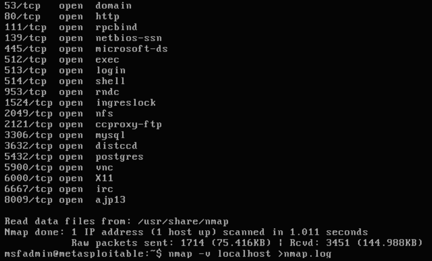
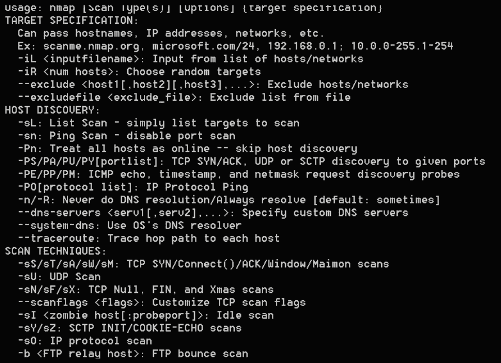
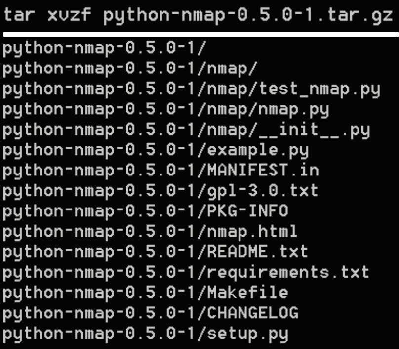
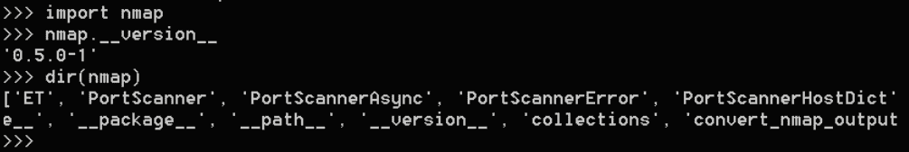
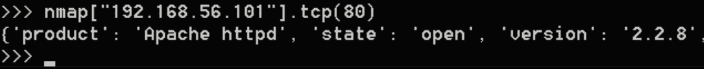
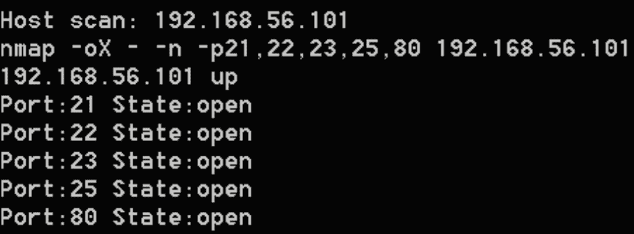
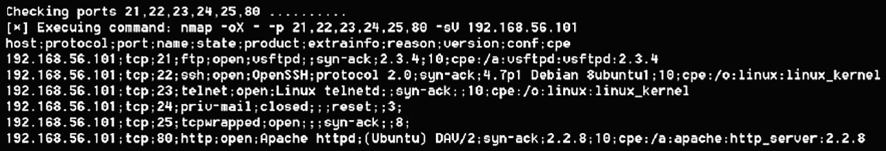
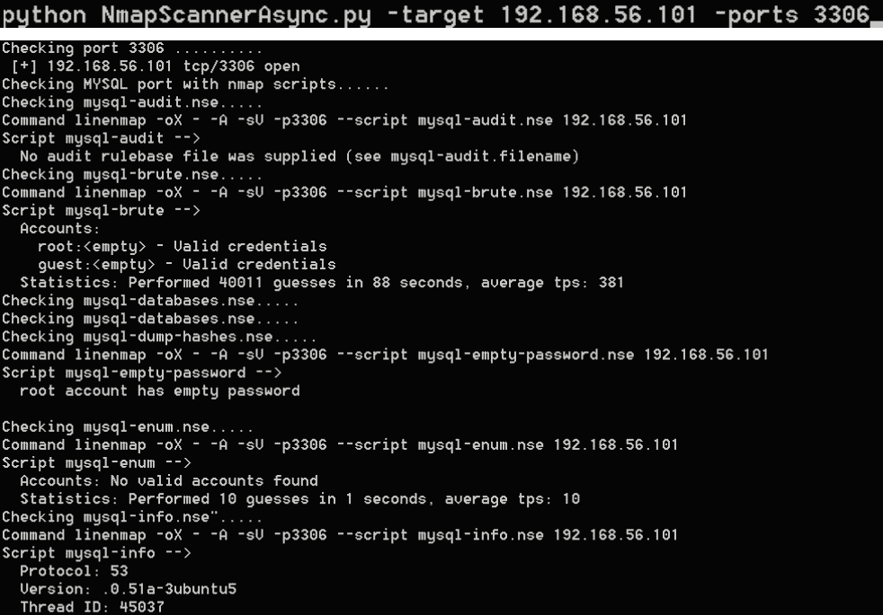

# 使用 Nmap 扫描仪

本章介绍如何使用 python nmap 进行网络扫描，以收集有关网络、主机和主机上运行的服务的信息。我们可以在 Python 中找到一些允许端口扫描和自动检测服务和开放端口的工具，其中我们可以突出显示 Python nmap。Nmap 是一个功能强大的端口扫描程序，允许您识别打开、关闭或过滤的端口。它还允许对例程和脚本进行编程，以发现给定主机中可能存在的漏洞。

本章将介绍以下主题：

*   学习并理解 Nmap 协议作为端口扫描程序，以识别主机上运行的服务
*   学习和理解`python-nmap`模块，该模块在较低级别上使用 Nmap，是优化端口扫描相关任务的非常有用的工具
*   使用`python-nmap module`学习和理解同步和异步扫描
*   学习和理解 Nmap 脚本以检测网络或特定主机中的漏洞

# 技术要求

本章的示例和源代码可在 GitHub 存储库的`chapter8`文件夹中找到：

[https://github.com/PacktPublishing/Mastering-Python-for-Networking-and-Security](https://github.com/PacktPublishing/Mastering-Python-for-Networking-and-Security) 。

您需要在本地计算机上安装一个 Python 发行版，该发行版至少有 4 GB 内存。在本章中，我们将使用一个**虚拟机**，通过该虚拟机将执行一些与端口分析和漏洞检测相关的测试。可从`sourceforge`页面下载：
[https://sourceforge.net/projects/metasploitable/files/Metasploitable2](https://sourceforge.net/projects/metasploitable/files/Metasploitable2)

要登录，您必须使用用户名`msfadmin`和密码`msfadmin`：


如果我们执行`ifconfig`命令，我们可以看到网络的配置和我们可以用来执行测试的 IP 地址。在这种情况下，我们本地网络的 IP 地址为**192.168.56.101**：


如果我们使用`nmap`命令执行端口扫描，我们可以看到虚拟机中打开的端口：



基本上，Metasploitable 虚拟机（vm）是一个易受攻击的 Ubuntu Linux 版本，用于测试安全工具和演示常见漏洞

You can find more information about this virtual machine in the following guide: [https://metasploit.help.rapid7.com/docs/metasploitable-2-exploitability-guide.](https://metasploit.help.rapid7.com/docs/metasploitable-2-exploitability-guide)

# 引入 Nmap 端口扫描

在本节中，我们将回顾用于端口扫描的 Nmap 工具及其支持的主要扫描类型。我们将了解作为端口扫描程序的 Nmap，它允许我们分析机器上运行的端口和服务。

# 端口扫描简介

一旦我确定了网络中的端点，下一步就是执行端口扫描。支持通信协议的计算机利用端口进行连接。为了支持与多个应用程序的不同对话，端口用于区分同一台机器或服务器中的各种通信。例如，web 服务器可以使用**超文本传输协议**（**HTTP**）来提供对默认使用 TCP 端口号`80`的网页的访问。**简单邮件传输协议**或**SMTP**使用端口`25`发送或传输邮件消息。对于每个唯一的 IP 地址，协议端口号由 16 位数字标识，通常称为端口号`0-65,535`。端口号和 IP 地址的组合为通信提供了完整的地址。根据通信方向，需要源地址和目标地址（IP 地址和端口组合）。

# 使用 Nmap 扫描类型

**网络映射器**（**Nmap**是一款免费的开源工具，用于网络发现和安全审计。它运行在所有主要的计算机操作系统上，Linux、Windows 和 Mac OS X 都有官方二进制软件包。python nmap 库有助于以编程方式操作 nmap 的扫描结果，以自动化端口扫描任务。

Nmap 工具主要用于识别和扫描某个网段中的端口。从站点，[https://nmap.org](https://nmap.org) ，我们可以下载可用的最新版本，具体取决于我们要安装它的操作系统。

如果从控制台运行 Nmap 工具，我们会得到以下结果：



我们可以看到我们有以下**类型的扫描**：

**sT（TCP 连接扫描）：**这是通常用于检测端口是否打开或关闭的选项，但它通常也是最受审核的机制，也是入侵检测系统监控最多的机制。使用此选项，如果服务器在发送带有 SYN 标志的数据包时使用包含 ACK 标志的数据包进行响应，则端口将打开。

**sS（TCP 隐形扫描）：**这是一种基于 TCP 连接扫描的扫描，不同之处在于所示端口上的连接未完全完成。它包括在检查启用 SYN 标志的数据包之前检查目标的响应数据包。如果目标使用带有 RST 标志的数据包进行响应，则可以检查端口是否打开或关闭。

**u（UDP 扫描）：**这是一种基于 UDP 协议的扫描，不执行连接过程，只发送 UDP 数据包以确定端口是否打开。如果答案是另一个 UDP 数据包，则表示端口已打开。如果应答返回，则端口未打开，将接收类型为 3（目的地不可到达）的**互联网控制消息协议**（**ICMP**）数据包。

**sA（TCP 确认扫描）：**这种扫描让我们知道目标机器是否运行了任何类型的防火墙。此扫描所做的是向目标机器发送一个激活了 ACK 标志的数据包。如果远程计算机响应的数据包已激活 RST 标志，则可以确定端口未被任何防火墙过滤。在返回的事件中，如果远程设备没有响应，或者使用该类型的 ICMP 数据包进行响应，则可以确定有防火墙过滤发送到指定端口的数据包。

**sN（TCP 空扫描）：**这是一种扫描类型，将 TCP 数据包发送到目标机器，而不带任何标志。如果远程计算机未发出响应，则可以确定端口已打开。否则，如果远程机器返回 RST 标志，我们可以说端口已关闭。

**sF（TCP FIN 扫描）：**这是一种扫描类型，使用 FIN 标志向目标机器发送 TCP 数据包。如果远程计算机未发出响应，则可以确定端口已打开。如果远程机器返回 RST 标志，我们可以说端口已关闭。

**sX（TCP XMAS 扫描）：**这是一种扫描类型，向目标机器发送带有标志 PSH、FIN 或 URG 的 TCP 数据包。如果远程计算机未发出响应，则可以确定端口已打开。如果远程机器返回 RST 标志，我们可以说端口已关闭。如果在响应包中，我们获得一个 ICMP 类型 3 响应，则该端口将被过滤。

默认扫描的类型可能因运行它的用户而异，因为在扫描期间允许发送数据包的权限不同。扫描类型之间的区别在于每种扫描类型产生的“噪音”，以及它避免被安全系统（如防火墙或入侵检测系统）检测到的能力。

如果我们想创建一个端口扫描器，我们必须为每个在端口中打开连接的套接字创建一个线程，并通过红绿灯管理屏幕的共享使用。使用这种方法，我们将有很长的代码，此外，我们将只执行简单的 TCP 扫描，而不执行 Nmap 工具包提供的 ACK、SYN-ACK、RST 或 FIN。

因为 Nmap 响应格式是 XML，所以用 Python 编写一个模块来解析此响应格式并不困难，它提供了与 Nmap 的完全集成，并且能够运行更多类型的扫描。通过这种方式，`python-nmap`模块成为执行这些类型任务的主要模块。

# 使用 pythonnmap 进行端口扫描

在本节中，我们将回顾 Python 中用于端口扫描的`python-nmap`模块。我们将了解`python-nmap`模块如何使用 Nmap，以及它如何成为优化特定目标（域、网络或 IP 地址）中发现服务相关任务的非常有用的工具。

# python nmap 简介

在 Python 中，我们可以通过 Python Nmap 库使用 Nmap，它允许我们轻松地操作扫描结果。此外，当涉及到自动化渗透测试过程时，它可以成为系统管理员或计算机安全顾问的完美工具。

PythonNMAP 是一种在安全审计或入侵测试范围内使用的工具，其主要功能是发现特定主机为侦听而打开的端口或服务。此外，它还具有与 2.x 版和 3.x 版兼容的优点。

您可以从 Bitbucket 存储库获取 python nmap 的源代码：

[https://bitbucket.org/xael/python-nmap](https://bitbucket.org/xael/python-nmap)

可从以下网站下载 python nmap 的最新版本：

[http://xael.org/pages/python-nmap-en.html](http://xael.org/pages/python-nmap-en.html)

[https://xael.org/norman/python/python-nmap](https://xael.org/norman/python/python-nmap/)

# 安装 python nmap

要继续安装，请解压缩下载的包，跳转到新目录，然后执行安装命令。

在本例中，我们正在从源程序包安装 0.5 版：



也可以使用`pip install`工具安装模块，因为它位于官方存储库中。要安装模块，需要使用管理员权限执行命令或使用系统超级用户（`sudo`：

```py
sudo apt-get install python-pip nmap
sudo pip install python-nmap
```

# 使用 python nmap

现在，您可以导入 python nmap 模块，我们可以从脚本或交互终端调用该模块，例如：



验证模块安装后，我们可以开始在特定主机上执行扫描。为此，我们必须对`PortScanner()`类进行实例化，以便访问最重要的方法：`scan()`。了解函数、方法或对象如何工作的最佳实践是使用`**help()**`或`dir()`函数找出模块中可用的方法：


如果我们执行一个`help (port_scan.scan)`命令，我们会看到`PortScanner`类的`scan`方法接收三个参数，主机、端口和参数，并在最后添加参数（所有参数都必须是字符串）。

通过`help`命令，我们可以看到以下信息：


我们要做的第一件事是导入 Nmap 库并创建我们的对象以开始与`PortScanner()`交互。

我们使用`scan ('ip', 'ports')`方法启动第一次扫描，其中第一个参数是 IP 地址，第二个是端口列表，第三个参数是可选的。如果未定义，请执行标准 Nmap 扫描：

```py
import nmap
nm = nmap.PortScanner()
results = nm.scan('192.168.56.101', '1-80','-sV')
```

在本例中，在 IP 地址为`192.168.56.101`的虚拟机上对`1-80`范围内的端口执行扫描。通过`**argument -sV**`，我们告诉您在调用扫描时检测版本。

扫描的结果是一个字典，其中包含与直接返回使用 Nmap 进行的扫描相同的信息。我们还可以返回使用`PortScanner()`类实例化的对象，并测试其方法。我们可以通过`command_line()`方法在下面的屏幕截图中看到已执行的`nmap`命令。

要获取有关在某个端口上运行的服务器的更多信息，我们可以使用`tcp()`方法。

在本例中，我们可以看到如何使用`tcp`方法获取特定端口的信息：



我们还可以通过返回上一屏幕截图中显示的状态属性的`state()`函数查看主机是否启动：

```py
nmap['192.168.56.101'].state()
```

我们还有扫描所有主机的`all_hosts()`方法，可以看到哪些主机启动了，哪些没有：

```py
for host in nmap.all_hosts():
    print('Host : %s (%s)' % (host, nmap[host].hostname()))
    print('State : %s' % nmap[host].state())
```

我们还可以看到在扫描过程中给出某种类型响应的服务，以及使用的`scanning`方法：

```py
nm.scaninfo()
```

我们还扫描所有协议：

```py
for proto in nmap[host].all_protocols():
    print('Protocol : %s' % proto)
listport = nmap[host]['tcp'].keys()
listport.sort()
for port in listport:
    print('port : %s\tstate : %s' % (port,nmap[host][proto][port]['state']))
```

下面的脚本尝试使用 PythonNMAP 以参数的形式执行扫描，条件如下。

*   要扫描的端口：`21,22,23,80,8080`。
*   -n 不执行 DNS 解析的选项。
*   获得扫描数据后，将其保存在`scan.txt`文件中。

您可以在文件名中找到以下代码：`Nmap_port_scanner.py`：

```py
#!/usr/bin/python

#import nmap module
import nmap

#initialize portScanner                       
nm = nmap.PortScanner()

# we ask the user for the host that we are going to scan
host_scan = raw_input('Host scan: ')
while host_scan == "":
    host_scan = raw_input('Host scan: ')

#execute scan in portlist
portlist="21,22,23,25,80,8080"
nm.scan(hosts=host_scan, arguments='-n -p'+portlist)

#show nmap command
print nm.command_line()

hosts_list = [(x, nm[x]['status']['state']) for x in nm.all_hosts()]
#write in scan.txt file
file = open('scan.txt', 'w')
for host, status in hosts_list:
    print host, status
    file.write(host+'\n')

#show state for each port
array_portlist=portlist.split(',')
for port in array_portlist:
state= nm[host_scan]['tcp'][int(port)]['state']
    print "Port:"+str(port)+" "+"State:"+state
    file.write("Port:"+str(port)+" "+"State:"+state+'\n')

#close file
file.close()
```

`Nmap_port_scanner.py`执行：

在此屏幕截图中，我们可以看到在 Metasploitable vm 中以参数形式传递的端口状态，该 vm 具有指定的 IP 地址：



# 使用 python nmap 扫描模式

在本节中，我们将回顾`python-nmap`模块中支持的扫描模式。`python-nmap`允许以两种模式自动执行端口扫描任务和报告：同步和异步。在异步模式下，我们可以定义一个`callback`函数，该函数将在特定端口中完成扫描时执行，在该函数中，我们可以在端口打开时进行其他处理，例如为特定服务（HTTP、FTP、MySQL）启动 Nmap 脚本。

# 同步扫描

在本例中，我们实现了一个类，该类允许我们扫描作为参数传递给脚本的 IP 地址和端口列表。

在主程序中，我们添加了必要的配置来处理输入参数。我们执行一个循环来处理参数发送的每个端口，并调用`NmapScanner`类的`nmapScan (ip, port)`方法。

您可以在文件名中找到以下代码：`NmapScanner.py`：

```py
import optparse, nmap

class NmapScanner:

    def __init__(self):
        self.nmsc = nmap.PortScanner()

    def nmapScan(self, host, port):
        self.nmsc.scan(host, port)
        self.state = self.nmsc[host]['tcp'][int(port)]['state']
        print " [+] "+ host + " tcp/" + port + " " + self.state

def main():
    parser = optparse.OptionParser("usage%prog " + "-H <target host> -p <target port>")
    parser.add_option('-H', dest = 'host', type = 'string', help = 'Please, specify the target host.')
    parser.add_option('-p', dest = 'ports', type = 'string', help = 'Please, specify the target port(s) separated by comma.')
    (options, args) = parser.parse_args()

    if (options.host == None) | (options.ports == None):
        print '[-] You must specify a target host and a target port(s).'
        exit(0)
    host = options.host
    ports = options.ports.split(',')

    for port in ports:
        NmapScanner().nmapScan(host, port)

if __name__ == "__main__":
    main()
```

我们可以在命令行中执行上一个脚本来显示选项：

```py
python NmapScanner.py -h
```

通过`-h`参数，我们可以看到脚本选项：


如果我们使用前面的参数执行脚本，这就是输出：


除了执行端口扫描并通过控制台返回结果外，我们还可以生成一个 JSON 文档来存储结果，并为给定主机打开端口。在这种情况下，我们使用`csv()`函数以简单的格式返回扫描结果，以收集我们需要的信息。在脚本的末尾，我们看到如何调用已定义的方法，通过参数传递 IP 和端口列表。

您可以在文件名中找到以下代码：**`NmapScannerJSONGenerate.py`：**

 **```py
def nmapScanJSONGenerate(self, host, ports):
    try:
        print "Checking ports "+ str(ports) +" .........."
        self.nmsc.scan(host, ports)

        # Command info
        print "[*] Execuing command: %s" % self.nmsc.command_line()

        print self.nmsc.csv()
        results = {} 

        for x in self.nmsc.csv().split("\n")[1:-1]:
            splited_line = x.split(";")
            host = splited_line[0]
            proto = splited_line[1]
            port = splited_line[2]
            state = splited_line[4]

            try:
                if state == "open":
                    results[host].append({proto: port})
            except KeyError:
                results[host] = []
                results[host].append({proto: port})

        # Store info
        file_info = "scan_%s.json" % host
        with open(file_info, "w") as file_json:
            json.dump(results, file_json)

         print "[*] File '%s' was generated with scan results" % file_info 

 except Exception,e:
     print e
 print "Error to connect with " + host + " for port scanning" 
     pass
```

在这个截图中，我们可以看到`NmapScannerJSONGenerate`脚本执行的输出：



# 异步扫描

我们可以使用`PortScannerAsync()`类执行异步扫描。在这种情况下，在执行扫描时，我们可以指示一个额外的回调参数，在该参数中我们定义了`return`函数，该函数将在扫描结束时执行：

```py
import nmap

nmasync = nmap.PortScannerAsync()

def callback_result(host, scan_result):
    print host, scan_result

nmasync.scan(hosts='127.0.0.1', arguments='-sP', callback=callback_result)
while nmasync.still_scanning():
    print("Waiting >>>")
    nmasync.wait(2)
```

通过这种方式，我们可以定义一个`callback`函数，该函数在 Nmap 对我们正在分析的机器有结果时执行。

下面的脚本允许我们使用 Nmap 异步执行扫描，以便输入参数请求目标和端口。该脚本所要做的是异步执行`MySQL port (3306)`中的扫描，并执行 MySQL 服务可用的 Nmap 脚本。

为了测试它，我们可以在虚拟机**Metasploitable2**上运行它，该虚拟机的端口`3306`是开放的，此外，我们还可以执行 Nmap 脚本并获取有关该虚拟机上运行的 MySQL 服务的附加信息。

您可以在文件名中找到以下代码：`NmapScannerAsync.py`：

```py
import optparse, nmap
import json
import argparse

def callbackMySql(host, result):
    try:
        script = result['scan'][host]['tcp'][3306]['script']
        print "Command line"+ result['nmap']['command_line']
        for key, value in script.items():
            print 'Script {0} --> {1}'.format(key, value)
    except KeyError:
        # Key is not present
        pass

class NmapScannerAsync:

 def __init__(self):
        self.nmsync = nmap.PortScanner()
        self.nmasync = nmap.PortScannerAsync()

    def scanning(self):
        while self.nmasync.still_scanning():
            self.nmasync.wait(5)
```

此方法检查作为参数传递的端口，并以异步方式启动与 MySQL 相关的 Nmap 脚本：

```py
def nmapScan(self, hostname, port):
        try:
            print "Checking port "+ port +" .........."
            self.nmsync.scan(hostname, port)
            self.state = self.nmsync[hostname]['tcp'][int(port)]['state']
            print " [+] "+ hostname + " tcp/" + port + " " + self.state 
            #mysql
            if (port=='3306') and self.nmsync[hostname]['tcp'][int(port)]['state']=='open':
                print 'Checking MYSQL port with nmap scripts......'
                #scripts for mysql:3306 open
                print 'Checking mysql-audit.nse.....'
                self.nmasync.scan(hostname,arguments="-A -sV -p3306 --script mysql-audit.nse",callback=callbackMySql)
                self.scanning()

                print 'Checking mysql-brute.nse.....'
                self.nmasync.scan(hostname,arguments="-A -sV -p3306 --script mysql-brute.nse",callback=callbackMySql)
                self.scanning()

                print 'Checking mysql-databases.nse.....'
                self.nmasync.scan(hostname,arguments="-A -sV -p3306 --script mysql-databases.nse",callback=callbackMySql)
                self.scanning()

                print 'Checking mysql-databases.nse.....'
                self.nmasync.scan(hostname,arguments="-A -sV -p3306 --script mysql-dump-hashes.nse",callback=callbackMySql)
                self.scanning()

                print 'Checking mysql-dump-hashes.nse.....'                                           self.nmasync.scan(hostname,arguments="-A -sV -p3306 --script mysql-empty-password.nse",callback=callbackMySql)
                self.scanning()

                print 'Checking mysql-enum.nse.....'
                self.nmasync.scan(hostname,arguments="-A -sV -p3306 --script mysql-enum.nse",callback=callbackMySql)
                self.scanning()

                print 'Checking mysql-info.nse".....'
                self.nmasync.scan(hostname,arguments="-A -sV -p3306 --script mysql-info.nse",callback=callbackMySql)
                self.scanning()

                print 'Checking mysql-query.nse.....'
                self.nmasync.scan(hostname,arguments="-A -sV -p3306 --script mysql-query.nse",callback=callbackMySql)
                self.scanning()

                print 'Checking mysql-users.nse.....'
                self.nmasync.scan(hostname,arguments="-A -sV -p3306 --script mysql-users.nse",callback=callbackMySql)
                self.scanning()

                print 'Checking mysql-variables.nse.....'
                self.nmasync.scan(hostname,arguments="-A -sV -p3306 --script mysql-variables.nse",callback=callbackMySql)
                self.scanning()

                print 'Checking mysql-vuln-cve2012-2122.nse.....'
                self.nmasync.scan(hostname,arguments="-A -sV -p3306 --script mysql-vuln-cve2012-2122.nse",callback=callbackMySql)
                self.scanning()

    except Exception,e:
        print str(e)
        print "Error to connect with " + hostname + " for port scanning"
        pass

```

这是我们的主程序，用于请求目标和端口作为参数，并为每个端口调用`nmapScan(ip,port)`函数：

```py
if __name__ == "__main__":
    parser = argparse.ArgumentParser(description='Nmap scanner async')
    # Main arguments
    parser.add_argument("-target", dest="target", help="target IP / domain", required=True)
    parser.add_argument("-ports", dest="ports", help="Please, specify the target port(s) separated by comma[80,8080 by default]", default="80,8080")
    parsed_args = parser.parse_args()   
    port_list = parsed_args.ports.split(',')
    ip = parsed_args.target
    for port in port_list:
        NmapScannerAsync().nmapScan(ip, port)
```

现在我们将使用目标和端口参数执行**NMAPSCANERASYNC**：



# Nmap 脚本的漏洞

在本节中，我们将回顾`python-nmap`模块中支持的扫描模式。我们将学习如何检测系统或网段的开放端口，以及执行高级操作以收集有关其目标的信息并检测 FTP 服务中的漏洞。

# 执行 Nmap 脚本以检测漏洞

Nmap 最有趣的特性之一是能够执行遵循**Nmap 脚本引擎**（**NSE**规范的脚本。由于其强大的 Lua 脚本引擎，Nmap 还使您能够执行漏洞评估和利用漏洞。通过这种方式，我们还可以执行更复杂的例程，以过滤有关特定目标的信息。

它目前使用脚本检查一些最著名的漏洞：

*   **验证：**执行所有可用的脚本进行验证
*   **默认：**执行工具默认的基本脚本
*   **发现：**从目标或受害者处获取信息
*   **外部：**使用外部资源的脚本
*   **侵入性：**使用被视为侵入受害者或目标的脚本
*   **恶意软件：**检查是否存在被恶意代码或后门打开的连接
*   **安全：**执行非侵入性脚本
*   **Vuln**：发现最知名的漏洞
*   **全部：**绝对执行 NSE 扩展可用的所有脚本

要检测开放端口服务中可能存在的漏洞，我们可以使用安装模块时可用的 Nmap 脚本。对于**UNIX**机器，脚本位于路径：`/usr/share/nmap/scripts.`

对于**Windows**机器，脚本位于路径：**C:\Program Files（x86）\Nmap\scripts**中。

脚本允许对例程进行编程，以发现给定主机中可能存在的漏洞。可以在 URL 中找到脚本：

[https://nmap.org/nsedoc/scripts](https://nmap.org/nsedoc/scripts)

对于我们想了解更多的每种类型的服务，都有很多脚本。甚至有一些允许字典或暴力攻击，并利用机器暴露的某些服务和端口中的某些漏洞。

要执行这些脚本，需要在`nmap`命令中传递**--script 选项**。

在本例中，我们使用用于身份验证的脚本（`auth`执行 Nmap，该脚本将检查是否存在密码为空的用户，或者默认情况下是否存在用户和密码。

通过此命令，它可以在 MySQL 和 web 服务器 tomcat 的服务中查找用户和密码：

```py
nmap -f -sS -sV --script auth 192.168.56.101
```

在本例中，**mysql 端口 3306**允许使用空密码连接根帐户。它还显示从端口`80`收集的信息，如计算机名称和操作系统版本（Metasploitable2-Linux）：


Nmap 包含的另一个有趣的脚本是**发现**，它允许我们了解更多关于我们正在分析的 vm 上运行的服务的信息。

通过`discovery`选项，我们可以获得与 vm 上运行的应用程序相关的服务和路由信息：


# 检测 FTP 服务中的漏洞

如果我们在目标机器上的端口`21 `上运行**ftp anon 脚本**，我们可以知道 ftp 服务是否允许匿名身份验证，而无需输入用户名和密码。在本例中，我们将看到如何在 FTP 服务器上实现这种身份验证：


在下面的脚本中，我们异步执行扫描，这样我们就可以在某个端口上执行扫描并启动并行脚本，这样当其中一个脚本完成时，`defined`函数就会执行。在这种情况下，我们执行为 FTP 服务定义的脚本，每次从脚本获得响应时，都会执行**`callbackFTP`**功能，这将为我们提供有关该服务的更多信息。

您可以在文件名中找到以下代码：`NmapScannerAsync_FTP.py`：

```py
#!/usr/bin/env python
# -*- encoding: utf-8 -*-

import optparse, nmap
import json
import argparse

def callbackFTP(host, result):
    try:
        script = result['scan'][host]['tcp'][21]['script']
        print "Command line"+ result['nmap']['command_line']
        for key, value in script.items():
            print 'Script {0} --> {1}'.format(key, value)
    except KeyError:
        # Key is not present
        pass

class NmapScannerAsyncFTP:

    def __init__(self):
        self.nmsync = nmap.PortScanner()
        self.nmasync = nmap.PortScannerAsync()

    def scanning(self):
        while self.nmasync.still_scanning():
            self.nmasync.wait(5)
```

此方法检查作为参数传递的端口，并以异步方式启动与 FTP 相关的 Nmap 脚本：

```py

    def nmapScanAsync(self, hostname, port):
        try:
            print "Checking port "+ port +" .........."
            self.nmsync.scan(hostname, port)
            self.state = self.nmsync[hostname]['tcp'][int(port)]['state']
            print " [+] "+ hostname + " tcp/" + port + " " + self.state 

             #FTP
             if (port=='21') and self.nmsync[hostname]['tcp'][int(port)]['state']=='open':
                print 'Checking ftp port with nmap scripts......'
                #scripts for ftp:21 open
                print 'Checking ftp-anon.nse .....'
                self.nmasync.scan(hostname,arguments="-A -sV -p21 --script ftp-anon.nse",callback=callbackFTP)
                self.scanning()
                print 'Checking ftp-bounce.nse .....'
                self.nmasync.scan(hostname,arguments="-A -sV -p21 --script ftp-bounce.nse",callback=callbackFTP)
                self.scanning()
                print 'Checking ftp-brute.nse .....'
                self.nmasync.scan(hostname,arguments="-A -sV -p21 --script ftp-brute.nse",callback=callbackFTP)
                self.scanning()
                print 'Checking ftp-libopie.nse .....'
                self.nmasync.scan(hostname,arguments="-A -sV -p21 --script ftp-libopie.nse",callback=callbackFTP)
                self.scanning()
                print 'Checking ftp-proftpd-backdoor.nse .....'
                self.nmasync.scan(hostname,arguments="-A -sV -p21 --script ftp-proftpd-backdoor.nse",callback=callbackFTP)
                self.scanning()
                print 'Checking ftp-vsftpd-backdoor.nse .....'
                self.nmasync.scan(hostname,arguments="-A -sV -p21 --script ftp-vsftpd-backdoor.nse",callback=callbackFTP)
                self.scanning()

    except Exception,e:
        print str(e)
        print "Error to connect with " + hostname + " for port scanning" 
        pass

```

这是我们的主程序，用于请求目标和端口作为参数，并为每个端口调用`nmapScanAsync(ip,port)`函数：

```py
if __name__ == "__main__":

    parser = argparse.ArgumentParser(description='Nmap scanner async')
    # Main arguments
    parser.add_argument("-target", dest="target", help="target IP / domain", required=True)
    parser.add_argument("-ports", dest="ports", help="Please, specify the target port(s) separated by comma[80,8080 by default]", default="80,8080")

    parsed_args = parser.parse_args()

    port_list = parsed_args.ports.split(',')

    ip = parsed_args.target

    for port in port_list:
        NmapScannerAsyncFTP().nmapScanAsync(ip, port)
```

现在，我们将使用目标和端口参数执行**nmapScaneRasync_fFTP**。

在本例中，我们在 FTP 端口（`21`上执行扫描，可以看到它执行为此端口定义的每一个脚本，并返回更多信息，可用于以后的攻击或利用过程。

通过执行前面的脚本，我们可以获得有关 FTP 易受攻击服务的信息：

```py
python NmapScannerAsync.py -target 192.168.56.101 -ports 21
```


# 总结

本主题的目标之一是了解允许在特定域或服务器上执行端口扫描程序的模块。Python 中执行端口侦察的最佳工具之一是 PythonNMAP，它是一个模块，充当`nmap`命令的包装器。还有一些替代方案，例如 Scrapy，也可以很好地用于这些类型的任务，并且还允许我们在较低的层次上了解这些类型的工具是如何工作的。

在下一个[章节](09.html)中，我们将探索更多关于与 Metasploit 框架交互以利用漏洞的编程包和 Python 模块的信息。

# 问题

1.  哪种方法可以让我们看到扫描的目标机器
2.  如果我们想执行异步扫描并在扫描结束时执行脚本，那么调用`scan`函数的方法是什么？
3.  我们可以使用哪种方法获得字典格式的扫描结果？
4.  什么样的`Nmap`模块用于异步执行扫描？
5.  什么样的`Nmap`模块用于同步执行扫描？
6.  如果我们使用指令`self.nmsync = nmap.PortScanner ()`初始化对象，如何在给定端口上的给定主机上启动同步扫描？
7.  我们可以使用哪种方法检查特定网络中的主机是否已启动？
8.  当我们使用`PortScannerAsync()`类执行异步扫描时，需要定义什么函数？
9.  如果我们需要知道 FTP 服务是否允许匿名身份验证而无需输入用户名和密码，那么需要在端口`21`上运行哪个脚本？
10.  如果我们需要知道 MySQL 服务是否允许匿名身份验证而无需输入用户名和密码，那么需要在端口`3306`上运行哪个脚本？

# 进一步阅读

在这些链接中，您将找到关于前面提到的工具的更多信息，以及我们用于脚本执行的 Metasploitable 虚拟机的官方文档。

*   [http://xael.org/pages/python-nmap-en.html](http://xael.org/pages/python-nmap-en.html)

*   [https://nmap.org/nsedoc/scripts](https://nmap.org/nsedoc/scripts)
*   [https://metasploit.help.rapid7.com/docs/metasploitable-2-exploitability-guide](https://metasploit.help.rapid7.com/docs/metasploitable-2-exploitability-guide)
*   [https://information.rapid7.com/download-metasploitable-2017.html](https://information.rapid7.com/download-metasploitable-2017.html)
*   [https://media.blackhat.com/bh-us-10/whitepapers/Vaskovitch/BlackHat-USA-2010-Fyodor-Fifield-NMAP-Scripting-Engine-wp.pdf](https://media.blackhat.com/bh-us-10/whitepapers/Vaskovitch/BlackHat-USA-2010-Fyodor-Fifield-NMAP-Scripting-Engine-wp.pdf)
*   斯巴达端口扫描：[https://sparta.secforce.com](https://sparta.secforce.com) 
    SPARTA 是一款用 Python 开发的工具，允许对已打开的服务进行端口扫描、笔测试和安全检测，并与 Nmap 工具集成用于端口扫描。SPARTA 将要求您指定要扫描的 IP 地址范围。扫描完成后，SPARTA 将识别任何机器，以及任何打开的端口或正在运行的服务。**