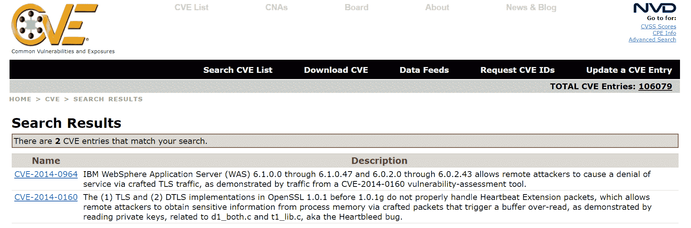
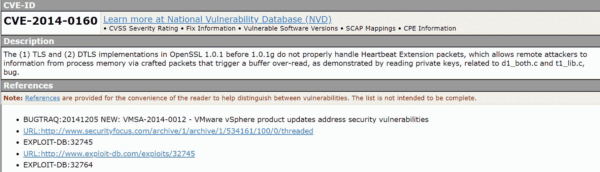
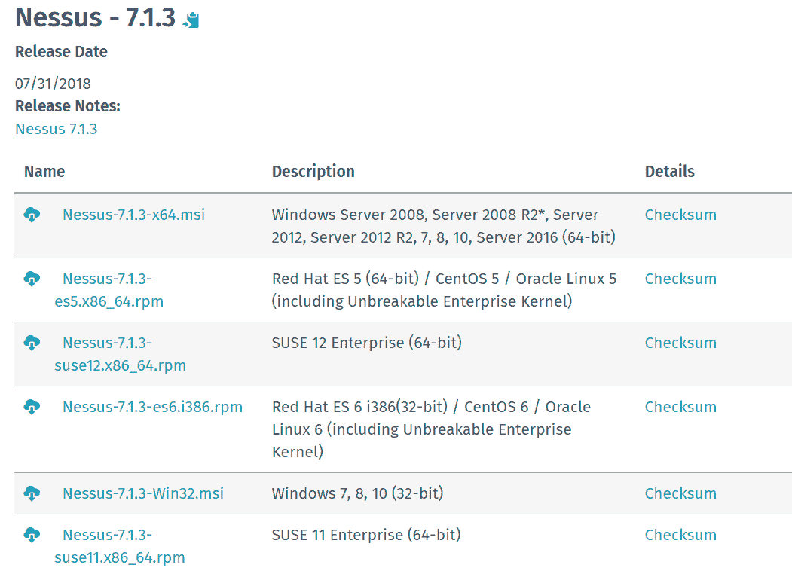
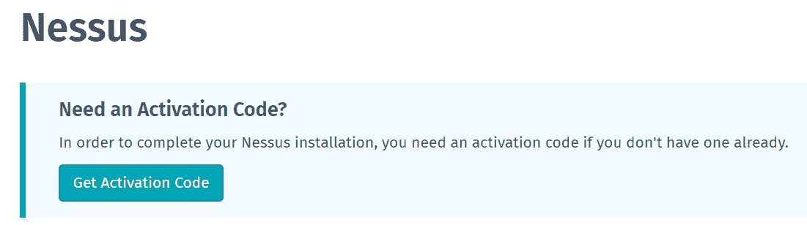
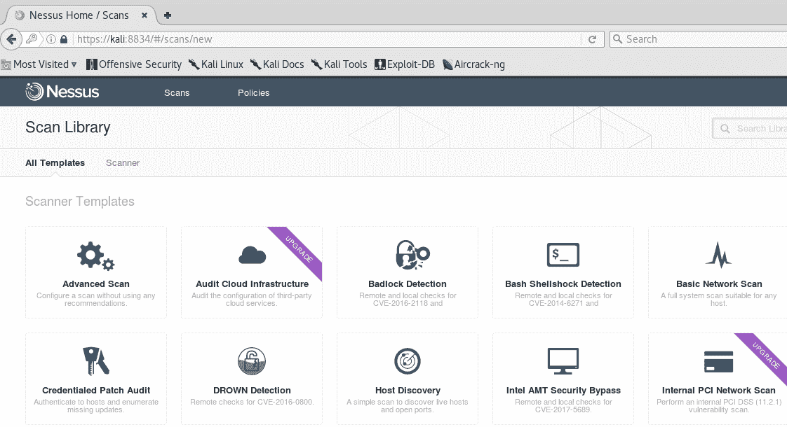
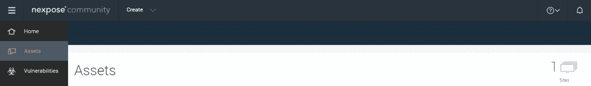
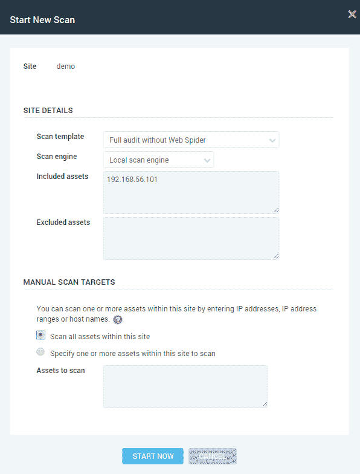
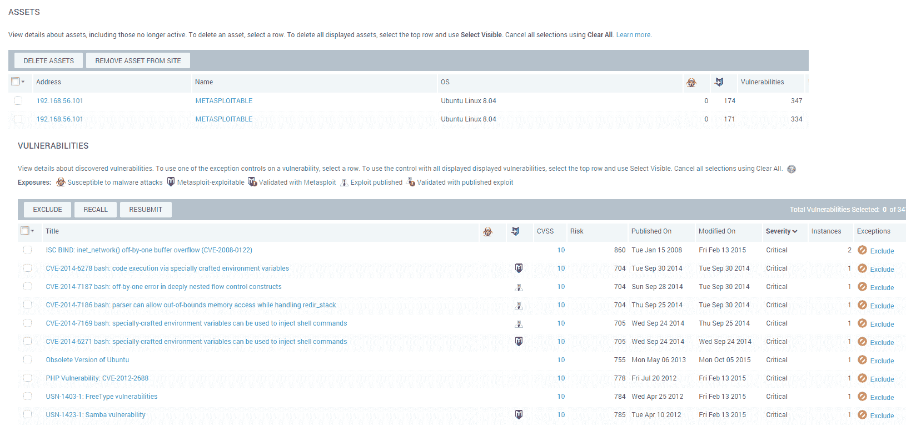

# 与漏洞扫描程序交互

本章将`nessus`和`nexpose`作为漏洞扫描器进行介绍，并为您提供报告服务器和 web 应用程序中发现的主要漏洞的工具。此外，我们还介绍了如何在 Python 中以编程方式将它们与`nessrest`和`Pynexpose`模块一起使用。

本章将介绍以下主题：

*   了解漏洞
*   了解`nessus`漏洞扫描器
*   了解允许我们连接`Nessus`服务器的`nessrest`模块
*   了解`nexpose`漏洞扫描器
*   了解允许我们连接`Nexpose`服务器的`Pynexpose`模块

# 技术要求

本章的示例和源代码可在 GitHub 存储库的`chapter 10`文件夹[中找到 https://github.com/PacktPublishing/Mastering-Python-for-Networking-and-Security](https://github.com/PacktPublishing/Mastering-Python-for-Networking-and-Security) 。

您需要在本地计算机上安装一个 Python 发行版，该发行版至少有 4 GB 内存。在本章中，我们将使用一个**虚拟机**，使用该虚拟机执行一些与端口分析和漏洞检测相关的测试。可从 sourceforge 页面[下载 https://sourceforge.net/projects/metasploitable/files/Metasploitable2](https://sourceforge.net/projects/metasploitable/files/Metasploitable2) 。

要登录，必须使用 as**msfadmin**作为用户名，**msfadmin**作为密码。

# 引入漏洞

在本节中，我们将回顾与漏洞和利用漏洞相关的概念，详细介绍我们可以找到漏洞的格式。

# 漏洞和漏洞利用

在本节中，我们将介绍有关漏洞和利用漏洞的两个定义。

# 什么是漏洞？

漏洞是指攻击者可用于更改应用程序行为（如注入代码或访问私有数据）的应用程序中的代码或其生成的配置上的错误。

漏洞也可能是系统安全性中的一个弱点，可以利用该漏洞访问系统。可以通过两种方式利用这些漏洞：远程和本地。远程攻击是指从与被攻击机器不同的机器上进行的攻击，而本地攻击是指在被攻击机器上本地执行的攻击，顾名思义。后者基于一系列技术来获得对该机器的访问和提升权限。

# 什么是剥削？

随着软件和硬件行业的发展，市场上推出的产品呈现出不同的漏洞，攻击者发现并利用这些漏洞危害使用这些产品的系统的安全。为此，开发了利用漏洞的技术，即利用错误、故障或弱点的一段软件、数据片段或脚本，以便在系统或应用程序中造成不必要的行为，能够强制更改其执行流，并可随意控制。

有一些漏洞是由一小群人知道的，称为零日漏洞，可以通过一些漏洞加以利用，也很少有人知道。这种类型的攻击称为攻击零日，这是一种尚未公开的攻击。只要存在暴露窗口，通过这些漏洞攻击就会发生；也就是说，在提供者补救缺陷之前，发现缺陷。在此期间，那些不知道存在此问题的人可能容易受到此类攻击的攻击。

# 漏洞格式

这些漏洞由 MITRE Corporation 创建的 CVE（常见漏洞和暴露）代码唯一标识。此代码允许用户以更客观的方式了解程序或系统中的漏洞。

识别码的格式为 CVE-年数模式；例如，CVE-2018-7889 使用标识符 7889 识别 2018 年发现的漏洞。您可以在多个数据库中找到关于不同现有漏洞的信息，例如：

*   常见漏洞和暴露–信息安全漏洞名称标准：[https://cve.mitre.org/cve/](https://cve.mitre.org/cve/)
*   国家漏洞数据库（NVD）：[http://nvd.nist.gov](http://nvd.nist.gov)

通常，通过概念证明，已发布的漏洞会被分配相应的攻击。这使组织的安全管理员能够证明漏洞的真实存在并测量其影响。有一个名为漏洞数据库的存储库（[http://www.exploit-db.com](http://www.exploit-db.com) ），您可以发现针对不同漏洞开发的许多漏洞。

CVE 提供了一个非常有用的漏洞数据库，因为除了分析有问题的漏洞外，它还提供了大量的参考资料，其中我们经常发现攻击该漏洞的漏洞的直接链接。

例如，如果我们在 CVE 中查找“heartbleed”（在 OpenSSL 版本 1.0.1 中发现的漏洞，该漏洞允许攻击者从服务器和客户端读取内存），它将为我们提供以下信息：



在此屏幕截图中，我们可以看到 CVE-2014-0160 漏洞的详细信息：



**CVSS**（**通用漏洞评分系统**代码也可用，这是由**第一**（**国际响应团队论坛**-**[发起的一项公共倡议 http://www.first.org](http://www.first.org)** ）并使我们能够解决缺乏标准标准的问题，从而有可能确定哪些漏洞更有可能被成功利用。CVSS 代码引入了一个漏洞评分系统，考虑了一组标准化且易于测量的标准。

扫描报告中的漏洞被指定为高、中或低的严重性。严重性基于分配给 CVE 的通用漏洞评分系统（CVSS）评分。大多数漏洞扫描程序使用供应商的分数来准确捕获严重性：

*   **高：**该漏洞的 CVSS 基本得分在 8.0 到 10.0 之间。
*   **中等：**该漏洞的 CVSS 基本得分在 4.0 到 7.9 之间。
*   **低：**该漏洞的 CVSS 基本得分在 0.0 到 3.9 之间。

# 介绍 Nessus 漏洞扫描器

在本节中，我们将回顾`Nessus`漏洞扫描程序，它为您提供报告工具，用于报告我们在服务器和 web 应用程序中发现的主要漏洞。

# 安装 Nessus 漏洞扫描程序

`Nessus`是一款流行的漏洞扫描工具，非常健壮，适用于大型企业网络。它有一个客户机-服务器体系结构，允许扫描更具可扩展性、可管理性和精确性。此外，它采用了几个安全元素，可以轻松适应安全基础设施，并具有非常强健的加密和身份验证机制。

要安装它，请转到[https://www.tenable.com/downloads/nessus](https://www.tenable.com/downloads/nessus) 并按照操作系统的说明进行操作：



另外，您需要从[获取激活码 https://www.tenable.com/products/nessus/activation-code](https://www.tenable.com/products/nessus/activation-code) ：



# 执行 Nessus 漏洞扫描程序

安装完成后，如果您在 Linux 上运行，可以执行“`/etc/init.d/nessusd start`”命令；此工具可通过[处的浏览器访问 https://127.0.0.1:8834](https://127.0.0.1:8834) 然后输入安装过程中激活的用户帐户。

进入`Nessus`主界面后，必须输入用户的访问数据。然后，您必须进入**扫描选项卡**，该选项卡可以在图像中看到，并选择**基本网络扫描**选项：



进行此选择后，将打开界面，其中必须确定扫描仪的目标（无论是计算机还是网络）、扫描仪的策略和名称，以便能够识别扫描仪。选择此数据后，扫描仪将启动，完成后，我们可以通过从“扫描”选项卡中选择分析来查看结果。

在“扫描”选项卡中，添加要扫描的目标，并执行该过程。通过使用此工具，以及在专门数据库中的搜索，可以获得系统中存在的不同漏洞，从而使我们能够进入下一个阶段：攻击。

# 使用 Nessus 识别漏洞

此工具补充了通过在专用数据库中进行查询来识别漏洞的过程。作为此类自动扫描的一个缺点，存在误报、未检测到某些漏洞，有时对利用该漏洞访问系统的某些漏洞进行低优先级分类。

通过此分析，您可以观察到可能攻击任何用户的不同漏洞，因为这些漏洞可以从 internet 访问。

该报告由不同现有漏洞的执行摘要组成。本摘要根据不同的漏洞的严重性，根据颜色代码排列不同的漏洞。每个漏洞都有其严重性、漏洞代码和简要说明。

将`Nessus`应用于元可编程环境后获得的结果如下图所示。

在这里，我们可以看到发现的所有漏洞的摘要，按严重程度排序：


在这里，我们可以看到所有漏洞的详细信息，以及对严重程度的描述：


名为 Debian OpenSSh/OpenSSL 包随机数生成器弱点的漏洞是 Metaspolitable 虚拟机中最关键的漏洞之一。我们可以看到，CVSS 得分为 10 分：


# 使用 Python 访问 Nessus API

在本节中，我们将回顾与`Nessus`漏洞扫描器交互的`python`模块。

# 安装 nessrest Python 模块

`Nessus`提供了一个 API，可以从 Python 以编程方式访问它。Tenable 提供了一个 RESTAPI，我们可以使用任何允许 HTTP 请求的库。我们还可以在 Python 中使用特定的库，例如`nessrest`：[https://github.com/tenable/nessrest](https://github.com/tenable/nessrest) 。

要在 Python 脚本中使用此模块，请在安装后像导入其他模块一样导入它。我们可以用 pip 安装`nessrest`模块：

```py
$ pip install nessrest
```

如果我们尝试从 github 源代码构建项目，依赖关系可以通过

`pip install -r requirements.txt`

 **

您可以通过以下方式在脚本中导入模块：

```py
from nessrest import ness6rest
```

# 与 Nessus 服务器交互

要从 python 与`nessus`交互，我们必须使用`ness6rest.Scanner`类初始化扫描器，作为 url 参数、用户名和密码传递以访问`nessus`服务器实例：


We can use the Scanner init constructor method to initialize the connection with the server:

```py
scanner = ness6rest.Scanner(url="https://server:8834", login="username", password="password")
```

默认情况下，我们使用自签名证书运行`Nessus`，但我们可以禁用 SSL 证书检查。为此，我们需要将另一个参数`insecure=True`传递给扫描仪初始值设定项：

```py
scanner = ness6rest.Scanner(url="https://server:8834", login="username", password="password",insecure=True)
```

在模块文档中，我们可以看到扫描特定目标的方法，通过`scan_results()`我们可以得到扫描结果：


要添加并启动扫描，请使用`scan_add`方法指定目标：

```py
scan.scan_add(targets="192.168.100.2")
scan.scan_run()
```

# 介绍 Nexpose 漏洞扫描程序

在本节中，我们将回顾`Nexpose`漏洞扫描程序，它为您提供了报告工具，用于报告我们在服务器和 web 应用程序中发现的主要漏洞。

# 安装 Nexpose 漏洞扫描程序

`Nexpose`是一个漏洞扫描程序，与`nessus`的方法类似，因为除了允许我们对网络上的多台机器运行扫描外，它还具有一个插件系统和一个 API，允许将外部代码例程与引擎集成。

`NeXpose`是`Rapid7`为扫描和发现漏洞而开发的工具。有一个社区版本可以用于非商业目的，尽管它有局限性，但我们可以使用它来执行一些测试。

要安装软件，您必须从官方页面获得有效许可证：

[https://www.rapid7.com/products/nexpose/download/](https://www.rapid7.com/products/nexpose/download/)

一旦我们通过官方页面安装了`nexpose`，我们就可以访问服务器运行的 URL。

运行`nscsvc.bat`脚本，我们将在本地主机 3780 上运行服务器：

[https://localhost:3780/login.jsp](https://localhost:3780/login.jsp)

Windows 计算机上的默认安装在`C:\ProgramFiles\rapid7\nexpose\nsc`
路径中完成。

# 执行 Nexpose 漏洞扫描程序

`Nexpose`允许您分析特定的 IP、域名或服务器。首先，有必要创建一组资源，称为资产，用于定义引擎可审核的所有元素。

为此，有一系列资源，也称为**资产**，在资产中，我们定义了要分析的站点或域：



在本例中，我们将分析 IP 地址为 192.168.56.101**：**的**元可编程虚拟机**



在分析结束时，我们会看到扫描结果和检测到的漏洞：



`Nexpose`有一个**API**，允许我们从其他应用程序访问其功能；通过这种方式，它允许自动化用户必须从管理界面执行的任务。

API 文档以 PDF 格式在[上提供 http://download2.rapid7.com/download/NeXposev4/Nexpose_API_Guide.pdf](http://download2.rapid7.com/download/NeXposev4/Nexpose_API_Guide.pdf) 。

在指南中可以找到可用功能及其使用的详细信息。在 Python 中，有一些库允许以相当简单的方式与 HTTP 服务交互。为了简化操作，可以使用一个脚本，该脚本已经负责查询`nexpose`实例中可用的函数，并返回一个字符串，其中包含 XML 格式的所有漏洞信息。

# 使用 Python 访问 Nexpose API

在本节中，我们将回顾与`Nexpose`漏洞扫描器交互的`pynexpose`模块。

# 安装 pynexpose Python 模块

`Nexpose`有一个 API，允许我们从外部应用程序访问其功能，从而实现用户必须从管理界面或`nexpose`控制台执行的任务的自动化。API 允许任何例程代码使用 HTTPS 调用与`nexpose`实例交互，以 XML 格式返回函数。使用 HTTPS 协议非常重要，这不仅是出于安全原因，也是因为 API 不支持使用 HTTP 的调用。

在 Python 中，我们有`Pynexpose`模块，其代码可以在[中找到 https://code.google.com/archive/p/pynexpose/](https://code.google.com/archive/p/pynexpose/) 。

`Pynexpose`模块允许从 Python 对 web 服务器上的漏洞扫描程序进行编程访问。为此，我们必须通过 HTTP 请求与所述服务器通信。

为了从 Python 连接到`nexpose`服务器，我们使用**pynexposeHttps.py**文件中的`NeXposeServer`类。为此，我们调用构造函数，通过参数传递服务器的 IP 地址、端口以及登录服务器管理网页时使用的用户和密码：

```py
serveraddr_nexpose = "192.168.56.101"
port_server_nexpose = "3780"
user_nexpose = "user"
password_nexpose = "password"
pynexposeHttps = pynexposeHttps.NeXposeServer(serveraddr_nexpose, port_server_nexpose, user_nexpose, password_nexpose)
```

我们可以创建一个**NexposeFrameWork**类，该类将初始化与服务器的连接，并创建一些方法来获取检测到的站点和漏洞列表。要解析**XML**格式的漏洞数据，我们需要使用**解析器**，如**BeautifulSoup**。

在`siteListing()`函数中，我们正在解析执行`site_listing()`函数后返回的内容，随后找到文档的所有**“sitesummary”**元素，这些元素对应于服务器上创建的每个站点的信息。

同样，在**`vulnerabilityListing()`**函数中，我们正在解析执行`vulnerability_listing()`函数后返回的内容，并且一旦找到文档的所有“**漏洞摘要**元素。

您可以在`nexpose`文件夹中的**NexposeFrameWork.py**文件中找到以下代码：

```py
from bs4 import BeautifulSoup

class NexposeFrameWork:

    def __init__(self, pynexposeHttps):
        self.pynexposeHttps = pynexposeHttps

 def siteListing(self):
        print "\nSites"
        print "--------------------------"
        bsoupSiteListing = BeautifulSoup(self.pynexposeHttps.site_listing(),'lxml')
        for site in bsoupSiteListing.findAll('sitesummary'):
            attrs = dict(site.attrs)
                print("Description: " + attrs['description'])
                print("riskscore: " + attrs['riskscore'])
                print("Id: " + attrs['id'])
                print("riskfactor: " + attrs['riskfactor'])
                print("name: " + attrs['name'])
                print("\n")

```

在这段代码中，我们可以看到获取漏洞列表的方法；对于每一个，它显示与标识符、严重性、标题和描述相关的信息：

```py
 def vulnerabilityListing(self):
        print("\nVulnerabilities")
        print("--------------------------")
        bsoupVulnerabilityListing =        BeautifulSoup(self.pynexposeHttps.vulnerability_listing(),'lxml')
         for vulnerability in bsoupVulnerabilityListing.findAll('vulnerabilitysummary'):
            attrs = dict(vulnerability.attrs)
            print("Id: " + attrs['id'])
            print("Severity: " + attrs['severity'])
            print("Title: " + attrs['title'])
            bsoupVulnerabilityDetails = BeautifulSoup(self.pynexposeHttps.vulnerability_details(attrs['id']),'lxml')
            for vulnerability_description in bsoupVulnerabilityDetails.findAll('description'):
                print("Description: " + vulnerability_description.text)
                print("\n")
```

在这段代码中，我们可以看到我们的主程序，我们正在初始化与连接到`nexpose`服务器的 IP 地址、端口、用户和密码相关的参数：

```py
if __name__ == "__main__":
    serveraddr_nexpose = "192.168.56.101"
    port_server_nexpose = "3780"
    user_nexpose = "user"
    password_nexpose = "password"
    pynexposeHttps = pynexposeHttps.NeXposeServer(serveraddr_nexpose,port_server_nexpose, user_nexpose, password_nexpose)

    nexposeFrameWork = NexposeFrameWork(pynexposeHttps)
    nexposeFrameWork.siteListing()
    nexposeFrameWork.vulnerabilityListing()
```

一旦通过与`nexpose`服务器的连接创建了一个对象，我们就可以使用一些功能列出在服务器上创建的站点，并列出已执行的分析和从 web 界面生成的报告。最后，`logout`功能允许我们断开与服务器的连接并销毁创建的会话：

```py
nexposeFrameWork = NexposeFrameWork(pynexposeHttps)
nexposeFrameWork.siteListing()
nexposeFrameWork.vulnerabilityListing()
pynexposeHttps.logout()
```

在**NexposeFrameWork**类中创建的函数使用了`pynexpose`脚本中的以下方法。`vulnerability_listing()`和`vulnerability_details()`方法负责列出所有检测到的漏洞，并返回特定漏洞的详细信息：

```py
pynexposeHttps.site_listing()
pynexposeHttps.vulnerability_listing()
pynexposeHttps.vulnerability_details()
```

这些方法在**pynexposeHttps.py**文件中的**NeXposeServer**类中定义

```py
def site_listing(self):
    response = self.call("SiteListing")
    return etree.tostring(response)

def vulnerability_listing(self):
    response = self.call("VulnerabilityListing")
    return etree.tostring(response)

def vulnerability_details(self, vulnid):
    response = self.call("VulnerabilityDetails", {"vuln-id" : vulnid})
    return etree.tostring(response)
```

需要记住的一点是，返回的回复是 XML 格式的。解析和获取信息的一种简单方法是使用`BeautifulSoup`模块和`lxml`解析器。

通过这种方式，我们可以解析返回的内容，并查找与站点和注册漏洞对应的标签。

`Nexpose`用于收集新数据、发现新漏洞，并通过实时监控快速解决网络或应用程序级别可能出现的漏洞。通过使用此工具，您还可以将数据转换为详细的可视化，以便集中资源并轻松地与组织中的其他 IT 部门共享每个操作。

在这幅图中，我们可以看到在 metasploitble 虚拟机上执行**NexposeFrameWork.py**的结果：


此扫描的结果可在所附的`nexpose_log.txt`文件中找到。

这些类型的工具能够定期执行漏洞扫描，并将使用不同工具发现的漏洞与以前的结果进行比较。通过这种方式，我们将突出显示这些变化，以检查它们是否是真正的发现。在可能的安全问题改变其状态之前，它们不会被忽略，这是大幅缩短漏洞分析时间的理想选择。

# 总结

本章的目标之一是了解允许我们连接漏洞扫描程序的模块，如`nessus`和`nexpose`。我们回顾了一些关于漏洞和利用漏洞的定义。在获得服务、端口和操作系统等元素后，必须在互联网上可用的不同数据库中搜索它们的漏洞。但是，也有一些工具允许您自动执行漏洞扫描，如`Nessus`和`Nexpose`。

在下一个[章节](11.html)中，我们将探索使用`w3a`和`fsqlmap`等工具来检测 SQL 漏洞，以及其他用于识别服务器漏洞的工具（如 ssl 和 heartbleed）来识别 web 应用程序中的服务器漏洞。

# 问题

1.  考虑到一套标准化且易于衡量的标准，对脆弱性进行评分的主要机制是什么？

2.  我们使用哪个包和类与 python 中的`nessus`交互？

3.  `nessrest`模块中的哪种方法以指定目标的方式启动扫描？

4.  `nessrest`模块中的哪种方法在指定目标时获取扫描的详细信息？

5.  从 Python 连接到`nexpose`服务器的主要类是什么？

6.  哪些方法负责列出所有检测到的漏洞并返回`nexpose`服务器中特定漏洞的详细信息？

7.  允许我们解析并获取从`nexpose`服务器获取的信息的`Python`模块的名称是什么？

8.  允许我们连接到`NexPose`漏洞扫描程序的`Python`模块的名称是什么？

9.  允许我们连接到`Nessus`漏洞扫描程序的`Python`模块的名称是什么？

10.  `Nexpose`服务器以何种格式以简单的方式从 Python 返回要处理的响应？

# 进一步阅读

在这些链接中，您可以找到更多关于`nessus`和`nexpose`的信息和官方文档：

*   [https://docs.tenable.com/nessus/Content/GettingStarted.htm](https://docs.tenable.com/nessus/Content/GettingStarted.htm)
*   [https://nexpose.help.rapid7.com/docs/getting-started-with-nexpose](https://nexpose.help.rapid7.com/docs/getting-started-with-nexpose)
*   [https://help.rapid7.com/insightvm/en-us/api/index.html](https://help.rapid7.com/insightvm/en-us/api/index.html)

如今，有很多漏洞扫描工具。Nessus、Seccubus、openvas、著名的 Nmap 扫描器，甚至 OWASP ZAP 都是扫描网络和计算机系统漏洞的最常用工具：

*   [https://www.seccubus.com/](https://www.seccubus.com/)
*   [http://www.openvas.org/](http://www.openvas.org/)

开放漏洞评估系统（OpenVAS）是一个免费的安全扫描平台，其大部分组件都是根据 GNU 通用公共许可证（GNU GPL）授权的。主要组件可以通过几个 Linux 软件包获得，也可以作为可下载的虚拟应用程序进行测试/评估。**