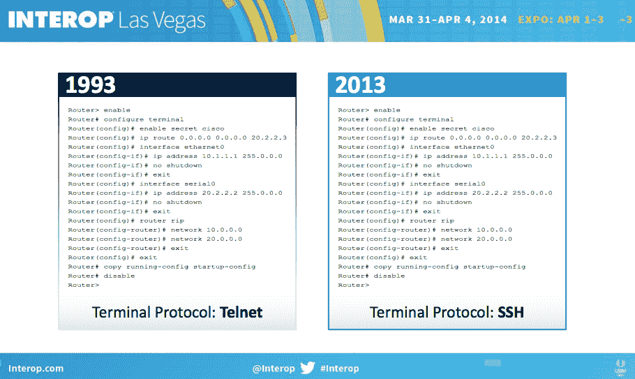
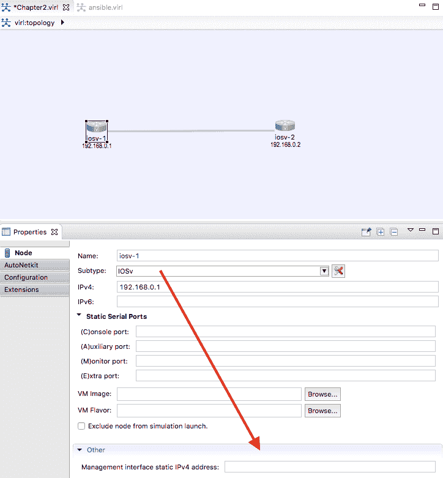
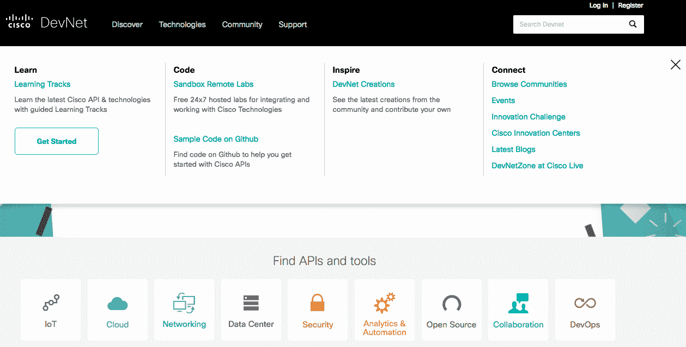
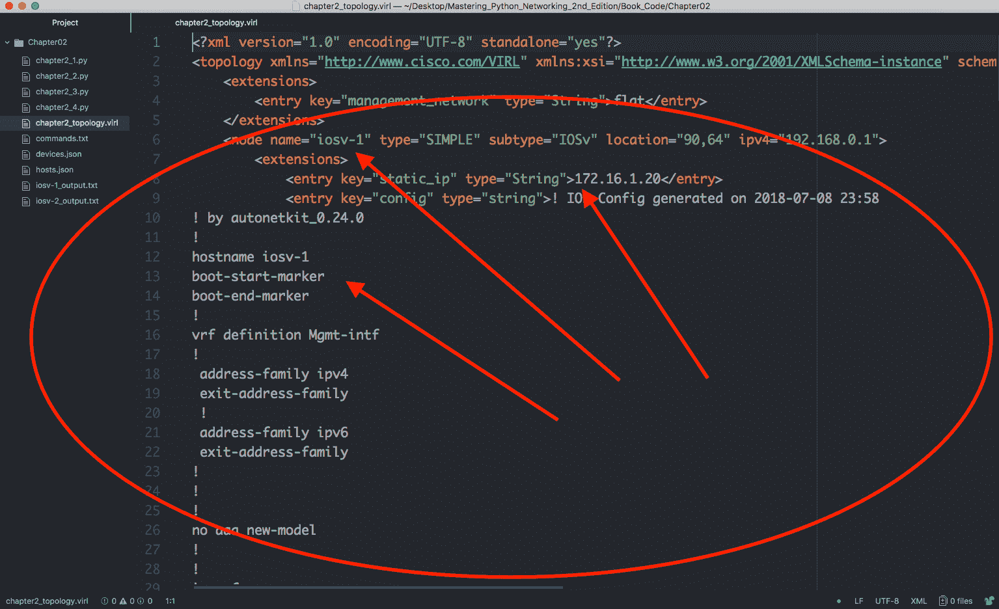

# 二、低级网络设备交互

在[第 1 章](01.html)*对 TCP/IP 协议套件和 Python*的回顾中，我们了解了网络通信协议背后的理论和规范。我们还快速浏览了 Python 语言。在本章中，我们将开始深入探讨使用 Python 管理网络设备。特别是，我们将研究使用 Python 以编程方式与传统网络路由器和交换机通信的不同方式。

我所说的传统网络路由器和交换机是什么意思？虽然很难想象今天出现的任何网络设备没有用于编程通信的**应用程序接口**（**API**），但众所周知，前几年部署的许多网络设备都不包含 API 接口。这些设备的预期管理方法是使用终端程序通过**命令行界面**（**CLIs**）进行管理，这些终端程序最初是由人类工程师开发的。管理层依靠工程师对设备返回的数据的解释来采取适当的措施。随着网络设备数量和网络复杂性的增加，手动逐个管理它们变得越来越困难

Python 有两个很好的库可以帮助完成这些任务，Pexpect 和 Paramiko，以及从它们派生的其他库。本章将首先介绍 Pexpect，然后介绍 Paramiko 的示例。一旦您了解了 Paramiko 的基础知识，就很容易扩展到 Netmiko 等扩展库。还值得一提的是，Ansible（包括在[第 4 章](04.html)、*Python 自动化框架–Ansible Basic*和[第 5 章](05.html)、*Python 自动化框架–Beyond Basic*中）的网络模块严重依赖 Paramiko。在本章中，我们将了解以下主题：

*   CLI 的挑战
*   构建虚拟实验室
*   pythonpexpect 库

*   Python Paramiko 库
*   Pexpect 和 Paramiko 的缺点

让我们开始吧！ 

# CLI 的挑战

在 2014 年拉斯维加斯 Interop 博览会上，*BigSwitch Networks*首席执行官道格拉斯·默里（Douglas Murray）展示了以下幻灯片，以说明**数据中心网络**（**DCN**在 1993 年至 2013 年的 20 年间发生了哪些变化：



Data center networking changes (source: [https://www.bigswitch.com/sites/default/files/presentations/murraydouglasstartuphotseatpanel.pdf](https://www.bigswitch.com/sites/default/files/presentations/murraydouglasstartuphotseatpanel.pdf))

他的观点很明显：在这 20 年中，我们管理网络设备的方式没有太大变化。虽然他在展示这张幻灯片时可能对现有供应商有负面偏见，但他的观点是正确的。在他看来，20 年来管理路由器和交换机的唯一变化是协议从较不安全的 Telnet 变为更安全的 SSH。

大约在 2014 年的同一时间，我们开始看到业界就明显需要从手动、人工驱动的 CLI 转向自动、以计算机为中心的自动化 API 达成共识。毫无疑问，在进行网络设计、提出初步概念验证和首次部署拓扑时，我们仍然需要直接与设备通信。然而，一旦我们超越了最初的部署，就需要始终如一地可靠地进行相同的更改，使其无错误，并在工程师不分心或感到疲劳的情况下反复重复这些更改。对于计算机和我们最喜欢的语言 Python 来说，这个要求听起来很理想。

回到幻灯片，主要的挑战是路由器和管理员之间的交互。路由器将输出一系列信息，并期望管理员根据工程师对输出的解释输入一系列手动命令。例如，您必须输入`enable`才能进入特权模式，在收到返回的带有`#`符号的提示后，您必须输入`configure terminal`才能进入配置模式。同样的过程可以进一步扩展为接口配置模式和路由协议配置模式。这与计算机驱动的编程思维形成鲜明对比。当计算机想要完成一项任务时，比如说，在一个接口上放置一个 IP 地址，它希望在结构上一次将所有信息提供给路由器，并且它希望路由器给出一个单一的`yes`或`no`答案来指示任务的成功或失败。

由 Pexpect 和 Paramiko 实现的解决方案是将交互进程视为子进程，并监视进程与目标设备之间的交互。根据返回的值，父进程将决定后续操作（如果有）。

# 构建虚拟实验室

在我们深入研究这些软件包之前，让我们先研究一下为了学习的好处而建立一个实验室的选项。正如老话所说，*熟能生巧*：我们需要一个孤立的沙箱来安全地犯错误，尝试新的做事方式，并重复一些步骤来强化第一次尝试时不清楚的概念。为管理主机安装 Python 和必要的软件包很容易，但是我们想要模拟的路由器和交换机呢？

为了组建一个网络实验室，我们基本上有两种选择，每种选择各有优缺点：

*   **物理设备**：此选项由您可以看到和触摸的物理设备组成。如果您足够幸运，您可能能够组建一个完全复制您的生产环境的实验室：
    *   **优点**：从实验室到生产的过渡非常容易，管理人员和工程师同事更容易理解，他们可以查看和触摸设备。简而言之，由于熟悉，物理设备的舒适度非常高
    *   **缺点**：只在实验室使用的设备价格相对较高，设备需要工程时间进行机架和堆叠，一旦建造，灵活性不强。
*   **虚拟设备**：这些是对实际网络设备的仿真或模拟。它们要么由供应商提供，要么由开源社区提供：
    *   **优势**：虚拟设备更容易设置，相对便宜，可以快速更改拓扑。
    *   **缺点**：它们通常是物理对应物的缩小版本。有时，虚拟设备和物理设备之间存在功能差距。

当然，决定使用虚拟或物理实验室是个人的决定，这是在成本、易于实施和实验室与生产之间存在差距的风险之间进行权衡的结果。在我工作过的一些环境中，虚拟实验室用于进行初步概念验证，而物理实验室用于接近最终设计。

在我看来，随着越来越多的供应商决定生产虚拟设备，虚拟实验室是在学习环境中进行的方式。虚拟设备的功能差距相对较小，并且有专门的文档记录，特别是当虚拟实例由供应商提供时。与购买物理设备相比，虚拟设备的成本相对较小。使用虚拟设备进行构建的时间更快，因为它们通常只是软件程序。

在本书中，我将结合使用物理设备和虚拟设备进行概念演示，并优先选择虚拟设备。对于我们将看到的例子，差异应该是透明的。如果虚拟设备和物理设备之间存在与我们的目标相关的任何已知差异，我将确保列出它们。

在虚拟实验室方面，除了来自不同供应商的图片外，我正在使用思科的一个名为**虚拟互联网路由实验室**（**VIRL**）、[的程序 https://learningnetworkstore.cisco.com/virtual-internet-routing-lab-virl/cisco-personal-edition-pe-20-nodes-virl-20](https://learningnetworkstore.cisco.com/virtual-internet-routing-lab-virl/cisco-personal-edition-pe-20-nodes-virl-20)

I want to point out that the use of this program is entirely optional for the reader. But it is strongly recommended that the reader have some lab equipment to follow along with the examples in this book.

# 思科病毒

我记得当我第一次开始学习我的**思科认证互联网专家**（**CCIE**）实验室考试时，我从易趣上购买了一些二手思科设备来学习。即使是打折，每台路由器和交换机也要花费数百美元，因此为了省钱，我从 20 世纪 80 年代购买了一些真正过时的 Cisco 路由器（在你最喜欢的搜索引擎中搜索 Cisco AGS 路由器，以获得一个好的笑声），这些路由器明显缺乏功能和马力，即使是实验室标准。当我打开家庭成员的电源（他们的声音真的很大）时，我和他们进行了一次有趣的对话，但把这些物理设备放在一起并不有趣。它们又重又笨重，连接所有的电缆是一件痛苦的事情，如果出现链接故障，我会直接拔掉电缆。

快进几年。**Dynamip**被创建，我爱上了创建不同的网络场景是多么容易。这在我尝试学习新概念时尤为重要。您所需要的只是 Cisco 的 IOS 映像，一些精心构建的拓扑文件，您可以轻松构建一个虚拟网络，在上面测试您的知识。我有一个完整的文件夹，其中包括网络拓扑、预保存的配置和场景所要求的不同版本的图像。GNS3 前端的添加为整个设置提供了一个漂亮的 GUI 外观。使用 GNS3，您只需点击并删除链接和设备；您甚至可以直接从 GNS3 设计面板打印出 manager 的网络拓扑。唯一缺少的是该工具没有得到供应商的正式认可，以及由此造成的信誉缺失

2015 年，Cisco 社区决定通过发布 Cisco VIRL 来满足这一需求。如果您有一台满足要求的服务器，并且愿意支付所需的年度许可证，那么这是我开发和试用大部分 Python 代码的首选方法，无论是本书还是我自己的产品使用。

As of January 1 2017, only the personal edition 20-Node license is available for purchase for USD $199.99 per year.

在我看来，即使是以金钱为代价，VIRL 平台也比其他替代方案有一些优势：

*   **易用性**：IOSv、IOS XRv、CSR100v、NX OSv 和 ASAv 的所有图像都包含在一次下载中。
*   **官方**（**类**）：虽然支持是社区驱动的，但它是思科内部广泛使用的工具。由于它的流行性，bug 很快得到修复，新特性被仔细记录，有用的知识在用户之间被广泛共享。
*   **云迁移路径**：当您的仿真超出您现有的硬件能力时，该项目提供了一个逻辑迁移路径，例如 Cisco dCloud（[）https://dcloud.cisco.com/](https://dcloud.cisco.com/) 、数据包上的病毒（[http://virl.cisco.com/cloud/](http://virl.cisco.com/cloud/) 、思科 DevNet（[https://developer.cisco.com/](https://developer.cisco.com/) 。这是一个有时会被忽略的重要功能
*   **链路和控制平面模拟**：该工具可以模拟每个链路的延迟、抖动和数据包丢失，以了解真实的链路特性。还有一个用于外部路线注入的控制平面流量生成器。
*   **其他**：该工具提供了一些不错的功能，如 VM Maestro 拓扑设计和模拟控制、自动生成配置的 AutoNetkit 以及共享服务器时的用户工作区管理。还有一些开源项目，比如 virlutils（[https://github.com/CiscoDevNet/virlutils](https://github.com/CiscoDevNet/virlutils) ），社区积极参与，以提高工具的可操作性

在本书中，我们不会使用 VIRL 中的所有功能。但由于这是一个相对较新的工具，值得您考虑，如果您确定这是您想要使用的工具，我想提供一些我使用的设置。

Again, I want to stress the importance of having a lab, but it does not need to be the Cisco VIRL lab. The code examples provided in this book should work across any lab device, as long as they run the same software type and version. 

# 病毒提示

VIRL 网站（[http://virl.cisco.com/](http://virl.cisco.com/) 提供了大量的指导、准备和文档。我还发现 VIRL 用户社区通常提供快速准确的帮助。我不会重复这两个地方已经提供的信息；但是，以下是我在本书中用于实验室的一些设置：

1.  VIRL 使用两个虚拟以太网接口进行连接。第一个接口设置为主机 internet 连接的 NAT，第二个接口用于本地管理接口连接（以下示例中为 VMnet2）。我使用具有类似网络设置的单独虚拟机来运行 Python 代码，第一个主以太网用于 internet 连接，第二个以太网连接到 Vmnet2 用于实验室设备管理网络：


2.  VMnet2 是一个自定义网络，用于连接 Ubuntu 主机和 VIRL 虚拟机：


3.  在拓扑设计选项中，我将管理网络选项设置为共享平面网络，以便使用 VMnet2 作为虚拟路由器上的管理网络：


4.  在节点配置下，您可以选择静态配置管理 IP。我尝试静态地设置管理 IP 地址，而不是让软件动态地分配它们。这允许更确定的可访问性：



# Cisco DevNet 和 dCloud

Cisco 还提供了另外两种优秀的、在撰写本文时是免费的方法，用于使用各种 Cisco 设备实现网络自动化。这两种工具都需要**思科在线连接（CCO）**登录。它们都很好，特别是在价格方面（它们是免费的！）。我很难想象这些在线工具会长期免费；我相信，在某种程度上，这些工具将需要为其使用收费，或者被纳入需要收费的更大计划。然而，我们可以利用它们，而它们是免费提供的。

第一个工具是 Cisco DevNet（[https://developer.cisco.com/](https://developer.cisco.com/) ）沙盒，包括引导式学习轨道、完整文档和沙盒远程实验室，以及其他好处。有些实验室总是开着，而其他的你需要预约。实验室可用性将取决于使用情况。如果你还没有自己的实验室，这是一个很好的选择。根据我使用 DevNet 的经验，有些文档和链接已经过时，但是可以很容易地检索到最新版本。在一个快速变化的领域，如软件开发，这在某种程度上是意料之中的。DevNet 当然是一个您应该充分利用的工具，无论您是否有本地运行的 VIRL 主机：



思科的另一个在线实验室选项是[https://dcloud.cisco.com/](https://dcloud.cisco.com/) 。您可以将 dCloud 视为在其他人的服务器上运行 VIRL，而无需管理或支付这些资源的费用。思科似乎将 dCloud 视为一个独立的产品以及 VIRL 的扩展。例如，在无法在本地运行多个 IOX-XR 或 NX-OS 实例的情况下，可以使用 dCloud 扩展本地实验室。这是一个相对较新的工具，但绝对值得一看：


# GNS3

我在这本书和其他目的中使用了一些其他虚拟实验室。[GNS3](https://gns3.com/)工具就是其中之一：


正如本章前面提到的，GNS3 是我们很多人用来学习认证测试和为实验室实践的东西。该工具已经从早期的 Dynamips 简单前端真正成长为一个可行的商业产品。思科制造的工具，如 VIRL、DevNet 和 dCloud，只包含思科技术。尽管它们为虚拟实验室设备提供了与外部世界通信的方式，但它们并不像让多供应商虚拟化设备直接生活在模拟环境中那样简单。GNS3 与供应商无关，可以直接在实验室中包含多供应商虚拟化平台。这通常是通过克隆映像（如 Arista vEOS）或通过其他虚拟机监控程序（如 Juniper Olive 仿真）直接启动网络设备映像来完成的。有些人可能会说 GNS3 没有 Cisco VIRL 项目的广度和深度，但因为他们可以运行不同的 Cisco 技术，所以我经常在需要将其他供应商技术纳入实验室时使用它

另一个备受好评的多供应商网络仿真环境是**仿真虚拟环境下一代（EVE-NG）**、[http://www.eve-ng.net/](http://www.eve-ng.net/) 。我个人没有太多使用该工具的经验，但我的许多同事和业内朋友都将其用于他们的网络实验室

还有其他虚拟化平台，如 Arista vEOS（[https://eos.arista.com/tag/veos/](https://eos.arista.com/tag/veos/) 、杜松 vMX（[http://www.juniper.net/us/en/products-services/routing/mx-series/vmx/](http://www.juniper.net/us/en/products-services/routing/mx-series/vmx/) 和 vSRX（[http://www.juniper.net/us/en/products-services/security/srx-series/vsrx/](http://www.juniper.net/us/en/products-services/security/srx-series/vsrx/) ，您可以在测试期间将其用作独立的虚拟设备。它们是测试平台特定功能（如平台上 API 版本之间的差异）的强大补充工具。其中许多是作为付费产品在公共云提供商市场上提供的，以便于访问。它们通常具有与其物理对应物相同的特征。

# Python Pexpect 库

Pexpect is a pure Python module for spawning child applications, controlling them, and responding to expected patterns in their output. Pexpect works like Don Libes' Expect. Pexpct allows your script to spawn a child application and control it as if a human were typing commands. Pexpect, Read the Docs: [https://pexpect.readthedocs.io/en/stable/index.html](https://pexpect.readthedocs.io/en/stable/index.html)

让我们看一下 Python PyEngin 库。与 Don Libe 最初的 Tcl Expect 模块类似，Pexpect 启动或生成另一个进程并监视它以控制交互。Expect 工具最初是为了自动化 FTP、Telnet 和 rlogin 等交互过程而开发的，后来扩展到包括网络自动化。与最初的 Expect 不同，Pexpect 完全是用 Python 编写的，不需要编译 TCL 或 C 扩展。这允许我们在代码中使用熟悉的 Python 语法及其丰富的标准库。

# 预期安装

因为这是我们将要安装的第一个包，所以我们将安装带有`pexpect`包的`pip`工具。过程非常简单：

```py
sudo apt-get install python-pip #Python2
sudo apt-get install python3-pip
sudo pip3 install pexpect
sudo pip install pexpect #Python2
```

I am using `pip3` to install Python 3 packages, while using `pip` to install packages in the Python 2 environment.

进行快速测试以确保软件包可用：

```py
>>> import pexpect
>>> dir(pexpect)
['EOF', 'ExceptionPexpect', 'Expecter', 'PY3', 
 'TIMEOUT', '__all__', '__builtins__', '__cached__', 
 '__doc__', '__file__', '__loader__', '__name__', 
 '__package__', '__path__', '__revision__', 
 '__spec__', '__version__', 'exceptions', 'expect', 
 'is_executable_file', 'pty_spawn', 'run', 'runu', 
 'searcher_re', 'searcher_string', 'spawn', 
 'spawnbase', 'spawnu', 'split_command_line', 'sys',
 'utils', 'which']
>>> 
```

# 预期概述

对于我们的第一个实验室，我们将构建一个简单的网络，其中两个 IOSv 设备背靠背连接：


Lab topology

每个设备都有一个环回地址在`192.16.0.x/24`范围内，管理 IP 在`172.16.1.x/24`范围内。VIRL 拓扑文件包含在附带的书籍可下载文件中。您可以将拓扑导入自己的 VIRL 软件。如果没有 VIRL，还可以通过使用文本编辑器打开拓扑文件来查看必要的信息。该文件只是一个 XML 文件，每个节点的信息位于`node`元素下：



Lab node information

随着设备的准备就绪，让我们来看看你将如何与路由器互动，如果你要 telnet 到设备：

```py
echou@ubuntu:~$ telnet 172.16.1.20
Trying 172.16.1.20...
Connected to 172.16.1.20.
Escape character is '^]'.
<skip>
User Access Verification

Username: cisco
Password:
```

我使用 VIRL AutoNetkit 自动生成路由器的初始配置，生成默认用户名`cisco`和密码`cisco`。请注意，由于配置中分配的权限，用户已处于特权模式：

```py
iosv-1#sh run | i cisco
enable password cisco
username cisco privilege 15 secret 5 $1$Wiwq$7xt2oE0P9ThdxFS02trFw.
 password cisco
 password cisco
iosv-1#
```

自动配置还为 Telnet 和 SSH 生成了`vty`访问：

```py
line vty 0 4
 exec-timeout 720 0
 password cisco
 login local
 transport input telnet ssh
```

让我们看一个使用 Python 交互式 shell 的 Pexpect 示例：

```py
Python 3.5.2 (default, Nov 17 2016, 17:05:23)
[GCC 5.4.0 20160609] on linux
Type "help", "copyright", "credits" or "license" for more information.
>>> import pexpect
>>> child = pexpect.spawn('telnet 172.16.1.20')
>>> child.expect('Username')
0
>>> child.sendline('cisco')
6
>>> child.expect('Password')
0
>>> child.sendline('cisco')
6
>>> child.expect('iosv-1#')
0
>>> child.sendline('show version | i V')
19
>>> child.expect('iosv-1#')
0
>>> child.before
b'show version | i VrnCisco IOS Software, IOSv Software (VIOS-ADVENTERPRISEK9-M), Version 15.6(2)T, RELEASE SOFTWARE (fc2)rnProcessor board ID 9MM4BI7B0DSWK40KV1IIRrn'
>>> child.sendline('exit')
5
>>> exit()
```

Starting from Pexpect version 4.0, you can run Pexpect on a Windows platform. But, as noted in the Pexpect documentation, running Pexpect on Windows should be considered experimental for now.

在前面的交互示例中，Pexpect 派生出一个子进程，并以交互方式监视它。示例中显示了两种重要的方法，`expect()`和`sendline()`。`expect()`行表示 Pexpect 进程寻找的字符串作为返回字符串被视为完成的指示器。这是预期的模式。在我们的示例中，当返回主机名提示（`iosv-1#`时，我们知道路由器已经向我们发送了所有信息。`sendline()`方法指示哪些字应该作为命令发送到远程设备。还有一种称为`send()`的方法，但`sendline()`包含换行符，这类似于在上一次 telnet 会话中发送的单词末尾按*Enter*键。从路由器的角度来看，这就像有人从终端输入文本一样。换句话说，我们在欺骗路由器，使它们在与计算机进行通信时，以为自己在与人进行交互。

`before`和`after`属性将设置为子应用程序打印的文本。`before`属性将设置为子应用程序打印的文本，直到达到预期的模式。`after`字符串将包含与预期模式匹配的文本。在我们的例子中，`before`文本将被设置为两个预期匹配（`iosv-1#`之间的输出，包括`show version`命令。`after`文本为路由器主机名提示：

```py
>>> child.sendline('show version | i V')
19
>>> child.expect('iosv-1#')
0
>>> child.before
b'show version | i VrnCisco IOS Software, IOSv Software (VIOS-ADVENTERPRISEK9-M), Version 15.6(2)T, RELEASE SOFTWARE (fc2)rnProcessor board ID 9MM4BI7B0DSWK40KV1IIRrn'
>>> child.after
b'iosv-1#'
```

如果您预期的术语错误，会发生什么情况？例如，如果您在生成子应用程序后键入了`username`而不是`Username`，那么 Pexpect 进程将从子进程中查找`username`字符串。在这种情况下，Pexpect 进程将挂起，因为路由器永远不会返回单词`username`。会话最终将超时，或者您可以通过*Ctrl*+*C*手动退出。

`expect()`方法等待子应用程序返回给定字符串，因此在上一个示例中，如果您想同时容纳小写和大写`u`，可以使用以下术语：

```py
>>> child.expect('[Uu]sername')
```

方括号用作一个`or`操作，告诉子应用程序希望使用小写或大写`u`后跟`sername`作为字符串。我们告诉流程的是，我们将接受`Username`或`username`作为预期字符串。

For more information on Python regular expressions, go to [https://docs.python.org/3.5/library/re.html](https://docs.python.org/3.5/library/re.html).

`expect()`方法也可以包含选项列表，而不仅仅是单个字符串；这些选项本身也可以是正则表达式。回到上一个示例，您可以使用以下选项列表来容纳两个不同的可能字符串：

```py
>>> child.expect(['Username', 'username'])
```

一般来说，当您可以在正则表达式中匹配不同的主机名时，使用正则表达式作为单个`expect`字符串，而如果您需要捕获来自路由器的完全不同的响应，例如密码拒绝，则使用可能的选项。例如，如果您在登录时使用了多个不同的密码，则您希望捕获`% Login invalid`以及设备提示。

Pexpect 正则表达式和 Python 正则表达式之间的一个重要区别是，Pexpect 匹配是非贪婪的，这意味着在使用特殊字符时，它们将尽可能少地匹配。因为 Pexpect 对流执行正则表达式，所以您不能向前看，因为生成流的子进程可能尚未完成。这意味着通常匹配行尾的特殊美元符号字符`$`是无用的，因为`.+`总是不返回任何字符，`.*`模式将尽可能少地匹配。一般来说，只要记住这一点，并在`expect`匹配字符串上尽可能具体。

让我们考虑下面的情景：

```py
>>> child.sendline('show run | i hostname')
22
>>> child.expect('iosv-1')
0
>>> child.before
b'show run | i hostnamernhostname '
>>>
```

隐马尔可夫模型。。。这里有些不太对劲。将其与之前的终端输出进行比较；您期望的输出为`hostname iosv-1`：

```py
iosv-1#show run | i hostname
hostname iosv-1
iosv-1#
```

仔细查看预期的字符串将发现错误。在本例中，`iosv-1`主机名后面缺少散列（`#`符号。因此，子应用程序将返回字符串的第二部分视为预期字符串：

```py
>>> child.sendline('show run | i hostname')
22
>>> child.expect('iosv-1#')
0
>>> child.before
b'show run | i hostnamernhostname iosv-1rn'
>>>
```

在几个示例之后，您可以看到使用 Pexpect 时出现的模式。用户映射出 Pexpect 进程和子应用程序之间的交互序列。通过一些 Python 变量和循环，我们可以开始构建一个有用的程序，帮助我们收集信息并对网络设备进行更改。

# 我们的第一个项目

我们的第一个程序`chapter2_1.py`通过一些附加代码扩展了我们在上一节中所做的工作：

```py
     #!/usr/bin/python3

     import pexpect

     devices = {'iosv-1': {'prompt': 'iosv-1#', 'ip': '172.16.1.20'}, 'iosv-2': {'prompt': 'iosv-2#', 'ip': '172.16.1.21'}}
     username = 'cisco'
     password = 'cisco'

     for device in devices.keys():
         device_prompt = devices[device]['prompt']
         child = pexpect.spawn('telnet ' + devices[device]['ip'])
         child.expect('Username:')
         child.sendline(username)
         child.expect('Password:')
         child.sendline(password)
         child.expect(device_prompt)
         child.sendline('show version | i V')
         child.expect(device_prompt)
         print(child.before)
         child.sendline('exit')
```

我们在第 5 行使用嵌套字典：

```py
       devices = {'iosv-1': {'prompt': 'iosv-1#', 'ip': 
      '172.16.1.20'}, 'iosv-2': {'prompt': 'iosv-2#', 
      'ip': '172.16.1.21'}}
```

嵌套字典允许我们使用适当的 IP 地址和提示符号引用相同的设备（如`iosv-1`。然后，我们可以在循环的后面将这些值用于`expect()`方法。

输出在屏幕上打印出每个设备的`show version | i V`输出：

```py
 $ python3 chapter2_1.py
 b'show version | i VrnCisco IOS Software, IOSv
 Software (VIOS-ADVENTERPRISEK9-M), Version 15.6(2)T, 
 RELEASE SOFTWARE (fc2)rnProcessor board ID 
 9MM4BI7B0DSWK40KV1IIRrn'
 b'show version | i VrnCisco IOS Software, IOSv 
 Software (VIOS-ADVENTERPRISEK9-M), Version 15.6(2)T,
 RELEASE SOFTWARE (fc2)rn'
```

# 更多预期功能

在本节中，我们将了解更多在某些情况下可能派上用场的预期功能。

如果您与远程设备有慢速或快速链接，默认的`expect()`方法超时为 30 秒，可以通过`timeout`参数增加或减少：

```py
>>> child.expect('Username', timeout=5)
```

您可以选择使用`interact()`方法将命令传回给用户。当您只想自动完成初始任务的某些部分时，这非常有用：

```py
>>> child.sendline('show version | i V')
19
>>> child.expect('iosv-1#')
0
>>> child.before
b'show version | i VrnCisco IOS Software, IOSv Software (VIOS-ADVENTERPRISEK9-M), Version 15.6(2)T, RELEASE SOFTWARE (fc2)rnProcessor board ID 9MM4BI7B0DSWK40KV1IIRrn'
>>> child.interact()
iosv-1#show run | i hostname
hostname iosv-1
iosv-1#exit
Connection closed by foreign host.
>>>
```

通过以字符串格式打印`child.spawn`对象，您可以获得大量有关该对象的信息：

```py
>>> str(child)
"<pexpect.pty_spawn.spawn object at 0x7fb01e29dba8>ncommand: /usr/bin/telnetnargs: ['/usr/bin/telnet', '172.16.1.20']nsearcher: Nonenbuffer (last 100 chars): b''nbefore (last 100 chars): b'NTERPRISEK9-M), Version 15.6(2)T, RELEASE SOFTWARE (fc2)rnProcessor board ID 9MM4BI7B0DSWK40KV1IIRrn'nafter: b'iosv-1#'nmatch: <_sre.SRE_Match object; span=(164, 171), match=b'iosv-1#'>nmatch_index: 0nexitstatus: 1nflag_eof: Falsenpid: 2807nchild_fd: 5nclosed: Falsentimeout: 30ndelimiter: <class 'pexpect.exceptions.EOF'>nlogfile: Nonenlogfile_read: Nonenlogfile_send: Nonenmaxread: 2000nignorecase: Falsensearchwindowsize: Nonendelaybeforesend: 0.05ndelayafterclose: 0.1ndelayafterterminate: 0.1"
>>>
```

Pexpect 最有用的调试工具是将输出记录在文件中：

```py
>>> child = pexpect.spawn('telnet 172.16.1.20')
>>> child.logfile = open('debug', 'wb')
```

Use `child.logfile = open('debug', 'w')` for Python 2\. Python 3 uses byte strings by default. For more information on Pexpect features, check out [https://pexpect.readthedocs.io/en/stable/api/index.html](https://pexpect.readthedocs.io/en/stable/api/index.html).

# Pexpect 和 SSH

如果您尝试使用前面的 Telnet 示例，并将其插入 SSH 会话，您可能会发现自己对这种体验非常失望。您必须始终在会话中包含用户名，回答`ssh`新的关键问题，以及更多平凡的任务。有很多方法可以使 SSH 会话工作，但幸运的是，Pexpect 有一个名为`pxssh`的子类，专门用于设置 SSH 连接。该类添加了登录、注销和各种棘手的方法，以处理`ssh`登录过程中的不同情况。除`login()`和`logout()`外，程序基本相同：

```py
>>> from pexpect import pxssh
>>> child = pxssh.pxssh()
>>> child.login('172.16.1.20', 'cisco', 'cisco', auto_prompt_reset=False)
True
>>> child.sendline('show version | i V')
19
>>> child.expect('iosv-1#')
0
>>> child.before
b'show version | i VrnCisco IOS Software, IOSv Software (VIOS-ADVENTERPRISEK9-M), Version 15.6(2)T, RELEASE SOFTWARE (fc2)rnProcessor board ID 9MM4BI7B0DSWK40KV1IIRrn'
>>> child.logout()
>>>
```

注意`login()`方法中的`auto_prompt_reset=False`参数。默认情况下，`pxssh`使用 Shell 提示符同步输出。但是，由于它对大多数 bash 或 CSH 使用 PS1 选项，它们将在 Cisco 或其他网络设备上出错。

# 把东西放在一起，以备不时之需

作为最后一步，让我们将您迄今为止所学到的关于 Pexpect 的所有知识都放到一个脚本中。将代码放入脚本中可以更容易地在生产环境中使用，也可以更容易地与同事共享。我们将编写第二个脚本`chapter2_2.py`

You can download the script from the book GitHub repository, [https://github.com/PacktPublishing/Mastering-Python-Networking-second-edition](https://github.com/PacktPublishing/Mastering-Python-Networking-second-edition), as well as looking at the output generated from the script as a result of the commands. Refer to the following code:

```py
  #!/usr/bin/python3

  import getpass
  from pexpect import pxssh

  devices = {'iosv-1': {'prompt': 'iosv-1#', 'ip': '172.16.1.20'},
  'iosv-2': {'prompt': 'iosv-2#', 'ip': '172.16.1.21'}}
  commands = ['term length 0', 'show version', 'show run']

  username = input('Username: ')
  password = getpass.getpass('Password: ')

  # Starts the loop for devices
  for device in devices.keys():
      outputFileName = device + '_output.txt'
      device_prompt = devices[device]['prompt']
      child = pxssh.pxssh()
      child.login(devices[device]['ip'], username.strip(), password.strip(), auto_promp t_reset=False)
      # Starts the loop for commands and write to output
      with open(outputFileName, 'wb') as f:
          for command in commands:
              child.sendline(command)
              child.expect(device_prompt)
              f.write(child.before)

      child.logout()
```

该脚本进一步扩展了我们的第一个 Pexpect 程序，并具有以下附加功能：

*   它使用 SSH 而不是 Telnet
*   它支持多个命令，而不仅仅是一个命令，方法是将命令放入列表（第 8 行）并循环执行命令（从第 20 行开始）
*   它会提示用户输入用户名和密码，而不是在脚本中硬编码
*   它将输出写入两个文件`iosv-1_output.txt`和`ios-2_output.txt`，以便进一步分析

For Python 2, use `raw_input()` instead of `input()` for the username prompt. Also, use `w` for the file mode instead of `wb`.

# Python Paramiko 库

Paramiko 是 SSHv2 协议的 Python 实现。就像 Pexpect 的`pxssh`子类一样，Paramiko 简化了主机和远程设备之间的 SSHv2 交互。与`pxssh`不同，Paramiko 只关注 SSHv2，不支持 Telnet。它还提供客户端和服务器操作。

Paramiko 是高级自动化框架背后的底层 SSH 客户端，负责其网络模块。我们将在后面的章节中介绍 Ansible。让我们看看 Palimiko 图书馆。

# 安装 Paramiko

使用 Python`pip`安装 Paramiko 非常简单。但是，存在对加密库的硬依赖。该库为 SSH 协议提供了基于 C 的低级加密算法。

The installation instruction for Windows, Mac, and other flavors of Linux can be found at [https://cryptography.io/en/latest/installation/](https://cryptography.io/en/latest/installation/).

我们将在下面的输出中显示我们的 Ubuntu 16.04 虚拟机的 Paramiko 安装。以下输出显示了安装步骤，以及成功导入 Python 交互式提示符的 Paramiko。

如果您使用的是 Python 2，请按照以下步骤操作。我们将尝试在交互式提示中导入库，以确保可以使用该库：

```py
sudo apt-get install build-essential libssl-dev libffi-dev python-dev
sudo pip install cryptography
sudo pip install paramiko
$ python
Python 2.7.12 (default, Nov 19 2016, 06:48:10)
[GCC 5.4.0 20160609] on linux2
Type "help", "copyright", "credits" or "license" for more information.
>>> import paramiko
>>> exit()
```

如果您使用的是 Python 3，**请参考以下命令行以安装依赖项。安装后，我们将导入库以确保它已正确安装：**

 **```py
sudo apt-get install build-essential libssl-dev libffi-dev python3-dev
sudo pip3 install cryptography
sudo pip3 install paramiko
$ python3
Python 3.5.2 (default, Nov 17 2016, 17:05:23)
[GCC 5.4.0 20160609] on linux
Type "help", "copyright", "credits" or "license" for more information.
>>> import paramiko
>>>
```

# 帕拉米科概览

让我们看一个使用 Python 3 交互式 shell 的快速 Paramiko 示例：

```py
>>> import paramiko, time
>>> connection = paramiko.SSHClient()
>>> connection.set_missing_host_key_policy(paramiko.AutoAddPolicy())
>>> connection.connect('172.16.1.20', username='cisco', password='cisco', look_for_keys=False, allow_agent=False)
>>> new_connection = connection.invoke_shell()
>>> output = new_connection.recv(5000)
>>> print(output)
b"rn**************************************************************************rn* IOSv is strictly limited to use for evaluation, demonstration and IOS *rn* education. IOSv is provided as-is and is not supported by Cisco's *rn* Technical Advisory Center. Any use or disclosure, in whole or in part, *rn* of the IOSv Software or Documentation to any third party for any *rn* purposes is expressly prohibited except as otherwise authorized by *rn* Cisco in writing. *rn**************************************************************************rniosv-1#"
>>> new_connection.send("show version | i Vn")
19
>>> time.sleep(3)
>>> output = new_connection.recv(5000)
>>> print(output)
b'show version | i VrnCisco IOS Software, IOSv Software (VIOS-ADVENTERPRISEK9-M), Version 15.6(2)T, RELEASE SOFTWARE (fc2)rnProcessor board ID 9MM4BI7B0DSWK40KV1IIRrniosv-1#'
>>> new_connection.close()
>>>
```

The `time.sleep()` function inserts a time delay to ensure that all the outputs were captured. This is particularly useful on a slower network connection or a busy device. This command is not required but is recommended depending on your situation.

即使您是第一次看到 Paramiko 操作，Python 的美妙之处及其清晰的语法也意味着您可以对程序试图执行的操作进行一个非常有教育意义的猜测：

```py
>>> import paramiko
>>> connection = paramiko.SSHClient()
>>> connection.set_missing_host_key_policy(paramiko.AutoAddPolicy())
>>> connection.connect('172.16.1.20', username='cisco', password='cisco', look_for_keys=False, allow_agent=False)
```

前四行从 Paramiko 创建了一个`SSHClient`类的实例。下一行设置客户端在 SSH 服务器的主机名更新时应使用的策略；在这种情况下，`iosv-1`不存在于系统主机密钥或应用程序密钥中。在我们的场景中，我们将自动向应用程序的`HostKeys`对象添加密钥。此时，如果您登录到路由器，您将看到来自 Paramiko 的附加登录会话：

```py
iosv-1#who
 Line User Host(s) Idle Location
*578 vty 0 cisco idle 00:00:00 172.16.1.1
 579 vty 1 cisco idle 00:01:30 172.16.1.173
Interface User Mode Idle Peer Address
iosv-1#
```

接下来的几行从连接中调用一个新的交互式 shell，以及发送命令和检索输出的可重复模式。最后，我们关闭连接。

一些以前使用过 Paramiko 的读者可能熟悉`exec_command()`方法，而不是调用 shell。为什么我们需要调用一个交互式 shell 而不是直接使用`exec_command()`？不幸的是，Cisco IOS 上的`exec_command()`只允许一个命令。考虑下面的例子，用连接的 Ty3T.

```py
>>> connection.connect('172.16.1.20', username='cisco', password='cisco', look_for_keys=False, allow_agent=False)
>>> stdin, stdout, stderr = connection.exec_command('show version | i V')
>>> stdout.read()
b'Cisco IOS Software, IOSv Software (VIOS-ADVENTERPRISEK9-M), Version 15.6(2)T, RELEASE SOFTWARE (fc2)rnProcessor board ID 9MM4BI7B0DSWK40KV1IIRrn'
>>> 
```

一切都很好；但是，如果查看 Cisco 设备上的会话数，您会注意到 Cisco 设备在未关闭连接的情况下会断开连接：

```py
iosv-1#who
 Line User Host(s) Idle Location
*578 vty 0 cisco idle 00:00:00 172.16.1.1
Interface User Mode Idle Peer Address
iosv-1#
```

由于 SSH 会话不再处于活动状态，`exec_command()`将在您希望向远程设备发送更多命令时返回错误：

```py
>>> stdin, stdout, stderr = connection.exec_command('show version | i V')
Traceback (most recent call last):
 File "<stdin>", line 1, in <module>
 File "/usr/local/lib/python3.5/dist-packages/paramiko/client.py", line 435, in exec_command
 chan = self._transport.open_session(timeout=timeout)
 File "/usr/local/lib/python3.5/dist-packages/paramiko/transport.py", line 711, in open_session
 timeout=timeout)
 File "/usr/local/lib/python3.5/dist-packages/paramiko/transport.py", line 795, in open_channel
 raise SSHException('SSH session not active')
paramiko.ssh_exception.SSHException: SSH session not active
>>>
```

The Netmiko library by Kirk Byers is an open source Python library that simplifies SSH management to network devices. To read about it, check out this article, [https://pynet.twb-tech.com/blog/automation/netmiko.html,](https://pynet.twb-tech.com/blog/automation/netmiko.html) and the source code, [https://github.com/ktbyers/netmiko](https://github.com/ktbyers/netmiko).

如果没有清除接收到的缓冲区，会发生什么情况？输出将继续填充缓冲区并覆盖它：

```py
>>> new_connection.send("show version | i Vn")
19
>>> new_connection.send("show version | i Vn")
19
>>> new_connection.send("show version | i Vn")
19
>>> new_connection.recv(5000)
b'show version | i VrnCisco IOS Software, IOSv Software (VIOS-ADVENTERPRISEK9-M), Version 15.6(2)T, RELEASE SOFTWARE (fc2)rnProcessor board ID 9MM4BI7B0DSWK40KV1IIRrniosv-1#show version | i VrnCisco IOS Software, IOSv Software (VIOS-ADVENTERPRISEK9-M), Version 15.6(2)T, RELEASE SOFTWARE (fc2)rnProcessor board ID 9MM4BI7B0DSWK40KV1IIRrniosv-1#show version | i VrnCisco IOS Software, IOSv Software (VIOS-ADVENTERPRISEK9-M), Version 15.6(2)T, RELEASE SOFTWARE (fc2)rnProcessor board ID 9MM4BI7B0DSWK40KV1IIRrniosv-1#'
>>>
```

为了确保确定性输出的一致性，我们将在每次执行命令时从缓冲区中检索输出。

# 我们的第一个帕拉米科项目

我们的第一个程序将使用与我们组合的 Pexpect 程序相同的总体结构。我们将在使用 Paramiko 而不是 Pexpect 时循环一系列设备和命令。这将使我们能够很好地比较和对比 Paramiko 和 Pexpect 之间的差异。

如果您还没有这样做，您可以从该书的 GitHub 存储库[下载代码`chapter2_3.py`https://github.com/PacktPublishing/Mastering-Python-Networking-second-edition](https://github.com/PacktPublishing/Mastering-Python-Networking) 。我将在这里列出显著的区别：

```py
devices = {'iosv-1': {'ip': '172.16.1.20'}, 'iosv-2': {'ip': '172.16.1.21'}}
```

我们不再需要使用 Paramiko 匹配设备提示；因此，可以简化设备字典：

```py
commands = ['show version', 'show run']
```

Paramiko 中没有等效的发送线；相反，我们在每个命令中手动包含换行符：

```py
def clear_buffer(connection):
    if connection.recv_ready():
        return connection.recv(max_buffer)
```

我们包含了一种新的方法来清除发送命令的缓冲区，例如`terminal length 0`或`enable`，因为我们不需要这些命令的输出。我们只想清除缓冲区并进入执行提示符。此函数稍后将在循环中使用，例如在脚本的第 25 行中：

```py
output = clear_buffer(new_connection)
```

程序的其余部分应该是非常自解释的，类似于我们在本章中看到的内容。我想指出的最后一件事是，由于这是一个交互式程序，我们在检索输出之前放置一些缓冲区并等待远程设备上的命令完成：

```py
time.sleep(2)
```

清除缓冲区后，在执行命令之间的时间内，我们将等待两秒钟。这将使设备有足够的时间在忙时作出响应。

# 更多 Paramiko 功能

在本书稍后讨论 Ansible 时，我们将讨论 Paramiko，因为 Paramiko 是许多网络模块的底层传输。在本节中，我们将了解 Paramiko 的一些其他功能。

# 服务器的 Paramiko

Paramiko 也可以通过 SSHv2 来管理服务器。让我们看一个如何使用 Paramiko 管理服务器的示例。我们将对 SSHv2 会话使用基于密钥的身份验证。

In this example, I used another Ubuntu virtual machine on the same hypervisor as the destination server. You can also use a server on the VIRL simulator or an instance in one of the public cloud providers, such as Amazon AWS EC2.

我们将为我们的 Paramiko 主机生成一个公私密钥对：

```py
ssh-keygen -t rsa
```

默认情况下，该命令将生成一个名为`id_rsa.pub`的公钥，作为用户主目录`~/.ssh`下的公钥，以及一个名为`id_rsa`的私钥。对待私钥的注意与对待不想与其他人共享的私钥密码的注意相同。您可以将公钥视为识别您身份的名片。使用私钥和公钥，消息将在本地由您的私钥加密，并由远程主机使用公钥解密。我们应该将公钥复制到远程主机。在生产中，我们可以通过带外 USB 驱动器来实现这一点；在我们的实验室中，我们可以简单地将公钥复制到远程主机的`~/.ssh/authorized_keys`文件中。打开远程服务器的终端窗口，以便粘贴公钥。

使用 Paramiko 在您的管理主机上复制`~/.ssh/id_rsa`的内容：

```py
<Management Host with Pramiko>$ cat ~/.ssh/id_rsa.pub
ssh-rsa <your public key> echou@pythonicNeteng
```

然后粘贴到`user`目录下的远程主机上；在这种情况下，我对双方都使用`echou`：

```py
<Remote Host>$ vim ~/.ssh/authorized_keys
ssh-rsa <your public key> echou@pythonicNeteng
```

现在，您可以使用 Paramiko 管理远程主机了。请注意，在本例中，我们将使用私钥进行身份验证，并使用`exec_command()`方法发送命令：

```py
Python 3.5.2 (default, Nov 17 2016, 17:05:23)
[GCC 5.4.0 20160609] on linux
Type "help", "copyright", "credits" or "license" for more information.
>>> import paramiko
>>> key = paramiko.RSAKey.from_private_key_file('/home/echou/.ssh/id_rsa')
>>> client = paramiko.SSHClient()
>>> client.set_missing_host_key_policy(paramiko.AutoAddPolicy())
>>> client.connect('192.168.199.182', username='echou', pkey=key)
>>> stdin, stdout, stderr = client.exec_command('ls -l')
>>> stdout.read()
b'total 44ndrwxr-xr-x 2 echou echou 4096 Jan 7 10:14 Desktopndrwxr-xr-x 2 echou echou 4096 Jan 7 10:14 Documentsndrwxr-xr-x 2 echou echou 4096 Jan 7 10:14 Downloadsn-rw-r--r-- 1 echou echou 8980 Jan 7 10:03 examples.desktopndrwxr-xr-x 2 echou echou 4096 Jan 7 10:14 Musicndrwxr-xr-x 2 echou echou 4096 Jan 7 10:14 Picturesndrwxr-xr-x 2 echou echou 4096 Jan 7 10:14 Publicndrwxr-xr-x 2 echou echou 4096 Jan 7 10:14 Templatesndrwxr-xr-x 2 echou echou 4096 Jan 7 10:14 Videosn'
>>> stdin, stdout, stderr = client.exec_command('pwd')
>>> stdout.read()
b'/home/echoun'
>>> client.close()
>>>
```

注意，在服务器示例中，我们不需要创建交互式会话来执行多个命令。现在，您可以在远程主机的 SSHv2 配置中关闭基于密码的身份验证，以便在启用自动化的情况下实现更安全的基于密钥的身份验证。一些网络设备，如 Cumulus 和 Vyatta 交换机，也支持基于密钥的身份验证

# 为帕拉米科做准备

我们快到这一章的结尾了。在最后一节中，让我们使 Paramiko 程序更加可重用。我们现有的脚本有一个缺点：每当我们想要添加或删除主机时，或者每当我们需要更改要在远程主机上执行的命令时，我们都需要打开脚本。这是因为主机和命令信息都是在脚本中静态输入的。对主机和命令进行硬编码有更高的出错几率。此外，如果您将脚本传递给同事，他们可能会对使用 Python、Paramiko 或 Linux 感到不舒服。

通过将主机文件和命令文件作为脚本的参数读入，我们可以消除其中的一些顾虑。当您需要更改主机或命令时，用户（以及将来的用户）可以简单地修改这些文本文件。

我们已将变更纳入名为`chapter2_4.py`的脚本中。

我们没有对命令进行硬编码，而是将命令分解成一个单独的`commands.txt`文件。到目前为止，我们一直在使用 show 命令；在本例中，我们将进行配置更改。特别是，我们将日志缓冲区大小更改为`30000`字节：

```py
$ cat commands.txt
config t
logging buffered 30000
end
copy run start
```

设备的信息被写入一个`devices.json`文件。我们为设备信息选择 JSON 格式，因为 JSON 数据类型可以轻松转换为 Python 字典数据类型：

```py
$ cat devices.json
{
 "iosv-1": {"ip": "172.16.1.20"},
 "iosv-2": {"ip": "172.16.1.21"}
}
```

在脚本中，我们做了以下更改：

```py
  with open('devices.json', 'r') as f:
      devices = json.load(f)

  with open('commands.txt', 'r') as f:
      commands = [line for line in f.readlines()]
```

以下是脚本执行的简化输出：

```py
$ python3 chapter2_4.py
Username: cisco
Password:
b'terminal length 0rniosv-2#config trnEnter configuration commands, one per line. End with CNTL/Z.rniosv-2(config)#'
b'logging buffered 30000rniosv-2(config)#'
...
```

快速检查以确保`running-config`和`startup-config`中都发生了更改：

```py
iosv-1#sh run | i logging
logging buffered 30000
iosv-1#sh start | i logging
logging buffered 30000
```

```py
iosv-2#sh run | i logging
logging buffered 30000
iosv-2#sh start | i logging
logging buffered 30000

```

# 展望未来

就使用 Python 实现网络自动化而言，我们在本章中取得了相当大的进步。然而，我们使用的方法感觉像是自动化的一种变通方法。我们试图欺骗远程设备，使其认为它们正在与另一端的人进行交互。

# 与其他工具相比，Pexpect 和 Paramiko 的缺点

到目前为止，我们的方法最大的缺点是远程设备不返回结构化数据。它们返回的数据非常适合安装在终端上，由人来解释，而不是由计算机程序来解释。人眼可以很容易地解释一个空格，而计算机只能看到一个返回字符

在接下来的章节中，我们将看到一种更好的方法。作为[第 3 章](03.html)、*API 和意图驱动网络*的前奏，让我们讨论幂等性的概念

# 幂等网络设备交互

术语**幂等性**具有不同的含义，这取决于其上下文。但在本书的上下文中，这个术语的意思是，当客户端对远程设备进行相同的调用时，结果应该总是相同的。我相信大家都同意这是必要的。设想一个场景，每次执行相同的脚本时，都会得到不同的结果。我觉得这种情况非常可怕。如果是这样的话，你怎么能相信你的脚本呢？这将使我们的自动化工作毫无用处，因为我们需要准备好处理不同的回报

由于 Pexpect 和 Paramiko 以交互方式发出一系列命令，因此具有非幂等交互的可能性更高。回到返回结果需要筛选有用元素的事实，差异的风险要高得多。在我们编写脚本和执行脚本第 100 次之间，远程端可能发生了一些变化。例如，如果供应商在不同版本之间更改屏幕输出，而我们不更新脚本，则脚本可能会中断

如果我们需要依赖脚本进行生产，我们需要脚本尽可能地幂等。

# 糟糕的自动化加速了糟糕的事情

糟糕的自动化可以让你更快地刺穿自己的眼睛，就这么简单。计算机执行任务的速度比我们人类工程师快得多。如果我们让人执行与脚本执行相同的一组操作过程，那么脚本将比人更快地完成，有时程序之间没有可靠的反馈循环。互联网上充斥着这样的恐怖故事：当有人按下*回车*键并立即后悔时。

我们需要确保糟糕的自动化脚本把事情搞砸的可能性尽可能小。我们都会犯错误；在任何制作工作之前仔细测试你的脚本，小的爆炸半径是确保你能在错误再次出现并咬到你之前抓住它的两个关键

# 总结

在本章中，我们介绍了直接与网络设备通信的低级方法。如果没有以编程方式通信和更改网络设备的方法，就没有自动化。我们研究了 Python 中的两个库，它们允许我们管理本应由 CLI 管理的设备。虽然有用，但很容易看出该过程可能有些脆弱。这主要是因为有问题的网络设备是由人管理的，而不是计算机。

在[第 3 章](03.html)、*API 和意图驱动网络*中，我们将介绍支持 API 和意图驱动网络的网络设备。**