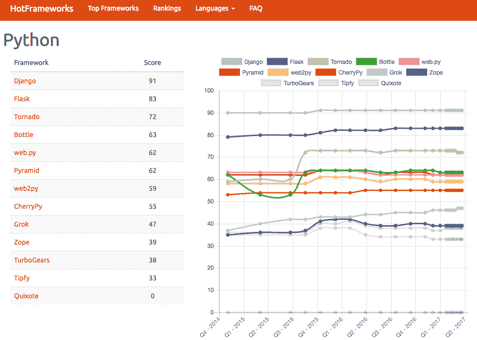
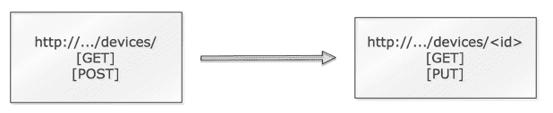

# 九、使用 Python 构建网络 Web 服务

在前面的章节中，我们是各种工具提供的 API 的消费者。在[第三章](03.html)*API 和意图驱动网络*中，我们看到我们可以使用`HTTP POST`方法在`http://<your router ip>/ins`URL 处使用嵌入体内的`CLI`命令来远程执行 Cisco Nexus 设备上的命令；然后，设备返回命令执行输出作为返回。在[第 8 章](08.html)*使用 Python 进行网络监控–第 2 部分*中，我们使用`GET`方法在`http://<your host ip>:8008/version`使用空主体检索 sFlow RT 软件的版本。这些交换是 RESTful web 服务的示例。

根据维基百科（[https://en.wikipedia.org/wiki/Representational_state_transfer](https://en.wikipedia.org/wiki/Representational_state_transfer) ：

"Representational state transfer (REST) or RESTful web services is one way of providing interoperability between computer systems on the internet. REST-compliant web services allow requesting systems to access and manipulate the textual representation of web resources using a uniform and predefined set of stateless operations."

如前所述，使用 HTTP 协议的 RESTWeb 服务只是 web 上许多信息交换方法之一；其他形式的 web 服务也存在。然而，它是当今最常用的 web 服务，相关的`GET`、`POST`、`PUT`和`DELETE`动词作为预定义的信息交换方式。

使用 RESTful 服务的一个优点是，它可以让您在向用户提供服务的同时对用户隐藏内部操作。例如，在 sFlow RT 的情况下，如果我们要登录到安装软件的设备，我们需要对该工具有更深入的了解，以便知道在哪里检查软件版本。然而，通过以 URL 的形式提供资源，软件从请求者那里抽象出版本检查操作，使得操作更加简单。该抽象还提供了一层安全性，因为它现在只能在需要时打开端点。

作为网络世界的主人，RESTful web 服务提供了许多我们可以享受的显著好处，例如：

*   您可以通过学习网络操作的内部内容来抽象请求者。例如，我们可以提供一个 web 服务来查询交换机版本，而无需请求者知道所需的确切 CLI 命令或 API 格式。
*   我们可以整合和定制专门适合我们网络需求的操作，例如升级所有机架顶部交换机的资源。
*   我们可以通过只在需要时公开操作来提供更好的安全性。例如，我们可以向核心网络设备提供只读 URL（`GET`），向接入级交换机提供读写 URL（`GET`/`POST`/`PUT`/`DELETE`）。

在本章中，我们将使用最流行的 Python web 框架之一**Flask**，为我们的网络创建我们自己的 REST web 服务。在本章中，我们将了解以下内容：

*   比较 pythonweb 框架
*   烧瓶简介
*   涉及静态网络内容的操作
*   涉及动态网络操作的操作

让我们先看看可用的 Python web 框架以及选择 Flask 的原因。

# 比较 pythonweb 框架

Python 以其众多的 web 框架而闻名。PyCon 上有一个流传的笑话，就是如果不使用任何 Python web 框架，就永远无法作为全职 Python 开发人员工作。Django 是最流行的 Python 框架之一，它甚至每年都会召开一次名为 DjangoCon 的会议，每年吸引数百名与会者。如果您在[上对 Python web 框架进行排序 https://hotframeworks.com/languages/python](https://hotframeworks.com/languages/python) 您可以看到，在 Python 和 web 框架方面并不缺少选择：



Python web frameworks ranking

有这么多选项可供选择，我们应该选择哪种框架？显然，自己尝试所有的框架将非常耗时。关于哪个 web 框架更好的问题也是 web 开发人员热衷的话题。如果你在任何论坛上问这个问题，比如 Quora，或者在 Reddit 上搜索，准备好接受一些非常固执己见的答案和激烈的辩论。

Speaking of Quora and Reddit, here's an interesting fact: both Quora and Reddit were written in Python. Reddit uses Pylons ([https://www.reddit.com/wiki/faq#wiki_so_what_python_framework_do_you_use.3F](https://www.reddit.com/wiki/faq#wiki_so_what_python_framework_do_you_use.3F.)), while Quora started with Pylons but replaced a portion of the framework with their in-house code ([https://www.quora.com/What-languages-and-frameworks-are-used-to-code-Quora](https://www.quora.com/What-languages-and-frameworks-are-used-to-code-Quora)).

当然，我对编程语言（Python！）和 web 框架（Flask！）有自己的偏好。在这一节中，我希望向你们传达我选择其中一个而不是另一个的理由。让我们从前面的 HotFrameworks 列表中选择前两个框架并进行比较：

*   **Django**：自诩为“有期限的完美主义者的 web 框架”是一个高级 Python web 框架，鼓励快速开发和干净实用的设计（[https://www.djangoproject.com/](https://www.djangoproject.com/) ）。它是一个带有预构建代码的大型框架，提供了管理面板和内置内容管理。
*   **烧瓶**：这是 Python 的一个微框架，基于 Werkzeug、Jinja2 和善意（[）http://flask.pocoo.org/](http://flask.pocoo.org/) ）。作为一个微框架，Flask 旨在保持核心的小型化，并在需要时易于扩展。微框架中的“微型”并不意味着烧瓶缺乏功能，也不意味着它不能在生产环境中工作。

就我个人而言，我发现 Django 有点难以扩展，而且大多数时候，我只使用了一小部分预构建代码。Django 框架对应该如何做也有强烈的意见；对它的任何偏离有时都会让用户感觉他们在“与框架抗争”。例如，如果您查看 Django 数据库文档，（[https://docs.djangoproject.com/en/2.1/ref/databases/](https://docs.djangoproject.com/en/2.1/ref/databases/) ），您会注意到该框架支持许多不同的 SQL 数据库。然而，它们都是 SQL 数据库的变体，如 MySQL、PostgreSQL、SQLite 等。如果您想使用 NoSQL 数据库，如 MongoDB 或 CouchDB，该怎么办？这也许是可能的，但可能会把你留在你自己的手中。作为一个固执己见的框架当然不是一件坏事，它只是一个观点问题（没有双关语的意图）。

保持核心代码小并在需要时扩展它的想法对我很有吸引力。要启动并运行 Flask 的文档中的初始示例仅包含八行代码，即使您没有任何先前的经验，也很容易理解。由于 Flask 是在考虑扩展的情况下构建的，所以编写自己的扩展（如 decorator）非常容易。尽管它是一个微框架，Flask 核心仍然包括必要的组件，例如开发服务器、调试器、与单元测试的集成、RESTful 请求调度等等，以使您能够开箱即用。正如您所看到的，除了 Django 之外，Flask 在某种程度上是第二流行的 Python 框架。社区贡献、支持和快速发展带来的人气有助于进一步扩大其影响范围。

出于上述原因，我认为 Flask 是构建网络 web 服务的理想选择。

# 烧瓶和实验室设置

在本章中，我们将使用`virtualenv`隔离我们将要工作的环境。顾名思义，virtualenv 是一种创建虚拟环境的工具。它可以将不同项目所需的依赖项保留在不同的位置，同时保持全局站点包的干净。换句话说，当您在虚拟环境中安装 Flask 时，它只安装在本地`virtualenv`项目目录中，而不安装在全局站点包中。这使得将代码移植到其他地方非常容易

您以前在使用 Python 时可能已经遇到过`virtualenv`，因此我们将快速完成此过程。如果您还没有，请在网上随意挑选一本优秀的教程，例如[http://docs.python-guide.org/en/latest/dev/virtualenvs/](http://docs.python-guide.org/en/latest/dev/virtualenvs/) 。

要使用，我们首先需要安装`virtualenv`：

```py
# Python 3
$ sudo apt-get install python3-venv
$ python3 -m venv venv

# Python 2
$ sudo apt-get install python-virtualenv
$ virtualenv venv-python2
```

继续执行的命令使用`venv`模块（`-m venv`获取一个包含完整 Python 解释器的`venv`文件夹。我们可以使用`source venv/bin/activate`和`deactivate`进出本地 Python 环境：

```py
$ source venv/bin/activate
(venv) $ python
$ which python
/home/echou/Master_Python_Networking_second_edition/Chapter09/venv/bin/python
$ python
Python 3.5.2 (default, Nov 23 2017, 16:37:01)
[GCC 5.4.0 20160609] on linux
Type "help", "copyright", "credits" or "license" for more information.
>>>
>>> exit()
(venv) $ deactivate
```

在本章中，我们将安装许多 Python 软件包。为了让生活更轻松，我在书的 GitHub 存储库中包含了一个`requirements.txt`文件；我们可以使用它安装所有必要的软件包（记住激活你的 virtualenv）。在过程结束时，您应该看到正在下载并成功安装的软件包：

```py
(venv) $ pip install -r requirements.txt
Collecting Flask==0.10.1 (from -r requirements.txt (line 1))
  Downloading https://files.pythonhosted.org/packages/db/9c/149ba60c47d107f85fe52564133348458f093dd5e6b57a5b60ab9ac517bb/Flask-0.10.1.tar.gz (544kB)
    100% |████████████████████████████████| 552kB 2.0MB/s
Collecting Flask-HTTPAuth==2.2.1 (from -r requirements.txt (line 2))
  Downloading https://files.pythonhosted.org/packages/13/f3/efc053c66a7231a5a38078a813aee06cd63ca90ab1b3e269b63edd5ff1b2/Flask-HTTPAuth-2.2.1.tar.gz
... <skip>
  Running setup.py install for Pygments ... done
  Running setup.py install for python-dateutil ... done
Successfully installed Flask-0.10.1 Flask-HTTPAuth-2.2.1 Flask-SQLAlchemy-1.0 Jinja2-2.7.3 MarkupSafe-0.23 Pygments-1.6 SQLAlchemy-0.9.6 Werkzeug-0.9.6 httpie-0.8.0 itsdangerous-0.24 python-dateutil-2.2 requests-2.3.0 six-1.11.0 
```

对于我们的网络拓扑，我们将使用一个简单的四节点网络，如下所示：


Lab topology

让我们来看看下一部分的烧瓶。

Please note that, from here on out, I will assume that you will always execute from the virtual environment and that you have installed the necessary packages in the `requirements.txt` file.

# 烧瓶简介

和大多数流行的开源项目一样，Flask 有非常好的文档，可以在[上找到 http://flask.pocoo.org/docs/0.10/](http://flask.pocoo.org/docs/0.10/) 。如果其中任何一个例子不清楚，您可以在项目文档中找到答案。

I would also highly recommend Miguel Grinberg's ([https://blog.miguelgrinberg.com/](https://blog.miguelgrinberg.com/)) work related to Flask. His blog, book, and video training have taught me a lot about Flask. In fact, Miguel's class *Building Web APIs with Flask* inspired me to write this chapter. You can take a look at his published code on GitHub: [https://github.com/miguelgrinberg/oreilly-flask-apis-video](https://github.com/miguelgrinberg/oreilly-flask-apis-video).

我们的第一个烧瓶应用程序包含在一个文件中，`chapter9_1.py`：

```py
from flask import Flask
app = Flask(__name__)

@app.route('/')
def hello_networkers():
    return 'Hello Networkers!'

if __name__ == '__main__':
    app.run(host='0.0.0.0', debug=True)
```

这几乎总是您最初的设计模式。我们创建一个 Flask 类的实例，第一个参数作为应用程序模块包的名称。在这种情况下，我们使用了单个模块；在您自己执行此操作时，键入您选择的名称，以指示它是作为应用程序启动还是作为模块导入。然后我们使用路由装饰器告诉 Flask 哪个 URL 应该由`hello_networkers()`函数处理；在本例中，我们指出了根路径。我们以通常的名称（[结束文件 https://docs.python.org/3.5/library/__main__.html](https://docs.python.org/3.5/library/__main__.html) 。我们只添加了主机和调试选项，这允许更详细的输出，还允许我们监听主机的所有接口（默认情况下，它只监听环回）。我们可以使用开发服务器运行此应用程序：

```py
(venv) $ python chapter9_1.py
 * Running on http://0.0.0.0:5000/
 * Restarting with reloader
```

现在我们已经有了一个正在运行的服务器，让我们用 HTTP 客户机测试服务器响应。

# HTTPie 客户端

我们已经安装了 HTTPie（[https://httpie.org/](https://httpie.org/) 作为安装的一部分，从读取`requirements.txt`文件开始。虽然这本书是以黑白文本打印的，所以它不会显示在这里，但在您的安装中，您可以看到 HTTPie 对于 HTTP 事务有更好的语法突出显示。它还与 RESTful HTTP 服务器进行了更直观的命令行交互。我们可以使用它来测试我们的第一个 Flask 应用程序（下面是关于 HTTPie 的更多示例）：

```py
$ http GET http://172.16.1.173:5000/
HTTP/1.0 200 OK
Content-Length: 17
Content-Type: text/html; charset=utf-8
Date: Wed, 22 Mar 2017 17:37:12 GMT
Server: Werkzeug/0.9.6 Python/3.5.2

Hello Networkers!
```

Alternatively, you can also use the `-i` switch with curl to see the HTTP headers: `curl -i http://172.16.1.173:5000/`.

我们将使用`HTTPie`作为本章的客户；值得花一两分钟来看看它的用法。我们将使用免费网站 HTTP-Bin（[https://httpbin.org/](https://httpbin.org/) 显示`HTTPie`的用法。`HTTPie`的用法遵循以下简单模式：

```py
$ http [flags] [METHOD] URL [ITEM]
```

按照前面的模式，`GET`请求非常简单，正如我们在 Flask 开发服务器上看到的：

```py
$ http GET https://httpbin.org/user-agent
...
{
 "user-agent": "HTTPie/0.8.0"
}
```

JSON 是`HTTPie`的默认隐式内容类型。如果 HTTP 正文只包含字符串，则不需要其他操作。如果需要应用非字符串 JSON 字段，请使用`:=`或其他记录的特殊字符：

```py
$ http POST https://httpbin.org/post name=eric twitter=at_ericchou married:=true 
HTTP/1.1 200 OK
...
Content-Type: application/json
...
{
 "headers": {
...
 "User-Agent": "HTTPie/0.8.0"
 },
 "json": {
 "married": true,
 "name": "eric",
 "twitter": "at_ericchou"
 },
 ...
 "url": "https://httpbin.org/post"
}
```

正如您所看到的，`HTTPie`是对传统 curl 语法的一个重大改进，它使测试 RESTAPI 变得轻而易举。

More usage examples are available at [https://httpie.org/doc#usage](https://httpie.org/doc#usage.).

回到我们的 Flask 程序，API 构建的很大一部分是基于 URL 路由流的。让我们更深入地看一下装饰器。

# URL 路由

我们添加了两个附加功能，并将它们与`chapter9_2.py`中相应的`app.route()`路线配对：

```py
$ cat chapter9_2.py
from flask import Flask
app = Flask(__name__)

@app.route('/')
def index():
    return 'You are at index()'

@app.route('/routers/')
def routers():
    return 'You are at routers()'

if __name__ == '__main__':
    app.run(host='0.0.0.0', debug=True)
```

结果是将不同的端点传递给不同的函数。我们可以通过两个`http`请求来验证这一点：

```py
# Server
$ python chapter9_2.py

# Client
$ http GET http://172.16.1.173:5000/
...

You are at index()

$ http GET http://172.16.1.173:5000/routers/
...

You are at routers()
```

当然，如果我们必须一直保持静态，那么路由将非常有限。有几种方法可以将变量从 URL 传递到 Flask；在下一节中，我们将看一个这样的例子。

# URL 变量

如前所述，我们还可以将变量传递给 URL，如`chapter9_3.py`中讨论的示例所示：

```py
...
@app.route('/routers/<hostname>')
def router(hostname):
    return 'You are at %s' % hostname

@app.route('/routers/<hostname>/interface/<int:interface_number>')
def interface(hostname, interface_number):
    return 'You are at %s interface %d' % (hostname, interface_number)
...
```

注意，在`/routers/<hostname>`URL 中，我们将`<hostname>`变量作为字符串传递；`<int:interface_number>`将指定变量只能是整数：

```py
$ http GET http://172.16.1.173:5000/routers/host1
...
You are at host1

$ http GET http://172.16.1.173:5000/routers/host1/interface/1
...
You are at host1 interface 1

# Throws exception
$ http GET http://172.16.1.173:5000/routers/host1/interface/one
HTTP/1.0 404 NOT FOUND
...
<!DOCTYPE HTML PUBLIC "-//W3C//DTD HTML 3.2 Final//EN">
<title>404 Not Found</title>
<h1>Not Found</h1>
<p>The requested URL was not found on the server. If you entered the URL manually please check your spelling and try again.</p>
```

转换器包括整数、浮点和路径（它接受斜杠）。

除了匹配静态路由，我们还可以动态生成 URL。如果我们事先不知道端点变量，或者端点基于其他条件，例如从数据库查询的值，那么这非常有用。让我们来看一个例子。

# URL 生成

在`chapter9_4.py`中，我们希望在代码中以`'/<hostname>/list_interfaces'`的形式动态创建一个 URL：

```py
from flask import Flask, url_for
...
@app.route('/<hostname>/list_interfaces')
def device(hostname):
    if hostname in routers:
        return 'Listing interfaces for %s' % hostname
    else:
        return 'Invalid hostname'

routers = ['r1', 'r2', 'r3']
for router in routers:
    with app.test_request_context():
        print(url_for('device', hostname=router))
...
```

执行后，您将拥有一个良好的逻辑 URL，如下所示：

```py
(venv) $ python chapter9_4.py
/r1/list_interfaces
/r2/list_interfaces
/r3/list_interfaces
 * Running on http://0.0.0.0:5000/
 * Restarting with reloader 
```

现在，您可以将`app.text_request_context()`视为演示目的所必需的虚拟`request`对象。如果您对当地环境感兴趣，请随时查看[http://werkzeug.pocoo.org/docs/0.14/local/](http://werkzeug.pocoo.org/docs/0.14/local/) 。

# jsonify 返回

Flask 中的另一个节省时间的方法是`jsonify()`返回，它包装`json.dumps()`并将 JSON 输出转换为一个`response`对象，HTTP 头中的内容类型为`application/json`。我们可以稍微调整最后一个脚本，就像我们在`chapter9_5.py`中所做的那样：

```py
from flask import Flask, jsonify

app = Flask(__name__)

@app.route('/routers/<hostname>/interface/<int:interface_number>')
def interface(hostname, interface_number):
    return jsonify(name=hostname, interface=interface_number)

if __name__ == '__main__':
    app.run(host='0.0.0.0', debug=True)
```

我们将看到返回的结果是一个带有适当标题的`JSON`对象：

```py
$ http GET http://172.16.1.173:5000/routers/r1/interface/1
HTTP/1.0 200 OK
Content-Length: 36
Content-Type: application/json
...

{
 "interface": 1,
 "name": "r1"
}
```

在 Flask 中查看了 URL 路由和`jsonify()`返回之后，我们现在准备为我们的网络构建一个 API。

# 网络资源 API

通常，您的网络由网络设备组成，一旦投入生产，这些设备不会有太多变化。例如，您将拥有核心设备、分发设备、脊椎、叶子、机架顶部交换机等。每个设备都具有某些特征和功能，您希望将它们保存在一个持久位置，以便以后可以轻松地检索它们。这通常是通过在数据库中存储数据来实现的。但是，您通常不希望让其他可能需要此信息的用户直接访问数据库；他们也不想学习所有复杂的 SQL 查询语言。对于这种情况，我们可以利用烧瓶和烧瓶的**烧瓶 SQLAlchemy**扩展。

You can learn more about Flask-SQLAlchemy at [http://flask-sqlalchemy.pocoo.org/2.1/](http://flask-sqlalchemy.pocoo.org/2.1/).

# 烧瓶炼金术

当然，SQLAlchemy 和 Flask 扩展分别是数据库抽象层和对象关系映射器。使用`Python`对象作为数据库是一种奇特的说法。为了简单起见，我们将使用 SQLite 作为数据库，它是一个平面文件，充当自包含的 SQL 数据库。我们将以`chapter9_db_1.py`的内容为例，使用 Flask SQLAlchemy 创建一个网络数据库，并在数据库中插入一个表条目。

首先，我们将创建一个 Flask 应用程序并加载 SQLAlchemy 的配置，例如数据库路径和名称，然后通过将应用程序传递给它来创建`SQLAlchemy`对象：

```py
from flask import Flask
from flask_sqlalchemy import SQLAlchemy

# Create Flask application, load configuration, and create
# the SQLAlchemy object
app = Flask(__name__)
app.config['SQLALCHEMY_DATABASE_URI'] = 'sqlite:///network.db'
db = SQLAlchemy(app)
```

然后我们可以创建一个`database`对象及其关联的主键和各个列：

```py
class Device(db.Model):
    __tablename__ = 'devices'
    id = db.Column(db.Integer, primary_key=True)
    hostname = db.Column(db.String(120), index=True)
    vendor = db.Column(db.String(40))

    def __init__(self, hostname, vendor):
        self.hostname = hostname
        self.vendor = vendor

    def __repr__(self):
        return '<Device %r>' % self.hostname
```

我们可以调用`database`对象，创建条目，并将它们插入到数据库表中。请记住，我们添加到会话中的任何内容都需要提交到数据库中才能永久保存：

```py
if __name__ == '__main__':
    db.create_all()
    r1 = Device('lax-dc1-core1', 'Juniper')
    r2 = Device('sfo-dc1-core1', 'Cisco')
    db.session.add(r1)
    db.session.add(r2)
    db.session.commit()
```

我们将运行 Python 脚本并检查数据库文件是否存在：

```py
$ python chapter9_db_1.py
$ ls network.db
network.db
```

我们可以使用交互式提示检查数据库表条目：

```py
>>> from flask import Flask
>>> from flask_sqlalchemy import SQLAlchemy
>>>
>>> app = Flask(__name__)
>>> app.config['SQLALCHEMY_DATABASE_URI'] = 'sqlite:///network.db'
>>> db = SQLAlchemy(app)
>>> from chapter9_db_1 import Device
>>> Device.query.all()
[<Device 'lax-dc1-core1'>, <Device 'sfo-dc1-core1'>]
>>> Device.query.filter_by(hostname='sfo-dc1-core1')
<flask_sqlalchemy.BaseQuery object at 0x7f1b4ae07eb8>
>>> Device.query.filter_by(hostname='sfo-dc1-core1').first()
<Device 'sfo-dc1-core1'>
```

我们还可以以相同的方式创建新条目：

```py
>>> r3 = Device('lax-dc1-core2', 'Juniper')
>>> db.session.add(r3)
>>> db.session.commit()
>>> Device.query.all()
[<Device 'lax-dc1-core1'>, <Device 'sfo-dc1-core1'>, <Device 'lax-dc1-core2'>]
```

# 网络内容 API

在深入讨论代码之前，让我们花一点时间考虑一下我们正在尝试创建的 API。规划 API 通常是艺术多于科学；这取决于你的情况和偏好。我下一步的建议绝对不是正确的方法，但就目前而言，请与我一起开始。

回想一下，在我们的图表中，我们有四个 Cisco IOSv 设备。让我们假设其中两个，`iosv-1`和`iosv-2`是脊椎的网络角色。另外两个设备，`iosv-3`和`iosv-4`作为 LEAF 在我们的网络服务中。这些显然是任意的选择，以后可以修改，但关键是我们希望提供有关网络设备的数据，并通过 API 公开它们。

为了简化操作，我们将创建两个 API：设备组 API 和单个设备 API：



Network content API

第一个 API 将是我们的`http://172.16.1.173/devices/`端点，它支持两种方法：`GET`和`POST`。`GET`请求将返回设备的当前列表，而具有正确 JSON 正文的`POST`请求将创建设备。当然，您可以选择使用不同的端点进行创建和查询，但在本设计中，我们选择通过 HTTP 方法区分这两个端点。

第二个 API 将以`http://172.16.1.173/devices/<device id>`的形式针对我们的设备。带有`GET`请求的 API 将显示我们输入数据库的设备的详细信息。`PUT`请求将使用更新修改条目。请注意，我们使用`PUT`而不是`POST`。这是典型的 HTTP API 用法；当我们需要修改现有条目时，我们将使用`PUT`而不是`POST`。

此时，您应该对 API 的外观有一个很好的了解。为了更好地可视化最终结果，在我们查看代码之前，我将跳过并快速显示最终结果

对`/devices/`API 的`POST`请求将允许您创建条目。在本例中，我希望创建具有以下属性的网络设备：主机名、环回 IP、管理 IP、角色、供应商以及它运行的操作系统：

```py
$ http POST http://172.16.1.173:5000/devices/ 'hostname'='iosv-1' 'loopback'='192.168.0.1' 'mgmt_ip'='172.16.1.225' 'role'='spine' 'vendor'='Cisco' 'os'='15.6'
HTTP/1.0 201 CREATED
Content-Length: 2
Content-Type: application/json
Date: Fri, 24 Mar 2017 01:45:15 GMT
Location: http://172.16.1.173:5000/devices/1
Server: Werkzeug/0.9.6 Python/3.5.2

{}
```

我可以对另外三个设备重复上述步骤：

```py
$ http POST http://172.16.1.173:5000/devices/ 'hostname'='iosv-2' 'loopback'='192.168.0.2' 'mgmt_ip'='172.16.1.226' 'role'='spine' 'vendor'='Cisco' 'os'='15.6'
...
$ http POST http://172.16.1.173:5000/devices/ 'hostname'='iosv-3', 'loopback'='192.168.0.3' 'mgmt_ip'='172.16.1.227' 'role'='leaf' 'vendor'='Cisco' 'os'='15.6'
...
$ http POST http://172.16.1.173:5000/devices/ 'hostname'='iosv-4', 'loopback'='192.168.0.4' 'mgmt_ip'='172.16.1.228' 'role'='leaf' 'vendor'='Cisco' 'os'='15.6'
```

如果我们可以在`GET`请求中使用相同的 API，我们将能够看到我们创建的网络设备列表：

```py
$ http GET http://172.16.1.173:5000/devices/
HTTP/1.0 200 OK
Content-Length: 188
Content-Type: application/json
Date: Fri, 24 Mar 2017 01:53:15 GMT
Server: Werkzeug/0.9.6 Python/3.5.2

{
 "device": [
 "http://172.16.1.173:5000/devices/1",
 "http://172.16.1.173:5000/devices/2",
 "http://172.16.1.173:5000/devices/3",
 "http://172.16.1.173:5000/devices/4"
 ]
}
```

同样，使用`/devices/<id>`的`GET`请求将返回与设备相关的特定信息：

```py
$ http GET http://172.16.1.173:5000/devices/1
HTTP/1.0 200 OK
Content-Length: 188
Content-Type: application/json
...
{
 "hostname": "iosv-1",
 "loopback": "192.168.0.1",
 "mgmt_ip": "172.16.1.225",
 "os": "15.6",
 "role": "spine",
 "self_url": "http://172.16.1.173:5000/devices/1",
 "vendor": "Cisco"
}
```

让我们假设我们已经将`r1`操作系统从`15.6`降级为`14.6`。我们可以使用`PUT`请求更新设备记录：

```py
$ http PUT http://172.16.1.173:5000/devices/1 'hostname'='iosv-1' 'loopback'='192.168.0.1' 'mgmt_ip'='172.16.1.225' 'role'='spine' 'vendor'='Cisco' 'os'='14.6'
HTTP/1.0 200 OK

# Verification
$ http GET http://172.16.1.173:5000/devices/1
...
{
 "hostname": "r1",
 "loopback": "192.168.0.1",
 "mgmt_ip": "172.16.1.225",
 "os": "14.6",
 "role": "spine",
 "self_url": "http://172.16.1.173:5000/devices/1",
 "vendor": "Cisco"
}
```

现在，让我们看看帮助创建前 API 的代码中的代码。在我看来，最酷的是，所有这些 API 都是在一个文件中完成的，包括数据库交互。稍后，当我们不再需要手头的 API 时，我们总是可以将组件分离出来，例如为数据库类创建一个单独的文件。

# 设备 API

`chapter9_6.py`文件以必要的导入开始。请注意，以下请求导入是来自客户端的`request`对象，而不是我们在前面章节中使用的请求包：

```py
from flask import Flask, url_for, jsonify, request
from flask_sqlalchemy import SQLAlchemy
# The following is deprecated but still used in some examples
# from flask.ext.sqlalchemy import SQLAlchemy
```

我们声明了一个`database`对象，其`id`作为`hostname`、`loopback`、`mgmt_ip`、`role`、`vendor`和`os`的主键和字符串字段：

```py
class Device(db.Model):
    __tablename__ = 'devices'
    id = db.Column(db.Integer, primary_key=True)
    hostname = db.Column(db.String(64), unique=True)
    loopback = db.Column(db.String(120), unique=True)
    mgmt_ip = db.Column(db.String(120), unique=True)
    role = db.Column(db.String(64))
    vendor = db.Column(db.String(64))
    os = db.Column(db.String(64))
```

`get_url()`函数从`url_for()`函数返回 URL。注意，调用的`get_device()`函数尚未在`'/devices/<int:id>'`路由下定义：

```py
def get_url(self):
    return url_for('get_device', id=self.id, _external=True)
```

`export_data()`和`import_data()`功能是彼此的镜像。当我们使用`GET`方法时，一个用于从数据库获取信息给用户（`export_data()`。另一种是当我们使用`POST`或`PUT`方法时，将用户的信息放入数据库（`import_data()`：

```py
def export_data(self):
    return {
        'self_url': self.get_url(),
        'hostname': self.hostname,
        'loopback': self.loopback,
        'mgmt_ip': self.mgmt_ip,
        'role': self.role,
        'vendor': self.vendor,
        'os': self.os
    }

def import_data(self, data):
    try:
        self.hostname = data['hostname']
        self.loopback = data['loopback']
        self.mgmt_ip = data['mgmt_ip']
        self.role = data['role']
        self.vendor = data['vendor']
        self.os = data['os']
    except KeyError as e:
        raise ValidationError('Invalid device: missing ' + e.args[0])
    return self
```

有了`database`对象以及创建的导入和导出函数，URL 调度对于设备操作来说是简单的。`GET`请求将通过查询设备表中的所有条目返回设备列表，并返回每个条目的 URL。`POST`方法将使用`import_data()`函数，全局`request`对象作为输入。然后，它将添加设备并将信息提交到数据库：

```py
@app.route('/devices/', methods=['GET'])
def get_devices():
    return jsonify({'device': [device.get_url() 
                              for device in Device.query.all()]})

@app.route('/devices/', methods=['POST'])
def new_device():
    device = Device()
    device.import_data(request.json)
    db.session.add(device)
    db.session.commit()
    return jsonify({}), 201, {'Location': device.get_url()}
```

如果您查看`POST`方法，返回的主体是一个空的 JSON 主体，状态代码`201`（已创建）以及额外的头：

```py
HTTP/1.0 201 CREATED
Content-Length: 2
Content-Type: application/json
Date: ...
Location: http://172.16.1.173:5000/devices/4
Server: Werkzeug/0.9.6 Python/3.5.2
```

让我们看看查询和返回与单个设备有关的信息的 API。

# 设备 ID API

单个设备的路由指定 ID 应该是一个整数，这可以作为我们对错误请求的第一道防线。这两个端点遵循与我们的`/devices/`端点相同的设计模式，其中我们使用相同的`import`和`export`功能：

```py
@app.route('/devices/<int:id>', methods=['GET'])
def get_device(id):
    return jsonify(Device.query.get_or_404(id).export_data())

@app.route('/devices/<int:id>', methods=['PUT'])
def edit_device(id):
    device = Device.query.get_or_404(id)
    device.import_data(request.json)
    db.session.add(device)
    db.session.commit()
    return jsonify({})
```

注意`query_or_404()`方法；如果数据库查询对传入的 ID 返回负数，它提供了一种方便的返回`404 (not found)`的方法。这是一种非常优雅的方法，可以快速检查数据库查询。

最后，代码的最后一部分创建数据库表并启动 Flask development server：

```py
if __name__ == '__main__':
    db.create_all()
    app.run(host='0.0.0.0', debug=True)
```

这是本书中较长的 Python 脚本之一，这就是我们花更多时间详细解释它的原因。该脚本提供了一种方法来说明如何利用后端的数据库跟踪网络设备，并使用 Flask 将它们作为 API 公开给外部世界。

在下一节中，我们将了解如何使用 API 在单个设备或一组设备上执行异步任务。

# 网络动态操作

我们的 API 现在可以提供关于网络的静态信息；我们可以存储在数据库中的任何东西都可以返回给请求者。如果我们可以直接与网络交互，比如查询设备信息或将配置更改推送到设备上，那就太好了。

我们将利用[第 2 章](02.html)、*低层网络设备交互、*中已经看到的脚本，通过 Pexpect 与设备交互，开始这个过程。我们将稍微修改脚本，使其成为一个可以在`chapter9_pexpect_1.py`中重复使用的函数：

```py
# We need to install pexpect for our virtual env
$ pip install pexpect

$ cat chapter9_pexpect_1.py
import pexpect

def show_version(device, prompt, ip, username, password):
 device_prompt = prompt
 child = pexpect.spawn('telnet ' + ip)
 child.expect('Username:')
 child.sendline(username)
 child.expect('Password:')
 child.sendline(password)
 child.expect(device_prompt)
 child.sendline('show version | i V')
 child.expect(device_prompt)
 result = child.before
 child.sendline('exit')
 return device, result
```

我们可以通过交互式提示测试新功能：

```py
$ pip3 install pexpect
$ python
>>> from chapter9_pexpect_1 import show_version
>>> print(show_version('iosv-1', 'iosv-1#', '172.16.1.225', 'cisco', 'cisco'))
('iosv-1', b'show version | i V\r\nCisco IOS Software, IOSv Software (VIOS-ADVENTERPRISEK9-M), Version 15.6(3)M2, RELEASE SOFTWARE (fc2)\r\n')
>>> 
```

Make sure that your Pexpect script works before you proceed. The following code assumes that you have entered the necessary database information from the previous section. 

我们可以在`chapter9_7.py`中新增查询设备版本的 API：

```py
from chapter9_pexpect_1 import show_version
...
@app.route('/devices/<int:id>/version', methods=['GET'])
def get_device_version(id):
    device = Device.query.get_or_404(id)
    hostname = device.hostname
    ip = device.mgmt_ip
    prompt = hostname+"#"
    result = show_version(hostname, prompt, ip, 'cisco', 'cisco')
    return jsonify({"version": str(result)})
```

结果将返回给请求者：

```py
$ http GET http://172.16.1.173:5000/devices/4/version
HTTP/1.0 200 OK
Content-Length: 210
Content-Type: application/json
Date: Fri, 24 Mar 2017 17:05:13 GMT
Server: Werkzeug/0.9.6 Python/3.5.2

{
 "version": "('iosv-4', b'show version | i V\r\nCisco IOS Software, IOSv Software (VIOS-ADVENTERPRISEK9-M), Version 15.6(2)T, RELEASE SOFTWARE (fc2)\r\nProcessor board ID 9U96V39A4Z12PCG4O6Y0Q\r\n')"
}
```

我们还可以添加另一个端点，它允许我们根据多个设备的公共字段在多个设备上执行批量操作。在以下示例中，端点将采用 URL 中的`device_role`属性，并将其与适当的设备匹配：

```py
@app.route('/devices/<device_role>/version', methods=['GET'])
def get_role_version(device_role):
    device_id_list = [device.id for device in Device.query.all() if device.role == device_role]
    result = {}
    for id in device_id_list:
        device = Device.query.get_or_404(id)
        hostname = device.hostname
        ip = device.mgmt_ip
        prompt = hostname + "#"
        device_result = show_version(hostname, prompt, ip, 'cisco', 'cisco')
        result[hostname] = str(device_result)
    return jsonify(result)
```

Of course, looping through all the devices in `Device.query.all()` is not efficient, as in the preceding code. In production, we will use a SQL query that specifically targets the role of the device.

当我们使用 REST API 时，我们可以看到可以同时查询所有 spine 和 leaf 设备：

```py
$ http GET http://172.16.1.173:5000/devices/spine/version
HTTP/1.0 200 OK
...
{
 "iosv-1": "('iosv-1', b'show version | i V\r\nCisco IOS Software, IOSv Software (VIOS-ADVENTERPRISEK9-M), Version 15.6(2)T, RELEASE SOFTWARE (fc2)\r\n')",
 "iosv-2": "('iosv-2', b'show version | i V\r\nCisco IOS Software, IOSv Software (VIOS-ADVENTERPRISEK9-M), Version 15.6(2)T, RELEASE SOFTWARE (fc2)\r\nProcessor board ID 9T7CB2J2V6F0DLWK7V48E\r\n')"
}

$ http GET http://172.16.1.173:5000/devices/leaf/version
HTTP/1.0 200 OK
...
{
 "iosv-3": "('iosv-3', b'show version | i V\r\nCisco IOS Software, IOSv Software (VIOS-ADVENTERPRISEK9-M), Version 15.6(2)T, RELEASE SOFTWARE (fc2)\r\nProcessor board ID 9MGG8EA1E0V2PE2D8KDD7\r\n')",
 "iosv-4": "('iosv-4', b'show version | i V\r\nCisco IOS Software, IOSv Software (VIOS-ADVENTERPRISEK9-M), Version 15.6(2)T, RELEASE SOFTWARE (fc2)\r\nProcessor board ID 9U96V39A4Z12PCG4O6Y0Q\r\n')"
}
```

如图所示，新的 API 端点实时查询设备并将结果返回给请求者。当您可以保证在事务的超时值（默认情况下为 30 秒）内响应操作时，或者如果您在操作完成之前对 HTTP 会话超时没有意见，那么这种方法就相对有效。处理超时问题的一种方法是异步执行任务。我们将在下一节中介绍如何做到这一点。

# 异步操作

在我看来，异步操作是 Flask 的一个高级主题。幸运的是，米格尔·格林伯格（[https://blog.miguelgrinberg.com/](https://blog.miguelgrinberg.com/) ），我非常喜欢他的作品，在他的博客和 GitHub 上提供了许多帖子和例子。对于异步操作，`chapter9_8.py`中的示例代码引用了`Raspberry Pi`文件（[中的 Miguel 的 GitHub 代码 https://github.com/miguelgrinberg/oreilly-flask-apis-video/blob/master/camera/camera.py](https://github.com/miguelgrinberg/oreilly-flask-apis-video/blob/master/camera/camera.py) 用于背景装饰。我们将从导入更多模块开始：

```py
from flask import Flask, url_for, jsonify, request,
    make_response, copy_current_request_context
...
import uuid
import functools
from threading import Thread
```

后台装饰程序接收一个函数，并将其作为后台任务运行，使用线程和 UUID 作为任务 ID。它返回状态代码`202`accepted 和新资源的位置，供请求者检查。我们将创建一个用于状态检查的新 URL：

```py
@app.route('/status/<id>', methods=['GET'])
def get_task_status(id):
    global background_tasks
    rv = background_tasks.get(id)
    if rv is None:
        return not_found(None)

    if isinstance(rv, Thread):
        return jsonify({}), 202, {'Location': url_for('get_task_status', id=id)}

    if app.config['AUTO_DELETE_BG_TASKS']:
        del background_tasks[id]
    return rv
```

一旦我们检索到资源，它就会被删除。这是通过在应用程序顶部将`app.config['AUTO_DELETE_BG_TASKS']`设置为`true`完成的。我们将在不更改代码其他部分的情况下将此装饰器添加到版本端点，因为所有的复杂性都隐藏在装饰器中（这有多酷！）

```py
@app.route('/devices/<int:id>/version', methods=['GET'])
@background
def get_device_version(id):
    device = Device.query.get_or_404(id)
...

@app.route('/devices/<device_role>/version', methods=['GET'])
@background
def get_role_version(device_role):
    device_id_list = [device.id for device in Device.query.all() if device.role == device_role]
...
```

最终结果是一个分为两部分的过程。我们将对端点执行`GET`请求并接收位置头：

```py
$ http GET http://172.16.1.173:5000/devices/spine/version
HTTP/1.0 202 ACCEPTED
Content-Length: 2
Content-Type: application/json
Date: <skip>
Location: http://172.16.1.173:5000/status/d02c3f58f4014e96a5dca075e1bb65d4
Server: Werkzeug/0.9.6 Python/3.5.2

{}
```

然后，我们可以向该位置发出第二个请求以检索结果：

```py
$ http GET http://172.16.1.173:5000/status/d02c3f58f4014e96a5dca075e1bb65d4
HTTP/1.0 200 OK
Content-Length: 370
Content-Type: application/json
Date: <skip>
Server: Werkzeug/0.9.6 Python/3.5.2

{
 "iosv-1": "('iosv-1', b'show version | i V\r\nCisco IOS Software, IOSv Software (VIOS-ADVENTERPRISEK9-M), Version 15.6(2)T, RELEASE SOFTWARE (fc2)\r\n')",
 "iosv-2": "('iosv-2', b'show version | i V\r\nCisco IOS Software, IOSv Software (VIOS-ADVENTERPRISEK9-M), Version 15.6(2)T, RELEASE SOFTWARE (fc2)\r\nProcessor board ID 9T7CB2J2V6F0DLWK7V48E\r\n')"
}
```

为了验证在资源未就绪时返回状态代码`202`，我们将使用以下脚本`chapter9_request_1.py`立即向新资源发出请求：

```py
import requests, time

server = 'http://172.16.1.173:5000'
endpoint = '/devices/1/version'

# First request to get the new resource
r = requests.get(server+endpoint)
resource = r.headers['location']
print("Status: {} Resource: {}".format(r.status_code, resource))

# Second request to get the resource status 
r = requests.get(resource)
print("Immediate Status Query to Resource: " + str(r.status_code))

print("Sleep for 2 seconds")
time.sleep(2)
# Third request to get the resource status
r = requests.get(resource)
print("Status after 2 seconds: " + str(r.status_code))
```

正如您在结果中看到的，当资源仍在后台运行时，返回状态代码为`202`：

```py
$ python chapter9_request_1.py
Status: 202 Resource: http://172.16.1.173:5000/status/1de21f5235c94236a38abd5606680b92
Immediate Status Query to Resource: 202
Sleep for 2 seconds
Status after 2 seconds: 200
```

我们的 API 进展顺利！因为我们的网络资源对我们来说很有价值，所以我们应该确保只有授权人员才能访问 API。在下一节中，我们将向 API 添加基本的安全措施。

# 安全

对于用户身份验证安全性，我们将使用 Miguel Grinberg 编写的 Flask 的`httpauth`扩展，以及 Werkzeug 中的密码函数。在本章开始时，`httpauth`扩展应作为`requirements.txt`安装的一部分进行安装。说明安全特性的新文件名为`chapter9_9.py`；我们将从几个模块导入开始：

```py
...
from werkzeug.security import generate_password_hash, check_password_hash
from flask.ext.httpauth import HTTPBasicAuth
...
```

我们将创建一个`HTTPBasicAuth`对象以及`user database`对象。注意，在用户创建过程中，我们将传递密码值；然而，我们只存储了`password_hash`而不是`password`本身。这确保我们没有为用户存储明文密码：

```py
auth = HTTPBasicAuth()

class User(db.Model):
    __tablename__ = 'users'
    id = db.Column(db.Integer, primary_key=True)
    username = db.Column(db.String(64), index=True)
    password_hash = db.Column(db.String(128))

    def set_password(self, password):
        self.password_hash = generate_password_hash(password)

    def verify_password(self, password):
        return check_password_hash(self.password_hash, password)
```

`auth`对象有一个`verify_password`装饰符，我们可以使用它，还有 Flask 的`g`全局上下文对象，该对象是在请求启动密码验证时创建的。因为`g`是全局的，如果我们将用户保存到`g`变量，它将贯穿整个事务：

```py
@auth.verify_password
def verify_password(username, password):
    g.user = User.query.filter_by(username=username).first()
    if g.user is None:
        return False
    return g.user.verify_password(password)
```

在调用任何 API 端点之前，都可以使用一个方便的`before_request`处理程序。我们将把`auth.login_required`装饰器与`before_request`处理程序结合起来，应用于所有 API 路由：

```py
@app.before_request
@auth.login_required
def before_request():
    pass

```

最后，我们将使用`unauthorized`错误处理程序为`401`未授权错误返回一个`response`对象：

```py
@auth.error_handler
def unauthorized():
    response = jsonify({'status': 401, 'error': 'unauthorized', 
                        'message': 'please authenticate'})

    response.status_code = 401
    return response
```

在测试用户身份验证之前，我们需要在数据库中创建用户：

```py
>>> from chapter9_9 import db, User
>>> db.create_all()
>>> u = User(username='eric')
>>> u.set_password('secret')
>>> db.session.add(u)
>>> db.session.commit()
>>> exit()
```

启动 Flask 开发服务器后，尝试发出请求，就像我们之前所做的那样。您应该看到，这一次，服务器将拒绝请求，并出现一个`401`未经授权的错误：

```py
$ http GET http://172.16.1.173:5000/devices/
HTTP/1.0 401 UNAUTHORIZED
Content-Length: 81
Content-Type: application/json
Date: <skip>
Server: Werkzeug/0.9.6 Python/3.5.2
WWW-Authenticate: Basic realm="Authentication Required"

{
 "error": "unauthorized",
 "message": "please authenticate",
 "status": 401
}
```

我们现在需要为请求提供身份验证标头：

```py
$ http --auth eric:secret GET http://172.16.1.173:5000/devices/
HTTP/1.0 200 OK
Content-Length: 188
Content-Type: application/json
Date: <skip>
Server: Werkzeug/0.9.6 Python/3.5.2

{
 "device": [
 "http://172.16.1.173:5000/devices/1",
 "http://172.16.1.173:5000/devices/2",
 "http://172.16.1.173:5000/devices/3",
 "http://172.16.1.173:5000/devices/4"
 ]
}
```

我们现在已经为我们的网络设置了一个像样的 RESTful API。用户现在将能够与 API 交互，而不是与网络设备交互。他们可以查询网络的静态内容，并为单个设备或一组设备执行任务。我们还添加了基本的安全措施，以确保只有我们创建的用户才能从我们的 API 检索信息。最酷的是，这一切都是在一个文件中完成的，只需不到 250 行代码（如果减去注释，则不到 200 行）！ 

我们现在已经从我们的网络中抽象出底层的供应商 API，并用我们自己的 RESTful API 替换它们。我们可以自由地使用后端所需的内容，例如 Pexpect，同时仍然为请求者提供统一的前端

让我们看看烧瓶的额外资源，这样我们就可以继续在 API 框架上构建。

# 额外资源

Flask 无疑是一个功能丰富的框架，它在功能和社区中不断发展。在本章中，我们已经讨论了很多主题，但我们仍然只触及了框架的表面。除了 API，您还可以将 Flask 用于 web 应用程序以及您的网站。我认为我们仍然可以对网络 API 框架进行一些改进：

*   在自己的文件中分离数据库和每个端点，以便代码更清晰，更容易进行故障排除。
*   从 SQLite 迁移到其他支持生产的数据库。
*   使用基于令牌的身份验证，而不是为每个事务传递用户名和密码。本质上，我们将在初始身份验证时收到一个到期时间有限的令牌，并将该令牌用于进一步的事务，直到到期。
*   将 FlaskAPI 应用程序部署到生产 web 服务器（如 Nginx）后面，并与 Python WSGI 服务器一起用于生产。
*   使用自动化过程控制系统，如监督员（[http://supervisord.org/](http://supervisord.org/) ），控制 Nginx 和 Python 脚本

显然，建议的改进方案因公司而异。例如，数据库和 web 服务器的选择可能会影响公司的技术偏好以及其他团队的输入。如果 API 仅在内部使用，并且已经实施了其他形式的安全性，则可能不需要使用基于令牌的身份验证。出于这些原因，我想为您提供额外的链接，作为额外的资源，如果您选择向前推进任何上述项目。

在考虑设计模式、数据库选项和常规功能时，以下是一些我觉得有用的链接：

*   烧瓶设计模式的最佳实践：[http://flask.pocoo.org/docs/0.10/patterns/](http://flask.pocoo.org/docs/0.10/patterns/)
*   烧瓶 API:[http://flask.pocoo.org/docs/0.12/api/](http://flask.pocoo.org/docs/0.12/api/)
*   部署选项：[http://flask.pocoo.org/docs/0.12/deploying/](http://flask.pocoo.org/docs/0.12/deploying/)

由于 Flask 的性质以及它依赖于小核心之外的扩展的事实，有时您可能会发现自己从一个文档跳到另一个文档。这可能会令人沮丧，但好处是您只需要知道您正在使用的扩展，我觉得从长远来看，这可以节省时间

# 总结

在本章中，我们开始着手为我们的网络构建 RESTAPI。我们研究了不同的流行 Python web 框架，即 Django 和 Flask，并对两者进行了比较和对比。通过选择 Flask，我们可以从小处着手，通过使用 Flask 扩展扩展扩展特性。

在我们的实验室中，我们使用虚拟环境将 Flask 安装基础从我们的全局站点包中分离出来。实验室网络由四个节点组成，其中两个节点被指定为脊椎路由器，而另外两个节点被指定为叶子路由器。我们了解了 Flask 的基本知识，并使用简单的 HTTPie 客户端测试了我们的 API 设置。

在 Flask 的不同设置中，我们特别强调 URL 调度以及 URL 变量，因为它们是请求者和 API 系统之间的初始逻辑。我们研究了如何使用 Flask SQLAlchemy 和 SQLite 来存储和返回本质上是静态的网络元素。对于操作任务，我们还创建了 API 端点，同时调用其他程序（如 Pexpect）来完成配置任务。我们通过在 API 中添加异步处理和用户身份验证来改进设置。在本章末尾，我们查看了一些附加的资源链接，我们可以按照这些链接添加更多的安全性和其他功能。

在[第 10 章](10.html)、*AWS 云网络*中，我们将转向使用**亚马逊网络服务**（**AWS**的云网络。