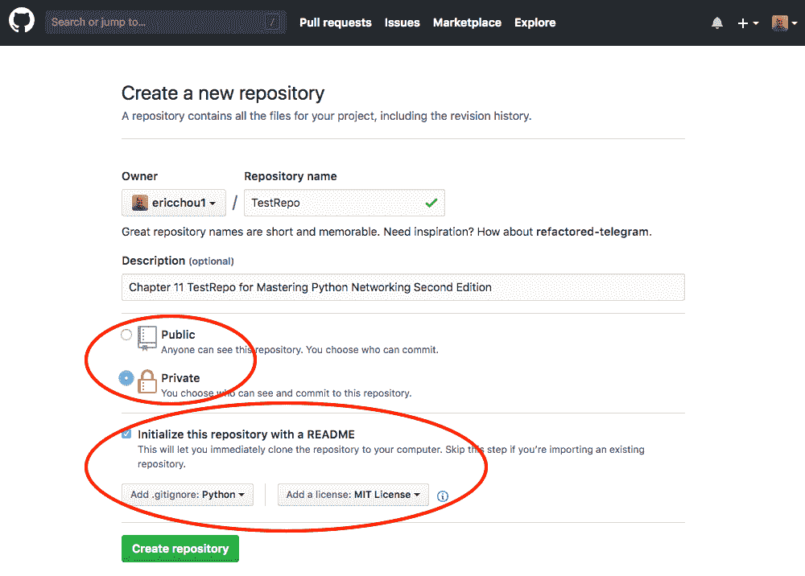
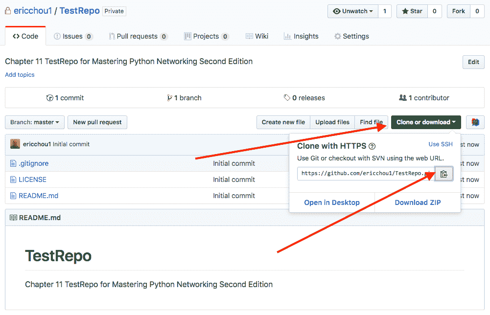
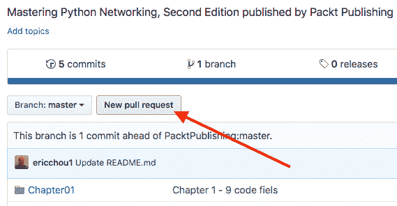
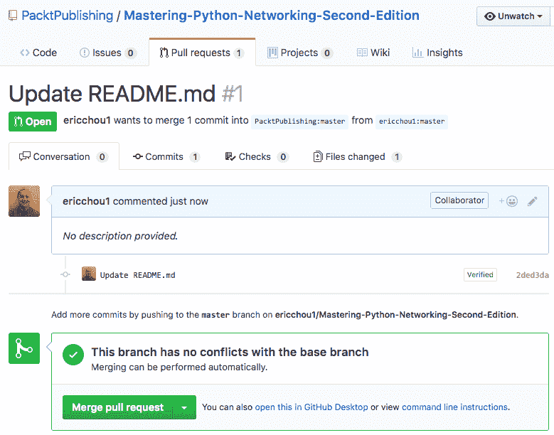
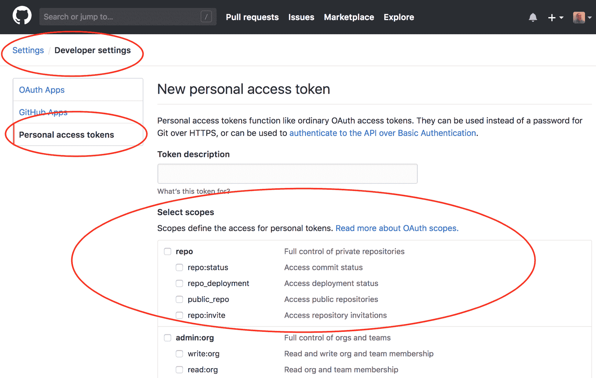
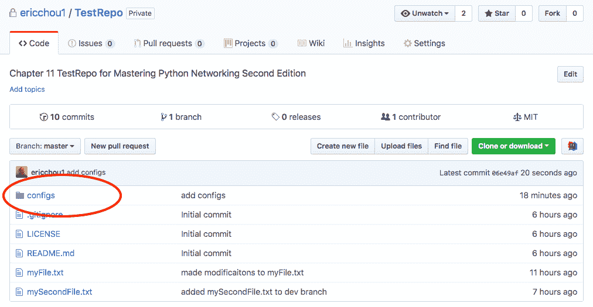
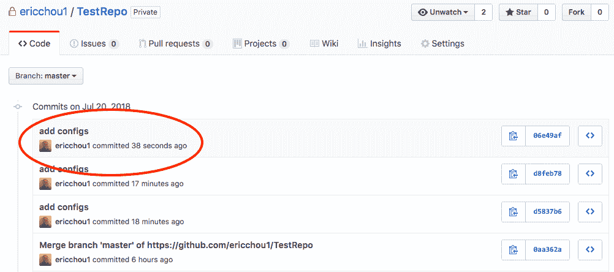

# 使用 Git

我们使用 Python、Ansible 和许多其他工具研究了网络自动化的各个方面。如果您一直遵循这些示例，那么在本书的前九章中，我们使用了 150 多个文件，其中包含 5300 多行代码。这对于那些主要使用命令行界面的网络工程师来说是非常好的！有了我们新的一套脚本和工具，我们现在已经准备好去完成我们的网络任务了，对吗？嗯，别那么快，我的网络忍者同伴

我们在代码文件方面面临的第一个任务是如何将它们保存在一个位置，以便我们和其他人可以检索和使用它们。理想情况下，此位置将是保存文件最新版本的唯一位置。在最初发布之后，我们可能会在将来添加功能并修复 bug，因此我们希望找到一种方法来跟踪这些更改，并保持最新的更改可供下载。如果新更改不起作用，我们希望回滚更改并反映文件历史记录中的差异。这将使我们对代码文件的演变有一个很好的了解

第二个问题是团队成员之间的协作过程。如果我们与其他网络工程师合作，我们将需要共同处理这些文件。这些文件可以是 Python 脚本、Ansible Playbook、Jinja2 模板、INI 样式的配置文件以及许多其他文件。关键是任何类型的基于文本的文件都应该使用团队中每个人都应该能够看到的多个输入进行跟踪

第三个问题是问责制。一旦我们有了一个允许多个输入和更改的系统，我们需要用适当的跟踪记录来标记这些更改，以反映更改的所有者。跟踪记录还应包括变更的简要原因，以便回顾历史的人员能够了解变更的原因

这些是版本控制（或源代码控制）系统试图解决的一些主要挑战。公平地说，版本控制可以以专用系统以外的形式存在。例如，如果我打开 Microsoft Word 程序，文件会不断保存自己，我可以及时返回以重新查看更改或回滚到以前的版本。我们在这里关注的版本控制系统是独立的软件工具，其主要目的是跟踪软件更改

在软件工程中，无论是专有的还是开源的，都不乏不同的源代码控制工具。一些比较流行的开源版本控制系统是 CVS、SVN、Mercurial 和 Git。在本章中，我们将重点介绍源代码控制系统**Git**，这是我们在本书中使用的许多`.software`软件包中下载的工具。我们将更深入地了解该工具。Git 实际上是许多大型开源项目的版本控制系统，包括 Python 和 Linux 内核

As of February 2017, the CPython development process has moved to GitHub. It was a work in progress since January 2015\. For more information, check out PEP 512 at [https://www.python.org/dev/peps/pep-0512/](https://www.python.org/dev/peps/pep-0512/). 

在深入研究 Git 的工作实例之前，让我们先来看看 Git 系统的历史和优点。

# Git 简介

Git 是由 Linux 内核的创建者 Linus Torvalds 于 2005 年 4 月创建的。凭着他干巴的智慧，他亲切地称这个工具为来自地狱的信息管理者。在接受 Linux 基金会的采访时，莱纳斯提到，他认为源代码管理只是计算机世界中最不有趣的事情。https://www.linuxfoundation.org/blog/10-years-of-git-an-interview-with-git-creator-linus-torvalds/ ）。尽管如此，他还是在 Linux 内核开发人员社区和 BitKeeper（他们当时使用的专有系统）之间发生分歧后创建了该工具

What does the name Git stand for? In British English slang, a Git is an insult denoting an unpleasant, annoying, childish person. With his dry humor, Linus said he is an egotistical bastard and that he named all of his projects after himself. First Linux, now Git. However, some suggested that the name is short for **Global Information Tracker** (**GIT**). You can be the judge. 

这个项目很快就完成了。在它创建十天后（是的，你读对了），Linus 觉得 Git 的基本思想是正确的，并开始用 Git 提交第一个 Linux 内核代码。正如他们所说，剩下的就是历史了。创建十多年后，它仍然满足 Linux 内核项目的所有期望。它接管了许多其他开源项目的版本控制系统，尽管在切换源代码控制系统时存在固有的惯性。在[托管 Mercurial 的 Python 代码多年之后 https://hg.python.org/](https://hg.python.org/) 项目于 2017 年 2 月在 GitHub 上切换为 Git

# Git 的好处

托管大型分布式开源项目（如 Linux 内核和 Python）的成功证明了 Git 的优势。考虑到 Git 是一个相对较新的源代码管理工具，人们不会倾向于切换到新工具，除非它提供了比旧工具更大的优势，这一点尤其重要。让我们看看 Git 的一些好处：

*   **分布式开发**：Git 离线支持私有存储库中的并行、独立、同步开发。将其与其他一些需要与中央存储库持续同步的版本控制系统进行比较；这为开发人员提供了更大的灵活性。
*   **规模可容纳数千名开发人员**：在一些开源项目的不同部分工作的开发人员数量达到数千名。Git 支持可靠地集成他们的工作。
*   **性能**：Linus 决心确保 Git 快速高效。为了节省空间和传输时间，只需对 Linux 内核代码进行大量更新，就需要压缩和增量检查，以使 Git 快速高效。
*   **可问责性和不变性**：Git 在更改文件的每个提交上强制执行更改日志，以便对所有更改及其背后的原因进行跟踪。Git 中的数据对象在创建并放入数据库后无法修改，从而使其不可变。这进一步加强了问责制。
*   **原子事务**：存储库的完整性得到保证，因为不同但相关的更改要么一起执行，要么根本不执行。这将确保存储库不会处于部分更改或损坏的状态。
*   **完整的存储库**：每个存储库都有每个文件的所有历史修订的完整副本。
*   **免费，就像在自由中一样**：Git 工具的起源源于免费和 BitKeeper VCS 的 Linux 内核的啤酒版一样，它有一个非常自由的使用许可证。

让我们来看看 Git 中使用的一些术语。

# Git 术语

下面是一些我们应该熟悉的 Git 术语：

*   **Ref**：以`refs`开头的名称，指向一个对象。
*   **存储库**：包含项目所有信息、文件、元数据和历史的数据库。它包含所有对象集合的`ref`集合。
*   **分行**：一条活跃的发展路线。最近的提交是该分支的`tip`或`HEAD`。一个存储库可以有多个分支，但您的`working tree`或`working directory`只能与一个分支关联。这有时被称为当前或`checked out`分支。
*   **签出**：将工作树的全部或部分更新到特定点的动作。
*   **提交**：Git 历史记录中的一个时间点，也可能意味着将新快照存储到存储库中。
*   **合并**：将另一分支的内容带入当前分支的动作。例如，我正在合并`development`分支和`master`分支。
*   **获取**：从远程存储库获取内容的动作。
*   **拉**：获取并合并存储库。
*   **标记**：存储库中某个时间点上有意义的标记。在[第 4 章](04.html)*Python 自动化框架–Ansible Basics*中，我们看到了用于指定发布点的标记`v2.5.0a1`。

这不是一份完整的清单；请参考 Git 术语表[https://git-scm.com/docs/gitglossary](https://git-scm.com/docs/gitglossary) ，了解更多术语及其定义。

# Git 和 GitHub

Git 和 GitHub 不是一回事。有时候，对于不熟悉版本控制系统的工程师来说，这是令人困惑的。Git 是一个版本控制系统，而 GitHub，[https://github.com/](https://github.com/) 是 Git 存储库的集中托管服务

因为 Git 是一个分散的系统，GitHub 和其他开发人员一样存储项目存储库的副本。通常，我们只是将 GitHub 存储库指定为项目的中央存储库，所有其他开发人员都会将他们的更改推送到该存储库中或从中取出

GitHub 通过使用`fork`和`pull requests`机制，进一步实现了在分布式系统中作为集中存储库的想法。对于托管在 GitHub 上的项目，鼓励开发人员`fork`存储库，或者制作存储库的副本，并将该副本作为他们的集中存储库。在进行变更后，他们可以向主项目发送`pull request`，项目维护人员可以审查变更和`commit`变更，如果他们认为合适的话。GitHub 还将 web 界面添加到命令行之外的存储库中；这使得 Git 更加用户友好

# 设置 Git

到目前为止，我们一直在使用 Git 从 GitHub 下载文件。在本节中，我们将进一步设置 Git 变量，以便开始提交文件。我将在示例中使用相同的 Ubuntu 16.04 主机。安装过程有良好的文件记录；如果您使用的是不同版本的 Linux 或其他操作系统，快速搜索应该会找到正确的指令集

如果尚未安装 Git，请通过`apt`包管理工具安装 Git：

```py
$ sudo apt-get update
$ sudo apt-get install -y git
$ git --version
git version 2.7.4
```

安装`git`后，我们需要配置一些东西，以便我们的提交消息可以包含正确的信息：

```py
$ git config --global user.name "Your Name"
$ git config --global user.email "email@domain.com"
$ git config --list
user.name=Your Name
user.email=email@domain.com
```

或者，您可以修改`~/.gitconfig`文件中的信息：

```py
$ cat ~/.gitconfig
[user]
 name = Your Name
 email = email@domain.com
```

Git 中还有许多其他选项可以更改，但是名称和电子邮件是允许我们在没有收到警告的情况下提交更改的选项。就我个人而言，我喜欢使用 VIM 而不是默认的 Emac 作为输入提交消息的文本编辑器：

```py
(optional)
$ git config --global core.editor "vim"
$ git config --list
user.name=Your Name
user.email=email@domain.com
core.editor=vim
```

在我们继续使用 Git 之前，让我们先回顾一下`gitignore`文件的概念

# Gitignore

有时，有些文件您不希望 Git 签入 GitHub 或其他存储库。最简单的方法是在`repository`文件夹中创建`.gitignore`；Git 将使用它来确定在您进行提交之前目录应该忽略哪些文件。此文件应提交到存储库中，以便与其他用户共享忽略规则

该文件可以包括特定于语言的文件，例如，让我们排除 Python`Byte-compiled`文件：

```py
# Byte-compiled / optimized / DLL files
__pycache__/
*.py[cod]
*$py.class
```

我们还可以包括特定于您的操作系统的文件：

```py
# OSX
# =========================

.DS_Store
.AppleDouble
.LSOverride
```

您可以在 GitHub 的帮助页面上了解更多关于`.gitignore`的信息：[https://help.github.com/articles/ignoring-files/](https://help.github.com/articles/ignoring-files/) 。以下是一些其他参考资料：

*   Gitignore 手册：[https://git-scm.com/docs/gitignore](https://git-scm.com/docs/gitignore)
*   GitHub 的`.gitignore`模板集合：[https://github.com/github/gitignore](https://github.com/github/gitignore)
*   Python 语言`.gitignore`示例：[https://github.com/github/gitignore/blob/master/Python.gitignore](https://github.com/github/gitignore/blob/master/Python.gitignore)
*   本书存储库的`.gitignore`文件：[https://github.com/PacktPublishing/Mastering-Python-Networking-Second-Edition/blob/master/.gitignore](https://github.com/PacktPublishing/Mastering-Python-Networking-Second-Edition/blob/master/.gitignore)

我认为`.gitignore`文件应该与任何新存储库同时创建。这就是为什么尽早引入这一概念的原因。我们将在下一节中查看一些 Git 使用示例

# Git 使用示例

大多数情况下，当我们使用 Git 时，我们将使用命令行：

```py
$ git --help
usage: git [--version] [--help] [-C <path>] [-c name=value]
 [--exec-path[=<path>]] [--html-path] [--man-path] [--info-path]
 [-p | --paginate | --no-pager] [--no-replace-objects] [--bare]
 [--git-dir=<path>] [--work-tree=<path>] [--namespace=<name>]
 <command> [<args>]
```

我们将创建一个`repository`并在存储库中创建一个文件：

```py
$ mkdir TestRepo
$ cd TestRepo/
$ git init
Initialized empty Git repository in /home/echou/Master_Python_Networking_second_edition/Chapter11/TestRepo/.git/
$ echo "this is my test file" > myFile.txt
```

当使用 Git 初始化存储库时，目录中添加了一个新的隐藏文件夹`.git`。它包含所有与 Git 相关的文件：

```py
$ ls -a
. .. .git myFile.txt

$ ls .git/
branches config description HEAD hooks info objects refs
```

Git 有几个位置以层次结构格式接收其配置。您可以使用`git config -l`命令查看聚合配置：

```py
$ ls .git/config
.git/config

$ ls ~/.gitconfig
/home/echou/.gitconfig

$ git config -l
user.name=Eric Chou
user.email=<email>
core.editor=vim
core.repositoryformatversion=0
core.filemode=true
core.bare=false
core.logallrefupdates=true
```

在存储库中创建文件时，不会对其进行跟踪。为了`git`了解该文件，我们需要添加该文件：

```py
$ git status
On branch master

Initial commit

Untracked files:
 (use "git add <file>..." to include in what will be committed)

 myFile.txt

nothing added to commit but untracked files present (use "git add" to track)

$ git add myFile.txt
$ git status
On branch master

Initial commit

Changes to be committed:
 (use "git rm --cached <file>..." to unstage)

 new file: myFile.txt
```

添加文件时，文件处于暂存状态。要使更改正式生效，我们需要提交更改：

```py
$ git commit -m "adding myFile.txt"
[master (root-commit) 5f579ab] adding myFile.txt
 1 file changed, 1 insertion(+)
 create mode 100644 myFile.txt

$ git status
On branch master
nothing to commit, working directory clean
```

In the last example, we provided the commit message with the `-m` option when we issue the commit statement. If we did not use the option, we would have been taken to a page to provide the commit message. In our scenario, we configured the text editor to be vim so we will be able to use vim to edit the message. 

让我们对文件进行一些更改并提交：

```py
$ vim myFile.txt
$ cat myFile.txt
this is the second iteration of my test file
$ git status
On branch master
Changes not staged for commit:
 (use "git add <file>..." to update what will be committed)
 (use "git checkout -- <file>..." to discard changes in working directory)

 modified: myFile.txt
$ git add myFile.txt
$ git commit -m "made modificaitons to myFile.txt"
[master a3dd3ea] made modificaitons to myFile.txt
 1 file changed, 1 insertion(+), 1 deletion(-)
```

`git commit`号为`SHA1 hash`，这是一个重要特征。如果我们在另一台计算机上执行相同的步骤，我们的`SHA1 hash`值将是相同的。这就是 Git 如何知道这两个存储库是相同的，即使它们是并行工作的

我们可以使用`git log`显示提交的历史记录。条目按相反的时间顺序显示；每次提交都会显示作者的姓名和电子邮件地址、日期、日志消息以及提交的内部标识号：

```py
$ git log
commit a3dd3ea8e6eb15b57d1f390ce0d2c3a03f07a038
Author: Eric Chou <echou@yahoo.com>
Date: Fri Jul 20 09:58:24 2018 -0700

 made modificaitons to myFile.txt

commit 5f579ab1e9a3fae13aa7f1b8092055213157524d
Author: Eric Chou <echou@yahoo.com>
Date: Fri Jul 20 08:05:09 2018 -0700

 adding myFile.txt
```

我们还可以使用提交 ID 显示有关更改的更多详细信息：

```py
$ git show a3dd3ea8e6eb15b57d1f390ce0d2c3a03f07a038
commit a3dd3ea8e6eb15b57d1f390ce0d2c3a03f07a038
Author: Eric Chou <echou@yahoo.com>
Date: Fri Jul 20 09:58:24 2018 -0700

 made modificaitons to myFile.txt

diff --git a/myFile.txt b/myFile.txt
index 6ccb42e..69e7d47 100644
--- a/myFile.txt
+++ b/myFile.txt
@@ -1 +1 @@
-this is my test file
+this is the second iteration of my test file
```

如果您需要恢复所做的更改，您可以在`revert`和`reset`之间进行选择。还原将特定提交的所有文件更改回提交前的状态：

```py
$ git revert a3dd3ea8e6eb15b57d1f390ce0d2c3a03f07a038
[master 9818f29] Revert "made modificaitons to myFile.txt"
 1 file changed, 1 insertion(+), 1 deletion(-)

# Check to verified the file content was before the second change. 
$ cat myFile.txt
this is my test file
```

`revert`命令将保留您还原的提交，并进行新的提交。您将能够看到该点之前的所有更改，包括恢复：

```py
$ git log
commit 9818f298f477fd880db6cb87112b50edc392f7fa
Author: Eric Chou <echou@yahoo.com>
Date: Fri Jul 20 13:11:30 2018 -0700

 Revert "made modificaitons to myFile.txt"

 This reverts commit a3dd3ea8e6eb15b57d1f390ce0d2c3a03f07a038.

 modified: reverted the change to myFile.txt

commit a3dd3ea8e6eb15b57d1f390ce0d2c3a03f07a038
Author: Eric Chou <echou@yahoo.com>
Date: Fri Jul 20 09:58:24 2018 -0700

 made modificaitons to myFile.txt

commit 5f579ab1e9a3fae13aa7f1b8092055213157524d
Author: Eric Chou <echou@yahoo.com>
Date: Fri Jul 20 08:05:09 2018 -0700

 adding myFile.txt
```

`reset`选项会将存储库的状态重置为旧版本，并放弃这两个版本之间的所有更改：

```py
$ git reset --hard a3dd3ea8e6eb15b57d1f390ce0d2c3a03f07a038
HEAD is now at a3dd3ea made modificaitons to myFile.txt

$ git log
commit a3dd3ea8e6eb15b57d1f390ce0d2c3a03f07a038
Author: Eric Chou <echou@yahoo.com>
Date: Fri Jul 20 09:58:24 2018 -0700

 made modificaitons to myFile.txt

commit 5f579ab1e9a3fae13aa7f1b8092055213157524d
Author: Eric Chou <echou@yahoo.com>
Date: Fri Jul 20 08:05:09 2018 -0700

 adding myFile.txt
```

就个人而言，我喜欢保留所有的历史记录，包括我所做的任何回滚。因此，当我需要回滚更改时，我通常选择`revert`而不是`reset`

`git`中的`branch`是存储库中的一条开发线。Git 允许多个分支，因此在一个存储库中可以进行不同的开发。默认情况下，我们拥有主分支。分支的原因有很多，但大多数都代表单个客户发布或开发阶段，即`dev`分支。让我们在我们的存储库中创建一个`dev`分支：

```py
$ git branch dev
$ git branch
 dev
* master
```

要开始分支机构的工作，我们需要`checkout`分支机构：

```py
$ git checkout dev
Switched to branch 'dev'
$ git branch
* dev
 master
```

让我们向`dev`分支添加第二个文件：

```py
$ echo "my second file" > mySecondFile.txt
$ git add mySecondFile.txt
$ git commit -m "added mySecondFile.txt to dev branch"
[dev c983730] added mySecondFile.txt to dev branch
 1 file changed, 1 insertion(+)
 create mode 100644 mySecondFile.txt
```

我们可以回到`master`分公司，确认两条开发线是分开的：

```py
$ git branch
* dev
 master
$ git checkout master
Switched to branch 'master'
$ ls
myFile.txt
$ git checkout dev
Switched to branch 'dev'
$ ls
myFile.txt mySecondFile.txt
```

要将`dev`分支中的内容写入`master`分支，我们需要`merge`它们：

```py
$ git branch
* dev
 master
$ git checkout master
$ git merge dev master
Updating a3dd3ea..c983730
Fast-forward
 mySecondFile.txt | 1 +
 1 file changed, 1 insertion(+)
 create mode 100644 mySecondFile.txt
$ git branch
 dev
* master
$ ls
myFile.txt mySecondFile.txt
```

我们可以使用`git rm`删除文件。让我们创建第三个文件并将其删除：

```py
$ touch myThirdFile.txt
$ git add myThirdFile.txt
$ git commit -m "adding myThirdFile.txt"
[master 2ec5f7d] adding myThirdFile.txt
 1 file changed, 0 insertions(+), 0 deletions(-)
 create mode 100644 myThirdFile.txt
$ ls
myFile.txt mySecondFile.txt myThirdFile.txt
$ git rm myThirdFile.txt
rm 'myThirdFile.txt'
$ git status
On branch master
Changes to be committed:
 (use "git reset HEAD <file>..." to unstage)

 deleted: myThirdFile.txt
$ git commit -m "deleted myThirdFile.txt"
[master bc078a9] deleted myThirdFile.txt
 1 file changed, 0 insertions(+), 0 deletions(-)
 delete mode 100644 myThirdFile.txt
```

我们将能够在日志中看到最后两个更改：

```py
$ git log
commit bc078a97e41d1614c1ba1f81f72acbcd95c0728c
Author: Eric Chou <echou@yahoo.com>
Date: Fri Jul 20 14:02:02 2018 -0700

 deleted myThirdFile.txt

commit 2ec5f7d1a734b2cc74343ce45075917b79cc7293
Author: Eric Chou <echou@yahoo.com>
Date: Fri Jul 20 14:01:18 2018 -0700

 adding myThirdFile.txt
```

我们已经完成了 Git 的大部分基本操作。让我们来看看如何使用 GITHUB 来共享我们的知识库胡。

# GitHub 示例

在本例中，我们将使用 GitHub 作为集中位置来同步本地存储库并与其他用户共享

我们将在 GitHub 上创建一个存储库。默认情况下，GitHub 有一个免费的公共存储库；在我的情况下，我每月支付少量费用来托管私人存储库。在创建时，您可以选择创建许可证和`.gitignore`文件：



GitHub private repository

创建存储库后，我们可以找到此存储库的 URL：



GitHub repository URL

我们将使用此 URL 创建一个`remote`目标；我们将其命名为`gitHubRepo`：

```py
$ git remote add gitHubRepo https://github.com/ericchou1/TestRepo.git
$ git remote -v
gitHubRepo https://github.com/ericchou1/TestRepo.git (fetch)
gitHubRepo https://github.com/ericchou1/TestRepo.git (push)
```

由于我们选择在创建过程中创建一个`README.md`和`LICENSE`文件，所以远程存储库和当前存储库是不同的。如果我们将本地更改推送到 GitHub 存储库，我们将收到以下错误：

```py
$ git push gitHubRepo master
Username for 'https://github.com': echou@yahoo.com
Password for 'https://echou@yahoo.com@github.com':
To https://github.com/ericchou1/TestRepo.git
 ! [rejected] master -> master (fetch first)
```

我们将继续使用`git pull`从 GitHub 获取新文件：

```py
$ git pull gitHubRepo master
Username for 'https://github.com': <username>
Password for 'https://<username>@github.com':
From https://github.com/ericchou1/TestRepo
 * branch master -> FETCH_HEAD
Merge made by the 'recursive' strategy.
 .gitignore | 104 +++++++++++++++++++++++++++++++++++++++++++++++++++++++++++++++
 LICENSE | 21 +++++++++++++
 README.md | 2 ++
 3 files changed, 127 insertions(+)
 create mode 100644 .gitignore
 create mode 100644 LICENSE
 create mode 100644 README.md
```

现在我们可以`push`将内容转到 GitHub：

```py
$ git push gitHubRepo master
Username for 'https://github.com': <username>
Password for 'https://<username>@github.com':
Counting objects: 15, done.
Compressing objects: 100% (9/9), done.
Writing objects: 100% (15/15), 1.51 KiB | 0 bytes/s, done.
Total 15 (delta 1), reused 0 (delta 0)
remote: Resolving deltas: 100% (1/1), done.
To https://github.com/ericchou1/TestRepo.git
 a001b81..0aa362a master -> master
```

我们可以在网页上验证 GitHub 存储库的内容：


GitHub repository

现在，另一个用户可以简单地复制存储库，或`clone`：

```py
[This is operated from another host]
$ cd /tmp
$ git clone https://github.com/ericchou1/TestRepo.git
Cloning into 'TestRepo'...
remote: Counting objects: 20, done.
remote: Compressing objects: 100% (13/13), done.
remote: Total 20 (delta 2), reused 15 (delta 1), pack-reused 0
Unpacking objects: 100% (20/20), done.
$ cd TestRepo/
$ ls
LICENSE myFile.txt
README.md mySecondFile.txt
```

此复制的存储库将与我的原始存储库完全相同，包括所有提交历史记录：

```py
$ git log
commit 0aa362a47782e7714ca946ba852f395083116ce5 (HEAD -> master, origin/master, origin/HEAD)
Merge: bc078a9 a001b81
Author: Eric Chou <echou@yahoo.com>
Date: Fri Jul 20 14:18:58 2018 -0700

 Merge branch 'master' of https://github.com/ericchou1/TestRepo

commit a001b816bb75c63237cbc93067dffcc573c05aa2
Author: Eric Chou <ericchou1@users.noreply.github.com>
Date: Fri Jul 20 14:16:30 2018 -0700

 Initial commit
...
```

我还可以在存储库设置下邀请其他人作为项目的合作者：


Repository invite

在下一个示例中，我们将看到如何分叉一个存储库，并对一个我们不维护的存储库执行拉取请求

# 与拉请求协作

如前所述，Git 支持开发人员之间针对单个项目的协作。我们将看看当代码托管在 GitHub 上时是如何完成的

在本例中，我将查看本书的 GitHub 存储库。我将使用不同的 GitHub 句柄，因此我将显示为不同的用户。我将单击分叉底部，在我的个人帐户中复制存储库：


Git fork bottom

制作副本需要几秒钟：


Git fork in progress

分叉后，我们的个人帐户中将有一份存储库副本：


Git fork

我们可以按照之前使用的相同步骤对文件进行一些修改。在这种情况下，我将对`README.md`文件进行一些更改。更改完成后，我可以单击 New pull request（新建拉取请求）按钮创建拉取请求：



Pull request

在提出请求时，我们应尽可能多地填写信息，为做出更改提供理由：



Pull request details

存储库维护人员将收到拉取请求的通知；如果接受，更改将转到原始存储库：


Pull request record

GitHub 为与其他开发人员的协作提供了一个极好的平台；这正迅速成为许多大型开源项目事实上的开发选择。在下面的部分中，让我们来看看如何用 Python 使用 Git。

# Git 与 Python

有一些 Python 包可以与 Git 和 GitHub 一起使用。在本节中，我们将了解 GitPython 和 PyGithub 库

# 巨蟒

我们可以使用 GitPython 包[https://gitpython.readthedocs.io/en/stable/index.html](https://gitpython.readthedocs.io/en/stable/index.html) ，与我们的 Git 存储库合作。我们将安装这个包，并使用 Python shell 构建一个`Repo`对象。从这里，我们可以列出存储库中的所有提交：

```py
$ sudo pip3 install gitpython
$ python3
>>> from git import Repo
>>> repo = Repo('/home/echou/Master_Python_Networking_second_edition/Chapter11/TestRepo')
>>> for commits in list(repo.iter_commits('master')):
... print(commits)
...
0aa362a47782e7714ca946ba852f395083116ce5
a001b816bb75c63237cbc93067dffcc573c05aa2
bc078a97e41d1614c1ba1f81f72acbcd95c0728c
2ec5f7d1a734b2cc74343ce45075917b79cc7293
c98373069f27d8b98d1ddacffe51b8fa7a30cf28
a3dd3ea8e6eb15b57d1f390ce0d2c3a03f07a038
5f579ab1e9a3fae13aa7f1b8092055213157524d

```

我们还可以查看索引项：

```py
>>> for (path, stage), entry in index.entries.items():
... print(path, stage, entry)
...
mySecondFile.txt 0 100644 75d6370ae31008f683cf18ed086098d05bf0e4dc 0 mySecondFile.txt
LICENSE 0 100644 52feb16b34de141a7567e4d18164fe2400e9229a 0 LICENSE
myFile.txt 0 100644 69e7d4728965c885180315c0d4c206637b3f6bad 0 myFile.txt
.gitignore 0 100644 894a44cc066a027465cd26d634948d56d13af9af 0 .gitignore
README.md 0 100644 a29fe688a14d119c20790195a815d078976c3bc6 0 README.md
>>>
```

GitPython 提供了与所有 Git 函数的良好集成。然而，它不是最容易使用的。我们需要理解 Git 的术语和结构，以充分利用 GitPython。但是记住它总是好的，以防我们在其他项目中需要它

# PyGitHub

让我们看看 PyGitHub 包的使用情况，[http://pygithub.readthedocs.io/en/latest/](http://pygithub.readthedocs.io/en/latest/) ，与 GitHub 存储库交互。该包是 GitHub APIv3，[的包装器 https://developer.github.com/v3/](https://developer.github.com/v3/) ：

```py
$ sudo pip install pygithub
$ sudo pip3 install pygithub
```

让我们使用 Python shell 打印出用户的当前存储库：

```py
$ python3
>>> from github import Github
>>> g = Github("ericchou1", "<password>")
>>> for repo in g.get_user().get_repos():
...     print(repo.name)
...
ansible
...
-Hands-on-Network-Programming-with-Python
Mastering-Python-Networking
Mastering-Python-Networking-Second-Edition
>>>
```

为了实现更多的编程访问，我们还可以使用访问令牌创建更细粒度的控制。Github 允许令牌与所选权限关联：



GitHub token generation

如果使用访问令牌作为身份验证机制，则输出略有不同：

```py
>>> from github import Github
>>> g = Github("<token>")
>>> for repo in g.get_user().get_repos():
...     print(repo)
...
Repository(full_name="oreillymedia/distributed_denial_of_service_ddos")
Repository(full_name="PacktPublishing/-Hands-on-Network-Programming-with-Python")
Repository(full_name="PacktPublishing/Mastering-Python-Networking")
Repository(full_name="PacktPublishing/Mastering-Python-Networking-Second-Edition")
...
```

现在我们已经熟悉了 Git、GitHub 和一些 Python 包，我们可以使用它们来使用该技术。在下一节中，我们将看一些实际例子

# 自动配置备份

在本例中，我们将使用 PyGithub 备份包含路由器配置的目录。我们已经了解了如何使用 Python 或 Ansible 从设备中检索信息；我们现在可以将它们签入 GitHub

我们有一个子目录，名为`config`，路由器以文本格式配置：

```py
$ ls configs/
iosv-1 iosv-2

$ cat configs/iosv-1
Building configuration...

Current configuration : 4573 bytes
!
! Last configuration change at 02:50:05 UTC Sat Jun 2 2018 by cisco
!
version 15.6
service timestamps debug datetime msec
...
```

我们可以使用以下脚本从 GitHub 存储库检索最新索引，构建需要提交的内容，并自动提交配置：

```py
$ cat Chapter11_1.py
#!/usr/bin/env python3
# reference: https://stackoverflow.com/questions/38594717/how-do-i-push-new-files-to-github

from github import Github, InputGitTreeElement
import os

github_token = '<token>'
configs_dir = 'configs'
github_repo = 'TestRepo'

# Retrieve the list of files in configs directory
file_list = []
for dirpath, dirname, filenames in os.walk(configs_dir):
    for f in filenames:
        file_list.append(configs_dir + "/" + f)

g = Github(github_token)
repo = g.get_user().get_repo(github_repo)

commit_message = 'add configs'
master_ref = repo.get_git_ref('heads/master')
master_sha = master_ref.object.sha
base_tree = repo.get_git_tree(master_sha)

element_list = list()

for entry in file_list:
    with open(entry, 'r') as input_file:
        data = input_file.read()
    element = InputGitTreeElement(entry, '100644', 'blob', data)
    element_list.append(element)

# Create tree and commit
tree = repo.create_git_tree(element_list, base_tree)
parent = repo.get_git_commit(master_sha)
commit = repo.create_git_commit(commit_message, tree, [parent])
master_ref.edit(commit.sha)
```

我们可以在 GitHub 存储库中看到`configs`目录：



Configs directory

提交历史记录显示了脚本中的提交：



Commit history

在*GitHub 示例*一节中，我们看到了如何通过分叉存储库和发出拉取请求来与其他开发人员协作。让我们看看如何进一步与 Git 合作

# 与 Git 合作

Git 是一种很棒的协作技术，GitHub 是一种非常有效的共同开发项目的方式。GitHub 为世界上任何一个可以访问互联网的人提供了一个免费分享想法和代码的地方。我们知道如何使用 Git 以及使用 GitHub 的一些基本协作步骤，但是我们如何加入项目并为项目做出贡献呢？当然，我们希望回馈给我们这么多的开源项目，但是我们如何开始呢

在本节中，我们将了解一些关于使用 Git 和 GitHub 进行软件开发协作的知识：

*   **从小处着手**：需要了解的最重要的事情之一是我们在团队中可以扮演的角色。我们可能在网络工程方面非常出色，但却是一个平庸的 Python 开发人员。我们可以做很多事情，而不需要成为一名高技能的开发人员。不要害怕从小事做起，文档和测试是让您作为贡献者踏上征途的两个好方法
*   **学习生态系统**：任何项目，无论大小，都有一套既定的惯例和文化。我们都被 Python 吸引，因为它易于阅读的语法和对初学者友好的文化；他们也有一个以这种意识形态为中心的发展指南（[https://devguide.python.org/](https://devguide.python.org/) ）。另一方面，Ansible 项目也有广泛的社区指南（[https://docs.ansible.com/ansible/latest/community/index.html](https://docs.ansible.com/ansible/latest/community/index.html) ）。它包括行为准则、请求过程、如何报告 bug 以及发布过程。阅读这些指南，了解感兴趣项目的生态系统
*   **创建分支**：我犯了一个错误，分叉了一个项目，并向主分支发出了拉取请求。应该让核心贡献者对主分支进行更改。我们应该为我们的贡献创建一个单独的分支机构，并允许该分支机构在以后合并
*   **保持分叉存储库同步**：一旦您分叉了一个项目，就没有规则强制克隆的存储库与主存储库同步。我们应该注意定期执行`git pull`（获取代码并在本地合并）或`git fetch`（获取代码并在本地进行任何更改），以确保我们拥有主存储库的最新副本
*   **友好**：和现实世界一样，虚拟世界没有敌对的空间。讨论一个问题时，要礼貌友好，即使是在意见分歧的情况下

Git 和 GitHub 为任何有动力的个人提供了一种方式，使他们能够轻松地在项目上进行协作，从而发挥作用。我们都有权为任何我们感兴趣的开源或私有项目做出贡献

# 总结

在本章中，我们研究了名为 Git 的版本控制系统及其近亲 GitHub。Git 是由 Linus Torvolds 在 2005 年开发的，用于帮助开发 Linux 内核，后来被其他开源项目用作源代码控制系统。Git 是一个快速、分布式和可扩展的系统。GitHub 提供了一个集中的位置来托管 internet 上的 Git 存储库，允许任何具有 internet 连接的人进行协作。

我们研究了如何在命令行中使用 Git，它的各种操作，以及它们在 GitHub 中的应用。我们还研究了两个使用 Git 的流行 Python 库：GitPython 和 PyGitHub。我们以一个配置备份示例和关于项目协作的注释结束了本章

在[第 12 章](12.html)*与 Jenkins*的持续集成中，我们将看到另一个用于持续集成和部署的流行开源工具：Jenkins