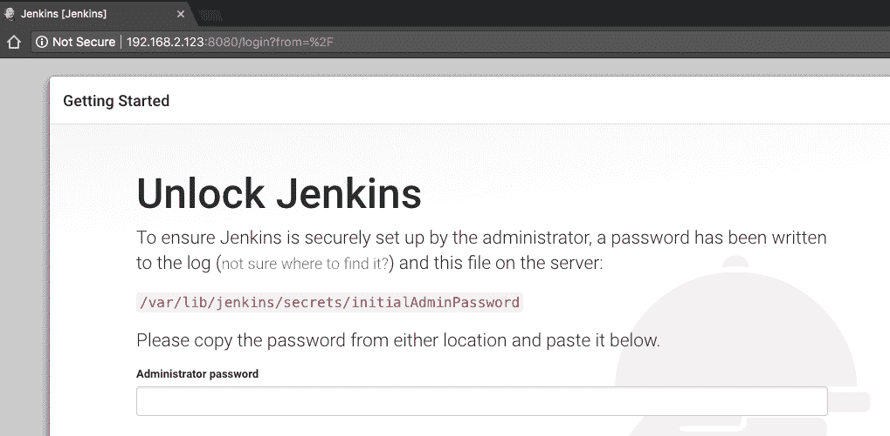
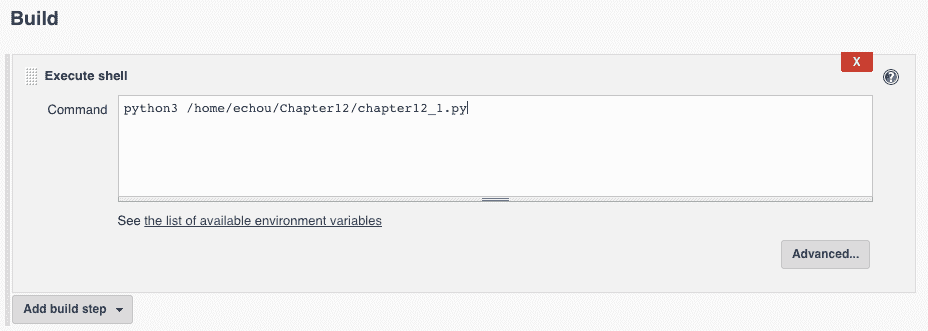
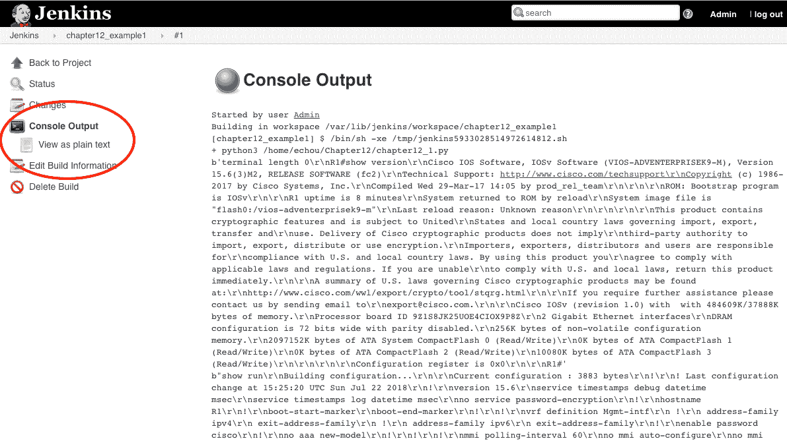
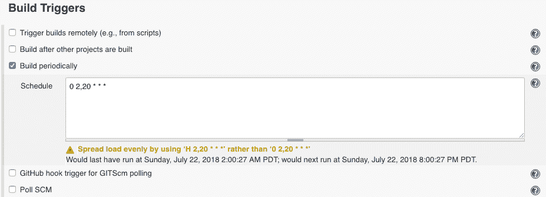
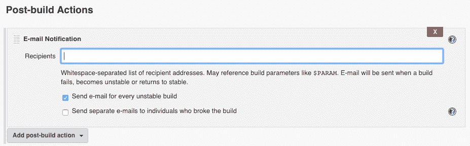
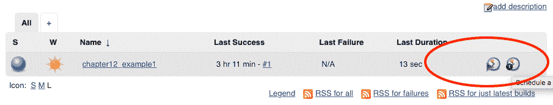
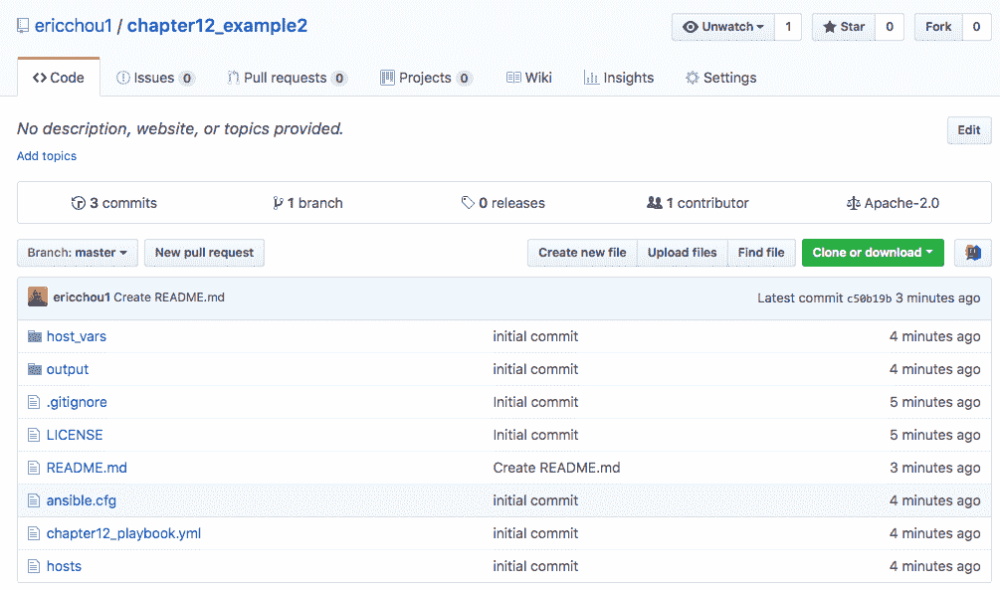
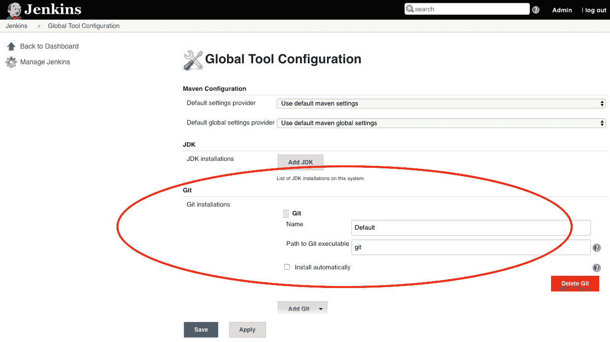
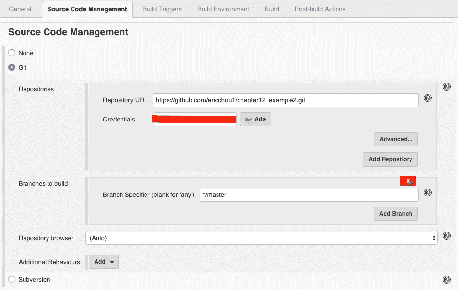
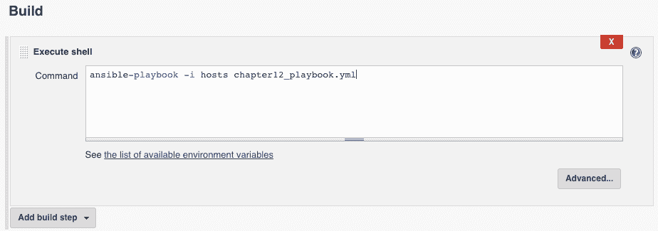

# 十二、Jenkins 持续集成

网络触及技术堆栈的每一部分；在我工作过的所有环境中，它始终是零层服务。这是一项基础服务，其他服务依赖于他们的服务工作。在其他工程师、业务经理、运营商和支持人员的心目中，网络应该正常工作。它应该始终是可访问的，并且功能正确——一个好的网络是一个没有人听说过的网络

当然，作为网络工程师，我们知道网络和其他技术一样复杂。由于其复杂性，构成运行网络的结构有时可能很脆弱。有时，我看着一个网络，想知道它是如何工作的，更不用说它是如何运行了数月或数年而没有业务影响的

我们对网络自动化感兴趣的部分原因是想找到可靠且一致地重复网络更改过程的方法。通过使用 Python 脚本或 Ansible 框架，我们可以确保所做的更改保持一致并可靠地应用。正如我们在上一章中看到的，我们可以使用 Git 和 GitHub 可靠地存储流程的组件，如模板、脚本、需求和文件。构成基础架构的代码是版本控制的、协作的，并且对更改负责。但是我们如何将所有部分联系在一起呢？在本章中，我们将介绍一种流行的开源工具，它可以优化网络管理管道，称为 Jenkins

# 传统的变革管理过程

对于在大型网络环境中工作的工程师来说，他们知道网络更改出错的影响可能很大。我们可以在没有任何问题的情况下进行数百次更改，但所需要的只是一次错误的更改，可能会导致网络对业务产生负面影响。

There is no shortage of war stories about network outages causing business pain. One of the most visible and large-scale AWS EC2 outage in 2011 was caused by a network change that was part of our normal AWS scaling activities in the AWS US-East region. The change occurred at 00:47 PDT and caused a brown-out for various services for over 12 hours, losing millions of dollars for Amazon in the process. More importantly, the reputation of the relatively young service took a serious hit. IT decision makers will point to the outage as reasons to `NOT` migrate to AWS cloud. It took many years to rebuild its reputation. You can read more about the incident report at [https://aws.amazon.com/message/65648/](https://aws.amazon.com/message/65648/). 

由于其潜在的影响和复杂性，在许多环境中，**变更咨询委员会（CAB）**是针对网络实施的。典型的驾驶室流程如下所示：

1.  网络工程师将设计变更，并写出变更所需的详细步骤。这可能包括更改的原因、涉及的设备、将应用或删除的命令、如何验证输出以及每个步骤的预期结果。
2.  通常要求网络工程师首先要求同行进行技术审查。根据变化的性质，可以有不同级别的同行评审。简单的变更可能需要一次同行技术审查；复杂的变更可能需要高级指定工程师批准。
3.  CAB 会议通常安排在固定时间，并提供紧急特别会议。
4.  工程师将向董事会提出变更。董事会将提出必要的问题，评估影响，批准或拒绝变更请求。
5.  变更将由原工程师或另一名工程师在计划变更窗口进行。

这一过程听起来合理且具有包容性，但在实践中证明存在一些挑战：

*   **编写过程非常耗时**：设计工程师编写文档通常需要花费大量时间，有时编写过程比应用更改所需的时间更长。这通常是因为所有网络更改都可能产生影响，我们需要记录技术和非技术 CAB 成员的流程。
*   **工程师专业知识**：有不同级别的工程专业知识，有些经验更丰富，通常是最受欢迎的资源。我们应该为解决最复杂的网络问题预留时间，而不是审查基本的网络变化。
*   **会议非常耗时**：召集会议并让每位成员到场需要花费大量精力。如果需要批准的人员正在休假或生病，会发生什么情况？如果您需要在预定的 CAB 时间之前进行网络更改，该怎么办

这些只是基于人的 CAB 过程中的一些更大挑战。就我个人而言，我非常讨厌 CAB 流程。我不反对同行评审和优先排序的必要性；然而，我认为我们需要尽量减少潜在的开销。让我们看一看在软件工程管道中采用的潜在管道

# 持续集成导论

软件开发中的**持续集成（CI）**是一种在内置测试和验证上下文中快速发布代码库小更改的方法。关键是要将更改分类为与 CI 兼容，也就是说，不太复杂，并且小到可以应用，以便可以轻松地退出。测试和验证过程是以自动化的方式构建的，以获得在不破坏整个系统的情况下应用该过程的信心基线。

在 CI 之前，对软件的更改通常是大批量进行的，并且通常需要较长的验证过程。开发人员可能需要几个月的时间才能看到他们在生产中所做的更改，接收反馈循环，并纠正任何错误。简言之，CI 过程旨在缩短从理念到变革的过程

一般工作流通常包括以下步骤：

1.  第一个工程师获取代码库的当前副本并对其进行更改
2.  第一个工程师将更改提交到存储库
3.  存储库可以将存储库中的更改通知给可以查看更改的工程师组。他们可以批准或拒绝更改
4.  持续集成系统可以持续拉取存储库进行更改，或者存储库可以在发生更改时向 CI 系统发送通知。无论哪种方式，CI 系统都将获取最新版本的代码

5.  CI 系统将运行自动测试，以尝试捕捉任何破损
6.  如果没有发现故障，CI 系统可以选择将更改合并到主代码中，并可以选择部署到生产系统

这是一个概括的步骤列表。每个组织的流程可能不同；例如，只要签入增量代码就可以运行自动测试，而不是在代码检查之后。有时，组织可能会选择让一名人类工程师在两个步骤之间进行健康检查

在下一节中，我们将说明如何在 Ubuntu 16.04 系统上安装 Jenkins

# 安装Jenkins

对于本章将使用的示例，我们可以在管理主机或单独的计算机上安装 Jenkins。我个人的偏好是将其安装在单独的虚拟机上。到目前为止，虚拟机将设置一个类似的网络作为管理主机，其中一个接口用于 internet 连接，另一个接口用于 VMNet 2 与 VIRL 管理网络的连接

每个操作系统的 Jenkins 映像和安装说明见[https://jenkins.io/download/](https://jenkins.io/download/) 。以下是我在 Ubuntu 16.04 主机上安装 Jenkins 时使用的说明：

```py
$ wget -q -O - https://pkg.jenkins.io/debian-stable/jenkins.io.key | sudo apt-key add -

# added Jenkins to /etc/apt/sources.list
$ cat /etc/apt/sources.list | grep jenkins
deb https://pkg.jenkins.io/debian-stable binary/

# install Java8
$ sudo add-apt-repository ppa:webupd8team/java
$ sudo apt update; sudo apt install oracle-java8-installer

$ sudo apt-get update
$ sudo apt-get install jenkins

# Start Jenkins
$ /etc/init.d/jenkins start
```

At the time of writing, we have to install Java separately because Jenkins does not work with Java 9; see [https://issues.jenkins-ci.org/browse/JENKINS-40689](https://issues.jenkins-ci.org/browse/JENKINS-40689) for more details. Hopefully, by the time you read this, the issue is resolved. 

安装 Jenkins 后，我们可以将浏览器指向端口`8080`的 IP 以继续此过程：



Unlock Jenkins screen

如屏幕上所述，从`/var/lib/jenkins/secrets/initialAdminPassword`获取管理员密码，并将输出粘贴到屏幕上。目前，我们将选择安装建议的插件选项：


Install suggested plugins

您将被重定向以创建管理员用户；一旦创建，Jenkins将做好准备。如果您看到 Jenkins 仪表板，说明安装成功：


Jenkins dashboard

我们现在准备使用 Jenkins 来安排我们的第一项工作

# Jenkins的例子

在本节中，我们将看几个 Jenkins 示例，以及它们如何与本书中介绍的各种技术相结合。Jenkins 之所以成为本书最后几章之一，是因为它将利用许多其他工具，如 Python 脚本、Ansible、Git 和 GitHub。如果需要，请随时参考[第 11 章](11.html)、*与 Git*合作

In the examples, we will use the Jenkins master to execute our jobs. In production, it is recommended to add Jenkins nodes to handle the execution of jobs. 

对于我们的实验室，我们将使用 IOSv 设备的简单两节点拓扑：


Chapter 12 lab topology

让我们建立我们的第一份工作

# Python 脚本的第一个作业

对于我们的第一项工作，让我们使用我们在[第 2 章](02.html)*低层网络设备交互*`chapter2_3.py`中构建的 Parmiko 脚本。如果您还记得，这是一个使用`Paramiko`到`ssh`到远程设备并获取设备的`show run`和`show version`输出的脚本：

```py
$ ls
chapter12_1.py
$ python3 /home/echou/Chapter12/chapter12_1.py
...
$ ls
chapter12_1.py iosv-1_output.txt iosv-2_output.txt
```

我们将使用“创建新作业”链接创建作业并选择“自由式项目”选项：


Example 1 freestyle project

我们会让一切都保持默认和不受约束；选择执行 shell 作为生成选项：


Example 1 build step

当提示出现时，我们将输入 shell 中使用的确切命令：



Example 1 shell command

保存作业配置后，将重定向到项目仪表板。我们可以选择“立即生成”选项，作业将显示在“生成历史记录”下：


Example 1 build

您可以通过单击构建并选择左侧面板上的控制台输出来检查构建的状态：



Example 1 console output

作为一个可选步骤，我们可以定期安排此作业，就像 cron 为我们所做的那样。作业可以在构建触发器下进行调度，选择定期构建并输入类似 cron 的调度。在本例中，脚本将在每天 02:00 和 22:00 运行：



Example 1 build trigger

我们还可以在 Jenkins 上配置 SMTP 服务器，以允许通知生成结果。首先，我们需要在主菜单的 Manage Jenkins | configure Systems 下配置 SMTP 服务器设置：


Example 1 configure system

我们将在页面底部看到 SMTP 服务器设置。单击高级设置以配置 SMTP 服务器设置并发送测试电子邮件：


Example 1 configure SMTP

我们将能够将电子邮件通知配置为我们作业的构建后操作的一部分：



Example 1 email notification

祝贺我们刚刚用Jenkins创造了我们的第一份工作。从功能上讲，这并没有比我们在管理主机上所能实现的更多。但是，使用 Jenkins 有几个优点：

*   我们可以利用 Jenkins 的各种数据库身份验证集成，例如 LDAP，允许现有用户执行我们的脚本。
*   我们可以使用 Jenkins 基于角色的授权来限制用户。例如，一些用户只能在没有修改权限的情况下执行作业，而其他用户可以拥有完全的管理权限。
*   Jenkins 提供了一个基于 web 的图形界面，允许用户轻松访问脚本。
*   我们可以使用 Jenkins 电子邮件和日志服务来集中我们的工作，并获得结果通知。

Jenkins本身就是一个伟大的工具。就像 Python 一样，它有一个巨大的第三方插件生态系统，可以用来扩展它的特性和功能

# Jenkins插件

我们将安装一个简单的 schedule 插件，作为说明插件安装过程的示例。插件由 Manage Jenkins | Manage plugins 管理：


Jenkins plugin

我们可以使用搜索功能在 available 选项卡下查找 Schedule Build 插件：


Jenkins plugin search

从那里，我们只需单击 Install（安装），无需重新启动，就可以在以下页面上检查安装进度：


Jenkins plugin installation

安装完成后，我们将能够看到一个新图标，该图标允许我们更直观地安排作业：



Jenkins plugin result

拥有随时间增长的能力是流行的开源项目的优势之一。对于 Jenkins 来说，插件提供了一种定制工具以满足不同客户需求的方法。在下一节中，我们将研究如何将版本控制和审批流程集成到我们的工作流中

# 网络持续集成示例

在本节中，让我们将 GitHub 存储库与 Jenkins 集成。通过集成 GitHub 存储库，我们可以利用 GitHub 代码审查和协作工具

首先，我们将创建一个新的 GitHub 存储库，我将此存储库称为`chapter12_example2`。我们可以在本地克隆此存储库，并将需要的文件添加到存储库中。在本例中，我添加了一个 Ansible playbook，它将`show version`命令的输出复制到一个文件中：

```py
$ cat chapter12_playbook.yml
---
- name: show version
  hosts: "ios-devices"
  gather_facts: false
  connection: local

  vars:
    cli:
      host: "{{ ansible_host }}"
      username: "{{ ansible_user }}"
      password: "{{ ansible_password }}"

  tasks:
    - name: show version
      ios_command:
        commands: show version
        provider: "{{ cli }}"

      register: output

    - name: show output
      debug:
        var: output.stdout

    - name: copy output to file
      copy: content="{{ output }}" dest=./output/{{ inventory_hostname }}.txt
```

到目前为止，我们应该已经非常熟悉 Ansible 剧本的运行。我将跳过`host_vars`和库存文件的输出。但是，最重要的是在提交到 GitHub 存储库之前，验证它是否在本地计算机上运行：

```py
$ ansible-playbook -i hosts chapter12_playbook.yml

PLAY [show version] **************************************************************

TASK [show version] **************************************************************
ok: [iosv-1]
ok: [iosv-2]
...
TASK [copy output to file] *******************************************************
changed: [iosv-1]
changed: [iosv-2]

PLAY RECAP ***********************************************************************
iosv-1 : ok=3 changed=1 unreachable=0 failed=0
iosv-2 : ok=3 changed=1 unreachable=0 failed=0
```

现在，我们可以将 playbook 和相关文件推送到 GitHub 存储库：



Example 2 GitHub repository

让我们重新登录 Jenkins 主机安装`git`和 Ansible：

```py
$ sudo apt-get install git
$ sudo apt-get install software-properties-common
$ sudo apt-get update
$ sudo apt-get install ansible
```

一些工具可以在全局工具配置下安装；Git 就是其中之一。但是，由于我们正在安装 Ansible，因此可以在相同的命令提示符下安装 Git：



Global tools configuration

我们可以创建一个名为`chapter12_example2`的新自由式项目。在源代码管理下，我们将指定 GitHub 存储库作为源代码：



Example 2 source-code management

在继续下一步之前，让我们保存项目并运行构建。在构建控制台输出中，我们应该能够看到正在克隆的存储库，并且索引值与我们在 GitHub 上看到的匹配：


Example 2 console output 1

现在，我们可以在构建部分添加 Ansible playbook 命令：



Example 2 build shell

如果我们再次运行构建，我们可以从控制台输出中看到 Jenkins 将在执行 Ansible playbook 之前从 GitHub 获取代码：


Example 2 build console output 2

将 GitHub 与 Jenkins 集成的好处之一是，我们可以在同一屏幕上看到所有 Git 信息：


Example 2 Git build data

项目结果，例如 Ansible playbook 的输出，可以在`workspace`文件夹中看到：


Example 2 workspace

此时，我们可以按照与之前相同的步骤使用定期构建作为构建触发器。如果 Jenkins 主机可以公开访问，我们还可以使用 GitHub 的 Jenkins 插件通知 Jenkins 作为构建的触发器。这是一个分两步的过程，第一步是在 GitHub 存储库上启用插件：


Example 2 GitHub Jenkins service

第二步是将 GitHub 钩子触发器指定为项目的构建触发器：


Example 2 Jenkins build trigger

将 GitHub 存储库作为源允许将基础设施作为代码处理的一组全新的可能性。我们现在可以使用 GitHub 的 fork 工具、请求拉取、问题跟踪和项目管理来高效地协同工作。一旦代码准备好了，Jenkins 就可以自动下拉代码并代表我们执行它

You will notice we did not mention anything about automated testing. We will go over testing in [Chapter 13](13.html), *Test-Driven Development for Networks*. 

Jenkins是一个功能齐全的系统，可能会变得复杂。我们刚刚用本章中介绍的两个例子揭开了它的面纱。Jenkins 管道、环境设置、多分支管道等都是可以容纳最复杂自动化项目的有用功能。希望本章能为您进一步探索 Jenkins 工具提供一个有趣的介绍

# Jenkins与 Python

Jenkins 为其功能提供了一整套 RESTAPI:[https://wiki.jenkins.io/display/JENKINS/Remote+access+API](https://wiki.jenkins.io/display/JENKINS/Remote+access+API)。还有许多 Python 包装器使交互更加容易。让我们来看看 Python Jenkins包：

```py
$ sudo pip3 install python-jenkins
$ python3
>>> import jenkins
>>> server = jenkins.Jenkins('http://192.168.2.123:8080', username='<user>', password='<pass>')
>>> user = server.get_whoami()
>>> version = server.get_version()
>>> print('Hello %s from Jenkins %s' % (user['fullName'], version))
Hello Admin from Jenkins 2.121.2
```

我们可以配合服务器的管理，如`plugins`：

```py
>>> plugin = server.get_plugins_info()
>>> plugin
[{'supportsDynamicLoad': 'MAYBE', 'downgradable': False, 'requiredCoreVersion': '1.642.3', 'enabled': True, 'bundled': False, 'shortName': 'pipeline-stage-view', 'url': 'https://wiki.jenkins-ci.org/display/JENKINS/Pipeline+Stage+View+Plugin', 'pinned': False, 'version': 2.10, 'hasUpdate': False, 'deleted': False, 'longName': 'Pipeline: Stage View Plugin', 'active': True, 'backupVersion': None, 'dependencies': [{'shortName': 'pipeline-rest-api', 'version': '2.10', 'optional': False}, {'shortName': 'workflow-job', 'version': '2.0', 'optional': False}, {'shortName': 'handlebars', 'version': '1.1', 'optional': False}...
```

我们还可以管理 Jenkins 的工作：

```py
>>> job = server.get_job_config('chapter12_example1')
>>> import pprint
>>> pprint.pprint(job)
("<?xml version='1.1' encoding='UTF-8'?>\n"
 '<project>\n'
 ' <actions/>\n'
 ' <description>Paramiko Python Script for Show Version and Show '
 'Run</description>\n'
 ' <keepDependencies>false</keepDependencies>\n'
 ' <properties>\n'
 ' <jenkins.model.BuildDiscarderProperty>\n'
 ' <strategy class="hudson.tasks.LogRotator">\n'
 ' <daysToKeep>10</daysToKeep>\n'
 ' <numToKeep>5</numToKeep>\n'
 ' <artifactDaysToKeep>-1</artifactDaysToKeep>\n'
 ' <artifactNumToKeep>-1</artifactNumToKeep>\n'
 ' </strategy>\n'
 ' </jenkins.model.BuildDiscarderProperty>\n'
 ' </properties>\n'
 ' <scm class="hudson.scm.NullSCM"/>\n'
 ' <canRoam>true</canRoam>\n'
 ' <disabled>false</disabled>\n'
 ' '
 '<blockBuildWhenDownstreamBuilding>false</blockBuildWhenDownstreamBuilding>\n'
 ' <blockBuildWhenUpstreamBuilding>false</blockBuildWhenUpstreamBuilding>\n'
 ' <triggers>\n'
 ' <hudson.triggers.TimerTrigger>\n'
 ' <spec>0 2,20 * * *</spec>\n'
 ' </hudson.triggers.TimerTrigger>\n'
 ' </triggers>\n'
 ' <concurrentBuild>false</concurrentBuild>\n'
 ' <builders>\n'
 ' <hudson.tasks.Shell>\n'
 ' <command>python3 /home/echou/Chapter12/chapter12_1.py</command>\n'
 ' </hudson.tasks.Shell>\n'
 ' </builders>\n'
 ' <publishers/>\n'
 ' <buildWrappers/>\n'
 '</project>')
>>>
```

使用 Python Jenkins 允许我们以编程方式与 Jenkins 交互

# 网络的持续集成

持续集成在软件开发领域已经被采用了一段时间，但对于网络工程来说是相对较新的。无可否认，我们在网络基础设施中使用持续集成方面有点落后。毫无疑问，当我们仍在努力找出如何停止使用 CLI 来管理我们的设备时，从代码的角度考虑我们的网络是一个挑战

有许多使用 Jenkins 实现网络自动化的好例子。其中之一是 2017 年 AnsibleFest 网络赛道上的 Tim Fairweather 和 Shea Stewart 的作品：[https://www.ansible.com/ansible-for-networks-beyond-static-config-templates](https://www.ansible.com/ansible-for-networks-beyond-static-config-templates) 。另一个用例由 Dyn 的 Carlos Vicente 在 NANOG 63 分享：[https://www.nanog.org/sites/default/files/monday_general_autobuild_vicente_63.28.pdf](https://www.nanog.org/sites/default/files/monday_general_autobuild_vicente_63.28.pdf)

尽管对于刚刚开始学习编码和工具集的网络工程师来说，持续集成可能是一个高级主题，但在我看来，今天开始学习并在生产中使用持续集成是值得的。即使在基础层面，这一经验也将引发更多创新的网络自动化方式，这无疑将有助于行业向前发展

# 总结

在本章中，我们研究了传统的变更管理流程，以及为什么它不适合当今快速变化的环境。网络需要随着业务的发展而发展，以变得更加灵活，并快速可靠地适应变化

我们研究了持续集成的概念，特别是开源 Jenkins 系统。Jenkins 是一个功能齐全、可扩展的连续集成系统，广泛应用于软件开发中。我们安装并使用 Jenkins 定期执行基于`Paramiko`的 Python 脚本，并发送电子邮件通知。我们还看到了如何为 Jenkins 安装插件以扩展其功能

我们研究了如何使用 Jenkins 与 GitHub 存储库集成，并基于代码检查触发构建。通过将 Jenkins 与 GitHub 集成，我们可以利用 GitHub 的协作过程

在[第 13 章](13.html)*网络测试驱动开发*中，我们将介绍 Python 的测试驱动开发