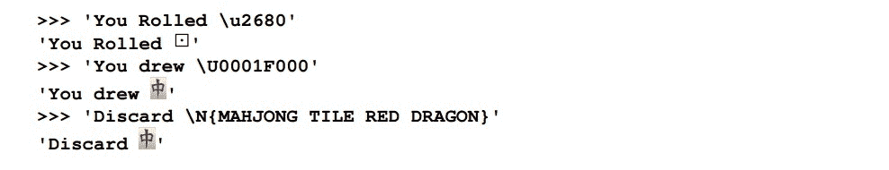

# 第 1 章数字、字符串和元组

我们将介绍以下介绍基本 Python 数据类型的方法：

*   创建有意义的名称并使用变量
*   处理大整数和小整数
*   在浮点、十进制和小数之间进行选择
*   在真实划分和楼层划分之间进行选择
*   重写不可变字符串
*   使用正则表达式进行字符串解析
*   使用“template.format（）构建复杂字符串
*   从字符列表生成复杂字符串
*   使用键盘上没有的 Unicode 字符
*   编码字符串–创建 ASCII 和 UTF-8 字节
*   解码字节–如何从某些字节中获取正确的字符
*   使用项目元组

# 导言

本章将介绍 Python 对象的一些主要类型。我们将研究不同类型的数字，使用字符串和元组。我们首先来看这些，因为它们是 Python 使用的最简单的数据类型。在后面的章节中，我们将介绍数据收集。

这些方法中的大多数都假定初学者对 Python 3 的理解水平。我们将了解如何使用 Python 数字、字符串和元组中可用的基本内置类型。Python 具有丰富的数字种类和两种不同的除法运算符，因此我们需要仔细研究可用的选项。

使用字符串时，有几个常见的操作非常重要。我们将探讨操作系统文件使用的字节与 Python 使用的字符串之间的一些差异。我们将看看如何充分利用 Unicode 字符集的功能。

在本章中，我们将展示这些配方，就像我们在交互式 Python 中从`>>>`提示符进行操作一样。这有时被称为**读取评估打印循环**（**回复**。在后面的章节中，我们将更仔细地研究脚本文件的编写。我们的目标是鼓励互动式探索，因为这是学习语言的好方法。

# 创建有意义的名称并使用变量

我们如何才能确保我们的计划有意义？制作表达性代码的核心要素之一是使用*有意义的*名称。但什么才算有意义呢？在本食谱中，我们将回顾一些创建有意义的 Python 名称的常见规则。

我们还将研究 Python 的一些赋值语句变体。例如，我们可以在一条语句中分配多个变量。

## 准备好了吗

创建名称时的核心问题是问自己*这是什么？*对于软件，我们想要一个描述被命名对象的名称。很明显，像`x`这样的名称不是很具有描述性，它似乎并不是指实际的事物。

模糊的、非描述性的名称在某些编程中非常常见。当我们使用它们时，它对其他人没有帮助。一个描述性的名字对每个人都有帮助。

在命名事物时，将我们真正想要完成的问题域与解决方案域分开也很重要。解决方案域包括 Python、OS 和 Internet 的技术细节。任何阅读代码的人都可以看到解决方案；这不需要深入的解释。然而，问题领域可能会被技术细节所掩盖。我们的工作是使问题清晰可见。精心挑选的名字会有所帮助。

## 怎么做。。。

我们先看名字。然后我们将进入作业。

### 明智地选择名字

从纯技术层面来看，Python 名称必须以字母开头。它们可以包括任意数量的字母、数字和 u 字符。Python3 基于 Unicode，因此字母不限于拉丁字母。虽然 A-Z 拉丁字母是常用的，但它不是必需的。

在创建描述性变量时，我们希望创建既具体又清晰表达程序中事物之间关系的名称。一种广泛使用的技术是以从特定到通用的样式创建较长的名称。

选择名称的步骤如下所示：

1.  名字的最后一部分是对这件事的概括。在少数情况下，这可能就是我们所需要的；上下文将提供其余内容。稍后我们将推荐一些典型的概括类别。
2.  使用前缀缩小应用程序或问题域的名称范围。
3.  如果需要，在这个名称上加上更窄、更专门的前缀，以阐明它与其他类、模块、包、函数和其他对象的区别。如果对前缀有疑问，请记住域名是如何工作的。想想`mail.google.com`——这个名字从特殊到一般。这三个级别的命名没有什么神奇之处，但通常都是这样。
4.  根据名称在 Python 中的使用方式设置名称格式。我们将对三大类事物进行命名，如下所示：
    *   **类**：类具有一个名称，该名称概括了属于该类的对象。这些名称将（经常）使用`CapitalizedCamelCase`。类名的第一个字母大写，以强调它是一个类，而不是该类的实例。类通常是一个通用概念，很少是对有形事物的描述。
    *   **对象**：对象的名称通常使用`snake_case`-所有小写字母，单词之间有多个`_`字符。在 Python 中，这包括变量、函数、模块、包、参数、对象属性、类方法以及几乎所有其他内容。
    *   **脚本和模块文件**：正如 Python 所看到的，这些都是真正的操作系统资源。因此，文件名应该遵循 Python 对象的约定，使用字母、`_`字符并以`.py`扩展名结尾。从技术上讲，有相当广泛和免费的文件名是可能的。不遵循 Python 规则的文件名很难用作模块或包。

我们如何选择名称的大类部分？一般的分类取决于我们谈论的是一个事物还是一个事物的属性。虽然这个世界充满了东西，但我们可以创建一些有用的董事会分组。例如文档、企业、场所、程序、产品、过程、人员、资产、规则、条件、植物、动物、矿物等。

然后，我们可以使用限定符缩小这些范围：

```py
    FinalStatusDocument
    ReceivedInventoryItemName

```

第一个例子是一个名为`Document`的类。我们通过添加一个前缀将其称为`StatusDocument`来稍微缩小它的范围。我们称之为`FinalStatusDocument`，进一步缩小了范围。第二个例子是一个`Name`，我们通过指定它是一个`ReceivedInventoryItemName`来缩小范围。这个示例需要一个四级名称来澄清类。

对象通常具有属性或属性。它们根据所表示的信息类型进行分解。应成为完整名称一部分的一些术语示例包括金额、代码、标识符、名称、文本、日期、时间、日期时间、图片、视频、声音、图形、值、比率、百分比、度量等。

我们的想法是，首先是狭义的、更详细的描述，最后是广义的信息：

```py
    measured_height_value
    estimated_weight_value
    scheduled_delivery_date
    location_code

```

在第一个示例中，`height`缩小了更一般的表示术语`value`。而`measured_height_value`进一步缩小了这个范围。有了这个名字，我们可以期待看到其他的高度变化。类似的想法适用于`weight_value`、`delivery_date`和`location_code`。每一个都有一个或两个缩小前缀。

### 注

**一些需要避免的事情**

不要使用编码前缀或后缀包含详细的技术类型信息。这通常被称为**匈牙利符号**；我们不使用`f_measured_height_value`，因为`f`应该表示浮点。像`measured_height_value`这样的变量可以是任何数字类型，Python 将进行所有必要的转换。技术装饰对阅读我们代码的人没有多大帮助，因为类型规范可能会误导甚至不正确。

不要浪费太多精力强迫名字看起来像是属于一起的。我们不需要做`SpadesCardSuit`、`ClubsCardSuit`等等。Python 有许多不同类型的名称空间，包括包、模块和类，以及用于收集相关名称的名称空间对象。如果将这些名称组合在一个`CardSuit`类中，则可以使用`CardSuit.Spades`，该类使用该类作为名称空间，将这些名称与其他类似名称分开。

### 为对象指定名称

Python 不使用静态变量定义。将名称指定给对象时，将创建变量。将对象视为我们处理的中心，将变量视为识别对象的便签，这一点很重要。下面是我们如何使用基本赋值语句：

1.  创建一个对象。在许多示例中，我们将对象创建为文字。我们将使用`355`或`113`作为 Python 中整数对象的文字表示。我们可以使用类似于`FireBrick`的字符串或类似于`(178, 34, 34)`的元组。
2.  编写以下语句：*变量=对象*。以下是一些例子：

    ```py
    >>> circumference_diameter_ratio = 355/113

    >>> target_color_name = 'FireBrick'

    >>> target_color_rgb = (178, 34, 34)

    ```

我们已经创建了一些对象并将它们分配给变量。第一个对象是计算的结果。接下来的两个对象是简单的文本。通常，对象是由包含函数或类的表达式创建的。

这个基本语句不是唯一的赋值类型。我们可以使用一种重复赋值方式将单个对象分配给多个变量，如下所示：

```py
>>> target_color_name = first_color_name = 'FireBrick'

```

这将为同一字符串对象创建两个名称。我们可以通过检查 Python 使用的内部 ID 值来确认这一点：

```py
>>> id(target_color_name) == id(first_color_name)

True

```

这个比较向我们显示了这两个对象的内部标识符是相同的。

### 注

平等性测试使用`==`。简单赋值使用`=`。

当我们研究数字和集合时，我们会发现可以将赋值与运算符结合起来。我们可以这样做：

```py
>>> total_count = 0

>>> total_count += 5

>>> total_count += 6

>>> total_count

11

```

我们增加了一个运算符。`total_count += 5`与`total_count = total_count + 5`相同。这种技术的优点是较短。

## 它是如何工作的。。。

这种创建名称的方法遵循的模式是，首先使用狭义的、更具体的限定符，最后使用更广泛的、不太具体的类别。这遵循用于域名和电子邮件地址的通用约定。

例如，像`mail.google.com`这样的域名有一个特定的服务，一个更通用的企业，最后是一个非常通用的域。这遵循从窄到宽的原则。

再比如,，service@packtpub.com 从一个特定的目的地名称开始，有一个更通用的企业，最后是一个非常通用的域。甚至目的地名称（*PacktPub*也是一个由两部分组成的名称，企业名称较窄（*Packt*），其次是更广泛的行业（*Pub*，简称*出版*）。（*我们不同意有人建议它代表公共场所。*

赋值语句是在对象上放置名称的唯一方法。我们注意到，对于同一个底层对象，可以有两个名称。现在这不太有用。但在[第 4 章](04.html#page "Chapter 4. Built-in Data Structures – list, set, dict")中，*内置数据结构–列表、集合、dict*中，我们将看到单个对象的多个名称的一些有趣结果。

## 还有更多。。。

我们将尝试在所有食谱中显示描述性名称。

### 提示

我们必须对不遵循此模式的现有软件授予例外。与传统软件保持一致通常比强制实施新规则更好，即使新规则更好。

几乎每个例子都涉及变量赋值。它是有状态面向对象编程的核心。

我们将在[第 6 章](06.html#page "Chapter 6. Basics of Classes and Objects")、*类和对象基础*中了解类和类名；我们来看看[第 13 章](13.html#page "Chapter 13. Application Integration")、*应用集成*中的模块。

## 另见

描述性命名的主题是正在进行的研究和讨论的来源。有两个方面：语法和语义。关于 Python 语法的想法的出发点是著名的**Python 增强建议编号 8**（**PEP-8**。这导致使用`CamelCase`和`snake_case`名称。

此外，请务必执行以下操作：

```py
>>> import this

```

这将提供对 Python 理想的更多了解。

### 注

有关语义的信息，请参阅遗留的 UDEF 和 NIEM 命名和设计规则标准（[http://www.opengroup.org/udefinfo/AboutTheUDEF.pdf](http://www.opengroup.org/udefinfo/AboutTheUDEF.pdf) ）。更多详细信息参见 ISO11179（[https://en.wikipedia.org/wiki/ISO/IEC_11179](https://en.wikipedia.org/wiki/ISO/IEC_11179) ），详细介绍元数据和命名。

# 处理大整数和小整数

许多编程语言区分整数、字节和长整数。一些语言包含有符号的*与**无符号的*整数的区别。我们如何将这些概念映射到 Python？

简单的答案是我们没有。Python 以统一的方式处理所有大小的整数。从字节到具有数百位数字的巨大数字，对 Python 来说都只是整数。

## 准备好了吗

想象一下你需要计算一些非常大的东西。例如，计算 52 张卡片组中排列卡片的方法数。号码是 52！=52 × 51 × 50 × ... 是一个非常非常大的数字。我们可以用 Python 来做这件事吗？

## 怎么做。。。

别担心。真正地 Python 的行为就像它有一个通用类型的整数，这涵盖了从字节到数字的所有基数，这些基数填满了所有内存。以下是正确使用整数的步骤：

1.  写下你需要的数字。以下是一些小数字：355113。没有实际的上限。
2.  Creating a very small value—a single byte—looks like this:

    ```py
    >>> 2

    2

    ```

    或者，如果您想使用 base 16：

    ```py
    >>> 0xff

    255

    ```

    在后面的食谱中，我们将看到一个字节序列，其中只有一个值：

    ```py
    >>> b'\xfe'

    b'\xfe'

    ```

    从技术上讲，这不是一个整数。它有一个前缀`b'`，表示它是一个 1 字节的序列。

3.  Creating a much, much bigger number with a calculation might look like this:

    ```py
    >>> 2**2048 

    323...656

    ```

    这个数字有 617 位。我们没有把它们全部展示出来。

## 它是如何工作的。。。

在内部，Python 使用两种数字。这两者之间的转换是无缝和自动的。

对于较小的数字，Python 通常使用 4 或 8 字节的整数值。细节隐藏在 CPython 的内部，并取决于用于构建 Python 的 C 编译器的功能。

对于较大的数字，在`sys.maxsize`上方，Python 会切换为大整数，即数字序列。在这种情况下，数字通常表示 30 位的值。

我们可以用多少种方式排列一副 52 张牌的标准牌？答案是 52！≈ 8×10<sup>67</sup>。下面是我们如何计算这个大数字的方法。我们将在`math`模块中使用阶乘函数，如下所示：

```py
>>> import math

>>> math.factorial(52)

80658175170943878571660636856403766975289505440883277824000000000000

```

是的，这些巨大的数字工作得很好。

我们计算的第一部分是 52！（从 52×51×50×…*下降到大约 42）可以完全使用小整数执行。在那之后，剩下的计算必须转换成更大的整数。我们看不到开关；我们只看到结果。*

 *有关整数内部的一些详细信息，我们可以查看以下内容：

```py
>>> import sys

>>> import math

>>> math.log(sys.maxsize, 2)

63.0

>>> sys.int_info

sys.int_info(bits_per_digit=30, sizeof_digit=4)

```

`sys.maxsize`值是小整数值中的最大值。我们计算了以 2 为基数的日志，以确定这个数字需要多少位。

这告诉我们，Python 对小整数使用 63 位值。小整数的范围为-2<sup>64</sup>。。。2<sup>63</sup>-1。在此范围之外，将使用较大的整数。

`sys.int_info`中的值告诉我们，大整数是一个使用 30 位数字的数字序列，每个数字占用 4 个字节。

像 52 这样的大值！由这些 30 位大小的数字中的 8 位组成。如果认为一个数字需要 30 位来表示，可能会有点混乱。我们不需要用 10 个符号来表示基数为 10 的数字，而是需要为这些大数字的每个数字使用*2**30*不同的符号。

涉及多个大整数值的计算可能会消耗相当多的内存。小数字呢？Python 如何跟踪大量的小数字，比如 1 和 0？

对于常用的数字（-5 到 256），Python 实际上创建了一个秘密的对象池来优化内存管理。检查整数对象的`id()`值时可以看到：

```py
>>> id(1)

4297537952

>>> id(2)

4297537984

>>> a=1+1

>>> id(a)

4297537984

```

我们已经显示了整数`1`和整数`2`的内部`id`。当我们计算一个值时，得到的对象就是池中找到的同一个整数`2`对象。

当您尝试此操作时，您的`id()`值可能会有所不同。但是，每次使用`2`的值时，它都是同一个对象；在作者的笔记本电脑上，它的 id=`4297537984`。这样可以避免 2 对象的多个副本凌乱内存。

这里有一个小技巧，可以精确地看出一个数字有多大：

```py
>>> len(str(2**2048))

617

```

我们根据计算出的数字创建了一个字符串。然后我们问绳子的长度是多少。回复告诉我们这个数字有 617 位。

## 还有更多。。。

Python 为我们提供了广泛的算术运算符集：`+`、`-`、`*`、`/`、`//`、`%`和`**`。`/`和`//`用于除法；我们将在一个名为*的单独配方中，在真正的分区和地板分区*之间进行选择。`**`将数字提升为幂。

对于处理单个位，我们有一些额外的操作。我们可以使用`&`、`^`、`|`、`<<`和`>>`。这些运算符逐位处理整数的内部二进制表示形式。它们分别计算二进制**和**、二进制**异或**、I**包含或**、**左移**和**右移**。

虽然这些将在非常大的整数上工作，但它们在单个字节之外没有多大意义。一些二进制文件和网络协议将涉及查看单个数据字节中的位。

我们可以通过使用`bin()`函数来查看发生了什么，从而与这些操作符进行交互。

下面是一个简单的例子来说明我们的意思：

```py
>>> xor = 0b0011 ^ 0b0101

>>> bin(xor)

'0b110'

```

我们使用了`0b0011`和`0b0101`作为我们的两个位串。这有助于明确这两个数字的二进制表示形式。我们将异或（`^`运算符应用于这两个位序列。我们使用`bin()`函数将结果视为一串位。我们可以仔细排列这些位，看看操作员做了什么。

我们可以将一个字节分解成若干部分。假设我们要将最左边的两位与其他六位分开。实现这一点的一种方法是使用下面这些有点假惺惺的表达式：

```py
>>> composite_byte = 0b01101100

>>> bottom_6_mask =  0b00111111

>>> bin(composite_byte >> 6)

'0b1'

>>> bin(composite_byte & bottom_6_mask)

'0b101100'

```

我们已经定义了一个复合字节，其中最高有效的两位为`01`，最低有效的六位为`101100`。我们使用`>>`移位运算符将值移位六个位置，移除最低有效位并保留两个最高有效位。我们使用带面具的`&`操作符。当掩码有 1 位时，结果中保留位置值，当掩码有`0`位时，结果位置设置为`0`。

## 另见

*   我们来看看*中的两个除法运算符，它们在真正除法和楼层除法*之间进行选择
*   我们将看看*中在浮点数、十进制数和分数*配方中选择的其他类型的数字
*   整数处理详见[https://www.python.org/dev/peps/pep-0237/](https://www.python.org/dev/peps/pep-0237/)

# 在浮点、小数和小数之间选择

Python 为我们提供了几种处理有理数和近似无理数的方法。我们有三个基本选择：

*   浮动
*   十进制的
*   小部分

有这么多选择，我们什么时候使用这些？

## 准备好了吗

确定我们的核心数学期望是很重要的。如果我们不确定我们拥有什么样的数据，或者我们想要得到什么样的结果，我们真的不应该编码。我们需要后退一步，用铅笔和纸复习。

数学中有三种一般情况涉及整数以外的数字，它们是：

1.  **货币**：美元、美分或欧元。货币通常有固定的小数位数。有四舍五入规则用于确定 2.95 美元的 7.25%是多少。
2.  **有理数或分数**：当我们使用美制单位计算英尺和英寸，或使用杯子和液体盎司进行烹饪测量时，我们通常需要使用分数。例如，当我们将一份食谱的服务对象从 8 人缩减到 5 人时，我们使用的是 5/8 的比例因子进行分数运算。我们如何将其应用到 2/3 杯米饭上，同时又能得到一个适合美国厨房设备的测量值？
3.  **无理数**：这包括所有其他类型的计算。值得注意的是，数字计算机只能近似这些数字，我们偶尔会看到这种近似的奇数小伪影。浮点近似非常快，但有时会遇到截断问题。

当我们遇到前两种情况之一时，我们应该避免使用浮点数。

## 怎么做。。。

我们将分别研究这三个案例。首先，我们来看看使用货币进行计算。然后我们来看看有理数，最后是无理数或浮点数。最后，我们将研究在这些不同类型之间进行显式转换。

### 进行货币计算

当使用货币时，我们应该始终使用`decimal`模块。如果我们尝试使用 Python 的内置`float`值，我们将在数字的舍入和截断方面遇到问题。

1.  为了使用货币，我们将这样做。从`decimal`模块

    ```py
    >>> from decimal import Decimal

    ```

    导入`Decimal`类
2.  Create `Decimal` objects from strings or integers:

    ```py
    >>> from decimal import Decimal

    >>> tax_rate = Decimal('7.25')/Decimal(100)

    >>> purchase_amount = Decimal('2.95')

    >>> tax_rate * purchase_amount

    Decimal('0.213875')

    ```

    我们从两个`Decimal`对象创建了`tax_rate`。一个基于字符串，另一个基于整数。我们可以使用`Decimal('0.0725')`而不是显式地进行除法。

    结果是头发价格超过了 0.21 美元。它被正确地计算到小数点后的整数。

3.  如果您试图从浮点值创建十进制对象，您将看到浮点近似的令人不快的伪影。避免混合`Decimal`和`float`。要四舍五入到最近的便士，请创建一个`penny`对象：

    ```py
    >>> penny=Decimal('0.01')

    ```

4.  使用此 penny 对象量化您的数据：

    ```py
    >>> total_amount = purchase_amount + tax_rate*purchase_amount

    >>> total_amount.quantize(penny)

    Decimal('3.16')

    ```

这显示了我们如何使用默认的取整规则`ROUND_HALF_EVEN`。

每个财务向导都有不同的取整方式。`Decimal`模块提供各种变化。例如，我们可以这样做：

```py
>>> import decimal

>>> total_amount.quantize(penny, decimal.ROUND_UP)

Decimal('3.17')

```

这显示了使用不同舍入规则的后果。

### 分数计算

当我们进行具有精确分数值的计算时，我们可以使用`fractions`模块。这为我们提供了方便的有理数，我们可以使用。要使用分数，我们将执行以下操作：

1.  从`fractions`模块

    ```py
    >>> from fractions import Fraction

    ```

    导入`Fraction`类
2.  从字符串、整数或整数对创建`Fraction`对象。如果从浮点值创建分数对象，则可能会看到令人不快的浮点近似伪影。当分母是 2 的幂时，事情可以精确计算：

    ```py
    >>> from fractions import Fraction

    >>> sugar_cups = Fraction('2.5')

    >>> scale_factor = Fraction(5/8)

    >>> sugar_cups * scale_factor

    Fraction(25, 16)

    ```

我们从字符串`2.5`中创建了一个分数。我们通过浮点计算创建了第二个分数，`5/8`。因为分母是 2 的幂，所以计算结果是准确的。

结果是 25/16，是一个复杂的分数。附近哪一个分数可能更简单？

```py
>>> Fraction(24,16)

Fraction(3, 2)

```

我们可以看到，我们将使用几乎一杯半的时间来衡量五个人而不是八个人的食谱。

### 浮点近似

Python 的内置`float`类型能够表示各种各样的值。这里的权衡是，浮动通常涉及一个近似值。在某些情况下，特别是在进行涉及 2 次幂的除法时，它可以与`fraction`一样精确。在所有其他情况下，可能存在一些小的差异，这些差异揭示了`float`的实现与无理数的数学理想之间的差异。

1.  为了与`float`合作，我们通常需要对值进行四舍五入，使其看起来合理。认识到所有计算都是近似值：

    ```py
    >>> (19/155)*(155/19)

    0.9999999999999999

    ```

2.  从数学上讲，该值应为`1`。由于`float`采用了近似值，因此答案并不准确。这没什么错，但它错了。当我们适当地四舍五入时，值更有用：

    ```py
    >>> answer= (19/155)*(155/19)

    >>> round(answer, 3)
          1.0

    ```

3.  知道错误术语。在这种情况下，我们知道确切答案应该是什么，因此我们可以将计算结果与已知的正确答案进行比较。这为我们提供了可以潜入浮点数的一般错误值：

    ```py
    >>> 1-answer

    1.1102230246251565e-16

    ```

对于大多数浮点错误，这是大约 10<sup>-16</sup>的典型值。Python 有一些聪明的规则，通过自动取整在某些时候隐藏这个错误。然而，对于这个计算，错误并没有隐藏。

这是一个非常重要的结果。

### 提示

不要比较浮点值是否完全相等。

当我们看到在浮点数之间使用精确`==`测试的代码时，当近似值相差一位时，就会出现问题。

### 将数字从一种类型转换为另一种类型

我们可以使用`float()`函数从另一个值创建`float`值。看起来是这样的：

```py
>>> float(total_amount)

3.163875

>>> float(sugar_cups * scale_factor)

1.5625

```

在第一个示例中，我们将一个`Decimal`值转换为`float`。在第二个示例中，我们将一个`Fraction`值转换为`float`。

正如我们刚才所看到的，我们从不乐意尝试将`float`转换为`Decimal`或`Fraction`：

```py
>>> Fraction(19/155)

Fraction(8832866365939553, 72057594037927936)

>>> Decimal(19/155)

Decimal('0.12258064516129031640279123394066118635237216949462890625')

```

在第一个示例中，我们对整数进行了计算，以创建一个具有已知截断问题的`float`值。当我们从被截断的`float`值创建`Fraction`时，我们得到了一些看起来很糟糕的数字，暴露了截断的细节。

类似地，第二个示例尝试从`float`创建一个`Decimal`值。

## 它是如何工作的。。。

对于这些数字类型，Python 为我们提供了多种运算符：`+`、`-`、`*`、`/`、`//`、`%`和`**`。它们用于加法、减法、乘法、真除法、截断除法、模和幂运算。我们来看看*配方中的两个除法运算符，在真正除法和楼层除法*之间进行选择。

Python 擅长在各种类型之间转换数字。我们可以混合`int`和`float`值；整数将升级为浮点，以提供尽可能准确的答案。同样，我们可以混合`int`和`Fraction`，结果将是`Fractions`。我们也可以混合`int`和`Decimal`。我们不能随意将`Decimal`与`float`或`Fraction`混在一起；我们需要提供显式转换。

### 注

值得注意的是，`float`值实际上是近似值。Python 语法允许我们将数字写成十进制值；这不是他们内部处理的方式。

我们可以在 Python 中使用普通的 base-10 值编写这样的值：

```py
>>> 8.066e+67

8.066e+67

```

内部使用的实际值将涉及我们编写的十进制值的二进制近似值。

本例的内部值`8.066e+67`为：

```py
>>> 6737037547376141/2**53*2**226

8.066e+67

```

分子是一个大数字，`6737037547376141`。分母始终为*2<sup>53</sup>*。由于分母是固定的，结果分数只能有 53 个有意义的数据位。由于更多位不可用，值可能会被截断。这导致了我们理想化的抽象和实际数字之间的微小差异。需要指数（*2<sup>226</sup>*）将分数缩放至适当范围。

数学上，67370377547376141*2<sup>226</sup>/2<sup>53</sup>。

我们可以使用`math.frexp()`查看一个数字的这些内部细节：

```py
>>> import math

>>> math.frexp(8.066E+67)

(0.7479614202861186, 226)

```

这两部分被称为**尾数**和**指数**。如果我们将尾数乘以*2<sup>53</sup>*，我们总是得到一个整数，它是二进制分数的分子。

### 注

我们之前注意到的错误与此非常吻合：10<sup>-16</sup>≈ 2<sup>-53</sup>。

与内置的`float`不同，`Fraction`是两个整数值的精确比率。正如我们在*处理大整数和小整数*配方中看到的，Python 中的整数可能非常大。我们可以创建包含大量数字的整数的比率。我们不受固定分母的限制。

类似地，`Decimal`值基于一个非常大的整数值和一个比例因子来确定小数位的位置。这些数字可能很大，不会出现特殊的代表性问题。

### 注

**为什么使用浮点？两个原因**：

并非所有可计算的数字都可以表示为分数。这就是数学家引入（或可能发现）无理数的原因。内置的浮点类型与无理数的数学抽象非常接近。价值观√例如，2 不能表示为分数。

此外，浮点值非常快。

## 还有更多。。。

Python`math`模块包含许多专门用于处理浮点值的函数。该模块包括常用函数，如平方根、对数和各种三角函数。它还有一些其他函数，如伽马函数、阶乘函数和高斯误差函数。

`math`模块包括几个功能，可以帮助我们进行更精确的浮点计算。例如，`math.fsum()`函数将比内置的`sum()`函数更仔细地计算浮点和。它不太容易受到近似问题的影响。

我们还可以使用`math.isclose()`函数比较两个浮点值，看看它们是否接近相等：

```py
>>> (19/155)*(155/19) == 1.0

False

>>> math.isclose((19/155)*(155/19), 1)

True

```

此函数为我们提供了一种有意义地比较浮点数的方法。

Python 还提供复杂的数据。这涉及到实部和虚部。在 Python 中，我们编写`3.14+2.78j`来表示复数 3.14+2.78√-1.Python 将轻松地在浮点和复数之间转换。对于复数，我们有一组常用的运算符。

为了支持复数，有一个`cmath`包。例如，`cmath.sqrt()`函数在提取负数的平方根时将返回复数，而不是引发异常。下面是一个例子：

```py
>>> math.sqrt(-2)

Traceback (most recent call last):

 File "<stdin>", line 1, in <module>

ValueError: math domain error

>>> cmath.sqrt(-2)

1.4142135623730951j

```

这在处理复数时非常重要。

## 另见

*   我们将在*选择真除法和下限除法*配方中进一步讨论浮点和分数
*   参见[https://en.wikipedia.org/wiki/IEEE_floating_point](https://en.wikipedia.org/wiki/IEEE_floating_point)

# 在真实划分和楼层划分之间进行选择

Python 为我们提供了两种除法运算符。它们是什么？我们如何知道使用哪一个？我们还将了解 Python 除法规则以及它们如何应用于整数值。

## 准备好了吗

进行除法有几种常见情况：

*   *div mod*对：我们需要两部分商和余数。在将值从一个基转换为另一个基时，我们经常使用此选项。当我们将秒转换为小时、分钟和秒时，我们将进行一种*div mod*的除法。我们不想要确切的小时数，我们想要一个被截断的小时数，剩余的将被转换成分和秒。
*   *真*值：这是一个典型的浮点值，非常接近商。例如，如果我们计算几个测量值的平均值，我们通常期望结果是浮点值，即使输入值都是整数。
*   *有理分数*值：在以英尺、英寸和杯子为单位工作时，这通常是必需的。为此，我们应该使用`Fraction`类。当我们划分`Fraction`对象时，我们总是得到准确的答案。

我们需要决定这些情况中的哪一种适用，以便我们知道使用哪种除法运算符。

## 怎么做。。。

我们将分别看这三个案例。首先我们来看看截断的楼层划分。然后我们来看看真正的浮点除法。最后，我们来看看分数的划分。

### 做楼层划分

当我们进行*div mod*类计算时，我们可能会使用楼层划分`//`和模数`%`。或者，我们可以使用`divmod()`函数。

1.  我们将秒数除以 3600 得到`hours`的值；模数或余数可分别转换为`minutes`和`seconds`：

    ```py
     >>> total_seconds = 7385

    >>> hours = total_seconds//3600

    >>> remaining_seconds = total_seconds % 3600

    ```

2.  同样，使用剩余值，我们将秒数除以 60 得到`minutes`；余数为小于 60 秒的秒数：

    ```py
    >>> minutes = remaining_seconds//60

    >>> seconds = remaining_seconds % 60

    >>> hours, minutes, seconds

    (2, 3, 5)

    ```

下面是另一种选择，使用`divmod()`功能：

1.  同时计算商和余数：

    ```py
    >>> total_seconds = 7385

    >>> hours, remaining_seconds = divmod(total_seconds, 3600)

    ```

2.  重新计算商和余数：

    ```py
    >>> minutes, seconds = divmod(remaining_seconds, 60)

    >>> hours, minutes, seconds

    (2, 3, 5)

    ```

### 做真正的除法

真值计算作为浮点近似值给出。例如，7386 秒大约是多少小时？使用真除法运算符进行除法：

```py
>>> total_seconds = 7385

>>> hours = total_seconds / 3600

>>> round(hours,4)

2.0514

```

### 注

我们提供了两个整数值，但得到了一个浮点精确结果。与我们之前使用浮点值的方法一致，我们对结果进行了四舍五入，以避免查看微小的错误值。

这种真正的划分是 Python3 的一个特性。在接下来的部分中，我们将从 Python2 的角度来看这一点。

### 有理分数计算

我们可以使用`Fraction`对象和整数进行除法。这迫使结果成为数学上精确的有理数：

1.  至少创建一个`Fraction`值：

    ```py
    >>> from fractions import Fraction

    >>> total_seconds = Fraction(7385)

    ```

2.  在计算中使用`Fraction`值。任何整数将提升为`Fraction`：

    ```py
    >>> hours = total_seconds / 3600

    >>> hours

    Fraction(1477, 720)

    ```

3.  如有必要，将精确分数转换为浮点近似值：

    ```py
    >>> round(float(hours),4)

    2.0514

    ```

首先，我们为总秒数创建了一个`Fraction`对象。当我们对分数进行算术运算时，Python 会将任何整数提升为分数；这种提升意味着尽可能精确地计算。

## 它是如何工作的。。。

Python 3 有两个除法运算符。

*   `/`真除法运算符总是试图产生一个真的浮点结果。即使两个操作数是整数，它也会这样做。在这方面，这是一个不同寻常的操作员。所有其他操作符都试图保留数据的类型。当应用于整数时，真除法运算产生一个`float`结果。
*   `//`截断除法运算符总是试图生成截断的结果。对于两个整数操作数，这是截断商。对于两个浮点操作数，这是一个截断的浮点结果：

    ```py
    >>> 7358.0 // 3600.0

    2.0

    ```

默认情况下，Python 2 只有一个除法运算符。对于仍在使用 Python 2 的程序员，我们可以开始使用以下新的除法运算符：

```py
>>> from __future__ import division

```

此导入将安装 Python 3 除法规则。

## 另见

*   有关在浮点和分数之间选择的更多信息，请参阅*在浮点、十进制和分数之间选择*配方
*   参见[https://www.python.org/dev/peps/pep-0238/](https://www.python.org/dev/peps/pep-0238/)

# 重写不可变字符串

我们如何重写一个不可变的字符串？我们无法更改字符串中的单个字符：

```py
>>> title = "Recipe 5: Rewriting, and the Immutable String"

>>> title[8]= ''

Traceback (most recent call last):

 File "<stdin>", line 1, in <module>

TypeError: 'str' object does not support item assignment

```

既然这不起作用，我们如何更改字符串？

## 准备好了吗

假设我们有这样一个字符串：

```py
>>> title = "Recipe 5: Rewriting, and the Immutable String"

```

我们要做两个转换：

*   拆除`:`前的零件
*   将标点符号替换为`_`，并使所有字符小写

因为我们不能替换字符串对象中的字符，所以我们必须找到一些替代方法。我们可以做一些常见的事情，如下所示：

*   切片和连接字符串以创建新字符串的组合。
*   缩短时，我们通常使用`partition()`方法。
*   我们可以用`replace()`方法替换字符或子字符串。
*   我们可以将该字符串展开为一个字符列表，然后再次将该字符串连接回单个字符串。这是一个单独配方的主题，*使用字符列表*构建复杂字符串。

## 怎么做。。。

因为我们不能就地更新字符串，所以必须用每个修改的结果替换字符串变量的对象。我们将使用如下语句：

```py
    some_string = some_string.method()

```

或者我们甚至可以使用：

```py
    some_string = some_string[:chop_here]

```

我们将研究关于这个主题的一些具体变化。我们将分割字符串的一部分，替换字符串中的单个字符，并应用一揽子转换，例如使字符串小写。我们还将研究删除最后一个字符串中显示的额外`_`的方法。

### 切丝

下面是通过切片缩短字符串的方法：

1.  Find the boundary:

    ```py
     >>> colon_position = title.index(':')

    ```

    index 函数定位特定的子字符串并返回可以找到该子字符串的位置。如果子字符串不存在，则会引发异常。这始终是结果`title[colon_position] == ':'`的`true`。

2.  选择子字符串：

    ```py
    >>> discard_text, post_colon_text = title[:colon_position], title[colon_position+1:]

    >>> discard_text

    'Recipe 5'

    >>> post_colon_text

    ' Rewriting, and the Immutable String'

    ```

我们已经使用了切片符号来显示要拾取的字符的`start:end`。我们还使用多重赋值从两个表达式中赋值两个变量`discard_text`和`post_colon_text`。

我们可以使用`partition()`以及手动切片。找到边界和分区：

```py
>>> pre_colon_text, _, post_colon_text = title.partition(':')

>>> pre_colon_text

'Recipe 5'

>>> post_colon_text

' Rewriting, and the Immutable String'

```

`partition`函数返回三个内容：目标之前的部分、目标和目标之后的部分。我们使用多重赋值将每个对象赋给不同的变量。我们将目标分配给一个名为`_`的变量，因为我们将忽略结果的这一部分。对于必须提供变量但不关心使用对象的地方，这是一个常见的习惯用法。

### 使用替换项更新字符串

我们可以使用`replace()`删除标点符号。使用`replace`切换标点符号时，将结果保存回原始变量。在这种情况下，`post_colon_text`：

```py
>>> post_colon_text = post_colon_text.replace(' ', '_')

>>> post_colon_text = post_colon_text.replace(',', '_')

>>> post_colon_text

'_Rewriting__and_the_Immutable_String'

```

这已将两种标点符号替换为所需的`_`字符。我们可以将其推广到所有标点符号。这利用了`for`语句，我们将在[第 2 章](02.html#page "Chapter 2. Statements and Syntax")、*语句和语法*中看到。

我们可以遍历所有标点符号：

```py
>>> from string import whitespace, punctuation

>>> for character in whitespace + punctuation:

...     post_colon_text = post_colon_text.replace(character, '_')

>>> post_colon_text

'_Rewriting__and_the_Immutable_String'

```

当每种标点符号被替换时，我们将字符串的最新版本和最大版本分配给`post_colon_text`变量。

### 制作一个全小写的字符串

另一个转换步骤是将字符串全部改为小写。与前面的示例一样，我们将把结果分配回原始变量。使用`lower()`方法，将结果分配给原始变量：

```py
>>> post_colon_text = post_colon_text.lower()

```

### 删除额外标点符号

在许多情况下，我们可能会遵循一些附加步骤。我们经常想删除前导和尾随的`_`字符。我们可以使用`strip()`来实现这一点：

```py
>>> post_colon_text = post_colon_text.strip('_')

```

在某些情况下，我们会有多个`_`字符，因为我们有多个标点符号。最后一步是清理多个`_`字符：

```py
>>> while '__' in post_colon_text:

...    post_colon_text = post_colon_text.replace('__', '_')

```

这是我们用来修改字符串的相同模式的另一个例子。这取决于`while`语句，我们将在[第 2 章](02.html#page "Chapter 2. Statements and Syntax")、*语句和语法*中介绍。

## 它是如何工作的。。。

我们不能在适当的位置修改字符串。字符串的数据结构是不可变的。但是，我们可以将一个新字符串赋回原始变量。此技术的行为与在位修改字符串相同。

当一个变量的值被替换时，先前的值不再有任何引用，并且被垃圾收集。通过使用`id()`函数跟踪每个字符串对象，我们可以看到这一点：

```py
>>> id(post_colon_text) 

4346207968

>>> post_colon_text = post_colon_text.replace('_','-')

>>> id(post_colon_text) 

4346205488

```

您的实际身份证号码可能不同。重要的是，分配给`post_colon_text`的原始字符串对象有一个 id。分配给`post_colon_text`的新字符串对象有一个不同的 id。它是一个新字符串对象。

当旧字符串没有更多引用时，它将自动从内存中删除。

我们使用**切片符号**来分解字符串。切片有两部分：`[start:end]`。切片始终包含起始索引。字符串索引始终以零作为第一项开始。它从不包括结束索引。

### 提示

切片中的项目具有从`start`到`end-1`的索引。这有时被称为**半开放**间隔。

想象这样一个片段：索引*i*所在的所有字符都在*开始的范围内≤ i*<*结束*。

我们简要地指出，我们可以省略开始或结束索引。我们实际上可以忽略这两个。以下是各种可用选项：

*   `title[colon_position]`：单个项目，我们使用`title.index(':')`找到的`:`。
*   `title[:colon_position]`：省略起始的切片。它从第一个位置开始，索引为零。
*   `title[colon_position+1:]`：省略末端的切片。它在字符串的末尾结束，就像我们说的`len(title)`。
*   `title[:]`：因为起始和结束都省略了，所以这是整个字符串。实际上，它是整个字符串的*副本*。这是复制字符串的快捷方法。

## 还有更多。。。

Python 集合中有更多的特性可以索引，比如字符串。正常索引从左端的 0 开始。我们有一组使用从字符串右端开始的负名称的替代索引。

*   `title[-1]`是标题中的最后一个字符`g`
*   `title[-2]`是倒数第二个字符`n`
*   `title[-6:]`是最后六个字符，`String`

我们有很多方法可以从一根绳子中挑出碎片和部分。

Python 提供了几十种修改字符串的方法。*Python 标准库*的*第 4.7*节描述了我们可以使用的各种转换。字符串方法有三大类。我们可以询问字符串，我们可以解析字符串，我们可以转换字符串。像`isnumeric()`这样的方法告诉我们一个字符串是否都是数字。

下面是一个例子：

```py
>>> 'some word'.isnumeric()

False

>>> '1298'.isnumeric()

True

```

我们已经研究了使用`partition()`方法进行解析。我们已经研究了用`lower()`方法进行转换。

## 另见

*   我们将研究字符串作为列表的技术，该技术用于修改*中的字符串，该方法使用*配方中的字符列表构建复杂字符串。
*   有时我们的数据只是一个字节流。为了理解它，我们需要将它转换为字符。这就是*解码字节的主题——如何从一些字节*配方中获得正确的字符。

# 使用正则表达式进行字符串解析

我们如何分解一个复杂的字符串？如果我们有复杂、棘手的标点符号呢？或者更糟糕的是，如果我们没有标点符号，但必须依靠数字模式来定位有意义的信息，那该怎么办？

## 准备好了吗

分解复杂字符串的最简单方法是将字符串泛化为模式，然后编写描述该模式的正则表达式。

正则表达式所能描述的模式是有限的。当我们遇到 HTML、XML 或 JSON 等语言中的深度嵌套文档时，我们经常会遇到问题，无法使用正则表达式。

`re`模块包含我们创建和使用正则表达式所需的所有类和函数。

假设我们想要分解来自菜谱网站的文本。每一行看起来像这样：

```py
>>> ingredient = "Kumquat: 2 cups"

```

我们想把成分和测量结果分开。

## 怎么做。。。

要编写和使用正则表达式，我们通常会执行以下操作：

1.  概括这个例子。在我们的例子中，我们可以概括为：

    ```py
    (ingredient words): (amount digits) (unit words)

    ```

2.  我们用一个由两部分组成的摘要取代了文本：它的含义和表示方式。例如，成分表示为单词，数量表示为数字。导入`re`模块：

    ```py
    >>> import re

    ```

3.  Rewrite the pattern into **Regular Expression** ( **RE** ) notation:

    ```py
    >>> pattern_text = r'(?P<ingredient>\w+):\s+(?P<amount>\d+)\s+(?P<unit>\w+)'

    ```

    我们已将*单词*等表示提示替换为`\w+`。我们已将*数字*替换为`\d+`。我们将*单个空格*替换为`\s+`，允许一个或多个空格用作标点符号。我们保留了冒号，因为在正则表达式表示法中，冒号与自身匹配。

    对于每个数据字段，我们使用`?P<name>`提供一个名称，用于标识我们要提取的数据。我们没有在冒号或空格周围这样做，因为我们不想要这些字符。

    REs 使用了很多`\`字符。为了在 Python 中很好地实现这一点，我们几乎总是使用*原始*字符串。`r'`前缀告诉 Python 不要查看`\`字符，也不要用键盘上没有的特殊字符替换它们。

4.  编译模式：

    ```py
    >>> pattern = re.compile(pattern_text)

    ```

5.  Match the pattern against input text. If the input matches the pattern, we'll get a match object that shows details of the matching:

    ```py
    >>> match = pattern.match(ingredient)

    >>> match is None

    False

    >>> match.groups()

    ('Kumquat', '2', 'cups')

    ```

    这本身就很酷：我们在字符串中有一个不同字段的元组。我们将回到名为*使用元组*的配方中元组的使用。

6.  Extract the named groups of characters from the match object:

    ```py
    >>> match.group('ingredient')

    'Kumquat'

    >>> match.group('amount')

    '2'

    >>> match.group('unit')

    'cups'

    ```

    每个组都由我们在 RE 的`(?P<name>...)`部分中使用的名称标识。

## 它是如何工作的。。。

有很多不同种类的字符串模式，我们可以用 RE 来描述。

我们已经展示了许多角色类：

*   `\w`匹配任何字母数字字符（a 到 z、a 到 z、0 到 9）
*   `\d`匹配任何十进制数字
*   `\s`匹配任何空格或制表符

这些类别也有反比：

*   `\W`匹配任何非字母或数字的字符
*   `\D`匹配任何非数字字符
*   `\S`匹配任何不是空格或制表符的字符

许多人物都很相配。然而，有些字符具有特殊含义，我们必须使用`\`来逃避这种特殊含义：

*   我们看到，`+`作为后缀意味着匹配一个或多个前面的模式。`\d+`匹配一个或多个数字。要匹配普通的`+`，我们需要使用`\+`。
*   我们还有一个后缀`*`，它与前面的零个或多个模式匹配。`\w*`匹配零个或多个字符。要匹配`*`，我们需要使用`\*`。
*   我们有`?`作为后缀，它匹配零或前面的一个表达式。这个字符用于其他地方，其含义稍有不同。我们在`(?P<name>...)`中看到它在`()`中定义分组的特殊属性。
*   `.`匹配任何单个字符。为了特别匹配一个`.`，我们需要使用`\`。

我们可以使用`[]`来创建我们自己独特的字符集，以包含字符集的元素。我们可能会有这样的情况：

```py
    (?P<name>\w+)\s*[=:]\s*(?P<value>.*)

```

它有一个`\w+`来匹配任意数量的字母数字字符。这将被收集到一个名为`name`的组中。

它使用`\s*`匹配可选的空格序列。

它匹配集合`[=:]`中的任何字符。此集合中的两个字符之一必须存在。

它再次使用`\s*`来匹配可选的空格序列。

最后，它使用`.*`匹配字符串中的所有其他内容。这被收集到一个名为`value`的组中。

我们可以使用它来解析如下字符串：

```py
    size = 12 
    weight: 14

```

通过灵活使用标点符号，我们可以使程序更易于使用。我们可以容忍任意数量的空格，并且可以使用`=`或`:`作为分隔符。

## 还有更多。。。

长正则表达式可能很难阅读。我们有一个聪明的 Pythonic 技巧，用于以更易于阅读的方式呈现表达式：

```py
>>> ingredient_pattern = re.compile(

... r'(?P<ingredient>\w+):\s+' # name of the ingredient up to the ":"

... r'(?P<amount>\d+)\s+'      # amount, all digits up to a space

... r'(?P<unit>\w+)'           # units, alphanumeric characters

... )

```

这利用了三个语法规则：

*   直到`()`字符匹配，语句才结束
*   相邻的字符串文字以静默方式连接成单个长字符串
*   `#`和行尾之间的任何内容都是注释，将被忽略

我们在正则表达式中的重要子句之后添加了 Python 注释。这可以帮助我们理解我们所做的事情，也许可以帮助我们以后诊断问题。

## 另见

*   *解码字节-如何从某些字节*配方中获得正确的字符
*   有很多关于正则表达式和 Python 正则表达式的书籍，特别是像*掌握 Python 正则表达式*（[这样的书籍 https://www.packtpub.com/application-development/mastering-python-regular-expressions](https://www.packtpub.com/application-development/mastering-python-regular-expressions)

# 使用“模板”构建复杂字符串。格式（）

在许多方面，创建复杂字符串与解析复杂字符串是截然相反的。我们通常会发现，我们将使用带有替换规则的模板将数据转换为更复杂的格式。

## 准备好了吗

假设我们有一些数据片段需要转换成格式良好的消息。我们可能有以下数据：

```py
>>> id = "IAD"

>>> location = "Dulles Intl Airport"

>>> max_temp = 32

>>> min_temp = 13

>>> precipitation = 0.4

```

我们想要一条这样的线：

```py
IAD : Dulles Intl Airport : 32 / 13 / 0.40

```

## 怎么做。。。

1.  根据结果创建模板字符串，将所有数据项替换为`{}`占位符。在每个占位符中，输入数据项的名称。

    ```py
     '{id} : {location} : {max_temp} / {min_temp} / {precipitation}'

    ```

2.  For each data item, append `:data type` information to the placeholders in the template string. The basic data type codes are:
    *   `s`用于字符串
    *   `d`表示十进制数
    *   `f`用于浮点数

    它看起来是这样的：

    ```py
     '{id:s}  : {location:s} : {max_temp:d} / {min_temp:d} / {precipitation:f}' 

    ```

3.  在需要时添加长度信息。长度并非总是必需的，在某些情况下，甚至不可取。但在本例中，长度信息确保每条消息具有一致的格式。对于字符串和十进制数字，在格式前面加上如下长度：`19s`或`3d`。对于浮点数，请使用如下两部分前缀：`5.2f`指定小数点右侧有两个字符的五个字符的总长度。以下是整个格式：

    ```py
     '{id:3d}  : {location:19s} : {max_temp:3d} / {min_temp:3d} / {precipitation:5.2f}'

    ```

4.  使用此字符串的`format()`方法创建最终字符串：

    ```py
    >>> '{id:3s}  : {location:19s} :  {max_temp:3d} / {min_temp:3d} / {precipitation:5.2f}'.format(

    ... id=id, location=location, max_temp=max_temp,

    ... min_temp=min_temp, precipitation=precipitation

    ... )

    'IAD  : Dulles Intl Airport :   32 /  13 /  0.40'

    ```

我们已经在模板字符串的`format()`方法中按名称提供了所有变量。这可能会变得乏味。在某些情况下，我们可能需要使用变量构建 dictionary 对象。在这种情况下，我们可以使用`format_map()`方法：

```py
>>> data = dict(

... id=id, location=location, max_temp=max_temp,

... min_temp=min_temp, precipitation=precipitation

... )

>>> '{id:3s}  : {location:19s} :  {max_temp:3d} / {min_temp:3d} / {precipitation:5.2f}'.format_map(data)

'IAD  : Dulles Intl Airport :   32 /  13 /  0.40'

```

我们将回到[第 4 章](04.html#page "Chapter 4. Built-in Data Structures – list, set, dict")、*内置数据结构中的字典——列表、集合、dict*。

内置的`vars()`函数为我们构建了一个所有局部变量的字典：

```py
>>> '{id:3s}  : {location:19s} :  {max_temp:3d} / {min_temp:3d} / {precipitation:5.2f}'.format_map(

...    vars()

... )

'IAD  : Dulles Intl Airport :   32 /  13 /  0.40'

```

`vars()`功能对于自动生成字典非常方便。

## 它是如何工作的。。。

字符串`format()`和`format_map()`方法可以为我们完成许多相对复杂的字符串组装。

基本功能是根据字典中关键字参数或键的名称将数据插入字符串中。变量也可以通过位置进行插值。我们可以提供位置编号而不是名称。我们可以使用类似于`{0:3s}`的格式规范来使用`format()`的第一个位置参数。

我们已经看到了三种格式转换-`s`、`d`、`f`-还有许多其他格式转换。详细信息参见*Python 标准库*的*第 6.1.3*节。以下是我们可能使用的一些格式转换：

*   `b`表示二进制，基数为 2。
*   `c`表示 Unicode 字符。该值必须是转换为字符的数字。通常，我们使用十六进制数，因此您可能希望尝试使用诸如`0x2661`到`0x2666`之类的值来获得乐趣。
*   `d`表示十进制数。
*   `E`和`e`为科学符号。`6.626E-34`或`6.626e-34`取决于使用哪个 E 或 E 字符。
*   `F`和`f`用于浮点运算。对于*无编号*的`f`格式显示小写`nan`；`F`格式显示大写`NAN`。
*   `G`和`g`为一般用途。这会自动在`E`和`F`（或`e`和`f`之间切换，以将输出保持在给定大小的字段中。对于`20.5G`格式，最多可使用`F`格式显示 20 位数字。较大的数字将使用`E`格式。
*   `n`表示特定于语言环境的十进制数。这将根据当前的语言环境设置插入`,`或`.`字符。默认区域设置可能没有定义 1000 个分隔符。有关更多信息，请参阅`locale`模块。
*   `o`代表八进制，基数为 8。
*   `s`表示字符串。
*   `X`和`x`表示十六进制，以 16 为基数。数字包括大写`A-F`和小写`a-f`，具体取决于使用哪种`X`或`x`格式字符。
*   `%`表示百分比。该数字乘以 100，包括`%`。

我们有许多前缀可以用于这些不同的类型。最常见的是长度。我们可以使用`{name:5d}`输入一个 5 位数字。上述类型有几个前缀：

*   **填充和对齐**：我们可以指定特定的填充字符（默认为空格）和对齐方式。数字通常向右对齐，字符串通常向左对齐。我们可以使用`<`、`>`或`^`来更改。这将强制左对齐、右对齐或居中。有一种特殊的`=`对齐方式，用于在前导标志后添加填充物。
*   **符号**：如果需要，默认规则是一个前导负号。我们可以用`+`在所有数字上加一个符号，`-`只在负数上加一个符号，用空格代替正数。在科学输出中，我们必须使用`{value: 5.3f}`。空间确保为标志留出空间，确保所有小数点整齐排列。
*   **替代表单**：我们可以使用`#`获取替代表单。我们可以使用类似于`{0:#x}`、`{0:#o}`、`{0:#b}`的东西来获取十六进制、八进制或二进制值的前缀。带有前缀的数字看起来像是`0xnnn`、`0onnn`或`0bnnn`。默认值是省略两个字符的前缀。
*   **前导零**：我们可以包含`0`来获取前导零，以填充数字的前面。类似于`{code:08x`的东西将产生一个十六进制值，前导零将其填充到八个字符。
*   **宽度和精度**：对于整数值和字符串，我们只提供宽度。对于浮点值，我们通常提供`width.precision`。

有时我们不会使用`{name:format}`规范。有时我们需要使用`{name!conversion}`规范。只有三种转换可用。

*   `{name!r}`显示将由`repr(name)`生成的表示
*   `{name!s}`显示由`str(name)`产生的字符串值
*   `{name!a}`显示由`ascii(name)`产生的 ASCII 值

在[第 6 章](06.html#page "Chapter 6. Basics of Classes and Objects")*类和对象基础*中，我们将利用`{name!r}`格式规范的思想来简化相关对象信息的显示。

## 还有更多。。。

一种简便的调试方法是：

```py
print("some_variable={some_variable!r}".format_map(vars()))

```

不带参数的`vars()`函数将所有局部变量收集到一个映射中。我们为`format_map()`提供该映射。格式模板可以使用大量的`{variable_name!r}`来显示局部变量中各种对象的详细信息。

在类定义中，我们可以使用诸如`vars(self)`之类的技术。这期待着[第 6 章](06.html#page "Chapter 6. Basics of Classes and Objects")、*类和对象的基础*：

```py
>>> class Summary:

...     def __init__(self, id, location, min_temp, max_temp, precipitation):

...         self.id= id

...         self.location= location

...         self.min_temp= min_temp

...         self.max_temp= max_temp

...         self.precipitation= precipitation

...     def __str__(self):

...         return '{id:3s}  : {location:19s} :  {max_temp:3d} / {min_temp:3d} / {precipitation:5.2f}'.format_map(

...             vars(self)

...         )

>>> s= Summary('IAD', 'Dulles Intl Airport', 13, 32, 0.4)

>>> print(s)

IAD  : Dulles Intl Airport :   32 /  13 /  0.40

```

我们的类定义包括一个`__str__()`方法。此方法依赖于`vars(self)`创建一个只包含对象属性的有用字典。

## 另见

*   *Python 标准库*、*第 6.1.3 节*包含了字符串格式方法的所有细节

# 从字符列表中构建复杂字符串

如何对不可变字符串进行非常复杂的更改？我们可以用单个字符组合一个字符串吗？

在大多数情况下，我们已经看到的方法为我们提供了许多创建和修改字符串的工具。还有更多的方法可以解决字符串操作问题。我们将研究如何使用列表对象。这将与[第 4 章](04.html#page "Chapter 4. Built-in Data Structures – list, set, dict")、*内置数据结构中的一些方法相吻合——列表、集合、dict*。

## 准备好了吗

下面是我们要重新排列的字符串：

```py
>>> title = "Recipe 5: Rewriting an Immutable String"

```

我们要做两个转换：

*   拆除`:`前的零件
*   将标点符号替换为`_`，并使所有字符小写

我们将使用`string`模块：

```py
>>> from string import whitespace, punctuation

```

这有两个重要的常数：

*   `string.whitespace`列出所有常见的空白字符，包括空格和制表符
*   `string.punctuation`列出了常见的 ASCII 标点符号。Unicode 有更大的标点符号列表；这也可以根据您的区域设置来使用

## 怎么做。。。

我们可以使用分解成列表的字符串。我们将在[第 4 章](04.html#page "Chapter 4. Built-in Data Structures – list, set, dict")、*内置数据结构中更深入地了解列表–列表、集合、dict*。

1.  将字符串分解为`list`对象：

    ```py
    >>> title_list = list(title)

    ```

2.  查找分区字符。列表的`index()`方法与列表的`index()`方法具有相同的语义。它定位具有给定值的位置：

    ```py
    >>> colon_position = title_list.index(':')

    ```

3.  Delete the characters no longer needed. The `del` statement can remove items from a list. Lists are a mutable data structures:

    ```py
    >>> del title_list[:colon_position+1]

    ```

    我们不需要仔细处理原始字符串的有用部分。我们可以从列表中删除项目。

4.  通过单步遍历每个位置来替换标点符号。在本例中，我们将使用`for`语句访问字符串中的每个索引：

    ```py
    >>> for position in range(len(title_list)):

    ...    if title_list[position] in whitespace+punctuation:

    ...        title_list[position]= '_'

    ```

5.  表达式`range(len(title_list))`生成`0`和`len(title_list)-1`之间的所有值。这使我们确信 position 的值将是列表中的每个值索引。加入字符列表以创建新字符串。将字符串连接在一起时，使用零长度字符串`''`作为分隔符似乎有点奇怪。但是，它工作得非常完美：

    ```py
    >>> title = ''.join(title_list)

    >>> title

    '_Rewriting_an_Immutable_String'

    ```

我们将结果字符串赋回原始变量。该变量引用的原始字符串对象不再需要：它已从内存中删除。新字符串对象将替换变量的值。

## 它是如何工作的。。。

这是表示技巧的一个变化。因为字符串是不可变的，所以我们不能更新它。然而，我们可以将其转换为可变形式；在本例中，是一个列表。我们可以对可变列表对象做任何需要的更改。完成后，我们可以将表示形式从列表更改回字符串。

字符串提供了许多列表没有的功能。相反，字符串提供了许多列表所没有的特性。我们不能像转换字符串那样将列表转换为小写。

这里有一个重要的权衡：

*   字符串是不可变的，这使得它们非常快。字符串的焦点是 Unicode 字符。当我们查看映射和集合时，可以使用字符串作为集合中映射和项的键，因为值是不可变的。
*   列表是可变的。操作比较慢。列表可以容纳任何类型的项目。我们不能将列表用作映射的键或集合中的项，因为该值可能会更改。

字符串和列表都是特殊类型的序列。因此，它们有许多共同特征。基本的项目索引和切片功能是共享的。类似地，列表使用与字符串相同的负索引值：`list[-1]`是列表对象中的最后一项。

我们将回到[第 4 章](04.html#page "Chapter 4. Built-in Data Structures – list, set, dict")、*内置数据结构中的可变数据结构–列表、集合、dict*。

## 还有更多

一旦我们开始使用字符列表而不是字符串，我们就不再有字符串处理方法。我们有许多列表处理技术可供使用。除了能够从列表中删除项目外，我们还可以附加一个项目，用另一个列表扩展列表，并在列表中插入一个字符。

我们还可以稍微改变我们的视角，查看字符串列表而不是字符列表。当我们有一个字符串列表和一个字符列表时，执行`''.join(list)`的技术就会起作用。例如，我们可以这样做：

```py
>>> title_list.insert(0, 'prefix')

>>> ''.join(title_list)

'prefix_Rewriting_an_Immutable_String'

```

我们的`title_list`对象将变异为一个包含六个字符的字符串、前缀和 30 个单独字符的列表。

## 另见

*   我们还可以使用字符串的内部方法处理字符串。有关更多技术，请参见*重写不可变字符串*配方。
*   有时，我们需要构建一个字符串，然后将其转换为字节。请参阅*编码字符串–创建 ASCII 和 UTF-8 字节*配方，了解我们如何做到这一点。
*   其他时候，我们需要将字节转换为字符串。请参阅*解码字节-如何从某些字节*配方中获得正确的字符。

# 使用键盘上没有的 Unicode 字符

一个大键盘可能有近 100 个单独的键。其中不到 50 个是字母、数字和标点符号。至少有十几个是*功能*键，除了简单地在文档中插入字母外，还可以执行其他操作。一些键是不同种类的*修改器*，与另一个键结合使用，我们可能有*Shift*、*Ctrl*、Option 和*命令*。

大多数操作系统都会接受创建大约 100 个字符的简单组合键。更复杂的组合键可能会产生另外 100 个左右不太受欢迎的字符。这还不足以涵盖世界字母表中的百万个字符。在我们的电脑字体中有大量的图标、表情符号和小蝙蝠。我们如何获得所有这些标志符号？

## 准备好了吗

Python 使用 Unicode。有数百万个单独的 Unicode 字符可用。

我们可以在[看到所有可用字符 https://en.wikipedia.org/wiki/List_of_Unicode_characters 而且 http://www.unicode.org/charts/](https://en.wikipedia.org/wiki/List_of_Unicode_characters%20and%20also%20http://www.unicode.org/charts/) 。

我们需要 Unicode 字符号。我们可能还需要 Unicode 字符名。

我们计算机上的给定字体可能无法为所有这些字符提供字形。特别是，Windows 计算机字体可能无法显示其中一些字符。有时需要使用 Windows 命令更改为代码页 65001：

```py
chcp 65001

```

Linux 和 Mac OS X 很少出现 Unicode 字符问题。

## 怎么做。。。

Python 使用**转义序列**来扩展我们可以键入的普通字符，以覆盖 Unicode 字符的巨大空间。转义序列以一个`\`字符开始。下一个字符准确地说明 Unicode 字符将如何表示。找到需要的角色。获取姓名或号码。数字总是以 16 进制为基数。它们通常被写成`U+2680`。名称可能是`DIE FACE-1`。最多可使用四位数字的`\unnnn`。或者将`\N{name}`与拼写的名称一起使用。如果数字超过四位，则使用`\Unnnnnnnn`并将数字填充到八位：



是的，我们可以在 Python 输出中包含各种各样的字符。要在字符串中放置`\`字符，我们需要使用`\\`。例如，对于 Windows 文件名，我们可能需要这样做。

## 它是如何工作的。。。

Python 在内部使用 Unicode。我们可以直接使用键盘输入的 128 个左右的字符都有方便的内部 Unicode 数字。

当我们写作时：

```py
'HELLO'

```

Python 将其视为以下内容的简写：

```py
'\u0048\u0045\u004c\u004c\u004f'

```

一旦我们超过键盘上的字符数，剩下的数百万个字符就只能通过数字来识别。

用 Python 编译字符串时，`\uxx`、`\Uxxxxxxxx`和`\N{name}`都被正确的 Unicode 字符替换。如果我们有一些语法错误，例如，`\N{name`没有结束符`}`——我们将从 Python 的内部语法检查中立即得到一个错误。

回到使用正则表达式进行的*字符串解析*配方中，我们注意到正则表达式使用了大量的`\`字符，我们特别不希望 Python 的普通编译器触及这些字符；我们在正则表达式字符串上使用了`r'`前缀，以防止`\`被视为转义，并可能转换为其他内容。

如果我们需要在正则表达式中使用 Unicode 呢？我们需要在正则表达式中到处使用`\\`。我们可能会看到这个`'\\w+[\u2680\u2681\u2682\u2683\u2684\u2685]\\d+'`。我们跳过了字符串上的`r'`前缀。我们将用于正则表达式的`\`加倍。我们将`\uxxxx`用于作为模式一部分的 Unicode 字符。Python 的内部编译器将在内部用 Unicode 字符替换`\uxxxx`，用单个`\`替换`\\`。

### 注

当我们在`>>>`提示符处查看字符串时，Python 将以其规范形式显示该字符串。Python 更喜欢使用`'`作为分隔符，尽管我们可以使用`'`或`"`作为字符串分隔符。Python 通常不显示原始字符串，而是将所有必要的转义序列放回字符串中：

`>>> r"\w+"`

`'\\w+'`

我们提供了一个原始形式的字符串。Python 以规范的形式显示了它。

## 另见

*   在*编码字符串–创建 ASCII 和 UTF-8 字节*和*解码字节–如何从某些字节*配方中获得正确的字符中，我们将了解 Unicode 字符如何转换为字节序列，以便我们可以将其写入文件。我们将研究如何将文件（或从网站下载）中的字节转换为 Unicode 字符，以便进行处理。
*   如果你对历史感兴趣，你可以在这里阅读 ASCII 和 EBCDIC 以及其他老式字符代码[http://www.unicode.org/charts/](http://www.unicode.org/charts/) 。

# 编码字符串–创建 ASCII 和 UTF-8 字节

我们的计算机文件是字节。当我们从互联网上传或下载时，通信以字节为单位。一个字节只有 256 个不同的值。我们的 Python 字符是 Unicode。有超过 256 个 Unicode 字符。

如何将 Unicode 字符映射到字节以写入文件或传输？

## 准备好了吗

历史上，一个字符占用 1 字节。Python 利用旧的 ASCII 字节编码方案；这有时会导致字节和正确的 Unicode 字符字符串之间的混淆。

Unicode 字符被编码成字节序列。我们有许多标准编码和一些非标准编码。

另外，我们还有一些编码只适用于一小部分 Unicode 字符。我们试图避免这种情况，但在某些情况下，我们需要使用子集编码方案。

除非我们有很好的理由，否则我们几乎总是对 Unicode 字符使用 UTF-8 编码。它的主要优点是它是用于英语和许多欧洲语言的拉丁字母的紧凑表示。

有时，Internet 协议需要 ASCII 字符。这是一种特殊情况，需要注意，因为 ASCII 编码只能处理一小部分 Unicode 字符。

## 怎么做。。。

Python 通常会使用我们操作系统的默认编码来处理文件和互联网流量。每个操作系统的详细信息都是独一无二的：

1.  我们可以使用`PYTHONIOENCODING`环境变量进行常规设置。我们将其设置在 Python 之外，以确保在任何地方都使用特定的编码。将环境变量设置为：

    ```py
    export PYTHONIOENCODING=UTF-8 

    ```

2.  运行 Python:

    ```py
    python3.5

    ```

3.  当我们打开脚本中的文件时，有时需要进行特定的设置。我们将在[第 9 章](09.html#page "Chapter 9. Input/Output, Physical Format, and Logical Layout")、*输入/输出、物理格式、逻辑布局*中返回。用给定的编码打开文件。读取或写入 Unicode 字符到文件：

    ```py
    >>> with open('some_file.txt', 'w', encoding='utf-8') as output:

    ...     print( 'You drew \U0001F000', file=output )

    >>> with open('some_file.txt', 'r', encoding='utf-8') as input:

    ...     text = input.read()

    >>> text

    'You drew �'

    ```

我们还可以手动编码字符，在极少数情况下，我们需要以字节模式打开文件；如果我们使用`wb`模式，我们需要使用手动编码：

```py
>>> string_bytes = 'You drew \U0001F000'.encode('utf-8')

>>> string_bytes

b'You drew \xf0\x9f\x80\x80'

```

我们可以看到一个字节序列（`\xf0\x9f\x80\x80`）用于编码单个 Unicode 字符`U+1F000`、。

## 它是如何工作的。。。

Unicode 定义了许多编码方案。虽然 UTF-8 最受欢迎，但也有 UTF-16 和 UTF-32。数字是每个字符的典型位数。以 UTF-32 编码的 1000 个字符的文件将是 4000 个 8 位字节。以 UTF-8 编码的 1000 个字符的文件可能只有 1000 个字节，这取决于字符的精确组合。在 UTF-8 编码中，Unicode 数字高于`U+007F`的字符需要多个字节。

各种操作系统都有自己的编码方案。Mac OS X 文件通常以`Mac Roman`或`Latin-1`编码。Windows 文件可能使用`CP1252`编码。

所有这些方案的要点是拥有一个可以映射到 Unicode 字符的字节序列。另一种方法是将每个 Unicode 字符映射到一个或多个字节。理想情况下，所有 Unicode 字符都会被考虑在内。实际上，有些编码方案是不完整的。棘手的部分是避免写入超出需要的字节。

历史`ASCII`编码只能将大约 250 个 Unicode 字符表示为字节。创建不能使用 ASCII 方案编码的字符串很容易。

下面是错误的样子：

```py
>>> 'You drew \U0001F000'.encode('ascii')

Traceback (most recent call last):

File "<stdin>", line 1, in <module>

UnicodeEncodeError: 'ascii' codec can't encode character '\U0001f000' in position 9: ordinal not in range(128)

```

当我们意外地打开一个编码选择不当的文件时，我们可能会看到这种错误。当我们看到这一点时，我们需要改变我们的处理，以选择更有用的编码；理想情况下，UTF-8。

### 注

**字节 vs 字符串**

字节通常使用可打印字符显示。

我们将`b'hello'`视为五字节值的缩写。使用旧的 ASCII 编码方案选择字母。从`0x20`到`0xFE`之间的许多字节值将显示为字符。

这可能令人困惑。`b'`的前缀暗示我们在查看字节，而不是正确的 Unicode 字符。

## 另见

*   有许多方法可以构建数据字符串。有关创建复杂字符串的示例，请参见*使用“template.format（）*构建复杂字符串和配方中的*构建复杂字符串。我们的想法是，我们可能有一个构建复杂字符串的应用程序，然后我们将其编码为字节。*
*   有关 UTF-8 编码的更多信息，请参见[https://en.wikipedia.org/wiki/UTF-8](https://en.wikipedia.org/wiki/UTF-8) 。
*   有关 Unicode 编码的一般信息，请参见[http://unicode.org/faq/utf_bom.html](https://en.wikipedia.org/wiki/UTF-8) 。

# 解码字节–如何从某些字节中获取正确的字符

我们如何处理未正确编码的文件？我们如何处理以 ASCII 编码编写的文件？

从互联网下载几乎总是以字节而不是字符为单位。我们如何从字节流中解码字符？

另外，当我们使用`subprocess`模块时，OS 命令的结果以字节为单位。我们如何恢复正确的角色？

其中大部分内容也与[第 9 章](09.html#page "Chapter 9. Input/Output, Physical Format, and Logical Layout")、*输入/输出、物理格式、逻辑布局*中的材料有关。我们在这里包含了这个配方，因为它与前面的配方相反，*编码字符串–创建 ASCII 和 UTF-8 字节*。

## 准备好了吗

假设我们对近海海洋天气预报感兴趣。也许是因为我们有一艘大帆船。或者是因为我们的好朋友有一艘大型帆船，正从切萨皮克湾出发前往加勒比海。

维吉尼亚州韦克菲尔德的**国家气象服务**办公室是否发出任何特别警告？

在这里我们可以得到警告：[http://www.nws.noaa.gov/view/national.php?prod=SMW &sid=AKQ](http://www.nws.noaa.gov/view/national.php?prod=SMW&sid=AKQ)。

我们可以通过 Python 的`urllib`模块下载：

```py
>>> import urllib.request

>>> warnings_uri= 'http://www.nws.noaa.gov/view/national.php?prod=SMW&sid=AKQ'

>>> with urllib.request.urlopen(warnings_uri) as source:

...     warnings_text= source.read()

```

或者，我们可以使用类似于`curl`或`wget`的程序来实现这一点。我们可以这样做：

```py
curl -O http://www.nws.noaa.gov/view/national.php?prod=SMW&sid=AKQ

mv national.php\?prod\=SMW AKQ.html

```

由于`curl`给我们留下了一个笨拙的文件名，我们需要重命名该文件。

`forecast_text`值是一个字节流。这不是一个合适的字符串。我们可以说，因为它是这样开始的：

```py
>>> warnings_text[:80]

b'<!DOCTYPE html PUBLIC "-//W3C//DTD XHTML 1.0 Transitional//EN" "http://www.w3.or'

```

并提供了一些细节。因为它以`b'`开头，是字节，而不是正确的 Unicode 字符。它可能是用 UTF-8 编码的，这意味着一些字符可能有奇怪的`\xnn`转义序列，而不是正确的字符。我们希望有合适的角色。

### 提示

**字节 vs 字符串**

字节通常使用可打印字符显示。

我们将`b'hello'`视为五字节值的缩写。使用旧的 ASCII 编码方案选择字母。从`0x20`到`0xFE`之间的许多字节值将显示为字符。

这可能令人困惑。`b'`的前缀暗示我们在查看字节，而不是正确的 Unicode 字符。

通常，字节的行为有点像字符串。有时我们可以直接处理字节。大多数情况下，我们需要解码字节并创建正确的 Unicode 字符。

## 怎么做。。

1.  .Determine the coding scheme if possible. In order to decode bytes to create proper Unicode characters, we need to know what encoding scheme was used. When we read XML documents, there's a big hint provided within the document:

    ```py
    <?xml version="1.0" encoding="UTF-8"?>

    ```

    浏览网页时，通常会有包含以下信息的标题：

    ```py
    Content-Type: text/html; charset=ISO-8859-4

    ```

    有时，HTML 页面可能包含以下内容作为标题的一部分：

    ```py
    <meta http-equiv="Content-Type" content="text/html; charset=utf-8">

    ```

    在其他情况下，我们只能猜测。就美国天气数据而言，一个好的第一猜测是 UTF-8。其他好的猜测包括 ISO-8859-1。在某些情况下，猜测将取决于语言。

2.  *Section 7.2.3* , *Python Standard Library* lists the standard encodings available. Decode the data:

    ```py
    >>> document = forecast_text.decode("UTF-8")

    >>> document[:80]

    '<!DOCTYPE html PUBLIC "-//W3C//DTD XHTML 1.0 Transitional//EN" "http://www.w3.or'

    ```

    `b'`前缀不见了。我们已经从字节流中创建了一个正确的 Unicode 字符字符串。

3.  如果这一步失败并出现异常，我们就猜错了编码。我们需要尝试另一种编码。解析结果文档。

因为这是一个 HTML 文档，所以我们应该使用**Beautiful Soup**。参见[http://www.crummy.com/software/BeautifulSoup/](http://www.crummy.com/software/BeautifulSoup/) 。

但是，我们可以从该文档中提取一块信息，而无需完全解析 HTML：

```py
>>> import re

>>> title_pattern = re.compile(r"\<h3\>(.*?)\</h3\>")

>>> title_pattern.search( document )

<_sre.SRE_Match object; span=(3438, 3489), match='<h3>There are no products active at this time.</h>

```

这告诉我们需要知道的是：目前没有警告。这并不意味着一帆风顺，但它确实意味着没有任何可能导致灾难的主要天气系统。

## 它是如何工作的。。。

请参阅*编码字符串–创建 ASCII 和 UTF-8 字节*配方，以了解有关 Unicode 以及 Unicode 字符编码为字节流的不同方式的更多信息。

在操作系统的基础上，文件和网络连接由字节组成。是我们的软件解码字节来发现内容。它可能是字符、图像或声音。在某些情况下，默认假设是错误的，我们需要自己解码。

## 另见

*   一旦我们恢复了字符串数据，我们就有了许多解析或重写它的方法。有关解析复杂字符串的示例，请参见*正则表达式字符串解析*配方。
*   有关编码的更多信息，请参见[https://en.wikipedia.org/wiki/UTF-8](https://en.wikipedia.org/wiki/UTF-8) 和[http://unicode.org/faq/utf_bom.html](http://unicode.org/faq/utf_bom.html) 。

# 使用项目元组

代表简单（*x*、*y*和（*r*、*g*、*b*组）价值观的最佳方式是什么？我们怎样才能把像纬度和经度这样成对的东西保持在一起呢？

## 准备好了吗

在使用正则表达式进行的*字符串解析*配方中，我们跳过了一个有趣的数据结构。

我们有如下数据：

```py
>>> ingredient = "Kumquat: 2 cups"

```

我们使用如下正则表达式将其解析为有意义的数据：

```py
>>> import re

>>> ingredient_pattern = re.compile(r'(?P<ingredient>\w+):\s+(?P<amount>\d+)\s+(?P<unit>\w+)')

>>> match = ingredient_pattern.match( ingredient )

>>> match.groups()

('Kumquat', '2', 'cups')

```

结果是一个包含三段数据的元组对象。在很多地方，这种分组数据都会派上用场。

## 怎么做。。。

我们将研究两个方面：将事物放入元组和将事物从元组中取出。

### 创建元组

Python 在很多地方为我们创建数据元组。在*字符串正则表达式解析*配方的*准备*部分，我们展示了正则表达式匹配对象如何创建从字符串解析的文本元组。

我们也可以创建自己的元组。以下是步骤：

1.  将数据附在`()`中。
2.  用`,`分隔项目。

    ```py
    >>> from fractions import Fraction

    >>> my_data = ('Rice', Fraction(1/4), 'cups')

    ```

对于一元组或单元组有一个重要的特殊情况。即使元组中只有一个项，我们也必须包含一个额外的`,`。

```py
>>> one_tuple = ('item', )

>>> len(one_tuple)

1

```

### 提示

并不总是需要`()`字符。有几次我们可以省略它们。省略它们不是一个好主意，但是当我们有一个额外的逗号时，我们可以看到有趣的事情：

```py
>>> 355,
(355,)
```

`355`后面的额外逗号将值转换为单元组。

### 从元组中提取项目

元组的概念是一个容器，其中包含许多由问题域固定的项：例如，`(red, green, blue)`颜色数。项目数始终为三个。

在我们的例子中，我们得到了成分、数量和单位。这必须是一个三项集合。我们可以通过两种方式查看各个项目：

*   按索引位置：位置从左起以零开始编号：

    ```py
    >>> my_data[1]

    Fraction(1, 4)

    ```

*   使用多重赋值：

    ```py
    >>> ingredient, amount, unit = my_data

    >>> ingredient

    'Rice'

    >>> unit

    'cups'

    ```

像字符串这样的元组是不可变的。我们无法更改元组中的单个项。当我们想要将数据保存在一起时，我们使用元组。

## 它是如何工作的。。。

元组是更一般的`Sequence`类的一个例子。我们可以用序列做一些事情。

下面是一个我们可以使用的示例元组：

```py
>>> t = ('Kumquat', '2', 'cups')

```

下面是我们可以在此元组上执行的一些操作：

*   `t`中有多少项？

    ```py
    >>> len(t)

    3

    ```

*   一个特定值在`t`中出现多少次？

    ```py
    >>> t.count('2')

    1

    ```

*   哪个位置有特定的价值？

    ```py
    >>> t.index('cups')

    2

    >>> t[2]

    'cups'

    ```

*   当一个项目不存在时，我们将得到一个异常：

    ```py
    >>> t.index('Rice')

    Traceback (most recent call last):

     File "<stdin>", line 1, in <module>

    ValueError: tuple.index(x): x not in tuple

    ```

*   是否存在特定的值？

    ```py
    >>> 'Rice' in t

    False

    ```

## 还有更多

元组和字符串一样，是一个项目序列。对于字符串，它是一个字符序列。对于元组，它是许多事物的序列。因为它们都是序列，所以它们有一些共同的特征。我们注意到，我们可以通过索引位置提取单个项目。我们可以使用`index()`方法来定位项目的位置。

相似之处到此为止。一个字符串有许多方法来创建一个新的字符串，它是字符串的转换，加上解析字符串的方法，再加上确定字符串内容的方法。元组没有任何这些额外的特性。这可能是最简单的数据结构。

## 另见。。。

*   我们已经研究了另一个序列，列表，在*从字符列表*构建复杂字符串的过程中
*   我们还将了解[第 4 章](04.html#page "Chapter 4. Built-in Data Structures – list, set, dict")、*内置数据结构中的序列–列表、元组、集合、dict**