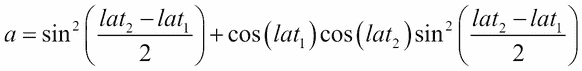

# 第三章功能定义

在本章中，我们将介绍以下配方：

*   使用可选参数设计函数
*   使用超灵活的关键字参数
*   使用*分隔符强制使用仅关键字参数
*   在函数参数上编写显式类型
*   基于部分函数选择参数的顺序
*   使用 RST 标记编写清晰的文档字符串
*   围绕 Python 的堆栈限制设计递归函数
*   使用脚本库开关编写可重用脚本

# 导言

函数定义是将大问题分解为小问题的一种方法。数学家们已经做了几个世纪了。这也是一种将 Python 编程打包成智能可管理块的方法。

我们将在这些食谱中介绍一些函数定义技术。这将包括处理灵活参数的方法，以及根据一些更高层次的设计原则组织参数的方法。

我们还将介绍 Python3.5 类型化模块，以及如何为函数创建更正式的注释。我们可以开始使用`mypy`项目对所使用的数据类型进行更正式的断言。

# 设计具有可选参数的功能

定义函数时，我们通常需要可选参数。这使我们能够编写更灵活的函数，并且可以在更多情况下使用。

我们也可以将此视为创建一系列密切相关的函数的一种方法，每个函数都有一个稍微不同的参数集合，称为**签名**，但都有相同的简单名称。许多函数共享同一名称的想法可能有点令人困惑。因此，我们将更多地关注可选参数的概念。

可选参数的一个例子是`int()`功能。这有两种形式：

*   `int(str)`：例如`int('355')`的值有`355`的值。在本例中，我们没有为可选的`base`参数提供值；使用了默认值`10`。
*   `int(str, base)`：例如`int('0x163', 16)`的值为`355`。在本例中，我们为`base`参数提供了一个值。

## 准备好了吗

很多游戏都依赖于骰子的收集。赌场游戏*骰子*使用两个骰子。像*Zillch*（或*贪婪*或*一万*这样的游戏使用六个骰子。游戏的变体可能会使用更多。

有一个骰子滚动功能可以处理所有这些变化，这很方便。我们如何编写一个适用于任意数量骰子的骰子模拟器，但将使用两个作为方便的默认值？

## 怎么做。。。

我们有两种方法来设计具有可选参数的函数：

*   **一般到特殊**：我们从设计最通用的解决方案开始，并为最常见的情况提供方便的默认值。
*   **从特殊到一般**：我们从设计几个相关功能开始。然后，我们将它们合并到一个涵盖所有情况的通用函数中，选择一个原始函数作为默认行为。

### 针对总体设计

在遵循从特定到一般的策略时，我们将设计几个单独的功能并寻找共同的功能：

1.  Write one version of the function. We'll start with the *Craps* game because it seems simplest:

    ```py
    >>> import random

    >>> def die():

    ...    return random.randint(1,6)

    >>> def craps():

    ...    return (die(), die())

    ```

    我们定义了一个方便的助手函数`die()`，它封装了一个基本事实，即有时所谓的标准骰子。有五种柏拉图式实体可以被压入使用，产生四面、六面、八面、十二面和二十面骰子。六面骰子有着悠久的历史，从*Astragali*骨骼开始，很容易被修剪成六面立方体。

    下面是基础`die()`函数的一个示例：

    ```py
    >>> random.seed(113)

    >>> die(), die()

    (1, 6)

    ```

    我们已经滚动了两个骰子，以展示如何组合这些值来滚动更大的骰子堆。

    我们的*骰子*游戏功能如下：

    ```py
    >>> craps()

    (6, 3)

    >>> craps()

    (1, 4)

    ```

    这显示了*骰子*游戏的两个骰子。

2.  Write another version of the function:

    ```py
    >>> def zonk():

    ...    return tuple(die() for x in range(6))

    ```

    我们使用生成器表达式创建了一个带有六个骰子的元组对象。我们将在[第 8 章](08.html#page "Chapter 8. Functional and Reactive Programming Features")、*功能性和反应性编程特性*中深入了解生成器表达式。

    我们的生成器表达式有一个变量`x`，它被忽略。通常也会将其写成`tuple(die() for _ in range(6))`。变量`_`是一个有效的 Python 变量名；这个名字可以用来暗示我们永远不想看到这个变量的值。

    下面是一个使用`zonk()`函数的示例：

    ```py
    >>> zonk()

    (5, 3, 2, 4, 1, 1)

    ```

    这向我们展示了一卷六个独立的骰子。有一条短直道（1-5）和一对直道。在某些版本的游戏中，这是一个很好的得分手。

3.  Locate the common features in the two functions. This may require some rewriting of the various functions to locate a common design. In many cases, we'll wind up introducing additional variables to replace constants or other assumptions.

    在这种情况下，我们可以推广两元组的创建。我们可以引入一个基于`range(2)`的生成器表达式，对`die()`函数进行两次求值，而不是硬连接两次`die()`函数求值：

    ```py
    >>> def craps():

    ...     return tuple(die() for x in range(2))

    ```

    这似乎比解决特定的两个骰子问题所需的代码还要多。从长远来看，使用一个通用函数意味着我们可以消除一些特定函数。

4.  Merge the two functions. This will often involve exposing a variable that had previously been a constant or other hardwired assumption:

    ```py
    >>> def dice(n):

    ...     return tuple(die() for x in range(n))

    ```

    这提供了一个通用功能，涵盖了*垃圾桶*和*宗克*的需求：

    ```py
    >>> dice(2)

    (3, 2)

    >>> dice(6)

    (5, 3, 4, 3, 3, 4)

    ```

5.  Identify the most common use case, and make this the default value for any parameters that were introduced. If our most common simulation was *Craps* , we might do this:

    ```py
    >>> def dice(n=2):

    ...     return tuple(die() for x in range(n))

    ```

    现在我们可以简单地将`dice()`用于*垃圾*。我们需要将`dice(6)`用于*Zonk*。

### 一般至特殊设计

当遵循从一般到特殊的策略时，我们将首先确定所有需求。我们通常会通过在需求中引入变量来实现这一点：

1.  Summarize the requirements for dice-rolling. We might have a list like this:
    *   *骰子*：两个骰子。
    *   *宗克*的第一卷：六个骰子。
    *   *宗*中的后续掷骰：一到六个骰子。

    此需求列表显示了掷*n*骰子的共同主题。

2.  Rewrite the requirements with an explicit parameter in place of any literal value. We'll replace all of our numbers with a parameter, *n* , and show the values for this new parameter that we've introduced:
    *   *骰子*：*n*骰子，其中*n=2*。
    *   *宗*中的第一个骰子：*n*骰子，其中*n=6*。
    *   *宗*：*n*骰子中的后续掷骰，其中*1≤ N≤ 6*。

    这里的目标是绝对确保所有的变体都有一个共同的抽象。在更复杂的问题中，类似的东西可能没有共同的规范。

    我们还想确定，我们已经正确地参数化了各个函数。在更复杂的情况下，我们可能有不需要参数化的值；它们可以保持不变。

3.  Write the function that fits the general pattern:

    ```py
    >>> def dice(n):

    ...    return (die() for x in range(n))

    ```

    在第三种情况下，*Zonk*中的后续滚动，我们确定了*1 的约束≤ N≤ 6*。我们需要确定这是属于`dice()`函数的约束，还是使用`dice`函数的模拟应用程序对骰子施加的约束。

    在这种情况下，约束是不完整的。*Zonk*的规则要求未滚动的骰子形成某种计分模式。限制不仅仅是骰子的数量在 1 到 6 之间；约束绑定到游戏状态。似乎没有很好的理由将`dice()`函数与游戏状态联系起来。

4.  Provide a default value for the most common use case. If our most common simulation was *Craps* , we might do this:

    ```py
    >>> def dice(n=2):

    ...     return tuple(die() for x in range(n))

    ```

    现在我们可以简单地将`dice()`用于*垃圾*。我们需要将`dice(6)`用于*Zonk*。

## 它是如何工作的。。。

Python 提供参数值的规则非常灵活。有几种方法可以确保每个参数都有一个值。我们可以想象它是这样工作的：

1.  将每个参数设置为任何提供的默认值。
2.  对于没有名称的参数，参数值将按位置分配给参数。
3.  对于具有名称的参数（例如，`dice(n=2)`），参数值是使用名称指定的。按位置和名称分配参数是错误的。
4.  如果任何参数没有值，则这是一个错误。

这些规则允许我们根据需要提供默认值。它们还允许我们将位置值与命名值混合使用。默认值的存在使参数成为可选的。

使用可选参数源于两个考虑因素：

*   我们可以参数化处理吗？
*   该参数最常见的参数值是什么？

在过程定义中引入参数可能是一项挑战。在某些情况下，编写代码有助于用参数替换文字值（如 2 或 6）。

但是，在某些情况下，不需要用参数替换文本值。它可以保留为文字值。我们并不总是想用一个参数替换每个文本。例如，我们的`die()`函数的文字值为 6，因为我们只对标准立方骰子感兴趣。这不是一个参数，因为我们认为没有必要制作更通用的模具。

## 还有更多。。。

如果我们想非常彻底，我们可以编写一些函数，这些函数是更一般化的函数的专门版本。这些功能可以简化应用程序：

```py
>>> def craps():

...     return dice(2)

>>> def zonk():

...     return dice(6)

```

我们的应用程序特性–`craps()`和`zonk()`依赖于一个通用函数`dice()`。这又取决于另一个功能`die()`。我们将在*基于部分函数*配方为参数选择订单中重新讨论这个想法。

这堆依赖项中的每一层都引入了一个方便的抽象，使我们不必理解太多的细节。这种分层抽象的思想有时被称为**组块**。这是一种通过隔离细节来管理复杂性的方法。

此设计模式的一个常见扩展是在此功能层次结构中提供多个级别的参数。如果我们想要参数化`die()`函数，我们将同时为`dice()`和`die()`提供参数。

对于这个更复杂的参数化，我们需要在层次结构中引入更多带有默认值的参数。我们将首先向`die()`添加一个参数。此参数必须具有默认值，以便我们不会破坏任何现有测试用例：

```py
>>> def die(sides=6):

...     return random.randint(1,6)

```

在抽象堆栈的底部引入此参数后，我们需要向更高级别的函数提供此参数：

```py
>>> def dice(n=2, sides=6): 

... return tuple(die(sides) for x in range(n))

```

我们现在有很多使用`dice()`功能的方法：

*   所有默认值：`dice()`很好地覆盖了*垃圾*。
*   所有位置参数：`dice(6, 6)`将涵盖*宗克*。
*   位置参数和命名参数的混合：必须首先提供位置值，因为顺序很重要。例如，`dice(2, sides=8)`将涵盖使用两个八面骰子的游戏。
*   所有命名参数：`dice(sides=4, n=4)`这将处理我们需要模拟滚动四个四面体骰子的情况。使用所有命名参数时，顺序并不重要。

在本例中，我们的函数堆栈只有两层。在更复杂的应用程序中，我们可能必须在层次结构的许多层上引入参数。

## 另见

*   我们将在*基于部分函数*配方为参数选择顺序中扩展其中一些想法。
*   我们使用了涉及不可变对象的可选参数。在这个食谱中，我们关注的是数字。在[第 4 章](04.html#page "Chapter 4. Built-in Data Structures – list, set, dict")、*内置数据结构–列表、集合、dict*中，我们将研究可变对象，它们具有可更改的内部状态。在*避免函数参数的可变默认值*配方中，我们将了解一些额外的注意事项，这些注意事项对于设计具有可变对象的可选值的函数非常重要。

# 使用超灵活的关键字参数

一些设计问题涉及在给定足够多已知值的情况下求解一个简单的未知方程。例如，速率、时间和距离具有简单的线性关系。我们可以解决任何一个给定的其他两个。以下是我们可以用作示例的三条规则：

*   *d=r*×*t*
*   *r=d/t*
*   *t=d/r*

例如，在设计电路时，根据欧姆定律使用一组类似的方程式。在这种情况下，方程式将电阻、电流和电压联系在一起。

在某些情况下，我们希望提供一个简单、高性能的软件实现，它可以基于已知和未知执行三种不同计算中的任何一种。我们不想使用一般的代数框架；我们希望将这三个解决方案捆绑成一个简单、高效的函数。

## 准备好了吗

我们将构建一个函数，通过包含给定任意两个已知值的所有三个解，来解决**速率-时间-距离**（**RTD**）计算。对于较小的变量名更改，这适用于数量惊人的实际问题。

这里有个窍门。我们不一定想要一个单一值的答案。通过创建一个包含三个值的小型 Python 字典，我们可以稍微概括一下这一点。我们将在[第 4 章](04.html#page "Chapter 4. Built-in Data Structures – list, set, dict")、*内置数据结构中进一步了解字典–列表、集合、dict*。

当出现问题时，我们将使用`warnings`模块，而不是引发异常：

```py
>>> import warnings

```

有时，产生令人怀疑的结果比停止处理更有帮助。

## 怎么做。。。

求解每个未知数的方程。我们已经证明，之前对于*d=r*t*，RTD 计算：

1.  这导致了三种不同的表达方式：
    *   距离=速率*时间
    *   速率=距离/时间
    *   时间=距离/速率
2.  将每个表达式包装在一个`if`语句中，该语句基于一个未知的`None`值：

    ```py
            if distance is None:
                distance = rate * time
            elif rate is None:
                rate = distance / time
            elif time is None:
                time = distance / rate

    ```

3.  请参考[第 2 章](02.html#page "Chapter 2. Statements and Syntax")中的*设计复杂 if…elif 链*配方、*语句和语法*，了解设计这些复杂`if...elif`链的指导。包括`else`碰撞选项的变体：

    ```py
            else:
                warnings.warning( "Nothing to solve for" )

    ```

4.  生成结果字典对象。在简单的情况下，我们可以使用`vars()`函数简单地将所有局部变量作为结果字典发出。在某些情况下，我们可能不想包含局部变量；在这种情况下，我们需要显式地构建字典：

    ```py
            return dict(distance=distance, rate=rate, time=time)

    ```

5.  使用关键字参数将所有这些包装为函数：

    ```py
            def rtd(distance=None, rate=None, time=None):
                if distance is None:
                    distance = rate * time
                elif rate is None:
                    rate = distance / time
                elif time is None:
                    time = distance / rate
                else:
                    warnings.warning( "Nothing to solve for" )
                return dict(distance=distance, rate=rate, time=time)

    ```

我们可以这样使用结果函数：

```py
>>> def rtd(distance=None, rate=None, time=None):
...     if distance is None:
...         distance = rate * time
...     elif rate is None:
...         rate = distance / time
...     elif time is None:
...         time = distance / rate
...     else:
...         warnings.warning( "Nothing to solve for" )
...     return dict(distance=distance, rate=rate, time=time)
>>> rtd(distance=31.2, rate=6) 
{'distance': 31.2, 'time': 5.2, 'rate': 6} 

```

这表明以 6 节的速度行驶 31.2 海里需要 5.2 小时。

对于格式良好的输出，我们可以执行以下操作：

```py
>>> result= rtd(distance=31.2, rate=6)

>>> ('At {rate}kt, it takes '

... '{time}hrs to cover {distance}nm').format_map(result)

'At 6kt, it takes 5.2hrs to cover 31.2nm'

```

为了打破长串，我们使用了[第 2 章](02.html#page "Chapter 2. Statements and Syntax")中的*设计复杂 if…elif 链*配方、*语句和语法*。

## 它是如何工作的。。。

因为我们已经为所有参数提供了默认值，所以我们可以为三个参数中的两个提供参数值，然后函数可以为第三个参数求解。这使我们不必编写三个单独的函数。

将字典作为最终结果返回并不是必需的。它很方便。无论提供了哪些参数值，它都允许我们获得统一的结果。

## 还有更多。。。

我们对此有一个替代方案，一个更具灵活性的方案。Python 函数有一个*所有其他关键字*参数，前缀为`**`。通常是这样显示的：

```py
    def rtd2(distance, rate, time, **keywords): 
        print(keywords) 

```

任何其他关键字参数都会收集到提供给`**keywords`参数的字典中。然后我们可以用额外的参数调用这个函数。按如下方式评估此函数：

```py
    rtd2(rate=6, time=6.75, something_else=60) 

```

然后我们将看到，`keywords`参数的值是一个 dictionary 对象，其值为`{'something_else': 60}`。然后，我们可以在此结构上使用普通的字典处理技术。本词典中的键和值是计算函数时提供的名称和值。

我们可以利用这一点，并坚持所有参数都提供关键字：

```py
    def rtd2(**keywords): 
        rate= keywords.get('rate', None) 
        time= keywords.get('time', None) 
        distance= keywords.get('distance', None) 
        etc. 

```

此版本使用 dictionary`get()`方法在 dictionary 中查找给定的键。如果该键不存在，则提供默认值`None`。

（返回默认值`None`是`get()`方法的默认行为。我们的示例包含一些冗余以澄清处理过程。对于一些非常复杂的情况，我们可能有`None`以外的默认值。）

这有一个潜在的优势，即稍微灵活一些。它的潜在缺点是很难识别实际参数名称。

我们可以按照*使用 RST 标记*方法编写清晰的文档字符串，并提供良好的文档字符串。不过，在某种程度上，作为 Python 代码的一部分显式地提供参数名称似乎比通过文档隐式地提供参数名称要好。

## 另见

*   我们将在*编写**带有 RST 标记的清晰文档字符串*配方中查看函数的文档

# 强制使用*分隔符的仅关键字参数

在某些情况下，函数有大量的位置参数。也许我们遵循了*使用可选参数*设计函数的方法，这导致我们设计了一个包含如此多参数的函数，这让我们感到困惑。

实际上，一个包含三个以上参数的函数可能会令人困惑。许多传统的数学似乎都关注单参数和双参数函数。似乎没有太多涉及三个或更多操作数的常见数学运算符。

当难以记住参数的所需顺序时，参数太多。

## 准备好了吗

我们将研究一个具有大量参数的函数。我们将使用一个函数来准备 wind chill 表并将数据写入 CSV 格式的输出文件。

我们需要提供温度范围、风速范围以及我们想要创建的文件的信息。这是很多参数。

基本公式如下：

*T<sub>wc</sub>*（*T<sub>a</sub>、V*）=13.12+0.6215*T<sub>a</sub>*-11.37*V*0.16+0.3965<sub>a</sub>V【T10.16】

风寒温度*T<sub>wc</sub>*基于气温*T<sub>a</sub>*，单位为*C*，风速*V*单位为 KPH。

对于美国人来说，这需要一些转换：

*   从华氏度转换为摄氏度：*摄氏度*=5（*华氏度*-32）/9
*   将风速从每小时*V<sub>米</sub>米*转换为每小时*V<sub>k</sub>*：*V<sub>k</sub>=V<sub>米</sub>*×1.609344
*   结果需要从摄氏度转换回华氏度：*华氏度*=32+*摄氏度*（9/5）

我们不会将这些折叠到这个解决方案中。我们将把它作为练习留给读者。

创建风寒表的一种方法是创建如下内容：

```py
    import pathlib 

    def Twc(T, V): 
        return 13.12 + 0.6215*T - 11.37*V**0.16 + 0.3965*T*V**0.16 

    def wind_chill(start_T, stop_T, step_T, 
        start_V, stop_V, step_V, path): 
        """Wind Chill Table.""" 
        with path.open('w', newline='') as target: 
            writer= csv.writer(target) 
            heading = [None]+list(range(start_T, stop_T, step_T)) 
            writer.writerow(heading) 
            for V in range(start_V, stop_V, step_V): 
                row = [V] + [Twc(T, V) 
                    for T in range(start_T, stop_T, step_T)] 
                writer.writerow(row) 

```

我们已经使用`with`上下文打开了一个输出文件。这遵循了[第 2 章](02.html#page "Chapter 2. Statements and Syntax")、*语句和语法*中的*使用 with 语句*配方管理上下文。在此上下文中，我们为 CSV 输出文件创建了一个写操作。我们将在[第 9 章](09.html#page "Chapter 9. Input/Output, Physical Format, and Logical Layout")*输入/输出、物理格式、逻辑布局*中更深入地了解这一点。

我们使用了一个表达式`[None]+list(range(start_T, stop_T, step_T))`来创建标题行。此表达式包括一个列表文字和一个生成列表的生成器表达式。我们来看看[第 4 章](04.html#page "Chapter 4. Built-in Data Structures – list, set, dict")中的列表，*内置数据结构–列表、集合、dict*。我们将在[第 8 章](08.html#page "Chapter 8. Functional and Reactive Programming Features")、*功能性和反应性编程特性*中查看生成器表达式。

类似地，表的每个单元格都由生成器表达式`[Twc(T, V) for T in range(start_T, stop_T, step_T)]`构建。这是构建列表对象的理解。该列表包括由风寒函数`Twc()`计算的值。我们根据表中的行提供风速。我们根据表中的列提供温度。

虽然细节涉及前瞻性章节，`def`行存在问题。这条`def`线非常复杂。

这种设计的问题在于`wind_chill()`功能有七个位置参数。当我们尝试使用此函数时，我们得到如下代码：

```py
    import pathlib 
    p=pathlib.Path('code/wc.csv') 
    wind_chill(0,-45,-5,0,20,2,p) 

```

这些数字是多少？我们可以做些什么来帮助解释这行代码的含义吗？

## 怎么做。。。

当我们有大量参数时，使用关键字参数而不是位置参数会有所帮助。

在 Python3 中，我们有一种强制使用关键字参数的技术。我们可以使用`*`作为两组参数之间的分隔符：

1.  在`*`之前，我们列出了参数值，这些参数值可以是*位置的，也可以是按关键字命名的。在本例中，我们没有任何这些参数。*
2.  在`*`之后，我们列出了必须用关键字给出的参数值。对于我们的示例，这是所有参数。

对于我们的示例，结果函数如下所示：

```py
    def wind_chill(*, start_T, stop_T, step_T, start_V, stop_V, step_V, path): 

```

当我们尝试使用令人困惑的位置参数时，我们将看到：

```py
>>> wind_chill(0,-45,-5,0,20,2,p) 
Traceback (most recent call last): 
  File "<stdin>", line 1, in <module> 
TypeError: wind_chill() takes 0 positional arguments but 7 were given

```

我们必须使用以下功能：

```py
    wind_chill(start_T=0, stop_T=-45, step_T=-5, 
        start_V=0, stop_V=20, step_V=2, 
        path=p) 

```

强制关键字参数的使用迫使我们每次使用这个复杂函数时都要写一条清晰的语句。

## 它是如何工作的。。。

`*`字符在函数定义中有两种含义：

*   它用作接收所有不匹配位置参数的特殊参数的前缀。我们经常使用`*args`将所有位置参数收集到一个名为`args`的参数中。
*   它自己使用，作为可以在位置上应用的参数和必须由关键字提供的参数之间的分隔符。

`print()`函数就是一个例子。它有三个仅用于输出文件的关键字参数、字段分隔符字符串和行结束字符串。

## 还有更多。。。

当然，我们可以将此技术与各种参数的默认值相结合。例如，我们可以对此进行更改：

```py
    import sys 
    def wind_chill(*, start_T, stop_T, step_T, start_V, stop_V, step_V, output=sys.stdout): 

```

我们现在可以通过两种方式使用此功能：

*   这里有一种在控制台上打印表格的方法：

    ```py
                wind_chill( 
                    start_T=0, stop_T=-45, step_T=-5, 
                    start_V=0, stop_V=20, step_V=2) 

    ```

*   这里有一种写入文件的方法：

    ```py
                path = pathlib.Path("code/wc.csv") 
                with path.open('w', newline='') as target: 
                    wind_chill(output=target, 
                        start_T=0, stop_T=-45, step_T=-5, 
                        start_V=0, stop_V=20, step_V=2) 

    ```

我们在这里改变了方法，改为更一般化的方法。这遵循*设计功能和可选参数*配方。

## 另见

*   有关此技术的另一个应用，请参见*基于部分函数选择参数订单*配方

# 在函数参数上写显式类型

Python 语言允许我们编写数据类型完全通用的函数（和类）。把这个函数当作一个例子：

```py
    def temperature(*, f_temp=None, c_temp=None): 
        if c_temp is None: 
            return {'f_temp': f_temp, 'c_temp': 5*(f_temp-32)/9} 
        elif f_temp is None: 
            return {'f_temp': 32+9*c_temp/5, 'c_temp': c_temp} 
        else: 
            raise Exception("Logic Design Problem") 

```

这遵循了前面显示的三个方法：*使用超灵活的关键字参数*、*使用本章中的*分隔符*强制使用仅关键字参数，以及*从[第 2 章](02.html#page "Chapter 2. Statements and Syntax")设计复杂的 if…elif 链*、*语句和语法*。

此函数适用于任何数值类型的参数值。实际上，它适用于实现`+`、`-`、`*`和`/`运算符的任何数据结构。

有时我们不希望我们的函数是完全通用的。在某些情况下，我们希望对数据类型做出更有力的断言。虽然我们有时关心数据类型，但我们不希望编写大量类似以下内容的代码：

```py
    from numbers import Number 
    def c_temp(f_temp): 
        assert isinstance(F, Number) 
        return 5*(f_temp-32)/9 

```

这引入了额外的`assert`语句的性能开销。它还让我们的程序变得杂乱无章，因为通常情况下，该语句应该重述显而易见的内容。

此外，我们不能依赖 docstring 进行测试。以下是推荐的样式：

```py
    def temperature(*, f_temp=None, c_temp=None): 
        """Convert between Fahrenheit temperature and 
        Celsius temperature. 

        :key f_temp: Temperature in °F. 
        :key c_temp: Temperature in °C. 
        :returns: dictionary with two keys: 
            :f_temp: Temperature in °F. 
            :c_temp: Temperature in °C. 
        """

```

docstring 不允许任何自动测试来确认文档是否与代码匹配。这两个人可能会意见相左。

我们想要的是有关可用于测试和确认的数据类型的提示，但不要影响性能。我们如何提供有意义的类型提示？

## 准备好了吗

我们将实现一个版本的`temperature()`函数。我们需要两个模块来帮助我们提供有关参数和返回值的数据类型的提示：

```py
    from typing import * 

```

我们选择从`typing`模块导入所有名称。如果我们要提供类型提示，我们希望它们简洁。写`typing.List[str]`很尴尬。我们宁愿省略模块名。

我们还需要安装最新版本的`mypy`。这个项目正在迅速发展。与其使用`pip`程序从 PyPI 获取副本，不如直接从 GitHub 存储库[下载最新版本 https://github.com/JukkaL/mypy](https://github.com/JukkaL/mypy) 。

说明书上说，*目前，PyPI 上的 mypy 版本与 Python 3.5 不兼容。如果您直接从 git*运行 Python 3.5 安装。

```py
$ pip3 install git+git://github.com/JukkaL/mypy.git

```

`mypy`工具可用于分析 Python 程序，以确定类型提示是否与实际代码匹配。

## 怎么做。。。

Python3.5 在语言中引入了类型提示。我们可以在三个地方使用它们：函数参数、函数返回和类型提示注释：

1.  Define a handy type for a variety of numbers:

    ```py
            from decimal import Decimal 
            from typing import * 
            Number = Union[int, float, complex, Decimal] 

    ```

    理想情况下，我们希望在数字模块中使用抽象的`Number`类。目前，该模块没有正式的类型规范，因此我们将定义自己对`Number`的期望。此定义是多个数字类型的并集。理想情况下，`mypy`或 Python 的未来版本将包含所需的定义。

2.  Annotate arguments to functions like this:

    ```py
            def temperature(*, 
                f_temp: Optional[Number]=None, 
                c_temp: Optional[Number]=None): 

    ```

    我们已经添加了`:`和一个类型提示作为参数的一部分。在本例中，我们使用自己的类型定义`Number`来声明此处允许任何数字。我们用`Optional[]`类型的操作将其包装起来，以说明参数值可以是`Number`或`None`。

3.  Annotate return values from functions like this:

    ```py
            def temperature(*, 
                f_temp: Optional[Number]=None, 
                c_temp: Optional[Number]=None) -> Dict[str, Number]: 

    ```

    我们为这个函数的返回值添加了`->`和类型提示。在本例中，我们已经声明，结果将是一个 dictionary 对象，其中的键是字符串`str`，值是使用我们的类型定义`Number`的数字。

    `typing`模块引入类型提示名称，如`Dict`，我们用来解释函数的结果。这与实际构建对象的`dict`类不同。`typing.Dict`只是一个暗示。

4.  If necessary, we can add type hints as comments in assignment and `with` statements. These are rarely needed, but may clarify a long, complex series of statements. If we wanted to add them, the annotations could look like this:

    ```py
            result = {'c_temp': c_temp, 
                'f_temp': f_temp} # type: Dict[str, Number] 

    ```

    我们在构建最终 dictionary 对象的语句中添加了`# type: Dict[str, Number]`。

## 它是如何工作的。。。

我们添加的类型信息称为**提示**。它们不是 Python 编译器以某种方式检查的需求。它们也不会在运行时被检查。

类型提示由单独的程序`mypy`使用。参见[http://mypy-lang.org](http://mypy-lang.org) 了解更多信息。

`mypy`程序检查 Python 代码，包括类型提示。它应用一些形式化的推理和推理技术来确定各种类型的提示对于 Python 程序可以处理的任何数据是否都是`true`。

对于更大、更复杂的程序，`mypy`的输出将包括警告和错误，这些警告和错误描述了代码本身或修饰代码的类型提示的潜在问题。

例如，这里有一个很容易犯的错误。我们假设函数返回一个数字。然而，我们的回报声明与我们的预期不符：

```py
    def temperature_bad(*, 
        f_temp: Optional[Number]=None, 
        c_temp: Optional[Number]=None) -> Number: 

        if c_temp is None: 
            c_temp = 5*(f_temp-32)/9 
        elif f_temp is None: 
            f_temp = 32+9*c_temp/5 
        else: 
            raise Exception( "Logic Design Problem" ) 
        result = {'c_temp': c_temp, 
            'f_temp': f_temp} # type: Dict[str, Number] 
        return result 

```

当我们运行`mypy`时，我们会看到：

```py
    ch03_r04.py: note: In function "temperature_bad": 
    ch03_r04.py:37: error: Incompatible return value type: 
        expected Union[builtins.int, builtins.float, builtins.complex, decimal.Decimal], 
        got builtins.dict[builtins.str, 
        Union[builtins.int, builtins.float, builtins.complex, decimal.Decimal]] 

```

我们可以在错误消息中看到我们的`Number`类型名称已扩展为`Union[builtins.int, builtins.float, builtins.complex, decimal.Decimal]`。更重要的是，我们可以看到第 37 行，`return`语句与函数定义不匹配。

鉴于此错误，我们需要修复返回或定义，以确保预期类型和实际类型匹配。不清楚哪个是*对*。其中任何一个都可能是目的：

*   计算并返回单个值：这意味着根据计算的值，需要有两个`return`语句。在这种情况下，没有理由构建`result`字典对象。
*   返回 dictionary 对象：这意味着我们需要更正`def`语句以获得正确的返回类型。更改此选项可能会将更改的涟漪传播到期望`temperature`返回`Number`实例的其他函数。

参数和返回值的额外语法对运行时没有实际影响，并且当源代码第一次编译成字节码时，成本非常小。它们毕竟只是暗示。

## 还有更多。。。

当使用内置类型时，我们通常可以创建复杂的结构。例如，我们可能有一个字典，将三个整数的元组映射到字符串列表：

```py
    a = {(1, 2, 3): ['Poe', 'E'], 
         (3, 4, 5): ['Near', 'a', 'Raven'], 
        } 

```

如果这是函数的结果，我们如何描述它？

我们将创建一个相当复杂的类型表达式，总结结构的每一层：

```py
Dict[Tuple[int, int, int], List[str]] 

```

我们总结了一个字典，它将一个类型`Tuple[int, int, int]`作为键映射到另一个类型`List[str]`作为值。这捕获了如何组合多个内置类型以构建复杂的数据结构。

在本例中，我们将三个整数的元组视为一个匿名元组。在许多情况下，它不仅仅是一个通用元组，它实际上是一个 RGB 颜色，它被建模为一个元组。也许字符串列表实际上是一行较长文档中的文本，这些文本在空格处被拆分为单词。

在这种情况下，我们应该执行以下操作：

```py
Color = Tuple[int, int, int] 
Line = List[str] 
Dict[Color, Line] 

```

创建我们自己的特定于应用程序的类型名可以极大地澄清使用内置集合类型执行的处理。

## 另见

*   参见[https://www.python.org/dev/peps/pep-0484/](https://www.python.org/dev/peps/pep-0484/) 了解有关类型提示的更多信息。
*   参见[https://github.com/JukkaL/mypy](https://github.com/JukkaL/mypy) 用于当前`mypy`项目。
*   参见[http://www.mypy-lang.org](http://www.mypy-lang.org) 获取关于`mypy`如何使用 Python 3 的文档。

# 根据部分函数选择参数订单

当我们研究复杂函数时，有时会看到函数使用方式的模式。例如，我们可能会使用上下文固定的某些参数值以及随处理细节而变化的其他参数值多次对函数求值。

如果我们的设计反映了这一点，它可以简化我们的编程。我们希望提供一种方法，使常用参数比不常用参数更易于使用。我们还希望避免重复作为更大上下文一部分的参数。

## 准备好了吗

我们来看看哈弗森公式的一个版本。这将使用该点的纬度和经度坐标计算地球表面各点之间的距离：



*c*=2*弧 sin(√a）*

基本计算得出两点之间的中心角*c*。角度以弧度为单位测量。我们用地球的平均半径乘以一些单位，把它转换成距离。如果我们将角度*c*乘以 3959 英里的半径，即距离，我们将把角度转换为英里。

下面是这个函数的一个实现。我们提供了类型提示：

```py
    from math import radians, sin, cos, sqrt, asin 

    MI= 3959 
    NM= 3440 
    KM= 6372 

    def haversine(lat_1: float, lon_1: float, 
        lat_2: float, lon_2: float, R: float) -> float: 
        """Distance between points. 

        R is Earth's radius. 
        R=MI computes in miles. Default is nautical miles. 

    >>> round(haversine(36.12, -86.67, 33.94, -118.40, R=6372.8), 5) 
    2887.25995 
    """ 
    Δ_lat = radians(lat_2) - radians(lat_1) 
    Δ_lon = radians(lon_2) - radians(lon_1) 
    lat_1 = radians(lat_1) 
    lat_2 = radians(lat_2) 

    a = sin(Δ_lat/2)**2 + cos(lat_1)*cos(lat_2)*sin(Δ_lon/2)**2 
    c = 2*asin(sqrt(a)) 

    return R * c 

```

### 注

请注意 doctest 示例：

doctest 示例使用了一个地球半径和一个其他地方没有使用的额外小数点。这是为了使本示例与其他联机示例相匹配。

地球不是球形的。在赤道周围，更精确的半径是 6378.1370 公里。穿过两极，半径为 6356.7523 公里。我们在常数中使用公共近似。

我们经常遇到的问题是，我们通常在一个单一的环境中工作，并且我们将一直为`R`提供相同的值。例如，如果我们在海洋环境中工作，我们总是使用`R = NM`来获得海里数。

有两种常见的方法可以为参数提供一致的值。我们两个都来看看。

## 怎么做。。。

在某些情况下，整个上下文将为参数建立一个变量。该值几乎不会改变。有几种常见的方法可以为参数提供一致的值。这涉及到将函数包装到另一个函数中。有几种方法：

*   将函数包装为新函数。
*   创建一个分部函数。这有两个进一步的改进：
    *   我们可以提供关键字参数
    *   或者我们可以提供位置参数

我们将在本食谱的不同版本中逐一介绍。

### 包装函数

我们可以通过在特定于上下文的包装函数中包装通用函数来提供上下文值：

1.  Make some parameters positional and some parameters keywords. We want the contextual features—the ones which change rarely—to be keywords. The parameters which change more frequently should be left as positional. We can follow the *Forcing keyword-only arguments with the * separator* recipe.

    我们可以将基本的 haversine 函数更改为如下所示：

    ```py
            def haversine(lat_1: float, lon_1: float, 
                lat_2: float, lon_2: float, *, R: float) -> float: 

    ```

    我们插入`*`将参数分为两组。第一组可以按位置或关键字提供参数。第二组，在本例中为`R`，必须通过关键字给出。

2.  We can then write a wrapper function the will apply all of the positional arguments unmodified. It will supply the additional keyword argument as part of the long-running context:

    ```py
            def nm_haversine(*args): 
                return haversine(*args, R=NM) 

    ```

    我们在函数声明中使用了`*args`构造，以接受单个元组`args`中的所有位置参数值。在计算`haversine()`函数时，我们还使用`*args`将元组扩展为该函数的所有位置参数值。

### 使用关键字参数创建部分函数

分部函数是提供了一些参数值的函数。当我们计算部分函数时，我们将先前提供的参数与附加参数混合。一种方法是使用关键字参数，类似于包装函数：

1.  我们可以使用*separator 方法遵循*强制关键字参数。我们可以将基本的 haversine 函数改为如下：

    ```py
            def haversine(lat_1: float, lon_1: float, 
                lat_2: float, lon_2: float, *, R: float) -> float: 

    ```* 
2.  Create a partial function using the keyword parameter:

    ```py
            from functools import partial 
            nm_haversine = partial(haversine, R=NM) 

    ```

    `partial()`函数从现有函数和一组具体的参数值构建一个新函数。`nm_haversine()`函数有一个特定的`R`值，该值是在构建分部时提供的。

我们可以像使用任何其他函数一样使用它：

```py
>>> round(nm_haversine(36.12, -86.67, 33.94, -118.40), 2) 
1558.53

```

我们得到了以海里为单位的答案，这样我们就可以进行与划船相关的计算，而不必耐心地检查每次使用`haversine()`函数时是否有`R=NM`作为参数。

### 创建带位置参数的局部函数

分部函数是提供了一些参数值的函数。当我们计算部分函数时，我们提供了额外的参数。另一种方法是使用位置参数。

如果我们尝试将`partial()`与位置参数一起使用，则我们只能在部分定义中提供最左边的参数值。这导致我们将函数的前几个参数视为被部分函数或包装器隐藏的候选参数：

1.  我们可以将基本的`haversine`函数更改为如下所示：

    ```py
            def haversine(R: float, lat_1: float, lon_1: float, 
                lat_2: float, lon_2: float) -> float: 

    ```

2.  Create a partial function using the positional parameter:

    ```py
            from functools import partial 
            nm_haversine = partial(haversine, NM) 

    ```

    `partial()`函数从现有函数和一组具体的参数值构建一个新函数。`nm_haversine()`函数对第一个参数`R`有一个特定值，该参数是在构建分部时提供的。

我们可以像使用任何其他函数一样使用它：

```py
>>> round(nm_haversine(36.12, -86.67, 33.94, -118.40), 2) 
1558.53 

```

我们得到了以海里为单位的答案，这样我们就可以进行与划船相关的计算，而不必耐心地检查每次使用`haversine()`函数时是否有`R=NM`作为参数。

## 它是如何工作的。。。

分部函数本质上与包装器函数相同。虽然它为我们节省了一行代码，但它还有一个更重要的用途。我们可以在其他更复杂的程序块中间自由地构建部分。对此，我们不需要使用`def`语句。

请注意，在查看位置参数的顺序时，创建分部函数会带来一些额外的注意事项：

*   当我们使用`*args`时，它必须是最后一个。这是语言要求。这意味着前面的参数可以被明确识别，其余的都是匿名的，并且可以整体地传递给包装函数。
*   创建分部函数时，最左侧的位置参数最容易提供值。

这两个考虑因素使我们将最左端的论点视为一个更大的背景：这些预期很少改变。最右边的参数提供详细信息并经常更改。

## 还有更多。。。

还有第三种包装函数的方法，我们也可以构建一个`lambda`对象。这也将有助于：

```py
    nm_haversine = lambda *args: haversine(*args, R=NM) 

```

请注意，`lambda`对象是一个去掉了名称和主体的函数。它简化为两个基本要素：

*   参数列表
*   作为结果的单个表达式

`lambda`不能有任何语句。如果我们需要语句，我们需要使用`def`语句来创建一个定义，其中包括一个名称和一个包含多个语句的主体。

## 另见

*   我们还将在*使用脚本库开关*编写可重用脚本中进一步扩展此设计

# 使用 RST 标记编写清晰的文档字符串

我们如何清楚地记录函数的功能？我们能举个例子吗？我们当然可以，而且我们真的应该这样做。在*中，包括[第 2 章](02.html#page "Chapter 2. Statements and Syntax")中的描述和文档*、*语句和语法*以及*使用 RST 标记*方法编写清晰的文档字符串，我们了解了一些基本的文档技术。这些配方为模块文档串引入了**重组文本**（**RST**）。

我们将扩展这些技术，为函数 docstring 编写 RST。当我们使用 Sphinx 之类的工具时，函数中的 docstring 将成为描述函数功能的外观优雅的文档。

## 准备好了吗

在使用*分隔符配方的*强制关键字纯参数中，我们查看了一个具有大量参数的函数和另一个只有两个参数的函数。*

下面是其中一个函数的稍微不同版本，`Twc()`：

```py
>>> def Twc(T, V): 
...     """Wind Chill Temperature.""" 
...     if V < 4.8 or T > 10.0: 
...         raise ValueError("V must be over 4.8 kph, T must be below 10°C") 
...     return 13.12 + 0.6215*T - 11.37*V**0.16 + 0.3965*T*V**0.16

```

我们需要用一些更完整的文档来注释这个函数。

理想情况下，我们已经安装了狮身人面像来观看我们的劳动成果。参见[http://www.sphinx-doc.org](http://www.sphinx-doc.org) 。

## 怎么做。。。

对于函数描述，我们通常会编写以下内容：

*   提要
*   描述
*   参数
*   退换商品
*   例外情况
*   测试用例
*   还有什么有意义的吗

下面是我们如何为函数创建好的文档。我们可以为函数甚至模块应用类似的方法：

1.  编写概要：不需要合适的主题，我们不需要编写*此函数计算。。。*；我们从*计算开始。。。*。没有理由夸大上下文：

    ```py
            def Twc(T, V): 
                """Computes the wind chill temperature.""" 

    ```

2.  Write the description with details:

    ```py
            def Twc(T, V): 
                """Computes the wind chill temperature 

                The wind-chill, :math:`T_{wc}`, is based on 
                air temperature, T, and wind speed, V. 
                """ 

    ```

    在本例中，我们在描述中使用了一小段排版数学。`:math:`解释文本角色使用 LaTeX 数学排版。如果您安装了 LaTeX，Sphinx 将使用它准备一个小的`.png`数学文件。如果您愿意，Sphinx 可以使用 MathJax 或 JSMath 来进行 JavaScript 数学排版，而不是创建一个`.png`文件。

3.  Describe the parameters: For positional parameters, it's common to use `:param name: description` . Sphinx will tolerate a number of variations, but this is common.

    对于必须是关键字的参数，通常使用`:key name: description`。单词`key`而不是`param`表明它是一个只包含关键字的参数：

    ```py
            def Twc(T: float, V: float): 
                """Computes the wind chill temperature 

                The wind-chill, :math:`T_{wc}`, is based on 
                air temperature, T, and wind speed, V. 

                :param T: Temperature in °C 
                :param V: Wind Speed in kph 
                """ 

    ```

    有两种方法可以包含类型信息：

    *   使用 Python3 类型提示
    *   使用 RST`:type name:`标记

    我们通常不会同时使用这两种技术。类型提示比 RST`:type:`标记更好。

4.  Describe the return value using `:returns:` :

    ```py
            def Twc(T: float, V: float) -> float: 
                """Computes the wind chill temperature 

                The wind-chill, :math:`T_{wc}`, is based on 
                air temperature, T, and wind speed, V. 

                :param T: Temperature in °C 
                :param V: Wind Speed in kph 
                :returns: Wind-Chill temperature in °C 
                """ 

    ```

    包含返回类型信息有两种方式：

    *   使用 Python3 类型提示
    *   使用 RST`:rtype:`标记

    我们通常不会同时使用这两种技术。RST`:rtype:`标记已被类型提示取代。

5.  确定可能提出的重要异常。使用`:raises exception:`原因标记。有几种可能的变体，但`:raises exception:`似乎最受欢迎：

    ```py
            def Twc(T: float, V: float) -> float: 
                """Computes the wind chill temperature 

                The wind-chill, :math:`T_{wc}`, is based on 
                air temperature, T, and wind speed, V. 

                :param T: Temperature in °C 
                :param V: Wind Speed in kph 
                :returns: Wind-Chill temperature in °C 
                :raises ValueError: for wind speeds under over 4.8 kph or T above 10°C 
                """ 

    ```

6.  如果可能，包括一个 doctest 测试用例：

    ```py
            def Twc(T: float, V: float) -> float: 
                """Computes the wind chill temperature 

                The wind-chill, :math:`T_{wc}`, is based on 
                air temperature, T, and wind speed, V. 

                :param T: Temperature in °C 
                :param V: Wind Speed in kph 
                :returns: Wind-Chill temperature in °C 
                :raises ValueError: for wind speeds under over 4.8 kph or T above 10°C 

                >>> round(Twc(-10, 25), 1) 
                -18.8 

                """ 

    ```

7.  Write any additional notes and helpful information. We could add the following to the docstring:

    ```py
                See https://en.wikipedia.org/wiki/Wind_chill 

                ..  math:: 

                    T_{wc}(T_a, V) = 13.12 + 0.6215 T_a - 11.37 V^{0.16} + 0.3965 T_a V^{0.16} 

    ```

    我们已经包括了一个维基百科页面的参考，该页面总结了风寒计算，并提供了指向更详细信息的链接。

    我们还包含了一个`.. math::`指令，其中包含函数中使用的乳胶配方。这将很好地排版，提供非常可读的代码版本。

## 它是如何工作的。。。

有关 docstring 的更多信息，请参见[第 2 章](02.html#page "Chapter 2. Statements and Syntax")中的*包括说明和文档*配方、*语句和语法*。虽然 Sphinx 很受欢迎，但它并不是唯一可以从 docstring 注释创建文档的工具。pydoc 实用程序是 Python 标准库的一部分，它还可以从 docstring 注释生成好看的文档。

Sphinx 工具依赖于`docutils`包中 RST 处理的核心功能。参见[https://pypi.python.org/pypi/docutils](https://pypi.python.org/pypi/docutils) 了解更多信息。

RST 规则相对简单。此配方中的大多数附加功能利用 RST 的*解释文本角色*。我们的`:param T:`、`:returns:`和`:raises ValueError:`结构中的每一个都是一个文本角色。RST 处理器可以使用此信息来决定内容的样式和结构。样式通常包括一种独特的字体。上下文可能是 HTML**定义列表**格式。

## 还有更多。。。

在许多情况下，我们还需要包括函数和类之间的交叉引用。例如，我们可能有一个准备风寒表的函数。此函数可能包含对`Twc()`函数的引用的文档。

Sphinx 将使用特殊的`:func:`文本角色生成这些交叉引用：

```py
    def wind_chill_table(): 
        """Uses :func:`Twc` to produce a wind-chill 
        table for temperatures from -30°C to 10°C and 
        wind speeds from 5kph to 50kph. 
        """ 

```

我们已经使用`:func:`Twc``交叉引用了 RST 文档中的一个函数来实现不同的函数。斯芬克斯将把这些转化为适当的超链接。

## 另见

*   参见[第 2 章](02.html#page "Chapter 2. Statements and Syntax")中的*包括说明和文档*和*在 docstrings*配方中编写更好的 RST 标记，*语句和语法*，了解显示 RST 如何工作的其他配方

# 围绕 Python 的堆栈限制设计递归函数

使用递归公式可以清晰简洁地定义某些函数。有两个常见的例子：

阶乘函数：


计算斐波那契数的规则：


其中每种情况都涉及一个具有简单定义值的情况，以及一个基于同一函数的其他值计算函数值的情况。

我们遇到的问题是 Python 对这类递归函数定义的上限施加了限制。而 Python 的整数可以很容易地表示*1000！*堆栈限制阻止我们随意进行此操作。

计算*F<sub>n</sub>*斐波那契数还涉及一个额外的问题。如果我们不小心，我们会多次计算很多值：

*F<sub>5</sub>=F<sub>4</sub>+F<sub>3</sub>*

*F<sub>5</sub>=（F<sub>3</sub>+F<sub>2</sub>+（F<sub>2</sub>+F<sub>1</sub>*

等等

要计算*F<sub>5</sub>*，我们将计算*F<sub>3</sub>*两次，以及*F<sub>2</sub>*三次。这是非常昂贵的。

## 准备好了吗

许多递归函数定义遵循阶乘函数设置的模式。这有时称为**尾部递归**，因为递归用例可以写在函数体的尾部：

```py
def fact(n: int) -> int: 
    if n == 0: 
        return 1 
    return n*fact(n-1) 

```

函数中的最后一个表达式引用具有不同参数值的函数。

我们可以重申这一点，避免 Python 中的递归限制。

## 怎么做。。。

尾部递归也可以描述为**缩减**。我们将从一组值开始，然后将它们减少为一个值：

1.  Expand the rule to show all of the details:

    *n！=n*x*（n-*1*×*（n-*2*×*（n-*3*）。。。*×1**

***   Write a loop that enumerates all the values:

    *N=*{*N，N-*1*，N-*2*，*1}在 Python 中，简单地说就是：`range(1, n+1)`。但在某些情况下，我们可能必须对基值应用一些转换函数：

    *N=*{*f（i）：*1*≤ i<n*+1}如果我们必须执行某种转换，在 Python 中可能会像这样：

    ```py
            N = (f(i) for i in range(1,n+1)) 

    ```

    *   Incorporate the reduction function. In this case, we're computing a large product, using multiplication. We can summarize this using  *x* notation. For this example, we're only imposing a simple boundary on the values computed in the product:

    

    Here's the implementation in Python:

    ```py
            def prod(int_iter): 
                p = 1 
                for x in int_iter: 
                    p *= x 
                return p 

    ```** 

 **我们可以将其重新表述为这样的解决方案。这将使用更高级别的功能：

```py
    def fact(n): 
        return prod(range(1, n+1)) 

```

这很有效。我们优化了第一个解决方案，将`prod()`和`fact()`函数组合成一个函数。事实证明，进行这种优化实际上并不会减少很多操作时间。

以下是使用`timeit`模块运行的比较：

<colgroup><col> <col></colgroup> 
| **简单** | **4.7766** |
| 优化 | 4.6901 |

这是在 2%的性能改进顺序。这不是一个重大的变化。

请注意，Python3`range`对象是惰性的，它不创建大的`list`对象，而是返回`prod()`函数请求的值。这与 Python 2 不同，`range()`函数急切地创建了一个包含所有值的大`list`对象，而`xrange()`函数是懒惰的。

## 它是如何工作的。。。

尾部递归定义很方便，因为它很短而且容易记住。数学家喜欢这样，因为它可以帮助澄清函数的含义。

许多静态编译语言的优化方式与我们展示的技术类似。此优化分为两个部分：

*   使用相对简单的代数规则对语句重新排序，以便递归子句实际上是最后一个。`if`子句可以重新组织为不同的物理顺序，以便`return fact(n-1) * n`是最后一个。这种重新排列对于这样组织的代码是必要的：

    ```py
            def ugly_fact(n): 
                if n > 0: 
                    return fact(n-1) * n 
                elif n == 0: 
                    return 1 
                else: 
                    raise Exception("Logic Error") 

    ```

*   在虚拟机的字节码或实际机器码中插入一条特殊指令，在不创建新堆栈帧的情况下重新计算函数。Python 没有这个特性。实际上，这个特殊指令将递归转换为一种`while`语句：

    ```py
            p = n 
            while n != 1: 
                n = n-1 
                p *= n 

    ```

这种纯粹的机械转换导致了相当丑陋的代码。在 Python 中，它也可能非常慢。在其他语言中，特殊字节码指令的存在将导致代码快速运行。

我们不愿意做这种机械优化。首先，它导致了丑陋的代码。更重要的是，在 Python 中，它倾向于创建比上面开发的替代方案更慢的代码。

## 还有更多。。。

斐波那契问题涉及两个递归。如果我们天真地将其编写为递归，它可能如下所示：

```py
    def fibo(n): 
        if n <= 1: 
            return 1 
        else: 
            return fibo(n-1)+fibo(n-2) 

```

很难将简单的机械转换成尾部递归。像这样的多个递归问题需要更仔细的设计。

我们有两种方法来降低此问题的计算复杂性：

*   使用回忆录
*   重申问题

**记忆化**技术很容易在 Python 中应用。我们可以用`functools.lru_cache()`做装饰。此函数将缓存以前计算的值。这意味着我们只计算一次值；每隔一次，`lru_cache`将返回先前计算的值。

看起来是这样的：

```py
    from functools import lru_cache 

    @lru_cache(128) 
    def fibo(n): 
        if n <= 1: 
            return 1 
        else: 
            return fibo(n-1)+fibo(n-2) 

```

添加装饰器是优化更复杂的多路递归的简单方法。

重申问题意味着从新的角度看待问题。在这种情况下，我们可以考虑计算所有小于等于*F<sub>n</sub>*的斐波那契数。我们只需要这个序列中的最后一个值。我们计算所有的中间产物，因为这样做更有效。下面是一个生成器函数，它可以执行以下操作：

```py
    def fibo_iter(): 
        a = 1 
        b = 1 
        yield a 
        while True: 
            yield b 
            a, b = b, a+b 

```

该函数是斐波那契数的无限迭代。它使用 Python 的`yield`以便以一种惰性的方式发出值。当客户机函数使用此迭代器时，将在使用每个数字时计算序列中的下一个数字。

下面是一个函数，它使用这些值，并对无限迭代器施加上限：

```py
    def fibo(n): 
        """ 
        >>> fibo(7) 
        21 
        """ 
        for i, f_i in enumerate(fibo_iter()): 
            if i == n: break 
        return f_i 

```

此函数使用`fibo_iter()`迭代器中的每个值。当达到所需数量时，`break`语句结束`for`语句。

当我们回顾[第 2 章](02.html#page "Chapter 2. Statements and Syntax")、*语句和语法*中*设计正确终止*配方的 while 语句时，我们注意到带有`break`的`while`语句可能有多种终止原因。在本例中，只有一种方法可以结束`for`语句。

我们总是可以在循环结束时断言`i == n`。这简化了功能的设计。

## 另见

*   参见[第 2 章](02.html#page "Chapter 2. Statements and Syntax")*语句和语法*中的*设计一个正确终止的 while 语句*配方

# 使用脚本库开关编写可重用脚本

创建小脚本是很常见的，我们希望将这些脚本组合成一个更大的脚本。我们不想复制和粘贴代码。我们希望将工作代码保留在一个文件中，并在多个位置使用它。我们通常希望将多个文件中的元素组合起来，以创建更复杂的脚本。

我们遇到的问题是，当我们导入脚本时，它实际上开始运行。当我们导入脚本以便重用它时，这通常不是我们所期望的。

我们如何从文件中导入函数（或类），而不让脚本开始执行某些操作？

## 准备好了吗

假设我们有一个名为`haversine()`的哈弗森距离函数的简便实现，它位于一个名为`ch03_r08.py`的文件中。

最初，该文件可能如下所示：

```py
    import csv 
    import pathlib 
    from math import radians, sin, cos, sqrt, asin 
    from functools import partial 

    MI= 3959 
    NM= 3440 
    KM= 6373 

    def haversine( lat_1: float, lon_1: float, 
        lat_2: float, lon_2: float, *, R: float ) -> float: 
        ... and more ... 

    nm_haversine = partial(haversine, R=NM) 

    source_path = pathlib.Path("waypoints.csv") 
    with source_path.open() as source_file: 
        reader= csv.DictReader(source_file) 
        start = next(reader) 
        for point in reader: 
            d = nm_haversine( 
                float(start['lat']), float(start['lon']), 
                float(point['lat']), float(point['lon']) 
                ) 
            print(start, point, d) 
            start= point 

```

我们省略了`haversine()`函数的主体，仅显示`... and more...`，因为它显示在*中，根据部分函数*配方为参数选择订单。我们重点讨论了函数在 Python 脚本中的上下文，该脚本还打开了一个文件`wapypoints.csv`，并对该文件进行了一些处理。

我们如何导入此模块而不在`waypoints.csv`文件中打印航路点之间距离的显示？

## 怎么做。。。

Python 脚本可以很容易编写。事实上，创建一个工作脚本通常太简单了。下面是我们如何将简单脚本转换为可重用库：

1.  Identify the statements that do the work of the script: we'll distinguish between *definition* and *action* . Statements such as `import` , `def` , and `class` are clearly definitional—they support the work but they don't do the work. Almost all other statements take action.

    在我们的示例中，我们有四个赋值语句，它们更多的是定义而不是操作。区别完全在于意图。根据定义，所有语句都会执行一个操作。不过，这些动作更像是`def`语句的动作，而不是脚本后面的`with`语句的动作。

    以下是一般的定义声明：

    ```py
            MI= 3959 
            NM= 3440 
            KM= 6373 

            def haversine( lat_1: float, lon_1: float, 
                lat_2: float, lon_2: float, *, R: float ) -> float: 
                ... and more ... 

            nm_haversine = partial(haversine, R=NM) 

    ```

    其余的语句显然是为了产生打印结果而采取的行动。

2.  将动作包装成函数：

    ```py
            def analyze(): 
                source_path = pathlib.Path("waypoints.csv") 
                with source_path.open() as source_file: 
                    reader= csv.DictReader(source_file) 
                    start = next(reader) 
                    for point in reader: 
                        d = nm_haversine( 
                            float(start['lat']), float(start['lon']), 
                            float(point['lat']), float(point['lon']) 
                            ) 
                        print(start, point, d) 
                        start= point 

    ```

3.  Where possible, extract literals and make them into parameters. This is often a simple movement of the literal to a parameter with a default value.

    由此：

    ```py
            def analyze(): 
                source_path = pathlib.Path("waypoints.csv") 

    ```

    为此：

    ```py
            def analyze(source_name="waypoints.csv"): 
                source_path = pathlib.Path(source_name) 

    ```

    这使得脚本可以重用，因为路径现在是一个参数，而不是一个假设。

4.  在脚本文件中仅包含以下高级操作语句：

    ```py
            if __name__ == "__main__": 
                analyze() 

    ```

我们已经将脚本的操作打包为一个函数。顶级操作脚本现在封装在一个`if`语句中，以便在导入期间不会执行它。

## 它是如何工作的。。。

Python 最重要的规则是模块的`import`本质上与作为脚本运行模块相同。文件中的语句按从上到下的顺序执行。

当我们导入文件时，我们通常对执行`def`和`class`语句感兴趣。我们可能对一些赋值语句感兴趣。

当 Python 运行脚本时，它会设置一些内置的特殊变量。其中之一是`__name__`。此变量有两个不同的值，具体取决于执行文件的上下文：

*   从命令行执行的顶级脚本：在本例中，内置特殊名称`__name__`的值设置为`__main__`。
*   由于导入语句而执行的文件：`__name__`的值是所创建模块的名称。

`__main__`的标准名称一开始可能有点奇怪。为什么不在所有情况下都使用文件名？之所以指定此特殊名称，是因为 Python 脚本可以从多个源之一读取。它可以是一个文件。Python 也可以从`stdin`管道读取，也可以使用`-c`选项在 Python 命令行上提供。

但是，当导入文件时，`__name__`的值被设置为模块的名称。它不会是`__main__`。在我们的示例中，`import`处理期间的值`__name__`将是`ch03_r08`。

## 还有更多。。。

我们现在可以围绕可重用库构建有用的工作。我们可能会制作几个如下所示的文件：

文件`trip_1.py`：

```py
    from ch03_r08 import analyze 
    analyze('trip_1.csv') 

```

或者更复杂的事情：

文件`all_trips.py`：

```py
    from ch03_r08 import analyze 
    for trip in 'trip_1.csv', 'trip_2.csv': 
        analyze(trip) 

```

目标是将实际解决方案分解为两组功能：

*   类和函数的定义
*   一个非常小的面向操作的脚本，它使用这些定义执行有用的工作

为了实现这一目标，我们通常从一个脚本开始，该脚本将两组功能合并在一起。这种脚本可以看作是一种**尖峰解决方案**。一旦我们确信 spike 解决方案有效，我们的 spike 解决方案应该朝着更精细的解决方案发展。

*道钉*或*岩钉*是一种可拆卸的登山装备，它不会让我们在路线上爬得更高，但能让我们安全地攀爬。

## 另见

*   在[第 6 章](06.html#page "Chapter 6. Basics of Classes and Objects")*类和对象的基础*中，我们将了解类的定义。这是另一种广泛使用的定义性陈述。**