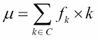
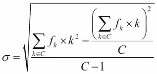

# 第六章类和对象的基础

在本章中，我们将介绍以下配方：

*   使用类封装数据和处理
*   设计具有大量处理的类
*   使用很少的唯一处理设计类
*   使用 __ 插槽优化小对象 __
*   使用更复杂的集合
*   扩展集合–进行统计的列表
*   对惰性属性使用属性
*   使用可设置属性更新属性

# 导言

计算的重点是处理数据。即使在构建类似于交互式游戏的东西时，游戏状态和玩家的动作都是数据；该处理计算下一个游戏状态和显示更新。

有些游戏可能具有相对复杂的内部状态。当我们想到具有多个玩家和复杂图形的控制台游戏时，会出现复杂的实时状态变化。

另一方面，当我们想到一个赌场游戏，比如*骰子*，游戏状态非常简单。可能没有建立点，或者数字 4、5、6、8、9 或 10 中的一个可能是建立点。转换相对简单，通常通过在赌场桌子上移动标记和筹码来表示。数据包括当前状态、玩家动作和骰子掷数。处理是游戏规则。

像*二十一点*这样的游戏，在接受每张卡时，其内部状态会发生更复杂的变化。在手可以分开的游戏中，游戏状态可能变得相当复杂。数据包括当前游戏状态、玩家的命令以及从牌组中抽出的牌。处理由游戏规则定义，并由任何内部规则修改。

在*骰子*的情况下，玩家可以下注。有趣的是，玩家的输入对游戏状态没有影响。游戏对象的内部状态完全由下一次掷骰子决定。这导致了一个相对容易可视化的类设计。

在本章中，我们将创建实现许多统计公式的类。一开始，数学可能有点令人生畏。几乎所有东西都是基于一系列值的总和，通常显示为∑ *x*。在许多情况下，这可以使用 Python 的`sum()`函数实现。

# 使用类封装数据和处理

计算的基本思想是处理数据。这在我们编写处理数据的函数时得到了证明。我们在[第 3 章](03.html#page "Chapter 3. Function Definitions")、*函数定义*中看到了这一点。

通常，我们希望有一些与公共数据结构密切相关的函数。这个概念是面向对象编程的核心。类定义将包含许多方法，这些方法都控制对象的内部状态。

类定义背后的统一概念通常被捕获为分配给类的职责的摘要。我们如何才能有效地做到这一点？设计类的好方法是什么？

## 准备好了吗

让我们看一个简单的、有状态的对象——一对骰子。本文的上下文是一个模拟赌场游戏*骰子*的应用程序。目标是使用模拟结果来帮助发明更好的游戏策略。这将避免我们在试图打破房屋边缘时损失真正的钱。

类定义和类的实例（称为**对象**之间有一个重要的区别。我们把这个想法作为一个整体称为**面向对象编程**。我们的重点是编写类定义。我们的整个应用程序将创建这些类的实例。实例协作产生的行为是设计过程的总体目标。

大多数设计工作都是在类定义上进行的。因此，面向对象编程的名称可能会产生误导。

**紧急行为**的思想是面向对象编程的重要组成部分。我们并没有指定程序的每一个行为。相反，我们将程序分解为对象，并通过对象的类定义对象的状态和行为。编程根据其职责和协作分解为类定义。

一个对象应该被视为一个事物——一个名词。课堂上的行为应该被视为动词。这给了我们一个如何继续设计有效工作的类的提示。

当面向对象设计与现实世界的有形事物相关时，它通常最容易理解。编写模拟扑克牌的软件通常比创建实现**抽象数据类型**的软件更容易。

在本例中，我们将模拟骰子的滚动。对于一些游戏，例如赌场的*骰子*游戏，使用两个骰子。我们将定义一个类来模拟这对骰子。为了确保示例是有形的，我们将在模拟赌场游戏的上下文中对骰子对进行建模。

## 怎么做。。。

1.  写下简单的句子，描述一个类的实例所做的事情。我们可以称之为问题陈述。重点放在短句上，强调名词和动词是很重要的：
    *   *骰子*游戏有两个标准骰子。
    *   每个模具有六个面，点值从 1 到 6。
    *   骰子由玩家掷。
    *   骰子总数改变了*骰子*游戏的状态。然而，这些规则与骰子是分开的。
    *   如果两个骰子相匹配，数字就被硬掷。如果两个骰子不匹配，那么这个数字很简单。一些赌注依赖于这种简单的区分。
2.  识别句子中的所有名词。名词可以识别不同类别的物体。他们是**合作者**。例子包括玩家和游戏。名词也可以识别疑问句中宾语的属性。示例包括面值和点值。
3.  识别句子中的所有动词。动词通常是这门课的方法。示例包括滚动和匹配。有时，它们是其他类的方法。一个例子是改变状态，它适用于*垃圾*。
4.  识别任何形容词。形容词是澄清名词的词或短语。在许多情况下，一些形容词显然是一个对象的属性。在其他情况下，形容词将描述对象之间的关系。在我们的例子中，一个短语，如*骰子的总数*就是一个介词短语充当形容词的例子。*是*短语的总和，修饰名词*骰子*。总数是这对骰子的一个属性。
5.  用`class`语句开始编写类：

    ```py
            class Dice: 

    ```

6.  Initialize the object's attributes in the `__init__` method:

    ```py
            def __init__(self): 
                self.faces = None 

    ```

    我们将使用`self.faces`属性对骰子的内部状态进行建模。需要使用`self`变量来确保引用的是类的给定实例的属性。对象由实例变量`self`的值标识。

    我们还可以在这里放置一些其他属性。另一种方法是将属性作为单独的方法实现。本章后面的*使用惰性属性*配方的主题是此设计决策的细节。

7.  根据各种动词定义对象的方法。在我们的例子中，我们有几个必须定义的方法：
    *   Here's how we can implement dice are rolled by a player:

        ```py
                        def roll(self): 
                            self.faces = (random.randint(1,6), random.randint(1,6)) 

        ```

        我们已经通过设置`self.faces`属性更新了骰子的内部状态。同样，`self`变量对于识别要更新的对象至关重要。

        请注意，此方法会改变对象的内部状态。我们已选择不返回值。这使得我们的方法有点像 Python 内置集合类的方法。任何改变对象的方法都不会返回值。

    *   This method helps implement the total of the dice changes the state of the *craps* game. The game is a separate object, but this method provides a total that fits the sentence.

        ```py
                        def total(self): 
                            return sum(self.faces) 

        ```

        这两种方法有助于回答困难和容易的问题。

        ```py
                        def hardway(self): 
                            return self.faces[0] == self.faces[1] 
                        def easyway(self): 
                            return self.faces[0] != self.faces[1] 

        ```

在赌场游戏中，很少有规则有简单的逻辑倒数。更常见的是，有一种罕见的第三种选择，其回报规则非常糟糕。在这种情况下，我们可以将`easyway`定义为返回`not self.hardway()`。

下面是使用该类的示例：

1.  首先，我们将用一个固定的值为随机数生成器播种，这样我们就可以得到一个固定的结果序列。这是一种为此类创建单元测试的方法：

    ```py
     >>> import random 
          >>> random.seed(1)

    ```

2.  我们将创建一个`Dice`对象`d1`。然后我们可以使用`roll()`方法设置其状态。然后我们将查看`total()`方法，以查看滚动的内容。我们将通过查看 faces 属性来检查状态：

    ```py
     >>> from ch06_r01 import Dice 
          >>> d1 = Dice() 
          >>> d1.roll() 
          >>> d1.total() 
          7 
          >>> d1.faces 
          (2, 5)

    ```

3.  我们将创建第二个`Dice`对象`d2`。然后我们可以使用`roll()`方法设置其状态。我们将查看`total()`方法以及`hardway()`方法的结果。我们将通过查看`faces`属性来检查状态：

    ```py
     >>> d2 = Dice() 
          >>> d2.roll() 
          >>> d2.total() 
          4 
          >>> d2.hardway() 
          False 
          >>> d2.faces 
          (1, 3)

    ```

4.  由于这两个对象是`Dice`类的独立实例，所以对`d2`的更改对`d1`：

    ```py
     >>> d1.total() 
          7

    ```

    没有影响

## 它是如何工作的。。。

这里的核心思想是使用语法名词、动词和形容词的普通规则来识别一个类的基本特征。名词代表事物。一个好的描述性句子应该关注有形的、真实的事物，而不是想法或抽象。

在我们的例子中，骰子是真实的东西。我们尽量避免使用诸如随机化器或事件生成器之类的抽象术语。更容易描述真实事物的有形特性，然后找到提供一些有形特性的抽象实现。

掷骰子的想法是一个物理动作的例子，我们可以用方法定义来建模。显然，此操作会更改对象的状态。在极少数情况下，36 个州中有一次下一个州恰好与前一个州相匹配。

形容词常有引起混淆的可能。以下是形容词最常见的操作方式：

*   有些形容词，如 first、last、least、most、next、previous 等，将有一个简单的解释。它们可以将惰性实现作为方法，也可以将渴望实现作为属性值。
*   有些形容词是比较复杂的短语，例如*骰子的总数*。这是一个由名词（total）和介词（of）构成的形容词短语。这也可以看作是一种方法或属性。
*   有些形容词涉及出现在我们软件中其他地方的名词。我们可能会有一个短语，比如*掷骰子游戏的状态*，其中的*状态修改了另一个对象*掷骰子*游戏。这显然只与骰子本身有切点关系。这可能反映了骰子和游戏之间的关系。*
*   我们可以在问题陈述中添加一句话，例如*骰子是游戏*的一部分。这有助于澄清游戏和骰子之间的关系。介词短语，例如*是*的一部分，总是可以从另一个对象的角度反转来创建语句：例如，*游戏包含骰子*。这有助于澄清对象之间的关系。

在 Python 中，默认情况下对象的属性是动态的。我们没有指定固定的属性列表。我们可以在类定义的`__init__()`方法中初始化部分（或全部）属性。由于属性不是静态的，我们在设计中有相当大的灵活性。

## 还有更多。。。

捕获基本的内部状态和导致状态更改的方法是好的类设计的第一步。我们可以使用缩写词**S.O.L.I.D**总结一些有用的设计原则：

*   **单一责任原则**：一个类应该有一个明确定义的责任。
*   **开/闭原则**：一个类一般应该通过继承对扩展开放，但不允许修改。我们应该设计我们的类，这样我们就不需要调整代码来添加或更改特性。
*   **Liskov 替换原则**：我们需要设计继承，这样子类就可以用来代替超类。
*   **接口隔离原则**：在编写问题陈述时，我们希望确保协作类具有尽可能少的依赖关系。在许多情况下，这一原则将引导我们将大型问题分解为许多小型类定义。
*   **依赖倒置原则**：一个类直接依赖其他类并不理想。如果一个类依赖于一个抽象，并且用一个具体的实现类代替这个抽象类，那就更好了。

我们的目标是创建具有正确行为且遵守设计原则的类。

## 另见

*   请参阅*为惰性属性使用属性*配方，我们将在其中查看在急切属性和惰性属性之间的选择
*   在[第 7 章](07.html#page "Chapter 7. More Advanced Class Design")*更高级的类设计*中，我们将更深入地了解类设计技术
*   参见[第 11 章](11.html#page "Chapter 11. Testing")、*测试*，了解如何为类编写适当的单元测试的方法

# 设计大量处理的类

大多数情况下，对象将包含定义其内部状态的所有数据。然而，这并不总是正确的。有些情况下，类实际上不需要保存数据，而是可以保存处理。

这种设计的一些主要例子是统计处理算法，它们通常在所分析的数据之外。数据可能位于`list`或`Counter`对象中。处理可能是一个单独的类。

当然，在 Python 中，这种处理通常使用函数实现。详见[第三章](03.html#page "Chapter 3. Function Definitions")、*函数定义*。在某些语言中，所有代码都必须采用类的形式，这会导致额外的复杂性。

我们如何设计一个利用 Python 的复杂内置集合数组的类？

## 准备好了吗

在[第 4 章](04.html#page "Chapter 4. Built-in Data Structures – list, set, dict")、*内置数据结构–列表、集合、dict*，特别是使用集合方法和运算符配方的*，我们研究了一个称为**优惠券收集器测试**的统计过程。其概念是，每次执行某个流程时，我们都会保存一个优惠券，用于描述流程的某些方面或参数。问题是，在我收集一整套优惠券之前，我需要执行多少次这个过程？*

如果我们根据客户的购买习惯将其分配到不同的人口统计组，我们可能会问，在我们看到每个组中的人之前，我们必须进行多少次在线销售。如果这些群体的规模都差不多，那么在我们得到一整套优惠券之前，预测我们遇到的客户的平均数量是微不足道的。如果团体规模不同，那么在收集全套优惠券之前计算预期时间就有点复杂了。

假设我们使用`Counter`对象收集数据。有关各种集合的更多信息，请参见[第 4 章](04.html#page "Chapter 4. Built-in Data Structures – list, set, dict")、*内置数据结构–列表、集合、dict*，特别是*使用集合方法和运算符*和*避免函数参数*配方的可变默认值。在这种情况下，客户分为八类，数量大致相等。

数据如下所示：

```py
    Counter({15: 7, 17: 5, 20: 4, 16: 3, ... etc., 45: 1}) 

```

关键是获得全套优惠券所需的访问次数。该值是给定访问次数的次数。在代码`15`的前一行中，需要进行七次不同的访问。`17`需要五次就诊。这条尾巴很长。在收集到一整套 8 张优惠券之前，曾有`45`个人访问。

我们想计算一些关于`Counter`的统计数据。为此，我们有两个总体策略：

*   **扩展**：我们可以扩展`Counter`类定义，增加统计处理。其复杂性因我们要引入的处理类型而异。我们将在*扩展集合–一个统计*配方的列表，以及[第 7 章](07.html#page "Chapter 7. More Advanced Class Design")、*更高级的类设计*中详细介绍这一点。
*   **包装**：我们可以将`Counter`对象包装在另一个类中，该类只提供我们需要的特性。但是，当我们这样做时，我们通常不得不公开一些附加的方法，这些方法是 Python 的一个重要部分，但对我们的应用程序来说并不重要。我们将在[第 7 章](07.html#page "Chapter 7. More Advanced Class Design")、*更高级的课堂设计*中了解这一点。

包装有一种变体，我们使用统计计算对象包装来自内置集合的对象。这通常会导致一个优雅的解决方案。

我们有两种方法来设计处理。这两种设计方案适用于两种总体架构选择：

*   **急切**：这意味着我们将尽快计算统计数据。然后，这些值可以是类的属性。虽然这可以提高性能，但也意味着对数据收集的任何更改都将使迫切需要计算的值无效。我们必须检查整个环境，看看这是否可能发生。
*   **Lazy**：这意味着我们不会计算任何东西，除非通过方法函数或属性需要它。我们将在*使用惰性属性*配方中了解这一点。

两种设计的基本数学是相同的。唯一的问题是何时完成计算。

我们使用期望值的总和来计算平均值。期望值是一个值乘以该值的频率。平均值*μ*为：



这里，*k*是来自`Counter`、*C*的密钥，*f<sub>k</sub>*是来自`Counter`的给定密钥的频率值。

标准偏差*σ*取决于平均值*μ*。这还涉及到计算值的总和，每个值都按频率加权。公式如下：


这里，*k*是来自`Counter`、*C*的键，*f<sub>k</sub>*是来自`Counter`的给定键的频率值。`Counter`中的项目总数为。这是频率的总和。

## 怎么做。。。

1.  使用描述性名称定义类：

    ```py
            class CounterStatistics: 

    ```

2.  Write the `__init__` method to include the object to which this object will be connected:

    ```py
            def __init__(self, raw_counter:Counter): 
                self.raw_counter = raw_counter 

    ```

    我们已经定义了一个方法函数，它将`Counter`对象作为参数值。此`Counter`对象保存为`Counter_Statistics`实例的一部分。

3.  Initialize any other local variables that might be useful. Since we're going to calculate values eagerly, the most eager possible time is when the object is created. We'll write references to some yet to be defined functions:

    ```py
            self.mean = self.compute_mean() 
            self.stddev = self.compute_stddev() 

    ```

    我们急切地计算了`Counter`对象的平均值和标准偏差，并将它们保存在两个实例变量中。

4.  为各种值定义所需的方法。以下是平均值的计算：

    ```py
            def compute_mean(self): 
                total, count = 0, 0 
                for value, frequency in self.raw_counter.items(): 
                    total += value*frequency 
                    count += frequency 
                return total/count 

    ```

5.  Here's how we can calculate the standard deviation:

    ```py
            def compute_stddev(self): 
                total, count = 0, 0 
                for value, frequency in self.raw_counter.items(): 
                    total += frequency*(value-self.mean)**2 
                    count += frequency 
                return math.sqrt(total/(count-1)) 

    ```

    请注意，此计算要求首先计算平均值，并创建`self.mean`实例变量。

    另外，它使用了`math.sqrt()`。确保在 Python 文件中添加所需的`import math`语句。

下面是我们如何创建一些示例数据：

```py
>>> from ch04_r06 import * 
>>> from collections import Counter 
>>> def raw_data(n=8, limit=1000, arrival_function=arrival1): 
...    expected_time = float(expected(n)) 
...    data = samples(limit, arrival_function(n)) 
...    wait_times = Counter(coupon_collector(n, data)) 
...    return wait_times

```

我们已经从`ch04_r06`模块中导入了`expected()`、`arrival1()`和`coupon_collector()`等函数。我们还从标准库`collections`模块导入了`Counter`集合。

我们定义了一个函数`raw_data()`，它将生成大量的客户访问。默认情况下，访问量为 1000 次。该领域将是八个不同类别的客户；每个班级将有相等数量的成员。我们将使用`coupon_collector()`功能逐步浏览数据，发出收集全套 8 张优惠券所需的访问次数。

然后，该数据用于组装`Counter`对象。这将有需要获得全套优惠券的客户数量。每个数量的客户还将有一个频率，显示访问次数的频率。

以下是我们如何分析`Counter`对象：

```py
>>> import random 
>>> from ch06_r02 import CounterStatistics 
>>> random.seed(1) 
>>> data = raw_data() 
>>> stats = CounterStatistics(data) 
>>> print("Mean: {0:.2f}".format(stats.mean)) 
Mean: 20.81 
>>> print("Standard Deviation: {0:.3f}".format(stats.stddev)) 
Standard Deviation: 7.025

```

首先，我们导入了`random`模块，以便我们可以选择一个已知的种子值。这使得测试和演示应用程序更加容易，因为随机数是一致的。我们还从`ch06_r02`模块导入了`CounterStatistics`类。

一旦我们定义了所有项目，我们就可以将`seed`强制为已知值，并生成优惠券收集器测试结果。`raw_data()`函数将发出一个`Counter`对象，我们称之为数据。

我们将使用`Counter`对象创建`CounterStatistics`类的实例。我们将把它分配给`stats`变量。创建此实例还将计算一些摘要统计信息。这些值作为`stats.mean`属性和`stats.stddev`属性提供。

对于一套八张优惠券，理论平均值为`21.7`次访问以收集所有优惠券。`raw_data()`的结果似乎显示了与随机访问预期相符的行为。这有时被称为**无效假设**——数据是随机的。

## 它是如何工作的。。。

这个类封装了两个复杂的算法，但不包含任何改变状态的数据。此类类不需要保留大量数据。相反，设计会尽快执行所有计算。

我们为处理编写了一个高级规范，并将其放在`__init__()`方法中。然后我们编写方法来实现指定的处理步骤。我们可以根据需要设置任意多的属性，这是一种非常灵活的方法。

这种设计的优点是属性值可以重复使用。计算费用支付一次；每次使用属性值时，不需要进一步计算。

这种设计的缺点是，对底层`Counter`对象的更改会使`CounterStatistics`对象过时。通常，我们在`Counter`不会改变的情况下使用这种设计。本例创建了一个静态的`Counter`，用于创建`CounterStatistics`。

## 还有更多。。。

如果我们需要有状态对象，我们可以添加更新方法来更改`Counter`对象。例如，我们可以引入一种方法，通过将工作委托给相关的`Counter`来添加另一个值。这将设计模式从计算和集合之间的简单连接切换到集合周围的适当包装。

该方法可能如下所示：

```py
    def add(self, value): 
        self.raw_counter[value] += 1 
        self.mean = self.compute_mean() 
        self.stddev = self.compute_stddev() 

```

首先，我们更新了`Counter`的状态。然后，我们重新计算所有派生值。这种处理可能会产生巨大的计算开销。需要有一个令人信服的理由在每个值改变后重新计算平均值和标准偏差。

有更有效的解决方案。例如，如果我们保存两个中间和和一个中间计数，我们可以通过有效地计算平均值和标准偏差来更新和和和计数。

对于这一点，我们可能有一个`__init__()`方法，如下所示：

```py
    def __init__(self, counter:Counter=None): 
        if counter: 
            self.raw_counter = counter 
            self.count = sum(self.raw_counter[k] for k in self.raw_counter) 
            self.sum = sum(self.raw_counter[k]*k for k in self.raw_counter) 
            self.sum2 = sum(self.raw_counter[k]*k**2 for k in self.raw_counter) 
            self.mean = self.sum/self.count 
            self.stddev = math.sqrt((self.sum2-self.sum**2/self.count)/(self.count-1)) 
        else: 
            self.raw_counter = Counter() 
            self.count = 0 
            self.sum = 0 
            self.sum2 = 0 
            self.mean = None 
            self.stddev = None 

```

我们编写这个方法是为了使用`Counter`或不使用`Counter`。如果没有提供数据，它将从一个空集合开始，并为各种总和设置零值。当计数为零时，平均值和标准偏差没有意义值，因此提供`None`。

如果提供了`Counter`，则计算`count`、`sum`和平方和。这些可以轻松地进行增量调整，快速重新计算`mean`和标准偏差。

添加单个新值时，以下方法将递增地重新计算各种派生值：

```py
    def add(self, value): 
        self.raw_counter[value] += 1 
        self.count += 1 
        self.sum += value 
        self.sum2 += value**2 
        self.mean = self.sum/self.count 
        if self.count > 1: 
            self.stddev = math.sqrt( 
                (self.sum2-self.sum**2/self.count)/(self.count-1)) 

```

显然有必要更新`Counter`对象、`count`、`sum`和平方和，以确保`count`、`sum`和平方和值始终与`self.raw_counter`集合匹配。因为我们知道`count`必须至少是`1`，所以平均值很容易计算。标准偏差至少需要两个值，并根据`sum`和平方和计算。

以下是标准偏差变化的公式：



这涉及到计算两个和。一个和包括频率乘以值的平方。另一个和包括频率和值，总和为平方。我们用*C*来表示值的总数；这是频率的总和。

## 另见

*   在*扩展集合–一个进行统计*的列表中，我们将研究一种不同的设计方法，其中这些函数用于扩展类定义。
*   我们将在*中为惰性属性使用属性*配方中研究不同的方法。此替代配方将使用属性并根据需要计算属性。
*   在*设计具有少量独特处理的类*配方中，我们将看到一个没有实际处理的类。它充当这个类的极性反面。

# 设计具有很少独特处理的类

在某些情况下，对象是包含相当复杂数据的容器，但实际上并没有对该数据进行太多处理。事实上，在许多情况下，可以设计一个只依赖于内置 Python 特性而不需要任何唯一方法函数的类。

在许多情况下，Python 的内置容器类可以覆盖我们几乎所有的各种用例。小问题是字典或列表的语法没有对象属性的语法那么优雅。

我们如何创建一个允许我们使用`object.attribute`语法而不是`object['attribute']`的类？

## 准备好了吗

任何类型的类设计实际上只有两种情况：

*   它是无国籍的吗？它是否包含许多属性，但从不改变？
*   它是有状态的吗？各种属性的状态是否会发生变化？

有状态的设计稍微更一般一些。我们可以始终使用有状态实现，避免对对象进行任何更改以支持无状态对象。但是，使用真正的无状态对象有一些显著的存储和性能优势。

我们将使用两种类来说明这两种设计：

*   **无状态**：我们将定义一个类来描述具有等级和套装的简单扑克牌。由于卡片的等级和花色不变，我们将为此创建一个小的无状态类。
*   **有状态**：我们将定义一个类来描述玩家在*二十一点*游戏中的当前状态，其中有庄家的手、玩家的手，以及可选的保险赌注。在每一手牌中，游戏的许多方面都在增长。

## 怎么做。。。

我们先看无状态对象，然后看有状态对象。对于没有方法的有状态对象，我们还有两个选择：可以使用新类，也可以利用现有类。这些选择导致了三个小食谱。

### 无状态对象

1.  我们将无状态对象基于`collections.namedtuple`：

    ```py
            from collections import namedtuple 

    ```

2.  定义类名，将使用两次：

    ```py
            Card = namedtuple('Card', 

    ```

3.  定义对象的属性：

    ```py
            Card = namedtuple('Card', ('rank', 'suit')) 

    ```

下面是我们如何使用这个类定义来创建`Card`对象：

```py
>>> from collections import namedtuple 
>>> Card = namedtuple('Card', ('rank', 'suit')) 
>>> eight_hearts = Card(rank=8, suit='\N{White Heart Suit}') 
>>> eight_hearts 
Card(rank=8, suit='♡') 
>>> eight_hearts.rank 
8 
>>> eight_hearts.suit 
'♡' 
>>> eight_hearts[0] 
8

```

我们创建了一个名为`Card`的新类，它有两个属性名：`rank`和`suit`。定义类之后，我们可以创建该类的实例。我们构建了一个单卡对象，`eight_hearts`，等级为 8，套装为♡.

我们可以使用该对象的名称或它们在元组中的位置来引用该对象的属性。当我们使用`eight_hearts.rank`或`eight_hearts[0]`时，我们将看到 rank 属性，因为它是在属性名称序列中首先定义的。

这种类定义相对较少。它有一组固定的、已定义的属性。通常，Python 类定义具有动态属性。而且，对象是不可变的。以下是尝试更改实例属性的示例：

```py
>>> eight_hearts.suit = '\N{Black Spade Suit}'  
Traceback (most recent call last): 
  File "/Library/Frameworks/Python.framework/Versions/3.4/lib/python3.4/doctest.py", line 1318, in __run 
    compileflags, 1), test.globs) 
  File "<doctest default[0]>", line 1, in <module> 
    eight_hearts.suit = '\N{Black Spade Suit}' 
AttributeError: can't set attribute

```

我们试图更改对象的`suit`属性。这引发了一个`AttributeError`异常。

### 具有新类的有状态对象

1.  定义新类：

    ```py
            class Player: 
                pass 

    ```

2.  我们已经编写了一个空的类定义。使用如下内容可以轻松创建此类的实例：

    ```py
            p = Player() 

    ```

然后，我们可以使用如下语句向对象添加属性：

```py
    p.stake = 100 

```

虽然这可以很好地解决问题，但向类定义中添加更多的特性通常会很有帮助。通常，我们会添加方法，包括`__init__()`方法，来初始化对象的实例变量。

### 使用现有类的有状态对象

我们也可以使用标准库中的模块，而不是定义一个空类。我们可以使用`argparse`模块或`types`模块：

1.  Import the module.

    `argparse`模块包含`Namespace`类，可替代空类定义：

    ```py
            from argparse import Namespace
    ```

    我们也可以使用类型模块中的`SimpleNamespace`。看起来是这样的：

    ```py
            from types import SimpleNamespace 

    ```

2.  创建类作为对`SimpleNamespace`或`Namespace`：

    ```py
            Player = SimpleNamespace 

    ```

    的引用

## 它是如何工作的。。。

这些技术中的任何一种都将定义一个属性数量不定的类。然而，`SimpleNamespace`有一个比定义我们自己的类更灵活的构造函数：

```py
>>> from types import SimpleNamespace 
>>> Player = SimpleNamespace 
>>> player_1 = Player(stake=100, hand=[], insurance=None, bet=None) 
>>> player_1.bet = 10 
>>> player_1.stake -= player_1.bet 
>>> player_1.hand.append( eight_hearts ) 
>>> player_1 
namespace(bet=10, hand=[Card(rank=8, suit='♡')], insurance=None, stake=90)

```

我们已经创建了一个名为`Player`的新类。我们不提供属性列表，因为它们是动态的。

当我们构建`player_1`对象时，我们提供了一个属性列表，我们希望将这些属性创建为该对象的一部分。创建对象后，我们可以对其进行状态更改；我们设置了`player_1.bet`值，更新了`player_1.stake`，也更新了`player_1.hand`。

当我们显示对象时，所有属性都会显示出来。通常，它们是按字母顺序提供的，因此编写单元测试示例稍微容易一些。

当我们使用`namedtuple()`函数时，我们正在创建一个类对象。我们以字符串的形式提供类名，以及将与元组的位置值并行的属性名。结果对象需要分配给变量，最佳做法是确保作为`nametuple()`函数参数提供的类名与变量名相同。

`namedtuple()`创建的类对象与`class`语句创建的类对象相同。事实上，如果您想查看源代码，可以使用`print(Card._source)`查看创建类所使用的确切内容。

`namedtuple`类本质上是一个元组，具有命名属性的附加特性。和所有其他元组对象一样，它在构建后是不可变的，不能更改。

当我们使用`SimpleNamespace`时，我们使用的是一个非常简单的类定义，几乎没有方法。因为属性通常是动态的，所以这个类允许我们自由地设置`set`、`get`和`delete`属性。

不是`tuple`的子类或使用`__slots__`（我们将在*中使用*配方优化小对象）的类非常灵活。还有一些非常先进的技术可以用来改变属性的行为方式。这些依赖于对 Python 特殊方法名称如何工作的深入了解。

## 还有更多。。。

在许多情况下，我们会将应用程序处理分解为两大类的类定义：

*   **数据–集合和项目**：我们将使用内置的集合类、来自标准库的集合，甚至可能是基于`namedtuple()`、或`SimpleNamespace`的项目，或其他似乎专注于一般数据集合的类定义。
*   **处理**：我们将以类似于*设计具有大量处理的类*配方中所示的方式定义类。这些处理类通常依赖于数据对象。

将数据从处理过程中干净地分离出来的想法适合几种 S.O.L.I.D。设计原则。特别是，它使我们的类与单一责任原则、开放/封闭原则和接口分离原则保持一致。我们可以创建关注点很窄的类，这使得更改（通过子类扩展）相对简单。

## 另见

*   在*设计具有大量处理的类*配方中，我们将看到一个完全在处理且几乎没有数据的类。它充当这个类的极性反面。

# 用 _ 槽优化小对象 __

对象的一般情况允许动态属性集合，每个属性都有一个动态值。基于`tuple`类的不可变对象有一个特例。在*设计类中，我们用很少的独特处理*方法研究了这两个问题。

对于具有固定数量属性的对象，有一个中间地带，但属性的值可以更改。通过将类从无限制的属性集合更改为固定的属性集合，我们还可以节省内存和处理时间。

如何创建具有固定属性集的优化类？

## 准备好了吗

让我们来看看在*二十一点*赌场游戏中玩一手牌的想法。一只手有两个部分：

*   牌
*   赌注

两者都有动态值。但只有这两件事。得到更多的牌是很常见的。也可以通过双向下注来提高赌注。

分裂的想法会产生更多的手。每一张分开的牌都是一个单独的对象，有不同的牌集合和唯一的赌注。

## 怎么做。。。

在创建类时，我们将利用`__slots__`特殊名称：

1.  使用描述性名称定义类：

    ```py
            class Hand: 

    ```

2.  Define the list of attribute names:

    ```py
                __slots__ = ('hand', 'bet') 

    ```

    这标识了该类实例只允许的两个属性。任何添加其他属性的尝试都将引发`AttributeError`异常。

3.  Add an initialization method:

    ```py
            def __init__(self, bet, hand=None): 
                self.hand= hand or [] 
                self.bet= bet 

    ```

    通常，每一手牌都以下注开始。然后，庄家向该手牌发两张初始牌。但在某些情况下，我们可能希望从一系列`Card`实例重建`Hand`对象。我们使用了`or`操作符的一个特性。如果左侧操作数不是类假值（即`None`），则这是`or`表达式的值。如果左侧操作数为 false-like，则计算右侧操作数。关于为什么需要这样做的更多信息，请参见[第 3 章](03.html#page "Chapter 3. Function Definitions")、*功能定义*中的*使用可选参数设计功能*配方。

4.  添加更新集合的方法。我们之所以称之为`deal`，是因为它用于向`Hand`

    ```py
            def deal(self, card): 
                self.hand.append(card) 

    ```

    发一张新卡
5.  增加一个`__repr__()`方法，方便打印：

    ```py
            def __repr__(self): 
                return "{class_}({bet}, {hand})".format( 
                    class_= self.__class__.__name__, 
                    **vars(self) 
                ) 

    ```

下面是我们如何使用这个类来构建一手牌。我们需要根据*设计类中的示例来定义`Card`类，该类具有很少的唯一处理*配方：

```py
>>> from ch06_r04 import Card, Hand 
>>> h1 = Hand(2) 
>>> h1.deal(Card(rank=4, suit='♣')) 
>>> h1.deal(Card(rank=8, suit='♡')) 
>>> h1 
Hand(2, [Card(rank=4, suit='♣'), Card(rank=8, suit='♡')])

```

我们已经导入了`Card`和`Hand`类定义。我们构建了一个`Hand`、`h1`的实例，下注量是最小下注量的两倍。然后，我们通过`Hand`类的`deal()`方法向手上添加了两张卡片。这说明了`h1.hand`值是如何变异的。

此示例还显示了`h1`的实例，以显示下注和卡的顺序。`__repr__()`方法生成 Python 语法的输出。

我们还可以在玩家翻倍时替换`h1.bet`值（是的，在显示 12 时这是一件疯狂的事情）：

```py
>>> h1.bet *= 2 
>>> h1 
Hand(4, [Card(rank=4, suit='♣'), Card(rank=8, suit='♡')])

```

当我们显示`Hand`对象`h1`时，它显示`bet`属性已更改。

下面是我们尝试创建新属性时发生的情况：

```py
>>> h1.some_other_attribute = True  
Traceback (most recent call last): 
  File "/Library/Frameworks/Python.framework/Versions/3.4/lib/python3.4/doctest.py", line 1318, in __run 
    compileflags, 1), test.globs) 
  File "<doctest default[0]>", line 1, in <module> 
    h1.some_other_attribute = True  
AttributeError: 'Hand' object has no attribute 'some_other_attribute'

```

我们试图在`Hand`对象`h1`上创建一个名为`some_other_attribute`的属性。这引发了一个`AttributeError`例外。使用`__slots__`意味着不能向对象添加新属性。

## 它是如何工作的。。。

当我们创建类定义时，行为部分由对象类和`type()`函数定义。隐式地，类被分配了一个特殊的`__new__()`方法，该方法处理创建新对象所需的内部管理。

Python 有三条基本路径：

*   默认行为，在每个对象中构建一个`__dict__`属性。因为对象的属性保存在字典中，所以我们可以自由添加、更改和删除属性。这种灵活性要求对 dictionary 对象使用相对较大的内存。
*   `__slots__`行为，避免`__dict__`属性。因为对象只有在`__slots__`序列中命名的属性，所以我们不能添加或删除属性。我们只能更改已定义属性的值。缺乏灵活性意味着每个对象使用的内存更少。
*   `tuple`行为的子类。这些是不可变的对象。最简单的创建方法是使用`namedtuple()`。一旦建成，它们就无法改变。当测量内存使用时，这些是所有类别对象中最节省的。

`__slots__`优化在 Python 中很少使用。默认的类行为提供了最大的灵活性，使更改类变得很容易。然而，在某些情况下，大型应用程序可能会受到所用内存量的限制，仅将一个类切换到`__slots__`可以显著提高性能。

## 还有更多。。。

可以定制`__new__()`方法的工作方式，用不同类型的字典替换默认`__dict__`属性。这是一种相当先进的技术，因为它公开了更多的类和对象的内部工作。

Python 依赖元类来创建类的实例。默认元类是`type`类。元类提供了一些用于创建对象的功能。创建空对象后，类`__init__()`方法将初始化空对象。

通常，如果需要自定义名称空间对象，元类将提供`__new__()`的定义，或者`__prepare__()`的定义。Python 语言参考文档中有一个广泛使用的示例，它调整了用于创建类的名称空间。

更多详情请参见[https://docs.python.org/3/reference/datamodel.html#metaclass-示例](https://docs.python.org/3/reference/datamodel.html#metaclass-example)。

## 另见

*   不可变对象或完全灵活对象的更常见情况在*设计类中进行了介绍，这些类没有什么独特的处理*方法。

# 使用更复杂的收藏

Python 有各种各样的内置集合。在[第 4 章](04.html#page "Chapter 4. Built-in Data Structures – list, set, dict")中，*内置数据结构–列表、集合、dict*中，我们仔细查看了它们。在*选择数据结构*配方中，我们提供了一种决策树，以帮助从可用选择中找到合适的数据结构。

当我们在标准库中折叠时，我们有更多的选择和更多的决策要做。我们如何为我们的问题选择正确的数据结构？

## 准备好了吗

在我们把数据放入一个集合之前，我们需要考虑我们如何收集数据，以及一旦我们拥有了它，我们将如何处理它。最大的问题总是我们如何在收藏中识别特定的物品。我们将看几个关键问题，这些问题是我们需要回答的，以帮助选择适合我们需要的合适收藏。

以下是备选系列的概述。它们分为三个模块。

`collections`模块包含许多内置集合的变体。这些措施包括：

*   `deque`：一个双端队列。这是一个可变的序列，每一端都有推送和弹出的优化。请注意，类名以小写字母开头；这对于 Python 来说是不典型的。
*   `defaultdict`：可以为缺少的密钥提供默认值的映射。请注意，类名以小写字母开头；这对于 Python 来说是不典型的。
*   `Counter`：一种映射，用于统计密钥的出现次数。这有时被称为多集或包。
*   `OrderedDict`：保留键创建顺序的映射。
*   `ChainMap`：将多个词典组合成一个映射的映射。

`heapq`模块包括优先级队列实现。这是一个专门的序列，用于按排序顺序维护项目。

`bisect`模块包括搜索排序列表的方法。这将在字典功能和列表功能之间创建一些重叠。

## 怎么做。。。

我们需要回答许多问题，以决定是否需要图书馆数据收集而不是内置收集：

1.  Is the structure a buffer between the producer and the consumer? Does some part of the algorithm produce data items and another part consume the data items?

    一种常见的简单方法是生产者在列表中累积项目，然后消费者处理列表中的项目。这种方法倾向于构建大型中间数据结构。焦点的改变可以交错生产和消耗，减少所使用的内存量：

    *   队列用于**先进先出**（**FIFO**处理。项目在一端插入，从另一端消费。我们可以使用`list.append()`和`list.pop(0)`来模拟，虽然`collections.deque`会更有效；我们可以使用`deque.append()`和`deque.popleft()`。
    *   堆栈用于**后进先出**（**后进先出**处理。从同一端插入和使用项目。我们可以使用`list.append()`和`list.pop()`来模拟，虽然`collections.deque`会更有效；我们可以使用`deque.append()`和`deque.pop()`。
    *   优先级队列（或堆队列）保持队列按某种顺序排序，与到达顺序不同。这通常用于优化工作，包括图搜索算法。我们可以使用`list.append()`、`list.sort(key=lambda x:x.priority)`和`list.pop(-1)`进行模拟。由于这涉及到每次插入后的排序，因此效率极低。使用`heapq`模块的效率要高得多。
2.  How do we want to deal with missing keys from a dictionary?
    *   提出一个例外。这就是内置`dict`类的工作方式。
    *   创建一个默认项。这就是`defaultdict`的工作原理。我们必须提供一个返回默认值的函数。常见的例子包括使用默认值为零的`defaultdict(int)`和`defaultdict(float)`。我们还可以使用`defauldict(list)`和`defauldict(set)`创建列表字典或集合结构字典。
    *   在某些情况下，我们需要提供不同的文本值作为默认值：

    ```py
                    lookup = defaultdict(lambda:"N/A") 

    ```

    它使用 lambda 对象定义一个非常小的函数，该函数没有名称，并且总是返回字符串`N/A`。这将为丢失的密钥创建一个默认项`N/A`。

    用于计数项目的`defaultdict(int)`非常常见，以至于`Counter`类正好做到了这一点。

3.  我们想如何处理字典中键的顺序？
    *   秩序不重要；我们总是按键设置和获取项目。这是内置`dict`类的行为。密钥排序取决于散列随机化，因此不可预测。
    *   我们希望保留插入顺序，并使用其密钥快速查找项目。`OrderedDict`类提供了这种独特的功能组合。它与内置的`dict`类具有相同的接口，但保留键的插入顺序。
    *   我们要把钥匙按正确的顺序分类。虽然排序列表可以做到这一点，但给定键的查找时间非常慢。我们可以使用对分模块快速访问排序列表中的项目。这需要一个三步算法：
        1.  通过`append()`或`extend()`建立列表。
        2.  对列表进行排序。`list.sort()`就是我们所需要的。
        3.  使用`bisect`模块从排序列表中进行检索。
4.  我们将如何建立字典？
    *   我们有一个简单的算法来创建项目。在这种情况下，内置 dict 就足够了。
    *   我们有多个字典需要合并。读取配置文件时可能会发生这种情况。我们可能有一个单独的配置、一个系统范围的配置和一个默认的应用程序配置，所有这些都需要合并。

        ```py
                        import json 
                        user = json.load('~/app.json') 
                        system = json.load('/etc/app.json') 
                        application = json.load('/opt/app/default.json') 

        ```

5.  How can we combine these?

    ```py
                from collections import ChainMap 
                config = ChainMap(user, system, application) 

    ```

    生成的`config`对象将通过各种字典进行顺序搜索。它将在用户、系统和应用程序字典中查找给定的密钥。

## 它是如何工作的。。。

数据处理有两个主要的资源限制：

*   存储
*   时间

我们所有的编程都必须尊重这些约束。在大多数情况下，两者是对立的：我们为减少存储使用而做的任何事情都会增加处理时间，而我们为减少处理时间而做的任何事情都会增加存储使用。

时间方面通过复杂性度量形式化。对算法的复杂性进行了大量分析：

*   被描述为*O*（1）的操作在恒定时间内发生。在这种情况下，复杂性不随数据量的变化而变化。对于某些集合，实际的整体长期平均值接近***O***（1），只有少数例外。列表`append`操作就是一个例子：它们都具有相同的复杂性。不过，偶尔一次幕后内存管理操作会增加一些时间。
*   被描述为*O*（n）的操作以线性时间发生。成本随着数据量的增加而增加。在列表中查找项目具有这种复杂性。在字典中查找条目更接近于*O*（1），因为无论字典有多大，它（几乎）都具有相同的低复杂性。
*   ***O****n*log*n*的操作比数据量增长更快。`bisect`模块包括具有这种复杂性的搜索算法。
*   还有更糟糕的情况：一些算法的复杂度为*O（n<sup>2</sup>*甚至*O（n！）*。我们希望通过巧妙的设计和更智能的数据结构来避免这些问题。

各种数据结构反映了独特的时间和存储权衡。

## 还有更多。。。

作为一个具体而极端的例子，让我们看看在 web 日志文件中搜索特定的事件序列。我们有两种总体设计策略：

*   将所有事件读入类似于`file.read().splitlines()`的列表结构。然后，我们可以使用`for`语句在列表中迭代查找事件的组合。虽然初始读取可能需要一些时间，但搜索速度会非常快，因为日志都在内存中。
*   从日志文件中读取每个事件。如果事件是模式的一部分，则仅保存此事件。我们可以使用一个`defaultdict`，IP 地址作为键，事件列表作为值。这将花费更长的时间来读取日志，但由此产生的内存结构将小得多。

第一种算法，将所有内容读入内存，通常非常不切实际。在大型 web 服务器上，日志可能涉及数百 GB 甚至 TB 的数据。这不适合任何计算机的内存。

第二种方法有许多替代实现：

*   **单进程**：这里大多数 Python 方法的一般方法都假设我们正在创建一个作为单个进程运行的应用程序。
*   **多进程**：我们可以使用`multiprocessing`或`concurrent`包将逐行搜索扩展为多进程应用程序。我们将创建一个工作进程集合，每个工作进程都可以处理可用数据的子集，并将结果返回给合并结果的使用者。在现代多处理器、多核计算机上，这可以非常有效地利用资源。
*   **多台主机**：极端情况需要多台服务器，每台服务器处理数据的一个子集。这需要主机之间进行更精细的协调以共享结果集。通常，此类处理需要 Hadoop 之类的框架。

我们通常会将大型搜索分解为地图并减少处理。映射阶段对集合中的每个项目应用一些处理或过滤。“减少”阶段将映射结果合并到摘要或聚合对象中。在许多情况下，应用于先前 MapReduce 操作结果的**MapReduce**操作具有复杂的层次结构。

## 另见

*   有关选择数据结构的基本决策集，请参见[第 4 章](04.html#page "Chapter 4. Built-in Data Structures – list, set, dict")中的*选择数据结构*配方*内置数据结构–列表、集合、指令*

# 扩展集合–进行统计的列表

在*设计具有大量处理的类*配方中，我们研究了一种区分复杂算法和集合的方法。我们展示了如何将算法和数据封装到单独的类中。

另一种设计策略是扩展集合以合并有用的算法。

我们如何扩展 Python 的内置集合？

## 准备好了吗

我们将创建一个复杂的列表，可以计算列表中项目的总和和平均值。这将要求我们的应用程序只在列表中输入数字；否则会有`ValueError`例外。

## 怎么做。。。

1.  Pick a name for the list that also does simple statistics. Define the class as an extension to the built-in `list` class:

    ```py
            class StatsList(list): 

    ```

    这显示了定义内置类扩展的语法。如果我们提供一个只包含`pass`语句的主体，那么新的`StatsList`类可以在使用`list`类的任何地方使用。

    当我们写这篇文章时，`list`类被称为`StatsList`的超类。

2.  Define the additional processing as new methods. The `self` variable will be an object that has inherited all of the attributes and methods from the superclass. Here's a `sum()` method:

    ```py
            def sum(self): 
                return sum(v for v in self) 

    ```

    我们使用了一个生成器表达式来明确说明`sum()`函数应用于列表中的每个项目。使用生成器表达式可以让我们很容易地进行计算或引入过滤器。

3.  Here's another method that we often apply to a list. This counts items:

    ```py
            def count(self): 
                return sum(1 for v in self) 

    ```

    这将统计列表中的项目。我们没有使用`len()`函数，而是选择使用生成器表达式，以防将来添加过滤功能。

4.  以下是`mean`函数：

    ```py
                def mean(self): 
                    return self.sum() / self.count() 

    ```

5.  Here are some additional methods:

    ```py
            def sum2(self): 
                return sum(v**2 for v in self) 
            def variance(self): 
                return (self.sum2() - self.sum()**2/self.count())/(self.count()-1) 
            def stddev(self): 
                return math.sqrt(self.variance()) 

    ```

    `sum2()`方法计算列表中值的平方和。这用于计算方差。然后使用方差计算列表中值的标准偏差。

`StatsList`对象继承`list`对象的所有特征。我们添加的方法对其进行了扩展。以下是使用此集合的示例：

```py
>>> from ch06_r06 import StatsList 
>>> subset1 = StatsList([10, 8, 13, 9, 11]) 
>>> data = StatsList([14, 6, 4, 12, 7, 5]) 
>>> data.extend(subset1)

```

我们已经从对象的文本列表中创建了两个`StatsList`对象。我们使用`extend()`方法来组合这两个对象。下面是生成的对象：

```py
>>> data 
[14, 6, 4, 12, 7, 5, 10, 8, 13, 9, 11]

```

下面是我们如何使用在此对象上定义的其他方法：

```py
>>> data.mean() 
9.0 
>>> data.variance() 
11.0

```

我们已经展示了`mean()`和`variance()`方法的结果。当然，内置`list`类的所有特性都存在于我们的扩展中：

```py
>>> data.sort() 
>>> data[len(data)//2] 
9 

```

我们使用内置的`sort()`方法，并使用索引功能从列表中提取项目。因为有奇数个值，所以这是中值。注意，这会改变`list`对象，从而改变项目的顺序。这不是该算法的最佳实现。

## 它是如何工作的。。。

类定义的基本特征之一是继承的概念。当我们创建一个超类-子类关系时，子类继承了超类的所有特性。这有时被称为泛化-专门化关系。超类是一个更广义的类；子类更专业化，因为它添加或修改了特征。

所有内置类都可以扩展以添加功能。在本例中，我们添加了一些统计处理，创建了一个子类，这是一种特殊的列表。

两种设计策略之间存在着一种重要的张力：

*   **扩展**：在本例中，我们扩展了一个类来添加特性。这些特性在这种单一的数据结构中根深蒂固，我们不能轻易地将它们用于不同类型的序列。
*   **包装**：在设计大量处理的类时，我们将处理与收集分开。这导致在处理两个对象时更加复杂。

很难说其中一个天生优于另一个。在许多情况下，我们会发现包装可能有优势，因为它似乎更适合 S.O.L.I.D。设计原则。但是，在某些情况下，扩展内置集合显然是合适的。

## 还有更多。。。

泛化的思想可以产生抽象的超类。抽象类不完整，需要子类来扩展它并提供缺少的实现细节。我们不能创建抽象类的实例，因为它缺少使其有用的特性。

正如我们在[第 4 章](04.html#page "Chapter 4. Built-in Data Structures – list, set, dict")中*选择数据结构*配方*内置数据结构–列表、集合、dict*中所述，所有内置集合都有抽象超类。我们也可以从抽象基类开始设计，而不是从具体的类开始。

例如，我们可以开始这样的类定义：

```py
    from collections.abc import Mapping 
    class MyFancyMapping(Mapping): 
    etc. 

```

为了完成这个类，我们需要提供一些特殊方法的实现：

*   `__getitem__()`
*   `__setitem__()`
*   `__delitem__()`
*   `__iter__()`
*   `__len__()`

抽象类中缺少这些方法中的每一个；它们在`Mapping`类中没有具体的实现。一旦我们为每个方法提供了可行的实现，我们就可以创建新子类的实例。

## 另见

*   在*设计具有大量处理*配方的类时，我们采用了不同的方法。在这个配方中，我们将复杂的算法放在一个单独的类中。

# 对惰性属性使用属性

在*设计具有大量处理的类*配方中，我们定义了一个类，该类急切地计算集合中数据的多个属性。那里的想法是尽快计算值，这样属性就不会有进一步的计算成本。

我们将此描述为**急切的**处理，因为工作是尽快完成的。另一种方法是**惰性**处理，即尽可能晚地完成工作。

如果我们的值很少使用，并且计算起来非常昂贵，该怎么办？我们能做些什么来最小化前期计算，并且只在真正需要时计算值？

## 准备好了。。。

假设我们使用`Counter`对象收集数据。有关各种集合的更多信息，请参见[第 4 章](04.html#page "Chapter 4. Built-in Data Structures – list, set, dict")、*内置数据结构–列表、集合、dict*，特别是*使用集合方法和运算符*和*避免函数参数*配方的可变默认值。在这种情况下，客户分为八类，数量大致相等。

数据如下所示：

```py
    Counter({15: 7, 17: 5, 20: 4, 16: 3, ... etc., 45: 1}) 

```

在这个集合中，每个键都是获得全套优惠券所需的访问次数。这些值是访问发生的次数。在前面我们看到的数据中，有七次需要`15`访问才能获得全套优惠券。我们可以从样本数据中看出，有五次需要`17`访问。这条尾巴很长。只有一次`45`个人访问才收集到全套 8 张优惠券。

我们想计算一些关于`Counter`的统计数据。为此，我们有两个总体策略：

*   **扩展**：我们在*扩展集合–一个统计*配方的列表中详细介绍了这一点，我们将在[第 7 章](07.html#page "Chapter 7. More Advanced Class Design")、*更高级的类设计*中介绍。
*   **包装**：我们可以将`Counter`对象包装在另一个类中，该类只提供我们需要的特性。我们将在[第 7 章](07.html#page "Chapter 7. More Advanced Class Design")、*更高级的课堂设计*中了解这一点。

包装的一个常见变体使用统计计算对象和单独的数据收集对象。包装上的这种变化通常会导致一个优雅的解决方案。

无论我们选择哪种类体系结构，我们都有两种方法来设计处理：

*   **急切**：这意味着我们将尽快计算统计数据。这是*设计类时所遵循的方法，其中包含大量处理*配方。
*   **Lazy**：这意味着我们不会计算任何东西，除非通过方法函数或属性需要它。在*扩展集合（一个进行统计的列表*配方中，我们向集合类添加了方法。这些附加方法是延迟计算的示例。统计值仅在需要时计算。

两种设计的基本数学是相同的。唯一的问题是何时完成计算。

平均值*μ*为：


这里，*k*是来自`Counter`、*C*的密钥，*f<sub>k</sub>*是来自`Counter`的给定密钥的频率值。

标准偏差*σ*取决于平均值*μ*。公式如下：


这里，*k*是来自`Counter`、*C*的密钥，*f<sub>k</sub>*是来自`Counter`的给定密钥的频率值。柜台内物品总数为。

## 怎么做。。。

1.  使用描述性名称定义类：

    ```py
            class LazyCounterStatistics: 

    ```

2.  Write the initialization method to include the object to which this object will be connected:

    ```py
            def __init__(self, raw_counter:Counter): 
                self.raw_counter = raw_counter 

    ```

    我们已经定义了一个方法函数，它将`Counter`对象作为参数值。此`counter`对象保存为`Counter_Statistics`实例的一部分。

3.  定义一些有用的助手方法。每一个都用`@property`装饰，使其行为像一个简单的属性：

    ```py
            @property 
            def sum(self): 
                return sum(f*v for v, f in self.raw_counter.items()) 
            @property 
            def count(self): 
                return sum(f for v, f in self.raw_counter.items()) 

    ```

4.  为各种值定义所需的方法。这是平均数的计算。这也是用`@property`装饰的。其他方法可以像属性一样被引用，即使它们是正确的方法函数：

    ```py
            @property 
            def mean(self): 
                return self.sum / self.count 

    ```

5.  Here's how we can calculate the standard deviation:

    ```py
            @property 
            def sum2(self): 
                return sum(f*v**2 for v, f in self.raw_counter.items()) 
            @property 
            def variance(self): 
                return (self.sum2 - self.sum**2/self.count)/(self.count-1) 
            @property 
            def stddev(self): 
                return math.sqrt(self.variance) 

    ```

    请注意，我们一直在使用`math.sqrt()`。确保在 Python 文件中添加所需的`import math`语句。

6.  Here's how we can create some sample data:

    ```py
     >>> from ch04_r06 import * 
          >>> from collections import Counter 
          >>> def raw_data(n=8, limit=1000, arrival_function=arrival1): 
          ...    expected_time = float(expected(n)) 
          ...    data = samples(limit, arrival_function(n)) 
          ...    wait_times = Counter(coupon_collector(n, data)) 
          ...    return wait_times

    ```

    我们已经从`ch04_r06`模块中导入了`expected()`、`arrival1()`和`coupon_collector()`等函数。我们已经从标准库`collections`模块导入了`Counter`集合。

    我们定义了一个函数`raw_data()`，它将生成大量的客户访问。默认情况下，访问量为 1000 次。该领域将是八个不同类别的客户；每个班级将有相等数量的成员。我们将使用`coupon_collector()`功能逐步浏览数据，发出收集全套 8 张优惠券所需的访问次数。

    然后，该数据用于组装`Counter`对象。这将有需要获得全套优惠券的客户数量。每个数量的客户还将有一个频率，显示访问次数的频率。

7.  Here's how we can analyze the `Counter` object:

    ```py
     >>> import random 
          >>> from ch06_r07 import LazyCounterStatistics 
          >>> random.seed(1) 

     >>> data = raw_data() 
          >>> stats = LazyCounterStatistics(data) 
          >>> print("Mean: {0:.2f}".format(stats.mean)) 
          Mean: 20.81 

     >>> print("Standard Deviation: {0:.3f}".format(stats.stddev)) 
          Standard Deviation: 7.025

    ```

    首先，我们导入了`random`模块，以便我们可以选择一个已知的`seed`值。这使得测试和演示应用程序更加容易，因为随机数是一致的。我们还从`ch06_r07`模块导入了`LazyCounterStatistics`类。

    一旦定义了所有项目，我们就可以强制种子为已知值，并生成优惠券收集器测试结果。`raw_data()`函数将发出一个`Counter`对象，我们称之为`data`。

    我们将使用`Counter`对象创建`LazyCounterStatistics`类的实例。我们将把它分配给`stats`变量。当我们打印`stats.mean`属性和`stats.stddev`属性的值时，会调用这些方法对各种值进行适当的计算。

    对于一套八张优惠券，理论平均为 21.7 次访问以收集所有优惠券。`raw_data()`的结果似乎显示了与随机访问预期相符的行为。这有时被称为零假设，因为数据是随机的。

在这种情况下，数据确实是随机的。我们已经验证了我们的方法。我们现在可以在真实世界的数据上使用这个软件，并确信它的行为是正确的。

## 它是如何工作的。。。

当值很少使用时，惰性计算的想法很有效。在本例中，作为计算方差和标准偏差的一部分，计数计算两次。

这表明，在某些情况下，对惰性设计过于天真可能不是最佳选择。总的来说，这是一个很容易解决的问题。我们总是可以创建额外的局部变量来保存中间结果。

为了使这个类看起来像执行急切计算的类，我们使用了`@property`装饰器。这使方法函数看起来像一个属性。这只适用于没有参数值的方法函数。

在所有情况下，急切计算的属性都可以被惰性属性替换。创建属性变量的主要原因是优化计算成本。在很少使用值的情况下，惰性属性可以避免昂贵的计算。

## 还有更多。。。

在某些情况下，我们可以进一步优化属性以限制重新计算的次数。这需要仔细分析用例，以了解底层数据的更新模式。

在集合加载数据并执行分析的情况下，我们可以缓存结果以保存第二次计算。

我们可以这样做：

```py
    def __init__(self, raw_counter:Counter): 
        self.raw_counter = raw_counter 
        self._count = None 
    @property 
    def count(self): 
        if self._count is None: 
            self._count = sum(f for v, f in self.raw_counter.items()) 
        return self._count 

```

此技术使用属性保存计数计算的副本。此值可以计算一次，并根据需要随时返回，无需重新计算。

只有当`raw_counter`对象的状态从未改变时，此优化才有帮助。在更新基础`Counter`的应用程序中，此缓存值将过期。这种应用程序需要在每次更新`Counter`时重新创建`LazyCounterStatistics`。

## 另见。。。

*   在*设计具有大量处理*配方的类时，我们定义了一个渴望计算大量属性的类。这代表了管理计算成本的不同策略。

# 使用可设置属性更新属性

在前面的几个方法中，我们已经研究了急切计算和懒惰计算之间的重要区别。请参见*设计具有大量处理的类*配方，了解急切计算结果和设置对象属性的示例。请参阅*为惰性属性使用属性*配方，了解使用属性惰性计算结果的方法。

当对象是有状态的时，属性值必须在对象的整个生命周期中更改。使用方法急切地计算属性更改是很常见的，但这并不是真正必要的。

对于有状态对象，我们有以下选择：

*   通过以下方法设置属性值：
    *   急切地计算结果，将结果放入属性中
    *   使用语法类似于简单属性的属性惰性地计算结果
*   通过属性设置值：
    *   如果通过属性延迟计算结果，则新状态可以反映在这些计算中

如果我们想使用类似属性的语法来设置值，但又想执行快速计算，我们该怎么办？

这给了我们另一个变体：我们可以使用属性设置器来拥有类似属性的语法。此方法还可以对结果执行快速计算。

例如，我们将使用一个外观相当复杂的对象，该对象具有多个从其他属性派生的属性。我们如何从属性更改中急切地计算值？

## 准备好了吗

考虑一个代表航程的一个类。它有三个主要特征：速率、时间和距离。从总体上看，可以从其他两个值的变化中急切地计算出任何一个值。

我们可以添加一些特性，使其更加复杂。例如，如果距离是根据纬度和经度计算的，则必须稍微修改一般方法。如果我们使用的是特定的点而不是更灵活的距离，那么距离计算可能涉及速度、时间、起点和方位等内容。这涉及两个相互关联的计算。在这个例子中，我们不会走得太远；我们将坚持使用更简单的速率-时间-距离计算。

由于必须设置两个属性来计算第三个属性，因此对象将具有一组相当复杂的内部状态：

*   没有设置任何属性：一切都是未知的。
*   设置了一项：尚未计算任何内容。
*   设置了两个不同的项：现在可以计算第三个。

在此之后，最好支持其他属性更改。基本规则是根据最近的两个不同变化计算适当的新值：

*   如果速率*r*和时间*t*是最后两个更改的对象，则计算距离*d*。使用*d=r*t*。
*   如果速率*r*和距离*d*是最后两个更改的对象，则计算时间*t*。使用*t=d/r*。
*   如果时间*t*和距离*d*是最后两个被改变的事物，则计算速率*r*。使用*r=d/t*。

我们希望对象的行为如下所示：

```py
    leg_1 = Leg() 
    leg_1.rate = 6.0 # knots 
    leg_1.distance = 35.6 # nautical miles 
    print("Cover {leg.distance:.1f}nm at {leg.rate:.2f}kt = {leg.time:.2f}hr". 
        format(leg=leg_1)) 

```

这有一个明显的优点，就是为`leg`对象提供了一个非常简单的接口。应用程序仅设置任意两个属性，并且急切地执行计算以提供剩余属性的值。

## 怎么做。。。

我们将把它分成两部分。首先是定义可设置属性的一般概述，然后是如何跟踪状态更改的详细信息：

1.  定义具有有意义名称的类。
2.  提供隐藏属性。这些将作为属性公开：

    ```py
            class Leg: 
            def __init__(self): 
                self._rate= rate 
                self._time= time 
                self._distance= distance. 

    ```

3.  对于每个 gettable 属性，提供一个方法来计算属性值。在许多情况下，这些将与隐藏属性并行：

    ```py
            @property 
            def rate(self): 
                return self._rate 

    ```

4.  For each settable property, provide a method to set the property value:

    ```py
            @rate.setter 
            def rate(self, value): 
                self._rate = value 
                self._calculate('rate') 

    ```

    setter 方法有一个基于 getter 方法名的特殊属性装饰器。在本例中，`rate()`方法上的`@property`修饰符还创建了一个`rate.setter`修饰符，可用于定义此属性的 setter 方法。

    请注意，getter 和 setter 的方法名称是相同的。`@property`和`@rate.setter`装饰将这两种方法区分开来。

    在本例中，我们将该值保存到隐藏属性`self._rate`中。然后，如果可能的话，使用`_calculate()`方法急切地计算所有隐藏属性。

5.  可以对所有其他属性重复此操作。在我们的例子中，时间和距离的代码类似：

    ```py
            @property 
            def time(self): 
                return self._time 
            @time.setter 
            def time(self, value): 
                self._time = value 
                self._calculate('time') 
            @property 
            def distance(self): 
                return self._distance 
            @distance.setter 
            def distance(self, value): 
                self._distance = value 
                self._calculate('distance') 

    ```

跟踪状态变化的细节依赖于`collections.deque`类的一个特性。计算规则可以实现为具有不同变化的两元素有界队列。随着每个不同字段的更改，我们可以将字段名排队。队列中的两个不同名称是最后更改的两个字段；第三个可以通过集减法确定：

1.  导入`deque`类：

    ```py
            from collections import deque 

    ```

2.  在`__init__()`方法中初始化队列：

    ```py
            self._changes= deque(maxlen=2) 

    ```

3.  将每个不同的更改排队。确定队列中缺少什么，并计算：

    ```py
                def _calculate(self, change): 
                if change not in self._changes: 
                    self._changes.append(change) 
                compute = {'rate', 'time', 'distance'} - set(self._changes) 
                if compute == {'distance'}: 
                    self._distance = self._time * self._rate 
                elif compute == {'time'}: 
                    self._time = self._distance / self._rate 
                elif compute == {'rate'}: 
                    self._rate = self._distance / self._time 

    ```

如果最新的更改不在队列中，则会追加该更改。由于队列的大小是有界的，所以最旧的项目（最近更改最少的项目）将被静默弹出以保持队列大小不变。

可用属性集与最近更改的属性集之间的区别在于单个属性名称。这是最近设置的名称；该值可以从最近设置的其他两个值计算得出。

## 它是如何工作的。。。

这是因为 Python 使用一种称为**描述符**的类实现了一个属性。描述符类可以有获取值、设置值和删除值的方法。根据上下文，隐式使用以下方法之一：

*   在表达式中使用描述符对象时，使用`__get__`方法
*   当描述符位于赋值语句的左侧时，使用`__set__`方法
*   当描述符出现在`del`语句中时，使用`__delete__`方法

`@property`装饰师做三件事：

*   修改要包装在描述符对象中的以下方法。下面的方法被修改为描述符的`__get__`方法。在表达式中使用时，它将计算值。
*   添加一个`method.setter`装饰器。此装饰程序将修改下面的方法，使其成为描述符的`__set__`方法。当在赋值语句的左侧使用该名称时，将执行给定的方法。
*   添加一个`method.deleter`装饰器。此装饰程序将修改下面的方法，使其成为描述符的`__delete__`方法。当在`del`语句中使用该名称时，将执行给定的方法。

这允许构建可用于提供值、设置值甚至删除值的属性名称。

## 还有更多。。。

我们还可以对这门课做一些改进。我们将研究两种更高级的初始化和计算技术。

### 初始化

我们可以提供一种使用某些值正确初始化实例的方法。此更改使您可以执行以下操作：

```py
>>> from ch06_r08 import Leg 
>>> leg_2 = Leg(distance=38.2, time=7) 
>>> round(leg_2.rate, 2) 
5.46 
>>> leg_2.time=6.5 
>>> round(leg_2.rate, 2) 
5.88

```

该示例显示了这如何有助于规划帆船的航行。如果到达的距离是`38.2`海里，目标是在`7`小时内完成，那么船的速度必须达到`5.46`节。要缩短半小时的行程，速度必须达到`5.88`节。

要使其起作用，`__init__()`方法需要更改。内部`dequeue`对象必须立即构建。由于每个属性都已设置，必须使用内部`_calculate()`方法跟踪设置：

```py
    class Leg: 
        def __init__(self, rate=None, time=None, distance=None): 
            self._changes= deque(maxlen=2) 
            self._rate= rate 
            if rate: self._calculate('rate') 
            self._time= time 
            if time: self._calculate('time') 
            self._distance= distance 
            if distance: self._calculate('distance') 

```

首先创建`dequeue`函数。设置每个单独的字段值时，更改将记录在已更改属性的队列中。如果设置了两个字段，则将计算第三个字段。

如果所有三个字段都已设置，则最后两个字段将更改时间和距离，在这种情况下，将计算`rate`的值。这将覆盖提供的值。

### 计算

目前，各种计算都隐藏在`if`语句中。这使得更改变得困难，因为子类将被迫提供整个方法，而不是简单地提供计算更改。

我们可以使用内省技巧删除`if`语句。采用明确的计算方法，整体设计会更好：

```py
    def calc_distance(self): 
        self._distance = self._time * self._rate 
    def calc_time(self): 
        self._time = self._distance / self._rate 
    def calc_rate(self): 
        self._rate = self._distance / self._time 

```

以下版本的`_calculate()`使用了这些方法：

```py
    def _calculate(self, change): 
        if change not in self._changes: 
            self._changes.append(change) 
        compute = {'rate', 'time', 'distance'} - set(self._changes) 
        if len(compute) == 1: 
            name = compute.pop() 
            method = getattr(self, 'calc_'+name) 
            method() 

```

当 compute 的值是一个单例集合时，使用`pop()`方法从集合中提取该值。在此字符串前面加上`calc_`表示将计算所需值的方法的名称。

`getattr()`函数进行查找，以找到所请求的对象`self`的方法。然后将其作为绑定函数进行计算。它可以使用所需的结果更新属性。

将计算重构为单独的方法使类更易于扩展。现在，我们可以创建一个子类，该子类包含修改后的计算，但保留了类的整体特性。

## 另见

*   有关使用集合的更多信息，请参见[第 4 章](04.html#page "Chapter 4. Built-in Data Structures – list, set, dict")中的*使用集合方法和运算符*配方，*内置数据结构–列表、集合、dict*。
*   `dequeue`实际上是一个针对追加和弹出操作进行了高度优化的列表。参见[第 4 章](04.html#page "Chapter 4. Built-in Data Structures – list, set, dict")*内置数据结构【列表、集合、指令*中的*从列表中删除—删除、移除、弹出和过滤*配方。