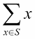
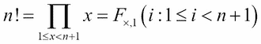
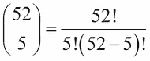

# 八、函数和反应式编程特性

在本章中，我们将介绍以下配方：

*   用 yield 语句编写生成器函数
*   使用堆叠生成器表达式
*   将转换应用于集合
*   选择子集–三种过滤方法
*   汇总集合–如何减少
*   结合 map 和 reduce 变换
*   实现“存在”处理
*   创建部分函数
*   用不变的数据结构简化复杂算法
*   用 yield-from 语句编写递归生成器函数

# 导言

**函数式编程**的思想是专注于编写执行所需数据转换的小型表达函数。组合函数通常可以创建比过程语句的长字符串或复杂、有状态对象的方法更简洁、更具表达力的代码。Python 允许所有三种编程。

传统数学将许多事物定义为函数。将多个函数组合在一起，以根据以前的转换生成复杂的结果。例如，我们可能需要组合两个函数，*f（x）*和*g（y）*，以创建有用的结果：

*y=f（x）*

*z=g（y）*

理想情况下，我们可以从这两个函数创建一个复合函数：

*z*=（*g*∘ *f*（*x*）

使用复合函数（*g*∘ *f*），可以帮助澄清程序是如何工作的。它允许我们获取一些小细节，并将它们组合成一个更大的知识块。

由于编程通常与数据集合一起工作，因此我们通常将一个函数应用于整个集合。这非常符合**集合生成器**或**集合理解**的数学思想。

将一个函数应用于一组数据有三种常见模式：

*   **映射**：将函数应用于集合{*M*（*x*：*x*的所有元素∈ *C*}。我们将一些函数*M*应用于更大集合*C*中的每个项目*x*。
*   **过滤**：使用函数从集合中选择元素。{*x*：*c*∈ *C***如果***F**x*}。我们使用一个函数*F*来确定是否通过或拒绝来自更大集合*C*的项目*x*。
*   **减少**：这是一个集合的总结。细节各不相同，但最常见的缩减之一是在集合*C*：中创建所有项目的总和*x*。

我们通常会结合这些模式来创建更复杂的应用程序。这里重要的是，小函数，如*M（x）*和*F（x）*通过映射和过滤等高阶函数进行组合。即使单个部件非常简单，组合操作也可能非常复杂。

**反应式编程**的理念是在输入可用或更改时评估处理规则。这符合懒惰编程的思想。当我们定义类定义的惰性属性时，我们创建了反应式程序。

反应式编程适合于函数式编程，因为可能需要多次转换才能对输入值的变化作出反应。通常，这最清楚地表示为组合或堆叠成响应变化的复合函数的函数。参见[第 6 章](06.html#page "Chapter 6. Basics of Classes and Objects")*类和对象基础*中的*使用惰性属性*配方，了解一些反应式类设计的示例。

# 使用 yield 语句编写生成器函数

我们所看到的大多数食谱都是针对单个系列中的所有产品设计的。方法是使用`for`语句逐步遍历集合中的每个项，或者将值映射到新项，或者将集合缩减为某种汇总值。

从集合生成单个结果是使用集合的两种方法之一。另一种方法是生成增量结果，而不是单个结果。

在内存中无法容纳整个集合的情况下，这种方法非常有用。例如，分析巨大的 web 日志文件最好是少量进行，而不是创建内存集合。

是否有办法将收集结构与处理功能分离？我们是否可以在每一个项目可用时立即产生处理结果？

## 准备好了吗

我们将查看一些具有日期-时间字符串值的 web 日志数据。我们需要解析这些来创建适当的`datetime`对象。为了在这个配方中保持重点，我们将使用由 Flask 生成的简化日志。

条目以文本行开始，如下所示：

```py
[2016-05-08 11:08:18,651] INFO in ch09_r09: Sample Message One

[2016-05-08 11:08:18,651] DEBUG in ch09_r09: Debugging

[2016-05-08 11:08:18,652] WARNING in ch09_r09: Something might have gone wrong

```

我们在*中看到了其他使用更复杂结构的此类日志的示例[第 7 章](07.html#page "Chapter 7. More Advanced Class Design")中的列表映射*配方、*更高级的类设计*。使用[第一章](01.html#page "Chapter 1. Numbers, Strings, and Tuples")中*字符串解析正则表达式*配方中的 REs，*数字、字符串和元组*，我们可以将每一行分解为如下行集合：

```py
>>> data = [ 
...    ('2016-04-24 11:05:01,462', 'INFO', 'module1', 'Sample Message One'), 
...    ('2016-04-24 11:06:02,624', 'DEBUG', 'module2', 'Debugging'), 
...    ('2016-04-24 11:07:03,246', 'WARNING', 'module1', 'Something might have gone wrong') 
... ]

```

我们不能使用普通的字符串解析将复杂的日期时间戳转换成更有用的东西。然而，我们可以编写一个生成器函数来处理每一行日志，从而生成一个更有用的中间数据结构。

生成器函数是使用`yield`语句的函数。当一个函数有收益时，它以递增的方式构建结果，以客户机可以使用的方式生成每个单独的值。使用者可能是一个`for`语句，也可能是另一个需要值序列的函数。

## 怎么做。。。

1.  这需要`datetime`模块：

    ```py
            import datetime 

    ```

2.  Define a function that processes a source collection:

    ```py
            def parse_date_iter(source): 

    ```

    我们加入了后缀`_iter`作为提醒，这个函数将是一个可移植对象，而不是一个简单的集合。

3.  包括访问源集合中每个项目的`for`语句：

    ```py
            for item in source: 

    ```

4.  The body of the `for` statement can map the item to a new item:

    ```py
            date = datetime.datetime.strptime( 
                item[0], 
                "%Y-%m-%d %H:%M:%S,%f") 
            new_item = (date,)+item[1:] 

    ```

    在本例中，我们将单个字段从字符串映射到`datetime`对象。变量`date`是根据`item[0]`中的字符串构建的。

    然后，我们将日志消息三元组映射到一个新元组，用适当的`datetime`对象替换日期字符串。由于该项的值是一个元组，因此我们创建了一个带有`(date,)`的单例元组，然后将其与`item[1:]`元组连接起来。

5.  使用`yield`语句生成新项目：

    ```py
            yield new_item 

    ```

整个结构如下所示，适当缩进：

```py
    import datetime 
    def parse_date_iter(source): 
        for item in source: 
            date = datetime.datetime.strptime( 
                item[0], 
                "%Y-%m-%d %H:%M:%S,%f") 
            new_item = (date,)+item[1:] 
            yield new_item 

```

`parse_date_iter()`函数需要一个可编辑的输入对象。集合是 iterable 对象的一个示例。不过，更重要的是，其他发电机也同样适用。我们可以利用这一点来构建处理来自其他生成器的数据的生成器堆栈。

此函数不创建集合。它生成每个项目，以便可以单独处理这些项目。源集合被分解成小块，允许处理大量数据。在某些配方中，数据将从内存中的集合开始。在后面的菜谱中，我们将处理来自外部文件的数据。处理外部文件是这项技术的最大好处。

以下是我们如何使用此功能：

```py
>>> from pprint import pprint 
>>> from ch08_r01 import parse_date_iter 
>>> for item in parse_date_iter(data): 
...     pprint(item) 
(datetime.datetime(2016, 4, 24, 11, 5, 1, 462000), 
 'INFO', 
 'module1', 
 'Sample Message One') 
(datetime.datetime(2016, 4, 24, 11, 6, 2, 624000), 
 'DEBUG', 
 'module2', 
 'Debugging') 
(datetime.datetime(2016, 4, 24, 11, 7, 3, 246000), 
 'WARNING', 
 'module1', 
 'Something might have gone wrong')

```

我们使用了一个`for`语句来迭代`parse_date_iter()`函数的结果，一次迭代一项。我们使用了`pprint()`功能来显示每个项目。

我们还可以使用以下方式将项目收集到适当的列表中：

```py
>>> details = list(parse_date_iter(data))

```

在本例中，`list()`函数使用`parse_date_iter()`函数生成的所有项。使用`list()`或`for`语句之类的函数来消耗生成器中的所有项是非常必要的。生成器是一个相对被动的构造—在需要数据之前，它不会做任何工作。

如果我们不主动使用数据，我们会看到如下情况：

```py
>>> parse_date_iter(data) 
<generator object parse_date_iter at 0x10167ddb0>

```

`parse_date_iter()`函数的值是一个生成器。它不是一个项目集合，而是一个按需生产项目的功能。

## 它是如何工作的。。。

编写生成器函数可以改变我们感知算法的方式。有两种常见的模式：映射和归约。映射将每个项转换为一个新项，可能会计算一些派生值。缩减会累积源集合中的汇总，如总和、平均值、方差或哈希。这些可以分解为逐项转换或过滤器，与处理集合的整个循环分离。

Python 有一个称为**迭代器**的复杂构造，它位于生成器和集合的核心。迭代器将提供集合中的每个值，同时执行维护流程状态所需的所有内部簿记。生成器函数的行为类似于迭代器—它提供一系列值并维护自己的内部状态。

请考虑以下常见的 Python 代码：

```py
    for i in some_collection: 
        process(i) 

```

在幕后，发生了如下事情：

```py
    the_iterator = iter(some_collection) 
    try: 
        while True: 
            i = next(the_iterator) 
            process(i) 
    except StopIteration: 
        pass 

```

Python 对集合的`iter()`函数求值，为该集合创建迭代器对象。迭代器绑定到集合并维护一些内部状态信息。代码在迭代器上使用`next()`来获取每个值。当没有更多的值时，迭代器引发`StopIteration`异常。

Python 的每个集合都可以生成一个迭代器。由`Sequence`或`Set`生成的迭代器将访问集合中的每个项目。`Mapping`生成的迭代器将访问映射的每个键。我们可以使用映射的`values()`方法来迭代值而不是键。我们可以使用映射的`items()`方法访问`(key, value)`两个元组的序列。`file`的迭代器将访问文件中的每一行。

迭代器概念也可以应用于函数。带有`yield`语句的函数称为**生成器函数**。它适合迭代器的模板。为此，生成器返回自身以响应`iter()`函数。作为对`next()`函数的响应，它产生下一个值。

当我们将`list()`应用于集合或生成器函数时，`for`语句使用的相同基本机制会获得单个值。`list()`使用`iter()`和`next()`函数获取项目。然后将项目转换为序列。

在生成器函数上评估`next()`很有趣。对生成器函数进行评估，直到其达到`yield`语句。该值是`next()`的结果。每次评估`next()`时，函数在`yield`语句之后恢复处理，并继续到下一个`yield`语句。

下面是一个小函数，它生成两个对象：

```py
>>> def gen_func(): 
...     print("pre-yield") 
...     yield 1 
...     print("post-yield") 
...     yield 2

```

下面是我们评估`next()`时发生的情况。在发电机上，此功能产生：

```py
>>> y = gen_func() 
>>> next(y) 
pre-yield 
1 
>>> next(y) 
post-yield 
2

```

我们第一次评估`next()`时，评估了第一个`print()`函数，然后`yield`语句产生了一个值。函数的处理被暂停，并给出了`>>>`提示。第二次评估`next()`函数时，评估了两条`yield`语句之间的语句。该功能再次暂停，并将显示`>>>`提示。

接下来会发生什么？我们没有`yield`声明：

```py
>>> next(y)  
Traceback (most recent call last): 
  File "<pyshell...>", line 1, in <module> 
    next(y) 
StopIteration

```

`StopIteration`异常在发电机功能结束时引发。

## 还有更多。。。

生成器功能的核心价值在于能够将复杂的处理分为两部分：

*   要应用的转换或筛选器
*   要使用的源数据集

下面是一个使用生成器过滤数据的示例。在这种情况下，我们将过滤输入值，只保留素数，拒绝所有复合数。

我们可以将处理写成 Python 函数，如下所示：

```py
    def primeset(source): 
        for i in source: 
            if prime(i): 
                yield prime 

```

对于源代码中的每个值，我们将评估`prime()`函数。如果结果为`true`，我们将生成源值。如果结果为`false`，则源值将被拒绝。我们可以这样使用`primeset()`：

```py
    p_10 = set(primeset(range(2,2000000))) 

```

`primeset()`函数将从源集合中生成单个素数值。源集合将是介于 200 万到 200 万之间的整数。结果是根据提供的值生成一个`set`对象。

这里所缺少的就是确定一个数字是否为素数的`prime()`函数。我们将把它作为练习留给读者。

在数学上，通常会看到*集合生成器*或*集合理解*符号来指定从一个集合构建另一个集合的规则。

我们可能会看到这样的情况：

*P<sub>10</sub>*={*i*:*i*∈ *ℕ* ∧ 2.≤ 1<2000000**如果***P**i*}

这告诉我们，*P<sub>10</sub>*是自然数集合*中所有数字的集合*i*ℕ* ，如果*P（i）*为`true`，则介于 200 万和 200 万之间。这定义了用于构建集合的规则。

我们也可以用 Python 编写：

```py
    p_10 = {i for i in range(2,2000000) if prime(i)} 

```

这是素数子集的 Python 表示法。从句从数学抽象中稍微重新排列，但表达式中所有相同的基本部分都存在。

当我们开始研究像这样的生成器表达式时，我们可以看到大量编程符合一些常见的总体模式：

*   **地图**：{*m*（*x*）：*x*∈ *S*变为`(m(x) for x in S)`。
*   **过滤器**：{*x*：*x*∈ *S***如果***f**x*变为`(x for x in S if f(x))`。
*   **减少**：这有点复杂，但常见的减少包括总和和计数。是`sum(x for x in S)`。其他常见的缩减包括查找一组数据的最大值或最小值。

我们也可以使用`yield`语句编写这些不同的高级函数。以下是泛型映射的定义：

```py
    def map(m, S): 
        for s in S: 
            yield m(s) 

```

此函数将其他一些函数`m()`应用于源集合`S`中的每个数据元素。映射函数的结果作为结果值序列生成。

我们可以为泛型`filter`函数编写类似的定义：

```py
    def filter(f, S): 
        for s in S: 
            if f(s): 
                yield s 

```

与泛型映射一样，我们将函数`f()`应用于源集合`S`中的每个元素。如果函数为`true`，则产生值。当函数为`false`时，值被拒绝。

我们可以用它来创建一组素数，如下所示：

```py
    p_10 = set(filter(prime, range(2,2000000))) 

```

这将对数据的源范围应用`prime()`功能。请注意，我们只写`prime`——不写`()`字符，因为我们是在命名函数，而不是对其求值。`prime()`功能将检查每个单独的值。通过的将被允许组装成最终的组件。那些组合的值将被拒绝，不会进入最终设置。

## 另见

*   在*使用堆叠生成器表达式*配方中，我们将组合生成器函数，从简单组件构建复杂的处理堆栈。
*   在*将转换应用于集合*配方中，我们将看到如何使用内置`map()`函数从简单函数和可移植数据源创建复杂处理。
*   在*选取子集–过滤*配方的三种方法中，我们将看到内置`filter()`函数如何也可以用于从简单函数和可移植数据源构建复杂处理。
*   参见[https://projecteuler.net/problem=10](https://projecteuler.net/problem=10) 针对质数小于 200 万的挑战性问题。部分问题似乎显而易见。然而，要测试所有这些数字是否为素数是很困难的。

# 使用堆叠生成器表达式

在*使用 yield 语句*编写生成器函数的过程中，我们创建了一个简单的生成器函数，它对一段数据执行单个转换。实际上，我们通常有几个函数要应用于传入的数据。

我们如何*堆叠*或组合多个生成器函数来创建一个复合函数？

## 准备好了吗

我们有一个电子表格，用于记录大型帆船的燃油消耗量。它具有如下所示的行：

<colgroup><col> <col> <col></colgroup> 
| **日期** | **发动机在**上 | **燃油高度** |
|  | **发动机关闭** | **燃油高度** |
|  | **其他注释** |  |
| 10/25/2013 | 08:24 | 29 |
|  | 13:15 | 27 |
|  | 平静的海洋——锚定所罗门岛 |  |
| 10/26/2013 | 09:12 | 27 |
|  | 18:25 | 22 |
|  | 杰克逊河中的波涛汹涌的锚 |  |

有关此数据的更多背景信息，请参见[第 4 章](04.html#page "Chapter 4. Built-in Data Structures – list, set, dict")*内置数据结构中的*切片和切割列表*配方–列表、集合、指令*。

作为一个侧栏，我们可以像这样获取数据。我们将在[第 9 章](09.html#page "Chapter 9. Input/Output, Physical Format, and Logical Layout")中的*使用 csv 模块*配方读取分隔文件、*输入/输出、物理格式和逻辑布局*中详细介绍这一点：

```py
>>> from pathlib import Path 
>>> import csv 
>>> with Path('code/fuel.csv').open() as source_file: 
...    reader = csv.reader(source_file) 
...    log_rows = list(reader) 
>>> log_rows[0] 
['date', 'engine on', 'fuel height'] 
>>> log_rows[-1] 
['', "choppy -- anchor in jackson's creek", '']

```

我们已经使用`csv`模块读取日志详细信息。`csv.reader()`是一个可编辑的对象。为了将项目收集到单个列表中，我们将`list()`函数应用于生成器函数。我们在列表的第一项和最后一项打印，以确认我们确实有一个列表结构列表。

我们希望对该列表应用两种转换：

*   将日期和两次转换为两个日期时间值
*   将三行合并为一行，以便对数据进行简单的组织

如果我们创建一对有用的生成器函数，我们可以使用如下所示的软件：

```py
    total_time = datetime.timedelta(0) 
    total_fuel = 0 
    for row in date_conversion(row_merge(source_data)): 
        total_time += row['end_time']-row['start_time'] 
        total_fuel += row['end_fuel']-row['start_fuel'] 

```

组合的生成器功能`date_conversion(row_merge(...))`将生成一系列具有起始信息、结束信息和注释的单行。这种结构可以很容易地进行总结或分析，以创建简单的统计相关性和趋势。

## 怎么做。。。

1.  Define an initial reduce operation that combines rows. We have several ways to tackle this. One is to always group three rows together.

    另一种方法是注意第 0 列的数据位于组的开头；对于组的下两行，它是空的。这为我们提供了一种更通用的创建行组的方法。这是一种**头尾合并**算法。我们将收集数据，并在每次到达下一组组长处时生成数据：

    ```py
            def row_merge(source_iter): 
                group = [] 
                for row in source_iter: 
                    if len(row[0]) != 0: 
                        if group: 
                            yield group 
                        group = row.copy() 
                    else: 
                        group.extend(row) 
                if group: 
                    yield group 

    ```

    此算法使用`len(row[0])`来确定这是组的头还是组尾部的一行。在首行的情况下，将产生任何先前的组。消耗完之后，`group`集合的值被重置为来自首行的列数据。

    组尾部的行只是附加到`group`集合中。当数据耗尽时，`group`变量中通常会有最后一组。如果根本没有数据，`group`的最终值也将是一个零长度列表，应该忽略。

    稍后我们将讨论`copy()`方法。这很重要，因为我们使用的是列表数据结构，列表是可变对象。我们可以编写改变数据结构的处理，使得某些处理难以解释。

2.  Define the various mapping operations that will be performed on the merged data. These apply to the data in the original row. We'll use separate functions to convert each of the two time columns and merge the times with the date column:

    ```py
            import datetime 
            def start_datetime(row): 
                travel_date = datetime.datetime.strptime(row[0], "%m/%d/%y").date() 
                start_time = datetime.datetime.strptime(row[1], "%I:%M:%S %p").time() 
                start_datetime = datetime.datetime.combine(travel_date, start_time) 
                new_row = row+[start_datetime] 
                return new_row 

            def end_datetime(row): 
                travel_date = datetime.datetime.strptime(row[0], "%m/%d/%y").date() 
                end_time = datetime.datetime.strptime(row[4], "%I:%M:%S %p").time() 
                end_datetime = datetime.datetime.combine(travel_date, end_time) 
                new_row = row+[end_datetime] 
                return new_row 

    ```

    我们将把第 0 列中的日期与第 1 列中的时间结合起来，创建一个起始`datetime`对象。类似地，我们将把第 0 列中的日期与第 4 列中的时间组合起来，以创建一个结束`datetime`对象。

    这两个函数有很多重叠，可以重构为一个以列号作为参数值的函数。然而，现在我们的目标是写一些简单有效的东西。为提高效率而重构可以在以后进行。

3.  Define mapping operations that apply to the derived data. Columns eight and nine contain the date-time stamps:

    ```py
            for starting and ending.def duration(row): 
                travel_hours = round((row[10]-row[9]).total_seconds()/60/60, 1) 
                new_row = row+[travel_hours] 
                return new_row 

    ```

    我们使用了`start_datetime`和`end_datetime`创建的值作为输入。我们已经计算了增量时间，它提供了以秒为单位的结果。我们将秒转换为小时，这是这组数据更有用的时间单位。

4.  Fold in any filters required to reject or exclude bad data. In this case, we have a header row that must be excluded:

    ```py
            def skip_header_date(rows): 
                for row in rows: 
                    if row[0] == 'date': 
                        continue 
                    yield row 

    ```

    此函数将拒绝第一列中有`date`的任何行。`continue`语句恢复`for`语句，跳过正文中的所有其他语句；它跳过了`yield`语句。所有其他行都将通过此进程。输入是一个 iterable，此生成器将生成未以任何方式转换的行。

5.  Combine the operations. We can either write a sequence of generator expressions or use the built-in `map()` function. Here's how it might look using generator expressions:

    ```py
            def date_conversion(source): 
                tail_gen = skip_header_date(source) 
                start_gen = (start_datetime(row) for row in tail_gen) 
                end_gen = (end_datetime(row) for row in start_gen) 
                duration_gen = (duration(row) for row in end_gen) 
                return duration_gen 

    ```

    此操作由一系列转换组成。每一个都对原始数据集合中的一个值进行一个小的转换。添加操作或更改操作相对简单，因为每个操作都是独立定义的：

    *   `tail_gen`生成器跳过源的第一行后生成行
    *   `start_gen`生成器将`datetime`对象附加到每行的末尾，开始时间从字符串构建到源列中
    *   `end_gen`生成器将`datetime`对象附加到每一行，该行具有从字符串构建的结束时间
    *   `duration_gen`生成器将一个`float`对象附加到腿的持续时间

    整个`date_conversion()`功能的输出是一个发电机。它可以通过`for`语句使用，也可以从项目中构建`list`。

## 它是如何工作的。。。

编写生成器函数时，参数值可以是集合，也可以是另一种 iterable。由于生成器函数是可分解的，因此可以创建一种生成器函数的*管道*。

每个函数都可以包含一个小的转换，该转换会更改输入的一个特征以创建输出。然后，我们将这些小转换包装到生成器表达式中。因为每个转换都与其他转换很好地隔离，所以我们可以在不中断整个处理管道的情况下对其中一个进行更改。

处理是递增的。对每个函数进行求值，直到生成一个值为止。考虑一下这个说法：

```py
    for row in date_conversion(row_merge(data)): 
        print(row[11]) 

```

我们定义了几个生成器的组合。该构图使用了多种技术：

*   `row_merge()`函数是一个生成行数据的生成器。为了产生一行，它将从源代码中读取四行，组装一个合并行，然后产生它。每次需要另一行时，它将再读取三行输入以组装输出行。
*   `date_conversion()`功能是由多台发电机构成的复杂发电机。
*   `skip_header_date()`设计用于产生单一值。有时它必须从源迭代器中读取两个值。如果输入行的第 0 列中有`date`，则跳过该行。在这种情况下，它将读取第二个值，从`row_merge()`中获取另一行；它必须依次读取三行以上的输入，以生成一行合并的输出。我们已将生成器分配给`tail_gen`变量。
*   `start_gen`、`end_gen`和`duration_gen`生成器表达式将对其输入的每一行应用相对简单的函数，如`start_datetime()`和`end_datetime()`，从而产生具有更有用数据的行。

本例中显示的最后一条`for`语句将通过反复计算`next()`函数从`date_conversion()`迭代器收集值。下面是创建所需结果的步骤视图。请注意，这只适用于非常少量的数据，每一步只做一个小的更改：

1.  `date_conversion()`函数结果是`duration_gen`对象。为了让它返回一个值，它需要来自其源的一行`end_gen`。一旦有了数据，就可以应用`duration()`函数并生成行。
2.  `end_gen`表达式需要来自其源代码`start_gen`的一行。然后可以应用`end_datetime()`函数并生成行。
3.  `start_gen`表达式需要来自其源代码`tail_gen`的一行。然后可以应用`start_datetime()`函数并生成行。
4.  `tail_gen`表达式只是生成器`skip_header_date()`。此函数将根据需要从其源中读取任意多的行，直到找到一行，其中列 0 不是列标题`date`。它生成一个非日期行。其来源是`row_merge()`功能的输出。
5.  `row_merge()`函数将从其源中读取多行，直到它可以组合符合所需模式的行集合。它将生成一个在第 0 列中有一些文本的组合行，然后是在第 0 列中没有文本的行。其来源是原始数据的列表集合列表。
6.  行集合将由`row_merge()`函数内的`for`语句处理。此处理将隐式地为集合创建迭代器，以便根据`row_merge()`函数体的需要生成每一行。

每一行数据都将通过这个步骤管道。管道的某些阶段将为单个结果行使用多个源行，从而在处理数据时重新构造数据。其他阶段使用单个值。

此示例依赖于将项连接到一个长的值序列中。项目由位置标识。对管道中各阶段的顺序进行微小更改将改变项目的位置。我们将在下一步研究一些改进方法。

最重要的是，只处理单个行。如果数据源是一个庞大的数据集合，那么处理过程可以非常快速地进行。这种技术允许一个小型 Python 程序快速、简单地处理大量数据。

## 还有更多。。。

实际上，一组相互关联的生成器是一种复合函数。我们可能有几个函数，分别定义如下：

*y=f（x）*

*z=g（y）*

我们可以通过将第一个函数的结果应用于第二个函数来组合它们：

*z=g（f（x））*

随着函数数量的增加，这可能会变得很尴尬。当我们在多个地方使用这对函数时，我们打破了**不要重复自己**（**DRY**原则。拥有这个复杂表达式的多个副本并不理想。

我们想要的是一种创建复合函数的方法，如下所示：

*z*=（*g*∘ *f*（*x*）

在这里，我们定义了一个新函数，（*g*∘ *f*），将两个原始功能组合成一个新的、单一的复合功能。我们现在可以修改此组合以添加或更改功能。

这个概念推动了复合`date_conversion()`函数的定义。此函数由多个函数组成，每个函数都可以应用于集合项。如果我们需要进行更改，我们可以轻松编写更简单的函数，并将它们放入由`date_conversion()`函数定义的管道中。

我们可以看到管道中的函数之间存在一些细微的差异。我们有一些类型转换。但是，持续时间计算实际上不是类型转换。这是一个基于日期转换结果的单独计算。如果我们想计算每小时的燃料使用量，我们需要再增加几个计算。这些附加摘要均不属于日期转换的一部分。

我们真的应该把高层`data_conversion()`分成两部分。我们应该编写另一个用于计算持续时间和燃料使用量的函数，名为`fuel_use()`。然后，此其他函数可以包装`date_conversion()`。

我们的目标可能是：

```py
    for row in fuel_use(date_conversion(row_merge(data))): 
        print(row[11]) 

```

我们现在有了一个非常复杂的计算，它定义在许多非常小且（几乎）完全独立的块中。我们可以修改一个部分，而不必深入思考其他部分是如何工作的。

### 名称空间而不是列表

一个重要的改变是不再避免使用简单的数据值列表。在`row[10]`上进行计算是一场潜在的灾难。我们应该将输入数据正确地转换为某种名称空间。

可以使用`namedtuple`。我们将在*用不可变数据结构简化复杂算法*配方中看到这一点。

`SimpleNamespace`可以在某些方面进一步简化此处理。`SimpleNamespace`是一个可变对象，可以更新。变异一个对象并不总是最好的办法。它的优点是简单，但在可变对象中编写状态更改测试也可能稍微困难一些。

像`make_namespace()`这样的函数可以提供一组名称而不是位置。这是一个生成器，必须在合并行之后，但在任何其他处理之前使用：

```py
    from types import SimpleNamespace 

    def make_namespace(merge_iter): 
        for row in merge_iter: 
            ns = SimpleNamespace( 
                date = row[0], 
                start_time = row[1], 
                start_fuel_height = row[2], 
                end_time = row[4], 
                end_fuel_height = row[5], 
                other_notes = row[7] 
            ) 
            yield ns 

```

这将产生一个允许我们写入`row.date`而不是`row[0]`的对象。当然，这将改变其他功能的定义，包括`start_datetime()`、`end_datetime()`和`duration()`。

这些函数中的每一个都可以发出一个新的`SimpleNamespace`对象，而不是更新代表每一行的值列表。然后我们可以编写如下所示的函数：

```py
    def duration(row_ns): 
        travel_time = row_ns.end_timestamp - row_ns.start_timestamp 
        travel_hours = round(travel_time.total_seconds()/60/60, 1) 
        return SimpleNamespace( 
            **vars(row_ns), 
            travel_hours=travel_hours 
        )

```

此函数不将行处理为`list`对象，而是将行处理为`SimpleNamespace`对象。这些栏目有清晰而有意义的名称，如`row_ns.end_timestamp`而不是晦涩的`row[10]`。

从一个旧名称空间构建一个新的`SimpleNamespace`有一个三部分的过程：

1.  使用`vars()`函数提取`SimpleNamespace`实例中的字典。
2.  使用`**vars(row_ns)`对象在旧名称空间的基础上构建新名称空间。
3.  任何额外的关键字参数，如`travel_hours = travel_hours`提供了将加载新对象的额外值。

另一种方法是更新名称空间并返回更新的对象：

```py
    def duration(row_ns): 
        travel_time = row_ns.end_timestamp - row_ns.start_timestamp 
        row_ns.travel_hours = round(travel_time.total_seconds()/60/60, 1) 
        return row_ns 

```

这样做的优点是稍微简单一点。缺点是很少考虑到有状态对象有时会令人困惑。修改算法时，可能无法按正确的顺序设置属性，从而使惰性（或反应性）编程正常运行。

虽然有状态对象很常见，但它们应该始终被视为两种选择之一。不可变的`namedtuple`可能比可变的`SimpleNamespace`更好。

## 另见

*   有关生成器函数的介绍，请参见*编写生成器函数和收益声明*配方
*   有关油耗数据集的更多信息，请参见[第 4 章](04.html#page "Chapter 4. Built-in Data Structures – list, set, dict")*内置数据结构中的*切片和切割列表*配方**内置数据结构–列表、集合、dict*
*   请参阅*组合映射和减少变换*配方，了解组合操作的另一种方法

# 对集合应用转换

在*使用收益率语句*编写生成器函数时，我们考虑了编写生成器函数。我们看到的示例结合了两个元素：转换和数据源。它们通常是这样的：

```py
    for item in source: 
        new_item = some transformation of item 
        yield new_item 

```

此模板用于编写生成器函数不是必需的。这只是一种常见的模式。`for`语句中隐藏着一个转换过程。`for`语句主要是样板代码。我们可以重构它，使转换函数显式，并与`for`语句分离。

在*使用堆叠生成器表达式*配方中，我们定义了一个`start_datetime()`函数，该函数从源数据集合的两个单独列中的字符串值计算出一个新的`datetime`对象。

我们可以在生成器函数体中使用此函数，如下所示：

```py
    def start_gen(tail_gen): 
        for row in tail_gen: 
            new_row = start_datetime(row) 
            yield new_row 

```

此函数将`start_datetime()`函数应用于数据源`tail_gen`中的每个项目。生成每个结果行，以便另一个函数或`for`语句可以使用它。

在*使用堆叠生成器表达式*配方中，我们研究了将这些转换函数应用于更大数据集合的另一种方法。在本例中，我们使用了生成器表达式。代码如下所示：

```py
    start_gen = (start_datetime(row) for row in tail_gen) 

```

这将`start_datetime()`功能应用于数据源`tail_gen`中的每个项目。另一个函数或`for`语句可以使用`start_gen`iterable 中可用的值。

完整的生成器函数和较短的生成器表达式本质上是相同的，但语法略有不同。这两者都与*集合生成器*或*集合理解*的数学概念平行。我们可以用数学方法将此操作描述为：

*s*=[*s*（*r*：*r*∈ *T*

在此表达式中，*S*是`start_datetime()`函数，*T*是称为`tail_gen`的值序列。结果序列是*S（r）*的值，其中*r*的每个值是集合*T*的一个元素。

生成器函数和生成器表达式都有类似的样板代码。我们能简化这些吗？

## 准备好了。。。

我们将查看来自*编写生成器函数的 web 日志数据以及收益率语句*配方。它将`date`作为字符串，我们希望将其转换为适当的时间戳。

以下是示例数据：

```py
>>> data = [ 
...    ('2016-04-24 11:05:01,462', 'INFO', 'module1', 'Sample Message One'), 
...    ('2016-04-24 11:06:02,624', 'DEBUG', 'module2', 'Debugging'), 
...    ('2016-04-24 11:07:03,246', 'WARNING', 'module1', 'Something might have gone wrong') 
... ]

```

我们可以编写这样的函数来转换数据：

```py
    import datetime 
    def parse_date_iter(source): 
        for item in source: 
            date = datetime.datetime.strptime( 
                item[0], 
                "%Y-%m-%d %H:%M:%S,%f") 
            new_item = (date,)+item[1:] 
            yield new_item 

```

此函数将使用`for`语句检查源中的每个项。第 0 列中的值是一个`date`字符串，可以将其转换为适当的`datetime`对象。新项目`new_item`是从`datetime`对象和从第一列开始的其余项目构建的。

因为函数使用`yield`语句生成结果，所以它是一个生成器函数。我们将其与这样的`for`语句一起使用：

```py
    for row in parse_date_iter(data): 
        print(row[0], row[3]) 

```

此语句将收集生成器函数生成的每个值，并打印两个选定值。

`parse_date_iter()`函数有两个基本元素组合成一个函数。大纲如下所示：

```py
    for item in source: 
        new_item = transformation(item) 
        yield new_item 

```

`for`和`yield`语句主要是样板代码。`transformation()`函数是其中非常有用和有趣的一部分。

## 怎么做。。。

1.  Write the transformation function that applies to a single row of the data. This is not a generator, and doesn't use the `yield` statement. It simply revises a single item from a collection:

    ```py
            def parse_date(item): 
                date = datetime.datetime.strptime( 
                    item[0], 
                    "%Y-%m-%d %H:%M:%S,%f") 
                new_item = (date,)+item[1:] 
                return new_item 

    ```

    这可以通过三种方式使用：语句、表达式和`map()`函数。下面是明确的`for...yield`语句模式：

    ```py
            for item in collection: 
                new_item = parse_date(item) 
                yield new_item 

    ```

    它使用一个`for`语句，使用隔离的`parse_date()`函数处理集合中的每个项。第二个选项是生成器表达式，如下所示：

    ```py
            (parse_date(item) for item in data) 

    ```

    这是一个将`parse_date()`函数应用于每个项目的生成器表达式。第三种选择是`map()`函数。

2.  Use the `map()` function to apply the transformation to the source data.

    ```py
            map(parse_date, data) 

    ```

    我们提供函数的名称`parse_date`，名称后没有任何`()`。我们现在不应用该函数。我们向`map()`函数提供对象的名称，以将`parse_date()`函数应用于可移植的数据源`data`。

    我们可以这样使用：

    ```py
            for row in map(parse_date, data): 
                print(row[0], row[3]) 

    ```

    `map()`函数创建一个 iterable 对象，将`parse_date()`函数应用于数据 iterable 中的每个项。它产生每个单独的项目。它使我们不必编写生成器表达式或生成器函数。

## 它是如何工作的。。。

`map()`函数替换了一些常见的样板代码。我们可以想象这个定义是这样的：

```py
    def map(f, iterable): 
        for item in iterable: 
            yield f(item) 

```

或者，我们可以想象它是这样的：

```py
    def map(f, iterable): 
        return (f(item) for item in iterable) 

```

这两个定义概括了`map()`功能的核心特征。这是一种方便的简写，消除了将函数应用于可移植数据源的一些样板代码。

## 还有更多。。。

在本例中，我们使用了`map()`函数来应用一个函数，该函数将单个参数应用于单个 iterable 的每个单独项。事实证明，`map()`函数可以做更多的事情。

考虑这个功能：

```py
>>> def mul(a, b): 
...    return a*b

```

这两个数据来源：

```py
>>> list_1 = [2, 3, 5, 7] 
>>> list_2 = [11, 13, 17, 23]

```

我们可以将`mul()`函数应用于从每个数据源提取的对：

```py
>>> list(map(mul, list_1, list_2)) 
[22, 39, 85, 161]

```

这允许我们使用不同类型的运算符合并两个值序列。例如，我们可以构建一个行为类似于内置`zip()`函数的映射。

下面是一个映射：

```py
>>> def bundle(*args): 
...     return args 
>>> list(map(bundle, list_1, list_2)) 
[(2, 11), (3, 13), (5, 17), (7, 23)]

```

我们需要定义一个小的辅助函数`bundle()`，它接受任意数量的参数，并从中创建一个元组。

下面是用于比较的`zip`函数：

```py
>>> list(zip(list_1, list_2)) 
[(2, 11), (3, 13), (5, 17), (7, 23)]

```

## 另见。。。

*   在*使用堆叠生成器表达式*配方中，我们查看了堆叠生成器。我们通过编写为生成器函数的许多单独映射操作构建了一个复合函数。我们还在堆栈中包含一个过滤器。

# 选取子集-三种过滤方式

在*使用堆叠生成器表达式*配方中，我们编写了一个生成器函数，从一组数据中排除一些行。我们定义了如下函数：

```py
    def skip_header_date(rows): 
        for row in rows: 
            if row[0] == 'date': 
                continue 
            yield row 

```

当条件为`true`-`row[0]`为`date`-`continue`语句将跳过`for`语句正文中的其余语句。在本例中，只有一条语句，`yield row`。

有两个条件：

*   `row[0] == 'date'`：跳过`yield`语句；该行被拒绝进行进一步处理
*   `row[0] != 'date'`：`yield`语句意味着该行将传递给使用数据的函数或语句

在四行代码中，这似乎是冗长的。`for...if...yield`模式显然是样板，在这种构造中，只有条件才是真正重要的。

我们能更简洁地表达这一点吗？

## 准备好了。。。

我们有一个电子表格，用于记录大型帆船的燃油消耗量。它具有如下所示的行：

<colgroup><col> <col> <col></colgroup> 
| **日期** | **发动机在**上 | **燃油高度** |
|  | **发动机关闭** | **燃油高度** |
|  | **其他注释** |  |
| 10/25/2013 | 08:24 | 29 |
|  | 13:15 | 27 |
|  | 平静的海洋——锚定所罗门岛 |  |
| 10/26/2013 | 09:12 | 27 |
|  | 18:25 | 22 |
|  | 杰克逊河中的波涛汹涌的锚 |  |

有关此数据的更多背景信息，请参阅*切片和切割列表*配方。

在*使用堆叠生成器表达式*配方中，我们定义了两个函数来重新组织此数据。第一个将每个三行组合并为一行，共有八列数据：

```py
    def row_merge(source_iter): 
        group = [] 
        for row in source_iter: 
            if len(row[0]) != 0: 
                if group: 
                    yield group 
                group = row.copy() 
            else: 
                group.extend(row) 
        if group: 
            yield group 

```

这是**头尾**算法的一个变体。当`len(row[0]) != 0`时，这是一个新组的标题行，任何以前完整的组都被生成，然后`group`变量的工作值被重置为基于此标题行的新列表。创建了一个`copy()`，这样我们就可以避免以后对列表对象进行变异。当`len(row[0]) == 0`时，这是集团的尾部；该行追加到`group`变量的工作值。在数据源的末尾，通常有一个完整的组需要处理。存在一种根本没有数据的边缘情况；在这种情况下，也不会有最后一组人屈服。

我们可以使用此函数将数据从许多混乱的行转换为有用信息的单行：

```py
>>> from ch08_r02 import row_merge, log_rows 
>>> pprint(list(row_merge(log_rows))) 

[['date', 
  'engine on', 
  'fuel height', 
  '', 
  'engine off', 
  'fuel height', 
  '', 
  'Other notes', 
  ''], 
 ['10/25/13', 
  '08:24:00 AM', 
  '29', 
  '', 
  '01:15:00 PM', 
  '27', 
  '', 
  "calm seas -- anchor solomon's island", 
  ''], 
 ['10/26/13', 
  '09:12:00 AM', 
  '27', 
  '', 
  '06:25:00 PM', 
  '22', 
  '', 
  "choppy -- anchor in jackson's creek", 
  '']]

```

我们看到第一行只是电子表格标题。我们想跳过这一排。我们将创建一个生成器表达式来处理筛选并拒绝这一额外的行。

## 怎么做。。。

1.  Write the predicate function that tests an item to see whether it should be passed through the filter for further processing. In some cases, we'll have to start with a reject rule and then write the inverse to make it into a pass rule:

    ```py
            def pass_non_date(row): 
                return row[0] != 'date' 

    ```

    这可以通过三种方式使用：语句、表达式和`filter()`函数。下面是一个用于传递行的显式`for...if...yield`语句模式的示例：

    ```py
            for item in collection: 
                if pass_non_date(item): 
                    yield item 

    ```

    它使用一个`for`语句，使用 filter 函数处理集合中的每个项。已生成选定的项目。其他项目被拒绝。

    使用此函数的第二种方法是在生成器表达式中，如下所示：

    ```py
            (item for item in data if pass_non_date(item)) 

    ```

    此生成器表达式将`filter`函数`pass_non_date()`应用于每个项目。第三种选择是`filter()`函数。

2.  Use the `filter()` function to apply the function to the source data:

    ```py
            filter(pass_non_date, data) 

    ```

    我们已经提供了函数名`pass_non_date`。我们不在函数名后使用`()`字符，因为此表达式不计算函数。`filter()`函数将给定的函数应用于可编辑的数据源`data`。在本例中，`data`是一个集合，但它可以是任何 iterable，包括先前生成器表达式的结果。`pass_non_date()`功能为`true`的每一项都将通过过滤器；所有其他值都将被拒绝。

    我们可以这样使用：

    ```py
            for row in filter(pass_non_date, row_merge(data)): 
                print(row[0], row[1], row[4]) 

    ```

    `filter()`函数创建一个 iterable 对象，该对象将`pass_non_date()`函数作为规则应用于通过或拒绝`row_merge(data)`iterable 中的每个项。它将生成第 0 列中没有`date`的行。

## 它是如何工作的。。。

`filter()`函数替换了一些常见的样板代码。我们可以想象这个定义是这样的：

```py
    def filter(f, iterable): 
        for item in iterable: 
            if f(item): 
                yield f(item) 

```

或者，我们可以想象它是这样的：

```py
    def filter(f, iterable): 
        return (item for item in iterable if f(item)) 

```

这两个定义总结了`filter()`函数的核心特征：一些数据被传递，而一些数据被拒绝。这是一个方便的简写，它消除了一些将函数应用于可移植数据源的样板代码。

## 还有更多。。。

有时很难编写简单的规则来传递数据。如果我们写一条拒绝数据的规则，可能会更清楚。例如，这可能更有意义：

```py
    def reject_date(row): 
        return row[0] == 'date' 

```

我们可以通过多种方式使用拒绝规则。这里有一个`for...if...continue...yield`的陈述模式。这将使用 continue 跳过被拒绝的行，并生成剩余的行：

```py
    for item in collection: 
        if reject_date(item): 
            continue 
        yield item 

```

我们也可以使用这种变体。对于一些程序员来说，“不拒绝”的概念可能会令人困惑。这似乎是双重否定：

```py
    for item in collection: 
        if not reject_date(item): 
            yield item 

```

我们还可以使用以下生成器表达式：

```py
    (item for item in data if not reject_date(item)) 

```

然而，我们不能简单地将`filter()`函数与设计用于拒绝数据的规则一起使用。`filter()`功能的设计仅适用于通行规则。

我们有两个基本的选择来处理这种逻辑。我们可以将逻辑封装在另一个表达式中，或者使用来自`itertools`模块的函数。说到包装，我们还有两个选择。我们可以包装一个拒绝函数，从中创建一个传递函数。我们可以用这样的方法：

```py
    def pass_date(row): 
        return not reject_date(row) 

```

这使得创建一个简单的拒绝规则并在`filter()`函数中使用它成为可能。另一种包装逻辑的方法是创建一个`lambda`对象：

```py
     filter(lambda item: not reject_date(item), data) 

```

`lambda`函数是一个小型匿名函数。它是一个只包含两个元素的函数：参数列表和一个表达式。我们包装了`reject_date()`函数，通过`lambda`对象创建了一种`not_reject_date`函数。

在`itertools`模块中，我们使用`filterfalse()`功能。我们可以导入`filterfalse()`并使用它来代替内置的`filter()`功能。

## 另见。。。

*   在*使用堆叠生成器表达式*的配方中，我们在生成器堆栈中放置了这样一个函数。我们通过编写为生成器函数的许多单独映射和过滤操作构建了一个复合函数。

# 汇总一个集合–如何减少

在本章的引言中，我们注意到有三种常见的处理模式：map、filter 和 reduce。我们在*中看到了将转换应用于集合*配方的映射示例，在*中看到了选择子集的过滤示例–过滤*配方的三种方法。相对容易看出这些操作是如何变得非常通用的。

映射将简单函数应用于集合的所有元素。{*M**x*：*x*∈ *C*将一个功能*M*应用于更大集合*C*中的每个项目*x*。在 Python 中，它可以如下所示：

```py
    (M(x) for x in C) 

```

或者，我们可以使用内置的`map()`函数删除样板文件，并将其简化为：

```py
    map(M, c) 

```

类似地，筛选使用函数从集合中选择元素。{*x*：*x*∈ *C***如果***F**x*使用一个函数*F*来确定是否通过或拒绝来自更大集合*C*的项目*x*。我们可以在 Python 中以多种方式表达这一点，其中一种方式如下：

```py
    filter(F, c) 

```

这将谓词函数`F()`应用于集合`c`。

第三种常见模式是减少。在*设计具有大量处理*和*扩展集合的类：一个统计*配方的列表中，我们查看了计算大量统计值的类定义。这些定义几乎完全依赖于内置的`sum()`函数。这是较常见的削减之一。

我们可以用一种方法来概括求和，使我们能够写出许多不同类型的约化吗？我们如何以更一般的方式定义减少的概念？

## 准备好了吗

最常见的减少之一是总和。其他减少包括乘积、最小值、最大值、平均值、方差，甚至是一个简单的值计数。

下面是一种思考和函数的数学定义的方法，+，应用于集合*C*中的值：


我们通过在值序列中插入+运算符扩展了求和的定义，*C=C<sub>0</sub>、C<sub>1</sub>、C<sub>2</sub>、<sub>n</sub>*。+操作符中的*折叠*的想法抓住了内置`sum()`功能的含义。

类似地，产品的定义如下所示：


在这里，我们也对一系列值执行了不同的*折叠*。通过折叠展开缩减涉及两项：二进制运算符和基值。对于 sum，运算符为+且基值为零。对于产品，运算符为×且基值为 1。

我们可以定义一个通用的高级函数，*F*<sub>(⋄, ⊥)</sub> ，捕捉折叠的理想。折叠函数定义包括一个操作员占位符，⋄, 和一个用于基值的占位符，⊥. 给定集合的函数值*C*可以使用以下递归规则定义：


如果集合*C*为空，则该值为基值，⊥. 定义`sum()`时，基值为零。如果*C*不是空的，那么我们将首先计算集合中除最后一个值 F<sub>之外的所有值的倍数◊, ⊥</sub> （C<sub>0*..n*-1</sub>）。然后我们将应用操作符，例如，在上一个折叠结果和集合中的最终值之间进行加法，*C<sub>n-</sub>*<sub>1</sub>。对于`sum()`，运算符为+。

我们使用了符号*C*<sub>0。。*n*</sub>在肾盂意义上的开放范围。包括指数 0 至*n-*1 的数值，但不包括指数*n*的数值。这意味着*C*<sub>0..0</sub>=∅: 此范围*C<sub>0..0</sub>*中没有元素。

此定义称为**左折**操作，因为此定义的净效果是在集合中从左到右执行底层操作。这也可以更改为定义**向右折叠**操作。由于 Python 的`reduce()`函数是左折函数，我们将继续使用它。

我们将定义一个可用于计算阶乘值的`prod()`函数：


*n*阶乘的值是 1 和*n*之间所有数字的乘积。由于 Python 使用半开范围，因此使用*1*来使用或定义范围更像 Python≤ *x*<*n*+*1*。此定义更适合内置的`range()`功能。

使用前面定义的 fold 操作符，我们得到了这个。我们使用乘法运算符*和基值 1 定义了折叠（或缩减）：



折叠的概念是 Python 的概念`reduce()`的基础。我们可以将此应用于许多算法，从而可能简化定义。

## 怎么做。。。

1.  从`functools`模块

    ```py
     >>> from functools import reduce

    ```

    导入`reduce()`功能
2.  接接线员。总之，它是`+`。对于产品，它是`*`。这些可以用多种方式定义。这是长版本。定义所需二进制运算符的其他方法将在后面显示：

    ```py
     >>> def mul(a, b): 
          ...     return a * b

    ```

3.  选择所需的基本值。总之，它是零。对于产品，这是一个。这允许我们定义一个计算通用产品的`prod()`函数：

    ```py
     >>> def prod(values): 
          ...    return reduce(mul, values, 1)

    ```

4.  For factorial, we need to define the sequence of values that will be reduced:

    ```py
     range(1, n+1)

    ```

    这是如何与`prod()`函数一起工作的：

    ```py
     >>> prod(range(1, 5+1)) 
          120

    ```

这是整个阶乘函数：

```py
>>> def factorial(n): 
...    return prod(range(1, n+1))

```

以下是 52 张卡片组的排列方式。这是数值*52！*：

```py
>>> factorial(52) 
80658175170943878571660636856403766975289505440883277824000000000000

```

有很多方法可以洗牌一副牌。

可能有多少张 5 张牌？二项式计算使用阶乘：



```py
>>> factorial(52)//(factorial(5)*factorial(52-5)) 
2598960

```

对于任何给定的洗牌，大约有 260 万个不同的扑克手。（是的，这是一种非常低效的计算二项式的方法。）

## 它是如何工作的。。。

`reduce()`函数的行为就好像它有这样的定义：

```py
    def reduce(function, iterable, base): 
        result = base 
        for item in iterable: 
            result = function(result, item) 
        return result 

```

这将从左到右遍历这些值。它将在前一组值和 iterable 集合中的下一项之间应用给定的二进制函数。

当我们查看*递归函数和 Python 的堆栈限制*配方时，我们可以看到 fold 的递归定义可以优化到这个`for`语句。

## 还有更多。。。

在设计`reduce()`函数时，我们需要提供一个二进制运算符。定义必要的二进制运算符有三种方法。我们使用了如下完整的函数定义：

```py
    def mul(a, b): 
        return a * b 

```

还有两种选择。我们可以使用`lambda`对象而不是完整的函数：

```py
>>> add = lambda a, b: a + b 
>>> mul = lambda a, b: a * b

```

`lambda`函数是一个匿名函数，可以归结为两个基本元素：参数和返回表达式。lambda 中没有语句，只有一个表达式。在这种情况下，表达式仅使用所需的运算符。

我们可以这样使用它：

```py
>>> def prod2(values): 
...     return reduce(lambda a, b: a*b, values, 1)

```

这提供了作为`lambda`对象的乘法函数，而不需要单独函数定义的开销。

我们也可以从`operator`模块导入定义：

```py
    from operator import add, mul 

```

这适用于所有内置算术运算符。

请注意，使用逻辑运算符**和**以及**或**的逻辑约化与其他算术约化略有不同。这些操作员短路：一旦值为`false`，an**和 REDUCT**可以停止处理。类似地，一旦值为`True`，则**或**可以停止处理。内置功能`any()`和`all()`很好地体现了这一点。使用内置的`reduce()`很难捕捉到短路特性。

### 最大值和最小值

我们如何使用`reduce()`计算最大值或最小值？这有点复杂，因为没有可以使用的微不足道的基值。我们不能从零或一开始，因为这些值可能超出了最小化或最大化的值范围。

此外，内置的`max()`和`min()`必须为空序列引发异常。这些函数不能与`sum()`函数和`reduce()`函数的工作方式完美匹配。

我们必须使用类似的方法来提供预期的功能集：

```py
    def mymax(sequence): 
        try: 
            base = sequence[0] 
            max_rule = lambda a, b: a if a > b else b 
            reduce(max_rule, sequence, base) 
        except IndexError: 
            raise ValueError 

```

此函数将从序列中选取第一个值作为基值。它创建一个名为`max_rule`的`lambda`对象，该对象选择两个参数值中较大的一个。然后我们可以使用位于数据中的这个基值和`lambda`对象。然后，`reduce()`函数将定位非空集合中的最大值。我们捕获了`IndexError`异常，因此空集合将引发`ValueError`异常。

这个例子展示了我们如何发明一个更复杂或更复杂的最小值或最大值函数，它仍然基于内置的`reduce()`函数。这样做的好处是在将集合缩减为单个值时替换样板文件`for`语句。

### 滥用的可能性

请注意，折叠（或在 Python 中称为`reduce()`）可能被滥用，导致性能低下。我们必须谨慎使用`reduce()`函数，而不仔细考虑生成的算法可能是什么样子。特别是，折叠到集合中的运算符应该是一个简单的过程，例如加法或乘法。使用`reduce()`将**O**（1）操作的复杂性更改为**O**（*n*）。

想象一下，如果在归约过程中应用的运算符涉及对集合进行排序，会发生什么情况。在`reduce()`中使用的具有**O**（*n*log*n*复杂度的复合运算符会将整体`reduce()`的复杂度更改为*O*（*n<sup>2</sup>*log*n*）。

# 组合映射和约简变换

在本章的其他配方中，我们一直在研究 map、filter 和 reduce 操作。我们已经分别研究了其中的每一项：

*   *将转换应用于集合*配方显示`map()`功能
*   *选取子集–三种过滤*配方的方法显示`filter()`功能
*   *汇总一个集合–如何减少*配方显示`reduce()`功能

许多算法将涉及函数的组合。我们经常使用映射、筛选和缩减来生成可用数据的摘要。此外，我们还需要了解使用迭代器和生成器函数的深刻局限性。即这一限制：

### 提示

迭代器只能生成一次值。

如果我们从生成器函数和集合数据创建迭代器，迭代器将只生成一次数据。之后，它将显示为一个空序列。

下面是一个例子：

```py
>>> typical_iterator = iter([0, 1, 2, 3, 4]) 
>>> sum(typical_iterator) 
10 
>>> sum(typical_iterator) 
0

```

我们通过手动将`iter()`函数应用于文本列表对象，在一系列值上创建了一个迭代器。`sum()`函数第一次使用`typical_iterator`的值时，它消耗了所有五个值。下次我们尝试将任何函数应用于`typical_iterator`时，将不再使用其他值—迭代器显示为空。

当使用多种生成器函数以及 map、filter 和 reduce 时，这种基本的一次性限制会引发一些设计考虑。我们通常需要缓存中间结果，以便对数据执行多次缩减。

## 准备好了吗

在*使用堆叠生成器表达式*配方中，我们查看了需要许多处理步骤的数据。我们用一个生成器函数合并了行。我们过滤了一些行以从结果数据中删除它们。此外，我们对数据应用了许多映射，以将日期和时间转换为更有用的信息。

我们想补充这两个减少，以获得一些平均值和方差信息。这些统计数据将帮助我们更全面地了解数据。

我们有一个电子表格，用于记录大型帆船的燃油消耗量。它具有如下所示的行：

<colgroup><col> <col> <col></colgroup> 
| **日期** | **发动机在**上 | **燃油高度** |
|  | **发动机关闭** | **燃油高度** |
|  | **其他注释** |  |
| 10/25/2013 | 08:24 | 29 |
|  | 13:15 | 27 |
|  | 平静的海洋——锚定所罗门岛 |  |
| 10/26/2013 | 09:12 | 27 |
|  | 18:25 | 22 |
|  | 杰克逊河中的波涛汹涌的锚 |  |

最初的处理是一系列操作，用于更改数据的组织、过滤标题和计算一些有用的值。

## 怎么做。。。

1.  Start with the goal. In this case, we'd like a function we can use like this:

    ```py
     >>> round(sum_fuel(clean_data(row_merge(log_rows))), 3) 
          7.0

    ```

    这显示了这种处理的三步模式。这三个步骤将确定我们创建此减少的各个部分的方法：

    1.  首先，转换数据组织。这有时称为数据规范化。在本例中，我们将使用一个名为`row_merge()`的函数。有关这方面的更多信息，请参见*使用堆叠生成器表达式*配方。
    2.  第二，使用映射和过滤来清理和丰富数据。这被定义为一个单独的函数`clean_data()`。
    3.  最后，使用`sum_fuel()`将数据减少为总和。还有各种各样的其他削减是有意义的。我们可以计算平均值或其他值的总和。我们可能想申请很多削减。
2.  If needed, define the data structure normalization function. This almost always has to be a generator function. A structural change can't be applied via `map()` :

    ```py
            from ch08_r02 import row_merge 

    ```

    如*使用堆叠生成器表达式*配方中所示，此生成器函数将数据从航程每航段三行重新构造为每航段一行。当所有列都在一行中时，数据更容易处理。

3.  Define the overall data cleansing and enrichment data function. This is a generator function that's built from simpler functions. It's a stack of `map()` and `filter()` operations that will derive data from the source fields:

    ```py
            def clean_data(source): 
                namespace_iter = map(make_namespace, source) 
                fitered_source = filter(remove_date, namespace_iter) 
                start_iter = map(start_datetime, fitered_source) 
                end_iter = map(end_datetime, start_iter) 
                delta_iter = map(duration, end_iter) 
                fuel_iter = map(fuel_use, delta_iter) 
                per_hour_iter = map(fuel_per_hour, fuel_iter) 
                return per_hour_iter 

    ```

    `map()`和`filter()`操作都涉及一个小函数，用于对数据进行单个转换或计算。

4.  定义用于清理和派生附加数据的各个函数。
5.  Convert the merged rows of data into a `SimpleNamespace` . This will allow us to use names such as `start_time` instead of `row[1]` :

    ```py
            from types import SimpleNamespace 
            def make_namespace(row): 
                ns = SimpleNamespace( 
                    date = row[0], 
                    start_time = row[1], 
                    start_fuel_height = row[2], 
                    end_time = row[4], 
                    end_fuel_height = row[5], 
                    other_notes = row[7] 
                ) 
                return ns 

    ```

    此函数从源数据的选定列生成一个`SimpleNamspace`。第三列和第六列被省略，因为它们始终是零长度字符串`''`。

6.  下面是`filter()`用来删除标题行的函数。如果需要，可以将其展开以从源中删除空行或其他错误数据。想法是在处理过程中尽快删除坏数据：

    ```py
            def remove_date(row_ns): 
                return not(row_ns.date == 'date') 

    ```

7.  Convert data to a usable form. First, we'll convert strings to dates. The next two functions depend on this `timestamp()` function that converts a `date` string from one column plus a `time` string from another column into a proper `datetime` instance:

    ```py
            import datetime 
            def timestamp(date_text, time_text): 
                date = datetime.datetime.strptime(date_text, "%m/%d/%y").date() 
                time = datetime.datetime.strptime(time_text, "%I:%M:%S %p").time() 
                timestamp = datetime.datetime.combine(date, time) 
                return timestamp 

    ```

    这使我们能够基于`datetime`库进行简单的日期计算。特别是，减去两个时间戳将创建一个`timedelta`对象，该对象在任意两个日期之间具有精确的秒数。

    下面是我们将如何使用此函数为腿的开始和结束创建适当的时间戳：

    ```py
            def start_datetime(row_ns): 
                row_ns.start_timestamp = timestamp(row_ns.date, row_ns.start_time) 
                return row_ns 

            def end_datetime(row_ns): 
                row_ns.end_timestamp = timestamp(row_ns.date, row_ns.end_time) 
                return row_ns 

    ```

    这两个函数都将向`SimpleNamespace`添加一个新属性，并返回名称空间对象。这允许在`map()`操作的堆栈中使用这些函数。我们还可以重写这些函数，用不可变的`namedtuple()`替换可变的`SimpleNamespace`，同时保留`map()`操作的堆栈。

8.  Compute derived time data. In this case, we can compute a duration too. Here's a function which must be performed after the previous two:

    ```py
            def duration(row_ns): 
                travel_time = row_ns.end_timestamp - row_ns.start_timestamp 
                row_ns.travel_hours = round(travel_time.total_seconds()/60/60, 1) 
                return row_ns 

    ```

    这将以秒为单位的差值转换为以小时为单位的值。它也会精确到十分之一小时。比这更准确的是噪音。出发和到达时间（通常）至少间隔一分钟；他们取决于船长什么时候记得看手表。在某些情况下，她可能估计了时间。

9.  Compute other metrics that are needed for the analyses. This includes creating the height values that are converted to float numbers. The final calculation is based on two other calculated results:

    ```py
            def fuel_use(row_ns): 
                end_height = float(row_ns.end_fuel_height) 
                start_height = float(row_ns.start_fuel_height) 
                row_ns.fuel_change = start_height - end_height 
                return row_ns 

            def fuel_per_hour(row_ns): 
                row_ns.fuel_per_hour = row_ns.fuel_change/row_ns.travel_hours 
                return row_ns 

    ```

    每小时燃油量的计算取决于前面的整个计算堆栈。行程时间来自单独计算的开始和结束时间戳。

## 它是如何工作的。。。

其思想是创建一个遵循公共模板的复合操作：

1.  规范化结构：这通常需要一个生成器函数读取一个结构中的数据并生成另一个结构中的数据。
2.  过滤和清洗：这可能涉及一个简单的过滤器，如本例所示。稍后我们将研究更复杂的过滤器。
3.  通过映射或类定义的惰性属性派生数据：具有惰性属性的类是被动对象。对源属性的任何更改都会导致对计算属性的更改。

在某些情况下，我们可能希望将基本事实与其他维度描述相结合。例如，我们可能需要查找参考数据，或对编码字段进行解码。

一旦我们完成了初步步骤，我们就有了可用于各种分析的数据。很多时候，这是一个 reduce 操作。初始示例计算燃料使用量的总和。以下是另外两个例子：

```py
    from statistics import * 
    def avg_fuel_per_hour(iterable): 
        return mean(row.fuel_per_hour for row in iterable) 
    def stdev_fuel_per_hour(iterable): 
        return stdev(row.fuel_per_hour for row in iterable) 

```

这些函数将`mean()`和`stdev()`函数应用于富集数据每行的`fuel_per_hour`属性。

我们可以这样使用：

```py
>>> round(avg_fuel_per_hour( 
...    clean_data(row_merge(log_rows))), 3) 
0.48

```

我们已经使用`clean_data(row_merge(log_rows))`映射管道来清理和丰富原始数据。然后我们对这些数据进行缩减，得到我们感兴趣的值。

我们现在知道，我们的 30 英寸高的油箱适合 60 小时左右的驾驶。以 6 节的速度，我们可以用满油箱的燃油行驶 360 海里。

## 还有更多。。。

正如我们所指出的，我们只能对一个 iterable 数据源执行一次缩减。如果我们想计算几个平均值，或者平均值和方差，我们需要使用稍微不同的模式。

为了计算数据的多个摘要，我们需要创建一个可以重复摘要的序列对象：

```py
    data = tuple(clean_data(row_merge(log_rows))) 
    m = avg_fuel_per_hour(data) 
    s = 2*stdev_fuel_per_hour(data) 
    print("Fuel use {m:.2f} ±{s:.2f}".format(m=m, s=s)) 

```

在这里，我们根据经过清理和充实的数据创建了一个`tuple`。这个`tuple`将产生一个 iterable，但与生成器函数不同，它可以多次产生这个 iterable。我们可以使用`tuple`对象计算两个摘要。

此设计涉及大量源数据转换。我们使用一堆映射、过滤和缩减操作构建了它。这提供了很大的灵活性。

另一种方法是创建类定义。可以使用惰性属性设计类。这将创建一种体现在单个代码块中的反应式设计。请参阅*使用惰性属性的属性*配方以了解这方面的示例。

我们也可以使用`itertools`模块中的`tee()`功能进行此类处理：

```py
    from itertools import tee 
    data1, data2 = tee(clean_data(row_merge(log_rows)), 2) 
    m = avg_fuel_per_hour(data1) 
    s = 2*stdev_fuel_per_hour(data2) 

```

我们已经使用`tee()`从`clean_data(row_merge(log_rows))`创建了两个 iterable 输出克隆。我们可以使用这两个克隆来计算平均值和标准偏差。

## 另见

*   我们研究了如何在*中使用堆叠生成器表达式*组合映射和过滤。
*   我们在*使用惰性属性*配方中查看了惰性属性。此外，本配方还介绍了 map reduce 处理的一些重要变化。

# 执行“存在”处理

我们所看到的处理模式都可以用量词*概括为所有*。它是所有处理定义的隐式部分：

*   **映射**：源中所有项目均应用映射功能。我们可以用量词来表达：{*M*（*x*）∀ *x*：*x*∈ *C*
*   **过滤**：源中的所有项目，通过过滤功能为`true`的项目。在这里，我们还使用了量词来明确这一点。我们需要集合中的所有值*x**C*，如果某个函数*F（x）*是`true`：{*x*∀ *x*：*x*∈ *C***如果***F**x*}
*   **减少**：对于源中的所有项目，使用给定的运算符和基值计算汇总。这方面的规则是递归，它显然适用于源集合或 iterable:的所有值。

我们已经使用了符号*C<sub>0..n</sub>*在开放范围的 Python 意义上。包括索引位置为 0 和*n-1*的值，但不包括索引位置*n*的值。这意味着此范围内没有元素。

更重要的是*C<sub>0..n-1</sub>*∪ *C<sub>n-1</sub>*=*C*。也就是说，当我们从范围中取出最后一个项目时，不会丢失任何项目。我们始终在处理集合中的所有项目。另外，我们不会对*C<sub>n-1</sub>*项进行两次处理。它不是*C<sub>0..n-1</sub>*范围的一部分，但它是一个独立的项目*C<sub>n-1</sub>*。

当第一个值与某个谓词匹配时，如何使用停止的生成器函数编写进程？我们如何为所有的避免*，并用*量化我们的逻辑存在*？*

## 准备好了吗

我们可能需要另一个量词-*存在*，∃. 让我们看一个存在性测试的例子。

我们可能想知道一个数是素数还是复合数。我们不需要一个数的所有因子就知道它不是素数。证明一个因子的存在就足以知道一个数不是素数。

我们可以定义一个素谓词，*P（n）*，如下所示：

*P**n*=∃ *i*：2≤ *i*<*n***如果***n*mod*i*=0

如果不存在将该数字平均分割的值*i*（介于 2 和该数字之间），则数字*n*为素数。我们可以移动否定词，并将其改写如下：

*、P**n*=∃ *i*：2≤ *i*<*n***如果***n*mod*i*=0

如果在 2 和数字本身之间存在一个值*i*，且该值将该数字平均分割，则数字*n*为复合（非素数）。我们不需要知道所有这些值。只要存在一个满足谓词的值就足够了。

一旦我们找到了这样一个数字，我们就可以从任何迭代中提前中断。这需要在`for`和`if`语句中包含`break`语句。因为我们没有处理所有的值，所以我们不能轻松地使用高阶函数，例如`map()`、`filter()`或`reduce()`。

## 怎么做。。。

1.  定义一个生成器函数模板，该模板将跳过项，直到找到所需项为止。这将只产生一个通过谓词测试的值：

    ```py
            def find_first(predicate, iterable): 
                for item in iterable: 
                    if predicate(item): 
                        yield item 
                        break 

    ```

2.  Define a predicate function. For our purposes, a simple `lambda` object will do. Also, a lambda allows us to work with a variable bound to the iteration and a variable that's free from the iteration. Here's the expression:

    ```py
            lambda i: n % i == 0 

    ```

    在这个 lambda 中，我们依赖于一个非局部值`n`。这将是 lambda 的*全局*，但仍然是整体功能的局部。如果`n % i`是`0`，则`i`是`n`的一个因子，`n`不是素数。

3.  Apply the function with the given range and predicate:

    ```py
            import math 
            def prime(n): 
                factors = find_first( 
                    lambda i: n % i == 0, 
                    range(2, int(math.sqrt(n)+1)) ) 
                return len(list(factors)) == 0 

    ```

    如果`factors`iterable 有一个 item，那么`n`是复合的。否则，`factors`iterable 中没有值，这意味着`n`是一个素数。

    实际上，我们不需要测试 2 到`n`之间的每一个数字来确定`n`是否为素数。只需测试数值`i`，这样*2*≤ *i*<√ *n*。

## 它是如何工作的。。。

在`find_first()`函数中，我们引入一个`break`语句来停止处理源 iterable。当`for`语句停止时，生成器将到达函数末尾，并正常返回。

使用此生成器中的值的过程将出现`StopIteration`异常。此异常意味着生成器将不再生成值。`find_first()`函数作为异常引发，但它不是错误。这是表示 iterable 已完成输入值处理的正常方式。

在这种情况下，信号表示以下两种情况之一：

*   如果产生了一个值，则该值是一个系数`n`
*   如果未产生任何值，则`n`为素数

从`for`语句中提前中断的这一微小变化使生成器函数的含义发生了巨大的变化。`find_first()`生成器不会处理源中的**所有**值，而是在谓词为`true`时立即停止处理。

这与过滤器不同，过滤器将使用所有源值。当使用`break`语句提前离开`for`语句时，一些源值可能不会被处理。

## 还有更多。。。

在`itertools`模块中，此`find_first()`功能有一个替代方案。`takewhile()`函数使用谓词函数从输入中获取值。当谓词变成`false`时，函数停止处理值。

我们可以很容易地将 lambda 从`lambda i: n % i == 0`更改为`lambda i: n % i != 0`。这将允许函数在不是因子的情况下获取值。任何作为因子的值都将通过结束`takewhile()`过程来停止处理。

让我们看两个例子。我们将测试`13`是否为质数。我们需要检查范围内的数字。我们还将测试`15`是否为素数：

```py
>>> from itertools import takewhile 
>>> n = 13 
>>> list(takewhile(lambda i: n % i != 0, range(2, 4))) 
[2, 3] 
>>> n = 15 
>>> list(takewhile(lambda i: n % i != 0, range(2, 4))) 
[2]

```

对于素数，所有测试值都通过`takewhile()`谓词。结果是给定数字的非因素列表*n*。如果非因素集与测试值集相同，则`n`为素数。在`13`的情况下，两个值的集合都是`[2, 3]`。

对于复合数字，某些值传递`takewhile()`谓词。在本例中，`2`不是`15`的因子。然而，`3`是一个因素；这不会传递谓词。非因素集合`[2]`与测试值集合`[2, 3]`不同。

我们最终得到的函数如下所示：

```py
    def prime_t(n): 
        tests = set(range(2, int(math.sqrt(n)+1))) 
        non_factors = set( 
            takewhile( 
                lambda i: n % i != 0, 
                tests 
            ) 
        ) 
        return tests == non_factors 

```

这将创建两个中间集合对象`tests`和`non_factors`。如果所有测试值都不是因子，则该数字为素数。前面显示的基于`find_first()`的函数只创建一个中间列表对象。该列表最多有一个成员，使数据结构更小。

### itertools 模块

`itertools`模块中有许多附加功能，可用于简化复杂的 map reduce 应用程序：

*   `filterfalse()`：是内置`filter()`功能的配套。它反转了`filter()`函数的谓词逻辑；它拒绝谓词为`true`的项。
*   `zip_longest()`：是内置`zip()`功能的配套。当最短的 iterable 用完时，内置的`zip()`功能停止合并项目。`zip_longest()`功能将提供一个给定的填充值来填充较短的 iterables，以匹配最长的 iterables。
*   `starmap()`：是对`map()`基本算法的修改。当我们执行`map(function, iter1, iter2)`时，每个 iterable 中的一个项作为两个位置参数提供给给定函数。`starmap()`要求 iterable 提供包含参数值的元组。实际上：

```py
        map = starmap(function, zip(iter1, iter2)) 

```

我们还可以使用其他方法：

*   `accumulate()`：此功能是内置`sum()`功能的变体。这将产生在达到最终总和之前产生的每个部分总和。
*   `chain()`：此功能将按顺序组合可编辑项。
*   `compress()`：此函数使用一个 iterable 作为数据源，另一个作为选择器源。当选择器中的项为 true 时，将传递相应的数据项。否则，将拒绝该数据项。这是一个基于真-假值的逐项筛选。
*   `dropwhile()`：当此函数的谓词为`true`时，它将拒绝值。一旦谓词变成`false`，它将传递所有剩余的值。见`takewhile()`。
*   `groupby()`：此功能使用按键功能控制组的定义。具有相同键值的项被分组到单独的迭代器中。为了使结果有用，原始数据应该按照键的顺序进行排序。
*   `islice()`：该函数类似于切片表达式，只是它适用于一个 iterable，而不是 list。当我们使用`list[1:]`放弃列表的第一行时，我们可以使用`islice(iterable, 1)`放弃 iterable 中的第一项。
*   `takewhile()`：谓词为`true`时，此函数传递值。一旦谓词变成`false`，停止处理任何剩余值。见`dropwhile()`。
*   `tee()`：将单个 iterable 拆分为多个克隆。然后可以单独使用每个克隆。这是一种对单个可移植数据源执行多个缩减的方法。

# 创建部分函数

当我们查看诸如`reduce()`、`sorted()`、`min()`和`max()`之类的函数时，我们会发现我们通常会有一些*永久*参数值。例如，我们可能会发现需要在以下几个地方编写类似的内容：

```py
    reduce(operator.mul, ..., 1) 

```

在`reduce()`的三个参数中，只有一个参数（iterable to process）实际发生了变化。运算符和基值参数基本上固定在`operator.mul`和`1`。

显然，我们可以为此定义一个全新的函数：

```py
    def prod(iterable): 
        return reduce(operator.mul, iterable, 1) 

```

然而，Python 有几种方法来简化这个模式，这样我们就不必重复样板文件`def`和`return`语句。

我们如何定义一个预先提供了一些参数的函数？

请注意，此处的目标与提供默认值不同。分部函数不提供覆盖默认值的方法。相反，我们希望创建所需的尽可能多的分部函数，每个函数都预先绑定了特定的参数。

## 准备好了吗

一些统计建模是用标准分数进行的，有时称为**z 分数**。其思想是将原始测量值标准化为一个易于与正态分布进行比较的值，并易于与以不同单位测量的相关数字进行比较。

计算如下：

*z*=（*x*-μ）/σ

这里，*x*是原始值，μ是总体平均值，σ是总体标准偏差。数值*z*的平均值为 0，标准偏差为 1。这使得它特别容易使用。

我们可以使用该值来发现**异常值**——这些值与平均值相差甚远。我们预计（大约）99.7%的*z*值将介于-3 和+3 之间。

我们可以定义这样一个函数：

```py
    def standarize(mean, stdev, x): 
        return (x-mean)/stdev 

```

此`standardize()`函数将根据原始分数*x*计算 z 分数。此函数有两种参数：

*   `mean`和`stdev`的值基本上是固定的。一旦我们计算了总体值，我们就必须一遍又一遍地将它们提供给`standardize()`函数。
*   `x`的值变化较大。

假设我们收集了大量文本中的数据样本：

```py
    text_1 = '''10  8.04 
    8       6.95 
    13      7.58 
    ... 
    5       5.68 
    ''' 

```

我们定义了两个小函数来将这些数据转换成成对的数字。第一种方法只是将每个文本块拆分为一系列行，然后将每行拆分为一对文本项：

```py
    text_parse = lambda text: (r.split() for r in text.splitlines()) 

```

我们使用了文本块的`splitlines()`方法来创建一系列行。我们将其放入一个生成器函数中，这样每个单独的行都可以分配给`r`。使用`r.split()`分隔每行中的两个文本块。

如果我们使用`list(text_parse(text_1))`，我们将看到如下数据：

```py
    [['10', '8.04'], 
     ['8', '6.95'], 
     ['13', '7.58'], 
     ... 
     ['5', '5.68']] 

```

我们需要进一步丰富这些数据，使其更具可用性。我们需要将字符串转换为适当的浮点值。进行此操作时，我们将从每个项目创建`SimpleNamespace`实例：

```py
    from types import SimpleNamespace 
    row_build = lambda rows: (SimpleNamespace(x=float(x), y=float(y)) for x,y in rows) 

```

`lambda`对象通过对每行中的每个字符串项应用`float()`函数来创建`SimpleNamespace`实例。这为我们提供了可以使用的数据。

我们可以将这两个`lambda`对象应用于数据，以创建一些可用的数据集。早些时候，我们展示了`text_1`。我们假设我们有第二组类似的数据分配给`text_2`：

```py
    data_1 = list(row_build(text_parse(text_1))) 
    data_2 = list(row_build(text_parse(text_2))) 

```

这将从两个相似文本块创建数据。每个都有成对的数据点。`SimpleNamespace`对象有两个属性`x`和`y`，分配给数据的每一行。

注意，这个过程创建了`types.SimpleNamespace`的实例。当我们打印它们时，它们将使用类`namespace`显示。这些是可变的对象，因此我们可以使用标准化的 z 分数更新每个对象。

打印`data_1`看起来像这样：

```py
    [namespace(x=10.0, y=8.04), namespace(x=8.0, y=6.95), 
namespace(x=13.0, y=7.58), 
    ..., 
    namespace(x=5.0, y=5.68)] 

```

例如，我们将为`x`属性计算一个标准值。这意味着获得平均值和标准偏差。然后我们需要应用这些值来标准化两个集合中的数据。看起来是这样的：

```py
    import statistics 
    mean_x = statistics.mean(item.x for item in data_1) 
    stdev_x = statistics.stdev(item.x for item in data_1) 

    for row in data_1: 
        z_x = standardize(mean_x, stdev_x, row.x) 
        print(row, z_x) 

    for row in data_2: 
        z_x = standardize(mean_x, stdev_x, row.x) 
        print(row, z_x) 

```

每次评估`standardize()`时提供`mean_v1`、`stdev_v1`值可能会使算法中的细节变得不重要。在一些相当复杂的算法中，杂波会导致更多的混乱而不是清晰。

## 怎么做。。。

除了简单地使用`def`语句来创建具有部分参数值集的函数外，我们还有两种其他方法来创建部分函数：

*   使用`functools`模块的`partial()`功能
*   创建一个`lambda`对象

### 使用 functools.partial（）

1.  从`functools`

    ```py
            from functools import partial 

    ```

    导入`partial`功能
2.  使用`partial()`创建一个对象。我们提供了基函数，以及需要包含的位置参数。定义分部时未提供的任何参数必须在评估分部时提供：

    ```py
            z = partial(standardize, mean_x, stdev_x) 

    ```

3.  我们提供了前两个位置参数`mean`和`stdev`的值。为了计算值，必须提供第三个位置参数`x`。

### 创建 lambda 对象

1.  定义一个绑定固定参数的`lambda`对象：

    ```py
            lambda x: standardize(mean_v1, stdev_v1, x) 

    ```

2.  使用`lambda`：

    ```py
            z = lambda x: standardize(mean_v1, stdev_v1, x) 

    ```

    创建对象

## 它是如何工作的。。。

这两种技术都创建了一个可调用的对象——一个名为`z()`的函数，其`mean_v1`和`stdev_v1`的值已经绑定到前两个位置参数。无论采用哪种方法，我们都可以进行如下处理：

```py
    for row in data_1: 
        print(row, z(row.x)) 

    for row in data_2: 
        print(row, z(row.x)) 

```

我们已经将`z()`函数应用于每一组数据。因为函数已经应用了一些参数，所以它在这里的使用看起来非常简单。

我们还可以执行以下操作，因为每一行都是可变对象：

```py
    for row in data_1: 
        row.z = z(row.v1) 

    for row in data_2: 
        row.z = z(row.v1) 

```

我们已经更新了该行，以包含一个新属性`z`，该属性的值为`z()`函数。在复杂的算法中，像这样调整行对象可能会有助于简化。

创建`z()`函数的两种技术之间存在显著差异：

*   `partial()`函数绑定参数的实际值。对所使用变量的任何后续更改都不会更改所创建的分部函数的定义。创建`z = partial(standardize(mean_v1, stdev_v1))`后，更改`mean_v1`或`stdev_v1`的值对部分功能`z()`没有影响。
*   `lambda`对象绑定变量名，而不是值。随后对变量值的任何更改都将更改 lambda 的行为方式。创建`z = lambda x: standardize(mean_v1, stdev_v1, x)`后，更改`mean_v1`或`stdev_v1`的值会更改`lambda`对象`z()`使用的值。

我们可以稍微修改 lambda 以绑定值而不是名称：

```py
    z = lambda x, m=mean_v1, s=stdev_v1: standardize(m, s, x) 

```

这将提取`mean_v1`和`stdev_v1`的值，为`lambda`对象创建默认值。`mean_v1`和`stdev_v1`的值现在与`lambda`对象`z()`的正确操作无关。

## 还有更多。。。

我们可以在创建分部函数时提供关键字参数值和位置参数值。在许多情况下，这很有效。在一些情况下，它不起作用。

具体来说，`reduce()`函数不能简单地转化为部分函数。这些参数的顺序不适合创建分部。`reduce()`函数具有以下概念定义。这不是它的定义方式-这是它*看起来*的定义方式：

```py
    def reduce(function, iterable, initializer=None) 

```

如果这是实际定义，我们可以这样做：

```py
    prod = partial(reduce(mul, initializer=1)) 

```

实际上，我们不能这样做，因为`reduce()`的定义比看起来要复杂一些。`reduce()`函数不允许命名参数值。这意味着我们不得不使用 lambda 技术：

```py
>>> from operator import mul 
>>> from functools import reduce 
>>> prod = lambda x: reduce(mul, x, 1)

```

我们使用了一个`lambda`对象来定义一个函数`prod()`，它只有一个参数。此函数使用带有两个固定参数和一个可变参数的`reduce()`。

根据`prod()`的定义，我们可以定义依赖于计算产品的其他功能。以下是`factorial`函数的定义：

```py
>>> factorial = lambda x: prod(range(2,x+1)) 
>>> factorial(5) 
120

```

`factorial()`的定义取决于`prod()`。`prod()`的定义是一种使用`reduce()`和两个固定参数值的部分函数。我们已经设法使用一些定义来创建一个相当复杂的函数。

在 Python 中，函数是一个对象。我们已经看到了函数可以成为函数参数的多种方式。接受另一个函数作为参数的函数有时称为**高阶函数**。

类似地，函数也可以返回函数对象作为结果。这意味着我们可以创建如下函数：

```py
    def prepare_z(data): 
        mean_x = statistics.mean(item.x for item in data_1) 
        stdev_x = statistics.stdev(item.x for item in data_1) 
        return partial(standardize, mean_x, stdev_x) 

```

我们已经在一组（*x*、*y*样本上定义了一个函数。我们计算了每个样本的*x*属性的平均值和标准偏差。然后我们创建了一个分部函数，它可以根据计算的统计数据标准化分数。此函数的结果是我们可以用于数据分析的函数：

```py
    z = prepare_z(data_1) 
    for row in data_2: 
        print(row, z(row.x)) 

```

当我们评估`prepare_z()`函数时，它返回了一个函数。我们把这个函数赋给一个变量`z`。这个变量是一个可调用的对象；函数`z()`将根据样本平均值和标准偏差对分数进行标准化。

# 用不变的数据结构简化复杂算法

有状态对象的概念是面向对象编程的一个常见特征。我们在[第 6 章](06.html#page "Chapter 6. Basics of Classes and Objects")、*类和对象基础*和[第 7 章](07.html#page "Chapter 7. More Advanced Class Design")、*更高级的类设计*中查看了一些与对象和状态相关的技术。面向对象设计的重点是创建改变对象状态的方法。

我们还研究了*中的一些有状态函数编程技术，使用堆叠生成器表达式*、*结合映射和约简转换*以及*创建部分函数*配方。我们之所以使用`types.SimpleNamespace`，是因为它创建了一个简单、有状态的对象，并且具有易于使用的属性名称。

在大多数情况下，我们一直在处理具有定义属性的 Python`dict`对象的对象。一个例外是使用`__slots__`属性定义固定属性的*使用*配方优化小对象。

使用`dict`对象来存储对象的属性有几个后果：

*   我们可以简单地添加和删除属性。我们不局限于简单地设置和获取定义的属性；我们也可以创建新属性。
*   每个对象使用的内存量略大于最低限度所需的内存量。这是因为字典使用哈希算法来定位键和值。哈希处理通常需要比其他结构（如`list`或`tuple`）更多的内存。对于非常大量的数据，这可能会成为一个问题。

有状态面向对象编程最重要的问题是，有时编写关于对象状态更改的明确断言很有挑战性。与定义关于状态更改的断言相比，创建具有可简单映射到对象类型的状态的全新对象要容易得多。这加上 Python 类型的提示，有时可以创建更可靠、更易于测试的软件。

当我们创建新对象时，可以显式地捕获数据项和计算之间的关系。`mypy`项目提供了可以分析这些类型提示的工具，以确认复杂算法中使用的对象是否正确使用。

在某些情况下，我们还可以通过首先避免使用有状态对象来减少内存量。我们有两种方法可以做到这一点：

*   将类定义与`__slots__`一起使用：请参见*使用【插槽】优化小对象*配方。这些对象是可变的，因此我们可以使用新值更新属性。
*   使用不可变的`tuples`或`namedtuples`：请参阅*设计具有少量独特处理的类*配方，了解一些相关背景知识。这些对象是不可变的。我们可以创建新对象，但不能更改对象的状态。总的来说，内存减少带来的成本节约必须与创建新对象的额外成本相平衡。

不可变对象可以比可变对象快一些。更重要的好处是算法设计。在某些情况下，编写从旧的不可变对象创建新的不可变对象的函数可能比使用有状态对象的算法更简单，也更容易测试和调试。编写类型提示有助于此过程。

## 准备好了吗

正如我们在*中所述，使用堆叠生成器表达式*和*实现“存在”处理*配方，我们只能处理一个生成器一次。如果我们需要不止一次地处理它，那么 iterable 对象序列必须转换成一个完整的集合，如列表或元组。

这通常会导致多阶段过程：

*   **数据的初始提取**：这可能涉及数据库查询或读取`.csv`文件。这个阶段可以实现为一个函数，它生成行，甚至返回一个生成器函数。
*   **清理和过滤数据**：这可能涉及一堆生成器表达式，这些表达式可以只处理源代码一次。此阶段通常作为包含多个映射和筛选操作的函数实现。
*   **丰富数据**：这也可能涉及一堆生成器表达式，可以一次处理一行数据。这通常是从现有数据创建新的派生数据的一系列映射操作。
*   **减少或汇总数据**：可能涉及多个汇总。为了使其工作，浓缩阶段的输出需要是一个可以多次处理的集合对象。

在某些情况下，充实和总结过程可能是交错的。正如我们在*创建部分函数*配方中所看到的，我们可能会做一些总结，然后进行更多的充实。

处理浓缩阶段有两种常见策略：

*   **可变对象**：这意味着丰富处理添加或设置属性值。这可以通过设置属性时的即时计算来完成。参见*使用可设置属性更新急切属性*配方。它也可以通过惰性属性完成。请参阅*使用惰性属性的属性*配方。我们已经展示了使用`types.SimpleNamespace`的示例，其中计算是在独立于类定义的函数中完成的。
*   **不可变对象**：这意味着丰富过程从旧对象创建新对象。不可变对象派生自`tuple`或是`namedtuple()`创建的类型。这些物体具有体积小、速度快的优点。此外，缺少任何内部状态更改可以使它们变得非常简单。

假设我们收集了大量文本中的数据样本：

```py
    text_1 = '''10  8.04 
    8       6.95 
    13      7.58 
    ... 
    5       5.68 
    ''' 

```

我们的目标是一个包括`get`、`cleanse`和`enrich`操作的三步流程：

```py
    data = list(enrich(cleanse(get(text)))) 

```

`get()`功能从源获取数据；在这种情况下，它将解析一大块文本。`cleanse()`功能将删除空行和其他不可用的数据。`enrich()`函数将对清理后的数据进行最终计算。我们将分别研究该管道的每个阶段。

`get()`功能仅限于纯文本处理，尽可能少地进行过滤：

```py
    from typing import * 

    def get(text: str) -> Iterator[List[str]]: 
        for line in text.splitlines(): 
            if len(line) == 0: 
                continue 
            yield line.split() 

```

为了编写类型提示，我们导入了`typing`模块。这使我们能够明确声明此函数的输入和输出。`get()`函数接受字符串`str`。它产生一个`List[str]`结构。每行输入被分解为一系列值。

此函数将生成所有非空行数据。这有一个小的过滤功能，但它与数据序列化相关的一个小技术问题有关，而不是特定于应用程序的过滤规则。

`cleanse()`函数将生成数据的命名元组。这将应用一些规则来确保数据有效：

```py
    from collections import namedtuple 

    DataPair = namedtuple('DataPair', ['x', 'y']) 

    def cleanse(iterable: Iterable[List[str]]) -> Iterator[DataPair]: 
        for text_items in iterable: 
            try: 
                x_amount = float(text_items[0]) 
                y_amount = float(text_items[1]) 
                yield DataPair(x_amount, y_amount) 
            except Exception as ex: 
                print(ex, repr(text_items)) 

```

我们已经定义了一个名为`DataPair`的非信息性名称`namedtuple`。此项有两个属性，`x`和`y`。如果这两个文本值可以正确转换为`float`，那么该生成器将生成一个有用的`DataPair`实例。如果无法转换这两个文本值，则会显示错误对。

注意`mypy`项目类型提示中的技术细节。带有`yield`语句的函数是迭代器。我们可以把它当作一个 iterable 对象来使用，因为有一种形式关系，表示迭代器是一种 iterable。

可以在此处应用其他清理规则。例如，`assert`语句可以添加到`try`语句中。意外或无效数据引发的任何异常都将停止处理给定的输入行。

以下是初始`cleanse()`和`get()`处理的结果：

```py
    list(cleanse(get(text))) 
    The output looks like this: 
    [DataPair(x=10.0, y=8.04), 
     DataPair(x=8.0, y=6.95), 
     DataPair(x=13.0, y=7.58), 
     ..., 
     DataPair(x=5.0, y=5.68)] 

```

在本例中，我们将根据每对的`y`值对顺序进行排序。这需要首先对数据进行排序，然后生成带有附加属性值的排序值，`y`秩顺序。

## 怎么做。。。

1.  Define the enriched `namedtuple` :

    ```py
            RankYDataPair = namedtuple('RankYDataPair', ['y_rank', 'pair']) 

    ```

    请注意，我们已经在这个新的数据结构中明确地将原始对作为一个数据项。我们不想复制单个字段；相反，我们将原始对象合并为一个整体。

2.  Define the enrichment function:

    ```py
            PairIter = Iterable[DataPair] 
            RankPairIter = Iterator[RankYDataPair] 

            def rank_by_y(iterable:PairIter) -> RankPairIter: 

    ```

    我们在这个函数中包含了类型提示，以明确这个扩展函数所期望和返回的类型。我们分别定义了类型提示，以便它们更短，并且可以在其他函数中重用。

3.  Write the body of the enrichment. In this case, we're going to be rank ordering, so we'll need sorted data, using the original `y` attribute. We're creating new objects from the old objects, so the function yields instances of `RankYDataPair` :

    ```py
            all_data = sorted(iterable, key=lambda pair:pair.y) 
            for y_rank, pair in enumerate(all_data, start=1): 
                yield RankYDataPair(y_rank, pair) 

    ```

    我们使用`enumerate()`为每个值创建排名顺序号。`1`的起始值有时对于某些统计处理很方便。在其他情况下，`0`的默认起始值将得到很好的解决。

以下是整个功能：

```py
    def rank_by_y(iterable: PairIter) -> RankPairIter: 
        all_data = sorted(iterable, key=lambda pair:pair.y) 
        for y_rank, pair in enumerate(all_data, start=1): 
            yield RankYDataPair(y_rank, pair) 

```

我们可以在一个较长的表达式中使用它来获取、清理和排序。与涉及有状态对象的替代方法相比，使用类型提示可以使这一点更清楚。在某些情况下，代码的清晰性会有非常有用的改进。

## 它是如何工作的。。。

`rank_by_y()`函数的结果是一个包含原始对象的新对象，加上浓缩的结果。下面是我们如何使用这个堆叠的生成器序列：`rank_by_y()`、`cleanse()`和`get()`：

```py
>>> data = rank_by_y(cleanse(get(text_1))) 
>>> pprint(list(data)) 
[RankYDataPair(y_rank=1, pair=DataPair(x=4.0, y=4.26)), 
 RankYDataPair(y_rank=2, pair=DataPair(x=7.0, y=4.82)), 
 RankYDataPair(y_rank=3, pair=DataPair(x=5.0, y=5.68)), 
 ..., 
 RankYDataPair(y_rank=11, pair=DataPair(x=12.0, y=10.84))]

```

数据按`y`值的升序排列。我们现在可以使用这些丰富的数据值进行进一步的分析和计算。

在许多情况下，创建新对象比更改对象的状态更能表达算法。这通常是一种主观判断。

Python 类型提示最适合于创建新对象。因此，这种技术可以提供强有力的证据证明复杂算法是正确的。使用`mypy`使不可变对象更具吸引力。

最后，当我们使用不可变对象时，有时可能会看到一个小的加速。这取决于 Python 的三个功能之间的平衡：

*   元组是小型数据结构。使用这些可以提高性能。
*   Python 中对象之间的任何关系都涉及到创建一个对象引用，一个非常小的数据结构。许多相关的不可变对象可能比可变对象小。
*   创建对象可能代价高昂。创建太多不可变对象的好处大于它的好处。

前两个功能节省的内存必须与第三个功能的处理成本相平衡。当存在限制处理速度的大量数据时，节省内存可以带来更好的性能。

对于像这样的小示例，数据量非常小，与减少内存使用量所节省的成本相比，对象创建成本非常大。对于较大的数据集，对象创建成本可能低于内存不足的成本。

## 还有更多。。。

本配方中的`get()`和`cleanse()`函数都引用了类似的数据结构：`Iterable[List[str]]`和`Iterator[List[str]]`。在`collections.abc`模块中，我们看到`Iterable`是泛型定义，`Iterator`是`Iterable`的特例。

本书中使用的`mypy`版本`mypy 0.2.0-dev`非常注重函数，`yield`语句被定义为`Iterator`。未来的版本可能会放松对子类关系的严格检查，允许我们对这两种情况使用一个定义。

`typing`模块包括`namedtuple()`功能的替代功能：`NamedTuple()`。这允许为元组中的各种项指定数据类型。

看起来是这样的：

```py
    DataPair = NamedTuple('DataPair', [ 
            ('x', float), 
            ('y', float) 
        ] 
    ) 

```

我们使用`typing.NamedTuple()`的方式与使用`collection.namedtuple()`的方式几乎完全相同。属性的定义使用两个元组的列表，而不是名称列表。这两个元组具有名称和类型定义。

`mypy`使用此补充类型定义来确定是否正确填充了`NamedTuple`对象。其他人也可以使用它来理解代码并进行适当的修改或扩展。

在 Python 中，我们可以用不可变的对象替换一些有状态的对象。但也有一些限制。诸如 list、set 和 dict 等集合必须保持为可变对象。用不可变的 monad 替换这些集合在其他编程语言中可以很好地工作，但它不是 Python 的一部分。

# 使用 yield from 语句编写递归生成器函数

有许多算法可以简洁地表示为递归。在*围绕 Python 的堆栈限制*配方设计递归函数时，我们研究了一些可以优化以减少函数调用数量的递归函数。

当我们看一些数据结构时，我们看到它们涉及递归。特别是 JSON 文档（以及 XML 和 HTML 文档）可以具有递归结构。JSON 文档可能包含一个包含其他复杂对象的复杂对象。

在许多情况下，使用生成器处理此类结构具有优势。我们如何编写使用递归的生成器？`yield from`语句如何避免我们编写额外的循环？

## 准备好了吗

我们将研究一种在复杂数据结构中搜索有序集合中所有匹配值的方法。在处理复杂的 JSON 文档时，我们通常将它们建模为 dict of dict 和 dict of list 结构。当然，JSON 文档不是两层的东西；dict of dict 真正的意思是 dict of dict of。。。。类似地，列表的目录实际上意味着。。。这些是递归结构，这意味着搜索必须深入整个结构以查找特定的键或值。

具有这种复杂结构的文档可能如下所示：

```py
    document = { 
        "field": "value1", 
        "field2": "value", 
        "array": [ 
            {"array_item_key1": "value"}, 
            {"array_item_key2": "array_item_value2"} 
        ], 
        "object": { 
            "attribute1": "value", 
            "attribute2": "value2" 
        } 
    } 

```

这显示了一个有四个键的文档，`field`、`field2`、`array`和`object`。每个键都有一个不同的数据结构作为其关联值。有些值是唯一的，有些值是重复的。这就是为什么我们的搜索必须在整个文档中找到**所有**实例的原因。

核心算法是深度优先搜索。此函数的输出将是标识目标值的路径列表。每个路径将是一系列字段名或字段名与索引位置混合。

在前面的示例中，可以在三个位置找到值`value`：

*   `["array", 0, "array_item_key1"]`：此路径从名为`array`的顶级字段开始，然后访问列表的第 0 项，然后访问名为`array_item_key1`的字段
*   `["field2"]`：此路径只有一个字段名，可以在其中找到值
*   `["object", "attribute1"]`：此路径从名为`object`的顶级字段开始，然后是该字段的子项`attribute1`

当`find_value()`函数在整个文档中搜索目标值时，会产生这两条路径。以下是此搜索功能的概念概述：

```py
    def find_path(value, node, path=[]): 
        if isinstance(node, dict): 
            for key in node.keys(): 
                # find_value(value, node[key], path+[key]) 
                # This must yield multiple values 
        elif isinstance(node, list): 
            for index in range(len(node)): 
                # find_value(value, node[index], path+[index]) 
                # This will yield multiple values 
        else: 
            # a primitive type 
            if node == value: 
                yield path 

```

`find_path()`流程中有三种备选方案：

*   当节点是字典时，必须检查每个键的值。这些值可以是任何类型的数据，因此我们将对每个值递归使用`find_path()`函数。这将产生一系列匹配。
*   如果节点是列表，则必须检查每个索引位置的项。这些项可以是任何类型的数据，因此我们将对每个值递归使用`find_path()`函数。这将产生一系列匹配。
*   另一种选择是将节点作为基本值。JSON 规范列出了有效文档中可能存在的许多原语。如果节点值是目标值，那么我们已经找到了一个实例，并且可以生成这个匹配。

有两种方法可以处理递归。一个是这样的：

```py
    for match in find_value(value, node[key], path+[key]): 
        yield match 

```

对于这样一个简单的想法，这似乎有太多的样板文件。另一种方法更简单、更清晰。

## 怎么做。。。

1.  Write out the complete `for` statement:

    ```py
            for match in find_value(value, node[key], path+[key]): 
                yield match 

    ```

    出于调试目的，我们可以在`for`语句体中插入一个`print()`函数。

2.  一旦我们确定一切正常，就用一个`yield from`语句替换它：

    ```py
            yield from find_value(value, node[key], path+[key]) 

    ```

完整的深度优先`find_value()`搜索功能如下：

```py
    def find_path(value, node, path=[]): 
        if isinstance(node, dict): 
            for key in node.keys(): 
                yield from find_path(value, node[key], path+[key]) 
        elif isinstance(node, list): 
            for index in range(len(node)): 
                yield from find_path(value, node[index], path+[index]) 
        else: 
            if node == value: 
                yield path 

```

当我们使用`find_path()`函数时，它看起来是这样的：

```py
>>> list(find_path('array_item_value2', document)) 
[['array', 1, 'array_item_key2']] 

```

`find_path()`功能是可移植的。它可以产生许多值。我们使用了所有的结果来创建一个列表。在本例中，列表中有一个项目`['array', 1, 'array_item_key2']`。此项具有匹配项的路径。

然后我们可以评估`document['array'][1]['array_item_key2']`以找到参考值。

当我们查找非唯一值时，可能会看到如下列表：

```py
>>> list(find_value('value', document)) 
[['array', 0, 'array_item_key1'], 
 ['field2'], 
 ['object', 'attribute1']]

```

结果列表有三项。其中每一个都提供指向目标值为`value`的项目的路径。

## 它是如何工作的。。。

`yield from X`语句是以下内容的简写：

```py
    for item in X: 
        yield item 

```

这使我们能够编写一个简洁的递归算法，该算法将作为迭代器并正确地生成多个值。

这也可以在不涉及递归函数的上下文中使用。在涉及可测试结果的任何地方使用`yield from`语句都是完全明智的。然而，这对递归函数来说是一个很大的简化，因为它保留了一个清晰的递归结构。

## 还有更多。。。

另一种常见的定义样式使用追加操作组装列表。我们可以将其重写为迭代器，避免构建列表对象的开销。

当分解一个数时，我们可以定义一组素因子，如下所示：


如果值*x*是素数，则在素数因子集中只有它自己。否则，必须存在某个素数*n*，它是*x*的最小因子。我们可以组合一组从*n*开始的因子，包括*x/n*的所有因子。为了确保只找到素数因子，那么*n*必须是素数。如果我们按升序搜索，我们会先找到素因子，然后再找到复合因子。

我们有两种方法在 Python 中实现这一点：一种构建列表，另一种生成因子。下面是一个列表构建函数：

```py
    import math 
    def factor_list(x): 
        limit = int(math.sqrt(x)+1) 
        for n in range(2, limit): 
            q, r = divmod(x, n) 
            if r == 0: 
                return [n] + factor_list(q) 
        return [x] 

```

此`factor_list()`功能将搜索所有编号*n*，这样 2≤ *n*<√ *x*。第一个系数为*x*的数字将是最小的系数。它也将是最好的。当然，我们将搜索许多复合值，这是在浪费时间。例如，在测试了第二行和第三行之后，我们还将测试第四行和第六行的值，即使它们是复合的，并且它们的所有因子都已经过测试。

此函数用于构建一个`list`对象。如果找到一个因子`n`，它将以该因子开始一个列表。它将附加来自`x // n`的因子。如果不存在`x`的因子，则该值为 prime，我们返回一个仅包含该值的列表。

我们可以通过将递归调用替换为`yield from`，将其重写为迭代器。该函数将如下所示：

```py
    def factor_iter(x): 
        limit = int(math.sqrt(x)+1) 
        for n in range(2, limit): 
            q, r = divmod(x, n) 
            if r == 0: 
                yield n 
                yield from factor_iter(q) 
                return 
        yield x 

```

与列表构建版本一样，这将搜索编号*n*，例如。当找到一个因子时，函数将产生该因子，然后是通过递归调用`factor_iter()`找到的任何其他因子。如果没有找到因子，函数将只产生素数，而不会产生更多。

使用迭代器，我们可以根据因子构建任何类型的集合。我们可以使用`collection.Counter`类创建多集，而不是总是创建*列表*。它看起来是这样的：

```py
>>> from collections import Counter 
>>> Counter(factor_iter(384)) 
Counter({2: 7, 3: 1})

```

这向我们表明：

384=2<sup>7</sup>×3

在某些情况下，这种多集比因子列表更容易处理。

## 另见

*   在*围绕 Python 的堆栈限制*设计递归函数的过程中，我们介绍了递归函数的核心设计模式。此配方提供了一种创建结果的替代方法。