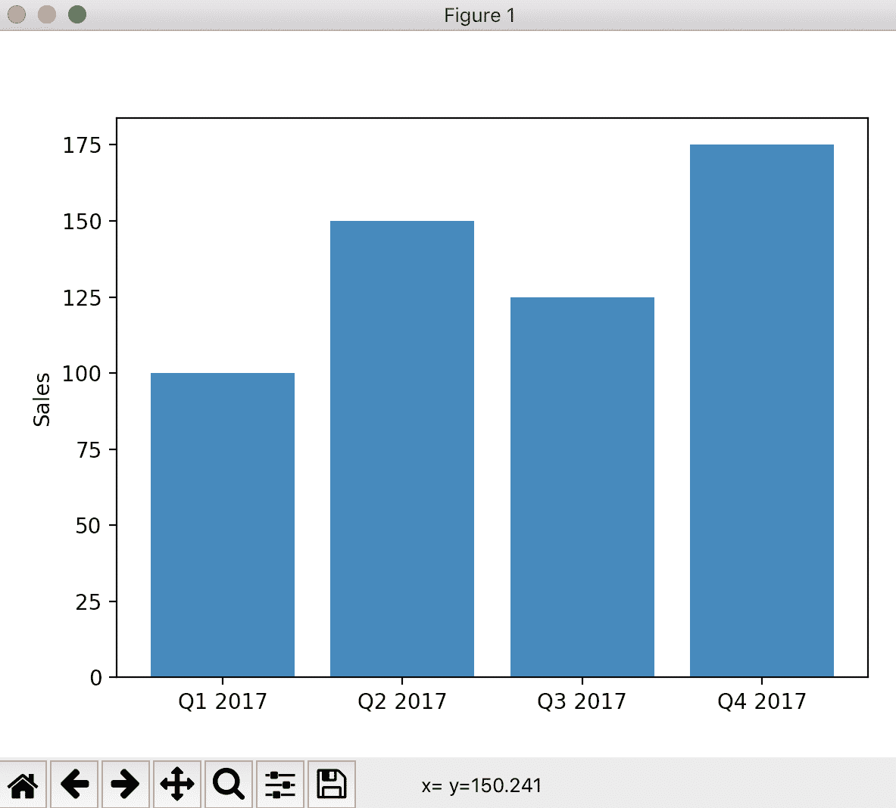
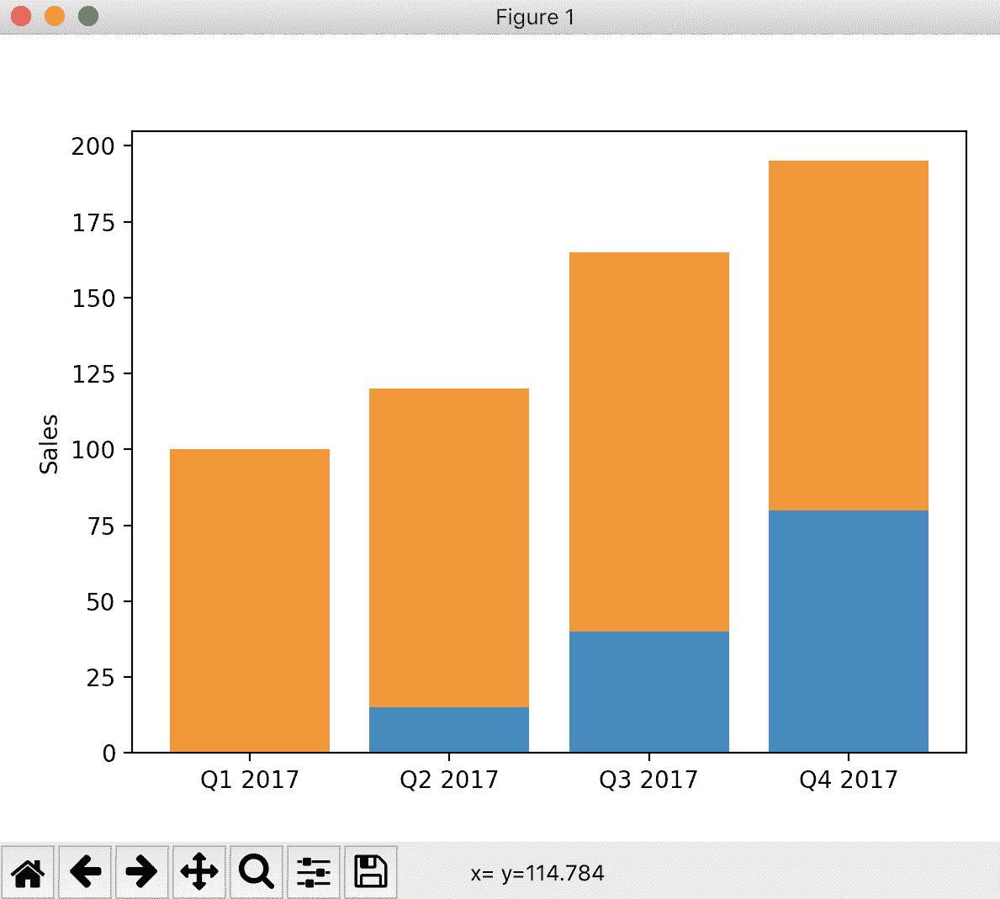
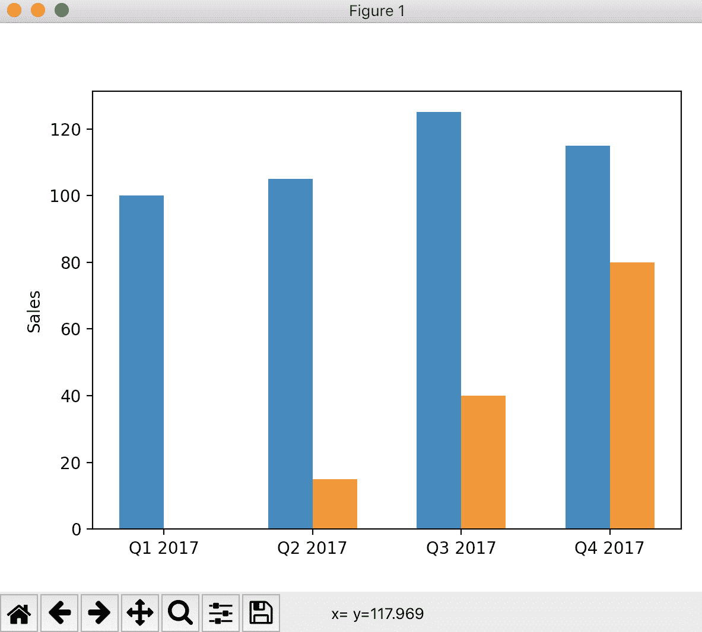
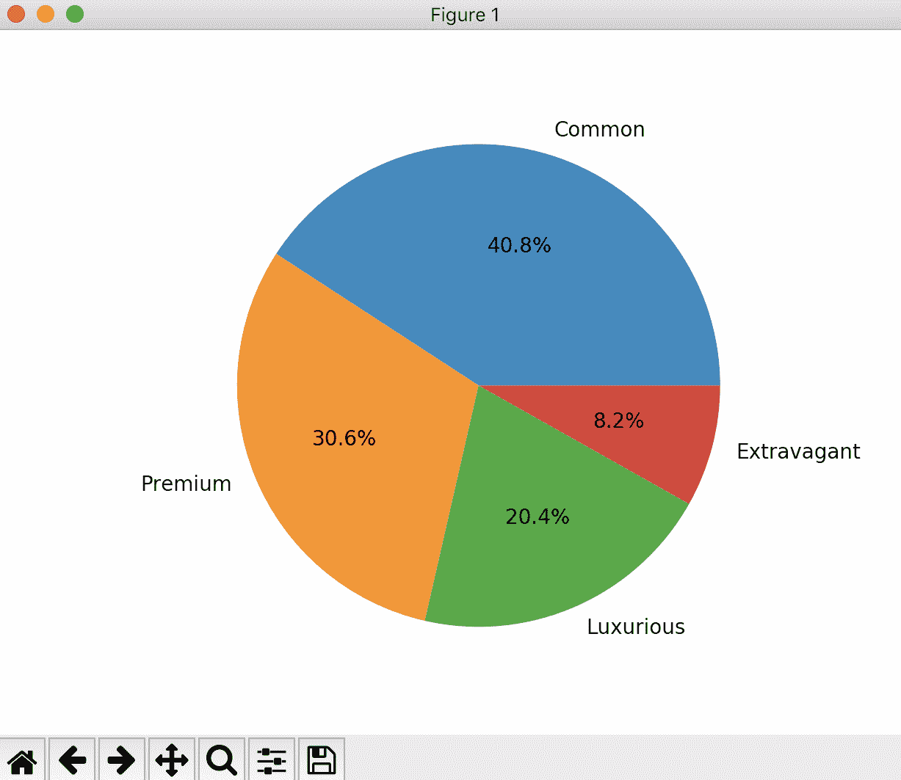
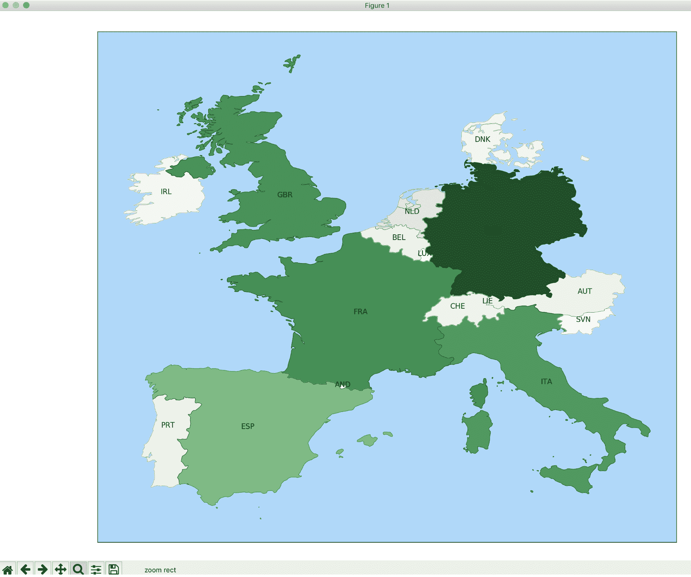
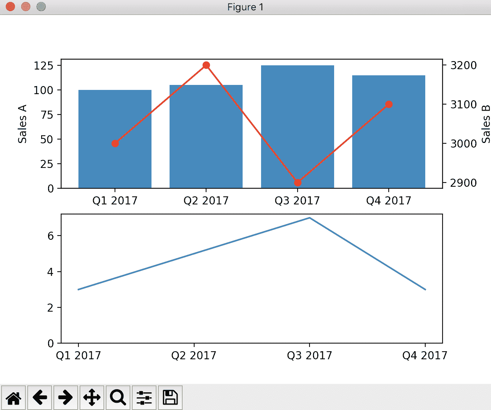

# 开发惊人的图形

本章将介绍以下配方：

*   绘制简单的销售图
*   绘制堆叠的钢筋
*   绘制饼图
*   显示多行
*   绘制散点图
*   可视化地图
*   添加图例和注释
*   组合图
*   保存图表

# 介绍

图形和图像是以易于理解的方式呈现复杂数据的奇妙方式。在本章中，我们将利用功能强大的`matplotlib`库学习如何创建各种图形。`matplotlib`是一个旨在以多种方式显示数据的库，它可以创建绝对惊人的绘图，帮助以最佳方式传输和显示信息。

我们将要讨论的图形将从简单的条形图到折线图或饼图，并在同一个图形中组合多个图，对它们进行注释，甚至绘制地理地图。

# 绘制简单的销售图

在本食谱中，我们将看到如何通过绘制与不同时期的销售额成比例的条形图来绘制销售图。

# 准备

我们可以使用以下命令在我们的虚拟环境中安装`matplotlib`：

```py
$ echo "matplotlib==2.2.2" >> requirements.txt
$ pip install -r requirements.txt
```

在某些操作系统中，这可能需要我们安装额外的软件包；例如，在 Ubuntu 中，可能需要我们运行`apt-get install python3-tk`。查看`matplolib`文档了解详细信息。

如果您正在使用 macOS，可能会出现如下错误-`RuntimeError: Python is not installed as a framework`。请参阅`matplolib`文档了解如何修复：[https://matplotlib.org/faq/osx_framework.html](https://matplotlib.org/faq/osx_framework.html) 。

# 怎么做。。。

1.  进口`matplotlib`：

```py
>>> import matplotlib.pyplot as plt
```

2.  准备要在图表上显示的数据：

```py
>>> DATA = (
...    ('Q1 2017', 100),
...    ('Q2 2017', 150),
...    ('Q3 2017', 125),
...    ('Q4 2017', 175),
... )
```

3.  将数据拆分为图形的可用格式。这是一个准备步骤：

```py
>>> POS = list(range(len(DATA)))
>>> VALUES = [value for label, value in DATA]
>>> LABELS = [label for label, value in DATA]
```

4.  使用以下数据创建条形图：

```py
>>> plt.bar(POS, VALUES)
>>> plt.xticks(POS, LABELS)
>>> plt.ylabel('Sales')
```

5.  显示图形：

```py
>>> plt.show()
```

6.  结果将在新窗口中显示如下：



# 它是如何工作的。。。

导入模块后，在步骤 2 中以方便的方式从*如何操作…*部分显示数据，这可能与最初存储数据的方式类似。

由于`matplotlib`的工作方式，它需要*X*组件以及*Y*组件。在本例中，我们的*X*组件只是一个整数序列，与数据点的数量相同。我们在`POS`中创建了它。在`VALUES`中，我们将销售额的数值存储为一个序列，并在`LABELS`中存储每个数据点的相关标签。所有准备工作都在步骤 3 中完成。

步骤 4 创建条形图，序列为*X*（`POS`）和*Y*（`VALUES`）。这些定义了我们的酒吧。为了指定它所指的周期，我们以相同的方式在*x*轴上用`.xticks`标记每个值。为了澄清含义，我们添加了一个带有`.ylabel`的标签。

为了显示结果图，步骤 5 调用`.show`，这将打开一个包含结果的新窗口。

Calling `.show` blocks the execution of the program. The program will resume when the window is closed.

# 还有更多。。。

您可能需要更改值的显示格式。在我们的例子中，数字可能代表数百万美元。为此，您可以在*y*轴上添加一个格式化程序，以便将其中表示的值应用于它们：

```py
>>> from matplotlib.ticker import FuncFormatter

>>> def value_format(value, position):
...    return '$ {}M'.format(int(value))

>>> axes = plt.gca()
>>> axes.yaxis.set_major_formatter(FuncFormatter(value_format))
```

`value_format`是一个基于数据的值和位置返回值的函数。在这里，它将返回值 100 作为`$ 100 M`。

Values will be retrieved as floats, requiring you to transform them into integers for display.

要应用格式化程序，我们需要使用`.gca`（获取当前轴）检索`axis`对象。然后，`.yaxis`获取格式化程序。

条的颜色也可以通过`color`参数确定。颜色可以多种格式指定，如[所述 https://matplotlib.org/api/colors_api.html](https://matplotlib.org/api/colors_api.html) ，但我最喜欢的是 XKCD 颜色调查，使用`xkcd:`前缀（冒号后无空格）：

```py
>>> plt.bar(POS, VALUES, color='xkcd:moss green')
```

完整调查可在此处找到：[https://xkcd.com/color/rgb/](https://xkcd.com/color/rgb/) 。

Most common colors, such as blue or red, are also available for quick tests. They tend to be a little bright to be used in good-looking reports, though.

将颜色与轴的格式组合在一起会产生以下结果：


条形图不需要以时间方式显示信息。正如我们所看到的，`matplotlib`要求我们指定每个条形图的*X*参数。这是一个生成各种图形的强大工具。

For example, the bars can be arranged to display a histogram, such as for displaying people of a certain height. The bars will start at a low height, increase to the average size, and then drop back. Don't limit yourself to just spreadsheet charts!

完整的`matplotlib`文档可在此处找到：[https://matplotlib.org/](https://matplotlib.org/) 。

# 另见

*   *拉叠筋*配方
*   *添加图例和注释*配方
*   *组合图*配方

# 绘制堆叠的钢筋

显示不同类别的一种强大方法是将它们显示为堆叠的条形图，以便显示每个类别和总数。我们将在这个食谱中看到如何做到这一点。

# 准备

我们需要在我们的虚拟环境中安装`matplotlib`：

```py
$ echo "matplotlib==2.2.2" >> requirements.txt
$ pip install -r requirements.txt
```

如果您正在使用 macOS，可能会出现如下错误：`RuntimeError: Python is not installed as a framework`。请参阅`matplolib`文档了解如何修复：[https://matplotlib.org/faq/osx_framework.html](https://matplotlib.org/faq/osx_framework.html) 。

# 怎么做。。。

1.  进口`matplotlib`：

```py
>>> import matplotlib.pyplot as plt
```

2.  准备数据。这代表了两种产品的销售，一种是已建立的，另一种是新的：

```py
>>> DATA = (
...     ('Q1 2017', 100, 0),
...     ('Q2 2017', 105, 15),
...     ('Q3 2017', 125, 40),
...     ('Q4 2017', 115, 80),
... )
```

3.  处理数据以准备预期格式：

```py
>>> POS = list(range(len(DATA)))
>>> VALUESA = [valueA for label, valueA, valueB in DATA]
>>> VALUESB = [valueB for label, valueA, valueB in DATA]
>>> LABELS = [label for label, value1, value2 in DATA]
```

4.  创建条形图。需要两个图：

```py
>>> plt.bar(POS, VALUESB)
>>> plt.bar(POS, VALUESA, bottom=VALUESB)
>>> plt.ylabel('Sales')
>>> plt.xticks(POS, LABELS)
```

5.  显示图形：

```py
>>> plt.show()
```

6.  结果将显示在新窗口中，如下所示：



# 它是如何工作的。。。

导入模块后，在步骤 2 中以方便的方式显示数据，这可能与最初存储数据的方式类似。

在步骤 3 中，按照三个顺序准备数据，`VALUESA`、`VALUEB`和`LABELS`。添加了一个`POS`序列，以正确定位杆。

步骤 4 创建条形图，序列为*X*（`POS`）和*Y*（`VALUESB`）。使用`bottom`参数，将第二个条形图序列`VALUESA`添加到前一个条形图序列的顶部。这把铁条叠起来。

Notice that we stack the second value, `VALUESB`, first. The second value represents a new product introduced in the market, while `VALUESA` is more stable. This better shows the growth of the new product.

每个周期在*X*轴上用`.xticks`标记。为了澄清含义，我们添加了一个带有`.ylabel`的标签。

为了显示结果图，步骤 5 调用`.show`，这将打开一个包含结果的新窗口。

Calling `.show` blocks the execution of the program. The program will resume when the window is closed.

# 还有更多。。。

表示堆叠钢筋的另一种方法是将它们作为百分比相加，这样总数不会改变，只会改变彼此之间的相对尺寸。

为此，`VALUESA`和`VALUEB`需要以这种方式相对于百分比进行计算：

```py
>>> VALUESA = [100 * valueA / (valueA + valueB) for label, valueA, valueB in DATA]
>>> VALUESB = [100 * valueB / (valueA + valueB) for label, valueA, valueB in DATA]
```

这使得每个值都等于总数的百分比，并且总数总是加起来为`100`。这将生成以下图形：


钢筋不一定需要堆放。有时，将一个条与另一个条进行比较可能会很有趣

为此，我们需要移动第二个条形序列的位置。我们还需要设置更薄的杆，以留出空间：

```py
>>> WIDTH = 0.3
>>> plt.bar([p - WIDTH / 2 for p in POS], VALUESA, width=WIDTH)
>>> plt.bar([p + WIDTH / 2 for p in POS], VALUESB, width=WIDTH)
```

请注意，条形的宽度是如何设置为空间的三分之一的，因为我们的参考空间是条形之间的`1`。第一个条向左移动，第二个条向右移动以使其居中。已删除`bottom`参数以不堆叠条：



完整的`matplotlib`文档可在此处找到：[https://matplotlib.org/](https://matplotlib.org/) 。

# 另见

*   *绘制简单销售图*配方
*   *添加图例和注释*配方
*   *组合图*配方

# 绘制饼图

饼图！这是一种常用的表示百分比的方式。我们将在本食谱中看到如何绘制饼图，用不同的切片表示比例。

# 准备

我们需要使用以下命令在我们的虚拟环境中安装`matplotlib`：

```py
$ echo "matplotlib==2.2.2" >> requirements.txt
$ pip install -r requirements.txt
```

如果您正在使用 macOS，可能会出现如下错误-`RuntimeError: Python is not installed as a framework`。请参阅`matplotlib`文档了解如何修复：[https://matplotlib.org/faq/osx_framework.html](https://matplotlib.org/faq/osx_framework.html) 。

# 怎么做。。。

1.  进口`matplotlib`：

```py
>>> import matplotlib.pyplot as plt
```

2.  准备数据。这代表了几种产品线：

```py
>>> DATA = (
...     ('Common', 100),
...     ('Premium', 75),
...     ('Luxurious', 50),
...     ('Extravagant', 20),
... )
```

3.  处理数据以准备预期格式：

```py
>>> VALUES = [value for label, value in DATA]
>>> LABELS = [label for label, value in DATA]
```

4.  创建饼图：

```py
>>> plt.pie(VALUES, labels=LABELS, autopct='%1.1f%%')
>>> plt.gca().axis('equal')
```

5.  显示图形：

```py
>>> plt.show()
```

6.  结果将显示在新窗口中，如下所示：



# 它是如何工作的。。。

模块在*如何做…*部分的步骤 1 中导入，要呈现的数据在步骤 2 中导入。在步骤 3 中，数据被分为两个部分，一个是`VALUES`列表，另一个是`LABELS`列表。

图表的创建在步骤 4 中进行。通过添加`VALUES`和`LABELS`创建饼图。`autopct`参数设置值的格式，以便将其显示为小数点后一位的百分比

对`axis`的调用确保饼图是圆形的，而不是有一点透视效果，看起来像椭圆形。

为了显示结果图，步骤 5 调用`.show`，这将打开一个包含结果的新窗口。

Calling `.show` blocks the execution of the program. The program will resume when the window is closed.

# 还有更多。。。

饼图在业务图中有点过度使用。大多数情况下，带有百分比或值的条形图将是更好的数据可视化方式，尤其是在显示两个或三个以上选项的情况下。尽量限制在报告和数据演示文稿中使用饼图。

通过`startangle`参数可以旋转楔块的起点，设置楔块的方向由`counterclock`定义（默认为`True`：

```py
>>> plt.pie(VALUES, labels=LABELS, startangle=90, counterclock=False)
```

标签内的格式可以通过函数设置。由于饼图中的值定义为百分比，因此查找原始值可能有点棘手。下面的代码段创建了一个字典索引，其百分比为整数，因此我们可以检索引用的值。请注意，这假设没有重复的百分比。如果是这种情况，标签可能有点不正确。在这种情况下，我们可能需要最多使用第一个小数位以获得更好的精度：

```py
>>> from matplotlib.ticker import FuncFormatter

>>> total = sum(value for label, value in DATA)
>>> BY_VALUE = {int(100 * value / total): value for label, value in DATA}

>>> def value_format(percent, **kwargs):
...     value = BY_VALUE[int(percent)]
...     return '{}'.format(value)
```

也可以使用“爆炸”参数来分离一个或多个楔体。这将指定楔体与中心的分离程度：

```py
>>> explode = (0, 0, 0.1, 0)
>>> plt.pie(VALUES, labels=LABELS, explode=explode, autopct=value_format,
            startangle=90, counterclock=False)
```

结合所有这些选项，我们得到以下结果：


完整的`matplotlib`文档可在此处找到：[https://matplotlib.org/](https://matplotlib.org/) 。

# 另见

*   *绘制简单销售图*配方
*   *拉叠筋*配方

# 显示多行

此配方将显示如何在图形中显示多行。

# 准备

我们需要在我们的虚拟环境中安装`matplotlib`：

```py
$ echo "matplotlib==2.2.2" >> requirements.txt
$ pip install -r requirements.txt
```

如果您正在使用 macOS，可能会出现如下错误-`RuntimeError: Python is not installed as a framework`。请参阅`matplolib`文档了解如何修复：[https://matplotlib.org/faq/osx_framework.html](https://matplotlib.org/faq/osx_framework.html) 。

# 怎么做。。。

1.  进口`matplotlib`：

```py
>>> import matplotlib.pyplot as plt
```

2.  准备数据。这代表了两种产品的销售额：

```py
>>> DATA = (
...     ('Q1 2017', 100, 5),
...     ('Q2 2017', 105, 15),
...     ('Q3 2017', 125, 40),
...     ('Q4 2017', 115, 80),
... )
```

3.  处理数据以准备预期格式：

```py
>>> POS = list(range(len(DATA)))
>>> VALUESA = [valueA for label, valueA, valueB in DATA]
>>> VALUESB = [valueB for label, valueA, valueB in DATA]
>>> LABELS = [label for label, value1, value2 in DATA]
```

4.  创建线图。需要两行：

```py
>>> plt.plot(POS, VALUESA, 'o-')
>>> plt.plot(POS, VALUESB, 'o-')
>>> plt.ylabel('Sales')
>>> plt.xticks(POS, LABELS)
```

5.  显示图形：

```py
>>> plt.show()
```

6.  结果将显示在新窗口中：


# 它是如何工作的。。。

在*如何做…*部分，步骤 1 导入模块，步骤 2 以格式化方式显示要绘制的数据。

在步骤 3 中，按照三个顺序准备数据，`VALUESA`、`VALUEB`和`LABELS`。添加了一个`POS`序列以正确定位每个点。

步骤 4 创建图形，序列为*X*（`POS`）和*Y*（`VALUESA`），然后是`POS`和`VALUESB`。将`'o-'`的值相加，在每个数据点上画一个圆，并在它们之间画一条完整的线。

By default, the plot will display a solid line, with no marker on each point. If only the marker is used (that is, `'o'`), there'll be no line.

每个周期在*X*轴上用`.xticks`标记。为了澄清含义，我们添加了一个带有`.ylabel`的标签。

为了显示结果图，步骤 5 调用`.show`，这将打开一个包含结果的新窗口。

Calling `.show` blocks the execution of the program. The program will resume when the window is closed.

# 还有更多。。。

带有线条的图形看似简单，能够创建许多有趣的表示。当显示数学图形时，它可能是最方便的。例如，我们可以在几行代码中显示一个显示摩尔定律的图形。

Moore's Law is an observation by Gordon Moore that the number of components in an integrated circuit doubles every two years. It was first described in 1965 and then corrected in 1975\. It seems to be quite close to the historic rate of technological advancement over the last 40 years.

我们首先创建一条线来描述理论线，数据点从 1970 年到 2013 年。从 1000 个晶体管开始，到 2013 年，我们每两年将其翻一番：

```py
>>> POS = [year for year in range(1970, 2013)]
>>> MOORES = [1000 * (2 ** (i * 0.5)) for i in range(len(POS))]
>>> plt.plot(POS, MOORES)
```

在一些文档之后，我们从这里摘录了一些商业 CPU 的示例、它们的发布年份以及它们的集成组件数量：[http://www.wagnercg.com/Portals/0/FunStuff/AHistoryofMicroprocessorTransistorCount.pdf](http://www.wagnercg.com/Portals/0/FunStuff/AHistoryofMicroprocessorTransistorCount.pdf) 。由于数字很大，我们将使用`1_000_000`表示一百万，在 Python 3 中提供：

```py
>>> DATA = (
...    ('Intel 4004', 2_300, 1971),
...    ('Motorola 68000', 68_000, 1979),
...    ('Pentium', 3_100_000, 1993),
...    ('Core i7', 731_000_000, 2008),
... )
```

用标记画一条线，以便在适当的位置显示这些点。`'v'`标记将显示一个三角形：

```py
>>> data_x = [x for label, y, x in DATA]
>>> data_y = [y for label, y, x in DATA]
>>> plt.plot(data_x, data_y, 'v')
```

对于每个数据点，在适当位置附加一个带有 CPU 名称的标签：

```py
>>> for label, y, x in DATA:
>>>    plt.text(x, y, label)
```

最后，在线性图中显示的增长没有意义，所以我们将比例改为对数，这使得指数增长看起来像一条直线。但是为了保持尺寸感，添加一个网格。调用`.show`显示图形：

```py
>>> plt.gca().grid()
>>> plt.yscale('log')
```

生成的图形将显示：


完整的`matplotlib`文档可在此处找到：[https://matplotlib.org/](https://matplotlib.org/) 。特别是，在此处检查可用的线（实线、虚线、虚线等）和标记（点、圆、三角形、星形等）格式：[https://matplotlib.org/api/_as_gen/matplotlib.pyplot.plot.html](https://matplotlib.org/api/_as_gen/matplotlib.pyplot.plot.html) 。

# 另见

*   *添加图例和注释*配方
*   *组合图*配方

# 绘制散点图

散点图是信息仅显示为带有*X*和*Y*值的点的散点图。它们在展示样本和查看两个变量之间是否存在任何关系时非常有用。在这个配方中，我们将显示一个图表，将花费在网站上的时间与花费的金钱进行对比，以查看我们是否可以看到模式。

# 准备

我们需要在我们的虚拟环境中安装`matplotlib`：

```py
$ echo "matplotlib==2.2.2" >> requirements.txt
$ pip install -r requirements.txt
```

如果您正在使用 macOS，可能会出现如下错误-`RuntimeError: Python is not installed as a framework`。请参阅`matplolib`文档了解如何修复：[https://matplotlib.org/faq/osx_framework.html](https://matplotlib.org/faq/osx_framework.html) 。

作为数据点，我们将使用`scatter.csv`文件读取数据。此文件可在 GitHub 上的[上找到 https://github.com/PacktPublishing/Python-Automation-Cookbook/blob/master/Chapter07/scatter.csv](https://github.com/PacktPublishing/Python-Automation-Cookbook/blob/master/Chapter07/scatter.csv) 。

# 怎么做。。。

1.  导入`matplotlib`和`csv`。`FuncFormatter`也被导入，以便在以后格式化轴：

```py
>>> import csv
>>> import matplotlib.pyplot as plt
>>> from matplotlib.ticker import FuncFormatter
```

2.  准备数据，使用`csv`模块读取文件：

```py
>>> with open('scatter.csv') as fp:
...    reader = csv.reader(fp)
...    data = list(reader)
```

3.  准备用于打印的数据，然后进行打印：

```py
>>> data_x = [float(x) for x, y in data]
>>> data_y = [float(y) for x, y in data]
>>> plt.scatter(data_x, data_y)
```

4.  通过格式化轴来改善上下文：

```py
>>> def format_minutes(value, pos):
...     return '{}m'.format(int(value))
>>> def format_dollars(value, pos):
...     return '${}'.format(value)
>>> plt.gca().xaxis.set_major_formatter(FuncFormatter(format_minutes))
>>> plt.xlabel('Time in website')
>>> plt.gca().yaxis.set_major_formatter(FuncFormatter(format_dollars))
>>> plt.ylabel('Spending')
```

5.  显示图表：

```py
>>> plt.show()
```

6.  结果将显示在新窗口中：


# 它是如何工作的。。。

*如何实现…*部分的步骤 1 和 2 导入我们稍后将使用的模块，并从 CSV 文件读取数据。数据被转换成一个列表，以允许我们对其进行多次迭代，这在步骤 3 中是必要的。

第三步准备两个数组中的数据，然后使用`.scatter`进行绘图。与`matplotlib`的其他方法一样，`.scatter`的参数需要*X*和*Y*值的数组。它们都需要有相同的尺寸。数据从文件格式转换成`float`，以保证数字格式。

步骤 4 优化了数据在每个轴上的显示方式。相同的操作会显示两次，即创建一个函数，定义如何显示该轴上的值（以美元或分钟为单位）。该函数接受要显示的值和位置作为输入。通常，该位置将被忽略。轴格式化程序将被`.set_major_formatter`覆盖。请注意，两个轴都返回了`.gca`（获取当前轴）。

在带有`.xlabel`和`.ylabel`的轴上添加标签。

最后，步骤 5 在新窗口中显示图形。分析结果，我们可以说，似乎有两种用户，一种是花费少于 10 分钟的用户，从不超过 10 美元的用户，另一种是花费更多时间的用户，花费最多 100 美元的用户。

Note that the data presented is synthetic, and it has been generated with the result in mind. Real-life data will probably look more spread out.

# 还有更多。。。

散点图不仅可以显示二维点，还可以添加第三维（区域）甚至第四维（颜色）。

要添加这些元素，请使用参数`s`表示*尺寸*，使用参数`c`表示*颜色*。

Size is defined as the diameter of a ball in points squared. So, for a ball of diameter 10, 100 will be used. Color can use any of the usual definitions of color in `matplotlib`,  such as hex color, RGB, and so on. See the documentation for more details: [https://matplotlib.org/users/colors.html](https://matplotlib.org/users/colors.html). For example, we can generate a random graph using the four dimensions in the following way:

```py
>>> import matplotlib.pyplot as plt
>>> import random
>>> NUM_POINTS = 100
>>> COLOR_SCALE = ['#FF0000', '#FFFF00', '#FFFF00', '#7FFF00', '#00FF00']
>>> data_x = [random.random() for _ in range(NUM_POINTS)]
>>> data_y = [random.random() for _ in range(NUM_POINTS)]
>>> size = [(50 * random.random()) ** 2 for _ in range(NUM_POINTS)]
>>> color = [random.choice(COLOR_SCALE) for _ in range(NUM_POINTS)]
>>> plt.scatter(data_x, data_y, s=size, c=color, alpha=0.5)
>>> plt.show()
```

`COLOR_SCALE`由绿色变为红色，每个点的直径在`0`和`50`点之间。结果应该是这样的：


请注意，它是随机的，因此每次都会生成不同的图形。

`alpha`值使每个点都是半透明的，让我们可以看到它们重叠的位置。该值越高，点的透明度越低。此参数将影响显示的颜色，因为它将使点与背景混合。

Even though it's possible to display two independent values in the size and color, they can also be related to any of the other values. For example, making the color dependent on the size will make all the points of the same size the same color, which may help distinguish the data. Remember that the ultimate goal of a graph is to make data easy to understand. Try different approaches to improve this.

完整的`matplotlib`文档可在此处找到：[https://matplotlib.org/](https://matplotlib.org/)

# 另见

*   *显示多行*配方
*   *添加图例和注释*配方

# 可视化地图

要显示不同地区的信息，最好的方法是显示显示信息的地图，同时为数据提供地区位置感。

在此配方中，我们将使用`fiona`模块导入 GIS 信息，以及`matplotlib`显示信息。我们将展示一张西欧地图，并用颜色等级显示每个国家的人口。颜色越深，人口越多。

# 准备

我们需要在我们的虚拟环境中安装`matplotlib`和`fiona`：

```py
$ echo "matplotlib==2.2.2" >> requirements.txt
$ echo "Fiona==1.7.13" >> requirements.txt
$ pip install -r requirements.txt
```

如果您正在使用 macOS，可能会出现如下错误-`RuntimeError: Python is not installed as a framework`。请参阅`matplolib`文档了解如何修复：[https://matplotlib.org/faq/osx_framework.html](https://matplotlib.org/faq/osx_framework.html) 。

需要下载地图数据。幸运的是，有很多免费的地理信息数据。在谷歌上搜索应该能迅速返回你需要的几乎所有信息，包括关于地区、县、河流或任何其他类型数据的详细信息。

GIS information is available in different formats from a lot of public organizations. `fiona` is capable of understanding most common formats and treating them in equivalent ways, but there are small differences. Read the `fiona` documentation for more details.

我们将在本配方中使用的数据涵盖所有欧洲国家，可在 GitHub 的以下 URL 上获得：[https://github.com/leakyMirror/map-of-europe/blob/master/GeoJSON/europe.geojson](https://github.com/leakyMirror/map-of-europe/blob/master/GeoJSON/europe.geojson) 。注意，它在 GeoJSON 中，这是一个易于使用的标准。

# 怎么做。。。

1.  导入稍后要使用的模块：

```py
>>> import matplotlib.pyplot as plt
>>> import matplotlib.cm as cm
>>> import fiona
```

2.  加载要显示的国家/地区的人口。人口一直是：

```py
>>> COUNTRIES_POPULATION = {
...     'Spain': 47.2,
...     'Portugal': 10.6,
...     'United Kingdom': 63.8,
...     'Ireland': 4.7,
...     'France': 64.9,
...     'Italy': 61.1,
...     'Germany': 82.6,
...     'Netherlands': 16.8,
...     'Belgium': 11.1,
...     'Denmark': 5.6,
...     'Slovenia': 2,
...     'Austria': 8.5,
...     'Luxembourg': 0.5,
...     'Andorra': 0.077,
...     'Switzerland': 8.2,
...     'Liechtenstein': 0.038,
... }
>>> MAX_POPULATION = max(COUNTRIES_POPULATION.values())
>>> MIN_POPULATION = min(COUNTRIES_POPULATION.values())
```

3.  准备`colormap`，它将确定每个国家将以绿色显示的颜色。计算每个国家对应的颜色：

```py
>>> colormap = cm.get_cmap('Greens')
>>> COUNTRY_COLOUR = {
...     country_name: colormap(
...         (population - MIN_POPULATION) / (MAX_POPULATION - MIN_POPULATION)
...     )
...     for country_name, population in COUNTRIES_POPULATION.items()
... }
```

4.  打开文件并读取数据，按我们在步骤 1 中定义的人口国家进行过滤：

```py
>>> with fiona.open('europe.geojson') as fd:
>>>     full_data = [data for data in full_data
...                  if data['properties']['NAME'] in COUNTRIES_POPULATION]
```

5.  用适当的颜色绘制每个国家：

```py
>>> for data in full_data:
...     country_name = data['properties']['NAME']
...     color = COUNTRY_COLOUR[country_name]
...     geo_type = data['geometry']['type']
...     if geo_type == 'Polygon':
...         data_x = [x for x, y in data['geometry']['coordinates'][0]]
...         data_y = [y for x, y in data['geometry']['coordinates'][0]]
...         plt.fill(data_x, data_y, c=color)
...     elif geo_type == 'MultiPolygon':
...         for coordinates in data['geometry']['coordinates']:
...             data_x = [x for x, y in coordinates[0]]
...             data_y = [y for x, y in coordinates[0]]
...             plt.fill(data_x, data_y, c=color)
```

6.  显示结果：

```py
>>> plt.show()
```

7.  结果将显示在新窗口中：


# 它是如何工作的。。。

从*如何操作…*部分导入步骤 1 中的模块后，将在步骤 2 中定义要显示的数据。请注意，名称的格式必须与 GEO 文件中的格式相同。计算最小和最大总体，以便稍后适当平衡范围。

The population has been rounded to a significant number, and it's defined in millions. Only a few countries have been defined for the purposes of this recipe, but there are more available in the GIS file and the map can be extended toward the East.

步骤 3 中描述了定义绿色色调（`Greens`中的颜色范围的`colormap`。这是`matplotlib`中的一个标准`colormap`，但可以使用文档中描述的其他标准（[https://matplotlib.org/examples/color/colormaps_reference.html](https://matplotlib.org/examples/color/colormaps_reference.html) ），例如橘子、红色或等离子，用于更冷到热的方法

`COUNTRY_COLOUR`字典存储`colormap`为每个国家定义的颜色。总体减少到一个数字，从 0.0（最小总体）到 1.0（最大），并传递到`colormap`以检索对应比例的颜色。

然后在步骤 4 中检索 GIS 信息。使用`fiona`读取`europe.geojson`文件并复制数据，以便我们在接下来的步骤中使用它。它也会过滤，只处理我们定义的人口国家，因此不会绘制额外的国家。

步骤 5 中的循环逐国进行，然后我们使用`.fill`绘制它，它绘制一个多边形。每个不同国家的几何体要么是单个多边形（`Polygon`），要么是多个多边形（`MultiPolygon`）。在每种情况下，都会以相同的颜色绘制适当的多边形。这意味着`MultiPolygon`被绘制了多次。

GIS information is stored as points for coordinates describing the latitude and longitude of the point. Areas, such as countries, have a list of coordinates that describe an area within them. Some maps are more precise and have more points defining areas. Multiple polygons may be required to define a country, as some parts may be separated from each other, islands being the most obvious cases, but there are also enclaves.

最后，通过调用`.show`显示数据。

# 还有更多。。。

利用 GIS 文件中包含的信息，我们可以向地图添加额外信息。`properties`对象包含有关国家名称的信息，还包括其 ISO 名称、FID 代码和中心位置`LON`和`LAT`。我们可以使用此信息通过`.text`显示国家名称：

```py
    long, lat = data['properties']['LON'], data['properties']['LAT']
    iso3 = data['properties']['ISO3']
    plt.text(long, lat, iso3, horizontalalignment='center')
```

在*如何做…*部分的步骤 6 中，此代码将存在于循环中。

If you analyze the file, you'll see that the `properties` object contains information about the population, stored as POP2005, so you can draw the population info directly from the map. That is left as an exercise. Different map files will contain different information, so be sure to play around to unleash all the possibilities.

此外，您可能会注意到贴图在某些情况下可能会扭曲。`matplotlib`将尝试将其放在一个方形框中，如果地图不是大致方形的，这将是显而易见的。例如，尝试只显示西班牙、葡萄牙、爱尔兰和英国。我们可以强制图形显示 1 个纬度点，与 1 个经度点的空间相同，如果我们不在两极附近绘制一些东西，这是一个很好的方法。这是通过在轴中调用`.set_aspect`来实现的。当前轴可通过`.gca`（**获取当前轴**获取）

```py
>>> axes = plt.gca()
>>> axes.set_aspect('equal', adjustable='box')
```

此外，为了改善地图的外观，我们可以设置一种背景颜色，以帮助区分背景和前景，并删除轴上的标签，因为打印纬度和经度可能会分散注意力。移除轴上的标签是通过使用`.xticks`和`.yticks`设置空标签来实现的。背景色由轴的前景色指定：

```py
>>> plt.xticks([])
>>> plt.yticks([])
>>> axes = plt.gca()
>>> axes.set_facecolor('xkcd:light blue')
```

最后，为了更好地区分不同的区域，可以在每个区域周围添加一条线。这可以通过使用与`.fill`相同的数据绘制一条细线来完成，紧随其后。请注意，此代码在步骤 2 中重复两次：

```py
 plt.fill(data_x, data_y, c=color)
 plt.plot(data_x, data_y, c='black', linewidth=0.2)
```

将所有这些元素应用于地图，现在看起来如下所示：



由此产生的代码可在 GitHub 上找到：[https://github.com/PacktPublishing/Python-Automation-Cookbook/blob/master/Chapter07/visualising_maps.py](https://github.com/PacktPublishing/Python-Automation-Cookbook/blob/master/Chapter07/visualising_maps.py) 。

As we've seen, maps are drawn as general polygons. Don't be afraid to include other geometrical forms. You can define your own polygons and print them with `.fill` or some extra labels. For example, far away regions may need to be transported to avoid having too big a map. Or, rectangles can be used to print extra information on top of parts of the map.

完整的`fiona`文档可在此处找到：[http://toblerity.org/fiona/](http://toblerity.org/fiona/) 。完整的`matplotlib`文档可在此处找到：[https://matplotlib.org/](https://matplotlib.org/)

# 另见

*   *添加图例和注释*配方
*   *组合图*配方

# 添加图例和注释

绘制信息密集的图形时，可能需要图例来确定特定颜色或帮助更好地理解显示的数据。在`matplotlib`中，传说可以非常丰富，并且有多种表现方式。注释以吸引对特定点的注意，也是为受众聚焦信息的好方法。

在这个配方中，我们将创建一个包含三个不同组件的图形，并显示一个带有信息的图例，以便更好地理解它，同时在图形上注释最有趣的点。

# 准备

我们需要在我们的虚拟环境中安装`matplotlib`：

```py
$ echo "matplotlib==2.2.2" >> requirements.txt
$ pip install -r requirements.txt
```

如果您正在使用 macOS，可能会出现如下错误-`RuntimeError: Python is not installed as a framework`。请参阅`matplolib`文档了解如何修复：[https://matplotlib.org/faq/osx_framework.html](https://matplotlib.org/faq/osx_framework.html) 。

# 怎么做。。。

1.  进口`matplotlib`：

```py
>>> import matplotlib.pyplot as plt
```

2.  准备要在图形上显示的数据以及应该显示的图例。每一行由时间标签、`ProductA`销售、`ProductB`销售、`ProductC`销售组成：

```py
>>> LEGEND = ('ProductA', 'ProductB', 'ProductC')
>>> DATA = (
...     ('Q1 2017', 100, 30, 3),
...     ('Q2 2017', 105, 32, 15),
...     ('Q3 2017', 125, 29, 40),
...     ('Q4 2017', 115, 31, 80),
... )
```

3.  将数据拆分为图形的可用格式。这是一个准备步骤：

```py
>>> POS = list(range(len(DATA)))
>>> VALUESA = [valueA for label, valueA, valueB, valueC in DATA]
>>> VALUESB = [valueB for label, valueA, valueB, valueC in DATA]
>>> VALUESC = [valueC for label, valueA, valueB, valueC in DATA]
>>> LABELS = [label for label, valueA, valueB, valueC in DATA]
```

4.  使用以下数据创建条形图：

```py
>>> WIDTH = 0.2
>>> plt.bar([p - WIDTH for p in POS], VALUESA, width=WIDTH)
>>> plt.bar([p for p in POS], VALUESB, width=WIDTH)
>>> plt.bar([p + WIDTH for p in POS], VALUESC, width=WIDTH)
>>> plt.ylabel('Sales')
>>> plt.xticks(POS, LABELS)
```

5.  添加注释，显示图表中的最大增长：

```py
>>> plt.annotate('400% growth', xy=(1.2, 18), xytext=(1.3, 40),
                 horizontalalignment='center',
                 arrowprops=dict(facecolor='black', shrink=0.05))
```

6.  添加`legend`：

```py
>>> plt.legend(LEGEND)
```

7.  显示图形：

```py
>>> plt.show()
```

8.  结果将显示在新窗口中：


# 它是如何工作的。。。

*如何操作…*部分的步骤 1 和 2 准备导入和将在栏中显示的数据，格式类似于结构良好的输入数据。在步骤 3 中，数据被分割成不同的数组，以准备在`matplotlib`中的输入。基本上，每个数据序列都存储在不同的数组中。

步骤 4 绘制数据。每个数据序列都会调用`.bar`，指定其位置和值。标签的作用与`.xticks`相同。要分离标签周围的每个条，第一条向左移动，第三条向右移动。

在第二季度的`ProductC`栏上方添加了注释。注意注释包括`xy`中的点和`xytext`中的文本位置。

在步骤 6 中，添加图例。请注意，标签需要按照与输入数据相同的顺序添加。图例自动位于不包含任何数据的区域中。`arroprops`详细说明了指向数据的箭头。

最后，在步骤 7 中调用`.show`绘制图形。

Calling `.show` blocks the execution of the program. The program will resume when the window is closed.

# 还有更多。。。

在大多数情况下，只需调用`.legend`即可自动显示图例。如果需要自定义标签的显示顺序，可以将每个标签引用到特定的元素。例如，这种方式（注意它称`ProductA`为`valueC`系列）

```py
>>> valueA = plt.bar([p - WIDTH for p in POS], VALUESA, width=WIDTH)
>>> valueB = plt.bar([p for p in POS], VALUESB, width=WIDTH)
>>> valueC = plt.bar([p + WIDTH for p in POS], VALUESC, width=WIDTH)
>>> plt.legend((valueC, valueB, valueA), LEGEND)
```

图例的位置也可以通过`loc`参数手动更改。默认情况下，它是`best`，它将在数据重叠最少的区域（理想情况下没有）绘制图例。但是可以使用诸如`right`、`upper left`等值，或者使用特定的`(X, Y)`元组。

另一个选项是使用`bbox_to_anchor`选项在图形外部绘制图例。在这种情况下，图例附在边界框的（*X*、*Y*）上，其中`0`为图形的左下角，`1`为右上角。这可能会导致图例被外部边框剪裁，因此您可能需要调整图形以`.subplots_adjust`开始和结束的位置：

```py
>>> plt.legend(LEGEND, title='Products', bbox_to_anchor=(1, 0.8))
>>> plt.subplots_adjust(right=0.80)
```

调整`bbox_to_anchor`参数和`.subplots_adjust`将需要一些尝试和错误，直到产生预期的结果。

`.subplots_adjust` references the positions as the position of the axis where it will be displayed. This means that `right=0.80` will leave 20% of the screen on the right of the plot, while the default for left is 0.125, meaning it leaves 12.5% of the space on the left of the plot. See the documentation for further details: [https://matplotlib.org/api/_as_gen/matplotlib.pyplot.subplots_adjust.html](https://matplotlib.org/api/_as_gen/matplotlib.pyplot.subplots_adjust.html).

注释可以采用不同的样式，并且可以使用不同的连接方式等选项进行调整。例如，此代码将创建一个带有与曲线连接的`fancy`样式的箭头。结果显示在此处：

```py
plt.annotate('400% growth', xy=(1.2, 18), xytext=(1.3, 40),
             horizontalalignment='center',
             arrowprops={'facecolor': 'black',
                         'arrowstyle': "fancy",
                         'connectionstyle': "angle3",
                         })
```

在我们的食谱中，我们没有精确地标注条形图的末端（点（`1.2`、`15`），而是略高于它，以留出一点喘息空间。

Adjusting the exact point to annotate and where to locate the text will require a bit of testing. The text was also positioned by looking for the best place to not overlap the text with the bars. The font size and color can be changed, using the `fontsize` and `color` parameters, in both the `.legend` and `.annotate` calls.

应用所有这些元素，图形可能与此类似。可以通过调用 GitHub 中可用的`legend_and_annotation.py`脚本来复制此图：[https://github.com/PacktPublishing/Python-Automation-Cookbook/blob/master/Chapter07/adding_legend_and_annotations.py](https://github.com/PacktPublishing/Python-Automation-Cookbook/blob/master/Chapter07/adding_legend_and_annotations.py) ：


完整的`matplotlib`文档可在此处找到：[https://matplotlib.org/](https://matplotlib.org/) 。特别是图例指南如下：[https://matplotlib.org/users/legend_guide.html#plotting-指南图例](https://matplotlib.org/users/legend_guide.html#plotting-guide-legend)和注释如下：[https://matplotlib.org/users/annotations.html](https://matplotlib.org/users/annotations.html) 。

# 另见

*   *拉叠筋*配方
*   *组合图*配方

# 组合图

同一个图中可以组合多个图。在这个配方中，我们将看到如何在同一个绘图中，在两个不同的轴上显示数据，以及如何在同一个图形中添加更多的绘图。

# 准备

我们需要在我们的虚拟环境中安装`matplotlib`：

```py
$ echo "matplotlib==2.2.2" >> requirements.txt
$ pip install -r requirements.txt
```

如果您正在使用 macOS，可能会出现如下错误-`RuntimeError: Python is not installed as a framework`。请参阅`matplolib`文档了解如何修复：[https://matplotlib.org/faq/osx_framework.html](https://matplotlib.org/faq/osx_framework.html) 。

# 怎么做。。。

1.  进口`matplotlib`：

```py
>>> import matplotlib.pyplot as plt
```

2.  准备要在图形上显示的数据和应显示的图例。每一行由时间标签、`ProductA`销售、`ProductB`销售组成。注意`ProductB`的值比`A`高得多：

```py
>>> DATA = (
...  ('Q1 2017', 100, 3000, 3),
...  ('Q2 2017', 105, 3200, 5),
...  ('Q3 2017', 125, 2900, 7),
...  ('Q4 2017', 115, 3100, 3),
... )
```

3.  准备独立阵列中的数据：

```py
>>> POS = list(range(len(DATA)))
>>> VALUESA = [valueA for label, valueA, valueB, valueC in DATA]
>>> VALUESB = [valueB for label, valueA, valueB, valueC in DATA]
>>> VALUESC = [valueC for label, valueA, valueB, valueC in DATA]
>>> LABELS = [label for label, valueA, valueB, valueC in DATA]
```

请注意，这将展开并为每个值创建一个列表。

The values can also be expanded with this—`LABELS`, `VALUESA`, `VALUESB`, `VALUESC = ZIP(*DATA)`

4.  创建第一个子批次：

```py
>>> plt.subplot(2, 1, 1)
```

5.  创建包含`VALUESA`信息的条形图：

```py
>>> valueA = plt.bar(POS, VALUESA)
>>> plt.ylabel('Sales A')
```

6.  创建一个不同的*Y*轴，并将`VALUESB`信息添加为线图：

```py
>>> plt.twinx()
>>> valueB = plt.plot(POS, VALUESB, 'o-', color='red')
>>> plt.ylabel('Sales B')
>>> plt.xticks(POS, LABELS)
```

7.  创建另一个子批次并用`VALUESC`填充：

```py
>>> plt.subplot(2, 1, 2)
>>> plt.plot(POS, VALUESC)
>>> plt.gca().set_ylim(ymin=0)
>>> plt.xticks(POS, LABELS)
```

8.  显示图形：

```py
>>> plt.show()
```

9.  结果将显示在新窗口中：



# 它是如何工作的。。。

导入模块后，数据将以一种方便的方式显示在*如何操作…*部分的步骤 2 中，这可能与最初存储数据的方式类似。步骤 3 是一个准备步骤，它将数据拆分为不同的数组，以供后续步骤使用。

步骤 4 创建一个新的`.subplot`。这会将整个图形拆分为两个元素。参数是行数、列数和选定子批次数。因此，我们在一列中创建两个子图，并绘制第一个子图。

步骤 5 使用`VALUESA`数据在该子批次中打印`.bar`图，并使用`.ylabel`将*Y*轴标记为`Sales A`。

步骤 6 使用`.twinx`创建一个新的*Y*轴，现在通过`.plot`绘制`VALUESB`线图。标签上用`.ylabel`标记为`Sales B`。*X*轴使用`.xticks`标记。

The `VALUESB` plot is set as red to avoid both plots having the same color. By default, the first color is the same in both cases, and that will lead to confusion. The data points are marked with the `'o'` option.

在步骤 7 中，我们使用`.subplot`更改为第二个子批次。该图将`VALUESC`打印为一条线，再次将标签放置在*X*轴上，并将*Y*轴的最小值设置为`0`。然后在步骤 8 中显示图形。

# 还有更多。。。

一般来说，具有多个轴的绘图很难读取。只有在有充分理由这样做并且数据高度相关时才使用它们。

By default, the *Y* axis in line plots will try to present information between the minimum and maximum *Y* values. Truncating the axis is normally not the best way to present information, as it can distort the perceived differences. For example, changing values in the range from 10 to 11 can look like a huge deal if the graph goes from 10 to 11, but this is less than 10%. Setting the *Y* axis minimum to `0` with `plt.gca().set_ylim(ymin=0)` is a good idea, especially with two different axes.

选择子批次的调用将首先按行进行，然后按列进行，因此`.subplot(2, 2, 3)`将选择第一列第二行中的子批次。

可以更改分割的子地块栅格。首先调用`.subplot(2, 2, 1)`和`.subplot(2, 2, 2)`，然后调用`.subplot(2, 1, 2)`，将创建一个结构，第一行有两个小图，第二行有一个更宽的图。返回将覆盖以前绘制的子图。

完整的`matplotlib`文档可在此处找到：[https://matplotlib.org/](https://matplotlib.org/) 。特别是图例指南如下：[https://matplotlib.org/users/legend_guide.html#plotting-指南图例](https://matplotlib.org/users/legend_guide.html#plotting-guide-legend)。注释如下：[https://matplotlib.org/users/annotations.html](https://matplotlib.org/users/annotations.html) 。

# 另见

*   *画多行*配方
*   *可视化地图*配方

# 保存图表

图表准备好后，我们可以将其存储在硬盘上，以便在其他文档中引用。我们将在本食谱中了解如何以不同格式保存图表。

# 准备

我们需要在我们的虚拟环境中安装`matplotlib`：

```py
$ echo "matplotlib==2.2.2" >> requirements.txt
$ pip install -r requirements.txt
```

如果您正在使用 macOS，可能会出现如下错误-`RuntimeError: Python is not installed as a framework`。请参阅`matplolib`文档了解如何修复：[https://matplotlib.org/faq/osx_framework.html](https://matplotlib.org/faq/osx_framework.html) 。

# 怎么做。。。

1.  进口`matplotlib`：

```py
>>> import matplotlib.pyplot as plt
```

2.  准备要在图形上显示的数据，并将其拆分为不同的数组：

```py
>>> DATA = (
...    ('Q1 2017', 100),
...    ('Q2 2017', 150),
...    ('Q3 2017', 125),
...    ('Q4 2017', 175),
... )
>>> POS = list(range(len(DATA)))
>>> VALUES = [value for label, value in DATA]
>>> LABELS = [label for label, value in DATA]
```

3.  使用以下数据创建条形图：

```py
>>> plt.bar(POS, VALUES)
>>> plt.xticks(POS, LABELS)
>>> plt.ylabel('Sales')
```

4.  将图形保存到硬盘驱动器：

```py
>>> plt.savefig('data.png')
```

# 它是如何工作的。。。

在*如何做…*部分的步骤 1 和 2 导入并准备好数据后，在步骤 3 调用`.bar`生成图形。增加一个`.ylabel`并通过`.xticks`在*X*轴上标注适当的时间描述。

步骤 4 将文件保存到名为`data.png`的硬盘上。

# 还有更多。。。

图像的分辨率可通过`dpi`参数确定。这将影响文件的大小。使用介于`72`和`300`之间的分辨率。较低的图形将难以阅读，较高的图形将无法理解，除非图形的大小非常大：

```py
>>> plt.savefig('data.png', dpi=72)
```

`matplotlib`了解如何存储最常见的文件格式，如 JPEG、PDF 和 PNG。当文件名具有适当的扩展名时，将自动使用它。

`plt.gcf().canvas.get_supported_filetypes()`

完整的`matplotlib`文档可在此处找到：[https://matplotlib.org/](https://matplotlib.org/) 。特别是图例指南如下：[https://matplotlib.org/users/legend_guide.html#plotting-指南图例](https://matplotlib.org/users/legend_guide.html#plotting-guide-legend)。注释如下：[https://matplotlib.org/users/annotations.html](https://matplotlib.org/users/annotations.html) 。

# 另见

*   *绘制简单销售图*配方
*   *添加图例和注释*配方