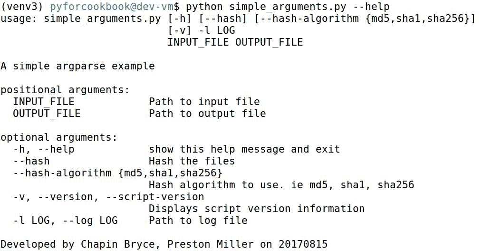
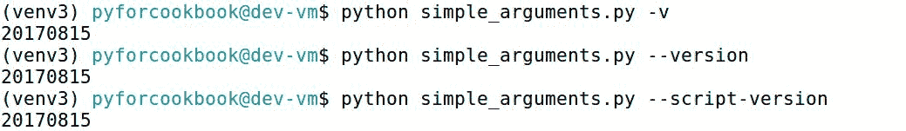
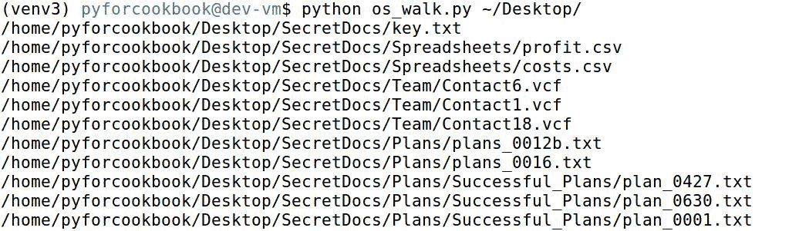
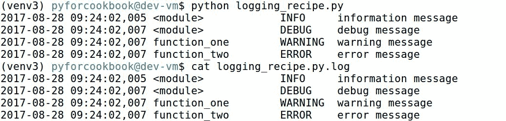
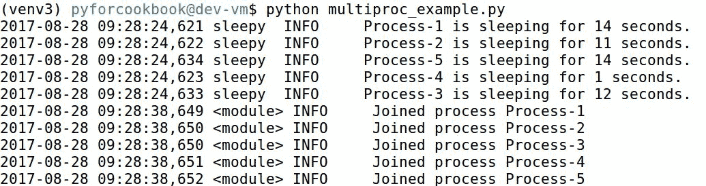

# 基本脚本和文件信息配方

本章介绍了以下配方：

*   像成年人一样处理争论
*   在松散文件上迭代
*   记录文件属性
*   复制文件、属性和时间戳
*   散列文件和数据流
*   使用进度条跟踪
*   测井结果
*   多管齐下

# 介绍

数字取证包括识别和分析数字媒体，以协助法律、商业和其他类型的调查。通常，我们的分析结果对调查方向有重大影响。随着*摩尔定律*或多或少地成立，我们预计审查的数据量正在稳步增长。有鉴于此，调查人员必须依靠某种程度的自动化来有效地审查证据，这是一个必然的结论。自动化很像一种理论，必须经过彻底的审查和验证，以防得出错误的结论。不幸的是，调查人员可能会使用一种工具来自动化某些过程，但并不完全理解该工具、潜在的法医伪影或输出的意义。这就是 Python 发挥作用的地方。

在*Python 数字取证食谱*中，我们开发并详细介绍了涵盖许多典型场景的配方。其目的不仅是为学习 Python 语言的人演示 Python 特性和库，而且还说明了它的一个巨大好处：即对工件的强制基本理解。没有这种理解，首先就不可能开发代码，从而迫使您在更深层次上理解工件。再加上 Python 的相对易用性和自动化的明显好处，很容易理解为什么社区如此容易地采用这种语言。

确保调查人员理解脚本产品的一种方法是提供有意义的文档和代码解释。因此，这本书的目的。自始至终演示的方法展示了如何配置参数解析，该解析既易于开发，又易于用户理解。为了添加到脚本的文档中，我们将介绍有效记录所执行的过程以及脚本遇到的任何错误的技术。

为数字取证设计的脚本的另一个独特功能是与文件及其相关元数据的交互。法医脚本和应用程序需要准确检索和保存文件属性，包括日期、权限和文件哈希。本章将介绍提取这些数据并将其呈现给考官的方法。

与操作系统和附加卷上的文件的交互是任何用于数字取证的脚本的核心。在分析过程中，我们需要访问和解析具有多种结构和格式的文件。因此，准确、正确地处理文件并与之交互非常重要。本章介绍的食谱涵盖了本书将继续使用的常用库和技术：

*   解析命令行参数
*   递归地迭代文件和文件夹
*   记录和保存文件和文件夹元数据
*   生成文件和其他内容的哈希值
*   带有进度条的监控代码
*   记录配方执行信息和错误
*   通过多处理提高性能

Visit [www.packtpub.com/books/content/support](http://www.packtpub.com/books/content/support) to download the code bundle for this chapter.

# 像成年人一样处理争论

食谱难度：简单

Python 版本：2.7 或 3.5

操作系统：任何

Person A: I came here for a good argument!
Person B: Ah, no you didn't, you came here for an argument!
Person A: An argument isn't just contradiction.
Person B: Well! it can be!
Person A: No it can't! An argument is a connected series of statements
intended to establish a proposition.
Person B: No it isn't!
Person A: Yes it is! It isn't just contradiction.

巨蟒（[http://www.montypython.net/scripts/argument.php](http://www.montypython.net/scripts/argument.php) 除此之外，参数是任何脚本不可分割的一部分。参数允许我们为用户提供一个接口，以指定更改代码行为方式的选项和配置。有效地使用论据，而不仅仅是矛盾，可以使一种工具更加通用，成为考官的最爱。

# 开始

此脚本中使用的所有库都存在于 Python 的标准库中。虽然还有其他可用的参数处理库，如`optparse`和`ConfigParser`，但我们的脚本将利用`argparse`作为事实上的命令行处理程序。当`optparse`是 Python 早期版本中使用的库时，`argparse`则充当了创建参数处理代码的替代品。`ConfigParser`库从配置文件而不是命令行解析参数。这对于需要大量参数或具有大量选项的代码非常有用。在本书中我们将不介绍`ConfigParser`，但如果您发现您的`argparse`配置变得难以维护，则值得探索。

To learn more about the `argparse` library, visit [https://docs.python.org/3/library/argparse.html](https://docs.python.org/3/library/argparse.html).

# 怎么做…

在此脚本中，我们执行以下步骤：

1.  创建位置参数和可选参数。
2.  为参数添加说明。
3.  使用 select 选项配置参数。

# 它是如何工作的…

首先，我们导入`print_function`和`argparse`模块。通过从`__future__`库导入`print_function`，我们可以像在 Python3.X 中编写打印语句一样编写它们，但仍然可以在 Python2.X 中运行它们。这使我们能够使配方与 Python2.X 和 3.X 兼容。在可能的情况下，我们会在书中的大多数食谱中贯彻这一点。

在创建了一些关于配方的描述性变量之后，我们初始化了`ArgumentParser`实例。在构造函数中，我们定义了`description`和`epilog`关键字参数。当用户指定`-h`参数时，将显示此数据，并可以为用户提供有关正在运行的脚本的附加上下文。`argparse`库非常灵活，如果脚本需要，它可以扩展复杂性。在本书中，我们介绍了图书馆的许多不同功能，这些功能在其文档页面上有详细说明：

```py
from __future__ import print_function
import argparse

__authors__ = ["Chapin Bryce", "Preston Miller"]
__date__ = 20170815
__description__ = 'A simple argparse example'

parser = argparse.ArgumentParser(
    description=__description__,
    epilog="Developed by {} on {}".format(
        ", ".join(__authors__), __date__)
)
```

创建了解析器实例后，我们现在可以开始向命令行处理程序添加参数。有两种类型的参数：位置参数和可选参数。位置参数以字母字符开头，与可选参数不同，可选参数以破折号开头，执行脚本时需要这些参数。可选参数以单破折号或双破折号字符开头，并且是非位置的（也就是说，顺序无关紧要）。如果需要，可以手动指定这些特性以覆盖我们描述的默认行为。以下代码块说明了如何创建两个位置参数：

```py
# Add Positional Arguments
parser.add_argument("INPUT_FILE", help="Path to input file")
parser.add_argument("OUTPUT_FILE", help="Path to output file")
```

除了更改是否需要参数外，我们还可以指定帮助信息、创建默认值和其他操作。`help`参数有助于传达用户应提供的内容。其他重要参数为`default`、`type`、`choices`和`action`。`default`参数允许我们设置默认值，而`type`将输入类型（默认为字符串）转换为指定的 Python 对象类型。`choices`参数使用已定义的列表、字典或集合来创建用户可以从中选择的有效选项。
参数`action`指定应应用于给定参数的操作类型。一些常见操作包括`store`，它是默认值，存储与参数关联的传递值；`store_true`，将`True`赋值给参数；`version`，打印版本参数指定的代码版本：

```py
# Optional Arguments
parser.add_argument("--hash", help="Hash the files", action="store_true")

parser.add_argument("--hash-algorithm",
                    help="Hash algorithm to use. ie md5, sha1, sha256",
                    choices=['md5', 'sha1', 'sha256'], default="sha256"
                    )

parser.add_argument("-v", "--version", "--script-version",
                    help="Displays script version information",
                    action="version", version=str(__date__)
                    )

parser.add_argument('-l', '--log', help="Path to log file", required=True)
```

通过定义和配置参数，我们现在可以解析它们并在代码中使用提供的输入。下面的代码片段显示了如何访问这些值并测试用户是否指定了可选参数。请注意，我们是如何通过指定的名称引用参数的。如果指定短参数名和长参数名，则必须使用长参数名：

```py
# Parsing and using the arguments
args = parser.parse_args()

input_file = args.INPUT_FILE
output_file = args.OUTPUT_FILE

if args.hash:
    ha = args.hash_algorithm
    print("File hashing enabled with {} algorithm".format(ha))
if not args.log:
    print("Log file not defined. Will write to stdout")
```

当组合成脚本并在命令行中使用`-h`参数执行时，前面的代码将提供以下输出：



如图所示，`-h`标志显示由`argparse`自动创建的脚本帮助信息，以及`--hash-algorithm`参数的有效选项。我们也可以使用`-v`选项显示版本信息。`--script-version`参数以与`-v`或`-version`参数相同的方式显示版本，如下所示：



下面的屏幕截图显示了当我们选择一种有效的哈希算法时打印到控制台的消息：


# 还有更多…

这个脚本可以进一步改进。我们在这里提供了一些建议：

*   探索额外的`argparse`功能。例如，`argparse.FileType`对象可用于接受`File`对象作为输入。
*   我们还可以使用`argparse.ArgumentDefaultsHelpFormatter`类来显示我们为用户设置的默认值。当与可选参数结合使用时，这非常有用，可以向用户显示如果未指定任何内容将使用什么。

# 在松散文件上迭代

食谱难度：简单

Python 版本：2.7 或 3.5

操作系统：任何

通常需要迭代一个目录及其子目录，以递归方式处理所有文件。在这个配方中，我们将演示如何使用 Python 遍历目录并访问其中的文件。理解如何递归地导航给定的输入目录是关键，因为我们经常在脚本中执行此练习。

# 开始

此脚本中使用的所有库都存在于 Python 的标准库中。在大多数情况下，处理文件和文件夹迭代的首选库是内置的`os`库。虽然此库支持许多有用的操作，但我们将重点介绍`os.path()`和`os.walk()`函数。让我们以以下文件夹层次结构为例来演示 Python 中目录迭代的工作原理：

```py
SecretDocs/
|-- key.txt
|-- Plans
|   |-- plans_0012b.txt
|   |-- plans_0016.txt
|   `-- Successful_Plans
|       |-- plan_0001.txt
|       |-- plan_0427.txt
|       `-- plan_0630.txt
|-- Spreadsheets
|   |-- costs.csv
|   `-- profit.csv
`-- Team
    |-- Contact18.vcf
    |-- Contact1.vcf
    `-- Contact6.vcf

4 directories, 11 files
```

# 怎么做…

此配方中执行以下步骤：

1.  为要扫描的输入目录创建位置参数。
2.  迭代所有子目录并将文件路径打印到控制台。

# 它是如何工作的…

我们创建一个非常基本的参数处理程序，它接受一个位置输入`DIR_PATH`，即要迭代的输入目录的路径。例如，我们将使用`SecretDocs`的父级`~/Desktop`路径作为脚本的输入参数。我们解析命令行参数并将输入目录分配给一个局部变量。现在，我们准备开始迭代此输入目录：

```py
from __future__ import print_function
import argparse
import os

__authors__ = ["Chapin Bryce", "Preston Miller"]
__date__ = 20170815
__description__ = "Directory tree walker"

parser = argparse.ArgumentParser(
    description=__description__,
    epilog="Developed by {} on {}".format(
        ", ".join(__authors__), __date__)
)
parser.add_argument("DIR_PATH", help="Path to directory")
args = parser.parse_args()
path_to_scan = args.DIR_PATH
```

要遍历一个目录，我们需要提供一个字符串，表示它到`os.walk()`的路径。此方法在每次迭代中返回三个对象，我们在根、目录和文件变量中捕获了它们：

*   `root`：该值以字符串形式提供当前目录的相对路径。使用示例目录结构，root 将从`SecretDocs`开始，最终变成`SecretDocs/Team`和`SecretDocs/Plans/SuccessfulPlans`。
*   `directories`：该值是当前根目录中的子目录列表。我们可以遍历这个目录列表，尽管在连续的`os.walk()`调用中，这个列表中的条目将成为根值的一部分。因此，不经常使用该值。
*   `files`：该值是当前根位置中的文件列表。

Be careful in naming the directory and file variables. In Python the `dir` and `file` names are reserved for other uses and should not be used as variable names.

```py
# Iterate over the path_to_scan
for root, directories, files in os.walk(path_to_scan):
```

通常会创建第二个 for 循环，如下面的代码所示，以单步遍历该目录中的每个文件并对其执行一些操作。使用`os.path.join()`方法，我们可以连接根变量和`file_entry`变量以获得文件的路径。然后将此文件路径打印到控制台。例如，我们还可以将此文件路径附加到一个列表中，稍后我们将迭代该列表以处理每个文件：

```py
    # Iterate over the files in the current "root"
    for file_entry in files:
        # create the relative path to the file
        file_path = os.path.join(root, file_entry)
        print(file_path)
```

We can also use `root + os.sep() + file_entry` to achieve the same effect, but it is not as Pythonic as the method we're using to join paths. Using `os.path.join()`, we can pass two or more strings to form a single path, such as directories, subdirectories, and files.

当我们使用示例输入目录运行前面的脚本时，我们会看到以下输出：



如图所示，`os.walk()`方法迭代一个目录，然后将下降到任何发现的子目录中，从而扫描整个目录树。

# 还有更多…

这个脚本可以进一步改进。这里有一个建议：

*   使用`glob`库检查并实现类似的功能，与`os`模块不同，该库允许通配符模式递归搜索文件和目录

# 记录文件属性

食谱难度：简单

Python 版本：2.7 或 3.5

操作系统：任何

现在我们可以迭代文件和文件夹，让我们学习记录这些对象的元数据。文件元数据在取证中起着重要作用，因为在大多数调查中，收集和审查这些信息是一项基本任务。使用单个 Python 库，我们可以跨平台收集文件的一些最重要属性。

# 开始

此脚本中使用的所有库都存在于 Python 的标准库中。这里可以再次使用`os`库来收集文件元数据。`os.stat()`函数是收集文件元数据最有用的方法之一。需要注意的是，`stat()`调用只提供当前操作系统和装入卷的文件系统的可用信息。大多数法医套件允许检查员将法医图像作为卷装载到系统上，并且通常保留 stat 调用可用的`file`属性。在[第 8 章](08.html#75QNI0-260f9401d2714cb9ab693c4692308abe)中*使用法医证据容器配方*中，我们将演示如何打开法医采集以直接提取文件信息。

To learn more about the `os` library, visit [https://docs.python.org/3/library/os.html](https://docs.python.org/3/library/os.html).

# 怎么做…

我们将使用以下步骤记录文件属性：

1.  获取要处理的输入文件。
2.  打印各种元数据：MAC 时间、文件大小、组和所有者 ID 等。

# 它是如何工作的…

首先，我们导入所需的库：`argparse`用于参数处理，`datetime`用于解释时间戳，`os`用于访问`stat()`方法。`sys`模块用于识别脚本运行的平台（操作系统）。接下来，我们创建命令行处理程序，它接受一个参数`FILE_PATH`，这是一个表示我们将从中提取元数据的文件路径的字符串。在继续执行脚本之前，我们将此输入分配给一个局部变量：

```py
from __future__ import print_function
import argparse
from datetime import datetime as dt
import os
import sys

__authors__ = ["Chapin Bryce", "Preston Miller"]
__date__ = 20170815
__description__ = "Gather filesystem metadata of provided file"

parser = argparse.ArgumentParser(
    description=__description__,
    epilog="Developed by {} on {}".format(", ".join(__authors__), __date__)
)
parser.add_argument("FILE_PATH",
                    help="Path to file to gather metadata for")
args = parser.parse_args()
file_path = args.FILE_PATH
```

时间戳是收集的最常见的文件元数据属性之一。我们可以使用`os.stat()`方法访问创建、修改和访问时间戳。时间戳以浮点形式返回，表示自 1970-01-01 以来的秒数。使用`datetime.fromtimestamp()`方法，我们将该值转换为可读格式。

The `os.stat()` module interprets timestamps differently depending on the platform. For example, the `st_ctime` value on Windows displays the file's creation time, while on macOS and UNIX this same attribute displays the last modification of the file's metadata, similar to the NTFS entry modified time. This is not the only part of `os.stat()` that varies by platform, though the remainder of this recipe uses items that are common across platforms.

```py
stat_info = os.stat(file_path)
if "linux" in sys.platform or "darwin" in sys.platform:
    print("Change time: ", dt.fromtimestamp(stat_info.st_ctime))
elif "win" in sys.platform:
    print("Creation time: ", dt.fromtimestamp(stat_info.st_ctime))
else:
    print("[-] Unsupported platform {} detected. Cannot interpret "
          "creation/change timestamp.".format(sys.platform)
          )
print("Modification time: ", dt.fromtimestamp(stat_info.st_mtime))
print("Access time: ", dt.fromtimestamp(stat_info.st_atime))
```

我们在时间戳之后继续打印文件元数据。文件模式和`inode`属性分别以整数形式返回文件权限和`inode`。设备 ID 指文件所在的设备。我们可以使用`os.major()`和`os.minor()`方法将该整数转换为主要和次要设备标识符：

```py
print("File mode: ", stat_info.st_mode)
print("File inode: ", stat_info.st_ino)
major = os.major(stat_info.st_dev)
minor = os.minor(stat_info.st_dev)
print("Device ID: ", stat_info.st_dev)
print("\tMajor: ", major)
print("\tMinor: ", minor)
```

`st_nlink`属性返回指向该文件的硬链接数。我们可以分别使用`st_uid`和`st_gid`属性打印所有者和组信息。最后，我们可以使用`st_size`收集文件大小，它返回一个整数，以字节表示文件大小。

Be aware that if the file is a symbolic link, the `st_size` property reflects the length of the path to the target file rather than the target file’s size.

```py
print("Number of hard links: ", stat_info.st_nlink)
print("Owner User ID: ", stat_info.st_uid)
print("Group ID: ", stat_info.st_gid)
print("File Size: ", stat_info.st_size)
```

但是等等，还不止这些！我们可以使用`os.path()`模块提取更多的元数据。例如，我们可以使用它来确定一个文件是否是符号链接，如下面的`os.islink()`方法所示。这样，如果`st_size`属性与目标文件的大小不相等，我们就可以提醒用户。`os.path()`模块还可以采集绝对路径，检查绝对路径是否存在，获取父目录。我们也可以使用`os.path.dirname()`函数或访问`os.path.split()`函数的第一个元素来收集父目录。`split()`方法更常用于从路径获取文件名：

```py
# Gather other properties
print("Is a symlink: ", os.path.islink(file_path))
print("Absolute Path: ", os.path.abspath(file_path))
print("File exists: ", os.path.exists(file_path))
print("Parent directory: ", os.path.dirname(file_path))
print("Parent directory: {} | File name: {}".format(
    *os.path.split(file_path)))
```

通过运行脚本，我们可以获得有关文件的相关元数据。请注意`format()`方法如何允许我们打印值，而不必考虑它们的数据类型。通常，如果要尝试直接打印变量而不使用字符串格式，我们必须首先将整数和其他数据类型转换为字符串：


# 还有更多…

这个脚本可以进一步改进。我们在这里提供了一些建议：

*   将此方法与*迭代松散文件*方法集成，以递归方式提取给定目录系列中文件的元数据
*   实现按文件扩展名、修改日期甚至文件大小筛选的逻辑，以便仅收集与所需条件匹配的文件的元数据信息

# 复制文件、属性和时间戳

食谱难度：简单

Python 版本：2.7 或 3.5

操作系统：Windows

保存文件是数字取证的一项基本任务。通常更可取的做法是，以一种可以存储散列和松散文件的其他元数据的格式对文件进行容器化。然而，有时我们需要以取证的方式将文件从一个位置复制到另一个位置。使用这个方法，我们将演示在保留公共元数据字段的同时复制文件的一些方法。

# 开始

此配方需要安装两个第三方模块`pywin32`和`pytz`。此脚本中使用的所有其他库都存在于 Python 的标准库中。此配方主要使用两个库，内置的`shutil`和第三方库`pywin32`。`shutil`库是我们在 Python 中复制文件的工具，我们可以使用它来保留大部分时间戳和其他文件属性。然而，`shutil`模块无法保留其复制的文件的创建时间。相反，我们必须依靠特定于 Windows 的`pywin32`库来保存它。虽然`pywin32`库是特定于平台的，但与 Windows 操作系统交互非常有用。

To learn more about the `shutil` library, visit [https://docs.python.org/3/library/shutil.html](https://docs.python.org/3/library/shutil.html).

要安装`pywin32`，我们需要访问其 SourceForge 页面[https://sourceforge.net/projects/pywin32/](https://sourceforge.net/projects/pywin32/) 并下载与我们的 Python 安装相匹配的版本。为了检查 Python 版本，我们可以导入`sys`模块并在解释器中调用`sys.version`。选择正确的`pywin32`安装程序时，版本和体系结构都很重要。

To learn more about the `sys` library, visit [https://docs.python.org/3/library/sys.html](https://docs.python.org/3/library/sys.html).

除了安装`pywin32`库之外，我们还需要安装`pytz`，这是一个第三方库，用于在 Python 中管理时区。我们可以使用`pip`命令安装此库：

```py
pip install pytz==2017.2
```

# 怎么做…

我们执行以下步骤在 Windows 系统上对文件进行取证复制：

1.  收集源文件和目标参数。
2.  使用`shutil`复制和保存大部分文件元数据。
3.  使用`win32file`手动设置时间戳属性。

# 它是如何工作的…

现在让我们深入研究复制文件并保留其属性和时间戳。我们使用一些熟悉的库来帮助我们执行此配方。一些库，例如`pytz`、`win32file`和`pywintypes`是新的。让我们在这里简要讨论一下它们的用途。`pytz`模块允许我们更精确地处理时区，并允许我们初始化`pywin32`库的日期。

为了让我们以正确的格式传递时间戳，我们还必须导入`pywintypes`。最后，通过我们安装的`pywin32`提供的`win32file`库为 Windows 中的文件操作提供了各种方法和常量：

```py
from __future__ import print_function
import argparse
from datetime import datetime as dt
import os
import pytz
from pywintypes import Time
import shutil
from win32file import SetFileTime, CreateFile, CloseHandle
from win32file import GENERIC_WRITE, FILE_SHARE_WRITE
from win32file import OPEN_EXISTING, FILE_ATTRIBUTE_NORMAL

__authors__ = ["Chapin Bryce", "Preston Miller"]
__date__ = 20170815
__description__ = "Gather filesystem metadata of provided file"

```

此配方的命令行处理程序采用两个位置参数`source`和`dest`，分别表示要复制的源文件和输出目录。此配方有一个可选参数`timezone`，允许用户指定时区。

为了准备源文件，我们存储绝对路径，并将文件名与路径的其余部分分离，如果目标是目录，我们可能需要在以后使用该文件。我们的最后一点准备工作包括读取用户输入的时区、美国四个常见时区之一和 UTC。这允许我们初始化`pytz`时区对象，以便以后在配方中使用：

```py
parser = argparse.ArgumentParser(
    description=__description__,
    epilog="Developed by {} on {}".format(
        ", ".join(__authors__), __date__)
)
parser.add_argument("source", help="Source file")
parser.add_argument("dest", help="Destination directory or file")
parser.add_argument("--timezone", help="Timezone of the file's timestamp",
                    choices=['EST5EDT', 'CST6CDT', 'MST7MDT', 'PST8PDT'],
                    required=True)
args = parser.parse_args()

source = os.path.abspath(args.source)
if os.sep in args.source:
    src_file_name = args.source.split(os.sep, 1)[1]
else:
    src_file_name = args.source

dest = os.path.abspath(args.dest)
tz = pytz.timezone(args.timezone)
```

此时，我们可以使用`shutil.copy2()`方法将源文件复制到目标。此方法接受目录或文件作为目标。`shutil``copy()`和`copy2()`方法的主要区别在于`copy2()`方法还保留了文件属性，包括上次写入时间和权限。此方法不会保留 Windows 上的文件创建时间，因此我们需要利用`pywin32`绑定。

为此，如果用户在命令行提供了目录，我们必须使用以下`if`语句为`copy2()`调用复制的文件建立目标路径，以加入正确的路径：

```py
shutil.copy2(source, dest)
if os.path.isdir(dest):
    dest_file = os.path.join(dest, src_file_name)
else:
    dest_file = dest
```

接下来，我们为`pywin32`库准备时间戳。我们使用`os.path.getctime()`方法收集各自的窗口创建时间，并使用`datetime.fromtimestamp()`方法将整数值转换为日期。在`datetime`对象就绪的情况下，我们可以通过使用指定的`timezone`并将其提供给`pywintype.Time()`功能，在将时间戳打印到控制台之前，使值时区感知：

```py
created = dt.fromtimestamp(os.path.getctime(source))
created = Time(tz.localize(created))
modified = dt.fromtimestamp(os.path.getmtime(source))
modified = Time(tz.localize(modified))
accessed = dt.fromtimestamp(os.path.getatime(source))
accessed = Time(tz.localize(accessed))

print("Source\n======")
print("Created: {}\nModified: {}\nAccessed: {}".format(
    created, modified, accessed))
```

准备工作完成后，我们可以使用`CreateFile()`方法打开文件，并传递表示复制文件的字符串路径，后跟 Windows API 为访问该文件指定的参数。有关这些论点及其含义的详细信息，请参见[https://msdn.microsoft.com/en-us/library/windows/desktop/aa363858（v=vs.85）.aspx](https://msdn.microsoft.com/en-us/library/windows/desktop/aa363858(v=vs.85).aspx) ：

```py
handle = CreateFile(dest_file, GENERIC_WRITE, FILE_SHARE_WRITE,
                    None, OPEN_EXISTING, FILE_ATTRIBUTE_NORMAL, None)
SetFileTime(handle, created, accessed, modified)
CloseHandle(handle)
```

一旦我们有了一个打开的文件句柄，我们就可以调用`SetFileTime()`函数来依次更新文件的创建、访问和修改时间戳。设置了目标文件的时间戳后，我们需要使用`CloseHandle()`方法关闭文件句柄。为了向用户确认文件的时间戳复制成功，我们打印目标文件的创建、修改和访问时间：

```py
created = tz.localize(dt.fromtimestamp(os.path.getctime(dest_file)))
modified = tz.localize(dt.fromtimestamp(os.path.getmtime(dest_file)))
accessed = tz.localize(dt.fromtimestamp(os.path.getatime(dest_file)))
print("\nDestination\n===========")
print("Created: {}\nModified: {}\nAccessed: {}".format(
    created, modified, accessed))
```

脚本输出显示将文件从源复制到目标，并成功保留时间戳：


# 还有更多…

这个脚本可以进一步改进。我们在这里提供了一些建议：

*   散列源文件和目标文件，以确保成功复制它们。哈希文件将在下一节的哈希文件和数据流配方中介绍。
*   输出复制文件的日志以及复制过程中遇到的任何异常。

# 散列文件和数据流

食谱难度：简单

Python 版本：2.7 或 3.5

操作系统：任何

文件哈希是广泛接受的用于确定文件完整性和真实性的标识符。虽然一些算法已变得容易受到碰撞攻击，但该过程在该领域仍然很重要。在本食谱中，我们将介绍对字符串和文件内容流进行散列的过程。

# 开始

此脚本中使用的所有库都存在于 Python 的标准库中。为了生成文件和其他数据源的散列，我们实现了`hashlib`库。此内置库支持常见算法，如 MD5、SHA-1、SHA-256 等。在撰写本书时，许多工具仍然使用 MD5 和 SHA-1 算法，尽管目前的建议是至少使用 SHA-256。或者，可以使用文件的多个散列来进一步降低散列冲突的几率。虽然我们将展示其中的一些算法，但还有其他一些不太常用的算法可用。

To learn more about the `hashlib` library, visit [https://docs.python.org/3/library/hashlib.html](https://docs.python.org/3/library/hashlib.html).

# 怎么做…

我们通过以下步骤对文件进行哈希：

1.  使用指定的输入文件和算法打印哈希文件名。
2.  使用指定的输入文件和算法打印哈希文件数据。

# 它是如何工作的…

首先，我们必须导入`hashlib`，如下所示。为了便于使用，我们定义了脚本可以使用的算法字典：`MD5`、`SHA-1`、`SHA-256`和`SHA-512`。通过更新此字典，我们可以支持具有`update()`和`hexdigest()`方法的其他哈希函数，包括来自`hashlib`以外的库的一些哈希函数：

```py
from __future__ import print_function
import argparse
import hashlib
import os

__authors__ = ["Chapin Bryce", "Preston Miller"]
__date__ = 20170815
__description__ = "Script to hash a file's name and contents"

available_algorithms = {
    "md5": hashlib.md5,
    "sha1": hashlib.sha1,
    "sha256": hashlib.sha256,
    "sha512": hashlib.sha512
}

parser = argparse.ArgumentParser(
    description=__description__,
    epilog="Developed by {} on {}".format(", ".join(__authors__), __date__)
)
parser.add_argument("FILE_NAME", help="Path of file to hash")
parser.add_argument("ALGORITHM", help="Hash algorithm to use",
                    choices=sorted(available_algorithms.keys()))
args = parser.parse_args()

input_file = args.FILE_NAME
hash_alg = args.ALGORITHM
```

Notice how we define our hashing algorithm object using our dictionary and the argument provided at the command line, followed by open and close parentheses to initiate the object. This provides additional flexibility when adding new hashing algorithms.

定义了散列算法后，我们现在可以对文件的绝对路径进行散列，通过将字符串传递到`update()`方法，这与 iOS 设备 iTunes 备份的文件命名过程中使用的方法类似。当我们准备好显示计算出的散列的十六进制值时，我们可以在我们的`file_name`对象上调用`hexdigest()`方法：

```py
file_name = available_algorithms[hash_alg]()
abs_path = os.path.abspath(input_file)
file_name.update(abs_path.encode())

print("The {} of the filename is: {}".format(
    hash_alg, file_name.hexdigest()))
```

让我们继续打开文件并对其内容进行散列。虽然我们可以读取整个文件并将其传递给`hash`函数，但并非所有文件都小到可以放入内存。为了确保我们的代码能够在更大的文件上工作，我们将使用以下示例中的技术以逐段方式读取文件并将其分块散列。

通过以`rb`打开文件，我们将确保读取的是文件的二进制内容，而不是可能存在的字符串内容。打开文件后，我们将定义要读入内容的缓冲区大小，然后读入第一块数据。

进入 while 循环，只要文件中有内容，我们就会用新内容更新哈希对象。这是可能的，因为`read()`方法允许我们传递一个要读取的字节数的整数，如果该整数大于文件中剩余的字节数，我们只需传递剩余的字节。

一旦读取了整个文件，我们调用对象的`hexdigest()`方法向审查者显示文件哈希：

```py
file_content = available_algorithms[hash_alg]()
with open(input_file, 'rb') as open_file:
    buff_size = 1024
    buff = open_file.read(buff_size)

    while buff:
        file_content.update(buff)
        buff = open_file.read(buff_size)

print("The {} of the content is: {}".format(
    hash_alg, file_content.hexdigest()))
```

当我们执行代码时，我们会看到两个 print 语句的输出，显示文件绝对路径和内容的散列值。通过在命令行更改算法，我们可以为文件生成附加哈希：


# 还有更多…

这个脚本可以进一步改进。这里有一个建议：

*   添加对附加哈希算法的支持，并在`available_algorithms`全局变量中创建适当的条目

# 使用进度条跟踪

食谱难度：简单

Python 版本：2.7 或 3.5

操作系统：任何

不幸的是，在处理以 GB 或 TB 为单位的数据时，长时间运行的脚本很常见。虽然您的脚本可以顺利地处理这些数据，但用户可能会认为它在三个小时后被冻结，没有任何进展迹象。幸运的是，一些开发人员已经构建了一个非常简单的进度条库，这给了我们一个不将其纳入代码的小借口。

# 开始

此配方需要安装第三方模块`tqdm`。此脚本中使用的所有其他库都存在于 Python 的标准库中。`tqdm`库，发音为 taqadum，可通过`pip`安装或从 GitHub[下载 https://github.com/tqdm/tqdm](https://github.com/tqdm/tqdm) 。要使用此配方中显示的所有功能，请确保您使用的是 4.11.2 版，可在`tqdm`GitHub 页面上使用，或使用以下命令与`pip`一起使用：

```py
pip install tqdm==4.11.2
```

# 怎么做…

要创建简单的进度条，请执行以下步骤：

1.  导入`tqdm`和`time`。
2.  使用`tqdm`和循环创建多个示例。

# 它是如何工作的…

和所有其他食谱一样，我们从进口开始。虽然我们只需要`tqdm`导入来启用进度条，但我们将使用时间模块来减慢脚本速度，以便更好地可视化进度条。我们使用水果列表作为样本数据，并确定哪些水果名称中含有“浆果”或“浆果”：

```py
from __future__ import print_function
from time import sleep
import tqdm

fruits = [
    "Acai", "Apple", "Apricots", "Avocado", "Banana", "Blackberry",
    "Blueberries", "Cherries", "Coconut", "Cranberry", "Cucumber",
    "Durian", "Fig", "Grapefruit", "Grapes", "Kiwi", "Lemon", "Lime",
    "Mango", "Melon", "Orange", "Papaya", "Peach", "Pear", "Pineapple",
    "Pomegranate", "Raspberries", "Strawberries", "Watermelon"
]
```

下面的 for 循环非常简单，遍历我们的水果列表，在睡眠十分之一秒之前检查子字符串`berr`是否在水果名称内。通过将`tqdm()`方法包装在迭代器周围，我们自动拥有一个漂亮的进度条，给出完成百分比、经过的时间、剩余时间、完成的迭代次数和总迭代次数。

这些显示选项是`tqdm`的默认选项，并使用列表对象的属性收集所有必要的信息。例如，库知道进度条的几乎所有这些细节，只需收集长度并根据每次迭代的时间量和经过的次数计算其余部分：

```py
contains_berry = 0
for fruit in tqdm.tqdm(fruits):
    if "berr" in fruit.lower():
        contains_berry += 1
    sleep(.1)
print("{} fruit names contain 'berry' or 'berries'".format(contains_berry))
```

将进度条扩展到默认配置之外与指定关键字参数一样简单。也可以在循环开始之前创建进度条对象，并使用列表对象`fruits`作为 iterable 参数。下面的代码展示了如何使用列表、描述和提供单元名称来定义进度条。

如果我们使用的不是一个列表，而是另一个没有定义`__len__`属性的迭代器类型，那么我们需要手动提供一个包含`total`关键字的总计。如果总迭代次数不可用，则仅显示有关已用时间和每秒迭代次数的基本统计信息。

一旦进入循环，我们就可以显示使用`set_postfix()`方法发现的结果数量。每次迭代都会在进度条右侧更新我们找到的点击次数：

```py
contains_berry = 0
pbar = tqdm.tqdm(fruits, desc="Reviewing names", unit="fruits")
for fruit in pbar:
    if "berr" in fruit.lower():
        contains_berry += 1
    pbar.set_postfix(hits=contains_berry)
    sleep(.1)
print("{} fruit names contain 'berry' or 'berries'".format(contains_berry))
```

进度条的另一个常见用例是在整数范围内度量执行情况。由于这是库的常见用法，开发人员在库中构建了一个范围调用，称为`trange()`。注意我们如何在这里指定与前面相同的参数。由于数字较大，我们将在这里使用的一个新参数是`unit_scale`参数，它将大数字简化为小数字，并用一个字母表示大小：

```py
for i in tqdm.trange(10000000, unit_scale=True, desc="Trange: "):
    pass
```

当我们执行代码时，下面的输出是可见的。第一个进度条显示默认格式，第二个和第三个进度条显示我们添加的自定义项：


# 还有更多…

这个脚本可以进一步改进。这里有一个建议：

*   进一步探索`tqdm`库为开发人员提供的功能。考虑使用 AUTYT1 方法打印状态消息而不中断进度条。

# 测井结果

食谱难度：简单

Python 版本：2.7 或 3.5

操作系统：任何

在进度条之外，我们通常需要向用户提供消息来描述执行期间发生的任何异常、错误、警告或其他信息。通过日志记录，我们可以在执行时以及在文本文件中提供此信息，以供将来参考。

# 开始

此脚本中使用的所有库都存在于 Python 的标准库中。此配方将使用内置的`logging`库向控制台和文本文件生成状态消息。

To learn more about the `logging` library, visit [https://docs.python.org/3/library/logging.html](https://docs.python.org/3/library/logging.html).

# 怎么做…

以下步骤可用于有效记录程序执行数据：

1.  创建日志格式字符串。
2.  在脚本执行期间记录各种消息类型。

# 它是如何工作的…

现在让我们学习记录结果。导入之后，我们通过使用由`__file__`属性表示的脚本名称初始化一个实例来创建`logger`对象。启动`logging`对象后，我们将为该脚本设置级别并指定各种格式化程序和处理程序。格式化程序提供了定义每条消息将显示哪些字段的灵活性，包括时间戳、函数名和消息级别。格式字符串遵循 Python 字符串格式的标准，这意味着我们可以为以下字符串指定填充：

```py
from __future__ import print_function
import logging
import sys

logger = logging.getLogger(__file__)
logger.setLevel(logging.DEBUG)

msg_fmt = logging.Formatter("%(asctime)-15s %(funcName)-20s"
                            "%(levelname)-8s %(message)s")
```

处理程序允许我们指定记录日志消息的位置，包括日志文件、标准输出（控制台）或标准错误。在下面的示例中，我们使用流处理程序的标准输出和文件处理程序的扩展名为`.log`的脚本名称。最后，我们向 logger 对象注册这些处理程序：

```py
strhndl = logging.StreamHandler(sys.stdout)
strhndl.setFormatter(fmt=msg_fmt)

fhndl = logging.FileHandler(__file__ + ".log", mode='a')
fhndl.setFormatter(fmt=msg_fmt)

logger.addHandler(strhndl)
logger.addHandler(fhndl)
```

默认情况下，日志库按严重性的递增顺序使用以下级别：`NOTSET`、`DEBUG`、`INFORMATION`、`WARNING`、`ERROR`和`CRITICAL`。为了展示格式字符串的一些功能，我们将从函数中记录几种类型的消息：

```py
logger.info("information message")
logger.debug("debug message")

def function_one():
    logger.warning("warning message")

def function_two():
    logger.error("error message")

function_one()
function_two()
```

当我们执行这段代码时，我们可以从脚本调用中看到以下消息信息。对生成的日志文件的检查与控制台中记录的内容相匹配：



# 还有更多…

这个脚本可以进一步改进。这里有一个建议：

*   在脚本出错或用户验证过程时，尽可能多地向用户提供信息通常很重要。因此，我们建议实现额外的格式化程序和日志记录级别。使用`stderr`流是记录日志的最佳实践，因为我们可以在控制台提供输出，而不会中断`stdout`。

# 多管齐下

难度：中等

Python 版本：2.7 或 3.5

操作系统：任何

虽然 Python 以单线程著称，但我们可以使用内置库来启动新进程来处理任务。通常，当存在一系列可以同时运行的任务并且处理尚未受到硬件限制（如网络带宽或磁盘速度）的限制时，这是首选的。

# 开始

此脚本中使用的所有库都存在于 Python 的标准库中。使用内置的`multiprocessing`库，我们可以处理大多数需要多个流程才能有效解决问题的情况。

To learn more about the `multiprocessing` library, visit [https://docs.python.org/3/library/multiprocessing.html](https://docs.python.org/3/library/multiprocessing.html).

# 怎么做…

通过以下步骤，我们展示了 Python 中的基本多处理支持：

1.  建立日志记录`multiprocessing`活动。
2.  使用`multiprocessing`将数据追加到列表中。

# 它是如何工作的…

现在让我们看看如何在 Python 中实现多处理。我们的进口产品包括`multiprocessing`库，简称为`mp`，否则会很长；线程状态消息的`logging`和`sys`库；对于我们的示例，`time`库减慢了执行速度；以及生成每个线程应该等待的时间的`randint`方法：

```py
from __future__ import print_function
import logging
import multiprocessing as mp
from random import randint
import sys
import time
```

在创建流程之前，我们设置了一个他们将执行的函数。这是我们在返回到主线程之前放置每个进程应该执行的任务的地方。在本例中，我们将线程睡眠的秒数作为唯一的参数。为了打印允许我们区分进程的状态消息，我们使用`current_process()`方法访问每个线程的 name 属性：

```py
def sleepy(seconds):
    proc_name = mp.current_process().name
    logger.info("{} is sleeping for {} seconds.".format(
        proc_name, seconds))
    time.sleep(seconds)
```

定义了 worker 函数后，我们创建了`logger`实例，借用了前面配方中的代码，并将其设置为仅记录到控制台。

```py
logger = logging.getLogger(__file__)
logger.setLevel(logging.DEBUG)
msg_fmt = logging.Formatter("%(asctime)-15s %(funcName)-7s "
                            "%(levelname)-8s %(message)s")
strhndl = logging.StreamHandler(sys.stdout)
strhndl.setFormatter(fmt=msg_fmt)
logger.addHandler(strhndl)
```

现在，我们定义要生成的工作进程的数量，并在 for 循环中创建它们。使用此技术，我们可以轻松地调整正在运行的进程数。在循环内部，我们使用`Process`类定义每个`worker`，并设置目标函数和所需参数。一旦定义了流程实例，我们将启动它并将对象附加到列表中以供以后使用：

```py
num_workers = 5
workers = []
for w in range(num_workers):
    p = mp.Process(target=sleepy, args=(randint(1, 20),))
    p.start()
    workers.append(p)
```

通过将`workers`添加到列表中，我们可以按顺序将它们连接起来。在此上下文中，连接是在继续执行之前等待流程完成的流程。如果我们不加入我们的进程，其中一个进程可以继续到脚本的末尾，并在其他进程完成之前完成代码。虽然在我们的示例中，这不会造成很大的问题，但可能会导致下一段代码开始得太早：

```py
for worker in workers:
    worker.join()
    logger.info("Joined process {}".format(worker.name))
```

当我们执行脚本时，我们可以看到进程随着时间的推移而启动和加入。由于我们将这些项目存储在一个列表中，因此它们将以有序的方式加入，而不管一个工作人员需要多长时间才能完成。以下可见`Process-5`在完成之前睡眠了 14 秒，同时`Process-4`和`Process-3`已经完成：



# 还有更多…

这个脚本可以进一步改进。我们在此提出了一项建议：

*   与其使用函数参数在线程之间传递数据，不如将管道和队列作为共享数据的替代方案。有关这些对象的更多信息，请参见[https://docs.python.org/3/library/multiprocessing.html#exchanging-进程之间的对象](https://docs.python.org/3/library/multiprocessing.html#exchanging-objects-between-processes.)。[](https://docs.python.org/3/library/multiprocessing.html#exchanging-objects-between-processes.)