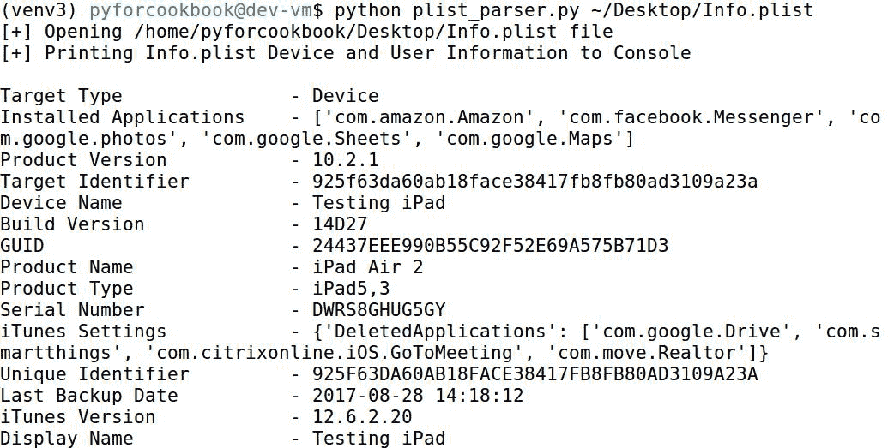
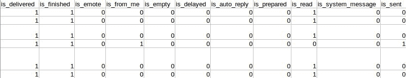
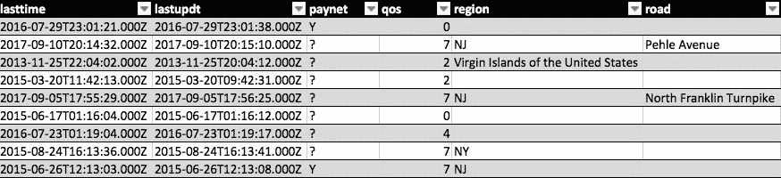
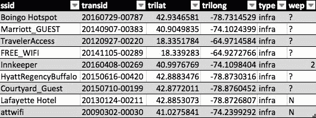

# 深入研究移动法医配方

本章介绍了以下配方：

*   解析 PLIST 文件
*   处理 SQLite 数据库
*   识别 SQLite 数据库中的漏洞
*   处理 iTunes 备份
*   将 Wi-Fi 放到地图上
*   深入挖掘以恢复消息

# 介绍

也许这有点陈词滥调，但随着技术的发展，它继续与我们的生活更加融合，这一点仍然是事实。这一点从未像第一部智能手机的开发那样明显。这些珍贵的设备似乎永远不会离开主人的手中，而且往往比人类同伴得到更多的互动。因此，智能手机可以为调查人员提供对其所有者的大量了解也就不足为奇了。例如，消息可以提供对所有者心理状态的洞察或对特定事实的了解。它们甚至可以揭示以前未知的信息。位置历史记录是我们可以从这些设备中提取的另一个有用的人工制品，有助于验证个人的不在场证明。我们将学习提取这些信息和更多信息。

智能手机上证据价值的一个常见来源是 SQLite 数据库。这些数据库实际上是大多数智能手机操作系统中应用程序的存储。出于这个原因，本章中的许多脚本都将重点放在从这些数据库中挑出数据和得出推论上。除此之外，我们还将学习如何处理苹果操作系统（包括 iOS）常用的 PLIST 文件，并提取相关数据。本章中的脚本侧重于解决特定问题，并按复杂性排序：

*   学习处理 XML 和二进制 PLIST 文件
*   使用 Python 与 SQLite 数据库交互
*   识别 SQLite 数据库中缺失的缺口
*   将 iOS 备份转换为人类可读的格式
*   处理 Cellebrite 的输出并使用 WiGLE 执行 Wi-Fi MAC 地址地理位置查找
*   识别 SQLite 数据库中可能完整删除的内容

Visit [www.packtpub.com/books/content/support](http://www.packtpub.com/books/content/support) to download the code bundle for this chapter.

# 解析 PLIST 文件

食谱难度：简单

Python 版本：2.7 或 3.5

操作系统：任何

此配方将处理每个 iOS 备份中存在的`Info.plist`文件，并提取设备特定信息，如设备名称、IMEI、序列号、产品品牌、型号和 iOS 版本以及上次备份日期。属性列表或 plist 有两种不同的格式：XML 或二进制。通常，在处理二进制 plist 时，需要在 macOS 平台上使用 plutil 实用程序将其转换为可读的 XML 格式。但是，我们将介绍一个 Python 库，它可以轻松地处理这两种类型。一旦我们从`Info.plist`文件中提取了相关的数据元素，我们将把这些数据打印到控制台。

# 开始

此配方需要安装第三方库`biplist`。此脚本中使用的所有其他库都存在于 Python 的标准库中。`biplist`模块提供了处理 XML 和二进制 PLIST 文件的方法。

To learn more about the `biplist` library, visit [https://github.com/wooster/biplist](https://github.com/wooster/biplist).

Python 有一个内置的 PLIST 库`plistlib`；然而，该库被发现不像`biplist`那样广泛地支持二进制 PLIST 文件。

To learn more about the `plistlib` library, visit [https://docs.python.org/3/library/plistlib.html](https://docs.python.org/3/library/plistlib.html).

安装`biplist`可以使用`pip`完成：

```py
pip install biplist==1.0.2
```

请务必抓取您自己的`Info.plist`文件以使用此脚本进行处理。如果找不到`Info.plist`文件，则任何 PLIST 文件都应适用。我们的脚本没有那么具体，技术上应该可以与任何 PLIST 文件一起使用。

# 怎么做。。。

我们将采用以下步骤来处理 PLIST 文件：

1.  打开输入 PLIST 文件。
2.  将 PLIST 数据读入变量。
3.  将格式化的 PLIST 数据打印到控制台。

# 它是如何工作的。。。

首先，我们导入所需的库来处理参数解析和处理 plist：

```py
from __future__ import print_function
import argparse
import biplist
import os
import sys
```

此配方的命令行处理程序接受一个位置参数`PLIST_FILE`，它表示我们将处理的 PLIST 文件的路径：

```py
if __name__ == "__main__":
    parser = argparse.ArgumentParser(
        description=__description__,
        epilog="Developed by {} on {}".format(
            ", ".join(__authors__), __date__)
    )
    parser.add_argument("PLIST_FILE", help="Input PList File")
    args = parser.parse_args()
```

我们使用`os.exists()`和`os.path.isfile()`函数来验证输入文件是否存在，是否是一个文件，而不是一个目录。我们不对该文件执行任何进一步的验证，例如确认它是否是 PLIST 文件而不是文本文件，而是依靠`biplist`库（和常识）来捕获此类错误。如果输入文件通过了我们的测试，我们调用`main()`函数并将 PLIST 文件路径传递给它：

```py
    if not os.path.exists(args.PLIST_FILE) or \
            not os.path.isfile(args.PLIST_FILE):
        print("[-] {} does not exist or is not a file".format(
            args.PLIST_FILE))
        sys.exit(1)

    main(args.PLIST_FILE)
```

`main()`功能相对简单，实现了读取 PLIST 文件，然后将数据打印到控制台的目的。首先，我们打印一个更新到控制台，我们正在尝试打开该文件。然后，我们使用`biplist.readPlist()`方法打开 PLIST 并将其读入`plist_data`变量。如果 PLIST 已损坏或无法访问，`biplist`将引发`InvalidPlistException`或`NotBinaryPlistException`错误。我们在`try`和`except`块和`exit`脚本中捕捉到这两种情况：

```py
def main(plist):
    print("[+] Opening {} file".format(plist))
    try:
        plist_data = biplist.readPlist(plist)
    except (biplist.InvalidPlistException,
            biplist.NotBinaryPlistException) as e:
        print("[-] Invalid PLIST file - unable to be opened by biplist")
        sys.exit(2)
```

一旦我们成功地读入 PLIST 数据，我们将迭代生成的`plist_data`字典中的键，并将它们打印到控制台。请注意，我们打印了`Info.plist`文件中的所有密钥，但`Applications`和`iTunes Files`密钥除外。这两个键都包含大量的数据，这些数据充斥着控制台，因此不适合这种类型的输出。我们使用 format 方法帮助创建清晰的控制台输出：

```py
    print("[+] Printing Info.plist Device "
          "and User Information to Console\n")
    for k in plist_data:
        if k != 'Applications' and k != 'iTunes Files':
            print("{:<25s} - {}".format(k, plist_data[k]))
```

请注意第一个花括号中的其他格式字符。我们在这里指定将输入字符串左对齐，静态宽度为 25 个字符。正如您在以下屏幕截图中所看到的，这确保了数据以有序和结构化的格式呈现：



# 还有更多…

这个脚本可以进一步改进。我们在这里提供了一些建议：

*   添加 CSV 函数将数据写入 CSV 文件，而不是将数据打印到控制台
*   添加对处理包含 PLIST 文件的目录的支持

# 处理 SQLite 数据库

食谱难度：简单

Python 版本：3.5

操作系统：任何

如前所述，SQLite 数据库充当移动设备上的主要数据存储库。Python 有一个内置库`sqlite3`，可用于与这些数据库进行接口。在这个脚本中，我们将与 iPhone`sms.db`文件交互，并从`message`表中提取数据。我们还将使用此脚本作为一个机会来介绍`csv`库，并将消息数据写入电子表格。

To learn more about the `sqlite3` library, visit [https://docs.python.org/3/library/sqlite3.html](https://docs.python.org/3/library/sqlite3.html).

# 开始

此脚本中使用的所有库都存在于 Python 的标准库中。对于这个脚本，确保有一个要查询的`sms.db`文件。只需稍作修改，就可以将此脚本用于任何数据库；然而，我们将专门讨论 iOS 10.0.1 设备上的 iPhone 短信数据库。

# 怎么做。。。

配方遵循以下基本原则：

1.  连接到输入数据库。
2.  查询表 PRAGMA 以提取列名。
3.  获取所有表内容。
4.  将所有表格内容写入 CSV。

# 它是如何工作的。。。

首先，我们导入所需的库来处理参数解析、编写电子表格以及与 SQLite 数据库交互：

```py
from __future__ import print_function
import argparse
import csv
import os
import sqlite3
import sys
```

此配方的命令行处理程序接受两个位置参数`SQLITE_DATABASE`和`OUTPUT_CSV`，分别表示输入数据库和所需 CSV 输出的文件路径：

```py
if __name__ == '__main__':
    # Command-line Argument Parser
    parser = argparse.ArgumentParser(
        description=__description__,
        epilog="Developed by {} on {}".format(
            ", ".join(__authors__), __date__)
    )
    parser.add_argument("SQLITE_DATABASE", help="Input SQLite database")
    parser.add_argument("OUTPUT_CSV", help="Output CSV File")
    args = parser.parse_args()
```

接下来，我们使用`os.dirname()`方法提取输出文件的目录路径。我们这样做是为了检查输出目录是否已经存在。如果不存在，我们使用`os.makedirs()`方法在输出路径中创建每个不存在的目录。如果我们尝试将输出 CSV 写入不存在的目录，这将避免以后出现问题：

```py
    directory = os.path.dirname(args.OUTPUT_CSV)
    if directory != '' and not os.path.exists(directory):
        os.makedirs(directory)
```

验证输出目录存在后，我们将提供的参数传递给`main()`函数：

```py
    main(args.SQLITE_DATABASE, args.OUTPUT_CSV)
```

`main()`功能将用户的状态更新打印到控制台，然后检查输入文件是否存在且是否为文件。如果不存在，我们使用`sys.exit()`方法退出脚本，使用大于 0 的值表示脚本由于错误而退出：

```py
def main(database, out_csv):
    print("[+] Attempting connection to {} database".format(database))
    if not os.path.exists(database) or not os.path.isfile(database):
        print("[-] Database does not exist or is not a file")
        sys.exit(1)
```

接下来，我们使用`sqlite3.conn()`方法连接到输入数据库。需要注意的是，`sqlite3.conn()`方法会打开所提供名称的数据库，而不管它是否存在。因此，在尝试打开与该文件的连接之前，检查该文件是否存在至关重要。否则，我们可能会创建一个空数据库，这可能会导致脚本在与它交互时出现问题。一旦我们建立了连接，我们需要创建一个`Cursor`对象来与数据库交互：

```py
    # Connect to SQLite Database
    conn = sqlite3.connect(database)
    c = conn.cursor()
```

我们现在可以使用`Cursor`对象的`execute()`命令对数据库执行查询。此时，我们传递给 execute 函数的字符串只是标准的 SQLlite 查询。在大多数情况下，您可以运行与 SQLite 数据库交互时通常会运行的任何查询。给定命令返回的结果存储在`Cursor`对象中。我们需要使用`fetchall()`方法将结果转储到我们可以操纵的变量中：

```py
    # Query DB for Column Names and Data of Message Table
    c.execute("pragma table_info(message)")
    table_data = c.fetchall()
    columns = [x[1] for x in table_data]
```

`fetchall()`方法返回结果的元组。每个列的名称存储在每个元组的第一个索引中。通过使用列表理解，我们将`message`表的列名存储到列表中。稍后，当我们将数据结果写入 CSV 文件时，这将起作用。获取`message`表的列名后，我们直接查询该表的所有数据，并将其存储在`message_data`变量中：

```py
    c.execute("select * from message")
    message_data = c.fetchall()
```

提取数据后，我们将状态消息打印到控制台，并将输出 CSV、消息表列和数据传递给`write_csv()`方法：

```py
    print("[+] Writing Message Content to {}".format(out_csv))
    write_csv(out_csv, columns, message_data)
```

您会发现大多数脚本都以将数据写入 CSV 文件结束。这有几个原因。用 Python 编写 CSV 非常简单，对于大多数数据集，只需几行代码即可完成。此外，电子表格中的数据允许对列进行排序和筛选，以帮助总结和理解大型数据集。

在开始写入 CSV 文件之前，我们使用`open()`方法创建一个文件对象及其别名`csvfile`。打开此文件的方式取决于您使用的是 Python2.x 还是 Python3.x。对于 Python2.x，您可以在`wb`模式下打开文件，并且不带换行关键字参数。使用 Python3.x，您可以在`w`模式下打开文件，并将换行关键字设置为空字符串。如果可能，代码是为 Python3.x 编写的，因此我们使用后者。未能以这种方式打开文件对象将导致输出 CSV 文件在写入的每一行之间包含一个空行。

打开 file 对象后，我们将其传递给`csv.writer()`方法。我们可以使用这个对象中的`writerow()`和`writerows()`方法分别编写列标题列表和元组列表。另一方面，我们可以遍历`msgs`列表中的每个元组，并为每个元组调用`writerow()`。`writerows()`方法消除了不必要的循环，在这里使用：

```py
def write_csv(output, cols, msgs):
    with open(output, "w", newline="") as csvfile:
        csv_writer = csv.writer(csvfile)
        csv_writer.writerow(cols)
        csv_writer.writerows(msgs)
```

当我们运行这个脚本时，我们会看到下面的控制台消息。在 CSV 中，我们可以收集有关发送和接收的消息的详细信息，以及有趣的元数据，包括日期、错误、来源等：




# 识别 SQLite 数据库中的漏洞

食谱难度：简单

Python 版本：2.7 或 3.5

操作系统：任何

此配方将演示如何通过使用主键以编程方式识别给定表中缺少的条目。这种技术允许我们识别数据库中不再活动的记录。我们将使用它来确定从 iPhone SMS 数据库中删除了哪些以及删除了多少条消息。但是，这将适用于任何使用自动递增主键的表。

To learn more about SQLite tables and primary keys, visit [https://www.sqlite.org/lang_createtable.html](https://www.sqlite.org/lang_createtable.html).

管理 SQLite 数据库及其表的一个基本思想是主键。主键通常是作为表中特定行的唯一整数的列。一个常见的实现是自动递增主键，第一行通常从`1`开始，每一个连续行递增`1`。当从表中删除行时，主键不会更改为考虑该行或对表重新排序。

例如，如果我们有一个包含 10 条消息的数据库，并且删除了从`4`到`6`的消息，那么主键列中会有一个从`3`到`7`的间隙。根据我们对自动递增主键的理解，我们可以推断消息`4`到`6`在某一时刻不再是数据库中的活动条目。通过这种方式，我们可以量化数据库中不再活动的消息数量以及与之相关联的主键值。我们将在后面的食谱*中使用它，深入挖掘以恢复消息*，然后寻找这些条目，以确定它们是否完整且可恢复。

# 开始

此脚本中使用的所有库都存在于 Python 的标准库中。这个配方确实需要一个数据库来运行。对于本例，我们将使用 iPhone`sms.db`数据库。

# 怎么做。。。

我们将在此配方中执行以下步骤：

1.  连接到输入数据库。
2.  查询表 PRAGMA 以标识表的主键。
3.  获取所有主键值。
4.  计算并向控制台显示表格中的间隙。

# 它是如何工作的。。。

首先，我们导入所需的库来处理参数解析和与 SQLite 数据库交互：

```py
from __future__ import print_function
import argparse
import os
import sqlite3
import sys
```

此配方的命令行处理程序接受两个位置参数`SQLITE_DATABASE`和`TABLE`，这两个参数分别表示输入数据库的路径和要查看的表的名称。如果已知主键列，则可以使用由破折号指示的可选参数`column`手动提供主键列：

```py
if __name__ == "__main__":
    # Command-line Argument Parser
    parser = argparse.ArgumentParser(
        description=__description__,
        epilog="Developed by {} on {}".format(
            ", ".join(__authors__), __date__)
    )
    parser.add_argument("SQLITE_DATABASE", help="Input SQLite database")
    parser.add_argument("TABLE", help="Table to query from")
    parser.add_argument("--column", help="Optional column argument")
    args = parser.parse_args()
```

如果提供了可选的列参数，我们将其作为关键字参数与数据库和表名一起传递给`main()`函数。否则，我们只需将数据库和表名传递给`main()`函数，而不需要`col`关键字参数：

```py
    if args.column is not None:
        main(args.SQLITE_DATABASE, args.TABLE, col=args.column)
    else:
        main(args.SQLITE_DATABASE, args.TABLE)
```

`main()`函数与前面的配方一样，首先对输入数据库是否存在以及是否为文件进行验证。因为我们在这个函数中使用关键字参数，所以我们必须在函数定义中用`**kwargs`参数来表示。此参数用作存储所有提供的关键字参数的字典。在这种情况下，如果提供了可选列参数，则此字典将包含一个`col`键/值对：

```py
def main(database, table, **kwargs):
    print("[+] Attempting connection to {} database".format(database))
    if not os.path.exists(database) or not os.path.isfile(database):
        print("[-] Database does not exist or is not a file")
        sys.exit(1)
```

验证输入文件后，我们使用`sqlite3`连接到此数据库，并创建用于与之交互的`Cursor`对象：

```py
    # Connect to SQLite Database
    conn = sqlite3.connect(database)
    c = conn.cursor()
```

为了识别所需表的主键，我们运行`pragma table_info`命令，并在括号中插入表名。我们使用`format()`方法将表名动态插入到其他静态字符串中。将命令结果存储在`table_data`变量中后，我们对表名输入执行验证。如果用户提供了一个不存在的表名，我们将得到一个空列表。如果表不存在，我们将对此进行检查并退出脚本：

```py
    # Query Table for Primary Key
    c.execute("pragma table_info({})".format(table))
    table_data = c.fetchall()
    if table_data == []:
        print("[-] Check spelling of table name - '{}' did not return "
              "any results".format(table))
        sys.exit(2)
```

此时，我们为脚本的其余部分创建一个`if-else`语句，这取决于可选列参数是否由用户提供。如果`col`是`kwargs`字典中的一个键，我们立即调用`find_gaps()`函数，并将`Cursor`对象、`c`、表名和用户指定的主键列名传递给它。否则，我们尝试在`table_data`变量中识别主键。

先前执行并存储在`table_data`变量中的命令会为给定表中的每一列返回一个元组。每个元组的最后一个元素是一个介于`1`或`0`之间的二进制选项，`1`表示该列是主键。我们遍历返回的元组中最后的每个元素，如果它们等于`1`，则存储在元组索引 1 中的列名将附加到`potential_pks`列表中：

```py
    if "col" in kwargs:
        find_gaps(c, table, kwargs["col"])

    else:
        # Add Primary Keys to List
        potential_pks = []
        for row in table_data:
            if row[-1] == 1:
                potential_pks.append(row[1])
```

一旦我们确定了所有主键，我们将检查列表以确定是否存在零个或多个键。如果存在这两种情况之一，我们会提醒用户并退出脚本。在这些场景中，用户需要指定哪个列应被视为主键列。如果列表包含一个主键，我们将该列的名称连同数据库游标和表名一起传递给`find_gaps()`函数：

```py
        if len(potential_pks) != 1:
            print("[-] None or multiple primary keys found -- please "
                  "check if there is a primary key or specify a specific "
                  "key using the --column argument")
            sys.exit(3)

        find_gaps(c, table, potential_pks[0])
```

`find_gaps()`方法首先向控制台显示一条消息，提醒用户脚本的当前执行状态。我们尝试在`try`和`except`块中进行数据库查询。如果用户指定的列不存在或拼写错误，我们将收到来自`sqlite3`库的`OperationalError`。这是用户提供的参数的最后一个验证步骤，如果触发 except 块，将退出脚本。如果查询执行成功，我们将获取所有数据并将其存储在`results`变量中：

```py
def find_gaps(db_conn, table, pk):
    print("[+] Identifying missing ROWIDs for {} column".format(pk))
    try:
        db_conn.execute("select {} from {}".format(pk, table))
    except sqlite3.OperationalError:
        print("[-] '{}' column does not exist -- "
              "please check spelling".format(pk))
        sys.exit(4)
    results = db_conn.fetchall()
```

我们使用列表理解和内置的`sorted()`函数来创建排序主键的列表。`results`列表包含元组，索引`0`处有一个元素，主键`sms.db``message`表的主键是名为 ROWID 的列。使用排序后的 rowid 列表，我们可以快速计算表中缺少的条目数。这将是最新的 ROWID 减去列表中的 ROWID 数。如果数据库中的所有条目都处于活动状态，则该值为零。

We are working under the assumption that the most recent ROWID is the actual most recent ROWID. It is possible that one could delete the last few entries and the recipe would only detect the most recent active entry as the highest ROWID.

```py
    rowids = sorted([x[0] for x in results])
    total_missing = rowids[-1] - len(rowids)
```

如果我们没有从列表中丢失任何值，我们会将此意外消息打印到控制台，并使用`0`退出，表示成功终止。另一方面，如果缺少条目，则将其与缺少条目的计数一起打印到控制台：

```py
    if total_missing == 0:
        print("[*] No missing ROWIDs from {} column".format(pk))
        sys.exit(0)
    else:
        print("[+] {} missing ROWID(s) from {} column".format(
            total_missing, pk))
```

为了计算缺失的间隙，我们使用`range()`方法在第一个 ROWID 和最后一个 ROWID 之间生成一组所有 ROWID，然后将其与我们拥有的排序列表进行比较。`difference()`函数可与集合一起使用，以返回一个新集合，其中第一个集合中的元素在括号中的对象中不存在。然后，我们将识别出的间隙打印到控制台，控制台完成脚本的执行：

```py
    # Find Missing ROWIDs
    gaps = set(range(rowids[0], rowids[-1] + 1)).difference(rowids)
    print("[*] Missing ROWIDS: {}".format(gaps))
```

此脚本的输出示例可能类似于以下屏幕截图。请注意，根据已删除邮件的数量，控制台会变得多么混乱。然而，这并不是这个食谱的目的。我们将在更高级的配方中使用此脚本中的逻辑，*深入挖掘以恢复消息*，在本章后面的部分中，识别并尝试定位潜在可恢复的消息：


# 另见

有关 SQLite 数据库结构和主键的更多信息，请参阅[中的大量文档 https://www.sqlite.org/](https://www.sqlite.org/) 。

# 处理 iTunes 备份

食谱难度：简单

Python 版本：2.7 或 3.5

操作系统：任何

在本食谱中，我们将把未加密的 iTunes 备份转换为人类可读的格式，这样我们就可以轻松地浏览其内容，而无需任何第三方工具。备份可在主机上的`MobileSync\Backup`文件夹中找到。

For details on default iTunes backup locations for Windows and OS X, visit [https://support.apple.com/en-us/HT204215](https://support.apple.com/en-us/HT204215).

如果已将 Apple 产品备份到计算机上，则备份文件夹中会有许多文件夹，其名称是表示特定设备的 GUID。这些文件夹包含一段时间内每个设备的差异备份。

iOS 10 引入了新的备份格式，文件存储在包含文件名前两个十六进制字符的子文件夹中。每个文件的名称都是其在设备上路径的`SHA-1`散列。在设备备份文件夹的根目录中，有一些感兴趣的文件，例如我们前面讨论的`Info.plist`文件和`Manifest.db`数据库。此数据库存储每个备份文件的详细信息，包括其`SHA-1`哈希、文件路径和名称。我们将使用此信息以友好的人名重新创建本机备份文件夹结构。

# 开始

此脚本中使用的所有库都存在于 Python 的标准库中。接下来，您需要购买未加密的 iTunes 备份才能使用。确保备份采用与前面所述内容相匹配的较新 iTunes 备份格式（iOS 10+）。

# 怎么做。。。

我们将使用以下步骤在此配方中处理 iTunes 备份：

1.  识别`MobileSync\Backup folder`中的所有备份。
2.  迭代每个备份。
3.  读取 Manifest.db 文件并将`SHA-1`散列名与文件名关联。
4.  使用适当的文件路径和名称将备份的文件复制并重命名到输出文件夹。

# 它是如何工作的。。。

首先，我们导入所需的库来处理参数解析、日志记录、复制文件以及与 SQLite 数据库交互。我们还设置了一个变量，用于以后构造配方的日志组件：

```py
from __future__ import print_function
import argparse
import logging
import os
from shutil import copyfile
import sqlite3
import sys

logger = logging.getLogger(__name__)
```

此配方的命令行处理程序接受两个位置参数`INPUT_DIR`和`OUTPUT_DIR`，分别表示 iTunes 备份文件夹和所需的输出文件夹。可以提供一个可选参数来指定日志文件的位置和日志消息的详细程度：

```py
if __name__ == "__main__":
    # Command-line Argument Parser
    parser = argparse.ArgumentParser(
        description=__description__,
        epilog="Developed by {} on {}".format(
            ", ".join(__authors__), __date__)
    )
    parser.add_argument(
        "INPUT_DIR",
        help="Location of folder containing iOS backups, "
        "e.g. ~\Library\Application Support\MobileSync\Backup folder"
    )
    parser.add_argument("OUTPUT_DIR", help="Output Directory")
    parser.add_argument("-l", help="Log file path",
                        default=__file__[:-2] + "log")
    parser.add_argument("-v", help="Increase verbosity",
                        action="store_true")
    args = parser.parse_args()
```

接下来，我们开始设置此配方的日志。我们检查可选的详细参数是否由用户提供，如果是，我们将级别从`INFO`增加到`DEBUG`：

```py
    if args.v:
        logger.setLevel(logging.DEBUG)
    else:
        logger.setLevel(logging.INFO)
```

对于此日志，我们为控制台和文件输出设置消息格式和配置处理程序，并将它们附加到我们定义的`logger`：

```py
    msg_fmt = logging.Formatter("%(asctime)-15s %(funcName)-13s"
                                "%(levelname)-8s %(message)s")
    strhndl = logging.StreamHandler(sys.stderr)
    strhndl.setFormatter(fmt=msg_fmt)
    fhndl = logging.FileHandler(args.l, mode='a')
    fhndl.setFormatter(fmt=msg_fmt)

    logger.addHandler(strhndl)
    logger.addHandler(fhndl)
```

设置日志文件后，我们将一些调试详细信息记录到日志中，包括提供给此脚本的参数以及有关主机和 Python 版本的详细信息。我们排除了`sys.argv`列表的第一个元素，它是脚本的名称，而不是提供的参数之一：

```py
    logger.info("Starting iBackup Visualizer")
    logger.debug("Supplied arguments: {}".format(" ".join(sys.argv[1:])))
    logger.debug("System: " + sys.platform)
    logger.debug("Python Version: " + sys.version)
```

使用`os.makedirs()`功能，我们为所需的输出目录创建任何必要的文件夹（如果它们不存在）：

```py
    if not os.path.exists(args.OUTPUT_DIR):
        os.makedirs(args.OUTPUT_DIR)
```

最后，如果输入目录存在并且实际上是一个目录，我们将提供的输入和输出目录传递给`main()`函数。如果输入目录验证失败，我们将在退出脚本之前向控制台打印一个错误并记录：

```py
    if os.path.exists(args.INPUT_DIR) and os.path.isdir(args.INPUT_DIR):
        main(args.INPUT_DIR, args.OUTPUT_DIR)
    else:
        logger.error("Supplied input directory does not exist or is not "
                     "a directory")
        sys.exit(1)
```

`main()`函数首先调用`backup_summary()`函数来识别输入文件夹中存在的所有备份。在继续使用`main()`函数之前，让我们先看看`backup_summary()`函数，了解它的功能：

```py
def main(in_dir, out_dir):
    backups = backup_summary(in_dir)
```

`backup_summary()`函数使用`os.listdir()`方法列出输入目录的内容。我们还实例化了`backups`字典，其中存储了每个发现的备份的详细信息：

```py
def backup_summary(in_dir):
    logger.info("Identifying all iOS backups in {}".format(in_dir))
    root = os.listdir(in_dir)
    backups = {}
```

对于输入目录中的每个项目，我们对输入目录和项目使用`os.path.join()`方法。然后，我们检查这是否是一个目录，而不是一个文件，以及目录名是否有 40 个字符长。如果目录通过了这些检查，则这可能是一个备份目录，因此我们实例化两个变量来跟踪备份中的文件数和这些文件的总大小：

```py
    for x in root:
        temp_dir = os.path.join(in_dir, x)
        if os.path.isdir(temp_dir) and len(x) == 40:
            num_files = 0
            size = 0
```

我们使用[第 1 章](01.html#RL0A0-260f9401d2714cb9ab693c4692308abe)、*基本脚本和文件信息配方*中讨论的`os.walk()`方法，并为备份文件夹下的根目录、子目录和文件创建列表。因此，我们可以使用文件列表的长度，并在遍历备份文件夹时继续将其添加到`num_files`变量中。以类似的方式，我们使用一个漂亮的一行程序将每个文件的大小添加到`size`变量中：

```py
            for root, subdir, files in os.walk(temp_dir):
                num_files += len(files)
                size += sum(os.path.getsize(os.path.join(root, name))
                            for name in files)
```

完成对备份的迭代后，我们将备份添加到`backups`字典中，使用其名称作为键，并将备份文件夹路径、文件计数和大小作为值存储。完成所有备份的迭代后，我们将此字典返回到`main()`函数。让我们回到那里：

```py
            backups[x] = [temp_dir, num_files, size]

    return backups
```

回到`main()`函数，如果发现任何备份，我们会将每个备份的摘要打印到控制台。对于每个备份，我们打印一个标识备份、备份名称、文件数和大小的任意数字。我们使用`format()`方法并手动指定换行符（`\n`，以确保控制台保持清晰：

```py
    print("Backup Summary")
    print("=" * 20)
    if len(backups) > 0:
        for i, b in enumerate(backups):
            print("Backup No.: {} \n"
                  "Backup Dev. Name: {} \n"
                  "# Files: {} \n"
                  "Backup Size (Bytes): {}\n".format(
                      i, b, backups[b][1], backups[b][2])
                  )
```

接下来，我们使用`try-except`块将`Manifest.db`文件的内容转储到`db_items`变量。如果找不到`Manifest.db`文件，则标识的备份文件夹的格式较旧或无效，因此我们使用`continue`命令跳过它。让我们简单讨论一下`process_manifest()`函数，它使用`sqlite3`连接并提取`Manifest.db`文件表中的所有数据：

```py
            try:
                db_items = process_manifest(backups[b][0])
            except IOError:
                logger.warn("Non-iOS 10 backup encountered or "
                            "invalid backup. Continuing to next backup.")
                continue
```

`process_manifest()`方法将备份的目录路径作为其唯一输入。对于这个输入，我们加入`Manifest.db`字符串，以表示该数据库在有效备份中应该存在的位置。如果发现该文件不存在，我们将记录该错误并向`main()`函数发出`IOError`，正如我们刚才讨论的，这将导致一条消息打印到控制台并继续下一次备份：

```py
def process_manifest(backup):
    manifest = os.path.join(backup, "Manifest.db")

    if not os.path.exists(manifest):
        logger.error("Manifest DB not found in {}".format(manifest))
        raise IOError
```

如果文件确实存在，我们将连接到它并使用`sqlite3`创建`Cursor`对象。`items`字典使用项目的`SHA-1`散列作为键，将每个条目存储在`Files`表中，并将所有其他数据作为值存储在列表中。请注意，这里有一种访问查询结果的替代方法，而不是以前配方中使用的`fetchall()`函数。从`Files`表中提取所有数据后，我们将字典返回到`main()`函数：

```py
    conn = sqlite3.connect(manifest)
    c = conn.cursor()
    items = {}
    for row in c.execute("SELECT * from Files;"):
        items[row[0]] = [row[2], row[1], row[3]]

    return items
```

回到`main()`函数中，我们立即将返回的字典（现在称为`db_items`传递给`create_files()`方法。我们刚刚创建的字典将被下一个函数用来查找文件`SHA-1`散列，并确定其实际文件名、扩展名和本机文件路径。`create_files()`函数执行这些查找，并将备份文件复制到具有适当路径、名称和扩展名的输出文件夹。

`else`语句处理`backup_summary()`函数未找到备份的情况。我们提醒用户适当的输入文件夹应该是什么，然后退出脚本。至此完成`main()`功能；现在让我们进入`create_files()`方法：

```py
            create_files(in_dir, out_dir, b, db_items)
        print("=" * 20)

    else:
        logger.warning(
            "No valid backups found. The input directory should be "
            "the parent-directory immediately above the SHA-1 hash "
            "iOS device backups")
        sys.exit(2)
```

我们通过在日志中打印一条状态消息来启动`create_files()`方法：

```py
def create_files(in_dir, out_dir, b, db_items):
    msg = "Copying Files for backup {} to {}".format(
        b, os.path.join(out_dir, b))
    logger.info(msg)
```

接下来，我们创建一个计数器来跟踪在清单中找到但不在备份中的文件数。然后，我们迭代通过`process_manifest()`函数生成的`db_items`字典中的每个键。我们首先检查关联的文件名是`None`还是空字符串，然后继续下一个`SHA-1`散列项，否则：

```py
    files_not_found = 0
    for x, key in enumerate(db_items):
        if db_items[key][0] is None or db_items[key][0] == "":
            continue
```

如果存在关联的文件名，我们将创建几个表示输出目录路径和输出文件路径的变量。请注意，输出路径被附加到备份的名称`b`，以模拟输入目录中的备份文件夹结构。我们使用输出目录路径`dirpath`首先检查它是否存在，否则创建它：

```py
        else:
            dirpath = os.path.join(
                out_dir, b, os.path.dirname(db_items[key][0]))
            filepath = os.path.join(out_dir, b, db_items[key][0])
            if not os.path.exists(dirpath):
                os.makedirs(dirpath)
```

我们还创建了几个路径变量，包括备份文件在输入目录中的位置。为此，我们创建了一个字符串，其中包含备份名称、`SHA-1`散列键的前两个字符以及`SHA-1`键本身，并用正斜杠分隔。然后将其加入到输入目录：

```py
            original_dir = b + "/" + key[0:2] + "/" + key
            path = os.path.join(in_dir, original_dir)
```

创建所有这些路径后，我们现在可以开始执行更多的验证步骤，然后将文件复制到新的输出目标。首先，我们检查输出文件夹中是否已经存在输出文件。在这个脚本的开发过程中，我们注意到一些文件具有相同的名称，并且存储在输出中的相同文件夹中。这导致数据被覆盖，备份文件夹和输出文件夹之间的文件计数不匹配。为了解决这一问题，如果备份中已经存在该文件，我们将添加一个下划线和一个整数，`x`，它表示循环迭代次数，它作为我们的唯一值：

```py
            if os.path.exists(filepath):
                filepath = filepath + "_{}".format(x)
```

整理好文件名冲突后，我们使用`shutil.copyfile()`方法复制备份的文件（由 path 变量表示），然后重命名它并将其存储在输出文件夹中（由`filepath`变量表示）。如果 path 变量引用的文件不在备份文件夹中，它将引发一个`IOError`，我们将捕获并记录到日志文件中，并添加到计数器中：

```py
            try:
                copyfile(path, filepath)
            except IOError:
                logger.debug("File not found in backup: {}".format(path))
                files_not_found += 1
```

然后，我们向用户提供一个关于在`Manifest.db`中未找到的文件数量的警告，以防用户未启用详细日志记录。复制完备份目录中的所有文件后，我们使用`shutil.copyfile()`方法将备份文件夹中存在的未模糊 PLIST 和数据库文件分别复制到输出文件夹：

```py
    if files_not_found > 0:
        logger.warning("{} files listed in the Manifest.db not"
                       "found in backup".format(files_not_found))

    copyfile(os.path.join(in_dir, b, "Info.plist"),
             os.path.join(out_dir, b, "Info.plist"))
    copyfile(os.path.join(in_dir, b, "Manifest.db"),
             os.path.join(out_dir, b, "Manifest.db"))
    copyfile(os.path.join(in_dir, b, "Manifest.plist"),
             os.path.join(out_dir, b, "Manifest.plist"))
    copyfile(os.path.join(in_dir, b, "Status.plist"),
             os.path.join(out_dir, b, "Status.plist"))
```

运行此代码时，我们可以在输出中看到以下更新的文件结构：


# 还有更多。。。

这个脚本可以进一步改进。我们在此提出了一项建议：

*   添加转换加密 iTunes 备份的功能。使用第三方库，如`pycrypto`，可以通过提供正确的密码对备份进行解密。

# 将 Wi-Fi 放到地图上

难度：中等

Python 版本：3.5

操作系统：任何

没有与外界的联系，移动设备只不过是一个昂贵的镇纸。幸运的是，开放的 Wi-Fi 网络无处不在，有时移动设备会自动连接到它们。在 iPhone 上，设备连接到的 Wi-Fi 网络列表存储在名为`com.apple.wifi.plist`的二进制 PLIST 中。此 PLIST 记录 Wi-Fi SSID、BSSID 和连接时间等信息。在此配方中，我们将展示如何从标准 Cellebrite XML 报告中提取 Wi-Fi 详细信息，或在换行分隔的文件中提供 Wi-Fi MAC 地址。由于 Cellebrite 报告格式可能会随着时间的推移而演变，我们将 XML 解析建立在 UFED Physical Analyzer 6.1.6.19 版生成的报告的基础上。

在撰写本文时，WiGLE 是一个在线搜索存储库，拥有超过 3 亿个 Wi-Fi 网络。我们将使用 Python`requests`库访问 WiGLE 的 API，根据 Wi-Fi MAC 地址执行自动搜索。要安装`requests`库，我们可以使用`pip`，如下所示：

```py
pip install requests==2.18.4
```

如果在 WiGLE 存储库中找到一个网络，我们可以获得大量关于它的数据，包括它的纬度和经度坐标。有了这些信息，我们可以了解用户的设备，大概还有用户本身，在哪里以及何时建立了连接。

To learn more about and use WiGLE, visit the website [https://wigle.net/.](https://wigle.net/)

# 开始

此配方需要来自 WiGLE 网站的 API 密钥。要注册免费 API 密钥，请访问[https://wigle.net/account](https://wigle.net/account) 并按照说明显示您的 API 密钥。有两个 API 值，名称和键。对于此配方，请创建一个文件，其中第一行是 API 名称值，后面是冒号（无空格），然后是 API 键。脚本将读取此格式，以向 WiGLE API 验证您的身份。

在编写本文时，为了查询 wigleapi，您必须向服务提供数据。这是因为整个网站都建立在社区来源的数据上，这鼓励用户与他人共享信息。如[所述，提供数据的方式很多 https://wigle.net](https://wigle.net) 。

# 怎么做。。。

此配方遵循以下步骤来实现目标：

1.  将输入标识为 Cellebrite XML 报告或 MAC 地址的行分隔文本文件。
2.  将任一类型的输入处理到 Python 数据集中。
3.  使用`requests`查询 WiGLE API。
4.  将返回的 WiGLE 结果优化为更方便的格式。
5.  将处理后的输出写入 CSV 文件。

# 它是如何工作的。。。

首先，我们导入所需的库来处理参数解析、编写电子表格、处理 XML 数据以及与 WiGLE API 交互：

```py
from __future__ import print_function
import argparse
import csv
import os
import sys
import xml.etree.ElementTree as ET
import requests
```

此配方的命令行处理程序接受两个位置参数`INPUT_FILE`和`OUTPUT_CSV`，分别表示具有 Wi-Fi MAC 地址的输入文件和所需的输出 CSV。默认情况下，脚本假定输入文件是 Cellebrite XML 报告。用户可以使用可选的`-t`标志指定输入文件的类型，并在`xml`或`txt`之间进行选择。此外，我们可以设置包含 API 密钥的文件的路径。默认情况下，该值设置在用户目录的底部，并命名为`.wigle_api`，但您可以更新该值以反映您的环境中最简单的内容。

This file holding your API key should have additional protections, through file permissions or otherwise, to prevent theft of your key.

```py
if __name__ == "__main__":
    # Command-line Argument Parser
    parser = argparse.ArgumentParser(
        description=__description__,
        epilog="Developed by {} on {}".format(
            ", ".join(__authors__), __date__),
        formatter_class=argparse.ArgumentDefaultsHelpFormatter
    )
    parser.add_argument("INPUT_FILE", help="INPUT FILE with MAC Addresses")
    parser.add_argument("OUTPUT_CSV", help="Output CSV File")
    parser.add_argument(
        "-t", help="Input type: Cellebrite XML report or TXT file",
        choices=('xml', 'txt'), default="xml")
    parser.add_argument('--api', help="Path to API key file",
                        default=os.path.expanduser("~/.wigle_api"),
                        type=argparse.FileType('r'))
    args = parser.parse_args()
```

我们执行标准的数据验证步骤，检查输入文件是否存在并且是否为文件，否则退出脚本。我们使用`os.path.dirname()`提取目录路径并检查它是否存在。如果它不存在，我们使用`os.makedirs()`函数创建目录。在调用`main()`函数之前，我们还读入并拆分 API 名称和键：

```py
    if not os.path.exists(args.INPUT_FILE) or \
            not os.path.isfile(args.INPUT_FILE):
        print("[-] {} does not exist or is not a file".format(
            args.INPUT_FILE))
        sys.exit(1)

    directory = os.path.dirname(args.OUTPUT_CSV)
    if directory != '' and not os.path.exists(directory):
        os.makedirs(directory)

    api_key = args.api.readline().strip().split(":")
```

执行参数验证后，我们将所有参数传递给`main()`函数：

```py
    main(args.INPUT_FILE, args.OUTPUT_CSV, args.t, api_key)
```

在`main()`函数中，我们首先确定正在处理的输入类型。默认情况下，`type`变量为`"xml"`，除非用户另有规定。根据文件类型，我们将其发送到相应的解析器，解析器将在字典中返回提取的 Wi-Fi 数据元素。然后将该字典与输出 CSV 一起传递给`query_wigle()`函数。此函数负责查询、处理查询结果并将其写入 CSV 文件。首先，让我们来看看解析器，从函数 T4 函数开始：

```py
def main(in_file, out_csv, type, api_key):
    if type == 'xml':
        wifi = parse_xml(in_file)
    else:
        wifi = parse_txt(in_file)

    query_wigle(wifi, out_csv, api_key)
```

我们使用`xml.etree.ElementTree`解析 Cellebrite XML 报告，我们将其导入为`ET`。

To learn more about the `xml` library, visit [https://docs.python.org/3/library/xml.etree.elementtree.html](https://docs.python.org/3/library/xml.etree.elementtree.html).[](https://docs.python.org/3/library/xml.etree.elementtree.html)

解析由法医工具生成的报告可能是一项棘手的工作。这些报告的格式可能会改变，并破坏您的脚本。因此，我们不能假设该脚本将在 Cellebrite 的物理分析器软件的未来迭代中继续运行。正是出于这个原因，我们加入了一个选项，可以将这个脚本与包含 MAC 地址的文本文件一起使用。

与任何 XML 文件一样，我们需要首先访问该文件并使用`ET.parse()`函数对其进行解析。然后，我们使用`getroot()`方法返回 XML 文件的根元素。在报告中搜索 Wi-Fi 数据标签时，我们使用此根作为文件中的初始立足点：

```py
def parse_xml(xml_file):
    wifi = {}
    xmlns = "{http://pa.cellebrite.com/report/2.0}"
    print("[+] Opening {} report".format(xml_file))
    xml_tree = ET.parse(xml_file)
    print("[+] Parsing report for all connected WiFi addresses")
    root = xml_tree.getroot()
```

我们使用`iter()`方法迭代根的子元素。我们检查每个孩子的标签，寻找模型标签。如果找到，我们将检查它是否具有位置类型属性：

```py
    for child in root.iter():
        if child.tag == xmlns + "model":
            if child.get("type") == "Location":
```

对于找到的每个位置模型，我们使用`findall()`方法迭代每个字段元素。此元素包含有关位置工件的元数据，例如网络的时间戳、BSSID 和 SSID。我们可以检查字段是否有值为`"Timestamp"`的 name 属性，并将其值存储在`ts`变量中。如果该值没有任何文本内容，我们将继续下一个字段：

```py
                for field in child.findall(xmlns + "field"):
                    if field.get("name") == "TimeStamp":
                        ts_value = field.find(xmlns + "value")
                        try:
                            ts = ts_value.text
                        except AttributeError:
                            continue
```

以类似的方式，我们检查字段的名称是否与`"Description"`匹配。此字段以制表符分隔的字符串形式包含 Wi-Fi 网络的 BSSID 和 SSID。我们尝试访问此值的文本，如果没有文本，则除`AttributeError`外：

```py
                    if field.get("name") == "Description":
                        value = field.find(xmlns + "value")
                        try:
                            value_text = value.text
                        except AttributeError:
                            continue
```

因为 Cellebrite 报告中可能存在其他类型的`"Location"`工件，所以我们检查字符串`"SSID"`是否存在于值的文本中。如果是这样，我们使用制表符特殊字符将字符串拆分为两个变量。我们从值文本中提取的这些字符串包含一些不必要的字符，我们使用字符串切片从字符串中删除这些字符：

```py
                        if "SSID" in value.text:
                            bssid, ssid = value.text.split("\t")
                            bssid = bssid[7:]
                            ssid = ssid[6:]
```

从报告中提取时间戳、BSSID 和 SSID 后，我们可以将它们添加到`wifi`字典中。如果 Wi-Fi BSSID 已存储为其中一个密钥，我们会将时间戳和 SSID 附加到列表中。这样，我们就可以捕获此 Wi-Fi 网络的所有历史连接以及网络名称的任何更改。如果我们还没有将这个 MAC 地址添加到`wifi`字典中，我们将创建键/值对，包括存储 API 调用结果的 WiGLE 字典。解析完所有位置模型工件后，我们将`wifi`字典返回给`main()`函数：

```py
                            if bssid in wifi.keys():
                                wifi[bssid]["Timestamps"].append(ts)
                                wifi[bssid]["SSID"].append(ssid)
                            else:
                                wifi[bssid] = {
                                    "Timestamps": [ts], "SSID": [ssid],
                                    "Wigle": {}}
    return wifi
```

与 XML 解析器相比，TXT 解析器要简单得多。我们遍历文本文件的每一行，并将每一行（应该是一个 MAC 地址）设置为空字典的键。处理完文件中的所有行后，我们将字典返回到`main()`函数：

```py
def parse_txt(txt_file):
    wifi = {}
    print("[+] Extracting MAC addresses from {}".format(txt_file))
    with open(txt_file) as mac_file:
        for line in mac_file:
            wifi[line.strip()] = {"Timestamps": ["N/A"], "SSID": ["N/A"],
                                  "Wigle": {}}
    return wifi
```

有了 MAC 地址字典，我们现在可以使用`query_wigle()`函数并使用`requests`进行 WiGLE API 调用。首先，我们向控制台打印一条消息，通知用户当前的执行状态。接下来，我们迭代字典中的每个 MAC 地址，并使用`query_mac_addr()`函数查询站点的 BSSID：

```py
def query_wigle(wifi_dictionary, out_csv, api_key):
    print("[+] Querying Wigle.net through Python API for {} "
          "APs".format(len(wifi_dictionary)))
    for mac in wifi_dictionary:
        wigle_results = query_mac_addr(mac, api_key)
```

`query_mac_addr()`函数接受我们的 MAC 地址和 API 密钥，并为请求构造 URL。我们使用 API 的基本 URL，并在其末尾插入 MAC 地址。然后将此 URL 提供给`requests.get()`方法，同时提供`auth kwarg`以提供 API 名称和密钥。`requests`库负责使用正确的 HTTP 基本身份验证形成数据包并将其发送到 API。`req`对象现在可以解释了，所以我们可以调用`json()`方法以字典的形式返回数据：

```py
def query_mac_addr(mac_addr, api_key):
    query_url = "https://api.wigle.net/api/v2/network/search?" \
        "onlymine=false&freenet=false&paynet=false" \
        "&netid={}".format(mac_addr)
    req = requests.get(query_url, auth=(api_key[0], api_key[1]))
    return req.json()
```

使用返回的`wigle_results`字典，我们检查`resultCount`键以确定在`Wigle`数据库中找到了多少结果。如果没有结果，我们会在`Wigle`字典中的结果键后面附加一个空列表。同样，如果有结果，我们直接将返回的`wigle_results`字典附加到数据集。API 对每天可以执行的调用数量有限制。当您达到该限制时，将生成一个`KeyError`，我们将捕获并打印到控制台。我们还为运行中识别的其他错误提供报告，因为 API 可能会增长以扩展错误报告。搜索每个地址并将结果添加到字典后，我们将其与输出 CSV 一起传递到`prep_output()`方法：

```py
        try:
            if wigle_results["resultCount"] == 0:
                wifi_dictionary[mac]["Wigle"]["results"] = []
                continue
            else:
                wifi_dictionary[mac]["Wigle"] = wigle_results
        except KeyError:
            if wigle_results["error"] == "too many queries today":
                print("[-] Wigle daily query limit exceeded")
                wifi_dictionary[mac]["Wigle"]["results"] = []
                continue
            else:
                print("[-] Other error encountered for "
                      "address {}: {}".format(mac, wigle_results['error']))
                wifi_dictionary[mac]["Wigle"]["results"] = []
                continue
    prep_output(out_csv, wifi_dictionary)
```

如果您没有注意到，数据正变得越来越复杂，这使得编写和使用数据变得更加复杂。`prep_output()`方法实质上是将字典扁平化为易于编写的块。我们需要此功能的另一个原因是，我们需要为连接到特定 Wi-Fi 网络的每个实例创建单独的行。虽然该网络的 WiGLE 结果相同，但连接时间戳和网络 SSID 可能不同。

为了实现这一点，我们首先为最终处理的结果创建一个字典和一个与谷歌地图相关的字符串。我们使用此字符串创建带有纬度和经度的查询，以便用户可以轻松地将 URL 粘贴到浏览器中，以查看 Google Maps 中的地理位置详细信息：

```py
def prep_output(output, data):
    csv_data = {}
    google_map = "https://www.google.com/maps/search/"
```

我们迭代字典中的每个 MAC 地址，并创建两个附加循环来迭代 MAC 地址的所有时间戳和所有 WiGLE 结果。通过这些循环，我们现在可以访问迄今为止收集的所有数据，并开始将数据添加到新的输出字典中。

由于初始字典的复杂性，我们创建了一个名为`shortres`的变量，作为到输出字典更深部分的快捷方式。这可以防止我们每次需要访问字典的那一部分时都不必要地编写整个目录结构。当我们从 WiGLE 结果中提取该网络的纬度和经度并将其附加到 Google Maps 查询中时，可以看到第一次使用`shortres`变量：

```py
    for x, mac in enumerate(data):
        for y, ts in enumerate(data[mac]["Timestamps"]):
            for z, result in enumerate(data[mac]["Wigle"]["results"]):
                shortres = data[mac]["Wigle"]["results"][z]
                g_map_url = "{}{},{}".format(
                    google_map, shortres["trilat"], shortres["trilong"])
```

在一行（相当复杂）中，我们添加了一个键和值对，其中基于循环迭代计数器的键是唯一的，值是平坦字典。为此，我们首先创建一个新字典，其中包含 BSSID、SSID、时间戳和新创建的 Google Maps URL。因为我们想要简化输出，所以需要将新字典和存储在`shortres`变量中的 WiGLE 结果合并在一起。

我们可以遍历第二个字典中的每个键，并逐个添加其键和值对。然而，使用 Python3.5 中引入的一个特性要快得多，我们可以通过在每个字典之前放置两个`*`符号来合并两个字典。这将合并两个字典，如果有任何具有相同名称的键，则使用第二个字典覆盖第一个字典中的数据。在本例中，我们没有任何键重叠，因此这将根据需要简单地组合字典。

See the following StackOverflow post to learn more about dictionary merging:
[https://stackoverflow.com/questions/38987/how-to-merge-two-python-dictionaries-in-a-single-expression](https://stackoverflow.com/questions/38987/how-to-merge-two-python-dictionaries-in-a-single-expression).

所有字典合并后，我们继续执行`write_csv()`函数，最终写入输出：

```py
                csv_data["{}-{}-{}".format(x, y, z)] = {
                    **{
                        "BSSID": mac, "SSID": data[mac]["SSID"][y],
                        "Cellebrite Connection Time": ts,
                        "Google Map URL": g_map_url},
                    **shortres
                }

    write_csv(output, csv_data)
```

在这个配方中，我们重新引入了`csv.DictWriter`类，它允许我们轻松地将字典写入 CSV 文件。这比我们之前使用的`csv.writer`类更好，因为它为我们提供了一些好处，包括对列进行排序。要利用这一点，我们需要知道我们使用的所有字段。因为 WiGLE 是动态的，并且报告的结果可能会更改，所以我们选择在输出字典中动态查找所有键的名称。通过将它们添加到集合中，我们可以确保只有唯一的密钥：

```py
def write_csv(output, data):
    print("[+] Writing data to {}".format(output))
    field_list = set()
    for row in data:
        for field in data[row]:
            field_list.add(field)
```

一旦确定了输出中的所有键，就可以创建 CSV 对象。注意`csv.DictWriter`对象如何使用两个关键字参数。如前所述，第一个是字典中我们已排序的所有键的列表。此排序列表是结果 CSV 中列的顺序。如果`csv.DictWriter`遇到不在所提供的`field_list`中的密钥，由于我们的预防措施，这种情况不应该发生，它将忽略错误，而不是由于`extrasaction kwarg`中的配置而引发异常：

```py
    with open(output, "w", newline="") as csvfile:
        csv_writer = csv.DictWriter(csvfile, fieldnames=sorted(
            field_list), extrasaction='ignore')
```

一旦设置了 writer，我们就可以使用`writeheader()`方法根据提供的字段名自动写入列。之后，只需迭代数据中的每个字典，并使用`writerow()`函数将其写入 CSV 文件。虽然此函数很简单，但想象一下，如果不首先简化原始数据结构，我们会有多么头疼：

```py
        csv_writer.writeheader()
        for csv_row in data:
            csv_writer.writerow(data[csv_row])
```

运行此脚本后，我们可以在 CSV 报告中看到各种有用的信息。前几列包括 BSSID、谷歌地图 URL、城市和县：


然后，我们会看到几个时间戳，如第一次看到的时间、最近看到的时间，以及更具体的位置，如区域和道路：



最后，我们可以了解 SSID、坐标、网络类型和使用的身份验证：



# 深入挖掘以恢复消息

菜谱难度：难

Python 版本：3.5

操作系统：任何

在本章的前面，我们开发了一个从数据库中识别缺失记录的方法。在此配方中，我们将利用该配方的输出，并确定数据库中的可恢复记录及其偏移量。这是通过理解 SQLite 数据库的一些内部结构并利用这种理解来实现的。

For a detailed description of the SQLite file internals, review [https://www.sqlite.org/fileformat.html](https://www.sqlite.org/fileformat.html).

使用此技术，我们将能够快速地对数据库进行分类并识别可恢复的消息。

删除数据库中的行时（与文件类似），条目不一定会被覆盖。根据数据库活动及其分配算法，此项仍然可以保留一段时间。例如，当触发`vacuum`命令时，数据恢复的机会就会减少。

我们不会讨论 SQLite 结构；只需说每个条目由四个元素组成：有效负载长度、ROWID、有效负载头部和有效负载本身。前面的配方标识缺少的 ROWID 值，我们将在这里使用它来查找数据库中所有此类 ROWID 出现的情况。我们将在 iPhone SMS 数据库中使用其他数据，如已知的标准有效负载头值来验证任何点击。虽然这个方法的重点是从 iPhone 短信数据库中提取数据，但它可以修改为适用于任何数据库。稍后，我们将指出需要更改的几行代码，以便将其用于其他数据库。

# 开始

此脚本中使用的所有库都存在于 Python 的标准库中。如果您想继续，请获取 iPhone 短信数据库。如果数据库不包含任何已删除的条目，请使用 SQLite 连接打开它并删除一些条目。这是一个很好的测试，可以确认脚本在数据集上按预期工作。

# 怎么做。。。

该配方由以下步骤组成：

1.  连接到输入数据库。
2.  查询表 PRAGMA 并确定活动条目间隙。
3.  将 ROWID 间隙转换为其变量表示形式。
4.  搜索数据库的原始十六进制以查找缺少的条目。
5.  将结果输出到 CSV 文件。

# 它是如何工作的。。。

首先，我们导入所需的库来处理参数解析、操作十六进制和二进制数据、编写电子表格、创建笛卡尔乘积元组、使用正则表达式搜索以及与 SQLite 数据库交互：

```py
from __future__ import print_function
import argparse
import binascii
import csv
from itertools import product
import os
import re
import sqlite3
import sys
```

此配方的命令行处理程序接受三个位置参数和一个可选参数。这与本章前面的*识别 SQLite 数据库中的漏洞*配方基本相同；但是，我们还为输出 CSV 文件添加了一个参数：

```py
if __name__ == "__main__":
    # Command-line Argument Parser
    parser = argparse.ArgumentParser(
        description=__description__,
        epilog="Developed by {} on {}".format(
            ", ".join(__authors__), __date__)
    )
    parser.add_argument("SQLITE_DATABASE", help="Input SQLite database")
    parser.add_argument("TABLE", help="Table to query from")
    parser.add_argument("OUTPUT_CSV", help="Output CSV File")
    parser.add_argument("--column", help="Optional column argument")
    args = parser.parse_args()
```

解析参数后，我们将提供的参数传递给`main()`函数。如果可选列参数是由用户提供的，我们使用`col`关键字参数将其传递给`main()`函数：

```py
    if args.column is not None:
        main(args.SQLITE_DATABASE, args.TABLE,
             args.OUTPUT_CSV, col=args.column)
    else:
        main(args.SQLITE_DATABASE, args.TABLE, args.OUTPUT_CSV)
```

因为这个脚本利用了我们之前构建的内容，`main()`函数在很大程度上与我们已经展示的内容重复。与其重复关于代码的注释（关于一行代码我们只能说这么多），不如让您参考*识别 SQLite 数据库中的漏洞*配方来解释这部分代码。

要刷新每个人的集体内存，请参阅该配方的以下摘要：`main()`函数执行基本输入验证，识别给定表中的潜在主键（除非该列由用户提供），并调用`find_gaps()`函数。`find_gaps()`函数是上一个脚本的另一个保留，除了一行之外，与上一个脚本几乎相同。此函数不再打印所有已识别的间隙，而是将已识别的间隙返回给`main()`函数。`main()`函数的其余部分以及本文介绍的所有其他代码都是新的。当我们继续理解这个配方时，这就是我们重新开始的地方。

识别出间隙后，我们调用一个名为`varint_converter()`的函数，将每个间隙处理为其不同的对应项。变量，也称为可变长度整数，是大小介于 1 到 9 字节之间的大端整数。SQLite 使用变量是因为它们比实际存储 ROWID 整数本身占用的空间少。因此，为了有效地搜索已删除的 ROWID，我们必须首先将其转换为变量，因为我们必须搜索它：

```py
    print("[+] Carving for missing ROWIDs")
    varints = varint_converter(list(gaps))
```

对于小于或等于 127 的 rowid，它们的 varint 等价物只是整数的十六进制表示。我们使用内置的`hex()`方法将整数转换为十六进制字符串，并使用字符串切片删除前置的`0x`。例如，执行`hex(42)`返回字符串`0x2a`；在本例中，我们删除前导的`0x`十六进制指示符，因为我们只对值感兴趣：

```py
def varint_converter(rows):
    varints = {}
    varint_combos = []
    for i, row in enumerate(rows):
        if row <= 127:
            varints[hex(row)[2:]] = row
```

如果缺少的 ROWID 为`128`或更大，我们将启动一个无限`while`循环来查找相关变量。在开始循环之前，我们使用列表理解创建一个包含数字`0`到`255`的列表。我们还实例化了一个值为`1`的计数器变量。`while`循环的第一部分创建一个元组列表，其元素数量等于`counter`变量，包含`combos`列表的每个组合。例如，如果计数器等于`2`，我们会看到一个元组列表，它表示所有可能的 2 字节变量`[(0, 0), (0, 1), (0, 2), ..., (255, 255)]`。该过程完成后，我们再次使用列表理解删除第一个元素小于或等于`127`的所有元组。由于`if-else`循环的这一部分处理大于或等于`128`的行，我们知道 varint 不能等于或小于`127`，因此不考虑这些值：

```py
        else:
            combos = [x for x in range(0, 256)]
            counter = 1
            while True:
                counter += 1
                print("[+] Generating and finding all {} byte "
                      "varints..".format(counter))
                varint_combos = list(product(combos, repeat=counter))
                varint_combos = [x for x in varint_combos if x[0] >= 128]
```

创建 n 字节变量列表后，我们循环遍历每个组合并将其传递给`integer_converter()`函数。此函数将这些数字视为变量的一部分，并将其解码为相应的 ROWID。然后，我们可以根据丢失的 ROWID 检查返回的 ROWID。如果匹配，我们将向`varints`字典添加一个键和值对，其中键是变量的十六进制表示形式，值是缺少的 ROWID。此时，我们将`i`变量增加`1`，并尝试获取下一行元素。如果成功，我们将处理该 ROWID，依此类推，直到到达将生成`IndexError`的 ROWID 的末尾。我们捕捉到这样的错误并将`varints`字典返回给`main()`函数。

关于这个函数需要注意的一点是，因为输入是一个 ROWID 的排序列表，我们只需要计算一次 n 字节变量组合，因为行中的下一个 ROWID 只能更大而不能更小。此外，由于我们知道下一个 ROWID 至少比上一个大一个，我们继续循环使用我们创建的各种组合，而不重新启动，因为下一个 ROWID 不可能更小。这些技术展示了`while`循环的一个很好的用例，因为它们极大地提高了配方的执行速度：

```py
                for varint_combo in varint_combos:
                    varint = integer_converter(varint_combo)
                    if varint == row:
                        varints["".join([hex(v)[2:].zfill(2) for v in
                                         varint_combo])] = row
                        i += 1
                        try:
                            row = rows[i]
                        except IndexError:
                            return varints
```

`integer_converter()`功能相对简单。此函数使用内置的`bin()`方法，类似于前面讨论的`hex()`方法，将整数转换为其二进制等价物。我们迭代建议变量中的每个值，首先使用`bin()`转换每个值。这将返回一个字符串，这次带有前缀为`0b`的二进制值，我们使用字符串切片将其删除。我们再次使用`zfill()`来确保字节的所有位都完好无损，因为`bin()`方法默认删除前导`0`位。然后，我们从每个字节中删除第一位。当我们遍历变量的每个数字时，我们将得到的处理位添加到一个名为`binary`的变量中。

这个过程听起来可能有点混乱；然而，这是解码变量的手动过程。

Refer to this blog post on *Forensics from the sausage factory* for more details about how to manually convert varints to integers and other SQLite internals:
[https://forensicsfromthesausagefactory.blogspot.com/2011/05/analysis-of-record-structure-within.html](https://forensicsfromthesausagefactory.blogspot.com/2011/05/analysis-of-record-structure-within.html).[](https://forensicsfromthesausagefactory.blogspot.com/2011/05/analysis-of-record-structure-within.html)

在完成对数字列表的迭代之后，我们使用`lstrip()`去掉二进制字符串中最左边的零值。如果结果字符串为空，则返回`0`；否则，我们将转换处理后的二进制数据，然后将其从基 2 二进制表示形式返回为整数：

```py
def integer_converter(numbs):
    binary = ""
    for numb in numbs:
        binary += bin(numb)[2:].zfill(8)[1:]
    binvar = binary.lstrip("0")
    if binvar != '':
        return int(binvar, 2)
    else:
        return 0
```

回到`main()`函数，我们将`varints`字典和数据库文件的路径传递给`find_candidates()`函数：

```py
    search_results = find_candidates(database, varints)
```

我们寻找的两位候选人是`"350055"`和`"360055"`。如前所述，在数据库中，单元格的 ROWID 后面是有效负载头长度。此有效负载标头长度通常是 iPhone SMS 数据库中的两个值之一：`0x35`或`0x36`。有效负载收割台长度之后是有效负载收割台本身。有效负载报头的第一个序列类型将是`0x00`并表示一个`NULL`值，数据库的主键——第一列以及第一个序列类型——将始终记录为该值。接下来是对应于表中第二列的序列类型`0x55`，消息 GUID，它始终是一个`21`字节字符串，因此将始终由序列类型`0x55`表示。任何经过验证的点击都会附加到结果列表中。

通过搜索 ROWID 变量和这三个额外的字节，我们可以大大减少误报的数量。请注意，如果您使用的是 iPhone SMS 数据库以外的数据库，则需要更改这些候选项的值，以反映表中 ROWID 中的任何静态内容：

```py
def find_candidates(database, varints):
    results = []
    candidate_a = "350055"
    candidate_b = "360055"
```

我们以`rb`模式打开数据库，搜索其二进制内容。为此，我们必须首先读取整个数据库，并使用`binascii.hexlify()`函数将该数据转换为十六进制。由于我们已经将变量存储为十六进制，我们现在可以轻松地在这个数据集中搜索变量和其他周围数据。我们通过循环每个变量并创建两个不同的搜索字符串来说明 iPhone SMS 数据库中的两个静态立足点，从而开始搜索过程：

```py
    with open(database, "rb") as infile:
        hex_data = str(binascii.hexlify(infile.read()))
    for varint in varints:
        search_a = varint + candidate_a
        search_b = varint + candidate_b
```

然后，我们使用`re.finditer()`方法根据`search_a`和`search_b`关键字迭代每个命中。对于每个结果，我们在文件中附加一个列表，其中包含 ROWID、使用的搜索词和偏移量。我们必须除以 2 才能准确地报告字节数，而不是十六进制数。搜索完数据后，返回`main()`功能：

```py
        for result in re.finditer(search_a, hex_data):
            results.append([varints[varint], search_a, result.start() / 2])

        for result in re.finditer(search_b, hex_data):
            results.append([varints[varint], search_b, result.start() / 2])

    return results
```

最后一次，我们回到`main()`功能中。这次我们检查是否有任何搜索结果。如果有，我们将它们与 CSV 输出一起传递给`csvWriter()`方法。否则，我们将向控制台打印一条状态消息，通知用户没有识别出完整的可恢复 rowid：

```py
    if search_results != []:
        print("[+] Writing {} potential candidates to {}".format(
            len(search_results), out_csv))
        write_csv(out_csv, ["ROWID", "Search Term", "Offset"],
                  search_results)
    else:
        print("[-] No search results found for missing ROWIDs")
```

`write_csv()`方法一如既往地真实、简单。我们打开一个新的 CSV 文件，为嵌套列表结构中存储的三个元素创建三列。然后我们使用`writerows()`方法将结果数据列表中的所有行写入文件：

```py
def write_csv(output, cols, msgs):
    with open(output, "w", newline="") as csvfile:
        csv_writer = csv.writer(csvfile)
        csv_writer.writerow(cols)
        csv_writer.writerows(msgs)
```

当我们查看导出的报告时，我们可以清楚地看到我们的行 ID、搜索的十六进制值以及在数据库中找到记录的偏移量：


# 还有更多…

这个脚本可以进一步改进。我们在此提出了一项建议：

*   与其硬编码候选项，不如接受此类候选项的文本文件或命令行条目，以增加配方的灵活性