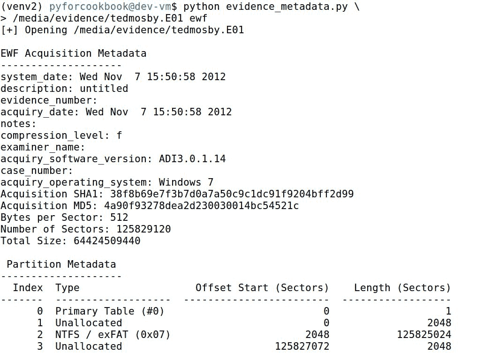
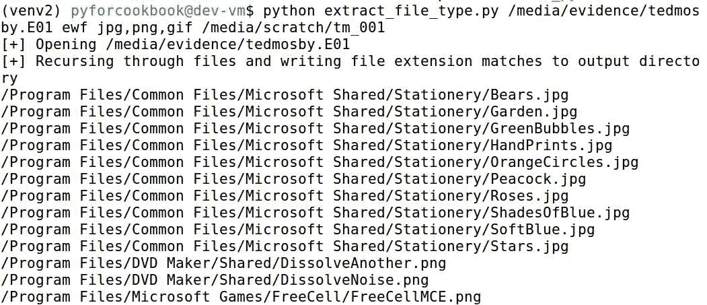

# 八、使用取证证据容器

在本章中，我们将介绍以下秘籍：

*   期初收购
*   收集采购和媒体信息
*   遍历文件
*   处理容器中的文件
*   搜索散列

# 介绍

Sleuth 工具包及其 Python 绑定`pytsk3`可能是最著名的 Python 取证库。该库为访问和操作文件系统提供了丰富的支持。在支持库（如`pyewf`的帮助下，它们可以用于处理常见的取证容器，如 EnCase 流行的`E01`格式。如果没有这些库（以及许多其他库），我们将内在地受到 Python 在取证中所能完成的工作的限制。由于`pytsk3`作为一个一体式文件系统分析工具的崇高目标，`pytsk3`可能是我们在本书中将使用的最复杂的库。

出于这个原因，我们专门为探索这个库的基础知识而编写了一些食谱。到目前为止，recipes 主要关注松散文件支持。大会到此结束。我们将定期使用该库与取证证据进行交互。了解如何与取证容器交互将使您的 Python 取证能力提升到一个新的水平。

在本章中，我们将学习如何安装`pytsk3`和`pyewf`，这两个库将允许我们分别利用 Sleuth Kit 和`E01`图像支持。此外，我们将学习如何执行基本任务，例如访问和打印分区表、遍历文件系统、按扩展名导出文件以及在证据容器中搜索已知的坏哈希。您将了解：

*   安装和设置`pytsk3`和`pyewf`
*   打开取证采集，如`raw`和`E01`文件
*   提取分区表数据和`E01`元数据
*   递归活动文件并创建活动文件列表电子表格
*   按文件扩展名从证据容器导出文件
*   在证据容器中搜索已知的错误哈希

Visit [www.packtpub.com/books/content/support](http://www.packtpub.com/books/content/support) to download the code bundle for this chapter.

# 期初收购

难度：中等

Python 版本：2.7

操作系统：Linux

随着`pyewf`和`pytsk3`的出现，我们必须首先学习一整套全新的工具和操作。在本食谱中，我们将从基础开始：打开证据容器。此秘籍支持`raw`和`E01`图像。请注意，与我们以前的脚本不同，由于在使用这些库的 Python3.X 版本时发现了一些错误，这些脚本将使用 Python2.X。也就是说，两个版本之间的主要逻辑不会有什么不同，并且可以很容易地进行移植。在学习打开容器之前，我们需要设置环境。我们将在下一节中对此进行探讨。

# 开始

除了一些脚本之外，在本食谱的大部分内容中，我们都是操作系统不可知论者。然而，在这里，我们将特别提供在 Ubuntu 16.04.2 上构建的说明。在新安装 Ubuntu 时，执行以下命令以安装必要的依赖项：

```py
sudo apt-get update && sudo apt-get -y upgrade 
sudo apt-get install python-pip git autoconf automake autopoint libtool pkg-config  
```

除了前面提到的两个库（`pytsk3`和`pyewf`，我们还将使用第三方模块`tabulate`将表格打印到控制台。因为这是最容易安装的模块，所以让我们先执行以下步骤来完成该任务：

```py
pip install tabulate==0.7.7
```

To learn more about the tabulate library, visit [https://pypi.python.org/pypi/tabulate](https://pypi.python.org/pypi/tabulate).

信不信由你，我们也可以使用`pip`安装`pytsk3`：

```py
pip install pytsk3==20170802
```

To learn more about the `pytsk3` library, visit [https://github.com/py4n6/pytsk.](https://github.com/py4n6/pytsk)

最后，对于`pyewf`，我们必须采取稍微迂回的路线，从其 GitHub 存储库[安装它 https://github.com/libyal/libewf/releases](https://github.com/libyal/libewf/releases) 。这些秘籍是使用`libewf-experimental-20170605`版本编写的，我们建议您在此处安装该版本。下载并提取包后，在提取的目录中打开命令提示符并执行以下操作：

```py
./synclibs.sh 
./autogen.sh 
sudo python setup.py build 
sudo python setup.py install 
```

To learn more about the `pyewf` library, visit : [https://github.com/libyal/libewf.](https://github.com/libyal/libewf)

不用说，对于这个脚本，您需要一个`raw`或`E01`证据文件来运行这些秘籍。对于第一个脚本，我们建议使用逻辑映像，例如来自[的`fat-img-kw.dd`http://dftt.sourceforge.net/test2/index.html](http://dftt.sourceforge.net/test2/index.html) 。原因是第一个脚本缺少一些必要的逻辑来处理物理磁盘映像及其分区。我们将在*采集采集和媒体信息*秘籍中介绍此功能。

# 怎么做。。。

我们采用以下方法打开取证证据容器：

1.  确定证据容器是`raw`图像还是`E01`容器。
2.  使用`pytsk3`访问图像。
3.  将根级别文件夹和文件的表打印到控制台。

# 它是如何工作的。。。

我们导入了许多库，以帮助进行参数解析、处理证据容器和文件系统，以及创建表格控制台数据。

```py
from __future__ import print_function
import argparse
import os
import pytsk3
import pyewf
import sys
from tabulate import tabulate
```

此秘籍的命令行处理程序采用两个位置参数`EVIDENCE_FILE`和`TYPE`，它们表示证据文件的路径和证据文件的类型（即`raw`或`ewf`。请注意，对于分段的`E01`文件，您只需要提供第一个`E01`的路径（假设其他拆分在同一目录中）。在对证据文件执行一些输入验证后，我们向`main()`函数提供两个提供的输入，并开始执行脚本。

```py
if __name__ == '__main__':
    parser = argparse.ArgumentParser(
        description=__description__,
        epilog="Developed by {} on {}".format(
            ", ".join(__authors__), __date__)
    )
    parser.add_argument("EVIDENCE_FILE", help="Evidence file path")
    parser.add_argument("TYPE",
                        help="Type of evidence: raw (dd) or EWF (E01)",
                        choices=("raw", "ewf"))
    parser.add_argument("-o", "--offset",
                        help="Partition byte offset", type=int)
    args = parser.parse_args()

    if os.path.exists(args.EVIDENCE_FILE) and \
            os.path.isfile(args.EVIDENCE_FILE):
        main(args.EVIDENCE_FILE, args.TYPE, args.offset)
    else:
        print("[-] Supplied input file {} does not exist or is not a "
              "file".format(args.EVIDENCE_FILE))
        sys.exit(1)
```

在`main()`函数中，我们首先检查正在处理的证据文件的类型。如果它是一个`E01`容器，我们需要先使用`pyewf`创建一个句柄，然后才能使用`pytsk3`访问它的内容。对于`raw`图像，我们可以使用`pytsk3`直接访问其内容，而无需先执行此中间步骤。

此处使用`pyewf.glob()`方法组合`E01`容器的所有段（如果有），并将段名称存储在列表中。一旦我们有了文件名列表，我们就可以创建`E01`句柄对象。然后我们可以使用此对象打开`filenames`。

```py
def main(image, img_type, offset):
    print("[+] Opening {}".format(image))
    if img_type == "ewf":
        try:
            filenames = pyewf.glob(image)
        except IOError:
            _, e, _ = sys.exc_info()
            print("[-] Invalid EWF format:\n {}".format(e))
            sys.exit(2)
        ewf_handle = pyewf.handle()
        ewf_handle.open(filenames)
```

接下来，我们必须将`ewf_handle`传递给`EWFImgInfo`类，该类将创建`pytsk3`对象。这里的 else 语句是针对可以使用`pytsk3.Img_Info`函数实现相同任务的`raw`图像的。现在让我们看一下`EWFImgInfo`类，了解 EWF 文件的处理方式略有不同。

```py
        # Open PYTSK3 handle on EWF Image
        img_info = EWFImgInfo(ewf_handle)
    else:
        img_info = pytsk3.Img_Info(image)
```

脚本的这个组件的代码来自 Python 开发页面的`pyewf`的*结合 pyewf**和 pytsk3*部分。

Learn more about `pyewf` functions, visit [https://github.com/libyal/libewf/wiki/Development](https://github.com/libyal/libewf/wiki/Development).

此`EWFImgInfo`类继承自`pytsk3.Img_Info`基类，属于`TSK_IMG_TYPE_EXTERNAL`类型。需要注意的是，接下来定义的三个功能，`close()`、`read()`和`get_size(),`都是`pytsk3`所需要的，以便与证据容器进行适当的交互。创建了这个简单的类后，我们现在可以将`pytsk3`与任何提供的`E01`文件一起使用。

```py
class EWFImgInfo(pytsk3.Img_Info):
    def __init__(self, ewf_handle):
        self._ewf_handle = ewf_handle
        super(EWFImgInfo, self).__init__(url="",
                                         type=pytsk3.TSK_IMG_TYPE_EXTERNAL)

    def close(self):
        self._ewf_handle.close()

    def read(self, offset, size):
        self._ewf_handle.seek(offset)
        return self._ewf_handle.read(size)

    def get_size(self):
        return self._ewf_handle.get_media_size()
```

回到`main()`函数，我们已经成功地为`raw`或`E01`图像创建了`pytsk3`处理程序。我们现在可以开始访问文件系统了。如前所述，此脚本设计用于处理逻辑映像，而不是物理映像。我们将在下一个秘籍中介绍对物理图像的支持。访问文件系统非常简单；我们通过调用`pytsk3`句柄上的`FS_Info()`函数来实现。

```py
    # Get Filesystem Handle
    try:
        fs = pytsk3.FS_Info(img_info, offset)
    except IOError:
        _, e, _ = sys.exc_info()
        print("[-] Unable to open FS:\n {}".format(e))
        exit()
```

通过访问文件系统，我们可以遍历根目录中的文件夹和文件。首先，我们在文件系统上使用`open_dir()`方法访问根目录，并指定根目录`**/**`作为输入。接下来，我们创建一个嵌套的列表结构来保存表内容，稍后我们将使用`tabulate`将其打印到控制台。此列表的第一个元素是该表的标题。

接下来，我们将开始对图像进行迭代，就像对任何 Python iterable 对象进行迭代一样。每个对象都有各种属性和函数，我们从这里开始使用它们。首先，我们使用`f.info.name.name`属性提取对象的名称。然后，我们使用`f.info.meta.type`属性检查是否正在处理目录或文件。如果这等于内置的`TSK_FS_META_TYPE_DIR`对象，那么我们将`f_type`变量设置为`DIR`；否则，发送至`FILE`。

最后，我们使用更多的属性来提取目录或文件大小，并创建和修改时间戳。请注意，对象时间戳存储在`Unix`时间中，如果您希望以人类可读的格式显示它们，则必须进行转换。提取这些属性后，我们将数据附加到`table`列表，并继续下一个对象。处理完根文件夹中的所有对象后，我们使用`tabulate`将数据打印到控制台。这在一行中通过向`tabulate()`方法提供列表并将`headers`关键字参数设置为`firstrow`来完成，以指示列表中的第一个元素应用作表头。

```py
    root_dir = fs.open_dir(path="/")
    table = [["Name", "Type", "Size", "Create Date", "Modify Date"]]
    for f in root_dir:
        name = f.info.name.name
        if f.info.meta.type == pytsk3.TSK_FS_META_TYPE_DIR:
            f_type = "DIR"
        else:
            f_type = "FILE"
        size = f.info.meta.size
        create = f.info.meta.crtime
        modify = f.info.meta.mtime
        table.append([name, f_type, size, create, modify])
    print(tabulate(table, headers="firstrow"))
```

运行脚本时，我们可以了解证据容器根目录下的文件和文件夹，如以下屏幕截图所示：


# 收集采购和媒体信息

难度：中等

Python 版本：2.7

操作系统：Linux

在这个秘籍中，我们学习如何使用`tabulate`查看和打印分区表。此外，对于`E01`容器，我们将打印存储在证据文件中的`E01`采集和容器元数据。通常，我们将处理给定机器的物理磁盘映像。在接下来的任何过程中，我们都需要迭代不同的分区（或用户选择的分区），以获得文件系统及其文件的句柄。因此，这个秘籍是至关重要的，因为我们建立在我们对侦探套件及其一系列功能的快速理解之上。

# 开始

有关`pytsk3`、`pyewf`和`tabulate`的构建环境和设置详细信息，请参阅*期初收购*秘籍中的*入门*部分。此脚本中使用的所有其他库都存在于 Python 的标准库中。

# 怎么做。。。

秘籍遵循以下基本步骤：

1.  确定证据容器是`raw`图像还是`E01`容器。
2.  使用`pytsk3`访问图像。
3.  如果适用，将`E01`元数据打印到控制台。
4.  将分区表数据打印到控制台。

# 它是如何工作的。。。

我们导入了许多库，以帮助进行参数解析、处理证据容器和文件系统，以及创建表格控制台数据。

```py
from __future__ import print_function
import argparse
import os
import pytsk3
import pyewf
import sys
from tabulate import tabulate
```

此秘籍的命令行处理程序采用两个位置参数`EVIDENCE_FILE`和`TYPE`，它们表示证据文件的路径和证据文件的类型。此外，如果用户在使用证据文件时遇到困难，他们可以使用可选的`p`开关手动提供分区。大多数情况下不需要此开关，但作为预防措施添加了此开关。执行输入验证检查后，我们将这三个参数传递给`main()`函数。

```py
if __name__ == '__main__':
    parser = argparse.ArgumentParser(
        description=__description__,
        epilog="Developed by {} on {}".format(
            ", ".join(__authors__), __date__)
    )
    parser.add_argument("EVIDENCE_FILE", help="Evidence file path")
    parser.add_argument("TYPE", help="Type of Evidence",
                        choices=("raw", "ewf"))
    parser.add_argument("-p", help="Partition Type",
                        choices=("DOS", "GPT", "MAC", "SUN"))
    args = parser.parse_args()

    if os.path.exists(args.EVIDENCE_FILE) and \
            os.path.isfile(args.EVIDENCE_FILE):
        main(args.EVIDENCE_FILE, args.TYPE, args.p)
    else:
        print("[-] Supplied input file {} does not exist or is not a "
              "file".format(args.EVIDENCE_FILE))
        sys.exit(1)
```

`main()`功能基本上与之前的秘籍相似，至少在最初是如此。我们必须首先创建`pyewf`句柄，然后使用`EWFImgInfo`类进行创建，如前面的`pytsk3`句柄所示。如果您想了解更多关于`EWFImgInfo`课程的信息，请参考*期初采集*秘籍。但是，请注意，我们添加了一个额外的行，调用`e01_metadata()`函数将`E01`元数据打印到控制台。现在让我们来探讨这个函数。

```py
def main(image, img_type, part_type):
    print("[+] Opening {}".format(image))
    if img_type == "ewf":
        try:
            filenames = pyewf.glob(image)
        except IOError:
            print("[-] Invalid EWF format:\n {}".format(e))
            sys.exit(2)

        ewf_handle = pyewf.handle()
        ewf_handle.open(filenames)
        e01_metadata(ewf_handle)

        # Open PYTSK3 handle on EWF Image
        img_info = EWFImgInfo(ewf_handle)
    else:
        img_info = pytsk3.Img_Info(image)
```

`e01_metadata()`功能主要依赖`get_header_values()`和`get_hash_values()`方法获取`E01`特定的元数据。`get_header_values()`方法为各种类型的采集和媒体元数据返回一个`key-value`对字典。我们使用一个循环遍历这个字典，并将`key-value`对打印到控制台。

类似地，我们使用带有`hashes`字典的循环将存储的图像采集哈希打印到控制台。最后，我们调用一个属性和几个函数来打印采集大小元数据。

```py
def e01_metadata(e01_image):
    print("\nEWF Acquisition Metadata")
    print("-" * 20)
    headers = e01_image.get_header_values()
    hashes = e01_image.get_hash_values()
    for k in headers:
        print("{}: {}".format(k, headers[k]))
    for h in hashes:
        print("Acquisition {}: {}".format(h, hashes[h]))
    print("Bytes per Sector: {}".format(e01_image.bytes_per_sector))
    print("Number of Sectors: {}".format(
        e01_image.get_number_of_sectors()))
    print("Total Size: {}".format(e01_image.get_media_size()))
```

至此，我们可以返回到`main()`函数。回想一下，在本章的第一个秘籍中，我们没有创建对物理采集的支持（这完全是有意的）。然而，现在我们在使用`Volume_Info()`函数时添加了这种支持。虽然`pytsk3`一开始可能让人望而生畏，但请欣赏我们目前介绍的主要功能中使用的命名约定的一致性：`Img_Info`、`FS_Info`和`Volume_Info`。这三个功能对于访问证据容器的内容至关重要。在这个秘籍中，我们不会使用`FS_Info()`函数，因为这里的目的只是打印分区表。

我们试图访问`try-except`块中的卷信息。首先，我们检查`p`开关是否由用户提供，如果是，则将该分区类型的属性分配给一个变量。然后，我们以`Volume_Info`方式提供它以及`pytsk3`手柄。否则，如果没有指定分区，我们将调用`Volume_Info`方法并仅为其提供`pytsk3`句柄对象。如果我们收到一个试图执行此操作的`IOError`，我们将异常捕获为`e`，并在退出之前将其打印到控制台。如果我们能够访问卷信息，我们将其传递到`part_metadata()`函数，以将分区数据打印到控制台。

```py
    try:
        if part_type is not None:
            attr_id = getattr(pytsk3, "TSK_VS_TYPE_" + part_type)
            volume = pytsk3.Volume_Info(img_info, attr_id)
        else:
            volume = pytsk3.Volume_Info(img_info)
    except IOError:
        _, e, _ = sys.exc_info()
        print("[-] Unable to read partition table:\n {}".format(e))
        sys.exit(3)
    part_metadata(volume)
```

`part_metadata()`功能在逻辑上相对较轻。我们创建一个嵌套的列表结构，如前一个秘籍中所示，第一个元素表示最终的表头。接下来，我们遍历 volume 对象，并将分区地址、类型、偏移量和长度附加到`table`列表中。在遍历分区之后，我们使用`tabulate`将此数据表打印到控制台，并使用`firstrow`作为表头。

```py
def part_metadata(vol):
    table = [["Index", "Type", "Offset Start (Sectors)",
              "Length (Sectors)"]]
    for part in vol:
        table.append([part.addr, part.desc.decode("utf-8"), part.start,
                      part.len])
    print("\n Partition Metadata")
    print("-" * 20)
    print(tabulate(table, headers="firstrow"))
```

运行此代码时，我们可以在控制台中查看有关采集和分区信息的信息（如果存在）：



# 遍历文件

难度：中等

Python 版本：2.7

操作系统：Linux

在这个秘籍中，我们学习如何递归文件系统并创建一个活动文件列表。通常，作为取证，我们经常被问到的第一个问题是“设备上有什么数据？”。这里有一个活动文件列表。在 Python 中，创建松散文件的文件列表是一项非常简单的任务。然而，这将稍微复杂一些，因为我们使用的是取证图像，而不是松散的文件。这个秘籍将成为未来脚本的基石，因为它将允许我们递归地访问和处理图像中的每个文件。正如您可能已经注意到的，本章的食谱是建立在彼此的基础上的，因为我们开发的每个功能都需要进一步探索图像。以类似的方式，此秘籍将成为未来秘籍中不可或缺的一部分，以迭代目录和流程文件。

# 开始

有关`pytsk3`和`pyewf`的构建环境和设置详细信息，请参阅*期初采集*秘籍中的*入门*部分。此脚本中使用的所有其他库都存在于 Python 的标准库中。

# 怎么做。。。

我们在此秘籍中执行以下步骤：

1.  确定证据容器是`raw`图像还是`E01`容器。
2.  使用`pytsk3`访问取证图像。
3.  递归每个分区中的所有目录。
4.  将文件元数据存储在列表中。
5.  将`active`文件列表写入 CSV。

# 它是如何工作的。。。

我们导入了许多库，以帮助进行参数解析、解析日期、创建 CSV 电子表格以及处理证据容器和文件系统。

```py
from __future__ import print_function
import argparse
import csv
from datetime import datetime
import os
import pytsk3
import pyewf
import sys
```

此秘籍的命令行处理程序采用三个位置参数，`EVIDENCE_FILE`、`TYPE`和`OUTPUT_CSV`，分别表示证据文件的路径、证据文件的类型和输出 CSV 文件。与前面的方法类似，可以提供可选的`p`开关来指定分区类型。我们使用`os.path.dirname()`方法提取 CSV 文件所需的输出目录路径，并使用`os.makedirs()`功能创建必要的输出目录（如果它们不存在）。

```py
if __name__ == '__main__':
    parser = argparse.ArgumentParser(
        description=__description__,
        epilog="Developed by {} on {}".format(
            ", ".join(__authors__), __date__)
    )
    parser.add_argument("EVIDENCE_FILE", help="Evidence file path")
    parser.add_argument("TYPE", help="Type of Evidence",
                        choices=("raw", "ewf"))
    parser.add_argument("OUTPUT_CSV", 
                        help="Output CSV with lookup results")
    parser.add_argument("-p", help="Partition Type",
                        choices=("DOS", "GPT", "MAC", "SUN"))
    args = parser.parse_args()

    directory = os.path.dirname(args.OUTPUT_CSV)
    if not os.path.exists(directory) and directory != "":
        os.makedirs(directory)
```

一旦我们通过检查输入证据文件是否存在并为文件来验证该文件，这四个参数将传递给`main()`函数。如果输入的初始验证存在问题，则会在脚本退出之前向控制台打印错误。

```py
    if os.path.exists(args.EVIDENCE_FILE) and \
            os.path.isfile(args.EVIDENCE_FILE):
        main(args.EVIDENCE_FILE, args.TYPE, args.OUTPUT_CSV, args.p)
    else:
        print("[-] Supplied input file {} does not exist or is not a "
              "file".format(args.EVIDENCE_FILE))
        sys.exit(1)
```

在`main()`函数中，我们用`None`实例化了 volume 变量，以避免以后在脚本中引用它时出错。在将状态消息打印到控制台后，我们检查证据类型是否为`E01`，以正确处理它并创建有效的`pyewf`句柄，如*期初采集*秘籍中更详细的说明。参考该秘籍了解更多详细信息，因为该部分功能相同。最终结果是为用户提供的证据文件创建`pytsk3`句柄`img_info`。

```py
def main(image, img_type, output, part_type):
    volume = None
    print("[+] Opening {}".format(image))
    if img_type == "ewf":
        try:
            filenames = pyewf.glob(image)
        except IOError:
            _, e, _ = sys.exc_info()
            print("[-] Invalid EWF format:\n {}".format(e))
            sys.exit(2)

        ewf_handle = pyewf.handle()
        ewf_handle.open(filenames)

        # Open PYTSK3 handle on EWF Image
        img_info = EWFImgInfo(ewf_handle)
    else:
        img_info = pytsk3.Img_Info(image)
```

接下来，我们尝试使用`pytsk3.Volume_Info()`方法通过提供图像句柄来访问图像的体积。如果提供了分区类型参数，则将其属性 ID 添加为第二个参数。如果我们在尝试访问卷时收到一个`IOError`，我们将异常捕获为`e`，并将其打印到控制台。但是，请注意，我们不会像收到错误时那样退出脚本。我们将在下一个函数中解释原因。最后，我们将`volume`、`img_info`和`output`变量传递给`open_fs()`方法。

```py
    try:
        if part_type is not None:
            attr_id = getattr(pytsk3, "TSK_VS_TYPE_" + part_type)
            volume = pytsk3.Volume_Info(img_info, attr_id)
        else:
            volume = pytsk3.Volume_Info(img_info)
    except IOError:
        _, e, _ = sys.exc_info()
        print("[-] Unable to read partition table:\n {}".format(e))

    open_fs(volume, img_info, output)
```

`open_fs()`方法尝试通过两种方式访问容器的文件系统。如果`volume`变量不是`None`，它将迭代每个分区，如果该分区满足某些条件，则尝试打开它。但是，如果`volume`变量是`None`，它将尝试直接调用图像句柄上的`pytsk3.FS_Info()`方法`img`。正如我们所看到的，后一种方法将起作用，并为我们提供对逻辑映像的文件系统访问，而前者适用于物理映像。让我们看看这两种方法之间的区别。

不管采用哪种方法，我们都会创建一个`recursed_data`列表来保存活动文件元数据。在第一个实例中，我们有一个物理映像，我们迭代每个分区，检查它是否大于`2,048`扇区，并且在其描述中不包含单词`Unallocated`、`Extended`或`Primary Table`。对于满足这些条件的分区，我们试图通过提供`pytsk3 img`对象和分区的偏移量（以字节为单位），使用`FS_Info()`函数访问它们的文件系统。

如果我们能够访问文件系统，我们将使用`open_dir()`方法获取根目录，并将其与分区地址 ID、文件系统对象、两个空列表和一个空字符串一起传递给`recurse_files()`方法。这些空列表和字符串将在对该函数的递归调用中发挥作用，我们将很快看到。一旦`recurse_files()`方法返回，我们将活动文件元数据附加到`recursed_data`列表中。我们对每个分区重复这个过程。

```py
def open_fs(vol, img, output):
    print("[+] Recursing through files..")
    recursed_data = []
    # Open FS and Recurse
    if vol is not None:
        for part in vol:
            if part.len > 2048 and "Unallocated" not in part.desc and \
                    "Extended" not in part.desc and \
                    "Primary Table" not in part.desc:
                try:
                    fs = pytsk3.FS_Info(
                        img, offset=part.start * vol.info.block_size)
                except IOError:
                    _, e, _ = sys.exc_info()
                    print("[-] Unable to open FS:\n {}".format(e))
                root = fs.open_dir(path="/")
                data = recurse_files(part.addr, fs, root, [], [], [""])
                recursed_data.append(data)
```

我们对第二个实例采用了类似的方法，其中我们有一个逻辑映像，其中卷为`None`。在本例中，我们尝试直接访问文件系统，如果成功，我们将其传递给`recurseFiles()`方法，并将返回的数据附加到`recursed_data`列表中。一旦我们有了活动文件列表，我们就将它和用户提供的输出文件路径发送到`csvWriter()`方法。让我们深入探讨`recurseFiles()`方法，这是本食谱的主要内容。

```py
    else:
        try:
            fs = pytsk3.FS_Info(img)
        except IOError:
            _, e, _ = sys.exc_info()
            print("[-] Unable to open FS:\n {}".format(e))
        root = fs.open_dir(path="/")
        data = recurse_files(1, fs, root, [], [], [""])
        recursed_data.append(data)
    write_csv(recursed_data, output)
```

`recurse_files()`功能基于*FLS*工具[的一个示例 https://github.com/py4n6/pytsk/blob/master/examples/fls.py](https://github.com/py4n6/pytsk/blob/master/examples/fls.py) 和 David Cowen 的工具 DFIR 向导（[https://github.com/dlcowen/dfirwizard/blob/master/dfirwizard-v9.py](https://github.com/dlcowen/dfirwizard/blob/master/dfirwizard-v9.py) 。要启动此函数，我们将根目录`inode`附加到`dirs`列表中。此列表稍后用于避免无休止的循环。接下来，我们开始循环根目录中的每个对象，检查它是否具有我们期望的某些属性，并且它的名称不是`"**.**"`或`"**..**"`。

```py
def recurse_files(part, fs, root_dir, dirs, data, parent):
    dirs.append(root_dir.info.fs_file.meta.addr)
    for fs_object in root_dir:
        # Skip ".", ".." or directory entries without a name.
        if not hasattr(fs_object, "info") or \
                not hasattr(fs_object.info, "name") or \
                not hasattr(fs_object.info.name, "name") or \
                fs_object.info.name.name in [".", ".."]:
            continue
```

如果对象通过了该测试，我们将使用`info.name.name`属性提取其名称。接下来，我们使用作为函数输入之一提供的`parent`变量手动创建该对象的文件路径。没有内置的方法或属性可以自动为我们执行此操作。

然后检查文件是否为目录，并将`f_type`变量设置为适当的类型。如果对象是一个文件，并且它有一个扩展名，我们提取它并将其存储在`file_ext`变量中。如果我们在试图提取此数据时遇到`AttributeError`，我们将继续下一个对象。

```py
        try:
            file_name = fs_object.info.name.name
            file_path = "{}/{}".format(
                "/".join(parent), fs_object.info.name.name)
            try:
                if fs_object.info.meta.type == pytsk3.TSK_FS_META_TYPE_DIR:
                    f_type = "DIR"
                    file_ext = ""
                else:
                    f_type = "FILE"
                    if "." in file_name:
                        file_ext = file_name.rsplit(".")[-1].lower()
                    else:
                        file_ext = ""
            except AttributeError:
                continue
```

与本章中的第一个秘籍类似，我们为对象大小和时间戳创建变量。但是，请注意，我们将日期传递给`convert_time()`方法。此函数用于将`Unix`时间戳转换为人类可读的格式。提取这些属性后，我们使用分区地址 ID 将它们附加到数据列表中，以确保跟踪对象来自哪个分区。

```py
            size = fs_object.info.meta.size
            create = convert_time(fs_object.info.meta.crtime)
            change = convert_time(fs_object.info.meta.ctime)
            modify = convert_time(fs_object.info.meta.mtime)
            data.append(["PARTITION {}".format(part), file_name, file_ext,
                         f_type, create, change, modify, size, file_path])
```

如果对象是一个目录，我们需要递归访问它的所有子目录和文件。为此，我们将目录名附加到`parent`列表中。然后，我们使用`as_directory()`方法创建一个目录对象。我们在这里使用`inode`，无论出于何种目的，它都是一个唯一的编号，并检查`inode`是否已经在`dirs`列表中。如果是这样的话，我们就不会处理这个目录，因为它已经被处理过了。

如果目录需要处理，我们在新的`sub_directory`上调用`recurse_files()`方法，并将当前的`dirs`、`data`和`parent`变量传递给它。一旦我们处理了一个给定的目录，我们就会从`parent`列表中弹出该目录。否则将导致错误的文件路径详细信息，因为除非删除，否则所有以前的目录将继续在路径中引用。

这个函数的大部分在一个大的`try-except`块中。我们传递在此过程中生成的任何`IOError`异常。遍历所有子目录后，我们将数据列表返回给`open_fs()`函数。

```py
            if f_type == "DIR":
                parent.append(fs_object.info.name.name)
                sub_directory = fs_object.as_directory()
                inode = fs_object.info.meta.addr

                # This ensures that we don't recurse into a directory
                # above the current level and thus avoid circular loops.
                if inode not in dirs:
                    recurse_files(part, fs, sub_directory, dirs, data,
                                  parent)
                parent.pop(-1)

        except IOError:
            pass
    dirs.pop(-1)
    return data
```

让我们简单地看一下`convert_time()`函数。我们以前见过这种类型的函数：如果`Unix`时间戳不是`0`，我们使用`datetime.utcfromtimestamp()`方法将时间戳转换为人类可读的格式。

```py
def convert_time(ts):
    if str(ts) == "0":
        return ""
    return datetime.utcfromtimestamp(ts)
```

有了列出数据的活动文件，我们现在可以使用`write_csv()`方法将其写入 CSV 文件。如果我们确实找到了数据（即列表不是空的），我们将打开输出 CSV 文件，写入标题，并在`data`变量中循环遍历每个列表。我们使用`csvwriterows()`方法将每个嵌套列表结构写入 CSV 文件。

```py
def write_csv(data, output):
    if data == []:
        print("[-] No output results to write")
        sys.exit(3)

    print("[+] Writing output to {}".format(output))
    with open(output, "wb") as csvfile:
        csv_writer = csv.writer(csvfile)
        headers = ["Partition", "File", "File Ext", "File Type",
                   "Create Date", "Modify Date", "Change Date", "Size",
                   "File Path"]
        csv_writer.writerow(headers)
        for result_list in data:
            csv_writer.writerows(result_list)
```

以下屏幕截图演示了此秘籍从取证图像中提取的数据类型：


# 还有更多。。。

这个脚本可以进一步改进。我们提供了以下一项或多项建议：

*   使用`tqdm`或其他库创建进度条，通知用户当前执行进度
*   了解可使用`pytsk3`从文件系统对象提取的其他元数据值，并将其添加到输出 CSV 文件中

# 处理容器中的文件

难度：中等

Python 版本：2.7

操作系统：Linux

现在我们可以遍历文件系统了，让我们看看如何按照我们习惯的方式创建文件对象。在这个方法中，我们创建了一个简单的分类脚本，用于提取与指定文件扩展名匹配的文件，并将其复制到输出目录，同时保留其原始文件路径。

# 开始

有关`pytsk3`和`pyewf`的构建环境和设置详细信息，请参阅*期初采集*秘籍中的*入门*部分。此脚本中使用的所有其他库都存在于 Python 的标准库中。

# 怎么做。。。

我们将在此秘籍中执行以下步骤：

1.  确定证据容器是`raw`图像还是`E01`容器。
2.  使用`pytsk3`访问图像。
3.  递归每个分区中的所有目录。
4.  检查文件扩展名是否与提供的文件扩展名匹配。
5.  将具有保留文件夹结构的响应文件写入输出目录。

# 它是如何工作的。。。

我们导入了大量库，以协助参数解析、创建 CSV 电子表格以及处理证据容器和文件系统。

```py
from __future__ import print_function
import argparse
import csv
import os
import pytsk3
import pyewf
import sys
```

此秘籍的命令行处理程序采用四个位置参数：`EVIDENCE_FILE`、`TYPE`、`EXT`和`OUTPUT_DIR`。它们分别是证据文件本身、证据文件的类型、要提取的扩展名的逗号分隔列表以及所需的输出目录。我们还有可选的`p`开关来手动指定分区类型。

```py
if __name__ == '__main__':
    parser = argparse.ArgumentParser(
        description=__description__,
        epilog="Developed by {} on {}".format(
            ", ".join(__authors__), __date__)
    )
    parser.add_argument("EVIDENCE_FILE", help="Evidence file path")
    parser.add_argument("TYPE", help="Type of Evidence",
                        choices=("raw", "ewf"))
    parser.add_argument("EXT",
                        help="Comma-delimited file extensions to extract")
    parser.add_argument("OUTPUT_DIR", help="Output Directory")
    parser.add_argument("-p", help="Partition Type",
                        choices=("DOS", "GPT", "MAC", "SUN"))
    args = parser.parse_args()
```

在调用`main()`函数之前，我们创建任何必要的输出目录，并执行标准的输入验证步骤。验证输入后，我们将提供的参数传递给`main()`函数。

```py
    if not os.path.exists(args.OUTPUT_DIR):
        os.makedirs(args.OUTPUT_DIR)

    if os.path.exists(args.EVIDENCE_FILE) and \
            os.path.isfile(args.EVIDENCE_FILE):
        main(args.EVIDENCE_FILE, args.TYPE, args.EXT, args.OUTPUT_DIR,
             args.p)
    else:
        print("[-] Supplied input file {} does not exist or is not a "
              "file".format(args.EVIDENCE_FILE))
        sys.exit(1)
```

`main()`函数、`EWFImgInfo`类和`open_fs()`函数已在之前的秘籍中介绍过。回想一下，本章在前面的方法的基础上，采用了一种更加迭代的方法。有关每个功能和`EWFImgInfo`类的更详细说明，请参阅前面的秘籍。让我们再次简要地展示这两个函数，以避免逻辑上的跳跃。

在`main()`函数中，我们检查证据文件是`raw`文件还是`E01`文件。然后，我们执行必要的步骤，最终在证据文件上创建一个`pytsk3`句柄。有了这个句柄，我们尝试使用手动提供的分区类型（如果提供的话）访问卷。如果我们能够打开音量，我们将`pytsk3`手柄和音量传递给`open_fs()`方法。

```py
def main(image, img_type, ext, output, part_type):
    volume = None
    print("[+] Opening {}".format(image))
    if img_type == "ewf":
        try:
            filenames = pyewf.glob(image)
        except IOError:
            _, e, _ = sys.exc_info()
            print("[-] Invalid EWF format:\n {}".format(e))
            sys.exit(2)

        ewf_handle = pyewf.handle()
        ewf_handle.open(filenames)

        # Open PYTSK3 handle on EWF Image
        img_info = EWFImgInfo(ewf_handle)
    else:
        img_info = pytsk3.Img_Info(image)

    try:
        if part_type is not None:
            attr_id = getattr(pytsk3, "TSK_VS_TYPE_" + part_type)
            volume = pytsk3.Volume_Info(img_info, attr_id)
        else:
            volume = pytsk3.Volume_Info(img_info)
    except IOError:
        _, e, _ = sys.exc_info()
        print("[-] Unable to read partition table:\n {}".format(e))

    open_fs(volume, img_info, ext, output)
```

在`open_fs()`函数中，我们使用逻辑来支持访问文件系统以进行逻辑和物理采集。对于逻辑采集，我们可以简单地尝试访问`pytsk3`句柄上文件系统的根。另一方面，对于物理采集，我们必须迭代每个分区，并尝试访问符合某些标准的文件系统。一旦我们访问了文件系统，我们调用`recurse_files()`方法来迭代文件系统中的所有文件。

```py
def open_fs(vol, img, ext, output):
    # Open FS and Recurse
    print("[+] Recursing through files and writing file extension matches "
          "to output directory")
    if vol is not None:
        for part in vol:
            if part.len > 2048 and "Unallocated" not in part.desc \
                    and "Extended" not in part.desc \
                    and "Primary Table" not in part.desc:
                try:
                    fs = pytsk3.FS_Info(
                        img, offset=part.start * vol.info.block_size)
                except IOError:
                    _, e, _ = sys.exc_info()
                    print("[-] Unable to open FS:\n {}".format(e))
                root = fs.open_dir(path="/")
                recurse_files(part.addr, fs, root, [], [""], ext, output)
    else:
        try:
            fs = pytsk3.FS_Info(img)
        except IOError:
            _, e, _ = sys.exc_info()
            print("[-] Unable to open FS:\n {}".format(e))
        root = fs.open_dir(path="/")
        recurse_files(1, fs, root, [], [""], ext, output)
```

别在这儿撇了！该秘籍的新逻辑包含在`recurse_files()`方法中。这有点像眨眼，你会错过的。我们已经用前面的方法完成了繁重的工作，现在我们可以像对待其他 Python 文件一样对待这些文件。让我们看看它是如何工作的。

诚然，该函数的第一部分与以前一样，只有一个例外。在函数的第一行，我们使用列表理解来拆分用户提供的每个逗号分隔的扩展名，删除所有空格，并将字符串规范化为小写。当我们遍历每个对象时，我们检查对象是目录还是文件。如果它是一个文件，我们将文件的扩展名分离并规范化为小写，并将其存储在一个`file_ext`变量中。

```py
def recurse_files(part, fs, root_dir, dirs, parent, ext, output):
    extensions = [x.strip().lower() for x in ext.split(',')]
    dirs.append(root_dir.info.fs_file.meta.addr)
    for fs_object in root_dir:
        # Skip ".", ".." or directory entries without a name.
        if not hasattr(fs_object, "info") or \
                not hasattr(fs_object.info, "name") or \
                not hasattr(fs_object.info.name, "name") or \
                fs_object.info.name.name in [".", ".."]:
            continue
        try:
            file_name = fs_object.info.name.name
            file_path = "{}/{}".format("/".join(parent),
                                       fs_object.info.name.name)
            try:
                if fs_object.info.meta.type == pytsk3.TSK_FS_META_TYPE_DIR:
                    f_type = "DIR"
                    file_ext = ""
                else:
                    f_type = "FILE"
                    if "." in file_name:
                        file_ext = file_name.rsplit(".")[-1].lower()
                    else:
                        file_ext = ""
            except AttributeError:
                continue
```

接下来，我们检查提取文件的扩展名是否在用户提供的列表中。如果是，我们将文件对象本身及其名称、扩展名、路径和所需的输出目录传递给`file_writer()`方法进行输出。请注意，在这个操作中，我们有逻辑（在前面的秘籍中讨论过），递归地处理任何子目录，以识别更多符合扩展标准的潜在文件。到目前为止，一切顺利；现在让我们看一下最后一个函数。

```py
            if file_ext.strip() in extensions:
                print("{}".format(file_path))
                file_writer(fs_object, file_name, file_ext, file_path,
                            output)
            if f_type == "DIR":
                parent.append(fs_object.info.name.name)
                sub_directory = fs_object.as_directory()
                inode = fs_object.info.meta.addr
                if inode not in dirs:
                    recurse_files(part, fs, sub_directory, dirs,
                                  parent, ext, output)
                    parent.pop(-1)
        except IOError:
            pass
    dirs.pop(-1)
```

`file_writer()`方法依赖于文件对象的`read_random()`方法来访问文件内容。但是，在此之前，我们首先通过将用户提供的输出与文件的扩展名和路径相结合来设置文件的输出路径。然后，如果这些目录不存在，我们将创建它们。接下来，我们以`"w"`模式打开输出文件，现在准备将文件内容写入输出文件。正如这里使用的，`read_random()`函数接受两个输入：要开始读取的文件中的字节偏移量和要读取的字节数。在本例中，由于我们希望读取整个文件，因此我们使用整数`0`作为第一个参数，文件大小作为第二个参数。

我们直接将其提供给`write()`方法，不过注意，如果我们要对该文件执行任何处理，我们可以将其读入一个变量，然后从那里处理该文件。另外，请注意，对于包含大型文件的证据容器，将整个文件读入内存的过程可能并不理想。在这种情况下，您可能希望分块读取和写入此文件，而不是一次全部读取和写入。

```py
def file_writer(fs_object, name, ext, path, output):
    output_dir = os.path.join(output, ext,
                              os.path.dirname(path.lstrip("//")))
    if not os.path.exists(output_dir):
        os.makedirs(output_dir)
    with open(os.path.join(output_dir, name), "w") as outfile:
        outfile.write(fs_object.read_random(0, fs_object.info.meta.size))
```

运行此脚本时，我们会看到基于提供的扩展名的响应文件：



此外，我们可以在定义的结构中查看这些文件，如以下屏幕截图所示：


# 搜索散列

秘籍难度：难

Python 版本：2.7

操作系统：Linux

在这个秘籍中，我们创建了另一个分类脚本，这次重点是识别与提供的哈希值匹配的文件。此脚本获取一个包含`MD5`、`SHA-1`或`SHA-256`散列的文本文件，用换行符分隔，并在证据容器中搜索这些散列。使用此秘籍，我们将能够快速处理证据文件，找到感兴趣的文件，并通过将文件路径打印到控制台来提醒用户。

# 开始

有关`pytsk3`和`pyewf`的`build`环境和设置详细信息，请参阅*期初采集*秘籍中的*入门*部分。此脚本中使用的所有其他库都存在于 Python 的标准库中。

# 怎么做。。。

我们采用以下方法来实现我们的目标：

1.  确定证据容器是`raw`图像还是`E01`容器。
2.  使用`pytsk3`访问图像。
3.  递归每个分区中的所有目录。
4.  使用适当的哈希算法发送要哈希的每个文件。
5.  检查哈希是否与提供的其中一个匹配，如果匹配，则打印到控制台。

# 它是如何工作的。。。

我们导入了许多库，以帮助进行参数解析、创建 CSV 电子表格、散列文件、处理证据容器和文件系统以及创建进度条。

```py
from __future__ import print_function
import argparse
import csv
import hashlib
import os
import pytsk3
import pyewf
import sys
from tqdm import tqdm
```

此秘籍的命令行处理程序采用三个位置参数，`EVIDENCE_FILE`、`TYPE`和`HASH_LIST`，分别表示要搜索的证据文件、证据文件的类型和以换行符分隔的哈希列表。如有必要，用户也可以使用`p`开关手动提供分区类型。

```py
if __name__ == '__main__':
    parser = argparse.ArgumentParser(
        description=__description__,
        epilog="Developed by {} on {}".format(
            ", ".join(__authors__), __date__)
    )
    parser.add_argument("EVIDENCE_FILE", help="Evidence file path")
    parser.add_argument("TYPE", help="Type of Evidence",
                        choices=("raw", "ewf"))
    parser.add_argument("HASH_LIST",
                        help="Filepath to Newline-delimited list of "
                             "hashes (either MD5, SHA1, or SHA-256)")
    parser.add_argument("-p", help="Partition Type",
                        choices=("DOS", "GPT", "MAC", "SUN"))
    parser.add_argument("-t", type=int,
                        help="Total number of files, for the progress bar")
    args = parser.parse_args()
```

解析输入后，我们对证据文件和哈希列表执行典型的输入验证检查。如果通过，我们调用`main()`函数，并向其提供用户提供的输入。

```py
    if os.path.exists(args.EVIDENCE_FILE) and \
            os.path.isfile(args.EVIDENCE_FILE) and \
            os.path.exists(args.HASH_LIST) and \
            os.path.isfile(args.HASH_LIST):
        main(args.EVIDENCE_FILE, args.TYPE, args.HASH_LIST, args.p, args.t)
    else:
        print("[-] Supplied input file {} does not exist or is not a "
              "file".format(args.EVIDENCE_FILE))
        sys.exit(1)
```

与前面的秘籍一样，`main()`函数、`EWFImgInfo`类和`open_fs()`函数与前面的秘籍几乎相同。有关这些功能的更详细说明，请参阅前面的秘籍。`main()`函数的一个新添加是第一行，我们称之为`read_hashes()`方法。此方法读取输入哈希列表并返回哈希列表和哈希类型（即，`MD5`、`SHA-1`或`SHA-256`）。

除此之外，`main()`函数按照我们习惯看到的方式进行。首先，它确定正在使用哪种类型的证据文件，以便在图像上创建`pytsk3`句柄。然后，它使用该句柄并尝试访问图像卷。此过程完成后，变量将发送到`open_fs()`函数进行进一步处理。

```py
def main(image, img_type, hashes, part_type, pbar_total=0):
    hash_list, hash_type = read_hashes(hashes)
    volume = None
    print("[+] Opening {}".format(image))
    if img_type == "ewf":
        try:
            filenames = pyewf.glob(image)
        except IOError:
            _, e, _ = sys.exc_info()
            print("[-] Invalid EWF format:\n {}".format(e))
            sys.exit(2)

        ewf_handle = pyewf.handle()
        ewf_handle.open(filenames)

        # Open PYTSK3 handle on EWF Image
        img_info = EWFImgInfo(ewf_handle)
    else:
        img_info = pytsk3.Img_Info(image)

    try:
        if part_type is not None:
            attr_id = getattr(pytsk3, "TSK_VS_TYPE_" + part_type)
            volume = pytsk3.Volume_Info(img_info, attr_id)
        else:
            volume = pytsk3.Volume_Info(img_info)
    except IOError:
        _, e, _ = sys.exc_info()
        print("[-] Unable to read partition table:\n {}".format(e))

    open_fs(volume, img_info, hash_list, hash_type, pbar_total)
```

让我们快速了解一个新函数，`read_hashes()`方法。首先，我们分别将`hash_list`和`hash_type`变量实例化为空列表和`None`对象。接下来，我们打开并迭代输入哈希列表，并将每个哈希添加到列表中。当我们这样做时，如果`hash_type`变量仍然是`None`，我们将检查行的长度，作为确定应该使用的哈希算法类型的一种方法。

在此过程结束时，如果出于任何原因，`hash_type`变量仍然是`None`，则哈希列表必须由我们不支持的哈希组成，因此我们在将错误打印到控制台后退出脚本。

```py
def read_hashes(hashes):
    hash_list = []
    hash_type = None
    with open(hashes) as infile:
        for line in infile:
            if hash_type is None:
                if len(line.strip()) == 32:
                    hash_type = "md5"
                elif len(line.strip()) == 40:
                    hash_type == "sha1"
                elif len(line.strip()) == 64:
                    hash_type == "sha256"
            hash_list.append(line.strip().lower())
    if hash_type is None:
        print("[-] No valid hashes identified in {}".format(hashes))
        sys.exit(3)

    return hash_list, hash_type
```

`open_fs()`方法功能与之前秘籍相同。它尝试使用两种不同的方法来访问物理和逻辑文件系统。一旦成功，它会将这些文件系统传递给`recurse_files()`方法。与上一个秘籍一样，神奇发生在这个函数中。我们还加入了一个带有`tqdm`的进度条，以向用户提供反馈，因为可能需要一段时间来散列图像中的所有文件。

```py
def open_fs(vol, img, hashes, hash_type, pbar_total=0):
    # Open FS and Recurse
    print("[+] Recursing through and hashing files")
    pbar = tqdm(desc="Hashing", unit=" files",
                unit_scale=True, total=pbar_total)
    if vol is not None:
        for part in vol:
            if part.len > 2048 and "Unallocated" not in part.desc and \
                    "Extended" not in part.desc and \
                    "Primary Table" not in part.desc:
                try:
                    fs = pytsk3.FS_Info(
                        img, offset=part.start * vol.info.block_size)
                except IOError:
                    _, e, _ = sys.exc_info()
                    print("[-] Unable to open FS:\n {}".format(e))
                root = fs.open_dir(path="/")
                recurse_files(part.addr, fs, root, [], [""], hashes,
                              hash_type, pbar)
    else:
        try:
            fs = pytsk3.FS_Info(img)
        except IOError:
            _, e, _ = sys.exc_info()
            print("[-] Unable to open FS:\n {}".format(e))
        root = fs.open_dir(path="/")
        recurse_files(1, fs, root, [], [""], hashes, hash_type, pbar)
    pbar.close()
```

在`recurse_files()`方法中，我们迭代所有子目录并散列每个文件。我们跳过`.`和`..`目录项，并检查`fs_object`是否具有正确的属性。如果是这样，我们将构建文件路径，以便在输出中使用。

```py
def recurse_files(part, fs, root_dir, dirs, parent, hashes,
                  hash_type, pbar):
    dirs.append(root_dir.info.fs_file.meta.addr)
    for fs_object in root_dir:
        # Skip ".", ".." or directory entries without a name.
        if not hasattr(fs_object, "info") or \
                not hasattr(fs_object.info, "name") or \
                not hasattr(fs_object.info.name, "name") or \
                fs_object.info.name.name in [".", ".."]:
            continue
        try:
            file_path = "{}/{}".format("/".join(parent),
                                       fs_object.info.name.name)
```

在执行每个迭代时，我们确定哪些对象是文件而不是目录。对于发现的每个文件，我们将其连同路径、哈希列表和哈希算法一起发送到`hash_file()`方法。`recurse_files()`函数逻辑的其余部分专门设计用于处理目录，并对任何子目录对此函数进行递归调用，以确保遍历整个树并且不会丢失文件。

```py
            if getattr(fs_object.info.meta, "type", None) == \
                    pytsk3.TSK_FS_META_TYPE_DIR:
                parent.append(fs_object.info.name.name)
                sub_directory = fs_object.as_directory()
                inode = fs_object.info.meta.addr

                # This ensures that we don't recurse into a directory
                # above the current level and thus avoid circular loops.
                if inode not in dirs:
                    recurse_files(part, fs, sub_directory, dirs,
                                  parent, hashes, hash_type, pbar)
                    parent.pop(-1)
            else:
                hash_file(fs_object, file_path, hashes, hash_type, pbar)

        except IOError:
            pass
    dirs.pop(-1)
```

`hash_file()`方法首先根据`hash_type`变量检查要创建哪种类型的哈希算法实例。在确定了该值并将文件大小更新到进度条后，我们使用`read_random()`方法将文件数据读入哈希对象。同样，我们通过从第一个字节开始读取并读取整个文件的大小来读取整个文件的内容。我们使用 hash 对象上的`hexdigest()`函数生成文件的 hash，然后检查该 hash 是否在我们提供的 hash 列表中。如果是，我们通过打印文件路径来提醒用户，使用`pbar.write()`防止进度条显示问题，并将名称发送到控制台。

```py
def hash_file(fs_object, path, hashes, hash_type, pbar):
    if hash_type == "md5":
        hash_obj = hashlib.md5()
    elif hash_type == "sha1":
        hash_obj = hashlib.sha1()
    elif hash_type == "sha256":
        hash_obj = hashlib.sha256()
    f_size = getattr(fs_object.info.meta, "size", 0)
    pbar.set_postfix(File_Size="{:.2f}MB".format(f_size / 1024.0 / 1024))
    hash_obj.update(fs_object.read_random(0, f_size))
    hash_digest = hash_obj.hexdigest()
    pbar.update()

    if hash_digest in hashes:
        pbar.write("[*] MATCH: {}\n{}".format(path, hash_digest))
```

通过运行脚本，我们将看到一个漂亮的进度条，显示哈希状态和与提供的哈希列表匹配的文件列表，如以下屏幕截图所示：


# 还有更多。。。

这个脚本可以进一步改进。我们提供了以下一项或多项建议：

*   不要打印匹配项，而是创建一个包含元数据的匹配文件的 CSV 以供查看
*   添加可选开关以将匹配文件转储到输出目录（保留文件夹路径）