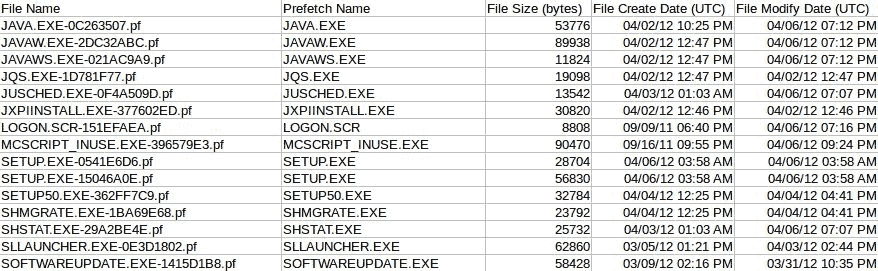
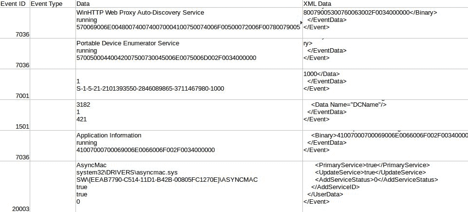
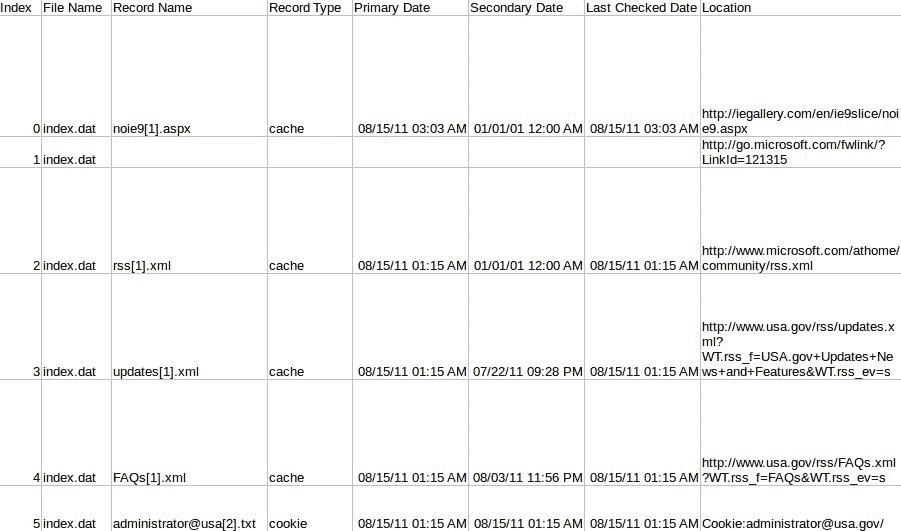
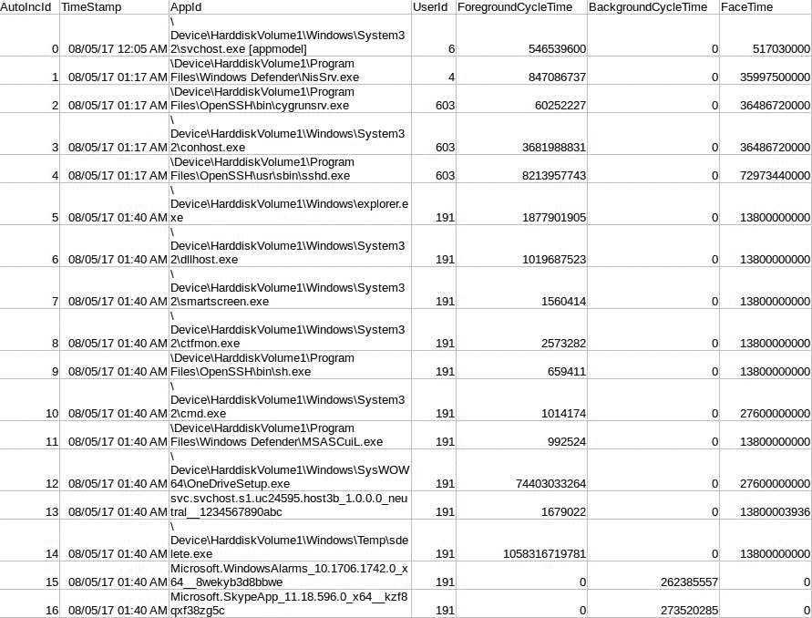
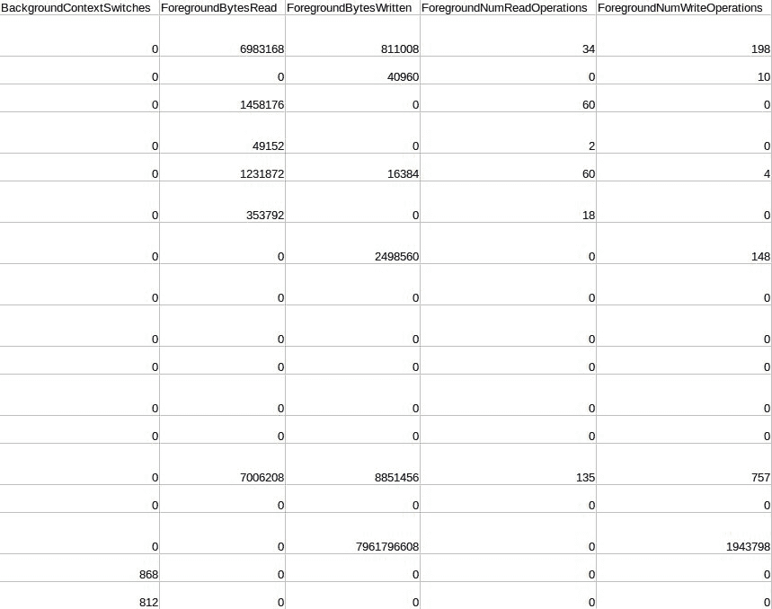

# 探索 Windows 法医人工制品配方-第二部分

本章将介绍以下配方：

*   解析预取文件
*   一连串的幸运事件
*   索引互联网历史
*   昔日的影子
*   剖析 SRUM 数据库

# 介绍

Microsoft Windows 是法医分析过程中在计算机上发现的最常见的操作系统之一。在过去的二十年中，这导致了社区中的一项巨大努力，即开发、共享和记录此操作系统存储的工件，以用于法医案例工作。

在本章中，我们将继续研究各种 Windows 工件以及如何使用 Python 处理它们。我们将利用我们在[第 8 章](08.html#75QNI0-260f9401d2714cb9ab693c4692308abe)中开发的框架*使用法医证据容器配方*直接处理法医采集的这些人工制品。我们将使用各种`libyal`库来处理各种文件的底层处理，包括`pyevt`、`pyevtx`、`pymsiecf`、`pyvshadow`和`pyesedb`。我们还将探讨如何使用`struct`和偏移量和感兴趣的数据类型的文件格式表来处理预取文件。以下是我们将在本章中学习的内容：

*   分析应用程序执行信息的预取文件
*   搜索事件日志并将事件提取到电子表格
*   从`index.dat`文件中提取互联网历史记录
*   枚举和创建卷影副本的文件列表
*   剖析 Windows10SRUM 数据库

For a full listing of `libyal` repositories, visit [https://github.com/libyal](https://github.com/libyal). Visit [www.packtpub.com/books/content/support](http://www.packtpub.com/books/content/support) to download the code bundle for this chapter.

# 解析预取文件

难度：中等

Python 版本：2.7

操作系统：Linux

预回迁文件是获取有关应用程序执行信息的常用工件。虽然它们可能并不总是存在，但毫无疑问，在它们存在的场景中，它们值得回顾。回想一下，根据`SYSTEM`配置单元中`PrefetchParameters`子键的值，可以在不同程度上启用或禁用预取。此方法搜索具有预回迁扩展名（`.pf`的文件，并处理它们以获取有价值的应用程序信息。我们将仅针对 Windows XP 预取文件演示此过程；但是，请注意，我们使用的底层过程与 Windows 的其他迭代类似。

# 开始

因为我们已经决定在 Ubuntu 环境中构建 Sleuth 工具包及其依赖项，所以我们继续开发该操作系统，以便于使用。此脚本将需要安装三个附加库（如果尚未安装）：`pytsk3`、`pyewf`和`unicodecsv`。此脚本中使用的所有其他库都存在于 Python 的标准库中。

有关安装`pytsk3`和`pyewf`模块*的详细说明，请参阅*[第 8 章](08.html#75QNI0-260f9401d2714cb9ab693c4692308abe)，使用法医证据容器配方*。*因为我们正在 Python2.x 中开发这些配方，所以我们可能会遇到 Unicode 编码和解码错误。为了说明这一点，我们使用`unicodecsv`库编写本章中的所有 CSV 输出。与 Python2.x 的标准`csv`模块不同，这个第三方模块负责 Unicode 支持，并将在这里大量使用。通常，我们可以使用`pip`安装`unicodecsv`：

```py
pip install unicodecsv==0.14.1
```

除此之外，我们将继续使用从[第 8 章](https://cdp.packtpub.com/python_digital_forensics_cookbook/wp-admin/post.php?post=260&action=edit#post_218)、*开发的`pytskutil`模块，使用法医证据容器配方*、*、*与法医采集进行交互。本模块与我们之前编写的内容基本相似，只是做了一些小改动，以更好地满足我们的目的。您可以通过导航到代码包中的实用程序目录来查看代码。

# 怎么做。。。

我们按照以下基本原则处理预取文件：

1.  扫描以`.pf`扩展名结尾的文件。
2.  通过签名验证消除误报。
3.  解析 Windows XP 预取文件格式。
4.  为当前工作目录创建分析结果的电子表格。

# 它是如何工作的。。。

我们导入了许多库来帮助进行参数解析、解析日期、解释二进制数据、编写 CSV 和自定义`pytskutil`模块。

```py
from __future__ import print_function
import argparse
from datetime import datetime, timedelta
import os
import pytsk3
import pyewf
import struct
import sys
import unicodecsv as csv
from utility.pytskutil import TSKUtil
```

此配方的命令行处理程序采用两个位置参数`EVIDENCE_FILE`和`TYPE`，它们表示证据文件的路径和证据文件的类型（即`raw`或`ewf`。本章中介绍的大多数配方仅采用两种位置输入。这些配方的输出将是在当前工作目录中创建的电子表格。此配方有一个可选参数`d`，用于指定扫描预回迁文件的路径。默认情况下，这被设置为`/Windows/Prefetch`目录，尽管用户可以选择扫描整个图像或单独的目录（如果需要）。在对证据文件执行一些输入验证后，我们向`main()`函数提供三个输入，并开始执行脚本：

```py
if __name__ == "__main__":
    parser = argparse.ArgumentParser(
        description=__description__,
        epilog="Developed by {} on {}".format(
            ", ".join(__authors__), __date__)
    )
    parser.add_argument("EVIDENCE_FILE", help="Evidence file path")
    parser.add_argument("TYPE", help="Type of Evidence",
                        choices=("raw", "ewf"))
    parser.add_argument("OUTPUT_CSV", help="Path to write output csv")
    parser.add_argument("-d", help="Prefetch directory to scan",
                        default="/WINDOWS/PREFETCH")
    args = parser.parse_args()

    if os.path.exists(args.EVIDENCE_FILE) and \
            os.path.isfile(args.EVIDENCE_FILE):
        main(args.EVIDENCE_FILE, args.TYPE, args.OUTPUT_CSV, args.d)
    else:
        print("[-] Supplied input file {} does not exist or is not a "
              "file".format(args.EVIDENCE_FILE))
        sys.exit(1)
```

在`main()`函数中，我们首先创建`TSKUtil`对象`tsk_util`，它代表`pytsk3`图像对象。使用`TSKUtil`对象，我们可以调用许多帮助函数来直接与证据文件交互。我们使用`TSKUtil.query_directory()`函数来确认指定的目录是否存在。如果有，我们使用`TSKUtil.recurse_files()`方法递归指定目录，并识别以`.pf`扩展名结尾的任何文件。此方法返回一个元组列表，其中每个元组包含许多可能有用的对象，包括`filename`、路径和对象本身。如果未找到此类文件，则返回`None`。

```py
def main(evidence, image_type, output_csv, path):
    # Create TSK object and query path for prefetch files
    tsk_util = TSKUtil(evidence, image_type)
    prefetch_dir = tsk_util.query_directory(path)
    prefetch_files = None
    if prefetch_dir is not None:
        prefetch_files = tsk_util.recurse_files(
            ".pf", path=path, logic="endswith")
```

如果我们确实找到了与搜索条件匹配的文件，我们将向控制台打印一条状态消息，其中包含找到的文件数。接下来，我们设置`prefetch_data`列表，该列表将用于存储从每个有效文件解析的预取数据。当我们迭代搜索中的每个命中时，我们提取文件对象，即元组的第二个索引，以便进一步处理。

在对 file 对象执行任何操作之前，我们使用`check_signature()`方法验证潜在预取文件的文件签名。如果文件与已知的预回迁文件签名不匹配，`None`将作为`pf_version`变量返回，从而防止对该特定文件进行进一步处理。在深入研究文件的实际处理之前，让我们先看看这个`check_signature()`方法是如何工作的。

```py
    if prefetch_files is None:
        print("[-] No .pf files found")
        sys.exit(2)

    print("[+] Identified {} potential prefetch files".format(
          len(prefetch_files)))
    prefetch_data = []
    for hit in prefetch_files:
        prefetch_file = hit[2]
        pf_version = check_signature(prefetch_file)
```

`check_signature()`方法将文件对象作为其输入，并返回预回迁版本，如果文件不是有效的预回迁文件，则返回`None`。我们使用`struct`从潜在预取文件的第一个`8`字节中提取两个小的 endian`32-bit`整数。第一个整数表示文件版本，第二个整数表示文件的签名。文件签名应为`0x53434341`，小数点为`1,094,927,187`。我们将从文件中提取的值与该数字进行比较，以确定文件签名是否匹配。如果它们匹配，我们将预取版本返回到`main()`函数。预回迁版本告诉我们正在使用哪种类型的预回迁文件（WindowsXP、7、10 等）。我们返回此值指示如何处理文件，因为预回迁文件在不同版本的 Windows 中略有更改。现在，回到`main()`功能！

To learn more about prefetch versions and file formats, visit [http://www.forensicswiki.org/wiki/Windows_Prefetch_File_Format](http://www.forensicswiki.org/wiki/Windows_Prefetch_File_Format).

```py
def check_signature(prefetch_file):
    version, signature = struct.unpack(
        "<2i", prefetch_file.read_random(0, 8))

    if signature == 1094927187:
        return version
    else:
        return None
```

回到`main()`函数中，我们检查`pf_version`变量是否不是`None`，表明它已成功验证。然后，我们将文件名提取到`pf_name`变量，该变量存储在元组的零索引处。接下来，我们检查正在使用的预取文件的版本。可在此处查看预取版本及其相关操作系统的详细信息：

| **预取版本** | **Windows 桌面操作系统** |
| 17 | 视窗 XP |
| 23 | WindowsVista，Windows7 |
| 26 | Windows 8.1 |
| 30 | 视窗 10 |

此配方仅用于使用先前引用的取证 wiki 页面上记录的文件格式处理 Windows XP 预取文件。但是，要在逻辑中添加占位符以支持其他预取格式。除了 Windows 10 之外，它们在很大程度上是相似的，并且可以按照 Windows XP 使用的相同基本方法进行分析。Windows 10 预取文件是 MAM 压缩的，必须先解压缩才能处理——除此之外，还可以用类似的方式处理它们。对于版本 17（Windows XP 格式），我们调用解析函数，提供 TSK 文件对象和预取文件的名称：

```py
        if pf_version is None:
            continue

        pf_name = hit[0]
        if pf_version == 17:
            parsed_data = parse_pf_17(prefetch_file, pf_name)
            parsed_data.append(os.path.join(path, hit[1].lstrip("//")))
            prefetch_data.append(parsed_data)
```

我们通过将文件本身的`create`和`modify`时间戳存储到局部变量中，开始处理 Windows XP 预取文件。这些`Unix`时间戳是使用`convertUnix()`方法转换的，我们以前使用过这种方法。除了`Unix`时间戳之外，我们还遇到了嵌入在预取文件中的`FILETIME`时间戳。在继续讨论`main()`方法之前，让我们先简单地看一下这些函数，以避免它们的干扰：

```py
def parse_pf_17(prefetch_file, pf_name):
    # Parse Windows XP, 2003 Prefetch File
    create = convert_unix(prefetch_file.info.meta.crtime)
    modify = convert_unix(prefetch_file.info.meta.mtime)
```

这两种功能都依赖于`datetime`模块将时间戳适当地转换为人类可读的格式。这两个函数都检查提供的时间戳字符串是否等于`"0"`，如果是，则返回空字符串。否则，对于`convert_unix()`方法，我们使用`utcfromtimestamp()`方法将`Unix`时间戳转换为`datetime`对象并返回该对象。对于`FILETIME`时间戳，我们添加自 1601 年 1 月 1 日以来经过的 100 纳秒数，并返回结果`datetime`对象。随着我们与时间的短暂磨合完成，让我们回到`main()`功能。

```py
def convert_unix(ts):
    if int(ts) == 0:
        return ""
    return datetime.utcfromtimestamp(ts)

def convert_filetime(ts):
    if int(ts) == 0:
        return ""
    return datetime(1601, 1, 1) + timedelta(microseconds=ts / 10)
```

现在我们已经提取了文件元数据，我们开始使用`struct`提取预取文件本身中嵌入的数据。我们使用`pytsk3.read_random()`方法和`struct`从文件中读入`136`字节，并将数据解压到 Python 变量中。具体来说，在这些`136`字节中，我们提取了五个`32-bit`整数（`i`），一个`64-bit`整数（`q`）和一个 60 字符的字符串（`s`）。前一句的括号中是与这些数据类型相关的`struct`格式字符。这也可以在`struct`格式字符串`"<i60s32x3iq16xi"`中看到，`struct`格式字符前面的数字指示`struct`有多少字节（例如，`60s`告诉`struct`将下一个`60`字节解释为字符串）。同样，`"x"``struct`格式字符也是空值。如果`struct`接收到要读取的`136`字节，它还必须接收对应于这些`136`字节的格式字符。因此，我们必须提供这些空值，以确保我们正确地解释正在读取的数据，并确保我们在适当的偏移量处解释这些值。字符串开头的`"**<**"`字符确保所有值都被解释为小尾端。

对，这可能有点过分，但我们现在可能都对`struct`有了更好的理解。在`struct`解释数据后，它会按照解包的顺序返回一个解包数据类型的元组。我们将其分配给一系列局部变量，包括预取文件大小、应用程序名称、最后执行的`FILETIME,`和执行计数。应用程序的`name`变量，即我们提取的 60 个字符的字符串，需要进行 UTF-16 解码，并且我们需要删除填充字符串的所有`x00`值。请注意，我们提取的其中一个值`vol_info`是指向预取文件中存储卷信息的位置的指针。我们接下来提取这些信息：

```py
    pf_size, name, vol_info, vol_entries, vol_size, filetime, \
        count = struct.unpack("<i60s32x3iq16xi",
                              prefetch_file.read_random(12, 136))

    name = name.decode("utf-16", "ignore").strip("/x00").split("/x00")[0]
```

让我们看一个使用`struct`的简单示例。我们从`vol_info`指针开始读取`20`字节，并提取三个`32-bit`整数和一个`64-bit`整数。这些是卷名偏移量和长度、卷序列号和卷创建日期。大多数法医程序将卷序列号显示为两个由破折号分隔的四字符十六进制值。我们通过将整数转换为十六进制并删除前面的`"0x"`值来分离八个字符的十六进制值来实现同样的操作。接下来，我们使用字符串切片和串联在卷序列号中间添加一个破折号。

最后，我们使用提取的卷名偏移量和长度提取卷名。我们使用字符串格式在`struct`格式字符串中插入卷名长度。我们必须将长度乘以 2 才能提取完整的字符串。与应用程序名称类似，我们必须将字符串解码为 UTF-16，并删除存在的任何`"/x00"`值。我们将预回迁文件中提取的元素附加到列表中。请注意，在执行此操作时，我们是如何在最后一分钟执行一些操作的，包括转换两个`FILETIME`时间戳以及将预取路径与文件名连接起来。请注意，如果我们不从`filename`中删除带前缀的`"**/**"`字符，`os.path.join()`方法将无法正确组合这两个字符串。因此，我们使用`lstrip()`将其从字符串开头移除：

```py
    vol_name_offset, vol_name_length, vol_create, \
        vol_serial = struct.unpack("<2iqi",
                                   prefetch_file.read_random(vol_info, 20))

    vol_serial = hex(vol_serial).lstrip("0x")
    vol_serial = vol_serial[:4] + "-" + vol_serial[4:]

    vol_name = struct.unpack(
        "<{}s".format(2 * vol_name_length),
        prefetch_file.read_random(vol_info + vol_name_offset,
                                  vol_name_length * 2)
    )[0]

    vol_name = vol_name.decode("utf-16", "ignore").strip("/x00").split(
        "/x00")[0]

    return [
        pf_name, name, pf_size, create,
        modify, convert_filetime(filetime), count, vol_name,
        convert_filetime(vol_create), vol_serial
    ]
```

正如我们在本食谱开头所讨论的，我们目前只支持 Windows XP 格式的预取文件。我们留下了占位符来支持其他格式类型。但是，当前，如果遇到这些格式，将向控制台打印一条不受支持的消息，我们将继续处理下一个预回迁文件：

```py
        elif pf_version == 23:
            print("[-] Windows Vista / 7 PF file {} -- unsupported".format(
                pf_name))
            continue
        elif pf_version == 26:
            print("[-] Windows 8 PF file {} -- unsupported".format(
                pf_name))
            continue
        elif pf_version == 30:
            print("[-] Windows 10 PF file {} -- unsupported".format(
                pf_name))
            continue
```

回想一下这个配方的开头，我们是如何检查`pf_version`变量是否为`None`的。如果是这种情况，预回迁文件将无法通过签名验证，因此我们将打印一条具有这种效果的消息，并继续处理下一个文件。处理完所有预取文件后，我们将包含解析数据的列表发送到`write_output()`方法：

```py
        else:
            print("[-] Signature mismatch - Name: {}\nPath: {}".format(
                hit[0], hit[1]))
            continue

    write_output(prefetch_data, output_csv)
```

`write_output()`方法获取我们创建的数据列表，并将该数据写入 CSV 文件。我们使用`os.getcwd()`方法来识别当前工作目录，在那里我们写入 CSV 文件。将状态消息打印到控制台后，我们创建 CSV 文件，写入列的名称，然后使用`writerows()`方法在数据列表中写入所有解析的预取数据列表。

```py
def write_output(data, output_csv):
    print("[+] Writing csv report")
    with open(output_csv, "wb") as outfile:
        writer = csv.writer(outfile)
        writer.writerow([
            "File Name", "Prefetch Name", "File Size (bytes)",
            "File Create Date (UTC)", "File Modify Date (UTC)",
            "Prefetch Last Execution Date (UTC)",
            "Prefetch Execution Count", "Volume", "Volume Create Date",
            "Volume Serial", "File Path"
        ])
        writer.writerows(data)
```

运行此脚本时，我们将生成一个包含以下列的 CSV 文档：



向左滚动，我们可以看到相同条目的以下列（文件路径列因其大小而不显示）。


# 还有更多。。。

这个脚本可以进一步改进。我们在此提供了一个或多个建议：

*   添加对其他 Windows 预取文件格式的支持。从 Windows 10 开始，预取文件现在具有 MAM 压缩，必须先解压缩，然后才能使用`struct`解析数据
*   查看`libscca`（[https://github.com/libyal/libscca](https://github.com/libyal/libscca) ）库及其 Python 绑定`pyscca`，它是为处理预取文件而开发的

# 一连串的幸运事件

菜谱难度：难

Python 版本：2.7

操作系统：Linux

如果配置得当，事件日志中包含大量对任何网络调查有用的信息。这些日志保留历史用户活动信息，例如登录、RDP 访问、Microsoft Office 文件访问、系统更改和特定于应用程序的事件。在这个方法中，我们使用`pyevt`和`pyevtx`库来处理遗留和当前的 Windows 事件日志格式。

# 开始

此配方需要安装五个第三方模块才能工作：`pytsk3`、`pyewf`、`pyevt`、`pyevtx`和`unicodecsv`。有关安装`pytsk3`和`pyewf`模块的详细说明，请参阅[第 8 章](08.html#75QNI0-260f9401d2714cb9ab693c4692308abe)、*使用法医证据容器**配方*。同样，有关安装`unicodecsv`的详细信息，请参阅*解析预取文件*配方中的*入门*部分。此脚本中使用的所有其他库都存在于 Python 的标准库中。在安装大多数`libyal`库的 Python 绑定时，它们遵循非常相似的路径。

导航到 GitHub 存储库并下载每个库所需的版本。该配方分别使用`pyevt`和`pyevtx`库的`libevt-alpha-20170120`和`libevtx-alpha-20170122`版本开发。接下来，提取版本内容后，打开终端并导航到提取的目录，并为每个版本执行以下命令：

```py
./synclibs.sh
./autogen.sh
sudo python setup.py install 
```

To learn more about the `pyevt` library, visit [https://github.com/libyal/libevt](https://github.com/libyal/libevt).
To learn more about the `pyevtx` library, visit [https://github.com/libyal/libevtx](https://github.com/libyal/libevtx).

最后，我们可以通过打开 Python 解释器，导入`pyevt`和`pyevtx`并运行它们各自的`get_version()`方法来检查库的安装，以确保我们有正确的发布版本。

# 怎么做。。。

我们使用以下基本步骤提取事件日志：

1.  搜索与输入参数匹配的所有事件日志。
2.  通过文件签名验证消除误报。
3.  使用适当的库处理找到的每个事件日志。
4.  将所有发现事件的电子表格输出到当前工作目录。

# 它是如何工作的。。。

我们导入了许多库，以帮助进行参数解析、编写 CSV、处理事件日志和自定义`pytskutil`模块。

```py
from __future__ import print_function
import argparse
import unicodecsv as csv
import os
import pytsk3
import pyewf
import pyevt
import pyevtx
import sys
from utility.pytskutil import TSKUtil
```

此配方的命令行处理程序采用三个位置参数，`EVIDENCE_FILE`、`TYPE`和`LOG_NAME`，它们表示证据文件的路径、证据文件的类型以及要处理的事件日志的名称。此外，用户可以使用`"d"`开关指定要扫描的图像内的目录，并使用`"f"`开关启用模糊搜索。如果用户未提供要扫描的目录，则脚本默认为`"/Windows/System32/winevt"`目录。在比较文件名时，模糊搜索将检查补充的`LOG_NAME`是否是`filename`的子字符串，而不是等于文件名。此功能允许用户搜索非常特定的事件日志或具有`.evt`或`.evtx`扩展名的任何文件，以及介于两者之间的任何文件。执行输入验证检查后，我们将五个参数传递给`main()`函数：

```py
if __name__ == "__main__":
    parser = argparse.ArgumentParser(
        description=__description__,
        epilog="Developed by {} on {}".format(
            ", ".join(__authors__), __date__)
    )
    parser.add_argument("EVIDENCE_FILE", help="Evidence file path")
    parser.add_argument("TYPE", help="Type of Evidence",
                        choices=("raw", "ewf"))
    parser.add_argument("LOG_NAME",
                        help="Event Log Name (SecEvent.Evt, SysEvent.Evt, "
                             "etc.)")
    parser.add_argument("-d", help="Event log directory to scan",
                        default="/WINDOWS/SYSTEM32/WINEVT")
    parser.add_argument("-f", help="Enable fuzzy search for either evt or"
                        " evtx extension", action="store_true")
    args = parser.parse_args()

    if os.path.exists(args.EVIDENCE_FILE) and \
            os.path.isfile(args.EVIDENCE_FILE):
        main(args.EVIDENCE_FILE, args.TYPE, args.LOG_NAME, args.d, args.f)
    else:
        print("[-] Supplied input file {} does not exist or is not a "
              "file".format(args.EVIDENCE_FILE))
        sys.exit(1)
```

在`main()`函数中，我们创建`TSKUtil`对象，我们将与之交互，以查询用户提供的路径是否存在。如果路径存在且不是`None`，则检查是否启用了模糊搜索。无论如何，我们调用相同的函数`recurse_files()`，并将要搜索的日志和要扫描的目录传递给它。如果启用了模糊搜索，我们通过将逻辑设置为`"equal"`，为`recurse_files()`方法提供一个额外的可选参数。在不指定此可选参数的情况下，函数将检查日志是否为给定文件的子字符串，而不是精确匹配。我们将任何结果命中存储在`event_log`变量中。

```py
def main(evidence, image_type, log, win_event, fuzzy):
    # Create TSK object and query event log directory for Windows XP
    tsk_util = TSKUtil(evidence, image_type)
    event_dir = tsk_util.query_directory(win_event)
    if event_dir is not None:
        if fuzzy is True:
            event_log = tsk_util.recurse_files(log, path=win_event)
        else:
            event_log = tsk_util.recurse_files(
                log, path=win_event, logic="equal")
```

如果我们确实对日志有点击，我们将设置`event_data`列表，该列表将保存解析的事件日志数据。接下来，我们开始遍历每个发现的事件日志。对于每一次命中，我们提取它的 file 对象，这是由`recurse_files()`方法返回的元组的第二个索引，并使用`write_file()`方法将其发送到主机文件系统中进行临时写入。这将是后续配方中的常见做法，以便这些第三方库可以更轻松地与文件交互。

```py
        if event_log is not None:
            event_data = []
            for hit in event_log:
                event_file = hit[2]
                temp_evt = write_file(event_file)
```

`write_file()`方法相当简单。它所做的只是在`"w"`模式下打开一个同名的 Python`File`对象，并将输入文件的全部内容写入当前工作目录。我们将此输出文件的名称返回给`main()`方法。

```py
def write_file(event_file):
    with open(event_file.info.name.name, "w") as outfile:
        outfile.write(event_file.read_random(0, event_file.info.meta.size))
    return event_file.info.name.name
```

回到`main()`方法中，我们使用`pyevt.check_file_signature()`方法检查我们刚才缓存的文件是否是有效的`evt`文件。如果是，我们使用`pyevt.open()`方法创建`evt`对象。将状态消息打印到控制台后，我们遍历事件日志中的所有记录。记录可以有许多字符串，因此我们迭代这些字符串并确保它们被添加到`strings`变量中。然后，我们将许多事件日志属性附加到`event_data`列表中，包括计算机名、SID、创建和写入时间、类别、源名称、事件 ID、事件类型、字符串和文件路径。

您可能会注意到作为列表中倒数第二项添加的空字符串。该空字符串的存在是由于缺少在`.evtx`文件中找到的等效副本，并且由于输出电子表格设计用于容纳`.evt`和`.evtx`结果，因此需要保持适当的间距。这就是处理遗留事件日志格式所需的全部操作。现在让我们转到日志文件为`.evtx`文件的场景。

```py
                if pyevt.check_file_signature(temp_evt):
                    evt_log = pyevt.open(temp_evt)
                    print("[+] Identified {} records in {}".format(
                        evt_log.number_of_records, temp_evt))
                    for i, record in enumerate(evt_log.records):
                        strings = ""
                        for s in record.strings:
                            if s is not None:
                                strings += s + "\n"

                        event_data.append([
                            i, hit[0], record.computer_name,
                            record.user_security_identifier,
                            record.creation_time, record.written_time,
                            record.event_category, record.source_name,
                            record.event_identifier, record.event_type,
                            strings, "",
                            os.path.join(win_event, hit[1].lstrip("//"))
                        ])
```

谢天谢地，`pyevt`和`pyevtx`库的处理方式类似。我们首先使用`pyevtx.check_file_signature()`方法验证日志搜索命中的文件签名。与它的`pyevt`对应项一样，此方法根据文件签名检查的结果返回布尔值`True`或`False`。如果文件的签名签出，我们使用`pyevtx.open()`方法创建`evtx`对象，向控制台写入状态消息，并开始遍历事件日志中的记录：

在将所有字符串存储到`strings`变量后，我们将许多事件日志记录属性附加到事件日志列表中。其中包括计算机名、SID、写入时间、事件级别、源、事件 ID、字符串、任何 XML 字符串以及事件日志路径。注：存在大量空字符串，用于保持间距并填补`.evt`等效物不存在的间隙。例如，在遗留的`.evt`日志中没有`creation_time`时间戳，因此，一个空字符串代替了它。

```py
                elif pyevtx.check_file_signature(temp_evt):
                    evtx_log = pyevtx.open(temp_evt)
                    print("[+] Identified {} records in {}".format(
                          evtx_log.number_of_records, temp_evt))
                    for i, record in enumerate(evtx_log.records):
                        strings = ""
                        for s in record.strings:
                            if s is not None:
                                strings += s + "\n"

                        event_data.append([
                            i, hit[0], record.computer_name,
                            record.user_security_identifier, "",
                            record.written_time, record.event_level,
                            record.source_name, record.event_identifier,
                            "", strings, record.xml_string,
                            os.path.join(win_event, hit[1].lstrip("//"))
                        ])
```

如果搜索中给定的日志命中无法验证为`.evt`或`.evtx`日志，我们将向控制台打印一条状态消息，使用`os.remove()`方法删除缓存文件，然后继续下一次命中。请注意，只有在无法验证缓存事件日志时，我们才会删除它们。否则，我们将它们保留在当前工作目录中，以便用户有机会在需要时使用其他工具进一步处理它们。处理完所有事件日志后，我们使用`write_output()`方法将解析后的列表列表写入 CSV。剩下的两条`else`语句处理的情况是，我们的搜索没有事件日志命中，或者我们扫描的目录在证据文件中不存在：

```py
                else:
                    print("[-] {} not a valid event log. Removing temp "
                          "file...".format(temp_evt))
                    os.remove(temp_evt)
                    continue
            write_output(event_data)
        else:
            print("[-] {} Event log not found in {} directory".format(
                log, win_event))
            sys.exit(3)

    else:
        print("[-] Win XP Event Log Directory {} not found".format(
            win_event))
        sys.exit(2)
```

`write_output()`方法的行为与前面配方中讨论的类似。我们在当前工作目录中创建一个 CSV，并使用`writerows()`方法将所有解析结果写入其中。

```py
def write_output(data):
    output_name = "parsed_event_logs.csv"
    print("[+] Writing {} to current working directory: {}".format(
          output_name, os.getcwd()))
    with open(output_name, "wb") as outfile:
        writer = csv.writer(outfile)

        writer.writerow([
            "Index", "File name", "Computer Name", "SID",
            "Event Create Date", "Event Written Date",
            "Event Category/Level", "Event Source", "Event ID",
            "Event Type", "Data", "XML Data", "File Path"
        ])

        writer.writerows(data)
```

以下屏幕截图显示了有关指定日志文件中事件的基本信息：


第二个屏幕截图显示了这些行的其他列：



# 还有更多。。。

这个脚本可以进一步改进。我们在此提供了一个或多个建议：

*   启用松散文件支持
*   添加一个事件 ID 参数，以选择性地提取仅与给定事件 ID 匹配的事件

# 索引互联网历史

难度：中等

Python 版本：2.7

操作系统：Linux

在调查过程中，互联网历史可能非常宝贵。这些记录可以深入了解用户的思维过程，并提供系统上发生的其他用户活动的上下文。微软一直坚持让用户使用 Internet Explorer 作为他们的首选浏览器。因此，在 internet Explorer 使用的`index.dat`文件中出现 internet 历史信息并不罕见。在此配方中，我们在证据文件中搜索这些`index.dat`文件，并尝试使用`pymsiecf`处理它们。

# 开始

此配方需要安装四个第三方模块才能工作：`pytsk3`、`pyewf`、`pymsiecf`和`unicodecsv`。有关安装`pytsk3`和`pyewf`模块的详细说明，请参阅[第 8 章](08.html#75QNI0-260f9401d2714cb9ab693c4692308abe)、*使用法医证据容器**配方、*。同样，有关安装`unicodecsv`的详细信息，请参阅*解析预取文件*配方中的*入门*部分。此脚本中使用的所有其他库都存在于 Python 的标准库中

导航到 GitHub 存储库并下载所需版本的`pymsiecf`库。此配方是使用`libmsiecf-alpha-20170116`版本开发的。提取版本内容后，打开终端并导航到提取的目录并执行以下命令：

```py
./synclibs.sh
./autogen.sh
sudo python setup.py install 
```

To learn more about the `pymsiecf` library, visit [https://github.com/libyal/libmsiecf](https://github.com/libyal/libmsiecf).

最后，我们可以通过打开 Python 解释器、导入`pymsiecf`，并运行`gpymsiecf.get_version()`方法来检查库的安装情况，以确保获得正确的发行版本。

# 怎么做。。。

我们按照以下步骤提取 Internet Explorer 历史记录：

1.  查找并验证图像中的所有`index.dat`文件。
2.  处理 internet 历史记录的文件。
3.  将结果的电子表格输出到当前工作目录。

# 它是如何工作的。。。

我们导入了许多库，以协助参数解析、编写 CSV、处理`index.dat`文件和自定义`pytskutil`模块：

```py
from __future__ import print_function
import argparse
from datetime import datetime, timedelta
import os
import pytsk3
import pyewf
import pymsiecf
import sys
import unicodecsv as csv
from utility.pytskutil import TSKUtil
```

此配方的命令行处理程序采用两个位置参数`EVIDENCE_FILE`和`TYPE`，分别表示证据文件的路径和证据文件的类型。与前面的方法类似，可以提供可选的`d`开关来指定要扫描的目录。否则，配方将在`"/Users"`目录下开始扫描。执行输入验证检查后，我们将这三个参数传递给`main()`函数。

```py
if __name__ == "__main__":
    parser = argparse.ArgumentParser(
        description=__description__,
        epilog="Developed by {} on {}".format(
            ", ".join(__authors__), __date__)
    )
    parser.add_argument("EVIDENCE_FILE", help="Evidence file path")
    parser.add_argument("TYPE", help="Type of Evidence",
                        choices=("raw", "ewf"))
    parser.add_argument("-d", help="Index.dat directory to scan",
                        default="/USERS")
    args = parser.parse_args()

    if os.path.exists(args.EVIDENCE_FILE) and os.path.isfile(
            args.EVIDENCE_FILE):
        main(args.EVIDENCE_FILE, args.TYPE, args.d)
    else:
        print("[-] Supplied input file {} does not exist or is not a "
              "file".format(args.EVIDENCE_FILE))
        sys.exit(1)
```

`main()`函数首先创建现在熟悉的`TSKUtil`对象，并扫描指定的目录，以确认它存在于证据文件中。如果确实存在，我们将从指定目录递归扫描与字符串`"index.dat"`相等的任何文件。这些文件作为元组列表从`recurse_files()`方法返回，其中每个元组表示与搜索条件匹配的特定文件。

```py
def main(evidence, image_type, path):
    # Create TSK object and query for Internet Explorer index.dat files
    tsk_util = TSKUtil(evidence, image_type)
    index_dir = tsk_util.query_directory(path)
    if index_dir is not None:
        index_files = tsk_util.recurse_files("index.dat", path=path,
                                             logic="equal")
```

如果我们确实找到了需要处理的潜在`index.dat`文件，我们将向控制台打印一条状态消息，并设置一个列表来保留所述文件的解析结果。我们开始迭代点击；提取元组的第二个索引`index.dat`file 对象；并使用`write_file()`方法将其写入主机文件系统：

```py
        if index_files is not None:
            print("[+] Identified {} potential index.dat files".format(
                  len(index_files)))
            index_data = []
            for hit in index_files:
                index_file = hit[2]
                temp_index = write_file(index_file)
```

`write_file()`方法在之前的配方中进行了更详细的讨论。这与我们之前讨论的内容相同。本质上，此函数将证据容器中的`index.dat`文件复制到当前工作目录，以允许第三方模块进行处理。创建输出后，我们将输出文件的名称返回到`main()`函数，在本例中，该名称将始终为`index.dat`：

```py
def write_file(index_file):
    with open(index_file.info.name.name, "w") as outfile:
        outfile.write(index_file.read_random(0, index_file.info.meta.size))
    return index_file.info.name.name
```

与之前的其他`libyal`库类似，`pymsiecf`模块有一个内置方法`check_file_signature()`，我们使用它来确定搜索命中是否是有效的`index.dat`文件。如果是，我们使用`pymsiecf.open()`方法创建一个可以使用库操作的对象。我们将状态消息打印到控制台，并开始遍历`.dat`文件中的项目。我们尝试的第一件事就是访问`data`属性。这包含了我们感兴趣的大部分信息，但不一定总是可用的。但是，如果属性存在且不是`None`，我们将删除附加的`"\x00"`值：

```py
                if pymsiecf.check_file_signature(temp_index):
                    index_dat = pymsiecf.open(temp_index)
                    print("[+] Identified {} records in {}".format(
                        index_dat.number_of_items, temp_index))
                    for i, record in enumerate(index_dat.items):
                        try:
                            data = record.data
                            if data is not None:
                                data = data.rstrip("\x00")
```

正如前面提到的，有些场景中没有`data`属性。两个例子是`pymsiecf.redirected`和`pymsiecf.leak`对象。但是，这些对象仍然具有可能相关的数据。因此，在异常中，我们检查记录是否是这两个对象之一的实例，并将哪些数据附加到解析的`index.dat`数据列表中。在我们将此数据添加到列表后，或者如果记录不是这两种类型中的任何一种的实例，则我们继续下一个`record`，除了`AttributeError`：

```py
                        except AttributeError:
                            if isinstance(record, pymsiecf.redirected):
                                index_data.append([
                                    i, temp_index, "", "", "", "", "",
                                    record.location, "", "", record.offset,
                                    os.path.join(path, hit[1].lstrip("//"))
                                ])

                            elif isinstance(record, pymsiecf.leak):
                                index_data.append([
                                    i, temp_index, record.filename, "",
                                    "", "", "", "", "", "", record.offset,
                                    os.path.join(path, hit[1].lstrip("//"))
                                ])

                            continue
```

在大多数情况下，`data`属性是存在的，我们可以从记录中提取一些潜在相关的信息点。这包括文件名、类型、时间戳数量、位置、点击次数和数据本身。需要明确的是，`data`属性通常是系统上浏览活动记录的某种 URL：

```py
                        index_data.append([
                            i, temp_index, record.filename,
                            record.type, record.primary_time,
                            record.secondary_time,
                            record.last_checked_time, record.location,
                            record.number_of_hits, data, record.offset,
                            os.path.join(path, hit[1].lstrip("//"))
                        ])
```

如果无法验证`index.dat`文件，我们将删除有问题的缓存文件，并继续遍历所有其他搜索结果。同样，这一次我们选择删除`index.dat`缓存文件，不管它在处理完最后一个文件后是否有效。因为所有这些文件都将具有相同的名称，所以它们将在处理过程中相互覆盖。因此，在当前工作目录中只保留一个以便进一步处理是没有意义的。但是，如果需要，可以做一些更精细的事情，将每个文件缓存到主机文件系统中，同时保留其路径。其余两条`else`语句分别保留用于未找到`index.dat`文件和证据文件中不存在要扫描的目录的情况：

```py
                else:
                    print("[-] {} not a valid index.dat file. Removing "
                          "temp file..".format(temp_index))
                    os.remove("index.dat")
                    continue

            os.remove("index.dat")
            write_output(index_data)
        else:
            print("[-] Index.dat files not found in {} directory".format(
                path))
            sys.exit(3)

    else:
        print("[-] Directory {} not found".format(win_event))
        sys.exit(2)
```

`write_output()`方法的行为与之前配方中同名的其他方法类似。我们创建一个具有温和描述性的输出名称，在当前工作目录中创建输出 CSV，然后将标题和数据写入文件。至此，我们已完成此配方，现在可以将已处理的`index.dat`文件添加到我们的工具箱中：

```py
def write_output(data):
    output_name = "Internet_Indexdat_Summary_Report.csv"
    print("[+] Writing {} with {} parsed index.dat files to current "
          "working directory: {}".format(output_name, len(data),
                                         os.getcwd()))
    with open(output_name, "wb") as outfile:
        writer = csv.writer(outfile)
        writer.writerow(["Index", "File Name", "Record Name",
                         "Record Type", "Primary Date", "Secondary Date",
                         "Last Checked Date", "Location", "No. of Hits",
                         "Record Data", "Record Offset", "File Path"])
        writer.writerows(data)
```

执行脚本时，我们可以查看包含以下数据的电子表格：



虽然此报表有许多列，但以下屏幕截图显示了同一行的几个附加列的片段：


# 还有更多。。。

这个脚本可以进一步改进。我们在此提供了一个或多个建议：

*   创建可用数据的摘要指标（访问的最热门和最不热门的域、internet 使用的平均时间框架等）

# 昔日的影子

菜谱难度：难

Python 版本：2.7

操作系统：Linux

卷影副本可以包含来自活动系统上不再存在的文件的数据。这可以为考官提供一些有关系统如何随时间变化以及计算机上曾经存在哪些文件的历史信息。在此配方中，我们将使用`pvyshadow`库枚举和访问法医图像中存在的任何卷影副本。

# 开始

此配方需要安装五个第三方模块才能工作：`pytsk3`、`pyewf`、`pyvshadow`、`unicodecsv`和`vss`。有关安装`pytsk3`和`pyewf`模块的详细说明，请参阅[第 8 章](08.html#75QNI0-260f9401d2714cb9ab693c4692308abe)、*使用法医证据容器**配方*。同样，有关安装`unicodecsv`的详细信息，请参阅*解析预取文件*配方中的*入门*部分。此脚本中使用的所有其他库都存在于 Python 的标准库中。

导航到 GitHub 存储库并下载所需的`pyvshadow`库版本。此配方是使用`libvshadow-alpha-20170715`版本开发的。提取版本内容后，打开终端，导航到提取的目录，并执行以下命令：

```py
./synclibs.sh
./autogen.sh
sudo python setup.py install 
```

Learn more about the `pyvshadow` library at [https://github.com/libyal/libvshadow](https://github.com/libyal/libvshadow).

`pyvshadow`模块设计用于仅处理原始图像，不支持其他现成的法医图像类型。正如*David Cowen*在[的一篇博文中所指出的那样 http://www.hecfblog.com/2015/05/automating-dfir-how-to-series-on_25.html](http://www.hecfblog.com/2015/05/automating-dfir-how-to-series-on_25.html) ，plaso 项目已经创建了一个助手库`vss`，可以与`pyvshadow`集成，我们将在这里使用它。`vss`代码可以在同一篇博文中找到。

最后，我们可以通过打开 Python 解释器、导入`pyvshadow`，并运行`pyvshadow.get_version()`方法来检查库的安装情况，以确保获得正确的发行版本。

# 怎么做。。。

我们使用以下步骤访问卷影副本：

1.  访问原始映像的卷并标识所有 NTFS 分区。
2.  枚举在有效 NTFS 分区上找到的每个卷影副本。
3.  创建快照中数据的文件列表。

# 它是如何工作的。。。

我们导入了许多库，以帮助进行参数解析、日期解析、编写 CSV、处理卷影副本以及自定义`pytskutil`模块。

```py
from __future__ import print_function
import argparse
from datetime import datetime, timedelta
import os
import pytsk3
import pyewf
import pyvshadow
import sys
import unicodecsv as csv
from utility import vss
from utility.pytskutil import TSKUtil
from utility import pytskutil
```

此配方的命令行处理程序采用两个位置参数：`EVIDENCE_FILE`和`OUTPUT_CSV`。它们分别表示证据文件的路径和输出电子表格的文件路径。请注意明显缺少证据类型参数。此脚本仅支持原始图像文件，不适用于`E01s`。要准备用于脚本的 EWF 图像，您可以将其转换为原始图像，或使用与`libewf`相关联的工具`ewfmount`进行装载，并提供装载点作为输入。

```py
if __name__ == "__main__":
    parser = argparse.ArgumentParser(
        description=__description__,
        epilog="Developed by {} on {}".format(
            ", ".join(__authors__), __date__)
    )
    parser.add_argument("EVIDENCE_FILE", help="Evidence file path")
    parser.add_argument("OUTPUT_CSV",
                        help="Output CSV with VSS file listing")
    args = parser.parse_args()
```

解析输入参数后，我们将目录与`OUTPUT_CSV`输入分离，并确认它存在，如果不存在，则创建它。在将两个位置参数传递给`main()`函数之前，我们还验证了输入文件路径的存在性。

```py
    directory = os.path.dirname(args.OUTPUT_CSV)
    if not os.path.exists(directory) and directory != "":
        os.makedirs(directory)

    if os.path.exists(args.EVIDENCE_FILE) and \
            os.path.isfile(args.EVIDENCE_FILE):
        main(args.EVIDENCE_FILE, args.OUTPUT_CSV)
    else:
        print("[-] Supplied input file {} does not exist or is not a "
              "file".format(args.EVIDENCE_FILE))
        sys.exit(1)

```

`main()`函数在`TSKUtil`对象中调用了一些我们还没有研究过的新函数。在我们创建`TSKUtil`对象之后，我们使用`return_vol()`方法提取其体积。正如我们在前面的方法中所看到的，与证据文件的卷交互是我们与文件系统交互之前的必要步骤之一。但是，此过程之前已在必要时在后台执行。然而，这一次，我们需要访问`pytsk3`卷对象来迭代每个分区，以识别 NTFS 文件系统。如果特定分区有 NTFS 文件系统，`detect_ntfs()`方法返回一个布尔值。

对于我们遇到的每个 NTFS 文件系统，我们将证据文件、发现的 NTFS 分区的偏移量和输出 CSV 文件传递给`explore_vss()`函数。如果卷对象为`None`，我们会向控制台打印一条状态消息，提醒用户证据文件必须是物理设备映像，而不仅仅是特定分区的逻辑映像。

```py
def main(evidence, output):
    # Create TSK object and query path for prefetch files
    tsk_util = TSKUtil(evidence, "raw")
    img_vol = tsk_util.return_vol()
    if img_vol is not None:
        for part in img_vol:
            if tsk_util.detect_ntfs(img_vol, part):
                print("Exploring NTFS Partition for VSS")
                explore_vss(evidence, part.start * img_vol.info.block_size,
                            output)
    else:
        print("[-] Must be a physical preservation to be compatible "
              "with this script")
        sys.exit(2)
```

`explore_vss()`方法首先创建一个`pyvshadow.volume()`对象。我们使用此卷打开由`vss.VShadowVolume()`方法创建的`vss_handle`对象。`vss.VShadowVolume()`方法获取证据文件和分区偏移量值，并公开与`pyvshadow`库兼容的类卷对象，该库本机不支持物理磁盘映像。`GetVssStoreCount()`函数返回在证据中找到的卷影副本数。

若有体积阴影，我们用`pyvshadow vss_volume`打开`vss_handle`对象并实例化一个列表来保存数据。我们创建一个`for`循环来迭代当前的每个卷影副本，并执行相同的一系列步骤。首先，我们使用`pyvshadow get_store()`方法访问感兴趣的特定卷影副本。然后，我们使用`vss`助手库`VShadowImgInfo`创建`pytsk3`图像句柄。最后，我们将图像句柄传递给`openVSSFS()`方法，并将返回的数据附加到列表中。`openVSSFS()`方法使用前面讨论过的类似方法来创建`pytsk3`文件系统对象，然后递归当前目录以返回活动文件列表。在对所有卷影副本执行这些步骤后，我们将数据和输出 CSV 文件路径传递给`csvWriter()`方法。

```py
def explore_vss(evidence, part_offset, output):
    vss_volume = pyvshadow.volume()
    vss_handle = vss.VShadowVolume(evidence, part_offset)
    vss_count = vss.GetVssStoreCount(evidence, part_offset)
    if vss_count > 0:
        vss_volume.open_file_object(vss_handle)
        vss_data = []
        for x in range(vss_count):
            print("Gathering data for VSC {} of {}".format(x, vss_count))
            vss_store = vss_volume.get_store(x)
            image = vss.VShadowImgInfo(vss_store)
            vss_data.append(pytskutil.openVSSFS(image, x))

        write_csv(vss_data, output)
```

`write_csv()`方法的功能与您预期的一样。它首先检查是否有任何数据要写入。如果没有，它将在退出脚本之前向控制台打印一条状态消息。或者，它使用用户提供的输入创建一个 CSV 文件，写入电子表格标题，并遍历每个列表，为每个卷影副本调用`writerows()`。为了防止标题在 CSV 输出中多次结束，我们将检查 CSV 是否已经存在，并在中添加新数据以供查看。这允许我们在处理每个卷的卷影拷贝后转储信息。

```py
def write_csv(data, output):
    if data == []:
        print("[-] No output results to write")
        sys.exit(3)

    print("[+] Writing output to {}".format(output))
    if os.path.exists(output):
        append = True
    with open(output, "ab") as csvfile:
        csv_writer = csv.writer(csvfile)
        headers = ["VSS", "File", "File Ext", "File Type", "Create Date",
                   "Modify Date", "Change Date", "Size", "File Path"]
        if not append:
            csv_writer.writerow(headers)
        for result_list in data:
            csv_writer.writerows(result_list)
```

运行此脚本后，我们可以查看每个卷影副本中找到的文件，并了解每个项目的元数据：


# 还有更多。。。

这个脚本可以进一步改进。我们在此提供了一个或多个建议：

*   添加对逻辑采集和其他法医采集类型的支持
*   添加对使用以前编写的方法在快照中找到的流程工件的支持

# 剖析 SRUM 数据库

菜谱难度：难

Python 版本：2.7

操作系统：Linux

随着流行操作系统的主要发布，网络社区中的每个人都对潜在的新工件和现有工件的更改感到兴奋（或担忧）。随着 Windows10 的出现，我们看到了一些变化（如预取文件的 MAM 压缩）和新的工件。其中一个工件是**系统资源使用监视器**（**SRUM**），它可以为应用程序保留执行和网络活动。这包括诸如给定应用程序何时建立连接以及此应用程序发送和接收多少字节等信息。显然，这在许多不同的场景中都非常有用。想象一下，一个心怀不满的员工在最后一天使用 Dropbox 桌面应用程序上传了大量千兆字节的数据，手头上就有这些信息。

在此配方中，我们利用`pyesedb`库从数据库中提取数据。我们还将实现逻辑以将此数据解释为适当的类型。完成此操作后，我们将能够查看存储在 Windows 10 机器上的`SRUM.dat`文件中的历史应用程序信息。

To learn more about the SRUM database, visit [https://www.sans.org/summit-archives/file/summit-archive-1492184583.pdf](https://www.sans.org/summit-archives/file/summit-archive-1492184583.pdf).

# 开始

此配方需要安装四个第三方模块才能工作：`pytsk3`、`pyewf`、`pyesedb`和`unicodecsv`。有关安装`pytsk3`和`pyewf`模块的详细说明，请参阅[第 8 章](08.html#75QNI0-260f9401d2714cb9ab693c4692308abe)、*使用法医证据容器**配方、*。同样，有关安装`unicodecsv`的详细信息，请参阅*解析预取文件*配方中的*入门*部分。此脚本中使用的所有其他库都存在于 Python 的标准库中。

导航到 GitHub 存储库并下载每个库所需的版本。此配方是使用`libesedb-experimental-20170121`版本开发的。提取版本内容后，打开终端，导航到提取的目录，并执行以下命令：

```py
./synclibs.sh
./autogen.sh
sudo python setup.py install 
```

To learn more about the `pyesedb` library, visit [**https://github.com/libyal/libesedb**](https://github.com/libyal/libesedb)**.** Lastly, we can check our library's installation by opening a Python interpreter, importing `pyesedb`, and running the `gpyesedb.get_version()` method to ensure we have the correct release version.

# 怎么做。。。

我们采用以下方法来实现我们的目标：

1.  确定`SRUDB.dat`文件是否存在，并执行文件签名验证。
2.  使用`pyesedb.`提取表格和表格数据
3.  将提取的表数据解释为适当的数据类型。
4.  为数据库中的每个表创建多个电子表格。

# 它是如何工作的。。。

我们导入了大量库，以协助参数解析、日期解析、编写 CSV、处理 ESE 数据库和自定义`pytskutil`模块：

```py
from __future__ import print_function
import argparse
from datetime import datetime, timedelta
import os
import pytsk3
import pyewf
import pyesedb
import struct
import sys
import unicodecsv as csv
from utility.pytskutil import TSKUtil
```

此脚本在执行期间使用两个全局变量。`TABLE_LOOKUP`变量是一个查找表，它将各种 SRUM 表名与更人性化的描述相匹配。这些描述摘自*约格什·卡特里的*陈述，在配方开始时引用。`APP_ID_LOOKUP`字典将存储 SRUM`SruDbIdMapTable`表中的数据，该表将应用程序分配给其他表中引用的整数值。

```py
TABLE_LOOKUP = {
    "{973F5D5C-1D90-4944-BE8E-24B94231A174}": "Network Data Usage",
    "{D10CA2FE-6FCF-4F6D-848E-B2E99266FA86}": "Push Notifications",
    "{D10CA2FE-6FCF-4F6D-848E-B2E99266FA89}": "Application Resource Usage",
    "{DD6636C4-8929-4683-974E-22C046A43763}": "Network Connectivity Usage",
    "{FEE4E14F-02A9-4550-B5CE-5FA2DA202E37}": "Energy Usage"}

APP_ID_LOOKUP = {}
```

此配方的命令行处理程序采用两个位置参数`EVIDENCE_FILE`和`TYPE`，分别表示证据文件和证据文件的类型。验证所提供的参数后，我们将这两个输入传递给`main()`方法，在该方法中操作开始。

```py
if __name__ == "__main__":
    parser = argparse.ArgumentParser(
        description=__description__,
        epilog="Developed by {} on {}".format(
            ", ".join(__authors__), __date__)
    )
    parser.add_argument("EVIDENCE_FILE", help="Evidence file path")
    parser.add_argument("TYPE", help="Type of Evidence",
                        choices=("raw", "ewf"))
    args = parser.parse_args()

    if os.path.exists(args.EVIDENCE_FILE) and os.path.isfile(
            args.EVIDENCE_FILE):
        main(args.EVIDENCE_FILE, args.TYPE)
    else:
        print("[-] Supplied input file {} does not exist or is not a "
              "file".format(args.EVIDENCE_FILE))
        sys.exit(1)
```

`main()`方法首先创建一个`TSKUtil`对象，并创建一个变量来引用包含 Windows 10 系统上 SRUM 数据库的文件夹。然后，我们使用`query_directory()`方法来确定目录是否存在。如果有，我们使用`recurse_files()`方法从证据（如果存在）返回 SRUM 数据库：

```py
def main(evidence, image_type):
    # Create TSK object and query for Internet Explorer index.dat files
    tsk_util = TSKUtil(evidence, image_type)
    path = "/Windows/System32/sru"
    srum_dir = tsk_util.query_directory(path)
    if srum_dir is not None:
        srum_files = tsk_util.recurse_files("SRUDB.dat", path=path,
                                            logic="equal")
```

如果我们找到了 SRUM 数据库，我们将向控制台打印一条状态消息，并迭代每次点击。对于每个命中，我们提取存储在`recurse_files()`方法返回的元组的第二个索引中的文件对象，并使用`write_file()`方法将文件缓存到主机文件系统进行进一步处理：

```py
        if srum_files is not None:
            print("[+] Identified {} potential SRUDB.dat file(s)".format(
                len(srum_files)))
            for hit in srum_files:
                srum_file = hit[2]
                srum_tables = {}
                temp_srum = write_file(srum_file)
```

如前所述，`write_file()`方法只是在主机文件系统上创建一个同名文件。此方法读取证据容器中文件的全部内容，并将其写入临时文件。完成后，它将文件名返回给父函数。

```py
def write_file(srum_file):
    with open(srum_file.info.name.name, "w") as outfile:
        outfile.write(srum_file.read_random(0, srum_file.info.meta.size))
    return srum_file.info.name.name
```

回到`main()`方法中，我们使用`pyesedb.check_file_signature()`方法验证命中的文件，然后再进行任何进一步的处理。文件验证后，我们使用`pyesedb.open()`方法创建`pyesedb`对象，并向控制台打印一条状态消息，其中包含文件中包含的表数。接下来，我们创建一个`for`循环来迭代数据库中的所有表。具体来说，我们寻找`SruDbIdMapTable`，因为在处理任何其他表之前，我们首先需要用整数到应用程序名称的配对填充`APP_ID_LOOKUP`字典。

一旦找到该表，我们将读取表中的每条记录。感兴趣的整数值存储在第一个索引中，而应用程序名称存储在第二个索引中。我们使用`get_value_data_as_integer()`方法适当地提取和解释整数。使用`get_value_data()`方法，我们可以从记录中提取应用程序名称，并尝试替换字符串中的任何填充字节。最后，我们将这两个值存储在全局`APP_ID_LOOKUP`字典中，使用整数作为键，应用程序名称作为值。

```py
                if pyesedb.check_file_signature(temp_srum):
                    srum_dat = pyesedb.open(temp_srum)
                    print("[+] Process {} tables within database".format(
                        srum_dat.number_of_tables))
                    for table in srum_dat.tables:
                        if table.name != "SruDbIdMapTable":
                            continue
                        global APP_ID_LOOKUP
                        for entry in table.records:
                            app_id = entry.get_value_data_as_integer(1)
                            try:
                                app = entry.get_value_data(2).replace(
                                    "\x00", "")
                            except AttributeError:
                                app = ""
                            APP_ID_LOOKUP[app_id] = app
```

创建`app lookup`字典后，我们准备（再次）迭代每个表，这次实际提取数据。对于每个表，我们将其名称分配给一个局部变量，并向控制台打印一条关于执行进度的状态消息。然后，在保存已处理数据的字典中，我们使用表名和包含列和数据列表的字典创建一个键。列列表表示表本身的实际列名。使用列表理解提取这些内容，然后在我们的字典结构中分配给列的键。

```py
                    for table in srum_dat.tables:
                        t_name = table.name
                        print("[+] Processing {} table with {} records"
                              .format(t_name, table.number_of_records))
                        srum_tables[t_name] = {"columns": [], "data": []}
                        columns = [x.name for x in table.columns]
                        srum_tables[t_name]["columns"] = columns
```

使用列句柄，我们将注意力转向数据本身。当我们遍历表中的每一行时，我们使用`number_of_values()`方法创建一个循环来遍历行中的每一个值。在执行此操作时，我们将解释的值附加到一个列表中，该列表本身随后被分配给字典中的数据键。SRUM 数据库存储许多不同类型的数据（`32-bit`整数、`64-bit`整数、字符串等）。`pyesedb`库不一定支持使用各种`get_value_as`方法显示的每种数据类型。我们必须自己解释数据，并创建了一个新函数`convert_data()`，来实现这一点。此函数需要值的原始数据、列名和列的类型（与当前数据的类型相关）。现在让我们关注这个方法。

如果搜索命中未通过文件签名验证，我们将向控制台打印一条状态消息，删除临时文件，然后继续下一次命中。其余的`else`语句分别处理未找到 SRUM 数据库和 SRUM 数据库目录不存在的情况。

```py
                        for entry in table.records:
                            data = []
                            for x in range(entry.number_of_values):
                                data.append(convert_data(
                                    entry.get_value_data(x), columns[x],
                                    entry.get_column_type(x))
                                )
                            srum_tables[t_name]["data"].append(data)
                        write_output(t_name, srum_tables)

                else:
                    print("[-] {} not a valid SRUDB.dat file. Removing "
                          "temp file...".format(temp_srum))
                    os.remove(temp_srum)
                    continue

        else:
            print("[-] SRUDB.dat files not found in {} "
                  "directory".format(path))
            sys.exit(3)

    else:
        print("[-] Directory {} not found".format(path))
        sys.exit(2)
```

`convert_data()`方法依赖于列类型来指示数据应如何解释。在大多数情况下，我们使用`struct`将数据解包为适当的数据类型。这个函数是一个大的`if-elif-else`语句。在第一个场景中，我们检查数据是否为`None`，如果是，则返回一个空字符串。在第一个`elif`语句中，我们检查列名是否为`"AppId"`；如果是，我们将从与应用程序名称相关的`SruDbIdMapTable`中解包表示值的`32-bit`整数。我们使用先前创建的全局`APP_ID_LOOKUP`字典返回正确的应用程序名称。接下来，我们为各种列值创建案例，以返回适当的数据类型，例如`8-bit`无符号整数、`16-`和`32-bit`有符号整数、`32-bit`浮点数和`64-bit`双精度整数。

```py
def convert_data(data, column, col_type):
    if data is None:
        return ""
    elif column == "AppId":
        return APP_ID_LOOKUP[struct.unpack("<i", data)[0]]
    elif col_type == 0:
        return ""
    elif col_type == 1:
        if data == "*":
            return True
        else:
            return False
    elif col_type == 2:
        return struct.unpack("<B", data)[0]
    elif col_type == 3:
        return struct.unpack("<h", data)[0]
    elif col_type == 4:
        return struct.unpack("<i", data)[0]
    elif col_type == 6:
        return struct.unpack("<f", data)[0]
    elif col_type == 7:
        return struct.unpack("<d", data)[0]
```

在另一段结束的地方继续，当列类型等于`8`时，我们有一个`OLE`时间戳。我们必须将该值解压为`64-bit`整数，然后使用`convert_ole()`方法将其转换为`datetime`对象。列类型`5`、`9`、`10`、`12`、`13`和`16`按原样返回，无需任何额外处理。大多数其他的`elif`语句使用不同的`struct`格式字符来恰当地解释数据。列类型`15`也可以是时间戳或`64-bit`整数。因此，针对 SRUM 数据库，我们检查列名是`"EventTimestamp"`还是`"ConnectStartTime"`，在这种情况下，该值是`FILETIME`时间戳，必须进行转换。不管列类型如何，只需说它在这里被处理，并作为适当的类型返回到`main()`方法。

够了；我们来看看这些时间戳转换方法：

```py
    elif col_type == 8:
        return convert_ole(struct.unpack("<q", data)[0])
    elif col_type in [5, 9, 10, 12, 13, 16]:
        return data
    elif col_type == 11:
        return data.replace("\x00", "")
    elif col_type == 14:
        return struct.unpack("<I", data)[0]
    elif col_type == 15:
        if column in ["EventTimestamp", "ConnectStartTime"]:
            return convert_filetime(struct.unpack("<q", data)[0])
        else:
            return struct.unpack("<q", data)[0]
    elif col_type == 17:
        return struct.unpack("<H", data)[0]
    else:
        return data
```

To learn more about the ESE database column types, visit [https://github.com/libyal/libesedb/blob/b5abe2d05d5342ae02929c26475774dbb3c3aa5d/include/libesedb/definitions.h.in](https://github.com/libyal/libesedb/blob/b5abe2d05d5342ae02929c26475774dbb3c3aa5d/include/libesedb/definitions.h.in).

`convert_filetime()`方法获取一个整数，并尝试使用前面所示的久经考验的 true 方法对其进行转换。我们观察到输入整数对于`datetime`方法可能太大的情况，并为该情况添加了一些错误处理。否则，此方法与前面讨论的方法类似。

```py
def convert_filetime(ts):
    if str(ts) == "0":
        return ""
    try:
        dt = datetime(1601, 1, 1) + timedelta(microseconds=ts / 10)
    except OverflowError:
        return ts
    return dt
```

`convert_ole()`方法对我们的食谱来说都是新的。`OLE`时间戳格式是一个浮点数，表示自 1899 年 12 月 30 日午夜以来的天数。我们获取提供给函数的`64-bit`整数，并将其打包并解包为日期转换所需的适当格式。然后，我们使用熟悉的过程，`datetime`指定我们的历元，`timedelta`提供适当的偏移量。如果我们发现这个值太大，我们捕获`OverflowError`并按原样返回`64-bit`整数。

```py
def convert_ole(ts):
    ole = struct.unpack(">d", struct.pack(">Q", ts))[0]
    try:
        dt = datetime(1899, 12, 30, 0, 0, 0) + timedelta(days=ole)
    except OverflowError:
        return ts
    return dt
```

To learn more about common timestamp formats (including `ole`), visit [https://blogs.msdn.microsoft.com/oldnewthing/20030905-02/?p=42653](https://blogs.msdn.microsoft.com/oldnewthing/20030905-02/?p=42653).

对数据库中的每个表调用`write_output()`方法。如果给定表没有结果，我们检查字典并返回函数。只要有结果，我们就创建一个输出名称来区分 SRUM 表，并在当前工作目录中创建它。然后，我们打开电子表格，创建 CSV 编写器，然后分别使用`writerow()`和`writerows()`方法将列和数据写入电子表格。

```py
def write_output(table, data):
    if len(data[table]["data"]) == 0:
        return
    if table in TABLE_LOOKUP:
        output_name = TABLE_LOOKUP[table] + ".csv"
    else:
        output_name = "SRUM_Table_{}.csv".format(table)
    print("[+] Writing {} to current working directory: {}".format(
        output_name, os.getcwd()))
    with open(output_name, "wb") as outfile:
        writer = csv.writer(outfile)
        writer.writerow(data[table]["columns"])
        writer.writerows(data[table]["data"])
```

运行代码后，我们可以查看电子表格中提取的值。以下两个屏幕截图显示了应用程序资源使用情况报告中的前几个值：





# 还有更多。。。

这个脚本可以进一步改进。我们在此提供了一个或多个建议：

*   进一步研究文件格式，并通过此配方扩展对其他感兴趣信息的支持
*   马克·巴格特（[的`srum-dump`退房 https://github.com/MarkBaggett/srum-dump](https://github.com/MarkBaggett/srum-dump)

# 结论

无论这是您第一次使用 Python，还是您以前多次使用它，您都可以看到正确的代码如何在您的调查过程中发挥作用。Python 使您能够有效地筛选大型数据集，并在调查中更有效地找到众所周知的冒烟枪。当你继续开发的时候，你会发现自动化已经成为你的第二天性，你的生产力也因此提高了很多倍。

罗马哲学家塞内卡（Seneca）的名言“边教边学”（While we teaching，we learning）在这里很合适，即使在这句名言的构思中，计算机最初并不被认为是教学的主题。但这是恰当的，编写代码有助于通过要求您在更深层次上理解其结构和内容来完善您对给定工件的知识。

我们希望你们已经学到了很多，并继续这样做。有太多的免费资源值得查看，还有开源项目可以帮助你更好地磨练技能。如果有一件事你应该从这本书中学到的话：如何写一个了不起的 CSV 作家。但是，实际上，我们希望通过这些示例，您能够更好地了解何时以及如何利用 Python。祝你好运。