# Python 对象、类型和表达式

Python 是许多高级数据任务的首选语言，这有很好的理由。Python 是最容易学习的高级编程语言之一。直观的结构和语义意味着，对于不是计算机科学家，但可能是生物学家、统计学家或初创企业的主管的人来说，Python 是执行各种数据任务的简单方法。它不仅是一种脚本语言，而且是一种功能齐全的面向对象编程语言。

在 Python 中，该语言内置了许多有用的数据结构和算法。此外，由于 Python 是一种基于对象的语言，因此创建自定义数据对象相对容易。在本书中，我们将研究 Python 内部库和一些外部库，并学习如何根据第一原理构建自己的数据对象。

本书假设您了解 Python。不过，如果您有点生疏，来自另一种语言，或者根本不懂 Python，请不要担心，这第一章应该会让您快速了解最新情况。如果没有，请访问[https://docs.python.org/3/tutorial/index.html](https://docs.python.org/3/tutorial/index.html) ，您也可以在[找到文档 https://www.python.org/doc/](https://www.python.org/doc/) 。这些都是很好的资源，可以轻松地学习这种编程语言。

在本章中，我们将研究以下主题：

*   获得数据结构和算法的一般工作知识
*   了解核心数据类型及其功能
*   探索 Python 编程语言的面向对象方面

# 理解数据结构和算法

算法和数据结构是计算中最基本的概念。它们是构建复杂软件的基础。了解这些基础概念在软件设计中胡是非常重要的，这涉及以下三个特征：

*   算法如何操作数据结构中包含的信息
*   数据在内存中的排列方式
*   特定数据结构的性能特征是什么

在本书中，我们将从几个角度来研究这个话题。首先，我们将从数据结构和算法的角度来看 Python 编程语言的基础知识。其次，重要的是我们有正确的数学工具。我们需要理解计算机科学的一些基本概念，为此我们需要数学。通过采用启发式方法，制定一些指导原则意味着，一般来说，我们不需要高中数学就可以理解这些关键思想的原则。

另一个重要方面是评价。衡量算法性能涉及了解数据大小的每次增加如何影响对该数据的操作。当我们处理大型数据集或实时应用程序时，我们的算法和结构必须尽可能高效。

最后，我们需要一个完善的实验设计策略。能够从概念上将现实世界的问题转化为编程语言的算法和数据结构，需要能够理解问题的重要元素以及将这些元素映射到编程结构的方法。

为了让我们深入了解算法思维，让我们考虑一个真实世界的例子。想象一下，我们在一个陌生的市场，我们被赋予了购买物品清单的任务。我们假设市场是随机分布的，每个供应商销售一个随机的项目子集，其中一些可能在我们的列表中。我们的目标是尽量减少我们为每件商品支付的价格，同时尽量减少在市场上花费的时间。一种方法是编写如下算法：

对每个供应商重复以下步骤：

1.  供应商是否在我的清单上有项目，成本是否低于项目的预计成本？
2.  如果是，购买并从列表中删除；如果没有，请转到下一个供应商。
3.  如果没有更多的供应商，结束。

这是一个简单的迭代器，包含一个决策和一个操作。如果我们要实现这一点，我们将需要数据结构来定义我们想要购买的物品列表以及每个供应商的物品列表。我们需要确定每个列表中匹配项目的最佳方式，并且需要某种逻辑来决定是否购买。

关于这个算法，我们可以做一些观察。首先，由于成本计算基于预测，我们不知道实际平均成本是多少；如果我们低估了一个项目的成本，我们的清单上还有项目，我们就到了市场的尽头。因此，我们需要一种有效的方法来回溯到成本最低的供应商。

此外，我们还需要了解，随着购物清单上的商品数量或每个供应商销售的商品数量的增加，将购物清单上的商品与每个供应商销售的商品进行比较所需的时间会发生什么变化。我们搜索项目的顺序和数据结构的形状会对搜索所需的时间产生很大的影响。显然，我们希望安排我们的名单，以及我们访问每个供应商的订单，以尽量减少搜索时间。

另外，考虑一下当我们改变买入条件，以最便宜的价格买入，而不只是低于平均价格时会发生什么。这完全改变了问题。我们不需要按顺序从一个供应商到下一个供应商，我们需要遍历一次市场，有了这些知识，我们可以根据我们想要访问的供应商来订购我们的购物清单。

显然，将现实世界的问题转化为抽象结构（如编程语言）涉及到许多微妙之处。例如，当我们在市场中前进时，我们对产品成本的了解会提高，因此我们预测的平均价格变量会变得更加准确，直到最后一个摊位时，我们对市场的了解变得完美为止。假设任何一种回溯算法都会产生成本，我们就有理由回顾我们的整个策略。高价格可变性、数据结构的大小和形状以及回溯成本等条件都决定了最合适的解决方案。

# 用于数据的 Python

Python 有几个内置的数据结构，包括列表、字典和集合，我们用来构建定制对象。此外，还有许多内部库，如集合和`math`对象，它们允许我们创建更高级的结构，并对这些结构执行计算。最后，还有一些外部库，比如在`SciPy`包中找到的库。这使我们能够执行一系列高级数据任务，如逻辑和线性回归、可视化和数学计算，如矩阵和向量运算。外部库对于*开箱即用*解决方案非常有用。但是，我们还必须意识到，与从头开始构建定制对象相比，通常会有性能损失。通过学习如何自己编写这些对象的代码，我们可以将它们定位到特定的任务中，从而提高它们的效率。这并不是要排除外部库的作用，我们将在[第 12 章](12.html)*、设计技巧和策略**中了解这一点。*

首先，我们将概述一些使 Python 成为数据编程的最佳选择的关键语言特性。

# Python 环境

Python 环境的一个特性是它的交互式控制台，允许您将 Python 用作桌面可编程计算器，也可以用作编写和测试代码片段的环境。控制台的**read evaluate print**循环是与更大的代码库交互的非常方便的方式，例如运行函数和方法或创建类的实例。这是 Python 相对于 C/C++或 Java 等编译语言的主要优势之一，与 Python 的读取-计算-打印循环相比，**编写-编译-测试-重新编译**循环可以大大增加开发时间。能够输入表达式并获得即时响应可以大大加快数据科学任务的速度。

除了官方的 CPython 版本外，还有一些优秀的 Python 发行版。最受欢迎的两种是水蟒（[https://www.continuum.io/downloads](https://www.continuum.io/downloads) 和树冠（[https://www.enthought.com/products/canopy/](https://www.enthought.com/products/canopy/) ）。大多数发行版都有自己的开发人员环境。Canopy 和 Anaconda 都包含用于科学、机器学习和其他数据应用的库。大多数发行版都带有编辑器。

除了 CPython 版本之外，还有许多 Python 控制台的实现。其中最值得注意的是 Ipython/Jupyter 平台，它包括一个基于 web 的计算环境。

# 变量和表达式

要将现实世界中的问题转化为可以通过算法解决的问题，有两个相互关联的任务。首先，选择变量，然后找到与这些变量相关的表达式。变量是附加到对象上的标签；它们不是对象本身。它们也不是对象的容器。变量不包含对象，而是充当对象的指针或引用。例如，考虑下面的代码：

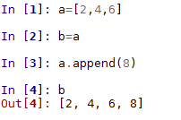

这里我们创建了一个变量`a`，它指向一个列表对象。我们创建了另一个变量`b`，它指向同一个列表对象。当我们将一个元素附加到此列表对象时，此更改同时反映在`a`和`b`中。

Python 是一种动态类型化语言。在程序执行期间，变量名可以绑定到不同的值和类型。例如，每个值都是一种类型、一个字符串或整数；但是，指向此值的名称没有特定类型。这与许多语言（如 C 和 Java）不同，在这些语言中，名称表示内存中的固定大小、类型和位置。这意味着在 Python 中初始化变量时，不需要声明类型。此外，变量，或者更具体地说，变量指向的对象，可以根据分配给它们的值更改类型，例如：

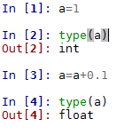

# 可变范围

理解函数中变量的作用域规则很重要。每次执行函数时，都会创建一个新的本地名称空间。这表示一个本地环境，其中包含由函数指定的参数和变量的名称。要在调用函数时解析名称空间，Python 解释器首先搜索本地名称空间（即函数本身），如果未找到匹配项，则搜索全局名称空间。此全局命名空间是定义函数的模块。如果仍然找不到该名称，它将搜索内置命名空间。最后，如果失败，那么解释器将引发一个`NameError`异常。考虑下面的代码：

```py
    a=10; b=20 
    def my_function(): 
        global a 
        a=11; b=21 
    my_function() 
    print(a) #prints 11 
    print(b) #prints 20
```

以下是前面代码的输出：

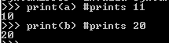

在前面的代码中，我们定义了两个全局变量。我们需要使用关键字`global`告诉解释器，在函数中，我们引用的是一个全局变量。当我们将此变量更改为`11`时，这些更改将反映在全局范围内。但是，我们设置为`21`的变量`b`是函数的局部变量，在函数内部对其所做的任何更改都不会反映在全局范围内。当我们运行函数并打印`b`时，我们看到它保留了其全局值。

# 流控制与迭代

Python 程序由一系列语句组成。解释器按顺序执行每条语句，直到没有更多语句为止。如果两个文件都作为主程序运行，以及通过`import`加载的文件，则为真。所有语句，包括变量赋值、函数定义、类定义和模块导入，都具有相同的状态。没有比任何其他语句具有更高优先级的特殊语句，每个语句都可以放在程序中的任何位置。控制程序执行流的主要方法有两种：条件语句和循环。

`if`、`else`和`elif`语句控制语句的条件执行。一般格式是一系列的`if`和`elif`语句，然后是最终的`else`语句：

```py
    x='one' 
    if x==0:  
        print('False') 
    elif x==1: 
        print('True') 
    else: print('Something else') 
    #prints 'Something else' 
```

注意使用`==`操作符测试相同的值。如果值相等，则返回`true`；否则返回`false`。还请注意，将`x`设置为字符串将返回*其他内容*，而不是像在非动态类型语言中可能发生的那样生成类型错误。动态类型语言（如 Python）允许灵活分配不同类型的对象。

控制程序流的另一种方法是使用循环。它们是使用`while`或`for`语句创建的，例如：

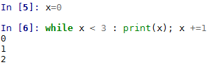

# 数据类型和对象概述

Python 包含 12 种内置数据类型。其中包括四种数字类型（`int`、`float`、`complex`、`bool`），四种序列类型（`str`、`list`、`tuple`、`range`），一种映射类型（`dict`）和两种集合类型。还可以创建用户定义的对象，例如函数或类。我们将在本章中介绍`string`和`list`数据类型，并在下一章中介绍其余的内置类型。

Python 中的所有数据类型都是**对象**。事实上，Python 中几乎所有东西都是对象，包括模块、类和函数，以及字符串和整数等文本。Python 中的每个对象都有一个**类型**、一个**值**和一个**标识**。当我们写入`greet = "hello world"`时，我们正在创建一个字符串对象的实例，其值为`"hello world"`，标识为`greet`。对象的标识充当指向对象在内存中位置的指针。对象的类型，也称为对象的类，描述对象的内部表示以及它支持的方法和操作。一旦创建了对象的实例，就不能更改其标识和类型。

我们可以通过内置函数`id()`获取对象的身份。这将返回一个标识整数，在大多数系统中，这是指它的内存位置，尽管在任何代码中都不应该依赖它。

此外，还有许多方法可以比较对象，例如：

```py
    if a== b: #a and b have the same value 

    if a is b: # if a and b are the same object 
    if type(a) is type(b): # a and b are the same type 
```

需要对**可变**和**不可变**对象进行重要区分。可变对象（如列表）的值可以更改。它们具有更改对象值的方法，例如`insert()`或`append()`。不可变对象（如字符串）的值不能更改，因此当我们运行它们的方法时，它们只返回一个值，而不是更改基础对象的值。当然，我们可以通过将该值赋给变量或将其用作函数中的参数来使用该值。

# 串

字符串是不可变的序列对象，每个字符表示序列中的一个元素。与所有对象一样，我们使用方法来执行操作。字符串是不可变的，不会更改实例；每个方法只返回一个值。此值可以存储为另一个变量，也可以作为函数或方法的参数提供。

下表列出了一些最常用的字符串方法及其说明：

| **方法** | **说明** |
| `s.count(substring, [start,end])` | 使用可选的开始和结束参数统计子字符串的出现次数。 |
| `s.expandtabs([tabsize])` | 将选项卡替换为空格。 |
| `s.find(substring, [start, end])` | 返回子字符串第一次出现的索引，如果未找到子字符串，则返回`-1`。 |
| `s.isalnum()` | 返回`True`如果所有字符都是字母数字，则返回`False`否则。 |
| `s.isalpha()` | 返回`True`如果所有字符都是字母，则返回`False`否则。 |
| `s.isdigit()` | 如果所有字符都是数字，则返回`True`，否则返回`False`。 |
| `s.join(t)` | 按`t`顺序连接字符串。 |
| `s.lower()` | 将字符串转换为所有小写。 |
| `s.replace(old, new [maxreplace])` | 用新的子字符串替换旧的子字符串。 |
| `s.strip([characters])` | 删除空白或可选字符。 |
| `s.split([separator], [maxsplit])` | 拆分由空格或可选分隔符分隔的字符串。返回一个列表。 |

与所有序列类型一样，字符串支持索引和切片。我们可以使用字符串的索引`s[i]`从字符串中检索任何字符。我们可以使用`s[i:j]`检索字符串的切片，其中`i`和`j`是切片的起点和终点。我们可以使用步幅返回扩展的切片，如下所示：`s[i:j:stride]`。以下代码应明确说明这一点：

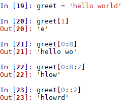

前两个示例非常简单，分别返回位于索引`1`处的字符和字符串的前七个字符。请注意，索引从`0`开始。在第三个示例中，我们使用的步幅为`2`。这将导致每秒返回一个字符。在最后一个示例中，我们省略了结束索引，切片返回整个字符串中的每一个字符。

只要值是整数，就可以使用任何表达式、变量或运算符作为索引，例如：

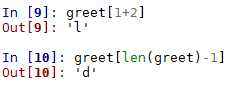

另一种常见操作是使用循环遍历字符串，例如：

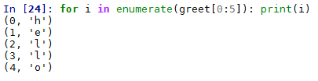

由于字符串是不可变的，因此出现的一个常见问题是如何执行插入值等操作。我们不需要更改字符串，而是需要考虑如何为需要的结果构建新的字符串对象。例如，如果我们想在问候语中插入一个单词，我们可以为以下内容分配一个变量：

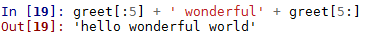

正如这段代码所示，我们使用 slice 操作符在索引位置`5`拆分字符串，并使用`+`连接。Python 从不将字符串的内容解释为数字。如果需要对字符串执行数学运算，首先需要将其转换为数字类型，例如：

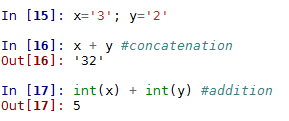

# 列表

列表可能是 Python 中最常用的内置数据结构，因为它们可以由任意数量的其他数据类型组成。它们是任意对象的简单表示。与字符串一样，它们也由从零开始的整数索引。下表包含最常用的列表方法及其说明：

| **方法** | **说明** |
| `list(s)` | 返回序列`s`的列表。 |
| `s.append(x)` | 将元素`x`追加到`s`的末尾。 |
| `s.extend(x)` | 将列表`x`添加到`s`之后。 |
| `s.count(x)` | 统计`s`中`x`的出现次数。 |
| `s.index(x, [start], [stop])` | 返回最小索引`i`，其中`s[i] ==x`。可以包括搜索的可选开始和停止索引。 |
| `s.insert(i,e)` | 在索引`i`处插入`x`。 |
| `s.pop(i)` | 返回元素`i`并将其从列表中删除。 |
| `s.remove(x)` | 从`s`中删除`x`。 |
| `s.reverse()` | 颠倒`s`的顺序。 |
| `s.sort(key ,[reverse])` | 使用可选键和反转对`s`进行排序。 |

当我们处理列表和其他*容器*对象时，理解 Python 复制它们的内部机制非常重要。Python 只有在必要时才会创建真正的副本。当我们将一个变量的值赋给另一个变量时，这两个变量都指向同一个内存位置。只有当其中一个变量发生变化时，才会分配内存中的新插槽。这对列表等可变复合对象具有重要影响。考虑下面的代码：

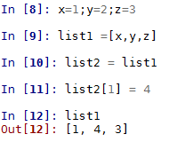

这里，`list1`和`list2`变量都指向内存中的同一个插槽。当我们将`y`变量更改为`4`时，我们正在更改`list1`指向的相同`y`变量。

列表的一个重要特性是，它们可以包含嵌套结构，即其他列表，例如：

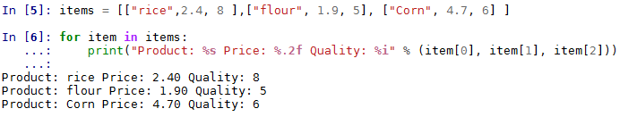

我们可以使用括号操作符访问列表值，因为列表是可变的，所以它们会被复制到位。下面的示例演示如何使用它来更新元素；例如，我们将面粉价格提高了 20%：


从表达式创建列表的一种常见且非常直观的方法是使用**列表理解。**这允许我们通过将表达式直接写入列表来创建列表，例如：

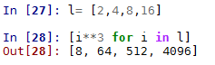

列表理解可以非常灵活；例如，考虑下面的代码。它本质上展示了执行函数组合的两种不同方式，其中我们将一个函数（`x * 4`）应用到另一个函数（`x * 2`）。下面的代码打印出两个列表，表示首先使用`for`循环计算的`f1`和`f2`的函数组成，然后使用列表理解：

```py
    def f1(x): return x*2 
    def f2(x): return x*4 

    lst = [] 
    for i in range(16): 
        lst.append(f1(f2(i))) 

    print(lst) 

    print([f1(x)  for x in range(64) if x in [f2(j) for j in range(16)]]) 
```

第一行输出来自 for 循环构造。第二个来自列表理解表达式：

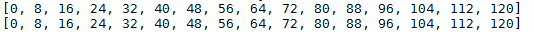

列表理解还可以用于以更紧凑的形式复制嵌套循环的操作。例如，我们将`list1`中包含的每个元素相乘：

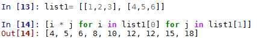

我们还可以将列表理解用于其他对象，如字符串，以构建更复杂的结构。例如，以下代码创建单词及其字母计数的列表：

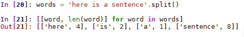

正如我们将看到的，列表是我们将要研究的许多数据结构的基础。它们的多功能性、易于创建和使用使它们能够构建更专业、更复杂的数据结构。

# 作为第一类对象的函数

在 Python 中，不仅仅是数据类型被视为对象。函数和类都是第一类对象，允许以与内置数据类型相同的方式对它们进行操作。根据定义，第一类对象是：

*   在运行时创建
*   指定为变量或在数据结构中
*   作为参数传递给函数
*   作为函数的结果返回

在 Python 中，术语**第一类对象**有点用词不当，因为它意味着某种层次结构，而所有 Python 对象本质上都是第一类的。

为了了解其工作原理，让我们定义一个简单的函数：

```py
    def greeting(language): 
    if language== 'eng': 
             return 'hello world' 
       if language  == 'fr' 
             return 'Bonjour le monde' 
       else: return 'language not supported' 
```

由于用户定义的函数是对象，因此我们可以将它们包含在其他对象中，例如列表：


函数也可以用作其他函数的参数。例如，我们可以定义以下函数：

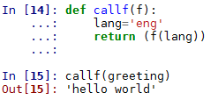

这里，`callf()`将函数作为参数，将语言变量设置为`'eng'`，然后以语言变量作为参数调用函数。例如，如果我们想制作一个程序，返回各种语言中的特定句子，也许是某种自然语言应用程序，那么我们可以看到这是多么有用。在这里，我们有一个设置语言的中心位置。除了我们的`greeting`函数外，我们还可以创建类似的函数来返回不同的句子。通过设置语言的一个点，程序逻辑的其余部分就不必担心这一点。如果我们想改变语言，我们只需改变语言变量，就可以保持其他一切不变。

# 高阶函数

将其他函数作为参数或返回函数的函数称为**高阶函数**。Python 3 包含两个内置的高阶函数，`filter()`和`map()`。注意，在 Python 的早期版本中，这些函数返回列表；在 Python3 中，它们返回一个迭代器，这使它们更加高效。`map()`函数提供了一种将每个项目转换为可编辑对象的简单方法。例如，这里有一种高效、紧凑的方法来对序列执行操作。注意`lambda`匿名函数的使用：

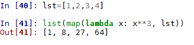

同样，我们可以使用`filter`内置函数来过滤列表中的项目：

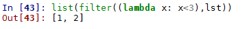

请注意，`map`和`filter`执行的功能与通过列表理解可以实现的功能相同。与列表理解相比，在不使用`lambda`运算符的情况下使用内置函数`map`和`filter`时，除了略微的性能优势外，性能特征似乎没有太大差异。尽管如此，大多数样式指南建议使用列表理解而不是内置函数，可能是因为它们更易于阅读。

创建我们自己的高阶函数是函数式编程风格的标志之一。高阶函数如何有用的一个实际例子如下所示。这里我们将传递`len`函数作为`sort`函数的键。这样，我们可以按长度对单词列表进行排序：

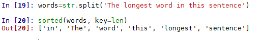

下面是不区分大小写排序的另一个示例：

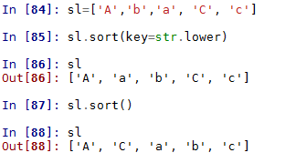

注意`list.sort()`方法和`sorted`内置函数之间的差异。`list`对象的方法`list.sort()`对列表的现有实例进行排序，而不复制它。此方法更改目标对象并返回`None`。Python 中的一个重要约定是，更改对象的函数或方法返回`None`，以明确没有创建新对象，并且对象本身也已更改。

另一方面，排序的内置函数返回一个新列表。它实际上接受任何 iterable 对象作为参数，但它总是返回一个列表。`list sort`和`sorted`都将两个可选的关键字参数作为键。

对更复杂的结构进行排序的一种简单方法是使用`lambda`运算符使用元素的索引进行排序，例如：

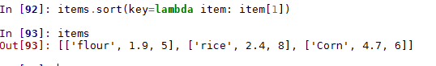

这里我们已按价格对商品进行了分类。

# 递归函数

递归是计算机科学中最基本的概念之一。在 Python 中，我们只需在自己的函数体中调用递归函数，就可以实现递归函数。为了阻止递归函数变成无限循环，我们至少需要一个参数来测试终止情况，以结束递归。这有时被称为基本情况。应该指出，递归不同于迭代。虽然两者都涉及重复，但迭代通过一系列操作循环，而递归反复调用函数。两者都需要一个选择语句来结束。从技术上讲，递归是迭代的一种特殊情况，称为尾部迭代，通常可以将迭代函数转换为递归函数，反之亦然。递归函数的有趣之处在于，它们能够在有限语句中描述无限对象。

下面的代码应该演示递归和迭代之间的区别。这两个函数都只是打印出介于`low`和`high`之间的数字，第一个使用迭代，第二个使用递归：

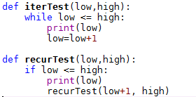

注意，`iterTest`，迭代示例，我们使用`while`语句测试条件，然后调用`print`方法，最后增加`low`值。递归示例测试条件，打印，然后调用自身，增加其参数中的`low`变量。一般来说，迭代更有效；然而，递归函数通常更容易理解和编写。正如我们将要看到的，递归函数对于操作递归数据结构（如链表和树）也很有用。

# 生成器和 co 例程

通过使用`yield`语句，我们可以创建不只是返回一个结果，而是返回整个结果序列的函数。这些函数称为**生成器。**Python 包含生成器函数，这是创建迭代器的一种简单方法，它们特别适用于替换不可行的长列表。生成器生成项目而不是生成列表。例如，以下代码显示了为什么我们可能选择使用生成器而不是创建列表：

```py
    # compares the running time of a list compared to a generator 
    import time 
    #generator function creates an iterator of odd numbers between n and m 
    def oddGen(n, m):         
        while n < m: 
            yield n 
            n += 2 
    #builds a list of odd numbers between n and m 
    def oddLst(n,m): 
        lst=[] 
        while n<m: 
            lst.append(n) 
            n +=2 
        return lst 
    #the time it takes to perform sum on an iterator    
    t1=time.time() 
    sum(oddGen(1,1000000)) 
    print("Time to sum an iterator: %f" % (time.time() - t1)) 

    #the time it takes to build and sum a list 
    t1=time.time() 
    sum(oddLst(1,1000000)) 
    print("Time to build and sum a list: %f" % (time.time() - t1))      
```

这将打印出以下内容：

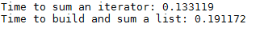

正如我们所看到的，构建一个列表来进行此计算需要花费更长的时间。由于使用生成器，性能提高是因为值是按需生成的，而不是保存为内存中的列表。计算可以在生成所有元素之前开始，并且仅在需要时生成元素。

在前面的示例中，`sum`方法在需要计算时将每个数字加载到内存中。这是通过生成器对象反复调用`__next__()`特殊方法实现的。生成器从不返回除`None`以外的值。

通常，生成器对象用于`for`循环中。例如，我们可以利用前面代码中创建的`oddcount`生成器函数打印出`1`和`10`之间的奇数整数：

```py
    for i in oddcount(1,10):print(i) 
```

我们还可以创建一个**生成器表达式**，它除了用括号替换方括号外，还使用与列表理解相同的语法和执行相同的操作。但是，生成器表达式不创建列表，而是创建一个**生成器对象**。此对象不创建数据，而是根据需要创建该数据。这意味着生成器对象不支持序列方法，例如`append()`和`insert()`。但是，您可以使用`list()`功能将生成器更改为列表：

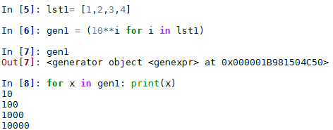

# 类与对象编程

类是创建新类型对象的一种方式，它们是面向对象编程的核心。类定义了一组在该类的实例之间共享的属性。通常，类是函数、变量和属性的集合。

面向对象的范例是引人注目的，因为它为我们提供了一种具体的方式来思考和表示程序的核心功能。通过围绕对象和数据而不是操作和逻辑组织程序，我们有了一种健壮而灵活的方法来构建复杂的应用程序。当然，动作和逻辑仍然存在，但通过将它们体现在对象中，我们有了一种封装功能的方法，允许对象以非常特定的方式进行更改。这使得我们的代码不那么容易出错，更容易扩展和维护，并且能够对真实世界的对象进行建模。

类是使用`class`语句在 Python 中创建的。这定义了一组与类实例集合关联的共享属性。一个类通常由许多方法、类变量和计算属性组成。重要的是要理解，定义类本身并不会创建该类的任何实例。要创建实例，必须为类指定一个变量。类主体由一系列在类定义期间执行的语句组成。类中定义的函数称为**实例方法。**他们通过将该类的实例作为第一个参数传递给该类实例，从而对该类实例应用一些操作。此参数按约定称为`self`，但它可以是任何合法标识符。下面是一个简单的例子：

```py
    class Employee(object): 
        numEmployee = 0 
        def __init__(self, name, rate): 
            self.owed = 0         
            self.name = name 
            self.rate=rate 
            Employee.numEmployee += 1 

        def __del__(self): 
            Employee.numEmployee -= 1 

        def hours(self, numHours): 
            self.owed += numHours * self.rate 
            return("%.2f hours worked" % numHours) 

        def pay(self):                 
            self.owed = 0 
            return("payed %s " % self.name) 
```

类变量，例如`numEmployee`，在类的所有实例之间共享值。在本例中，`numEmployee`用于统计员工实例的数量。注意，`Employee`类实现了`__init__`和`__del__`特殊方法，我们将在下一节中讨论。

我们可以通过以下操作创建`Employee`对象的实例、运行方法以及返回类和实例变量：

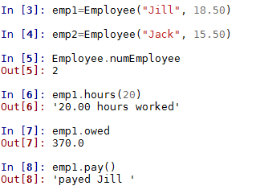

# 特殊方法

我们可以使用`dir(object)`函数获取特定对象的属性列表。以两个下划线开头和结尾的方法称为**特殊方法。**除以下例外**外，**特殊方法，一般由 Python 解释器调用，而不是程序员调用；例如，当我们使用`+`操作符时，我们实际上调用了对`__add__()`的调用。例如，与使用`my_object.__len__()`相比，我们可以使用`len(my_object)`在字符串对象上使用`len()`实际上要快得多，因为它返回表示内存中对象大小的值，而不是调用对象的`__len__`方法。通常，我们在程序中实际调用的唯一特殊方法是`__init__`方法，用于在我们自己的类定义中调用超类的初始值设定项。强烈建议不要对自己的对象使用双下划线语法，因为当前或将来可能会与 Python 自己的特殊方法发生冲突。

但是，我们可能希望在自定义对象中实现特殊的方法，以便为它们提供一些内置类型的行为。在下面的代码中，我们创建了一个实现`__repr__`方法的类。此方法创建对象的字符串表示形式，用于检查：

```py
    class my_class(): 
        def __init__(self, greet): 
            self.greet = greet 
        def __repr__(self): 
            return 'a custom object (%r)' % (self.greet) 
```

当我们创建这个对象的实例并检查它时，我们可以看到我们得到了定制的字符串表示。注意使用`%r`格式占位符返回对象的标准表示。这是非常有用的最佳实践，因为在本例中，它向我们展示了`greet`对象是由引号表示的字符串：

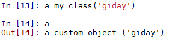

# 遗产

可以创建一个通过继承修改现有类行为的新类。这是通过在类定义中将继承的类作为参数传递来完成的。它通常用于修改现有方法的行为，例如：

```py
    class specialEmployee(Employee): 
        def hours(self, numHours): 
            self.owed += numHours * self.rate * 2 
            return("%.2f hours worked" % numHours)    
```

`specialEmployee`类的实例与`Employee`实例相同，只是`hours()`方法有所改变。

子类要定义新的类变量，需要定义一个`__init__()`方法，如下所示：

```py
    class specialEmployee(Employee): 
        def __init__(self,name,rate, bonus): 
            Employee.__init__(self, name, rate) #calls the base classes 
            self.bonus = bonus 

        def hours(self, numHours): 
            self.owed += numHours * self.rate + self.bonus  
            return("%.2f hours worked" % numHours)      
```

请注意，基类的方法不是自动调用的，派生类必须调用它们。我们可以使用内置函数`isintance(obj1, obj2)`测试类成员资格。如果`obj1`属于`obj2`的类或从`obj2`派生的任何类，则返回 true。

在类定义中，假设所有方法都在实例上操作，但这不是一个要求。然而，还有其他类型的方法：**静态方法**和**类方法**。静态方法只是在类中定义的普通函数。它不会对实例执行任何操作，它是使用`@staticmethod`类装饰器定义的。静态方法无法访问实例的属性，因此它们最常见的用法是方便将实用程序函数分组在一起。

类方法对类本身而不是实例进行操作，就像类变量与类而不是该类的实例相关联一样。它们是使用`@classmethod`装饰器定义的，与实例方法的区别在于类作为第一个参数传递。这是按惯例命名的`cls`。

```py
    class Aexp(object): 
        base=2 
        @classmethod 
        def exp(cls,x): 
            return(cls.base**x) 

    class Bexp(Aexp): 
            base=3 
```

类`Bexp`继承自`Aexp`类，并将基类变量更改为`3`。我们可以按如下方式运行父类的`exp()`方法：

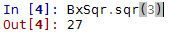

虽然这个例子有点做作，但类方法之所以有用，有几个原因。例如，由于子类继承其父类的所有相同特性，因此它有可能破坏继承的方法。使用类方法是一种精确定义运行哪些方法的方法。

# 数据封装与属性

除非另有规定，否则所有属性和方法都可以无限制地访问。这也意味着基类中定义的所有内容都可以从派生类访问。当我们构建面向对象的应用程序时，这可能会导致问题，因为我们可能希望隐藏对象的内部实现。这可能导致派生类中定义的对象与基类之间的命名空间冲突。为了防止出现这种情况，我们使用定义私有属性的方法有一个双下划线，例如`__privateMethod()`。这些方法名称会自动更改为`_Classname__privateMethod()`，以防止与基类中定义的方法发生名称冲突。请注意，这并没有严格隐藏私有属性，而是提供了一种防止名称冲突的机制。

在使用类**属性**定义可变属性时，建议使用私有属性。属性是一种属性，它不是返回存储值，而是在调用时计算其值。例如，我们可以使用以下内容重新定义`exp()`属性：

```py
    class Bexp(Aexp): 
        __base=3 
        def __exp(self): 
            return(x**cls.base)     
```

在本章中，我们介绍了 Python 编程语言的一些基础知识，从基本操作到 Python 中的函数、类和对象。在下一章中，我们将详细研究 Python 的内置数据结构。

# 总结

本章为 Python 编程提供了良好的基础和介绍。我们介绍了变量、列表和一些控制结构的使用，并学习了如何使用条件语句。讨论了各种对象，以及一些关于 Python 语言面向对象方面的材料。我们创建了自己的对象并从中继承。

Python 还提供了更多功能。当我们准备在后面的章节中研究一些算法的实现时，下一章将重点讨论数字、序列、映射和集合。这些也是 Python 中的数据类型，在为一系列操作组织数据时证明是有用的。