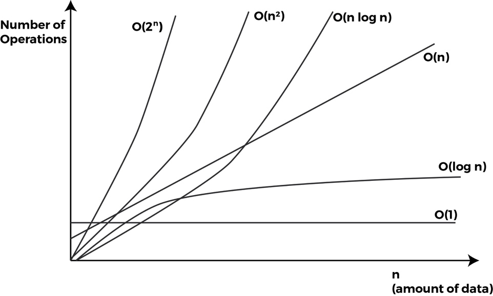
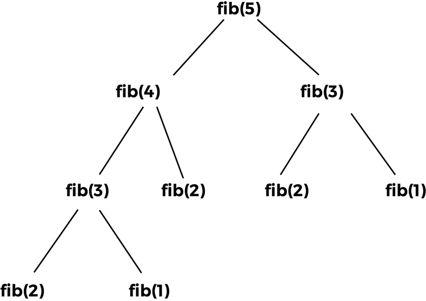
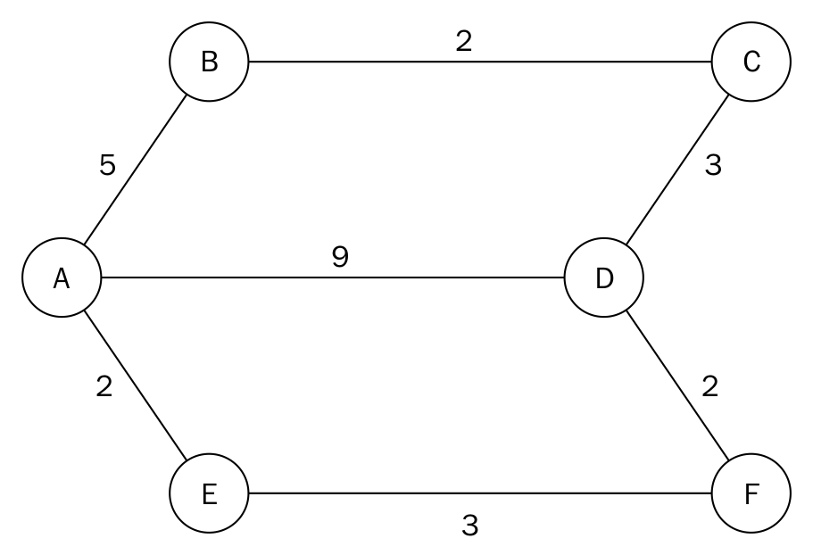
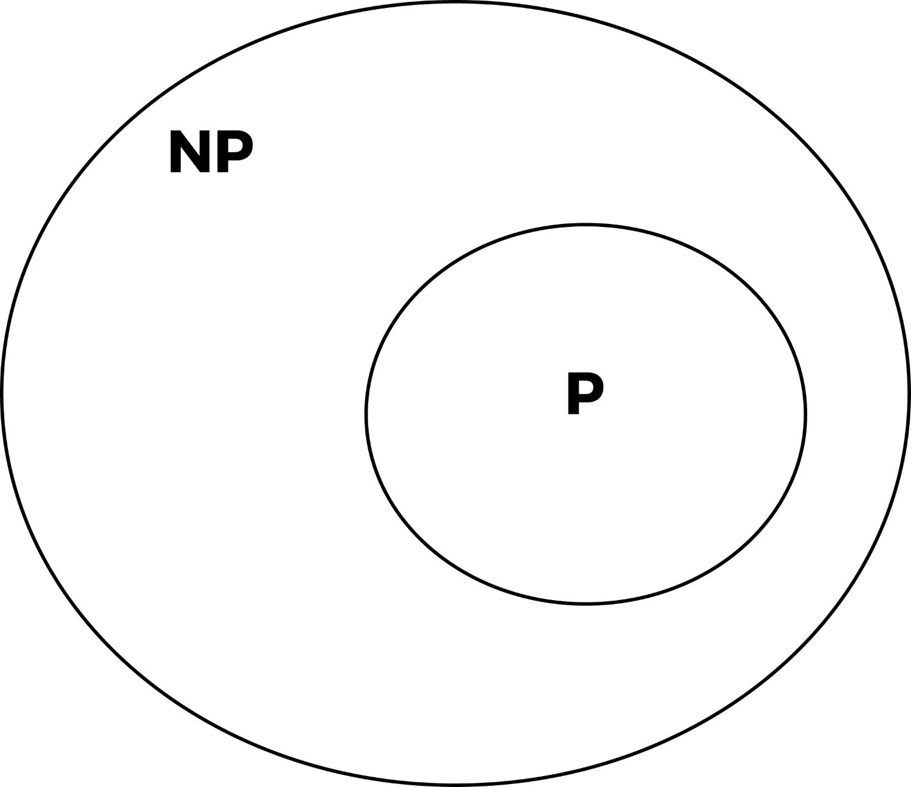

# 设计技巧与策略

在本章中，我们将后退一步，探讨计算机算法设计中更广泛的主题。随着您编程经验的增长，某些模式开始变得显而易见。就像其他技术性行业一样，你不能没有一些技术和原则来达到目的。在算法的世界里，有很多这样的技术和设计原则。要解决现场较难的问题，需要具备工作知识并掌握这些技术。

我们将研究算法的一般分类方式。其他设计技术将与一些算法的实现一起处理。

本章的目的不是让您成为算法设计和策略方面的专家，而是在几页中展示大量的算法。

# 算法分类

存在许多基于算法必须实现的目标的分类方案。在前几章中，我们实现了许多算法。可能出现的一个问题是，这些算法是否具有相同的形式？如果是，以哪些相似性和特征为基础？如果没有，可以将算法分组到类中吗？

这些是我们在处理分类算法的主要模式时要研究的问题。

# 按执行情况分类

将一系列步骤或过程转换为工作算法时，可能会采取多种形式。算法的核心可能会使用一些资产，本节将进一步介绍。

# 递归

递归算法是在满足某个条件之前对自身进行调用的算法。有些问题更容易通过递归实现其解决方案来表达。一个典型的例子是河内的塔楼。也有不同类型的递归算法，其中一些包括单递归和多递归、间接递归、匿名递归和生成递归。另一方面，迭代算法使用一系列步骤或重复构造来制定解决方案。这种重复的构造可以是一个简单的`while`循环或任何其他类型的循环。迭代解决方案也比它们的递归实现更容易让人想到。

# 必然的

算法的一个实现是将其表示为受控逻辑推导。该逻辑组件由将在计算中使用的公理组成。控制组件确定演绎应用于公理的方式。这以 a*算法=逻辑+控制*的形式表示。这构成了逻辑编程范式的基础。

逻辑组件决定了算法的含义。控制组件只影响其效率。在不修改逻辑的情况下，可以通过改进控制组件来提高效率。

# 串行或并行

大多数计算机的 RAM 模型允许一次只执行一条指令的假设。

串行算法，也称为**顺序算法**，是按顺序执行的算法。执行从开始到结束，无需任何其他执行过程。

为了能够同时处理多条指令，需要不同的模型或计算技术。并行算法一次执行多个操作。在婴儿车模型中，有共享全局内存的串行处理器。处理器还可以并行执行各种算术和逻辑运算。这允许一次执行多条指令。

并行/分布式算法将问题分解为处理器之间的子问题，以收集结果。一些排序算法可以有效地并行化，而迭代算法通常是可并行化的。

# 确定性与非确定性算法

每次使用相同的输入运行算法时，确定性算法都会产生相同的输出。有些问题在解决方案的设计中非常复杂，以确定性的方式表达它们的解决方案可能是一个挑战。非确定性算法可以更改执行顺序或某些内部子流程，从而在算法运行时改变最终结果。因此，对于非确定性算法的每次运行，算法的输出都是不同的。例如，使用概率值的算法将根据生成的随机数的值在连续执行时产生不同的输出。

# 按复杂性分类

确定一个算法的复杂度就是试图估计在计算或程序执行过程中总共使用了多少空间（内存）和时间。

[Chapter 3](03.html), *Principles of Algorithm Design*, presents more comprehensive coverage of the subject matter on complexity. We will summarize what we learned there here.

# 复杂度曲线

现在考虑一个大小为 0 的问题。为了确定算法的时间复杂度，我们用**T**（n）表示它。该值可能属于**O**（*1*）、**O**（*对数 n*）、**O**（*n*）、**O**n 对数（n）、【T20 O】（【T22 n】<sup>2</sup>、**O*****对数（n）】3*或**O**（*2<sup>n</sup>*）。根据算法执行的步骤，时间复杂度可能会受到影响，也可能不会受到影响。符号**O**（*n*表示算法的增长率。**

现在让我们来看一个实际场景。通过哪种方法我们可以得出结论：冒泡排序算法比快速排序算法慢？或者一般来说，我们如何衡量一种算法与另一种算法的效率？嗯，我们可以比较任意数量的算法的大 O 来确定它们的效率。正是这种方法为我们提供了一个时间度量或增长率，当*n*变大时，该方法会绘制算法的行为图。

下面是算法性能可能会下降的不同运行时的图表：



从好到坏的运行时列表按升序排列为**O**（1）、**O**（logn）、**O**（*n*）、**O**（*n logn*、【T12o】（*n<sup>2</sup>*、**O***n<sup>3</sup>*、**O**（*2<sup>n</sup>*）。

# 按设计分类

在本节中，我们将根据用于解决问题的各种算法的设计，介绍算法的类别。

一个给定的问题可能有多种解决方案。当分析这些解决方案的算法时，很明显有些解决方案实现了某种技术或模式。正是这些技术，我们将在这里讨论，并在后面的章节中更详细地讨论。

# 分而治之

这种解决问题的方法正如其名称所示。为了解决（克服）某些问题，该算法将问题划分为与原始问题相同的子问题，这些子问题很容易解决。子问题的解决方案以这样一种方式组合，即最终解决方案是原始问题的解决方案。

将问题分解成更小的块的方式主要是通过递归。我们将在接下来的章节中详细研究这项技术。使用这种技术的一些算法包括合并排序、快速排序和二进制搜索。

# 动态规划

这种技术类似于分而治之，将问题分解为更小的问题。在分治中，每个子问题都必须先解决，然后才能将其结果用于解决更大的问题。相比之下，动态规划不计算已经遇到的子问题的解。相反，它使用记忆技术来避免重新计算。

动态规划问题有两个特点：**最优子结构**和**重叠子问题**。我们将在下一节对此进行更多讨论。

# 贪婪算法

对于某类问题，确定最佳解决方案确实很困难。为了弥补最佳解决方案的不足，我们采取了一种方法，从一系列选项或选项中选择最接近的解决方案，这是获得解决方案最有希望的。

贪婪算法更容易构思，因为指导原则是人们总是选择收益最大的解决方案，然后继续这样做，希望得到一个完美的解决方案。

该技术的目标是通过一系列局部最优选择来寻找全局最优最终解。局部最优选择似乎导致了问题的解决。在现实生活中，大多数局部最优选择都是次优的。因此，大多数贪婪算法的渐近时间复杂度很低。

# 技术实施

让我们深入了解一些我们在本章前面讨论过的理论编程技术的实现。我们将从动态规划开始。

# 动态规划

正如我们已经描述的，在这种方法中，我们将问题划分为更小的子问题。在寻找子程序的解决方案时，注意不要重新计算以前遇到的任何子问题。

这听起来有点像递归，但这里的范围更广。问题可以通过使用动态规划来解决，但不一定采用递归调用的形式。

问题的一个特性是，它应该有一组重叠的子问题，这将使它成为用动态规划解决的理想候选问题。

一旦我们意识到子问题的形式在计算过程中已经重复，我们就不需要再计算它了。相反，我们返回先前遇到的子问题的预计算值的结果。

为了避免不必重新评估子问题的情况，我们需要一种有效的方法来存储每个子问题的结果。以下两种技术是现成的。

# 回忆录

该技术从初始问题集开始，并将其划分为小个子问题。确定子程序的解决方案后，我们将结果存储到该特定子问题。将来，当遇到这个子问题时，我们只返回它预先计算的结果。

# 制表

在表格中，我们确定了一种方法，即填写子问题的解决方案表，然后将它们结合起来解决更大的问题。

# 斐波那契级数

我们将使用斐波那契数列来说明生成数列的记忆和制表技术。

# 记忆技术

让我们生成第五项的斐波那契级数：

```py
    1 1 2 3 5
```

生成序列的程序的递归样式如下所示：

```py
    def fib(n): 
        if n <= 2: 
            return 1 
        else: 
            return fib(n-1) + fib(n-2) 
```

代码非常简单，但阅读起来有点棘手，因为递归调用最终解决了问题。

当满足基本情况时，`fib()`函数返回 1。如果`n`等于或小于 2，则满足基本情况。

如果不满足基本情况，我们将再次调用`fib()`函数，这次第一次调用提供`n-1`，第二次调用提供`n-2`：

```py
    return fib(n-1) + fib(n-2) 
```

求解斐波那契序列中第 i<sup>个</sup>项的策略布局如下：



仔细观察前面的树，可以发现一些有趣的模式。对`f(1)`的调用发生两次。对`f(1)`的调用发生三次。此外，对`f(3)`的调用会发生两次。

调用`fib(2)`的所有时间的函数调用的返回值都不会改变。`fib(1)`和`fib(3)`也是如此。由于为具有相同参数的函数调用返回相同的结果，因此浪费了计算时间。

对具有相同参数和输出的函数的重复调用表明存在重叠。某些计算在较小的子问题中重复出现。

更好的方法是在第一次遇到`fib(1)`时存储其计算结果。这也适用于`fib(2)`和`fib(3)`。稍后，每当我们遇到对`fib(1)`、`fib(2)`或`fib(3)`的调用时，我们只需返回它们各自的结果。

我们的`fib`调用图现在如下所示：


我们现在已经完全消除了计算`fib(3)`、`fib(2)`和`fib(1)`的需要。这是一种典型的记忆技术，将问题分解为子问题，就不会重新计算对函数的重叠调用。在我们的斐波那契示例中，重叠的函数调用是`fib(1)`、`fib(2)`和`fib(3)`：

```py
    def dyna_fib(n, lookup): 
        if n <= 2: 
            lookup[n] = 1 

        if lookup[n] is None: 
            lookup[n] = dyna_fib(n-1, lookup) + dyna_fib(n-2, lookup) 

        return lookup[n] 
```

要创建包含 1000 个元素的列表，我们执行以下操作并将其传递给`dyna_fib`函数的查找参数：

```py
    map_set = [None]*(10000) 
```

此列表将存储对`dyna_fib()`函数的各种调用的计算值：

```py
    if n <= 2: 
        lookup[n] = 1 
```

任何对`dyna_fib()`的调用，如果`n`小于或等于 2，则返回 1。当评估`dyna_fib(1)`时，我们将该值存储在`map_set`的索引 1 处：

写下`lookup[n]`的条件，如下所示：

```py
if lookup[n] is None:
    lookup[n] = dyna_fib(n-1, lookup) + dyna_fib(n-2, lookup)
```

我们通过查找，以便在评估子问题时可以引用它。对`dyna_fib(n-1, lookup)`和`dyna_fib(n-2, lookup)`的调用存储在`lookup[n]`中。当我们运行更新后的函数实现来查找斐波那契数列的第 i<sup>个</sup>项时，我们意识到有相当大的改进。这个实现比我们最初的实现运行得快得多。为两个实现提供值 20，并观察执行速度的差异。由于在将结果存储到函数调用时使用了内存，因此该算法牺牲了时间和空间复杂性。

# 制表技术

在动态规划中还有第二种技术，它涉及到在某些情况下使用结果表或矩阵来存储计算结果供以后使用。

这种方法首先解决了一个更大的问题，找到了一条通向最终解决方案的路线。在`fib()`函数的情况下，我们将开发一个表，其中包含预先确定的`fib(1)`和`fib(2)`值。基于这两个值，我们将努力达到`fib(n)`：

```py
    def fib(n): 

        results = [1, 1] 

        for i in range(2, n): 
            results.append(results[i-1] + results[i-2]) 

        return results[-1] 
```

`results`变量位于索引 0 处，1 表示值 1 和 1。表示`fib(1)`和`fib(2)`的返回值。为了计算高于 2 的`fib()`函数的值，我们只需调用`for`循环，将`results[i-1] + results[i-2]`的总和附加到结果列表中。

# 分而治之

这种解决问题的编程方法强调需要将问题分解为与原始问题相同类型或形式的较小问题。这些子问题被解决并组合起来以解决原始问题。以下三个步骤与此类编程相关。

# 分

分裂意味着分解一个实体或问题。在这里，我们设计了将原始问题分解为子问题的方法。我们可以通过迭代或递归调用来实现这一点。

# 占领

不可能无限期地继续将问题分解为子问题。在某个时刻，最小的不可分割问题将返回一个解决方案。一旦发生这种情况，我们可以逆转我们的思维过程，说如果我们知道最小问题的解决方案，我们就可以得到原始问题的最终解决方案。

# 合并

为了得到最终的解决方案，我们需要将较小的解决方案与较小的问题相结合，以解决较大的问题。

分治算法还有其他变体，例如合并和合并，以及征服和求解。

利用分治原理的算法包括合并排序、快速排序和斯特拉森矩阵乘法。我们将在前面的[第 3 章](03.html)、*算法设计原则*中介绍合并排序的实现。

# 合并排序

合并排序算法基于分治规则。给定一个未排序元素的列表，我们将该列表分成大约两半。我们继续递归地将这两部分分开。一段时间后，作为递归调用的结果创建的子列表将只包含一个元素。此时，我们开始在征服或合并步骤中合并解决方案：

```py
    def merge_sort(unsorted_list): 
        if len(unsorted_list) == 1: 
            return unsorted_list 

        mid_point = int((len(unsorted_list))/2) 

        first_half = unsorted_list[:mid_point] 
        second_half = unsorted_list[mid_point:] 

        half_a = merge_sort(first_half) 
        half_b = merge_sort(second_half) 

        return merge(half_a, half_b) 
```

我们的实现从接受未排序元素的列表到`merge_sort`函数开始。`if`语句用于建立基本情况，如果`unsorted_list`中只有一个元素，我们只需再次返回该列表。如果列表中有多个元素，我们可以使用`mid_point = int((len(unsorted_list))/2)`找到近似中间值。

使用此`mid_point`，我们将列表分为两个子列表，即`first_half`和`second_half`：

```py
    first_half = unsorted_list[:mid_point] 
    second_half = unsorted_list[mid_point:] 
```

通过将两个子列表再次传递给`merge_sort`函数，可以进行递归调用：

```py
    half_a = merge_sort(first_half)  
    half_b = merge_sort(second_half) 
```

进入合并步骤。当`half_a`和`half_b`已经传递了它们的值时，我们调用 merge 函数，将`half_a`和`half_b`中存储的两个解决方案进行合并或组合，这两个解决方案是列表：

```py
    def merge(first_sublist, second_sublist): 
        i = j = 0 
        merged_list = [] 

        while i < len(first_sublist) and j < len(second_sublist): 
            if first_sublist[i] < second_sublist[j]: 
                merged_list.append(first_sublist[i]) 
                i += 1 
            else: 
                merged_list.append(second_sublist[j]) 
                j += 1 

        while i < len(first_sublist): 
            merged_list.append(first_sublist[i]) 
            i += 1 

        while j < len(second_sublist): 
            merged_list.append(second_sublist[j]) 
            j += 1 

        return merged_list 
```

merge 函数获取我们想要合并的两个列表，`first_sublist`和`second_sublist`。`i`和`j`变量被初始化为`0`，并用作指针，告诉我们合并过程在两个列表中的位置。最终的`merged_list`将包含合并列表：

```py
    while i < len(first_sublist) and j < len(second_sublist): 
        if first_sublist[i] < second_sublist[j]: 
            merged_list.append(first_sublist[i]) 
            i += 1 
        else: 
            merged_list.append(second_sublist[j]) 
            j += 1 
```

`while`循环开始比较`first_sublist`和`second_sublist`中的元素。`if`语句选择两者中较小的一个`first_sublist[i]`或`second_sublist[j]`，并将其附加到`merged_list`。增加`i`或`j`索引，以反映我们在合并步骤中所处的点。只有当任一子列表为空时，`while`循环才有效。

在`first_sublist`或`second_sublist`中可能会留下一些元素。最后两个`while`循环确保在返回`merged_list`之前将这些元素添加到`merged_list`。

最后一次调用`merge(half_a, half_b)`将返回已排序的列表。

让我们通过播放合并两个子列表`[4, 6, 8]`和`[5, 7, 11, 40]`的最后一步来对算法进行试运行：

| **步骤** | `first_sublist` | `second_sublist` | `merged_list` |
| 步骤 0 | [**4**6 8] | [**5**71140] | [] |
| 第一步 | [**6**8] | [**5**71140] | [4] |
| 步骤 2 | [**6**8] | [**7**11 40] | [4 5] |
| 步骤 3 | [**8** | [**7**11 40] | [4 5 6] |
| 步骤 4 | [**8** | [**11**40] | [4 5 6 7] |
| 步骤 5 | [ ] | [**11**40] | [4 5 6 7 8] |

请注意，粗体文本表示循环`first_sublist`（使用索引`i`）和`second_sublist`（使用索引`j`）中引用的当前项。

在执行的这一点上，merge 函数中的第三个`while`循环开始，将 11 和 40 移动到`merged_list`中。返回的`merged_list`将包含完全排序的列表。

# 贪婪算法

正如我们前面所说的，贪婪算法做出的决策会在过渡期间产生最大的收益。这项技术的希望是，通过做出这些高收益的选择，整个路径将导致一个整体良好的解决方案或结果。

贪婪算法的例子包括寻找最小生成树的**普里姆算法**、**背包问题**和**旅行商问题**，仅举几例。

# 硬币计数问题

让我们研究一下这个贪婪技术的一个非常简单的用法。在一些武断的国家，我们的面额是 1 GHC、5 GHC 和 8 GHC。考虑到 12 GHC 这样的金额，我们可能希望找到提供兑换所需的最小面额。使用贪婪方法，我们从面额中选取最大值除以 12 GHC。我们使用 8 是因为它产生了最好的方法，我们可以将 12 GHC 的金额减少到较低的面额。

余数 4 GHC 不能除以 5，因此我们尝试使用 1 GHC 面额，并意识到可以将其乘以 4 得到 4 GHC。在一天结束时，创建 12 GHC 的最小可能面额是获得一张 8 GHC 和四张 1 GHC 纸币。

到目前为止，我们的贪婪算法似乎做得很好。返回相应面额的函数如下所示：

```py
    def basic_small_change(denom, total_amount): 
        sorted_denominations = sorted(denom, reverse=True) 

        number_of_denoms = [] 

        for i in sorted_denominations: 
            div = total_amount / i 
            total_amount = total_amount % i 
            if div > 0: 
                number_of_denoms.append((i, div)) 

        return number_of_denoms 
```

这种贪婪算法总是从使用尽可能大的面额开始。`denom`是面额的列表。`sorted(denom, reverse=True)`将对列表进行反向排序，以便在索引 0 处获得最大面额。现在，从面额排序列表的索引 0 开始，`sorted_denominations`，我们迭代并应用贪婪技术：

```py
    for i in sorted_denominations: 
        div = total_amount / i 
        total_amount = total_amount % i 
        if div > 0: 
            number_of_denoms.append((i, div)) 
```

循环将贯穿面额列表。每次循环运行时，它通过将`total_amount`除以当前面额`i`得到商`div`。`total_amount`已更新，以存储剩余部分以供进一步处理。如果商大于 0，我们将其存储在`number_of_denoms`中。

不幸的是，有些情况下我们的算法失败了。例如，当通过 14 GHS 时，我们的算法返回一个 8 GHC 和四个 1 GHS。然而，该输出不是最佳解决方案。正确的解决方案是使用两种 5 GHC 和两种 1 GHC 面额。

本文提出了一种更好的贪婪算法。这一次，函数返回一个元组列表，允许我们研究更好的结果：

```py
    def optimal_small_change(denom, total_amount): 

        sorted_denominations = sorted(denom, reverse=True) 

        series = [] 
        for j in range(len(sorted_denominations)): 
            term = sorted_denominations[j:] 

            number_of_denoms = [] 
            local_total = total_amount 
            for i in term: 
                div = local_total / i 
                local_total = local_total % i 
                if div > 0: 
                    number_of_denoms.append((i, div)) 

            series.append(number_of_denoms) 

        return series 
```

外部`for`循环使我们能够限制我们找到解决方案的面额：

```py
    for j in range(len(sorted_denominations)): 
        term = sorted_denominations[j:] 
        ...     
```

假设我们在`sorted_denominations`中有列表[5,4,3]，用`[j:]`对其进行切片可以帮助我们获得子列表[5,4,3]、[4,3]和[3]，我们试图从中获得正确的组合来创建更改。

# Dijkstra 最短路径算法

我们介绍并研究了 Dijkstra 算法。这个算法是贪婪算法的一个例子。它查找从源到图形中所有其他节点或顶点的最短距离。在本节结束时，您将了解为什么它被归类为贪婪算法。

考虑下面的图表：



通过检查，找到节点**A**和节点**D**之间出现的最短路径问题的第一个答案是具有值或距离 9 的边。从图中可以看出，从节点**A**到**D**的直线路径似乎也会产生两个节点之间的最短路径。但是连接两个节点的边是最短路径的假设并不总是成立的。

这种在解决问题时选择第一个选项的短视方法是算法的名称和类别。在找到假定的最短路径或距离后，该算法将继续改进其结果。

从节点**A**到节点**D**的其他路径证明比我们最初选择的路径短。例如，从节点**A**到节点**B**到节点**C**的旅行总距离为 10。但通过节点**A**到**E**、**F**和**D**的路由更短。

我们将使用单个源实现最短路径算法。我们的结果应该有助于我们确定从原点（本例中为**A**到图中任何其他节点的最短路径。

节点**A**到节点**C**的最短路径为 7 到节点**B**。同样，到**F**的最短路径是通过节点**E**，总距离为 5。

为了找到一个算法来帮助我们找到图中的最短路径，让我们手工解决这个问题。此后，我们将用 Python 介绍工作解决方案。

在关于图的章节中，我们看到了如何用邻接列表表示图。我们将使用它，稍加修改，以使我们能够捕获每条边上的距离。还将使用一个表跟踪从图形中的源到任何其他节点的最短距离。Python 字典将用于实现此表。这是一张这样的表格：

| **节点** | **距震源最短距离** | **上一节点** |
| A. | 0 | 没有一个 |
| B | ∞ | 没有一个 |
| C | ∞ | 没有一个 |
| D | ∞ | 没有一个 |
| E | ∞ | 没有一个 |
| F | ∞ | 没有一个 |

图表和表格的邻接列表如下所示：

```py
    graph = dict() 
    graph['A'] = {'B': 5, 'D': 9, 'E': 2} 
    graph['B'] = {'A': 5, 'C': 2} 
    graph['C'] = {'B': 2, 'D': 3} 
    graph['D'] = {'A': 9, 'F': 2, 'C': 3} 
    graph['E'] = {'A': 2, 'F': 3} 
    graph['F'] = {'E': 3, 'D': 2} 
```

嵌套字典保存距离和相邻节点。

这张表是我们努力解决手头问题的基础。当算法开始时，我们不知道从源（**A**到任何节点的最短距离是多少。为了安全起见，我们将该列中的值设置为无穷大，节点**A**除外。从起始节点开始，从节点**A**到节点**A**的距离为 0。因此，我们可以安全地使用该值作为从节点**A**到自身的最短距离。算法开始时未访问任何先前节点。因此，我们将节点的上一个节点列标记为`None`。

在算法的步骤 1 中，我们首先检查节点**A**的相邻节点。要找到从节点**A**到节点**B**的最短距离，我们需要找到从开始节点到节点 B 的前一个节点的距离，恰好是节点**A**，并将其添加到从节点**A**到节点**B**的距离中。我们对**A**的其他相邻节点进行此操作，它们是**B**、**E**和**D**。

以相邻节点**B**为例，起始节点到前一节点的距离为 0。前一节点到当前节点（**B**的距离为 5。此总和与节点 B 的最短距离列中的数据进行比较。因为 5 小于无穷大（**∞** ，我们替换**∞** 其中最小的是 5。

每当节点的最短距离被较小的值替换时，我们也需要更新上一个节点列。在第一步的末尾，我们的表如下所示：

| **节点** | **距震源最短距离** | **上一节点** |
| **A*** | 0 | 没有一个 |
| B | 5. | A. |
| C | ∞ | 没有一个 |
| D | 9 | A. |
| E | 2. | A. |
| F | ∞ | 没有一个 |

此时，节点**A**被视为已访问。因此，我们将节点**A**添加到访问节点列表中。在表中，我们显示节点**A**已通过加粗文本并在其上附加星号进行访问。

在第二步中，我们使用我们的表作为指导，找到距离最短的节点。节点**E**的值为 2 的距离最短。这是我们可以从节点**E**的表格中推断出来的。要到达节点**E**，我们必须访问节点**A**并覆盖 2 的距离。从节点 A 开始，我们经过 0 的距离到达起始节点，即节点**A**本身。

节点**E**的相邻节点为**A**和**F**。但是，节点 T6 T6 已经访问了一个 TA7 T7，所以我们只考虑节点 ORT T8。要找到到节点**F**的最短路径或距离，我们必须找到起始节点到节点**E**的距离，并将其添加到节点**E**和**F**之间的距离中。通过查看节点**E**的最短距离列，可以找到起始节点到节点**E**的距离，该列的值为 2。节点**E**到**F**的距离可以从本节前面用 Python 开发的邻接列表中获得。这个距离是 3。这两个加起来等于 5，小于无穷大。请记住，我们正在检查相邻节点**F**。由于节点**E**的相邻节点较多，我们将节点**E**标记为已访问。我们更新的表将具有以下值：

| **节点** | **距震源最短距离** | **上一节点** |
| **A*** | 0 | 没有一个 |
| B | 5. | A. |
| C | ∞ | 没有一个 |
| D | 9 | A. |
| **E*** | 2. | A. |
| F | 5. | E |

在这一点上，我们开始另一个步骤。“最短距离”列中的最小值为 5。我们选择**B**而不是**F**完全按照字母顺序。**B**的相邻节点为**A**和**C**，但节点**A**已经被访问。使用我们之前建立的规则，从**A**到**C**的最短距离为 7。我们得出这个数字是因为从起始节点到节点**B**的距离是 5，而从节点**B**到**C**的距离是 2。由于总和 7 小于无穷大，我们将最短距离更新为 7，并使用节点**B**更新前一个节点列。现在**B**也被标记为已访问。该表的新状态如下：

| **节点** | **距震源最短距离** | **上一节点** |
| **A*** | 0 | 没有一个 |
| **B*** | 5. | A. |
| C | 7. | B |
| D | 9 | A. |
| **E*** | 2. | A. |
| F | 5. | E |

距离最短但未访问的节点为节点**F**。**F**的相邻节点为**D**和**E**节点。但节点**E**已经被访问。因此，我们专注于寻找从起始节点到节点**D**的最短距离。我们通过将从节点**A**到**F**的距离与从节点**F**到**D**的距离相加来计算该距离。这总计为 7，小于 9。因此，我们将 9 更新为 7，并将节点**D**之前的节点列中的**A**替换为**F**。节点**F**现在标记为已访问。以下是截至目前更新的表格：

| **节点** | **距震源最短距离** | **上一节点** |
| **A*** | 0 | 没有一个 |
| **B*** | 5. | A. |
| C | 7. | B |
| D | 7. | F |
| **E*** | 2. | A. |
| **F*** | 5. | E |

现在，两个未访问的节点是**C**和**D**。按照字母顺序，我们选择检查**C**，因为两个节点与起始节点**A**的最短距离相同。

但是，**C**的所有相邻节点都已被访问。因此，除了将节点 C 标记为已访问之外，我们无需做任何事情。该表在这一点上保持不变。

最后，我们以节点**D**为例，发现它的所有相邻节点都被访问过。我们只将其标记为已访问。该表保持不变：

| **节点** | **距震源最短距离** | **上一节点** |
| **A*** | 0 | 没有一个 |
| **B*** | 5. | A. |
| **C*** | 7. | B |
| **D*** | 7. | F |
| **E*** | 2. | A. |
| **F*** | 5. | E |

让我们用图表来验证这个表。从图中我们知道从**A**到**F**的最短距离为 5。我们需要通过**E**到达节点**F**。从表中可以看出，节点**F**距离源列的最短距离为 5。这是真的。它还告诉我们，要到达节点**F**，我们需要访问节点**E**，从**E**到节点**A**，这是我们的起始节点。这实际上是最短的路径。

我们通过表示表格开始寻找最短距离的程序，该表格使我们能够跟踪图形中的变化。对于我们使用的给定图表，以下是该表的字典表示：

```py
    table = dict() 
    table = { 
        'A': [0, None], 
        'B': [float("inf"), None], 
        'C': [float("inf"), None], 
        'D': [float("inf"), None], 
        'E': [float("inf"), None], 
        'F': [float("inf"), None], 
    } 
```

表的初始状态使用`float("inf")`表示无穷大。字典中的每个键都映射到一个列表。在列表的第一个索引处，存储距离源`A`的最短距离。在第二个索引处，存储的是上一个节点：

```py
    DISTANCE = 0 
    PREVIOUS_NODE = 1 
    INFINITY = float('inf') 
```

为了避免使用幻数，我们使用前面的常量。最短路径列的索引由`DISTANCE`引用。前面节点列的索引被`PREVIOUS_NODE`引用。

现在，主功能已全部设置完毕。它将以邻接列表、表和起始节点表示的图形作为参数：

```py
    def find_shortest_path(graph, table, origin): 
        visited_nodes = [] 
        current_node = origin 
        starting_node = origin 
```

我们将访问的节点列表保存在列表`visited_nodes`中。`current_node`和`starting_node`变量都将指向我们选择作为起始节点的图中的节点。`origin`值是所有其他节点寻找最短路径的参考点。

整个过程的重型提升通过使用`while`回路完成：

```py
    while True: 
        adjacent_nodes = graph[current_node] 
        if set(adjacent_nodes).issubset(set(visited_nodes)): 
            # Nothing here to do. All adjacent nodes have been visited. 
            pass 
        else: 
            unvisited_nodes = 
                set(adjacent_nodes).difference(set(visited_nodes)) 

            for vertex in unvisited_nodes: 

                distance_from_starting_node = 
                    get_shortest_distance(table, vertex) 
                if distance_from_starting_node == INFINITY and 
                   current_node == starting_node: 
                    total_distance = get_distance(graph, vertex, 
                                                  current_node) 
                else: 
                    total_distance = get_shortest_distance (table, 
                    current_node) + get_distance(graph, current_node, 
                                                 vertex) 

                if total_distance < distance_from_starting_node: 
                    set_shortest_distance(table, vertex, 
                                          total_distance) 
                    set_previous_node(table, vertex, current_node) 

        visited_nodes.append(current_node) 

        if len(visited_nodes) == len(table.keys()): 
            break 

        current_node = get_next_node(table,visited_nodes) 
```

让我们来分析一下`while`循环在做什么。在`while`循环的主体中，我们获得了图中的当前节点，我们想用线`adjacent_nodes = graph[current_node]`进行研究。`current_node`应该在之前设置。`if`语句用于确定`current_node`的所有相邻节点是否已被访问。当执行`while`循环时，fir*s*t 时间，`current_node`将包含 A，`adjacent_nodes`将包含节点 B、D 和 E。`visited_nodes`也将为空。如果所有节点都被访问过，我们只会继续往下看程序中的语句。否则，我们就开始另一个步骤。

语句`set(adjacent_nodes).difference(set(visited_nodes))`返回尚未访问的节点。循环在未访问的节点列表上迭代：

```py
    distance_from_starting_node = get_shortest_distance(table, vertex) 
```

助手方法`get_shortest_distance(table, vertex)`将使用`vertex`引用的其中一个未访问的节点返回存储在表的最短距离列中的值：

```py
    if distance_from_starting_node == INFINITY and current_node == 
       starting_node: 
    total_distance = get_distance(graph, vertex, current_node) 
```

当我们检查起始节点的相邻节点时，`distance_from_starting_node == INFINITY and current_node == starting_node`将计算为真，在这种情况下，我们只需通过参考图获得起始节点和顶点之间的距离：

```py
    total_distance = get_distance(graph, vertex, current_node) 
```

`get_distance`方法是我们用来获取`vertex`和`current_node`之间的边值（距离）的另一种辅助方法。

如果条件失败，则我们分配`total_distance`从起始节点到`current_node`的距离和`current_node`到`vertex`之间的距离之和。

获得总距离后，我们需要检查此`total_distance`是否小于表中最短距离列中的现有数据。如果较小，则我们使用两个 helper 方法更新该行：

```py
    if total_distance < distance_from_starting_node: 
        set_shortest_distance(table, vertex, total_distance) 
    set_previous_node(table, vertex, current_node) 
```

此时，我们将`current_node`添加到访问节点列表中：

```py
    visited_nodes.append(current_node) 
```

如果访问了所有节点，那么我们必须退出`while`循环。为了检查是否访问了所有节点，我们将`visited_nodes`列表的长度与表中的键数进行比较。如果它们相等，我们只需退出`while`循环。

助手方法`get_next_node`用于获取下一个要访问的节点。正是这种方法帮助我们使用表在距起始节点的最短距离列中找到最小值。

整个方法以返回更新的表结束。要打印表格，我们使用以下语句：

```py
    shortest_distance_table = find_shortest_path(graph, table, 'A') 
    for k in sorted(shortest_distance_table): 
        print("{} - {}".format(k,shortest_distance_table[k])) 
```

前面语句的输出：

```py
>>> A - [0, None] B - [5, 'A'] C - [7, 'B'] D - [7, 'F'] E - [2, 'A'] F - [5, 'E']
```

为了完整起见，让我们了解一下 helper 方法在做什么：

```py
    def get_shortest_distance(table, vertex): 
        shortest_distance = table[vertex][DISTANCE] 
        return shortest_distance 
```

`get_shortest_distance`函数返回存储在表的零<sup>第</sup>个索引中的值。在该索引中，我们始终存储从起始节点到`vertex`的最短距离。`set_shortest_distance`功能仅通过以下方式设置该值：

```py
    def set_shortest_distance(table, vertex, new_distance): 
        table[vertex][DISTANCE] = new_distance 
```

当我们更新节点的最短距离时，我们使用以下方法更新其上一个节点：

```py
    def set_previous_node(table, vertex, previous_node): 
        table[vertex][PREVIOUS_NODE] = previous_node 
```

记住常数`PREVIOUS_NODE`等于 1。在表中，我们将`previous_node`的值存储在`table[vertex][PREVIOUS_NODE]`处。

为了找到任意两个节点之间的距离，我们使用`get_distance`函数：

```py
    def get_distance(graph, first_vertex, second_vertex): 
        return graph[first_vertex][second_vertex] 
```

最后一个辅助方法是`get_next_node`函数：

```py
    def get_next_node(table, visited_nodes): 
        unvisited_nodes = 
            list(set(table.keys()).difference(set(visited_nodes))) 
        assumed_min = table[unvisited_nodes[0]][DISTANCE] 
        min_vertex = unvisited_nodes[0] 
        for node in unvisited_nodes: 
            if table[node][DISTANCE] < assumed_min: 
                assumed_min = table[node][DISTANCE] 
                min_vertex = node 

        return min_vertex 
```

`get_next_node`函数类似于查找列表中最小项的函数。

函数首先通过使用`visited_nodes`查找表中未访问的节点，以获得两组列表之间的差异。假设`unvisited_nodes`列表中的第一项是`table`最短距离列中的最小项。如果在`for`循环运行时发现较小的值，`min_vertex`将被更新。然后，函数返回`min_vertex`作为未访问的顶点或与源之间距离最小的节点。

Dijkstra 算法最坏情况下的运行时间为**O**（*| E |+V | log | V |*），其中*| V |*为顶点数，*| E |*为边数。

# 复杂性类

计算机算法试图解决的问题属于其解决方案的难度范围。在本节中，我们将讨论复杂度类别 N、NP、NP 完全和 NP 难问题。

# P/NP 问题

计算机的出现加快了某些任务的执行速度。总的来说，计算机擅长于完善计算艺术和所有可以简化为一组数学计算的问题。然而，这一断言并不完全正确。有些性质或类别的问题需要花费大量的时间让计算机做出合理的猜测，更不用说找到正确的解决方案了。

在计算机科学中，计算机可以在多项式时间内使用逻辑步骤的逐步过程解决的一类问题称为 P 型问题，其中 P 代表多项式。这些问题相对容易解决。

还有一类问题被认为很难解决。“难题”一词是指当试图找到解决方案时，问题的难度增加的方式。然而，好的一面是，尽管这些问题的难度增长率很高，但仍有可能确定所提出的解决方案是否能在多项式时间内解决问题。这些都是 NP 型问题。这里的 NP 代表不确定多项式时间。

现在百万美元的问题是，N=NP 吗？

The proof for *N = NP* is one of the Millennium Prize Problems from the Clay Mathematics Institute that attract a $1,000,000 prize for a correct solution. These problems number 7 in number.

旅行商问题是 NP 型问题的一个例子。问题陈述说：考虑到某个国家有*n*个城市，找出所有城市之间的最短路线，从而使旅行具有成本效益。当城市数量较少时，这个问题可以在合理的时间内得到解决。然而，当城市的数量超过任何两位数时，计算机所花费的时间非常长。

许多计算机系统和网络安全都是基于 RSA 加密算法的。该算法的优点和安全性在于它基于整数分解问题，这是一个 NP 型问题。

寻找由许多数字组成的素数的素数因子是非常困难的。当两个大素数相乘时，只需两个大素数因子即可得到一个大非素数。此数字的因式分解是许多加密算法利用其优势的地方：



所有 P 型问题都是 NP 问题的子集。这意味着任何可以在多项式时间内解决的问题也可以在多项式时间内得到验证。

但问题是，P=NP 吗？研究可以在多项式时间内验证的问题是否也可以在多项式时间内解决。特别是，如果它们相等，这意味着通过尝试许多可能的解决方案来解决的问题可以解决，而不需要实际尝试所有可能的解决方案，这必然会产生某种捷径证明。

这一证明一旦最终被发现，必将在密码学、博弈论、数学和许多其他领域产生严重后果。

# 计算复杂性

一个问题是 NP 难的，如果 NP 中的所有其他问题都是多项式时间可约的或映射到它。

# 全类

如果一个问题首先是一个 NP 难问题，并且在`NP`类中也可以找到，则该问题被视为 NP 完全问题。

# 总结

在最后一章中，我们研究了支持计算机科学领域的理论。在不使用太多数学严谨的情况下，我们看到了一些主要的分类算法。还讨论了该领域的其他设计技术，如分治、动态规划和贪婪算法，以及示例实现。

最后，解决了数学领域有待解决的一个突出问题。我们看到了 P=NP 的证明是怎样的？如果有这样的证据被发现的话，它肯定会在许多领域改变游戏规则。