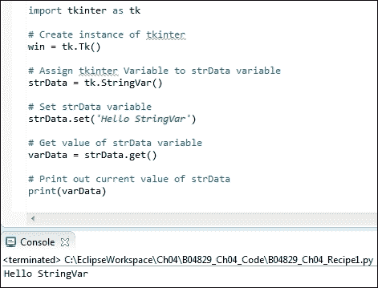
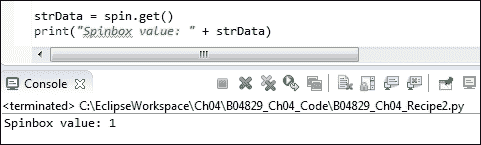
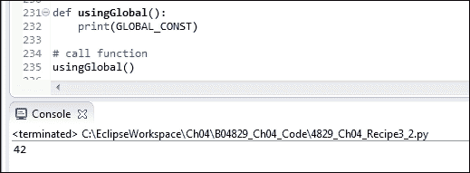
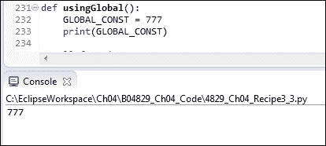
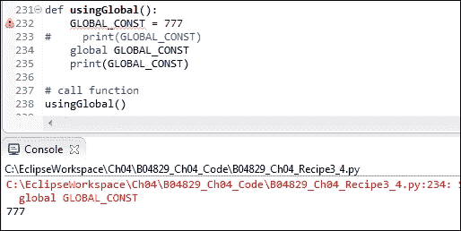
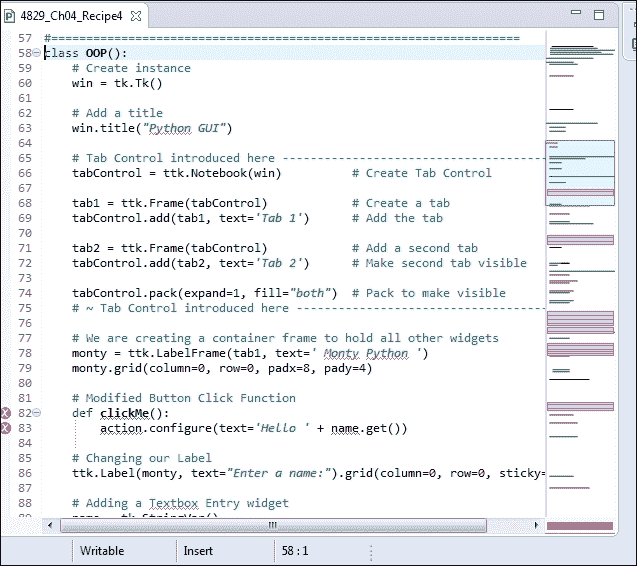
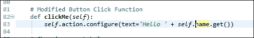
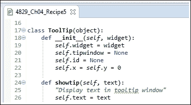
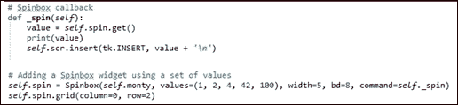

# 第四章数据和类别

在本章中，我们将使用 Python 3 使用数据和 OOP 类：

*   如何使用 StringVar（）
*   如何从小部件获取数据
*   使用模块级全局变量
*   类中的编码如何改进 GUI
*   编写回调函数
*   创建可重用的 GUI 组件

# 导言

在本章中，我们将把 GUI 数据保存到 tkinter 变量中。

我们还将开始使用**面向对象编程**（**OOP**来扩展现有的 tkinter 类，以扩展 tkinter 的内置功能。这将引导我们创建可重用的 OOP 组件。

# 如何使用 StringVar（）

tkinter 中有内置的编程类型，与我们用来编程的 Python 类型略有不同。StringVar（）是 tkinter 类型之一。

此配方将向您展示如何使用 StringVar（）类型。

## 准备好了吗

我们正在学习如何将来自 tkinter GUI 的数据保存到变量中，以便使用这些数据。我们可以设置和获取它们的值，非常类似于 Java getter/setter 方法。

以下是 tkinter 中可用的一些编码类型：

<colgroup><col style="text-align: left"> <col style="text-align: left"></colgroup> 
| `strVar = StringVar()` | #握着一根绳子；默认值为空字符串“” |
| `intVar = IntVar()` | #保存一个整数；默认值为 0 |
| `dbVar = DoubleVar()` | #持有浮点数；默认值为 0.0 |
| `blVar = BooleanVar()` | #保存一个布尔值，它返回 0 表示 false，返回 1 表示 true |

### 注

不同的语言使用小数点、浮点数或双精度来调用数字。Tkinter 为 Python 中所谓的浮点数据类型调用 DoubleVar。根据精度级别的不同，浮点和双精度数据可能会有所不同。这里，我们将 tkinter DoubleVar 转换为 Python 转换为 Python 浮点类型。

## 怎么做。。。

我们正在创建一个新的 Python 模块，下面的屏幕截图显示了代码和结果输出：



首先，我们导入 tkinter 模块并将其别名为`tk`。

接下来，我们使用这个别名创建一个`Tk`类的实例，方法是在`Tk`后面加上括号，调用该类的构造函数。这与调用函数的机制相同，只是这里我们要创建一个类的实例。

通常，我们使用分配给变量`win`的这个实例来启动代码中稍后的主事件循环。但是在这里，我们不是在显示 GUI，而是演示如何使用 tkinter StringVar 类型。

### 注

我们还需要创建一个`Tk()`的实例。如果我们注释掉这一行，我们将从 tkinter 得到一个错误，所以这个调用是必要的。

然后我们创建 tkinter StringVar 类型的实例，并将其分配给 Python`strData`变量。

之后，我们使用变量调用 StringVar 上的`set()`方法，将其设置为一个值后，我们获取该值并将其保存在名为`varData`的新变量中，然后打印出其值。

在 Eclipse PyDev 控制台中，在屏幕截图的底部，我们可以看到打印到控制台的输出，即**Hello StringVar**。

接下来，我们将打印 tkinter 的 IntVar、DoubleVar 和 BooleanVar 类型的默认值。


## 它是如何工作的。。。

正如在前面的屏幕截图中所看到的，默认值不会像我们预期的那样打印出来。

在线文献中提到了默认值，但在调用`get`方法之前，我们不会看到这些值。否则，我们只会得到一个自动递增的变量名（例如 PY_VAR3，如前面的屏幕截图所示）。

将tkinter 类型分配给 Python 变量不会改变结果。我们仍然没有得到默认值。

在这里，我们关注最简单的代码（它创建 PY_VAR0）：


在调用`get`方法之前，该值是 PY_VAR0，而不是预期的 0。现在我们可以看到默认值。我们没有调用`set`，因此，一旦我们对每个类型调用`get`方法，就会看到默认值自动分配给每个 tkinter 类型。


注意我们保存在`intData`变量中的`IntVar`实例的默认值 0 是如何打印到控制台的。我们还可以在屏幕截图顶部的 EclipsePydev 调试器窗口中看到这些值。

# 如何从小部件获取数据

当用户输入数据时，我们希望在代码中对进行处理。此配方显示如何在变量中捕获数据。在前面的配方中，我们创建了几个 tkinter 类变量。它们是独立的。现在，我们使用从 GUI 获得的数据将它们连接到 GUI，并将其存储在 Python 变量中。

## 准备好了吗

我们将继续使用上一章中构建的 Python GUI。

## 怎么做。。。

我们正在从 GUI 向 Python 变量分配一个值。

在模块底部，即主事件循环上方添加以下代码：

```py
strData = spin.get()
print("Spinbox value: " + strData)

# Place cursor into name Entry
nameEntered.focus()      
#======================
# Start GUI
#======================
win.mainloop()
```

运行代码得到如下结果：



我们正在检索`Spinbox`控件的当前值。

### 注

我们将代码放在 GUI 主事件循环之上，因此打印在 GUI 可见之前进行。如果我们想在显示 GUI 并更改`Spinbox`控件的值后打印出当前值，我们必须将代码放入回调函数中。

我们使用以下代码创建了 Spinbox 小部件，将可用值硬编码到其中：

```py
# Adding a Spinbox widget using a set of values
spin = Spinbox(monty, values=(1, 2, 4, 42, 100), width=5, bd=8, command=_spin) 
spin.grid(column=0, row=2)
```

我们还可以将数据的硬编码移出`Spinbox`类实例的创建，并在以后进行设置。

```py
# Adding a Spinbox widget assigning values after creation
spin = Spinbox(monty, width=5, bd=8, command=_spin) 
spin['values'] = (1, 2, 4, 42, 100)
spin.grid(column=0, row=2)
```

我们如何创建小部件并将数据插入其中并不重要，因为我们可以通过在小部件实例上使用`get()`方法来访问这些数据。

## 它是如何工作的。。。

为了从使用 tkinter 编写的 GUI 中获取值，我们在希望获取值的小部件实例上使用 tkinter`get()`方法。

在上面的示例中，我们使用了 Spinbox 控件，但是原理对于所有具有`get()`方法的小部件都是相同的。

一旦我们获得了数据，我们就进入了一个纯 Python 的世界，tkinter 确实为我们构建了 GUI。既然我们知道了如何从 GUI 中获取数据，我们就可以使用这些数据了。

# 使用模块级全局变量

封装是任何编程语言的主要优势，它使我们能够使用 OOP 编程。Python 是面向对象和过程的。我们可以创建全局变量，这些变量定位于它们所在的模块。它们仅对这个模块是全局的，这是封装的一种形式。我们为什么想要这个？因为，随着我们向 GUI 添加越来越多的功能，我们希望避免命名冲突，这可能会导致代码中出现错误。

### 注

我们不希望命名冲突在代码中造成 bug！名称空间是避免这些错误的一种方法，在 Python 中，我们可以通过使用 Python 模块（非官方名称空间）来做到这一点。

## 准备好了吗

我们可以在函数上方和外部的任何模块中声明模块级全局变量。

然后我们必须使用`global`Python 关键字来引用它们。如果我们忘记在函数中使用`global`，我们会意外地创建新的局部变量。这将是一个 bug，是我们真正不想做的事情。

### 注

Python 是一种动态的强类型语言。我们只会在运行时注意到这样的错误（忘记用 global 关键字定义变量的范围）。

## 怎么做。。。

将第 15 行显示的代码添加到我们在上一个配方和上一章中使用的 GUI 中，这将创建一个模块级全局变量。我们使用 C 风格的全大写约定，这并不是真正的“Pythonic”，但我认为这确实强调了我们在本食谱中所述的原则。


运行代码会打印出全局代码。通知**42**正在打印到 Eclipse 控制台。


## 它是如何工作的。。。

我们在模块顶部定义一个全局变量，然后在模块底部打印其值。

这很有效。

将此功能添加到模块底部：



上面，我们使用的是模块级全局。在`global`上加阴影很容易出错，如下截图所示：



注意`42`如何变成`777`，尽管我们使用的是相同的变量名。

### 注

Python 中没有编译器会在重写局部函数中的全局变量时发出警告。这可能导致运行时调试困难。

使用全局限定符（第 234 行）将我们最初分配给它的值（42）打印到模块顶部，如以下屏幕截图所示：


但是，要小心。当我们取消对本地全局的注释时，我们打印出本地值，而不是全局值：



尽管我们使用的是`global`限定符，但局部变量似乎覆盖了它。我们从 EclipsePydev 插件得到一个警告，我们的`GLOBAL_CONST = 777`没有被使用，但是运行代码仍然打印 777 而不是预期的 42。

这可能不是我们期望的行为。使用`global`限定符，我们可能希望指向前面创建的全局变量。

相反，Python 似乎在局部函数中创建了一个新的全局变量，并覆盖了我们之前创建的那个变量。

在编写小型应用程序时，全局变量非常有用。它们可以帮助在同一个 Python 模块中跨方法和函数提供数据，有时 OOP 的开销是不合理的。

随着我们的程序变得越来越复杂，我们从使用 globals 中获得的好处可能会迅速减少。

### 注

最好通过在不同的作用域中使用相同的名称来避免全局变量和意外地隐藏变量。我们可以使用 OOP 而不是 globals。

我们在过程代码中使用了全局变量，并学习了如何导致难以调试的 bug。在下一章中，我们将继续讨论 OOP，它可以消除这些类型的 bug。

# 类编码如何改善 GUI

到目前为止，我们一直在以程序化的方式编码。这是一种来自 Python 的快速脚本编写方法。一旦我们的代码变得越来越大，我们就需要使用 OOP 进行编码。

为什么？

因为，在许多其他好处中，OOP 允许我们通过使用方法来移动代码。一旦我们使用类，我们就不再需要将代码放在调用它的代码之上。这为我们组织代码提供了极大的灵活性。

我们可以在其他代码旁边编写相关的代码，而不必再担心代码不会运行，因为代码不会位于调用它的代码之上。

我们可以通过对引用未在该模块中创建的方法的模块进行编码，将其推向一些非常奇特的极端。它们依赖于在代码运行期间创建这些方法的运行时状态。

### 注

如果我们调用的方法当时还没有创建，我们会得到一个运行时错误。

## 准备好了吗

我们将非常简单地将整个过程代码转换为 OOP。我们只需将其转换为一个类，缩进所有现有代码，并将`self`前置到所有变量。

这很容易。

虽然一开始它可能会觉得有点烦人，不得不用`self`关键字在所有东西前面加上前缀，使我们的代码更加冗长（嘿，我们浪费了这么多的纸张……）；最终，这是值得的。

## 怎么做。。。

在开始的时候，所有的地狱都被打破了，但是我们很快就会修复这个明显的混乱。

注意，在 Eclipse 中，PyDev 编辑器通过在代码编辑器右侧以红色突出显示代码问题来提示编码问题。

也许我们不应该在 OOP 中编码，但这就是我们所做的，并且有很好的理由。



我们只需要在所有变量前面加上`self`关键字，并使用`self`将函数绑定到类，这在技术上正式地将函数转化为方法。

### 注

函数和方法之间存在差异。Python 非常清楚地说明了这一点。方法绑定到类，而函数不绑定到类。我们甚至可以在同一个 Python 模块中混合使用这两者。

让我们在前面加上`self`以去除红色，这样我们就可以再次运行代码了。



一旦我们对所有以红色突出显示的错误执行此操作，我们就可以再次运行 Python 代码。

`clickMe`函数现在绑定到类，并正式成为一种方法。

不幸的是，以过程的方式开始，然后将其转换为 OOP 并不像我上面所说的那样简单。代码变得一团糟。这是开始使用 OOP 范式在 Python 中编程的一个很好的理由。

### 注

Python 擅长以简单的方式做事。简单的代码通常会变得更复杂（因为它很容易开始）。一旦我们变得太复杂，将过程代码重构成真正的 OOP 代码就变得越来越难了。

我们正在将过程代码转换为面向对象的代码。看看我们所遇到的所有麻烦，仅将 200 多行 Python 代码翻译成 OOP 可能意味着我们最好从一开始就开始用 OOP 编码。

实际上，我们确实破坏了以前的一些工作功能。使用选项卡 2 并单击单选按钮不再有效。我们必须进行更多的重构。

过程代码很简单，因为它只是从上到下的编码。既然我们已经将代码放入了一个类中，我们就必须将所有回调函数移到方法中。这是可行的，但需要一些工作来翻译我们的原始代码。

我们的程序代码如下所示：

```py
# Button Click Function
def clickMe():
    action.configure(text='Hello ' + name.get())

# Changing our Label
ttk.Label(monty, text="Enter a name:").grid(column=0, row=0, sticky='W')

# Adding a Textbox Entry widget
name = tk.StringVar()
nameEntered = ttk.Entry(monty, width=12, textvariable=name)
nameEntered.grid(column=0, row=1, sticky='W')

# Adding a Button
action = ttk.Button(monty, text="Click Me!", command=clickMe)
action.grid(column=2, row=1)

The new OOP code looks like this:
class OOP():
    def __init__(self): 
        # Create instance
        self.win = tk.Tk()   

        # Add a title       
        self.win.title("Python GUI")      
        self.createWidgets()

    # Button callback
    def clickMe(self):
        self.action.configure(text='Hello ' + self.name.get())

    # … more callback methods 

    def createWidgets(self):    
        # Tab Control introduced here -----------------------
        tabControl = ttk.Notebook(self.win)     # Create Tab Control

        tab1 = ttk.Frame(tabControl)            # Create a tab 
        tabControl.add(tab1, text='Tab 1')      # Add the tab

        tab2 = ttk.Frame(tabControl)            # Create second tab
        tabControl.add(tab2, text='Tab 2')      # Add second tab 

        tabControl.pack(expand=1, fill="both")  # Pack make visible
#======================
# Start GUI
#======================
oop = OOP()
oop.win.mainloop()
```

我们将回调方法移动到模块的顶部，在新的 OOP 类中。我们将所有小部件创建代码移动到一个相当长的方法中，我们在类的初始值设定项中调用该方法。

从技术上讲，在底层代码的底层，Python 确实有一个构造函数，但是 Python 让我们不必担心这一点。它为我们照顾好了。

相反，除了“真实”构造函数之外，Python 还为我们提供了一个初始值设定项。

强烈建议我们使用此初始值设定项。我们可以使用它向类传递参数，初始化我们希望在类实例内部使用的变量。

### 注

在 Python 中，同一个 Python 模块中可以存在多个类。

与 Java 不同，Java 有一个非常严格的命名约定（没有它就无法工作），Python 要灵活得多。

### 注

我们可以在同一个 Python 模块中创建多个类。与 Java 不同，我们不依赖于必须匹配每个类名的文件名。

巨蟒真厉害！

一旦我们的 pythongui 变大，我们将把一些类分解成它们自己的模块，但与 Java 不同，我们不必这样做。在这本书和项目中，我们将在同一个模块中保留一些类，同时，我们将把其他一些类分解到它们自己的模块中，将它们导入到可以被视为 main（）函数的模块中（这不是 C，但我们可以认为类似 C，因为 Python 非常灵活）。

到目前为止，我们所取得的成果是将`ToolTip`类添加到我们的 Python 模块中，并将我们的过程性 Python 代码重构为 OOP Python 代码。

在这里，在这个配方中，我们可以看到在同一个 Python 模块中可以存在多个类。

真是太酷了！



类和`OOP`类都位于同一个 Python 模块中。


## 它是如何工作的。。。

在此配方中，我们将过程代码提升为面向对象编程（OOP）代码。

Python 使我们能够以实用的、过程式的风格（如 C 编程语言）编写代码。

同时，我们可以选择一种 OOP 风格的代码，如 java、C++、C++。

# 编写回调函数

一开始，回调函数似乎有点吓人。你调用函数，给它传递一些参数，现在函数告诉你它真的很忙，它会给你回电话！

你会想：“这个函数*会*给我回电话吗？”“我需要*等*多久？”

在 Python 中，甚至回调函数都很简单，而且，是的，它们通常会回调您。

他们只需要先完成分配给他们的任务（嘿，是你首先给他们编码的…）。

让我们进一步了解一下在 GUI 中编写回调代码时会发生什么。

我们的 GUI 是事件驱动的。创建并显示在屏幕上后，它通常会坐在那里等待事件发生。它基本上是在等待事件发送给它。我们可以通过单击 GUI 的一个操作按钮将事件发送到 GUI。

这会创建一个事件，从某种意义上说，我们通过向 GUI 发送消息来“调用”它。

现在，在我们向 GUI 发送消息之后应该发生什么？

单击按钮后发生的情况取决于我们是否创建了事件处理程序并将其与此按钮关联。如果我们没有创建事件处理程序，那么单击按钮将没有任何效果。

事件处理程序是一个回调函数（或方法，如果我们使用类）。

回调方法也被动地坐在那里，就像我们的 GUI 一样，等待被调用。

一旦我们的 GUI 点击了按钮，它就会调用回调。

回调通常会进行一些处理，完成后，它会将结果返回到 GUI。

### 注

从某种意义上说，我们可以看到回调函数正在回调 GUI。

## 准备好了吗

Python 解释器一次遍历项目中的所有代码，找出语法错误并指出它们。如果语法不正确，则无法运行 Python 代码。这包括缩进（如果不导致语法错误，错误的缩进通常会导致错误）。

在下一轮解析中，解释器解释并运行我们的代码。

在运行时，可以生成许多 GUI 事件，通常是回调函数向 GUI 小部件添加功能。

## 怎么做。。。

以下是 Spinbox 小部件的回调：



## 它是如何工作的。。。

我们在`OOP`类中创建了一个回调方法，当我们从 Spinbox 小部件中选择一个值时会调用该方法，因为我们通过`command`参数（`command=self._spin`将该方法绑定到小部件。我们使用一个前导下划线来暗示这个方法应该像私有 Java 方法一样受到尊重。

Python 故意避免语言限制，如 private、public、friend 等。

在 Python 中，我们使用命名约定。围绕关键字的前导和尾随双下划线应该仅限于 Python 语言，我们不应该在自己的 Python 代码中使用它们。

但是，我们可以在变量名或函数前加一个下划线前缀，以提示应该将该名称视为私有帮助器。

同时，如果我们希望使用 Python 内置名称，我们可以在一个下划线后加后缀。例如，如果我们希望缩短列表的长度，我们可以执行以下操作：

```py
len_ = len(aList)
```

通常，下划线很难阅读，也很容易监督，所以在实践中这可能不是最好的主意。

# 创建可重用的 GUI 组件

我们正在使用 Python 创建可重用的 GUI 组件。

在这个配方中，我们将通过将`ToolTip`类移动到它自己的模块中来保持简单。接下来，我们将导入并使用它在 GUI 的几个小部件上显示工具提示。

## 准备好了吗

我们是在以前的代码的基础上开发的。

## 怎么做。。。

我们将首先将`ToolTip`类拆分为一个单独的 Python 模块。我们将稍微增强它，以便将鼠标悬停在控件上时希望显示的控件小部件和工具提示文本传入。

我们创建一个新的 Python 模块，并将`ToolTip`类代码放入其中，然后将该模块导入主模块。

然后，我们通过创建几个工具提示重用导入的`ToolTip`类，当鼠标悬停在几个 GUI 小部件上时可以看到这些工具提示。

将我们常见的`ToolTip`类代码重构到它自己的模块中有助于我们重用其他模块中的代码。我们不使用复制/粘贴/修改，而是使用 DRY 原则，我们的通用代码仅位于一个位置，因此当我们修改代码时，所有导入代码的模块将自动获得我们模块的最新版本。

### 注

DRY 代表“不要重复你自己”，我们将在后面的章节中再次讨论它。

通过将 Tab3 映像转换为可重用组件，我们可以做类似的事情。

为了保持这个配方的代码简单，我们删除了表 3，但是您可以使用上一章中的代码进行实验。


```py

# Add a Tooltip to the Spinbox
tt.createToolTip(self.spin, 'This is a Spin control.')

# Add Tooltips to more widgets
tt.createToolTip(nameEntered, 'This is an Entry control.')
tt.createToolTip(self.action, 'This is a Button control.')
tt.createToolTip(self.scr, 'This is a ScrolledText control.')
```

此也适用于第二个选项卡。


新的代码结构如下所示：


import 语句如下所示：


单独模块中的中断（又名重构）代码如下所示：


## 它是如何工作的。。。

在前面的屏幕截图中，我们可以看到显示了多条工具提示消息。主窗口的工具提示可能看起来有点烦人，因此最好不要显示主窗口的工具提示，因为我们确实希望突出显示各个小部件的功能。主窗口窗体有一个说明其用途的标题；不需要工具提示。