# 第五章 Matplotlib 图表

在本章中，我们将使用 Python 3 和 Matplotlib 模块创建漂亮的图表。

*   使用 Matplotlib 创建漂亮的图表
*   Matplotlib–使用 pip 下载模块
*   Matplotlib–下载带有 whl 扩展的模块
*   创建我们的第一张图表
*   在图表上放置标签
*   如何给图表添加图例
*   比例图
*   动态调整图表的比例

# 导言

在本章中，我们将创建漂亮的图表，直观地表示数据。根据数据源的格式，我们可以在同一图表中绘制一列或多列数据。

我们将使用 Python Matplotlib 模块创建图表。

为了创建这些图形图表，我们需要下载额外的 Python 模块，有几种方法可以安装它们。

本章将解释如何下载 Matplotlib Python 模块、所有其他必需的 Python 模块以及实现方法。

在安装了所需的模块之后，我们将创建自己的 Pythonic 图表。

# 使用 Matplotlib 创建美丽的图表

这个配方向我们介绍了 Matplotlib Python模块，它使我们能够使用 Python 3 创建可视化图表。

以下 URL 是开始探索 Matplotlib 世界的好地方，它将教您如何创建本章中未介绍的许多图表：

[http://matplotlib.org/users/screenshots.html](http://matplotlib.org/users/screenshots.html)

## 准备好了吗

为了使用 Matplotlib Python 模块，我们首先必须安装这个模块，以及其他几个相关的 Python 模块，如 numpy。

如果您运行的 Python 版本低于 3.4.3，我建议您升级 Python 版本，因为在本章中，我们将使用 Python pip 模块来安装所需的 Python 模块，并且 pip 与 3.4.3 及以上版本一起安装。

### 注

可以使用 Python3 的早期版本安装 pip，但过程不是很直观，因此升级到 3.4.3 或更高版本肯定更好。

## 怎么做。。。

下图是使用 Python 和 Matplotlib 模块创建难以置信的图形图表的示例。

我从[中复制了以下代码 http://matplotlib.org/](http://matplotlib.org/) 网站，创建了这张不可思议的图表。这个网站上有很多例子，我鼓励你尝试一下，直到你找到你喜欢的图表。

下面是创建图表的代码，用不到 25 行 Python 代码，包括空格。

```py
from mpl_toolkits.mplot3d import Axes3D
from matplotlib import cm
from matplotlib.ticker import LinearLocator, FormatStrFormatter
import matplotlib.pyplot as plt
import numpy as np

fig = plt.figure()
ax = fig.gca(projection='3d')
X = np.arange(-5, 5, 0.25)
Y = np.arange(-5, 5, 0.25)
X, Y = np.meshgrid(X, Y)
R = np.sqrt(X**2 + Y**2)
Z = np.sin(R)
surf = ax.plot_surface(X, Y, Z, rstride=1, cstride=1, cmap=cm.coolwarm, linewidth=0, antialiased=False)

ax.set_zlim(-1.01, 1.01)

ax.zaxis.set_major_locator(LinearLocator(10))
ax.zaxis.set_major_formatter(FormatStrFormatter('%.02f'))

fig.colorbar(surf, shrink=0.5, aspect=5)

plt.show()
```

运行代码创建下图所示的图表：

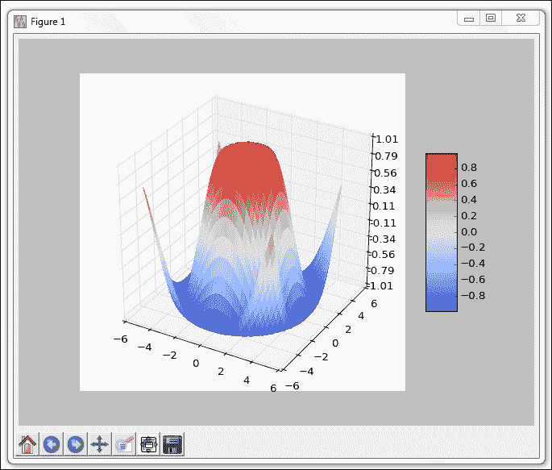

在 Eclipse PyDev 插件中使用 Python 3.4 或更高版本运行代码可能会显示一些未解决的导入错误。这似乎是 PyDev 或 Java 中的一个 bug。

如果使用 Eclipse 进行开发，请忽略这些错误，因为代码将成功运行。

## 它是如何工作的。。。

为了创建如前一屏幕截图所示的漂亮图形，我们需要下载其他几个 Python 模块。

下面的食谱将指导我们如何成功下载所有必需的模块，这使我们能够创建自己美丽的图表。

# Matplotlib–使用 pip 下载模块

下载额外 Python 模块的常用方法是使用 pip。pip 模块预装了最新版本的 Python（3.4 及更高版本）。

### 注

如果您使用的是较旧版本的 Python，则可能需要自己下载 pip 和 setuptools。

除了使用 Python 安装程序外，还有其他几个预编译的 Windows 可执行文件，使我们可以轻松地安装 Python 模块，如 Matplotlib。

此配方将展示如何通过 Windows 可执行文件成功安装 Matplotlib，以及如何使用 pip 安装 Matplotlib 库所需的其他模块。

## 准备好了吗

要下载使用 Matplotlib 模块所需的 Python 模块，我们需要做的就是在 PC 上安装 Python 版本 3.4（或更高版本）。

## 怎么做。。。

我们可以通过 Matplotlib 官方网站上的 Windows 可执行文件安装 Matplotlib。

确保安装的 Matplotlib 版本与正在使用的 Python 版本匹配。例如，如果在 64 位操作系统（如 Microsoft Windows 7）上安装了 Python 3.4，请下载并安装`Matplotlib-1.4.3.win-amd64-py3.4.exe`。

### 注

可执行名称中间的“AMD64”意味着您正在安装 64 位版本。如果您使用的是 32 位 x86 系统，则安装 amd64 将不起作用。如果安装了 32 位版本的 Python 并下载了 64 位 Python 模块，则可能会出现类似的问题。


运行可执行文件将启动，如下所示：

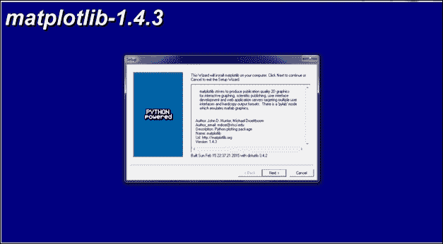

我们可以通过查看 Python 安装目录来验证是否已成功安装 Matplotlib。

成功安装后，Matplotlib 文件夹被添加到站点包中。使用默认安装，Windows 上 site packages 文件夹的完整路径为：

`C:\Python34\Lib\site-packages\matplotlib\`

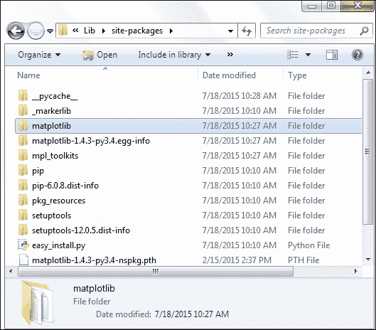

官方 Matplotlib 网站上最简单的绘图示例需要使用 Python numpy 模块，因此接下来让我们下载并安装此模块。

### 注

Numpy 是一个数学模块，可以绘制 Matplotlib 图表，但远远超出 Matplotlib。如果您正在开发的软件需要大量的数学计算，那么您一定要查看 numpy。

有一个很好的网站，它为我们提供了几乎所有 Python 模块的快速链接。它指出了哪些其他 Python 模块是成功使用 Matplotlib所必需的，并为我们提供了下载这些模块的超链接，这使我们能够快速轻松地安装它们，从而大大节省了时间。

### 注

以下是链接：

[http://www.lfd.uci.edu/~gohlke/pythonlibs/](http://www.lfd.uci.edu/~gohlke/pythonlibs/)

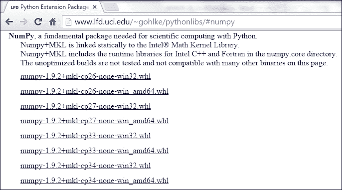

注意安装程序包的文件扩展名都以 whl 结尾。为了使用它们，我们必须安装 PythonWheel 模块，我们使用 pip 来完成这项工作。

### 注

轮子是 Python 发行版的新标准，旨在取代鸡蛋。

您可以在以下网站找到更多详细信息：

[http://pythonwheels.com/](http://pythonwheels.com/)

最好以管理员身份运行 Windows 命令处理器，以避免潜在的安装错误。


## 它是如何工作的。。。

下载 Python 模块的常用方法是使用 pip 下载，如上所示。为了安装 Matplotlib 所需的所有模块，我们可以下载它们的主网站的下载格式已更改为使用 whl 格式。

下一个食谱将解释如何使用 wheel 安装 Python 模块。

# Matplotlib–下载带有 whl 扩展的模块

我们将使用 Matplotlib 所需的几个额外的Python 模块，在本配方中，我们将使用 Python 新的模块分发标准（称为 wheel）下载它们。

### 注

您可以在以下 URL 找到新 wheel 标准的 Python 增强建议（PEP）：[https://www.python.org/dev/peps/pep-0427/](https://www.python.org/dev/peps/pep-0427/)

## 准备好了吗

为了下载带有 whl 扩展的 Python 模块，必须首先安装 PythonWheel 模块，这在前面的配方中已经解释过。

## 怎么做。。。

让我们从网上下载`numpy-1.9.2+mkl-cp34-none-win_amd64.whl`。安装车轮模块后，我们可以使用 pip 安装具有 whl 文件扩展名的软件包。

### 注

Pip 附带 Python3.4.3 及更高版本。如果您使用的是较旧版本的 Python，我建议您安装 pip，因为它使安装所有其他 Python 模块变得更加容易。

更好的建议可能是将 Python 版本升级到最新的稳定版本。当您阅读本书时，最有可能的是 Python 3.5.0 或更高版本。

Python 是自由软件。升级不需要任何费用。

浏览到要安装的包所在的文件夹，使用以下命令进行安装：

```py
pip install numpy-1.9.2+mkl-cp34-none-win_amd64.whl

```


现在，我们可以使用官方网站上最简单的示例应用程序创建第一个 Matplotlib 图表。之后，我们将创建自己的图表。

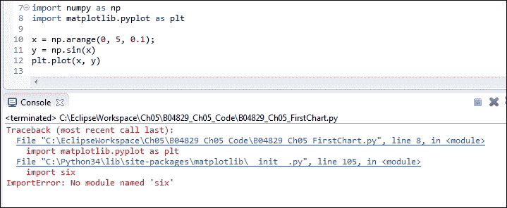

我们还没有完全准备好运行前面的代码，这表明我们需要下载更多的模块。虽然一开始不得不下载更多的模块似乎有点烦人，但这确实是一种代码重用。

因此，让我们使用带轮子的 pip 下载并安装六个模块和所有其他必需的模块（dateutil、pyparsing 等），直到我们的代码正常工作，并仅用几行 Python 代码创建一个漂亮的图表。

我们可以从刚刚安装 numpy 的同一个网站下载所有必需的模块。这个网站甚至列出了我们正在安装的模块所依赖的所有其他模块，并且有超链接可以跳转到这个网站上的安装软件。

### 注

正如前面提到的，安装 Python 模块的 URL 是：[http://www.lfd.uci.edu/~gohlke/pythonlibs/](http://www.lfd.uci.edu/~gohlke/pythonlibs/)

## 它是如何工作的。。。

使我们能够从一个方便的地方下载许多 Python 模块的网站还提供了其他 Python 模块。并非所有显示的依赖项都是必需的。这取决于你正在开发什么。随着使用 Matplotlib 库的进程的推进，您可能需要下载并安装其他模块。


# 创建我们的第一张图表

现在我们已经安装了所有必需的 Python 模块，我们可以使用 Matplotlib 创建自己的图表。

我们只能从几行 Python 代码中创建图表。

## 准备好了吗

使用上一个配方中的代码，我们现在可以创建一个与下一个类似的图表。

## 怎么做。。。

使用官方网站上显示的最小代码量，我们可以创建第一张图表。嗯，差不多了。在我们导入`show`方法并调用它之前，网站上显示的示例代码不起作用。

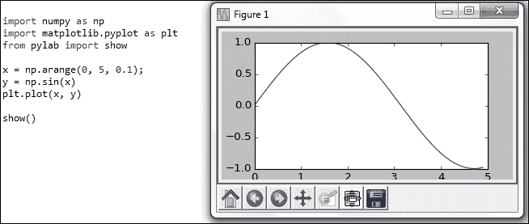

我们可以使用 Matplotlib 官方网站上提供的许多示例中的另一个来简化代码，甚至改进代码。


## 它是如何工作的。。。

Python Matplotlib 模块与 numpy 等附加组件相结合，创建了一个非常丰富的编程环境，使我们能够非常轻松地进行数学计算并将其绘制在可视化图表中。

Python numpy 方法`arange`并不打算安排任何事情。这意味着创建一个“range”，在 Python 中，它用于内置的“range”操作符。`linspace`方法也会造成类似的混乱。“林”是谁，在什么“空间”里？

事实证明，这个名字的意思是“线性间隔向量”。

pyglet 函数`show`显示我们创建的图形。在成功创建第一个图形后，尝试绘制另一个图形时，调用`show()`会产生一些副作用。

# 在图表上贴标签

到目前为止，我们已经使用了默认的 Matplotlib GUI。现在我们将使用 Matplotlib 创建一些 tkinter GUI。

这将需要更多的 Python 代码行和导入更多的库，这是非常值得的，因为我们正在使用画布控制我们的绘画。

我们将在水平轴和垂直轴上放置标签，即*x*和*y*。

为此，我们将创建一个 Matplotlib 图形，并在其上进行绘制。

我们还将学习如何使用子图，这将使我们能够在同一窗口中绘制多个图形。

## 准备好了吗

安装了必要的 Python 模块，并且知道在哪里可以找到官方在线文档和教程，现在我们可以继续创建 Matplotlib 图表了。

## 怎么做。。。

虽然`plot`是创建 Matplotlib 图表的最简单方法，但将`Figure`与`Canvas`结合使用会创建一个更为定制的图形，它看起来更好，还使我们能够向其中添加按钮和其他小部件。

```py
from matplotlib.figure import Figure
from matplotlib.backends.backend_tkagg import FigureCanvasTkAgg
import tkinter as tk
#--------------------------------------------------------------
fig = Figure(figsize=(12, 8), facecolor='white')
#--------------------------------------------------------------
# axis = fig.add_subplot(111)   # 1 row,  1 column, only graph
axis = fig.add_subplot(211)     # 2 rows, 1 column, Top graph
#--------------------------------------------------------------
xValues = [1,2,3,4]
yValues = [5,7,6,8]
axis.plot(xValues, yValues)

axis.set_xlabel('Horizontal Label')
axis.set_ylabel('Vertical Label')

# axis.grid()                   # default line style 
axis.grid(linestyle='-')        # solid grid lines
#--------------------------------------------------------------
def _destroyWindow():
    root.quit()
    root.destroy() 
#--------------------------------------------------------------
root = tk.Tk() 
root.withdraw()
root.protocol('WM_DELETE_WINDOW', _destroyWindow)   
#--------------------------------------------------------------
canvas = FigureCanvasTkAgg(fig, master=root)
canvas._tkcanvas.pack(side=tk.TOP, fill=tk.BOTH, expand=1)
#--------------------------------------------------------------
root.update()
root.deiconify()
root.mainloop()
```

运行前面的代码将生成以下图表：


在 import 语句之后的第一行代码中，我们创建了一个`Figure`对象的实例。接下来，我们通过调用`add_subplot(211)`将子图添加到此图中。211 中的第一个数字表示要添加多少个绘图，第二个数字表示列数，第三个数字表示绘图的显示顺序。

我们还将添加栅格并更改其默认线样式。

尽管我们在图表中只显示一个图，但通过选择 2 作为子图的数量，我们将向上移动该图，这将导致图表底部出现额外的空白。第一个绘图现在只占屏幕的 50%，这会影响显示此绘图的网格线的大小。

### 注

通过取消对`axis =`和`axis.grid()`代码的注释来测试代码，以查看不同的效果。

我们可以通过使用`add_subplot(212)`将子图分配到第二个位置来添加更多子图。

```py
from matplotlib.figure import Figure
from matplotlib.backends.backend_tkagg import FigureCanvasTkAgg
import tkinter as tk
#--------------------------------------------------------------
fig = Figure(figsize=(12, 8), facecolor='white')
#--------------------------------------------------------------
axis = fig.add_subplot(211)     # 2 rows, 1 column, Top graph
#--------------------------------------------------------------
xValues = [1,2,3,4]
yValues = [5,7,6,8]
axis.plot(xValues, yValues)

axis.set_xlabel('Horizontal Label')
axis.set_ylabel('Vertical Label')

axis.grid(linestyle='-')        # solid grid lines
#--------------------------------------------------------------
axis1 = fig.add_subplot(212)    # 2 rows, 1 column, Bottom graph
#--------------------------------------------------------------
xValues1 = [1,2,3,4]
yValues1 = [7,5,8,6]
axis1.plot(xValues1, yValues1)
axis1.grid()                    # default line style 
#--------------------------------------------------------------
def _destroyWindow():
    root.quit()
    root.destroy() 
#--------------------------------------------------------------
root = tk.Tk() 
root.withdraw()
root.protocol('WM_DELETE_WINDOW', _destroyWindow)   
#--------------------------------------------------------------
canvas = FigureCanvasTkAgg(fig, master=root)
canvas._tkcanvas.pack(side=tk.TOP, fill=tk.BOTH, expand=1)
#--------------------------------------------------------------
root.update()
root.deiconify()
root.mainloop()
```

现在，运行稍加修改的代码将 axis1 添加到图表中。对于底部绘图的网格，我们将线样式保留为默认值。


## 它是如何工作的。。。

我们导入了必要的 Matplotlib 模块，以创建一个图形和一个画布来绘制图表。我们给了它一些*x*和*y*轴的值，并设置了很多配置选项中的一些。

我们创建了自己的 tkinter 窗口，在其中显示图表并自定义绘图的位置。

如前几章所述，为了创建 tkinter GUI，我们首先必须导入 tkinter 模块，然后创建`Tk`类的实例。我们将这个类实例分配给一个名为`root`的变量，这是一个在示例中经常使用的名称。

在启动主事件循环之前，我们的 tkinter GUI 将不可见，为此，我们使用`root.mainloop()`。

这里避免使用 Matplotlib 默认 GUI，而是使用 tkinter 创建我们自己的 GUI 的一个重要原因是，我们希望改进默认 Matplotlib GUI 的外观，我们可以使用 tkinter 轻松地做到这一点。

如果我们使用 tkinter 构建 GUI，Matplotlib GUI 的底部不再出现那些看起来过时的按钮。

同时，Matplotlib GUI 有一个我们的 tkinter GUI 没有的功能，那就是当我们在图表中移动鼠标时，我们实际上可以看到 Matplotlib GUI 中的 x 和 y 坐标。x 和 y 坐标位置显示在右下角。

# 如何给图表添加图例

一旦我们开始绘制多行数据点，事情可能会变得有点不清楚。通过在图表中添加图例，我们可以知道哪些数据是什么，以及它的实际含义。

我们不必选择不同的颜色来表示不同的数据。Matplotlib 会自动为每行数据点指定不同的颜色。

我们所要做的就是创建图表并添加图例。

## 准备好了吗

在本配方中，我们将增强上一配方的图表。我们将只绘制一张图表。

## 怎么做。。。

首先，我们将在同一个图表中绘制更多的数据线，然后在图表中添加图例。

我们通过修改前面配方中的代码来实现这一点。

```py
from matplotlib.figure import Figure
from matplotlib.backends.backend_tkagg import FigureCanvasTkAgg
import tkinter as tk
#--------------------------------------------------------------
fig = Figure(figsize=(12, 5), facecolor='white')
#--------------------------------------------------------------
axis  = fig.add_subplot(111)                  # 1 row, 1 column

xValues  = [1,2,3,4]

yValues0 = [6,7.5,8,7.5]
yValues1 = [5.5,6.5,8,6]
yValues2 = [6.5,7,8,7]

t0, = axis.plot(xValues, yValues0)
t1, = axis.plot(xValues, yValues1)
t2, = axis.plot(xValues, yValues2)

axis.set_ylabel('Vertical Label')
axis.set_xlabel('Horizontal Label')

axis.grid()

fig.legend((t0, t1, t2), ('First line', 'Second line', 'Third line'), 'upper right')

#--------------------------------------------------------------
def _destroyWindow():
    root.quit()
    root.destroy() 
#--------------------------------------------------------------
root = tk.Tk() 
root.withdraw()
root.protocol('WM_DELETE_WINDOW', _destroyWindow)
#--------------------------------------------------------------
canvas = FigureCanvasTkAgg(fig, master=root)
canvas._tkcanvas.pack(side=tk.TOP, fill=tk.BOTH, expand=1)
#--------------------------------------------------------------
root.update()
root.deiconify()
root.mainloop()
```

运行修改后的代码创建下图，右上角有一个图例：

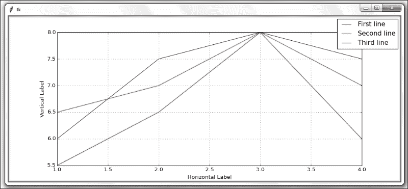

我们在这个配方中只绘制了一个图表，我们通过更改`fig.add_subplot(111)`来实现这一点。我们还通过`figsize`属性稍微修改了图形的大小。

接下来，我们创建三个 Python 列表，其中包含要绘制的值。当我们绘制数据时，我们将对绘图的引用保存在局部变量中。

我们通过传入一个包含三个图的引用的元组来创建图例，另一个元组包含图例中显示的字符串，在第三个参数中，我们将图例放置在图表中。

Matplotlib 的默认设置为正在打印的线指定颜色方案。

通过在绘制每个轴时设置属性，可以轻松地将此默认颜色设置更改为我们喜欢的颜色。

我们通过使用 color 属性并为其指定一个可用的颜色值来实现这一点。

```py
t0, = axis.plot(xValues, yValues0, color = 'purple')
t1, = axis.plot(xValues, yValues1, color = 'red')
t2, = axis.plot(xValues, yValues2, color = 'blue')
```

请注意，t0、t1 和 t2 变量赋值后的逗号不是错误，而是创建图例所必需的。

每个变量后面的逗号将列表转换为元组。如果我们忽略此项，我们的图例将不会显示。

代码仍将运行，只是没有预期的图例。

### 注

删除 t0=赋值后的逗号时，会出现错误，第一行不再出现在图中。图表和图例仍会创建，但图例中没有第一行。


## 它是如何工作的。。。

我们通过在同一图表中绘制三行数据并给它一个图例来增强我们的图表，以便区分这三行所绘制的数据。

# 比例图

在之前的配方中，我们在创建第一张图表并对其进行增强的同时，硬编码了这些值在视觉上的表示方式。

虽然这对我们使用的值很有用，但我们经常从非常大的数据库绘制图表。

根据数据的范围，我们对垂直 y 维度的硬编码值可能并不总是最佳解决方案，这可能使我们很难看到图表中的线条。

## 准备好了吗

我们将改进之前配方的代码。如果您没有输入前面所有配方中的所有代码，只需下载本章的代码，就可以开始了（然后您就可以使用 Python 创建 GUI、图表等了）。

## 怎么做。。。

修改上一配方中的`yValues1`代码行，将 50 作为第三个值。

```py
axis  = fig.add_subplot(111)        # 1 row, 1 column

xValues  = [1,2,3,4]

yValues0 = [6,7.5,8,7.5]
yValues1 = [5.5,6.5,50,6]           # one very high value
yValues2 = [6.5,7,8,7]
```

与上一个配方中创建图表的代码的唯一区别是一个数据值。

通过更改一个与所有绘制线的所有其他值的平均范围不接近的值，数据的视觉表示方式发生了显著变化，我们丢失了大量有关总体数据的详细信息，现在主要看到一个高峰值。

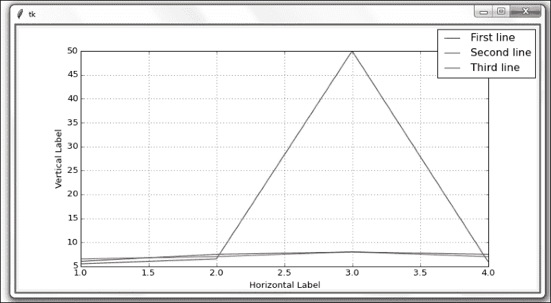

到目前为止，我们的图表已经根据它们直观显示的数据进行了自我调整。

虽然这是 Matplotlib 的一个实用功能，但这并不总是我们想要的。我们可以通过限制垂直 y 维度来限制图表的比例。

```py
yValues0 = [6,7.5,8,7.5]
yValues1 = [5.5,6.5,50,6]           # one very high value (50)
yValues2 = [6.5,7,8,7]

axis.set_ylim(5, 8)                 # limit the vertical display
```

代码的`axis.set_ylim(5, 8)`行现在将垂直显示的起始值限制为 5，结束值限制为 8。

现在，当我们创建图表时，高价值峰值不再具有以前的影响。

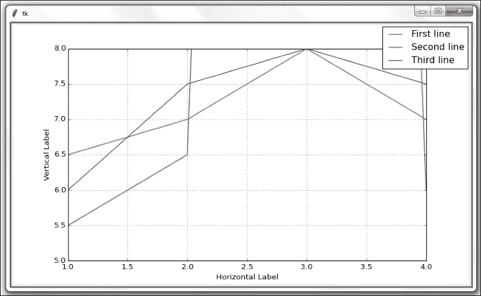

## 它是如何工作的。。。

我们在数据中增加了一个值，结果产生了戏剧性的效果。通过设置图表垂直和水平显示的限制，我们可以看到我们最感兴趣的数据。

像刚才显示的尖峰一样，也会引起极大的兴趣。这完全取决于我们在寻找什么。数据的可视化表示具有很大的价值。

### 注

一幅画抵得上千言万语。

# 动态调整图表比例

在之前的配方中，我们学习了如何限制图表的缩放。在本配方中，我们将更进一步，通过设置限制并在表示数据之前分析数据，动态调整缩放比例。

## 准备好了吗

我们将通过读取动态绘制的数据、求平均值，然后调整图表，来增强前面配方中的代码。

虽然我们通常会从外部源读取数据，但在本配方中，我们使用 Python 列表创建正在绘制的数据，如以下代码所示。

## 怎么做。。。

我们正在 Python 模块中创建自己的数据，方法是将带有数据的列表分配给 xvalues 和 yvalues 变量。

在许多图形中，x 和 y 坐标系的起点从（0，0）开始。这通常是个好主意，所以让我们相应地调整图表坐标代码。

让我们修改代码以设置 x 和 y 维度的限制：

```py
xValues  = [1,2,3,4]

yValues0 = [6,7.5,8,7.5]
yValues1 = [5.5,6.5,50,6]           # one very high value (50)
yValues2 = [6.5,7,8,7]              

axis.set_ylim(0, 8)                 # lower limit (0)
axis.set_xlim(0, 8)                 # use same limits for x
```

现在我们已经为 x 和 y 设定了相同的限制，我们的图表可能看起来更加平衡。当我们运行修改后的代码时，我们得到以下结果：

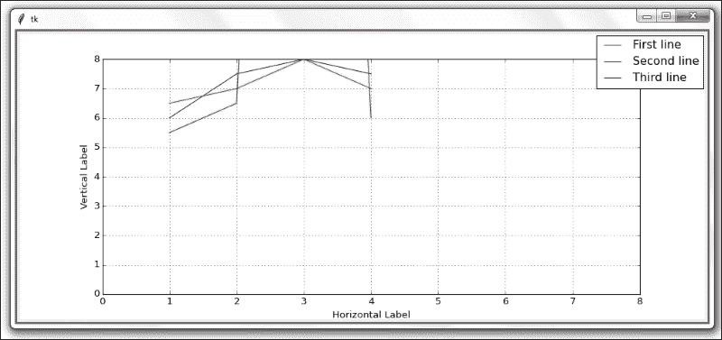

也许从（0，0）开始并不是一个好主意…

我们真正想做的是根据数据范围动态调整图表，同时限制过高或过低的值。

我们可以通过解析图表中要表示的所有数据，同时设置一些明确的限制来实现这一点。

修改代码，如下所示：

```py
xValues  = [1,2,3,4]

yValues0 = [6,7.5,8,7.5]
yValues1 = [5.5,6.5,50,6]              # one very high value (50)
yValues2 = [6.5,7,8,7]              
yAll = [yValues0, yValues1, yValues2]  # list of lists

# flatten list of lists retrieving minimum value
minY = min([y for yValues in yAll for y in yValues])

yUpperLimit = 20
# flatten list of lists retrieving max value within defined limit
maxY = max([y for yValues in yAll for y in yValues if y < yUpperLimit])

# dynamic limits
axis.set_ylim(minY, maxY)                 
axis.set_xlim(min(xValues), max(xValues))                

t0, = axis.plot(xValues, yValues0)
t1, = axis.plot(xValues, yValues1)
t2, = axis.plot(xValues, yValues2)
```

运行该代码将得到以下图表。我们动态调整了它的 x 和 y 维度。请注意 y 尺寸标注现在是如何从 5.5 开始的，而不是以前的 5.0。图表也不再从（0，0）开始，这为我们提供了关于数据的更有价值的信息。

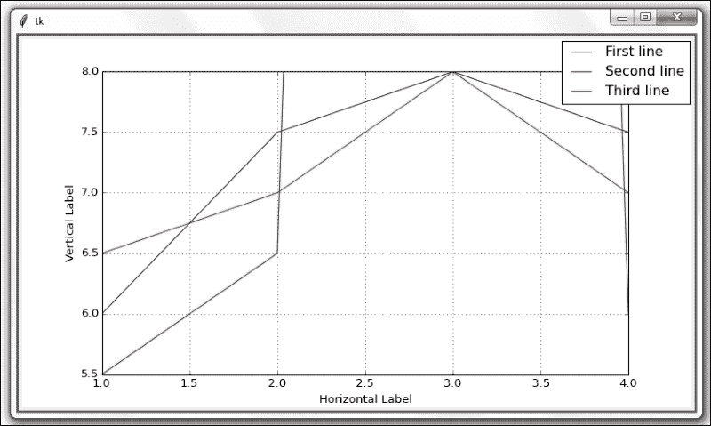

我们正在为 y 维数据创建一个列表列表，然后使用一个包含在 Python`min()`和`max()`函数调用中的列表理解。

如果列表理解似乎有点高级，那么它们基本上是一个非常压缩的循环。

它们还被设计为比常规编程循环更快。

在创建前面图表的 Python 代码中，我们创建了三个列表，其中包含要绘制的 y 维数据。然后我们创建了另一个包含这三个列表的列表，它创建了一个列表列表。

这样地：

```py
yValues0 = [6,7.5,8,7.5]
yValues1 = [5.5,6.5,50,6]              # one very high value (50)
yValues2 = [6.5,7,8,7]              
yAll = [yValues0, yValues1, yValues2]  # list of lists
```

我们感兴趣的是获得所有 y 维数据的最小值，以及这三个列表中包含的最大值。

我们可以通过 Python 列表理解来实现这一点。

```py
# flatten list of lists retrieving minimum value
minY = min([y for yValues in yAll for y in yValues])
```

运行列表理解后，`minY`为：5.5。

上面的一行代码是列表理解，它遍历三个列表中包含的所有数据的所有值，并使用 Python`min`关键字查找最小值。

在非常相同的模式中，我们发现我们希望绘制的数据中包含的最大值。这一次，我们还在列表理解中设置了一个限制，该限制将忽略所有高于指定限制的值，如下所示：

```py
yUpperLimit = 20
# flatten list of lists retrieving max value within defined limit
maxY = max([y for yValues in yAll for y in yValues if y < yUpperLimit])
```

在使用我们选择的限制运行前面的代码之后，`maxY`的值为 8（不是 50）。

我们对最大值应用了限制，根据预定义的条件选择 20 作为图表中显示的最大值。

对于 x 维，我们在 Matplotlib 方法中简单地调用了`min()`和`max()`来动态缩放图表的限制。

## 它是如何工作的。。。

在这个配方中，我们创建了几个 Matplotlib 图表，并调整了许多可用属性中的一些。我们还使用核心 Python 动态控制图表的缩放。