# 第六章线程与网络

在本章中，我们将使用 Python 3 创建线程、队列和 TCP/IP 套接字。

*   如何创建多个线程
*   开始一个线程
*   停止线程
*   如何使用队列
*   在不同模块之间传递队列
*   使用对话框小部件将文件复制到网络
*   使用 TCP/IP 通过网络进行通信
*   使用 URLOpen 从网站读取数据

# 导言

在本章中，我们将使用线程、队列和网络连接扩展 Python GUI 的功能。

### 注

tkinter GUI 是单线程的。每个涉及睡眠或等待时间的函数都必须在单独的线程中调用，否则 tkinter GUI 会冻结。

当我们在 Windows 任务管理器中运行 Python GUI 时，我们可以看到一个新的`python.exe`进程已经启动。

当我们给 Python GUI 一个`.pyw`扩展时，创建的流程将是`python.pyw`，如任务管理器中所示。

当创建一个进程时，该进程会自动创建一个主线程来运行我们的应用程序。这被称为单线程应用程序。

对于我们的 pythongui，一个单线程应用程序将导致我们的 GUI 在调用一个运行时间较长的任务（例如单击一个睡眠几秒钟的按钮）时立即冻结。

为了保持 GUI 的响应性，我们必须使用多线程，这就是我们将在本章中研究的内容。

我们还可以通过创建 PythonGUI 的多个实例来创建多个进程，如 TaskManager 中所示。

流程通过设计相互隔离，不共享公共数据。为了在不同进程之间进行通信，我们必须使用**进程间通信**（**IPC**，这是一种先进的技术。

另一方面，线程确实共享公共数据、代码和文件，这使得同一进程中的线程之间的通信比使用 IPC 时容易得多。

### 注

可以在[找到关于线程的详细解释 https://www.cs.uic.edu/~jbell/CourseNotes/OperatingSystems/4_Threads.html](https://www.cs.uic.edu/~jbell/CourseNotes/OperatingSystems/4_Threads.html)

在本章中，我们将学习如何保持 Python GUI 的响应性，而不是冻结。

# 如何创建多个线程

我们将使用 Python 创建多个线程。为了保持 GUI 的响应性，这是必要的。

### 注

一根线就像用纱线织出的织物，没有什么可怕的。

## 准备好了吗

多个线程在同一计算机进程内存空间中运行。不需要进程间通信（也称为 IPC），这会使代码复杂化。在此配方中，我们将使用线程避免 IPC。

## 怎么做。。。

首先，我们将增加`ScrolledText`小部件的大小，使其更大。让我们把`scrolW`增加到 40，`scrolH`增加到 10。

```py
# Using a scrolled Text control
scrolW  = 40; scrolH  =  10
self.scr = scrolledtext.ScrolledText(self.monty, width=scrolW, height=scrolH, wrap=tk.WORD)
self.scr.grid(column=0, row=3, sticky='WE', columnspan=3)
```

当我们现在运行生成的 GUI 时，`Spinbox`小部件相对于其上方的`Entry`小部件居中对齐，这看起来不太好。我们将通过左对齐小部件来改变这一点。

将`sticky='W'`添加到`grid`控件以左对齐`Spinbox`小部件。

```py
# Adding a Spinbox widget using a set of values
self.spin = Spinbox(self.monty, values=(1, 2, 4, 42, 100), width=5, bd=8, command=self._spin) 
self.spin.grid(column=0, row=2, sticky='W')
```

GUI 仍然可以看起来更好，因此下一步，我们将增加`Entry`小部件的大小，以获得更平衡的 GUI 布局。

将宽度增加到 24，如下所示：

```py
# Adding a Textbox Entry widget
self.name = tk.StringVar()
nameEntered = ttk.Entry(self.monty, width=24, textvariable=self.name)
nameEntered.grid(column=0, row=1, sticky='W')
```

让我们也稍微将`Combobox`的宽度增加到 14。

```py
ttk.Label(self.monty, text="Choose a number:").grid(column=1, row=0)
number = tk.StringVar()
numberChosen = ttk.Combobox(self.monty, width=14, textvariable=number)
numberChosen['values'] = (1, 2, 4, 42, 100)
numberChosen.grid(column=1, row=1)
numberChosen.current(0)
```

运行经过修改和改进的代码会产生一个更大的 GUI，我们将使用这个 GUI 和下面的方法。


为了在 Python 中创建和使用线程，我们必须从线程模块导入`Thread`类。

```py
#======================
# imports
#======================
import tkinter as tk
from tkinter import ttk
from tkinter import scrolledtext
from tkinter import Menu  
from tkinter import Spinbox
import B04829_Ch06_ToolTip as tt

from threading import Thread

GLOBAL_CONST = 42
```

让我们在`OOP`类中添加一个要在线程中创建的方法。

```py
class OOP():
    def methodInAThread(self):
        print('Hi, how are you?')
```

现在我们可以在代码中调用线程方法，将实例保存在变量中。

```py
#======================
# Start GUI
#======================
oop = OOP()

# Running methods in Threads
runT = Thread(target=oop.methodInAThread)
oop.win.mainloop())
```

现在我们有了一个线程化的方法，但是当我们运行代码时，没有任何东西被打印到控制台！

我们必须先启动`Thread`，然后才能运行，下一个配方将告诉我们如何执行此操作。

然而，在 GUI 主事件循环之后设置断点证明我们确实创建了一个`Thread`对象，正如在 EclipseIDE 调试器中所看到的那样。


## 它是如何工作的。。。

在这个配方中，我们通过首先增加 GUI 大小来准备 GUI 以使用线程，这样我们可以更好地看到打印到`ScrolledText`小部件的结果。

然后，我们从 Python`threading`模块导入了`Thread`类。

之后，我们创建了一个方法，从 GUI 中调用线程。

# 开线

这个配方将告诉我们如何开始一个线程。它还将演示为什么在长时间运行的任务中需要线程来保持 GUI 的响应性。

## 准备好了吗

让我们首先看看当我们调用 GUI 的函数或方法时会发生什么，该函数或方法在不使用线程的情况下有一些睡眠。

### 注

我们在这里使用 sleep 来模拟现实世界中的应用程序，该应用程序可能需要等待 web 服务器或数据库响应，或者等待大型文件传输或复杂计算来完成其任务。

睡眠是一个非常现实的占位符，它显示了所涉及的原则。

在我们的按钮回调方法中添加一个循环和一些睡眠时间会导致 GUI 变得无响应，当我们试图关闭 GUI 时，情况会变得更糟。

```py
# Button callback
def clickMe(self):
  self.action.configure(text='Hello ' + self.name.get())
  # Non-threaded code with sleep freezes the GUI
  for idx in range(10):
    sleep(5)
    self.scr.insert(tk.INSERT, str(idx) + '\n')
```

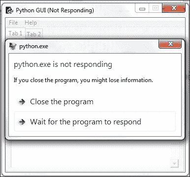

如果我们等待足够长的时间，该方法最终将完成，但在此期间，我们的 GUI 小部件都不会响应单击事件。我们使用线程来解决这个问题。

### 注

在前面的配方中，我们创建了一个要在线程中运行的方法，但到目前为止，线程还没有运行！

与常规 Python 函数和方法不同，我们必须`start`在自己的线程中运行一个方法！

这就是我们下一步要做的。

## 怎么做。。。

首先，让我们将线程的创建移到它自己的方法中，然后从按钮回调方法调用这个方法。

```py
# Running methods in Threads
def createThread(self):
  runT = Thread(target=self.methodInAThread)
  runT.start()
# Button callback
def clickMe(self):
  self.action.configure(text='Hello ' + self.name.get())
  self.createThread()
```

现在点击按钮将导致调用`createThread`方法，该方法反过来调用`methodInAThread`方法。

首先，我们创建一个线程，并将其定向到一个方法。接下来，我们启动将在新线程中运行目标方法的线程。

### 注

GUI 本身在自己的线程中运行，该线程是应用程序的主线程。

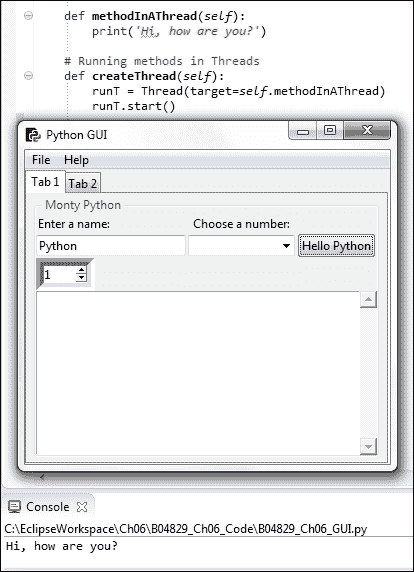

我们可以打印出线程的实例。

```py
# Running methods in Threads
def createThread(self):
  runT = Thread(target=self.methodInAThread)
  runT.start()
  print(runT)
```

现在单击按钮可创建以下打印输出：

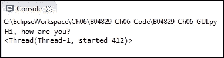

当我们多次点击按钮时，我们可以看到每个线程都被分配了一个唯一的名称和 ID。

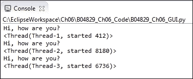

现在，让我们将循环中带有`sleep`的代码移动到`methodInAThread`方法中，以验证线程确实解决了我们的问题。

```py
def methodInAThread(self):
  print('Hi, how are you?')
  for idx in range(10):
    sleep(5)
    self.scr.insert(tk.INSERT, str(idx) + '\n')
```

单击按钮时，当数字以 5 秒的延迟打印到`ScrolledText`小部件中时，我们可以在 GUI 中的任意位置单击，切换选项卡，等等。我们的 GUI 再次响应，因为我们正在使用线程！

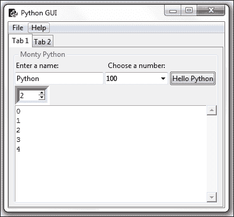

## 它是如何工作的。。。

在这个配方中，我们在自己的线程中调用 GUI 类的方法，并了解到我们必须启动线程。否则，线程将被创建，但只是坐在那里等待我们运行其目标方法。

我们注意到每个线程都被分配了一个唯一的名称和 ID。

我们通过在代码中插入一个`sleep`语句来模拟长时间运行的任务，这表明线程确实可以解决我们的问题。

# 停线

我们需要启动一个线程，通过调用`start()`方法，让它真正做一些事情，因此，直观地说，我们希望会有一个匹配的`stop()`方法，但没有这样的事情。在本食谱中，我们将学习如何将线程作为后台任务运行，该任务称为守护进程。关闭主线程（即 GUI）时，所有守护进程也将自动停止。

## 准备好了吗

当我们在线程中调用方法时，我们还可以将参数和关键字参数传递给该方法。我们正是从这一点开始做这个食谱的。

## 怎么做。。。

通过向线程构造函数添加`args=[8]`并修改目标方法以期望参数，我们可以将参数传递给线程方法。`args`的参数必须是一个序列，因此我们将把我们的数字包装在 Python 列表中。

```py
def methodInAThread(self, numOfLoops=10):
  for idx in range(numOfLoops):
    sleep(1)
    self.scr.insert(tk.INSERT, str(idx) + '\n')
```

在下面的代码中，`runT`是一个局部变量，我们只在创建`runT`的方法的范围内访问它。

```py

# Running methods in Threads
def createThread(self):
  runT = Thread(target=self.methodInAThread, args=[8])
  runT.start()
```

通过将局部变量转换为成员，我们可以通过从另一个方法调用`isAlive`来检查线程是否仍在运行。

```py
# Running methods in Threads
def createThread(self):
  self.runT = Thread(target=self.methodInAThread, args=[8])
  self.runT.start()
  print(self.runT)
  print('createThread():', self.runT.isAlive())
```

在前面的代码中，我们已将局部`runT`变量提升为类的成员。这使我们能够评估我们类中任何方法的`self.runT`变量。

这是这样实现的：

```py
    def methodInAThread(self, numOfLoops=10):
        for idx in range(numOfLoops):
            sleep(1)
            self.scr.insert(tk.INSERT, str(idx) + '\n')
        sleep(1)
        print('methodInAThread():', self.runT.isAlive())
```

当我们点击按钮并退出 GUI 时，我们可以看到`createThread`方法中的打印语句已经打印，但是我们没有看到`methodInAThread`中的第二条打印语句。

相反，我们得到了一个运行时错误。

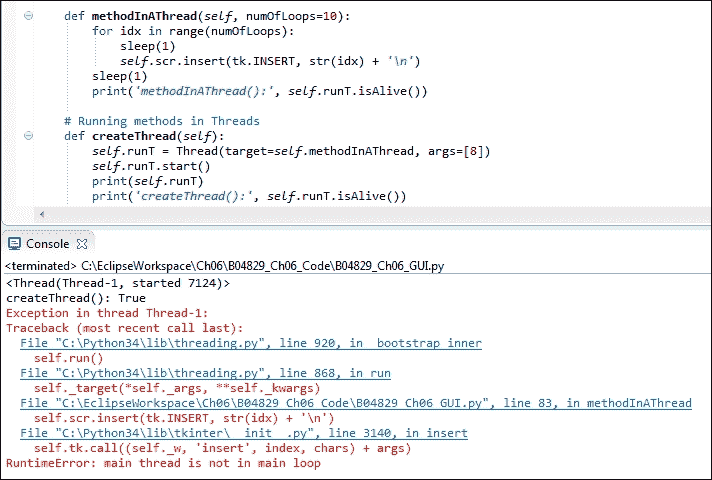

线程被期望完成他们分配的任务，因此当我们在线程尚未完成时关闭 GUI 时，Python 告诉我们我们启动的线程不在主事件循环中。

我们可以通过将线程转换为守护进程来解决这个问题，然后守护进程将作为后台任务执行。

这给我们的是，一旦我们关闭 GUI（启动其他线程的主线程），守护进程线程就会干净地退出。

我们可以通过在启动线程之前调用线程上的`setDaemon(True)`方法来实现这一点。

```py
# Running methods in Threads
def createThread(self):
  runT = Thread(target=self.methodInAThread)
  runT.setDaemon(True)
  runT.start()
  print(runT)
```

当我们现在在线程尚未完成其分配的任务时单击按钮并退出 GUI 时，我们不再得到任何错误。

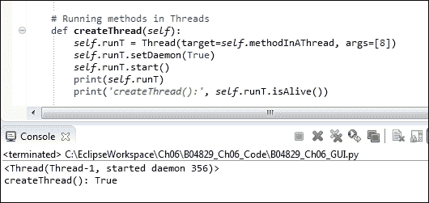

## 它是如何工作的。。。

虽然有一个启动方法可以让线程运行，但令人惊讶的是，实际上并没有一个等价的停止方法。

在这个配方中，我们在一个线程中运行一个方法，它将数字打印到我们的`ScrolledText`小部件。

当我们退出 GUI 时，我们不再对用于打印到小部件的线程感兴趣，因此，通过将线程转换为后台守护进程，我们可以干净地退出 GUI。

# 如何使用队列

Python队列是一种实现先进先出范式的数据结构，基本上像管道一样工作。你把东西铲到管子的一边，它从管子的另一边掉了出来。

这种队列铲土和将泥铲入物理管道之间的主要区别在于，在 Python 队列中，事情不会混淆。你把一个单位放进去，那个单位从另一边出来。接下来，您将另一个单元放入（例如，一个类的实例），整个单元将作为一个整体从另一端返回。

它按照我们在队列中插入代码的顺序从另一端返回。

### 注

队列不是我们推送和弹出数据的堆栈。堆栈是后进先出（LIFO）数据结构。

队列是容器，其中包含从可能不同的数据源送入队列的数据。只要客户机有可用数据，我们就可以让不同的客户机向队列提供数据。无论哪个客户机准备好向我们的队列发送数据，都会发送数据，然后我们可以在小部件中显示这些数据，或者将其转发给其他模块。

在接收并显示处理的最终结果时，使用多个线程完成队列中分配的任务非常有用。数据插入到队列的一端，然后以先进先出（FIFO）的顺序从另一端出来。

我们的 GUI 可能有五个不同的按钮小部件，每个按钮小部件启动我们希望在 GUI 小部件中显示的不同任务（例如，ScrolledText 小部件）。

这五项不同的任务需要不同的时间来完成。

每当任务完成时，我们都需要立即知道这一点，并在 GUI 中显示这些信息。

通过创建一个共享 Python 队列并让五个任务将其结果写入该队列，我们可以使用 FIFO 方法立即显示完成的任何任务的结果。

## 准备好了吗

随着 GUI 的功能和实用性不断增加，它开始与网络、流程和网站对话，最终将不得不等待 GUI 能够表示的数据可用。

在 Python 中创建队列解决了等待数据在 GUI 中显示的问题。

## 怎么做。。。

为了在 Python 中创建队列，我们必须从`queue`模块导入`Queue`类。在 GUI 模块顶部添加以下语句：

```py
from threading import Thread
from time import sleep
from queue import Queue
```

这让我们开始。

接下来，我们创建一个队列实例。

```py
def useQueues(self):
    guiQueue = Queue()     # create queue instance
```

### 注

在前面的代码中，我们创建了一个本地`Queue`实例，该实例只能在此方法中访问。如果我们希望从其他地方访问此队列，我们必须使用将局部变量绑定到整个类的`self`关键字将其转换为类的成员，从而使其可以从类中的任何其他方法使用。在 Python 中，我们经常在`__init__(self)`方法中创建类实例变量，但 Python 非常实用，使我们能够在代码中的任何位置创建这些成员变量。

现在我们有一个队列的实例。我们可以通过打印出来证明这是有效的。


为了将数据放入队列，我们使用了`put`命令。为了从队列中获取数据，我们使用了`get`命令。

```py
# Create Queue instance  
def useQueues(self):
    guiQueue = Queue()
    print(guiQueue)
    guiQueue.put('Message from a queue')
    print(guiQueue.get())
```

运行修改后的代码会导致消息首先放置在`Queue`中，然后从`Queue`中取出，然后打印到控制台。


我们可以将许多消息放入队列中。

```py
# Create Queue instance  
def useQueues(self):
    guiQueue = Queue()
    print(guiQueue)
    for idx in range(10):
        guiQueue.put('Message from a queue: ' + str(idx))
    print(guiQueue.get())
```

我们已经在`Queue`中放置了 10 条消息，但我们只将第一条消息取出。其他消息仍在`Queue`中，等待以 FIFO 方式取出。


为了获得所有被放入`Queue`输出的消息，我们可以创建一个无休止的循环。

```py
# Create Queue instance
def useQueues(self):
    guiQueue = Queue()
    print(guiQueue)
    for idx in range(10):
        guiQueue.put('Message from a queue: ' + str(idx))

    while True: 
        print(guiQueue.get())
```


虽然这个代码可以工作，但不幸的是它冻结了我们的 GUI。为了解决这个问题，我们必须在它自己的线程中调用该方法，就像我们在前面的配方中所做的那样。

让我们在线程中运行我们的方法，并将其绑定到按钮事件：

```py
# Running methods in Threads
def createThread(self, num):
    self.runT = Thread(target=self.methodInAThread, args=[num])
    self.runT.setDaemon(True)
    self.runT.start()
    print(self.runT)
    print('createThread():', self.runT.isAlive())

    # textBoxes are the Consumers of Queue data
    writeT = Thread(target=self.useQueues, daemon=True)
    writeT.start()

# Create Queue instance  
def useQueues(self):
    guiQueue = Queue()
    print(guiQueue)
    for idx in range(10):
        guiQueue.put('Message from a queue: ' + str(idx))
    while True: 
        print(guiQueue.get())
```

当我们现在点击动作`Button`时，我们不再会看到一个无关的弹出窗口，代码也会正常工作。


## 它是如何工作的。。。

我们创建了一个`Queue`，以先进先出（又称 FIFO）的方式将消息放在`Queue`的一侧。我们从`Queue`中取出消息，然后将它们打印到控制台（stdout）。

我们意识到我们必须在它自己的`Thread`中调用该方法。

# 在不同模块间传递队列

在这个配方中，我们将在不同模块之间传递`Queues`。随着 GUI 代码复杂性的增加，我们希望将 GUI 组件从业务逻辑中分离出来，将它们分为不同的模块。

模块化为我们提供了代码重用，也使代码更具可读性。

一旦 GUI 中显示的数据来自不同的数据源，我们将面临延迟问题，这就是`Queues`解决的问题。通过在不同的 Python 模块之间传递`Queues`实例，我们将分离模块功能的不同关注点。

### 注

理想情况下，GUI 代码只涉及创建和显示小部件。

业务逻辑模块的工作只是执行业务逻辑。

我们必须结合这两个元素，理想情况下使用不同模块之间尽可能少的关系，减少代码的相互依赖性。

### 注

避免不必要依赖的编码原则通常称为“松耦合”。

为了理解松耦合的意义，我们可以在白板或纸上画一些方框。一个框表示 GUI 类和代码，而其他框表示业务逻辑、数据库等。

接下来，我们在框之间画线，绘制出这些框之间的相互依赖关系，这些框是我们的 Python 模块。

### 注

Python 框之间的行越少，我们的设计就越松散耦合。

## 准备好了吗

在前面的配方中，我们已经开始使用`Queues`。在这个方法中，我们将把一个`Queue`实例从我们的主 GUI 线程传递到其他 Python 模块，这将使我们能够从另一个模块写入`ScrolledText`小部件，同时保持 GUI 的响应性。

## 怎么做。。。

首先，我们在项目中创建一个新的 Python 模块。我们叫它`Queues.py`。我们将在其中放置一个函数（不需要 OOP），并向其传递一个队列实例。

我们还传递了创建 GUI 表单和小部件的类的自引用，这使我们能够使用来自另一个 Python 模块的所有 GUI 方法。

我们在按钮回调中执行此操作。

### 注

这就是 OOP 的魔力。在一个类的中间，我们将自己传递到一个函数中，我们用类内的关键字调用。

代码现在看起来像这样。

```py
import B04829_Queues as bq

class OOP():
    # Button callback
    def clickMe(self):
      # Passing in the current class instance (self)
        print(self)
        bq.writeToScrol(self)
```

导入的模块包含我们正在调用的函数，

```py
def writeToScrol(inst):
    print('hi from Queue', inst)
    inst.createThread(6)

```

我们已经注释掉了按钮回调中对`createThread`的调用，因为我们现在从新模块调用它。

```py
# Threaded method does not freeze our GUI
# self.createThread()
```

通过将自引用从类实例传递到类在另一个模块中调用的函数，我们现在可以从其他 Python 模块访问所有 GUI 元素。

运行代码将创建以下结果。


接下来，我们将创建`Queue`作为我们类的成员，并在类的`__init__`方法中放置对它的引用。

```py
class OOP():
    def __init__(self):
        # Create a Queue
        self.guiQueue = Queue()
```

现在，我们可以通过简单地使用传递给 GUI 的类引用将消息从新模块放入队列中。

```py
def writeToScrol(inst):
    print('hi from Queue', inst)
    for idx in range(10):
        inst.guiQueue.put('Message from a queue: ' + str(idx))
    inst.createThread(6)
```

我们 GUI 代码中的`createThread`方法现在只从队列中读取，队列由驻留在我们新模块中的业务逻辑填充，它将逻辑与 GUI 模块分离。

```py
def useQueues(self):
    # Now using a class member Queue
    while True:
        print(self.guiQueue.get())
```

运行修改后的代码会产生相同的结果。我们还没有打碎任何东西！

## 它是如何工作的。。。

为了将 GUI 小部件与表示业务逻辑的功能分开，我们创建了一个类，并将一个队列作为该类的成员，通过将该类的实例传递给驻留在不同 Python 模块中的函数，我们现在可以访问所有 GUI 小部件以及`Queue`。

这个配方是一个例子，说明在 OOP 中编程是有意义的。

# 使用对话框小部件将文件复制到您的网络

这个配方向我们展示了如何将文件从本地硬盘复制到网络位置。

我们将使用 Python 的 tkinter 内置对话框来实现这一点，该对话框使我们能够浏览硬盘。然后，我们可以选择要复制的文件。

这个食谱还向我们展示了如何使`Entry`小部件成为只读的，以及如何将`Entry`默认为指定位置，从而加快硬盘的浏览速度。

## 准备好了吗

我们将扩展我们在以前的配方中构建的 GUI 的**选项卡 2**。

## 怎么做。。。

在`def createWidgets(self)`方法中，在我们创建 Tab 控件 2 的底部向 GUI 添加以下代码。

新窗口小部件框架的父级是`tab2`，我们在`createWidgets()`方法的最开始就创建了它。只要您将如下所示的代码实际放置在`tab2`的创建下方，它就会工作。

```py
###########################################################
    def createWidgets(self):
        tabControl = ttk.Notebook(self.win)  # Create Tab  
        tab2 = ttk.Frame(tabControl)         # Add a second tab
        tabControl.add(tab2, text='Tab 2')

# Create Manage Files Frame 
mngFilesFrame = ttk.LabelFrame(tab2, text=' Manage Files: ')
mngFilesFrame.grid(column=0, row=1, sticky='WE', padx=10, pady=5)

# Button Callback
def getFileName():
    print('hello from getFileName')

# Add Widgets to Manage Files Frame
lb = ttk.Button(mngFilesFrame, text="Browse to File...", command=getFileName)
lb.grid(column=0, row=0, sticky=tk.W) 

file = tk.StringVar()
self.entryLen = scrolW
self.fileEntry = ttk.Entry(mngFilesFrame, width=self.entryLen, textvariable=file)
self.fileEntry.grid(column=1, row=0, sticky=tk.W)

logDir = tk.StringVar()
self.netwEntry = ttk.Entry(mngFilesFrame, width=self.entryLen, textvariable=logDir)
self.netwEntry.grid(column=1, row=1, sticky=tk.W) 
        def copyFile():
        import shutil   
        src  = self.fileEntry.get()
        file = src.split('/')[-1]  
        dst  = self.netwEntry.get() + '\\'+ file
        try:
            shutil.copy(src, dst)   
            mBox.showinfo('Copy File to Network', 'Success: File copied.')
        except FileNotFoundError as err:
            mBox.showerror('Copy File to Network', '*** Failed to copy file! ***\n\n' + str(err))
        except Exception as ex:
            mBox.showerror('Copy File to Network', '*** Failed to copy file! ***\n\n' + str(ex))

        cb = ttk.Button(mngFilesFrame, text="Copy File To :   ", command=copyFile)
        cb.grid(column=0, row=1, sticky=tk.E)

        # Add some space around each label
        for child in mngFilesFrame.winfo_children(): 
            child.grid_configure(padx=6, pady=6)
```

此将向 GUI 的**选项卡 2**添加两个按钮和两个条目。

我们还没有实现按钮回调函数的功能。

运行代码将创建以下 GUI：

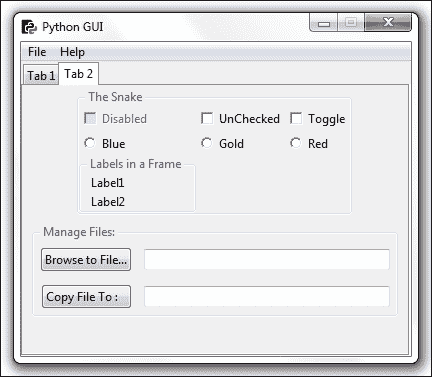

点击**浏览文件…**按钮，当前打印到控制台。

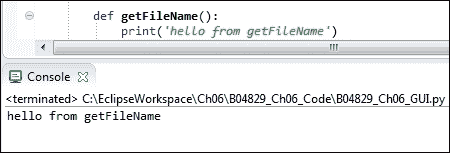

我们可以使用 tkinter 的内置文件对话框，因此让我们在 Python GUI 模块的顶部添加以下`import`语句。

```py
from tkinter import filedialog as fd
from os import path
```

现在我们可以在代码中使用对话框了。我们可以使用 Python 的 os 模块找到 GUI 模块所在的完整路径，而不是硬编码路径。

```py
def getFileName():
    print('hello from getFileName')
    fDir  = path.dirname(__file__)
    fName = fd.askopenfilename(parent=self.win, initialdir=fDir)
```

现在点击浏览按钮打开`askopenfilename`对话框。

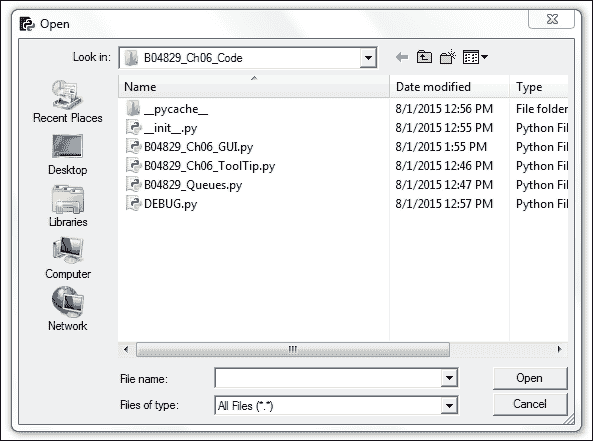

我们现在可以打开此目录中的文件或浏览到其他目录。选择一个文件并点击对话框中的**打开**按钮后，我们将在`fName`局部变量中保存该文件的完整路径。

如果当我们打开 Python`askopenfilename`对话框小部件时，我们会自动默认一个目录，这样我们就不必一直浏览到要打开的特定文件的位置，那就太好了。

最好通过返回 GUI**选项卡 1**来演示如何执行此操作，这是我们接下来要做的。

我们可以在条目小部件中输入默认值。回到我们的**选项卡 1**，这非常简单。我们所要做的就是在`Entry`小部件的创建中添加以下两行代码。

```py
# Adding a Textbox Entry widget
self.name = tk.StringVar()
nameEntered = ttk.Entry(self.monty, width=24, textvariable=self.name)
nameEntered.grid(column=0, row=1, sticky='W')
nameEntered.delete(0, tk.END)
nameEntered.insert(0, '< default name >')
```

当我们现在运行 GUI 时，`nameEntered`项有一个默认值。


我们可以通过下面的 Python 语法获得我们正在使用的模块的完整路径，然后我们可以在其下方创建一个新的子文件夹。我们可以将其作为模块级全局文件来执行，也可以在方法中创建子文件夹。

```py
# Module level GLOBALS
GLOBAL_CONST = 42
fDir   = path.dirname(__file__)
netDir = fDir + '\\Backup'

def __init__(self):
    self.createWidgets()       
    self.defaultFileEntries()

def defaultFileEntries(self):
    self.fileEntry.delete(0, tk.END)
    self.fileEntry.insert(0, fDir) 
    if len(fDir) > self.entryLen:
        self.fileEntry.config(width=len(fDir) + 3)
        self.fileEntry.config(state='readonly')

    self.netwEntry.delete(0, tk.END)
    self.netwEntry.insert(0, netDir) 
    if len(netDir) > self.entryLen:
        self.netwEntry.config(width=len(netDir) + 3)
```

我们正在为这两个条目小部件设置默认值，在设置它们之后，我们将本地文件条目小部件设置为只读。

### 注

这个订单很重要。我们必须先填充条目，然后再将其设为只读。

在调用主事件循环之前，我们还在选择**选项卡 2**，不再将焦点设置到**选项卡 1**的`Entry`中。在我们的 tkinter`notebook`上调用`select`是基于零的，因此通过传入值 1，我们选择**选项卡 2**…

```py
# Place cursor into name Entry
# nameEntered.focus()             
tabControl.select(1)
```

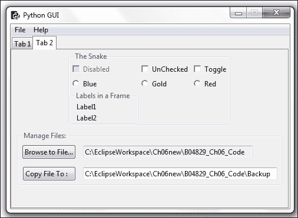

由于我们并非都在同一个网络上，本食谱将使用本地硬盘作为网络示例。

UNC 路径是一种通用命名约定，这意味着我们可以通过使用双反斜杠访问网络服务器来访问网络服务器，而不是在 Windows PC 上访问本地硬盘时的典型`C:\`。

### 注

您只需使用 UNC 并将`C:\`替换为`\\<server name> \<folder>\`。

此示例可用于将代码备份到备份目录，如果该目录不存在，我们可以使用`os.makedirs`创建备份目录。

```py
# Module level GLOBALS
GLOBAL_CONST = 42

from os import makedirs
fDir   = path.dirname(__file__)
netDir = fDir + '\\Backup' 
if not path.exists(netDir):
    makedirs(netDir, exist_ok = True)
```

在选择要复制到其他地方的文件后，我们导入 Python`shutil`模块。我们需要复制文件源的完整路径，即网络或本地目录路径，然后使用`shutil.copy`将文件名附加到要复制它的路径。

### 注

Shutil 是 shell 实用程序的简写符号。

我们还通过消息框向用户提供反馈，以指示复制是否成功。为此，请导入`messagebox`并将其重命名为`mBox`。

在下面的代码中，我们将混合使用两种不同的方法来放置导入语句。在 Python 中，我们有一些其他语言无法提供的灵活性。

我们通常将所有 import 语句放在每个 Python 模块的最顶端，以便清楚地知道我们要导入哪些模块。

同时，现代的编码方法是将变量的创建放在靠近函数或方法的位置，这些函数或方法是第一次使用的。

在下面的代码中，我们导入 Python 模块顶部的消息框，但随后还将 shutil Python 模块导入到函数中。

我们为什么要这样做？

这行得通吗？

答案是，是的，它确实有效，我们将这个 import 语句放入函数中，因为这是我们代码中唯一真正需要这个模块的地方。

如果我们从未调用此方法，那么我们将永远不会导入此方法所需的模块。

在某种意义上，您可以将此技术视为惰性初始化设计模式。

如果我们不需要它，在 Python 代码中真正需要它之前，我们不会导入它。

这里的想法是，我们的整个代码可能需要，比方说，二十个不同的模块。在运行时，真正需要哪些模块取决于用户交互。如果我们从不调用`copyFile()`函数，那么就不需要导入`shutil`。

一旦我们点击该函数中调用该`copyFile()`函数的按钮，我们将导入所需的模块。

```py
from tkinter import messagebox as mBox

def copyFile():
    import shutil   
    src = self.fileEntry.get()
    file = src.split('/')[-1]  
    dst = self.netwEntry.get() + '\\'+ file
    try:
      shutil.copy(src, dst)   
      mBox.showinfo('Copy File to Network', 'Success: File copied.')
    except FileNotFoundError as err:
      mBox.showerror('Copy File to Network', '*** Failed to copy file! ***\n\n' + str(err))
    except Exception as ex:
      mBox.showerror('Copy File to Network', '*** Failed to copy file! ***\n\n' + str(ex))
```

现在，当我们运行 GUI 并浏览到一个文件并单击“复制”时，该文件将复制到我们在`Entry`小部件中指定的位置。

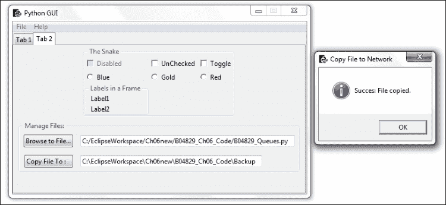

如果文件不存在，或者我们忘记浏览某个文件并试图复制整个父文件夹，那么代码也会让我们知道这一点，因为我们使用的是 Python 内置的异常处理功能。


## 它是如何工作的。。。

我们正在使用 pythonshell 实用程序将文件从本地硬盘复制到网络。由于我们大多数人没有连接到同一个局域网，我们通过将代码备份到不同的本地文件夹来模拟复制。

我们正在使用 tkinter 的一个对话框控件，通过默认目录路径，我们可以提高复制文件的效率。

# 使用 TCP/IP 进行网络通信

此配方向您展示了如何使用套接字通过 TCP/IP 进行通信。为了实现这一点，我们需要一个 IP 地址和一个端口号。

为了使事情变得简单且独立于不断变化的 internet IP 地址，我们将创建自己的本地 TCP/IP 服务器，作为客户机，学习如何连接到它并从 TCP/IP 连接读取数据。

我们将通过使用在前面的配方中创建的队列，将这种网络功能集成到 GUI 中。

## 准备好了吗

我们将创建一个新的 Python 模块，即 TCP 服务器。

## 怎么做。。。

在 Python 中实现 TCP 服务器的一种方法是继承`socketserver`模块。我们将`BaseRequestHandler`子类化，然后重写继承的`handle`方法。在很少几行 Python代码中，我们可以实现一个 TCP 服务器模块。

```py
from socketserver import BaseRequestHandler, TCPServer

class RequestHandler(BaseRequestHandler):
    # override base class handle method
    def handle(self):
        print('Server connected to: ', self.client_address)
        while True:
            rsp = self.request.recv(512)
            if not rsp: break
            self.request.send(b'Server received: ' + rsp)

def startServer():
    serv = TCPServer(('', 24000), RequestHandler)
    serv.serve_forever()
```

我们正在将`RequestHandler`类传递给`TCPServer`初始值设定项。空单引号是传入 localhost 的捷径，localhost 是我们自己的 PC。这是 127.0.0.1 的 IP 地址。元组中的第二项是端口号。我们可以选择本地 PC 上未使用的任何端口号。

我们只需要确保在 TCP 连接的客户端使用相同的端口，否则我们将无法连接到服务器。当然，在客户端连接到服务器之前，我们必须先启动服务器。

我们将修改我们的`Queues.py`模块，使之成为 TCP 客户端。

```py
from socket import socket, AF_INET, SOCK_STREAM

def writeToScrol(inst):
    print('hi from Queue', inst)
    sock = socket(AF_INET, SOCK_STREAM)
    sock.connect(('localhost', 24000))
    for idx in range(10):
        sock.send(b'Message from a queue: ' + bytes(str(idx).encode()) )
        recv = sock.recv(8192).decode()
        inst.guiQueue.put(recv)      
    inst.createThread(6)
```

这是我们与 TCP 服务器对话所需的全部代码。在本例中，我们只是将一些字节发送到服务器，然后服务器将它们发回，在返回响应之前预先添加一些字符串。

### 注

这显示了通过网络进行 TCP 通信的原理。

一旦我们知道如何通过 TCP/IP 连接到远程服务器，我们将使用我们感兴趣的通信程序协议设计的任何命令。第一步是先连接，然后才能向驻留在服务器上的特定应用程序发送命令。

在`writeToScrol`函数中，我们将使用与之前相同的循环，但现在我们将向 TCP 服务器发送消息。服务器修改接收到的消息，然后将其发送回给我们。接下来，我们将其放入 GUI 成员队列中，与前面的配方一样，该队列在其自己的`Thread`中运行。

### 注

在 Python3 中，我们必须以二进制格式通过套接字发送字符串。添加整数索引现在变得有点复杂，因为我们必须将其转换为字符串，对其进行编码，然后将编码后的字符串转换为字节！

```py
sock.send(b'Message from a queue: ' + bytes(str(idx).encode()) )
```

注意字符串前面的`b`，然后，好的，所有其他需要的铸件…

我们正在 OOP 类的初始值设定项中的自己的线程中启动 TCP 服务器。

```py
class OOP():
    def __init__(self):
    # Start TCP/IP server in its own thread
        svrT = Thread(target=startServer, daemon=True)
        svrT.start()
```

点击**点击我！**选项卡 1**上的**按钮现在在我们的`ScrolledText`小部件以及控制台上创建以下输出，并且由于使用`Threads`响应非常快。

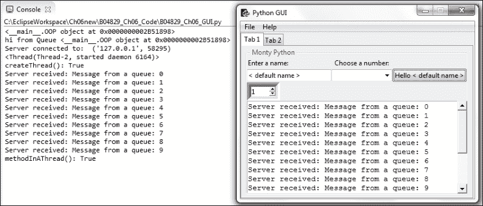

## 它是如何工作的。。。

我们创建了一个 TCP 服务器来模拟连接到局域网或互联网上的服务器。我们将队列模块转换为 TCP 客户端。我们在自己的后台线程中运行队列和服务器，这使我们的 GUI 非常响应。

# 使用 URLOpen 从网站读取数据

这个配方展示了我们如何使用 Python 的内置模块轻松地阅读整个网页。我们将首先以原始格式显示网页数据，然后对其进行解码，然后将其显示在 GUI 中。

## 准备好了吗

我们将从网页中读取数据，然后将其显示在 GUI 的`ScrolledText`小部件中。

## 怎么做。。。

首先，我们创建一个新的 Python 模块并将其命名为`URL.py`。

然后，我们使用 Python 导入阅读网页所需的功能。

我们只需几行代码就可以做到这一点。

我们将代码包装在一个类似于 Java 和 C 的`try…except`块中。这是 Python 支持的一种现代编码方法。

每当我们有可能不完整的代码时，我们都可以用这段代码进行实验，如果它能工作，一切都很好。

如果`try…except`块中的代码块不起作用，Python 解释器将抛出几个可能的异常之一，然后我们可以捕捉到这些异常。一旦我们发现异常，我们就可以决定下一步要做什么。

Python 中有一个异常层次结构，我们还可以创建自己的类，这些类继承并扩展 Python 异常类。

在如下所示的代码中，我们主要担心我们试图打开的 URL 可能不可用，因此我们将代码包装在`try…except`代码块中。

如果代码成功打开请求的 URL，一切正常。

如果它失败了，可能是因为我们的互联网连接断开了，我们会陷入代码的异常部分，并打印出发生了异常。

### 注

您可以在[阅读更多关于 Python 异常处理的信息 https://docs.python.org/3.4/library/exceptions.html](https://docs.python.org/3.4/library/exceptions.html) 。

```py
from urllib.request import urlopen
link = 'http://python.org/' 
try:
    f = urlopen(link)
    print(f)
    html = f.read()
    print(html)
    htmldecoded = html.decode()
    print(htmldecoded)

except Exception as ex:
    print('*** Failed to get Html! ***\n\n' + str(ex))
```

通过在 Python 官方网站上调用`urlopen`，我们可以将整个数据作为一个长字符串。

第一个 print 语句将这个长字符串打印到控制台。

然后我们根据结果调用`decode`，这一次我们得到了略多于 1000 行的 web 数据，包括一些空白。

我们还打印出调用类型`urlopen`，这是一个`http.client.HTTPResponse`对象。实际上，我们先把它打印出来。

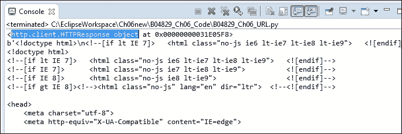

这是我们刚刚阅读的官方 Python 网页。如果您是一名 web 开发人员，您可能对如何处理解析的数据有一些好的想法。


接下来，我们在`ScrolledText`小部件内的 GUI 中显示这些数据。为了做到这一点，我们必须连接我们的新模块，将数据从网页读取到 GUI。

为了做到这一点，我们需要一个对 GUI 的引用，一种方法是将新模块绑定到**选项卡 1**按钮回调。

我们可以将解码后的 HTML 数据从 Python 网页返回到`Button`小部件，然后将其放入`ScrolledText`控件中。

因此，让我们将代码转换为函数，并将数据返回给调用代码。

```py
from urllib.request import urlopen
link = 'http://python.org/'
def getHtml():
    try:
        f = urlopen(link)
        #print(f)
        html = f.read()
        #print(html)
        htmldecoded = html.decode()
        #print(htmldecoded)     
    except Exception as ex:
        print('*** Failed to get Html! ***\n\n' + str(ex))
    else:
        return htmldecoded  
```

我们现在可以将`button`回调方法中的数据写入`ScrolledText`控件，首先导入新模块，然后将数据插入小部件。我们也会在呼叫`writeToScrol`后给它一些睡眠。

```py
import B04829_Ch06_URL as url

# Button callback
def clickMe(self):
  bq.writeToScrol(self)       
  sleep(2)
  htmlData = url.getHtml()
  print(htmlData)
  self.scr.insert(tk.INSERT, htmlData)
```

HTML 数据现在显示在我们的 GUI 小部件中。


## 它是如何工作的。。。

我们创建一个新模块，将从网页获取数据的代码与 GUI 代码分离。这总是一件好事。我们读入网页数据，然后在解码后将其返回给调用代码。然后，我们使用按钮回调函数将返回的数据放入`ScrolledText`控件中。

本章向我们介绍了一些高级 Python 编程概念，我们将这些概念结合起来生成一个功能性 GUI 程序。