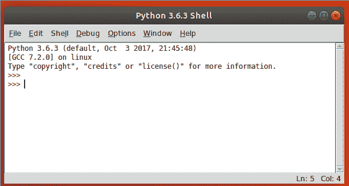
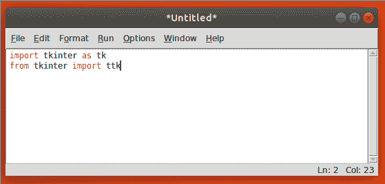
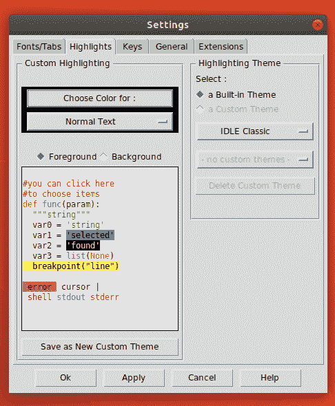

# 特金特简介

欢迎光临，Python**编码器**！如果您已经学习了 Python 的基础知识，并且希望开始设计功能强大的 GUI 应用程序，那么本书适合您。

到目前为止，您无疑已经体验到 Python 的强大和简单。也许您编写过 web 服务、执行过数据分析或管理过服务器。也许你已经编写了一个游戏，自动化的例行任务，或者只是玩弄代码。但是现在您已经准备好处理 GUI 了。

随着对 web、移动和服务器端编程的如此强调，开发简单的桌面 GUI 应用程序似乎越来越像一门失传的艺术；许多经验丰富的开发人员从未学会创建一个。真是悲剧！台式计算机在工作和家庭计算中仍然发挥着至关重要的作用，为这个无处不在的平台构建简单、功能强大的应用程序的能力应该成为每个软件开发人员工具箱的一部分。幸运的是，对于 Python 程序员来说，多亏了 Tkinter，这种能力是可以实现的。

在本章中，您将介绍以下主题：

*   发现 Tkinter—一个快速、有趣、易于学习的 GUI 库，直接构建到 Python 标准库中
*   了解用 Tkinter 编写并与 Python 捆绑的编辑器和开发环境
*   创建两个`Hello World`应用程序，学习编写 Tkinter GUI 的基础知识

# 介绍 Tkinter 和 Tk

Tk 小部件库源于**工具命令语言**（**Tcl**编程语言。Tcl 和 Tk 是由 John Ousterman 在 20 世纪 80 年代末担任伯克利大学教授时创建的，这是为该大学使用的工程工具编程的一种更简单的方法。由于其速度快且相对简单，Tcl/Tk 在学术界、工程界和 Unix 程序员中迅速流行起来。与 Python 本身非常相似，Tcl/Tk 起源于 Unix 平台，后来才迁移到 macOS 和 Windows。Tk 的实用意图和 Unix 根源至今仍然影响着它的设计，与其他工具包相比，它的简单性仍然是一个主要优势。

**Tkinter**是 Tk GUI 库的 Python 接口，自 1994 年 Python 版本 1.1 发布以来，它一直是 Python 标准库的一部分，使其成为 Python 事实上的 GUI 库。Tkinter 的文档以及进一步研究的链接可在[的标准库文档中找到 https://docs.python.org/3/library/tkinter.html](https://docs.python.org/3/library/tkinter.html) 。

# 选择 Tkinter

想要构建 GUI 的 Python 程序员有几个工具箱选项可供选择；不幸的是，Tkinter 作为一个遗留选项经常被诽谤或忽视。平心而论，这不是一项你可以用时髦的流行语和热情洋溢的炒作来形容的迷人技术。然而，Tkinter 不仅适用于多种应用，还具有以下不容忽视的优势：

*   **在标准库**中：除了少数例外，只要 Python 可用，Tkinter 就可以使用。无需安装`pip`、创建虚拟环境、编译二进制文件或在 web 上搜索安装包。对于需要快速完成的简单项目，这是一个明显的优势。
*   **稳定**：虽然 Tkinter 的发展没有停止，但它是缓慢和进化的。API 多年来一直保持稳定，变化主要是附加功能和错误修复。您的 Tkinter 代码可能会在未来几年或几十年内保持不变。
*   **它只是一个 GUI 工具包**：与其他一些 GUI 库不同，Tkinter 没有自己的线程库、网络堆栈或文件系统 API。它依赖于常规的 Python 库来实现这些功能，因此它非常适合将 GUI 应用于现有的 Python 代码。
*   **很简单，没有废话**：Tkinter 是一款简单、老派的面向对象 GUI 设计。要使用 Tkinter，您不必学习数百个小部件类、标记或模板语言、新的编程范式、客户机-服务器技术或其他编程语言。

当然，特金特并不完美。它还有以下缺点：

*   **外观**：它的外观经常受到嘲笑，因为它仍然带有一些上世纪 90 年代 Unix 世界的人工制品。由于 Tk 本身的更新和主题小部件库的添加，这在过去几年中有了很大的改进。在本书中，我们将学习如何修复或避免 Tkinter 的一些更古老的默认设置。
*   **复杂小部件**：它还缺少更复杂的小部件，如富文本或 HTML 呈现小部件。正如我们将在本书后面看到的，Tkinter 使我们能够通过定制和组合简单的小部件来创建复杂的小部件。

Tkinter 可能是游戏用户界面或光滑的商业应用程序的错误选择；但是，对于数据驱动的应用程序、简单实用程序、配置对话框和其他业务逻辑应用程序，Tkinter 提供了所需的一切以及更多。

# 安装 Tkinter

Tkinter 包含在 Windows 和 macOS 发行版的 Python 标准库中。这意味着，如果在这些平台上有 Python，则无需执行任何操作即可安装 Tkinter。

然而，在本书中，我们将专门关注 Python3.x；因此，您需要确保这是您安装的版本。

# 在 Windows 上安装 Python 3

您可以通过执行以下步骤从[Python.org](https://www.python.org/)网站获取适用于 Windows 的 Python 3 安装程序：

1.  转到[http://www.python.org/downloads/windows](http://www.python.org)
2.  选择最新的 Python3 版本。在撰写本文时，最新版本是 3.6.4，3.7 有望在出版时发布。

3.  在“文件”部分下，选择适合系统体系结构的 Windows 可执行安装程序（x86 适用于 32 位 Windows，x86_64 适用于 64 位 Windows）。
4.  启动下载的安装程序。
5.  单击“自定义安装”。确保选中了 tcl/tk 和 IDLE 选项（默认情况下应为）。
6.  使用所有默认设置继续安装程序。

# 在 macOS 上安装 Python 3

在撰写本文时，macOS 附带了内置的 Python 2 和 Tcl/Tk 8.5。然而，Python2 计划在 2020 年被弃用，本书中的代码将不适用于它，因此 macOS 用户需要安装 Python3 才能遵循本书

让我们执行以下步骤在 macOS 上安装 Python3：

1.  转到[http://www.python.org/downloads/mac-osx/](http://www.python.org)
2.  选择最新的 Python3 版本。在撰写本文时，最新版本是 3.6.4，但 3.7 应在出版时发布。
3.  在文件部分下，选择并下载`macOS 64-bit/32-bit installer`**。**
4.  启动下载的`.pkg`文件，按照安装向导的步骤，选择默认值。

目前没有推荐在 macOS 上升级到 Tcl/Tk 8.6 的方法，不过如果您愿意，可以使用第三方工具。我们的大部分代码都将使用 8.5，但特别提到的是当某些代码仅为 8.6 时。

# 在 Linux 上安装 Python 3 和 Tkinter

大多数 Linux 发行版都包括 Python2 和 Python3，但是 Tkinter 并不总是与之捆绑在一起或默认安装。

要确定是否安装了 Tkinter，请打开一个终端并尝试以下命令：

```py
python3 -m tkinter
```

这将打开一个简单的窗口，显示关于 Tkinter 的一些信息。如果您得到的是`ModuleNotFoundError`，则需要使用包管理器安装发行版的 Python3 Tkinter 包。在大多数主要发行版中，包括 Debian、Ubuntu、Fedora 和 openSUSE，这个包被称为`python3-tk`。

# 引入空闲

IDLE 是一个集成的开发环境，它和 Windows 和 macOS Python 发行版捆绑在一起（它在大多数 Linux 发行版中也很容易获得，通常是 IDLE 或 IDLE3）。IDLE 是使用 Tkinter 用 Python 编写的，它不仅为 Python 提供了一个编辑环境，而且还提供了 Tkinter 的一个很好的示例。因此，虽然 IDLE 的基本功能集可能不被许多 Python 程序员视为专业级别，而且您可能已经有了编写 Python 代码的首选环境，但我鼓励您在阅读本书时花一些时间使用 IDLE。

让我们熟悉一下 IDLE 的两种主要模式：**shell**模式和**编辑器**模式。

# 使用 IDLE 的 shell 模式

当您启动 IDLE 时，您将以 shell 模式开始，这只是一个 Python**读取-评估-打印循环**（**REPL**），类似于您在终端窗口中键入`python`时得到的结果。

在以下屏幕截图中查看 shell 模式：



IDLE 的 shell 有一些很好的特性，这些特性是命令行 REPL 无法提供的，比如语法高亮显示和制表符补全。REPL 对于 Python 开发过程至关重要，因为它使您能够实时测试代码并检查类和 api，而无需编写完整的脚本。我们将在后面的章节中使用 shell 模式来探索模块的特性和行为。如果没有打开 shell 窗口，可以通过单击开始，然后选择运行并搜索 pythonshell 来打开一个窗口。

# 使用 IDLE 的编辑器模式

编辑器模式用于创建 Python 脚本文件，稍后可以运行。当这本书告诉您创建一个新文件时，您将使用这种模式。要在编辑器模式下打开新文件，只需在菜单中导航到文件|新建文件或点击键盘上的*Ctrl*+*N*

以下是可以开始键入脚本的窗口：



您可以在编辑器模式下点击*F5*来运行脚本，而不会让脚本闲置；输出将显示在 shell 窗口中。

# 以空闲为例

在我们开始用 Tkinter 编码之前，让我们通过检查一些空闲的 UI 来快速了解一下你能做些什么。导航至选项|从主菜单中配置 IDLE 以打开 IDLE 的配置设置，您可以在其中更改 IDLE 的字体、颜色和主题、键盘快捷键和默认行为，如以下屏幕截图所示：



请考虑下列组成该用户界面的组件：

*   有下拉列表和单选按钮，允许您在不同选项之间进行选择
*   有许多按钮，您可以点击执行操作
*   有一个文本窗口可以显示多色文本
*   存在包含组件组的带标签的框架

这些组件中的每一个都称为**小部件**；我们将在本书中介绍这些小部件以及更多内容，并学习如何使用它们。然而，我们将从更简单的事情开始。

# 创建一个 Tkinter Hello 世界

让我们通过执行以下步骤为 Tkinter 创建一个简单的`Hello World`脚本来学习 Tkinter 的基础知识：

1.  在 IDLE 或您喜爱的编辑器中创建一个新文件，输入以下代码，并将其保存为`hello_tkinter.py`：

```py
"""Hello World application for Tkinter"""

from tkinter import *
from tkinter.ttk import *

root = Tk()
label = Label(root, text="Hello World")
label.pack()
root.mainloop()
```

2.  通过点击*F5*在空闲状态下运行，或通过键入以下命令在终端中运行：

```py
python3 hello_tkinter.py
```

您应该会看到一个非常小的窗口弹出，其中包含文本 Hello World，如以下屏幕截图所示：


3.  关闭窗口并返回编辑器屏幕。让我们将此代码分解并讨论它的功能：
    *   `from tkinter import *`：这会将 Tkinter 库导入全局名称空间。这不是最佳实践，因为它用许多类填充您的名称空间，您可能会意外地覆盖这些类，但对于非常小的脚本也可以。
    *   `from tkinter.ttk import *`：导入`ttk`或**主题的**Tk 小部件库。我们将在整本书中使用这个库，因为它添加了许多有用的小部件并改进了现有小部件的外观。由于我们在这里进行 star 导入，我们的 Tk 小部件将被更好看的`ttk`小部件替换（例如，我们的`Label`对象）。
    *   `root = Tk()`：这将创建我们的根或主应用程序对象。这表示应用程序的主要顶级窗口和主执行线程，因此每个应用程序都应该有且只有一个 Tk 实例。
    *   `label = Label(root, text="Hello World")`：创建一个新的`Label`对象。顾名思义，`Label`对象只是用于显示文本（或图像）的小部件。仔细观察这条线，我们可以看到以下内容：
        *   我们传递给`Label()`的第一个参数是`parent`或主小部件。Tkinter 小部件以根窗口开始的层次结构排列，每个小部件由另一个小部件包含。无论何时创建小部件，第一个参数都将是包含新小部件的小部件对象。在本例中，我们将把`Label`对象放在主应用程序窗口上。
        *   第二个参数是一个关键字参数，指定要在`Label`对象上显示的文本。
        *   我们将新的`Label`实例存储在一个变量`label`中，以便以后可以对其进行更多操作。
    *   `label.pack()`：将新标签小部件放置到其`parent`小部件上。在本例中，我们使用的是`pack()`方法，这是您可以使用的三种**几何体管理器**方法中最简单的一种。我们将在以后的章节中更详细地了解这些。
    *   `root.mainloop()`：这最后一行开始我们的主事件循环。这个循环负责处理所有击键、鼠标单击等事件，它将一直运行，直到程序退出。这通常是任何 Tkinter 脚本的最后一行，因为它之后的任何代码在主窗口关闭之前都不会运行。

花点时间，在`root.mainloop()`调用之前添加更多的小部件，来使用这个脚本。您可以添加更多的`Label`对象或尝试`Button`（创建可点击按钮）或`Entry`（创建文本输入字段）。与`Label`一样，这些小部件使用`parent`对象（使用`root`和`text`参数）进行初始化。别忘了在小部件上调用`pack()`将它们添加到窗口中。

您还可以尝试注释`ttk`导入，看看是否注意到小部件外观的差异。根据您的操作系统，它可能看起来有所不同。

# 创造一个更好的 Hello World Tkinter

以我们刚才的方式创建 GUI 对于非常小的脚本来说是可行的，但一种更具可伸缩性的方法是将 Tkinter 小部件子类化，以创建组件小部件，然后将其组装到一个完整的应用程序中。

**Subclassing** is simply a way of creating a new class based on an existing one, adding or changing only what is different in the new class. We will use subclassing extensively in this book to extend the functionality of Tkinter widgets.

让我们构建一个更健壮的`Hello World`脚本，它演示了我们将在本书其余部分中使用的一些模式。请看以下步骤：

1.  创建一个名为`better_hello_tkinter.py`的文件，并从以下行开始：

```py
"""A better Hello World for Tkinter"""
import tkinter as tk
from tkinter import ttk
```

这一次，我们不做明星进口；相反，我们将 Tkinter 和`ttk`对象保留在它们自己的名称空间中。这使我们的全局名称空间不会变得杂乱无章，并消除了潜在的 bug 源。

Star imports (`from module import *`) are seen often in Python tutorials and example code, but in production code they should be avoided. Python modules can contain any number of classes, functions, or variables; when you do a star import, you import all of them, which can lead to one import overwriting the objects imported from another module. If you find a module name cumbersome to type over and over, alias it to something short, as we've done with Tkinter.

2.  接下来，我们创建一个名为`HelloView`的新类，如下所示：

```py
class HelloView(tk.Frame):
    """A friendly little module"""

    def __init__(self, parent, *args, **kwargs):
        super().__init__(parent, *args, **kwargs)
```

我们的类是从`Tkinter.Frame`子类化的。`Frame`类是一个通用的 Tk 小部件，通常用作其他小部件的容器。我们可以将任意数量的小部件添加到`Frame`类中，然后将整个过程视为一个小部件。从长远来看，这比在单个主窗口上单独放置最后一个按钮、标签和输入要简单得多。构造函数中的第一个业务顺序是调用`super().__init__()`。`super()`函数为我们提供了一个对超类的引用（在本例中，我们子类为`tk.Frame`），通过调用超类构造函数并传递`*args`和`**kwargs`，我们新的`HelloWidget`类可以接受`Frame`可以接受的任何参数。

In older versions of Python, `super()` had to be invoked with the name of the child class and a reference to the current instance, such as `super(MyChildClass, self)`. Python 3 allows you to call it with no arguments, but you will probably encounter code that uses the older invocation.

3.  接下来，我们将创建两个 Tkinter 变量对象来存储名称和问候语字符串，如下所示：

```py
        self.name = tk.StringVar()
        self.hello_string = tk.StringVar()
        self.hello_string.set("Hello World")
```

Tkinter 有一组变量类型，包括`StringVar`、`IntVar`、`DoubleVar`和`BooleanVar`。您可能想知道，当 Python 对所有这些（以及更多！）都有非常好的数据类型时，我们为什么要使用这些类型。Tkinter 变量不仅仅是数据容器：它们具有常规 Python 变量所缺乏的特殊功能，例如自动将更改传播到引用它们的所有小部件，或在更改时触发事件的能力。在这里，我们将使用它们作为访问小部件中数据的一种方式，而不必保留或传递对小部件本身的引用。

请注意，为 Tkinter 变量设置值需要使用`set()`方法，而不是直接赋值。同样，检索数据需要使用`get()`方法。这里，我们将`hello_string`的值设置为`Hello World`。我们通过创建`Label`对象和`Entry`开始构建视图，如下所示：

```py
        name_label = ttk.Label(self, text="Name:")
        name_entry = ttk.Entry(self, textvariable=self.name)
```

`Label()`调用看起来很熟悉，但`Entry`对象获得了一个新参数：`textvariable`。通过将 Tkinter`StringVar`变量传递给此参数，`Entry`框的内容将绑定到该变量，我们可以访问该变量，而无需引用小部件。每当用户在`Entry`对象中输入文本时，`self.name`将立即更新，无论它出现在何处。

4.  现在，我们创建`Button`，如下所示：

```py
        ch_button = ttk.Button(self, text="Change", 
            command=self.on_change)
```

在前面的代码中，我们又有了一个新参数`command`，它引用了 Python 函数或方法。我们将通过这种方式传递的函数或方法称为回调，正如您所料，当单击按钮时将调用此回调。这是将函数绑定到小部件的最简单方法；稍后，我们将学习一种更灵活的方法，它允许我们将各种击键、鼠标单击和其他小部件事件绑定到函数或方法调用。

Make sure you don't actually call your callback at this point—it should be `self.on_change`, not `self.on_change()`. The callback should be a reference to the function or method, not the output from it.

5.  让我们创建另一个`Label`，如下所示，这次显示我们的文本：

```py
        hello_label = ttk.Label(self, textvariable=self.hello_string,
            font=("TkDefaultFont", 64), wraplength=600)
```

这里我们已经将另一个`StringVarvariable`变量`self.hello_string`传递给了`textvariable`参数；在标签上，`textvariable`变量决定将显示什么。通过这样做，我们只需更改`self.hello_string`即可更改标签上的文字。我们还将使用`font`参数设置更大的字体，该参数采用`(font_name, font_size)`格式的元组。

You can enter any font name you want here, but it must be installed on the system to work. Tk has some built-in aliases that map to sensible fonts on every platform, such as `TkDefaultFont` used here. We'll learn more about using fonts in Tkinter in [Chapter 8](01.html), *Improving the Look with Styles and Themes*.

`wraplength`参数指定文本在换行到下一行之前的宽度。我们希望文本到达窗口边缘时进行换行；默认情况下，标签文本不换行，因此它将在窗口边缘处被截断。通过将换行长度设置为 600 像素，文本将以屏幕宽度换行。

6.  到目前为止，我们的小部件已经创建好了，但还没有放在`HelloView`上。让我们按如下方式排列小部件：

```py
        name_label.grid(row=0, column=0, sticky=tk.W)
        name_entry.grid(row=0, column=1, sticky=(tk.W + tk.E))
                ch_button.grid(row=0, column=2, sticky=tk.E)
                hello_label.grid(row=1, column=0, columnspan=3)
```

在本例中，我们使用`grid()`几何管理器添加小部件，而不是我们以前使用的`pack()`几何管理器。顾名思义，`grid()`允许我们使用行和列在`parent`对象上定位小部件，就像电子表格或 HTML 表格一样。我们的前三个小部件在`0`行的三列中排列，而`hello_label`将在第二行（第`1`行）。`sticky`参数采用基本方向（`N`、`S`、`E`或`W`-您可以使用字符串或 Tkinter 常量），指定内容必须粘贴到单元格的哪一侧。您可以将这些添加到一起，将小部件粘贴到多个侧面；例如，通过将`name_entry`小部件粘贴到东西两侧，它将拉伸以填充整个列的宽度。对`hello_label`的`grid()`调用使用了`columnspan`参数。正如您所料，这会导致小部件跨越三个网格列。由于我们的第一行为网格布局建立了三列，如果我们想让这个小部件填充应用程序的宽度，我们需要跨越所有三列。最后，我们将通过调整网格配置来完成`__init__()`方法：

```py
        self.columnconfigure(1, weight=1)
```

在前面的代码中，`columnconfigure()`方法用于更改小部件的网格列。在这里，我们告诉它要比其他列更重`1`（第二列）。通过这样做，网格的第二列（入口所在的位置）将水平扩展，并将周围的列挤压到其最小宽度。还有一种`rowconfigure()`方法可以对网格行进行类似的更改。

7.  在我们完成`HelloModule`类之前，我们必须为`ch_button`创建回调，如下所示：

```py
def on_change(self):
    if self.name.get().strip():
        self.hello_string.set("Hello " + self.name.get())
    else:
        self.hello_string.set("Hello World")
```

为了获得文本条目的值，我们调用其文本变量的`get()`方法。如果此变量包含任何字符（请注意，我们去掉了空白），我们将设置 hello 文本以问候输入的名称；否则，我们只会向全世界致意。

Notice by using the `StringVar` objects we don't have to interact directly with the widgets. This saved us from having to keep a lot of widget references in our class, but, more importantly, our variable could be updated from any number of sources or update any number of destinations without us having to explicitly write code to do so.

8.  创建了`HelloView`之后，我们进入实际的应用程序类，如下所示：

```py
class MyApplication(tk.Tk):
    """Hello World Main Application"""

    def __init__(self, *args, **kwargs):
        super().__init__(*args, **kwargs)
        self.title("Hello Tkinter")
        self.geometry("800x600")
        self.resizable(width=False, height=False)
```

这一次，我们将子类`Tk`，它将代表我们的主要应用程序对象。在 Tkinter 世界中，这是否是最佳实践存在一些争论。由于应用程序中只能有一个`Tk`对象，因此理论上，如果我们想要多个`MyApplication`对象，可能会产生问题；对于简单的单窗口应用程序，这是非常好的。

9.  与我们的模块一样，我们调用`super().__init__()`并传递任何参数。注意，这次我们不需要`parent`小部件，因为`Tk`对象是根窗口，没有`parent`。然后有以下三个调用来配置我们的应用程序窗口：

*   `self.title()`：此调用设置窗口标题，它通常出现在操作系统环境中的任务列表和/或窗口栏中。
*   `self.geometry()`：此调用以像素为单位设置窗口大小，格式为`x * y`（宽度 x 高度）。
*   `self.resizable()`：此调用设置是否可以调整程序窗口的大小。我们在这里禁用调整大小，包括宽度和高度。

10.  我们通过将视图添加到主窗口来完成应用程序类，如下所示：

```py
        HelloView(self).grid(sticky=(tk.E + tk.W + tk.N + tk.S))
        self.columnconfigure(0, weight=1)
```

请注意，我们在一行代码中创建并放置了`HelloView`。我们在不需要保留对小部件的引用的情况下执行此操作，但由于`grid()`不返回值，因此如果您希望在代码中稍后访问小部件，则必须使用双语句版本。

因为我们希望视图填充应用程序窗口，所以我们的`grid()`调用将其粘贴到其单元格的所有侧面，而我们的`columnconfigure()`调用将导致第一列展开。注意，我们省略了没有它们的`row`和`column`参数，`grid()`只使用下一行的第一列（在本例中为`0`、`0`）。

11.  定义了类之后，我们将开始实际执行代码，如下所示：

```py
if __name__ == '__main__':
    app = MyApplication()
    app.mainloop()
```

In Python, `if __name__ == '__main__':` is a common idiom to check if a script is being run directly, such as when we type `python3 better_hello_world.py` at a terminal. If we were to import this file as a module into another Python script, this check would be false and the code after would not be run. It's a good practice to put your program's main execution code below this check so that you can safely reuse your classes and functions in larger applications.

请记住，`MyApplication`是`Tk`的一个子类，因此它充当根窗口。我们只需要创建它，然后启动它的主循环。请看以下屏幕截图：


对于`Hello World`应用程序来说，这无疑是过火了，但它演示了使用子类化将应用程序划分为模块，这将在我们构建更大程序时大大简化布局和代码组织。

# 总结

现在您已经安装了 Python3，学会了使用 IDLE，体验了 Tkinter 的简单性和功能，并且已经了解了如何开始为更复杂的应用程序构建它，现在是开始编写真正的应用程序的时候了。

在下一章中，您将在 ABQ AgriLabs 开始新的工作，并遇到一个需要通过编程技能和 Tkinter 解决的问题。您将学习如何剖析这个问题，开发一个程序规范，并设计一个用户友好的应用程序，这将是解决方案的一部分。