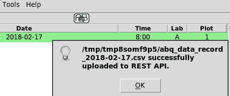
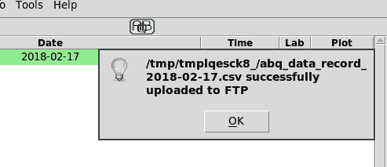

# 连接到云

似乎几乎所有的应用程序迟早都需要与外界交流，你的`ABQ data entry`应用程序也不例外。您已收到一些新的功能请求，这些请求将需要与远程服务器和服务进行一些交互。首先，质量保证部正在研究当地天气条件如何影响每个实验室的环境数据；他们要求提供一种方式，根据需要下载当地天气数据并将其存储在数据库中。第二个请求来自您的老板，他仍然需要将每日 CSV 文件上传到公司中央服务器。她希望这个过程简化，只需点击鼠标即可使用。

在本章中，您将学习以下主题：

*   使用`urllib`连接到 web 服务并下载数据
*   使用`requests`库管理更复杂的 HTTP 交互
*   使用`ftplib`连接并上传到 FTP 服务

# 使用 urllib 的 HTTP

每次在浏览器中打开网站时，您都在使用**超文本传输协议，或 HTTP**。HTTP 是在 25 年前创建的，作为 web 浏览器下载 HTML 文档的一种方式，但已经发展成为用于各种目的的最流行的客户机-服务器通信协议之一。我们不仅可以使用它在互联网上移动从纯文本到流式视频的所有内容，而且应用程序还可以使用它传输数据、启动远程过程或分发计算任务。

基本 HTTP 事务包括客户端和服务器，其功能如下：

*   **客户端**：客户端创建一个请求。**请求指定了一个称为**方法**的操作。最常用的方法是用于检索数据的`GET`，以及用于提交数据的`POST`。该请求有一个 URL，用于指定发出请求的主机、端口和路径，以及包含元数据（如数据类型或授权令牌）的标头。最后，它有一个有效负载，其中可能包含键值对中的序列化数据。**
***   **服务器**：服务器接收请求并返回响应，响应有一个包含元数据的头，如响应的状态码或内容类型。它还有一个负载，其中包含响应的实际内容，如 HTML、XML、JSON 或二进制数据。**

 **在 web 浏览器中，这些操作在后台进行，但我们的应用程序将直接处理请求和响应对象，以便与远程 HTTP 服务器通信。

# 使用 urllib.request 进行基本下载

`urllib.request`模块是用于生成 HTTP 请求的 Python 模块。它包含许多用于生成 HTTP 请求的函数和类，其中最基本的是`urlopen()`函数。`urlopen()`功能可以创建`GET`或`POST`请求并将其发送到远程服务器。

让我们来探索`urllib`是如何工作的；打开 Python shell 并执行以下命令：

```py
>>> from urllib.request import urlopen
>>> response = urlopen('http://packtpub.com')
```

`urlopen()`函数至少需要一个 URL 字符串。默认情况下，它向 URL 发出`GET`请求，并返回一个对象，该对象包装从服务器收到的响应。此`response`对象公开从服务器接收的元数据或内容，我们可以在应用程序中使用这些元数据或内容。

响应的大部分元数据都在标题中，我们可以使用`getheader()`提取，如下所示：

```py
>>> response.getheader('Content-Type')
'text/html; charset=utf-8'
>>> response.getheader('Server')
'nginx/1.4.5'
```

响应具有状态，指示在请求过程中遇到的错误条件（如果有）；状态既有编号也有文字说明，称为`reason`。

我们可以从我们的`response`对象中提取这两者，如下所示：

```py
>>> response.status
200
>>> response.reason
'OK'
```

在前面的代码中，`200`状态表示交易成功。客户端错误（如发送错误的 URL 或不正确的权限）在 400 秒时由状态指示，而服务器端问题在 500 秒时由状态指示。

`response`对象的有效载荷可以使用类似于文件句柄的接口检索，如下所示：

```py
>>> html = response.read()
>>> html[:15]
b'<!DOCTYPE html>'
```

就像文件句柄一样，响应只能读取一次，使用`read()`方法；与文件句柄不同，它不能使用`seek()`进行“重绕”，因此如果需要多次访问，则将响应数据保存在另一个变量中非常重要。`response.read()`的输出是一个字节对象，应该将其强制转换或解码为适当的对象。

在本例中，我们有一个`utf-8`字符串，如下所示：

```py
>>> html.decode('utf-8')[:15]
'<!DOCTYPE html>'
```

除了`GET`请求外，`urlopen()`还可以生成`POST`请求。

为此，我们包括一个`data`参数，如下所示：

```py
>>> response = urlopen('http://duckduckgo.com', data=b'q=tkinter')
```

`data`值需要是 URL 编码的字节对象。URL 编码的数据字符串由用符号（`&`分隔的键值对组成，某些保留字符编码为 URL 安全的替代字符（例如，空格字符为`%20`，有时仅为`+`）。

这样的字符串可以手工创建，但是使用`urllib.parse`模块提供的`urlencode`函数更容易。请看下面的代码：

```py
>>> from urllib.parse import urlencode
>>> data = {'q': 'tkinter, python', 'ko': '-2', 'kz': '-1'}
>>> urlencode(data)
'q=tkinter%2C+python&ko=-2&kz=-1'
>>> response = urlopen('http://duckduckgo.com', data=urlencode(data).encode())
```

`data`参数必须是字节，而不是字符串，因此在`urlopen`接受它之前，必须对 URL 编码的字符串调用`encode()`。

让我们尝试下载应用程序所需的天气数据。我们将使用的网站是`http://weather.gov`，它提供美国境内的天气数据。我们将要下载的实际 URL 是[http://w1.weather.gov/xml/current_obs/STATION.xml](http://w1.weather.gov/xml/current_obs/STATION.xml) ，其中`STATION`由当地气象站的呼号代替。对于 ABQ，我们将使用位于印第安纳州布卢明顿的 KBMG。

QA 团队希望您记录温度（摄氏度）、相对湿度、空气压力（毫巴）和天空条件（一串，如阴天或晴天）。他们还需要气象站观测天气的日期和时间。

# 创建下载功能

我们将创建几个函数来访问应用程序的网络资源。这些函数不会绑定到任何特定的类，因此我们将把它们放在它们自己的名为`network.py`的文件中。让我们来看看下面的步骤：

1.  在`abq_data_entry`模块目录中创建`network.py`。
2.  现在我们打开`network.py`开始我们的天气下载功能：

```py
from urllib.request import urlopen

def get_local_weather(station):
    url = (
        'http://w1.weather.gov/xml/current_obs/{}.xml'
        .format(station))
    response = urlopen(url)
```

我们的函数将使用一个`station`字符串作为参数，以防我们以后需要更改它，或者如果有人想在其他设施中使用此应用程序。该函数首先为天气数据构建 URL，并使用`urlopen()`请求该 URL。

3.  假设一切顺利，我们只需要解析出这个`response`数据，并将其放入`Application`类可以传递给数据库模型的表单中。为了确定如何处理响应，让我们回到 Python shell 并检查其中的数据：

```py
>>> response = urlopen('http://w1.weather.gov/xml/current_obs/KBMG.xml')
>>> print(response.read().decode())
<?xml version="1.0" encoding="ISO-8859-1"?>
<?xml-stylesheet href="latest_ob.xsl" type="text/xsl"?>
<current_observation version="1.0"
         xmlns:xsd="http://www.w3.org/2001/XMLSchema"
         xmlns:xsi="http://www.w3.org/2001/XMLSchema-instance"
         xsi:noNamespaceSchemaLocation="http://www.weather.gov/view/current_observation.xsd">
        <credit>NOAA's National Weather Service</credit>
        <credit_URL>http://weather.gov/</credit_URL>
....
```

4.  如 URL 所示，响应的有效负载是一个 XML 文档，我们不需要它。但是，经过一些搜索，我们可以找到我们要查找的字段，如下所示：

```py
        <observation_time_rfc822>Wed, 14 Feb 2018 14:53:00 
        -0500</observation_time_rfc822>
        <weather>Fog/Mist</weather>
        <temp_c>11.7</temp_c>
        <relative_humidity>96</relative_humidity>
        <pressure_mb>1018.2</pressure_mb>
```

很好，我们需要的数据就在那里，所以我们只需要将它从 XML 字符串提取为应用程序可以使用的格式。让我们花些时间学习解析 XML 数据。

# 解析 XML 天气数据

Python 标准库包含一个`xml`包，它由几个用于解析或创建 XML 数据的子模块组成。`xml.etree.ElementTree`子模块是一个简单、轻量级的解析器，应该能够满足我们的需要。

我们将`ElementTree`导入我们的`network.py`文件，如下所示：

```py
from xml.etree import ElementTree
```

现在，回到函数的末尾，我们将解析`response`对象中的 XML 数据，如下所示：

```py
    xmlroot = ElementTree.fromstring(response.read())
```

`fromstring()`方法接受一个 XML 字符串并返回一个`Element`对象。为了获得我们需要的数据，我们需要了解`Element`对象代表什么，以及如何使用它。

XML 是数据的分层表示；元素表示此层次结构中的节点。元素以标记开头，标记是尖括号内的文本字符串。每个标记都有一个匹配的结束标记，它只是在标记名前面加上正斜杠的标记。在开始标记和结束标记之间，元素可以有其他子元素，也可以有文本。元素还可以具有属性，这些属性是放置在开始标记的尖括号内的键值对，紧跟在标记名之后。

请看以下 XML 示例：

```py
<star_system starname="Sol">
  <planet>Mercury</planet>
  <planet>Venus</planet>
  <planet>Earth
    <moon>Luna</moon>
    </planet>
  <planet>Mars
    <moon>Phobos</moon>
    <moon>Deimos</moon>
    </planet>
  <dwarf_planet>Ceres</dwarf_planet>
</star_system>
```

这是对太阳系的（不完整的）XML 描述。根元素有一个标记`<star_system>`，属性为`starname`。在这个根元素下，我们有四个`<planet>`元素和一个`<dwarf_planet>`元素，每个元素都包含一个带有行星名称的文本节点。一些行星节点也有子`<moon>`节点，每个节点包含一个带有月球名称的文本节点。

可以说，这些数据的结构可能有所不同；例如，行星名称可能位于行星元素内的子`<name>`节点中，或者作为`<planet>`标记的属性列出。虽然 XML 语法定义良好，但 XML 文档的实际结构取决于创建者，因此完全解析 XML 数据需要了解数据在文档中的布局方式。

如果您查看我们先前在 shell 中下载的 XML 天气数据，您会注意到它是一个相当浅的层次结构。在`<current_observations>`节点下，有许多子元素，这些子元素的标记表示特定的数据字段，如温度、湿度、windchill 等。

为了获得这些子元素，`Element`为我们提供了以下多种方法：

| **方法** | **返回** |
| `iter()` | 所有子节点的迭代器（递归） |
| `find(tag)` | 与给定标记匹配的第一个元素 |
| `findall(tag)` | 与给定标记匹配的元素列表 |
| `getchildren()` | 直接子节点的列表 |
| `iterfind(tag)` | 与给定标记匹配的所有子节点的迭代器（递归） |

当我们早些时候下载 XML 数据时，我们确定了五个包含我们要从该文档中提取的数据的标记：`<observation_time_rfc822>`、`<weather>`、`<temp_c>`、`<relative_humidity>`和`<pressure_mb>`。我们希望我们的`get_local_weather()`函数返回一个包含这些键的 Python`dict`。

我们在`network.py`文件中添加以下几行：

```py
    xmlroot = ElementTree.fromstring(response.read())
    weatherdata = {
        'observation_time_rfc822': None,
        'temp_c': None,
        'relative_humidity': None,
        'pressure_mb': None,
        'weather': None
    }
```

我们的第一行从响应中提取原始 XML 并将其解析为一个`Element`树，将根节点返回到`xmlroot`。然后，我们设置了包含我们想要从 XML 数据中提取的标记的`dict`。

现在，让我们通过执行以下代码来获取值：

```py
    for tag in weatherdata:
        element = xmlroot.find(tag)
        if element is not None:
            weatherdata[tag] = element.text
```

对于每个标记名，我们将使用`find()`方法尝试在`xmlroot`中找到具有匹配标记的元素。这个特定的 XML 文档不使用重复的标记，因此任何标记的第一个实例都应该是唯一的一个。如果标签匹配，我们将返回一个`Element`对象；如果不是，我们返回`None`，因此我们需要确保`element`不是`None`，然后才能尝试访问其`text`值。

要完成该函数，只需返回`weatherdata`。

您可以在 Python shell 中测试此函数；从命令行导航到`ABQ_Data_Entry`目录并启动 Python shell：

```py
>>> from abq_data_entry.network import get_local_weather
>>> get_local_weather('KBMG')
{'observation_time_rfc822': 'Wed, 14 Feb 2018 16:53:00 -0500',
 'temp_c': '11.7', 'relative_humidity': '96', 'pressure_mb': '1017.0',
 'weather': 'Drizzle Fog/Mist'}
```

你应该得到印第安纳州布卢明顿当前天气状况的`dict`。您可以在[找到美国境内其他城市的车站代码 http://w1.weather.gov/xml/current_obs/](http://w1.weather.gov/xml/current_obs/) 。

现在我们有了天气功能，我们只需要构建存储数据的表和触发操作的接口。

# 实现气象数据存储

为了存储我们的天气数据，我们将首先在 ABQ 数据库中创建一个表来保存单个观测数据，然后构建一个`SQLModel`方法来存储数据。我们不需要担心编写代码从中检索数据，因为我们实验室的 QA 团队有他们自己的报告工具，他们将使用这些工具来访问数据。

# 创建 SQL 表

打开`create_db.sql`文件，新增`CREATE TABLE`语句如下：

```py
CREATE TABLE local_weather (
        datetime TIMESTAMP(0) WITH TIME ZONE PRIMARY KEY,
        temperature NUMERIC(5,2),
        rel_hum NUMERIC(5, 2),
        pressure NUMERIC(7,2),
        conditions VARCHAR(32)
        );
```

我们使用记录上的`TIMESTAMP`数据类型作为主键；将相同的时间戳观测值保存两次没有意义，因此这是一个足够的键。`TIMESTAMP`数据类型后的`(0)`大小表示秒的测量需要多少位小数。由于这些测量大约每小时进行一次，我们大约每四小时只需要一次（当实验室检查完成时），我们不需要时间戳中的几秒钟。

Notice that we're saving the time zone; always store time zone data with timestamps when it's available! It may not seem necessary, especially when your application will be run in a workplace that will never change time zones, but there are many edge cases such as daylight-saving time changes where the lack of a time zone can create major problems.

在数据库中运行此`CREATE`查询以构建表，然后让我们继续创建`SQLModel`方法。

# 实现 SQLModel.add_weather_data（）方法

在`models.py`中，让我们向`SQLModel`类添加一个名为`add_weather_data()`的新方法，该类将数据`dict`作为其唯一参数。

让我们从编写一个`INSERT`查询开始，如下所示：

```py
    def add_weather_data(self, data):
        query = (
            'INSERT INTO local_weather VALUES '
            '(%(observation_time_rfc822)s, %(temp_c)s, '
            '%(relative_humidity)s, %(pressure_mb)s, '
            '%(weather)s)'
        )
```

这是一个简单的参数化`INSERT`查询，使用与`get_local_weather()`函数从 XML 数据中提取的`dict`键匹配的变量名。我们只需要将这个查询和数据`dict`传递到我们的`query()`方法中。

然而，有一个问题；如果我们得到一个重复的时间戳，我们的查询将由于一个重复的主键而失败。我们可以先执行另一个查询来检查，但这有点多余，因为 PostgreSQL 本身会在插入新行之前检查重复的键。当它检测到这样一个错误时，`psycopg2`会引发一个`IntegrityError`异常，所以我们只需要捕获这个异常，如果它被引发，我们什么也不做。

为此，我们将`query()`调用包装在`try...except`块中，如下所示：

```py
        try:
            self.query(query, data)
        except pg.IntegrityError:
            # already have weather for this datetime
            pass
```

现在，我们的数据输入人员可以随时调用此方法，但只有在有新的观察结果需要保存时，它才会保存记录。

# 更新 SettingsModel 类

在离开`models.py`之前，我们需要添加一个新的应用程序设置来存储首选气象站。在`SettingsModel.variables`字典中添加一个新条目，如下所示：

```py
    variables = {
        ...
        'weather_station': {'type': 'str', 'value': 'KBMG'},
        ...
```

我们不会为此设置添加 GUI，因为用户不需要更新它。这将取决于我们，或其他实验室的系统管理员，以确保在每个工作站上正确设置。

# 为天气下载添加 GUI 元素

`Application`对象现在需要使用主菜单类可以调用的适当回调方法将`network.py`中的天气下载方法连接到`SQLModel`中的数据库方法。遵循以下步骤：

1.  打开`application.py`并启动一个新方法，如下所示：

```py
    def update_weather_data(self):

      try:
           weather_data = n.get_local_weather(
               self.settings['weather_station'].get())
```

2.  回想一下，在错误场景中，`urlopen()`可以引发任意数量的异常，这取决于 HTTP 事务的错误。除了通知用户并退出该方法之外，应用程序实际上无法处理此类异常。因此，我们将捕获泛型`Exception`并在`messagebox`中显示文本，如下所示：

```py
        except Exception as e:
            messagebox.showerror(
                title='Error',
                message='Problem retrieving weather data',
                detail=str(e)
            )
            self.status.set('Problem retrieving weather data')
```

3.  如果`get_local_weather()`成功，我们只需将数据传递到我们的模型方法，如下所示：

```py
        else:
            self.data_model.add_weather_data(weather_data)
            self.status.set(
                'Weather data recorded for {}'
                .format(weather_data['observation_time_rfc822']))
```

除了保存数据外，我们还在状态栏中通知用户天气已更新，并显示更新的时间戳。

4.  完成回调方法后，让我们将其添加到`callbacks`字典中：

```py
        self.callbacks = {
            ...
            'update_weather_data': self.update_weather_data,
            ...
```

5.  现在我们可以在主菜单中为回调添加一个命令项。在 Windows 上，这样的功能会出现在`Tools`菜单中，由于 Gnome 和 macOS 指南似乎都没有指出更合适的位置，我们将在`LinxMainMenu`和`MacOsMainMenu`类中实现`Tools`菜单来保存此命令，只是为了保持一致。在`mainmenu.py`中，从通用菜单类开始，添加一个新菜单，如下所示：

```py
        #Tools menu
        tools_menu = tk.Menu(self, tearoff=False)
        tools_menu.add_command(
            label="Update Weather Data",
            command=self.callbacks['update_weather_data'])
        self.add_cascade(label='Tools', menu=tools_menu)
```

6.  将同一菜单添加到 macOS 和 Linux 菜单类，并将命令添加到 Windows 主菜单的`tools_menu`。更新菜单后，您可以运行应用程序并从`Tools`菜单中尝试新命令。如果一切顺利，您应该在状态栏中看到一个指示，如以下屏幕截图所示：


7.  您还应使用 PostgreSQL 客户端连接到数据库，并通过执行以下 SQL 命令检查表中是否包含一些天气数据：

```py
SELECT * FROM local_weather;
```

该 SQL 语句应返回类似以下内容的输出：

| `datetime` | `temperature` | `rel<sub>hum</sub>` | `pressure` | `conditions` |
| `2018-02-14 22:53:00-06` | `15.00` | `87.00` | `1014.00` | `Overcast` |

# HTTP 使用请求

您被要求在程序中创建一个函数，将每日数据的 CSV 提取上传到 ABQ 的 corporate web services，该服务使用经过验证的 REST API。虽然`urllib`很容易用于简单的一次性`GET`和`POST`请求，但涉及身份验证令牌、文件上传或 REST 服务的复杂交互单独使用`urllib`可能会令人沮丧和复杂。为了完成这项工作，我们将转向`requests`图书馆。

**REST** stands for **REpresentational State Transfer**, and is the name used for web services built around advanced HTTP semantics. In addition to `GET` and `POST`, REST APIs use additional HTTP methods like `DELETE`, `PUT`, and `PATCH`, along with data formats like XML or JSON, to present an API with a complete range of interactions.

Python 社区强烈推荐第三方`requests`库用于任何涉及 HTTP 的严肃工作（甚至`urllib`文档也推荐它）。正如您将看到的，`requests`删除了`urllib`中留下的许多粗糙的边缘和过时的假设，并为更现代的 HTTP 事务提供了方便的类和包装函数。有关`requests`的完整文件可在[上找到 http://docs.python-requests.org](http://docs.python-requests.org) ，但下一节将介绍有效使用它所需的大部分知识。

# 安装和使用请求

`requests`包是用纯 Python 编写的，因此使用`pip`安装它不需要编译或二进制下载。只需在终端中键入`pip install --user requests`即可将其添加到您的系统中。

打开 Python shell，让我们提出如下请求：

```py
>>> import requests
>>> response = requests.request('GET', 'http://www.alandmoore.com')
```

`requests.request` requires, at minimum, an HTTP method and a URL. Just like `urlopen()`, it constructs the appropriate request packet, sends it to the URL, and returns an object representing the server's response. Here, we're making a `GET` request to this author's website.

除了`request()`函数外，`requests`还有对应于最常用 HTTP 方法的快捷方式函数。

因此，可以提出如下相同的请求：

```py
response = requests.get('http://www.alandmoore.com')
```

`get()`方法只需要 URL 并执行`GET`请求。类似地，`post()`、`put()`、`patch()`、`delete()`和`head()`函数使用相应的 HTTP 方法发送请求。所有请求函数都采用附加的可选参数。

例如，我们可以通过`POST`请求发送数据，如下所示：

```py
>>> response = requests.post(
    'http://duckduckgo.com',
    data={'q': 'tkinter', 'ko': '-2', 'kz': '-1'})
```

注意，与`urlopen()`不同，我们可以直接使用 Python 字典作为`data`参数；`requests`为我们将其转换为正确的字节对象。

与请求函数一起使用的一些更常见的参数如下：

| **参数** | **目的** |
| `params` | 与`data`类似，但添加到查询字符串而不是有效负载 |
| `json` | 要包含在有效负载中的 JSON 数据 |
| `headers` | 用于请求的头数据字典 |
| `files` | `{fieldnames: file objects}`的字典，作为多部分表单数据请求发送 |
| `auth` | 用于基本 HTTP 摘要身份验证的用户名和密码元组 |

# requests.session（）函数

Web 服务，尤其是私有的 Web 服务，通常都有密码保护。有时，这是使用较旧的 HTTP 摘要身份验证系统完成的，我们可以使用请求函数的`auth`参数对其进行处理。不过，现在更常见的是，身份验证涉及将凭据发布到 REST 端点，以获取用于验证后续请求的会话 cookie 或身份验证令牌。

An endpoint is simply a URL that corresponds to data or functionality exposed by the API. Data is sent to or retrieved from an endpoint.

`requests`方法通过提供`Session`类使所有这些变得简单。`Session`对象允许您跨多个请求持久保存设置、cookie 和连接。

要创建`Session`对象，请使用`requests.session()`工厂函数，如下所示：

```py
s = requests.session()
```

现在，我们可以在`Session`对象上调用`get()`、`post()`等请求方法，如下所示：

```py
# Assume this is a valid authentication service that returns an auth token
s.post('http://example.com/login', data={'u': 'test', 'p': 'test'})
# Now we would have an auth token
response = s.get('http://example.com/protected_content')
# Our token cookie would be listed here
print(s.cookies.items())
```

像这样的令牌和 cookie 处理是在后台进行的，我们没有任何明确的操作。Cookie 存储在作为我们的`Session`对象的`cookies`属性存储的`CookieJar`对象中。

我们还可以在`Session`对象上设置值，该值将在请求之间保持，如本例所示：

```py
s.headers['User-Agent'] = 'Mozilla'
# will be sent with a user-agent string of "Mozilla"
s.get('http://example.com')
```

在本例中，我们将用户代理字符串设置为`Mozilla`，它将用于从`Session`对象发出的所有请求。我们还可以使用`params`属性设置默认 URL 参数，或者使用`hooks`属性设置回调函数。

# 响应对象

这些请求函数返回的响应对象与`urlopen()`返回的响应对象不同；它们包含所有相同的数据，但形式略有不同（通常更方便）。

例如，响应头已经为我们翻译成 Python`dict`，如下所示：

```py
>>> r = requests.get('http://www.alandmoore.com')
>>> r.headers
{'Date': 'Thu, 15 Feb 2018 21:13:42 GMT', 'Server': 'Apache',
 'Last-Modified': 'Sat, 17 Jun 2017 14:13:49 GMT',
 'ETag': '"20c003f-19f7-5945391d"', 'Content-Length': '6647',
 'Keep-Alive': 'timeout=15, max=200', 'Connection': 'Keep-Alive',
 'Content-Type': 'text/html'}
```

另一个区别是`requests`不会自动引发 HTTP 错误异常。但是，可以调用`.raise_for_status()`响应方法来执行此操作。

例如，此 URL 将给出 HTTP`404`错误，如下代码所示：

```py
>>> r = requests.get('http://www.example.com/does-not-exist')
>>> r.status_code
404
>>> r.raise_for_status()
Traceback (most recent call last):
  File "<stdin>", line 1, in <module>
  File "/usr/lib/python3.6/site-packages/requests/models.py", line 935, in raise_for_status
    raise HTTPError(http_error_msg, response=self)
requests.exceptions.HTTPError: 404 Client Error: Not Found for url: http://www.example.com/does-not-exist
```

这使我们可以选择使用异常处理或更传统的流控制逻辑来处理 HTTP 错误。

# 实现 API 上传

要开始实现我们的上传功能，我们需要弄清楚我们要发送什么样的请求。公司办公室向我们提供了一些文档，描述了如何与 RESTAPI 交互。

文档告诉我们以下内容：

*   我们首先需要获得一个身份验证令牌。我们通过向`/auth`端点提交`POST`请求来实现这一点。`POST`请求的参数应包括`username`和`password`。
*   获得身份验证令牌后，我们需要提交 CSV 文件。该请求是发送到`/upload`端点的`PUT`请求。文件作为`file`参数中指定的多部分表单数据上传。

我们已经知道使用`requests`实现 REST 上传功能已经足够了，但是在我们实现之前，让我们创建一个服务，我们可以使用它来测试代码。

# 创建测试 HTTP 服务

开发与外部服务互操作的代码可能令人沮丧。在编写和调试代码时，我们需要向服务发送大量错误或测试数据；我们不想针对生产服务这样做，而且“测试模式”并不总是可用的。自动测试可以使用`Mock`对象来修补网络请求，但是在开发过程中，能够看到实际发送到 web 服务的内容是很好的。

让我们实现一个非常简单的 HTTP 服务器，它将接受我们的请求并打印出关于它所接收内容的信息。我们可以使用 Python 标准库的`http.server`模块来实现这一点。

模块文档显示了基本 HTTP 服务器的以下示例：

```py
from http.server import HTTPServer, BaseHTTPRequestHandler
def run(server_class=HTTPServer, handler_class=BaseHTTPRequestHandler):
    server_address = ('', 8000)
    httpd = server_class(server_address, handler_class)
    httpd.serve_forever()
run()
```

服务器类`HTTPServer`定义了一个对象，用于侦听配置的地址和端口上的 HTTP 请求。处理程序类`BaseHTTPRequestHandler`定义了一个接收实际请求数据并返回响应数据的对象。我们将使用此代码作为起点，因此将其保存在名为`sample_http_server.py`的文件中的`ABQ_Data_Entry`目录之外。

如果您运行此代码，您将在本地计算机的端口`8000`上运行一个 web 服务；但是，如果您使用`requests`、类似`curl`的工具或仅使用 web 浏览器对此服务发出任何请求，您会发现它只返回 HTTP`501`（`unsupported method`错误。为了使服务器能够充分工作，就像我们的测试目标 API 一样，我们需要创建自己的处理程序类来响应必要的 HTTP 方法。

为此，我们将创建自己的名为`TestHandler`的处理程序类，如下所示：

```py
class TestHandler(BaseHTTPRequestHandler):
    pass

def run(server_class=HTTPServer, handler_class=TestHandler):
    ...
```

我们公司的 API 使用`POST`方法接收登录凭据，使用`PUT`方法接收文件，因此这两种方法都需要工作。为了使 HTTP 方法在请求处理程序中工作，我们需要实现一个`do_VERB`方法，其中`VERB`是我们的 HTTP 方法名称，全部大写。

因此，对于`PUT`和`POST`添加以下代码：

```py
class TestHandler(BaseHTTPRequestHandler):
    def do_POST(self, *args, **kwargs):
        pass

    def do_PUT(self, *args, **kwargs):
        pass
```

这并不能解决问题，因为这些方法需要处理程序发送某种响应。为了我们的目的，我们不需要任何特别的回应；只要状态为`200`（`OK`的东西就可以了。

由于这两种方法都需要这样做，我们添加第三种方法，可以从其他两种方法调用，如下所示：

```py
    def _send_200(self):
        self.send_response(200)
        self.send_header('Content-type', 'text/html')
        self.end_headers()
```

这是满足大多数 HTTP 客户机所需的最简单的响应：状态为`200`和带有有效`Content-type`的头。这不会将任何实际数据发送回客户机，但会告诉客户机其请求已收到并已成功处理。

在我们的方法中，我们想做的另一件事是打印出发送的任何数据，这样我们就可以确保我们的客户机发送了正确的数据。

我们将实现以下方法来实现此目的：

```py
    def _print_request_data(self):
        content_length = self.headers['Content-Length']
        print("Content-length: {}".format(content_length))
        data = self.rfile.read(int(content_length))
        print(data.decode('utf-8'))
```

handler 对象的`headers`属性是一个包含请求头的`dict`对象，其中包括发送的字节数（`content-length`。除了打印这些信息，我们还可以使用它读取发送的数据。处理程序的`rfile`属性是包含数据的类似文件的对象；它的`read()`方法需要一个长度参数来指定应该读取多少数据，所以我们使用提取的`content-length`值。返回的数据是`bytes`对象，所以我们将其解码为`utf-8`。

现在我们有了这两个方法，我们更新`do_POST()`和`do_PUT()`来调用它们，如下所示：

```py
    def do_POST(self, *args, **kwargs):
        print('POST request received')
        self._print_request_data()
        self._send_200()

    def do_PUT(self, *args, **kwargs):
        print("PUT request received")
        self._print_request_data()
        self._send_200()
```

现在，每个方法都会将接收到的长度和数据打印到`POST`或`PUT`以及任何数据。在终端窗口中运行此脚本，以便监视其输出。

现在，打开一个 shell，让我们按如下方式进行测试：

```py
>>> import requests
>>> requests.post('http://localhost:8000', data={1: 'test1', 2: 'test2'})
<Response[200]>
```

在 web 服务器终端中，您应该看到以下输出：

```py
POST request received
Content-length: 15
1=test1&2=test2
127.0.0.1 - - [15/Feb/2018 16:22:41] "POST / HTTP/1.1" 200 -
```

我们可以实现额外的功能，比如实际检查凭证和返回身份验证令牌，但现在这个服务器足以帮助我们编写和测试客户机代码。

# 创建我们的网络功能

现在我们的测试服务已经启动并运行，让我们开始处理将与 REST API 交互的网络功能：

1.  我们将首先在`network.py`中创建一个函数，该函数将获取 CSV 文件的路径、上载和验证 URL 以及用户名和密码：

```py
import requests

...

def upload_to_corporate_rest(
    filepath, upload_url, auth_url, username, password):
```

2.  因为我们必须处理身份验证令牌，所以我们应该做的第一件事是创建一个会话。我们将其命名为`session`如下：

```py
    session = requests.session()
```

3.  创建会话后，我们将用户名和密码发布到身份验证端点，如下所示：

```py
    response = session.post(
        auth_url,
        data={'username': username, 'password': password})
    response.raise_for_status()
```

如果我们成功，`session`对象将自动存储我们收到的令牌。如果出现问题，我们调用了`raise_for_status()`，这样函数将中止，调用代码可以处理由网络或数据问题引起的任何异常。

4.  假设我们没有引发异常，此时必须进行身份验证，现在可以提交文件。这将通过`put()`调用完成，如下所示：

```py
    files = {'file': open(filepath, 'rb')}
    response = session.put(
        upload_url,
        files=files
    )
```

要发送文件，我们必须实际打开它并将其作为文件句柄传递到`put()`；请注意，我们以二进制读取模式（`rb`打开它）。`requests`文档建议这样做，因为它可以确保为收割台计算正确的`content-length`值。

5.  发送请求后，我们关闭文件并在结束函数之前再次检查失败状态，如下所示：

```py
    files['file'].close()
    response.raise_for_status()
```

# 更新应用程序

在从`Application`调用新函数之前，我们需要实现一种方法来创建每日数据的 CSV 提取。这将由多个函数使用，因此我们将分别实现它和调用上载代码的函数。按照以下步骤操作：

1.  首先，我们需要一个临时位置来存储生成的 CSV 文件。`tempfile`模块包括处理临时文件和目录的功能；我们将导入`mkdtemp()`，这将为我们提供特定于平台的临时目录的名称：

```py
from tempfile import mkdtemp
```

Note that `mdktemp()` doesn't actually create a directory; it merely provides an absolute path to a randomly named directory in the platform's preferred `temp` file location. We'll have to create the directory ourselves.

2.  现在，让我们按照如下方式开始新的`Application`方法：

```py
    def _create_csv_extract(self):
        tmpfilepath = mkdtemp()
        csvmodel = m.CSVModel(
            filename=self.filename.get(), filepath=tmpfilepath)
```

在创建了一个临时目录名之后，我们已经创建了一个`CSVModel`类的实例；即使我们不再将数据存储在 CSV 文件中，我们仍然可以使用该模型导出 CSV 文件。我们已经传递了`Application`对象的默认文件名，它仍然设置为`abq_data_record-CURRENTDATE.csv`，并且临时目录的路径为`filepath`。当然，我们的`CSVModel`目前不需要`filepath`，但我们会马上解决。

3.  创建 CSV 模型后，我们将从数据库中提取记录，如下所示：

```py
        records = self.data_model.get_all_records()
        if not records:
            return None
```

记住，默认情况下，我们的`SQLModel.get_all_records()`方法返回当天所有记录的列表。如果我们当天没有任何记录，可能最好立即停止并提醒用户，而不是向 corporate 发送一个空的 CSV 文件，因此如果没有记录，我们将从方法返回`None`。我们的调用代码可以测试`None`返回值并显示相应的警告。

4.  现在我们需要做的就是遍历记录并将每个记录保存到 CSV，然后返回`CSVModel`对象的文件名，如下所示：

```py
        for record in records:
            csvmodel.save_record(record)

        return csvmodel.filename
```

5.  现在我们有了创建 CSV 提取文件的方法，我们可以按如下方式编写回调方法：

```py
    def upload_to_corporate_rest(self):

        csvfile = self._create_csv_extract()

        if csvfile is None:
            messagebox.showwarning(
                title='No records',
                message='There are no records to upload'
            )
            return
```

首先，我们创建了一个 CSV 提取文件并检查它是否为`None`。如果是，我们将显示一条错误消息并退出该方法。

6.  在上传之前，我们需要从用户那里获取用户名和密码。幸运的是，我们有一个完美的课堂：

```py
        d = v.LoginDialog(
            self,
            'Login to ABQ Corporate REST API')
        if d.result is not None:
            username, password = d.result
        else:
            return
```

我们的登录对话框为我们提供了很好的服务。与数据库登录不同，我们不会无休止地循环运行它；如果密码错误，用户可以重新运行该命令。回想一下，如果用户单击 Cancel，`result`将是`None`，因此在这种情况下，我们将退出回调方法。

7.  现在，我们可以按如下方式执行网络功能：

```py
        try:
            n.upload_to_corporate_rest(
                csvfile,
                self.settings['abq_upload_url'].get(),
                self.settings['abq_auth_url'].get(),
                username,
                password)
```

我们在`try`块中执行`upload_to_corporate_rest()`，因为它可能会引发许多异常。我们正在从设置对象传递上传和验证 URL；我们还没有添加这些，所以在我们完成之前需要这样做。

8.  现在，让我们捕捉一些异常，从`RequestException`开始。如果我们发送到 API 的数据出现问题，很可能是错误的用户名和密码，就会发生此异常。我们将在向用户显示的消息中附加异常字符串，如下所示：

```py
        except n.requests.RequestException as e:
            messagebox.showerror('Error with your request', str(e))
```

9.  下一步我们来抓`ConnectionError`；此异常可能是网络问题造成的，例如实验室的 internet 连接关闭，或服务器没有响应：

```py
        except n.requests.ConnectionError as e:
            messagebox.showerror('Error connecting', str(e))
```

10.  任何其他异常将仅显示为`General Exception`，如下所示：

```py
        except Exception as e:
            messagebox.showerror('General Exception', str(e))
```

11.  让我们用一个成功对话框来结束该方法，如下所示：

```py
        else:
            messagebox.showinfo(
                'Success',
                '{} successfully uploaded to REST API.'
                .format(csvfile))
```

12.  让我们通过将此方法添加到`callbacks`来完成对`Application`的更改，如下所示：

```py
        self.callbacks = {
            ...
            'upload_to_corporate_rest':  
           self.upload_to_corporate_rest,
            ...
```

# 更新 models.py 文件

在我们测试新功能之前，`models.py`文件中有几件事情需要解决。我们将通过以下步骤来解决这些问题：

1.  首先，我们`CSVModel`班需要能够选修`filepath`：

```py
    def __init__(self, filename, filepath=None):
        if filepath:
            if not os.path.exists(filepath):
                os.mkdir(filepath)
            self.filename = os.path.join(filepath, filename)
        else:
            self.filename = filename
```

如果指定了`filepath`，我们需要首先确保目录存在。由于`Application`类中调用的`mkdtmp()`方法实际上并不创建临时目录，因此我们将在此处创建它。完成后，我们将加入`filepath`和`filename`值，并将其存储在`CSVModel`对象的`filename`属性中。

2.  在`models.py`中我们需要做的另一件事是添加我们的新设置。向下滚动到`SettingsModel`类，再添加两个`variables`条目，如下所示：

```py
    variables = {
        ...
        'abq_auth_url': {
            'type': 'str',
            'value': 'http://localhost:8000/auth'},
        'abq_upload_url': {
            'type': 'str',
            'value': 'http://localhost:8000/upload'},
         ...
```

我们不会构建 GUI 来设置这些设置，它们需要在用户的配置文件中手动创建，不过对于测试，我们可以使用默认设置。

# 结束

最后要做的是将命令添加到主菜单中。

在每个菜单类的`tools_menu`中添加一个新条目：

```py
        tools_menu.add_command(
            label="Upload CSV to corporate REST",
            command=self.callbacks['upload_to_corporate_rest'])
```

现在，运行该应用程序，让我们尝试一下。要使其工作，您需要至少有一个数据条目，并且需要启动`sample_http_server.py`脚本。

如果一切顺利，您将获得如下对话框：



您的服务器还应该向终端打印一些输出，如下所示：

```py
POST request received
Content-length: 27
username=test&password=test
127.0.0.1 - - [16/Feb/2018 10:17:22] "POST /auth HTTP/1.1" 200 -
PUT request received
Content-length: 397
--362eadeb828747769e75d5b4b6d32f31
Content-Disposition: form-data; name="file"; filename="abq_data_record_2018-02-16.csv"

Date,Time,Technician,Lab,Plot,Seed sample,Humidity,Light,Temperature,Equipment Fault,Plants,Blossoms,Fruit,Min Height,Max Height,Median Height,Notes
2018-02-16,8:00,Q Murphy,A,1,AXM477,10.00,10.00,10.00,,1,2,3,1.00,3.00,2.00,"
"

--362eadeb828747769e75d5b4b6d32f31--

127.0.0.1 - - [16/Feb/2018 10:17:22] "PUT /upload HTTP/1.1" 200 -
```

注意`POST`和`PUT`请求，以及`PUT`有效负载中 CSV 文件的原始文本。我们已成功满足此函数的 API 要求。

# 使用 ftplib 的 FTP

虽然 HTTP 和 REST API 是客户机-服务器交互的当前趋势，但企业依靠较旧、经过时间测试、有时甚至过时的技术来实现数据传输并不罕见。ABQ 也不例外：除了 REST 上传之外，您还需要实现对 ABQ corporate 依赖 FTP 的遗留系统的支持。

# FTP 的基本概念

**文件传输协议**或**FTP**可追溯到 20 世纪 70 年代初，比 HTTP 早了近 20 年。尽管如此，许多组织仍然普遍使用它在互联网上交换大型文件。FTP 在许多领域被认为有些过时，部分原因是它以明文形式传输数据和凭证，尽管也可以使用 FTP 的 SSL 加密变体。

与 HTTP 类似，FTP 客户端发送包含与 HTTP 方法类似的纯文本命令的请求，FTP 服务器返回包含标头和有效负载信息的响应包。

然而，这两个协议之间存在许多显著差异：

*   FTP 是一种**有状态连接**，这意味着客户端和服务器在会话过程中保持恒定的连接。换句话说，FTP 更像是一个实时电话呼叫，而 HTTP 就像两个人通过语音邮件进行对话。
*   FTP 要求在发送任何其他命令或数据之前对会话进行身份验证，即使对于匿名用户也是如此。FTP 服务器还实现了一组更复杂的权限。
*   FTP 有单独的传输文本和二进制数据的模式（主要区别在于，文本模式会自动传输正确的行尾和接收操作系统的编码）。
*   FTP 服务器在执行命令时不太一致。

# 创建测试 FTP 服务

在我们实现 FTP 上传功能之前，有一个测试 FTP 服务是很有帮助的，就像我们对测试 HTTP 服务所做的那样。当然，您可以下载任意数量的免费 FTP 服务器，如 FileZilla、PureFTPD、ProFTPD 或其他。

我们可以用 Python 构建一个基本的服务器，而不是为了测试应用程序的一个功能而在系统上安装、配置和稍后删除 FTP 服务。第三方`pyftpdlib`包为我们提供了一种简单的方法来实现满足测试需要的快速脏 FTP 服务器。

使用`pip`安装`pyftpdlib`：

```py
pip install --user pyftpdlib
```

就像我们简单的 HTTP 服务器一样，FTP 服务由一个*服务器*对象和一个*处理程序*对象组成。它还需要一个*授权人*对象来处理身份验证和权限。

我们将通过导入以下内容开始我们的`basic_ftp_server.py`文件：

```py
from pyftpdlib.authorizers import DummyAuthorizer
from pyftpdlib.handlers import FTPHandler
from pyftpdlib.servers import FTPServer
```

为了确保我们的身份验证代码正常工作，让我们用测试用户设置我们的`DummyAuthorizer`类：

```py
auth = DummyAuthorizer()
auth.add_user('test', 'test', '.', perm='elrw')
```

`perm`参数接受一个字符串，每个字符表示服务器上的特定权限。在本例中，我们有`e`（连接）、`l`（列表）、`r`（读取）和`w`（写入新文件）。还有许多其他可用的权限，在授予之前，所有这些权限在默认情况下都是关闭的，但这足以满足我们的需要。

现在，让我们设置处理程序：

```py
handler = FTPHandler
handler.authorizer = auth
```

请注意，我们没有实例化处理程序，只是给类添加别名。服务器类将管理处理程序类的创建。但是，我们可以将我们的`auth`对象指定为处理程序的`authorizer`类，以便任何创建的处理程序都将使用我们的授权程序。

最后，让我们设置并运行服务器部分：

```py
address = ('127.0.0.1', 2100)
server = FTPServer(address, handler)

server.serve_forever()
```

这只是用地址元组和处理程序类实例化一个`FTPServer`对象，然后调用该对象的`server_forever()`方法。地址元组的格式为`(ip_address, port)`，因此`('127.0.0.1', 2100)`元组表示我们将在计算机的环回地址端口`2100`上提供服务。FTP 的默认端口通常为 21，但在大多数操作系统上，启动在`1024`下侦听端口的服务需要 root 或系统管理员权限。为了简单起见，我们将使用更高的端口。

While it's possible to build production quality FTP servers with `pyftpdlib`, we haven't done that here. This script is adequate for testing, but please don't use it in production if you value security.

# 实现 FTP 上传功能

现在测试服务器已经启动并运行，让我们构建 FTP 上传功能和 GUI 逻辑。虽然标准库不包含 FTP 服务器库，但它确实包含以`ftplib`模块形式存在的 FTP 客户端库。

首先将`ftplib`导入我们的`network.py`文件：

```py
import ftplib as ftp
```

可以使用`ftplib.FTP`类创建 FTP 会话。因为这是一个有状态会话，所以需要在完成后关闭它；为了确保我们做到这一点，`FTP`可以用作上下文管理器。

让我们通过连接到 FTP 服务器来启动我们的功能：

```py
def upload_to_corporate_ftp(
        filepath, ftp_host,
        ftp_port, ftp_user, ftp_pass):

    with ftp.FTP() as ftp_cx:
        ftp_cx.connect(ftp_host, ftp_port)
        ftp_cx.login(ftp_user, ftp_pass)
```

`upload_to_corporate()`函数采用 CSV 文件路径和`FTP`主机、端口、用户和密码，就像我们的`upload_to_corporate_rest()`函数一样。我们首先创建`FTP`对象并调用`FTP.connect()`和`FTP.login`。

接下来，`connect()`获取我们要与之对话的主机和端口，并启动与服务器的会话。我们目前还没有通过身份验证，但我们确实有一个连接正在运行。

然后，`login()`获取用户名和密码并尝试验证我们的会话。如果我们的凭据签出，我们将登录到服务器，并可以开始发送更多命令；如果不是，则引发`error_perm`异常。但是，在关闭会话之前，会话仍然处于活动状态，如果愿意，我们可以发送其他登录尝试。

要实际上传文件，我们使用`storbinary()`方法：

```py
        filename = path.basename(filepath)
        with open(filepath, 'rb') as fh:
            ftp_cx.storbinary('STOR {}'.format(filename), fh)
```

要发送文件，我们必须以二进制读取模式打开它，然后调用`storbinary`（是的，它是“stor”，而不是“store”——20 世纪 70 年代的程序员对从单词中删除字母很在行）。

`storbinary`的第一个参数是一个有效的 FTP`STOR`命令，通常为`STOR filename`，其中“filename”是您希望在服务器上调用上传数据的内容。必须包含实际的命令字符串似乎有点违反直觉；如果服务器使用稍有不同的命令或语法，可能必须指定此选项。

第二个参数是文件对象本身。这应该以二进制模式打开，因为我们将其作为二进制数据发送。这可能看起来很奇怪，因为我们发送的 CSV 文件本质上是一个纯文本文件，但将其作为二进制数据发送可以保证服务器在传输过程中不会以任何方式更改文件；无论交换的数据的性质如何，传输文件时，这几乎总是您想要的。

这是所有我们的网络功能需要做的 FTP 上传。虽然我们的程序只需要`storbinary()`方法，但值得注意的是，如果您发现自己必须使用 FTP 服务器，那么还有一些其他常见的`ftp`方法。

# 列表文件

列出 FTP 服务器上的文件有三种方法。`mlsd()`方法调用`MLSD`命令，这通常是可用的最佳和最完整的输出。它可以采用一个可选的`path`参数，指定列表的路径（否则它会列出当前目录），以及一个`facts`列表，如“大小”、“类型”或“perm”，反映您希望包含在文件名中的数据。`mlsd()`命令返回一个生成器对象，该对象可以迭代或转换为另一个序列类型。

`MLSD`是较新的命令，并不总是可用，因此还有两种方法可用，`nlst()`和`dir()`，这两种方法对应于较旧的`NLST`和`DIR`命令。这两种方法都接受任意数量的参数，这些参数将逐字添加到发送到服务器的命令字符串中。

# 检索文件

从 FTP 服务器下载文件涉及`retrbinary()`或`retrlines()`方法之一，具体取决于我们希望使用二进制还是文本模式（如前所述，您可能应该始终使用二进制）。与`storbinary`类似，每个方法都将命令字符串作为其第一个参数，但在本例中，它应该是有效的`RETR`命令（通常“RETR filename”就足够了）。

第二个参数是回调函数，它将在每一行（对于`retrlines()`）或区块（对于`retrbinary()`）上调用。此回调可用于存储下载的数据。

例如，请查看以下代码：

```py
from ftplib import FTP
from os.path import join

filename = 'raytux.jpg'
path = '/pub/ibiblio/logos/penguins'
destination = open(filename, 'wb')
with FTP('ftp.nluug.nl', 'anonymous') as ftp:
    ftp.retrbinary(
        'RETR {}'.format(join(path, filename)),
        destination.write)
destination.close()
```

每个函数的返回值是一个结果字符串，其中包含有关下载的一些统计信息，如下所示：

```py
'226-File successfully transferred\n226 0.000 seconds (measured here), 146.96 Mbytes per second'
```

# 删除或重命名文件

相比之下，使用`ftplib`删除和重命名文件非常简单。`delete()`方法仅获取文件名并尝试删除服务器上的给定文件。`rename()`方法只接受源和目标，并尝试将源重命名为目标名称。

当然，这两种方法的成功与否取决于授予所使用的登录帐户的权限。

# 将 FTP 上载添加到 GUI

我们的 FTP 上传功能已经准备就绪，所以让我们向应用程序的其余部分添加必要的位，使其能够协同工作。

我们首先将 FTP 主机和端口添加到`models.py`中的`SettingsModel`：

```py
    variables = {
        ...
        'abq_ftp_host': {'type': 'str', 'value': 'localhost'},
        'abq_ftp_port': {'type': 'int', 'value': 2100}
        ...
```

请记住，我们的测试 FTP 使用的是端口`2100`，而不是通常的端口`21`，因此我们现在将`2100`设为默认端口。

现在，我们将转到`application.py`并创建回调方法，该方法将创建 CSV 文件并将其传递给 FTP 上载函数。

在`Application`对象中创建一个新方法：

```py
    def upload_to_corporate_ftp(self):
        csvfile = self._create_csv_extract()
```

我们要做的第一件事是使用我们为`REST`上传创建的方法创建我们的 CSV 文件。

接下来，我们将询问用户 FTP 用户名和密码：

```py
        d = v.LoginDialog(
            self,
            'Login to ABQ Corporate FTP')
```

现在，我们将调用我们的网络函数：

```py
        if d.result is not None:
            username, password = d.result
            try:
                n.upload_to_corporate_ftp(
                    csvfile,
                    self.settings['abq_ftp_host'].get(),
                    self.settings['abq_ftp_port'].get(),
                    username,
                    password)
```

我们在`try`块中调用 FTP upload 函数，因为我们的 FTP 进程会引发一些异常。

我们可以捕捉`ftplib.all_errors`而不是单独捕捉它们：

```py
            except n.ftp.all_errors as e:
                messagebox.showerror('Error connecting to ftp', str(e))
```

Note that `ftplib.all_errors` is the base class for all exceptions defined in `ftplib`, which include, among other things, authentication errors, permission errors, and connectivity errors.

要结束此方法，我们将显示一条成功消息：

```py
            else:
                messagebox.showinfo(
                    'Success',
                    '{} successfully uploaded to FTP'.format(csvfile))
```

编写回调方法后，我们需要将其添加到`callbacks`字典中：

```py
        self.callbacks = {
            ...
            'upload_to_corporate_ftp': self.upload_to_corporate_ftp
        }
```

我们需要做的最后一件事是将回调添加到主菜单类中。

在`mainmenu.py`中，为每个类中的`tools_menu`添加一个新命令：

```py
        tools_menu.add_command(
            label="Upload CSV to corporate FTP",
            command=self.callbacks['upload_to_corporate_ftp'])
```

在终端中启动示例 FTP 服务器，然后运行应用程序并尝试 FTP 上载。记住输入`test`作为用户名和密码！

您应该会看到这样一个成功对话框：



同样，在运行示例 FTP 服务器的任何目录中都应该有一个新的 CSV 文件。

FTP 服务器应该打印出以下信息：

```py
127.0.0.1:32878-[] FTP session opened (connect)
127.0.0.1:32878-[test] USER 'test' logged in.
127.0.0.1:32878-[test] STOR /home/alanm/FTPserver/abq_data_record_2018-02-17.csv completed=1 bytes=235 seconds=0.001
127.0.0.1:32878-[test] FTP session closed (disconnect).
```

看起来我们的 FTP 上传效果很好！

# 总结

在本章中，我们使用 HTTP 和 FTP 与云联系。您学习了如何使用`urllib`下载数据并使用`ElementTree`解析 XML。您还发现了`requests`库，并学习了与 RESTAPI 交互的基础知识。最后，我们学习了如何使用 Python 的`ftplib`下载文件并上传到 FTP。**