# 事件处理-信号和插槽

在本章中，我们将学习以下主题：

*   使用信号/插槽编辑器
*   将文本从一个行编辑小部件复制和粘贴到另一个行编辑小部件
*   转换数据类型和制作小型计算器
*   使用 Spin Box 小部件
*   使用滚动条和滑块
*   使用列表小部件
*   从一个列表小部件中选择多个列表项并在另一个列表小部件中显示它们
*   将项目添加到列表小部件
*   在列表小部件中执行操作
*   使用组合框小部件
*   使用字体组合框小部件
*   使用进度条小部件

# 介绍

事件处理是每个应用程序中的重要机制。应用程序不仅应该识别事件，还必须采取相应的操作来服务于事件。对任何事件采取的操作决定了应用程序的进程。每种编程语言都有不同的处理或侦听事件的技术。让我们看看 Python 如何处理其事件。

# 使用信号/插槽编辑器

在 PyQt 中，事件处理机制也称为**信号**和**插槽**。事件的形式可以是单击或双击小部件，或按*Enter*键，或从单选按钮、复选框中选择选项等。每个小部件在应用任何事件时都会发出一个信号，该信号需要连接到一个方法，也称为插槽。插槽是指包含在信号出现时要执行的代码的方法。大多数小部件都有预定义的插槽；无需编写代码即可将预定义信号连接到预定义插槽。

您甚至可以通过导航到工具栏中的编辑|编辑信号/插槽工具来编辑信号/插槽。

# 怎么做。。。

要编辑放置在表单上的不同小部件的信号和插槽，您需要通过执行以下步骤切换到信号和插槽编辑模式：

1.  您可以按*F4*键，导航到编辑|编辑信号/插槽选项，或从工具栏中选择编辑信号/插槽图标。该模式以箭头的形式显示所有信号和插槽连接，指示小部件与其各自插槽的连接。

You can also create new signal and slot connections between widgets in this mode and delete an existing signal.

2.  要在表单中的两个小部件之间建立信号和插槽连接，请通过在小部件上单击鼠标左键，将鼠标拖向要连接的另一个小部件，然后在其上释放鼠标按钮来选择一个小部件。
3.  要在拖动鼠标的同时取消连接，只需按*Esc*键即可。
4.  在目标小部件上释放鼠标时，会出现一个连接对话框，提示您从源小部件选择信号，从目标小部件选择插槽。
5.  选择相应的信号和插槽后，选择 OK 以建立信号和插槽连接。

以下屏幕截图显示了在“行编辑”小部件上拖动按钮：


6.  释放 Line Edit 小部件上的鼠标按钮后，您将获得预定义信号和插槽的列表，如以下屏幕截图所示：

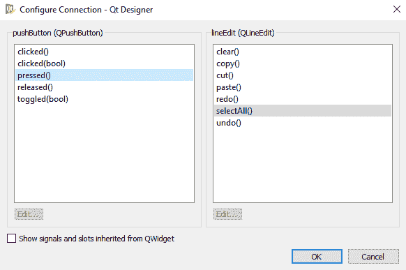

You can also select Cancel in the Configure Connection dialog box to cancel the signal and slot connection.

7.  连接后，所选信号和插槽将显示为箭头中的标签，连接两个小部件。
8.  要修改信号和插槽连接，请双击连接路径或其中一个标签以显示“配置连接”对话框。
9.  从“配置连接”对话框中，可以根据需要编辑信号或插槽。
10.  要删除信号和插槽连接，请选择表单上的箭头，然后按*删除*键。

还可以在任何小部件和表单之间建立信号和插槽连接。为此，您可以执行以下步骤：

1.  选择小部件，拖动鼠标，然后在窗体上释放鼠标按钮。连接的端点将更改为电气接地符号，表示已与表单建立连接。
2.  要退出信号和插槽编辑模式，请导航至编辑|编辑小部件或按*F3*键。

# 将文本从一个行编辑小部件复制和粘贴到另一个行编辑小部件

此配方将使您了解在一个小部件上执行的事件如何调用关联小部件上的预定义操作。因为我们想在单击按钮时从单行编辑小部件复制内容，所以我们需要在按钮上发生 pressed（）事件时调用`selectAll()`方法。此外，我们需要在按钮上出现 released（）事件时调用`copy()`方法。要在单击另一个按钮时将剪贴板中的内容粘贴到另一个行编辑小部件中，我们需要在另一个按钮上出现 clicked（）事件时调用`paste()`方法。

# 准备

让我们创建一个由两个行编辑和两个按钮小部件组成的应用程序。单击第一个按钮时，将复制第一行编辑小部件中的文本，单击第二个按钮时，从第一行编辑小部件复制的文本将粘贴到第二行编辑小部件上。

让我们通过执行以下步骤，基于无按钮对话框模板创建一个新的应用程序：

1.  首先，通过从表单上的小部件框拖放行编辑和按钮小部件，将`QLineEdit`和`QPushButton`添加到表单中。

To preview a form while editing, select either Form, Preview, or use *Ctrl* + *R* .

2.  要在用户选择表单上的按钮时复制行编辑小部件的文本，需要将按钮的信号连接到行编辑的插槽。让我们学习如何做。

# 怎么做。。。

最初，表单处于小部件编辑模式，要应用信号和插槽连接，您需要首先切换到信号和插槽编辑模式：

1.  从工具栏中选择编辑信号/插槽图标以切换到信号和插槽编辑模式。

2.  在表单上，选择按钮，将鼠标拖动到 Line Edit 小部件，然后释放鼠标按钮。将弹出配置连接对话框，允许您在按钮和线路编辑小部件之间建立信号和插槽连接，如以下屏幕截图所示：

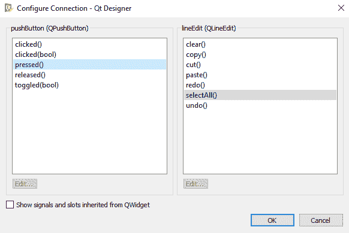

3.  从按钮（QPushButton）选项卡和 lineEdit（QLineEdit）选项卡的 selectAll（）插槽中选择 pressed（）事件或信号。

带有 Line Edit 插槽的按钮小部件的连接信号将以箭头形式出现，表示两个小部件之间的信号和插槽连接，如以下屏幕截图所示：

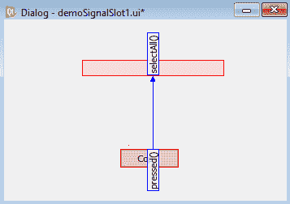

4.  将按钮小部件的文本属性设置为`Copy`，表示它将复制在行编辑小部件中输入的文本。
5.  接下来，我们将重复单击按钮并将其拖动到 Line Edit 小部件的过程，以将按钮的释放（）信号连接到 Line Edit 小部件的 copy（）插槽。在表单上，您将看到另一个箭头，表示两个小部件之间建立的第二个信号和插槽连接，如以下屏幕截图所示：


6.  要粘贴复制的内容，请在表单上拖放一个按钮和一行编辑小部件。

7.  将按钮小部件的文本属性设置为`Paste`。
8.  单击按钮，按住鼠标按钮，将其拖动并在 Line Edit 小部件上释放。
9.  从配置连接对话框中，从按钮（QPushButton）列选择 clicked（）事件，从 lineEdit（QLineEdit）列选择 paste（）插槽。
10.  使用名称`demoSignal1.ui`保存表单。该表单现在将显示，如以下屏幕截图所示：

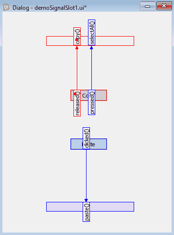

表单将保存在扩展名为`.ui`的文件中。`demoSignal1.ui`文件将包含表单、小部件、布局等的所有信息。`.ui`文件是一个 XML 文件，需要使用`pyuic5`实用程序将其转换为 Python 代码。生成的 Python 代码文件`demoSignal1.py`可以在本书的源代码包中看到。在`demoSignal1.py`文件中，您会发现它导入了来自`QtCore`和`QtGui`两个模块的所有内容，因为您将需要它们来开发 GUI 应用程序：

*   Po.T0:AUTYT1 模块是所有基于 QT 的应用程序的基础。它包含最基本的类，如`QCoreApplication`、`QObject`等。这些类执行重要任务，如事件处理、实现信号和插槽机制、I/O 操作、处理字符串等。该模块包括几个类，包括`QFile`、`QDir`、`QIODevice`、`QTimer`、`QString`、`QDate`、`QTime`。
*   `QtGui`：顾名思义，`QtGUI`模块包含开发跨平台 GUI 应用程序所需的类。该模块包含 GUI 类，如`QCheckBox`、`QComboBox`、`QDateTimeEdit`、`QLineEdit`、`QPushButton`、`QPainter`、`QPaintDevice`、`QApplication`、`QTextEdit`、`QTextDocument`。

11.  将`demoSignalSlot1.py`文件视为头文件，并将其导入到将从中调用其用户界面设计的文件中。
12.  创建另一个名为`calldemoSignal1.pyw`的 Python 文件，并将`demoSignal1.py`代码导入其中：

```py
import sys
from PyQt5.QtWidgets import QDialog, QApplication
from demoSignalSlot1 import *
class MyForm(QDialog):
    def __init__(self):
        super().__init__()
        self.ui = Ui_Dialog()
        self.ui.setupUi(self)
        self.show()
if __name__=="__main__":
    app = QApplication(sys.argv)
    w = MyForm()
    w.show()
    sys.exit(app.exec_())
```

# 它是如何工作的。。。

`sys`模块被导入，因为它提供对`sys.argv`列表中存储的命令行参数的访问。这是因为每个 PyQt GUI 应用程序都必须有一个`QApplication`对象来提供对应用程序目录、屏幕大小等信息的访问，以便创建一个`QApplication`对象。要使 PyQt 能够使用和应用命令行参数（如果有），请在创建`QApplication`对象时传递命令行参数。您创建一个`MyForm`实例并调用其`show()`方法，该方法将向`QApplication`对象的事件队列添加一个新事件。这个新事件用于显示`MyForm`类中指定的所有小部件。调用`app.exec_`方法来启动`QApplication`对象的事件循环。一旦事件循环开始，将显示类中使用的顶级小部件`MyForm`及其子小部件。所有系统生成的事件以及用户交互事件都添加到事件队列中。应用程序的事件循环持续检查事件是否已发生。事件发生时，事件循环将对其进行处理并调用关联的插槽或方法。在关闭应用程序的顶级小部件时，PyQt 删除小部件并执行应用程序的干净终止。

在 PyQt 中，任何小部件都可以用作顶级窗口。`super().__init__()`方法从`MyForm`类调用基类构造函数，即从`MyForm`类调用`QDialog`类的构造函数，表示`QDialog`通过该类显示为顶级窗口。

用户界面设计是通过调用在 Python 代码（`Ui_Dialog`中创建的类的`setupUI()`方法来实例化的。我们创建`Ui_Dialog`类的一个实例，该类是在 Python 代码中创建的，并调用其`setupUi()`方法。对话框小部件将被创建为所有用户界面小部件的父级，并显示在屏幕上。记住，`QDialog`、`QMainWindow`，PyQt 的所有小部件都源自`QWidget`。

在运行应用程序时，您会得到两对行编辑和按钮小部件。在单行编辑小部件中键入文本时，单击复制按钮时，文本将被复制。

现在，单击粘贴按钮，复制的文本将粘贴到第二行编辑小部件中，如以下屏幕截图所示：


# 转换数据类型和制作小型计算器

接受单行数据最常用的小部件是行编辑小部件，行编辑小部件中的默认数据类型是字符串。为了对两个整数值进行任何计算，您需要将行编辑小部件中输入的字符串数据转换为整数数据类型，然后将计算结果（将是数字数据类型）转换回字符串类型，然后再通过标签小部件显示。这个食谱就是这样做的。

# 怎么做。。。

为了了解用户如何接受数据以及如何进行类型转换，让我们通过执行以下步骤，基于无按钮对话框模板创建一个应用程序：

1.  通过拖放表单上的三个标签、两行编辑和四个按钮小部件，将三个`QLabel`、两个`QLineEdit`和一个`QPushButton`小部件添加到表单中。
2.  将两个标签小部件的文本属性设置为`Enter First Number`和`Enter Second Number`。
3.  将三个标签的 objectName 属性设置为`labelFirstNumber`、`labelSecondNumber`和`labelResult`。
4.  将两行编辑小部件的 objectName 属性设置为`lineEditFirstNumber`和`lineEditSecondNumber`。
5.  将四个按钮小部件的 objectName 属性分别设置为`pushButtonPlus`、`pushButtonSubtract`、`pushButtonMultiply`和`pushButtonDivide`。
6.  将按钮的文本属性分别设置为`+`、`-`、`x`和`/`。
7.  删除第三个标签的默认文本属性，因为 Python 脚本将设置该值，然后在添加两个数值时显示该值。
8.  不要忘记在设计器中拖动标签小部件，以确保它足够长，可以显示通过 Python 脚本分配给它的文本。
9.  将 UI 文件另存为`demoCalculator.ui`。
10.  还可以通过在“属性编辑器”窗口的“几何体”下设置“宽度”属性来增加标签小部件的宽度：

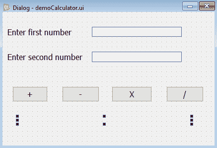

`.ui`文件为 XML 格式，需要转换为 Python 代码。生成的 Python 代码`demoCalculator.py`可以在本书的源代码包中看到。

11.  创建一个名为`callCalculator.pyw`的 Python 脚本，该脚本导入 Python 代码`demoCalculator.py`以调用用户界面设计，并获取在 Line Edit 小部件中输入的值并显示它们的添加。Python 脚本`callCalculator.pyw`中的代码如下所示：

```py
import sys
from PyQt5.QtWidgets import QDialog, QApplication
from demoCalculator import *
class MyForm(QDialog):
    def __init__(self):
        super().__init__()
        self.ui = Ui_Dialog()
        self.ui.setupUi(self)
        self.ui.pushButtonPlus.clicked.connect(self.addtwonum)
        self.ui.pushButtonSubtract.clicked.connect
        (self.subtracttwonum)
        self.ui.pushButtonMultiply.clicked.connect
        (self.multiplytwonum)
        self.ui.pushButtonDivide.clicked.connect(self.dividetwonum)
        self.show()
    def addtwonum(self):
        if len(self.ui.lineEditFirstNumber.text())!=0:
                a=int(self.ui.lineEditFirstNumber.text())
        else:
                a=0
        if len(self.ui.lineEditSecondNumber.text())!=0:
                b=int(self.ui.lineEditSecondNumber.text())
        else:
                b=0
                sum=a+b
        self.ui.labelResult.setText("Addition: " +str(sum))
    def subtracttwonum(self):
        if len(self.ui.lineEditFirstNumber.text())!=0:
                a=int(self.ui.lineEditFirstNumber.text())
        else:
                a=0
        if len(self.ui.lineEditSecondNumber.text())!=0:
                b=int(self.ui.lineEditSecondNumber.text())
        else:
                b=0
                diff=a-b
        self.ui.labelResult.setText("Substraction: " +str(diff))
    def multiplytwonum(self):
        if len(self.ui.lineEditFirstNumber.text())!=0:
                a=int(self.ui.lineEditFirstNumber.text())
        else:
                a=0
        if len(self.ui.lineEditSecondNumber.text())!=0:
                b=int(self.ui.lineEditSecondNumber.text())
        else:
                b=0
                mult=a*b
        self.ui.labelResult.setText("Multiplication: " +str(mult))
    def dividetwonum(self):
        if len(self.ui.lineEditFirstNumber.text())!=0:
                a=int(self.ui.lineEditFirstNumber.text())
        else:
                a=0
        if len(self.ui.lineEditSecondNumber.text())!=0:
                b=int(self.ui.lineEditSecondNumber.text())
        else:
                b=0
                division=a/b
        self.ui.labelResult.setText("Division: "+str(round
        (division,2)))
if __name__=="__main__":
    app = QApplication(sys.argv)
    w = MyForm()
    w.show()
    sys.exit(app.exec_())
```

# 它是如何工作的。。。

此代码中使用了以下四个函数：

*   `len()`：此函数返回字符串中的字符数
*   `str()`：此函数将传递的参数转换为字符串数据类型
*   `int()`：此函数将传递的参数转换为整数数据类型
*   `round()`：此函数将传递的数字舍入到指定的小数位数

`pushButtonPlus`的`clicked()`事件连接到`addtwonum()`方法，以显示两行编辑小部件中输入的数字之和。在`addtwonum()`方法中，首先验证`lineEditFirstNumber`和`lineEditSecondNumber`以确保如果用户将任一行编辑留空，则该行编辑的值为零。

检索在两行编辑小部件中输入的值，通过`int()`转换为整数，并分配给两个变量`a`和`b`。计算`a`和`b`变量中的值之和，并将其存储在`sum`变量中。变量`sum`中的结果通过`str`方法转换成字符串格式，并通过`labelResult`显示，如下图所示：


类似地，`pushButtonSubtract`的`clicked()`事件连接到`subtracttwonum()`方法，以显示两行编辑小部件中输入的数字的减法。同样，在验证两行编辑小部件之后，将检索其中输入的值并将其转换为整数。减法应用于两个数字，结果分配给`diff`变量。

最后，`diff`变量中的结果通过`str()`方法转换成字符串格式，并通过`labelResult`进行显示，如下图所示：


类似地，`pushButtonMultiply`和`pushButtonDivide`的 clicked（）事件分别连接到`multiplytwonum()`和`dividetwonum()`方法。这些方法将两行编辑小部件中输入的值相乘和相除，并通过`labelResult`小部件显示它们。

乘法的结果显示在以下屏幕截图中：

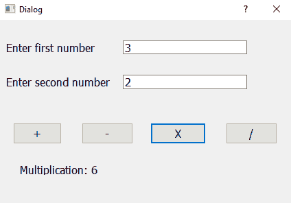

分区结果显示在以下屏幕截图中：

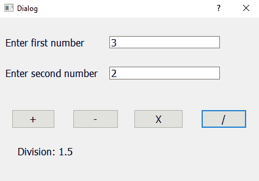

# 使用 Spin Box 小部件

Spin Box 小部件用于显示整数值、浮点值和文本。它对用户应用了一个约束：用户不能输入任何随机数据，但只能从通过“旋转框”显示的可用选项中进行选择。旋转框小部件默认显示初始值，可通过选择键盘上的向上/向下按钮或向上/向下箭头键来增加或减少该值。您可以通过单击或手动键入来选择显示的值。

# 准备

可以使用两个类`QSpinBox`和`QDoubleSpinBox`创建 Spin Box 小部件，其中`QSpinBox`仅显示整数值，`QDoubleSpinBox`类显示浮点值。`QSpinBox`提供的方法如下表所示：

*   `value()`：此方法返回从旋转框中选择的当前整数值。
*   `text()`：此方法返回旋转框显示的文本。
*   `setPrefix()`：此方法将前缀文本指定给旋转框返回的值。
*   `setSuffix()`：此方法指定要附加到旋转框返回值的后缀文本。
*   `cleanText()`：此方法返回旋转框的值，不带后缀、前缀或前导或尾随空格。
*   `setValue()`：此方法将值分配给旋转框。
*   `setSingleStep()`：此方法设置旋转盒的步长。步长是旋转框的增量/减量值，即选择向上或向下按钮时旋转框的值将增加或减少的值。
*   `setMinimum()`：此方法设置旋转盒的最小值。
*   `setMaximum()`：此方法设置旋转盒的最大值。
*   `setWrapping()`：此方法将布尔值 true 传递给此方法，以启用旋转框中的包装。环绕表示在显示最大值的同时按下向上按钮时，旋转框返回到第一个值（最小值）。

`QSpinBox`类发出的信号如下：

*   valueChanged（）：通过选择向上/向下按钮或使用`setValue()`方法更改旋转框的值时，会发出此信号
*   editingFinished（）：当旋转框上的焦点丢失时，会发出此信号

用于处理自旋框中的浮点值的类是`QDoubleSpinBox`。`QDoubleSpinBox`类也支持上述所有方法。默认情况下，它最多显示两位小数。若要更改精度，请使用`round()`，它将显示指定小数位数的值；该值将四舍五入到指定的小数位数。

The default minimum, maximum, singleStep, and value properties of a spin box are 0, 99, 1, and 0, and of a double spin box are 0.000000, 99.990000, 1.000000, and 0.000000, respectively.

让我们创建一个应用程序，要求用户输入一本书的价格，后跟客户购买的书的数量，并显示书的总量。此外，应用程序将提示您输入 1 公斤糖的价格，然后输入用户购买的糖的数量。输入糖的数量后，应用程序将显示糖的总量。书和糖的数量将分别通过旋转框和双旋转框输入。

# 怎么做。。。

为了了解如何通过旋转框接受整型值和浮点值并在进一步计算中使用，让我们基于对话框无按钮模板创建一个新的应用程序，并遵循以下步骤：

1.  让我们首先拖放三个标签、一个旋转框、一个双旋转框和四行编辑小部件。
2.  两个标签小部件的文本属性设置为`Book Price value`和`Sugar Price`，第三个标签小部件的 objectName 属性设置为`labelTotalAmount`。
3.  将四行编辑小部件的 objectName 属性分别设置为`lineEditBookPrice`、`lineEditBookAmount`、`lineEditSugarPrice`和`lineEditSugarAmount`。

4.  将旋转框小部件的 objectName 属性设置为`spinBoxBookQty`，将双旋转框小部件的 objectName 属性设置为`doubleSpinBoxSugarWeight`。
5.  删除第三个标签小部件 TextLabel 的默认文本属性，因为您将在程序中设置其文本以显示总量。
6.  第三个标签小部件在删除其文本属性时将不可见。
7.  禁用两行编辑小部件`lineEditBookAmount`和`lineEditSugarAmount`，方法是在属性编辑器窗口中取消选中它们的启用属性，因为您希望它们显示不可编辑的值。

8.  使用名称`demoSpinner.ui`保存应用程序：

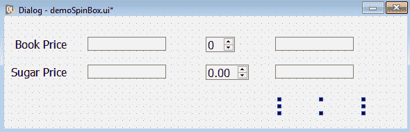

9.  在使用`pyuic5`命令实用程序时，`.ui`（XML）文件将转换为 Python 代码。生成的 Python 代码文件`demoSpinner.py`可以在本书的源代码中看到。

10.  创建一个名为`calldemoSpinner.pyw`的 Python 脚本文件，该文件导入代码`demoSpinner.py`，使您能够调用用户界面设计，显示通过旋转框选择的数字，并计算总图书量和总糖量。此时会出现`calldemoSpinner.pyw`文件，如图所示：

```py
import sys
from PyQt5.QtWidgets import QDialog, QApplication
from demoSpinBox import *
class MyForm(QDialog):
    def __init__(self):
        super().__init__()
        self.ui = Ui_Dialog()
        self.ui.setupUi(self)
        self.ui.spinBoxBookQty.editingFinished.connect(self.
        result1)
        self.ui.doubleSpinBoxSugarWeight.editingFinished.connect
        (self.result2)
        self.show()
    def result1(self):
        if len(self.ui.lineEditBookPrice.text())!=0:
                bookPrice=int(self.ui.lineEditBookPrice.text())
        else:
                bookPrice=0
                totalBookAmount=self.ui.spinBoxBookQty.value() * 
                bookPrice
                self.ui.lineEditBookAmount.setText(str
                (totalBookAmount))
    def result2(self):
        if len(self.ui.lineEditSugarPrice.text())!=0:
                sugarPrice=float(self.ui.lineEditSugarPrice.
                text())
        else:
                sugarPrice=0
                totalSugarAmount=self.ui.
                doubleSpinBoxSugarWeight.value() * sugarPrice
                self.ui.lineEditSugarAmount.setText(str(round
                (totalSugarAmount,2)))
                totalBookAmount=int(self.ui.lineEditBookAmount.
                text())
                totalAmount=totalBookAmount+totalSugarAmount
                self.ui.labelTotalAmount.setText(str(round
                (totalAmount,2)))
if __name__=="__main__":
    app = QApplication(sys.argv)
    w = MyForm()
    w.show()
    sys.exit(app.exec_())
```

# 它是如何工作的。。。

在这段代码中，您可以看到两个自旋盒的`editingFinished`信号连接到`result1`和`result2`函数。这意味着，当焦点在任何旋转框上丢失时，将调用相应的方法。当用户用鼠标或按 Tab 键移动到其他小部件上时，小部件上的焦点丢失：

*   在`result1`方法中，您从 Spin Box 小部件中检索购买图书数量的整数值，并将其与`lineEditBookPrice`小部件中输入的图书价格相乘，以计算图书总成本。然后通过`lineEditBookAmount`小部件显示总图书成本。
*   类似地，在`result2`方法中，您检索浮点值，即从双自旋盒购买的糖的重量，并将其与`lineEditSugarPrice`小部件中输入的每千克糖的价格相乘，以计算总糖成本，然后通过`lineEditSugarAmount`小部件显示。最终通过`labelTotalAmount`小部件显示图书成本和食糖成本的总和，如以下屏幕截图所示：

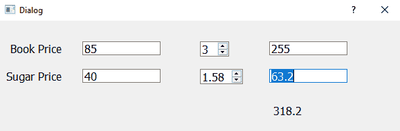

# 使用滚动条和滑块

在查看无法在有限可见区域中显示的大型文档或图像时，滚动条非常有用。滚动条水平或垂直显示，指示您在文档或图像中的当前位置以及不可见区域的大小。使用这些条提供的滑块手柄，可以访问文档或图像的隐藏部分。

滑块是在两个值之间选择整数值的一种方式。也就是说，滑块可以表示值的最小和最大范围，用户可以通过将滑块手柄移动到滑块中的所需位置来选择该范围内的值。

# 准备

滚动条用于查看大于视图区域的文档或图像。要显示水平或垂直滚动条，可以使用`HorizontalScrollBar`和`VerticalScrollBar`小部件，它们是`QScrollBar`类的实例。这些滚动条有一个滑动手柄，可以移动该手柄查看不可见的区域。滑块手柄的位置指示文档或图像中的位置。滚动条具有以下控件：

*   **滑动手柄**：此控件用于快速移动到文档或图像的任何部分。
*   **滚动箭头**：滚动条两侧的箭头，用于查看当前不可见的文档或图像的所需区域。使用这些滚动箭头时，滑块手柄的位置将移动以显示文档或图像中的当前位置。
*   **页面控制**：页面控制是拖动滑块手柄的滚动条的背景。单击背景时，滑块控制柄将向单击一页的方向移动。滑块手柄的移动量可以通过 pageStep 属性指定。页面步长是用户按下*向上翻页*和*向下翻页*键时滑块移动的量。您可以使用`setPageStep()`方法设置 pageStep 属性的数量。

专门用于从滚动条中设置和检索值的方法是`value()`方法，如下所述。

`value()`方法获取滑块手柄的值，即从滚动条开始的距离值。当滑动条手柄位于垂直滚动条的上边缘或水平滚动条的左边缘时，可以获得滚动条的最小值；当滑动条手柄位于垂直滚动条的下边缘或水平滚动条的右边缘时，可以获得滚动条的最大值。通过分别按下*Home*和*End*键，您也可以通过键盘将滑块手柄移动到其最小值和最大值。让我们来看看下面的方法：

*   `setValue()`：此方法为滚动条赋值，并根据赋值在滚动条中设置滑块手柄的位置
*   `minimum()`：此方法返回滚动条的最小值
*   `maximum()`：此方法返回滚动条的最大值
*   `setMinimum()`：此方法将最小值分配给滚动条
*   `setMaximum()`：此方法将最大值分配给滚动条
*   `setSingleStep()`：此方法设置单步值
*   `setPageStep()`：此方法设置页面步长值

`QScrollBar` provides only integer values.

通过`QScrollBar`类发出的信号如下表所示：

*   valueChanged（）：当滚动条的值更改时，即当其滑块手柄移动时，会发出此信号
*   sliderPressed（）：当用户开始拖动滑块手柄时，会发出此信号
*   sliderMoved（）：当用户拖动滑块手柄时，会发出此信号
*   sliderReleased（）：此信号在用户释放滑块手柄时发出
*   actionTriggered（）：当用户交互更改滚动条时，会发出此信号

滑块通常用于表示某些整数值。与滚动条不同，滚动条主要用于显示大型文档或图像，滑块是交互式的，更容易输入或表示整数值。也就是说，通过沿水平或垂直凹槽移动和定位其控制柄，可以制作水平或垂直滑块来表示某个整数值。为了显示水平和垂直滑块，使用了`HorizontalSlider`和`VerticalSlider`小部件，它们是`QSlider`类的实例。与我们在滚动条中看到的方法类似，滑块也会在移动滑块手柄时生成诸如 valueChanged（）、sliderPressed（）、sliderMoved（）、sliderReleased（）等信号。

滚动条和滑块中的滑块控制柄表示最小和最大范围内的值。要更改默认的最小值和最大值，可以通过将值指定给“最小”、“最大”、“单步”和“页面步”属性来更改其值。

The default values of the minimum, maximum, singleStep, pageStep, and value properties of sliders are 0, 99, 1, 10, and 0, respectively.

让我们创建一个由水平和垂直滚动条以及水平和垂直滑块组成的应用程序。水平滚动条和滑块将分别表示血糖水平和血压。也就是说，在移动水平滚动条时，患者的糖分水平将通过 Line Edit 小部件显示。类似地，水平滑块在移动时将表示血压，并将通过 Line Edit 小部件显示。

垂直滚动条和滑块将分别表示心率和胆固醇水平。移动垂直滚动条时，心率将通过 Line Edit 小部件显示，移动垂直滑块时，胆固醇水平将通过 Line Edit 小部件显示。

# 怎么做。。。

要了解水平和垂直滚动条的工作情况，以及水平和垂直滑块的工作情况，要了解滚动条和滑块在其值更改时如何生成信号，以及各自的插槽或方法如何与之关联，请执行以下步骤：

1.  让我们创建一个没有按钮模板的对话框的新应用程序，并将水平和垂直滚动条和滑块拖放到窗体上。
2.  放下四个标签小部件和一个行编辑小部件以显示滚动条和滑块手柄的值。
3.  将四个标签小部件的文本属性分别设置为`Sugar Level`、`Blood Pressure`、`Pulse rate`和`Cholesterol`。
4.  将水平滚动条的 objectName 属性设置为`horizontalScrollBarSugarLevel`，垂直滚动条设置为`verticalScrollBarPulseRate`，水平滑块设置为`horizontalSliderBloodPressure`，垂直滑块设置为`verticalSliderCholestrolLevel`。
5.  将行编辑小部件的 objectName 属性设置为`lineEditResult`。

6.  使用名称`demoSliders.ui`保存应用程序。表单将显示如下屏幕截图所示：


`pyuic5`命令实用程序将`.ui`（XML）文件转换为 Python 代码。生成的 Python 文件`demoScrollBar.py`可以在本书的源代码包中看到。

7.  创建一个名为`callScrollBar.pyw`的 Python 脚本文件，该文件导入代码`demoScrollBar.py`，以调用用户界面设计并同步滚动条和滑块手柄的移动。该脚本还将显示带有标签小部件的滚动条和滑块句柄的值。Python 脚本`callScrollBar.pyw`将出现，如下所示：

```py
import sys
from PyQt5.QtWidgets import QDialog, QApplication
from demoScrollBar import *
class MyForm(QDialog):
    def __init__(self):
        super().__init__()
        self.ui = Ui_Dialog()
        self.ui.setupUi(self)
        self.ui.horizontalScrollBarSugarLevel.valueChanged.connect
        (self.scrollhorizontal)
        self.ui.verticalScrollBarPulseRate.valueChanged.connect
        (self.scrollvertical)
        self.ui.horizontalSliderBloodPressure.valueChanged.connect
        (self.sliderhorizontal)
        self.ui.verticalSliderCholestrolLevel.valueChanged.connect
        (self.slidervertical)
        self.show()
    def scrollhorizontal(self,value):
        self.ui.lineEditResult.setText("Sugar Level : "+str(value))
    def scrollvertical(self, value):
        self.ui.lineEditResult.setText("Pulse Rate : "+str(value))
    def sliderhorizontal(self, value):
        self.ui.lineEditResult.setText("Blood Pressure :  
        "+str(value))
    def slidervertical(self, value):
        self.ui.lineEditResult.setText("Cholestrol Level : 
        "+str(value))
if __name__=="__main__":
    app = QApplication(sys.argv)
    w = MyForm()
    w.show()
    sys.exit(app.exec_())
```

# 它是如何工作的。。。

在这段代码中，您将每个小部件的`valueChanged()`信号与相应的功能连接起来，这样，如果小部件的滚动条或滑块手柄被移动，相应的功能将被调用以执行所需的任务。例如，移动水平滚动条的滑块手柄时，会调用`scrollhorizontal`函数。`scrollhorizontal`函数通过标签小部件显示滚动条表示的值，即糖分水平。

类似地，当垂直滚动条或滑块的滑块手柄移动时，调用`scrollvertical`功能，并通过标签小部件显示心率，即垂直滚动条滑块手柄的值，如以下屏幕截图所示：


类似地，移动水平和垂直滑块时，血压和胆固醇水平也会相应显示，如以下屏幕截图所示：


# 使用列表小部件

要以更简单和可扩展的格式显示多个值，可以使用列表小部件，它是`QListWidget`类的一个实例。列表小部件显示几个项目，这些项目不仅可以查看，还可以编辑和删除。您可以从列表小部件项中一次添加或删除一个列表项，也可以使用其内部模型设置列表项。

# 准备

列表中的项目是`QListWidgetItem`类的实例。`QListWidget`提供的方法如下表所示：

*   `insertItem()`：此方法在指定位置将带有所提供文本的新项目插入列表小部件。
*   `insertItems()`：此方法从指定位置开始，从提供的列表中插入多个项目。
*   `count()`：此方法返回列表中项目数的计数。
*   `takeItem()`：此方法从列表小部件中的指定行移除并返回项目。
*   `currentItem()`：此方法返回列表中的当前项。
*   `setCurrentItem()`：此方法将列表中的当前项替换为指定项。
*   `addItem()`：此方法在列表小部件的末尾添加指定文本的项。
*   `addItems()`：此方法将提供的列表中的项目附加到列表小部件的末尾。
*   `clear()`：此方法从列表小部件中删除所有项目。
*   `currentRow()`：返回当前选中列表项的行号。如果未选择列表项，则返回值`-1`。
*   `setCurrentRow()`：此方法选择列表小部件中的指定行。
*   `item()`：此方法返回指定行的列表项。

`QListWidget`类发出的信号如下表所示：

*   currentRowChanged（）：当当前列表项的行更改时，会发出此信号
*   currentTextChanged（）：只要当前列表项中的文本发生更改，就会发出此信号
*   currentItemChanged（）：当当前列表项的焦点更改时，会发出此信号

# 怎么做。。。

因此，让我们创建一个应用程序，它通过列表小部件显示特定的诊断测试，并且当用户从列表小部件中选择任何测试时，所选测试将通过标签小部件显示。以下是创建应用程序的分步过程：

1.  创建一个没有按钮模板的对话框的新应用程序，并将两个标签小部件和一个列表小部件拖放到表单上。
2.  将第一个标签小部件的文本属性设置为`Choose the Diagnosis Tests`。

3.  将列表小部件的 objectName 属性设置为`listWidgetDiagnosis`。

4.  将标签小部件的 objectName 属性设置为`labelTest`。
5.  删除`labelTest`小部件的默认文本属性，因为我们将通过此小部件通过代码显示所选的诊断测试。
6.  要通过列表小部件显示诊断测试，请右键单击它，然后从打开的上下文菜单中选择编辑项选项。
7.  逐个添加诊断测试，然后在键入每个测试后单击底部的+按钮，如以下屏幕截图所示：

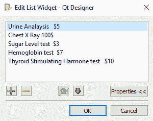

8.  使用名称`demoListWidget1.ui`保存应用程序。该表单将显示在以下屏幕截图中：

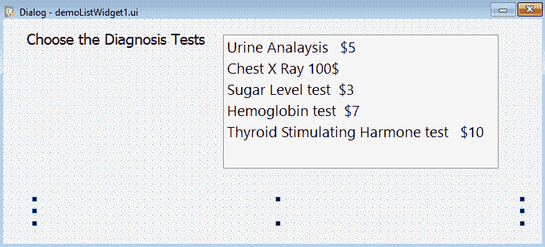

`pyuic5`命令实用程序将`.ui`（XML）文件转换为 Python 代码。生成的 Python 代码`demoListWidget1.py`可以在本书的源代码包中看到。

9.  创建一个名为`callListWidget1.pyw`的 Python 脚本文件，该文件导入代码`demoListWidget1.py`，以调用用户界面设计和显示从列表小部件中选择的诊断测试的代码。Python 脚本中的代码`callListWidget1.pyw`如下所示：

```py
import sys
from PyQt5.QtWidgets import QDialog, QApplication
from demoListWidget1 import *
class MyForm(QDialog):
    def __init__(self):
        super().__init__()
        self.ui = Ui_Dialog()
        self.ui.setupUi(self)
        self.ui.listWidgetDiagnosis.itemClicked.connect(self.
        dispSelectedTest)
        self.show()
    def dispSelectedTest(self):
        self.ui.labelTest.setText("You have selected 
        "+self.ui.listWidgetDiagnosis.currentItem().text())
if __name__=="__main__":
    app = QApplication(sys.argv)
    w = MyForm()
    w.show()
    sys.exit(app.exec_())
```

# 它是如何工作的。。。

您可以看到列表小部件的`itemClicked`事件连接到`dispSelectedTest()`方法。也就是说，在单击列表小部件中的任何列表项时，将调用`dispSelectedTest()`方法，该方法使用列表小部件的`currentItem`方法通过名为`labelTest`的标签显示列表小部件的选定项。

在运行应用程序时，您将看到列表小部件显示一些诊断测试；从列表小部件中选择测试时，测试将通过标签小部件显示，如以下屏幕截图所示：

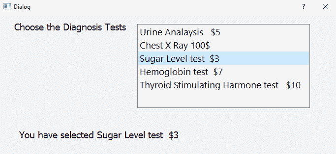

# 从一个列表小部件中选择多个列表项并在另一个列表小部件中显示它们

在前面的应用程序中，您仅从列表小部件项中选择了一个诊断测试。如果我想从列表小部件项中进行多项选择，该怎么办？在多个选择的情况下，您需要另一个列表小部件来存储所选的诊断测试，而不是行编辑小部件。

# 怎么做。。。

让我们创建一个通过列表小部件显示特定诊断测试的应用程序，当用户从列表小部件中选择任何测试时，所选测试将显示在另一个列表小部件中：

1.  因此，创建一个没有按钮模板的对话框的新应用程序，并将两个标签小部件和两个列表小部件拖放到表单上。
2.  将第一个标签小部件的文本属性设置为`Diagnosis Tests`，将另一个标签小部件的文本属性设置为`Selected tests are`。
3.  将第一个列表小部件的 objectName 属性设置为`listWidgetDiagnosis`，将第二个列表小部件的 objectName 属性设置为`listWidgetSelectedTests`。
4.  要通过列表小部件显示诊断测试，请右键单击它，然后从打开的上下文菜单中选择编辑项选项。
5.  逐个添加诊断测试，然后在键入每个测试后单击底部的+按钮。
6.  要从列表小部件启用多个选择，请选择`listWidgetDiagnosis`小部件，然后从属性编辑器窗口中，将 selectionMode 属性从`SingleSelection`更改为`MultiSelection`。
7.  使用名称`demoListWidget2.ui`保存应用程序。表单将显示如下屏幕截图所示：


通过使用`pyuic5`实用程序，XML 文件`demoListWidget2.ui`将转换为 Python 代码作为`demoListWidget2.py`文件。从`demoListWidget2.py`文件生成的 Python 代码可以在本书的源代码包中看到。

8.  创建名为`callListWidget2.pyw`的 Python 脚本文件，该文件导入代码`demoListWidget2.py`，以调用用户界面设计和显示从列表小部件中选择的多个选定诊断测试的代码。Python 脚本`callListWidget2.pyw`将显示如下所示：

```py
import sys
from PyQt5.QtWidgets import QDialog, QApplication
from demoListWidget2 import *
class MyForm(QDialog):
    def __init__(self):
        super().__init__()
        self.ui = Ui_Dialog()
        self.ui.setupUi(self)
        self.ui.listWidgetDiagnosis.itemSelectionChanged.connect
        (self.dispSelectedTest)
        self.show()
    def dispSelectedTest(self):
        self.ui.listWidgetSelectedTests.clear()
        items = self.ui.listWidgetDiagnosis.selectedItems()
        for i in list(items):
            self.ui.listWidgetSelectedTests.addItem(i.text())
if __name__=="__main__":
    app = QApplication(sys.argv)
    w = MyForm()
    w.show()
    sys.exit(app.exec_())
```

# 它是如何工作的。。。

您可以看到第一个列表小部件的`itemSelectionChanged`事件连接到`dispSelectedTest()`方法。也就是说，在从第一个列表小部件项中选择或取消选择任何列表项时，`dispSelectedTest()`方法被调用。`dispSelectedTest()`方法调用列表小部件上的`selectedItems()`方法，以获取所有选定项目的列表。此后，使用`for`循环，通过调用第二个列表小部件上的`addItem()`方法，将所有选定的项目添加到第二个列表小部件中。

在运行应用程序时，您将看到列表小部件显示一些诊断测试；从第一个列表小部件中选择任意数量的测试时，所有选定的测试将通过第二个列表小部件项显示，如以下屏幕截图所示：

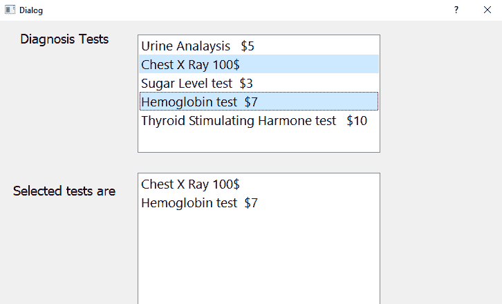

# 将项目添加到列表小部件

尽管您可以通过属性编辑器手动向列表小部件项添加项，但有时您需要通过代码动态地向列表小部件项添加项。让我们创建一个应用程序来解释向列表小部件添加项目的过程。

在这个应用程序中，您将使用标签、行编辑、按钮和列表小部件。列表小部件项最初将为空，并要求用户将所需的食物项输入到“行编辑”中，然后选择“添加到列表”按钮。然后，输入的食物项将添加到列表小部件项中。所有后续食品项目将添加到上一条目下方。

# 怎么做。。。

执行以下步骤以了解如何将项添加到列表小部件项：

1.  我们将首先基于对话框创建一个新的应用程序，而不使用按钮模板，并将标签、行编辑、按钮和列表小部件拖放到表单上。
2.  将标签和按钮小部件的文本属性分别设置为`Your favourite food item`和`Add to List`。
3.  将行编辑小部件的 objectName 属性设置为`lineEditFoodItem`，按钮的 objectName 属性设置为`pushButtonAdd`，列表小部件的 objectName 属性设置为`listWidgetSelectedItems`。
4.  使用名称`demoListWidget3.ui`保存应用程序。表单将显示如下屏幕截图所示：

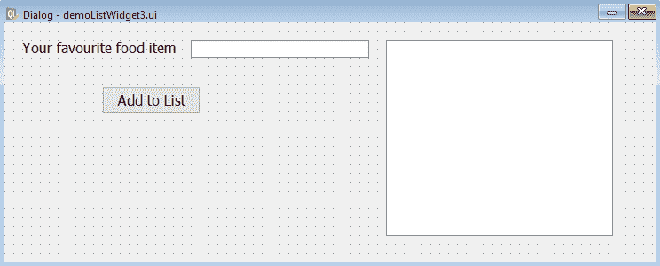

在执行`pyuic5`实用程序时，XML 文件`demoListWidget3.ui`将转换为 Python 代码`demoListWidget3.py`。生成的 Python 文件`demoListWidget3.py`的代码可以在本书的源代码包中看到。

5.  创建一个名为`callListWidget3.pyw`的 Python 脚本文件，该文件导入 Python 代码`demoListWidget3.py`以调用用户界面设计，并在“编辑到列表”窗口小部件中添加用户输入的食物项目。`callListWidget3.pyw`文件中的 Python 代码如下所示：

```py
import sys
from PyQt5.QtWidgets import QDialog, QApplication
from demoListWidget3 import *
class MyForm(QDialog):
    def __init__(self):
        super().__init__()
        self.ui = Ui_Dialog()
        self.ui.setupUi(self)
        self.ui.pushButtonAdd.clicked.connect(self.addlist)
        self.show()
    def addlist(self):
        self.ui.listWidgetSelectedItems.addItem(self.ui.
        lineEditFoodItem.text())
        self.ui.lineEditFoodItem.setText('')
        self.ui.lineEditFoodItem.setFocus()
if __name__=="__main__":
    app = QApplication(sys.argv)
    w = MyForm()
    w.show()
    sys.exit(app.exec_())
```

# 它是如何工作的。。。

按钮小部件的 clicked（）事件连接到`addlist`函数。因此，在行编辑小部件中输入要添加到列表小部件的文本后，当用户选择添加到列表按钮时，`addlist`功能被调用。`addlist`函数检索在“行编辑”中输入的文本，并将其添加到列表小部件中。然后删除行编辑小部件中的文本，并在其上设置焦点，使用户可以输入不同的文本。

在以下屏幕截图中，当用户选择添加到列表按钮时，您可以看到用户在“行编辑”小部件“添加到列表”小部件中输入的文本：


# 在列表小部件中执行操作

在这个配方中，您将学习如何对列表小部件中的列表项执行不同的操作。列表小部件基本上用于显示类似项目的集合，使用户能够选择所需的项目。因此，您需要将项目添加到列表小部件中。此外，您可能需要编辑列表小部件中的任何项目。有时，您可能需要从列表小部件中删除项目。您可能希望对列表小部件执行的另一个操作是删除其中的所有项，清除整个列表小部件项。在学习如何从列表小部件添加、编辑和删除项目之前，让我们先了解列表项目的概念。

# 准备

列表小部件由几个列表项组成。这些列表项是`QListWidgetItem`类的实例。可以使用`insertItem()`或`addItem()`方法将列表项插入列表小部件。列表项可以是文本或图标形式，可以选中或取消选中。下面给出`QListWidgetItem`提供的方法。

# QListWidgetItem 类提供的方法

让我们来看一下下面的方法：

*   `setText()`：此方法将指定的文本分配给列表项
*   `setIcon()`：此方法将指定的图标分配给列表项
*   `checkState()`：此方法根据列表项是处于选中状态还是未选中状态返回布尔值
*   `setHidden()`：此方法将布尔值 true 传递给此方法以隐藏列表项
*   `isHidden()`：如果列表项被隐藏，则此方法返回 true

我们已经学会了向列表小部件添加项目。如果您想要编辑列表小部件中的现有项目，或者想要从列表小部件中删除项目，或者想要从列表小部件中删除所有项目，该怎么办？

让我们通过创建一个应用程序来学习在列表小部件上执行不同的操作。这个应用程序将显示行编辑、列表小部件和几个按钮小部件。通过在“行编辑”中输入文本，然后单击“添加”按钮，可以将项目添加到列表小部件。类似地，通过单击列表小部件中的项目，然后单击编辑按钮，可以编辑列表小部件中的任何项目。不仅如此，您甚至可以通过单击删除按钮从列表小部件中删除任何项目。如果要清除整个列表小部件，只需单击“全部删除”按钮。

# 怎么做。。。。

执行以下步骤以了解如何在列表小部件项上应用不同的操作；如何在列表小部件项中添加、编辑和删除项；以及如何清除整个列表小部件项：

1.  打开 Qt Designer，基于对话框创建一个新的应用程序，不带按钮模板，并将标签、行编辑、四个按钮和列表小部件拖放到表单上。
2.  将标签小部件的文本属性设置为`Enter an item`。
3.  将四个按钮小部件的文本属性设置为`Add`、`Edit`、`Delete`和`Delete All`。

4.  将四个按钮小部件的 objectName 属性设置为`psuhButtonAdd`、`pushButtonEdit`、`pushButtonDelete`和`pushButtonDeleteAll`。

5.  使用名称`demoListWidgetOp.ui`保存应用程序。

该表单将显示在以下屏幕截图中：


需要使用`pyuic5`命令实用程序将 XML 文件`demoListWidgetOp.ui`转换为 Python 脚本。生成的 Python 文件`demoListWidgetOp.py`可以在本书的源代码包中看到。

6.  创建一个名为`callListWidgetOp.pyw`的 Python 脚本文件，该文件导入 Python 代码`demoListWidgetOp.py`，使您能够调用用户界面设计，并在列表小部件中添加、删除和编辑列表项。Python 脚本`callListWidgetOp.pyw`中的代码如下所示：

```py
import sys
from PyQt5.QtWidgets import QDialog, QApplication, QInputDialog, QListWidgetItem
from demoListWidgetOp import *
class MyForm(QDialog):
    def __init__(self):
        super().__init__()
        self.ui = Ui_Dialog()
        self.ui.setupUi(self)
        self.ui.listWidget.addItem('Ice Cream')
        self.ui.listWidget.addItem('Soda')
        self.ui.listWidget.addItem('Coffee')
        self.ui.listWidget.addItem('Chocolate')
        self.ui.pushButtonAdd.clicked.connect(self.addlist)
        self.ui.pushButtonEdit.clicked.connect(self.editlist)
        self.ui.pushButtonDelete.clicked.connect(self.delitem)
        self.ui.pushButtonDeleteAll.clicked.connect
        (self.delallitems)
        self.show()
    def addlist(self):
        self.ui.listWidget.addItem(self.ui.lineEdit.text())
        self.ui.lineEdit.setText('')
        self.ui.lineEdit.setFocus()
    def editlist(self):
        row=self.ui.listWidget.currentRow()
        newtext, ok=QInputDialog.getText(self, "Enter new text", 
        "Enter new text")
        if ok and (len(newtext) !=0):
                self.ui.listWidget.takeItem(self.ui.listWidget.
                currentRow())
                self.ui.listWidget.insertItem(row,
                QListWidgetItem(newtext))
    def delitem(self):
        self.ui.listWidget.takeItem(self.ui.listWidget.
        currentRow())
    def delallitems(self):
        self.ui.listWidget.clear()
if __name__=="__main__":
    app = QApplication(sys.argv)
    w = MyForm()
    w.show()
    sys.exit(app.exec_())
```

# 它是如何工作的。。。

`pushButtonAdd`的 clicked（）事件连接到`addlist`函数。类似地，`pushButtonEdit`、`pushButtonDelete`和`pushButtonDeleteAll`对象的 clicked（）事件分别连接到`editlist`、`delitem`和`delallitems`函数。也就是说，单击任何按钮，就会调用相应的功能。`addlist`函数调用列表小部件项上的`addItem`函数，以添加在行编辑小部件中输入的文本。`editlist`函数使用列表小部件上的`currentRow`方法查找要编辑的列表项。

调用`QInputDialog`类的`getText`方法，提示用户输入新文本或编辑的文本。单击对话框中的“确定”按钮时，当前列表项将替换为对话框中输入的文本。`delitem`函数调用列表小部件上的`takeItem`方法删除当前行，即所选列表项。`delallitems`函数调用列表小部件项上的`clear`方法，以清除或删除列表小部件项中的所有列表项。

在运行应用程序时，您会发现一个空列表小部件，行编辑，并在行编辑小部件下方添加按钮。在“行编辑”小部件中添加任何文本，然后单击“添加”按钮将该项添加到“列表”小部件中。将四个项目添加到列表小部件后，它可能会出现如下屏幕截图所示：

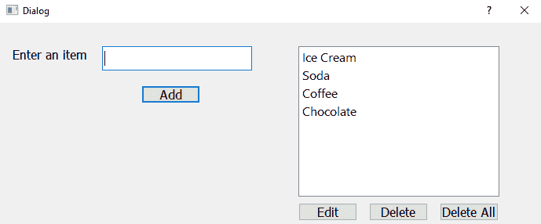

让我们在列表小部件中再添加一个项目 Pizza。在行编辑小部件中键入`Pizza`并单击添加按钮。比萨饼项目将添加到列表小部件项目中，如以下屏幕截图所示：

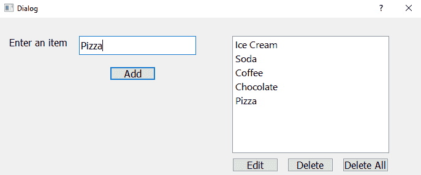

假设我们想从列表小部件编辑比萨饼项目，单击列表小部件中的比萨饼项目，然后单击编辑按钮。单击“编辑”按钮，您将看到一个对话框，提示您输入新项目以替换比萨饼项目。我们在对话框中输入`Cold Drink`，然后点击 OK 按钮，如下图所示：


您可以在下面的屏幕截图中看到列表小部件中的比萨饼项目被文本 Cold Drink 替换：

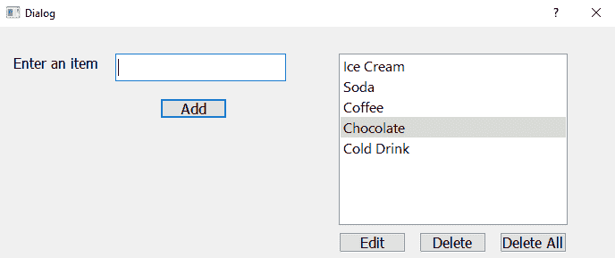

要从列表小部件中删除任何项目，只需从列表小部件中单击该项目，然后单击删除按钮。让我们单击列表小部件中的咖啡项目，然后单击删除按钮；咖啡项目将从列表小部件中删除，如以下屏幕截图所示：

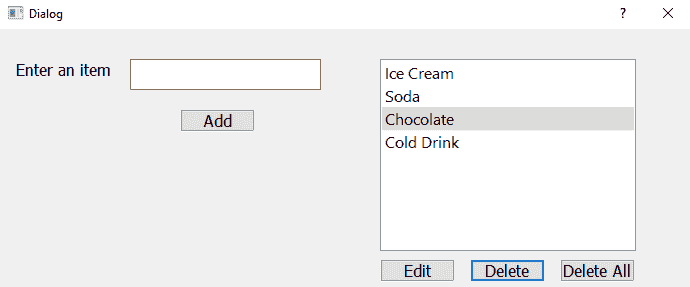

单击“全部删除”按钮时，整个列表小部件项将变为空，如以下屏幕截图所示：


# 使用组合框小部件

组合框用于从应用约束的用户处获取输入；也就是说，用户将以弹出列表的形式显示某些选项，并且他/她只能从可用选项中进行选择。与列表小部件相比，组合框占用的空间更少。`QComboBox`类用于显示组合框。您不仅可以通过组合框显示文本，还可以通过`pixmaps`显示文本。以下是`QComboBox`类提供的方法：

| **方法** | **用法** |
| `setItemText()` | 设置或更改组合框中项目的文本。 |
| `removeItem()` | 从组合框中删除特定项。 |
| `clear()` | 从组合框中删除所有项目。 |
| `currentText()` | 返回当前项的文本，即当前选择的项。 |
| `setCurrentIndex()` | 设置组合框的当前索引，即将组合框中的所需项设置为当前选定项。 |
| `count()` | 返回组合框中项目的计数。 |
| `setMaxCount()` | 设置组合框中允许的最大项数。 |
| `setEditable()` | 使组合框可编辑，即用户可以编辑组合框中的项目。 |
| `addItem()` | 将指定的内容附加到组合框。 |
| `addItems()` | 将文本中提供的每个字符串追加到组合框中。 |
| `itemText()` | 返回组合框中指定索引位置处的文本。 |
| `currentIndex()` | 返回组合框中当前选定项的索引位置。如果组合框为空或组合框中当前未选择任何项目，则该方法将返回`–1`作为索引。 |

以下是`QComboBox`产生的信号：

| **信号** | **说明** |
| currentIndexChanged（） | 当组合框的索引更改时发出，也就是说，用户在组合框中选择一些新项。 |
| 激活的（） | 当用户更改索引时发出。 |
| 突出显示（） | 当用户高亮显示组合框中的项目时发出。 |
| editTextChanged（） | 更改可编辑组合框的文本时发出。 |

为了实际了解组合框的工作原理，让我们创建一个菜谱。此配方将通过组合框显示某些银行帐户类型，并提示用户选择他/她想要打开的银行帐户类型。从组合框中选择的银行账户类型将通过标签小部件显示在屏幕上。

# 怎么做…

以下是创建使用组合框显示特定选项的应用程序的步骤，并说明如何显示组合框中的选定选项：

1.  创建一个没有按钮模板的对话框的新应用程序，从窗口小部件框中拖动两个标签窗口小部件和一个组合框窗口小部件，并将它们放到表单上。
2.  将第一个标签小部件的文本属性设置为`Select your account type`。
3.  删除第二个标签小部件的默认文本属性，因为它的文本将通过代码设置。

4.  将组合框小部件的 objectName 属性设置为`comboBoxAccountType`。
5.  第二个标签小部件将用于显示用户选择的银行帐户类型，因此将第二个标签小部件的 objectName 属性设置为`labelAccountType`。
6.  由于我们希望组合框小部件显示特定的银行帐户类型，右键单击组合框小部件，然后从打开的上下文菜单中选择编辑项选项。
7.  逐个向组合框小部件添加一些银行帐户类型。
8.  将应用程序按名称保存为`demoComboBox.ui`。

9.  单击对话框底部显示的+按钮，将银行帐户类型添加到组合框小部件中，如以下屏幕截图所示：


10.  添加所需的银行帐户类型后，单击“确定”按钮退出对话框。现在将显示该表单，如以下屏幕截图所示：

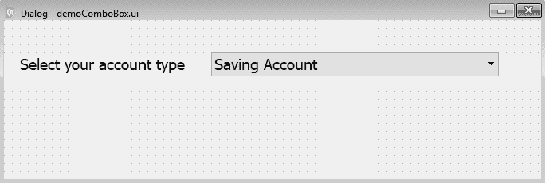

使用 Qt Designer 创建的用户界面存储在一个`.ui`文件中，该文件是一个 XML 文件，需要转换为 Python 代码。`pyuic5`实用程序可用于从 XML 文件生成 Python 代码。生成的文件`demoComboBox.py`可以在本书的源代码包中看到。

11.  将`demoComboBox.py`文件视为头文件，并将其导入到您将调用其用户界面设计的文件中，也就是说，您将能够访问组合框。
12.  创建另一个名为`callComboBox.pyw`的 Python 文件，并将`demoComboBox.py`代码导入其中。Python 脚本`callComboBox.pyw`中的代码如下所示：

```py
import sys
from PyQt5.QtWidgets import QDialog, QApplication
from demoComboBox import *
class MyForm(QDialog):
    def __init__(self):
        super().__init__()
        self.ui = Ui_Dialog()
        self.ui.setupUi(self)
        self.ui.comboBoxAccountType.currentIndexChanged.connect
        (self.dispAccountType)
        self.show()

    def dispAccountType(self):
        self.ui.labelAccountType.setText("You have selected 
        "+self.ui.comboBoxAccountType.itemText(self.ui.
        comboBoxAccountType.currentIndex())) 

if __name__=="__main__":   
    app = QApplication(sys.argv)
    w = MyForm()
    w.show()
    sys.exit(app.exec_())
```

# 它是如何工作的。。。

在`demoComboBox.py`文件中，使用`Ui_ prepended`创建一个名为顶级对象的类。也就是说，对于顶级对象，`Dialog`，即`Ui_Dialog`类，被创建并存储我们小部件的接口元素。该类包括两种方法，`setupUi`和`retranslateUi`。

`setupUi`方法创建用于在 Qt Designer 中定义用户界面的小部件。此外，小部件的属性在该方法中设置。`setupUi`方法只接受一个参数，它是应用程序的顶级小部件，`QDialog`的一个实例。`retranslateUi`方法转换接口。

在`callComboBox.pyw`文件中，每当用户从组合框中选择任何项目时，都会发出`currentIndexChanged`信号，并且`currentIndexChanged`信号连接到`dispAccountType`方法，因此每当从组合框中选择任何项目时，都会调用`dispAccountType`方法。

在`dispAccountType`方法中，通过调用`QComboBox`类的`currentIndex`方法并将获取的索引位置传递给`QComboBox`类的`itemText`方法来访问当前选择的索引号，以获取当前选择的组合框项的文本。然后通过标签小部件显示当前选定的组合框项目。

运行应用程序时，您将看到一个组合框，其中显示四种银行帐户类型：储蓄帐户、活期帐户、定期存款帐户和定期存款帐户，如以下屏幕截图所示：


从组合框中选择银行账户类型时，所选银行账户类型将通过标签小部件显示，如以下屏幕截图所示：


# 使用字体组合框小部件

顾名思义，“字体组合框”小部件显示可供选择的字体样式列表。如果需要，可以将所选字体样式应用于所需内容。

# 准备

为了实际了解字体组合框小部件的工作原理，让我们创建一个配方。此配方将显示字体组合框小部件和文本编辑小部件。用户将能够在文本编辑小部件中键入所需的内容。在文本编辑小部件中键入文本后，当用户从字体组合框小部件中选择任何字体样式时，所选字体将应用于键入文本编辑小部件的内容。

# 怎么做…

以下是显示活动字体组合框小部件以及将选定字体应用于文本编辑小部件中写入的文本的步骤：

1.  创建一个没有按钮模板的对话框的新应用程序，从窗口小部件框中拖动两个标签小部件、一个字体组合框小部件和一个文本编辑小部件，并将它们放到表单上。
2.  将第一个标签小部件的文本属性设置为`Select desired font`，将第二个标签小部件的文本属性设置为`Type some text`。
3.  按名称将应用程序保存为`demoFontComboBox.ui`。该表单现在将显示，如以下屏幕截图所示：

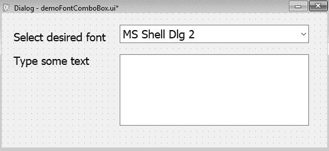

使用 Qt Designer 创建的用户界面存储在一个`.ui`文件中，该文件是一个 XML 文件，需要转换为 Python 代码。转换为 Python 代码时，生成的文件`demoFontComboBox.py`可以在本书的源代码包中看到。前面的代码将用作头文件，并导入到需要 GUI 的文件中，也就是说，只要导入前面的代码，就可以在任何 Python 脚本中访问设计的用户界面。

4.  创建另一个名为`callFontFontComboBox.pyw`的 Python 文件，并将`demoFontComboBox.py`代码导入其中。

Python 脚本`callFontComboBox.pyw`中的代码如下所示：

```py
import sys
from PyQt5.QtWidgets import QDialog, QApplication
from demoFontComboBox import *
class MyForm(QDialog):
    def __init__(self):
        super().__init__()
        self.ui = Ui_Dialog()
        self.ui.setupUi(self)
        myFont=QtGui.QFont(self.ui.fontComboBox.itemText(self.ui.
        fontComboBox.currentIndex()),15)
        self.ui.textEdit.setFont(myFont)
        self.ui.fontComboBox.currentFontChanged.connect
        (self.changeFont)
        self.show()
    def changeFont(self):
        myFont=QtGui.QFont(self.ui.fontComboBox.itemText(self.ui.
        fontComboBox.currentIndex()),15)
        self.ui.textEdit.setFont(myFont)
if __name__=="__main__":   
    app = QApplication(sys.argv)
    w = MyForm()
    w.show()
    sys.exit(app.exec_())
```

# 它是如何工作的。。。

在`callFontComboBox.pyw`文件中，每当用户从字体组合框小部件中选择任何字体样式时，都会发出`currentFontChanged`信号，该信号连接到`changeFont`方法，因此每当从字体组合框小部件中选择任何字体样式时，都会调用`changeFont()`方法。

在`changeFont()`方法中，通过调用两个方法访问所选字体样式。调用的第一个方法是`QFontComboBox`类的`currentIndex()`方法，它获取所选字体样式的索引号。调用的第二个方法是`itemText()`方法，当前所选字体样式的索引位置被传递给该方法以访问所选字体样式。然后，所选字体样式将应用于文本编辑小部件中写入的内容。

运行应用程序时，您将发现一个字体组合框小部件，显示系统中可用的字体样式，如以下屏幕截图所示：


在文本编辑小部件中键入一些文本，然后从字体组合框中选择所需的字体。所选字体样式将应用于文本编辑小部件中写入的文本，如以下屏幕截图所示：


# 使用进度条小部件

进度条小部件在表示任何任务的进度时都非常有用。无论是从服务器下载文件、在计算机上进行病毒扫描，还是其他一些关键任务，进度条小部件都有助于通知用户已完成任务的百分比和待完成任务的百分比。当任务完成时，进度条小部件会不断更新，指示任务的进度。

# 准备

为了了解进度条是如何更新以显示任何任务的进度的，让我们创建一个菜谱。此配方将显示一个进度条小部件，指示下载文件所需的总时间。当用户点击按钮开始下载文件时，进度条小部件将从 0%逐渐更新到 100%；也就是说，进度条将随着文件的下载而更新。当文件完全下载时，进度条小部件将显示 100%。

# 怎么做…

最初，进度条小部件为 0%，为了使其上升，我们需要使用一个循环。当进度条小部件表示的任务接近完成时，循环将增加其值。循环值中的每个增量都将添加到进度条小部件中的某些进度中。以下是显示如何更新进度条的分步过程：

1.  从没有按钮模板的对话框中创建一个新的应用程序，从窗口小部件框中拖动一个标签小部件、一个进度条小部件和一个按钮小部件，并将它们放到表单上。
2.  将标签小部件的文本属性设置为`Downloading the file`，将按钮小部件的文本属性设置为`Start Downloading`。
3.  将按钮小部件的 objectName 属性设置为`pushButtonStart`。
4.  按名称将应用程序保存为`demoProgressBar.ui`，此时将显示该表单，如以下屏幕截图所示：

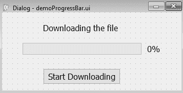

使用 Qt Designer 创建的用户界面存储在一个`.ui`文件中，该文件是一个 XML 文件，需要转换为 Python 代码。生成的 Python 代码`demoProgressBar.py`可以在本书的源代码包中看到。前面的代码将用作头文件，并导入到需要 GUI 的文件中；也就是说，只要导入前面的代码，就可以在任何 Python 脚本中访问代码中设计的用户界面。

5.  创建另一个名为`callProgressBar.pyw`的 Python 文件，并将`demoProgressBar.py`代码导入其中。Python 脚本`callProgressBar.pyw`中的代码如下所示：

```py
import sys
from PyQt5.QtWidgets import QDialog, QApplication
from demoProgressBar import *
class MyForm(QDialog):
    def __init__(self):
        super().__init__()
        self.ui = Ui_Dialog()
        self.ui.setupUi(self)
        self.ui.pushButtonStart.clicked.connect(self.updateBar)
        self.show()

    def updateBar(self):
        x = 0
        while x < 100:
            x += 0.0001
            self.ui.progressBar.setValue(x)

if __name__=="__main__":   
    app = QApplication(sys.argv)
    w = MyForm()
    w.show()
    sys.exit(app.exec_())
```

# 它是如何工作的。。。

在`callProgressBar.pyw`文件中，因为我们想让进度条在按下按钮时显示其进度，所以进度条的 clicked（）事件连接到`updateBar()`方法，所以当点击按钮时，会调用`updateBar()`方法。在`updateBar()`方法中，使用从`0`到`100`循环的`while`循环。变量`x`被初始化为值`0`。随着 while 循环的每次迭代，`x`的值增加`0.0001`。更新进度条时，`x`变量中的值应用于进度条。也就是说，随着 while 循环的每次迭代，`x`的值递增，`x`的值用于更新进度条。因此，进度条将从 0%开始进度，并一直持续到达到 100%。

在运行应用程序时，最初，您会在 0%处找到进度条小部件以及底部带有标题“开始下载”的按钮（请参见下面的屏幕截图）。单击开始下载按钮，您将看到进度条开始逐渐显示进度。进度条持续上升，直到达到 100%，表示文件已完全下载：

