# 使用图形

在每个应用程序中，图形在使其更加用户友好方面发挥着重要作用。图形使概念更容易理解。在本章中，我们将介绍以下主题：

*   显示鼠标坐标
*   显示单击和释放鼠标按钮的坐标
*   显示单击鼠标按钮的点
*   在两次鼠标单击之间绘制一条线
*   画不同类型的线
*   绘制所需尺寸的圆
*   在两次鼠标单击之间绘制矩形
*   以所需字体和大小绘制文本
*   创建显示不同图形工具的工具栏
*   使用 Matplotlib 打印直线
*   使用 Matplotlib 打印条形图

# 介绍

对于 Python 中的绘图和绘制，我们将使用几个类。其中最重要的是`QPainter`类。

这门课是用来画画的。它可以绘制直线、矩形、圆和复杂形状。使用`QPainter`绘图时，可以使用`QPainter`类笔定义绘图的颜色；笔/刷的厚度；风格线是以实线、虚线还是虚线绘制的；等等

本章使用`QPainter`类的几种方法绘制不同的形状。以下列出了其中的一些：

*   `QPainter::drawLine()`：此方法用于在两组*x*和*y*坐标之间划线
*   `QPainter::drawPoints()`：此方法用于在提供的*x*和*y*坐标指定的位置绘制点
*   `QPainter::drawRect()`：此方法用于在两组*x*和*y*坐标之间绘制矩形
*   `QPainter::drawArc()`：此方法用于从指定的中心位置，在两个指定的角度之间，以指定的半径绘制圆弧
*   `QPainter::drawText()`：此方法用于以指定的字体样式、颜色和大小绘制文本

为了了解实际显示图形所需的不同类和方法，让我们遵循一些方法。

# 显示鼠标坐标

要使用鼠标绘制任何形状，您需要知道鼠标按钮单击的位置、鼠标拖动的位置以及鼠标按钮释放的位置。只有在知道鼠标按钮被点击的坐标后，才能继续执行命令绘制不同的形状。在本配方中，我们将学习在表单上显示鼠标移动到的*x*和*y*坐标。

# 怎么做。。。

在此配方中，我们将跟踪鼠标移动，并将显示鼠标在表单上移动的*x*和*y*坐标。总之，我们将在这个应用程序中使用两个标签小部件，一个用于显示消息，另一个用于显示鼠标坐标。创建此应用程序的完整步骤如下所示：

1.  让我们基于没有按钮模板的对话框创建一个应用程序。
2.  通过在表单上拖放两个标签小部件，将两个`QLabel`小部件添加到表单中。

3.  将第一个标签小部件的文本属性设置为`This app will display x,y coordinates where mouse is moved on`。

4.  删除第二个标签小部件的文本属性，因为它的文本属性将通过代码设置。
5.  将应用程序按名称保存为`demoMousetrack.ui`。

该表单现在将显示在以下屏幕截图中：


使用 Qt Designer 创建的用户界面存储在一个`.ui`文件中，该文件是一个 XML 文件，需要转换为 Python 代码。`pyuic5`实用程序用于将 XML 文件转换为 Python 代码。生成的 Python 脚本`demoMousetrack.py`可以在本书的源代码包中看到。

6.  将`demoMousetrack.py`脚本视为头文件，并将其导入到将从中调用其用户界面设计的文件中。
7.  创建另一个名为`callMouseTrack.pyw`的 Python 文件，并将`demoMousetrack.py`代码导入其中：

```py
import sys
from PyQt5.QtWidgets import QDialog, QApplication
from demoMousetrack import *
class MyForm(QDialog):
    def __init__(self):
        super().__init__()
        self.ui = Ui_Dialog()
        self.setMouseTracking(True)
        self.ui.setupUi(self)
        self.show()
    def mouseMoveEvent(self, event):
        x = event.x()
        y = event.y()
        text = "x: {0}, y: {1}".format(x, y)
        self.ui.label.setText(text)
if __name__=="__main__":
    app = QApplication(sys.argv)
    w = MyForm()
    w.show()
    sys.exit(app.exec_())
```

# 它是如何工作的。。。

为了使应用程序能够跟踪鼠标，使用了一种方法`setMouseTracking(True)`。此方法将感知鼠标移动，每当鼠标移动时，它将调用`mouseMoveEvent()`方法。在`mouseMoveEvent()`中，在`event`对象上调用`x`和`y`方法，以获取鼠标位置的*x*和*y*坐标值。*x*和*y*坐标分别分配给`x`和`y`变量。*x*和*y*坐标中的值通过标签小部件以所需格式显示。

运行应用程序时，您将收到一条消息，移动鼠标时，将显示其*x*和*y*坐标值。当您在表单上移动鼠标时，鼠标位置的*x*和*y*坐标将通过第二个标签小部件显示，如下图所示：


# 显示单击和释放鼠标按钮的坐标

在本配方中，我们将学习显示点击鼠标按钮的*x*和*y*坐标，以及释放鼠标按钮的坐标。

# 怎么做。。。

两种方法，`mousePressEvent()`和`mouseReleaseEvent()`将在该配方中发挥主要作用。按下鼠标时会自动调用`mousePressEvent()`方法，并在发生鼠标按下事件时显示*x*和*y*坐标。同样，只要松开鼠标按钮，`mouseReleaseEvent()`方法就会自动调用。此配方中将使用两个标签小部件来显示单击鼠标按钮和释放鼠标按钮的坐标。以下是创建此类应用程序的步骤：

1.  让我们基于没有按钮模板的对话框创建一个应用程序。
2.  通过在表单上拖放三个标签小部件，将三个`QLabel`小部件添加到表单中。
3.  将第一个标签小部件的文本属性设置为`Displays the x,y coordinates where mouse is pressed and released`。
4.  删除第二个和第三个标签小部件的文本属性，因为它们的文本属性将通过代码设置。
5.  将第二个标签小部件的 objectName 属性设置为`labelPress`，因为它将用于显示鼠标按钮点击位置的*x*和*y*坐标。
6.  将第三个标签小部件的 objectName 属性设置为`labelRelease`，因为它将用于显示鼠标按钮释放位置的*x*和*y*坐标。
7.  将应用程序按名称保存为`demoMouseClicks.ui`。

该表单现在将显示在以下屏幕截图中：

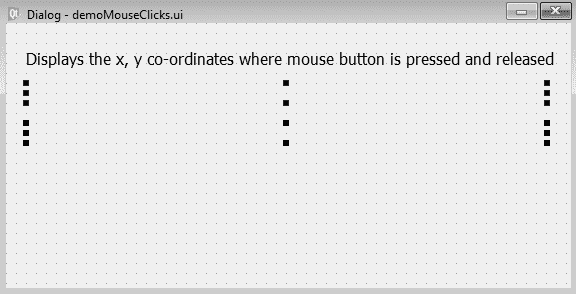

使用 Qt Designer 创建的用户界面存储在一个`.ui`文件中，该文件是一个 XML 文件，需要转换为 Python 代码。`pyuic5`实用程序用于将 XML 文件转换为 Python 代码。生成的 Python 脚本`demoMouseClicks.py`可以在本书的源代码包中看到。

8.  将`demoMouseClicks.py`脚本视为头文件，并将其导入到将从中调用其用户界面设计的文件中。
9.  创建另一个名为`callMouseClickCoordinates.pyw`的 Python 文件，并将`demoMouseClicks.py`代码导入其中：

```py
import sys
from PyQt5.QtWidgets import QDialog, QApplication
from demoMouseClicks import *
class MyForm(QDialog):
    def __init__(self):
        super().__init__()
        self.ui = Ui_Dialog()
        self.ui.setupUi(self)
        self.show()
    def mousePressEvent(self, event):
        if event.buttons() & QtCore.Qt.LeftButton:
            x = event.x()
            y = event.y()
            text = "x: {0}, y: {1}".format(x, y)
            self.ui.labelPress.setText('Mouse button pressed at 
            '+text)
    def mouseReleaseEvent(self, event):
        x = event.x()
        y = event.y()
        text = "x: {0}, y: {1}".format(x, y)
        self.ui.labelRelease.setText('Mouse button released at 
        '+text)
        self.update()
if __name__=="__main__":
    app = QApplication(sys.argv)
    w = MyForm()
    w.show()
    sys.exit(app.exec_())
```

# 它是如何工作的。。。

单击鼠标时会自动调用两个方法。按下鼠标按钮时调用`mousePressEvent()`方法，松开鼠标按钮时调用`mouseReleaseEvent()`方法。我们使用这两种方法来显示点击和释放鼠标按钮位置的*x*和*y*坐标。在这两种方法中，我们只需调用`event`对象上的`x()`和`y()`方法来获取鼠标位置的*x*和*y*坐标值。获取的`x`和`y`值将分别分配给`x`和`y`变量。`x`和`y`变量中的值以所需格式格式化，并通过两个标签小部件显示。

在运行应用程序时，您将收到一条消息，显示点击并释放鼠标按钮位置的*x*和*y*坐标。

当您按下并释放鼠标按钮时，鼠标按下和释放位置的*x*和*y*坐标将通过两个标签小部件显示，如下图所示：


# 显示单击鼠标按钮的点

在这个配方中，我们将学习显示鼠标按钮在表单上单击的点。这里的点意味着一个点。也就是说，无论用户在何处按下鼠标，该坐标处都会出现一个点。您还将学习定义圆点的大小。

# 怎么做。。。

此配方中将使用`mousePressEvent()`方法，因为当鼠标按下表单时，会自动调用该方法。在`mousePressEvent()`方法中，我们将执行命令以显示所需大小的点。以下是了解如何在单击鼠标按钮的窗体上显示点或点的步骤：

1.  让我们基于没有按钮模板的对话框创建一个应用程序。
2.  通过在表单上拖放标签小部件，将`QLabel`小部件添加到表单中。
3.  将标签小部件的文本属性设置为`Click the mouse where you want to display a dot`。
4.  将应用程序按名称保存为`demoDrawDot.ui`。

该表单现在将显示在以下屏幕截图中：


使用 Qt Designer 创建的用户界面存储在一个`.ui`文件中，该文件是一个 XML 文件，需要转换为 Python 代码。`pyuic5`实用程序用于将 XML 文件转换为 Python 代码。生成的 Python 脚本`demoDrawDot.py`可以在本书的源代码包中看到。

5.  将`demoDrawDot.py`脚本视为头文件，并将其导入到将从中调用其用户界面设计的文件中。
6.  创建另一个名为`callDrawDot.pyw`的 Python 文件，并将`demoDrawDot.py`代码导入其中：

```py
import sys
from PyQt5.QtWidgets import QDialog, QApplication
from PyQt5.QtGui import QPainter, QPen
from PyQt5.QtCore import Qt
from demoDrawDot import *
class MyForm(QDialog):
    def __init__(self):
        super().__init__()
        self.ui = Ui_Dialog()
        self.ui.setupUi(self)
        self.pos1 = [0,0]
        self.show()
    def paintEvent(self, event):
        qp = QPainter()
        qp.begin(self)
        pen = QPen(Qt.black, 5)
        qp.setPen(pen)
        qp.drawPoint(self.pos1[0], self.pos1[1])
        qp.end()
    def mousePressEvent(self, event):
        if event.buttons() & QtCore.Qt.LeftButton:
            self.pos1[0], self.pos1[1] = event.pos().x(), 
            event.pos().y()
            self.update()
if __name__=="__main__":
    app = QApplication(sys.argv)
    w = MyForm()
    w.show()
    sys.exit(app.exec_())
```

# 它是如何工作的。。。

因为我们想要显示鼠标按钮被点击的点，所以使用了`mousePressEvent()`方法。在`mousePressEvent()`方法中，在`event`对象上调用`pos().x()`和`pos().y()`方法来获取*x*和*y*坐标的位置，并将它们分配给`pos1`数组的`0`和`1`元素。也就是说，`pos1`数组被初始化为点击鼠标按钮的*x*和*y*坐标值。初始化`pos1`数组后，调用`self.update()`方法调用`paintEvent()`方法。

在`paintEvent()`方法中，`QPainter`类的对象通过名称定义为`qp`。`QPen`类的一个对象被定义为 pen，用于设置笔的厚度和颜色。最后，通过调用`drawPoint()`方法在`pos1`数组中定义其值的位置（即单击鼠标按钮的位置）显示一个点。

在运行应用程序时，您将收到一条消息，在单击鼠标按钮的位置将显示一个点。单击鼠标时，该位置将显示一个点，如以下屏幕截图所示：


# 在两次鼠标单击之间绘制一条线

在这个配方中，我们将学习在两点之间显示一条线，从单击鼠标按钮到在窗体上释放鼠标按钮。本配方的重点是了解如何处理鼠标按下和释放事件，如何访问鼠标按钮被点击和释放的 x*a*和*y*坐标，以及如何从单击鼠标按钮的位置到释放鼠标按钮的位置绘制直线。

# 怎么做。。。

此配方中的主要参与者是`mousePressEvent()`、`mouseReleaseEvent()`和`paintEvent()`方法。每当单击或释放鼠标按钮时，`mousePressEvent()`和`mouseReleaseEvent()`方法将分别自动执行。这两种方法将用于访问点击并释放鼠标按钮的*x*和*y*坐标。最后，使用`paintEvent()`方法在`mousePressEvent()`和`mouseReleaseEvent()`方法提供的坐标之间画一条线。以下是创建此应用程序的分步过程：

1.  让我们基于没有按钮模板的对话框创建一个应用程序。
2.  通过在表单上拖放标签小部件，将`QLabel`小部件添加到表单中。
3.  将标签小部件的文本属性设置为`Click the mouse and drag it to draw the line of desired size`。
4.  将应用程序按名称保存为`demoDrawLine.ui`

该表单现在将显示在以下屏幕截图中：

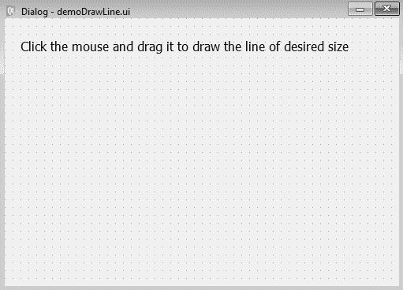

使用 Qt Designer 创建的用户界面存储在一个`.ui`文件中，该文件是一个 XML 文件，需要转换为 Python 代码。`pyuic5`实用程序用于将 XML 文件转换为 Python 代码。生成的 Python 脚本`demoDrawLine.py`可以在本书的源代码包中看到。

5.  将`demoDrawLine.py`脚本视为头文件，并将其导入到将从中调用其用户界面设计的文件中。
6.  创建另一个名为`callDrawLine.pyw`的 Python 文件，并将`demoDrawLine.py`代码导入其中：

```py
import sys
from PyQt5.QtWidgets import QDialog, QApplication
from PyQt5.QtGui import QPainter
from demoDrawLine import *
class MyForm(QDialog):
    def __init__(self):
        super().__init__()
        self.ui = Ui_Dialog()
        self.ui.setupUi(self)
        self.pos1 = [0,0]
        self.pos2 = [0,0]
        self.show()
    def paintEvent(self, event):
        qp = QPainter()
        qp.begin(self)
        qp.drawLine(self.pos1[0], self.pos1[1], self.pos2[0], 
        self.pos2[1])
        qp.end()
    def mousePressEvent(self, event):
        if event.buttons() & QtCore.Qt.LeftButton:
            self.pos1[0], self.pos1[1] = event.pos().x(), 
            event.pos().y()
    def mouseReleaseEvent(self, event):
            self.pos2[0], self.pos2[1] = event.pos().x(), 
            event.pos().y()
            self.update()
if __name__=="__main__":
    app = QApplication(sys.argv)
    w = MyForm()
    w.show()
    sys.exit(app.exec_())
```

# 它是如何工作的。。。

由于我们希望在单击和释放鼠标按钮的位置之间显示一条线，我们将使用两种方法，`mousePressEvent()`和`mouseReleaseEvent()`。顾名思义，`mousePressEvent()`方法在按下鼠标按钮时自动调用。类似地，`mouseReleaseEvent()`方法在释放鼠标按钮时自动调用。在这两种方法中，我们将简单地保存点击并释放鼠标按钮的*x*和*y*坐标值。本应用中定义了两个数组`pos1`和`pos2`，其中`pos1`存储鼠标点击位置的*x*和*y*坐标，`pos2`数组存储*x*和*y*坐标释放鼠标按钮的位置的坐标。一旦点击并释放鼠标按钮的位置的*x*和*y*坐标被分配给`pos1`和`pos2`数组，则`mouseReleaseEvent()`方法中的`self.update()`方法被调用，以调用`paintEvent()`方法。在`paintEvent()`方法中，调用`drawLine()`方法，并将存储在`pos1`和`pos2`数组中的*x*和*y*坐标传递给它，以在鼠标按下和鼠标释放位置之间画一条线。

在运行应用程序时，您将收到一条消息，在需要行的位置之间单击并拖动鼠标按钮。因此，单击鼠标按钮并按住鼠标按钮，将其拖动到所需位置并释放鼠标按钮。将在单击鼠标按钮和释放鼠标按钮的位置之间绘制一条线，如以下屏幕截图所示：


# 画不同类型的线

在本食谱中，我们将学习在两点之间显示不同类型的线，从鼠标单击位置到释放鼠标按钮的位置。用户将看到不同的线型可供选择，如实线、虚线、点划线等。该线将以选定的线型绘制。

# 怎么做。。。

`QPen`类用于定义用于绘制形状的笔的大小或厚度。本配方中使用了`QPen`类的`setStyle()`方法来定义线条的样式。以下是绘制不同样式线条的分步步骤：

1.  让我们基于没有按钮模板的对话框创建一个应用程序。
2.  通过在表单上拖放标签小部件，将`QLabel`小部件添加到表单中。

3.  通过拖放表单上的列表小部件项，添加一个`QListWidget`小部件。
4.  将标签小部件的文本属性设置为`Select the style from the list and then click and drag to draw a line`。
5.  将应用程序按名称保存为`demoDrawDiffLine.ui`。
6.  列表小部件项将用于显示不同类型的行，因此右键单击列表小部件项并选择编辑项选项以向列表小部件项添加一些行类型。单击打开的对话框底部的+（加号）按钮并添加一些线型，如以下屏幕截图所示：


7.  将列表小部件项的 objectName 属性设置为`listWidgetLineType`。

该表单现在将显示在以下屏幕截图中：


使用 Qt Designer 创建的用户界面存储在一个`.ui`文件中，该文件是一个 XML 文件，需要转换为 Python 代码。`pyuic5`实用程序用于将 XML 文件转换为 Python 代码。生成的 Python 脚本`demoDrawDiffLine.py`可以在本书的源代码包中看到。

8.  将`demoDrawDiffLine.py`脚本视为头文件，并将其导入到将从中调用其用户界面设计的文件中。
9.  创建另一个名为`callDrawDiffLine.pyw`的 Python 文件，并将`demoDrawDiffLine.py`代码导入其中：

```py
import sys
from PyQt5.QtWidgets import QDialog, QApplication
from PyQt5.QtGui import QPainter, QPen
from PyQt5.QtCore import Qt
from demoDrawDiffLine import *
class MyForm(QDialog):
    def __init__(self):
        super().__init__()
        self.ui = Ui_Dialog()
        self.ui.setupUi(self)
        self.lineType="SolidLine"
        self.pos1 = [0,0]
        self.pos2 = [0,0]
        self.show()
    def paintEvent(self, event):
        qp = QPainter()
        qp.begin(self)
        pen = QPen(Qt.black, 4)
        self.lineTypeFormat="Qt."+self.lineType
        if self.lineTypeFormat == "Qt.SolidLine":
            pen.setStyle(Qt.SolidLine)
            elif self.lineTypeFormat == "Qt.DashLine":
            pen.setStyle(Qt.DashLine)
            elif self.lineTypeFormat =="Qt.DashDotLine":
                pen.setStyle(Qt.DashDotLine)
            elif self.lineTypeFormat =="Qt.DotLine":
                pen.setStyle(Qt.DotLine)
            elif self.lineTypeFormat =="Qt.DashDotDotLine":
                pen.setStyle(Qt.DashDotDotLine)
                qp.setPen(pen)
                qp.drawLine(self.pos1[0], self.pos1[1], 
                self.pos2[0], self.pos2[1])
                qp.end()
    def mousePressEvent(self, event):
        if event.buttons() & QtCore.Qt.LeftButton:
            self.pos1[0], self.pos1[1] = event.pos().x(), 
            event.pos().y()
    def mouseReleaseEvent(self, event):
        self.lineType=self.ui.listWidgetLineType.currentItem()
        .text()
        self.pos2[0], self.pos2[1] = event.pos().x(), 
        event.pos().y()
        self.update()
if __name__=="__main__":
    app = QApplication(sys.argv)
    w = MyForm()
    w.show()
    sys.exit(app.exec_())
```

# 它是如何工作的。。。

必须在鼠标按下和鼠标释放位置之间画一条线，因此我们将在本应用程序中使用两种方法，`mousePressEvent()`和`mouseReleaseEvent()`。点击鼠标左键时自动调用`mousePressEvent()`方法。类似地，`mouseReleaseEvent()`方法在释放鼠标按钮时自动调用。

在这两种方法中，我们将分别保存点击和释放鼠标按钮的*x*和*y*坐标值。本应用中定义了两个数组`pos1`和`pos2`，其中`pos1`存储鼠标点击位置的*x*和*y*坐标，`pos2`数组存储*x*和*y*坐标释放鼠标按钮的位置的坐标。在`mouseReleaseEvent()`方法中，我们从列表小部件获取用户选择的线型，并将选择的线型分配给`lineType`变量。另外，在`mouseReleaseEvent()`方法中调用`self.update()`方法来调用`paintEvent()`方法。在`paintEvent()`方法中，定义宽度为`4`像素的笔，并将其指定为黑色。此外，还可以为笔指定与用户从列表小部件中选择的线型相匹配的样式。最后，调用`drawLine()`方法，并将存储在`pos1`和`pos2`数组中的*x*和*y*坐标传递给它，以在鼠标按下和鼠标释放位置之间画一条线。该行将以从列表小部件中选择的样式显示。

运行应用程序时，您将收到一条消息，从列表中选择线型，然后在需要线条的位置之间单击并拖动鼠标按钮。因此，在选择所需的线型后，单击鼠标按钮并按住鼠标按钮，将其拖动到所需位置并释放鼠标按钮。将在单击鼠标按钮的位置和从列表中选择的样式中释放鼠标按钮的位置之间绘制一条线。以下屏幕截图显示了不同类型的线条：

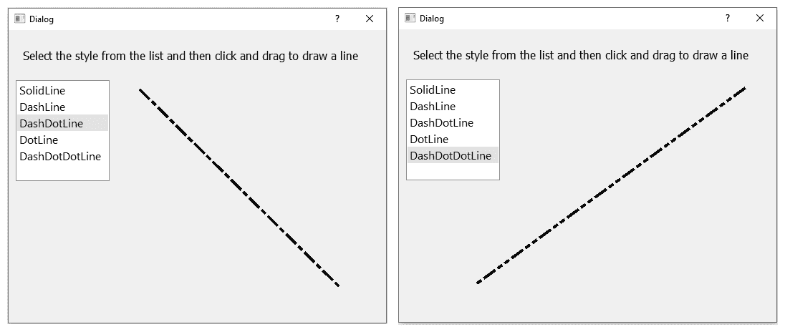

# 绘制所需尺寸的圆

在这个食谱中，我们将学习画一个圆圈。用户将单击并拖动鼠标来定义圆的直径，然后将按照用户指定的直径绘制圆。

# 怎么做。。。

圆只不过是从 0 度到 360 度绘制的圆弧。圆弧的长度，或者说圆的直径，由鼠标按下事件和鼠标释放事件的距离决定。从鼠标按下事件到鼠标释放事件，在内部定义一个矩形，并在该矩形内绘制圆。以下是创建此应用程序的完整步骤：

1.  让我们基于没有按钮模板的对话框创建一个应用程序。
2.  通过在表单上拖放标签小部件，将`QLabel`小部件添加到表单中。
3.  将标签小部件的文本属性设置为`Click the mouse and drag it to draw a  circle of the desired size`。
4.  按名称将应用程序保存为`demoDrawCircle.ui`。该表单现在将显示，如以下屏幕截图所示：

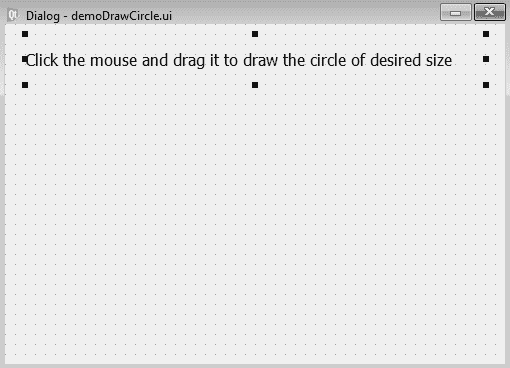

使用 Qt Designer 创建的用户界面存储在一个`.ui`文件中，它是一个 XML 文件。通过应用`pyuic5`实用程序将 XML 文件转换为 Python 代码。您可以在本书的源代码包中找到生成的 Python 代码`demoDrawCircle.py`。

5.  将`demoDrawCircle.py`脚本视为头文件，并将其导入到将从中调用其用户界面设计的文件中。
6.  创建另一个名为`callDrawCircle.pyw`的 Python 文件，并将`demoDrawCircle.py`代码导入其中：

```py
import sys
from PyQt5.QtWidgets import QDialog, QApplication
from PyQt5.QtGui import QPainter
from demoDrawCircle import *
class MyForm(QDialog):
    def __init__(self):
        super().__init__()
        self.ui = Ui_Dialog()
        self.ui.setupUi(self)
        self.pos1 = [0,0]
        self.pos2 = [0,0]
        self.show()
    def paintEvent(self, event):
        width = self.pos2[0]-self.pos1[0]
        height = self.pos2[1] - self.pos1[1]
        qp = QPainter()
        qp.begin(self)
        rect = QtCore.QRect(self.pos1[0], self.pos1[1], width, 
        height)
        startAngle = 0
        arcLength = 360 *16
        qp.drawArc(rect, startAngle, arcLength)
        qp.end()
    def mousePressEvent(self, event):
        if event.buttons() & QtCore.Qt.LeftButton:
            self.pos1[0], self.pos1[1] = event.pos().x(), 
            event.pos().y()
    def mouseReleaseEvent(self, event):
        self.pos2[0], self.pos2[1] = event.pos().x(), 
        event.pos().y()
        self.update()
if __name__=="__main__":
    app = QApplication(sys.argv)
    w = MyForm()
    w.show()
    sys.exit(app.exec_())
```

# 它是如何工作的。。。

为了在按下鼠标按钮和释放鼠标按钮的位置之间绘制一个直径定义的圆，我们将使用两种方法，`mousePressEvent()`和`mouseReleaseEvent()`。按下鼠标按钮时自动调用`mousePressEvent()`方法，松开鼠标按钮时自动调用`mouseReleaseEvent()`方法。在这两种方法中，我们只需保存点击并释放鼠标按钮的*x*和*y*坐标值。定义了两个数组`pos1`和`pos2`，其中`pos1`数组存储鼠标点击位置的*x*和*y*坐标，`pos2`数组存储*x*和*y*坐标释放鼠标按钮的位置的坐标。在`mouseReleaseEvent()`方法中调用的`self.update()`方法将调用`paintEvent()`方法。在`paintEvent()`方法中，矩形的宽度是通过查找鼠标按下和鼠标释放位置的*x*坐标之间的差来计算的。类似地，通过查找鼠标按下和鼠标释放事件的 y 坐标之间的差异来计算矩形的高度。

创建的圆的大小等于矩形的宽度和高度，也就是说，将在用户用鼠标指定的边界内创建圆。

此外，在`paintEvent()`方法中，调用`drawArc()`方法，并将矩形、弧的起始角和弧的长度传递给它。起始角指定为`0`。

在运行应用程序时，您将收到一条消息，单击并拖动鼠标按钮以定义要绘制的圆的直径。因此，单击鼠标按钮并按住鼠标按钮，将其拖动到所需位置并释放鼠标按钮。将在单击鼠标按钮和释放鼠标按钮的位置之间绘制一个圆圈，如以下屏幕截图所示：

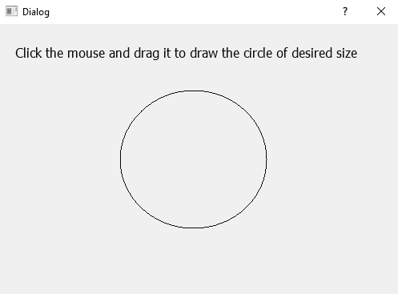

# 在两次鼠标单击之间绘制矩形

在本食谱中，我们将学习在窗体上单击并释放鼠标按钮的两个点之间显示一个矩形。

# 怎么做。。。

这是一个非常简单的应用程序，使用`mousePressEvent()`和`mouseReleaseEvent()`方法分别查找鼠标按下和释放位置的*x*和*y*坐标。此后，调用`drawRect()`方法从单击鼠标按钮的坐标到释放鼠标按钮的坐标绘制矩形。创建此应用程序的分步步骤如下：

1.  让我们基于没有按钮模板的对话框创建一个应用程序。
2.  通过在表单上拖放标签小部件，将`QLabel`小部件添加到表单中。
3.  将标签小部件的文本属性设置为`Click the mouse and drag it to draw a rectangle of the desired size`。
4.  按名称将应用程序保存为`demoDrawRectangle.ui`。该表单现在将显示，如以下屏幕截图所示：


使用 Qt Designer 创建的用户界面存储在一个`.ui`文件中，该文件是一个 XML 文件，需要转换为 Python 代码。`pyuic5`实用程序用于将 XML 文件转换为 Python 代码。生成的 Python 脚本`demoDrawRectangle.py`可以在本书的源代码包中看到。

5.  将`demoDrawRectangle.py`脚本视为头文件，并将其导入到将从中调用其用户界面设计的文件中。
6.  创建另一个名为`callDrawRectangle.pyw`的 Python 文件，并将`demoDrawRectangle.py`代码导入其中：

```py
import sys
from PyQt5.QtWidgets import QDialog, QApplication
from PyQt5.QtGui import QPainter
from demoDrawRectangle import *
class MyForm(QDialog):
    def __init__(self):
        super().__init__()
        self.ui = Ui_Dialog()
        self.ui.setupUi(self)
        self.pos1 = [0,0]
        self.pos2 = [0,0]
        self.show()
    def paintEvent(self, event):
        width = self.pos2[0]-self.pos1[0]
        height = self.pos2[1] - self.pos1[1]
        qp = QPainter()
        qp.begin(self)
        qp.drawRect(self.pos1[0], self.pos1[1], width, height)
        qp.end()
    def mousePressEvent(self, event):
        if event.buttons() & QtCore.Qt.LeftButton:
            self.pos1[0], self.pos1[1] = event.pos().x(), 
            event.pos().y()
    def mouseReleaseEvent(self, event):
        self.pos2[0], self.pos2[1] = event.pos().x(), 
        event.pos().y()
        self.update()
if __name__=="__main__":
    app = QApplication(sys.argv)
    w = MyForm()
    w.show()
    sys.exit(app.exec_())
```

# 它是如何工作的。。。

要在按下的鼠标按钮和释放的位置之间绘制一个矩形，我们将使用两种方法，`mousePressEvent()`和`mouseReleaseEvent()`。按下鼠标按钮时自动调用`mousePressEvent()`方法，松开鼠标按钮时自动调用`mouseReleaseEvent()`方法。在这两种方法中，我们将简单地保存分别单击和释放鼠标按钮的*x*和*y*坐标值。定义了两个数组`pos1`和`pos2`，其中`pos1`数组存储鼠标点击位置的*x*和*y*坐标，`pos2`数组存储*x*和*y*坐标释放鼠标按钮的位置的坐标。在`mouseReleaseEvent()`方法中调用的`self.update()`方法将调用`paintEvent()`方法。在`paintEvent()`方法中，矩形的宽度是通过查找鼠标按下和鼠标释放位置的*x*坐标之间的差来计算的。类似地，通过查找鼠标按下和鼠标释放事件的*y*坐标之间的差异来计算矩形的高度。

另外，在`paintEvent()`方法中，调用`drawRect()`方法，并将存储在`pos1`数组中的*x*和*y*坐标传递给它。此外，矩形的宽度和高度将传递给`drawRect()`方法，以在鼠标按下和鼠标释放位置之间绘制矩形。

运行应用程序时，您将收到一条消息，在需要矩形的位置之间单击并拖动鼠标按钮。因此，单击鼠标按钮并按住鼠标按钮，将其拖动到所需位置并释放鼠标按钮。

将在单击鼠标按钮和释放鼠标按钮的位置之间绘制一个矩形，如以下屏幕截图所示：

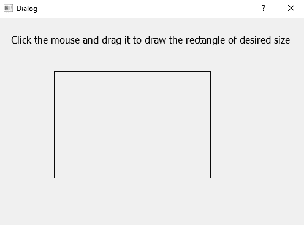

# 以所需字体和大小绘制文本

在本食谱中，我们将学习以特定字体和特定字体大小绘制文本。此配方中需要四个小部件，例如文本编辑、列表小部件、组合框和按钮。文本编辑小部件将用于输入用户希望以所需字体和大小显示的文本。列表小部件框将显示用户可以从中选择的不同字体名称。组合框小部件将显示字体大小，用户可以选择这些字体大小来定义文本的大小。按钮小部件将启动操作，即，在文本编辑小部件中输入的文本将在单击按钮时以所选字体和大小显示

# 怎么做。。。

`QPainter`课程是本食谱的重点。本配方将使用`QPainter`类的`setFont()`和`drawText()`方法。将调用`setFont()`方法来设置用户选择的字体样式和字体大小，`drawText()`方法将以指定的字体样式和大小绘制用户在文本编辑小部件中书写的文本。以下是逐步学习如何使用这些方法的步骤：

1.  让我们基于没有按钮模板的对话框创建一个应用程序。

2.  通过拖放表单上的标签小部件、文本编辑小部件、列表小部件框、组合框小部件和按钮小部件，将`QLabel`、`QTextEdit`、`QListWidget`、`QComboBox`和`QPushButton`小部件添加到表单中。
3.  将标签小部件的文本属性设置为`Enter some text in leftmost box, select font and size, and click the Draw Text button`。
4.  列表小部件框将用于显示不同的字体，因此右键单击列表小部件框并选择编辑项选项，以向列表小部件框添加一些字体名称。单击打开的对话框底部的+（加号）按钮并添加一些字体名称，如以下屏幕截图所示：


5.  组合框小部件将用于显示不同的字体大小，因此我们需要向组合框小部件添加特定的字体大小。右键单击组合框小部件并选择编辑项选项。

6.  单击打开的对话框底部的+（加号）按钮并添加两种字体大小，如以下屏幕截图所示：


7.  将按钮小部件的文本属性设置为`Draw Text`。
8.  将列表小部件框的 objectName 属性设置为`listWidgetFont`。
9.  将组合框小部件的 objectName 属性设置为`comboBoxFontSize`。
10.  将按钮小部件的 objectName 属性设置为 pushButtonDrawText。
11.  将应用程序按名称保存为`demoDrawText.ui`。

该表单现在将显示在此屏幕截图中：


使用 Qt Designer 创建的用户界面存储在一个`.ui`文件中，它是一个 XML 文件。通过应用`pyuic5`实用程序将 XML 文件转换为 Python 代码。您可以在本书的源代码包中找到生成的 Python 代码`demoDrawText.py`。

12.  将`demoDrawText.py`脚本视为头文件，并将其导入到将从中调用其用户界面设计的文件中。
13.  创建另一个名为`callDrawText.pyw`的 Python 文件，并将`demoDrawText.py`代码导入其中：

```py
import sys
from PyQt5.QtWidgets import QDialog, QApplication
from PyQt5.QtGui import QPainter, QColor, QFont
from PyQt5.QtCore import Qt
from demoDrawText import *
class MyForm(QDialog):
    def __init__(self):
        super().__init__()
        self.ui = Ui_Dialog()
        self.ui.setupUi(self)
        self.ui.pushButtonDrawText.clicked.connect(self.
        dispText)
        self.textToDraw=""
        self.fontName="Courier New"
        self.fontSize=5
        self.show()
    def paintEvent(self, event):
        qp = QPainter()
        qp.begin(self)
        qp.setPen(QColor(168, 34, 3))
        qp.setFont(QFont(self.fontName, self.fontSize))
        qp.drawText(event.rect(), Qt.AlignCenter, 
        self.textToDraw)
        qp.end()
    def dispText(self):
        self.fontName=self.ui.listWidgetFont.currentItem().
        text()
        self.fontSize=int(self.ui.comboBoxFontSize.itemText(
        self.ui.comboBoxFontSize.currentIndex()))
        self.textToDraw=self.ui.textEdit.toPlainText()
        self.update()
if __name__=="__main__":
    app = QApplication(sys.argv)
    w = MyForm()
    w.show()
    sys.exit(app.exec_())
```

# 它是如何工作的。。。

Push Button 小部件的 click（）事件连接到`dispText()`方法，即每当点击按钮时，都会调用`dispText()`方法。

在`dispText()`方法中，从列表小部件框中选择的字体名称被访问并分配给`fontName`变量。此外，从组合框中选择的字体大小将被访问并分配给`fontSize`变量。除此之外，文本编辑小部件中写入的文本被提取并分配给`textToDraw`变量。最后调用`self.update()`方法；它将调用`paintEvent()`方法。

在`paintEvent()`方法中，调用`drawText()`方法，并以分配给`fontName`变量的字体样式和`fontSize`变量中指定的字体大小绘制写入文本编辑小部件中的文本。在运行应用程序时，您将在最左边找到一个文本编辑小部件，字体名称显示在列表小部件框中，字体大小通过组合框小部件显示。您需要在文本编辑小部件中输入一些文本，从列表小部件框中选择字体样式，从组合框小部件中选择字体大小，然后单击绘制文本按钮。单击“绘制文本”按钮，文本编辑小部件中写入的文本将以选定字体和选定字体大小显示，如以下屏幕截图所示：

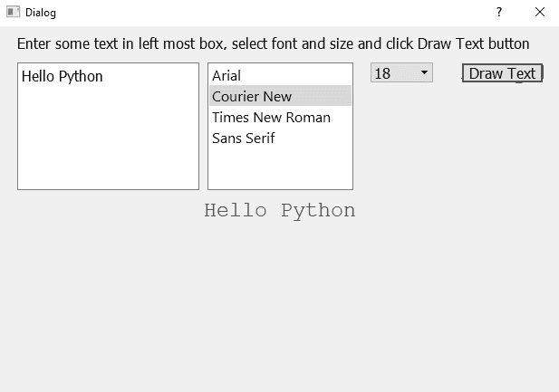

# 创建显示不同图形工具的工具栏

在本食谱中，我们将学习创建一个显示三个工具栏按钮的工具栏。这三个工具栏按钮显示直线、圆和矩形的图标。当用户单击工具栏上的“线”工具栏按钮时，他/她可以在窗体上单击并拖动鼠标，在两个鼠标位置之间绘制一条线。类似地，通过单击“圆”工具栏按钮，用户可以通过单击并拖动鼠标在窗体上绘制圆。

# 怎么做…

本食谱的重点是帮助您了解如何通过工具栏向用户提供应用程序中常用的命令，从而使它们易于访问和使用。您将学习创建工具栏按钮，定义它们的快捷方式，以及它们的图标。要定义工具栏按钮的图标，您将学习创建和使用资源文件。每一个工具栏按钮的创建和执行都将一步一步地解释清楚：

1.  让我们创建一个新的应用程序，以了解创建工具栏所涉及的步骤。
2.  启动 Qt Designer 并创建基于主窗口的应用程序。您将获得一个带有默认菜单栏的新应用程序。
3.  通过右键单击菜单栏并从弹出的快捷菜单中选择“删除菜单栏”选项，可以删除菜单栏。
4.  要添加工具栏，请在主窗口模板上单击鼠标右键，然后从关联菜单中选择“添加工具栏”。将在菜单栏下方添加一个空白工具栏，如以下屏幕截图所示：

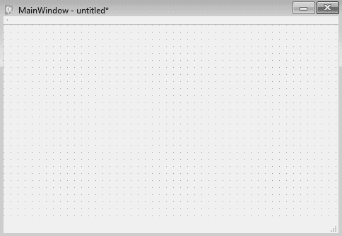

我们想要创建一个包含三个工具栏按钮的工具栏，线、圆和矩形。由于三个工具栏按钮将代表三个图标图像，我们假设我们有图标文件，即扩展名为`.ico`的文件，用于直线、圆和矩形。

5.  要向工具栏添加工具，请在“动作编辑器”框中创建一个动作；工具栏中的每个工具栏按钮都由一个操作表示。“动作编辑器”框通常位于“属性编辑器”窗口下方。
6.  如果“动作编辑器”窗口不可见，请从“视图”菜单中选择“动作编辑器”。此时将显示“操作编辑器”窗口，如下所示：


7.  在“动作编辑器”窗口中，选择“新建”按钮为第一个工具栏按钮创建动作。您将获得对话框以输入新操作的详细信息。
8.  在文本框中，指定操作的名称`Circle`。
9.  在“对象名称”框中，将自动显示操作对象的名称，前缀为文本`action`。
10.  在工具提示框中，输入任何描述性文字。

11.  在快捷框中，按*Ctrl*+*C*字符，指定`Ctrl + C`作为画圆的快捷键。
12.  图标下拉列表显示两个选项，选择资源。。。然后选择文件。

13.  您可以通过单击“选择文件”将图标图像指定给操作。。。选项或从资源文件：

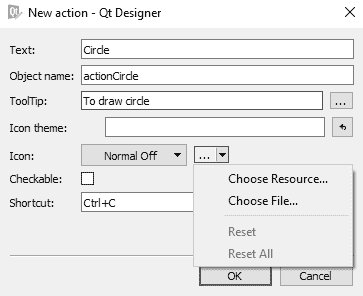

您可以在一个资源文件中选择几个图标，然后该资源文件可以在不同的应用程序中使用。

14.  选择“选择资源…”。。。选项您将看到“选择资源”对话框，如以下屏幕截图所示：


由于尚未创建任何资源，因此对话框为空。您可以在顶部看到两个图标。第一个图标表示编辑资源，第二个图标表示重新加载。单击“编辑资源”图标，您将看到如下对话框：


现在，让我们看看如何通过执行以下步骤来创建资源文件：

1.  第一步是创建资源文件或加载现有资源文件。底部的前三个图标表示新资源文件、编辑资源文件和删除。
2.  单击“新建资源文件”图标。系统将提示您指定资源文件的名称。
3.  让我们将新资源文件命名为`iconresource`。文件将以扩展名`.qrc`保存。
4.  下一步是向资源文件添加前缀。“前缀/路径”窗格下方的三个图标是“添加前缀”、“添加文件”和“删除”。
5.  单击添加前缀选项，系统将提示您输入前缀名称。
6.  输入前缀为`Graphics`。添加前缀后，我们准备将三个图标（圆形、矩形和直线）添加到资源文件中。回想一下，我们有三个扩展名为`.ico`的图标文件。
7.  单击“添加文件”选项添加图标。单击添加文件选项时，系统将要求您浏览到驱动器/目录并选择图标文件。
8.  逐个选择三个图标文件。添加三个图标后，将显示“编辑资源”对话框，如下所示：


9.  单击“确定”按钮后，将显示资源文件，其中显示三个可供选择的图标。
10.  由于我们要为圆圈动作指定一个图标，请单击圆圈图标，然后单击确定按钮：

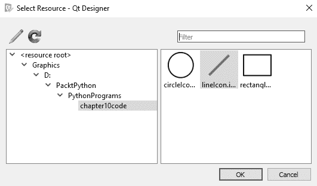

选定的圆圈图标将分配给 actionCircle。

11.  类似地，为矩形和线条工具栏按钮创建两个动作`actionRectangle`和`actionLine`。添加三个动作后，将出现动作编辑器窗口，如下所示：


12.  要在工具栏中显示工具栏按钮，请单击“动作编辑器”窗口中的一个动作，并按住该动作，将其拖动到工具栏。
13.  使用名称`demoToolBars.ui`保存应用程序。

将三个操作拖动到工具栏后，工具栏将显示如下所示：


`pyuic5`命令行实用程序将`.ui`（XML）文件转换为 Python 代码，生成的代码将命名为`demoToolBars.py`。您可以在本书的源代码包中找到`demoToolBars.py`脚本。我们创建的`iconresource.qrc`文件必须先转换成 Python 格式，然后才能继续。以下命令行将资源文件转换为 Python 脚本：

```py
pyrcc5 iconresource.qrc -o iconresource_rc.py
```

14.  创建一个名为`callToolBars.pyw`的 Python 脚本，该脚本导入代码`demoToolBar.py`，以调用工具栏并绘制从工具栏中选择工具栏按钮的图形。脚本文件将显示如下：

```py
import sys
from PyQt5.QtWidgets import QMainWindow, QApplication
from PyQt5.QtGui import QPainter
from demoToolBars import *

class AppWindow(QMainWindow):
    def __init__(self):
        super().__init__()
        self.ui = Ui_MainWindow()
        self.ui.setupUi(self)
        self.pos1 = [0,0]
        self.pos2 = [0,0]
        self.toDraw=""
        self.ui.actionCircle.triggered.connect(self.drawCircle)
        self.ui.actionRectangle.triggered.connect(self.
        drawRectangle)
        self.ui.actionLine.triggered.connect(self.drawLine)
        self.show()

    def paintEvent(self, event):
        qp = QPainter()
        qp.begin(self)
        if self.toDraw=="rectangle":
            width = self.pos2[0]-self.pos1[0]
            height = self.pos2[1] - self.pos1[1]    
            qp.drawRect(self.pos1[0], self.pos1[1], width, 
            height)
        if self.toDraw=="line":
            qp.drawLine(self.pos1[0], self.pos1[1], 
            self.pos2[0], self.pos2[1])
        if self.toDraw=="circle":
            width = self.pos2[0]-self.pos1[0]
            height = self.pos2[1] - self.pos1[1]          
            rect = QtCore.QRect(self.pos1[0], self.pos1[1], 
            width, height)
            startAngle = 0
            arcLength = 360 *16
            qp.drawArc(rect, startAngle, arcLength)     
            qp.end()

    def mousePressEvent(self, event):
        if event.buttons() & QtCore.Qt.LeftButton:
            self.pos1[0], self.pos1[1] = event.pos().x(), 
            event.pos().y()

    def mouseReleaseEvent(self, event):
        self.pos2[0], self.pos2[1] = event.pos().x(), 
        event.pos().y()   
        self.update()

    def drawCircle(self):
        self.toDraw="circle"

    def drawRectangle(self):
        self.toDraw="rectangle"

    def drawLine(self):
        self.toDraw="line"

app = QApplication(sys.argv)
w = AppWindow()
w.show()
sys.exit(app.exec_())
```

# 它是如何工作的。。。

每个工具栏按钮动作的触发（）信号连接到相应的方法。actionCircle 工具栏按钮的触发（）信号连接到`drawCircle()`方法，因此无论何时从工具栏中选择 circle 工具栏按钮，都会调用`drawCircle()`方法。类似地，`actionRectangle`和`actionLine`的触发（）信号分别连接到`drawRectangle()`和`drawLine()`方法。在`drawCircle()`方法中，变量`toDraw`被分配一个字符串`circle`。`toDraw`变量将用于确定在`paintEvent()`方法中绘制的图形。`toDraw`变量可以指定为三个字符串中的任意一个，`line`、`circle`或`rectangle`。条件分支应用于`toDraw`变量中的值，相应地，将调用绘制直线、矩形或圆的方法。

一条线、一个圆或一个矩形的大小由鼠标点击决定；用户需要在表单上单击鼠标并拖动鼠标，然后在他/她想要绘制直线、圆或矩形的位置释放鼠标。换句话说，线条的长度、矩形的宽度和高度以及圆的直径将由鼠标决定。

两个数组`pos1`和`pos2`分别用于存储鼠标点击位置和鼠标释放位置的*x*和*y*坐标。*x*和*y*坐标值通过`mousePressEvent()`和`mouseReleaseEvent()`两种方法分配给`pos1`和`pos2`数组。点击鼠标按钮时自动调用`mousePressEvent()`方法，释放鼠标按钮时自动调用`mouseReleaseEvent()`方法。

在`mouseReleaseEvent()`方法中，在分配鼠标按钮释放位置的*x*和*y*坐标值后，调用`self.update()`方法调用`paintEvent()`方法。在`paintEvent()`方法中，根据分配给`toDraw`变量的字符串进行分支。如果`toDraw`变量被分配了字符串`line`（通过`drawLine()`方法），则`QPainter`类的`drawLine()`方法将被调用，以在两个鼠标位置之间画线。类似地，如果`toDraw`变量被分配字符串`circle`（通过`drawCircle()`方法），则`QPainter`类的`drawArc()`方法将被调用，以绘制一个直径由鼠标位置提供的圆。如果`toDraw`变量被`drawRectangle()`方法分配了字符串`rectangle`，那么`QPainter`类将调用`drawRect()`方法来绘制一个由鼠标位置提供的宽度和高度的矩形。

在运行该应用程序时，您将发现一个包含三个工具栏按钮的工具栏：圆形、矩形和直线，如下面的屏幕截图（左）所示。单击“圆”工具栏按钮，然后单击窗体上的鼠标按钮，按住鼠标按钮，拖动它以定义圆的直径并释放鼠标按钮。将从单击鼠标按钮的位置到释放鼠标按钮的位置（右）绘制一个圆圈：


要绘制矩形，请单击矩形工具，在窗体上的某个位置单击鼠标按钮，然后按住鼠标按钮，拖动它以定义矩形的高度和宽度。释放鼠标按钮时，将在按下的鼠标和释放的鼠标位置（左）之间绘制一个矩形。类似地，单击“行”工具栏按钮，然后单击窗体上的鼠标按钮。按住鼠标按钮，将其向上拖动到要绘制直线的位置。释放鼠标按钮时，将在单击和释放鼠标按钮的位置之间绘制一条线（右）：


# 使用 Matplotlib 打印直线

在本配方中，我们将学习使用 Matplotlib 绘制一条线，该线通过特定的*x*和*y*坐标。

Matplotlib 是一个 Python 2D 绘图库，它使绘制直线、直方图、条形图等复杂任务变得非常简单。该库不仅提供绘图，还提供了一个 API，支持在应用程序中嵌入绘图。

# 准备

可以使用以下语句安装 Matplotlib：

```py
pip install matplotlib
```

假设我们想要绘制一条线，该线使用以下几组*x*和*y*坐标：

```py
x=10, y=20
x=20, y=40
x=30, y=60
```

在*x*轴上，`x`的值从`0`开始向右增加，在*y*轴上，`y`的值在底部为`0`，并随着我们的移动而增加。因为最后一对坐标是`30`、`60`，所以图形的最大`x`值为`30`，最大`y`值为`60`。

本配方将使用以下`matplotlib.pyplot`方法：

*   `title()`：此方法用于设置图形的标题
*   `xlabel()`：此方法是沿*x*轴显示具体文本
*   `ylabel()`：此方法是沿*y*轴显示具体文本
*   `plot()`：此方法用于在指定的*x*和*y*坐标系下绘图

# 怎么做。。。

创建一个名为`demoPlotLine.py`的 Python 脚本，并在其中编写以下代码：

```py
import matplotlib.pyplot as graph
graph.title('Plotting a Line!')
graph.xlabel('x - axis')
graph.ylabel('y - axis')
x = [10,20,30]
y = [20,40,60]
graph.plot(x, y)
graph.show()
```

# 它是如何工作的。。。

您在脚本中导入`matplotlib.pyplot`并将其命名为 graph。使用`title()`方法，设置图表的标题。此后，调用`xlabel()`和`ylabel()`方法分别定义*x*轴和*y*轴的文本。因为我们想用三组*x*和*y*坐标来绘制一条直线，所以两个数组被命名为*x*和*y*。我们要绘制的*x*和*y*坐标值分别在两个数组*x*和*y*中定义。调用`plot()`方法，并将两个*x*和*y*数组传递给它，以使用两个数组中定义的三个*x*和*y*坐标值绘制直线。调用 show 方法以显示打印。

在运行应用程序时，您会发现绘制了一条穿过指定的*x*和*y*坐标的直线。此外，图形将显示指定的标题，并绘制一条线！。除此之外，您还可以看到指定文本沿*x*轴和*y*轴显示，如下图所示：


# 使用 Matplotlib 打印条形图

在本食谱中，我们将学习使用 Matplotlib 绘制一个条形图，比较过去三年的业务增长情况。您将提供 2016 年、2017 年和 2018 年的利润百分比，应用程序将显示一个代表过去三年利润百分比的条形图。

# 准备

让我们假设组织在过去三年中的利润百分比如下：

*   **2016**：利润 70%
*   **2017**：利润为 90%
*   **2018**：利润 80%

您希望沿*x*轴显示代表利润百分比的条形图，并希望显示年份：2016 年、2017 年和 2018 年。沿着*y*轴，您希望显示表示利润百分比的条形图。*y*轴上的`y`值将从底部的`0`开始，并在向顶部移动时增加，最大值`100`位于顶部。

本配方将使用以下`matplotlib.pyplot`方法：

*   `title()`：此方法用于设置图形的标题
*   `bar()`：从两个提供的阵列中绘制条形图；一个数组表示*x*轴的数据，第二个数组表示*y*轴的数据
*   `plot()`：此方法用于在指定的*x*和*y*坐标系下绘图

# 怎么做。。。

创建一个名为`demoPlotBars.py`的 Python 脚本，并在其中编写以下代码：

```py
import matplotlib.pyplot as graph
years = ['2016', '2017', '2018']
profit = [70, 90, 80]
graph.bar(years, profit)
graph.title('Growth in Business')
graph.plot(100)
graph.show()
```

# 它是如何工作的。。。

您在脚本中导入`matplotlib.pyplot`并将其命名为 graph。您定义了两个数组，年份和利润，其中年份数组将包含 2016 年、2017 年和 2018 年的数据，以表示我们希望比较其利润的年份。类似地，利润数组将包含表示过去三年利润百分比的值。此后，调用`bar()`方法，并将两个数组（年份和利润）传递给它，以显示比较过去三年利润的条形图。调用`title()`方法显示标题“业务增长”。调用`plot()`方法指示*y*轴上的最大`y`值。最后，调用`show()`方法来显示该条。

在运行该应用程序时，您会发现绘制了一个条形图，显示该组织过去三年的利润。*x*轴显示年份，*y*轴显示利润百分比。此外，该图将显示指定的标题“业务增长”，如以下屏幕截图所示：

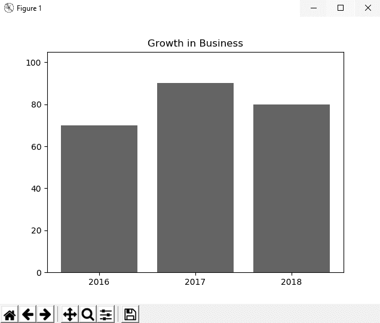