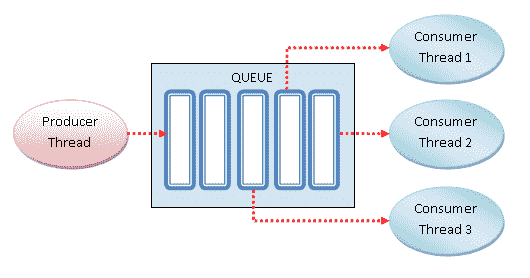

# 基于线程的并行性

目前，软件应用程序中最广泛使用的并发管理编程范式是基于多线程的。一般来说，一个应用程序是由一个进程*生成的，该进程被划分为多个独立的线程，这些线程表示并行运行*并相互竞争的不同类型的活动。**

 **如今，使用多线程的现代应用程序已被大规模采用。事实上，目前所有的处理器都是多核的，这样它们就可以执行并行操作并利用计算机的计算资源。

因此，*多线程编程***绝对是实现并发应用的好方法。然而，多线程编程通常隐藏一些非平凡的困难，必须对这些困难进行适当的管理，以避免死锁*或同步问题等错误。***

 ***我们将首先定义基于线程和多线程编程的概念，然后介绍`multithreading`库。我们将学习线程定义、管理和通信的主要指令。

通过`multithreading`库，我们将看到如何通过不同的技术来解决问题，如*锁*、*锁*、*信号量*、*条件*、*事件*、*屏障、*和*队列*。

在本章中，我们将介绍以下配方：

*   什么是线？
*   如何定义线程
*   如何确定当前线程
*   如何在子类中使用线程
*   带锁的线程同步
*   使用 RLock 进行线程同步

*   使用信号量的线程同步
*   具有条件的线程同步
*   与事件的线程同步
*   带屏障的线程同步
*   使用队列的线程通信

我们还将探讨 Python 提供的使用线程编程的主要选项。为此，我们将重点使用`threading`模块。

# 什么是线？

*线程*是一个独立的执行流，可以与系统中的其他线程并行执行。

多个线程可以共享数据和资源，利用所谓的共享信息空间。线程和进程的具体实现取决于您计划在其上运行应用程序的操作系统，但是，一般来说，可以说线程包含在进程中，并且相同进程条件下的不同线程共享一些资源。与此相反，不同的流程不与其他流程共享自己的资源。

线程由三个元素组成：程序计数器、寄存器和堆栈。与同一进程的其他线程共享的资源实质上包括*数据*和*操作系统资源*。此外，线程有自己的执行状态，即*线程状态*，可以与其他线程*同步*。

线程状态可以是就绪、正在运行或被阻止：

*   创建线程时，线程进入**就绪**状态。
*   线程由操作系统（或运行时支持系统）计划执行，当轮到它时，它将进入**运行**状态开始执行。
*   线程可以等待条件发生，从**运行**状态进入**阻塞**状态。一旦锁定条件终止，**阻塞的**线程返回**就绪**状态：


Thread life cycle

多线程编程的主要优势在于性能，因为进程之间的上下文切换要比属于同一进程的线程之间的切换上下文重得多。

在下一个菜谱中，直到本章结束，我们将研究 Python`threading`模块，通过编程示例介绍其主要功能。

# Python 线程模块

Python 使用 Python 标准库提供的`threading`模块管理线程。这个模块提供了一些非常有趣的特性，使基于线程的方法变得更加容易；事实上，`threading`模块提供了几种非常容易实现的同步机制。

线程模块的主要组件如下所示：

*   `thread`对象
*   `lock`对象
*   `RLock`对象
*   `semaphore`对象
*   `condition`对象
*   `event`对象

在下面的食谱中，我们用不同的应用程序示例来检查`threading`库提供的功能。对于下面的示例，我们将参考 Python 3.5.0 发行版（[https://www.python.org/downloads/release/python-350/](https://www.python.org/downloads/release/python-350/) 。

# 定义线程

使用线程的最简单方法是使用目标函数实例化它，然后调用 start 方法让它开始作业。

# 准备

Python`threading`模块提供了一个`Thread`类，用于在不同线程中运行进程和函数：

```py
class threading.Thread(group=None, 
                       target=None, 
                       name=None, 
                       args=(), 
                       kwargs={})  
```

以下是`Thread`类的参数：

*   `group`：这是`group`值，应该是`None`；这是为将来的实现保留的。
*   `target`：这是启动线程活动时要执行的函数。
*   `name`：线程的名称；默认情况下，会为其分配一个唯一的名称，形式为`Thread-N`。
*   `args`：这是要传递给目标的参数元组。
*   `kwargs`：这是用于`target`函数的关键字参数字典。

在下一节中，让我们了解如何定义线程。

# 怎么做。。。

我们将通过传递一个表示线程编号的数字来定义线程，最后，结果将被打印出来：

1.  使用以下 Python 命令导入`threading`模块：

```py
import threading
```

2.  在`main`程序中，使用名为`my_func`的`target`函数实例化`Thread`对象。然后，向将包含在输出消息中的函数传递一个参数：

```py
t = threading.Thread(target=function , args=(i,))
```

3.  直到调用 start 方法，线程才开始运行，`join`方法生成调用线程并等待线程完成执行，如下所示：

```py
import threading

def my_func(thread_number):
    return print('my_func called by thread N°\
        {}'.format(thread_number))

def main():
    threads = []
    for i in range(10):
        t = threading.Thread(target=my_func, args=(i,))
        threads.append(t)
        t.start()
        t.join()

if __name__ == "__main__":
    main()
```

# 它是如何工作的。。。

在`main`程序中，我们初始化线程的列表，将创建的每个线程的实例添加到该列表中。创建的线程总数为 10，而第 i<sup>个</sup>线程的**i**索引作为参数传递给第 i<sup>个</sup>线程：

```py
my_func called by thread N°0
my_func called by thread N°1
my_func called by thread N°2
my_func called by thread N°3
my_func called by thread N°4
my_func called by thread N°5
my_func called by thread N°6
my_func called by thread N°7
my_func called by thread N°8
my_func called by thread N°9
```

# 还有更多。。。

目前所有的处理器都是多核的，因此可以执行多个并行操作并充分利用计算机的计算资源。虽然这是事实，但多线程编程隐藏了许多非平凡的困难，必须对这些困难进行适当的管理，以避免死锁或同步问题等错误。

# 确定当前线程

使用参数来标识或命名线程既麻烦又不必要。每个`Thread`实例都有一个*名称*，其默认值可以在创建线程时更改。

命名线程在具有多个处理不同操作的服务线程的服务器进程*esses*中很有用。

# 准备

此`threading`模块提供`currentThread().getName()`方法，返回当前线程的名称。

下面的部分向我们展示了如何使用这个函数来确定哪个线程正在运行。

# 怎么做。。。

让我们看一下以下步骤：

1.  为了确定哪个线程正在运行，我们创建了三个`target`函数并导入`time`模块以引入两秒钟的暂停执行：

```py
import threading
import time

def function_A():
    print (threading.currentThread().getName()+str('-->\
        starting \n'))
    time.sleep(2)
    print (threading.currentThread().getName()+str( '-->\
        exiting \n'))

def function_B():
    print (threading.currentThread().getName()+str('-->\
        starting \n'))
    time.sleep(2)
    print (threading.currentThread().getName()+str( '-->\
        exiting \n'))

def function_C():
    print (threading.currentThread().getName()+str('-->\
        starting \n'))
    time.sleep(2)
    print (threading.currentThread().getName()+str( '-->\
        exiting \n'))

```

2.  三个线程被一个`target`函数实例化。然后，我们传递要打印的名称，如果未定义，则将使用默认名称。然后，为每个线程调用`start()`和`join()`方法：

```py
if __name__ == "__main__":

    t1 = threading.Thread(name='function_A', target=function_A)
    t2 = threading.Thread(name='function_B', target=function_B)
    t3 = threading.Thread(name='function_C',target=function_C) 

    t1.start()
    t2.start()
    t3.start()

    t1.join()
    t2.join()
    t3.join()
```

# 它是如何工作的。。。

我们将设置三个线程，每个线程分配一个`target`函数。当`target`函数被执行和终止时，函数名被适当地打印出来。

对于本例，输出应如下所示（即使显示的顺序不能相同）：

```py
function_A--> starting 
function_B--> starting 
function_C--> starting 

function_A--> exiting 
function_B--> exiting 
function_C--> exiting
```

# 定义线程子类

创建线程可能需要定义从`Thread`类继承的子类。如*定义线程*部分所述，后者包含在`threading`模块中，然后必须导入该模块。

# 准备

我们将在下一节中定义的类代表我们的线程，它尊重一个精确的结构：我们首先必须定义**`__init__`**方法，但最重要的是，我们必须重写`run`方法。

# 怎么做。。。

所涉及的步骤如下：

1.  我们定义了`MyThreadClass`类，我们可以用它来创建我们想要的所有线程。这种类型的每一个线程都以`run`方法中定义的操作为特征，在这个简单的示例中，该方法将其自身限制为在开始和结束执行时打印字符串：

```py
import time
import os
from random import randint
from threading import Thread

class MyThreadClass (Thread):
```

2.  此外，在`__init__`方法中，我们指定了两个初始化参数，分别为`name`和`duration`，将在`run`方法中使用：

```py
def __init__(self, name, duration):
      Thread.__init__(self)
      self.name = name
      self.duration = duration 

   def run(self):
      print ("---> " + self.name +\
             " running, belonging to process ID "\
             + str(os.getpid()) + "\n")
      time.sleep(self.duration)
      print ("---> " + self.name + " over\n")
```

3.  这些参数将在创建线程期间设置。具体而言，`duration`参数是使用`randint`函数计算的，该函数输出一个介于`1`和`10`之间的随机整数。从`MyThreadClass`的定义开始，我们来看看如何实例化更多线程，如下所示：

```py
def main():

    start_time = time.time()

    # Thread Creation
    thread1 = MyThreadClass("Thread#1 ", randint(1,10))
    thread2 = MyThreadClass("Thread#2 ", randint(1,10))
    thread3 = MyThreadClass("Thread#3 ", randint(1,10))
    thread4 = MyThreadClass("Thread#4 ", randint(1,10))
    thread5 = MyThreadClass("Thread#5 ", randint(1,10))
    thread6 = MyThreadClass("Thread#6 ", randint(1,10))
    thread7 = MyThreadClass("Thread#7 ", randint(1,10))
    thread8 = MyThreadClass("Thread#8 ", randint(1,10)) 
    thread9 = MyThreadClass("Thread#9 ", randint(1,10))

    # Thread Running
    thread1.start()
    thread2.start()
    thread3.start()
    thread4.start()
    thread5.start()
    thread6.start()
    thread7.start()
    thread8.start()
    thread9.start()

    # Thread joining
    thread1.join()
    thread2.join()
    thread3.join()
    thread4.join()
    thread5.join()
    thread6.join()
    thread7.join()
    thread8.join()
    thread9.join()

    # End 
    print("End")

    #Execution Time
    print("--- %s seconds ---" % (time.time() - start_time))

if __name__ == "__main__":
    main()
```

# 它是如何工作的。。。

在本例中，我们根据`__init__`方法的定义创建了九个线程，每个线程都有自己的`name`和`duration`属性。

然后，我们使用`start`方法运行它们，该方法仅限于执行先前定义的`run`方法的内容。请注意，每个线程的进程 ID 都是相同的，这意味着我们处于多线程进程中。

另外，请注意启动方法*没有阻塞*：当它被执行时，控件立即转到下一行，而线程在后台启动。事实上，正如您所看到的，线程*的创建并没有按照代码指定的顺序*进行。同样，线程终止被约束为`duration`参数的值，使用`randint`函数进行计算，并通过每个线程创建实例的参数进行传递。要等待线程完成，必须执行`join`操作。

输出如下所示：

```py
---> Thread#1 running, belonging to process ID 13084
---> Thread#5 running, belonging to process ID 13084
---> Thread#2 running, belonging to process ID 13084
---> Thread#6 running, belonging to process ID 13084
---> Thread#7 running, belonging to process ID 13084
---> Thread#3 running, belonging to process ID 13084
---> Thread#4 running, belonging to process ID 13084
---> Thread#8 running, belonging to process ID 13084
---> Thread#9 running, belonging to process ID 13084

---> Thread#6 over
---> Thread#9 over
---> Thread#5 over
---> Thread#2 over
---> Thread#7 over
---> Thread#4 over
---> Thread#3 over
---> Thread#8 over
---> Thread#1 over

End

--- 9.117518663406372 seconds ---
```

# 还有更多。。。

最常与 OOP 相关联的特性是*继承*，它能够将新类定义为现有类的修改版本。继承的主要优点是，您可以向类添加新方法，而无需更改原始定义。

原始类通常被称为父类和派生类，即子类。继承是一个强大的特性，有些程序可以编写得更简单、更简洁，从而可以在不修改原始类的情况下自定义类的行为。继承结构可以反映问题的本质，这一事实在某些情况下可以使程序更容易理解。

然而（为了让用户保持警惕！）继承会使程序更难阅读。这是因为，当调用一个方法时，并不总是清楚它是在代码中定义的，必须在多个模块中进行跟踪，而不是在一个定义良好的地方。

使用继承可以完成的许多事情，即使没有继承，通常也可以优雅地进行管理，因此只有在问题的结构需要继承时才使用继承是合适的。如果在错误的时间使用，那么继承可能造成的伤害可能超过使用它的好处。

# 带锁的线程同步

`threading`模块还包括一个简单的锁机制，允许我们实现线程之间的同步。

# 准备

*锁*只不过是一个通常可由多个线程访问的对象，线程必须拥有该对象才能继续执行程序的受保护部分。这些锁是通过执行`threading`模块中定义的`Lock()`方法创建的。

一旦创建了锁，我们就可以使用两种方法来同步两个（或更多）线程的执行：获取锁控制的`acquire()`方法和释放锁控制的`release()`方法。

`acquire()`方法接受一个可选参数，如果未指定或未设置为`True`，该参数将强制线程暂停执行，直到释放锁，然后才能获取锁。另一方面，如果使用等于`False`的参数执行`acquire()`方法，则它立即返回布尔结果，如果已获取锁，则返回`True`，否则返回`False`。

在下面的示例中，我们通过修改前面配方中引入的代码来显示锁定机制，*定义了一个线程子类*。

# 怎么做。。。

所涉及的步骤如下：

1.  如下面的代码块所示，`MyThreadClass`类已经修改，在**`run`**方法中引入了`acquire()`和`release()`方法，而`Lock()`的定义在类本身的定义之外：

```py
import threading
import time
import os
from threading import Thread
from random import randint

# Lock Definition
threadLock = threading.Lock()

class MyThreadClass (Thread):
   def __init__(self, name, duration):
      Thread.__init__(self)
      self.name = name
      self.duration = duration
   def run(self):
      #Acquire the Lock
      threadLock.acquire() 
      print ("---> " + self.name + \
             " running, belonging to process ID "\
             + str(os.getpid()) + "\n")
      time.sleep(self.duration)
      print ("---> " + self.name + " over\n")
      #Release the Lock
      threadLock.release()
```

2.  `main()`功能相对于上一个代码样本没有改变：

```py
def main():
    start_time = time.time()
    # Thread Creation
    thread1 = MyThreadClass("Thread#1 ", randint(1,10))
    thread2 = MyThreadClass("Thread#2 ", randint(1,10))
    thread3 = MyThreadClass("Thread#3 ", randint(1,10))
    thread4 = MyThreadClass("Thread#4 ", randint(1,10))
    thread5 = MyThreadClass("Thread#5 ", randint(1,10))
    thread6 = MyThreadClass("Thread#6 ", randint(1,10))
    thread7 = MyThreadClass("Thread#7 ", randint(1,10))
    thread8 = MyThreadClass("Thread#8 ", randint(1,10))
    thread9 = MyThreadClass("Thread#9 ", randint(1,10))

    # Thread Running
    thread1.start()
    thread2.start()
    thread3.start()
    thread4.start()
    thread5.start()
    thread6.start()
    thread7.start()
    thread8.start()
    thread9.start()

    # Thread joining
    thread1.join()
    thread2.join()
    thread3.join()
    thread4.join()
    thread5.join()
    thread6.join()
    thread7.join()
    thread8.join()
    thread9.join()

    # End 
    print("End")
    #Execution Time
    print("--- %s seconds ---" % (time.time() - start_time))

if __name__ == "__main__":
    main()
```

# 它是如何工作的。。。

我们使用锁修改了上一节的代码，这样线程将按顺序执行。

第一个线程获取锁并执行其任务，而其他八个线程保持*处于保留状态。*在第一个线程的执行结束时，即执行`release()`方法时，第二个线程将获得锁，三到八个线程仍将等待，直到执行结束（即再次，只有在运行`release()`方法之后）。

重复执行*锁获取*和*锁释放*直到第九个线程，最终结果是由于锁机制，该执行以顺序模式进行，如以下输出所示：

```py
---> Thread#1 running, belonging to process ID 10632
---> Thread#1 over
---> Thread#2 running, belonging to process ID 10632
---> Thread#2 over
---> Thread#3 running, belonging to process ID 10632
---> Thread#3 over
---> Thread#4 running, belonging to process ID 10632
---> Thread#4 over
---> Thread#5 running, belonging to process ID 10632
---> Thread#5 over
---> Thread#6 running, belonging to process ID 10632
---> Thread#6 over
---> Thread#7 running, belonging to process ID 10632
---> Thread#7 over
---> Thread#8 running, belonging to process ID 10632
---> Thread#8 over
---> Thread#9 running, belonging to process ID 10632
---> Thread#9 over

End

--- 47.3672661781311 seconds ---
```

# 还有更多。。。

`acquire()`和`release()`方法的插入点决定了代码的整个执行。因此，花时间分析要使用哪些线程以及如何同步它们是非常重要的。

例如，我们可以在`MyThreadClass`类中更改`release()`方法的插入点，如下所示：

```py
import threading
import time
import os
from threading import Thread
from random import randint

# Lock Definition
threadLock = threading.Lock()

class MyThreadClass (Thread):
   def __init__(self, name, duration):
      Thread.__init__(self)
      self.name = name
      self.duration = duration
   def run(self):
      #Acquire the Lock
      threadLock.acquire() 
      print ("---> " + self.name + \
             " running, belonging to process ID "\ 
             + str(os.getpid()) + "\n")
      #Release the Lock in this new point
      threadLock.release()
      time.sleep(self.duration)
      print ("---> " + self.name + " over\n")
```

在这种情况下，输出变化非常显著：

```py
---> Thread#1 running, belonging to process ID 11228
---> Thread#2 running, belonging to process ID 11228
---> Thread#3 running, belonging to process ID 11228
---> Thread#4 running, belonging to process ID 11228
---> Thread#5 running, belonging to process ID 11228
---> Thread#6 running, belonging to process ID 11228
---> Thread#7 running, belonging to process ID 11228
---> Thread#8 running, belonging to process ID 11228
---> Thread#9 running, belonging to process ID 11228

---> Thread#2 over
---> Thread#4 over
---> Thread#6 over
---> Thread#5 over
---> Thread#1 over
---> Thread#3 over
---> Thread#9 over
---> Thread#7 over
---> Thread#8 over

End
--- 6.11468243598938 seconds ---
```

如您所见，只有线程创建以顺序模式进行。一旦线程创建完成，新线程将获得锁，而前一个线程将在后台继续计算。

# 使用 RLock 进行线程同步

可重入锁或简单的 RLock 是一个同步原语，可以由同一线程多次获取。

它使用专有线程的概念。这意味着在*锁定状态*下，一些线程拥有锁，而在*解锁状态*下，锁不属于任何线程。

下一个示例演示如何通过`RLock()`机制管理线程。

# 准备

RLock 是通过`threading.RLock()`类实现的。它提供与`threading.Lock()`类具有相同语法的`acquire()`和`release()`方法。

同一线程可以多次获取一个`RLock`块。其他线程将无法获取`RLock`块，直到拥有它的线程对之前的每一次`acquire()`调用都进行了`release()`调用。实际上，`RLock`块必须释放，但只能由获取它的线程释放。

# 怎么做。。。

所涉及的步骤如下：

1.  我们引入了`Box`类，它提供了访问`execute()`方法的`add()`和`remove()`方法，以便分别执行添加或删除项的操作。`execute()`方法的使用受`RLock()`规定：

```py
import threading
import time
import random

class Box:
    def __init__(self):
        self.lock = threading.RLock()
        self.total_items = 0

    def execute(self, value):
        with self.lock:
            self.total_items += value

    def add(self):
        with self.lock:
            self.execute(1)

    def remove(self):
        with self.lock:
            self.execute(-1)
```

2.  以下函数由两个线程调用。它们有`box`类和`items`总数作为参数添加或删除：

```py
def adder(box, items):
    print("N° {} items to ADD \n".format(items))
    while items:
        box.add()
        time.sleep(1)
        items -= 1
        print("ADDED one item -->{} item to ADD \n".format(items))

def remover(box, items):
    print("N° {} items to REMOVE\n".format(items))
    while items:
        box.remove()
        time.sleep(1)
        items -= 1
        print("REMOVED one item -->{} item to REMOVE\
            \n".format(items))
```

3.  在此设置要添加或从框中删除的项目总数。正如你所看到的，这两个数字是不同的。当`adder`和`remover`方法都完成任务时，执行结束：

```py
def main():
    items = 10
    box = Box()

    t1 = threading.Thread(target=adder, \
                          args=(box, random.randint(10,20)))
    t2 = threading.Thread(target=remover, \
                          args=(box, random.randint(1,10)))

    t1.start()
    t2.start()

    t1.join()
    t2.join()

if __name__ == "__main__":
    main()
```

# 它是如何工作的。。。

在`main`程序中，`t1`和`t2`的两个线程已经与`adder()`和`remover()`函数关联。如果项目数大于零，则功能处于活动状态。

对`RLock()`的调用在**`Box`**类的`__init__`方法中执行：

```py
class Box:
    def __init__(self):
        self.lock = threading.RLock()
        self.total_items = 0
```

两个`adder()`和`remover()`函数分别与`Box`类的项交互，调用`add()`和`remove()`的`Box`类方法。

在每个方法调用中，捕获一个资源，然后使用在`_init_`方法中设置的`lock`参数释放。

以下是输出：

```py
N° 16 items to ADD 
N° 1 items to REMOVE 

ADDED one item -->15 item to ADD 
REMOVED one item -->0 item to REMOVE 

ADDED one item -->14 item to ADD 
ADDED one item -->13 item to ADD 
ADDED one item -->12 item to ADD 
ADDED one item -->11 item to ADD 
ADDED one item -->10 item to ADD 
ADDED one item -->9 item to ADD 
ADDED one item -->8 item to ADD 
ADDED one item -->7 item to ADD 
ADDED one item -->6 item to ADD 
ADDED one item -->5 item to ADD 
ADDED one item -->4 item to ADD 
ADDED one item -->3 item to ADD 
ADDED one item -->2 item to ADD 
ADDED one item -->1 item to ADD 
ADDED one item -->0 item to ADD 
>>>
```

# 还有更多。。。

*锁*与*锁*的区别如下：

*   一个*锁*在必须释放之前只能获取一次。但是，`RLock`可以从同一线程多次获取；必须释放相同的次数才能释放。
*   另一个区别是获取的锁可以由任何线程释放，而获取的`RLock`只能由获取它的线程释放。

# 使用信号量的线程同步

**信号量**是由操作系统管理的抽象数据类型，用于同步多线程对共享资源和数据的访问。它由一个内部变量组成，该变量标识对与其关联的资源的并发访问量。

# 准备

信号量的操作基于两个功能：`acquire()`和`release()`，如下所述：

*   每当线程想要访问给定的或与信号量关联的资源时，它必须调用`acquire()`操作，该操作*减少信号量*的内部变量，并允许在该变量的值看起来非负时访问该资源。如果该值为负数，则线程将被挂起，另一个线程对资源的释放将被挂起。
*   使用完共享资源后，线程通过`release()`指令释放资源。通过这种方式，信号量的内部变量增加，允许*等待*线程（如果有的话）有机会访问新释放的资源。

信号量是计算机科学史上最古老的同步原语之一，由早期荷兰计算机科学家 Edsger W.Dijkstra 发明。

下面的示例演示如何通过信号量同步线程。

# 怎么做。。。

下面的代码描述了一个问题，其中我们有两个线程`producer()`和`consumer()`，它们共享一个公共资源，即项目。`producer()`的任务是生成项目，`consumer()`线程的任务是使用已经生成的项目。

如果该项尚未生成`consumer()`线程，则必须等待。一旦物品被生产，`producer()`线程通知消费者应该使用该资源：

1.  通过将信号量初始化为`0`，我们获得了一个所谓的信号量事件，其唯一目的是同步两个或多个线程的计算。在这里，线程必须同时使用数据或公共资源：

```py
semaphore = threading.Semaphore(0)
```

2.  此操作与锁的锁定机构中描述的操作非常相似。`producer()`线程创建项，然后调用`release()`方法释放资源：

```py
semaphore.release()
```

3.  类似地，`consumer()`线程通过`acquire()`方法获取数据。如果信号量的计数器等于`0`，那么它将阻塞条件的`acquire()`方法，直到收到另一个线程的通知。如果信号量的计数器大于`0`，则该值递减。当生产者创建一个项目时，它释放信号量，然后消费者获取它并使用共享资源：

```py
semaphore.acquire()
```

4.  通过信号量完成的同步过程显示在以下代码块中：

```py
import logging
import threading
import time
import random

LOG_FORMAT = '%(asctime)s %(threadName)-17s %(levelname)-8s %\
              (message)s'
logging.basicConfig(level=logging.INFO, format=LOG_FORMAT)

semaphore = threading.Semaphore(0)
item = 0

def consumer():
    logging.info('Consumer is waiting')
    semaphore.acquire()
    logging.info('Consumer notify: item number {}'.format(item))

def producer():
    global item
    time.sleep(3)
    item = random.randint(0, 1000)
    logging.info('Producer notify: item number {}'.format(item))
    semaphore.release()

#Main program
def main():
    for i in range(10):
        t1 = threading.Thread(target=consumer)
        t2 = threading.Thread(target=producer)

        t1.start()
        t2.start()

        t1.join()
        t2.join()

if __name__ == "__main__":
    main()
```

# 它是如何工作的。。。

然后将采集的数据打印在标准输出上：

```py
print ("Consumer notify : consumed item number %s " %item)
```

这是我们运行 10 次后得到的结果：

```py
2019-01-27 19:21:19,354 Thread-1 INFO Consumer is waiting
2019-01-27 19:21:22,360 Thread-2 INFO Producer notify: item number 388
2019-01-27 19:21:22,385 Thread-1 INFO Consumer notify: item number 388
2019-01-27 19:21:22,395 Thread-3 INFO Consumer is waiting
2019-01-27 19:21:25,398 Thread-4 INFO Producer notify: item number 939
2019-01-27 19:21:25,450 Thread-3 INFO Consumer notify: item number 939
2019-01-27 19:21:25,453 Thread-5 INFO Consumer is waiting
2019-01-27 19:21:28,459 Thread-6 INFO Producer notify: item number 388
2019-01-27 19:21:28,468 Thread-5 INFO Consumer notify: item number 388
2019-01-27 19:21:28,476 Thread-7 INFO Consumer is waiting
2019-01-27 19:21:31,478 Thread-8 INFO Producer notify: item number 700
2019-01-27 19:21:31,529 Thread-7 INFO Consumer notify: item number 700
2019-01-27 19:21:31,538 Thread-9 INFO Consumer is waiting
2019-01-27 19:21:34,539 Thread-10 INFO Producer notify: item number 685
2019-01-27 19:21:34,593 Thread-9 INFO Consumer notify: item number 685
2019-01-27 19:21:34,603 Thread-11 INFO Consumer is waiting
2019-01-27 19:21:37,604 Thread-12 INFO Producer notify: item number 503
2019-01-27 19:21:37,658 Thread-11 INFO Consumer notify: item number 503
2019-01-27 19:21:37,668 Thread-13 INFO Consumer is waiting
2019-01-27 19:21:40,670 Thread-14 INFO Producer notify: item number 690
2019-01-27 19:21:40,719 Thread-13 INFO Consumer notify: item number 690
2019-01-27 19:21:40,729 Thread-15 INFO Consumer is waiting
2019-01-27 19:21:43,731 Thread-16 INFO Producer notify: item number 873
2019-01-27 19:21:43,788 Thread-15 INFO Consumer notify: item number 873
2019-01-27 19:21:43,802 Thread-17 INFO Consumer is waiting
2019-01-27 19:21:46,807 Thread-18 INFO Producer notify: item number 691
2019-01-27 19:21:46,861 Thread-17 INFO Consumer notify: item number 691
2019-01-27 19:21:46,874 Thread-19 INFO Consumer is waiting
2019-01-27 19:21:49,876 Thread-20 INFO Producer notify: item number 138
2019-01-27 19:21:49,924 Thread-19 INFO Consumer notify: item number 138
>>>
```

# 还有更多。。。

信号量的一个特殊用途是*互斥*。互斥量只是一个信号量，其内部变量初始化为`1`的值，允许在访问数据和资源时实现互斥。

信号量仍然常用于多线程编程语言；但是，他们有两个主要问题，我们已经讨论过，如下：

*   它们不阻止线程对同一信号量执行更多等待操作的可能性。很容易忘记执行与执行的等待次数相关的所有必要信号。
*   您可能会遇到死锁的情况。例如，当`t1`线程对`s1`信号量执行等待时，会产生死锁情况，**`t2`**线程对`t1`线程执行等待，对`s2`和`t2`线程执行等待，然后对`s1`执行等待。

# 具有条件的线程同步

*条件*标识应用程序中的状态变化。这是一种同步机制，其中一个线程等待特定条件，另一个线程通知该*条件已发生*。

一旦该条件发生，线程*获取*锁，以获得对共享资源的*独占访问*。

# 准备

说明这一机制的一个好方法是再次研究生产者/消费者问题。如果缓冲区未满，则类生产者写入缓冲区；如果缓冲区已满，则类使用者从缓冲区中获取数据（从后者中删除数据）。类生产者将通知消费者缓冲区不为空，而消费者将向生产者报告缓冲区未满。

# 怎么做。。。

所涉及的步骤如下：

1.  类使用者获取通过**`items[]`**列表建模的共享资源：

```py
condition.acquire()
```

2.  如果列表长度等于`0`，则消费者处于等待状态：

```py
if len(items) == 0:
   condition.wait()
```

3.  然后从项目列表中进行**`pop`**操作：

```py
items.pop()
```

4.  因此，将消费者的状态通知生产者，并释放共享资源：

```py
condition.notify()
```

5.  类生产者获取共享资源，然后验证列表是否已满（在我们的示例中，我们将最大数量的项`10`放在项列表中）。如果列表已满，则生产者将处于等待状态，直到列表被消费：

```py
condition.acquire()
if len(items) == 10:
   condition.wait()
```

6.  如果列表未满，则添加单个项目。通知状态并释放资源：

```py
condition.notify()
condition.release()
```

7.  为了向您展示条件机制，我们将再次使用*消费者/生产者*模型：

```py
import logging
import threading
import time

LOG_FORMAT = '%(asctime)s %(threadName)-17s %(levelname)-8s %\
             (message)s'
logging.basicConfig(level=logging.INFO, format=LOG_FORMAT)

items = []
condition = threading.Condition()

class Consumer(threading.Thread):
    def __init__(self, *args, **kwargs):
        super().__init__(*args, **kwargs)

    def consume(self):

        with condition:

            if len(items) == 0:
                logging.info('no items to consume')
                condition.wait()

            items.pop()
            logging.info('consumed 1 item')

            condition.notify()

    def run(self):
        for i in range(20):
            time.sleep(2)
            self.consume()

class Producer(threading.Thread):
    def __init__(self, *args, **kwargs):
        super().__init__(*args, **kwargs)

    def produce(self):

        with condition:

            if len(items) == 10:
                logging.info('items produced {}.\
                    Stopped'.format(len(items)))
                condition.wait()

            items.append(1)
            logging.info('total items {}'.format(len(items)))

            condition.notify()

    def run(self):
        for i in range(20):
            time.sleep(0.5)
            self.produce()
```

# 它是如何工作的。。。

`producer`生成项目并连续存储在缓冲区中。同时，`consumer`使用生成的数据，不时将其从缓冲区中移除。

一旦`consumer`从缓冲区中拾取了一个对象，它将唤醒`producer`，由`producer`再次开始填充缓冲区。

同样，如果缓冲区为空，`consumer`将挂起。一旦`producer`将数据下载到缓冲区，`consumer`就会被唤醒。

如您所见，即使在这种情况下，`condition`指令的使用也允许线程正确同步。

单次运行后得到的结果如下：

```py
2019-08-05 14:33:44,285 Producer INFO total items 1
2019-08-05 14:33:44,786 Producer INFO total items 2
2019-08-05 14:33:45,286 Producer INFO total items 3
2019-08-05 14:33:45,786 Consumer INFO consumed 1 item
2019-08-05 14:33:45,787 Producer INFO total items 3
2019-08-05 14:33:46,287 Producer INFO total items 4
2019-08-05 14:33:46,788 Producer INFO total items 5
2019-08-05 14:33:47,289 Producer INFO total items 6
2019-08-05 14:33:47,787 Consumer INFO consumed 1 item
2019-08-05 14:33:47,790 Producer INFO total items 6
2019-08-05 14:33:48,291 Producer INFO total items 7
2019-08-05 14:33:48,792 Producer INFO total items 8
2019-08-05 14:33:49,293 Producer INFO total items 9
2019-08-05 14:33:49,788 Consumer INFO consumed 1 item
2019-08-05 14:33:49,794 Producer INFO total items 9
2019-08-05 14:33:50,294 Producer INFO total items 10
2019-08-05 14:33:50,795 Producer INFO items produced 10\. Stopped
2019-08-05 14:33:51,789 Consumer INFO consumed 1 item
2019-08-05 14:33:51,790 Producer INFO total items 10
2019-08-05 14:33:52,290 Producer INFO items produced 10\. Stopped
2019-08-05 14:33:53,790 Consumer INFO consumed 1 item
2019-08-05 14:33:53,790 Producer INFO total items 10
2019-08-05 14:33:54,291 Producer INFO items produced 10\. Stopped
2019-08-05 14:33:55,790 Consumer INFO consumed 1 item
2019-08-05 14:33:55,791 Producer INFO total items 10
2019-08-05 14:33:56,291 Producer INFO items produced 10\. Stopped
2019-08-05 14:33:57,791 Consumer INFO consumed 1 item
2019-08-05 14:33:57,791 Producer INFO total items 10
2019-08-05 14:33:58,292 Producer INFO items produced 10\. Stopped
2019-08-05 14:33:59,791 Consumer INFO consumed 1 item
2019-08-05 14:33:59,791 Producer INFO total items 10
2019-08-05 14:34:00,292 Producer INFO items produced 10\. Stopped
2019-08-05 14:34:01,791 Consumer INFO consumed 1 item
2019-08-05 14:34:01,791 Producer INFO total items 10
2019-08-05 14:34:02,291 Producer INFO items produced 10\. Stopped
2019-08-05 14:34:03,791 Consumer INFO consumed 1 item
2019-08-05 14:34:03,792 Producer INFO total items 10
2019-08-05 14:34:05,792 Consumer INFO consumed 1 item
2019-08-05 14:34:07,793 Consumer INFO consumed 1 item
2019-08-05 14:34:09,794 Consumer INFO consumed 1 item
2019-08-05 14:34:11,795 Consumer INFO consumed 1 item
2019-08-05 14:34:13,795 Consumer INFO consumed 1 item
2019-08-05 14:34:15,833 Consumer INFO consumed 1 item
2019-08-05 14:34:17,833 Consumer INFO consumed 1 item
2019-08-05 14:34:19,833 Consumer INFO consumed 1 item
2019-08-05 14:34:21,834 Consumer INFO consumed 1 item
2019-08-05 14:34:23,835 Consumer INFO consumed 1 item
```

# 还有更多。。。

看到 Python 内部的条件同步机制很有趣。如果没有将现有锁传递给类的构造函数，则内部`class _Condition`将创建一个`RLock()`对象。另外，当调用`acquire()`和`released()`时，将管理锁：

```py
class _Condition(_Verbose):
    def __init__(self, lock=None, verbose=None):
        _Verbose.__init__(self, verbose)
        if lock is None:
            lock = RLock()
        self.__lock = lock
```

# 与事件的线程同步

事件是用于线程之间通信的对象。一个线程等待一个信号，而另一个线程输出它。基本上，`event`对象管理一个内部标志，该标志可以通过`clear()`设置为`false`，通过`set()`设置为`true`，并通过`is_set()`进行测试。

线程可以通过`wait()`方法保存信号，该方法使用`set()`方法发送调用。

# 准备

为了理解通过 Type T0.对象的线程同步，让我们来看看生产者/消费者问题。

# 怎么做。。。

同样，为了解释如何通过事件同步线程，我们将参考*生产者/消费者*问题。这个问题描述了两个进程，一个生产者和一个消费者，它们共享一个固定大小的公共缓冲区。生产者的任务是生成项目并将其存放在连续缓冲区中。同时，消费者将使用生产的产品，不时将其从缓冲区中移除。

问题是要确保如果缓冲区已满，生产者不会处理新数据；如果缓冲区为空，消费者不会查找数据。

现在，让我们看看如何通过使用带有`event`语句的线程同步来实现消费者/生产者问题：

1.  此处，相关库的导入方式如下：

```py
import logging
import threading
import time
import random
```

2.  然后，我们定义日志输出格式。清楚地想象正在发生的事情很有用：

```py
LOG_FORMAT = '%(asctime)s %(threadName)-17s %(levelname)-8s %\
             (message)s'
logging.basicConfig(level=logging.INFO, format=LOG_FORMAT)
```

3.  设置`items`列表。此参数将由`Consumer`和`Producer`类使用：

```py
items = []
```

4.  `event`参数定义如下。此参数将用于同步线程之间的通信：

```py
event = threading.Event()
```

5.  `Consumer`类使用项目列表和`Event()`函数进行初始化。在`run`方法中，消费者等待新的商品消费。项目到达时，从`item`列表中弹出：

```py
class Consumer(threading.Thread):
    def __init__(self, *args, **kwargs):
        super().__init__(*args, **kwargs)

    def run(self):
        while True:
            time.sleep(2)
            event.wait()
            item = items.pop()
            logging.info('Consumer notify: {} popped by {}'\
                        .format(item, self.name))
```

6.  `Producer`类使用项目列表和`Event()`函数进行初始化。与使用`condition`对象的示例不同，项目列表不是全局的，但它是作为参数传递的：

```py
class Producer(threading.Thread):
    def __init__(self, *args, **kwargs):
        super().__init__(*args, **kwargs)
```

7.  在创建的每个项目的`run`方法中，`Producer`类将其附加到项目列表中，然后通知事件：

```py
    def run(self):
        for i in range(5):
            time.sleep(2)
            item = random.randint(0, 100)
            items.append(item)
            logging.info('Producer notify: item {} appended by\ 
                         {}'\.format(item, self.name))
```

8.  对于这一步和第一步，您需要采取两个步骤，如下所示：

```py
            event.set()
            event.clear()
```

9.  `t1`线程向列表追加一个值，然后设置事件以通知消费者。消费者对`wait()`的呼叫停止阻塞，从列表中检索整数：

```py
if __name__ == "__main__":
    t1 = Producer()
    t2 = Consumer()

    t1.start()
    t2.start()

    t1.join()
    t2.join()
```

# 它是如何工作的。。。

在以下模式的帮助下，`Producer`和`Consumer`类之间的所有操作都可以轻松恢复：


Thread synchronization with event objects

具体而言，`Producer`和`Consumer`类具有以下行为：

*   `Producer`获取锁，向队列添加一个项目，并将此事件通知`Consumer`（`set event`。然后休眠，直到收到要添加的新项目。
*   `Consumer`获取一个块，然后开始连续循环收听元素。事件到达时，消费者放弃区块，从而允许其他生产者/消费者进入并获得区块。如果`Consumer`被重新激活，则它通过安全处理队列中的新项目来重新获得锁：

```py
2019-02-02 18:23:35,125 Thread-1 INFO Producer notify: item 68 appended by Thread-1
2019-02-02 18:23:35,133 Thread-2 INFO Consumer notify: 68 popped by Thread-2
2019-02-02 18:23:37,138 Thread-1 INFO Producer notify: item 45 appended by Thread-1
2019-02-02 18:23:37,143 Thread-2 INFO Consumer notify: 45 popped by Thread-2
2019-02-02 18:23:39,148 Thread-1 INFO Producer notify: item 78 appended by Thread-1
2019-02-02 18:23:39,153 Thread-2 INFO Consumer notify: 78 popped by Thread-2
2019-02-02 18:23:41,158 Thread-1 INFO Producer notify: item 22 appended by Thread-1
2019-02-02 18:23:43,173 Thread-1 INFO Producer notify: item 48 appended by Thread-1
2019-02-02 18:23:43,178 Thread-2 INFO Consumer notify: 48 popped by Thread-2
```

# 带屏障的线程同步

有时，应用程序可以分为多个阶段，其中的规则是，如果首先，进程的所有线程都完成了自己的任务，则任何进程都不能继续。**屏障**实现了这个概念：完成阶段的线程调用一个基本屏障并停止。当所有涉及的线程都完成了它们的执行阶段并且也调用了原语屏障时，系统会将它们全部解锁，从而允许线程移动到后面的阶段。

# 准备

Python 的线程模块通过**`Barrier`**类实现屏障。在下一节中，我们将通过一个非常简单的示例了解如何使用这种同步机制。

# 怎么做。。。

在本例中，我们模拟了一次包含三名参与者的跑步，`Huey`、`Dewey`和`Louie`，其中一个障碍被同化为终点线的障碍。

此外，当三名参赛者全部越过终点线时，比赛可以自行结束。

屏障是通过`Barrier`类实现的，在该类中，必须将要完成的线程数指定为参数，以便移动到下一阶段：

```py
from random import randrange
from threading import Barrier, Thread
from time import ctime, sleep

num_runners = 3
finish_line = Barrier(num_runners)
runners = ['Huey', 'Dewey', 'Louie']

def runner():
    name = runners.pop()
    sleep(randrange(2, 5))
    print('%s reached the barrier at: %s \n' % (name, ctime()))
    finish_line.wait()

def main():
    threads = []
    print('START RACE!!!!')
    for i in range(num_runners):
        threads.append(Thread(target=runner))
        threads[-1].start()
    for thread in threads:
        thread.join()
    print('Race over!')

if __name__ == "__main__":
    main()
```

# 它是如何工作的。。。

首先，我们将跑步者的数量设置为`num_runners = 3`，以便通过`Barrier`指令在下一行设定最终目标。跑步者在跑步者列表中设置；它们中的每一个都有一个到达时间，该时间是使用`randrange`指令在`runner`函数中确定的。

当一个跑步者到达终点线时，调用`wait`方法，该方法将阻止所有发出该调用的跑步者（线程）。其输出如下所示：

```py
START RACE!!!!
Dewey reached the barrier at: Sat Feb 2 21:44:48 2019 

Huey reached the barrier at: Sat Feb 2 21:44:49 2019 

Louie reached the barrier at: Sat Feb 2 21:44:50 2019 

Race over!
```

在这种情况下，`Dewey`赢得了比赛。

# 使用队列的线程通信

当线程需要共享数据或资源时，多线程可能会变得复杂。幸运的是，线程模块提供了许多同步原语，包括信号量、条件变量、事件和锁。

然而，使用`queue`模块被认为是一种最佳实践。事实上，队列更容易处理，线程编程也更安全，因为它有效地将对单个线程资源的所有访问汇集在一起，并允许更干净、更可读的设计模式。

# 准备

我们将简单地考虑这些排队方法：

*   `put()`：将项目放入队列
*   `get()`：从队列中移除并返回项目
*   `task_done()`：需要在每次处理项目时调用
*   `join()`：阻塞，直到所有项目都已处理完毕

# 怎么做。。。

在本例中，我们将看到如何将`threading`模块与`queue`模块一起使用。此外，这里有两个实体试图共享一个公共资源，即队列。代码如下：

```py
from threading import Thread
from queue import Queue
import time
import random

class Producer(Thread):
    def __init__(self, queue):
        Thread.__init__(self)
        self.queue = queue
    def run(self):
        for i in range(5):
            item = random.randint(0, 256)
            self.queue.put(item)
            print('Producer notify : item N°%d appended to queue by\ 
                  %s\n'\
                  % (item, self.name))
            time.sleep(1)

class Consumer(Thread):
    def __init__(self, queue):
        Thread.__init__(self)
        self.queue = queue

    def run(self):
        while True:
            item = self.queue.get()
            print('Consumer notify : %d popped from queue by %s'\
                  % (item, self.name))
            self.queue.task_done()

if __name__ == '__main__':
    queue = Queue()
    t1 = Producer(queue)
    t2 = Consumer(queue)
    t3 = Consumer(queue)
    t4 = Consumer(queue)

    t1.start()
    t2.start()
    t3.start()
    t4.start()

    t1.join()
    t2.join()
    t3.join()
    t4.join()
```

# 它是如何工作的。。。

首先，对于`producer`类，我们不需要传递整数列表，因为我们使用队列存储生成的整数。

`producer`类中的线程生成整数，并将它们放入`for`循环中的队列中。`producer`类使用`Queue.put(item[, block[, timeout]])`在队列中插入数据。它具有在将数据插入队列之前获取锁的逻辑。

有两种可能性：

*   如果可选参数`block`为`true`且`timeout`为`None`（这是我们在示例中使用的默认情况），则我们需要阻塞，直到有可用的插槽。如果超时为正数，则它最多会阻止超时秒，如果在此时间内没有可用插槽，则引发完全异常。
*   如果该块为`false`，则如果立即有空闲插槽可用，则将项目放入队列中，否则，引发完全异常（在这种情况下忽略超时）。这里，`put`检查队列是否已满，然后在内部调用`wait`，之后，生产者开始等待。

接下来是`consumer`课。线程从队列中获取整数，并通过使用`task_done`指示已完成对该整数的处理。`consumer`类使用`Queue.get([block[, timeout]])`并在从队列中删除数据之前获取锁。消费者处于等待状态，以防队列为空。最后，在`main`函数中，我们创建了四个线程，一个用于`producer`类，三个用于`consumer`类。

输出应如下所示：

```py
Producer notify : item N°186 appended to queue by Thread-1
Consumer notify : 186 popped from queue by Thread-2

Producer notify : item N°16 appended to queue by Thread-1
Consumer notify : 16 popped from queue by Thread-3

Producer notify : item N°72 appended to queue by Thread-1
Consumer notify : 72 popped from queue by Thread-4

Producer notify : item N°178 appended to queue by Thread-1
Consumer notify : 178 popped from queue by Thread-2

Producer notify : item N°214 appended to queue by Thread-1
Consumer notify : 214 popped from queue by Thread-3
```

# 还有更多。。。

`producer`类和`consumer`类之间的所有操作都可以通过以下模式轻松恢复：



Thread synchronization with the queue module

*   `Producer`线程获取锁，然后在**队列**数据结构中插入数据。
*   `Consumer`线程从**队列**获取整数。这些线程在从**队列**中删除数据之前获取锁。

如果**队列**为空，则`consumer`线程进入**等待**状态。

有了这个方法，专门讨论基于线程的并行性的一章就结束了。*****