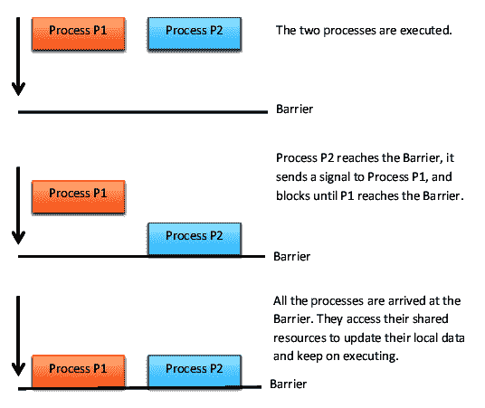

# 基于进程的并行性

在上一章中，我们学习了如何使用线程实现并发应用程序。本章将研究我们在[第 1 章](1.html)、*并行计算入门和 Python*中介绍的基于过程的方法。本章的重点是 Python`multiprocessing`模块。

Python`multiprocessing`模块是该语言标准库的一部分，它实现了共享内存编程范式，也就是说，对由*一个或多个可以访问共享内存的处理器*组成的系统进行编程。

在本章中，我们将介绍以下配方：

*   理解 Python 的`multiprocessing`模块
*   产生一个进程
*   命名进程
*   在后台运行进程
*   终止进程
*   在子类中定义进程
*   使用队列交换对象
*   使用管道交换对象
*   同步进程
*   管理进程之间的状态
*   使用进程池

# 理解 Python 的多处理模块

Python`multiprocessing`文档（[的介绍 https://docs.python.org/2.7/library/multiprocessing.html#introduction](https://docs.python.org/2.7/library/multiprocessing.html#introduction) 明确提到，此软件包中的所有功能都要求`main`模块可导入到子模块（[https://docs.python.org/3.3/library/multiprocessing.html](https://docs.python.org/3.3/library/multiprocessing.html) ）。

`__main__`模块不可导入 IDLE 中的子模块，即使您以 IDLE 文件的形式运行脚本也是如此。为了获得正确的结果，我们将从命令提示符运行所有示例：

```py
> python multiprocessing_example.py
```

这里，`multiprocessing_example.py`是剧本的名字。

# 产生一个进程

派生进程是从父进程*创建*子进程*。*后者异步继续执行或等待子进程结束。

# 准备

`multiprocessing`库通过以下步骤允许繁殖过程：

1.  *定义*该`process`对象。
2.  *调用*流程的`start()`方法来运行它。
3.  *调用*流程的`join()`方法。它等待进程完成作业，然后退出。

# 怎么做。。。

让我们看一下以下步骤：

1.  要创建流程，我们需要使用以下命令导入`multiprocessing`模块：

```py
import multiprocessing
```

2.  每个进程都与`myFunc(i)`功能相关联。此功能输出从`0`到`i`的编号，其中`i`是与流程编号关联的 ID：

```py
def myFunc(i):
    print ('calling myFunc from process n°: %s' %i)
    for j in range (0,i):
        print('output from myFunc is :%s' %j)

```

3.  然后，我们将带有`myFunc`的`process`对象定义为`target`函数：

```py
if __name__ == '__main__':
    for i in range(6):
        process = multiprocessing.Process(target=myFunc, args=(i,))
```

4.  最后，我们对创建的流程调用`start`和`join`方法：

```py
     process.start()
     process.join()
```

如果没有`join`方法，子进程不会结束，必须手动终止。

# 它是如何工作的。。。

因此，在本节中，我们了解了如何从父进程开始创建进程。此功能称为*生成进程*

Python 的`multiprocessing`库允许通过以下三个简单步骤轻松管理流程。第一步是通过`multiprocessing`类方法`Process`进行流程定义：

```py
process = multiprocessing.Process(target=myFunc, args=(i,))
```

`Process`方法具有作为要生成的函数的参数的`myFunc`以及函数本身的任何参数。

执行和退出流程需要以下两个步骤：

```py
     process.start()
     process.join()
```

要运行该过程并显示结果，让我们打开命令提示符，最好是在包含示例文件（`spawning_processes.py`的同一文件夹中，然后键入以下命令：

```py
> python spawning_processes.py
```

对于创建的每个进程（总共有六个），都会显示目标函数的输出。请记住，这是一个从`0`到进程 ID 索引的简单计数器：

```py
calling myFunc from process n°: 0
calling myFunc from process n°: 1
output from myFunc is :0
calling myFunc from process n°: 2
output from myFunc is :0
output from myFunc is :1
calling myFunc from process n°: 3
output from myFunc is :0
output from myFunc is :1
output from myFunc is :2
calling myFunc from process n°: 4
output from myFunc is :0
output from myFunc is :1
output from myFunc is :2
output from myFunc is :3
calling myFunc from process n°: 5
output from myFunc is :0
output from myFunc is :1
output from myFunc is :2
output from myFunc is :3
output from myFunc is :4
```

# 还有更多。。。

这再次提醒我们在 main 部分中实例化`Process`对象的重要性：这是因为创建的子进程导入包含`target`函数的脚本文件。然后，通过实例化这个块中的`process`对象，我们可以防止这种实例化的无限递归调用。

有效的解决方法用于在不同的脚本中定义`target`函数，即`myFunc.py`：

```py
def myFunc(i):
    print ('calling myFunc from process n°: %s' %i)
    for j in range (0,i):
        print('output from myFunc is :%s' %j)
    return
```

包含流程实例的`main`程序在第二个文件（`spawning_processes_namespace.py`中定义：

```py
import multiprocessing
from myFunc import myFunc

if __name__ == '__main__':
    for i in range(6):
        process = multiprocessing.Process(target=myFunc, args=(i,))
        process.start()
        process.join()
```

要运行此示例，请键入以下命令：

```py
> python spawning_processes_names.py
```

输出与前面的示例相同。

# 另见

`multiprocessing`图书馆的官方指南可在[找到 https://docs.python.org/3/](https://docs.python.org/3/) 。

# 命名进程

在前面的示例中，我们确定了流程以及如何将变量传递给目标函数。但是，将名称与进程关联是非常有用的，因为调试应用程序需要对进程进行良好的标记和识别。

# 准备

在代码中的某个时刻，了解当前正在执行的进程可能是至关重要的。为此，`multiprocessing`库提供了`current_process()`方法，该方法使用`name`属性来标识当前正在运行的进程。在下一节中，我们将了解此主题。

# 怎么做。。。

让我们执行以下步骤：

1.  两个进程的`target`函数都是`myFunc`函数。通过评估`multiprocessing.current_process().name`方法输出流程名称：

```py
import multiprocessing
import time

def myFunc():
    name = multiprocessing.current_process().name
    print ("Starting process name = %s \n" %name)
    time.sleep(3)
    print ("Exiting process name = %s \n" %name)
```

2.  然后，我们通过实例化`name`参数和`process_with_default_name`来创建`process_with_name`：

```py
if __name__ == '__main__':
    process_with_name = multiprocessing.Process\
                        (name='myFunc process',\
                          target=myFunc)

    process_with_default_name = multiprocessing.Process\
                                (target=myFunc)
```

3.  最后，启动并加入流程：

```py
    process_with_name.start()
    process_with_default_name.start()
    process_with_name.join()
    process_with_default_name.join()
```

# 它是如何工作的。。。

在`main`程序中，使用相同的目标函数`myFunc`创建进程。此函数只打印进程名称。

要运行该示例，请打开命令提示符并键入以下命令：

```py
> python naming_processes.py
```

输出如下所示：

```py
Starting process name = myFunc process
Starting process name = Process-2

Exiting process name = Process-2
Exiting process name = myFunc process
```

# 还有更多。。。

Python 主进程为`multiprocessing.process._MainProcess`，子进程为`multiprocessing.process.Process`。只需键入以下内容即可对其进行测试：

```py
>>> import multiprocessing
>>> multiprocessing.current_process().name
'MainProcess'
```

# 另见

有关此主题的更多信息，请访问[https://doughellmann.com/blog/2012/04/30/determining-the-name-of-a-process-from-python/](https://doughellmann.com/blog/2012/04/30/determining-the-name-of-a-process-from-python/) 。

# 在后台运行进程

后台运行是一种典型的执行模式，某些程序不需要用户在场或干预，并且可能与其他程序的执行同时进行（因此，只有在多任务系统中才可能），导致用户不知道。后台程序通常执行长时间或耗时的任务，如对等文件共享程序或文件系统碎片整理。许多操作系统进程也在后台运行。

在 Windows 中，此模式下的程序（扫描用户或操作系统更新）通常会在系统托盘（桌面上靠近系统时钟的区域）中放置一个图标，以显示其活动，并采取减少资源使用的行为，从而不干扰用户的交互活动，例如减速或造成中断。在 Unix 和类 Unix 系统中，在后台运行的进程称为**守护进程**。使用任务管理器可以突出显示所有正在运行的程序，包括后台运行的程序。

# 准备

`multiprocessing`模块允许通过 daemonic 选项运行后台进程。在以下示例中，定义了两个过程：

*   `background_process`其`daemon`参数设置为`True`
*   `NO_background_process`其`daemon`参数设置为`False`

# 怎么做。。。

在下面的示例中，我们实现了一个目标函数，即`foo`，如果子进程在**后台**，则显示`0`到`4`**之间的数字；否则，打印从`5`到`9`的数字：**

1.  让我们导入相关的库：

```py
import multiprocessing
import time
```

2.  然后，我们定义了`foo()`函数。如前所述，打印的数字取决于`name`参数的值：

```py
def foo():
    name = multiprocessing.current_process().name
    print ("Starting %s \n" %name)
    if name == 'background_process':
        for i in range(0,5):
            print('---> %d \n' %i)
        time.sleep(1)
    else:
        for i in range(5,10):
            print('---> %d \n' %i)
        time.sleep(1)
    print ("Exiting %s \n" %name)
```

3.  最后，我们定义了以下过程：`background_process`和`NO_background_process`。请注意，`daemon`参数是为两个过程设置的：

```py
if __name__ == '__main__':
    background_process = multiprocessing.Process\
                         (name='background_process',\
                          target=foo)
    background_process.daemon = True

    NO_background_process = multiprocessing.Process\
                            (name='NO_background_process',\
                             target=foo)

    NO_background_process.daemon = False

    background_process.start()
    NO_background_process.start()
```

# 它是如何工作的。。。

注意，只有流程的`daemon`参数定义了流程是否应该在后台运行。要运行此示例，请键入以下命令：

```py
> python run_background_processes.py
```

输出仅清楚地报告`NO_background_process`输出：

```py
Starting NO_background_process
---> 5

---> 6

---> 7

---> 8

---> 9
Exiting NO_background_process
```

输出将`background_process`的`daemon`参数设置更改为`False`：

```py
background_process.daemon = False
```

要运行此示例，请键入以下内容：

```py
C:\>python run_background_processes_no_daemons.py
```

输出报告了`background_process`和`NO_background_process`过程的执行情况：

```py
Starting NO_background_process
Starting background_process
---> 5

---> 0
---> 6

---> 1
---> 7

---> 2
---> 8

---> 3
---> 9

---> 4

Exiting NO_background_process
Exiting background_process
```

# 另见

有关如何在 Linux 后台运行 Python 脚本的代码片段，请参见[https://janakiev.com/til/python-background/](https://janakiev.com/til/python-background/) 。

# 终止进程

没有完美的软件，即使在最好的应用程序中，您也可以嵌套一个导致应用程序阻塞的错误，这就是为什么现代操作系统开发了几种方法来终止应用程序的进程，以便释放系统资源，并允许用户尽快将其用于其他操作。本节将向您展示如何在多处理应用程序中终止进程。

# 准备

使用`terminate`方法可以立即终止进程。此外，我们使用`is_alive`方法来跟踪进程是否处于活动状态。

# 怎么做。。。

以下步骤允许我们执行配方：

1.  让我们导入相关的库：

```py
import multiprocessing
import time
```

2.  然后，实现了一个简单的`target`函数。在本例中，`target`函数`foo()`打印第一个`10`数字：

```py
def foo():
    print ('Starting function')
    for i in range(0,10):
        print('-->%d\n' %i)
        time.sleep(1)
    print ('Finished function')
```

3.  在`main`程序中，我们通过`is_alive`方法创建了一个监控其生命周期的进程；然后，我们通过调用`terminate`来完成它：

```py
if __name__ == '__main__':
    p = multiprocessing.Process(target=foo)
    print ('Process before execution:', p, p.is_alive())
    p.start()
    print ('Process running:', p, p.is_alive())
    p.terminate()
    print ('Process terminated:', p, p.is_alive())
    p.join()
    print ('Process joined:', p, p.is_alive())
```

4.  然后，我们在流程结束时验证状态码，并读取`ExitCode`流程的属性：

```py
    print ('Process exit code:', p.exitcode)
```

5.  `ExitCode`的可能值如下：

*   `== 0`：未产生错误。
*   `> 0`：进程出错并退出该代码。
*   `< 0`：进程被终止，信号为`-1 * ExitCode`。

# 它是如何工作的。。。

示例代码由目标函数`foo()`组成，其任务是在屏幕上打印出第一个`10`整数。在`main`程序中，进程被执行，然后被`terminate`指令终止。然后加入该过程并确定`ExitCode`。

要运行代码，请键入以下命令：

```py
> python killing_processes.py
```

然后，我们得到以下输出：

```py
Process before execution: <Process(Process-1, initial)> False
Process running: <Process(Process-1, started)> True
Process terminated: <Process(Process-1, started)> True
Process joined: <Process(Process-1, stopped[SIGTERM])> False
Process exit code: -15
```

请注意，`ExitCode`代码的输出值等于`**-**15`。`-15`的负值表示子级被中断信号终止，中断信号由数字`15`标识。

# 另见

在 Linux 机器上，只需遵循[中的教程，就可以识别 Python 进程并将其终止 http://www.cagrimmett.com/til/2016/05/06/killing-rogue-python-processes.html](http://www.cagrimmett.com/til/2016/05/06/killing-rogue-python-processes.html) 。

# 在子类中定义进程

`multiprocessing`模块提供对流程管理功能的访问。在本节中，我们将学习如何在`multiprocessing.Process`类的子类中定义流程。

# 准备

要实现多处理自定义子类，我们需要执行以下操作：

*   *定义*一个`multiprocessing.Process`类的子类，重新定义`run()`方法。
*   如果需要，*重写*方法以添加附加参数。
*   *超控*启动时`Process`应该做什么的`run(self [,args])`方法。

一旦创建了新的`Process`子类，就可以创建它的一个实例，然后通过调用`start`方法开始，该方法将依次调用`run`方法。

# 怎么做。。。

只需考虑一个非常简单的例子，如下：

1.  首先导入相关库：

```py
import multiprocessing
```

2.  然后，定义一个子类`MyProcess`，仅覆盖`run`方法，该方法返回流程的名称：

```py
class MyProcess(multiprocessing.Process):

    def run(self):
        print ('called run method by %s' %self.name)
        return
```

3.  在`main`程序中，我们定义了`10`进程的一个子类：

```py
if __name__ == '__main__':
    for i in range(10):
        process = MyProcess()
        process.start()
        process.join()
```

# 它是如何工作的。。。

每个流程子类都由一个类表示，该类扩展了`Process`类并重写了`run()`方法。此方法是`Process`的起点：

```py
class MyProcess (multiprocessing.Process):
    def run(self):
        print ('called run method in process: %s' %self.name)
        return
```

在`main`程序中，我们创建了几个`MyProcess()`类型的对象，当调用`start()`方法时线程开始执行：

```py
p = MyProcess()
p.start()
```

`join()`命令只处理进程的终止。要从命令提示符下运行脚本，请键入以下命令：

```py
> python process_in_subclass.py
```

输出如下所示：

```py
called run method by MyProcess-1
called run method by MyProcess-2
called run method by MyProcess-3
called run method by MyProcess-4
called run method by MyProcess-5
called run method by MyProcess-6
called run method by MyProcess-7
called run method by MyProcess-8
called run method by MyProcess-9
called run method by MyProcess-10
```

# 还有更多。。。

在面向对象编程中，子类是从超类继承所有属性的类，无论它们是对象还是方法。子类的另一个名称是*派生类*。*继承*是指子类或派生类继承父类或超类属性的过程。

你可以把一个子类看作它的超类的一种特殊类型；事实上，它可以使用方法和/或属性，也可以通过*重写*来重新定义它们。

# 另见

有关类定义技术的更多信息，请参见[http://buildingskills.itmaybeahack.com/book/python-2.6/html/p03/p03c02_adv_class.html](http://buildingskills.itmaybeahack.com/book/python-2.6/html/p03/p03c02_adv_class.html) 。

# 使用队列交换数据

*队列*是**先进先出**（**FIFO**）类型的数据结构（第一个输入是第一个退出）。一个实际的例子是排队获得服务，如何在超市付款，或在理发店理发。理想情况下，您的服务顺序与您被呈现的顺序相同。这正是 FIFO 队列的工作方式。

# 准备

在本节中，我们将向您展示如何使用队列解决*生产者-消费者*问题，这是*进程同步*的经典示例。

**生产者-消费者**问题描述了两个*过程*：一个是*生产者*，另一个是*消费者*，共享**固定**大小的**公共****缓冲区**。

*生产者*的任务是生成数据并将其连续存入缓冲区。同时，*消费者*将使用生成的数据，不时将其从缓冲区中移除。问题是要确保如果缓冲区已满，生产者不会处理新数据；如果缓冲区为空，消费者不会查找数据。生产者的解决方案是，如果缓冲区已满，则暂停其执行。

消费者从缓冲区中取出物品后，生产者立即醒来并开始再次填充缓冲区。同样，如果缓冲区为空，消费者将暂停。一旦生产者将数据下载到缓冲区，消费者就会醒来。

# 怎么做。。。

此解决方案可以通过进程之间的通信策略、共享内存或消息传递来实现。不正确的解决方案可能导致死锁，其中两个进程都等待唤醒：

```py
import multiprocessing
import random
import time
```

让我们执行以下步骤：

1.  `producer`类负责使用`put`方法在队列中输入`10`项：

```py
class producer(multiprocessing.Process):
    def __init__(self, queue):
        multiprocessing.Process.__init__(self)
        self.queue = queue

    def run(self) :
        for i in range(10):
            item = random.randint(0, 256)
            self.queue.put(item) 
            print ("Process Producer : item %d appended \
                   to queue %s"\
                   % (item,self.name))
            time.sleep(1)
            print ("The size of queue is %s"\
                   % self.queue.qsize())
```

2.  `consumer`类的任务是从队列中移除项目（使用`get`方法）并验证队列是否为空。如果发生这种情况，`while`循环内的流以一条`break`语句结束：

```py
class consumer(multiprocessing.Process):
    def __init__(self, queue):
        multiprocessing.Process.__init__(self)
        self.queue = queue

    def run(self):
        while True:
            if (self.queue.empty()):
                print("the queue is empty")
                break
            else :
                time.sleep(2)
                item = self.queue.get()
                print ('Process Consumer : item %d popped \
                        from by %s \n'\
                       % (item, self.name))
                time.sleep(1)
```

3.  `multiprocessing`类在`main`程序中实例化了其`queue`对象：

```py
if __name__ == '__main__':
        queue = multiprocessing.Queue()
        process_producer = producer(queue)
        process_consumer = consumer(queue)
        process_producer.start()
        process_consumer.start()
        process_producer.join()
        process_consumer.join()
```

# 它是如何工作的。。。

在`main`程序中，我们使用`multiprocessing.Queue`对象定义队列。然后，它作为参数传递给`producer `和`consumer`进程：

```py
        queue = multiprocessing.Queue()
        process_producer = producer(queue)
        process_consumer = consumer(queue)
```

在`producer`类中，`queue.put`方法用于将新项目追加到队列中：

```py
self.queue.put(item) 
```

在`consumer`类中，使用`queue.get`方法将*p*项目采购出来：

```py
self.queue.get()
```

通过键入以下命令来执行代码：

```py
> python communicating_with_queue.py
```

以下输出报告了生产者和消费者之间的交互：

```py
Process Producer : item 79 appended to queue producer-1
The size of queue is 1
Process Producer : item 50 appended to queue producer-1
The size of queue is 2
Process Consumer : item 79 popped from by consumer-2
Process Producer : item 33 appended to queue producer-1
The size of queue is 2
Process Producer : item 57 appended to queue producer-1
The size of queue is 3
Process Producer : item 227 appended to queue producer-1
Process Consumer : item 50 popped from by consumer-2
The size of queue is 3
Process Producer : item 98 appended to queue producer-1
The size of queue is 4
Process Producer : item 64 appended to queue producer-1
The size of queue is 5
Process Producer : item 182 appended to queue producer-1
Process Consumer : item 33 popped from by consumer-2
The size of queue is 5
Process Producer : item 206 appended to queue producer-1
The size of queue is 6
Process Producer : item 214 appended to queue producer-1
The size of queue is 7
Process Consumer : item 57 popped from by consumer-2
Process Consumer : item 227 popped from by consumer-2
Process Consumer : item 98 popped from by consumer-2
Process Consumer : item 64 popped from by consumer-2
Process Consumer : item 182 popped from by consumer-2
Process Consumer : item 206 popped from by consumer-2
Process Consumer : item 214 popped from by consumer-2
the queue is empty
```

# 还有更多。。。

队列具有`JoinableQueue`子类。这提供了以下方法：

*   `task_done()`：此方法表示任务完成，例如，使用`get()`方法从队列中提取项目后。因此，`task_done()`必须仅由队列使用者使用。
*   `join()`：此方法阻止处理，直到队列中的所有项目都完成并处理完毕。

# 另见

有关如何使用队列的良好教程，请访问[https://www.pythoncentral.io/use-queue-beginners-guide/](https://www.pythoncentral.io/use-queue-beginners-guide/) 。

# 使用管道交换对象

*管道*执行以下操作：

*   它返回一对由管道连接的连接对象。
*   每个连接对象都必须发送/接收方法以在进程之间进行通信。

# 准备

`multiprocessing`库允许您使用`multiprocessing.Pipe (duplex)`函数实现管道数据结构。这将返回一对表示管道末端的对象`(conn1, conn2)`。

`duplex`参数决定最后一种情况下的管道是双向的（即`duplex = True`），还是单向的（即`duplex = False`。`conn1`只能用于接收消息，`conn2`只能用于发送消息

现在，让我们看看如何使用管道交换对象。

# 怎么做。。。

下面是一个简单的管道示例。我们有一个从`0`到`9`输出数字的工艺管道，还有一个取数字并将其平方的工艺管道：

1.  让我们导入`multiprocessing`库：

```py
import multiprocessing
```

2.  `pipe`函数返回一对由*双向*管道连接的连接对象。示例中，`out_pipe`包含由`create_items`的`target`函数生成的`0`到`9`之间的数字：

```py
def create_items(pipe):
    output_pipe, _ = pipe
    for item in range(10):
        output_pipe.send(item)
    output_pipe.close()
```

3.  `multiply_items`功能基于两条管道`pipe_1`和`pipe_2`：

```py
 def multiply_items(pipe_1, pipe_2):
    close, input_pipe = pipe_1
    close.close()
    output_pipe, _ = pipe_2
    try:
        while True:
            item = input_pipe.recv()
```

4.  此函数返回每个管道元素的乘积：

```py
           output_pipe.send(item * item)
 except EOFError:
        output_pipe.close()
```

5.  在`main`程序中，定义了`pipe_1`和`pipe_2`：

```py
if __name__== '__main__':
```

6.  首先，处理编号从`0`到`9`的`pipe_1`：

```py
    pipe_1 = multiprocessing.Pipe(True)
    process_pipe_1 = \
                   multiprocessing.Process\
                   (target=create_items, args=(pipe_1,))
    process_pipe_1.start()
```

7.  然后，处理`pipe_2`，从`pipe_1`中提取数字并将其平方：

```py
    pipe_2 = multiprocessing.Pipe(True)
    process_pipe_2 = \
                   multiprocessing.Process\
                   (target=multiply_items, args=(pipe_1, pipe_2,))
    process_pipe_2.start()
```

8.  关闭流程：

```py
    pipe_1[0].close()
    pipe_2[0].close()
```

9.  打印结果：

```py
    try:
        while True:
            print (pipe_2[1].recv())
    except EOFError:
        print("End")
```

# 它是如何工作的。。。

本质上，两个管道`pipe_1`和`pipe_2`是由`multiprocessing.Pipe(True)`语句创建的：

```py
pipe_1 = multiprocessing.Pipe(True)
pipe_2 = multiprocessing.Pipe(True)
```

第一个管道`pipe_1`只是创建了一个从`0`到`9`的整数列表，而第二个管道`pipe_2`处理了`pipe_1`创建的列表中的每个元素，计算每个元素的平方值：

```py
process_pipe_2 = \
                   multiprocessing.Process\
                   (target=multiply_items, args=(pipe_1, pipe_2,))
```

因此，这两个过程都是关闭的：

```py
pipe_1[0].close()
pipe_2[0].close()
```

最终结果打印出来：

```py
print (pipe_2[1].recv())
```

通过键入以下命令来执行代码：

```py
> python communicating_with_pipe.py
```

以下结果显示了前`9`位的平方：

```py
0
1
4
9
16
25
36
49
64
81
```

# 还有更多。。。

如果您需要两个以上的点进行沟通，则使用`Queue()`方法。但是，如果您需要绝对性能，那么`Pipe()`方法要快得多，因为`Queue()`构建在`Pipe()`**之上。**

# 另见

有关 Python 和管道的更多信息，请访问[https://www.python-course.eu/pipes.php](https://www.python-course.eu/pipes.php%0d) 。

# 同步进程

多个进程可以协同工作以执行给定的任务。通常，他们共享数据。重要的是，通过各种进程访问共享数据不会产生不一致的数据。因此，通过共享数据进行协作的流程必须以有序的方式进行操作，以便能够访问该数据。同步原语与库和线程中遇到的同步原语非常相似。

同步原语如下所示：

*   **锁定**：该对象可以处于锁定状态，也可以处于解锁状态。锁定对象有两种方法来管理对共享资源的访问，`acquire()`和`release()`。
*   **事件**：该对象实现进程间的简单通信；一个进程发出事件信号，其他进程等待它。事件对象有两种方法`set()`和`clear()`来管理自己的内部标志。
*   **条件**：此对象用于在顺序或并行流程中同步工作流的各个部分。它有两种基本方法：`wait()`用于等待条件，`notify_all()`用于传达所应用的条件。
*   **信号量**：用于共享公共资源，例如支持固定数量的同时连接。
*   **RLock**：定义*递归锁*对象。RLock 的方法和功能与`threading`模块相同。
*   **障碍**：这将程序分为多个阶段，因为它需要所有进程在任何进程开始之前到达障碍。屏障后执行的代码不能与屏障前执行的代码并发。

# 准备

Python 中的*Barrier*对象用于等待固定数量线程的执行完成，然后给定线程才能继续执行程序。

下面的示例演示如何将同步任务与`barrier()`对象同步。

# 怎么做。。。

让我们考虑四个过程，其中过程过程 T0 和过程 T1 是由一个屏障语句管理的。

为此，请执行以下步骤：

1.  导入相关库：

```py
import multiprocessing
from multiprocessing import Barrier, Lock, Process
from time import time
from datetime import datetime
```

2.  `test_with_barrier`功能执行屏障的**`wait()`**方法：

```py
def test_with_barrier(synchronizer, serializer):
    name = multiprocessing.current_process().name
    synchronizer.wait()
    now = time()
```

3.  当两个进程调用`wait()`方法时，它们同时被释放：

```py
with serializer:
    print("process %s ----> %s" \
        %(name,datetime.fromtimestamp(now)))

def test_without_barrier():
    name = multiprocessing.current_process().name
    now = time()
    print("process %s ----> %s" \
        %(name ,datetime.fromtimestamp(now)))
```

4.  在`main`程序中，我们创建了四个流程。但是，我们还需要一个屏障和锁原语。`Barrier`语句中的`2`参数表示要管理的进程总数：

```py
if __name__ == '__main__':
    synchronizer = Barrier(2)
    serializer = Lock()
    Process(name='p1 - test_with_barrier'\
            ,target=test_with_barrier,\
            args=(synchronizer,serializer)).start()
    Process(name='p2 - test_with_barrier'\
            ,target=test_with_barrier,\
            args=(synchronizer,serializer)).start()
    Process(name='p3 - test_without_barrier'\
            ,target=test_without_barrier).start()
    Process(name='p4 - test_without_barrier'\
            ,target=test_without_barrier).start()
```

# 它是如何工作的。。。

`Barrier`对象提供了一种 Python 同步技术，通过这种技术，单个或多个线程可以等到一组活动中的某个点，然后一起进行

在`main`程序中，通过以下语句定义`Barrier`对象（即`synchronizer`：

```py
synchronizer = Barrier(2)
```

请注意，括号内的数字`2`表示屏障应等待的进程数。

然后，我们实现了一组四个进程，但只针对`p1`和`p2`进程。注意，`synchronizer`作为参数传递：

```py
Process(name='p1 - test_with_barrier'\
            ,target=test_with_barrier,\
            args=(synchronizer,serializer)).start()
Process(name='p2 - test_with_barrier'\
            ,target=test_with_barrier,\
            args=(synchronizer,serializer)).start()
```

实际上，在`test_with_barrier`函数的主体中，为了同步进程，使用了屏障的`wait()`方法：

```py
synchronizer.wait()
```

通过运行脚本，我们可以看到`p1`和`p2`进程打印出与预期相同的时间戳：

```py
> python processes_barrier.py
process p4 - test_without_barrier ----> 2019-03-03 08:58:06.159882
process p3 - test_without_barrier ----> 2019-03-03 08:58:06.144257
process p1 - test_with_barrier ----> 2019-03-03 08:58:06.175505
process p2 - test_with_barrier ----> 2019-03-03 08:58:06.175505
```

# 还有更多。。。

下图显示了屏障如何与这两个过程一起工作：



Process management with a barrier

# 另见

请阅读[https://pymotw.com/2/multiprocessing/communication.html](https://pymotw.com/2/multiprocessing/communication.html) 了解更多进程同步示例。

# 使用进程池

进程池机制允许跨多个输入值并行执行一个函数，在进程之间分配*输入数据。因此，进程池允许实现所谓的**数据并行**这是基于数据通过并行处理数据的不同进程的分布。*

# 准备

`multiprocessing`库为简单的并行处理任务提供`Pool`类。

`Pool`类有以下方法：

*   `apply()`：这将一直阻止，直到结果准备就绪。
*   `apply_async()`：这是`apply()`（[的变体 https://docs.python.org/2/library/functions.html#apply](https://docs.python.org/2/library/functions.html#apply) ）方法，返回结果对象。这是一个异步操作，在执行所有子类之前不会锁定主线程。
*   `map()`：这是内置`map()`（[的并行等价物 https://docs.python.org/2/library/functions.html#map](https://docs.python.org/2/library/functions.html#map) 功能。这会一直阻塞，直到结果准备就绪，并将 iterable 数据分成若干块，作为单独的任务提交给流程池。
*   `map_async()`：这是`map()`（[的变体 https://docs.python.org/2/library/multiprocessing.html?highlight=pool%20class#multiprocessing.pool.multiprocessing.Pool.map](https://docs.python.org/2/library/multiprocessing.html?highlight=pool%20class#multiprocessing.pool.multiprocessing.Pool.map) 方法，返回一个`result`对象。如果指定了回调，那么它应该是可调用的，它只接受一个参数。当结果准备就绪时，将对其应用回调（除非调用失败）。应立即完成回调；否则，处理结果的线程将被阻塞。

# 怎么做…

此示例演示如何实现进程池以执行并行应用程序。我们创建了一个包含四个进程的池，然后使用池的`map`方法执行一个简单的功能：

1.  导入`multiprocessing`库：

```py
import multiprocessing
```

2.  `Pool`方法对输入元素应用`function_square`进行简单计算：

```py
def function_square(data):
    result = data*data
    return result

if __name__ == '__main__':
```

3.  参数输入是从`0`到`100`的整数列表：

```py
    inputs = list(range(0,100))
```

4.  并行进程总数为`4`：

```py
    pool = multiprocessing.Pool(processes=4)
```

5.  `pool.map`方法作为单独的任务提交给流程池：

```py
    pool_outputs = pool.map(function_square, inputs)
    pool.close() 
    pool.join() 
```

6.  计算结果存储在`pool_outputs`中：

```py
    print ('Pool    :', pool_outputs)
```

需要注意的是，`pool.map()`方法的结果与 Python 内置的`map()`函数是等价的，只是进程是并行运行的。

# 它是如何工作的…

在这里，我们使用以下语句创建了一个由四个进程组成的池：

```py
  pool = multiprocessing.Pool(processes=4)
```

每个进程都有一个整数列表作为输入。此处，`pool.map`的工作方式与 map 相同，但使用多个进程，其编号为 4，之前在创建池时已定义：

```py
   pool_outputs = pool.map(function_square, inputs)
```

要终止池的计算，通常使用`close`和`join`函数：

```py
    pool.close() 
    pool.join() 
```

要执行此操作，请键入以下命令：

```py
> python process_pool.py
```

这是我们完成计算后得到的结果：

```py
Pool : [0, 1, 4, 9, 16, 25, 36, 49, 64, 81, 100, 121, 144, 169, 196, 225, 256, 289, 324, 361, 400, 441, 484, 529, 576, 625, 676, 729, 784, 841, 900, 961, 1024, 1089, 1156, 1225, 1296, 1369, 1444, 1521, 1600, 1681, 1764, 1849, 1936, 2025, 2116, 2209, 2304, 2401, 2500, 2601, 2704, 2809, 2916, 3025, 3136, 3249, 3364, 3481, 3600, 3721, 3844, 3969, 4096, 4225, 4356, 4489, 4624, 4761, 4900, 5041, 5184, 5329, 5476, 5625, 5776, 5929, 6084, 6241, 6400, 6561, 6724, 6889, 7056, 7225, 7396, 7569, 7744, 7921, 8100, 8281, 8464, 8649, 8836, 9025, 9216, 9409, 9604, 9801]
```

# 还有更多。。。

在前面的示例中，我们看到`Pool`还提供了`map`方法，它允许我们将函数应用于不同的数据集。具体而言，对输入元素并行执行相同操作的场景称为***数据并行*。**

 **在下面的示例中，我们使用`Pool`和`map`，与`5`工作者一起创建`pool`，并通过`map`方法*将`f`的函数应用于`10`元素列表：*

 *```py
from multiprocessing import Pool

def f(x):
    return x+10

if __name__ == '__main__':
     p=Pool(processes=5)
     print(p.map(f, [1, 2, 3,5,6,7,8,9,10]))
```

结果如下：

```py
11 12 13 14 15 16 17 18 19 20
```

# 另见

要了解有关进程池的更多信息，请使用以下链接：[https://www.tutorialspoint.com/concurrency_in_python/concurrency_in_python_pool_of_processes.htm](https://www.tutorialspoint.com/concurrency_in_python/concurrency_in_python_pool_of_processes.htm) 。***