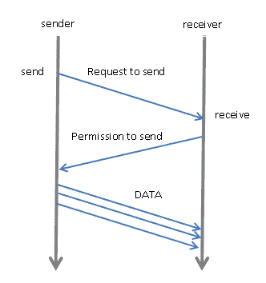
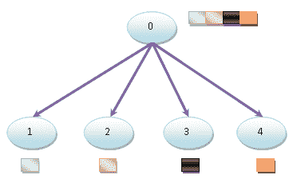
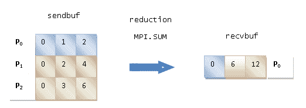
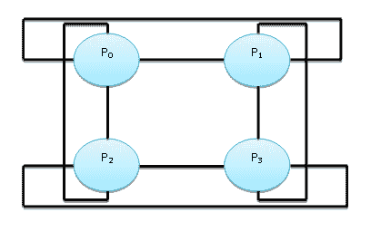

# 消息传递

本章将简要介绍**消息传递接口**（**MPI**），这是一种消息交换规范。MPI 的主要目标是为消息交换通信建立一个高效、灵活和可移植的标准。

我们将主要展示库的功能，其中包括同步和异步通信原语，如（发送/接收）和（广播/全部到全部）、合并部分计算结果的操作（收集/减少），以及进程之间的同步原语（屏障）。

此外，还将通过定义拓扑来展示通信网络的控制功能。

在本章中，我们将介绍以下配方：

*   使用`mpi4py`Python 模块
*   实现点对点通信
*   避免死锁问题
*   使用广播的集体通信
*   使用`scatter`功能进行集体通信
*   使用*`gather`功能进行集体通信*
**   使用`Alltoall`进行集体沟通*   还原操作*   优化沟通*

 *# 技术要求

本章需要`mpich`和`mpi4py`库

`mpich`库是 MPI 的可移植实现。它是免费软件，可用于各种版本的 Unix（包括 Linux 和 macOS）和 Microsoft Windows

要安装`mpich`，请使用从下载页面下载的安装程序（[http://www.mpich.org/static/downloads/1.4.1p1/](http://www.mpich.org/static/downloads/1.4.1p1/) 。此外，确保在 32 位或 64 位版本之间进行选择，以获得适合您机器的版本。

`mpi4py`Python 模块为 MPI（[提供 Python 绑定 https://www.mpi-forum.org](https://www.mpi-forum.org) 标准。它是在 MPI-1／2/3 规范之上实现的，它公开了一个基于标准的 MPI-2 C++绑定的 API。

`mpi4py`在 Windows 机器上的安装步骤如下：

```py
C:>pip install mpi4py
```

Anaconda 用户必须键入以下内容：

```py
C:>conda install mpi4py
```

请注意，对于本章中的所有示例，我们使用了通过使用`pip`安装程序安装的`mpi4py`

这意味着用于运行`mpi4py`示例的符号如下：

```py
C:>mpiexec -n x python mpi4py_script_name.py 
```

`mpiexec`命令是启动并行作业的典型方式：`x`是要使用的进程总数，`mpi4py_script_name.py`是要执行的脚本的名称。

# 理解 MPI 结构

MPI 标准定义了用于管理虚拟拓扑、同步和进程间通信的原语。有几种 MPI 实现在支持的标准版本和功能上有所不同。

我们将通过 Python`mpi4py`库介绍 MPI 标准。

在 20 世纪 90 年代之前，为不同的体系结构编写并行应用程序比今天更困难。许多图书馆为这一过程提供了便利，但并没有一种标准的方法。当时，大多数并行应用程序都是为科学研究环境设计的。

各种库最常用的模型是消息传递模型，在该模型中，进程之间的通信通过消息交换进行，而不使用共享资源。例如，主进程只需发送一条描述要完成的工作的消息，即可将作业分配给从进程。第二个非常简单的示例是执行合并排序的并行应用程序。数据被本地排序到进程，结果被传递到将处理合并的其他进程。

由于这些库在很大程度上使用了相同的模型，尽管彼此之间存在微小的差异，因此各个库的作者在 1992 年开会定义了一个用于消息交换的标准接口，MPI 由此诞生。这个接口必须允许程序员在大多数并行体系结构上编写可移植的并行应用程序，使用他们已经使用过的相同特性和模型。

最初，MPI 是为分布式内存体系结构设计的，它在 20 年前开始流行：


The distributed memory architecture schema

随着时间的推移，分布式内存系统开始相互结合，形成了具有分布式/共享内存的混合系统：


The hybrid system architecture schema

如今，MPI 运行在分布式内存、共享内存和混合系统上。然而，编程模型仍然是分布式内存，尽管执行计算的真正体系结构可能不同。

MPI 的优势可以总结如下：

*   **标准化**：由所有**高性能****计算**（**HPC**平台支持。
*   **可移植性**：应用于源代码的更改非常小，如果您决定在同样支持相同标准的不同平台上使用该应用程序，这一点非常有用。
*   **性能**：制造商可以针对特定类型的硬件创建优化的实现，并获得更好的性能。
*   **功能**：MPI-3 中定义了 440 多个例程，但使用少于 10 个例程可以编写许多并行程序。

在以下几节中，我们将研究用于消息传递的主要 Python 库：`mpi4py`库。

# 使用 mpi4pypython 模块

Python 编程语言提供了几个 MPI 模块来编写并行程序。其中最有趣的是`mpi4py`图书馆。它是在 MPI-1／2 规范之上构建的，提供了一个面向对象的接口，它紧跟 MPI-2 C++绑定。C MPI 用户可以在不学习新接口的情况下使用此模块。因此，它被广泛用作 Python 中几乎完整的 MPI 库包。

本章将介绍该模块的主要应用如下：

*   点对点通信
*   集体交流
*   拓扑

# 怎么做。。。

让我们通过检查在每个实例化的进程上打印短语`Hello, world!`的程序的经典代码，开始我们的 MPI 库之旅：

1.  导入`mpi4py`库：

```py
from mpi4py import MPI 
```

In MPI, the processes involved in the execution of a parallel program are identified by a sequence of non-negative integers called **ranks**.

2.  如果我们有一些（*p*进程）运行一个程序，那么这些进程将有一个从*0*到*p*-1 的`rank`。特别是，为了评估每个进程的排名，我们必须特别使用`COMM_WORLD`MPI 函数。此函数称为**通信器**，因为它定义了自己的一组可以一起通信的所有进程：

```py
 comm = MPI.COMM_WORLD 
```

3.  最后，下面的`Get_rank()`函数返回调用它的进程的`rank`：

```py
rank = comm.Get_rank() 
```

4.  一经评估，`rank`被打印：

```py
print ("hello world from process ", rank)  
```

# 它是如何工作的。。。

根据 MPI 执行模型，我们的应用程序由*N*（本例中为 5 个）自治进程组成，每个进程都有自己的本地内存，能够通过消息交换来通信数据。

通信器定义了一组可以相互通信的进程。此处使用的`MPI_COMM_WORLD`工作是默认的通信器，包括所有进程。

过程的识别基于等级。为每个流程所属的每个通信器分配一个等级。秩是分配的整数，从零开始，标识特定通信器上下文中的每个进程。通常的做法是将全局排名为*0*的流程定义为主流程。通过排名，开发人员可以指定发送进程是什么，而接收方进程是什么。

需要注意的是，仅出于说明目的，`stdout`输出并不总是有序的，因为多个进程可以通过在屏幕上写入而同时应用，并且操作系统可以任意选择顺序。因此，我们已经准备好进行一个基本的观察：参与 MPI 执行的每个进程都运行相同的编译二进制文件，因此每个进程都接收相同的要执行的指令。

要执行代码，请键入以下命令行：

```py
C:>mpiexec -n 5 python helloworld_MPI.py 
```

这是执行此代码后我们将得到的结果（请注意，进程*的执行顺序不是顺序的*：

```py
hello world from process  1 
hello world from process  0 
hello world from process  2 
hello world from process  3
hello world from process  4
```

It should be noted that the number of processes to be used is strictly dependent on the characteristics of the machine on which the program must run.

# 还有更多。。。

MPI 属于**单程序多数据**（**SPMD**编程技术。

SPMD 是一种编程技术，其中所有进程执行相同的程序，每个进程对不同的数据执行相同的程序。不同进程之间的执行差异是通过基于进程的局部等级区分程序流来实现的。

SPMD 是一种编程技术，其中单个程序由多个进程同时执行，但每个进程可以对不同的数据进行操作。同时，这些进程可以执行相同的指令，也可以执行不同的指令。显然，程序将包含适当的指令，只允许执行部分代码和/或对数据子集进行操作。这可以使用不同的编程模型实现，并且所有可执行文件都可以同时启动。

# 另见

`mpi4py`库的完整参考可在[中找到 https://mpi4py.readthedocs.io/en/stable/](https://mpi4py.readthedocs.io/en/stable/) 。

# 实现点对点通信

点对点操作包括两个进程之间的消息交换。在一个完美的世界中，每个发送操作都将与相应的接收操作完全同步。显然，情况并非如此，当发送方和接收方进程不同步时，MPI 实现必须能够保留发送的数据。通常，这是使用缓冲区实现的，缓冲区对开发人员是透明的，并且完全由`mpi4py`库管理。

`mpi4py`Python 模块通过两个功能实现点对点通信：

*   `Comm.Send(data, process_destination)`：此函数将数据发送到目标进程，目标进程由其在 communicator 组中的排名标识。
*   `Comm.Recv(process_source)`：此功能从采购流程接收数据，采购流程也通过其在 communicator 组中的排名进行标识。

`Comm`参数是*通信器*的缩写，它定义了可以使用`comm = MPI.COMM_WORLD`通过消息传递进行通信的一组进程。

# 怎么做。。。

在下面的示例中，我们将利用`comm.send`和`comm.recv`指令在不同进程之间交换消息：

1.  导入相关的`mpi4py`库：

```py
from mpi4py import MPI
```

2.  然后通过`MPI.COMM_WORLD`语句定义通信器参数`comm`：

```py
comm=MPI.COMM_WORLD 
```

3.  `rank`参数用于识别过程本身：

```py
rank = comm.rank 
```

4.  打印出流程的`rank`很有用：

```py
print("my rank is : " , rank) 
```

5.  然后，我们开始考虑过程的等级。在这种情况下，对于`rank`等于`0`的过程，我们设置要发送的`destination_process`和`data`（在这种情况下为`data = 10000000`：

```py
if rank==0: 
    data= 10000000 
    destination_process = 4 
```

6.  然后，通过使用`comm.send`语句，将先前设置的数据发送到目标进程：

```py
    comm.send(data,dest=destination_process) 
    print ("sending data %s " %data + \  
           "to process %d" %destination_process) 
```

7.  对于`rank`等于`1`的过程，`destination_process`值为`8`，发送的数据为`"hello"`字符串：

```py
if rank==1: 
    destination_process = 8 
    data= "hello" 
    comm.send(data,dest=destination_process) 
    print ("sending data %s :" %data + \  
           "to process %d" %destination_process) 
```

8.  `rank`等于`4`的过程是一个接收过程。实际上，源进程（即，`rank`等于`0`的进程）被设置为`comm.recv`语句中的一个参数：

```py
if rank==4: 
    data=comm.recv(source=0) 
```

9.  现在，使用以下代码，必须显示从`0`过程接收到的数据：

```py
    print ("data received is = %s" %data) 
```

10.  最后一个需要设置的流程是编号`9`。这里，我们将`rank`等于`1`的源进程定义为`comm.recv`语句中的一个参数：

```py
if rank==8: 
    data1=comm.recv(source=1) 
```

11.  然后打印`data1`值：

```py
 print ("data1 received is = %s" %data1) 
```

# 它是如何工作的。。。

我们运行该示例时，进程总数等于`9`。因此，在`comm`沟通组中，我们有九项任务可以相互沟通：

```py
comm=MPI.COMM_WORLD 
```

此外，为了识别组内的任务或流程，我们使用其`rank`值：

```py
rank = comm.rank 
```

我们有两个发送方进程和两个接收方进程，`rank`等于`0`的进程向`rank`等于`4`的接收方进程发送数值数据：

```py
if rank==0: 
    data= 10000000 
    destination_process = 4 
    comm.send(data,dest=destination_process) 
```

同样，我们必须指定`rank`的接收方进程等于`4`。我们还注意到，`comm.recv`语句必须包含发送方进程的排名作为参数：

```py
if rank==4: 
    data=comm.recv(source=0) 
```

对于其他发送方和接收方进程（分别为`rank`等于`1`的进程和`rank`等于`8`的进程），情况是相同的，唯一不同的是数据类型。

在本例中，对于发送方进程，我们有一个要发送的字符串：

```py
if rank==1: 
    destination_process = 8 
    data= "hello" 
    comm.send(data,dest=destination_process) 
```

对于`rank`等于`8`的接收方进程，指出发送方进程的排名：

```py
if rank==8: 
    data1=comm.recv(source=1) 
```

下图总结了`mpi4py`中的点对点通信协议：



The send/receive transmission protocol

如您所见，它描述了一个两步过程，包括从一个任务（*发送方*）发送一些**数据***，另一个任务（*接收方*接收该数据。发送任务必须指定要发送的数据及其目的地（*接收器*进程），而接收任务必须指定要接收的消息的来源。*

 *要运行脚本，我们将使用`9`进程：

```py
C:>mpiexec -n 9 python pointToPointCommunication.py 
```

这是运行脚本后将获得的输出：

```py
my rank is : 7
my rank is : 5
my rank is : 2
my rank is : 6
my rank is : 3
my rank is : 1
sending data hello :to process 8
my rank is : 0
sending data 10000000 to process 4
my rank is : 4
data received is = 10000000
my rank is : 8
data1 received is = hello 
```

# 还有更多。。。

`comm.send()`和`comm.recv()`函数是阻塞函数，这意味着它们会阻塞调用者，直到所涉及的缓冲数据能够安全使用为止。此外，在 MPI 中，有两种发送和接收消息的管理方法：

*   **缓冲模式**：待发送数据复制到缓冲区后，流控制立即返回程序。这并不意味着发送或接收消息。
*   **同步模式**：只有当相应的`receive`功能开始接收消息时，该功能才会终止。

# 另见

有关此主题的有趣教程，请访问[https://github.com/antolonappan/MPI_tutorial](https://github.com/antolonappan/MPI_tutorial) 。

# 避免死锁问题

我们面临的一个共同问题是僵局。在这种情况下，两个（或多个）进程相互阻塞，等待另一个进程执行服务于另一个进程的特定操作，反之亦然。`mpi4py`模块不提供任何特定功能来解决死锁问题，但是，为了避免死锁问题，开发人员必须遵循一些措施。

# 怎么做。。。

让我们首先分析下面的 Python 代码，它将引入一个典型的死锁问题。我们有两个进程-`rank`等于`1`和`rank`等于`5`，它们相互通信，并且都具有数据发送方和数据接收方功能：

1.  导入`mpi4py`库：

```py
from mpi4py import MPI 
```

2.  将通讯器定义为`comm`和`rank`参数：

```py
comm=MPI.COMM_WORLD 
rank = comm.rank 
print("my rank is %i" % (rank)) 
```

3.  `rank`等于`1`的进程从`rank`等于`5`的进程发送和接收数据：

```py
if rank==1: 
    data_send= "a" 
    destination_process = 5 
    source_process = 5 
    data_received=comm.recv(source=source_process) 
    comm.send(data_send,dest=destination_process) 
    print ("sending data %s " %data_send + \ 
           "to process %d" %destination_process) 
    print ("data received is = %s" %data_received) 
```

4.  同样，这里我们将`rank`的过程定义为`5`：

```py
if rank==5: 
    data_send= "b" 
```

5.  目的地和发送方进程等于`1`：

```py
    destination_process = 1 
    source_process = 1  
    comm.send(data_send,dest=destination_process) 
    data_received=comm.recv(source=source_process) 
    print ("sending data %s :" %data_send + \ 
           "to process %d" %destination_process) 
    print ("data received is = %s" %data_received) 
```

# 它是如何工作的。。。

如果我们尝试运行此程序（只使用两个进程执行它是有意义的），那么我们注意到这两个进程都无法继续：

```py
C:\>mpiexec -n 9 python deadLockProblems.py

my rank is : 8
my rank is : 6
my rank is : 7
my rank is : 2
my rank is : 4
my rank is : 3
my rank is : 0
my rank is : 1
sending data a to process 5
data received is = b
my rank is : 5
sending data b :to process 1
data received is = a
```

这两个进程都准备接收来自另一个进程的消息，并被卡在那里。这是因为`comm.recv()`MPI 函数和`comm.send()`MPI 阻塞了它们。这意味着调用过程将等待它们的完成。对于`comm.send()`MPI，完成发生在数据已发送时，并且可能在不修改消息的情况下被覆盖

当接收到数据并且可以使用时，`comm.recv()`MPI 完成。为了解决这个问题，第一个想法是将`comm.recv()`MPI 与`comm.send()`MPI 反转，如下所示：

```py
if rank==1: 
    data_send= "a" 
    destination_process = 5 
    source_process = 5 
    comm.send(data_send,dest=destination_process) 
    data_received=comm.recv(source=source_process) 

    print ("sending data %s " %data_send + \
           "to process %d" %destination_process)
    print ("data received is = %s" %data_received)

if rank==5: 
    data_send= "b" 
    destination_process = 1 
    source_process = 1 
    data_received=comm.recv(source=source_process) 
    comm.send(data_send,dest=destination_process) 

    print ("sending data %s :" %data_send + \
           "to process %d" %destination_process)
    print ("data received is = %s" %data_received)
```

这个解决方案，即使是正确的，也不能保证我们将避免死锁。实际上，通信是通过具有指令`comm.send()`的缓冲器执行的。

MPI 复制要发送的数据。此模式可以正常工作，但前提是缓冲区能够保留所有问题。如果没有发生这种情况，则会出现死锁：发送方无法完成数据发送，因为缓冲区正忙；接收方无法接收数据，因为数据被尚未完成的`comm.send()`MPI 调用阻塞。

此时，允许我们避免死锁的解决方案用于交换发送和接收函数，以使它们不对称：

```py
if rank==1: 
    data_send= "a" 
    destination_process = 5 
    source_process = 5 
    comm.send(data_send,dest=destination_process) 
    data_received=comm.recv(source=source_process) 

if rank==5: 
    data_send= "b" 
    destination_process = 1 
    source_process = 1 
    comm.send(data_send,dest=destination_process) 
    data_received=comm.recv(source=source_process) 
```

最后，我们得到了正确的输出：

```py
C:\>mpiexec -n 9 python deadLockProblems.py 

my rank is : 4
my rank is : 0
my rank is : 3
my rank is : 8
my rank is : 6
my rank is : 7
my rank is : 2
my rank is : 1
sending data a to process 5
data received is = b
my rank is : 5
sending data b :to process 1
data received is = a 
```

# 还有更多。。。

针对僵局提出的解决方案并不是唯一的解决方案。

例如，有一个函数将单个调用统一起来，该调用向给定进程发送消息并接收来自另一进程的另一消息。此函数称为`Sendrecv`：

```py
Sendrecv(self, sendbuf, int dest=0, int sendtag=0, recvbuf=None, int source=0, int recvtag=0, Status status=None) 
```

如您所见，所需参数与`comm.send()`和`comm.recv()`MPI 相同（在本例中，也是功能块）。然而，`Sendrecv`的优点是让通信子系统负责检查发送和接收之间的依赖关系，从而避免死锁。

这样，前一示例的代码将变为以下代码：

```py
if rank==1: 
    data_send= "a" 
    destination_process = 5 
    source_process = 5 
    data_received=comm.sendrecv(data_send,dest=\
                                destination_process,\ 
                                source =source_process) 
if rank==5: 
    data_send= "b" 
    destination_process = 1 
    source_process = 1 
    data_received=comm.sendrecv(data_send,dest=\ 
                                destination_process,\ 
                                source=source_process) 
```

# 另见

关于死锁管理导致并行编程困难的有趣分析，请参见[https://codewithoutrules.com/2017/08/16/concurrency-python/](https://codewithoutrules.com/2017/08/16/concurrency-python/) 。

# 使用广播的集体通信

在并行代码的开发过程中，我们经常发现自己处于这样一种情况：我们必须在多个进程之间共享运行时某个变量的值，或者每个进程提供的变量的某些操作（可能具有不同的值）。

为了解决这些类型的情况，使用了通信树（例如，进程 0 向进程 1 和进程 2 发送数据，进程 1 和进程 2 将分别负责向进程 3、4、5、6 等发送数据）。

相反，MPI 库提供的功能非常适合交换信息或使用多个进程，这些进程显然针对执行它们的机器进行了优化：


Broadcasting data from process 0 to processes 1, 2, 3, and 4

涉及属于通信器的所有进程的通信方法称为集体通信。因此，集体交流通常涉及两个以上的过程。然而，与此相反，我们将调用集体通信广播，其中单个进程向任何其他进程发送相同的数据。

# 准备

`mpi4py`广播功能通过以下方式提供：

```py
buf = comm.bcast(data_to_share, rank_of_root_process) 
```

此函数将消息进程根目录中包含的信息发送到属于`comm`通信器的每个其他进程。

# 怎么做。。。

现在我们来看一个例子，其中我们使用了`broadcast`函数。我们有一个根进程`rank`等于`0`，它与 communicator 组中定义的其他进程共享自己的数据`variable_to_share`：

1.  让我们导入`mpi4py`库：

```py
from mpi4py import MPI 
```

2.  现在，让我们定义通信器和`rank`参数：

```py
comm = MPI.COMM_WORLD 
rank = comm.Get_rank() 
```

3.  就`rank`等于`0`的过程而言，我们定义了要在其他过程之间共享的变量：

```py
if rank == 0: 
    variable_to_share = 100      
else: 
    variable_to_share = None 
```

4.  最后，我们定义了一个广播，`rank`过程等于零作为其`root`：

```py
variable_to_share = comm.bcast(variable_to_share, root=0) 
print("process = %d" %rank + " variable shared  = %d " \   
                               %variable_to_share) 
```

# 它是如何工作的。。。

`rank`等于`0`的根进程实例化了一个变量`variable_to_share`，该变量等于`100`。此变量将与通信组的其他进程共享：

```py
if rank == 0: 
   variable_to_share = 100  
```

为此，我们还引入了广播通信声明：

```py
variable_to_share = comm.bcast(variable_to_share, root=0) 
```

这里，函数中的参数如下所示：

*   要共享的数据（`variable_to_share`。
*   根进程，即秩等于 0 的进程（`root=0`。

运行代码，我们有一个由 10 个进程组成的通信组，`variable_to_share`在组中的其他进程之间共享。最后，`print`语句可视化了正在运行的进程的等级及其变量的值：

```py
print("process = %d" %rank + " variable shared  = %d " \   
                     %variable_to_share) 
```

设置`10`过程后，得到的输出如下：

```py
C:\>mpiexec -n 10 python broadcast.py 
process = 0 
variable shared = 100 
process = 8 
variable shared = 100 
process = 2 variable 
shared = 100 
process = 3 
variable shared = 100 
process = 4 
variable shared = 100 
process = 5 
variable shared = 100 
process = 9 
variable shared = 100 
process = 6 
variable shared = 100 
process = 1 
variable shared = 100 
process = 7 
variable shared = 100 
```

# 还有更多。。。

集体通信允许在组中的多个进程之间同时传输数据。`mpi4py`库提供集体通信，但仅在阻塞版本中提供（即，它阻塞调用方方法，直到所涉及的缓冲数据可以安全使用）。

最常用的集体通信操作如下：

*   跨集团流程的屏障同步
*   通信功能：
    *   将数据从一个进程广播到组中的所有进程
    *   将所有流程中的数据收集到一个流程中
    *   将数据从一个进程分散到所有进程
*   还原操作

# 另见

请参阅此链接（[https://nyu-cds.github.io/python-mpi/](https://nyu-cds.github.io/python-mpi/) 了解 Python 和 MPI 的完整介绍。

# 使用散射函数的集体通信

分散功能与分散广播非常相似，但有一个主要区别：`comm.bcast`向所有监听进程发送相同的数据，而`comm.scatter`可以向不同进程发送数组中的数据块。

下图说明了分散功能：



Scattering data from process 0 to processes 1, 2, 3, and 4

**`comm.scatter`**函数获取数组中的元素，并根据它们的等级将它们分配给进程，第一个元素将被发送给进程 0，第二个元素将被发送给进程 1，依此类推。**`mpi4py`**中实现的功能如下：

```py
recvbuf  = comm.scatter(sendbuf, rank_of_root_process) 
```

# 怎么做。。。

在下面的示例中，我们将看到如何使用`scatter`功能将数据分发到不同的进程：

1.  导入`mpi4py`库：

```py
from mpi4py import MPI 
```

2.  接下来，我们以通常的方式定义`comm`和`rank`参数：

```py
comm = MPI.COMM_WORLD 
rank = comm.Get_rank() 
```

3.  对于`rank`等于`0`的过程，将分散以下阵列：

```py
if rank == 0: 
    array_to_share = [1, 2, 3, 4 ,5 ,6 ,7, 8 ,9 ,10]  
else: 
    array_to_share = None 
```

4.  然后，`recvbuf`被设置。`root`过程是`rank`等于`0`的过程：

```py
recvbuf = comm.scatter(array_to_share, root=0) 
print("process = %d" %rank + " recvbuf = %d " %recvbuf) 
```

# 它是如何工作的。。。

`rank`等于`0`的进程将`array_to_share`数据结构分配给其他进程：

```py
array_to_share = [1, 2, 3, 4 ,5 ,6 ,7, 8 ,9 ,10] 
```

`recvbuf`参数表示通过`comm.scatter`语句发送给流程的*i<sup>th</sup>*变量的值：

```py
recvbuf = comm.scatter(array_to_share, root=0)
```

结果如下：

```py
C:\>mpiexec -n 10 python scatter.py 
process = 0 variable shared  = 1 
process = 4 variable shared  = 5 
process = 6 variable shared  = 7 
process = 2 variable shared  = 3 
process = 5 variable shared  = 6 
process = 3 variable shared  = 4 
process = 7 variable shared  = 8 
process = 1 variable shared  = 2 
process = 8 variable shared  = 9 
process = 9 variable shared  = 10 
```

我们还注意到，`comm.scatter`的限制之一是，您可以分散尽可能多的元素，就像您在执行语句中指定的处理器一样。事实上，如果您试图分散的元素多于指定的处理器（本例中为三个），则会出现类似以下错误：

```py
C:\> mpiexec -n 3 python scatter.py 
Traceback (most recent call last): 
  File "scatter.py", line 13, in <module> 
    recvbuf = comm.scatter(array_to_share, root=0) 
  File "Comm.pyx", line 874, in mpi4py.MPI.Comm.scatter 
  (c:\users\utente\appdata\local\temp\pip-build-h14iaj\mpi4py\
  src\mpi4py.MPI.c:73400) 
  File "pickled.pxi", line 658, in mpi4py.MPI.PyMPI_scatter 
  (c:\users\utente\appdata\local\temp\pip-build-h14iaj\mpi4py\src\
  mpi4py.MPI.c:34035) 
  File "pickled.pxi", line 129, in mpi4py.MPI._p_Pickle.dumpv 
  (c:\users\utente\appdata\local\temp\pip-build-h14iaj\mpi4py
  \src\mpi4py.MPI.c:28325) 
  ValueError: expecting 3 items, got 10 
  mpiexec aborting job... 

job aborted: 
rank: node: exit code[: error message] 
0: Utente-PC: 123: mpiexec aborting job 
1: Utente-PC: 123 
2: Utente-PC: 123 
```

# 还有更多。。。

`mpi4py`库提供了两个用于分散数据的其他功能：

*   `comm.scatter(sendbuf, recvbuf, root=0)`：此功能将数据从一个进程发送到通信器中的所有其他进程。
*   `comm.scatterv(sendbuf, recvbuf, root=0)`：此功能将数据从一个进程分散到给定组中的所有其他进程，这些进程在发送端提供不同数量的数据和位移。

`sendbuf`和`recvbuf`参数必须以列表的形式给出（如`comm.send`点到点函数）：

```py
buf = [data, data_size, data_type] 
```

这里，`data`必须是`data_size`大小和`data_type`类型的类似缓冲区的对象。

# 另见

一个关于 MPI 广播的有趣教程出现在[上 https://pythonprogramming.net/mpi-broadcast-tutorial-mpi4py/](https://pythonprogramming.net/mpi-broadcast-tutorial-mpi4py/) 。

# 使用聚集功能进行集体通信

`gather`函数与`scatter`函数相反。在这种情况下，所有进程都将数据发送到收集接收到的数据的根进程。

# 准备

在`mpi4py`中实现的`gather`功能如下：

```py
recvbuf  = comm.gather(sendbuf, rank_of_root_process) 
```

这里，`sendbuf`是发送的数据，`rank_of_root_process`代表所有数据的接收者的处理：


Gathering data from processes 1, 2, 3, and 4

# 怎么做。。。

在下面的示例中，我们将表示上图所示的条件，其中每个进程构建自己的数据，这些数据将被发送到用`rank`零标识的根进程：

1.  键入必要的导入：

```py
from mpi4py import MPI 
```

2.  接下来，我们定义以下三个参数。`comm`参数为通讯器，`rank`提供进程的等级，`size`为进程总数：

```py
comm = MPI.COMM_WORLD 
size = comm.Get_size() 
rank = comm.Get_rank() 
```

3.  在这里，我们定义从`rank`零的过程中收集的数据：

```py
data = (rank+1)**2 
```

4.  最后，通过`comm.gather`功能提供采集。另外，请注意，根进程（从其他进程收集数据的进程）是零秩进程：

```py
data = comm.gather(data, root=0) 
```

5.  对于`rank`等于`0`过程，采集的数据和发送过程打印出来：

```py
if rank == 0: 
    print ("rank = %s " %rank +\ 
          "...receiving data to other process") 
   for i in range(1,size): 
       value = data[i] 
       print(" process %s receiving %s from process %s"\ 
            %(rank , value , i)) 
```

# 它是如何工作的。。。

`0`的根进程从其他四个进程接收数据，如上图所示。

我们设置*n（=5）*进程发送数据：

```py
    data = (rank+1)**2  
```

如果流程的`rank`为`0`，则在数组中采集数据：

```py
if rank == 0: 
    for i in range(1,size): 
        value = data[i] 
```

取而代之的是，通过以下函数进行数据收集：

```py
data = comm.gather(data, root=0) 
```

最后，我们运行代码，将进程组设置为`5`：

```py
C:\>mpiexec -n 5 python gather.py
rank = 0 ...receiving data to other process
process 0 receiving 4 from process 1
process 0 receiving 9 from process 2
process 0 receiving 16 from process 3
process 0 receiving 25 from process 4 
```

# 还有更多。。。

为了收集数据，`mpi4py`提供以下功能：

*   集合到一个任务*：*`comm.Gather`、`comm.Gatherv`和`comm.gather`
*   集合到所有任务：`comm.Allgather`、`comm.Allgatherv`和`comm.allgather`

# 另见

有关`mpi4py`的更多信息，请访问[http://www.ceci-hpc.be/img/training/mpi4py.pdf](http://www.ceci-hpc.be/img/training/mpi4py.pdf) 。

# 使用 Alltoall 进行集体通信

`Alltoall`集体通信结合了`scatter`和`gather`功能。

# 怎么做。。。

在下面的示例中，我们将看到`comm.Alltoall`的`mpi4py`实现。我们将考虑一个通信器一组进程，每个进程从组中定义的其他进程发送和接收一个数字数据数组：

1.  对于本例，必须导入相关的`mpi4py`和`numpy`库：

```py
from mpi4py import MPI 
import numpy 
```

2.  如上例所示，我们需要设置相同的参数，`comm`、`size`和`rank`：

```py
comm = MPI.COMM_WORLD 
size = comm.Get_size() 
rank = comm.Get_rank() 
```

3.  因此，我们必须定义每个进程将发送的数据（`senddata`），同时从其他进程接收（`recvdata`：

```py
senddata = (rank+1)*numpy.arange(size,dtype=int) 
recvdata = numpy.empty(size,dtype=int) 
```

4.  最后执行`Alltoall`功能：

```py
comm.Alltoall(senddata,recvdata) 
```

5.  将显示为每个流程发送和接收的数据：

```py
print(" process %s sending %s receiving %s"\ 
      %(rank , senddata , recvdata)) 
```

# 它是如何工作的。。。

`comm.alltoall`方法从 task`j`的`sendbuf`参数中获取*i<sup>th</sup>*对象，并将其复制到 task`i`的`recvbuf`参数的*j<sup>th</sup>*对象中。

如果我们使用一组`5`进程运行代码，那么我们的输出如下：

```py
C:\>mpiexec -n 5 python alltoall.py 
process 0 sending [0 1 2 3 4] receiving [0 0 0 0 0] 
process 1 sending [0 2 4 6 8] receiving [1 2 3 4 5] 
process 2 sending [ 0 3 6 9 12] receiving [ 2 4 6 8 10] 
process 3 sending [ 0 4 8 12 16] receiving [ 3 6 9 12 15] 
process 4 sending [ 0 5 10 15 20] receiving [ 4 8 12 16 20] 
```

我们还可以通过使用以下模式找出发生了什么：


The Alltoall collective communication

我们对该模式的观察结果如下：

*   *P0*流程包含**01 2 3 4**数据数组，其中 0 分配给自身，1 分配给*P1*流程，2 分配给*P2*流程，3 分配给*P3*流程，4 分配给*P4*流程；
*   *P1*进程包含**02468**数据数组，其中它将 0 分配给*P0*进程，2 分配给自身，4 分配给*P2*进程，6 分配给*P3*进程，8 分配给*P4*进程；
*   *P2*流程包含**03 6 9 12**数据数组，其中将 0 分配给*P0*流程，3 分配给*P1*流程，6 分配给自身，9 分配给*P3*流程，12 分配给*P4*流程；
*   *P3*流程包含**0481216**数据数组，其中将 0 分配给*P0*流程，4 分配给*P1*流程，8 分配给*P2*流程，12 分配给自身，16 分配给*P4*流程；
*   *P4*进程包含**05101520**数据数组，其中它将 0 分配给*P0*进程，5 分配给*P1*进程，10 分配给*P2*进程，15 分配给*P3*进程，20 分配给自身。

# 还有更多。。。

`Alltoall`个性化通信也称为全交换。此操作用于各种并行算法，如快速傅立叶变换、矩阵转置、样本排序和一些并行数据库连接操作。

在`mpi4py`中，有*三种*类型的`Alltoall`集体交流：

*   `comm.Alltoall(sendbuf, recvbuf)`：`Alltoall`分散/聚集将数据从所有进程发送到组中的所有进程。
*   `comm.Alltoallv(sendbuf, recvbuf)`：`Alltoall`分散/聚集向量将数据从所有进程发送到组中的所有进程，提供不同数量的数据和位移。
*   `comm.Alltoallw(sendbuf, recvbuf)`：广义`Alltoall`通信允许每个合作伙伴使用不同的计数、位移和数据类型。

# 另见

MPI Python 模块的有趣分析可从[下载 https://www.duo.uio.no/bitstream/handle/10852/10848/WenjingLinThesis.pdf](https://www.duo.uio.no/bitstream/handle/10852/10848/WenjingLinThesis.pdf) 。

# 还原操作

与`comm.gather`类似，`comm.reduce`在每个进程中获取一个输入元素数组，并将一个输出元素数组返回给根进程。输出元素包含简化的结果。

# 准备

在`mpi4py`中，我们通过以下语句定义还原操作：

```py
comm.Reduce(sendbuf, recvbuf, rank_of_root_process, op = type_of_reduction_operation) 
```

我们必须注意，与`comm.gather`语句的区别在于`op`参数，这是您希望应用于数据的操作，`mpi4py`模块包含一组可以使用的简化操作

# 怎么做。。。

现在，我们将看到如何通过使用缩减功能，通过`MPI.SUM`缩减操作实现元素数组的总和。每个进程将操作一个大小为 10 的数组。

对于数组操作，我们使用`numpy`Python 模块提供的函数：

1.  在此，导入相关库`mpi4py`和`numpy`：

```py
import numpy 
from mpi4py import MPI  
```

2.  定义`comm`、`size`和`rank`参数：

```py
comm = MPI.COMM_WORLD  
size = comm.size  
rank = comm.rank 
```

3.  然后，设置阵列的大小（`array_size`：

```py
array_size = 10 
```

4.  要发送和接收的数据定义如下：

```py
recvdata = numpy.zeros(array_size,dtype=numpy.int) 
senddata = (rank+1)*numpy.arange(array_size,dtype=numpy.int) 
```

5.  流程发送器和发送的数据被打印出来：

```py
print(" process %s sending %s " %(rank , senddata)) 
```

6.  最后，执行`Reduce`操作。注意，`root`过程设置为`0`，而`op`参数设置为`MPI.SUM`：

```py
comm.Reduce(senddata,recvdata,root=0,op=MPI.SUM) 
```

7.  然后显示还原操作的输出，如下所示：

```py
print ('on task',rank,'after Reduce:    data = ',recvdata) 
```

# 它是如何工作的。。。

为了执行归约和，我们使用了`comm.Reduce`语句。此外，我们用`rank`零表示，这是包含`recvbuf`的`root`过程，表示计算的最终结果：

```py
comm.Reduce(senddata,recvdata,root=0,op=MPI.SUM) 
```

使用一组`10`进程运行代码是有意义的，因为这是被操纵数组的大小。

输出如下所示：

```py
C:\>mpiexec -n 10 python reduction.py 
  process 1 sending [ 0 2 4 6 8 10 12 14 16 18]
on task 1 after Reduce: data = [0 0 0 0 0 0 0 0 0 0]
 process 5 sending [ 0 6 12 18 24 30 36 42 48 54]
on task 5 after Reduce: data = [0 0 0 0 0 0 0 0 0 0]
 process 7 sending [ 0 8 16 24 32 40 48 56 64 72]
on task 7 after Reduce: data = [0 0 0 0 0 0 0 0 0 0]
 process 3 sending [ 0 4 8 12 16 20 24 28 32 36]
on task 3 after Reduce: data = [0 0 0 0 0 0 0 0 0 0]
 process 9 sending [ 0 10 20 30 40 50 60 70 80 90]
on task 9 after Reduce: data = [0 0 0 0 0 0 0 0 0 0]
 process 6 sending [ 0 7 14 21 28 35 42 49 56 63]
on task 6 after Reduce: data = [0 0 0 0 0 0 0 0 0 0]
 process 2 sending [ 0 3 6 9 12 15 18 21 24 27]
on task 2 after Reduce: data = [0 0 0 0 0 0 0 0 0 0]
 process 8 sending [ 0 9 18 27 36 45 54 63 72 81]
on task 8 after Reduce: data = [0 0 0 0 0 0 0 0 0 0]
 process 4 sending [ 0 5 10 15 20 25 30 35 40 45]
on task 4 after Reduce: data = [0 0 0 0 0 0 0 0 0 0]
 process 0 sending [0 1 2 3 4 5 6 7 8 9]
on task 0 after Reduce: data = [ 0 55 110 165 220 275 330 385 440 495] 
```

# 还有更多。。。

注意，使用`op=MPI.SUM`选项，我们将求和操作应用于列数组的所有元素。为了更好地理解缩减是如何操作的，让我们看下图：



Reduction in collective communication

发送操作如下所示：

*   **P0**进程发送[**01 2**数据数组。
*   **P1**进程发送[**024**数据数组。
*   **P2**进程发送[**03 6**数据数组。

归约操作将每个任务的*i<sup>th</sup>*元素相加，然后将结果放入**P0**根进程中数组的*i<sup>th</sup>*元素中。对于接收操作，**P0**进程接收[**0612**数据数组。

MPI 定义的一些缩减操作如下：

*   `MPI.MAX`：返回最大元素。
*   `MPI.MIN`：返回最小元素。
*   `MPI.SUM`：这是对要素的总结。
*   `MPI.PROD`：将所有元素相乘。
*   `MPI.LAND`：跨元素执行 AND 逻辑操作。
*   `MPI.MAXLOC`：返回最大值和拥有它的进程的排名。
*   `MPI.MINLOC`：返回最小值和拥有它的进程的等级。

# 另见

在[http://mpitutorial.com/tutorials/mpi-reduce-and-allreduce/](http://mpitutorial.com/tutorials/mpi-reduce-and-allreduce/) 你可以找到一个关于这个主题的很好的教程，还有更多。

# 优化沟通

MPI 提供的一个有趣的特性涉及虚拟拓扑。如前所述，所有通信功能（点对点或集体）都涉及一组过程。我们一直使用包含所有流程的`MPI_COMM_WORLD`组。对于属于大小为*n*的通信器的每个进程，它将*0*的等级分配给*n-1*。

但是，MPI 允许我们将虚拟拓扑分配给通信器。它定义了对不同进程的标签分配：通过构建虚拟拓扑，每个节点将只与其虚拟邻居通信，从而提高了性能，因为它减少了执行时间。

例如，如果秩是随机分配的，那么消息可能会在到达目的地之前被强制传递到许多其他节点。除了性能问题之外，虚拟拓扑确保代码更清晰、可读性更强。

MPI 提供了两种建筑拓扑。第一种构造创建笛卡尔拓扑，而后者创建任何类型的拓扑。具体来说，在第二种情况下，我们必须提供要构建的图的邻接矩阵。我们将只讨论笛卡尔拓扑，通过笛卡尔拓扑可以构建几种广泛使用的结构，例如网格、环形和环形。

用于创建笛卡尔拓扑的`mpi4py`函数如下：

```py
comm.Create_cart((number_of_rows,number_of_columns))
```

此处，`number_of_rows`和`number_of_columns`指定要生成的网格的行和列。

# 怎么做。。。

在下面的示例中，我们将看到如何实现大小为*M×N*的笛卡尔拓扑。此外，我们还定义了一组坐标，以了解如何处理所有流程：

1.  导入所有相关库：

```py
from mpi4py import MPI 
import numpy as np 
```

2.  定义以下参数以沿拓扑移动：

```py
UP = 0 
DOWN = 1 
LEFT = 2 
RIGHT = 3 
```

3.  对于每个进程，以下数组定义了相邻进程：

```py
neighbour_processes = [0,0,0,0] 
```

4.  在`main`程序中，定义`comm.rank`和`size`参数：

```py
if __name__ == "__main__": 
    comm = MPI.COMM_WORLD 
    rank = comm.rank 
    size = comm.size 
```

5.  现在，让我们构建拓扑：

```py
    grid_rows = int(np.floor(np.sqrt(comm.size))) 
    grid_column = comm.size // grid_rows 
```

6.  以下条件确保进程始终在拓扑中：

```py
    if grid_rows*grid_column > size: 
        grid_column -= 1 
    if grid_rows*grid_column > size: 
        grid_rows -= 1
```

7.  `rank`等于`0`过程开始拓扑构造：

```py
    if (rank == 0) : 
        print("Building a %d x %d grid topology:"\ 
              % (grid_rows, grid_column) ) 

    cartesian_communicator = \ 
                           comm.Create_cart( \ 
                               (grid_rows, grid_column), \ 
                               periods=(False, False), \
                               reorder=True) 
    my_mpi_row, my_mpi_col = \ 
                cartesian_communicator.Get_coords\ 
                ( cartesian_communicator.rank )  

    neighbour_processes[UP], neighbour_processes[DOWN]\ 
                             = cartesian_communicator.Shift(0, 1) 
    neighbour_processes[LEFT],  \ 
                               neighbour_processes[RIGHT]  = \ 
                               cartesian_communicator.Shift(1, 1) 
    print ("Process = %s
    \row = %s\n \ 
    column = %s ----> neighbour_processes[UP] = %s \ 
    neighbour_processes[DOWN] = %s \ 
    neighbour_processes[LEFT] =%s neighbour_processes[RIGHT]=%s" \ 
             %(rank, my_mpi_row, \ 
             my_mpi_col,neighbour_processes[UP], \ 
             neighbour_processes[DOWN], \ 
             neighbour_processes[LEFT] , \ 
             neighbour_processes[RIGHT])) 
```

# 它是如何工作的。。。

对于每个进程，输出应如下所示：如果为`neighbour_processes = -1`，则它没有拓扑接近性，否则，`neighbour_processes`将紧密显示进程的排名。

得到的拓扑是一个*2*×*2*的网格（网格表示参见上图），其大小等于输入中的进程数；即四个：

```py
grid_row = int(np.floor(np.sqrt(comm.size))) 
grid_column = comm.size // grid_row 
if grid_row*grid_column > size: 
    grid_column -= 1 
if grid_row*grid_column > size: 
    grid_rows -= 1
```

然后，使用`comm.Create_cart`函数构建笛卡尔拓扑（同时注意参数`periods = (False,False)`：

```py
cartesian_communicator = comm.Create_cart( \  
    (grid_row, grid_column), periods=(False, False), reorder=True) 
```

为了了解流程的位置，我们使用以下形式的`Get_coords()`方法：

```py
my_mpi_row, my_mpi_col =\ 
                cartesian_communicator.Get_coords(cartesian_communicator.rank ) 
```

对于过程，除了获得它们的坐标，我们还必须计算并找出哪些过程在拓扑上更接近。为此，我们使用`comm.Shift (rank_source,rank_dest)`功能：

```py

neighbour_processes[UP], neighbour_processes[DOWN] =\            
                                  cartesian_communicator.Shift(0, 1) 

neighbour_processes[LEFT],  neighbour_processes[RIGHT] = \                                     
                                    cartesian_communicator.Shift(1, 1) 
```

获得的拓扑如下所示：


The virtual mesh 2x2 topology

如图所示，*P0*流程链接到**P1**`(RIGHT)`和**P2**流程。**P1**流程链接到**P3**和**P0**`(LEFT)`流程，**P3**流程链接到**P1**和**P2**流程，**P2**流程流程链接到**P3**`(RIGHT)`和**P0**`(UP)`流程。

最后，通过运行脚本，我们得到以下结果：

```py
C:\>mpiexec -n 4 python virtualTopology.py
Building a 2 x 2 grid topology:
Process = 0 row = 0 column = 0
 ---->
neighbour_processes[UP] = -1
neighbour_processes[DOWN] = 2
neighbour_processes[LEFT] =-1
neighbour_processes[RIGHT]=1

Process = 2 row = 1 column = 0
 ---->
neighbour_processes[UP] = 0
neighbour_processes[DOWN] = -1
neighbour_processes[LEFT] =-1
neighbour_processes[RIGHT]=3

Process = 1 row = 0 column = 1
 ---->
neighbour_processes[UP] = -1
neighbour_processes[DOWN] = 3
neighbour_processes[LEFT] =0
neighbour_processes[RIGHT]=-1

Process = 3 row = 1 column = 1
 ---->
neighbour_processes[UP] = 1
neighbour_processes[DOWN] = -1
neighbour_processes[LEFT] =2
neighbour_processes[RIGHT]=-1

```

# 还有更多。。。

为了获得尺寸为*M*×*N*的环形拓扑，我们再次使用`comm.Create_cart`，但这次我们将`periods`参数设置为`periods=(True,True)`：

```py
cartesian_communicator = comm.Create_cart( (grid_row, grid_column),\ 
                                 periods=(True, True), reorder=True) 
```

获得以下输出：

```py
C:\>mpiexec -n 4 python virtualTopology.py
Process = 3 row = 1 column = 1
---->
neighbour_processes[UP] = 1
neighbour_processes[DOWN] = 1
neighbour_processes[LEFT] =2
neighbour_processes[RIGHT]=2

Process = 1 row = 0 column = 1
---->
neighbour_processes[UP] = 3
neighbour_processes[DOWN] = 3
neighbour_processes[LEFT] =0
neighbour_processes[RIGHT]=0

Building a 2 x 2 grid topology:
Process = 0 row = 0 column = 0
---->
neighbour_processes[UP] = 2
neighbour_processes[DOWN] = 2
neighbour_processes[LEFT] =1
neighbour_processes[RIGHT]=1

Process = 2 row = 1 column = 0
---->
neighbour_processes[UP] = 0
neighbour_processes[DOWN] = 0
neighbour_processes[LEFT] =3
neighbour_processes[RIGHT]=3 
```

输出包括此处表示的拓扑：



The virtual toroidal 2x2 topology

上图中的拓扑表示，**P0**流程链接到**P1**（`RIGHT`和`LEFT`）和**P2**（`UP`和`DOWN`流程，**P1**流程链接到**P3**（`UP`和`DOWN`流程）和**P0**（`RIGHT`和`LEFT`流程，**P3**流程链接到**P1**（`UP`和`DOWN`和**P2**（`RIGHT`和`LEFT`流程，**P2**流程链接到**P3**`LEFT`流程和`RIGHT`和**P0**（`UP`和`DOWN`过程。

# 另见

有关 MPI 的更多信息，请访问[http://pages.tacc.utexas.edu/~eijkhout/pcse/html/mpi-topo.html](http://pages.tacc.utexas.edu/~eijkhout/pcse/html/mpi-topo.html)。**