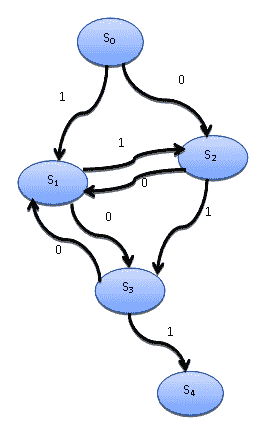

# 五、异步编程

除了顺序和并行执行模型之外，还有第三个模型与事件编程的概念一起具有根本重要性：*异步模型*。

异步任务的执行模型可以通过单个主控制流在单处理器系统和多处理器系统中实现。在并发异步执行模型中，各种任务的执行沿时间轴相交，所有事情都在单个控制流（单线程）的作用下发生。一旦启动，任务的执行可以暂停，然后随着时间的推移恢复，与当前存在的其他任务的执行交替进行。

异步模型的代码开发与多线程编程完全不同。并发多线程并行模型和单线程并发异步模型之间的一个重要区别在于，在第一种情况下，如果我们暂停一个线程的活动并启动另一个线程，操作系统将决定时间线。

这与异步模型不同，不受编码器的控制。只要明确要求，任务的执行或终止就会继续。

这类编程最重要的特性是，代码不是在多个线程上执行的，而不是在经典的并发编程中，而是在单个线程上执行的。因此，两个任务不能同时执行，但根据这种方法，它们几乎是同时执行的。

特别是，我们将描述在 Python 3.4 中引入的`asyncio`*Python 模块。这使我们可以使用协同程序和未来程序来简化异步代码的编写，并提高其可读性。*

 *在本章中，我们将介绍以下配方：

*   使用`concurrent.futures`Python 模块
*   使用`asyncio`管理事件循环
*   处理与`asyncio`的协同程序
*   使用`asyncio`操作任务
*   与`asyncio`和期货交易

# 使用 concurrent.Python 模块

`concurrent.futures`模块是标准 Python 库的一部分，通过将线程建模为异步函数来提供线程的抽象级别。

本模块由两个主要类构成：

*   `concurrent.futures.Executor`：这是一个抽象类，提供异步执行调用的方法。
*   `concurrent.futures.Future`：封装了一个可调用函数的异步执行，未来的对象是通过向`Executors`提交任务（带可选参数的函数）来实例化的。

以下是本模块的一些主要方法：

*   `submit(function,argument)`：这将调度参数上可调用函数的执行。
*   **`map(function,argument)`**：在异步模式下执行参数的功能。
*   `shutdown(Wait=True)`：这表示执行者释放任何资源。

执行者可通过其子类访问：`ThreadPoolExecutor`或`ProcessPoolExecutor`。由于线程和进程的实例化是一项需要资源的任务，因此最好将这些资源集中起来，并将它们用作并行或并发任务的可重复启动器或执行器（因此有了`Executors`概念）。

我们在这里采用的方法涉及使用池执行器。我们将资产提交到池（线程和进程）并获得未来，这是我们将来可以获得的结果。当然，我们可以等待所有的未来变成真正的结果。

线程或进程池（也称为*池*）表示用于优化和简化程序内线程和/或进程使用的管理软件。通过池，您可以提交任务（或多个任务），以便将其执行到池器。

该池配备了一个待处理任务的内部队列和几个执行这些任务的线程*或*进程。池中经常出现的一个概念是重用：线程（或进程）在其生命周期中多次用于不同的任务。这减少了创建新线程或进程的开销，并提高了程序的性能。

重用*不是一条规则*，但它是导致编码人员在其应用程序中使用池的主要原因之一。

# 准备

`concurrent.futures`模块提供`Executor`类的两个子类，异步操作线程池和进程池。这两个子类如下所示：

*   `concurrent.futures.ThreadPoolExecutor(max_workers)`
*   `concurrent.futures.ProcessPoolExecutor(max_workers)`

`max_workers`参数标识异步执行调用的最大工作进程数。

# 怎么做。。。

下面是线程和进程池使用的示例，我们将比较执行时间和顺序执行所需的时间。

要执行的任务如下：我们有 10 个元素的列表。列表中的每一个元素都被计数到 100000000（只是为了浪费时间），然后最后一个数字乘以列表中的第*i 个*元素。特别是，我们正在评估以下案例：

*   **顺序执行**
*   **五人线程池**
*   **五人工艺池**

现在，让我们看看如何做到这一点：

1.  导入相关库：

```py
import concurrent.futures
import time
```

2.  定义从`1`到`10`的编号列表：

```py
number_list = list(range(1, 11))
```

3.  `count(number)`函数统计`1`到`100000000`之间的数字，然后返回`number`×100000000 的乘积：

```py
def count(number):
    for i in range(0,100000000):
        i += 1
    return i*number
```

4.  `evaluate(item)`函数根据`item`参数评估`count`函数。打印出`item`值和`count(item)`结果：

```py
def evaluate(item):
    result_item = count(item)
    print('Item %s, result %s' % (item, result_item))
```

5.  在`__main__`中，执行顺序执行、线程池和进程池：

```py
if __name__ == '__main__':
```

6.  对于顺序执行，对`number_list`的每一项执行`evaluate`功能。然后，打印执行时间：

```py
    start_time = time.clock()
    for item in number_list:
        evaluate(item)
    print('Sequential Execution in %s seconds' % (time.clock() -\ 
        start_time))
```

7.  关于线程和进程池执行，使用相同数量的工作线程（`max_workers=5`。当然，对于这两个池，都会显示执行时间：

```py
    start_time = time.clock()
    with concurrent.futures.ThreadPoolExecutor(max_workers=5) as\ 
    executor:
        for item in number_list:
            executor.submit(evaluate, item)
    print('Thread Pool Execution in %s seconds' % (time.clock() -\ 
        start_time))
    start_time = time.clock()
    with concurrent.futures.ProcessPoolExecutor(max_workers=5) as\ 
    executor:
        for item in number_list:
            executor.submit(evaluate, item)
    print('Process Pool Execution in %s seconds' % (time.clock() -\ 
        start_time))
```

# 它是如何工作的。。。

我们建立了一个存储在`number_list`中的数字列表：

```py
number_list = list(range(1, 11))
```

对于列表中的每个元素，我们操作计数程序，直到达到`100000000`迭代，然后乘以`100000000`的结果值：

```py
def count(number) : 
    for i in range(0, 100000000):
        i=i+1
    return i*number

def evaluate_item(x):
    result_item = count(x)
```

在`main`程序中，我们以顺序模式执行相同的任务：

```py
if __name__ == "__main__":
   for item in number_list:
       evaluate_item(item)
```

然后，在并行模式下，对线程池使用`concurrent.futures`池功能：

```py
with concurrent.futures.ThreadPoolExecutor(max_workers=5) as executor:
    for item in number_list:
        executor.submit(evaluate, item)
```

并对进程池执行相同的操作：

```py
with concurrent.futures.ProcessPoolExecutor(max_workers=5) as executor:
    for item in number_list:
        executor.submit(evaluate, item)
```

Note that both the thread *and* process pools are set with `max_workers=5`; moreover, if `max_workers` is equal to `None`, it will default to the number of processors on the machine.

要运行此示例，请打开命令提示符，并在包含该示例的同一文件夹中键入以下内容：

```py
> python concurrent_futures_pooling.py
```

通过执行前面的示例，我们可以看到三个执行模型的执行时间：

```py
Item 1, result 10000000
Item 2, result 20000000
Item 3, result 30000000
Item 4, result 40000000
Item 5, result 50000000
Item 6, result 60000000
Item 7, result 70000000
Item 8, result 80000000
Item 9, result 90000000
Item 10, result 100000000
Sequential Execution in 6.8109448 seconds
Item 2, result 20000000
Item 1, result 10000000
Item 4, result 40000000
Item 5, result 50000000
Item 3, result 30000000
Item 8, result 80000000
Item 7, result 70000000
Item 6, result 60000000
Item 10, result 100000000
Item 9, result 90000000
Thread Pool Execution in 6.805766899999999 seconds
Item 1, result 10000000
Item 4, result 40000000
Item 2, result 20000000
Item 3, result 30000000
Item 5, result 50000000
Item 6, result 60000000
Item 7, result 70000000
Item 9, result 90000000
Item 8, result 80000000
Item 10, result 100000000
Process Pool Execution in 4.166398899999999 seconds
```

应该注意的是，尽管该示例在计算方面并不昂贵，但顺序和线程池执行在时间方面是相当的。使用进程池可以让我们获得最快的执行时间

然后，池在**FIFO**（简称**先进先出**模式下，将进程（在本例中为五个进程）分配给可用的内核（例如，使用了一台具有四个内核的机器）。

因此，对于每个核心，分配的进程以串联方式运行。只有在执行 I/O 操作之后，池才会安排另一个进程的执行。当然，如果使用线程池，执行机制是相同的。

在处理池的情况下，计算时间较低，必须追溯到 I/O 操作并不重要这一事实。这使得进程池更快，因为与线程不同，它们不需要任何同步机制（如[第 1 章](1.html)、*并行计算入门和 Python*中介绍的*引入并行编程*配方中所述）。

# 还有更多。。。

池技术广泛应用于服务器应用程序中，因为需要管理来自任意数量客户端的多个同时请求。

然而，许多其他应用程序要求立即执行每个活动，或者对运行它的线程有更多的控制权：在这种情况下，池不是最佳选择。

# 另见

关于`concurrent.futures`的有趣教程可以在这里找到：[http://masnun.com/2016/03/29/python-a-quick-introduction-to-the-concurrent-futures-module.html](http://masnun.com/2016/03/29/python-a-quick-introduction-to-the-concurrent-futures-module.html) 。

# 使用 asyncio 管理事件循环

`asyncio`Python 模块提供了用于管理事件、协同路由、任务以及线程的工具，以及用于编写并发代码的同步原语。

本模块的主要组成部分如下：

*   **事件循环**：`asyncio`模块允许每个进程有一个事件循环。这是处理管理和分发不同任务执行的实体。特别是，它注册任务并通过将控制流从一个任务切换到另一个任务来管理它们。
*   **协同程序**：这是对子程序概念的概括。此外，协程可以在执行期间暂停，以等待外部处理（I/O 中的某个例程），并从外部处理完成时停止的点返回。
*   **期货**：定义的`Future`对象与`concurrent.futures`模块完全相同。表示*尚未完成*的计算。
*   **任务**：这是`asyncio`的一个子类，用于以并行方式封装和管理协同路由。

在本配方中，重点是软件程序中事件*和事件管理（即事件循环）的概念。*

 *# 理解事件循环

在计算机科学中，一个*事件*是一个被程序截获并可由程序自身管理的动作。例如，事件可以是用户在与图形界面交互期间对键的虚拟压力、物理键盘上的键压力、外部中断信号，或者更抽象地说，通过网络接收数据。但更一般地说，任何其他形式的事件都可以通过某种方式检测和管理。

在系统中，可以生成事件的实体称为*事件源*，而处理发生事件的实体称为事件处理程序。

*事件循环*编程结构实现了管理程序内事件的功能。更准确地说，事件循环在程序的整个执行过程中循环运行，跟踪数据结构中发生的事件，以便排队，然后在主线程空闲时通过调用事件处理程序一次处理一个事件。

事件循环管理器的伪代码如下所示：

```py
while (1) {
    events = getEvents()
    for (e in events)
        processEvent(e)
}
```

所有反馈到`while`循环的事件都被捕获，然后由事件处理程序处理。处理事件的处理程序是系统中发生的唯一活动。当处理程序结束时，控制传递到下一个计划的事件。

`asyncio`提供以下方法来管理事件循环：

*   `loop = get_event_loop()`：获取当前上下文的事件循环。
*   `loop.call_later(time_delay,callback,argument)`：安排在给定`time_delay`之后调用回调，以秒为单位。
*   `loop.call_soon(callback, argument)`：这将安排尽快调用回调。在`call_soon()`（[之后调用回调 https://docs.python.org/3/library/asyncio-eventloop.html 当控件返回到事件循环时，](https://docs.python.org/3/library/asyncio-eventloop.html)返回。
*   `loop.time()`：返回当前时间作为`float`值（[https://docs.python.org/3/library/functions.html](https://docs.python.org/3/library/functions.html) ），根据事件循环的内部时钟。
*   `asyncio.set_event_loop()`：将当前上下文的事件循环设置为循环。
*   `asyncio.new_event_loop()`：根据此策略的规则创建并返回一个新的事件循环对象。
*   `loop.run_forever()`：运行到`stop()`（[https://docs.python.org/3/library/asyncio-eventloop.html 名为](https://docs.python.org/3/library/asyncio-eventloop.html)）。

# 怎么做。。。

在本例中，我们将了解如何使用`asyncio`库提供的事件循环语句，以构建在异步模式下工作的应用程序

在本例中，我们定义了三个任务。每个任务都有一个由时间随机参数确定的执行时间。一旦执行完成，**任务 A**调用**任务 B**、**任务 B**调用**任务 C**、**任务 C**调用**任务 A**。

事件循环将继续，直到满足终止条件。正如我们可以想象的，本例遵循以下异步模式：


Asynchronous programming model

让我们看一下以下步骤：

1.  让我们从导入实现所需的库开始：

```py
import asyncio
import time
import random
```

2.  然后，我们定义了`task_A`，它的执行时间是随机确定的，可以从`1`到`5`秒不等。在执行结束时，如果不满足终止条件，则计算转到`task_B`：

```py
def task_A(end_time, loop):
    print ("task_A called")
    time.sleep(random.randint(0, 5))
    if (loop.time() + 1.0) < end_time:
        loop.call_later(1, task_B, end_time, loop)
    else:
        loop.stop()
```

3.  这里定义了`task_B`，它的执行时间是随机确定的，可以从`4`到`7`秒不等。在执行结束时，如果不满足终止条件，则计算转到`task_B`：

```py
def task_B(end_time, loop):
    print ("task_B called ")
    time.sleep(random.randint(3, 7))
    if (loop.time() + 1.0) < end_time:
        loop.call_later(1, task_C, end_time, loop)
    else:
        loop.stop()
```

4.  然后，`task_C`被实现。它的执行时间是随机确定的，可以从`6`到`10`秒不等。在执行结束时，如果不满足终止条件，则计算返回到`task_A`：

```py
def task_C(end_time, loop):
    print ("task_C called")
    time.sleep(random.randint(5, 10))
    if (loop.time() + 1.0) < end_time:
        loop.call_later(1, task_A, end_time, loop)
    else:
        loop.stop()
```

5.  下一条语句定义了`loop`参数，该参数仅获取当前事件循环：

```py
loop = asyncio.get_event_loop()
```

6.  `end_loop`值定义终止条件。此示例代码的执行必须持续`60`秒：

```py
end_loop = loop.time() + 60
```

7.  那么我们请求执行`task_A`：

```py
loop.call_soon(task_A, end_loop, loop)
```

8.  现在，我们设置了一个持续时间较长的周期，该周期将继续响应事件，直到停止：

```py
loop.run_forever()
```

9.  现在，关闭事件循环：

```py
loop.close()
```

# 它是如何工作的。。。

为了管理三个任务`task_A`、`task_B`和`task_C`的执行，我们需要捕获事件循环：

```py
loop = asyncio.get_event_loop()
```

然后，我们使用`call_soon`构造来调度对`task_A`的第一次调用：

```py
end_loop = loop.time() + 60
loop.call_soon(function_1, end_loop, loop)
```

让我们注意一下`task_A`的定义：

```py
def task_A(end_time, loop):
    print ("task_A called")
    time.sleep(random.randint(0, 5))
    if (loop.time() + 1.0) < end_time:
        loop.call_later(1, task_B, end_time, loop)
    else:
        loop.stop()
```

应用程序的异步行为由以下参数决定：

*   `time.sleep(random.randint(0, 5))`：定义任务执行的持续时间。
*   `end_time`：定义`task_A`内的时间上限，通过`call_later`方法调用`task_B`。
*   `loop`：这是之前用`get_event_loop()`方法捕获的事件循环。

执行任务后，将`loop.time`与`end_time`进行比较。如果执行时间在最大时间内（60 秒），则通过调用`task_B`继续计算，否则计算结束，关闭事件循环：

```py
 if (loop.time() + 1.0) < end_time:
        loop.call_later(1, task_B, end_time, loop)
    else:
        loop.stop()
```

对于其他两个任务，操作实际上是相同的，但只有执行时间和对下一个任务的调用不同。

现在，让我总结一下情况：

1.  `task_A`调用`task_B`，随机执行时间在 1 到 5 秒之间。
2.  `task_B`调用`task_C`，随机执行时间在 4 到 7 秒之间。
3.  `task_C`调用`task_A`，随机执行时间在 6 到 10 秒之间。

运行时间到期时，事件循环必须结束：

```py
loop.run_forever()
loop.close()
```

此示例的一个可能输出如下：

```py
task_A called
task_B called 
task_C called
task_A called
task_B called 
task_C called
task_A called
task_B called 
task_C called
task_A called
task_B called 
task_C called
task_A called
task_B called 
task_C called
```

# 还有更多。。。

异步事件编程取代了一种并发编程，其中程序的多个部分由访问内存中相同数据的不同线程同时执行，从而导致关键运行问题。同时，能够利用现代 CPU 的不同内核已变得至关重要，因为在某些领域，单核处理器无法再实现与后者类似的性能。

# 另见

下面是对`asyncio`[的一个很好的介绍 https://hackernoon.com/a-simple-introduction-to-pythons-asyncio-595d9c9ecf8c](https://hackernoon.com/a-simple-introduction-to-pythons-asyncio-595d9c9ecf8c) 。

# 使用 asyncio 处理协同路由

纵观给出的各种示例，我们已经看到，当一个程序变得非常长和复杂时，可以方便地将其划分为子例程，每个子例程实现一个特定的任务。但是，子程序不能独立执行，只能在主程序的请求下执行，主程序负责协调子程序的使用。

在本节中，我们将介绍子例程概念的一般化，称为协同例程：与子例程一样，协同例程只计算一个计算步骤，但与子例程不同的是，没有`main`程序来协调结果。协同程序将它们自己连接在一起形成一个管道，而没有任何负责按特定顺序调用它们的监督函数

在协同程序中，由于协同程序跟踪执行状态，执行点可以挂起并在以后恢复。有了一个协同路由池，就可以交错计算：第一个运行直到*返回*控制权，然后第二个运行并继续运行。

交错由事件循环管理，这在使用 asyncio 方法管理事件循环的*中进行了描述。它跟踪所有的协同程序和计划何时执行。*

协同程序的其他重要方面如下所示：

*   协同程序允许多个入口点，这些入口点可以产生多次。
*   协同程序可以将执行转移到任何其他协同程序。

这里使用术语*yield*来描述一个协同路由暂停并将控制流传递给另一个协同路由。

# 准备

我们将使用以下符号来处理协同程序：

```py
import asyncio 

@asyncio.coroutine
def coroutine_function(function_arguments):
    ............
    DO_SOMETHING
    ............   
```

协同程序使用 PEP 380 中引入的`yield from`语法（更多信息请参见[https://www.python.org/dev/peps/pep-0380/](https://www.python.org/dev/peps/pep-0380/) ）停止当前计算的执行并挂起协同路由的内部状态。

特别是在`yield from future`的情况下，协同路由被暂停直到`future`完成，然后`future`的结果将被传播（或引发异常）；在`yield from coroutine`的情况下，协同路由等待另一个协同路由生成将被传播的结果（或引发异常）。

正如我们将在下一个示例中看到的，在这个示例中，协程将用于模拟有限状态机，我们将使用`yield from coroutine`符号。

More on coroutines with `asyncio` are available at [https://docs.python.org/3.5/library/asyncio-task.html](https://docs.python.org/3.5/library/asyncio-task.html).

# 怎么做。。。

在本例中，我们将看到如何使用协程来模拟具有五种状态的有限状态机。

**有限状态机**或**有限状态自动机**是一种数学模型，广泛应用于工程学科，也广泛应用于数学和计算机科学等科学领域。

我们想要模拟使用协同路由行为的自动机如下所示：



Finite-state machine 

系统的状态为**S0**、**S1**、**S2**、**S3**和**S4**，其中**0**和**1**为自动机可以从一个状态传递到下一个状态的值（此操作称为*转换* ). 因此，例如，状态**S0**可以传递到状态**S1**，但仅针对值**1**，而**S0**可以传递到状态**S2**，但仅针对值**0**。

以下 Python 代码模拟自动机从状态**S0**（开始状态）到状态**S4**（结束状态）的转换：

1.  第一步显然是导入相关库：

```py
import asyncio
import time
from random import randint
```

2.  然后，我们定义了相对于`start_state`的协程。随机评估`input_value`参数；可以是`0`或`1`。如果是`0`，则控件转到协同程序`state2`；否则变为协同程序`state1`：

```py
@asyncio.coroutine
def start_state():
    print('Start State called\n')
    input_value = randint(0, 1)
    time.sleep(1)
    if input_value == 0:
        result = yield from state2(input_value)
    else:
        result = yield from state1(input_value)
    print('Resume of the Transition:\nStart State calling'+ result)
```

3.  这是`state1`的合作计划。随机评估`input_value`参数；可以是`0`或`1`。如果是`0`，则控制转到`state2`；否则变为`state1`：

```py
@asyncio.coroutine
def state1(transition_value):
    output_value ='State 1 with transition value = %s\n'% \
                                             transition_value
    input_value = randint(0, 1)
    time.sleep(1)
    print('...evaluating...')
    if input_value == 0:
        result = yield from state3(input_value)
    else:
        result = yield from state2(input_value)
    return output_value + 'State 1 calling %s' % result
```

4.  `state1`的协同程序有`transition_value`参数，允许状态通过。此外，在这种情况下，`input_value`是随机评估的。如果为`0`，则状态转换为`state3`；否则，控制更改为`state2`：

```py
@asyncio.coroutine
def state2(transition_value):
    output_value = 'State 2 with transition value = %s\n' %\
                                             transition_value
    input_value = randint(0, 1)
    time.sleep(1)
    print('...evaluating...')
    if input_value == 0:
        result = yield from state1(input_value)
    else:
        result = yield from state3(input_value)
    return output_value + 'State 2 calling %s' % result
```

5.  `state3`的协程具有`transition_value`参数，该参数允许状态的通过。`input_value`为随机评估。如果为`0`，则状态转换为`state1`；否则，控制更改为`end_state`：

```py
@asyncio.coroutine
def state3(transition_value):
    output_value = 'State 3 with transition value = %s\n' %\
                                                 transition_value
    input_value = randint(0, 1)
    time.sleep(1)
    print('...evaluating...')
    if input_value == 0:
        result = yield from state1(input_value)
    else:
        result = yield from end_state(input_value)
    return output_value + 'State 3 calling %s' % result
```

6.  `end_state`打印出允许状态通过的`transition_value`参数，然后停止计算：

```py
@asyncio.coroutine
def end_state(transition_value):
    output_value = 'End State with transition value = %s\n'%\
                                                transition_value
    print('...stop computation...')
    return output_value
```

7.  在`__main__`函数中，获取事件循环，然后启动有限状态机的模拟，调用自动机的`start_state`：

```py
if __name__ == '__main__':
    print('Finite State Machine simulation with Asyncio Coroutine')
    loop = asyncio.get_event_loop()
    loop.run_until_complete(start_state())
```

# 它是如何工作的。。。

已使用装饰器定义自动机的每个状态：

```py
 @asyncio.coroutine
```

例如，这里定义了状态**S0**：

```py
@asyncio.coroutine
def StartState():
    print ("Start State called \n")
    input_value = randint(0,1)
    time.sleep(1)
    if (input_value == 0):
        result = yield from State2(input_value)
    else :
        result = yield from State1(input_value)
```

到下一个状态的转换由`input_value`决定，由 Python 的`random`模块的`randint (0,1)`函数定义，该函数随机提供`0`或`1`的值。

以这种方式，`randint`随机确定有限状态机将通过的状态：

```py
input_value = randint(0,1)
```

确定要传递的值后，协同程序使用`yield from`命令调用下一个协同程序：

```py
if (input_value == 0):
        result = yield from State2(input_value)
    else :
        result = yield from State1(input_value)
```

`result`变量是每个协同程序返回的值。它是一个字符串，在计算结束时，我们可以重建从自动机初始状态`start_state`到`end_state`的转换。

`main`程序在事件循环内开始评估：

```py
if __name__ == "__main__":
    print("Finite State Machine simulation with Asyncio Coroutine")
    loop = asyncio.get_event_loop()
    loop.run_until_complete(StartState())
```

运行代码时，我们有如下输出：

```py
Finite State Machine simulation with Asyncio Coroutine
Start State called
...evaluating...
...evaluating...
...evaluating...
...evaluating...
...stop computation...
Resume of the Transition : 
Start State calling State 1 with transition value = 1
State 1 calling State 2 with transition value = 1
State 2 calling State 1 with transition value = 0
State 1 calling State 3 with transition value = 0
State 3 calling End State with transition value = 1
```

# 还有更多。。。

在 Python3.5 发布之前，`asyncio`模块使用生成器模拟异步调用，因此其语法与当前版本的 Python3.5 不同。

Python 3.5 引入了`async`和`await`关键字。注意`await func()`调用周围缺少括号。

以下是`"Hello, world!"`的一个示例，使用`asyncio`和 Python 3.5+引入的新语法：

```py
import asyncio

async def main():
    print(await func())

async def func():
    # Do time intensive stuff...
    return "Hello, world!"

if __name__ == "__main__":
    loop = asyncio.get_event_loop()
    loop.run_until_complete(main())
```

# 另见

Python 中的协同程序在这里有很好的描述：[https://www.geeksforgeeks.org/coroutine-in-python/](https://www.geeksforgeeks.org/coroutine-in-python/) 。

# 使用 asyncio 操作任务

`asyncio`模块设计用于通过事件循环处理异步进程和并发任务执行。它还提供了`asyncio.Task()`类，用于在任务（[中包装协程 https://docs.python.org/3/library/asyncio-task.html](https://docs.python.org/3/library/asyncio-task.html) ）。它的用途是允许独立运行的任务在同一事件循环上与其他任务并发运行。

当协程被包装在任务中时，它将`Task`连接到事件循环，然后在循环启动时自动运行，从而提供了自动驱动协程的机制。

`asyncio`模块提供`asyncio.Task(coroutine)`方法处理任务计算；此外，`asyncio.Task(coroutine)`计划执行协同程序（[https://docs.python.org/3/library/asyncio-task.html](https://docs.python.org/3/library/asyncio-task.html) ）。

任务负责在*事件循环中执行协同程序对象。*

如果包装的协同路由使用`yields from future`符号，如*处理异步协同路由*部分*中所述，*则任务暂停包装的协同路由的执行，并等待未来的完成。

当未来完成时，包装的协同路由的执行将重新启动，并显示结果或未来的异常。此外，我们必须注意，事件循环一次只运行一个任务。如果其他事件循环在不同线程中运行，则其他任务可能并行运行。

当任务等待未来的完成时，事件循环执行新任务。

# 怎么做。。。

在本例中，我们展示了`asyncio.Task()`语句如何并发执行三个数学函数：

1.  当然，我们先导入`asyncio`库：

```py
import asyncio
```

2.  在第一个协同程序中，定义了`factorial`函数：

```py
@asyncio.coroutine
def factorial(number):
    f = 1
    for i in range(2, number + 1):
        print("Asyncio.Task: Compute factorial(%s)" % (i))
        yield from asyncio.sleep(1)
        f *= i
    print("Asyncio.Task - factorial(%s) = %s" % (number, f))
```

3.  之后，第二个函数定义为`fibonacci`函数：

```py
@asyncio.coroutine
def fibonacci(number):
    a, b = 0, 1
    for i in range(number):
        print("Asyncio.Task: Compute fibonacci (%s)" % (i))
        yield from asyncio.sleep(1)
        a, b = b, a + b
    print("Asyncio.Task - fibonacci(%s) = %s" % (number, a))
```

4.  同时执行的最后一个函数是二项式系数：

```py
@asyncio.coroutine
def binomial_coefficient(n, k):
    result = 1
    for i in range(1, k + 1):
        result = result * (n - i + 1) / i
        print("Asyncio.Task: Compute binomial_coefficient (%s)" % 
            (i))
        yield from asyncio.sleep(1)
    print("Asyncio.Task - binomial_coefficient(%s , %s) = %s" % 
        (n,k,result))
```

5.  在`__main__`功能中，`task_list`包含必须使用`asyncio.Task`功能并行执行的功能：

```py
if __name__ == '__main__':
    task_list = [asyncio.Task(factorial(10)),
                 asyncio.Task(fibonacci(10)),
                 asyncio.Task(binomial_coefficient(20, 10))]
```

6.  最后，我们获取事件循环并开始计算：

```py
    loop = asyncio.get_event_loop()
    loop.run_until_complete(asyncio.wait(task_list))
    loop.close()
```

# 它是如何工作的。。。

每个协同程序由`@asyncio.coroutine`注释定义（称为*装饰器*：

```py
@asyncio.coroutine
def function (args):
    do something
```

为了并行运行，每个函数都是`asyncio.Task`模块的一个参数，因此它们包含在`task_list`中：

```py
if __name__ == '__main__':
    task_list = [asyncio.Task(factorial(10)),
                 asyncio.Task(fibonacci(10)),
                 asyncio.Task(binomial_coefficient(20, 10))]
```

然后，我们得到事件循环：

```py
    loop = asyncio.get_event_loop()
```

最后，我们将`task_list`的执行添加到事件循环中：

```py
    loop.run_until_complete(asyncio.wait(task_list))
    loop.close()
```

Note that the `asyncio.wait(task_list)` statement waits for the given coroutines to complete.

前面代码的输出如下所示：

```py
Asyncio.Task: Compute factorial(2)
Asyncio.Task: Compute fibonacci(0)
Asyncio.Task: Compute binomial_coefficient(1)
Asyncio.Task: Compute factorial(3)
Asyncio.Task: Compute fibonacci(1)
Asyncio.Task: Compute binomial_coefficient(2)
Asyncio.Task: Compute factorial(4)
Asyncio.Task: Compute fibonacci(2)
Asyncio.Task: Compute binomial_coefficient(3)
Asyncio.Task: Compute factorial(5)
Asyncio.Task: Compute fibonacci(3)
Asyncio.Task: Compute binomial_coefficient(4)
Asyncio.Task: Compute factorial(6)
Asyncio.Task: Compute fibonacci(4)
Asyncio.Task: Compute binomial_coefficient(5)
Asyncio.Task: Compute factorial(7)
Asyncio.Task: Compute fibonacci(5)
Asyncio.Task: Compute binomial_coefficient(6)
Asyncio.Task: Compute factorial(8)
Asyncio.Task: Compute fibonacci(6)
Asyncio.Task: Compute binomial_coefficient(7)
Asyncio.Task: Compute factorial(9)
Asyncio.Task: Compute fibonacci(7)
Asyncio.Task: Compute binomial_coefficient(8)
Asyncio.Task: Compute factorial(10)
Asyncio.Task: Compute fibonacci(8)
Asyncio.Task: Compute binomial_coefficient(9)
Asyncio.Task - factorial(10) = 3628800
Asyncio.Task: Compute fibonacci(9)
Asyncio.Task: Compute binomial_coefficient(10)
Asyncio.Task - fibonacci(10) = 55
Asyncio.Task - binomial_coefficient(20, 10) = 184756.0
```

# 还有更多。。。

`asyncio`提供了使用`ensure_future()`或`AbstractEventLoop.create_task()`方法调度任务的其他方法，这两种方法都接受一个协程对象。

# 另见

更多关于`asyncio`和任务的信息可在此处找到：[https://tutorialedge.net/python/concurrency/asyncio-tasks-tutorial/](https://tutorialedge.net/python/concurrency/asyncio-tasks-tutorial/) 。

# 处理 asyncio 和 futures

`asyncio`模块的另一个关键组件是`asyncio.Future`类。它与`concurrent.Futures`非常相似，但当然，它适应了`asyncio`的主要机制：事件循环。

`asyncio.Future`类表示尚未可用的结果（但也可以是异常）。

因此，它代表了一种尚未实现的抽象。实际上，必须处理任何结果的回调被添加到此类的实例中。

# 准备

要定义`future`对象，必须使用以下语法：

```py
future = asyncio.Future
```

管理此对象的主要方法如下：

*   `cancel()`：取消`future`对象并安排回调。
*   `result()`：返回`future`表示的结果。
*   `exception()`：返回在此`future`上设置的异常。
*   `add_done_callback(fn)`：增加`future`完成时运行的回调。
*   `remove_done_callback(fn)`：完成后，将从调用中删除回调的所有实例。
*   `set_result(result)`：将`future`标记为已完成并设置其结果。
*   `set_exception(exception)`：将`future`标记为已完成并设置异常。

# 怎么做。。。

下面的示例演示如何使用`asyncio.Future`类管理两个协同路由：`first_coroutine`和`second_coroutine`，这两个协同路由执行以下任务。`first_coroutine`执行前*N*个整数的总和，`second_coroutine`执行 N 的阶乘：

1.  现在，让我们导入相关库：

```py
import asyncio
import sys
```

2.  `first_coroutine`实现第一个*N*整数的`sum`功能：

```py
@asyncio.coroutine
def first_coroutine(future, num):
    count = 0
    for i in range(1, num + 1):
        count += i
    yield from asyncio.sleep(1)
    future.set_result('First coroutine (sum of N integers)\
                      result = %s' % count)
```

3.  在`second_coroutine`中，我们仍然实现`factorial`功能：

```py
@asyncio.coroutine
def second_coroutine(future, num):
    count = 1
    for i in range(2, num + 1):
        count *= i
    yield from asyncio.sleep(2)
    future.set_result('Second coroutine (factorial) result = %s' %\ 
                      count)
```

4.  使用`got_result`函数，我们打印计算的输出：

```py
def got_result(future):
    print(future.result())
```

5.  在`main`功能中，`num1`和`num2`参数必须由用户设置。它们将用作第一个和第二个协同程序实现的功能的参数：

```py
if __name__ == "__main__":
    num1 = int(sys.argv[1])
    num2 = int(sys.argv[2])
```

6.  现在，让我们看一下事件循环：

```py
    loop = asyncio.get_event_loop()
```

7.  此处，期货由`asyncio.future`函数定义：

```py
    future1 = asyncio.Future()
    future2 = asyncio.Future()
```

8.  `tasks`列表中包含的两个协同程序`first_couroutine`和`second_couroutine`具有`future1`和`future2`期货、用户定义的参数以及`num1`和`num2`参数：

```py
tasks = [first_coroutine(future1, num1),
        second_coroutine(future2, num2)]
```

9.  期货市场增加了回调：

```py
    future1.add_done_callback(got_result)
    future2.add_done_callback(got_result)
```

10.  然后，将`tasks`列表添加到事件循环中，以便开始计算：

```py
    loop.run_until_complete(asyncio.wait(tasks))
    loop.close()
```

# 它是如何工作的。。。

在`main`程序中，我们通过`asyncio.Future()`指令分别定义`future`对象*`future1`和`future2`：*

 *```py
if __name__ == "__main__":
        future1 = asyncio.Future()
        future2 = asyncio.Future()
```

在定义任务时，我们将`future`对象作为两个协程`first_couroutine`和`second_couroutine`的参数传递：

```py
tasks = [first_coroutine(future1,num1), 
         second_coroutine(future2,num2)]
```

最后，我们添加了一个回调，在`future`完成时运行：

```py
future1.add_done_callback(got_result)
future2.add_done_callback(got_result)
```

这里，`got_result`是打印`future`结果的函数：

```py
def got_result(future):
    print(future.result())
```

在协同程序中，我们将`future`对象作为参数传递。计算完成后，我们将第一次共程的`sleep`时间设置为 3 秒，第二次共程的`sleep`时间设置为 4 秒：

```py
yield from asyncio.sleep(sleep_time)
```

通过使用不同的值执行命令可获得以下输出：

```py
> python asyncio_and_futures.py 1 1
First coroutine (sum of N integers) result = 1
Second coroutine (factorial) result = 1

> python asyncio_and_futures.py 2 2
First coroutine (sum of N integers) result = 2 Second coroutine (factorial) result = 2

> python asyncio_and_futures.py 3 3
First coroutine (sum of N integers) result = 6
Second coroutine (factorial) result = 6

> python asyncio_and_futures.py 5 5
First coroutine (sum of N integers) result = 15
Second coroutine (factorial) result = 120
 > python asyncio_and_futures.py 50 50
First coroutine (sum of N integers) result = 1275
Second coroutine (factorial) result = 30414093201713378043612608166064768844377641568960512000000000000 
First coroutine (sum of N integers) result = 1275 
```

# 还有更多。。。

我们可以反转输出结果，即，通过简单地在`first_coroutine`定义中的`yield from asyncio.sleep(2)`和`second_coroutine`定义中的`yield from asyncio.sleep(1)`之间交换睡眠时间，首先获得`second_coroutine`的输出。这可以通过以下示例显示：

```py
> python asyncio_and_future.py 1 10
second coroutine (factorial) result = 3628800
first coroutine (sum of N integers) result = 1
```

# 另见

更多关于`asyncio`和期货的例子可参见[https://www.programcreek.com/python/example/102763/asyncio.futures](https://www.programcreek.com/python/example/102763/asyncio.futures) 。***