# 云计算

*云计算*是指服务器、存储资源、数据库、网络、软件、分析、智能等计算服务通过互联网的分布（*云*）。本章的目的是概述与 Python 编程语言相关的主要云计算技术。

首先，我们将描述 PythonAnywhere 平台，我们将使用该平台在云上部署 Python 应用程序。在云计算环境中，将确定两种新兴技术：容器技术和无服务器技术。

*容器*代表了资源虚拟化的新途径，*无服务器*技术代表了云服务领域的进步，因为它们可以加快应用程序的发布。

事实上，您不必担心资源调配、服务器或基础架构配置。您只需创建可以独立于应用程序运行的函数（即 Lambda 函数）。

在本章中，我们将介绍以下配方：

*   什么是云计算？
*   理解云计算架构
*   使用 pythonaywhere 开发 web 应用程序
*   停靠 Python 应用程序
*   引入无服务器计算

我们还将了解如何利用*AWS Lambda*框架开发 Python 应用程序。

# 什么是云计算？

云计算是一种基于一组资源（如虚拟处理、海量内存和网络）的服务分布计算模型，这些资源可以作为运行应用程序的平台动态聚合和激活，满足适当的服务级别并优化资源使用效率。

这可以通过最少的管理工作或与服务提供商的交互来快速获取和发布。该云模型由五个基本特征、三个服务模型和四个部署模型组成。

具体而言，五个基本特征如下：

*   **免费点播接入**：允许用户通过*用户友好的*接口接入提供商提供的服务，无需人工交互。
*   **无处不在的网络接入**：资源在整个网络中都是可用的，可以通过*智能手机*、*平板电脑*、*个人电脑*等标准设备进行访问。
*   **快速弹性**：这是云以快速、自动的方式增加或减少分配的资源的能力，比如让用户觉得这些资源是无限的。这为系统提供了极大的可扩展性。
*   **测量服务**：云系统不断监控提供的资源，并根据估计使用情况自动优化。这样，客户只需为该特定会话中实际使用的资源付费。
*   **资源共享**：提供商通过多租户模式提供其资源，以便根据客户的请求动态分配和重新分配资源，供多个消费者使用：

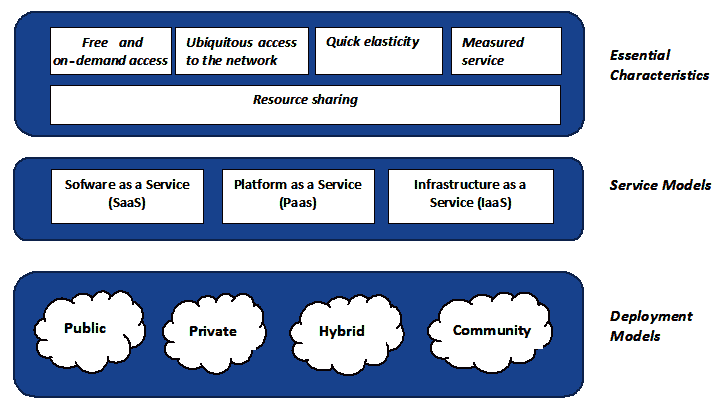

Cloud computing main features

然而，云计算有很多定义，每个定义都有不同的解释和含义。*国家标准与技术研究所*（**NIST**已尝试提供详细的官方解释（[https://csrc.nist.gov/publications/detail/sp/800-145/final](https://csrc.nist.gov/publications/detail/sp/800-145/final) ）。

另一个特性（NIST 的定义中未列出，但它是云计算的基础）是虚拟化的概念。这是在同一物理资源上执行多个*操作系统*的可能性，保证了许多优势，例如可扩展性、成本降低以及向客户提供新资源的更快速度。

最常见的虚拟化方法如下：

*   容器
*   虚拟机

就应用程序隔离而言，这两种解决方案具有几乎相同的优势，但它们在不同的虚拟化级别上工作，因为容器虚拟化了操作系统，虚拟机虚拟化了硬件。这意味着容器更具可移植性和效率。

通过容器进行虚拟化的最常见应用程序是 Docker。我们将简要介绍这个框架，并了解如何对 Python 应用程序进行容器化（或 dockerize）。

# 理解云计算架构

云计算架构是指构成系统结构的一系列组件和子组件，通常可分为*F**前端*和*B**后端*两个主要部分：

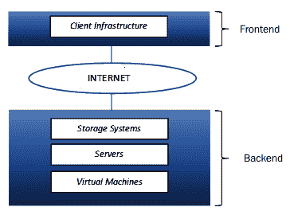

Cloud computing architecture

每个部分都有非常具体的含义和范围，并通过虚拟网络或互联网网络相互链接。

*前端*是指云计算系统中用户可见的部分，通过一系列接口和应用程序实现，允许用户访问云系统。不同的云计算系统有不同的 UI。

*后端*是客户看不见的部分。本节包含允许提供商提供服务器、存储系统和虚拟机等云计算服务的所有资源。创建后端背后的想法是将整个系统的管理委托给单个中央服务器，因此，该服务器必须不断监控流量和用户请求，执行访问控制，并实施通信协议。

在这个架构的各种组件中，最重要的是 Hypervisor，也称为**虚拟机管理器*。这是一个动态分配资源的固件，还允许您在多个用户之间共享单个实例。简而言之，这是一个实现虚拟化的程序，虚拟化是云计算的主要属性之一。*

 *在给出云计算的定义并解释其基本特征之后，我们将介绍可以提供云计算服务的*服务模型*。

# 服务模式

提供商提供的云计算服务分为三大类：

*   **S**软件即服务（SaaS）
*   **P**平台即服务（PaaS）
*   **I**基础设施即服务（IaaS）

这一分类导致了一个方案的定义，该方案的名称为**SPI**模型（参见前面列表中的**粗体**首字母缩写）。有时它被称为云计算堆栈，因为这些类别是基于彼此的。

现在将按照自上而下的方法详细描述这些级别。

# SaaS

SaaS 提供商为用户提供按需软件应用程序，可通过任何互联网设备（如 web 浏览器）访问这些应用程序。此外，提供商托管软件应用程序和底层基础设施，从而减轻客户管理和维护活动的负担，如软件更新和安全补丁的应用。

对于用户和提供者来说，使用此模型有许多优点。对于用户来说，管理成本大大降低，而对于提供商来说，他们对流量有更多的控制，从而允许他们避免任何过载。SaaS 的一个例子是任何基于网络的电子邮件服务，如**Gmail**、**Outlook**、**Salesforce**、和**Yahoo！**。

# 帕斯

与 SaaS 不同，此服务涉及应用程序的整个开发环境，而不仅仅是其使用。因此，PaaS 解决方案提供了一个可以通过 web 浏览器访问的云平台，用于软件应用程序的开发、测试、分发和管理。此外，提供商还提供了基于 web 的接口、多租户体系结构和通信工具，以允许开发人员以更简单的方式创建应用程序。这支持软件的整个生命周期，也有利于合作。

PaaS 的例子有**微软 Azure 服务**、**谷歌应用引擎**、**和**亚马逊网络服务**。**

 **# IaaS

IaaS 是一种将计算基础设施作为按需服务提供的模型。因此，您可以购买虚拟机，在虚拟机上运行您自己的软件、存储资源（有可能根据您的需要快速增加或减少存储容量）、网络和操作系统，方法是根据您实际使用的内容付费。这种类型的动态基础架构增加了更大的可扩展性，同时也显著降低了成本。

这种模式既适用于没有大量资本投资的新兴小公司，也适用于寻求精简硬件架构的老牌公司。IaaS 卖家的范围非常广泛，包括**亚马逊网络服务**、**IBM**和**甲骨文**。

# 分布模型

云计算架构并不完全相同。事实上，有四种不同的分销模式：

*   **公共云**
*   ****私有云****
*   **云社区**
*   **混合云**

# 公共云

这种分销模式对所有人开放，包括个人用户和公司。通常，公共云在服务提供商拥有的数据中心中运行，该数据中心处理硬件、软件和其他支持基础设施。这样，用户就不必承担任何维护活动/费用。

# 私有云

私有云也称为*内部云*，它提供了与公共云相同的优势，但提供了对数据和流程的更大控制。该模型以云基础设施的形式呈现，专门为公司工作，因此在给定公司的边界内进行管理和托管。显然，使用 it 的组织可以将其体系结构扩展到通过业务关系链接到的任何组。

通过采用这种类型的解决方案，可以避免与违反敏感数据和工业间谍有关的可能问题，同时不会忽略使用简化、可配置和高性能的工作资源调配系统的可能性。正是出于这个原因，近年来，使用私有云的公司数量显著增加。

# 云社区

从概念上讲，该模型描述了一个共享的基础设施，该基础设施由几个有共同利益的公司实施和管理。这种类型的解决方案很少使用，因为在社区的不同成员之间分担责任和管理活动可能会变得复杂。

# 混合云

NIST 将此定义为前面提到的三种实现模式（私有云、公共云和社区云）的组合结果，试图利用这三种模式中的每一种，以弥补其他模式的不足。使用的云仍然是不同的实体，这可能会导致缺乏操作一致性。因此，采用这种模式的公司有责任通过专有技术保证其服务器的互操作性，并针对其必须扮演的特定角色对其进行优化。

混合云区别于所有其他云的一个特点是 cloudburst，即在出现高峰需求时，能够将多余流量从私有云动态转移到公共云的可能性。

这种实现模式被那些打算共享其软件应用程序，同时将其敏感数据保留在内部云中的公司所采用。

# 云计算平台

云计算平台是一套能够在云中交付资源（按需、可扩展和虚拟化资源）的软件和技术。最流行的平台包括谷歌的平台，当然还有云计算的里程碑：**亚马逊网络服务**（**AWS**。两者都支持 Python 作为开发语言。

然而，在下一个菜谱中，我们将重点介绍 PythonAnywhere，它是一个专门为使用 Python 编程语言部署 web 应用程序而开发的云平台。

# 使用 pythonaywhere 开发 web 应用程序

PythonAnywhere 是一个基于 Python 编程语言的在线托管开发和服务环境。在站点上注册后，您将被引导到仪表板，仪表板包括完全由 HTML 代码制作的高级 shell 和文本编辑器。有了它，您可以创建、修改和执行自己的脚本。

此外，此开发环境还允许您选择使用哪个版本的 Python。在这种情况下，一个简单的向导可以帮助我们预先配置应用程序。

# 准备

首先让我们看看如何获取站点的登录凭据。

以下屏幕截图显示了各种类型的订阅，以及获得免费帐户的可能性（请转到[https://www.pythonanywhere.com/registration/register/beginner/](https://www.pythonanywhere.com/registration/register/beginner/) ：

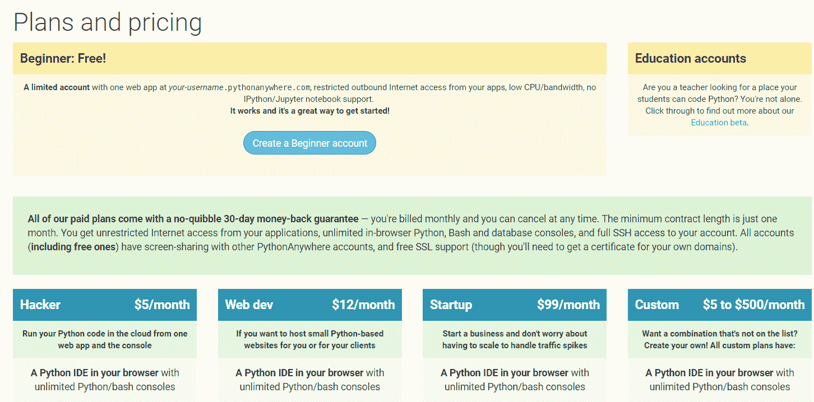

PythonAnywhere: Registration page

一旦获得访问该网站的权限（建议您创建一个初学者帐户），我们将登录。考虑到集成到浏览器中的 Python shell 非常有用，特别是对于初学者和入门编程课程，从技术角度来看，它们肯定不是新的。

相反，Pythonywhere 的附加值会在您通过访问个人仪表板登录时立即被感知：


PythonAnywhere: Dashboard

通过 personal dashboard，我们可以选择在 2.7 和 3.7 之间运行哪个版本的 Python，无论是否使用 IPython 接口：

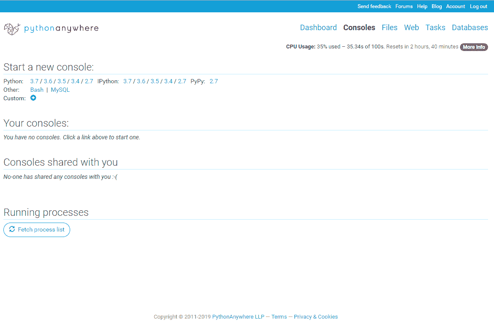

PythonAnywhere: Console view

可使用的控制台数量根据您的订阅类型而有所不同。在我们的例子中，创建了一个初学者帐户后，我们最多可以使用两个 Python 控制台。一旦选择了 Python shell（如 3.5 版），应在 web 浏览器上打开以下视图：

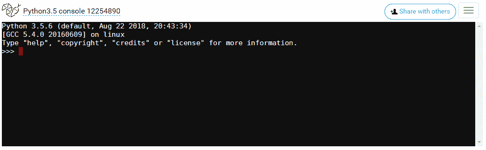

PythonAnywhere: Python shell

在下一节中，我们将向您展示如何使用 python 编写一个简单的 web 应用程序。

# 怎么做。。。

让我们看一下以下步骤：

1.  在仪表板上，打开“Web”选项卡：

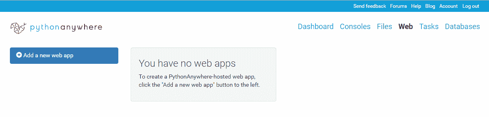

PythonAnywhere: Web app view

2.  界面告诉我们还没有 web 应用程序。通过选择“添加新 web 应用”，将打开以下视图。它告诉我们，我们的应用程序将有以下网址：[loginname.pythonanywhere.com](http://loginname.pythonanywhere.com)（在本例中，应用程序的网址将是[giazax.pythonanywhere.com](http://giazax.pythonanywhere.com)：

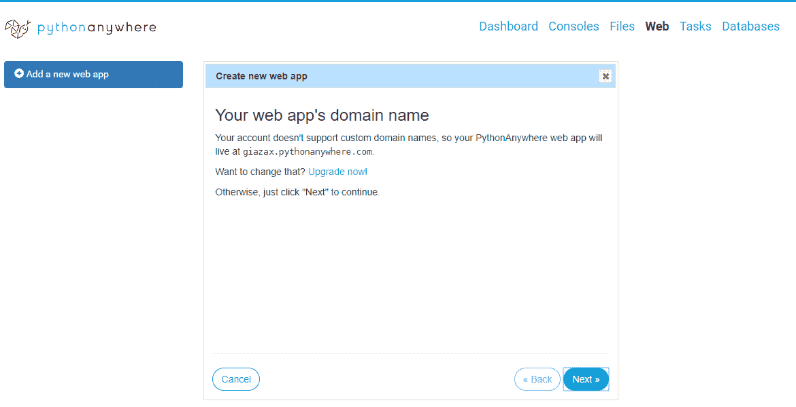

PythonAnywhere: Web app wizard

3.  单击“下一步”时，我们可以选择要使用的 Python web 框架：


PythonAnywhere: Web framework wizard

4.  我们选择 Flask 作为 web 框架，然后单击 Next 选择要使用的 Python 版本，如下所示：


PythonAnywhere: Web framework wizard Flask is a micro-framework for Python that is easy to install and use, and is used by companies such as Pinterest and LinkedIn.

If you don't know what a framework for creating web applications is, then you can imagine a set of programs with the aim of facilitating the creation of web services such as web servers and APIs. More information on Flask can be found at [http://flask.pocoo.org/docs/1.0/](http://flask.pocoo.org/docs/1.0/).

5.  在前面的屏幕截图中，我们为 Flask 1.0.2 选择 Python 3.5，然后单击 Next（下一步）输入用于保存 Flask 应用程序的 Python 文件的路径。在此，选择默认文件：


PythonAnywhere: Flask project definition

6.  最后一次单击“下一步”时，将显示以下屏幕，其中总结了 web 应用程序的配置参数：

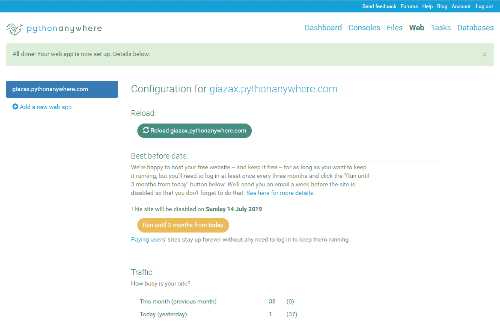

PythonAnywhere: Configuration page for giazax.pythonanywhere.com

现在，让我们看看这会发生什么。

# 它是如何工作的。。。

在 web 浏览器的地址栏中，键入 web 应用程序的 URL，在本例中为`https://giazax.pythonanywhere.com/`。该网站显示了一个简单的欢迎词：


giazax.pythonanywhere.com site page

通过选择与源代码标签对应的“转到目录”，可以查看此应用程序的源代码：


PythonAnywhere: Configuration page

在这里，可以分析构成 web 应用程序的文件：


PythonAnywhere: Project site repository

还可以上载新文件，并可能修改内容。这里，我们选择第一个 web 应用程序的`flask_app.py`文件。内容看起来像一个最小的烧瓶应用程序：

```py
# A very simple Flask Hello World app for you to get started with...

from flask import Flask

app = Flask(__name__)

@app.route('/')
def hello_world():
    return 'Hello from Flask!'
```

Flask 使用`route()`decorator 定义触发`hello_world`函数的 URL。此简单函数返回 web 浏览器中显示的消息。

# 还有更多。。。

PythonyShell 是用 HTML 制作的，这使得它几乎可以跨多个平台和浏览器移植，包括苹果的移动版本。可以打开多个 shell（根据所选帐户配置文件的不同数量），与其他用户共享，或者根据需要终止它们。

PythonAnywhere 有一个相当高级的文本编辑器，具有语法着色和自动缩进功能，您可以通过它创建、修改和执行自己的脚本。这些文件存储在不同大小的存储区域，具体大小取决于帐户的配置文件，但如果没有足够的空间，或者您希望与 PC 的文件系统进行更流畅的集成，则 Pythonywhere 允许您使用 Dropbox 帐户，使您的共享文件夹可以在流行的存储服务上访问。

每个 shell 可以包含一个对应于特定 URL 的 WSGI 脚本。还可以启动 bashshell，从中调用 Git 并与文件系统交互。最后，正如我们所看到的，有一个向导允许我们预先配置一个**Django**和**web2py**或 Flask 应用程序。

此外，还有可能利用**MySQL**数据库，这是一系列 cron 作业，允许我们定期执行某些脚本。因此，我们将了解 PythonAnywhere*：*以光速部署 web 应用程序的真正本质。

*Pythonywhere*完全依赖**亚马逊 EC2**基础设施，因此没有理由不信任该服务。出于这个原因，强烈建议那些想个人使用的人使用。初学者帐户提供的资源比**Heroku**（[上对应的帐户更多 https://www.heroku.com/](https://www.heroku.com/) ），部署比**OpenShift**（[上的部署更简单 https://www.openshift.com/](https://www.openshift.com/) ），整个系统通常比**灵活得多谷歌应用引擎**（[https://cloud.google.com/appengine/](https://cloud.google.com/appengine/) 。

# 另见

*   Pythonywhere 上的主要资源可在此处找到：[https://www.pythonanywhere.com](https://www.pythonanywhere.com) 。
*   对于通过 Python 进行的 web 编程，Pythonywhere 支持**Django**（[https://www.djangoproject.com/](https://www.djangoproject.com/) 和**web2py**（[http://www.web2py.com/](http://www.web2py.com/) ），除**烧瓶**外。

与**Flask**一样，建议您访问这些网站，了解如何使用这些库。

# 停靠 Python 应用程序

容器是虚拟化环境。它们包括软件所需的一切，即库、依赖项、文件系统和网络接口。与传统的虚拟机不同，上述所有元素都与运行它们的机器共享内核。这样，对主机节点资源使用的影响大大降低。

这使得容器在可伸缩性、性能和隔离性方面成为一种非常有吸引力的技术。容器不是年轻的技术；他们在 2013 年推出 Docker 后取得了成功。从那时起，他们彻底改变了用于应用程序开发和管理的标准。

Docker 是一个基于**Linux Containers**（**LXC**的实现的容器平台，它扩展了该技术的功能，能够将容器作为自包含的映像进行管理，并添加了用于协调其生命周期和保存其状态的附加工具。

容器化的思想正是允许给定的应用程序在任何类型的系统上执行，因为它的所有依赖项都已经包含在容器本身中。

通过这种方式，应用程序变得高度可移植，并且可以轻松地在任何类型的环境中进行测试和部署，包括本地环境，尤其是云中环境。

现在，让我们看看如何使用 Docker 对 Python 应用程序进行 Docker 化。

# 准备

Docker 团队的直觉是采用容器的概念，并围绕容器构建一个生态系统，以简化容器的使用。该生态系统包括一系列工具：

*   Docker 引擎（[https://www.docker.com/products/docker-engine](https://www.docker.com/products/docker-engine) ）
*   Docker 工具箱（[https://docs.docker.com/toolbox/](https://docs.docker.com/toolbox/) ）
*   蜂群（[https://docs.docker.com/engine/swarm/](https://docs.docker.com/engine/swarm/) ）
*   风筝（[https://kitematic.com/](https://kitematic.com/) ）

# 安装 Docker for Windows

安装非常简单：下载安装程序后（[https://docs.docker.com/docker-for-windows/install/](https://docs.docker.com/docker-for-windows/install/) ），只要运行它，就完成了。安装过程通常是线性的。唯一需要注意的是安装的最后阶段，在此阶段可能需要启用 Hyper-V 功能。如果是这样，那么我们接受并重新启动机器。

重新启动计算机后，Docker 图标应出现在屏幕右下角的系统托盘中。

打开命令提示符或 PowerShell 控制台，执行`docker version`命令检查是否一切正常：

```py
C:\>docker version
Client: Docker Engine - Community
 Version: 18.09.2
 API version: 1.39
 Go version: go1.10.8
 Git commit: 6247962
 Built: Sun Feb 10 04:12:31 2019
 OS/Arch: windows/amd64
 Experimental: false

Server: Docker Engine - Community
 Engine:
 Version: 18.09.2
 API version: 1.39 (minimum version 1.12)
 Go version: go1.10.6
 Git commit: 6247962
 Built: Sun Feb 10 04:13:06 2019
 OS/Arch: linux/amd64
 Experimental: false
```

输出中最有趣的部分是在客户机和服务器之间进行的细分。客户端是我们的本地 Windows 系统，而服务器是 Docker 在后台实例化的 Linux 虚拟机。如本配方介绍中所述，由于 API 层的存在，各部分之间相互通信。

现在，让我们看看如何将一个简单的 Python 应用程序容器化（或 dockerize）。

# 怎么做。。。

假设我们要部署以下 Python 应用程序，我们称之为`dockerize.py`：

```py
from flask import Flask
app = Flask(__name__)
@app.route("/")
def hello():
    return "Hello World!"
if __name__ == "__main__":
    app.run(host="0.0.0.0", port=int("5000"), debug=True)
```

示例应用程序使用`Flask`模块。它在本地主机地址`5000`实现了一个简单的 web 应用程序。

第一步是创建以下文本文件，扩展名为`.py`，我们称之为`Dockerfile.py`：

```py
FROM python:alpine3.7
COPY . /app
WORKDIR /app
RUN pip install -r requirements.txt
EXPOSE 5000
CMD python ./dockerize.py
```

前面代码中列出的指令执行以下任务：

*   `FROM python: alpine3.7`指示 Docker 使用 Python 版本 3.7。
*   `COPY`将应用程序复制到容器映像中。
*   `WORKDIR`设置工作目录（`WORKDIR`）。
*   `RUN`指令调用`pip`安装程序，指向`requirements.txt`文件。它包含应用程序必须执行的依赖项列表（在本例中，唯一的依赖项是`flask`。
*   `EXPOSE`指令暴露于烧瓶使用的端口。

总之，我们编写了三个文件：

*   待集装箱化的申请：`dockerize.py`
*   `Dockerfile`
*   依赖项列表文件

因此，我们需要创建`dockerize.py`应用程序的映像：

```py
docker build --tag dockerize.py
```

这将标记`my-python-app`图像并构建它。

# 它是如何工作的。。。

`my-python-app`镜像构建完成后，可以将其作为容器运行：

```py
docker run -p 5000:5000 dockerize.py
```

然后将应用程序作为容器启动，然后 name 参数将名称发送到容器，`-p`参数将`5000`主机端口映射到`5000`的容器端口。

接下来，您需要打开 web 浏览器，然后在地址栏上键入`localhost: 5000`。如果一切正常，那么您应该看到以下网页：


Docker application

Docker 使用`run`命令运行`dockerize.py`容器，结果是一个 web 应用程序。图像包含容器操作所需的说明。

通过参考面向对象编程范例，将图像与类关联，容器与类实例关联，可以理解容器与图像之间的相关性。

回顾一下创建容器实例时发生的情况非常有用：

*   容器的映像（如果尚未存在）在本地卸载。
*   将在其中创建启动容器的环境。
*   屏幕上会打印一条消息。
*   然后放弃先前创建的环境。

这一切都发生在几秒钟之内，只需一个简单、直观和可读的命令。

# 还有更多。。。

显然，容器和虚拟机似乎是非常相似的概念。但是，尽管这两种解决方案有着共同的特点，但它们是截然不同的技术，同样，我们必须开始思考应用程序的体系结构是如何不同的。我们可以使用内部的单片应用程序创建一个容器，但是这样，我们就不能充分利用容器的优势，因此也就不能充分利用 Docker 的优势。

适用于容器基础设施的一种可能的软件体系结构是经典的微服务体系结构。其思想是将应用程序分解为许多小组件，每个组件都有自己的特定任务，能够交换消息并相互协作。这些组件的部署将以许多容器的形式单独进行。

可以用微服务处理的场景对于虚拟机来说是绝对不切实际的，因为每一个实例化的新虚拟机都需要主机消耗大量的能量。另一方面，容器非常轻，因为它们执行与虚拟机完全不同的虚拟化：

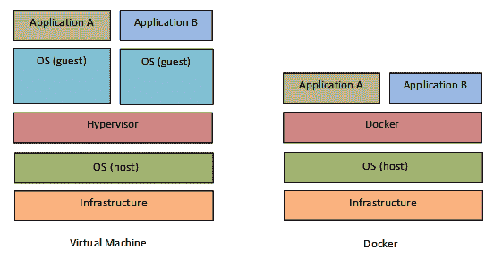

Microservice architecture in virtual machine and Docker implementation

在虚拟机中，称为**虚拟机监控程序**的工具负责（静态或动态）保留主机操作系统中的一定数量的资源，以专用于一个或多个操作系统，称为**来宾**或**主机**。来宾操作系统将与主机操作系统完全隔离。这种机制在资源方面非常昂贵，因此将微服务与虚拟机相结合的想法是完全不可能的。

另一方面，容器对这个问题的贡献则完全不同。隔离非常平淡，所有正在运行的容器都与底层操作系统共享同一个内核。管理程序开销完全消失，单个主机可以承载数百个容器。

当我们要求 Docker 从其映像运行容器时，该容器必须存在于本地磁盘上，否则 Docker 将警告我们该问题（显示一条消息，在本地读取无法找到映像“hello world:latest”），并将自动下载它。

为了找出哪些图像是从我们计算机上的 Docker 下载的，我们使用`docker images`命令：

```py
C:\>docker images
REPOSITORY TAG IMAGE ID CREATED SIZE
dockerize.py latest bc3d70b05ed4 23 hours ago 91.8MB
<none> <none> ca18efb44b3c 24 hours ago 91.8MB
python alpine3.7 00be2573e9f7 2 months ago 81.3MB
```

存储库是相关图像的容器。例如，dockerize 存储库包含 dockerize 映像的各种版本。在 Docker 的世界中，术语**标记**更正确地用于表示图像版本控制的概念。在前面的代码示例中，图像已标记为最新的，并且是 dockerize 存储库可用的唯一标记。

最新标记是默认标记：每当我们引用存储库而不指定标记名时，Docker 都会隐式引用最新标记，如果不存在，则会显示一个错误。因此，作为一种最佳实践，存储库标记形式更可取，因为它允许关于图像内容的更大的可预测性，避免容器之间可能的冲突和由于缺少最新标记而导致的错误。

# 另见

容器*技术是一个非常广泛的概念，可以通过在 web 上查阅大量的文章和应用程序示例来探索。然而，在开始这段漫长而艰难的旅程之前，建议从网站（[开始）https://www.docker.com/](https://www.docker.com/) ），内容完整，信息量大。*

 *在下一节中，我们将研究无服务器计算的主要功能，其主要目标是使软件开发人员更容易编写设计用于在云平台上运行的代码。

# 引入无服务器计算

近年来，开发了一种新的服务模型，名为**函数即服务**（**FaaS**），也称为**无服务器计算**。

无服务器计算是一种云计算范式，它允许应用程序的执行，而不必担心与底层基础设施相关的问题。术语**无服务器**可能具有误导性；事实上，可以认为该模型没有预见到处理服务器的使用。实际上，它表明执行应用程序的服务器的资源调配、可伸缩性和管理是以对开发人员完全透明的方式自动管理的。多亏了名为**无服务器**的新架构模型，一切皆有可能。

第一款 FaaS 机型可追溯到**亚马逊**，2014 年发布**AWS Lambda**服务。随着时间的推移，亚马逊解决方案中加入了其他替代方案，这些解决方案是由其他主要供应商开发的，例如**微软**，其**Azure 功能**，以及**IBM**和**谷歌**拥有自己的**云功能**。也有有效的开源解决方案：在最常用的解决方案中，我们有**Apache OpenWhisk**，该解决方案由**Bluemix**上的**IBM**使用，用于其无服务器产品，但也有**OpenLambda**和**IronFunctions**，后者基于 Docker 的容器技术。

在这个配方中，我们将看到如何通过**AWS Lambda**实现一个无服务器 Python 函数。

# 准备

AWS 是通过公共接口提供和管理的一整类云服务。在 AWS web 控制台中提供服务的公共接口可在[访问 https://console.aws.amazon.com/](https://console.aws.amazon.com/) 。

这种服务是收费的。但是，在第一年，提供了一个*免费层*，这是一组使用最少资源的服务，可以免费用于评估服务和开发应用程序。

For details on how to create a free account with AWS, please refer to the official Amazon documentation at [https://aws.amazon.com](https://aws.amazon.com/).

在这些部分中，我们将概述在 AWS Lambda 中运行代码的基础知识，而无需配置或管理任何服务器。我们将展示如何使用 AWS Lambda 控制台在 Lambda 中创建`Hello World`函数。我们还将解释如何使用示例事件数据手动调用 Lambda 函数，以及如何解释输出参数。本教程中显示的所有操作都可以在[作为自由计划的一部分执行 https://aws.amazon.com/free](https://aws.amazon.com/free) 。

# 怎么做。。。

让我们看一下以下步骤：

1.  首先要做的是登录到 Lambda 控制台（[https://console.aws.amazon.com/console/home](https://console.aws.amazon.com/console/home) ）。然后，您需要在“计算”下找到并选择 Lambda，以打开 AWS Lambda 控制台（在以下屏幕截图中以绿色突出显示）：

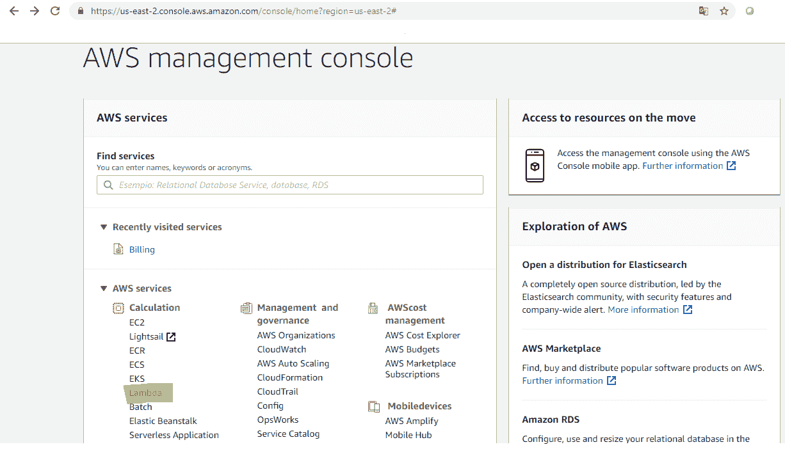

AWS: Selecting a Lambda service

2.  然后，在 AWS Lambda 控制台中，选择立即开始，然后创建 Lambda 函数：


AWS: Lambda start page

3.  在过滤器框中，键入`hello-world-python`并选择 hello world python**蓝图。**
***   现在我们需要配置 Lambda 函数。下表显示了配置并提供了示例值：**

 ***   **配置功能**：
*   **名称**：在此处输入函数名称。对于本教程，请输入`hello-world-python`。
*   **说明**：在这里，您可以输入该功能的简要说明。此框中预先填入短语 A starter AWS Lambda Function。
*   **运行时**：目前可以用 Java、Node.js、Python 2.7、3.6、3.7 编写 Lambda 函数的代码。在本教程中，将 Python2.7 设置为运行时。
*   **Lambda 功能代码**：
*   正如您在下面的屏幕截图中所看到的，可以查看 Python 示例代码。
*   **Lambda 函数处理程序和角色**：
*   处理程序：您可以指定 AWS Lambda 开始执行代码的方法。AWS Lambda 提供事件数据作为处理程序的输入，该处理程序将处理事件。在本例中，Lambda 从示例代码中标识事件，因此将使用 Lambda_function.Lambda_ 处理程序编译该字段。
*   角色：单击下拉菜单并选择基本执行角色：


AWS Configure function page

5.  此时，需要创建一个执行角色（命名为 IAM 角色），该角色具有必要的授权，由 AWS Lambda 解释为 Lambda 函数的执行者。单击允许，将返回配置功能页面，并选择 lambda_ 基本 _ 执行功能：


AWS: Role summary page

6.  控制台将代码保存在一个压缩文件中，该文件表示分发包。然后，控制台将分发包加载到 AWS Lambda 中，以创建 Lambda 函数：

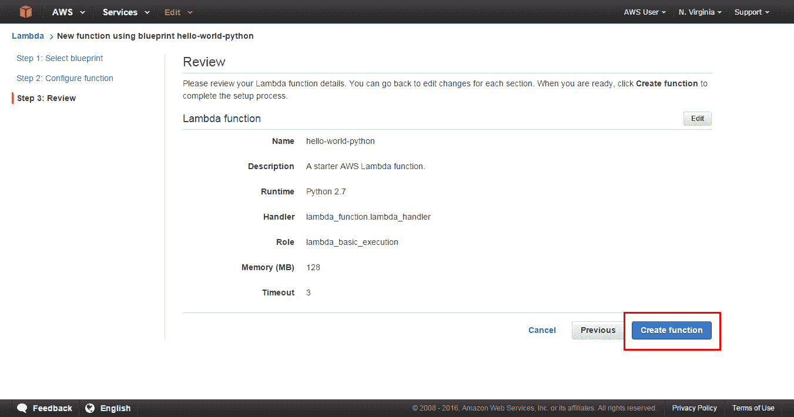

AWS: Lambda review page

现在可以测试功能、检查结果和显示日志：

1.  要运行我们的第一个 Lambda 函数，请单击测试：

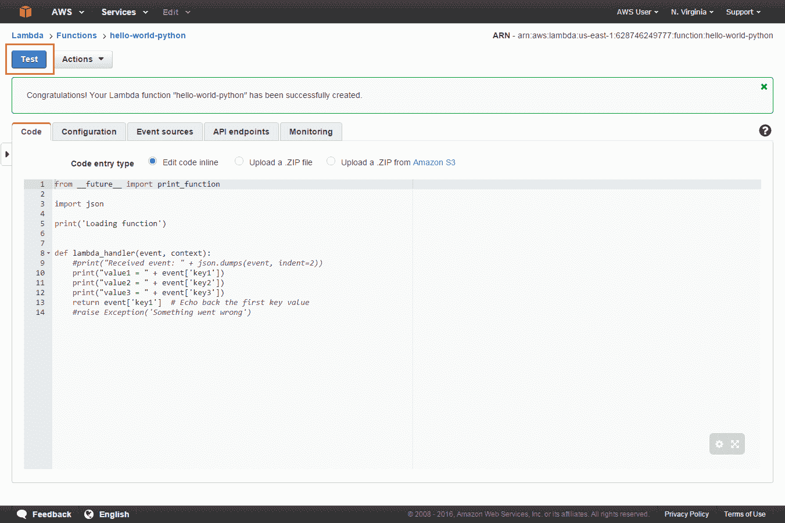

AWS: Lambda testing page

2.  在弹出编辑器中输入事件以测试函数。
3.  从输入测试事件页面上的示例事件模板列表中选择 Hello World：


AWS: Lambda template

单击保存并测试。然后，AWS Lambda 将代表您执行该功能。

# 它是如何工作的。。。

执行完成后，可以在控制台中看到结果：

*   执行结果部分记录函数的正确执行。
*   摘要部分显示日志输出部分中报告的最重要信息。
*   日志输出部分显示 Lambda 函数执行生成的日志：

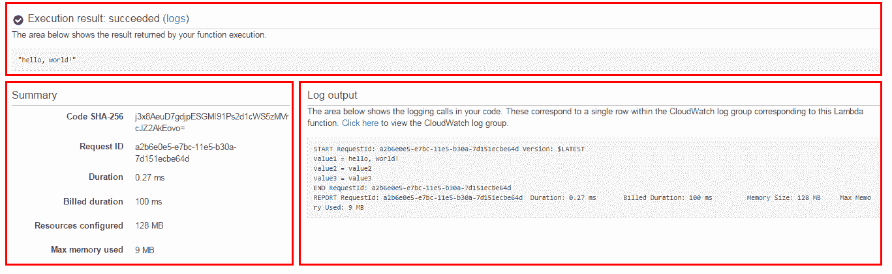

AWS: Execution results

# 还有更多。。。

**AWS Lambda**通过**Amazon CloudWatch**自动监控功能并生成参数报告（见以下截图）。为了简化执行期间对代码的监控，AWS Lambda 自动跟踪请求数、每个请求的延迟时间以及出现错误的请求数，并发布相关参数：


# 什么是 Lambda 函数？

Lambda 函数包含开发人员希望在响应某些事件时执行的代码。开发人员负责配置此代码，并在参考提供者的控制台中指定资源方面的需求。其他一切，包括资源大小，都由提供者根据所需的工作负载自动管理。

# 为什么没有服务器？

无服务器计算的好处如下：

*   **无基础设施管理：**开发者可以专注于要构建的产品，而不是运行时服务器的操作和管理。
*   **自动可伸缩性**：自动重新校准资源以应对任何类型的工作负载，无需配置可伸缩性，而是对实时事件做出反应。
*   **资源使用优化：**由于处理和存储资源是动态分配的，因此不再需要提前投资过剩产能。
*   **成本降低**：在传统云计算中，即使运行的资源没有实际使用，也会对其进行支付。在无服务器的情况下，应用程序是事件驱动的，这意味着当应用程序代码未运行时，不收取任何费用，因此您不必为未使用的资源付费。
*   **高可用性：**管理基础设施和应用程序的服务保证了高可用性和容错性。
*   **上市时间改进：**基础设施管理费用的取消使开发人员能够专注于产品质量，并更快地将代码投入生产。

# 可能的问题和限制

在评估采用无服务器计算时，有一些缺点需要考虑：

*   **可能的性能损失：**如果代码使用不频繁，则在执行过程中可能会出现延迟问题。与它在服务器、虚拟机或容器上连续执行的情况相比，这些情况尤为突出。这是因为（与使用自动缩放策略时的情况相反）对于无服务器模型，如果不使用代码，云提供商通常会完全释放资源。这意味着，如果运行时需要一些时间来启动，那么在初始启动阶段不可避免地会产生额外的延迟。
*   **无状态模式**：无服务器功能在无状态模式下运行。这意味着，如果要添加逻辑来保存某些元素，例如作为参数传递给不同函数的参数，则需要向应用程序流添加持久存储组件，并将事件彼此链接。例如，Amazon 提供了一个名为**AWS Step Functions**的附加工具，用于协调和管理无服务器应用程序的所有微服务和分布式组件的状态。
*   **资源限制：**无服务器计算不适用于某些类型的工作负载或用例，尤其是高性能的工作负载或用例，以及云提供商对资源使用的限制（例如，AWS 限制 Lambda 函数的并发运行次数）。这两个原因都是由于在有限和固定的时间内很难提供所需服务器的数量。
*   **调试和监控：**如果您依赖于非开源解决方案，那么开发人员将依赖供应商来调试和监控应用程序，因此，无法通过使用额外的探查器或调试器来详细诊断任何问题。因此，他们将不得不依赖各自供应商提供的工具。

# 另见

如我们所见，使用无服务器架构的参考点是 AWS 框架（[https://aws.amazon.com/](https://aws.amazon.com/) ）。在前面的 URL 中，您可以找到许多信息和教程，包括本节中描述的示例。******