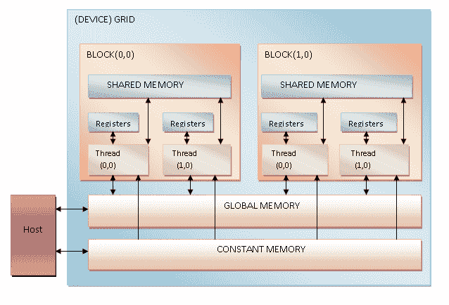
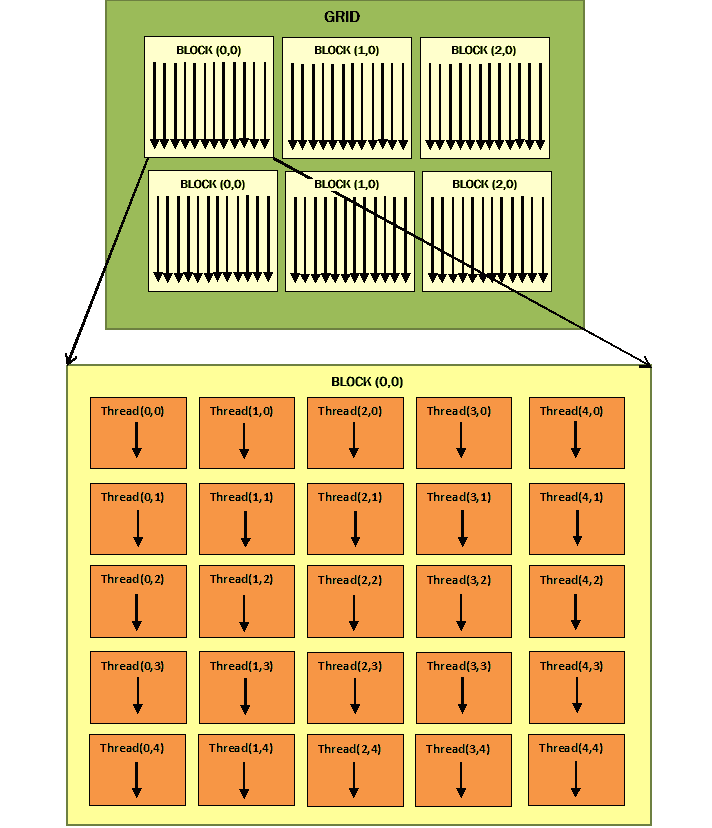
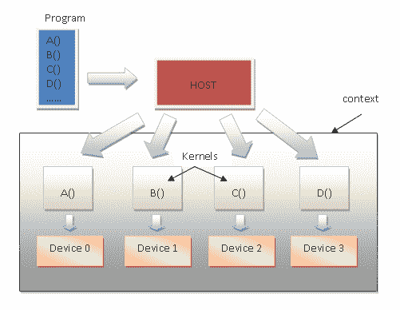
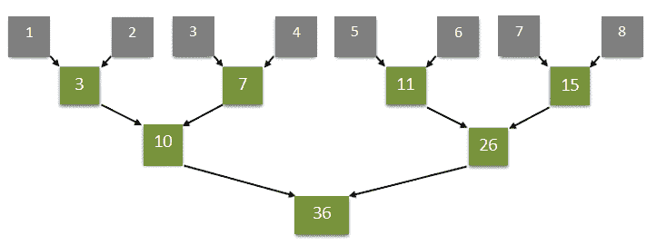

# 异构计算

本章将帮助我们通过 Python 语言探索**图形处理单元**（**GPU**的编程技术。GPU 的不断发展揭示了这些体系结构如何为执行复杂计算带来巨大好处。

GPU 当然不能取代 CPU。然而，它们是一种结构良好、异构的代码，能够利用这两种处理器的优势，事实上，这两种处理器都可以带来相当大的优势。

我们将考察用于异构编程的主要开发环境，即用于**计算统一设备架构**（**CUDA**和**PyOpenCL**环境的**PyCUDA**和**Numba**环境，它们是用于***的 Python 版本的开放计算语言**（**OpenCL**框架）。*

 *在本章中，我们将介绍以下配方：

*   理解异构计算
*   理解 GPU 架构
*   理解 GPU 编程
*   对付皮库达
*   用 PyCUDA 实现异构编程
*   用 PyCUDA 实现内存管理
*   介绍 PyOpenCL
*   使用 PyOpenCL 构建应用程序
*   使用 PyOpenCL 的元素级表达式
*   评估 PyOpenCL 应用程序
*   用 Numba 进行 GPU 编程

让我们从详细了解异构计算开始。

# 理解异构计算

多年来，为了寻求更高的性能来进行日益复杂的计算，计算机的使用采用了新技术。其中一种技术被称为*异构计算*，其目的是与不同（或异构）处理器进行协作，以便在时间计算效率方面（尤其是）具有优势。

在此上下文中，运行主程序的处理器（通常是 CPU）称为*h**ost*，而协处理器（例如 GPU）称为*d**设备*。后者通常在物理上与主机分离，并管理自己的内存空间，而内存空间也与主机的内存分离。

特别是，随着巨大的市场需求，GPU 已经发展成为一个高度并行的处理器，将 GPU 从用于图形渲染的设备转变为用于并行化和计算密集型通用计算的设备。

事实上，将 GPU 用于在屏幕上绘制图形以外的任务称为异构计算。

最后，好的 GPU 编程的任务是充分利用图形卡提供的高水平并行性和数学能力，最大限度地减少它带来的所有缺点，例如主机和设备之间的物理连接延迟。

# 理解 GPU 架构

GPU 是一种专门的 CPU/核心，用于图形数据的矢量处理，以从多边形原语渲染图像。一个好的 GPU 程序的任务是充分利用图形卡提供的高水平并行性和数学能力，并将其带来的所有缺点降到最低，例如主机和设备之间的物理连接延迟。

GPU 的特点是高度并行的结构，允许您以高效的方式操作大型数据集。此功能与硬件性能程序的快速改进相结合，使科学界注意到使用 GPU 的可能性，而不仅仅是渲染图像。

GPU（参见下图）由多个处理单元组成，这些处理单元称为**流式多处理器**（**SMs**，表示并行的第一逻辑级别。事实上，每个 SM 同时独立于其他 SM 工作：


GPU architecture

每个 SM 被划分为一组**流处理器**（**SP**），这些处理器有一个可以顺序运行线程的内核。SP 表示最小的执行逻辑单元和更精细的并行级别。

为了最好地编程这种类型的架构，我们需要介绍 GPU 编程，这将在下一节中介绍。

# 理解 GPU 编程

GPU 已经变得越来越可编程。事实上，它们的指令集已被扩展，以允许执行更多的任务。

今天，在 GPU 上，可以执行经典的 CPU 编程指令，如周期和条件、内存访问和浮点计算。两大离散显卡制造商**NVIDIA**和**AMD**已经开发了他们的 GPU 架构，为开发人员提供了相关的开发环境，允许使用不同的编程语言（包括 Python）进行编程。

目前，开发人员拥有在与图形无关的上下文中使用 GPU 的编程软件的宝贵工具。在异构计算的主要开发环境中，我们有 CUDA 和 OpenCL。

现在让我们详细了解一下。

# 库达

CUDA 是 NVIDIA 的专有硬件体系结构，它也为相关的开发环境命名。目前，CUDA 拥有数十万名活跃的开发人员，这表明在并行编程环境中围绕这项技术开发的兴趣越来越大。

CUDA 为最常用的编程语言（包括 Python）提供扩展。最著名的 CUDA Python 扩展如下所示：

*   PyCUDA（[https://mathema.tician.de/software/PyCUDA/](https://mathema.tician.de/software/pycuda/) ）
*   Numba（[http://numba.pydata.org](http://numba.pydata.org) ）

我们将在接下来的部分中使用这些扩展。

# 开放运算语言

并行计算的第二个主角是 OpenCL，它（与 NVIDIA 不同）是开放标准，不仅可以用于不同制造商的 GPU，还可以用于不同类型的微处理器。

然而，OpenCL 是一个更完整、更通用的解决方案，因为它没有 CUDA 所拥有的成熟性和简单性。

OpenCL Python 扩展是 PyOpenCL（[https://mathema.tician.de/software/pyopencl/](https://mathema.tician.de/software/pyopencl/) ）。

在以下部分中，将在其 Python 扩展中分析 CUDA 和 OpenCL 编程模型，并附带一些有趣的应用程序示例。

# 对付皮库达

PyCUDA 是一个绑定库，Andreas Klöckner 提供了对 CUDA 的 Python API 的访问。主要功能包括自动清理，它与对象的生命周期相关联，从而防止泄漏，方便地对模块和缓冲区进行抽象，完全访问驱动程序，以及内置错误处理。它也很轻

该项目是麻省理工学院许可证下的开源项目，文档非常清晰，在线找到的许多不同来源都可以提供帮助和支持。PyCUDA 的主要目的是让开发人员以最少的 Python 抽象调用 CUDA，它还支持 CUDA 元编程和模板化。

# 准备

请遵循 Andreas Klöckner 主页上的说明（[https://mathema.tician.de/software/pycuda/](https://mathema.tician.de/software/pycuda/) 安装 PyCUDA。

下一个编程示例具有双重功能：

*   第一个是验证 PyCUDA 是否正确安装。
*   第二个是读取和打印 GPU 卡的特性。

# 怎么做。。。

让我们看一下步骤，如下所示：

1.  使用第一条指令，我们将 Python 驱动程序（即`pycuda.driver`）导入安装在 PC 上的 CUDA 库：

```py
import pycuda.driver as drv
```

2.  初始化 CUDA。还要注意，在`pycuda.driver`模块中的任何其他指令之前，必须调用以下指令：

```py
drv.init()
```

3.  列举电脑上 GPU 卡的数量：

```py
print ("%d device(s) found." % drv.Device.count())
```

4.  对于当前的每个 GPU 卡，打印型号名称、计算能力和设备上的内存总量（以 KB 为单位）：

```py
for ordinal i n range(drv.Device.count()): 
       dev = drv.Device(ordinal) 
       print ("Device #%d: %s" % (ordinal, dev.name()) 
       print ("Compute Capability: %d.%d"% dev.compute_capability()) 
       print ("Total Memory: %s KB" % (dev.total_memory()//(1024))) 
```

# 它是如何工作的。。。

执行非常简单。在第一行代码中，`pycuda.driver`被导入并初始化：

```py
import pycuda.driver as drv  
drv.init() 
```

`pycuda.driver`模块向 CUDA 的编程接口公开驱动程序级，比 CUDA C 运行时级编程接口更灵活，并且有一些运行时没有的功能。

然后，循环进入`drv.Device.count()`功能，对于每个 GPU 卡，打印卡的名称及其主要特征（计算能力和总内存）：

```py
print ("Device #%d: %s" % (ordinal, dev.name()))  
print ("Compute Capability: %d.%d" % dev.compute_capability()) 
print ("Total Memory: %s KB" % (dev.total_memory()//(1024))) 
```

执行以下代码：

```py
C:\>python dealingWithPycuda.py
```

完成此操作后，屏幕上将显示已安装的 GPU，如下例所示：

```py
1 device(s) found.
Device #0: GeForce GT 240
Compute Capability: 1.2
Total Memory: 1048576 KB
```

# 还有更多。。。

CUDA 编程模型（以及 PyCUDA，它是 Python 包装器）是通过对 C 语言标准库的特定扩展实现的。这些扩展的创建方式与标准 C 库中的函数调用类似，允许对包含主机和设备代码的异构编程模型进行简单的处理。两个逻辑部分的管理由`nvcc`编译器完成。

以下简要介绍了其工作原理：

1.  *将*设备代码与主机代码分开。
2.  *调用*默认编译器（如 GCC）编译主机代码。
3.  *构建*二进制形式（`.cubin`对象）或汇编形式（`PTX`对象）的设备代码：


PyCUDA execution model

上述所有步骤均由 PyCUDA 在执行期间执行，与 CUDA 应用程序相比，应用程序加载时间有所增加。

# 另见

*   CUDA 编程指南可在此处获得：[https://docs.nvidia.com/CUDA/CUDA-c-programming-guide/](https://docs.nvidia.com/cuda/cuda-c-programming-guide/)
*   PyCUDA 文档可在此处获取：[https://documen.tician.de/PyCUDA/](https://documen.tician.de/pycuda/)

# 用 PyCUDA 实现异构编程

CUDA 编程模型（因此也是 PyCUDA 编程模型）设计用于在 CPU 和 GPU 上联合执行软件应用程序，以便在 CPU 上执行应用程序的顺序部分以及可以在 GPU 上并行的部分。不幸的是，计算机不够智能，无法理解如何自主地分发代码，因此，由开发人员指示哪些部分应由 CPU 和 GPU 运行。

事实上，CUDA 应用程序由系统 CPU 或主机执行的串行组件组成，或由 GPU 或设备执行的称为内核的并行组件组成

内核被定义为*网格*，可以依次分解为块，这些块依次分配给各个多处理器，从而实现*粗粒度并行*。在块内部，有一个基本的计算单元，线程，具有非常*精细的并行粒度*。一个线程只能属于一个块，并由整个内核的唯一索引标识。为了方便起见，可以对块使用二维索引，对线程使用三维索引。内核在它们之间按顺序执行。另一方面，块和线程是并行执行的。运行（并行）的线程数取决于它们在块中的组织，以及它们在资源方面的请求（相对于设备中可用的资源）。

To visualize the concepts expressed previously, please refer to (*Figure 5*) at [https://sites.google.com/site/computationvisualization/programming/cuda/article1](https://sites.google.com/site/computationvisualization/programming/cuda/article1).

这些模块旨在保证可伸缩性。事实上，如果一个体系结构有两个多处理器，另一个有四个，那么 GPU 应用程序可以在这两个体系结构上执行，显然具有不同的并行时间和级别。

因此，根据 PyCUDA 编程模型执行异构程序的结构如下：

1.  *在主机上分配*内存。
2.  *将*数据从主机*内存传输到设备内存。*
**   *通过调用内核函数运行*设备。*   *将*结果从设备存储器传输到主机存储器。*   *释放*设备上分配的内存。*

 *下图显示了根据 PyCUDA 编程模型的程序执行流程：


PyCUDA programming model

在下一个示例中，我们将通过一个具体的编程方法示例来构建 PyCUDA 应用程序。

# 怎么做。。。

为了展示 PycUDA 编程模型，我们考虑的任务是将 5×5 矩阵的所有元素加倍：

1.  我们导入要执行的任务所需的库：

```py
import PyCUDA.driver as CUDA 
import PyCUDA.autoinit 
from PyCUDA.compiler import SourceModule 
import numpy 
```

2.  我们导入的`numpy`库允许我们构造问题的输入，即一个 5×5 矩阵，其值是随机选择的：

```py
a = numpy.random.randn(5,5) 
a = a.astype(numpy.float32) 
```

3.  这样构建的矩阵必须从主机内存复制到设备内存。为此，我们在设备上分配一个存储空间（`a*_*gpu`，该存储空间必须包含矩阵`a`。为此，我们使用`mem_alloc`函数，该函数以分配的存储空间为主题。具体而言，矩阵`a`的字节数由`a.nbytes`参数表示如下：

```py
a_gpu = cuda.mem_alloc(a.nbytes) 
```

4.  之后，我们可以使用`memcpy_htod`功能将矩阵从主机转移到专门在设备上创建的存储区域：

```py
cuda.memcpy_htod(a_gpu, a) 
```

5.  在设备内部，`doubleMatrix`内核函数将运行。其目的是将输入矩阵的每个元素乘以`2`。如您所见，AUTYT2TY 函数的语法是类似 C 的，而 ORD T3 语句是 NVIDIA 编译器的一个真正的指令（AutoT4 编译器），它创建了一个模块，在这种情况下，它仅包含 AUTYT5ALE 函数：

```py
mod = SourceModule(""" 
  __global__ void doubles_matrix(float *a){ 
    int idx = threadIdx.x + threadIdx.y*4; 
    a[idx] *= 2;} 
  """)
```

6.  通过`func`参数，我们识别`mod`模块中包含的`doubleMatrix`功能：

```py
func = mod.get_function("doubles_matrix") 
```

7.  最后，我们运行内核函数。为了在设备上成功执行内核函数，CUDA 用户必须指定内核的输入和执行线程块的大小。在以下情况下，输入是之前复制到设备的`a_gpu`矩阵，而螺纹块的尺寸是`(5,5,1)`：

```py
func(a_gpu, block=(5,5,1)) 
```

8.  因此，我们分配一个大小等于输入矩阵`a`大小的内存区域：

```py
a_doubled = numpy.empty_like(a) 
```

9.  然后，我们将分配给设备的存储区域的内容即`a_gpu`矩阵复制到先前定义的存储区域`a_doubled`：

```py
cuda.memcpy_dtoh(a_doubled, a_gpu) 
```

10.  最后，我们打印输入矩阵`a`和输出矩阵的内容，以验证实现的质量：

```py
print ("ORIGINAL MATRIX") 
print (a) 
print ("DOUBLED MATRIX AFTER PyCUDA EXECUTION") 
print (a_doubled) 
```

# 它是如何工作的。。。

让我们先看看在本例中导入了哪些库：

```py
import PyCUDA.driver as CUDA 
import PyCUDA.autoinit 
from PyCUDA.compiler import SourceModule 
```

特别是，`autoinit`导入会自动识别系统上可供执行的 GPU，而`SourceModule`是 NVIDIA（`nvcc`编译器的指令，允许我们识别必须编译并上传到设备的对象。

然后利用`numpy`库建立 5×5 的输入矩阵：

```py
import numpy 
a = numpy.random.randn(5,5) 
```

在这种情况下，矩阵中的元素将转换为单精度模式（因为执行此示例的图形卡仅支持单精度）：

```py
a = a.astype(numpy.float32) 
```

然后，我们使用以下两个操作将阵列从主机复制到设备：

```py
a_gpu = CUDA.mem_alloc(a.nbytes) 
CUDA.memcpy_htod(a_gpu, a) 
```

请注意，在执行内核函数期间，设备和主机内存可能永远不会通信。因此，为了在设备上并行执行内核函数，与内核函数相关的所有输入数据也必须存在于设备的内存中。

还应该注意的是，`a_gpu`矩阵是线性化的，也就是说，它是一维的，因此我们必须对其进行管理。

此外，所有这些操作都不需要内核调用。这意味着它们是由主机直接制作的。

`SourceModule`实体允许定义`doubleMatrix`内核函数。`__global__`是`nvcc`指令，表示设备将处理`doubleMatrix`函数：

```py
mod = SourceModule(""" 
  __global__ void doubleMatrix(float *a) 
```

让我们考虑内核的体。{席 0t}参数是矩阵索引，它是由{ T1·t1 和} T2×线程坐标标识的：

```py
    int idx = threadIdx.x + threadIdx.y*4; 
    a[idx] *= 2; 
```

然后，`mod.get_function("doubleMatrix")`将标识符返回给`func`参数：

```py
func = mod.get_function("doubleMatrix ") 
```

为了执行内核，我们需要配置执行上下文。这意味着使用`func`调用中的 block 参数设置属于块网格的线程的三维结构：

```py
func(a_gpu, block = (5, 5, 1)) 
```

`block = (5, 5, 1)`告诉我们，我们正在调用一个具有`a_gpu`线性化输入矩阵的核函数，在*x*方向调用一个大小为`5`的单线程块（即`5`线程），在*y*方向调用一个`*5*`线程，在*z*方向调用一个线程，这使得总共有 16 个*线程。请注意，每个线程执行相同的内核代码（总共 25 个线程）。*

在 GPU 设备中进行计算后，我们使用数组存储结果：

```py
a_doubled = numpy.empty_like(a) 
CUDA.memcpy_dtoh(a_doubled, a_gpu) 
```

要运行该示例，请在命令提示符下键入以下命令：

```py
C:\>python heterogenousPycuda.py
```

输出应如下所示：

```py
ORIGINAL MATRIX
[[-0.59975582 1.93627465 0.65337795 0.13205571 -0.46468592]
[ 0.01441949 1.40946579 0.5343408 -0.46614054 -0.31727529]
[-0.06868593 1.21149373 -0.6035406 -1.29117763 0.47762445]
[ 0.36176383 -1.443097 1.21592784 -1.04906416 -1.18935871]
[-0.06960868 -1.44647694 -1.22041082 1.17092752 0.3686313 ]] 
DOUBLED MATRIX AFTER PyCUDA EXECUTION
[[-1.19951165 3.8725493 1.3067559 0.26411143 -0.92937183]
[ 0.02883899 2.81893158 1.0686816 -0.93228108 -0.63455057]
[-0.13737187 2.42298746 -1.2070812 -2.58235526 0.95524889]
[ 0.72352767 -2.886194 2.43185568 -2.09812832 -2.37871742]
[-0.13921736 -2.89295388 -2.44082164 2.34185504 0.73726263 ]]
```

# 还有更多。。。

CUDA 使该编程模型与其他并行模型（通常在 CPU 上使用）有很大不同的关键特性是，为了提高效率，它需要数千个线程处于活动状态。GPU 的典型结构使这成为可能，它使用轻线程，还允许以非常快速和高效的方式创建和修改执行上下文。

请注意，线程调度与 GPU 体系结构及其内在并行性直接相关。事实上，一个线程块被分配给一个 SM。在这里，线被进一步划分为组，称为翘曲。属于同一个 warp 的线程由*warp 调度器*管理。为了充分利用 SM 固有的并行性，相同扭曲的线程必须执行相同的指令。如果这种情况没有发生，那么我们就说*线程发散。*

# 另见

*   有关使用 PyCUDA 的完整教程可在以下站点获得：[https://documen.tician.de/pycuda/tutorial.html](https://documen.tician.de/pycuda/tutorial.html) 。
*   要在 Windows 10 上安装 PyCUDA，请查看以下链接：[https://github.com/kdkoadd/Win10-PyCUDA-Install](https://github.com/kdkoadd/Win10-PyCUDA-Install) 。

# 用 PyCUDA 实现内存管理

PyCUDA 程序应该遵守 SM 的结构和内部组织规定的规则，这些规则对线程性能施加约束。事实上，GPU 提供的各种类型内存的知识和正确使用是实现最高效率的基础。在那些为 CUDA 使用而启用的 GPU 卡中，有四种类型的内存，如下所示：

*   **寄存器**：每个线程都分配了一个内存寄存器，只有分配的线程才能访问该寄存器，即使这些线程属于同一块。
*   **共享内存**：每个块在属于它的线程之间都有自己的共享内存。甚至这种记忆也非常快。
*   **恒定内存**：网格中的所有线程都可以恒定访问内存，但只能在读取时访问。其中存在的数据将在应用程序的整个过程中保持不变。
*   **全局内存**：网格的所有线程以及所有内核都可以访问全局内存。此外，数据持久性就像一个恒定的内存：



GPU memory model

# 准备

因此，为了获得最佳性能，PyCUDA 程序必须充分利用每种类型的内存。特别是，它必须充分利用共享内存，最大限度地减少对全局级别内存的访问。

为此，问题域通常被细分，以便单个线程块能够在封闭的数据子集中执行其处理。这样，在单个线程块上操作的线程将在同一共享内存区域上共同工作，从而优化访问。

每个线程的基本步骤如下所示：

1.  *将*数据从全局内存加载到共享内存。
2.  *同步*块的所有线程，这样每个人都可以读取安全位置和其他线程填充的共享内存。
3.  *处理*共享内存的数据。必须进行新的同步，以确保已使用结果更新共享内存。
4.  *将*结果写入全局内存。

为了阐明这种方法，在下一节中，我们将给出一个基于两个矩阵乘积计算的示例。

# 怎么做。。。

以下代码片段显示了在基于顺序方法的标准方法中计算两个矩阵的乘积*M×N*。输出矩阵`P`的每个元素通过从矩阵`M`中提取行元素和从矩阵`N`中提取列元素来获得：

```py
void SequentialMatrixMultiplication(float*M,float *N,float *P, int width){ 
  for (int i=0; i< width; ++i) 
      for(int j=0;j < width; ++j) { 
          float sum = 0; 
          for (int k = 0 ; k < width; ++k) { 
              float a = M[I * width + k]; 
              float b = N[k * width + j]; 
              sum += a * b; 
                     } 
         P[I * width + j] = sum; 
    } 
} 
P[I * width + j] = sum; 
```

在这种情况下，如果给每个线程分配了计算矩阵的每个元素的任务，那么对内存的访问将主导算法的执行时间。

我们能做的就是依靠一块线程一次计算一个输出子矩阵。通过这种方式，访问同一内存块的线程协同优化访问，从而使总计算时间最小化：

1.  第一步是加载实现算法所需的所有模块：

```py
import numpy as np 
from pycuda import driver, compiler, gpuarray, tools 
```

2.  然后，初始化 GPU 设备：

```py
import pycuda.autoinit 
```

3.  我们实现了`kernel_code_template`，它实现了两个矩阵的乘积，分别用`a`和`b`表示，而得到的矩阵用参数`c`表示。注意`MATRIX_SIZE`参数将在下一步中定义：

```py
kernel_code_template = """ 
__global__ void MatrixMulKernel(float *a, float *b, float *c) 
{ 
    int tx = threadIdx.x; 
    int ty = threadIdx.y; 
    float Pvalue = 0; 
    for (int k = 0; k < %(MATRIX_SIZE)s; ++k) { 
        float Aelement = a[ty * %(MATRIX_SIZE)s + k]; 
        float Belement = b[k * %(MATRIX_SIZE)s + tx]; 
        Pvalue += Aelement * Belement; 
    } 
    c[ty * %(MATRIX_SIZE)s + tx] = Pvalue; 
}""" 
```

4.  以下参数将用于设置矩阵的尺寸。在这种情况下，尺寸为 5×5：

```py
MATRIX_SIZE = 5
```

5.  我们定义了两个输入矩阵`a_cpu`和`b_cpu`，它们将包含随机浮点值：

```py
a_cpu = np.random.randn(MATRIX_SIZE, MATRIX_SIZE).astype(np.float32) 
b_cpu = np.random.randn(MATRIX_SIZE, MATRIX_SIZE).astype(np.float32)
```

6.  然后，我们计算主机设备上的两个矩阵`a`和`b`的乘积：

```py
c_cpu = np.dot(a_cpu, b_cpu) 
```

7.  我们在设备（GPU）上分配与输入矩阵大小相等的内存区域：

```py
a_gpu = gpuarray.to_gpu(a_cpu)  
b_gpu = gpuarray.to_gpu(b_cpu) 
```

8.  我们在 GPU 上分配一个内存区域，大小等于两个矩阵乘积产生的输出矩阵。在这种情况下，生成的矩阵`c_gpu`的大小为 5×5：

```py
c_gpu = gpuarray.empty((MATRIX_SIZE, MATRIX_SIZE), np.float32) 
```

9.  以下`kernel_code`重新定义了`kernel_code_template`，但设置了`matrix_size`参数：

```py
kernel_code = kernel_code_template % { 
    'MATRIX_SIZE': MATRIX_SIZE} 
```

10.  `SourceModule`指令告诉`nvcc`（*NVIDIA CUDA 编译器）*必须创建一个模块，即包含先前定义的`kernel_code`的函数集合：

```py
mod = compiler.SourceModule(kernel_code) 
```

11.  最后，我们从模块`mod`中获取`MatrixMulKernel`函数，我们将其命名为`matrixmul`：

```py
matrixmul = mod.get_function("MatrixMulKernel")
```

12.  我们在两个矩阵`a_gpu`和`b_gpu`之间执行乘积，得到`c_gpu`矩阵。螺纹块的尺寸定义为`MATRIX_SIZE, MATRIX_SIZE, 1`：

```py
matrixmul( 
    a_gpu, b_gpu,  
    c_gpu,  
    block = (MATRIX_SIZE, MATRIX_SIZE, 1))
```

13.  打印输入矩阵：

```py
print ("-" * 80) 
print ("Matrix A (GPU):") 
print (a_gpu.get()) 
print ("-" * 80) 
print ("Matrix B (GPU):") 
print (b_gpu.get()) 
print ("-" * 80) 
print ("Matrix C (GPU):") 
print (c_gpu.get()) 
```

14.  为了检查在 GPU 上执行的计算的有效性，我们比较了在主机设备（CPU）上执行的和在设备（GPU）上执行的两种实现的结果。为此，我们使用`numpy allclose`指令，该指令验证两个元素阵列在等于`1e-05`的公差范围内相等：

```py
np.allclose(c_cpu, c_gpu.get()) 
```

# 它是如何工作的。。。

让我们考虑 PycUDA 编程工作流。让我们准备输入矩阵、输出矩阵以及结果的存储位置：

```py
MATRIX_SIZE = 5 
a_cpu = np.random.randn(MATRIX_SIZE, MATRIX_SIZE).astype(np.float32) 
b_cpu = np.random.randn(MATRIX_SIZE, MATRIX_SIZE).astype(np.float32) 
c_cpu = np.dot(a_cpu, b_cpu) 
```

然后，我们使用`gpuarray.to_gpu()`PyCUDA 函数将这些矩阵传输到 GPU 设备：

```py
a_gpu = gpuarray.to_gpu(a_cpu)  
b_gpu = gpuarray.to_gpu(b_cpu) 
c_gpu = gpuarray.empty((MATRIX_SIZE, MATRIX_SIZE), np.float32) 
```

该算法的核心是以下核函数。请注意，`__global__`关键字指定此函数是一个内核函数，这意味着它将在主机代码（CPU）调用后由设备（GPU）执行：

```py
__global__ void MatrixMulKernel(float *a, float *b, float *c){
    int tx = threadIdx.x;
    int ty = threadIdx.y;
    float Pvalue = 0;
    for (int k = 0; k < %(MATRIX_SIZE)s; ++k) {
        float Aelement = a[ty * %(MATRIX_SIZE)s + k];
        float Belement = b[k * %(MATRIX_SIZE)s + tx];
        Pvalue += Aelement * Belement;}
    c[ty * %(MATRIX_SIZE)s + tx] = Pvalue;
}
```

`threadIdx.x`和`threadIdy.y`是允许识别二维块网格中螺纹的坐标。请注意，网格块中的线程执行相同的内核代码，但在不同的数据段上执行。如果我们将并行版本与顺序版本进行比较，那么我们会立即注意到循环索引*i*和*j*已被`threadIdx.x`和`threadIdx.y`索引替换。

这意味着在并行版本中，我们只有一次循环迭代。事实上，`MatrixMulKernel`内核将在 5×5 并行线程的网格上执行。

该条件如下图所示：



Grid and block of thread organization for the example

然后，我们仅通过比较两个结果矩阵来验证乘积计算：

```py
np.allclose(c_cpu, c_gpu.get())
```

结果如下：

```py
C:\>python memManagementPycuda.py

---------------------------------------------------------------------
Matrix A (GPU):
[[ 0.90780383 -0.4782407 0.23222363 -0.63184392 1.05509627]
 [-1.27266967 -1.02834761 -0.15528528 -0.09468858 1.037099 ]
 [-0.18135822 -0.69884419 0.29881889 -1.15969539 1.21021318]
 [ 0.20939326 -0.27155793 -0.57454145 0.1466181 1.84723163]
 [ 1.33780348 -0.42343542 -0.50257754 -0.73388749 -1.883829 ]]
---------------------------------------------------------------------
Matrix B (GPU):
[[ 0.04523897 0.99969769 -1.04473436 1.28909719 1.10332143]
 [-0.08900332 -1.3893919 0.06948703 -0.25977209 -0.49602833]
 [-0.6463753 -1.4424541 -0.81715286 0.67685211 -0.94934392]
 [ 0.4485206 -0.77086055 -0.16582981 0.08478995 1.26223004]
 [-0.79841441 -0.16199949 -0.35969591 -0.46809086 0.20455229]]
---------------------------------------------------------------------
Matrix C (GPU):
[[-1.19226956 1.55315971 -1.44614291 0.90420711 0.43665022]
 [-0.73617989 0.28546685 1.02769876 -1.97204924 -0.65403283]
 [-1.62555301 1.05654192 -0.34626681 -0.51481217 -1.35338223]
 [-1.0040834 1.00310731 -0.4568972 -0.90064859 1.47408712]
 [ 1.59797418 3.52156591 -0.21708387 2.31396151 0.85150564]]
---------------------------------------------------------------------

TRUE
```

# 还有更多。。。

共享内存中分配的数据在单线程块中的可见性有限。很容易看出 PyCUDA 编程模型适用于特定的应用程序类。

特别是，这些应用程序必须呈现的特性涉及许多数学运算的存在，具有高度的数据并行性（即，在大量数据上重复相同的操作序列）。

具有这些特征的应用领域都属于以下科学：密码学、计算化学、图像和信号分析。

# 另见

*   更多使用 PyCUDA 的示例可在[中找到 https://github.com/zamorays/miniCursoPycuda](https://github.com/zamorays/miniCursoPycuda) 。

# 介绍 PyOpenCL

PyOpenCL 是 PyCUDA 的姐妹项目。它是一个绑定库，提供了从 Python 对 OpenCL API 的完全访问，Andreas Klöckner 也是这样做的。它具有许多与 PyCUDA 相同的概念，包括范围外对象的清理、数据结构的部分抽象和错误处理，所有这些都以最小的开销实现。该项目获得麻省理工学院许可证；它的文档非常好，在网上可以找到大量的指南和教程。

PyOpenCL 的主要重点是提供 Python 和 OpenCL 之间的轻量级连接，但它还包括对模板和元程序的支持。PyopCl 程序的流程与 OpenCL 的 C 或 C++程序几乎完全相同。主机程序准备设备程序的调用，启动它，然后等待结果。

# 准备

PyOpenCL 安装的主要参考是 Andreas Klöckner 主页：[https://mathema.tician.de/software/pyopencl/](https://mathema.tician.de/software/pyopencl/) 。

如果您使用的是蟒蛇，建议执行以下步骤：

1.  从以下链接使用 Python 3.7 安装最新的 Anaconda 发行版：[https://www.anaconda.com/distribution/#download-第](https://www.anaconda.com/distribution/#download-section)节。对于本节，已安装适用于 Windows Installer 的 Anaconda 2019.07。
2.  从以下链接获取 Christoph Gohlke 提供的 PyOpenCL 预构建二进制文件：[https://www.lfd.uci.edu/~gohlke/pythonlibs/](https://www.lfd.uci.edu/~gohlke/pythonlibs/)。选择操作系统和 CPython 版本的正确组合。在这里，我们使用`pyopencl-2019.1+cl12-cp37-cp37m-win_amd64.whl`。

3.  使用`pip`安装上一个软件包。只需在 Anaconda 提示符中键入以下内容：

```py
(base) C:\> pip install <directory>\pyopencl-2019.1+cl12-cp37-cp37m-win_amd64.whl

```

`<directory>`是 PyOpenCL 包所在的文件夹。

此外，以下符号表示我们正在 Anaconda 提示符上操作：

```py
(base) C:\>
```

# 怎么做。。。

在下面的示例中，我们将使用 PyOpenCL 的一个函数，该函数允许我们枚举它将在其上运行的 GPU 的特性。

我们实现的代码非常简单且符合逻辑：

1.  在第一步中，我们导入`pyopencl`库：

```py
import pyopencl as cl
```

2.  我们构建了一个函数，其输出将为我们提供所用 GPU 硬件的特征：

```py
def print_device_info() :
    print('\n' + '=' * 60 + '\nOpenCL Platforms and Devices')
    for platform in cl.get_platforms():
        print('=' * 60)
        print('Platform - Name: ' + platform.name)
        print('Platform - Vendor: ' + platform.vendor)
        print('Platform - Version: ' + platform.version)
        print('Platform - Profile: ' + platform.profile)

        for device in platform.get_devices():
            print(' ' + '-' * 56)
            print(' Device - Name: ' \
                  + device.name)
            print(' Device - Type: ' \
                  + cl.device_type.to_string(device.type))
            print(' Device - Max Clock Speed: {0} Mhz'\
                  .format(device.max_clock_frequency))
            print(' Device - Compute Units: {0}'\
                  .format(device.max_compute_units))
            print(' Device - Local Memory: {0:.0f} KB'\
                  .format(device.local_mem_size/1024.0))
            print(' Device - Constant Memory: {0:.0f} KB'\
                  .format(device.max_constant_buffer_size/1024.0))
            print(' Device - Global Memory: {0:.0f} GB'\
                  .format(device.global_mem_size/1073741824.0))
            print(' Device - Max Buffer/Image Size: {0:.0f} MB'\
                  .format(device.max_mem_alloc_size/1048576.0))
            print(' Device - Max Work Group Size: {0:.0f}'\
                  .format(device.max_work_group_size))
    print('\n')
```

3.  所以我们实现了`main`函数，它调用了之前实现的`print_device_info`函数：

```py
if __name__ == "__main__":
    print_device_info()
```

# 它是如何工作的。。。

以下命令用于导入`pyopencl`库：

```py
import pyopencl as cl
```

这允许我们使用**`get_platforms`**方法，返回平台实例列表，即系统中的设备列表：

```py
for platform in cl.get_platforms():
```

然后，对于找到的每个设备，将显示以下主要功能：

*   名称和设备类型
*   最大时钟速度
*   计算单位
*   本地/常量/全局内存

此示例的输出如下所示：

```py
(base) C:\>python deviceInfoPyopencl.py

=============================================================
OpenCL Platforms and Devices
============================================================
Platform - Name: NVIDIA CUDA
Platform - Vendor: NVIDIA Corporation
Platform - Version: OpenCL 1.2 CUDA 10.1.152
Platform - Profile: FULL_PROFILE
    --------------------------------------------------------
    Device - Name: GeForce 840M
    Device - Type: GPU
    Device - Max Clock Speed: 1124 Mhz
    Device - Compute Units: 3
    Device - Local Memory: 48 KB
    Device - Constant Memory: 64 KB
    Device - Global Memory: 2 GB
    Device - Max Buffer/Image Size: 512 MB
    Device - Max Work Group Size: 1024
============================================================
Platform - Name: Intel(R) OpenCL
Platform - Vendor: Intel(R) Corporation
Platform - Version: OpenCL 2.0
Platform - Profile: FULL_PROFILE
    --------------------------------------------------------
    Device - Name: Intel(R) HD Graphics 5500
    Device - Type: GPU
    Device - Max Clock Speed: 950 Mhz
    Device - Compute Units: 24
    Device - Local Memory: 64 KB
    Device - Constant Memory: 64 KB
    Device - Global Memory: 3 GB
    Device - Max Buffer/Image Size: 808 MB
    Device - Max Work Group Size: 256
    --------------------------------------------------------
    Device - Name: Intel(R) Core(TM) i7-5500U CPU @ 2.40GHz
    Device - Type: CPU
    Device - Max Clock Speed: 2400 Mhz
    Device - Compute Units: 4
    Device - Local Memory: 32 KB
    Device - Constant Memory: 128 KB
    Device - Global Memory: 8 GB
    Device - Max Buffer/Image Size: 2026 MB
    Device - Max Work Group Size: 8192
```

# 还有更多。。。

OpenCL 目前由 Khronos Group 管理，Khronos Group 是一个非盈利的公司财团，合作定义此（以及许多其他）标准的规范和合规性参数，为每种类型的平台创建 OpenCL 特定的驱动程序。

这些驱动程序还提供了编译用内核语言编写的程序的功能：这些程序被转换成某种形式的中间语言（通常是特定于供应商的），然后在参考体系结构上执行。

有关 OpenCL 的更多信息，请访问以下链接：[https://www.khronos.org/registry/OpenCL/](https://www.khronos.org/registry/OpenCL/) 。

# 另见

*   PyOpenCL 文档可在此处获得：[https://documen.tician.de/pyopencl/](https://documen.tician.de/pyopencl/) 。
*   对 PyOpenCL 最好的介绍之一，即使有点过时，也可以在以下链接中找到：[http://www.drdobbs.com/open-source/easy-opencl-with-python/240162614](http://www.drdobbs.com/open-source/easy-opencl-with-python/240162614) 。

# 使用 PyOpenCL 构建应用程序

构建 PyOpenCL 程序的第一步是对主机应用程序进行编码。这是在 CPU 上执行的，其任务是管理 GPU 卡（即设备）上内核的可能执行。

*内核*是可执行代码的基本单元，类似于 C 函数。它可以是数据并行或任务并行。然而，PyOpenCL 的基石是并行性的开发。

一个基本概念是*程序*，它是内核和其他函数的集合，类似于动态库。因此，我们可以将指令分组到一个内核中，并将不同的内核分组到一个程序中。

可以从应用程序调用程序。我们有执行队列，指示内核的执行顺序。但是，在某些情况下，可以在不遵循原始顺序的情况下启动。

最后，我们可以列出使用 PyOpenCL 开发应用程序的基本要素：

*   **设备**：标识执行内核代码的硬件。请注意，PyOpenCL 应用程序既可以在 CPU 和 GPU 板（以及 PyCUDA）上运行，也可以在嵌入式设备上运行，如****现场可编程门阵列****【T12 FPGA。****
*****   **程序**：这是一组内核，其任务是选择设备上必须运行的内核。*   **内核**：这是要在设备上执行的代码。内核是一个类似 C 的函数，这意味着它可以在任何支持 PyOpenCL 驱动程序的设备上编译。*   **命令队列**：命令设备上内核的执行。*   **上下文**：这是一组允许设备接收内核和传输数据的设备。****

 ****下图显示了此数据结构如何在主机应用程序中工作：



PyOpenCL programming model

同样，我们观察到一个程序可以包含更多的函数在设备上运行，并且每个内核只封装程序中的一个函数。

# 怎么做。。。

在下面的示例中，我们展示了使用 PyOpenCL 构建应用程序的基本步骤：要执行的任务是两个向量的总和。为了得到可读的输出，我们将考虑两个向量，每个向量都有 100 个元素：每一个向量 T2，第 i 个 T3。

1.  让我们从导入所有必要的库开始：

```py
import numpy as np 
import pyopencl as cl 
import numpy.linalg as la 
```

2.  我们定义要添加的向量的大小，如下所示：

```py
vector_dimension = 100 
```

3.  这里，输入向量`vector_a`和`vector_b`被定义为：

```py
vector_a = np.random.randint(vector_dimension,size=vector_dimension) 
vector_b = np.random.randint(vector_dimension,size=vector_dimension) 
```

4.  依次定义**`platform`**、**`device`**、**`context`**、**`queue`**：

```py
platform = cl.get_platforms()[1] 
device = platform.get_devices()[0] 
context = cl.Context([device]) 
queue = cl.CommandQueue(context) 
```

5.  现在，该组织包含输入向量的内存区域了：

```py
mf = cl.mem_flags 
a_g = cl.Buffer(context, mf.READ_ONLY | mf.COPY_HOST_PTR,\ hostbuf=vector_a) 
b_g = cl.Buffer(context, mf.READ_ONLY | mf.COPY_HOST_PTR,\ hostbuf=vector_b) 
```

6.  最后，我们使用`Program`方法构建应用内核：

```py
program = cl.Program(context, """ 
__kernel void vectorSum(__global const int *a_g, __global const int *b_g, __global int *res_g) { 
  int gid = get_global_id(0); 
  res_g[gid] = a_g[gid] + b_g[gid]; 
} 
""").build()
```

7.  然后，我们分配结果矩阵的内存：

```py
res_g = cl.Buffer(context, mf.WRITE_ONLY, vector_a.nbytes) 
```

8.  然后，我们调用内核函数：

```py
program.vectorSum(queue, vector_a.shape, None, a_g, b_g, res_g) 
```

9.  用于存储结果的存储空间分配在主机存储区*（*`res_np`*中：*

 *```py
res_np = np.empty_like(vector_a) 
```

10.  将计算结果复制到创建的内存区域中：

```py
cl._enqueue_copy(queue, res_np, res_g) 
```

11.  最后，我们打印结果：

```py
print ("PyOPENCL SUM OF TWO VECTORS") 
print ("Platform Selected = %s" %platform.name ) 
print ("Device Selected = %s" %device.name) 
print ("VECTOR LENGTH = %s" %vector_dimension) 
print ("INPUT VECTOR A") 
print (vector_a) 
print ("INPUT VECTOR B") 
print (vector_b) 
print ("OUTPUT VECTOR RESULT A + B ") 
print (res_np) 
```

12.  然后，我们执行一个简单的检查，以验证求和操作是否正确：

```py
assert(la.norm(res_np - (vector_a + vector_b))) < 1e-5 
```

# 它是如何工作的。。。

在以下行中，在相关导入之后，我们定义输入向量*：*

```py
vector_dimension = 100 
vector_a = np.random.randint(vector_dimension, size= vector_dimension) 
vector_b = np.random.randint(vector_dimension, size= vector_dimension) 
```

每个向量包含 100 个整数项，通过`numpy`函数随机选择：

```py
np.random.randint(max integer , size of the vector) 
```

然后，我们采用`get_platform()`方法选择平台进行计算：

```py
platform = cl.get_platforms()[1] 
```

然后，选择相应的设备。此处，`platform.get_devices()[0]`对应于 Intel（R）HD Graphics 5500 图形卡：

```py
device = platform.get_devices()[0]
```

在以下步骤中，定义了上下文和队列；PyOpenCL 提供方法上下文（选择设备）和队列（选择上下文）：

```py
context = cl.Context([device]) 
queue = cl.CommandQueue(context) 
```

为了在所选设备中执行计算，将输入向量复制到设备存储器中：

```py
mf = cl.mem_flags 
a_g = cl.Buffer(context, mf.READ_ONLY | mf.COPY_HOST_PTR,\
hostbuf=vector_a) 
b_g = cl.Buffer(context, mf.READ_ONLY | mf.COPY_HOST_PTR,\
 hostbuf=vector_b) 
```

然后，我们为结果向量准备缓冲区：

```py
res_g = cl.Buffer(context, mf.WRITE_ONLY, vector_a.nbytes) 
```

这里定义了内核代码：

```py
program = cl.Program(context, """ 
__kernel void vectorSum(__global const int *a_g, __global const int *b_g, __global int *res_g) { 
  int gid = get_global_id(0); 
  res_g[gid] = a_g[gid] + b_g[gid];} 
""").build()
```

`vectorSum`是内核的名称，参数列表定义了输入参数的数据类型和输出数据类型（都是整数向量）。在内核体内部，两个向量之和在以下步骤中定义：

1.  *初始化*向量的索引：`int gid = get_global_id(0)`。
2.  *求和*向量的分量：`res_g[gid] = a_g[gid] + b_g[gid]`。

在 OpenCL 中（因此，在 PyOpenCL 中），缓冲区被附加到上下文（[https://documen.tician.de/pyopencl/runtime.html#pyopencl.Context](https://documen.tician.de/pyopencl/runtime.html#pyopencl.Context) ），一旦在设备上使用了缓冲区，就会将其移动到该设备。

最后，我们在设备中执行`vectorSum`：

```py
program.vectorSum(queue, vector_a.shape, None, a_g, b_g, res_g)
```

为了检查结果，我们使用`assert`语句。这将测试结果，并在条件为 false 时触发错误：

```py
assert(la.norm(res_np - (vector_a + vector_b))) < 1e-5
```

输出应如下所示：

```py
(base) C:\>python vectorSumPyopencl.py 

PyOPENCL SUM OF TWO VECTORS
Platform Selected = Intel(R) OpenCL
Device Selected = Intel(R) HD Graphics 5500
VECTOR LENGTH = 100
INPUT VECTOR A
 [45 46 0 97 96 98 83 7 51 21 72 70 59 65 79 92 98 24 56 6 70 64 59 0
 96 78 15 21 4 89 14 66 53 20 34 64 48 20 8 53 82 66 19 53 11 17 39 11
 89 97 51 53 7 4 92 82 90 78 31 18 72 52 44 17 98 3 36 69 25 87 86 68
 85 16 58 4 57 64 97 11 81 36 37 21 51 22 17 6 66 12 80 50 77 94 6 70
 21 86 80 69]
 INPUT VECTOR B
[25 8 76 57 86 96 58 89 26 31 28 92 67 47 72 64 13 93 96 91 91 36 1 75
 2 40 60 49 24 40 23 35 80 60 61 27 82 38 66 81 95 79 96 23 73 19 5 43
 2 47 17 88 46 76 64 82 31 73 43 17 35 28 48 89 8 61 23 17 56 7 84 36
 95 60 34 9 4 5 74 59 6 89 84 98 25 50 38 2 3 43 64 96 47 79 12 82
 72 0 78 5]
 OUTPUT VECTOR RESULT A + B
[70 54 76 154 182 194 141 96 77 52 100 162 126 112 151 156 111 117 152 
 97 161 100 60 75 98 118 75 70 28 129 37 101 133 80 95 91 130 58 74 134 
 177 145 115 76 84 36 44 54 91 144 68 141 53 80 156 164 121 151 74 35 
 107 80 92 106 106 64 59 86 81 94 170 104 80 76 92 13 61 69 171 70 87 
 125 121 119 76 72 55 8 69 55 144 146 124 173 18 152 93 86 158 74] 
```

# 还有更多。。。

在本节中，我们已经看到 PyOpenCL 执行模型，如 PyCUDA，涉及一个管理一个或多个异构设备的主机处理器。特别是，每个 PyOpenCL 命令都以通过内核函数定义的源代码形式从主机发送到设备。

然后将源代码加载到参考体系结构的程序对象中，将程序编译到参考体系结构中，并创建与程序相关的内核对象。

内核对象可以在不同数量的工作组中执行，创建一个*n*维计算矩阵，使其能够有效地细分每个工作组中*n*维（1、2 或 3）中问题的工作负载。反过来，它们又由许多并行工作的工作项组成。

基于设备的并行计算能力平衡每个工作组的工作负载是实现良好应用程序性能的关键参数之一。

工作负载的错误平衡，以及每个设备的特定特性（如传输延迟、吞吐量和带宽），在执行时，如果不考虑设备计算能力方面的任何动态信息采集系统，可能会导致性能严重损失或损害代码的可移植性。

然而，这些技术的准确使用允许我们通过组合不同计算单元的计算结果来达到高水平的性能。

# 另见

有关 PyOpenCL 编程的更多信息，请访问[https://pydanny-event-notes.readthedocs.io/en/latest/PyConPL2012/async_via_pyopencl.html](https://pydanny-event-notes.readthedocs.io/en/latest/PyConPL2012/async_via_pyopencl.html) 。

# 使用 PyOpenCL 的元素级表达式

元素级功能允许我们在单个计算过程中计算复杂表达式（由更多操作数组成）的内核。

# 开始

`ElementwiseKernel (context, argument, operation, name, optional_parameters)`方法在 PyOpenCL 中实现，用于处理元素级表达式。

主要参数如下：

*   `context`是将对其执行元件操作的设备或设备组。
*   `argument`是计算中涉及的所有参数的类 C 参数列表。
*   `operation`是一个字符串，表示要在参数列表上执行的操作。
*   `name`是与`Elementwisekernel`关联的内核名称。
*   `optional_parameters`在这个配方中并不重要。

# 怎么做。。。

在这里，我们考虑添加两个整数向量的任务：

1.  开始导入相关库：

```py
import pyopencl as cl
import pyopencl.array as cl_array
import numpy as np
```

2.  定义上下文元素（`context`和命令队列（`queue`）：

```py
context = cl.create_some_context()
queue = cl.CommandQueue(context)
```

3.  这里，我们为输入和输出向量设置向量维度和空间分配：

```py
vector_dim = 100 
vector_a=cl_array.to_device(queue,np.random.randint(100,\
size=vector_dim)) 
vector_b = cl_array.to_device(queue,np.random.randint(100,\ 
size=vector_dim)) 
result_vector = cl_array.empty_like(vector_a) 
```

4.  我们将`elementwiseSum`设置为`ElementwiseKernel`的应用，然后将其设置为一组参数，这些参数定义了要应用于输入向量的操作：

```py
elementwiseSum = cl.elementwise.ElementwiseKernel(context, "int *a,\
int *b, int *c", "c[i] = a[i] + b[i]", "sum")
elementwiseSum(vector_a, vector_b, result_vector)
```

5.  最后，我们打印结果：

```py
print ("PyOpenCL ELEMENTWISE SUM OF TWO VECTORS")
print ("VECTOR LENGTH = %s" %vector_dimension)
print ("INPUT VECTOR A")
print (vector_a)
print ("INPUT VECTOR B")
print (vector_b)
print ("OUTPUT VECTOR RESULT A + B ")
print (result_vector)
```

# 它是如何工作的。。。

在脚本的第一行中，我们导入所有请求的模块。

为了初始化上下文，我们使用了`cl.create_some_context()`方法。这会询问用户必须使用哪个上下文来执行计算：

```py
Choose platform:
[0] <pyopencl.Platform 'NVIDIA CUDA' at 0x1c0a25aecf0>
[1] <pyopencl.Platform 'Intel(R) OpenCL' at 0x1c0a2608400>
```

然后，我们需要实例化将接收`ElementwiseKernel`的队列：

```py
queue = cl.CommandQueue(context)
```

输入和输出向量被实例化。输入向量`vector_a`和`vector_b`是使用`random.randint`NumPy 函数获得的随机值的整数向量。然后使用 PyOpenCL 语句将这些向量复制到设备中：

```py
cl.array_to_device(queue,array)
```

在`ElementwiseKernel`中，创建了一个对象：

```py
elementwiseSum = cl.elementwise.ElementwiseKernel(context,\
               "int *a, int *b, int *c", "c[i] = a[i] + b[i]", "sum")
```

Note that all the arguments are in the form of a string formatted as a C argument list (they are all integers).

The operation is a C-like code snippet that carries out the operation, that is, the sum of the input vector elements.
The name of the function with which the kernel will be compiled is `sum`.

最后，我们使用前面定义的参数调用`elementwiseSum`函数：

```py
elementwiseSum(vector_a, vector_b, result_vector)
```

该示例以打印输入向量和获得的结果结束。输出如下所示：

```py
(base) C:\>python elementwisePyopencl.py

Choose platform:
[0] <pyopencl.Platform 'NVIDIA CUDA' at 0x1c0a25aecf0>
[1] <pyopencl.Platform 'Intel(R) OpenCL' at 0x1c0a2608400>
Choice [0]:1 
Choose device(s):
[0] <pyopencl.Device 'Intel(R) HD Graphics 5500' on 'Intel(R) OpenCL' at 0x1c0a1640db0>
[1] <pyopencl.Device 'Intel(R) Core(TM) i7-5500U CPU @ 2.40GHz' on 'Intel(R) OpenCL' at 0x1c0a15e53f0>
Choice, comma-separated [0]:0 PyOpenCL ELEMENTWISE SUM OF TWO VECTORS
VECTOR LENGTH = 100
INPUT VECTOR A
[24 64 73 37 40 4 41 85 19 90 32 51 6 89 98 56 97 53 34 91 82 89 97 2
 54 65 90 90 91 75 30 8 62 94 63 69 31 99 8 18 28 7 81 72 14 53 91 80
 76 39 8 47 25 45 26 56 23 47 41 18 89 17 82 84 10 75 56 89 71 56 66 61
 58 54 27 88 16 20 9 61 68 63 74 84 18 82 67 30 15 25 25 3 93 36 24 27
 70 5 78 15] 
INPUT VECTOR B
[49 18 69 43 51 72 37 50 79 34 97 49 51 29 89 81 33 7 47 93 70 52 63 90
 99 95 58 33 41 70 84 87 20 83 74 43 78 34 94 47 89 4 30 36 34 56 32 31
 56 22 50 52 68 98 52 80 14 98 43 60 20 49 15 38 74 89 99 29 96 65 89 41
 72 53 89 31 34 64 0 47 87 70 98 86 41 25 34 10 44 36 54 52 54 86 33 38
 25 49 75 53] 
OUTPUT VECTOR RESULT A + B
[73 82 142 80 91 76 78 135 98 124 129 100 57 118 187 137 130 60 81 184 
 152 141 160 92 153 160 148 123 132 145 114 95 82 177 137 112 109 133 
 102 65 117 11 111 108 48 109 123 111 132 61 58 99 93 143 78 136 37 145 
 84 78 109 66 97 122 84 164 155 118 167 121 155 102 130 107 116 119 50 
 84 9 108 155 133 172 170 59 107 101 40 59 61 79 55 147 122 57 65 
 95 54 153 68] 
```

# 还有更多。。。

PyCUDA 还具有元素级功能：

```py
ElementwiseKernel(arguments,operation,name,optional_parameters)
```

除了上下文参数外，该特性的参数与为 PyOpenCL 构建的函数几乎相同。本节中通过 PyCUDA 实现的示例如下所示：

```py
import pycuda.autoinit 
import numpy 
from pycuda.elementwise import ElementwiseKernel 
import numpy.linalg as la 

vector_dimension=100 
input_vector_a = np.random.randint(100,size= vector_dimension) 
input_vector_b = np.random.randint(100,size= vector_dimension) 
output_vector_c = gpuarray.empty_like(input_vector_a) 

elementwiseSum = ElementwiseKernel(" int *a, int * b, int *c",\ 
                             "c[i] = a[i] + b[i]"," elementwiseSum ") 
elementwiseSum(input_vector_a, input_vector_b,output_vector_c) 

print ("PyCUDA ELEMENTWISE SUM OF TWO VECTORS") 
print ("VECTOR LENGTH = %s" %vector_dimension) 
print ("INPUT VECTOR A") 
print (vector_a) 
print ("INPUT VECTOR B") 
print (vector_b) 
print ("OUTPUT VECTOR RESULT A + B ") 
print (result_vector) 
```

# 另见

在以下链接中，您将发现 PyOpenCL 应用程序的有趣示例：[https://github.com/romanarranz/PyOpenCL](https://github.com/romanarranz/PyOpenCL) 。

# 评估 PyOpenCL 应用程序

在本节中，我们将使用 PyOpenCL 库对 CPU 和 GPU 之间的性能进行比较测试。

事实上，在研究要实现的算法的性能之前，了解您拥有的计算平台提供的计算优势也很重要。

# 开始

计算系统的特定特性会影响计算时间，因此它们代表了最重要的一个方面。

在以下示例中，我们将执行一项测试，以监控此类系统的性能：

*   GPU:GeForce 840 米
*   CPU:Intel Core i7–2.40 GHz
*   内存：8GB

# 怎么做。。。

在下面的测试中，将评估和比较数学运算的计算时间，即两个带有浮点元素的向量之和。为了进行比较，将对两个单独的功能执行相同的操作。

第一个函数仅由 CPU 计算，而第二个函数是通过使用 PyOpenCL 库使用 GPU 卡编写的。测试是在大小为 10000 个元素的向量上执行的。

代码如下：

1.  导入相关库。注意导入了`time`库来计算计算时间，以及`numpy`库的线性代数工具的`linalg`库：

```py
from time import time 
import pyopencl as cl   
import numpy as np    
import deviceInfoPyopencl as device_info 
import numpy.linalg as la 
```

2.  然后，定义输入向量。它们都包含浮点数的`10000`随机元素：

```py
a = np.random.rand(10000).astype(np.float32) 
b = np.random.rand(10000).astype(np.float32) 
```

3.  以下函数计算 CPU（主机）上工作的两个向量之和：

```py
def test_cpu_vector_sum(a, b): 
    c_cpu = np.empty_like(a) 
    cpu_start_time = time() 
    for i in range(10000): 
            for j in range(10000): 
                    c_cpu[i] = a[i] + b[i] 
    cpu_end_time = time() 
    print("CPU Time: {0} s".format(cpu_end_time - cpu_start_time)) 
    return c_cpu 
```

4.  以下函数计算在 GPU（设备）上工作的两个向量之和：

```py
def test_gpu_vector_sum(a, b): 
    platform = cl.get_platforms()[0] 
    device = platform.get_devices()[0] 
    context = cl.Context([device]) 
    queue = cl.CommandQueue(context,properties=\
                           cl.command_queue_properties.PROFILING_ENABLE)
```

5.  在`test_gpu_vector_sum`函数中，我们准备内存缓冲区以包含输入向量和输出向量：

```py
    a_buffer = cl.Buffer(context,cl.mem_flags.READ_ONLY \ 
                | cl.mem_flags.COPY_HOST_PTR, hostbuf=a) 
    b_buffer = cl.Buffer(context,cl.mem_flags.READ_ONLY \ 
                | cl.mem_flags.COPY_HOST_PTR, hostbuf=b) 
    c_buffer = cl.Buffer(context,cl.mem_flags.WRITE_ONLY, b.nbytes) 
```

6.  尽管如此，在`test_gpu_vector_sum`函数中，我们定义了将计算设备上两个向量之和的内核：

```py
    program = cl.Program(context, """ 
    __kernel void sum(__global const float *a,\ 
                      __global const float *b,\ 
                      __global float *c){ 
        int i = get_global_id(0); 
        int j; 
        for(j = 0; j < 10000; j++){ 
            c[i] = a[i] + b[i];} 
    }""").build() 
```

7.  然后，我们在开始计算之前重置`gpu_start_time`变量。在此之后，我们计算两个向量之和，然后计算计算时间：

```py
    gpu_start_time = time() 
    event = program.sum(queue, a.shape, None,a_buffer, b_buffer,\ 
            c_buffer) 
    event.wait() 
    elapsed = 1e-9*(event.profile.end - event.profile.start) 
    print("GPU Kernel evaluation Time: {0} s".format(elapsed)) 
    c_gpu = np.empty_like(a) 
    cl._enqueue_read_buffer(queue, c_buffer, c_gpu).wait() 
    gpu_end_time = time() 
    print("GPU Time: {0} s".format(gpu_end_time - gpu_start_time)) 
    return c_gpu 
```

8.  最后，我们执行测试，回顾前面定义的两个函数：

```py
if __name__ == "__main__": 
    device_info.print_device_info() 
    cpu_result = test_cpu_vector_sum(a, b) 
    gpu_result = test_gpu_vector_sum(a, b) 
    assert (la.norm(cpu_result - gpu_result)) < 1e-5 
```

# 它是如何工作的。。。

如前所述，测试包括通过`test_cpu_vector_sum`函数在 CPU 上执行计算任务，然后通过`test_gpu_vector_sum`函数在 GPU 上执行计算任务。

这两个函数都报告执行时间。

关于 CPU 上的测试功能`test_cpu_vector_sum`，它包括`10000`向量元素上的双计算循环：

```py
            cpu_start_time = time() 
               for i in range(10000): 
                         for j in range(10000): 
                             c_cpu[i] = a[i] + b[i] 
               cpu_end_time = time() 
```

总 CPU 时间是以下各项之间的差异：

```py
    CPU Time = cpu_end_time - cpu_start_time 
```

对于`test_gpu_vector_sum`函数，您可以通过查看执行内核看到以下内容：

```py
    __kernel void sum(__global const float *a, 
                      __global const float *b, 
                      __global float *c){ 
        int i=get_global_id(0); 
        int j; 
        for(j=0;j< 10000;j++){ 
            c[i]=a[i]+b[i];} 
```

两个向量之和通过单个计算循环执行。

可以想象，其结果是大大缩短了`test_gpu_vector_sum`功能的执行时间：

```py
(base) C:\>python testApplicationPyopencl.py 

============================================================
OpenCL Platforms and Devices
============================================================
Platform - Name: NVIDIA CUDA
Platform - Vendor: NVIDIA Corporation
Platform - Version: OpenCL 1.2 CUDA 10.1.152
Platform - Profile: FULL_PROFILE
 --------------------------------------------------------
 Device - Name: GeForce 840M
 Device - Type: GPU
 Device - Max Clock Speed: 1124 Mhz
 Device - Compute Units: 3
 Device - Local Memory: 48 KB
 Device - Constant Memory: 64 KB
 Device - Global Memory: 2 GB
 Device - Max Buffer/Image Size: 512 MB
 Device - Max Work Group Size: 1024
============================================================
Platform - Name: Intel(R) OpenCL
Platform - Vendor: Intel(R) Corporation
Platform - Version: OpenCL 2.0
Platform - Profile: FULL_PROFILE
 --------------------------------------------------------
 Device - Name: Intel(R) HD Graphics 5500
 Device - Type: GPU
 Device - Max Clock Speed: 950 Mhz
 Device - Compute Units: 24
 Device - Local Memory: 64 KB
 Device - Constant Memory: 64 KB
 Device - Global Memory: 3 GB
 Device - Max Buffer/Image Size: 808 MB
 Device - Max Work Group Size: 256
 --------------------------------------------------------
 Device - Name: Intel(R) Core(TM) i7-5500U CPU @ 2.40GHz
 Device - Type: CPU
 Device - Max Clock Speed: 2400 Mhz
 Device - Compute Units: 4
 Device - Local Memory: 32 KB
 Device - Constant Memory: 128 KB
 Device - Global Memory: 8 GB
 Device - Max Buffer/Image Size: 2026 MB
 Device - Max Work Group Size: 8192

CPU Time: 39.505873918533325 s
GPU Kernel evaluation Time: 0.013606592 s
GPU Time: 0.019981861114501953 s 
```

即使测试在计算上不是可扩展的，它也提供了 GPU 卡潜力的有用指示。

# 还有更多。。。

OpenCL 是一个标准化的跨平台 API，用于开发在异构系统中利用并行计算的应用程序。与 CUDA 的相似之处非常显著，包括从内存层次结构到线程和工作项之间的直接对应关系。

即使在编程级别，也有许多具有相同功能的类似方面和扩展。

然而，OpenCL 有一个更复杂的设备管理模型，因为它能够支持多种硬件。另一方面，OpenCL 被设计成在不同制造商的产品之间具有代码可移植性。

CUDA 由于其更为成熟和专用的硬件，提供了简化的设备管理和更高级别的 API，这使其更受欢迎，但前提是您需要处理特定的体系结构（即 NVIDIA 图形卡）。

CUDA 和 OpenCL 库以及 PyCUDA 和 PyOpenCL 库的优缺点将在以下部分中解释。

# OpenCL 和 PyOpenCL 的优点

优点如下：

*   它们允许使用具有不同类型微处理器的异构系统。
*   相同的代码在不同的系统上运行。

# OpenCL 和 PyOpenCL 的缺点

缺点如下：

*   复杂设备管理
*   API 不完全稳定

# CUDA 和 PyCUDA 的优点

优点如下：

*   具有非常高抽象级别的 API
*   许多编程语言的扩展
*   庞大的文档和庞大的社区

# 库达和皮库达的反对者

缺点如下：

*   仅支持最新的 NVIDIA GPU as 设备
*   减少 CPU 和 GPU 的异构性

# 另见

Andreas Klöckner 在[上发表了一系列关于使用 PyCuda 和 PyOpenCL 进行 GPU 编程的演讲 https://www.bu.edu/pasi/courses/gpu-programming-with-pyopencl-and-pycuda/](https://www.bu.edu/pasi/courses/gpu-programming-with-pyopencl-and-pycuda/) 和[https://www.youtube.com/results?search_query=pyopenCL+和+pycuda](https://www.youtube.com/results?search_query=pyopenCL+and+pycuda)。

# 用 Numba 进行 GPU 编程

Numba 是一个 Python 编译器，提供基于 CUDA 的 API。它主要是为数值计算任务而设计的，就像 NumPy 库一样。特别是，`numba`库管理和处理 NumPy 提供的数组数据类型。

事实上，利用阵列数值计算中固有的数据并行性是 GPU 加速器的自然选择。

Numba 编译器通过为 Python 函数指定签名类型（或装饰器）并在运行时启用编译（这种类型的编译也称为*即时*。

最重要的装饰师如下：

*   `jit`：开发者可以编写类似 CUDA 的函数。遇到这种情况时，编译器会将 decorator 下的代码翻译成伪汇编 PTX 语言，以便 GPU 执行。
*   `autojit`：为*延迟编译*过程注释一个函数，这意味着具有此签名的函数只编译一次。
*   `vectorize`：这创建了一个所谓的**NumPy 通用函数**（**ufunc**），它接受一个函数并与向量参数并行执行。
*   `guvectorize`：这构建了一个所谓的**NumPy 广义普适函数**（**gufunc**）。`gufunc`对象可以在整个子阵列上运行

# 准备

Numba（0.45 版）与 Python2.7 和 3.5 或更高版本以及 NumPy 版本 1.7 到 1.16 兼容

要安装`numba`，建议按照`pyopencl`使用 Anaconda 框架，因此，在 Anaconda 提示符中，只需键入以下内容：

```py
(base) C:\> conda install numba
```

此外，为了充分利用`numba`的潜力，必须安装`cudatoolkit`库：

```py
(base) C:\> conda install cudatoolkit
```

之后，可以验证 CUDA 库和 GPU 是否被正确检测到。

从 Anaconda 提示符打开 Python 解释器：

```py
(base) C:\> python
Python 3.7.3 (default, Apr 24 2019, 15:29:51) [MSC v.1915 64 bit (AMD64)] :: Anaconda, Inc. on win32
Type "help", "copyright", "credits" or "license" for more information.
>>
```

第一个测试需要检查 CUDA 库（`cudatoolkit`是否正确安装：

```py
>>> import numba.cuda.api
>>> import numba.cuda.cudadrv.libs
>>> numba.cuda.cudadrv.libs.test()
```

以下输出显示了安装的质量，其中所有检查都返回了肯定结果：

```py
Finding cublas from Conda environment
 located at C:\Users\Giancarlo\Anaconda3\Library\bin\cublas64_10.dll
 trying to open library... ok
Finding cusparse from Conda environment
 located at C:\Users\Giancarlo\Anaconda3\Library\bin\cusparse64_10.dll
 trying to open library... ok
Finding cufft from Conda environment
 located at C:\Users\Giancarlo\Anaconda3\Library\bin\cufft64_10.dll
 trying to open library... ok
Finding curand from Conda environment
 located at C:\Users\Giancarlo\Anaconda3\Library\bin\curand64_10.dll
 trying to open library... ok
Finding nvvm from Conda environment
 located at C:\Users\Giancarlo\Anaconda3\Library\bin\nvvm64_33_0.dll
 trying to open library... ok
Finding libdevice from Conda environment
 searching for compute_20... ok
 searching for compute_30... ok
 searching for compute_35... ok
 searching for compute_50... ok
True

```

在第二个测试中，我们验证是否存在图形卡：

```py
>>> numba.cuda.api.detect()
```

输出显示找到的图形卡以及是否支持该图形卡：

```py
Found 1 CUDA devices
id 0 b'GeForce 840M' [SUPPORTED]
                      compute capability: 5.0
                           pci device id: 0
                              pci bus id: 8
Summary:
        1/1 devices are supported
True
```

# 怎么做。。。

在本例中，我们使用`@guvectorize`注释演示了 Numba 编译器。

要执行的任务是矩阵乘法：

1.  从`numba`库和`numpy`模块导入`guvectorize`：

```py
from numba import guvectorize 
import numpy as np 
```

2.  我们使用`@guvectorize`修饰符定义`matmul`函数，该函数将执行矩阵乘法任务：

```py
@guvectorize(['void(int64[:,:], int64[:,:], int64[:,:])'], 
             '(m,n),(n,p)->(m,p)') 
def matmul(A, B, C): 
    m, n = A.shape 
    n, p = B.shape 
    for i in range(m): 
        for j in range(p): 
            C[i, j] = 0 
            for k in range(n): 
                C[i, j] += A[i, k] * B[k, j] 
```

3.  输入矩阵的大小为 10×10，而元素为整数：

```py
dim = 10 
A = np.random.randint(dim,size=(dim, dim)) 
B = np.random.randint(dim,size=(dim, dim)) 
```

4.  最后，我们在前面定义的输入矩阵上调用`matmul`函数：

```py
C = matmul(A, B) 
```

5.  我们打印输入矩阵和结果矩阵：

```py
print("INPUT MATRIX A") 
print(":\n%s" % A) 
print("INPUT MATRIX B") 
print(":\n%s" % B) 
print("RESULT MATRIX C = A*B") 
print(":\n%s" % C) 
```

# 它是如何工作的。。。

`@guvectorize`装饰器处理数组参数，使用四个参数来指定`gufunc`签名：

*   前三个参数指定要管理的数据类型和整数数组：`void(int64[:,:], int64[:,:], int64[:,:])`。
*   `@guvectorize`的最后一个参数指定了如何操作矩阵维度：`(m,n),(n,p)->(m,p)`。

然后定义矩阵乘法运算，其中`A`和`B`为输入矩阵，`C`为输出矩阵：*A（m，n）*B（n，p）=C（m，p）*，其中*m*、*n*和*p*为矩阵维数。

矩阵乘积通过三个`for`循环以及矩阵索引执行：

```py
      for i in range(m): 
            for j in range(p): 
                C[i, j] = 0 
                for k in range(n): 
                      C[i, j] += A[i, k] * B[k, j] 
```

此处使用`randint`NumPy 函数构建 10×10 维的输入矩阵：

```py
dim = 10
A = np.random.randint(dim,size=(dim, dim))
B = np.random.randint(dim,size=(dim, dim))
```

最后，使用这些矩阵作为参数调用`matmul`函数，并打印出生成的`C`矩阵：

```py
C = matmul(A, B)
print("RESULT MATRIX C = A*B")
print(":\n%s" % C)
```

要执行此示例，请键入以下内容：

```py
(base) C:\>python matMulNumba.py
```

结果显示了作为输入给出的两个矩阵及其乘积产生的矩阵：

```py
INPUT MATRIX A
:
[[8 7 1 3 1 0 4 9 2 2]
 [3 6 2 7 7 9 8 4 4 9]
 [8 9 9 9 1 1 1 1 8 0]
 [0 5 0 7 1 3 2 0 7 3]
 [4 2 6 4 1 2 9 1 0 5]
 [3 0 6 5 1 0 4 3 7 4]
 [0 9 7 2 1 4 3 3 7 3]
 [1 7 2 7 1 8 0 3 4 1]
 [5 1 5 0 7 7 2 3 0 9]
 [4 6 3 6 0 3 3 4 1 2]]
INPUT MATRIX B
:
[[2 1 4 6 6 4 9 9 5 2]
 [8 6 7 6 5 9 2 1 0 9]
 [4 1 2 4 8 2 9 5 1 4]
 [9 9 1 5 0 5 1 1 7 1]
 [8 7 8 3 9 1 4 3 1 5]
 [7 2 5 8 3 5 8 5 6 2]
 [5 3 1 4 3 7 2 9 9 5]
 [8 7 9 3 4 1 7 8 0 4]
 [3 0 4 2 3 8 8 8 6 2]
 [8 6 7 1 8 3 0 8 8 9]]
RESULT MATRIX C = A*B
:
[[225 172 201 161 170 172 189 230 127 169]
 [400 277 289 251 278 276 240 324 295 273]
 [257 171 177 217 208 254 265 224 176 174]
 [187 130 116 117 94 175 105 128 152 114]
 [199 133 117 143 168 156 143 214 188 157]
 [180 118 124 113 152 149 175 213 167 122]
 [238 142 186 165 188 215 202 200 139 192]
 [237 158 162 176 122 185 169 140 137 130]
 [249 160 220 159 249 125 201 241 169 191]
 [209 152 142 154 131 160 147 161 132 137]]
```

# 还有更多。。。

使用 PyCUDA 编写简化操作的算法可能相当复杂。为此，Numba 提供了`@reduce`修饰符，用于将简单的二进制操作转换为*还原内核*。

缩减操作将一组值缩减为单个值。还原操作的一个典型示例是计算数组中所有元素的总和。作为一个例子，考虑以下元素数组：1, 2, 3、4, 5, 6、7, 8。

顺序算法按照图中所示的方式运行，即依次添加阵列的元素：


Sequential sum

并行算法根据以下模式运行：



Parallel sum

显然，后者具有执行时间较短的优点。

通过使用 Numba 和`@reduce`装饰器，我们可以用几行代码编写一个算法，用于 1 到 10000 之间整数数组的并行求和：

```py
import numpy 
from numba import cuda 

@cuda.reduce 
def sum_reduce(a, b): 
    return a + b 

A = (numpy.arange(10000, dtype=numpy.int64)) + 1
print(A) 
got = sum_reduce(A)
print(got) 
```

可以通过键入以下命令来执行上一个示例：

```py
(base) C:\>python reduceNumba.py
```

提供了以下结果：

```py
vector to reduce = [ 1 2 3 ... 9998 9999 10000]
result = 50005000
```

# 另见

在下面的存储库中，您可以找到许多 Numba 的示例：[https://github.com/numba/numba-examples](https://github.com/numba/numba-examples) 。有关 Numba 和 CUDA 编程的有趣介绍，请参见[https://nyu-cds.github.io/python-numba/05-cuda/](https://nyu-cds.github.io/python-numba/) 。*******