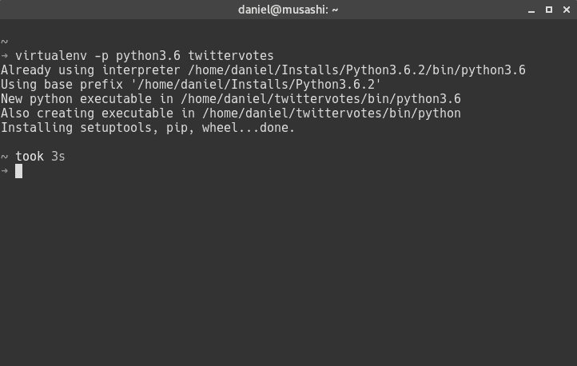
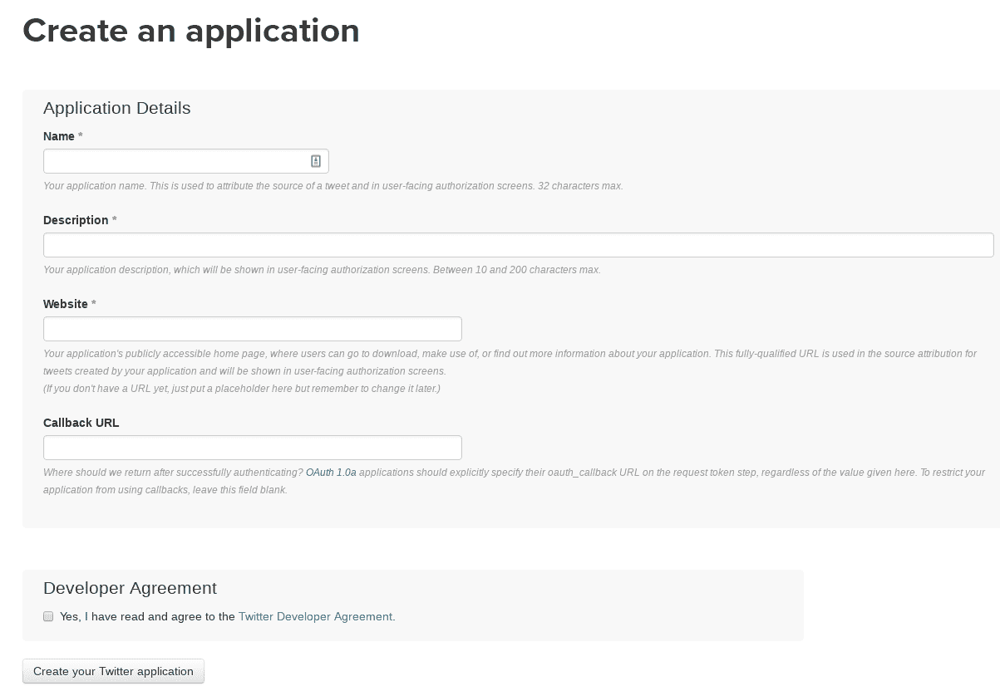
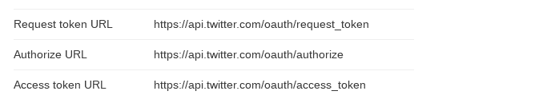
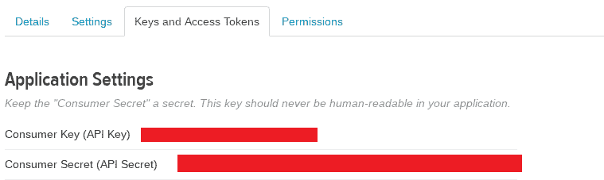
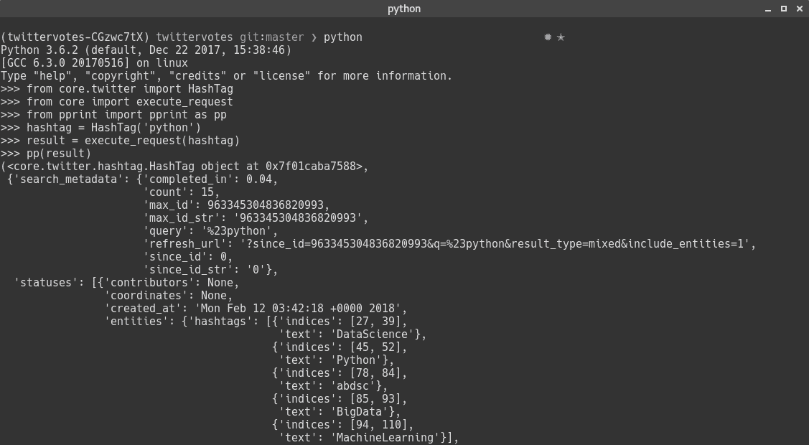

# 在推特上投票

在上一章中，我们实现了一个终端应用程序，它可以作为流行音乐服务 Spotify 的遥控器。在这个应用程序中，我们可以搜索艺术家、浏览相册以及浏览每个相册中的曲目。最后，我们甚至可以请求在用户的活动设备上播放曲目。

这一次，我们将开发一个应用程序，利用其 RESTAPI 与 Twitter 集成。Twitter 是一个社交网络，自 2006 年以来一直存在，活跃用户超过 3 亿。私人用户、公司、艺术家、足球俱乐部，你可以在 Twitter 上找到几乎所有的东西。但我相信，推特之所以如此受欢迎，是因为它的简单。

与博客帖子不同，推特帖子或*推特*必须简短且切中要害，并且不需要花费太多时间来准备要发布的内容。推特如此受欢迎的另一点是，它是一个很好的新闻来源。如果你想随时了解世界上正在发生的事情，政治、体育、科技，你可以说，Twitter 就是一个好去处。

除此之外，Twitter 为美国开发者提供了一个相当不错的 API，为了利用这个 API，我们将开发一个应用程序，用户可以使用 hashtags 进行投票。在我们的应用程序中，我们将配置要监视的 hashtag，它将不时自动获取与该 hashtag 匹配的最新 tweet，对它们进行计数，并在用户界面中显示它们。

在本章中，您将学习如何执行以下操作：

*   创建一个 tweet 应用程序
*   使用`OAuth`库并实现三段式身份验证流
*   使用 Twitter API 搜索最新推文
*   使用`Tkinter`构建简单的用户界面
*   学习多处理和反应式编程的基础知识

# 建立环境

我们必须做的第一件事是，像往常一样，设置我们的开发环境，第一步是为我们的应用程序创建一个虚拟环境。我们的应用程序将被称为`twittervotes`，所以让我们继续创建一个名为`twittervotes`的虚拟环境：



`virtualenv`环境创建完成后，可以通过以下命令激活：

```py
. twittervotes/bin/activate
```

伟大的现在，让我们设置项目的目录结构。它应该如下所示：

```py
twittervotes
├── core
│   ├── models
│   └── twitter
└── templates
```

让我们深入了解一下结构：

| `twittervotes` | 应用程序的根目录。在这里，我们将创建应用程序的入口点以及一个小型助手应用程序来执行 Twitter 身份验证。 |
| `twittervotes/core` | 这将包含我们项目的所有核心功能。它将包含用于身份验证、读取配置文件、向 twitterapi 发送请求等的代码。 |
| `twittervotes/core/models` | 保存应用程序数据模型的目录。 |
| `twittervotes/core/twitter` | 在`twitter`目录中，我们将保留`helper`函数与 Twitter API 交互。 |
| `twittervotes/templates` | 在这里，我们将保留应用程序将使用的所有 HTML 模板。 |

接下来，是时候添加项目的依赖项了。继续，在`twittervotes`目录中创建一个名为`requirements.txt`的文件，其内容如下：

```py
Flask==0.12.2
oauth2==1.9.0.post1
PyYAML==3.12
requests==2.18.4
Rx==1.6.0
```

下表说明了上述依赖项的含义：

| `Flask` | 我们将在这里使用 Flask 创建一个简单的 web 应用程序，用 Twitter 执行身份验证。 |
| `oauth2` | 这是一个很棒的包，在执行`OAuth`身份验证时，它将抽象出很多复杂性。 |
| `PyYAML` | 我们将使用这个包创建和读取 YAML 格式的配置文件。 |
| `Requests` | 允许我们通过 HTTP 访问 Twitter API。 |
| `Rx` | 最后，我们将使用 Python 的反应式扩展，以便在新的 tweet 计数到达时能够反应式地更新 UI。 |

创建文件后，运行命令`pip install -r requirements.txt`，应该会看到类似以下的输出：


If you run the command `pip freeze`, you will get a list of dependencies in pip format and you will notice that the output lists more dependencies that we actually added to the `requirements` file. The reason for that is that the packages that our project requires also have dependencies and they will also be installed. So do not worry if you have more packages installed than you specified in your `requirements` file.

现在我们的环境已经设置好，我们可以开始创建 Twitter 应用程序了。像往常一样，在开始编码之前，确保您的代码在源代码控制系统（如 Git）下；有很多在线服务将免费托管您的存储库。

通过这种方式，您可以回滚项目的不同版本，并且如果您的计算机出现问题，您不会有丢失工作的风险。话虽如此，让我们创建我们的 Twitter 应用程序。

# 创建 Twitter 应用程序

在本节中，我们将创建第一个 Twitter 应用程序，以便使用 Twitter REST API。如果您还没有帐户，则需要创建一个帐户。如果你不使用 Twitter，我强烈建议你使用它；这是一种了解所有新闻和开发世界正在发生的事情的好方法，也是在 Python 社区结交新朋友的好方法。

创建账户后，前往[https://apps.twitter.com/](https://apps.twitter.com/) ，使用您的登录凭据登录，您将进入一个页面，在该页面上可以看到您已经创建的应用程序列表（第一次，您可能会有一个空的应用程序列表），在同一页面上，您将有可能创建新的应用程序。单击右上角的“创建新应用”按钮，将打开以下页面：



在此表单中，有三个字段是必填的名称、说明和网站：

*   **姓名**：这是您申请的姓名；它也是在执行授权时将呈现给应用程序用户的名称。名称不需要遵循任何特定的命名约定，您可以拥有任何您想要的内容。
*   **说明**：顾名思义，这是您申请的说明。此字段也将显示给应用程序的用户，因此最好有好的文本描述您的应用程序。在这种情况下，我们不需要太多的文本。我们加上`Application to cast votes on Twitter using hashtags`**。**
*   **网站**：指定您申请的网站；它还将在授权期间呈现给用户，您的用户可以在该站点下载或获取有关您的应用程序的更多信息。由于我们正处于开发阶段，我们只需添加一个占位符，如[http://www.example.com](http://www.example.com) *。*
*   **回调 URL**：与上一章中的上一个应用（Spotify 终端应用）中的回调 URL 的工作方式相同。Twitter 将调用该 URL 发送授权代码。这不是必填字段，但我们需要它，所以让我们继续添加；`http://localhost:3000/callback`。

填写完所有字段后，您只需检查 Twitter 开发者协议，然后单击创建您的 Twitter 应用程序按钮。

如果一切顺利，您将被引导到另一个页面，在那里您可以看到新创建的应用程序的更多详细信息。在应用程序名称的正下方，您将看到一个带有选项卡的区域，其中显示有关应用程序的设置和不同信息：


在第一个选项卡“详细信息”中，我们希望复制将用于执行身份验证的所有 URL。向下滚动至应用设置，复制请求令牌 URL、*授权 URL*和*访问令牌 URL:*



伟大的现在，让我们转到“密钥和访问令牌”选项卡，复制消费者密钥和消费者机密*：*



现在我们已经复制了所有必要的信息，我们可以创建一个配置文件，该文件将由我们的应用程序使用。将所有这些都保存在配置文件中始终是一种好的做法，这样我们就不需要在代码中硬编码这些 URL。

We are going to add the *consumer key* and *consumer secret* to a configuration file in our project; as the name suggests, this key is *secret* so if you are planning to create a repository for your code in a service such as GitHub, make sure to add the configuration file to the `.gitignore` file so the keys are not pushed to the cloud repository. Never share these keys with anyone; if you suspect that someone has the keys, you can generate new keys for your application on the Twitter app's website.

# 添加配置文件

在本节中，我们将为应用程序创建配置文件；配置文件将采用 YAML 格式。如果您想了解更多关于 YAML 的信息，可以访问网站[http://yaml.org/](http://yaml.org/) ，您将在其中找到示例、规范以及可用于操作 YAML 文件的不同编程语言的库列表。

对于我们的应用程序，我们将使用 PyYAML，这将允许我们以非常简单的方式读取和写入 YAML 文件。我们的配置文件非常简单，因此我们不需要使用库的任何高级功能，我们只需要读写内容，我们将要添加的数据非常平坦；我们不会有任何嵌套对象或任何类型的列表。

让我们获取创建应用程序时从 Twitter 获得的信息，并将其添加到配置文件中。在应用程序的`twittervotes`目录中创建一个名为`config.yaml`的文件，其内容如下：

```py
consumer_key: '<replace with your consumer_key>'
consumer_secret: '<replace with your consumer secret>'
request_token_url: 'https://api.twitter.com/oauth/request_token'
authorize_url: 'https://api.twitter.com/oauth/authorize'
access_token_url: 'https://api.twitter.com/oauth/access_token'
api_version: '1.1'
search_endpoint: 'https://api.twitter.com/1.1/search/tweets.json'
```

伟大的现在，我们将在项目中创建第一个 Python 代码。如果您遵循了前面的章节，您将熟悉读取配置文件的功能。想法很简单：我们将读取配置文件，对其进行解析，并创建一个模型，可以轻松使用该模型访问添加到配置中的数据。首先，我们需要创建配置模型。

在`twittervotes/core/models/`中创建一个名为`models.py`的文件，内容如下：

```py
from collections import namedtuple

Config = namedtuple('Config', ['consumer_key',
                               'consumer_secret',
                               'request_token_url',
                               'access_token_url',
                               'authorize_url',
                               'api_version',
                               'search_endpoint', ])
```

上一章对`namedtuple`进行了更广泛的介绍，因此我将不再详细介绍它；如果您还没有读过第二章，那么知道`namedtuple`是一种类就足够了，这段代码将使用第二个参数中数组中指定的字段定义一个名为`Config`的`namedtuple`。

很好，现在让我们在`twittervotes/core/models`中创建另一个名为`__init__.py`的文件，并导入我们刚刚创建的`namedtuple`：

```py
from .models import Config
```

现在是创建函数的时候了，这些函数将执行读取 YAML 文件并将其返回给我们的实际工作。在`twittervotes/core/`中创建一个名为`config.py`的文件。让我们从添加导入语句开始：

```py
import os
import yaml

from .models import Config
```

我们将使用`os`包轻松获取用户的当前目录并操作路径。我们还导入 PyYAML，以便读取 YAML 文件，最后，从`models`模块导入我们刚刚创建的`Config`模型。

然后我们定义了两个函数，从`_read_yaml_file`函数开始。此函数获取两个参数，`filename`，这是我们要读取的配置文件的名称，还有`cls`，它可以是我们将用于存储配置数据的`class`或`namedtuple`。

在本例中，我们将传递与我们将要读取的 YAML 配置文件具有相同属性的`Config`-`namedtuple`：

```py
def _read_yaml_file(filename, cls):
    core_dir = os.path.dirname(os.path.abspath(__file__))
    file_path = os.path.join(core_dir, '..', filename)

    with open(file_path, mode='r', encoding='UTF-8') as file:
        config = yaml.load(file)
        return cls(**config)
```

首先，我们使用`os.path.abspath`函数，将特殊变量`__file__`作为参数传递。加载模块时，变量`__file__`将设置为与模块相同的名称。这将使我们能够轻松找到加载配置文件的位置。因此，下面的代码段将返回核心模块的路径

`/projects/twittervotes/core`：

```py
core_dir = os.path.dirname(os.path.abspath(__file__)) will return
```

我们知道配置文件将存在于`/projects/twittervotes/`中，因此我们需要将`..`加入到路径中，以便在目录结构中上升一级，这样我们就可以读取该文件。这就是我们构建完整配置文件路径的原因，如下所示：

`file_path = os.path.join(core_dir, '..', filename)`

这将使我们能够灵活地从系统中的任何位置运行此代码。

我们使用 UTF-8 编码在读取模式下打开文件，并将其传递给`yaml.load`函数，将结果分配给`config`变量。`config`变量将是一个包含`config`文件中所有数据的字典。

这个函数的最后一行是有趣的部分：如果您还记得，`cls`参数是一个`class`或`namedtuple`，因此我们将配置字典的值作为参数进行传播。在这里，我们将使用`Config`-`namedtuple`，因此`cls(**config)`与`Config`、`(**config)`相同，使用`**`传递参数与逐个传递所有参数相同：

```py
Config(
    consumer_key: ''
    consumer_secret: ''
    app_only_auth: 'https://api.twitter.com/oauth2/token'
    request_token_url: 'https://api.twitter.com/oauth/request_token'
    authorize_url: 'https://api.twitter.com/oauth/authorize'
    access_token_url: 'https://api.twitter.com/oauth/access_token'
    api_version: '1.1'
    search_endpoint: '')
```

现在我们要添加我们需要的第二个函数，`read_config`函数：

```py
def read_config():
    try:
        return _read_yaml_file('config.yaml', Config)
    except IOError as e:
        print(""" Error: couldn\'t file the configuration file 
        `config.yaml`
        'on your current directory.

        Default format is:',

        consumer_key: 'your_consumer_key'
        consumer_secret: 'your_consumer_secret'
        request_token_url: 
        'https://api.twitter.com/oauth/request_token'
        access_token_url:  
        'https://api.twitter.com/oauth/access_token'
        authorize_url: 'https://api.twitter.com/oauth/authorize'
        api_version: '1.1'
        search_endpoint: ''
        """)
        raise
```

这个函数非常简单；它只是利用我们刚刚创建的`_read_yaml_file`函数，在第一个参数中传递`config.yaml`文件，在第二个参数中传递`Config`、`namedtuple`。

我们捕获了`IOError`异常，如果应用程序目录中不存在该文件，将抛出该异常；在这种情况下，我们将抛出一条帮助消息，向应用程序的用户显示配置文件的结构。

最后一步是将其导入`twittervotes/core`目录中的`__init__.py`：

```py
from .config import read_config
```

让我们在 Python REPL 中尝试一下：


太好了，它就像我们想要的那样工作！在下一节中，我们可以开始创建执行身份验证的代码。

# 执行身份验证

在本节中，我们将创建一个程序，该程序将为我们执行身份验证，以便我们可以使用 Twitter API。我们将使用一个简单的 Flask 应用程序来实现这一点，该应用程序将公开两条路径。第一个是根目录`/`，它将加载并呈现一个简单的 HTML 模板，并带有一个按钮，将我们重定向到 Twitter 身份验证对话框。

我们要创建的第二条路线是`/callback`。还记得我们在 Twitter 应用程序配置中指定回调 URL 的时候吗？这是我们授权应用程序后将调用的路由。它将返回一个授权令牌，用于执行对 Twitter API 的请求。所以让我们开始吧！

在开始实现 Flask 应用程序之前，我们需要向模型的模块中添加另一个模型。此模型将表示请求授权数据。打开`twittervotes/core/models`中的`models.py`文件，添加以下代码：

```py
RequestToken = namedtuple('RequestToken', ['oauth_token',
                                         'oauth_token_secret',
                                        'oauth_callback_confirmed'])
```

这将创建一个名为`RequestToken`的`namedtuple`，其中包含字段`oauth_token`、`oauth_token_secret`和`outh_callback_confirmed`；我们需要这些数据来执行第二步的身份验证。

最后，打开`twittervotes/core/models`目录下的`__init__.py`文件，我们导入刚才创建的`RequestToken``namedtuple`，如下所示：

```py
from .models import RequestToken
```

现在我们已经准备好了模型，让我们开始创建 Flask 应用程序。让我们添加一个非常简单的模板来显示启动身份验证过程的按钮。

在`twittervotes`目录中新建一个名为`templates`的目录，并创建一个名为`index.html`*的文件，其内容如下：*

 *```py
<html>
    <head>
    </head>
    <body>
       <a href="{{link}}"> Click here to authorize </a>
    </body>
</html>
```

# 创建烧瓶应用程序

很好，现在让我们在`twittervotes`目录中添加另一个名为`twitter_auth.py`的文件。我们将在其中创建三个函数，但首先，让我们添加一些导入：

```py
from urllib.parse import parse_qsl

import yaml

from flask import Flask
from flask import render_template
from flask import request

import oauth2 as oauth

from core import read_config
from core.models import RequestToken
```

首先，我们从`urllib.parse`模块导入`parser_qls`解析返回的查询字符串，然后导入`yaml`模块，这样我们可以读写`YAML`配置文件。然后我们导入构建 Flask 应用程序所需的所有内容。我们在这里要导入的最后一个第三方模块是`oauth2`模块，它将帮助我们执行`OAuth`认证。

最后，我们导入我们刚刚创建的函数`read_config`和`RequestToken``namedtuple`。

在这里，我们创建了 Flask 应用程序和一些全局变量，这些变量将保存客户端、消费者和`RequestToken`实例的值：

```py
app = Flask(__name__)

client = None
consumer = None
req_token = None
```

我们要创建的第一个函数是一个名为`get_req_token`的函数，其内容如下：

```py
def get_oauth_token(config):

    global consumer
    global client
    global req_token

    consumer = oauth.Consumer(config.consumer_key, 
     config.consumer_secret)
    client = oauth.Client(consumer)

    resp, content = client.request(config.request_token_url, 'GET')

    if resp['status'] != '200':
        raise Exception("Invalid response 
        {}".format(resp['status']))

    request_token = dict(parse_qsl(content.decode('utf-8')))

    req_token = RequestToken(**request_token)
```

此函数获取一个配置实例作为参数，全局语句告诉解释器，函数中使用的使用者、客户端和`req_token`将引用全局变量。

我们使用创建 Twitter 应用程序时获得的消费者密钥和消费者机密创建消费者对象。创建消费者时，我们可以将其传递给客户端函数以创建客户端，然后调用函数 request，顾名思义，它将向 Twitter 执行请求，并传递请求令牌 URL。

当请求完成时，响应和内容将存储在变量`resp`和`content`中。紧接着，我们测试响应状态是否为`200`或`HTTP.OK`；在这种情况下，我们会引发一个异常，否则我们会解析查询字符串以获取已发送回我们的值并创建一个`RequestToken`实例。

# 创建应用程序路由

现在我们可以开始创建路由了。首先，我们将添加根路由：

```py
@app.route('/')
def home():

    config = read_config()

    get_oauth_token(config)

    url = f'{config.authorize_url}?oauth_token=
    {req_token.oauth_token}'

    return render_template('index.html', link=url)
```

我们读取配置文件并将其传递给`get_oauth_token`函数。此函数将用`oauth_token`值填充全局变量`req_token`；我们需要这个令牌来启动授权过程。然后，我们使用从配置文件获得的值`authorize_url`和`OAuth`请求令牌构建授权 URL。

最后，我们使用`render_template`呈现我们创建的`index.html`模板，并将第二个参数传递给函数，即上下文。在本例中，我们正在创建一个名为`link`的项，其值设置为`url`。如果您还记得`index.html`模板，则有一个`"{{url}}"`占位符。此占位符将被我们在`render_template`函数中分配给`link`的值替换。

默认情况下，Flask 使用 Jinja2 作为模板引擎，但可以将其更改为您喜欢的引擎；在本书中，我们不会详细介绍如何做到这一点，因为这超出了我们的范围。

我们要添加的最后一个路由是`/callback`路由，这将是 Twitter 在授权后调用的路由：

```py
@app.route('/callback')
def callback():

    global req_token
    global consumer

    config = read_config()

    oauth_verifier = request.args.get('oauth_verifier', '')

    token = oauth.Token(req_token.oauth_token,
                        req_token.oauth_token_secret)

    token.set_verifier(oauth_verifier)

    client = oauth.Client(consumer, token)

    resp, content = client.request(config.access_token_url, 'POST')
    access_token = dict(parse_qsl(content.decode('utf-8')))

    with open('.twitterauth', 'w') as req_auth:
        file_content = yaml.dump(access_token, 
        default_flow_style=False)
        req_auth.write(file_content)

    return 'All set! You can close the browser window and stop the 
    server.'
```

回调路由的实现从使用全局语句开始，因此我们可以使用全局变量`req_token`和`consumer`。

现在我们进入有趣的部分。在授权之后，Twitter 将返回一个`outh_verifier`，因此我们从请求参数中获取它，并将其设置为变量`oauth_verifier`；我们使用在授权过程的第一部分中获得的`oauth_token`和`oauth_token_secret`创建一个`Token`实例。

我们在`Token`对象中设置`oauth_verifier`，最后创建一个新的客户端，我们将使用它来执行新的请求。

我们对从请求接收到的数据进行解码，并将其添加到 access token 变量中，最后，我们将`access_token`的内容写入`twittervotes`目录中的一个文件`.twitterauth`。此文件也是 YAML 格式，因此我们将在`config.py`文件中添加另一个模型和一个函数，以读取新设置。

请注意，此过程只需执行一次。这就是我们将数据存储在`.twitterauth`文件中的原因。进一步的请求只需要使用此文件中包含的数据。

如果您检查`.twitterauth`文件的内容，您应该有以下类似内容：

```py
oauth_token: 31******95-**************************rt*****io
oauth_token_secret: NZH***************************************ze8v
screen_name: the8bitcoder
user_id: '31******95'
x_auth_expires: '0'
```

要完成 Flask 应用程序，我们需要在文件末尾添加以下代码：

```py
if __name__ == '__main__':
    app.run(host='localhost', port=3000)
```

让我们在`twittervotes/core/models/`中的`models.py`文件中添加一个新模型，内容如下：

```py
RequestAuth = namedtuple('RequestAuth', ['oauth_token',
                                         'oauth_token_secret',
                                         'user_id',
                                         'screen_name',
                                         'x_auth_expires', ])
```

伟大的我们还需要在`twittervotes/core/models`目录的`__init__.py`文件中导入新模型：

```py
from .models import RequestAuth
```

另外，让我们添加一个函数来读取`twittervotes/core`中`config.py`中的`.twittervotes`文件。首先，我们需要导入刚刚创建的`RequestAuth`-`namedtuple`：

```py
from .models import RequestAuth
```

然后我们创建一个名为`read_reqauth`的函数，如下所示：

```py
def read_reqauth():
    try:
        return _read_yaml_file('.twitterauth', RequestAuth)
    except IOError as e:
        print(('It seems like you have not authorized the  
        application.\n'
               'In order to use your twitter data, please run the '
               'auth.py first.'))
```

这个函数非常简单：我们只需调用`_read_yaml_file`，将刚刚创建的`.twitterauth`文件和新的`namedtuple`、`RequestAuth`作为参数传递。同样，如果发生错误，我们将引发异常并显示帮助消息。

现在我们可以尝试身份验证。在`twittervotes`目录中，执行脚本`twitter_auth.py`。您应该看到以下输出：


伟大的服务器已启动并正在运行，因此我们可以打开浏览器并转到`http://localhost:3000`。您应该看到一个非常简单的页面，其中包含一个执行身份验证的链接：


如果您使用浏览器开发工具检查该链接，您将看到该链接指向授权端点，并通过我们创建的`oauth_token`：


继续并单击链接，您将被发送到授权页面：


如果单击“授权应用”按钮，您将被重定向回 localhost，并显示一条成功消息：


如果你注意 Twitter 发给我们的 URL，你会发现一些信息。这里重要的一点是`oauth_verifier`，我们将设置请求令牌，并执行最后一个请求以获取访问令牌。现在您可以关闭浏览器，停止 Flask 应用程序，并在`twittervotes`目录下的文件`.twitterauth`中查看结果：

```py
oauth_token: 31*******5-KNAbN***********************K40
oauth_token_secret: d**************************************Y3
screen_name: the8bitcoder
user_id: '31******95'
x_auth_expires: '0'
```

现在，如果其他用户要使用我们的应用程序，我们在这里实现的所有功能都非常有用；但是，如果您正在授权自己的 Twitter 应用程序，则有一种更容易获得访问令牌的方法。让我们看看是如何做到的。

返回[中的 Twitter 应用程序设置 https://apps.twitter.com/](https://apps.twitter.com/) ；选择 Keys and Access Tokens 选项卡并向下滚动。如果您已授权此应用程序，您将在文件`.twitterauth`中看到与我们现在相同的信息，但如果您尚未授权此应用程序，您将看到一个类似于以下内容的访问令牌部分：


如果单击“创建我的访问令牌”，Twitter 将为您生成访问令牌：


创建访问令牌后，您可以将数据复制到`.twitterauth`文件中。

# 构建 Twitter 投票应用程序

现在我们已经设置好了环境，我们已经了解了如何在 Twitter 上创建应用程序并执行三条腿身份验证，现在是时候开始构建实际的应用程序来计算 Twitter 投票了。

我们首先创建一个表示 hashtag 的模型类。在`twittervotes/core/twitter`目录中创建一个名为`hashtag.py`的文件，内容如下：

```py
class Hashtag:
    def __init__(self, name):
        self.name = name
        self.total = 0
        self.refresh_url = None
```

这是一个非常简单的类。我们可以将名称作为参数传递给初始值设定项；名称是没有哈希符号（`#`的哈希标记。在初始值设定项中，我们定义了几个属性：名称，它将被设置为我们传递给初始值设定项的参数，然后是一个名为`total`的属性，它将为我们保留 hashtag 用法计数。

最后，我们设置了`refresh_url`。`refresh_url`将用于执行对 Twitter API 的查询，有趣的是`refresh_url`已经包含返回的最新 tweet 的`id`，因此我们可以使用它只获取我们尚未获取的 tweet，以避免多次计算相同的 tweet

`refresh_url`看起来如下所示：

```py
refresh_url': '?since_id=963341767532834817&q=%23python&result_type=mixed&include_entities=1
```

现在我们可以打开`twittervotes/core/twitter`目录中的文件`__init__.py`，导入我们刚刚创建的类，如下所示：

```py
from .hashtag import Hashtag
```

完美的现在继续，在`twittervotes/core/`目录中创建一个名为`request.py`的文件。

与往常一样，我们开始添加一些导入：

```py
import oauth2 as oauth
import time
from urllib.parse import parse_qsl
import json

import requests

from .config import read_config
from .config import read_reqauth
```

首先，我们导入将用于执行身份验证的`oauth2`包；我们准备请求，并用`SHA1`键签名。我们还导入了`time`来设置`OAuth`时间戳设置。我们导入函数`parse_qsl`，我们将使用它来解析查询字符串，这样我们就可以准备一个新的请求来搜索最新的 tweet，`json`模块，这样我们就可以反序列化 Twitter API 发送回我们的 JSON 数据。

然后，我们导入自己的函数`read_config`和`read_req_auth`，这样我们就可以读取这两个配置文件。最后，我们导入`json`包来解析结果，导入`requests`包来执行对 Twitter 搜索端点的实际请求：

```py
def prepare_request(url, url_params):
    reqconfig = read_reqauth()
    config = read_config()

    token = oauth.Token(
        key=reqconfig.oauth_token,
        secret=reqconfig.oauth_token_secret)

    consumer = oauth.Consumer(
        key=config.consumer_key,
        secret=config.consumer_secret)

    params = {
        'oauth_version': "1.0",
        'oauth_nonce': oauth.generate_nonce(),
        'oauth_timestamp': str(int(time.time()))
    }

    params['oauth_token'] = token.key
    params['oauth_consumer_key'] = consumer.key

    params.update(url_params)

    req = oauth.Request(method="GET", url=url, parameters=params)

    signature_method = oauth.SignatureMethod_HMAC_SHA1()
    req.sign_request(signature_method, consumer, token)

    return req.to_url()
```

此函数将读取两个配置文件`config.org`配置文件包含我们需要的所有端点 URL，以及使用者密钥。`.twitterauth`文件包含`oauth_token`和`oauth_token_secret`，我们将使用它们创建一个`Token`对象，我们将随请求一起传递。

之后，我们定义了一些参数。`oauth_version`应该根据 Twitter API 文档始终设置为`1.0`。我们还发送`oauth_nonce`，这是我们必须为每个请求生成的唯一令牌，最后发送`oauth_timestamp`，这是创建请求的时间。Twitter 将拒绝在发送请求之前太长时间创建的请求。

我们附加到参数的最后一件事是`oauth_token`，它是存储在`.twitterath`文件中的令牌，以及消费者密钥，它是存储在`config.yaml`文件中的密钥。

我们执行请求以获得授权，如果一切正常，我们使用 SHA1 密钥对请求进行签名并返回请求的 URL。

现在我们将添加一个函数，该函数将执行一个请求来搜索特定的 hashtag 并将结果返回给我们。让我们继续添加另一个名为`execute_request`的函数：

```py
def execute_request(hashtag):
    config = read_config()

    if hashtag.refresh_url:
        refresh_url = hashtag.refresh_url[1:]
        url_params = dict(parse_qsl(refresh_url))
    else:
        url_params = {
            'q': f'#{hashtag.name}',
            'result_type': 'mixed'
        }

    url = prepare_request(config.search_endpoint, url_params)

    data = requests.get(url)

    results = json.loads(data.text)

    return (hashtag, results, )
```

这个函数将得到一个`Hashtag`对象作为参数，我们在这个函数中做的第一件事就是读取配置文件。然后检查`Hashtag`对象是否在`refresh_url`属性中有值；在这种情况下，我们将移除`refresh_url`字符串前面的`?`符号。

然后，我们使用函数`parse_qsl`解析查询字符串并返回一个元组列表，其中元组中的第一项是参数的名称，第二项是参数的值。例如，假设我们有一个如下所示的查询字符串：

```py
'param1=1&param2=2&param3=3'
```

如果我们使用`parse_qsl`，将此查询字符串作为参数传递，我们将得到以下列表：

```py
[('param1', '1'), ('param2', '2'), ('param3', '3')]
```

然后如果我们把这个结果传递给`dict`函数，我们会得到这样一个字典：

```py
{'param1': '1', 'param2': '2', 'param3': '3'}
```

如前所述，`refresh_url`的格式如下：

```py
refresh_url': '?since_id=963341767532834817&q=%23python&result_type=mixed&include_entities=1
```

在解析并将其转换为字典之后，我们可以使用它为底层 hashtag 获取刷新的数据。

如果`Hashtag`对象没有设置`refresh_url`属性，那么我们只需定义一个字典，其中`q`是 hashtag 名称，结果类型设置为`mixed`，告诉 Twitter API 它应该返回流行的、最近的和实时的推文。

定义搜索参数后，我们使用上面创建的`prepare_request`函数对请求进行授权并签名；当我们返回 URL 时，我们使用从`prepare_request`函数返回的 URL 执行请求。

我们使用`json.loads`函数解析 JSON 数据，并返回一个包含第一项的元组，即 hashtag 本身；第二项是我们从请求返回的结果。

最后一步，照常导入核心模块`__init__.py`文件中的`execute_request`功能：

```py
from .request import execute_request
```

让我们看看它在 Python REPL 中是如何工作的：



上面的输出比这个大得多，但很多都被忽略了；我只是想演示一下这个函数是如何工作的。

# 增强我们的代码

我们还希望为用户提供良好的体验，因此我们将添加一个命令行解析器，以便应用程序的用户可以在开始投票过程之前指定一些参数。我们将只实现一个参数，即`--hashtags`，用户可以在其中传递一个以空格分隔的 hashtag 列表。

话虽如此，我们将为这些参数定义一些规则。首先，我们将限制要监视的 hashtag 的最大数量，因此我们将添加一个规则，即最多可以使用四个 hashtag。

如果用户指定了四个以上的 hashtag，我们只需在终端上显示一个警告并选择前四个 hashtag。我们还希望删除重复的 hashtag。

当显示我们所讨论的这些警告信息时，我们可以简单地将它们打印在终端上，这肯定会起作用；然而，我们想让事情变得更有趣，所以我们将使用日志记录包来完成它。除此之外，实现适当的日志记录将使我们能够更好地控制想要的日志类型，以及如何向用户展示日志。

在开始实现命令行解析器之前，让我们添加记录器。在`twittervotes/core`目录中创建一个名为`app_logger.py`的文件，内容如下：

```py
import os
import logging
from logging.config import fileConfig

def get_logger():
    core_dir = os.path.dirname(os.path.abspath(__file__))
    file_path = os.path.join(core_dir, '..', 'logconfig.ini')
    fileConfig(file_path)
    return logging.getLogger('twitterVotesLogger')
```

这个函数做的不多，但我们首先导入`os`模块，然后导入日志记录包，最后导入函数`fileConfig`，它从配置文件读取日志记录配置。此配置文件必须采用`configparser`格式，您可以在[上获得有关此格式的更多信息 https://docs.python.org/3.6/library/logging.config.html#logging-配置文件格式](https://docs.python.org/3.6/library/logging.config.html#logging-config-fileformat)。

读取配置文件后，我们只返回一个名为`twitterVotesLogger`的记录器。

让我们看看应用程序的配置文件是什么样子的。在`twittervotes`目录中创建一个名为`logconfig.ini`的文件，内容如下：

```py
[loggers]
keys=root,twitterVotesLogger

[handlers]
keys=consoleHandler

[formatters]
keys=simpleFormatter

[logger_root]
level=INFO
handlers=consoleHandler

[logger_twitterVotesLogger]
level=INFO
handlers=consoleHandler
qualname=twitterVotesLogger

[handler_consoleHandler]
class=StreamHandler
level=INFO
formatter=simpleFormatter
args=(sys.stdout,)

[formatter_simpleFormatter]
format=[%(levelname)s] %(asctime)s - %(message)s
datefmt=%Y-%m-%d %H:%M:%S
```

所以这里我们定义了两个记录器，`root`和`twitterVotesLogger`；记录器负责公开我们可以在运行时用来记录消息的方法。我们也可以通过记录器设置严重程度，例如，`INFO`、`DEBUG`等。最后，记录器将日志消息传递给相应的处理程序。

在`twitterVotesLogger`的定义中，我们将严重性级别设置为`INFO`，我们将处理程序设置为`consoleHandler`（我们将很快对此进行描述），并且我们还设置了一个限定名称，当我们想要获得`twitterVotesLogger`时将使用该名称

`twitterVotesLoggers`的最后一个选项是`propagate`。由于`twitterVotesLogger`是一个子记录器，我们不希望通过`twittersVotesLogger`发送的日志消息传播到它的祖先。如果不将`propagate`设置为`0`，则每个日志消息将显示两次，因为`twitterVotesLogger`的祖先是`root`记录器。

日志配置中的下一个组件是处理程序。处理程序是将特定记录器的日志消息发送到目标的组件。我们定义了一个名为`consoleHandler`的处理程序，类型为`StreamHandler`，它是日志模块的内置处理程序。`StreamHandler`向`sys.stdout`、`sys.stderr`等流或文件发送日志消息。这非常适合我们，因为我们希望向终端发送消息。

在`consoleHandler`中，我们还将严重性级别设置为`INFO`，并将格式化程序设置为`customFormatter`；然后我们将 args 的值设置为`(sys.stdout, )`。Args 指定日志消息将发送到的位置；在这种情况下，我们只设置了`sys.stdout`，但如果需要，您可以添加多个输出流。

此配置的最后一个组件是格式化程序`customFormatter`。格式化程序只是定义日志消息的显示方式。在我们的`customFormatter`中，我们只定义消息的显示方式和日期格式。

现在我们已经完成了日志记录，让我们添加解析命令行的函数。在`twittervotes/core`中创建一个文件`cmdline_parser.py`并添加一些导入：

```py
from argparse import ArgumentParser

from .app_logger import get_logger
```

然后，我们需要添加一个函数来验证命令行参数：

```py
def validated_args(args):

    logger = get_logger()

    unique_hashtags = list(set(args.hashtags))

    if len(unique_hashtags) < len(args.hashtags):
        logger.info(('Some hashtags passed as arguments were '
                     'duplicated and are going to be ignored'))

        args.hashtags = unique_hashtags

    if len(args.hashtags) > 4:
        logger.error('Voting app accepts only 4 hashtags at the 
        time')
        args.hashtags = args.hashtags[:4]

    return args
```

`validate_args`函数只有一个参数，它是由`ArgumentParser.`解析的参数。在这个函数中，我们要做的第一件事是获取我们刚刚创建的记录器，因此我们可以发送日志消息，通知用户已传递给应用程序的命令行参数中可能存在的问题。

接下来，我们将 hashtags 列表转换为一个集合，以便删除所有重复的 hashtags，然后将其转换回一个列表。然后，我们检查惟一 hashtag 的数量是否小于在命令行上传递的 hashtag 的原始数量。这意味着我们有重复，我们会记录一条消息来通知用户。

我们要做的最后一个验证是确保应用程序最多监视四个 hashtag。如果 hashtag 列表中的项目数大于 4，那么我们对数组进行切片，只得到前四个项目，并且我们还记录一条消息，通知用户只显示四个 hashtag。

让我们添加另一个函数，`parse_commandline_args`：

```py
def parse_commandline_args():
    argparser = ArgumentParser(
        prog='twittervoting',
        description='Collect votes using twitter hashtags.')

    required = argparser.add_argument_group('require arguments')

    required.add_argument(
        '-ht', '--hashtags',
        nargs='+',
        required=True,
        dest='hashtags',
        help=('Space separated list specifying the '
              'hashtags that will be used for the voting.\n'
              'Type the hashtags without the hash symbol.'))

    args = argparser.parse_args()

    return validated_args(args)
```

当我们在第一章“天气应用”中开发应用程序时，我们看到了`ArgumentParser`是如何工作的。但是，我们仍然可以了解这个函数的作用。

首先，我们定义一个`ArgumentParser`对象，定义一个名称和一个描述，并创建一个名为`required`的子组，正如名称所示，该子组将包含所有必需的字段。

Note that we don't really need to create this extra group; however, I find that it helps to keep the code more organized and easier to maintain in case it is necessary to add new options in the future.

我们只定义一个参数，`hashtags`。在`hashtags`参数的定义中，有一个称为`nargs`的参数，我们将其设置为`+`；这意味着我可以传递无限多个由空格分隔的项目，如下所示：

```py
--hashtags item1 item2 item3
```

我们在这个函数中要做的最后一件事是用`parse_args`函数解析参数，并通过前面显示的`validate_args`函数运行参数。

我们将`parse_commandline_args`函数导入`twittervotes/core`目录下的`__init__.py`文件中：

```py
from .cmdline_parser import parse_commandline_args
```

现在，我们需要创建一个类来帮助我们管理 hashtags，并执行诸如保持 hashtags 的分数计数、在每次请求后更新其值等任务。让我们继续创建一个名为`HashtagStatsManager`的类。在`twittervotes/core/twitter`中创建一个名为`hashtagstats_manager.py`的文件，其内容如下：

```py
from .hashtag import Hashtag

class HashtagStatsManager:

    def __init__(self, hashtags):

        if not hashtags:
            raise AttributeError('hashtags must be provided')

        self._hashtags = {hashtag: Hashtag(hashtag) for hashtag in 
         hashtags}

    def update(self, data):

        hashtag, results = data

        metadata = results.get('search_metadata')
        refresh_url = metadata.get('refresh_url')
        statuses = results.get('statuses')

        total = len(statuses)

        if total > 0:
            self._hashtags.get(hashtag.name).total += total
            self._hashtags.get(hashtag.name).refresh_url = 
            refresh_url

    @property
    def hashtags(self):
        return self._hashtags
```

这个类也很简单：在构造函数中，我们得到一个 hashtags 列表并初始化一个属性`_hashtags`，它将是一个字典，其中键是 hashtag 的名称，值是`Hashtag`类的实例。

update 方法得到一个包含`Hashtag`对象的元组，结果由 TwitterAPI 返回。首先，我们解压缩元组值并将其设置为`hashtag`和`results`变量。这本词典有两个我们感兴趣的条目。第一个是`search_metadata`；在这个项目中，我们将找到`refresh_url`，状态包含使用我们正在搜索的标签的所有 tweet 的列表。

所以我们得到了`search_metadata`、`refresh_url`和`statuses`的值。然后我们计算`statuses`列表中有多少项。如果状态列表上的项目数大于`0`，我们将更新基础标签及其`refresh_url`的总计数。

然后我们导入刚才在`twittervotes/core/twitter`目录的`__init__.py`文件中创建的`HashtagStatsManager`类：

```py
from .hashtagstats_manager import HashtagStatsManager
```

此应用程序的核心是类`Runner`。此类将执行函数的执行，并在进程池中将其排队。每个函数都将在不同的进程中并行执行，这将使程序比逐个执行这些函数快得多。

我们来看看`Runner`类是如何实现的：

```py
import concurrent.futures

from rx import Observable

class Runner:

    def __init__(self, on_success, on_error, on_complete):
        self._on_success = on_success
        self._on_error = on_error
        self._on_complete = on_complete

    def exec(self, func, items):

        observables = []

        with concurrent.futures.ProcessPoolExecutor() as executor:
            for item in items.values():
                _future = executor.submit(func, item)
                observables.append(Observable.from_future(_future))

        all_observables = Observable.merge(observables)

        all_observables.subscribe(self._on_success,
                                  self._on_error,
                                  self._on_complete)
```

类`Runner`有一个带三个参数的初始值设定项；它们都是在执行的不同状态下调用的函数。当项目执行成功时调用`on_success`，当某个函数由于某种原因执行失败时调用`on_error`，最后当队列中的所有函数都执行完毕时调用`on_complete`。

还有一个名为`exec`的方法，它将函数作为第一个参数，这是将要执行的函数，第二个参数是`Hashtag`实例的列表。

班上有一些有趣的事情。首先，我们使用的是`concurrent.futures`模块，它是 Python 的一个非常好的补充，自 Python 3.2 以来一直存在；此模块提供异步执行可调用项的方法

`concurrent.futures`模块还提供了`ThreadPoolExecutor`，它将使用线程执行异步执行，而`ProcessPollExecutor`则使用进程。您可以根据需要轻松地在这些执行策略之间切换。

经验法则是，如果您的函数是 CPU 受限的，那么最好使用`ProcessPollExecutor`，否则会因为 Python**全局解释器锁**（**GIL**而导致性能大问题。对于 I/O 绑定操作，我更喜欢使用`ThreadPoolExecutor`。

如果您想了解更多关于 GIL 的信息，可以查看以下 wiki 页面：[https://wiki.python.org/moin/GlobalInterpreterLock](https://wiki.python.org/moin/GlobalInterpreterLock) 。

因为我们不做任何 I/O 绑定操作，所以我们使用`ProcessPoolExecutor`。然后，我们循环遍历项的值，这是一个包含应用程序正在监视的所有 hashtag 的字典。对于每个 hashtag，我们将它和我们想要执行的函数一起传递给`ProcessPollExecutor`的`submit`函数；在我们的例子中，它将是应用程序核心模块中定义的`execute_request`函数。

`submit`函数不会返回`execute_request`函数返回的值，而是返回一个`future`对象，该对象封装了`execute_request`函数的异步执行。`future`对象提供取消执行、检查执行状态、获取执行结果等方法。

现在，我们想要一种在执行状态改变或完成时得到通知的方法。这就是反应式编程的用武之地。

在这里，我们得到`future`对象并创建一个`Observable`。`Observables`是反应式编程的核心。`Observable`是一种可以在任何给定时间观察并发出事件的物体。当`Observable`发出事件时，将通知订阅该`Observable`的所有观察者，并对这些更改做出反应。

这正是我们在这里试图实现的目标：我们有一系列未来的执行，我们希望在这些执行改变状态时得到通知。这些状态将由我们作为参数传递给`Runner`初始值设定项-`_on_sucess`、`_on_error`和`_on_complete`的函数处理。

完美的我们将`Runner`类导入`twittervotes/core`目录中的`__init__.py`：

```py
from .runner import Runner
```

我们项目的最后一部分是添加应用程序的入口点。我们将使用标准库中的`Tkinter`包添加用户界面。所以，让我们开始实施它。在`twittervotes`目录中创建一个名为`app.py`的文件，我们先添加一些导入：

```py
from core import parse_commandline_args
from core import execute_request
from core import Runner

from core.twitter import HashtagStatsManager

from tkinter import Tk
from tkinter import Frame
from tkinter import Label
from tkinter import StringVar
from tkinter.ttk import Button
```

这里，我们导入我们创建的命令行参数解析器，`execute_request`来执行对 Twitter API 的请求，还有`Runner`类，它将帮助我们并行执行对 Twitter API 的请求。

我们还导入了`HashtagStatsManager`来为我们管理标签投票结果。

最后，我们有所有与`tkinter`相关的进口。

在同一个文件中，我们创建一个名为`Application`的类，如下所示：

```py
class Application(Frame):

    def __init__(self, hashtags=[], master=None):
        super().__init__(master)

        self._manager = HashtagStatsManager(hashtags)

        self._runner = Runner(self._on_success,
                              self._on_error,
                              self._on_complete)

        self._items = {hashtag: StringVar() for hashtag in hashtags}
        self.set_header()
        self.create_labels()
        self.pack()

        self.button = Button(self, style='start.TButton', 
                             text='Update',
                             command=self._fetch_data)
        self.button.pack(side="bottom")
```

在这里，我们创建一个类，`Application`，它继承自`Frame`。初始值设定项接受两个参数：hashtags，它是我们要监视的 hashtags，和 master 参数，它是类型为`Tk`的对象。

然后我们创建一个`HashtagStatsManager`实例，传递 hashtags 列表；我们还创建了一个传递三个参数的`Runner`类实例。这些参数是在一次执行成功完成、执行失败以及所有执行完成时调用的函数。

然后我们有一个字典理解，它将创建一个字典，其中键是 hashtags，值是 string 类型的`Tkinter`变量，在`Tkinter`世界中称为`StringVar`。我们这样做是为了以后更容易用结果更新标签。

我们将很快实现的方法称为`set_header `和`create_labels`，最后称为`pack`。`pack`功能将组织按钮和标签等小部件，并将它们放置在父小部件中，在本例中为`Application`。

然后我们定义了一个按钮，当点击时将执行功能`_fetch_data`，我们使用`pack`将按钮放置在框架底部：

```py
def set_header(self):
    title = Label(self,
                  text='Voting for hasthags',
                  font=("Helvetica", 24),
                  height=4)
    title.pack()
```

这是我前面提到的`set_header`方法；它只是创建`Label`对象并将其放置在帧的顶部。

现在我们可以添加`create_labels`方法：

```py
def create_labels(self):
    for key, value in self._items.items():
        label = Label(self,
                      textvariable=value,
                      font=("Helvetica", 20), height=3)
        label.pack()
        self._items[key].set(f'#{key}\nNumber of votes: 0')
```

`create_labels`方法循环通过`self._items`，如果您还记得的话，这是一个字典，其中键是 hashtag 的名称，值是 string 类型的`Tkinter`变量。

首先，我们创建一个`Label`，有趣的部分是`textvariable`参数；我们将其设置为`value`，这是一个与特定标签相关的`Tkinter`变量。然后我们将`Label`放在框架中，最后，我们使用函数`set`设置标签的值。

然后我们需要添加一个方法来为我们更新`Labels`：

```py
def _update_label(self, data):
    hashtag, result = data

    total = self._manager.hashtags.get(hashtag.name).total

    self._items[hashtag.name].set(
        f'#{hashtag.name}\nNumber of votes: {total}')
```

顾名思义，`_update_label`更新特定标签的标签。data 参数是 twitterapi 返回的结果，我们从管理器获得 hashtag 的总数。最后，我们再次使用`set`函数来更新标签。

让我们添加另一个函数，它将实际执行向 Twitter API 发送请求的工作：

```py
def _fetch_data(self):
    self._runner.exec(execute_request,
                      self._manager.hashtags)
```

此方法将调用`Runner`的`exec`方法来执行执行对 Twitter API 的请求的函数。

然后我们需要定义处理`Runner`类中创建的`Observable`发出的事件的方法；我们首先添加处理执行错误的方法：

```py
def _on_error(self, error_message):
    raise Exception(error_message)
```

这是一种`helper`方法，用于在请求执行出现问题时引发异常。

然后，我们添加了另一个方法来处理`Observable`成功执行的情况：

```py
def _on_success(self, data):
    hashtag, _ = data
    self._manager.update(data)
    self._update_label(data)
```

当`Runner`中的一次执行成功完成时，将调用`_on_success`方法，它将使用新数据更新管理器，并更新 UI 中的标签。

最后，我们定义了一个方法，该方法将在所有执行完成时处理：

```py
def _on_complete(self):
    pass
```

当`Runner`的所有执行完成时，将调用`_on_complete`。我们不打算使用它，所以我们只使用`pass`语句。

现在是时候实现将设置应用程序和初始化 UI 的功能了。函数`start_app`：

```py
def start_app(args):
    root = Tk()

    app = Application(hashtags=args.hashtags, master=root)
    app.master.title("Twitter votes")
    app.master.geometry("400x700+100+100")
    app.mainloop()
```

此函数创建根应用程序，设置标题，定义其维度，并调用`mainloop`函数，使应用程序保持运行。

最后一部分是定义`main`函数：

```py
def main():
    args = parse_commandline_args()
    start_app(args)

if __name__ == '__main__':
    main()
```

`main`函数非常简单。首先，我们解析命令行参数，然后启动应用程序，将命令行参数传递给它。

让我们看看实际的应用程序！运行以下命令：

```py
python app.py --help
```

您将看到以下输出：


假设我们希望投票过程运行 3 分钟，它将监控标签`#debian`、`#ubuntu`和`#arch`：

```py
python app.py --hashtags debian ubuntu arch
```

然后您将看到以下 UI：


如果你点击更新按钮，每个标签的计数都会被更新。

# 总结

在本章中，我们开发了一个在 Twitter 上投票的应用程序，并学习了 Python 编程语言的不同概念和范例。

通过创建 hashtag 投票应用程序，您已经了解了如何创建和配置 Twitter 应用程序，以及如何实现三条腿的`OAuth`身份验证来使用来自 Twitter API 的数据。

我们还学习了如何使用日志模块向应用程序的用户显示信息性消息。与前面的模块一样，我们还使用标准库中的`ArgumentParser`模块创建了一个命令行解析器。

我们还介绍了使用`Rx`（Python 的反应式扩展）模块的反应式编程。然后，我们使用`concurrent.futures`模块来提高应用程序的性能，并行运行对 Twitter API 的多个请求。

最后，我们使用`Tkinter`模块构建了一个用户界面。

在下一章中，我们将构建一个从站点[获取汇率数据的应用程序 http://fixer.io](http://fixer.io) 进行货币兑换。*