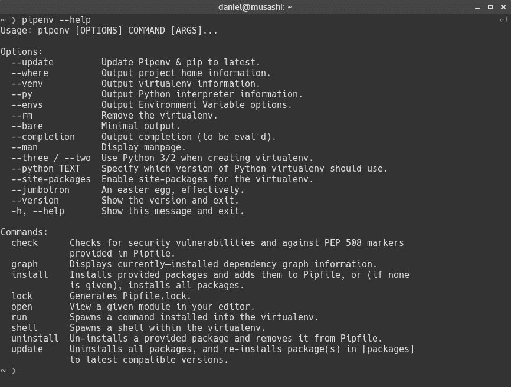
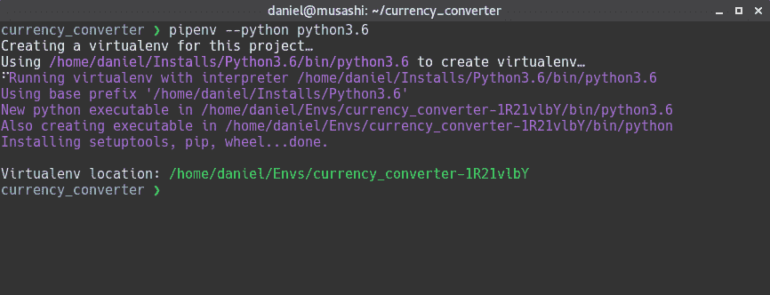
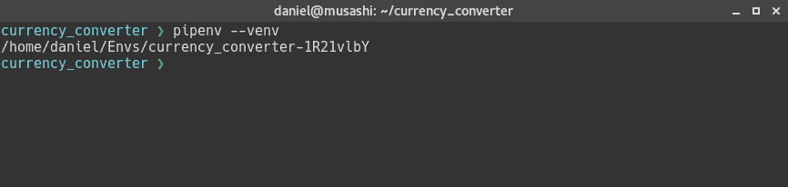
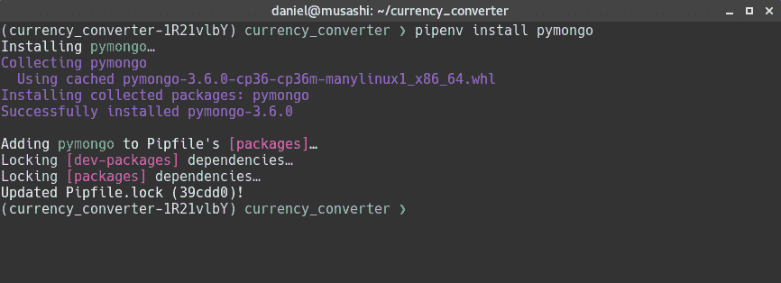
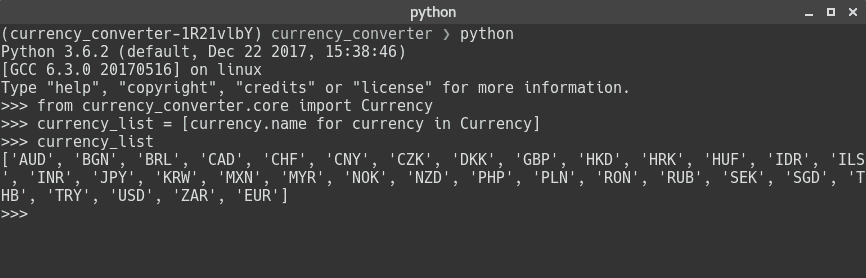
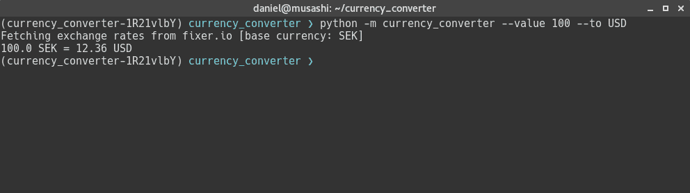

# 汇率和货币转换工具

在上一章中，我们构建了一个非常酷的应用程序来计算 Twitter 上的投票数，并学习了如何使用 Python 验证和使用 Twitter API。我们还很好地介绍了如何为 Python 使用反应式扩展。在本章中，我们将创建一个终端工具，从`fixer.io`获取当天的汇率，并使用此信息在不同货币之间转换价值。

`Fixer.io`是[创建的一个非常好的项目 https://github.com/hakanensari](https://github.com/hakanensari) ；它每天从欧洲央行获取外汇汇率数据。他创建的 API 使用简单，运行良好。

我们的项目首先围绕 API 创建一个框架；当这一切就绪时，我们将创建一个终端应用程序，在这里我们可以执行货币转换。我们从`fixer.io`获取的所有数据都将存储在 MongoDB 数据库中，因此我们可以执行转换，而无需一直请求`fixer.io`。这将提高应用程序的性能。

在本章中，我们将介绍以下内容：

*   如何使用`pipenv`安装和管理我们项目的依赖项
*   使用 PyMongo 模块使用 MongoDB
*   使用请求使用 RESTAPI

说到这里，让我们开始吧！

# 建立环境

一如往常，我们将从建立环境开始；我们需要做的第一件事是建立一个虚拟环境，使我们能够轻松地安装项目依赖项，而不会干扰 Python 的全局安装。

在前面的章节中，我们使用`virtualenv`来创建我们的虚拟环境；然而，Kenneth Reitz（流行软件包*的创建者请求*创建了`pipenv`。
`pipenv`对于 Python 的作用就如同 NPM 对于 Node.js 的作用一样。然而，`pipenv`不仅仅用于包管理，它还为您创建和管理一个虚拟环境。在我看来，旧的开发工作流有很多优点，但对我来说，有两件事很突出：第一件事是你不再需要两个不同的工具（`pip`、`virtualenv`），第二件事是在一个地方拥有所有这些强大的功能要简单得多。

关于`pipenv`我真正喜欢的另一件事是`Pipfile`的使用。有时候，处理需求文件真的很难。我们的生产环境和开发环境具有相同的依赖关系，最终您必须维护两个不同的文件；另外，每次需要删除一个依赖项时，都需要手动编辑需求文件。

使用`pipenv`，您不必担心有多个需求文件。开发依赖项和生产依赖项放在同一个文件中，`pipenv`还负责更新`Pipfile`。

安装`pipenv`很简单，只需运行：

```py
pip install pipenv
```

安装后，您可以运行：

```py
pipenv --help
```

您应该看到如下输出：



我们不会讨论所有不同的选项，因为这超出了本书的范围，但在我们创建环境的同时，您将获得良好的基础知识。

第一步是为我们的项目创建一个目录。让我们创建一个名为`currency_converter`的目录：

```py
mkdir currency_converter && cd currency_converter
```

现在您已经进入了`currency_converter`目录，我们将使用`pipenv`来创建我们的虚拟环境。运行以下命令：

```py
pipenv --python python3.6
```

这将为当前目录中的项目创建一个虚拟环境，并将使用 Python 3.6。`--python`选项还接受安装 Python 的路径。在我的例子中，我总是下载 Python 源代码，构建它，并将其安装到不同的位置，因此这对我非常有用。

您还可以使用`--three`选项，该选项将在您的系统上使用默认的 Python3 安装。运行命令后，您应该会看到以下输出：



如果你看一下`Pipfile`的内容，你应该有如下类似的内容：

```py
[[source]]

url = "https://pypi.python.org/simple"
verify_ssl = true
name = "pypi"

[dev-packages]

[packages]

[requires]

python_version = "3.6"
```

该文件开始定义从何处获取包，在这种情况下，它将从`pypi`下载包。然后，我们在`packages`中为项目的开发依赖项和生产依赖项提供了位置。最后，它说这个项目需要 Python 版本 3.6。

伟大的现在您可以使用一些命令。例如，如果您想知道项目使用的虚拟环境，可以运行`pipenv --venv`；您将看到以下输出：



如果要激活项目的虚拟环境，可以使用`shell`命令，如下所示：


完美的有了虚拟环境，我们就可以开始添加项目的依赖项了。

我们要添加的第一个依赖项是`requests`。

运行以下命令：

```py
pipenv install requests
```

我们将获得以下输出：


如您所见，`pipenv`安装`requests`及其所有依赖项。

The author of `pipenv` is the same developer who created the popular requests library. In the installation output, you can see an easter egg, saying `PS: You have excellent taste!`.

我们需要添加到项目中的另一个依赖项是`pymongo`，以便我们可以连接和操作 MongoDB 数据库中的数据。

运行以下命令：

```py
pipenv install pymongo
```

我们将获得以下输出：



我们来看看`Pipfile`现在的样子：

```py
[[source]]

url = "https://pypi.python.org/simple"
verify_ssl = true
name = "pypi"

[dev-packages]

[packages]

requests = "*"
pymongo = "*"

[requires]

python_version = "3.6"
```

如您所见，在`packages`文件夹下，我们现在有两个依赖项。

与使用`pip`安装软件包相比，没有太大变化。例外情况是，现在安装和删除依赖项将自动更新`Pipfile`。

另一个非常有用的命令是`graph`命令。运行以下命令：

```py
pipenv graph
```

我们将获得以下输出：


如您所见，`graph`命令在您想知道所安装软件包的依赖关系时非常有用。在我们的项目中，我们可以看到`pymongo`没有任何额外的依赖项。然而，`requests`有四个依赖项：`certifi`、`chardet`、`idna`和`urllib3`。

既然您已经对`pipenv`做了很好的介绍，那么让我们来看看这个项目的结构是什么样的：

```py
currency_converter
└── currency_converter
    ├── config
    ├── core   
```

顶部的`currency_converter`是应用程序的`root`目录。然后，下一层我们有另一个`currency_converter`，这就是我们要创建的`currency_converter`模块。

在`currency_converter`模块目录中，我们有一个包含应用程序核心功能的核心，例如，命令行参数解析器、处理数据的帮助函数等等。

和其他项目一样，我们还配置了哪个项目将包含读取 YAML 配置文件的函数；最后，我们有 HTTP，它具有所有将执行对`fixer.io`RESTAPI 的 HTTP 请求的函数。

既然我们已经学会了如何使用`pipenv`以及它将如何帮助我们提高工作效率，我们就可以将初始依赖项安装到我们的项目中。我们还创建了项目的目录结构。唯一缺少的是安装 MongoDB。

我使用的是 Linux Debian 9，我可以使用 Debian 的 package manager 工具轻松安装它：

```py
sudo apt install mongodb
```

您将在最流行的 Linux 发行版的软件包存储库中找到 MongoDB，如果您使用的是 Windows 或 macOS，您可以在以下链接中看到说明：

对于 macOS：[https://docs.mongodb.com/manual/tutorial/install-mongodb-on-os-x/](https://docs.mongodb.com/manual/tutorial/install-mongodb-on-os-x/)

对于 Windows：[https://docs.mongodb.com/manual/tutorial/install-mongodb-on-windows/](https://docs.mongodb.com/manual/tutorial/install-mongodb-on-windows/)

安装后，您可以使用 MongoDB 客户端验证一切是否正常工作。打开一个终端，运行`mongo`命令即可。

您应该进入 MongoDB shell：

```py
MongoDB shell version: 3.2.11
connecting to: test
```

要退出 MongoDB shell，只需键入*CTRL*+*D.*

完美的现在我们已经准备好开始编码了！

# 创建 API 包装器

在本节中，我们将创建一组函数来包装`fixer.io`API，并帮助我们在项目中以简单的方式使用它。

让我们继续在`currency_converter/currency_converter/core`目录中创建一个名为`request.py`的新文件。首先，我们将包含一些`import`语句：

```py
import requests
from http import HTTPStatus
import json
```

我们显然需要`requests`这样我们可以对`fixer.io`端点执行请求，我们也从 HTTP 模块导入`HTTPStatus`这样我们可以返回正确的 HTTP 状态码；在我们的代码中也应该更详细一点。阅读`HTTPStatus.OK`报税表要比只阅读`200.`报税表好得多，也容易得多

最后，我们导入`json`包，以便将从`fixer.io`获取的 JSON 内容解析为 Python 对象。

接下来，我们将添加第一个函数。此函数将返回给定特定货币的当前汇率：

```py
def fetch_exchange_rates_by_currency(currency):
    response = requests.get(f'https://api.fixer.io/latest?base=
                            {currency}')

    if response.status_code == HTTPStatus.OK:
        return json.loads(response.text)
    elif response.status_code == HTTPStatus.NOT_FOUND:
        raise ValueError(f'Could not find the exchange rates for: 
                         {currency}.')
    elif response.status_code == HTTPStatus.BAD_REQUEST:
        raise ValueError(f'Invalid base currency value: {currency}')
    else:
        raise Exception((f'Something went wrong and we were unable 
                         to fetch'
                         f' the exchange rates for: {currency}'))
```

此函数获取一种货币作为参数，首先向`fixer.io`API 发送请求，以获取以货币为基础的最新汇率，这是作为参数给出的。

如果响应为`HTTPStatus.OK`（`200`），则使用 JSON 模块的 load 函数解析 JSON 响应；否则，我们将根据发生的错误引发异常。

我们还可以在`currency_converter/currency_converter/core`目录中创建一个名为`__init__.py`的文件，并导入我们刚刚创建的函数：

```py
from .request import fetch_exchange_rates_by_currency
```

伟大的让我们在 Python REPL 中尝试一下：

```py
Python 3.6.3 (default, Nov 21 2017, 06:53:07)
[GCC 6.3.0 20170516] on linux
Type "help", "copyright", "credits" or "license" for more information.
>>> from currency_converter.core import fetch_exchange_rates_by_currency
>>> from pprint import pprint as pp
>>> exchange_rates = fetch_exchange_rates_by_currency('BRL')
>>> pp(exchange_rates)
{'base': 'BRL',
 'date': '2017-12-06',
 'rates': {'AUD': 0.40754,
 'BGN': 0.51208,
 'CAD': 0.39177,
 'CHF': 0.30576,
 'CNY': 2.0467,
 'CZK': 6.7122,
 'DKK': 1.9486,
 'EUR': 0.26183,
 'GBP': 0.23129,
 'HKD': 2.4173,
 'HRK': 1.9758,
 'HUF': 82.332,
 'IDR': 4191.1,
 'ILS': 1.0871,
 'INR': 19.963,
 'JPY': 34.697,
 'KRW': 338.15,
 'MXN': 5.8134,
 'MYR': 1.261,
 'NOK': 2.5548,
 'NZD': 0.4488,
 'PHP': 15.681,
 'PLN': 1.1034,
 'RON': 1.2128,
 'RUB': 18.273,
 'SEK': 2.599,
 'SGD': 0.41696,
 'THB': 10.096,
 'TRY': 1.191,
 'USD': 0.3094,
 'ZAR': 4.1853}}
```

完美的它的工作原理和我们预期的一样。

接下来，我们将开始构建数据库助手类。

# 添加数据库帮助器类

现在我们已经实现了从`fixer.io`获取汇率信息的功能，我们需要添加一个类来检索并保存我们获取的信息到 MongoDB 中。

那么，让我们继续在`currency_converter/currency_converter/core`目录中创建一个名为`db.py`的文件；让我们添加一些`import`语句：

```py
  from pymongo import MongoClient
```

我们唯一需要`import`的就是`MongoClient`。`MongoClient`将负责打开与我们数据库实例的连接。

现在，我们需要添加`DbClient`类。这个类的思想是充当`pymongo`包函数的包装器，并提供一组更简单的函数，在使用`pymongo`时抽象出一些重复的样板代码：

```py
class DbClient:

    def __init__(self, db_name, default_collection):
        self._db_name = db_name
        self._default_collection = default_collection
        self._db = None
```

一个名为`DbClient`的类及其构造函数得到两个参数`db_name`和`default_collection`。注意，在 MongoDB 中，我们不需要在使用数据库和集合之前创建它。当我们第一次尝试插入数据时，将为我们创建数据库和集合。

如果您习惯于使用诸如 MySQL 或 MSSQL 之类的 SQL 数据库，那么在使用这些数据库之前，您必须连接到服务器实例、创建数据库并创建所有表，这可能看起来很奇怪。

We aren't concerned about security in this example since MongoDB is beyond the scope of this book and we are only focusing on Python.

然后，我们将向数据库中添加两种方法，`connect`和`disconnect`：

```py
    def connect(self):
        self._client = MongoClient('mongodb://127.0.0.1:27017/')
        self._db = self._client.get_database(self._db_name)

    def disconnect(self):
        self._client.close()
```

`connect`方法将使用`MongoClient`连接到本地主机上的数据库实例，使用端口`27017`，这是 MongoDB 在安装后立即运行的默认端口。这两个值对于您的环境可能不同。`disconnect`方法只需调用靠近客户端的方法，正如名称所示，它会关闭连接。

现在，我们将添加两个特殊功能，`__enter__`和`__exit__`：

```py
    def __enter__(self):
        self.connect()
        return self

    def __exit__(self, exec_type, exec_value, traceback):
        self.disconnect()

        if exec_type:
            raise exec_type(exec_value)

        return self
```

我们希望`DbClient`类在自己的上下文中使用，这是通过使用上下文管理器和`with`语句实现的。上下文管理器的基本实现是通过实现这两个功能来完成的，`__enter__`和`__exit__`。当我们进入`DbClient`正在运行的上下文时，将调用`__enter__`。在本例中，我们将调用`connect`方法来连接我们的 MongoDB 实例。

另一方面，`__exit__`方法在当前上下文终止时被调用。上下文可以由正常原因或引发的某些异常终止。在我们的例子中，我们断开与数据库的连接，如果`exec_type`不等于`None`，这意味着如果发生了某个异常，我们将引发该异常。这是必要的，否则，在`DbClient`上下文中发生的异常将被抑制。

现在，我们要添加一个名为`_get_collection`的私有方法：

```py
    def _get_collection(self):
        if self._default_collection is None:
            raise AttributeError('collection argument is required')

        return self._db[self._default_collection]
```

此方法将简单地检查我们是否定义了一个`default_collection`。如果不是，它将抛出一个异常；否则，我们将返回集合。

我们只需要两个方法来完成此类，一个用于查找数据库中的项，另一个用于插入或更新数据：

```py
    def find_one(self, filter=None):
        collection = self._get_collection()
        return collection.find_one(filter)

    def update(self, filter, document, upsert=True):
        collection = self._get_collection()

        collection.find_one_and_update(
            filter,
            {'$set': document},
            upsert=upsert)
```

`find_one`方法获取一个名为 filter 的可选参数，该参数是一个字典，其中包含用于执行搜索的条件。如果省略，它将只返回集合中的第一项。

更新方法中还有一些事情要做。它有三个参数：`filter`、`document`和可选参数`upsert.`

`filter`参数与`find_one`方法完全相同；这是一个标准，将用于搜索我们要更新的集合项。

`document`参数是一个字典，其中包含要在集合的项或插入项中更新的字段。

最后，可选参数`upsert`，当设置为`True`时，意味着如果我们试图更新的项在数据库的集合中不存在，那么我们将执行插入操作并将该项添加到集合中

该方法首先获取默认集合，然后使用集合的`find_on_and_update`方法，将`filter`传递给字典，其中包含我们要更新的字段和`upsert`选项。

我们还需要用以下内容更新`currency_converter/currency_converter/core`目录中的`__init__.py`文件：

```py
from .db import DbClient
```

伟大的现在，我们可以开始创建命令行解析器了。

# 创建命令行解析器

我必须承认一件事：我是命令行类型的人。是的，我知道有些人认为它过时了，但我喜欢在终端上工作。我的工作效率肯定更高，如果您使用的是 Linux 或 macOS，您可以将各种工具结合起来以获得您想要的结果。这就是我们要为这个项目添加命令行解析器的原因。

为了开始创建命令行解析器，我们需要实现一些东西。我们将要添加的一个功能是设置默认货币的可能性，这将避免应用程序的用户总是必须指定基础货币来执行货币转换。

为此，我们将创建一个动作，我们已经在[第 1 章](1.html)、*实现天气应用程序*中看到了动作是如何工作的，但为了让我们头脑清醒，动作是可以绑定到命令行参数以执行特定任务的类。在命令行中使用参数时，将自动调用这些操作。

在开始开发自定义操作之前，我们需要创建一个函数，该函数将从数据库获取应用程序的配置。首先，我们将创建一个自定义异常，当我们无法从数据库检索配置时，该异常将用于引发错误。在`currency_converter/currency_converter/config`目录中创建一个名为`config_error.py`的文件，包含以下内容：

```py
    class ConfigError(Exception):
      pass
```

完美的这就是创建自定义异常所需的全部内容。我们本可以使用内置的异常，但这对于我们的应用程序来说太特殊了。为应用程序创建自定义异常始终是一种良好的做法；在排除 bug 时，它将使您和同事的生活更加轻松。

在`currency_converter/currency_converter/config/`目录中创建一个名为`config.py`的文件，包含以下内容：

```py
from .config_error import ConfigError
from currency_converter.core import DbClient

def get_config():
    config = None

    with DbClient('exchange_rates', 'config') as db:
        config = db.find_one()

    if config is None:
        error_message = ('It was not possible to get your base 
                        currency, that '
                       'probably happened because it have not been '
                         'set yet.\n Please, use the option '
                         '--setbasecurrency')
        raise ConfigError(error_message)

    return config
```

在这里，我们从添加`import`语句开始。我们开始导入刚刚创建的`ConfigError`自定义异常，同时导入`DbClient`类，以便访问数据库以检索应用程序的配置。

然后，我们定义了`get_config`函数。此函数将不接受任何参数，并且该函数首先定义一个带有`None`值的变量 config。然后，我们使用`DbClient`连接到`exchange_rate`数据库，并使用名为`config`的集合。在`DbClient`上下文中，我们使用不带任何参数的`find_one`方法，这意味着将返回配置集合中的第一项。

如果`config`变量仍然是`None`，我们会向用户抛出一个异常，告诉用户数据库中还没有配置，需要使用`--setbasecurrency`参数再次运行应用程序。我们将在短时间内实现命令行参数。如果我们有配置的值，我们只返回它。

我们还需要在`currency_converter/currency_converter/config`目录中创建一个包含以下内容的`__init__.py`文件：

```py
from .config import get_config
```

现在，让我们开始添加第一个操作，它将设置默认货币。在`currency_converter/currency_converter/core`目录中添加一个名为`actions.py`的文件：

```py
  import sys
  from argparse import Action
  from datetime import datetime

  from .db import DbClient
  from .request import fetch_exchange_rates_by_currency
  from currency_converter.config import get_config
```

首先，我们导入`sys`以便在出现问题时可以终止程序的执行。然后，我们从`argparse`模块导入`Action`。在创建自定义操作时，我们需要创建一个继承自`Action`的类。我们还导入`datetime`，因为我们将添加功能来检查我们将要使用的汇率是否过时。

然后，我们导入我们创建的一些类和函数。我们从`DbClient`开始，以便在 MongoDB 中获取和存储数据，然后在必要时`fetch_exchange_rates_by_currency`从`fixer.io`获取新数据。最后，我们导入一个名为`get_config`的助手函数，以便从数据库中的配置集合中获取默认货币。

让我们从添加`SetBaseCurrency`类开始：

```py
class SetBaseCurrency(Action):
    def __init__(self, option_strings, dest, args=None, **kwargs):
        super().__init__(option_strings, dest, **kwargs)
```

在这里，我们定义了继承自`Action`的`SetBaseCurrency`类，并添加了一个构造函数。它没什么用；它只是基类的所有构造函数。

现在，我们需要实现一个名为`__call__`的特殊方法。解析操作绑定到的参数时将调用它：

```py
    def __call__(self, parser, namespace, value, option_string=None):
        self.dest = value

        try:
            with DbClient('exchange_rates', 'config') as db:
                db.update(
                    {'base_currency': {'$ne': None}},
                    {'base_currency': value})

            print(f'Base currency set to {value}')
        except Exception as e:
            print(e)
        finally:
            sys.exit(0)
```

这个方法有四个参数，解析器是我们即将创建的`ArgumentParser`的一个实例。`namespace`是一个对象，它是参数解析器的结果；我们在[第 1 章](1.html)中详细介绍了名称空间对象，*实现天气应用程序*。值是传递给基础参数的值，`option_string`是动作绑定到的参数。

我们通过设置参数的目标变量值来启动该方法，然后创建一个`DbClient`实例。注意，我们在这里使用的是`with`语句，因此我们在 DbClient 上下文中运行更新。

然后，我们称之为`update`方法。这里，我们将两个参数传递给`update`方法，第一个参数是`filter`。当我们有`{'base_currrency': {'$ne': None}}`时，意味着我们要更新集合中基础货币不等于零的项目；否则，我们将插入一个新项目。这是`DbClient`类中`update`方法的默认行为，因为我们将`upsert`选项默认设置为`True`。

当我们完成更新时，我们将消息打印给用户，告诉用户已经设置了默认货币，当我们点击`finally`子句时，我们将退出代码的执行。如果出现问题，并且由于某种原因，我们无法更新`config`集合，将显示错误，我们将退出程序。

我们需要创建的另一个类是`UpdateForeignerExchangeRates`类：

```py
class UpdateForeignerExchangeRates(Action):
    def __init__(self, option_strings, dest, args=None, **kwargs):
        super().__init__(option_strings, dest, **kwargs)
```

与前面的类一样，我们定义了类并从`Action`继承。构造函数仅调用基类中的构造函数：

```py
def __call__(self, parser, namespace, value, option_string=None):

        setattr(namespace, self.dest, True)

        try:
            config = get_config()
            base_currency = config['base_currency']
            print(('Fetching exchange rates from fixer.io'
                   f' [base currency: {base_currency}]'))
            response = 
            fetch_exchange_rates_by_currency(base_currency)
            response['date'] = datetime.utcnow()

            with DbClient('exchange_rates', 'rates') as db:
                db.update(
                    {'base': base_currency},
                    response)
        except Exception as e:
            print(e)
        finally:
            sys.exit(0)
```

我们还需要实现`__call__`方法，在使用此操作将绑定到的参数时将调用该方法。我们不再讨论方法参数，因为它与前一个完全相同。

该方法首先将目标属性的值设置为`True`。我们将用于运行此操作的参数不需要参数，它将默认为`False`，因此如果我们使用该参数，我们将其设置为`True`。这只是说明我们使用了那个论点的一种方式。

然后，我们从数据库中获取配置并获取`base_currency`。我们向用户显示一条消息，说我们正在从`fixer.io`获取数据，然后我们使用`fetch_exchange_rates_by_currency`函数，将`base_currency`传递给它。当我们收到响应时，我们会将日期更改为 UTC 时间，以便更容易计算给定货币的汇率是否需要更新。

Remember that `fixer.io` updates its data around 16:00 CET.

然后，我们创建另一个`DbClient`实例，并使用带有两个参数的`update`方法。第一个参数是`filter`，因此它将更改集合中符合条件的任何项，第二个参数是我们从`fixer.io`API 得到的响应。

完成所有操作后，我们点击`finally`子句并终止程序的执行。如果出现问题，我们会在终端向用户显示一条消息，并终止程序的执行。

# 创建货币枚举

在启动命令行解析器之前，我们需要做的另一件事是使用我们的应用程序的用户可以选择的可能货币创建一个枚举。让我们继续在`currency_converter/currency_converter/core`目录中创建一个名为`currency.py`的文件，其内容如下：

```py
from enum import Enum

class Currency(Enum):
    AUD = 'Australia Dollar'
    BGN = 'Bulgaria Lev'
    BRL = 'Brazil Real'
    CAD = 'Canada Dollar'
    CHF = 'Switzerland Franc'
    CNY = 'China Yuan/Renminbi'
    CZK = 'Czech Koruna'
    DKK = 'Denmark Krone'
    GBP = 'Great Britain Pound'
    HKD = 'Hong Kong Dollar'
    HRK = 'Croatia Kuna'
    HUF = 'Hungary Forint'
    IDR = 'Indonesia Rupiah'
    ILS = 'Israel New Shekel'
    INR = 'India Rupee'
    JPY = 'Japan Yen'
    KRW = 'South Korea Won'
    MXN = 'Mexico Peso'
    MYR = 'Malaysia Ringgit'
    NOK = 'Norway Kroner'
    NZD = 'New Zealand Dollar'
    PHP = 'Philippines Peso'
    PLN = 'Poland Zloty'
    RON = 'Romania New Lei'
    RUB = 'Russia Rouble'
    SEK = 'Sweden Krona'
    SGD = 'Singapore Dollar'
    THB = 'Thailand Baht'
    TRY = 'Turkish New Lira'
    USD = 'USA Dollar'
    ZAR = 'South Africa Rand'
    EUR = 'Euro'
```

这很简单。在前面的章节中，我们已经介绍了 Python 中的枚举，但是这里我们定义了枚举，其中键是货币的缩写，值是名称。这也与`fixer.io`中可用的货币匹配。

打开`currency_converter/currency_converter/core`目录下的`__init__.py`文件，添加以下导入语句：

```py
from .currency import Currency
```

# 创建命令行解析器

完美的现在，我们都准备好创建命令行解析器了。让我们继续在`currency_converter/currency_converter/core`目录中创建一个名为`cmdline_parser.py`的文件，像往常一样，开始导入我们需要的所有内容：

```py
import sys
from argparse import ArgumentParser

from .actions import UpdateForeignerExchangeRates
from .actions import SetBaseCurrency
from .currency import Currency
```

我们从顶部导入`sys`，以便在出现问题时退出程序。我们还包括了`ArgumentParser`以便我们可以创建解析器；我们还导入了刚刚创建的`UpdateforeignerExchangeRates`和`SetBaseCurrency`动作。`Currency`枚举中的最后一件事是，我们将使用它在解析器中的某些参数中设置有效选项。

创建一个名为`parse_commandline_args`的函数：

```py
def parse_commandline_args():

    currency_options = [currency.name for currency in Currency]

    argparser = ArgumentParser(
        prog='currency_converter',
        description=('Tool that shows exchange rated and perform '
                     'currency convertion, using http://fixer.io 
                       data.'))
```

我们在这里要做的第一件事就是只获取`Currency`枚举键的名称；这将返回如下列表：



在这里，我们最终创建了一个`ArgumentParser`的实例，并传递了两个参数：`prog`，这是程序的名称，我们可以将其称为`currency_converter`，第二个是`description`（在命令行中传递`help`参数时将向用户显示的描述）。

这是我们将在`--setbasecurrency`中添加的第一个论点：

```py
argparser.add_argument('--setbasecurrency',
                           type=str,
                           dest='base_currency',
                           choices=currency_options,
                           action=SetBaseCurrency,
                           help='Sets the base currency to be 
                           used.')
```

我们定义的第一个参数是`--setbasecurrency`。它将在数据库中存储货币，因此我们不需要在命令行中始终指定基础货币。我们指定此参数将存储为字符串，用户输入的值将存储在名为`base_currency`的属性中。

我们还将参数选择设置为前面代码中定义的`currency_options`。这将确保我们只能传递与`Currency`枚举匹配的货币。

`action`指定使用此参数时要执行的操作，我们将其设置为`actions.py`文件中定义的`SetBaseCurrency`自定义操作。最后一个选项`help`是显示应用程序帮助时显示的文本。

让我们添加`--update`参数：

```py
 argparser.add_argument('--update',
                           metavar='',
                           dest='update',
                           nargs=0,
                           action=UpdateForeignerExchangeRates,
                           help=('Update the foreigner exchange 
                                  rates '
                                 'using as a reference the base  
                                  currency'))
```

正如名字所说，`--update`参数将更新默认货币的汇率。这意味着要在`--setbasecurrency`参数之后使用。

在这里，我们用名称`--update`定义参数，然后设置`metavar`参数。生成帮助时会引用`metavar`关键字`--update`。默认情况下，它与参数的名称相同，但为大写。因为我们没有任何需要传递给这个参数的值，所以我们将`metavar`设置为 nothing。下一个参数是`nargs`，它告诉`argparser`此参数不需要传递值。最后，我们将`action`设置为之前创建的另一个自定义操作`UpdateForeignExchangeRates`操作。最后一个参数是`help`，它指定了该参数的帮助文本。

下一个参数是`--basecurrency`参数：

```py
argparser.add_argument('--basecurrency',
                           type=str,
                           dest='from_currency',
                           choices=currency_options,
                           help=('The base currency. If specified it 
                                  will '
                                 'override the default currency set 
                                  by'
                                 'the --setbasecurrency option'))
```

这个参数的想法是，我们希望允许用户在请求货币转换时覆盖他们使用`--setbasecurrency`参数设置的默认货币。

在这里，我们用名称`--basecurrency`定义参数。对于`string`类型，我们将把传递给参数的值存储在一个名为`from_currency`的属性中；我们还在此处将选项设置为`currency_option`，以便确保只允许`Currency`枚举中存在的货币。最后，我们设置帮助文本。

我们要添加的下一个参数称为`--value`。此参数将接收应用程序用户希望转换为其他货币的值。

下面是我们将如何编写它：

```py
argparser.add_argument('--value',
                           type=float,
                           dest='value',
                           help='The value to be converted')
```

在这里，我们将参数的名称设置为`--value`。请注意，该类型与我们之前定义的参数不同。现在，我们将收到一个浮点值，参数解析器将把传递给`--value`参数的值存储到名为 value 的属性中。最后一个论点是`help`文本。

最后，我们将在指定值将转换为哪种货币的参数中添加的最后一个参数将被称为`--to`：

```py
   argparser.add_argument('--to',
                           type=str,
                           dest='dest_currency',
                           choices=currency_options,
                           help=('Specify the currency that the value 
                                  will '
                                 'be converted to.'))
```

这个参数与我们在前面的代码中定义的`--basecurrency`参数非常相似。在这里，我们将参数的名称设置为`--to`，它将是`string`类型。传递给此参数的值将存储在名为`dest_currency`的属性中。这里，我们还为从`Currency`枚举中提取的有效货币列表设置了一个参数选项；最后，我们设置了帮助文本。

# 基本验证

请注意，我们定义的许多参数都是必需的。但是，也有一些相互依赖的参数，例如参数`--value`和`--to`。如果不指定要转换为的货币，则无法尝试转换值，反之亦然。

这里的另一个问题是，由于需要许多参数，如果我们运行应用程序时根本不传递任何参数，它只会接受它并崩溃；正确的做法是，如果用户不使用任何参数，我们应该显示帮助菜单。话虽如此，我们需要添加一个函数来为我们执行这种验证，所以让我们继续添加一个名为`validate_args`的函数。您可以在`import`语句之后的顶部添加此函数：

```py
def validate_args(args):

    fields = [arg for arg in vars(args).items() if arg]

    if not fields:
        return False

    if args.value and not args.dest_currency:
        return False
    elif args.dest_currency and not args.value:
        return False

    return True
```

所以，`args`将被传递给这个函数。`args`实际上是`time`和`namespace`的对象。此对象将包含与我们在参数定义中的`dest`参数中指定的名称相同的属性。在我们的例子中，`namespace`将包含以下属性：`base_currency`、`update`、`from_currency`、`value`和`dest_currency`。

我们使用理解来获取所有未设置为`None`的字段。在此理解中，我们使用内置函数`vars`，它将返回`args`的属性`__dict__`的值，该属性是`Namespace`对象的一个实例。然后，我们使用`.items()`函数，这样我们可以遍历字典项，并逐一测试其值是否为`None`。

如果在命令行中传递了任何参数，那么理解的结果将是一个空列表，在这种情况下，我们返回`False`。

然后，我们测试需要成对使用的参数：`--value`（值）和`--to`（`dest_currency`）。如果我们有一个值，它将返回`False`，但`dest_currency`等于`None`，反之亦然

现在，我们可以完成`parse_commandline_args`。让我们转到此函数的结尾，并添加如下代码：

```py
      args = argparser.parse_args()

      if not validate_args(args):
          argparser.print_help()
          sys.exit()

      return args
```

这里，我们解析参数并将它们设置为变量`args`，记住`args`将是`namespace`类型。然后，我们将`args`传递给我们刚刚创建的函数`validate_args`函数。如果`validate_args`返回`False`，则打印帮助并终止程序执行；否则返回`args`。

接下来，我们将开发应用程序的入口点，它将把我们迄今为止开发的所有部分粘合在一起。

# 添加应用程序的入口点

这是本章中我们一直在等待的部分；我们将创建应用程序入口点，并将我们迄今为止编写的所有代码粘在一起。

让我们在`currency_converter/currency_converter`目录中创建一个名为`__main__.py`的文件。在[第一章](1.html)*实现天气应用*之前，我们已经使用了`_main__`文件。当我们在模块的`root`目录中放置一个名为`__main__.py`的文件时，这意味着该文件是模块的入口脚本。因此，如果我们运行以下命令：

```py
python -m currency_converter 
```

这与跑步相同：

```py
python currency_converter/__main__.py
```

伟大的那么，让我们开始向该文件添加内容。首先，添加一些`import`语句：

```py
import sys

from .core.cmdline_parser import parse_commandline_args
from .config import get_config
from .core import DbClient
from .core import fetch_exchange_rates_by_currency
```

我们像往常一样导入`sys`包，以防我们需要调用 exit 来终止代码的执行，然后导入我们迄今为止开发的所有类和实用程序函数。我们首先导入`parse_commandline_args`函数进行命令行解析，`get_config`这样我们就可以获得用户设置的默认货币，`DbClient`类这样我们就可以访问数据库并获取汇率；最后，我们还导入了`fetch_exchange_rates_by_currency `函数，当我们选择一种尚未在数据库中的货币时，将使用该函数。我们将从`fixer.io`API 获取此信息。

现在，我们可以创建`main`函数：

```py
def main():
    args = parse_commandline_args()
    value = args.value
    dest_currency = args.dest_currency
    from_currency = args.from_currency

    config = get_config()
    base_currency = (from_currency
                     if from_currency
                     else config['base_currency'])
```

`main`函数首先解析命令行参数。如果用户正确输入了所有内容，我们将收到一个包含所有参数及其值的`namespace`对象。在这个阶段，我们只关心三个参数：`value`、`dest_currency`和`from_currency`。如果您从前面回忆起，`value`是用户希望转换为另一种货币的值，`dest_currency`是用户希望转换为的货币，并且只有当用户希望覆盖数据库上设置的默认货币时，才会传递`from_currency`。

在获得所有这些值之后，我们调用`get_config`从数据库中获取`base_currency`，然后我们检查是否有一个`from_currency`可以使用该值；否则，我们使用数据库中的`base_currency`。这将确保如果用户指定一个`from_currency`值，那么该值将覆盖数据库中存储的默认货币。

接下来，我们实现从数据库或`fixer.io`API 实际获取汇率的代码，如下所示：

```py
    with DbClient('exchange_rates', 'rates') as db:
        exchange_rates = db.find_one({'base': base_currency})

        if exchange_rates is None:
            print(('Fetching exchange rates from fixer.io'
                   f' [base currency: {base_currency}]'))

            try:
                response = 
                fetch_exchange_rates_by_currency(base_currency)
            except Exception as e:
                sys.exit(f'Error: {e}')

            dest_rate = response['rates'][dest_currency]
            db.update({'base': base_currency}, response)
        else:
            dest_rate = exchange_rates['rates'][dest_currency]

        total = round(dest_rate * value, 2)
        print(f'{value} {base_currency} = {total} {dest_currency}')
```

我们使用`DbClient`类创建与数据库的连接，并指定要访问 rates 集合。在上下文中，我们首先尝试查找基础货币的汇率。如果它不在数据库中，我们尝试从`fixer.io`获取它。

之后，我们提取要转换的货币的汇率值，并将结果插入数据库，以便下次运行程序并希望使用该货币作为基础时，我们不需要再次向`fixer.io`发送请求。

如果我们找到基础货币的汇率，我们只需得到该值并将其分配给`dest_rate`变量。

我们要做的最后一件事是执行转换并使用内置的 round 函数将小数点后的位数限制为两位数，然后在终端中打印值。

在文件末尾，在`main()`功能之后，添加以下代码：

```py
if __name__ == '__main__':
    main()
```

我们都完了！

# 测试我们的应用程序

让我们测试一下我们的应用程序。首先，我们将显示帮助消息，以查看我们有哪些可用选项：


美好的正如所料。现在，我们可以使用`--setbasecurrency`参数设置基础货币：


在这里，我将基础货币设置为瑞典克朗（瑞典克朗），每次我需要执行货币转换时，我不需要指定我的基础货币为瑞典克朗。让我们将 100 瑞典克朗兑换成美元（美元）：



如您所见，我们在数据库中还没有汇率，因此应用程序要做的第一件事是从`fixer.io`获取汇率并将其保存到数据库中。

由于我是一名总部位于瑞典的巴西开发商，我想将瑞典克朗转换为巴西雷亚尔（巴西雷亚尔），这样我就可以知道下次我去看望父母时要带多少瑞典克朗到巴西：


请注意，由于这是我们第二次运行应用程序，我们已经有了以瑞典克朗为基础货币的汇率，因此应用程序不再从`fixer.io`获取数据。

现在，我们最不想尝试的是覆盖基础货币。目前，它被设置为瑞典克朗。我们使用墨西哥比索（墨西哥比索），并将墨西哥比索转换为瑞典克朗：


# 总结

在本章中，我们讨论了许多有趣的话题。在第一节中，在为我们的应用程序设置环境时，您学习了如何使用超级新的流行工具`pipenv`，它已成为[python.org](https://www.python.org/)上用于创建虚拟环境和管理项目依赖关系的推荐工具。

您还学习了面向对象编程的基本概念，如何为您的命令行工具创建自定义操作，关于上下文管理器的基础知识，这是 Python 语言中非常强大的功能，如何在 Python 中创建枚举，以及如何使用`Requests`执行 HTTP 请求，它是 Python 生态系统中最流行的包之一。

最后，您学习了如何使用`pymongo`包在 MongoDB 数据库中插入、更新和搜索数据。

在下一章中，我们将切换设备，使用优秀且非常流行的 Django web 框架开发一个完整、功能非常强大的 web 应用程序！