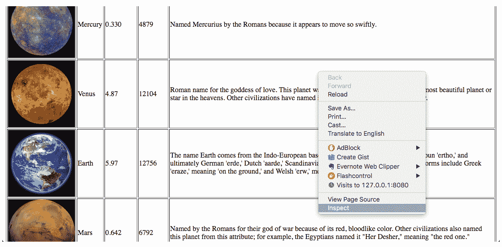
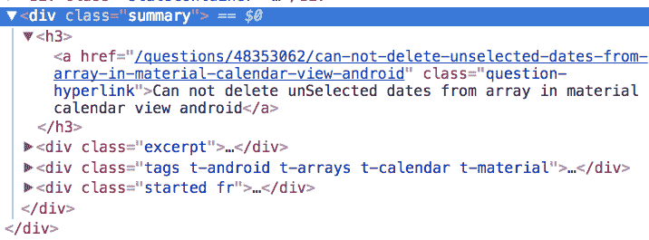

# 二、数据采集与提取

在本章中，我们将介绍：

*   如何使用 BeautifulSoup 解析网站和浏览 DOM
*   使用 Beauty Soup 的查找方法搜索 DOM
*   用 XPath 和 lxml 查询 DOM
*   使用 XPath 和 CSS 选择器查询数据
*   使用刮擦选择器
*   加载 Unicode/UTF-8 格式的数据

# 介绍

有效抓取的关键方面是了解内容和数据如何存储在 web 服务器上，确定要检索的数据，以及了解工具如何支持此提取。在本章中，我们将讨论网站结构和 DOM，介绍使用 lxml、XPath 和 CSS 解析和查询网站的技术。我们还将研究如何使用其他语言和不同编码类型（如 Unicode）开发的网站。

最终，理解如何在 HTML 文档中查找和提取数据归结为理解 HTML 页面的结构、其在 DOM 中的表示、查询 DOM 中特定元素的过程，以及如何根据数据的表示方式指定要检索的元素。

# 如何使用 BeautifulSoup 解析网站和浏览 DOM

当浏览器显示网页时，它以称为**文档对象模型**（**DOM**的表示形式构建网页内容的模型。DOM 是页面整个内容的层次表示，以及结构信息、样式信息、脚本和指向其他内容的链接。

理解这种结构对于能够有效地从网页中获取数据至关重要。我们将查看一个示例 web 页面及其 DOM，并研究如何使用 BeautifulSoup 导航 DOM。

# 准备

我们将使用示例代码的`www`文件夹中包含的一个小型网站。接下来，从`www`文件夹中启动一个 web 服务器。这可以通过 Python 3 完成，如下所示：

```py
www $ python3 -m http.server 8080
Serving HTTP on 0.0.0.0 port 8080 (http://0.0.0.0:8080/) ...
```

通过右键单击网页并选择 Inspect，可以在 Chrome 中检查网页的 DOM。这将打开 Chrome 开发者工具。打开一个指向`http://localhost:8080/planets.html`的浏览器页面。在 chrome 中，您可以右键单击并选择“inspect”打开开发者工具（其他浏览器也有类似的工具）。


Selecting Inspect on the Page

这将打开开发人员工具和检查器。可以在“元素”选项卡中检查 DOM。

下表显示了表中第一行的选择：


Inspecting the First Row

每一排行星都在一个`<tr>`元素内。我们将研究这个元素及其相邻元素的几个特征，因为它们是为普通网页设计的。

首先，该元素有三个属性：`id`、`planet`和`name`。属性在抓取中通常很重要，因为它们通常用于识别和定位嵌入在 HTML 中的数据。

其次，`<tr>`元素有子元素，在本例中，有五个`<td>`元素。我们通常需要查看特定元素的子元素，以找到所需的实际数据。

该元素还有一个父元素`<tbody>`。还有兄弟元素和一组`<tr>`子元素。从任何行星，我们都可以找到父行星并找到其他行星。正如我们将看到的，我们可以在各种工具中使用各种构造，例如在 Beautiful Soup 中的**查找**函数族，以及`XPath`查询，来轻松地导航这些关系。

# 怎么做。。。

此配方以及本章中的大多数其他配方将以交互方式与 iPython 一起呈现。但每个配方的所有代码都可以在脚本文件中找到。此配方的代码位于`02/01_parsing_html_wtih_bs.py`中。您可以在中键入以下内容，也可以从脚本文件中剪切和粘贴。

现在，让我们通过 Beautiful Soup 解析 HTML。我们首先使用以下代码将此页面加载到一个`BeautifulSoup`对象中，该代码创建一个 BeautifulSoup 对象，使用 with requests.get 加载页面内容，并将其加载到名为 Soup 的变量中。

```py
In [1]: import requests
   ...: from bs4 import BeautifulSoup
   ...: html = requests.get("http://localhost:8080/planets.html").text
   ...: soup = BeautifulSoup(html, "lxml")
   ...:
```

`soup`对象中的 HTML 可以通过将其转换为字符串来检索（大多数 BeautifulSoup 对象都具有此特征）。下面显示了文档中 HTML 的前 1000 个字符：

```py
In [2]: str(soup)[:1000]
Out[2]: '<html>\n<head>\n</head>\n<body>\n<div id="planets">\n<h1>Planetary data</h1>\n<div id="content">Here are some interesting facts about the planets in our solar system</div>\n<p></p>\n<table border="1" id="planetsTable">\n<tr id="planetHeader">\n<th>\n</th>\n<th>\r\n Name\r\n </th>\n<th>\r\n Mass (10^24kg)\r\n </th>\n<th>\r\n Diameter (km)\r\n </th>\n<th>\r\n How it got its Name\r\n </th>\n<th>\r\n More Info\r\n </th>\n</tr>\n<tr class="planet" id="planet1" name="Mercury">\n<td>\n\n</td>\n<td>\r\n Mercury\r\n </td>\n<td>\r\n 0.330\r\n </td>\n<td>\r\n 4879\r\n </td>\n<td>Named Mercurius by the Romans because it appears to move so swiftly.</td>\n<td>\n<a href="https://en.wikipedia.org/wiki/Mercury_(planet)">Wikipedia</a>\n</td>\n</tr>\n<tr class="p'
```

我们可以使用`soup`的属性在 DOM 中导航元素。`soup`表示整个文档，我们可以通过链接标签名深入文档。以下导航到包含数据的`<table>`：

```py
In [3]: str(soup.html.body.div.table)[:200]
Out[3]: '<table border="1" id="planetsTable">\n<tr id="planetHeader">\n<th>\n</th>\n<th>\r\n Name\r\n </th>\n<th>\r\n Mass (10^24kg)\r\n </th>\n<th>\r\n '
```

下面检索表的第一个子项`<tr>`：

```py
In [6]: soup.html.body.div.table.tr
Out[6]: <tr id="planetHeader">
<th>
</th>
<th>
                    Name
                </th>
<th>
                    Mass (10^24kg)
                </th>
<th>
                    Diameter (km)
                </th>
<th>
                    How it got its Name
                </th>
<th>
                    More Info
                </th>
</tr>
```

请注意，这种类型的表示法只检索该类型的第一个子项。查找更多项需要对所有子项进行迭代，我们将在下一步进行，或者使用 find 方法（下一个配方）。

每个节点都有子节点和子节点。子节点是给定节点下的所有节点（事件位于比直接子节点更高的级别），而子节点是第一级子节点。下面检索表的子级，它实际上是一个`list_iterator`对象：

```py
In [4]: soup.html.body.div.table.children
Out[4]: <list_iterator at 0x10eb11cc0>
```

我们可以使用`for`循环或 Python 生成器检查迭代器中的每个子元素。下面使用生成器获取的所有子项，并将其组成 HTML 的前几个字符作为列表返回：

```py
In [5]: [str(c)[:45] for c in soup.html.body.div.table.children]
Out[5]:
['\n',
 '<tr id="planetHeader">\n<th>\n</th>\n<th>\r\n ',
 '\n',
 '<tr class="planet" id="planet1" name="Mercury',
 '\n',
 '<tr class="planet" id="planet2" name="Venus">',
 '\n',
 '<tr class="planet" id="planet3" name="Earth">',
 '\n',
 '<tr class="planet" id="planet4" name="Mars">\n',
 '\n',
 '<tr class="planet" id="planet5" name="Jupiter',
 '\n',
 '<tr class="planet" id="planet6" name="Saturn"',
 '\n',
 '<tr class="planet" id="planet7" name="Uranus"',
 '\n',
 '<tr class="planet" id="planet8" name="Neptune',
 '\n',
 '<tr class="planet" id="planet9" name="Pluto">',
 '\n']
```

最后但并非最不重要的一点是，可以使用`.parent`属性找到节点的父节点：

```py
In [7]: str(soup.html.body.div.table.tr.parent)[:200]
Out[7]: '<table border="1" id="planetsTable">\n<tr id="planetHeader">\n<th>\n</th>\n<th>\r\n Name\r\n </th>\n<th>\r\n Mass (10^24kg)\r\n </th>\n<th>\r\n '
```

# 工作原理

Beauty Soup 将 HTML 从页面转换为其自身的内部表示形式。此模型具有与浏览器创建的 DOM 相同的表示形式。但是 Beautiful Soup 还提供了许多强大的功能来导航 DOM 中的元素，例如我们在使用标记名作为属性时看到的内容。当我们知道标记名在 HTML 中的固定路径时，这些功能非常有用。

# 还有更多。。。

这种导航 DOM 的方式相对不灵活，并且高度依赖于结构。当网页由创建者更新时，这种结构可能会随着时间的推移而改变。这些页面甚至可以看起来完全相同，但有一个完全不同的结构，打破了您的刮码。

那么我们该如何应对呢？正如我们将看到的，有几种搜索元素的方法比定义显式路径要好得多。通常，我们可以使用 XPath 和 BeautifulSoup 的 find 方法来实现这一点。我们将在本章后面的食谱中研究这两种方法。

# 使用 Beauty Soup 的查找方法搜索 DOM

我们可以使用 Beauty Soup 的 find 方法执行 DOM 的简单搜索。这些方法为我们提供了一个更灵活、更强大的结构，用于查找不依赖于这些元素的层次结构的元素。在本配方中，我们将研究这些函数在 DOM 中定位各种元素的几种常见用法。

# 准备

如果您想将以下内容剪切粘贴到 ipython 中，您可以在`02/02_bs4_find.py`中找到样本。

# 怎么做。。。

我们将从新的 iPython 会话开始，并从加载 planets 页面开始：

```py
In [1]: import requests
 ...: from bs4 import BeautifulSoup
 ...: html = requests.get("http://localhost:8080/planets.html").text
 ...: soup = BeautifulSoup(html, "lxml")
 ...:
```

在前面的方法中，为了访问表中的所有`<tr>`，我们使用了链式属性语法来获取表，然后需要获取子元素并对其进行迭代器。这确实存在一个问题，因为子元素可能是`<tr>`以外的元素。仅获取`<tr>`子元素的更可取方法是使用`findAll`。

让我们首先找到`<table>`：

```py
In [4]: table = soup.find("table")
   ...: str(table)[:100]
   ...:
Out[4]: '<table border="1" id="planetsTable">\n<tr id="planetHeader">\n<th>\n</th>\n<th>\r\n Nam'
```

这告诉 soup 对象找到文档中的第一个`<table>`元素。从这个元素中，我们可以找到所有`<tr>`元素，它们是带有`findAll`的表的后代：

```py
In [8]: [str(tr)[:50] for tr in table.findAll("tr")]
Out[8]:
['<tr id="planetHeader">\n<th>\n</th>\n<th>\r\n ',
 '<tr class="planet" id="planet1" name="Mercury">\n<t',
 '<tr class="planet" id="planet2" name="Venus">\n<td>',
 '<tr class="planet" id="planet3" name="Earth">\n<td>',
 '<tr class="planet" id="planet4" name="Mars">\n<td>\n',
 '<tr class="planet" id="planet5" name="Jupiter">\n<t',
 '<tr class="planet" id="planet6" name="Saturn">\n<td',
 '<tr class="planet" id="planet7" name="Uranus">\n<td',
 '<tr class="planet" id="planet8" name="Neptune">\n<t',
 '<tr class="planet" id="planet9" name="Pluto">\n<td>']
```

Note that these are the descendants and not immediate children.  Change the query to `"td"` to see the difference.  The are no direct children that are `<td>`, but each row has multiple <td> elements.  In all, there would be 54 `<td>` elements found.

如果我们只想要包含行星数据的行，这里有一个小问题。表头也包括在内，我们可以利用目标行的`id`属性来解决这个问题，下面找到`id`值为`"planet3"`的行。

```py
In [14]: table.find("tr", {"id": "planet3"})
    ...:
Out[14]:
<tr class="planet" id="planet3" name="Earth">
<td>

</td>
<td>
                    Earth
                </td>
<td>
                    5.97
                </td>
<td>
                    12756
                </td>
<td>
                    The name Earth comes from the Indo-European base 'er,'which produced the Germanic noun 'ertho,' and ultimately German 'erde,'
                    Dutch 'aarde,' Scandinavian 'jord,' and English 'earth.' Related forms include Greek 'eraze,' meaning
                    'on the ground,' and Welsh 'erw,' meaning 'a piece of land.'
                </td>
<td>
<a href="https://en.wikipedia.org/wiki/Earth">Wikipedia</a>
</td>
</tr>
```

令人惊叹的我们使用了这样一个事实：这个页面使用这个属性用实际数据表示表行。

现在让我们更进一步，收集每个行星的质量，并将名称和质量放入字典：

```py
In [18]: items = dict()
    ...: planet_rows = table.findAll("tr", {"class": "planet"})
    ...: for i in planet_rows:
    ...: tds = i.findAll("td")
    ...: items[tds[1].text.strip()] = tds[2].text.strip()
    ...:

In [19]: items
Out[19]:
{'Earth': '5.97',
 'Jupiter': '1898',
 'Mars': '0.642',
 'Mercury': '0.330',
 'Neptune': '102',
 'Pluto': '0.0146',
 'Saturn': '568',
 'Uranus': '86.8',
 'Venus': '4.87'}
```

就像这样，我们从页面中嵌入的内容创建了一个很好的数据结构。

# 用 XPath 和 lxml 查询 DOM

XPath 是一种用于从 XML 文档中选择节点的查询语言，是任何执行 web 抓取的人都必须学习的查询语言。与其他基于模型的工具相比，XPath 为用户提供了许多好处：

*   可以轻松浏览 DOM 树
*   比 CSS 选择器和正则表达式等其他选择器更复杂、更强大
*   它有大量（200+）的内置函数，并可通过自定义函数进行扩展
*   它被解析库和抓取平台广泛支持

XPath 包含七个数据模型（我们以前见过其中一些）：

*   根节点（顶级父节点）
*   元素节点（`<a>`..`</a>`）
*   属性节点（`href="example.html"`）
*   文本节点（`"this is a text"`）
*   注释节点（`<!-- a comment -->`）
*   命名空间节点
*   处理指令节点

XPath 表达式可以返回不同的数据类型：

*   串
*   布尔运算
*   数字
*   节点集（可能是最常见的情况）

（XPath）**轴**定义了相对于当前节点的节点集。XPath 中总共定义了 13 个轴，以便从当前上下文节点或根节点轻松搜索不同的节点部分。

**lxml**是一个 Python 包装器，位于 libxml2 XML 解析库之上，该库是用 C 编写的。C 的实现有助于它比 Beautiful Soup 更快，但也更难在某些计算机上安装。最新安装说明可在以下网址获得：[http://lxml.de/installation.html](http://lxml.de/installation.html) 。

lxml 支持 XPath，这使得管理复杂的 XML 和 HTML 文档变得相当容易。我们将研究几种同时使用 lxml 和 XPath 的技术，以及如何使用 lxml 和 XPath 来导航 DOM 和访问数据。

# 准备

这些代码片段的代码在`02/03_lxml_and_xpath.py`中，以防您想保存一些输入。我们将从`lxml`以及`requests`导入`html`，然后加载页面。

```py
In [1]: from lxml import html
   ...: import requests
   ...: page_html = requests.get("http://localhost:8080/planets.html").text
```

By this point, lxml should be installed as a dependency of other installs.  If you get errors, install it with `pip install lxml`.

# 怎么做。。。

我们要做的第一件事是将 HTML 加载到 lxml“etree”中，这是 lxml 对 DOM 的表示。

```py
in [2]: tree = html.fromstring(page_html)
```

`tree`变量现在是 DOM 的 lxml 表示形式，用于建模 HTML 内容。现在让我们研究如何使用它和 XPath 从文档中选择各种元素。

第一个 XPath 示例是查找`<table>`元素下面的所有`<tr>`元素。

```py
In [3]: [tr for tr in tree.xpath("/html/body/div/table/tr")]
Out[3]:
[<Element tr at 0x10cfd1408>,
 <Element tr at 0x10cfd12c8>,
 <Element tr at 0x10cfd1728>,
 <Element tr at 0x10cfd16d8>,
 <Element tr at 0x10cfd1458>,
 <Element tr at 0x10cfd1868>,
 <Element tr at 0x10cfd1318>,
 <Element tr at 0x10cfd14a8>,
 <Element tr at 0x10cfd10e8>,
 <Element tr at 0x10cfd1778>,
 <Element tr at 0x10cfd1638>]
```

这个 XPath 通过标记名从文档的根到`<tr>`元素进行导航。这个示例看起来类似于 Beauty Soup 中的属性表示法，但最终它的表现力要明显更强。请注意结果中的一个差异。`<tr>`中的所有元素被返回，而不仅仅是第一个。事实上，此路径的每个级别上的标记都会返回多个项目（如果它们可用）。如果在`<body>`下方有多个`<div>`元素，则会对所有这些`<div>`执行`table/tr`搜索。

实际结果是一个`lxml`元素对象。下面获取与元素关联但使用`etree.tostring()`的 HTML（尽管它们应用了编码）：

```py
In [4]: from lxml import etree
   ...: [etree.tostring(tr)[:50] for tr in tree.xpath("/html/body/div/table/tr")]
Out[4]:
[b'<tr id="planetHeader">
\n <th>&#',
 b'<tr id="planet1" class="planet" name="Mercury">&#1',
 b'<tr id="planet2" class="planet" name="Venus">
',
 b'<tr id="planet3" class="planet" name="Earth">
',
 b'<tr id="planet4" class="planet" name="Mars">
\n',
 b'<tr id="planet5" class="planet" name="Jupiter">&#1',
 b'<tr id="planet6" class="planet" name="Saturn">&#13',
 b'<tr id="planet7" class="planet" name="Uranus">&#13',
 b'<tr id="planet8" class="planet" name="Neptune">&#1',
 b'<tr id="planet9" class="planet" name="Pluto">
',
 b'<tr id="footerRow">
\n <td>
']
```

现在，让我们看看如何使用 XPath 只选择行星的`<tr>`元素。

```py
In [5]: [etree.tostring(tr)[:50] for tr in tree.xpath("/html/body/div/table/tr[@class='planet']")]
Out[5]:
[b'<tr id="planet1" class="planet" name="Mercury">&#1',
 b'<tr id="planet2" class="planet" name="Venus">
',
 b'<tr id="planet3" class="planet" name="Earth">
',
 b'<tr id="planet4" class="planet" name="Mars">
\n',
 b'<tr id="planet5" class="planet" name="Jupiter">&#1',
 b'<tr id="planet6" class="planet" name="Saturn">&#13',
 b'<tr id="planet7" class="planet" name="Uranus">&#13',
 b'<tr id="planet8" class="planet" name="Neptune">&#1',
 b'<tr id="planet9" class="planet" name="Pluto">
']
```

标记旁边的`[]`表示我们希望根据当前元素的某些条件进行选择。`@`表示我们希望检查标记的属性，在该转换中，我们希望选择属性等于`"planet"`的标记。

对于有 11`<tr>`行的查询，还有一点需要说明。如前所述，XPath 在每个级别找到的所有节点上运行导航。本文档中有两个表，都是不同`<div>`的子元素，都是子元素或`<body>`元素。带有`id="planetHeader"`的行来自我们期望的目标表，另一个带有`id="footerRow"`的来自第二个表。

之前我们通过使用`class="row"`选择`<tr>`解决了这个问题，但是还有其他值得一提的方法。首先，我们还可以使用`[]`在 XPath 的每个部分指定一个特定的元素，就像它们是数组一样。如下所示：

```py
In [6]: [etree.tostring(tr)[:50] for tr in tree.xpath("/html/body/div[1]/table/tr")]
Out[6]:
[b'<tr id="planetHeader">
\n <th>&#',
 b'<tr id="planet1" class="planet" name="Mercury">&#1',
 b'<tr id="planet2" class="planet" name="Venus">
',
 b'<tr id="planet3" class="planet" name="Earth">
',
 b'<tr id="planet4" class="planet" name="Mars">
\n',
 b'<tr id="planet5" class="planet" name="Jupiter">&#1',
 b'<tr id="planet6" class="planet" name="Saturn">&#13',
 b'<tr id="planet7" class="planet" name="Uranus">&#13',
 b'<tr id="planet8" class="planet" name="Neptune">&#1',
 b'<tr id="planet9" class="planet" name="Pluto">
']
```

XPath 中的数组从 1 开始，而不是从 0 开始（这是常见的错误源）。这选择了第一个`<div>`。对`[2]`的更改选择了第二个`<div>`，因此只有第二个`<table>`。

```py
In [7]: [etree.tostring(tr)[:50] for tr in tree.xpath("/html/body/div[2]/table/tr")]
Out[7]: [b'<tr id="footerRow">
\n <td>
']
```

本文档中的第一个`<div>`也有一个 id 属性：

```py
 <div id="planets"> 
```

可用于选择此`<div>`：

```py
In [8]: [etree.tostring(tr)[:50] for tr in tree.xpath("/html/body/div[@id='planets']/table/tr")]
Out[8]:
[b'<tr id="planetHeader">
\n <th>&#',
 b'<tr id="planet1" class="planet" name="Mercury">&#1',
 b'<tr id="planet2" class="planet" name="Venus">
',
 b'<tr id="planet3" class="planet" name="Earth">
',
 b'<tr id="planet4" class="planet" name="Mars">
\n',
 b'<tr id="planet5" class="planet" name="Jupiter">&#1',
 b'<tr id="planet6" class="planet" name="Saturn">&#13',
 b'<tr id="planet7" class="planet" name="Uranus">&#13',
 b'<tr id="planet8" class="planet" name="Neptune">&#1',
 b'<tr id="planet9" class="planet" name="Pluto">
']
```

前面我们根据 class 属性的值选择了行星行。我们还可以排除行：

```py
In [9]: [etree.tostring(tr)[:50] for tr in tree.xpath("/html/body/div[@id='planets']/table/tr[@id!='planetHeader']")]
Out[9]:
[b'<tr id="planet1" class="planet" name="Mercury">&#1',
 b'<tr id="planet2" class="planet" name="Venus">
',
 b'<tr id="planet3" class="planet" name="Earth">
',
 b'<tr id="planet4" class="planet" name="Mars">
\n',
 b'<tr id="planet5" class="planet" name="Jupiter">&#1',
 b'<tr id="planet6" class="planet" name="Saturn">&#13',
 b'<tr id="planet7" class="planet" name="Uranus">&#13',
 b'<tr id="planet8" class="planet" name="Neptune">&#1',
 b'<tr id="planet9" class="planet" name="Pluto">
']
```

假设 planet 行没有属性（也没有标题行），那么我们可以按位置执行此操作，跳过第一行：

```py
In [10]: [etree.tostring(tr)[:50] for tr in tree.xpath("/html/body/div[@id='planets']/table/tr[position() > 1]")]
Out[10]:
[b'<tr id="planet1" class="planet" name="Mercury">&#1',
 b'<tr id="planet2" class="planet" name="Venus">
',
 b'<tr id="planet3" class="planet" name="Earth">
',
 b'<tr id="planet4" class="planet" name="Mars">
\n',
 b'<tr id="planet5" class="planet" name="Jupiter">&#1',
 b'<tr id="planet6" class="planet" name="Saturn">&#13',
 b'<tr id="planet7" class="planet" name="Uranus">&#13',
 b'<tr id="planet8" class="planet" name="Neptune">&#1',
 b'<tr id="planet9" class="planet" name="Pluto">
']
```

可以使用`parent::*`导航到节点的父节点：

```py
In [11]: [etree.tostring(tr)[:50] for tr in tree.xpath("/html/body/div/table/tr/parent::*")]
Out[11]:
[b'<table id="planetsTable" border="1">
\n ',
 b'<table id="footerTable">
\n <tr id="']
```

这返回了两个父级，记住，XPath 返回了两个表中的行，因此找到了所有这些行的父级。`*`是一个通配符，表示任何名称的父标记。在本例中，两个父级都是表，但通常结果可以是任意数量的 HTML 元素类型。以下结果相同，但如果两个父级包含不同的 HTML 标记，则只返回`<table>`元素。

```py
In [12]: [etree.tostring(tr)[:50] for tr in tree.xpath("/html/body/div/table/tr/parent::table")]
Out[12]:
[b'<table id="planetsTable" border="1">
\n ',
 b'<table id="footerTable">
\n <tr id="']
```

也可以通过位置或属性指定特定的父级。下面选择带有`id="footerTable"`的父项：

```py
In [13]: [etree.tostring(tr)[:50] for tr in tree.xpath("/html/body/div/table/tr/parent::table[@id='footerTable']")]
Out[13]: [b'<table id="footerTable">
\n <tr id="']
```

父节点的快捷方式为`..`（`.`也代表当前节点）：

```py
In [14]: [etree.tostring(tr)[:50] for tr in tree.xpath("/html/body/div/table/tr/..")]
Out[14]:
[b'<table id="planetsTable" border="1">
\n ',
 b'<table id="footerTable">
\n <tr id="']
```

最后一个例子是地球的质量：

```py
In [15]: mass = tree.xpath("/html/body/div[1]/table/tr[@name='Earth']/td[3]/text()[1]")[0].strip()
    ...: mass
Out[15]: '5.97'
```

这个 XPath 的尾随部分`/td[3]/text()[1]`选择行中的第三个`<td>`元素，然后选择该元素的文本（它是元素中所有文本的数组），以及第一个元素，即 mass。

# 工作原理

XPath 是**XSLT**（**可扩展样式表语言转换**标准）的一个元素，并提供在 XML 文档中选择节点的能力。HTML 是 XML 的一个变体，因此 XPath 可以处理 HTML 文档（尽管在这些情况下 HTML 可能格式不正确，并且会扰乱 XPath 解析）。

XPath 本身旨在为 XML 节点、属性和属性的结构建模。语法提供了在 XML 中查找与表达式匹配的项的方法。这可以包括 XML 文档中任何节点、属性、值或文本的匹配或逻辑比较。

XPath expressions can be combined to form very complex paths within the document. It is also possible to navigate the document based upon relative positions, which helps greatly in finding data based upon relative positions instead of absolute positions within the DOM.

理解 XPath 对于了解如何解析 HTML 和执行 web 抓取非常重要。正如我们将看到的，它是许多高级库（如 lxml）的基础，并提供了实现。

# 还有更多。。。

XPath 实际上是一个处理 XML 和 HTML 文档的神奇工具。它的功能非常丰富，在演示一些在 HTML 文档中抓取数据的常见示例时，我们几乎没有触及其功能的表面。

要了解更多信息，请访问以下链接：

*   [https://www.w3schools.com/xml/xml_xpath.asp](https://www.w3schools.com/xml/xml_xpath.asp)
*   [https://www.w3.org/TR/xpath/](https://www.w3.org/TR/xpath/)

# 使用 XPath 和 CSS 选择器查询数据

CSS 选择器是用于选择元素的模式，通常用于定义应应用样式的元素。它们还可以与 lxml 一起用于选择 DOM 中的节点。CSS 选择器通常被使用，因为它们比 XPath 更紧凑，并且通常在代码中更易于重用。可使用的常用选择器示例如下：

| **你在找什么** | **示例** |
| 所有标签 | `*` |
| 一个特定的标签（即，`tr`） | `.planet` |
| 类名（即，`"planet"`） | `tr.planet` |
| 带有`ID "planet3"`的标签 | `tr#planet3` |
| 桌子上的孩子 | `table tr` |
| 桌子的后代 | `table tr` |
| 带属性的标记（即带`id="planet4"`的`tr` | `a[id=Mars]` |

# 准备

让我们开始使用上一个配方中使用的启动代码检查 CSS 选择器。这些代码片段也在`02/04_css_selectors.py`中。

```py
In [1]: from lxml import html
   ...: import requests
   ...: page_html = requests.get("http://localhost:8080/planets.html").text
   ...: tree = html.fromstring(page_html)
   ...:
```

# 怎么做。。。

现在，让我们开始使用 XPath 和 CSS 选择器。下面选择类等于`"planet"`的所有`<tr>`元素：

```py
In [2]: [(v, v.xpath("@name")) for v in tree.cssselect('tr.planet')]
Out[2]:
[(<Element tr at 0x10d3a2278>, ['Mercury']),
 (<Element tr at 0x10c16ed18>, ['Venus']),
 (<Element tr at 0x10e445688>, ['Earth']),
 (<Element tr at 0x10e477228>, ['Mars']),
 (<Element tr at 0x10e477408>, ['Jupiter']),
 (<Element tr at 0x10e477458>, ['Saturn']),
 (<Element tr at 0x10e4774a8>, ['Uranus']),
 (<Element tr at 0x10e4774f8>, ['Neptune']),
 (<Element tr at 0x10e477548>, ['Pluto'])]
```

地球的数据可以通过几种方式找到。下面根据`id`获取行：

```py
In [3]: tr = tree.cssselect("tr#planet3")
   ...: tr[0], tr[0].xpath("./td[2]/text()")[0].strip()
   ...:
Out[3]: (<Element tr at 0x10e445688>, 'Earth')
```

以下内容使用具有特定值的属性：

```py
In [4]: tr = tree.cssselect("tr[name='Pluto']")
   ...: tr[0], tr[0].xpath("td[2]/text()")[0].strip()
   ...:
Out[5]: (<Element tr at 0x10e477548>, 'Pluto')
```

注意，与 XPath 不同，`@`符号无需用于指定属性。

# 工作原理

lxml 将您提供的 CSS 选择器转换为 XPath，然后对底层文档执行该 XPath 表达式。本质上，lxml 中的 CSS 选择器提供了 XPath 的简写，这使得查找符合特定模式的节点比使用 XPath 更简单。

# 还有更多。。。

因为 CSS 选择器在幕后使用 XPath，所以与直接使用 XPath 相比，它的使用有开销。然而，这种差异几乎不是问题，因此在某些情况下，只使用 cssselect 更容易。

有关 CSS 选择器的完整说明，请访问：[https://www.w3.org/TR/2011/REC-css3-selectors-20110929/](https://www.w3.org/TR/2011/REC-css3-selectors-20110929/)

# 使用刮擦选择器

Scrapy 是一个 PythonWebSpider 框架，用于从网站提取数据。它为浏览整个网站提供了许多强大的功能，例如跟踪链接的能力。它提供的一个特性是能够使用 DOM 和现在非常熟悉的 XPath 在文档中查找数据。

在这个配方中，我们将加载 StackOverflow 上当前问题的列表，然后使用 scrapy 选择器解析它。使用该选择器，我们将提取每个问题的文本。

# 准备

此配方的代码在`02/05_scrapy_selectors.py`中

# 怎么做。。。

我们首先从`scrapy`导入`Selector`，然后从`requests`导入`Selector`，以便检索页面：

```py
In [1]: from scrapy.selector import Selector
   ...: import requests
   ...:
```

接下来，我们加载页面。对于本例，我们将检索 StackOverflow 的最新问题并提取它们的标题。我们可以使用以下内容进行此查询：

```py
In [2]: response = requests.get("http://stackoverflow.com/questions")
```

现在创建一个`Selector`并将其传递给响应对象：

```py
In [3]: selector = Selector(response)
   ...: selector
   ...:
Out[3]: <Selector xpath=None data='<html>\r\n\r\n <head>\r\n\r\n <title>N'>
```

通过查看此页面的内容，我们可以看到问题的 HTML 具有以下结构：



The HTML of a StackOverflow Question

使用选择器，我们可以使用 XPath 找到以下内容：

```py
In [4]: summaries = selector.xpath('//div[@class="summary"]/h3')
   ...: summaries[0:5]
   ...:
Out[4]:
[<Selector xpath='//div[@class="summary"]/h3' data='<h3><a href="/questions/48353091/how-to-'>,
 <Selector xpath='//div[@class="summary"]/h3' data='<h3><a href="/questions/48353090/move-fi'>,
 <Selector xpath='//div[@class="summary"]/h3' data='<h3><a href="/questions/48353089/java-la'>,
 <Selector xpath='//div[@class="summary"]/h3' data='<h3><a href="/questions/48353086/how-do-'>,
 <Selector xpath='//div[@class="summary"]/h3' data='<h3><a href="/questions/48353085/running'>]
```

现在我们再深入讨论每一个问题，以获得问题的标题。

```py
In [5]: [x.extract() for x in summaries.xpath('a[@class="question-hyperlink"]/text()')][:10]
Out[5]:
['How to convert stdout binary file to a data URL?',
 'Move first letter from sentence to the end',
 'Java launch program and interact with it programmatically',
 'How do I build vala from scratch',
 'Running Sql Script',
 'Mysql - Auto create, update, delete table 2 from table 1',
 'how to map meeting data corresponding calendar time in java',
 'Range of L*a* b* in Matlab',
 'set maximum and minimum number input box in js,html',
 'I created generic array and tried to store the value but it is showing ArrayStoreException']
```

# 工作原理

在封面下，Scrapy 在 lxml 上构建选择器。它提供了一个更小、更简单的 API，其性能与 lxml 类似。

# 还有更多。。。

要了解有关刮痧选择器的更多信息，请参阅：[https://doc.scrapy.org/en/latest/topics/selectors.html](https://doc.scrapy.org/en/latest/topics/selectors.html) 。

# 以 unicode/UTF-8 加载数据

文档的编码告诉应用程序文档中的字符如何在文件中表示为字节。本质上，编码指定每个字符有多少位。在标准 ASCII 文档中，所有字符都是 8 位。HTML 文件通常编码为每个字符 8 位，但随着互联网的全球化，情况并非总是如此。许多 HTML 文档编码为 16 位字符，或者使用 8 位和 16 位字符的组合。

一种特别常见的 HTML 文档编码形式称为 UTF-8。这是我们将要检查的编码形式。

# 准备

我们将从位于`http://localhost:8080/unicode.html`的本地 web 服务器读取一个名为`unicode.html`的文件。该文件采用 UTF-8 编码，在编码空间的不同部分包含多组字符。例如，该页面在浏览器中显示如下：


The Page in the Browser

使用支持 UTF-8 的编辑器，我们可以看到西里尔字符在编辑器中的呈现方式：


The HTML in an Editor

样本代码在`02/06_unicode.py`中。

# 怎么做。。。

我们将研究如何使用`urlopen`和`requests`来处理 UTF-8 中的 HTML。这两个库的处理方式不同，所以让我们来检查一下。让我们开始导入`urllib`，加载页面，并检查一些内容。

```py
In [8]: from urllib.request import urlopen
   ...: page = urlopen("http://localhost:8080/unicode.html")
   ...: content = page.read()
   ...: content[840:1280]
   ...:
Out[8]: b'><strong>Cyrillic</strong> &nbsp; U+0400 \xe2\x80\x93 U+04FF &nbsp; (1024\xe2\x80\x931279)</p>\n <table class="unicode">\n <tbody>\n <tr valign="top">\n <td width="50">&nbsp;</td>\n <td class="b" width="50">\xd0\x89</td>\n <td class="b" width="50">\xd0\xa9</td>\n <td class="b" width="50">\xd1\x89</td>\n <td class="b" width="50">\xd3\x83</td>\n </tr>\n </tbody>\n </table>\n\n '
```

Note how the Cyrillic characters were read in as multi-byte codes using \ notation, such as `\xd0\x89`.

为了纠正这一点，我们可以使用 Python`str`语句将内容转换为 UTF-8 格式：

```py
In [9]: str(content, "utf-8")[837:1270]
Out[9]: '<strong>Cyrillic</strong> &nbsp; U+0400 – U+04FF &nbsp; (1024–1279)</p>\n <table class="unicode">\n <tbody>\n <tr valign="top">\n <td width="50">&nbsp;</td>\n <td class="b" width="50">Љ</td>\n <td class="b" width="50">Щ</td>\n <td class="b" width="50">щ</td>\n <td class="b" width="50">Ӄ</td>\n </tr>\n </tbody>\n </table>\n\n '
```

Note that the output now has the characters encoded properly.

我们可以使用`requests`排除这个额外步骤。

```py
In [9]: import requests
   ...: response = requests.get("http://localhost:8080/unicode.html").text
   ...: response.text[837:1270]
   ...:
'<strong>Cyrillic</strong> &nbsp; U+0400 – U+04FF &nbsp; (1024–1279)</p>\n <table class="unicode">\n <tbody>\n <tr valign="top">\n <td width="50">&nbsp;</td>\n <td class="b" width="50">Љ</td>\n <td class="b" width="50">Щ</td>\n <td class="b" width="50">щ</td>\n <td class="b" width="50">Ӄ</td>\n </tr>\n </tbody>\n </table>\n\n '
```

# 工作原理

在使用`urlopen`的情况下，通过使用 str 语句并指定内容应转换为 UTF-8 来显式执行转换。对于`requests`，库能够通过查看文档中的以下标记，从 HTML 中的内容确定其为 UTF-8 格式：

```py
<meta http-equiv="Content-Type" content="text/html; charset=UTF-8">
```

# 还有更多。。。

互联网上有许多资源可用于学习 Unicode 和 UTF-8 编码技术。也许最好的是下面的维基百科文章，它有一个很好的摘要和一个描述编码技术的很好的表格：[https://en.wikipedia.org/wiki/UTF-8](https://en.wikipedia.org/wiki/UTF-8)