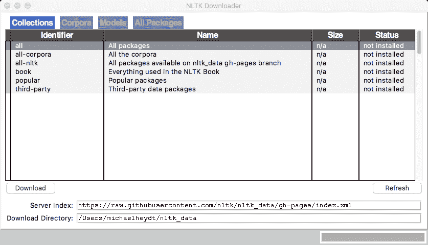
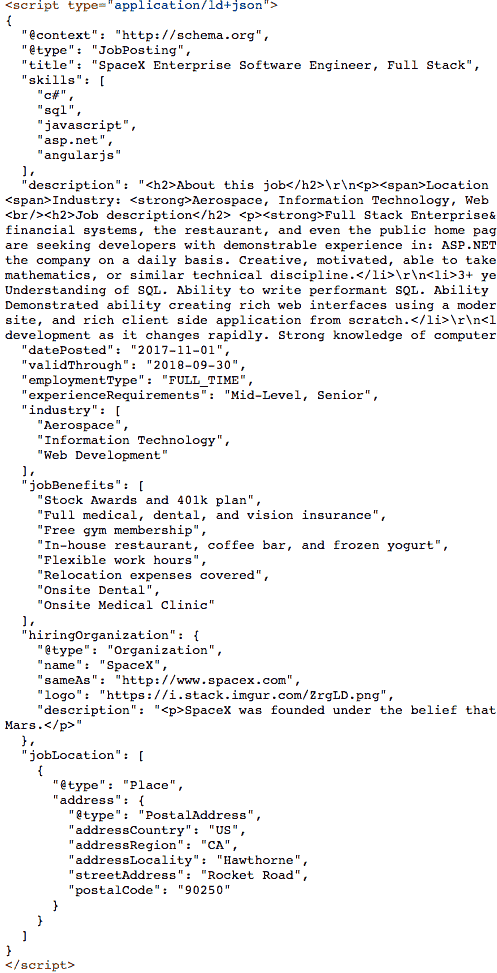

# 文本争论与分析

在本章中，我们将介绍：

*   安装 NLTK
*   分句
*   执行标记化
*   进行词干分析
*   进行柠檬化
*   识别和删除停止词
*   计算单词的频率分布
*   识别和删除稀有词
*   识别和删除短单词
*   删除标点符号
*   拼凑 n-grams
*   从 StackOverflow 中删除作业列表
*   读取并清除作业列表中的描述从 StackOverflow 作业列表创建 word cloud

# 介绍

挖掘数据通常是工作中最有趣的部分，而文本是最常见的数据源之一。我们将使用 NLTK 工具包介绍常见的自然语言处理概念和统计模型。我们不仅希望找到定量数据，比如我们收集的数据中的数字，我们还希望能够分析文本信息的各种特征。这种对文本信息的分析通常被归为一个称为自然语言处理（NLP）的类别。存在一个 Python 库 NLTK，它提供了丰富的功能。我们将研究它的几种功能。

# 安装 NLTK

在本教程中，我们将学习安装 NTLK，这是 Python 的自然语言工具包

# 怎么做

我们按照以下方法进行配方：

1.  NLTK 的核心可以使用 pip 安装：

```py
pip install nltk
```

2.  有些过程，例如我们将使用的过程，需要额外下载用于执行各种分析的各种数据集。可以通过执行以下操作来下载它们：

```py
import nltk
nltk.download()
showing info https://raw.githubusercontent.com/nltk/nltk_data/gh-pages/index.xml
```

3.  在 Mac 电脑上，实际上会弹出以下窗口：



The NTLK GUI

选择 install all（全部安装）并按下 Download（下载）按钮。这些工具将开始下载大量数据集。这可能需要一段时间，因此，请抓起一杯咖啡或啤酒，不时查看。完成后，您就可以进入下一个配方了。

# 分句

许多 NLP 过程需要将大量文本拆分为句子。这似乎是一项简单的任务，但对于计算机来说可能会有问题。简单的句子拆分器可以只查找句点（.），或使用其他算法，如预测分类器。我们将研究使用 NLTK 进行句子拆分的两种方法。

# 怎么做

我们将使用存储在`07/sentence1.txt`文件中的一个句子。它具有以下内容，这是从 StackOverflow 上的随机作业列表中提取的：

We are seeking developers with demonstrable experience in: ASP.NET, C#, SQL Server, and AngularJS. We are a fast-paced, highly iterative team that has to adapt quickly as our factory grows. We need people who are comfortable tackling new problems, innovating solutions, and interacting with every facet of the company on a daily basis. Creative, motivated, able to take responsibility and support the applications you create. Help us get rockets out the door faster!

第一个句子拆分的例子是在`07/01_sentence_splitting1.py`文件中。它使用 NLTK 中内置的句子拆分器，使用内部边界检测算法：

1.  首先，我们从 NLTK 导入句子标记器：

```py
from nltk.tokenize import sent_tokenize
```

2.  然后加载文件：

```py
with open('sentence1.txt', 'r') as myfile:
    data=myfile.read().replace('\n', '')
```

3.  然后使用`sent_tokenize`拆分句子，并报告句子：

```py
sentences = sent_tokenize(data)

for s in sentences:
    print(s)
```

这将产生以下输出：

```py
We are seeking developers with demonstrable experience in: ASP.NET, C#, SQL Server, and AngularJS.
We are a fast-paced, highly iterative team that has to adapt quickly as our factory grows.
We need people who are comfortable tackling new problems, innovating solutions, and interacting with every facet of the company on a daily basis.
Creative, motivated, able to take responsibility and support the applications you create.
Help us get rockets out the door faster!
```

4.  如果你想创建自己的标记器并自己训练，那么你可以使用`PunktSentenceTokenizer`类。`sent_tokenize`实际上是这个类的派生类，默认情况下用英语实现句子拆分。但是有 17 种不同的语言模型可供选择：

```py
Michaels-iMac-2:~ michaelheydt$ ls ~/nltk_data/tokenizers/punkt
PY3   finnish.pickle  portuguese.pickle
README          french.pickle   slovene.pickle
czech.pickle    german.pickle   spanish.pickle
danish.pickle   greek.pickle    swedish.pickle
dutch.pickle    italian.pickle  turkish.pickle
english.pickle  norwegian.pickle
estonian.pickle polish.pickle
```

5.  您可以使用 language 参数选择所需的语言。例如，以下内容将基于德语进行拆分：

```py
sentences = sent_tokenize(data, language="german")

```

# 还有更多。。。

要了解此算法的更多信息，您可以阅读[上的源文件 http://citeseerx.ist.psu.edu/viewdoc/download?doi=10.1.1.85.5017 &rep=rep1&type=pdf](http://citeseerx.ist.psu.edu/viewdoc/download?doi=10.1.1.85.5017&rep=rep1&type=pdf)。

# 执行标记化

标记化是将文本转换为标记的过程。这些标记可以是段落、句子和常见的单个单词，通常基于单词级别。NLTK 附带了许多标记化程序，将在本配方中演示。

# 怎么做

此示例的代码位于`07/02_tokenize.py`文件中。这扩展了句子拆分器，以演示五种不同的标记化技术。文件中的第一句话将是唯一标记化的句子，以便我们将输出量保持在合理的范围内：

1.  第一步是简单地使用内置的 Python 字符串`.split()`方法，结果如下：

```py
print(first_sentence.split())
['We', 'are', 'seeking', 'developers', 'with', 'demonstrable', 'experience', 'in:', 'ASP.NET,', 'C#,', 'SQL', 'Server,', 'and', 'AngularJS.']

```

句子在空间边界上分开。请注意，结果标记中包括“：”和“，”等标点符号。

2.  下面演示如何使用 NLTK 中内置的标记器。首先，我们需要导入它们：

```py
from nltk.tokenize import word_tokenize, regexp_tokenize, wordpunct_tokenize, blankline_tokenize
```

下面演示如何使用`word_tokenizer`：

```py
print(word_tokenize(first_sentence))
['We', 'are', 'seeking', 'developers', 'with', 'demonstrable', 'experience', 'in', ':', 'ASP.NET', ',', 'C', '#', ',', 'SQL', 'Server', ',', 'and', 'AngularJS', '.']

```

结果现在也将标点符号拆分为它们自己的标记。

下面使用正则表达式标记器，它允许您将任何正则表达式应用为标记器。它使用一个`'\w+'`正则表达式，结果如下：

```py
print(regexp_tokenize(first_sentence, pattern='\w+'))
['We', 'are', 'seeking', 'developers', 'with', 'demonstrable', 'experience', 'in', 'ASP', 'NET', 'C', 'SQL', 'Server', 'and', 'AngularJS']
```

`wordpunct_tokenizer`具有以下结果：

```py
print(wordpunct_tokenize(first_sentence))
['We', 'are', 'seeking', 'developers', 'with', 'demonstrable', 'experience', 'in', ':', 'ASP', '.', 'NET', ',', 'C', '#,', 'SQL', 'Server', ',', 'and', 'AngularJS', '.']
```

并且`blankline_tokenize`产生以下结果：

```py
print(blankline_tokenize(first_sentence))
['We are seeking developers with demonstrable experience in: ASP.NET, C#, SQL Server, and AngularJS.']
```

可以看出，这并不像人们想象的那样是一个非常简单的问题。根据被标记的文本的类型，您可以得出完全不同的结果。

# 进行词干分析

词干是将一个代币切割到其*词干*的过程。从技术上讲，这是将屈折词（有时是派生词）还原到词干的过程，词干是单词的基本词根形式。例如，单词*fishing*、*fished*、*fisher*源自词根*fish*。这有助于将正在处理的单词集减少为更容易处理的较小的基本单词集

最常见的词干提取算法是由 Martin Porter 创建的，NLTK 在 PorterStemmer 中提供了该算法的一个实现。NLTK 还提供了一个雪球词干分析器的实现，也是由 Porter 创建的，NLTK 还提供了一个称为 Lancaster 词干分析器的实现。兰开斯特干扰物被认为是三种干扰物中最具攻击性的干扰物。

# 怎么做

NLTK 在其 PorterStemmer 类中提供了 Porter 词干生成算法的实现。可以通过以下代码轻松创建该算法的实例：

```py
>>> from nltk.stem import PorterStemmer
>>> pst = PorterStemmer()
>>> pst.stem('fishing')
'fish'
```

`07/03_stemming.py`文件中的脚本将 Porter 和 Lancaster 词干分析器应用于输入文件的第一句话。执行词干分析器的代码的主要部分如下所示：

```py
pst = PorterStemmer()
lst = LancasterStemmer()

print("Stemming results:")

for token in regexp_tokenize(sentences[0], pattern='\w+'):
    print(token, pst.stem(token), lst.stem(token))
```

这将产生以下输出：

```py
Stemming results:
We We we
are are ar
seeking seek seek
developers develop develop
with with with
demonstrable demonstr demonst
experience experi expery
in in in
ASP asp asp
NET net net
C C c
SQL sql sql
Server server serv
and and and
AngularJS angularj angulars
```

从结果来看，可以看出兰开斯特词干分析器确实比波特词干分析器更具攻击性，因为后者的词干分析器进一步减少了几个单词。

# 进行柠檬化

引理化是一种将单词转换为词根的更有条理的过程。词干通常只是切掉单词的词尾，引理化考虑到单词的形态分析，评估上下文和词性以确定屈折形式，并在不同的规则之间做出决定以确定根。

# 怎么做

可以使用`WordNetLemmatizer`在 NTLK 中使用 Lemmatization。此类使用 WordNet 服务（一个在线语义数据库）进行决策。`07/04_lemmatization.py`文件中的代码扩展了前面的词干示例，以计算每个单词的 Lemmatization。重要代码如下：

```py
from nltk.stem import PorterStemmer
from nltk.stem.lancaster import LancasterStemmer
from nltk.stem import WordNetLemmatizer

pst = PorterStemmer()
lst = LancasterStemmer()
wnl = WordNetLemmatizer()

print("Stemming / lemmatization results")
for token in regexp_tokenize(sentences[0], pattern='\w+'):
    print(token, pst.stem(token), lst.stem(token), wnl.lemmatize(token))
```

并产生以下输出：

```py
Stemming / lemmatization results
We We we We
are are ar are
seeking seek seek seeking
developers develop develop developer
with with with with
demonstrable demonstr demonst demonstrable
experience experi expery experience
in in in in
ASP asp asp ASP
NET net net NET
C C c C
SQL sql sql SQL
Server server serv Server
and and and and
AngularJS angularj angulars AngularJS
```

使用柠檬化过程的结果存在少量差异。问题在于，根据您的数据，其中一个可能比另一个更适合您的需要，因此如果需要，请尝试所有这些方法。

# 确定和删除停止词

停止词是在自然语言处理环境中不提供太多上下文意义的常用词。这些词通常是语言中最常见的词。至少在英语中，这些词往往是冠词和代词，例如*I*、*me*、*the*、*是*，*其中*、*who*、*在*等。文档中的意义处理通常可以通过在处理之前删除这些单词来实现，因此许多工具都支持此功能。NLTK 就是其中之一，它支持大约 22 种语言的停止词删除。

# 怎么做

按照以下步骤进行配方操作（代码在`07/06_freq_dist.py`中提供）：

1.  下面演示如何使用 NLTK 删除停止字。首先，从导入停止字开始：

```py
>>> from nltk.corpus import stopwords
```

2.  然后选择所需语言的停止词。以下选择英语：

```py
>>> stoplist = stopwords.words('english')
```

3.  英文禁止入内名单共有 153 个字：

```py
>>> len(stoplist)
153
```

4.  这不是太多，我们不能在这里全部展示：

```py
>>> stoplist
 ['i', 'me', 'my', 'myself', 'we', 'our', 'ours', 'ourselves', 'you', 'your', 'yours', 'yourself', 'yourselves', 'he', 'him', 'his', 'himself', 'she', 'her', 'hers', 'herself', 'it', 'its', 'itself', 'they', 'them', 'their', 'theirs', 'themselves', 'what', 'which', 'who', 'whom', 'this', 'that', 'these', 'those', 'am', 'is', 'are', 'was', 'were', 'be', 'been', 'being', 'have', 'has', 'had', 'having', 'do', 'does', 'did', 'doing', 'a', 'an', 'the', 'and', 'but', 'if', 'or', 'because', 'as', 'until', 'while', 'of', 'at', 'by', 'for', 'with', 'about', 'against', 'between', 'into', 'through', 'during', 'before', 'after', 'above', 'below', 'to', 'from', 'up', 'down', 'in', 'out', 'on', 'off', 'over', 'under', 'again', 'further', 'then', 'once', 'here', 'there', 'when', 'where', 'why', 'how', 'all', 'any', 'both', 'each', 'few', 'more', 'most', 'other', 'some', 'such', 'no', 'nor', 'not', 'only', 'own', 'same', 'so', 'than', 'too', 'very', 's', 't', 'can', 'will', 'just', 'don', 'should', 'now', 'd', 'll', 'm', 'o', 're', 've', 'y', 'ain', 'aren', 'couldn', 'didn', 'doesn', 'hadn', 'hasn', 'haven', 'isn', 'ma', 'mightn', 'mustn', 'needn', 'shan', 'shouldn', 'wasn', 'weren', 'won', 'wouldn']
```

5.  通过一个简单的 python 语句可以轻松地从单词列表中删除停止词。这在`07/05_stopwords.py`文件中得到了演示。脚本从所需的导入开始，并准备好我们要处理的句子：

```py
from nltk.tokenize import sent_tokenize
from nltk.tokenize import regexp_tokenize
from nltk.corpus import stopwords

with open('sentence1.txt', 'r') as myfile:
    data = myfile.read().replace('\n', '')

sentences = sent_tokenize(data)
first_sentence = sentences[0]

print("Original sentence:")
print(first_sentence)
```

6.  这将产生我们熟悉的以下输出：

```py
Original sentence:
We are seeking developers with demonstrable experience in: ASP.NET, C#, SQL Server, and AngularJS.
```

7.  接下来，我们将这句话标记化：

```py
tokenized = regexp_tokenize(first_sentence, '\w+')
print("Tokenized:", tokenized)
```

8.  具有以下输出：

```py
Tokenized: ['We', 'are', 'seeking', 'developers', 'with', 'demonstrable', 'experience', 'in', 'ASP', 'NET', 'C', 'SQL', 'Server', 'and', 'AngularJS']
```

9.  然后，我们可以使用以下语句删除停止列表中的令牌：

```py
stoplist = stopwords.words('english')
cleaned = [word for word in tokenized if word not in stoplist]
print("Cleaned:", cleaned)
```

使用以下输出：

```py
Cleaned: ['We', 'seeking', 'developers', 'demonstrable', 'experience', 'ASP', 'NET', 'C', 'SQL', 'Server', 'AngularJS']
```

# 还有更多。。。

停止词删除有其目的。它是有帮助的，正如我们将在后面的配方中看到的那样，我们将创建一个词云（停止词不会在词云中提供太多信息），但也可能是有害的。许多其他基于句子结构推断意义的 NLP 过程可能会因其删除而受到极大的阻碍。

# 计算单词的频率分布

频率分布统计不同数据值的出现次数。这些值很有价值，因为我们可以使用它们来确定文档中哪些词或短语最常见，并由此推断出那些值更大或更小的词或短语。

频率分布可以使用几种不同的技术来计算。我们将使用 NLTK 中内置的工具来检查它们

# 怎么做

NLTK 提供了一个类`ntlk.probabilities.FreqDist`，允许我们非常轻松地计算列表中值的频率分布。让我们检查一下使用这个类（代码在`07/freq_dist.py`中）：

1.  要使用 NLTK 创建频率分布，首先从 NTLK 导入功能（以及标记器和停止字）：

```py
from nltk.probabilities import FreqDist
from nltk.tokenize import regexp_tokenize
from nltk.corpus import stopwords
```

2.  然后，我们可以使用`FreqDist`函数创建一个给定单词列表的频率分布。我们将通过阅读`wotw.txt`（古腾堡提供的《世界大战》）的内容、标记化和删除停止词来检验这一点：

```py
with open('wotw.txt', 'r') as file:
    data = file.read()
tokens = [word.lower() for word in regexp_tokenize(data, '\w+')]
stoplist = stopwords.words('english')
without_stops = [word for word in tokens if word not in stoplist]
```

3.  然后我们可以计算剩余单词的频率分布：

```py
freq_dist = FreqDist(without_stops)
```

4.  `freq_dist`是一本统计这些单词数量的字典。下面打印了所有这些单词（只有几行输出，因为有数千个独特的单词）：

```py
print('Number of words: %s' % len(freq_dist))
for key in freq_dist.keys():
    print(key, freq_dist[key])
Number of words: 6613
shall 8
dwell 1
worlds 2
inhabited 1
lords 1
world 26
things 64
```

5.  我们可以使用频率分布来识别最常见的单词。以下报告了 10 个最常见的单词：

```py
print(freq_dist.most_common(10))
[('one', 201), ('upon', 172), ('said', 166), ('martians', 164), ('people', 159), ('came', 151), ('towards', 129), ('saw', 129), ('man', 126), ('time', 122)]

```

我希望火星人能进入前五名。是 4 号。

# 还有更多。。。

我们也可以用这个来识别最不常见的单词，方法是将`.most_common()`的结果切片为负值。例如，下面找到 10 个最不常见的单词：

```py
print(freq_dist.most_common()[-10:])
[('bitten', 1), ('gibber', 1), ('fiercer', 1), ('paler', 1), ('uglier', 1), ('distortions', 1), ('haunting', 1), ('mockery', 1), ('beds', 1), ('seers', 1)]
```

有相当多的单词只出现一次，因此这只能获取这些值的子集。只有一次出现的单词数可以通过以下方式确定（由于有 3224 个单词而被截断）：

```py
dist_1 = [item[0] for item in freq_dist.items() if item[1] == 1]
print(len(dist_1), dist_1)

3224 ['dwell', 'inhabited', 'lords', 'kepler', 'quoted', 'eve', 'mortal', 'scrutinised', 'studied', 'scrutinise', 'multiply', 'complacency', 'globe', 'infusoria', ...
```

# 识别和删除稀有词

我们可以通过利用查找频率较低的单词的能力来删除出现频率较低的单词，这些单词不属于某个标准偏差范围，或者只是从给定域内被认为罕见的单词列表中删除。但是我们将使用的技术对这两种情况都适用。

# 怎么做

通过建立稀有词列表，然后将其从正在处理的标记集中移除，可以移除稀有词。稀有词列表可以使用 NTLK 提供的频率分布来确定。然后决定应将哪个阈值用作稀有词阈值：

1.  `07/07_rare_words.py`文件中的脚本扩展了频率分布配方的脚本，以识别出现两次或更少的单词，然后从标记中删除这些单词：

```py
with open('wotw.txt', 'r') as file:
    data = file.read()

tokens = [word.lower() for word in regexp_tokenize(data, '\w+')]
stoplist = stopwords.words('english')
without_stops = [word for word in tokens if word not in stoplist]

freq_dist = FreqDist(without_stops)

print('Number of words: %s' % len(freq_dist))

# all words with one occurrence
dist = [item[0] for item in freq_dist.items() if item[1] <= 2]
print(len(dist))
not_rare = [word for word in without_stops if word not in dist]

freq_dist2 = FreqDist(not_rare)
print(len(freq_dist2))
```

输出结果如下：

```py
Number of words: 6613
4361
2252
```

通过这两个步骤，删除停止词，然后删除出现次数为 2 次或更少的词，我们将单词总数从 6613 个移动到 2252 个，约为三分之一。

# 识别和删除稀有词

删除短词也有助于从内容中删除干扰词。下面将检查删除特定长度或更短的词。它还通过选择不认为短的词（长度超过指定的短词长度）来说明相反的情况。

# 怎么做

我们可以利用 NLTK 的频率分布来高效地计算短单词。我们可以只扫描源中的所有单词，但扫描结果分布中所有键的长度更有效，因为这将是一组非常小的数据：

1.  `07/08_short_words.py`文件中的脚本举例说明了这个过程。它首先加载`wotw.txt`的内容，然后计算词频分布（短词删除后）。然后识别 e 个字符或更少的单词：

```py
short_word_len = 3
short_words = [word for word in freq_dist.keys() if len(word) <= short_word_len]
print('Distinct # of words of len <= %s: %s' % (short_word_len, len(short_words)))

```

这导致：

```py
Distinct # of words of len <= 3: 184
```

2.  通过更改列表中的逻辑运算符，可以找到不短的单词：

```py
unshort_words = [word for word in freq_dist.keys() if len(word) > short_word_len]
print('Distinct # of word > len %s: %s' % (short_word_len, len(unshort_words)))
```

结果是：

```py
Distinct # of word > len 3: 6429
```

# 删除标点符号

根据所使用的标记器和这些标记器的输入，可能需要从生成的标记列表中删除标点符号。`regexp_tokenize`函数使用`'\w+'`作为表达式，可以很好地删除标点符号，但`word_tokenize`的效果不太好，会返回许多标点符号作为自己的标记。

# 怎么做

通过使用列表理解并仅选择那些不是标点符号的项目，从标记中移除标点符号的操作与移除标记中的其他单词的操作类似。脚本`07/09_remove_punctuation.py`文件演示了这一点。让我们浏览一下流程：

1.  我们将从以下内容开始，它将`word_tokenize`作业列表中的字符串：

```py
>>> content = "Strong programming experience in C#, ASP.NET/MVC, JavaScript/jQuery and SQL Server"
>>> tokenized = word_tokenize(content)
>>> stop_list = stopwords.words('english')
>>> cleaned = [word for word in tokenized if word not in stop_list]
>>> print(cleaned)
['Strong', 'programming', 'experience', 'C', '#', ',', 'ASP.NET/MVC', ',', 'JavaScript/jQuery', 'SQL', 'Server']

```

2.  现在，我们可以使用以下内容删除标点符号：

```py
>>> punctuation_marks = [':', ',', '.', "``", "''", '(', ')', '-', '!', '#']
>>> tokens_cleaned = [word for word in cleaned if word not in punctuation_marks]
>>> print(tokens_cleaned)
['Strong', 'programming', 'experience', 'C', 'ASP.NET/MVC', 'JavaScript/jQuery', 'SQL', 'Server']
```

3.  这个过程可以封装在一个函数中。以下内容在`07/punctuation.py`文件中，将删除标点符号：

```py
def remove_punctuation(tokens):
    punctuation = [':', ',', '.', "``", "''", '(', ')', '-', '!', '#']
    return [token for token in tokens if token not in punctuation]
```

# 还有更多。。。

删除标点和符号可能是一个困难的问题。虽然标点和符号不会为许多搜索增加价值，但也可能要求将标点作为标记的一部分保留。以搜索工作站点并尝试查找 C#编程职位为例，如本配方中的示例。C#的标记化被分为两个标记：

```py
>>> word_tokenize("C#")
['C', '#']
```

实际上，这里有两个问题。通过将 C 和#分开，我们失去了 C 在源内容中的知识。然后，如果我们从标记中删除了#，那么我们就失去了这些信息，因为我们也无法从相邻的标记中重建 C。

# 拼凑 n-grams

关于 NLTK 被用来识别文本中的 n-gram，已经有很多报道。n-gram 是一组单词，长度为*n*的单词，在文档/语料库中很常见（出现 2 次或多次）。2-gram 是通常重复的任意两个单词，3-gram 是三个单词的短语，我们将不考虑确定文档中的 n-克。我们将集中于从我们的令牌流重建已知的 n-克，因为我们将认为那些 n-克比任何顺序发现的 2 个或 3 个独立的词对搜索结果更重要。

在解析作业列表的领域中，重要的 2 克可以是诸如“{ } T3”、“计算机科学”、“T4”、“5”、“SQL Server”、“T6”、“数据”、“T5”、“大数据”等。因此，在处理作业列表时，我们可能不希望使用正则表达式解析器或`'#'`作为标点符号

我们需要有一个策略来从令牌流中识别这些已知的组合。让我们看看如何做到这一点。

# 怎么做

首先，本示例并不打算进行详尽的检查或最佳性能的检查。只需简单易懂且易于应用和扩展到我们解析工作清单的示例：

1.  我们将使用 SpaceX 的`StackOverflow`工作清单中的以下句子来检查此过程：

*我们正在寻找在 ASP.NET、C#、SQL Server 和 AngularJS 方面具有丰富经验的开发人员。我们是一个快节奏、高度迭代的团队，必须随着工厂的发展而快速适应。*

2.  在这两句话中有很多高价值的 2-gram（我认为工作清单是寻找 2-gram 的好地方）。只要看一看，我就能发现以下几点很重要：

3.  现在，虽然这些在技术定义中可能不是 2-gram，但当我们解析它们时，它们都将被分离为独立的令牌。这可以在`07/10-ngrams.py`文件中以及以下示例中显示：

```py
from nltk.tokenize import word_tokenize
from nltk.corpus import stopwords

with open('job-snippet.txt', 'r') as file:
    data = file.read()

tokens = [word.lower() for word in word_tokenize(data)]
stoplist = stopwords.words('english')
without_stops = [word for word in tokens if word not in stoplist]
print(without_stops)
```

这将产生以下输出：

```py
['seeking', 'developers', 'demonstrable', 'experience', ':', 'asp.net', ',', 'c', '#', ',', 'sql', 'server', ',', 'angularjs', '.', 'fast-paced', ',', 'highly', 'iterative', 'team', 'adapt', 'quickly', 'factory', 'grows', '.']
```

我们希望从这个集合中删除标点符号，但我们希望在构造一些 2 克后再这样做，特别是这样我们可以将“C#”拼回单个标记。

4.  `07/10-reconstruct-2grams.py`文件中的脚本演示了一个函数来实现这一点。首先，我们需要描述我们想要重建的 2-gram。在这个文件中，它们定义如下：

```py
grams = {
    "c": [{"#": ""}],
    "sql": [{"server": " "}],
    "fast": [{"paced": "-"}],
    "highly": [{"iterative": " "}],
    "adapt": [{"quickly": " "}],
    "demonstrable": [{"experience", " "}]
}
```

`grams`是一个字典，其中键指定 2-gram 的`"Left"`侧。每个键都有一个字典列表，其中每个字典键可以是 2-gram 的右侧，值是一个字符串，将放在左右之间。

5.  有了这个定义，我们可以看到我们代币中的`"C"`和`"#"`被重建为“C#”。`"SQL"`和`"Server"`将是`"SQL Server"`。`"fast"`和`"paced"`将导致`"faced-paced"`。
    所以我们只需要一个函数来完成所有的工作。这个函数在`07/buildgrams.py`文件中定义：

```py
def build_2grams(tokens, patterns):
    results = []
    left_token = None
    for i, t in enumerate(tokens):
        if left_token is None:
            left_token = t
            continue

        right_token = t

        if left_token.lower() in patterns:
            right = patterns[left_token.lower()]
            if right_token.lower() in right:
                results.append(left_token + right[right_token.lower()] + right_token)
                left_token = None
            else:
                results.append(left_token)
        else:
            results.append(left_token)
            left_token = right_token

    if left_token is not None:
        results.append(left_token)
    return results
```

6.  给定一组令牌和前面描述的格式的字典，此函数将返回一组修改后的令牌，并将任何匹配的 2-gram 放入一个令牌中。下面演示了它的一些简单用法：

```py
grams = {
    'c': {'#': ''}
}
print(build_2grams(['C'], grams))
print(build_2grams(['#'], grams))
print(build_2grams(['C', '#'], grams))
print(build_2grams(['c', '#'], grams))
```

这将产生以下输出：

```py
['C']
['#']
['C#']
['c#']
```

7.  现在让我们将其应用到输入中。完整的脚本位于`07/10-reconstruct-2grams.py`文件中（并添加了一些 2 克）：

```py
grams = {
    "c": {"#": ""},
    "sql": {"server": " "},
    "fast": {"paced": "-"},
    "highly": {"iterative": " "},
    "adapt": {"quickly": " "},
    "demonstrable": {"experience": " "},
    "full": {"stack": " "},
    "enterprise": {"software": " "},
    "bachelor": {"s": "'"},
    "computer": {"science": " "},
    "data": {"science":  " "},
    "current": {"trends": " "},
    "real": {"world": " "},
    "paid": {"relocation": " "},
    "web": {"server": " "},
    "relational": {"database": " "},
    "no": {"sql": " "}
}

with open('job-snippet.txt', 'r') as file:
    data = file.read()

tokens = word_tokenize(data)
stoplist = stopwords.words('english')
without_stops = [word for word in tokens if word not in stoplist]
result = remove_punctuation(build_2grams(without_stops, grams))
print(result)
```

结果如下：

```py
['We', 'seeking', 'developers', 'demonstrable experience', 'ASP.NET', 'C#', 'SQL Server', 'AngularJS', 'We', 'fast-paced', 'highly iterative', 'team', 'adapt quickly', 'factory', 'grows']
```

完美的

# 还有更多。。。

我们为`build_2grams()`函数提供了一个字典，该函数定义了识别 2-gram 的规则。在本例中，我们预定义了这些 2-gram。可以使用 NLTK 查找 2-gram（以及一般的 n-gram），但对于一个工作定位的小样本，很可能找不到。

# 从 StackOverflow 中删除作业列表

现在，让我们把这些内容放在一起，从 StackOverflow 作业列表中获取信息。我们现在只看一个列表，这样我们就可以了解这些页面的结构并从中获取信息。在后面的章节中，我们将研究多个列表的聚合结果。现在让我们学习如何做到这一点。

# 准备

StackOverflow 实际上可以很容易地从他们的页面中获取数据。我们将使用[上发布的内容 https://stackoverflow.com/jobs/122517/spacex-enterprise-software-engineer-full-stack-spacex?so=p &秒=真&pg=1&偏移量=22&cl=Amazon%3b+](https://stackoverflow.com/jobs/122517/spacex-enterprise-software-engineer-full-stack-spacex?so=p&sec=True&pg=1&offset=22&cl=Amazon%3b+)。在您阅读时，这可能不可用，因此我已将此页面的 HTML 包含在`07/spacex-job-listing.html`文件中，我们将在本章的示例中使用该文件。

StackOverflow job listings 页面非常结构化。这可能是因为它们是由程序员和为程序员创建的。该页面（在撰写本文时）如下所示：


A StackOverflow job listing

所有这些信息都被编码在页面的 HTML 中。您可以通过分析页面内容自己查看。但是 StackOverflow 的伟大之处在于它将其大部分页面数据放在一个嵌入式 JSON 对象中。这被放在一个`<script type="application/ld+json">`HTML 标记中，因此很容易找到。下面显示了此标记的截断部分（描述被截断，但显示了所有标记）：



The JSON embedded in a job listing

这使得获取内容变得非常容易，因为我们可以简单地检索页面，找到这个标签，然后使用`json`库将这个 JSON 转换成 Python 对象。除了实际的职位描述之外，还包括职位公告的许多“元数据”，如技能、行业、福利、，和位置信息。我们不需要在 HTML 中搜索信息-只需找到此标记并加载 JSON。请注意，如果我们要查找项目，例如工作职责**，**我们仍然需要解析描述。还要注意，描述包含完整的 HTML，因此在解析时，我们仍然需要处理 HTML 标记。

# 怎么做

让我们从这个页面获取工作描述。我们将简单地检索这个配方中的内容。我们将在下一个配方中清理它。

本例的完整代码在`07/12_scrape_job_stackoverflow.py`文件中。让我们浏览一下：

1.  首先，我们阅读文件：

```py
with open("spacex-job-listing.txt", "r") as file:
    content = file.read()
```

2.  然后我们将内容加载到一个`BeautifulSoup`对象中，并检索`<script type="application/ld+json">`标记：

```py
bs = BeautifulSoup(content, "lxml")
script_tag = bs.find("script", {"type": "application/ld+json"})
```

3.  现在我们有了该标记，我们可以使用`json`库将其内容加载到 Python 字典中：

```py
job_listing_contents = json.loads(script_tag.contents[0])
print(job_listing_contents)
```

此文件的输出如下所示（为简洁起见，此文件被截断）：

```py
{'@context': 'http://schema.org', '@type': 'JobPosting', 'title': 'SpaceX Enterprise Software Engineer, Full Stack', 'skills': ['c#', 'sql', 'javascript', 'asp.net', 'angularjs'], 'description': '<h2>About this job</h2>\r\n<p><span>Location options: <strong>Paid relocation</strong></span><br/><span>Job type: <strong>Permanent</strong></span><br/><span>Experience level: <strong>Mid-Level, Senior</strong></span><br/><span>Role: <strong>Full Stack Developer</strong></span><br/><span>Industry: <strong>Aerospace, Information Technology, Web Development</strong></span><br/><span>Company size: <strong>1k-5k people</strong></span><br/><span>Company type: <strong>Private</strong></span><br/></p><br/><br/><h2>Technologies</h2> <p>c#, sql, javascript, asp.net, angularjs</p> <br/><br/><h2>Job description</h2> <p><strong>Full Stack Enterprise&nbsp;Software Engineer</strong></p>\r\n<p>The EIS (Enterprise Information Systems) team writes the software that builds rockets and powers SpaceX. We are responsible for 
```

4.  这很好，因为我们现在可以用它来完成一些简单的任务，而不涉及 HTML 解析。例如，我们可以通过以下代码检索工作所需的技能：

```py
# print the skills
for skill in job_listing_contents["skills"]:
    print(skill)
```

它产生以下输出：

```py
c#
sql
javascript
asp.net
angularjs
```

# 还有更多。。。

描述仍然存储在这个 JSON 对象的 description 属性中的 HTML 中。我们将在下一个配方中检查该数据的解析。

# 阅读并清除作业列表中的说明

工作列表的描述仍然是 HTML。我们希望从这些数据中提取有价值的内容，因此我们需要解析此 HTML 并执行标记化、停止单词删除、常用单词删除、执行一些 tech 2-gram 处理，以及通常所有这些不同的过程。让我们看看如何执行这些操作。

# 准备

我已经将用于确定基于技术的 2-grams 的代码折叠到`07/tech2grams.py`文件中。我们将在该文件中使用`tech_2grams`函数。

# 怎么做。。。

本例代码在`07/13_clean_jd.py`文件中。它在`07/12_scrape_job_stackoverflow.py`文件结束处继续：

1.  首先，我们从加载的描述的描述码创建一个`BeautifulSoup`对象。我们还将打印它以查看它的外观：

```py
desc_bs = BeautifulSoup(job_listing_contents["description"], "lxml")
print(desc_bs)

<p><span>Location options: <strong>Paid relocation</strong></span><br/><span>Job type: <strong>Permanent</strong></span><br/><span>Experience level: <strong>Mid-Level, Senior</strong></span><br/><span>Role: <strong>Full Stack Developer</strong></span><br/><span>Industry: <strong>Aerospace, Information Technology, Web Development</strong></span><br/><span>Company size: <strong>1k-5k people</strong></span><br/><span>Company type: <strong>Private</strong></span><br/></p><br/><br/><h2>Technologies</h2> <p>c#, sql, javascript, asp.net, angularjs</p> <br/><br/><h2>Job description</h2> <p><strong>Full Stack Enterprise Software Engineer</strong></p>
<p>The EIS (Enterprise Information Systems) team writes the software that builds rockets and powers SpaceX. We are responsible for all of the software on the factory floor, the warehouses, the financial systems, the restaurant, and even the public home page. Elon has called us the "nervous system" of SpaceX because we connect all of the other teams at SpaceX to ensure that the entire rocket building process runs smoothly.</p>
<p><strong>Responsibilities:</strong></p>
<ul>
<li>We are seeking developers with demonstrable experience in: ASP.NET, C#, SQL Server, and AngularJS. We are a fast-paced, highly iterative team that has to adapt quickly as our factory grows. We need people who are comfortable tackling new problems, innovating solutions, and interacting with every facet of the company on a daily basis. Creative, motivated, able to take responsibility and support the applications you create. Help us get rockets out the door faster!</li>
</ul>
<p><strong>Basic Qualifications:</strong></p>
<ul>
<li>Bachelor's degree in computer science, engineering, physics, mathematics, or similar technical discipline.</li>
<li>3+ years of experience developing across a full-stack:  Web server, relational database, and client-side (HTML/Javascript/CSS).</li>
</ul>
<p><strong>Preferred Skills and Experience:</strong></p>
<ul>
<li>Database - Understanding of SQL. Ability to write performant SQL. Ability to diagnose queries, and work with DBAs.</li>
<li>Server - Knowledge of how web servers operate on a low-level. Web protocols. Designing APIs. How to scale web sites. Increase performance and diagnose problems.</li>
<li>UI - Demonstrated ability creating rich web interfaces using a modern client side framework. Good judgment in UX/UI design.  Understands the finer points of HTML, CSS, and Javascript - know which tools to use when and why.</li>
<li>System architecture - Knowledge of how to structure a database, web site, and rich client side application from scratch.</li>
<li>Quality - Demonstrated usage of different testing patterns, continuous integration processes, build deployment systems. Continuous monitoring.</li>
<li>Current - Up to date with current trends, patterns, goings on in the world of web development as it changes rapidly. Strong knowledge of computer science fundamentals and applying them in the real-world.</li>
</ul> <br/><br/></body></html>
```

2.  我们希望完成此操作并删除所有 HTML，只留下描述文本。这将是我们随后标记的内容。幸运的是，使用`BeautifulSoup`很容易扔掉所有 HTML 标记：

```py
just_text = desc_bs.find_all(text=True)
print(just_text)

['About this job', '\n', 'Location options: ', 'Paid relocation', 'Job type: ', 'Permanent', 'Experience level: ', 'Mid-Level, Senior', 'Role: ', 'Full Stack Developer', 'Industry: ', 'Aerospace, Information Technology, Web Development', 'Company size: ', '1k-5k people', 'Company type: ', 'Private', 'Technologies', ' ', 'c#, sql, javascript, asp.net, angularjs', ' ', 'Job description', ' ', 'Full Stack Enterprise\xa0Software Engineer', '\n', 'The EIS (Enterprise Information Systems) team writes the software that builds rockets and powers SpaceX. We are responsible for all of the software on the factory floor, the warehouses, the financial systems, the restaurant, and even the public home page. Elon has called us the "nervous system" of SpaceX because we connect all of the other teams at SpaceX to ensure that the entire rocket building process runs smoothly.', '\n', 'Responsibilities:', '\n', '\n', 'We are seeking developers with demonstrable experience in: ASP.NET, C#, SQL Server, and AngularJS. We are a fast-paced, highly iterative team that has to adapt quickly as our factory grows. We need people who are comfortable tackling new problems, innovating solutions, and interacting with every facet of the company on a daily basis. Creative, motivated, able to take responsibility and support the applications you create. Help us get rockets out the door faster!', '\n', '\n', 'Basic Qualifications:', '\n', '\n', "Bachelor's degree in computer science, engineering, physics, mathematics, or similar technical discipline.", '\n', '3+ years of experience developing across a full-stack:\xa0 Web server, relational database, and client-side (HTML/Javascript/CSS).', '\n', '\n', 'Preferred Skills and Experience:', '\n', '\n', 'Database - Understanding of SQL. Ability to write performant SQL. Ability to diagnose queries, and work with DBAs.', '\n', 'Server - Knowledge of how web servers operate on a low-level. Web protocols. Designing APIs. How to scale web sites. Increase performance and diagnose problems.', '\n', 'UI - Demonstrated ability creating rich web interfaces using a modern client side framework. Good judgment in UX/UI design.\xa0 Understands the finer points of HTML, CSS, and Javascript - know which tools to use when and why.', '\n', 'System architecture - Knowledge of how to structure a database, web site, and rich client side application from scratch.', '\n', 'Quality - Demonstrated usage of different testing patterns, continuous integration processes, build deployment systems. Continuous monitoring.', '\n', 'Current - Up to date with current trends, patterns, goings on in the world of web development as it changes rapidly. Strong knowledge of computer science fundamentals and applying them in the real-world.', '\n', ' ']
```

太棒了！我们现在有了这个，它已经被分解成了可以被认为是句子的东西！

3.  让我们把这些结合在一起，将单词标记化，去掉停止词，并应用常见的技术作业 2-gram：

```py
joined = ' '.join(just_text)
tokens = word_tokenize(joined)

stop_list = stopwords.words('english')
with_no_stops = [word for word in tokens if word not in stop_list]
cleaned = remove_punctuation(two_grammed)
print(cleaned)
```

这有以下输出：

```py
['job', 'Location', 'options', 'Paid relocation', 'Job', 'type', 'Permanent', 'Experience', 'level', 'Mid-Level', 'Senior', 'Role', 'Full-Stack', 'Developer', 'Industry', 'Aerospace', 'Information Technology', 'Web Development', 'Company', 'size', '1k-5k', 'people', 'Company', 'type', 'Private', 'Technologies', 'c#', 'sql', 'javascript', 'asp.net', 'angularjs', 'Job', 'description', 'Full-Stack', 'Enterprise Software', 'Engineer', 'EIS', 'Enterprise', 'Information', 'Systems', 'team', 'writes', 'software', 'builds', 'rockets', 'powers', 'SpaceX', 'responsible', 'software', 'factory', 'floor', 'warehouses', 'financial', 'systems', 'restaurant', 'even', 'public', 'home', 'page', 'Elon', 'called', 'us', 'nervous', 'system', 'SpaceX', 'connect', 'teams', 'SpaceX', 'ensure', 'entire', 'rocket', 'building', 'process', 'runs', 'smoothly', 'Responsibilities', 'seeking', 'developers', 'demonstrable experience', 'ASP.NET', 'C#', 'SQL Server', 'AngularJS', 'fast-paced', 'highly iterative', 'team', 'adapt quickly', 'factory', 'grows', 'need', 'people', 'comfortable', 'tackling', 'new', 'problems', 'innovating', 'solutions', 'interacting', 'every', 'facet', 'company', 'daily', 'basis', 'Creative', 'motivated', 'able', 'take', 'responsibility', 'support', 'applications', 'create', 'Help', 'us', 'get', 'rockets', 'door', 'faster', 'Basic', 'Qualifications', 'Bachelor', "'s", 'degree', 'computer science', 'engineering', 'physics', 'mathematics', 'similar', 'technical', 'discipline', '3+', 'years', 'experience', 'developing', 'across', 'full-stack', 'Web server', 'relational database', 'client-side', 'HTML/Javascript/CSS', 'Preferred', 'Skills', 'Experience', 'Database', 'Understanding', 'SQL', 'Ability', 'write', 'performant', 'SQL', 'Ability', 'diagnose', 'queries', 'work', 'DBAs', 'Server', 'Knowledge', 'web', 'servers', 'operate', 'low-level', 'Web', 'protocols', 'Designing', 'APIs', 'scale', 'web', 'sites', 'Increase', 'performance', 'diagnose', 'problems', 'UI', 'Demonstrated', 'ability', 'creating', 'rich', 'web', 'interfaces', 'using', 'modern', 'client-side', 'framework', 'Good', 'judgment', 'UX/UI', 'design', 'Understands', 'finer', 'points', 'HTML', 'CSS', 'Javascript', 'know', 'tools', 'use', 'System', 'architecture', 'Knowledge', 'structure', 'database', 'web', 'site', 'rich', 'client-side', 'application', 'scratch', 'Quality', 'Demonstrated', 'usage', 'different', 'testing', 'patterns', 'continuous integration', 'processes', 'build', 'deployment', 'systems', 'Continuous monitoring', 'Current', 'date', 'current trends', 'patterns', 'goings', 'world', 'web development', 'changes', 'rapidly', 'Strong', 'knowledge', 'computer science', 'fundamentals', 'applying', 'real-world']
```

我认为这是一个非常好的和完善的关键字集，从工作列表中提取出来。