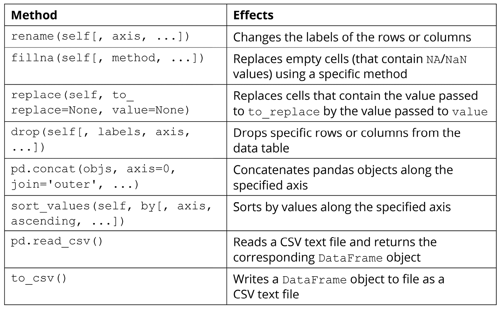
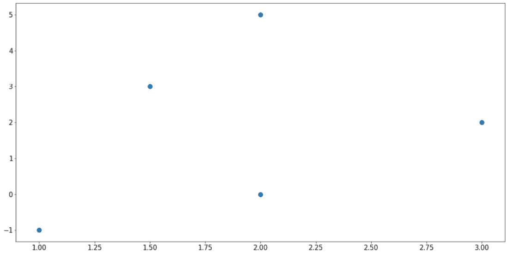
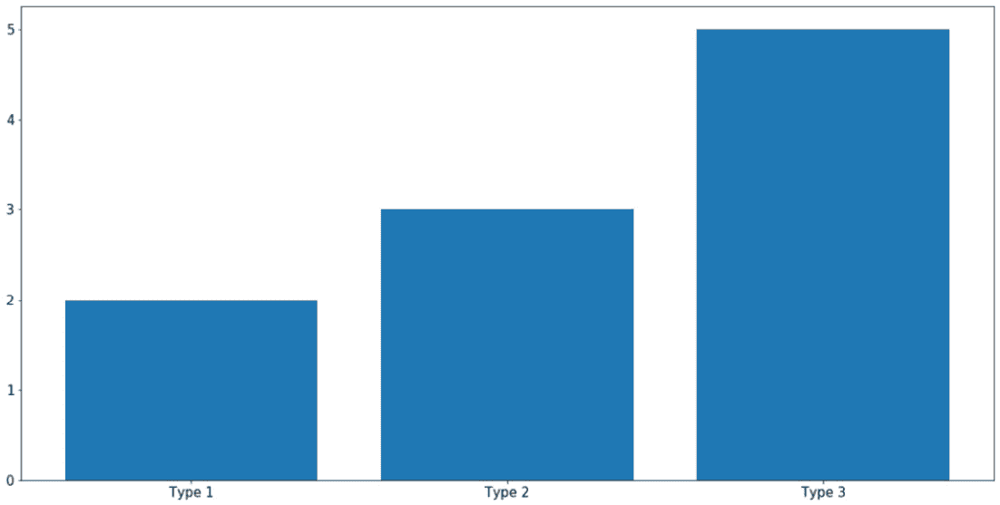
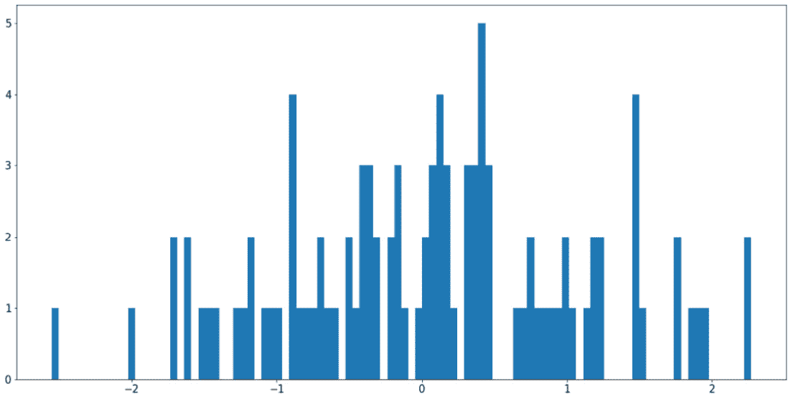
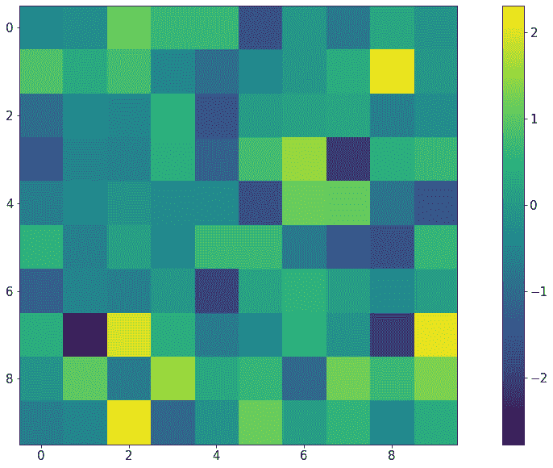
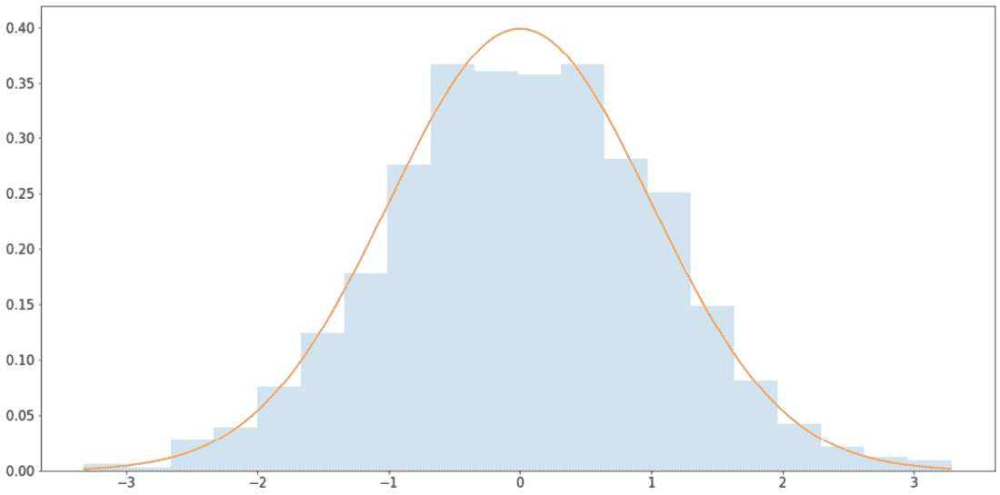
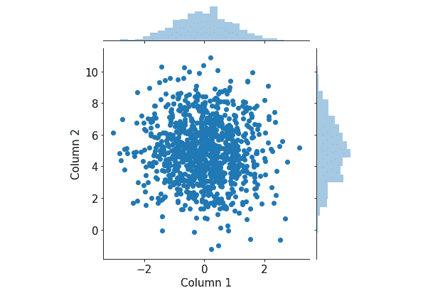
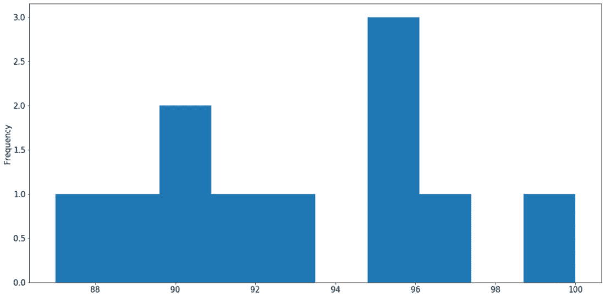
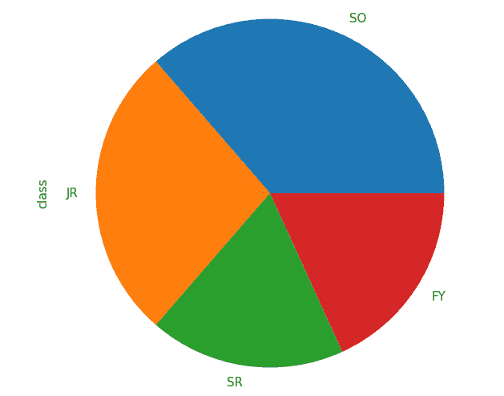
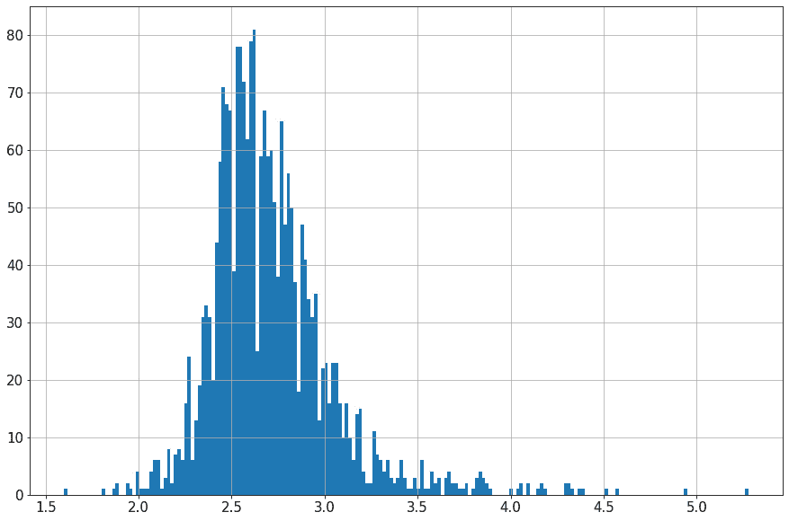

# 二、Python 的主要统计工具

概述

本章实际介绍了大多数统计从业人员在 Python 中使用的主要库。它将涵盖一些最重要和有用的概念、函数以及每个关键库的**应用程序编程接口**（**API**）。本章将介绍本书其余部分所需的几乎所有计算工具。

在本章结束时，您将了解 NumPy 库的阵列矢量化背后的思想，并能够使用其采样功能。您将能够初始化数据帧以表示表格数据并操作其内容。您还将了解数据可视化在数据分析中的重要性，并能够利用 Python 最流行的两个可视化库：Matplotlib 和 Seaborn。

# 导言

在上一章中复习了 Python 语言之后，我们现在准备讨论本书的主要主题：数学和统计。

其中，计算数学和统计的一般领域可以分为三个主要的以工具为中心的组成部分：表示和工程；分析计算；最后是可视化。在 Python 编程语言的生态系统中，每个组件（即 pandas、NumPy、Matplotlib 和 Seaborn）都专用于特定的库，从而使流程模块化。

虽然可能还有其他类似的包和工具，但我们将要讨论的库已被证明具有广泛的功能，并支持计算、数据处理和可视化方面的强大选项，使它们成为 Python 程序员多年来的首选工具。

在本章中，我们将介绍这些库中的每一个，并了解它们的主要 API。通过实际操作，我们将看到这些工具如何在 Python 中创建、操作、分析和可视化数据方面提供极大的自由度和灵活性。了解如何使用这些工具也将使我们能够在本研讨会后面的章节中了解更复杂的主题。

# 科学计算与数学基础

到目前为止，**科学计算**一词已在本车间多次使用；从广义上讲，它指的是使用计算机程序（或任何具有计算能力的程序）来建模和解决数学、工程或科学中的特定问题的过程。示例可能包括用于查找和分析生物和社会数据中的模式和趋势的数学模型，或用于使用经济数据进行未来预测的机器学习模型。正如您可能已经注意到的，这个定义与数据科学的一般领域有很大的重叠，有时这些术语甚至可以互换使用。

Python 中许多（如果不是大多数）科学计算项目的主要工作是 NumPy 库。由于 NumPy 是一个外部库，它不是随 Python 预装的，所以我们需要下载并安装它。正如您可能已经知道的，使用包管理器（如 pip 或 Anaconda）可以轻松地在 Python 中安装外部库和包。

在终端上，运行以下命令以使用 pip 在 Python 环境中安装 NumPy：

```py
$ pip install numpy
```

如果当前处于 Anaconda 环境中，则可以运行以下命令：

```py
$ conda install numpy
```

通过这些简单的命令，安装过程中的所有必要步骤都为我们解决了。

NumPy 最强大的一些功能包括对象的矢量化多维数组表示；广泛线性代数函数和变换的实现；和随机抽样。我们将在本节中介绍所有这些主题，从阵列的一般概念开始。

## NumPy 阵列

在上一章讨论 Python 列表时，我们实际上已经遇到了数组的概念。通常，数组也是可以单独访问或作为一个整体操作的不同元素的序列。因此，NumPy 数组与 Python 列表非常相似；事实上，声明 NumPy 数组最常用的方法是将 Python 列表传递给`numpy.array()`方法，如下所示：

```py
>>> import numpy as np
>>> a = np.array([1, 2, 3])
>>> a
array([1, 2, 3])
>>> a[1]
2
```

我们需要记住的最大区别是 NumPy 数组中的元素必须是相同类型的。例如，在这里，我们试图创建一个包含两个数字和一个字符串的数组，这会导致 NumPy 强制将数组中的所有元素转换为字符串（“T0”）数据类型表示少于 21 个字符的 Unicode 字符串：

```py
>>> b = np.array([1, 2, 'a'])
>>> b
array(['1', '2', 'a'], dtype='<U21')
```

与创建多维 Python 列表的方式类似，NumPy 数组支持相同的选项：

```py
>>> c = np.array([[1, 2, 3], [4, 5, 6], [7, 8, 9]])
>>> c
array([[1, 2, 3],
       [4, 5, 6],
       [7, 8, 9]])
```

笔记

在使用 NumPy 时，我们通常将多维数组称为矩阵。

除了从 Python 列表初始化之外，我们还可以创建特定形式的 NumPy 数组。特别是，可以使用给定维度和数据类型分别使用`np.zeros()`和`np.ones()`初始化充满零或一的矩阵。让我们看一个例子：

```py
>>> zero_array = np.zeros((2, 2))  # 2 by 2 zero matrix
>>> zero_array
array([[0., 0.],
       [0., 0.]])
```

这里，元组`(2, 2)`指定被初始化的数组（或矩阵）应该是二维的。从零后的点可以看出，NumPy 数组的默认数据类型是 float，可以使用`dtype`参数进一步指定：

```py
>>> one_array = np.ones((2, 2, 3), dtype=int)  # 3D one integer matrix
>>> one_array
array([[[1, 1, 1],
        [1, 1, 1]],
        [[1, 1, 1],
        [1, 1, 1]]])
```

全零或全一矩阵是数学和统计学中的常见对象，因此这些 API 调用在以后将被证明非常有用。现在，让我们来看一个公共矩阵对象，它的元素都是随机数。使用`np.random.rand()`，我们可以创建一个给定形状的矩阵，其元素在 0（包括）和 1（不包括）之间均匀采样：

```py
>>> rand_array = np.random.rand(2, 3)
>>> rand_array
array([[0.90581261, 0.88732623, 0.291661  ],
       [0.44705149, 0.25966191, 0.73547706]])
```

请注意，这里我们不再以元组的形式传递所需的矩阵形状，而是作为`np.random.rand()`函数的单个参数传递。

如果您不熟悉随机性和各种分布的随机抽样的概念，请不要担心，因为我们将在本章后面介绍这个主题。现在，让我们继续讨论 NumPy 数组，特别是索引和切片。

您会记得，为了访问 Python 列表中的各个元素，我们将其索引传递到列表变量旁边的方括号内；一维 NumPy 阵列也是如此：

```py
>>> a = np.array([1, 2, 3])
>>> a[0]
1
>>> a[1]
2
```

但是，当数组是多维数组时，我们不需要使用多个方括号来访问子数组，只需要使用逗号分隔各个索引。例如，我们访问三乘三矩阵的第二行和第二列中的元素，如下所示：

```py
>>> b = np.array([[1, 2, 3], [4, 5, 6], [7, 8, 9]])
>>> b
array([[1, 2, 3],
       [4, 5, 6],
       [7, 8, 9]])
>>> b[1, 1]
5
```

切片 NumPy 阵列的方法相同：使用逗号。此语法在帮助我们访问矩阵中具有多个维度的子矩阵方面非常有用：

```py
>>> a = np.random.rand(2, 3, 4)  # random 2-by-3-by-4 matrix
>>> a
array([[[0.54376986, 0.00244875, 0.74179644, 0.14304955],
        [0.77229612, 0.32254451, 0.0778769 , 0.2832851 ],
        [0.26492963, 0.5217093 , 0.68267418, 0.29538502]],
       [[0.94479229, 0.28608588, 0.52837161, 0.18493272],
        [0.08970716, 0.00239815, 0.80097454, 0.74721516],
        [0.70845696, 0.09788526, 0.98864408, 0.82521871]]])
>>> a[1, 0: 2, 1:]
array([[0.28608588, 0.52837161, 0.18493272],
       [0.00239815, 0.80097454, 0.74721516]])
```

在上例中，`a[1, 0: 2, 1:]`帮助我们访问原始矩阵`a`中的数字；即，在第一轴的第二个元素中（对应于索引`1`），在第二轴的前两个元素中（对应于`0: 2`），在第三轴的最后三个元素中（对应于`1:`）。这个选项是 NumPy 数组比 Python 列表更强大和灵活的原因之一，Python 列表不支持多维索引和切片，正如我们已经演示的那样。

最后，操纵 NumPy 数组的另一个重要语法是`np.reshape()`函数，顾名思义，它改变给定 NumPy 数组的形状。在多种情况下都可能需要此功能：当我们需要以某种方式显示数组以提高可读性时，或者当我们需要将数组传递给只接受特定形状数组的内置函数时。

我们可以在以下代码片段中探索此函数的效果：

```py
>>> a
array([[[0.54376986, 0.00244875, 0.74179644, 0.14304955],
        [0.77229612, 0.32254451, 0.0778769 , 0.2832851 ],
        [0.26492963, 0.5217093 , 0.68267418, 0.29538502]],
       [[0.94479229, 0.28608588, 0.52837161, 0.18493272],
        [0.08970716, 0.00239815, 0.80097454, 0.74721516],
        [0.70845696, 0.09788526, 0.98864408, 0.82521871]]])
>>> a.shape 
(2, 3, 4)
>>> np.reshape(a, (3, 2, 4))
array([[[0.54376986, 0.00244875, 0.74179644, 0.14304955],
        [0.77229612, 0.32254451, 0.0778769 , 0.2832851 ]],
       [[0.26492963, 0.5217093 , 0.68267418, 0.29538502],
        [0.94479229, 0.28608588, 0.52837161, 0.18493272]],
       [[0.08970716, 0.00239815, 0.80097454, 0.74721516],
        [0.70845696, 0.09788526, 0.98864408, 0.82521871]]])
```

请注意，`np.reshape()`函数不会改变就地传递的数组；相反，它返回具有新形状的原始数组的副本，而不修改原始数组。我们还可以将此返回值分配给变量。

此外，请注意，虽然数组的原始形状是`(2, 3, 4)`，但我们将其更改为`(3, 2, 4)`。只有当两个形状产生的元素总数相同*（2 x 3 x 4=3 x 2 x 4=24）*时，才能进行此操作。如果新形状与数组的原始形状不一致，则会引发错误，如下所示：

```py
>>> np.reshape(a, (3, 3, 3))
-------------------------------------------------------------------------
ValueError                          Traceback (most recent call last)
...
ValueError: cannot reshape array of size 24 into shape (3,3,3)
```

说到重塑 NumPy 数组，转置矩阵是一种特殊的重塑形式，*沿其对角线翻转*矩阵中的元素。计算矩阵的转置是数学和机器学习中的一项常见任务。NumPy 数组的转置可以使用`[array].T`语法计算。例如，当我们在终端运行`a.T`时，我们得到矩阵`a`的转置，如下所示：

```py
>>> a.T
array([[[0.54376986, 0.94479229],
       [0.77229612, 0.08970716],
        [0.26492963, 0.70845696]],
       [[0.00244875, 0.28608588],
        [0.32254451, 0.00239815],
        [0.5217093 , 0.09788526]],
       [[0.74179644, 0.52837161],
        [0.0778769 , 0.80097454],
        [0.68267418, 0.98864408]],
       [[0.14304955, 0.18493272],
        [0.2832851 , 0.74721516],
        [0.29538502, 0.82521871]]])
```

至此，我们可以结束对 NumPy 阵列的介绍。在下一节中，我们将学习另一个与 NumPy 数组密切相关的概念：矢量化。

## 矢量化

从最广泛的意义上讲，计算机科学中的术语**矢量化**表示将数学运算逐元素应用于阵列（一般意义上）的过程。例如，将数组中的每个元素添加到同一项中的添加操作就是矢量化操作；矢量化乘法也是如此，数组中的所有元素都乘以相同的项。通常，当所有数组元素都通过相同的函数时，就可以实现矢量化。

在 NumPy 数组（或多个数组）上执行适用操作时，默认情况下会进行矢量化。这包括二进制函数，如加法、减法、乘法、除法、幂和 mod，以及 NumPy 中的几个一元内置函数，如绝对值、平方根、三角函数、对数函数和指数函数。

在我们看到 NumPy 中的矢量化之前，有必要讨论矢量化的重要性及其在 NumPy 中的作用。如前所述，矢量化通常是对数组中的元素应用公共操作。由于过程的可重复性，矢量化操作可以优化为比其在`for`循环中的替代实现更有效。但是，这种功能的折衷是，数组中的元素需要具有相同的数据类型。这也是任何 NumPy 数组的一个要求。

有了这些，让我们继续进行下面的练习，在那里我们将看到这种效果。

## 练习 2.01：NumPy 中的定时矢量化操作

在本练习中，我们将计算通过使用 NumPy 数组实现各种向量化操作（如加法、乘法和平方根计算）而获得的加速比，与没有向量化的纯 Python 替代方案相比。为此，请执行以下步骤：

1.  在新 Jupyter 笔记本的第一个单元格中，从`timeit`库导入 NumPy 包和`Timer`类。后者将用于实现我们的计时功能：

    ```py
    import numpy as np
    from timeit import Timer
    ```

2.  在一个新单元格中，使用`range()`函数初始化一个包含从 0（包含）到 1000000（不包含）的数字的 Python 列表，以及使用`np.array()`函数

    ```py
    my_list = list(range(10 ** 6))
    my_array = np.array(my_list)
    ```

    初始化对应的 NumPy 数组
3.  现在，我们将在以下步骤中对此列表和数组应用数学运算。在一个新的单元格中，编写一个名为`for_add()`的函数，该函数返回一个列表，其中的元素是`my_list`变量中的元素，每个元素都添加了`1`（我们将使用列表理解）。编写另一个名为`vec_add()`的函数，返回相同数据的 NumPy 数组版本，即`my_array + 1`：

    ```py
    def for_add():
        return [item + 1 for item in my_list]
    def vec_add():
        return my_array + 1
    ```

4.  In the next code cell, initialize two `Timer` objects while passing in each of the preceding two functions. These objects contain the interface that we will use to keep track of the speed of the functions.

    在参数为 10 和 10 的每个对象上调用`repeat()`函数本质上，我们正在重复 100 次计时实验。最后，当`repeat()`函数返回一个数字列表，表示我们记录的给定函数在每个实验中经过的时间，我们打印出该列表的最小值。简言之，我们需要每个函数最快运行的时间：

    ```py
    print('For-loop addition:')
    print(min(Timer(for_add).repeat(10, 10)))
    print('Vectorized addition:')
    print(min(Timer(vec_add).repeat(10, 10)))
    ```

    以下是该程序产生的输出：

    ```py
    For-loop addition:
    0.5640330809999909
    Vectorized addition:
    0.006047582000007878
    ```

    虽然你的可能不同，但这两个数字之间的关系应该很清楚：`for`循环加法函数的速度应该比向量化加法函数的速度低很多倍。

5.  In the next code cell, implement the same comparison of speed where we multiply the numbers by `2`. For the NumPy array, simply return `my_array * 2`:

    ```py
    def for_mul():
        return [item * 2 for item in my_list]
    def vec_mul():
        return my_array * 2
    print('For-loop multiplication:')
    print(min(Timer(for_mul).repeat(10, 10)))
    print('Vectorized multiplication:')
    print(min(Timer(vec_mul).repeat(10, 10)))
    ```

    从输出验证矢量化乘法函数也比`for`循环版本快。运行此代码后的输出如下所示：

    ```py
    For-loop multiplication: 0.5431750800000259
    Vectorized multiplication: 0.005795304000002943
    ```

6.  In the next code cell, implement the same comparison where we compute the square root of the numbers. For the Python list, import and use the `math.sqrt()` function on each element in the list comprehension. For the NumPy array, return the expression `np.sqrt(my_array)`:

    ```py
    import math
    def for_sqrt():
        return [math.sqrt(item) for item in my_list]
    def vec_sqrt():
        return np.sqrt(my_array)
    print('For-loop square root:')
    print(min(Timer(for_sqrt).repeat(10, 10)))
    print('Vectorized square root:')
    print(min(Timer(vec_sqrt).repeat(10, 10)))
    ```

    从输出验证矢量化平方根函数再次比其`for`循环对应项快：

    ```py
    For-loop square root:
    1.1018582749999268
    Vectorized square root:
    0.01677640299999439
    ```

    另外，请注意，`np.sqrt()`函数被实现为矢量化，这就是为什么我们能够将整个数组传递给函数的原因。

本练习为 NumPy 数组引入了一些矢量化操作，并演示了它们与纯 Python 循环相比的速度。

笔记

要访问此特定部分的源代码，请参考[https://packt.live/38l3Nk7\.](https://packt.live/38l3Nk7 )

您也可以在[在线运行此示例 https://packt.live/2ZtBSdY.](https://packt.live/2ZtBSdY )

这就结束了 NumPy 中的矢量化主题。在下一节也是最后一节中，我们将讨论该软件包提供的另一个强大功能：随机采样。

## 随机抽样

在上一章中，我们看到了一个如何使用`random`库在 Python 中实现随机化的示例。然而，该库中实现的大多数方法的随机化是统一的，在科学计算和数据科学项目中，有时我们需要从非统一分布中抽取样本。在这个领域，NumPy 再次提供了广泛的选择。

一般来说，从概率分布中随机抽样是从该概率分布中选择实例的过程，其中具有较高概率的元素更有可能被选择（或绘制）。这一概念与统计学中的随机变量概念密切相关。在统计分析中，随机变量通常用于对未知量建模，它通常遵循给定的分布，具体取决于它建模的数据类型。例如，人口成员的年龄通常使用正态分布（也称为钟形曲线或高斯分布）建模，而到达银行的客户通常使用泊松分布建模。

通过随机抽样与随机变量相关的给定分布，我们可以获得该变量的实际实现，从中我们可以执行各种计算，以获得有关该随机变量的见解和推论。

我们将在本书后面重新讨论概率分布的概念和用法。现在，让我们只关注手头的任务：如何从这些分布中提取样本。这是使用`np.random`包完成的，该包包括允许我们从各种发行版中提取的接口。

例如，以下代码段初始化了正态分布的样本（请注意，由于随机性，您的输出可能与以下内容不同）：

```py
>>> sample = np.random.normal()
>>> sample
-0.43658969989465696
```

您可能知道，正态分布由两个统计数据指定：平均值和标准偏差。可以在`np.random.normal()`函数中分别使用`loc`（默认值为`0.0`）和`scale`（默认值为`1.0`）参数指定，如下所示：

```py
>>> sample = np.random.normal(loc=100, scale=10)
>>> sample
80.31187658687652
```

也可以一次绘制多个样本，而不是一个样本，作为一个 NumPy 数组。为此，我们使用所需的输出数组形状指定`np.random.normal()`函数的`size`参数。例如，在这里，我们创建了一个 2 x 3 的矩阵，该矩阵由来自相同正态分布的样本组成：

```py
>>> samples = np.random.normal(loc=100, scale=10, size=(2, 3))
>>> samples
array([[ 82.7834678 , 109.16410976, 101.35105681],
       [112.54825751, 107.79073472,  77.70239823]])
```

此选项允许我们获取输出数组，并可能对其应用其他特定于 NumPy 的操作（例如矢量化）。另一种方法是按顺序将单个样本绘制到列表中，然后将其转换为 NumPy 数组。

需要注意的是，每个概率分布都有自己的统计数据来定义它。正如我们所看到的，正态分布有一个均值和一个标准差，而前面提到的泊松分布是用λ（λ）参数定义的，它被解释为区间的期望值。让我们在一个例子中看到这一点：

```py
>>> samples = np.random.poisson(lam=10, size=(2, 2))
>>> samples
array([[11, 10],
       [15, 11]])
```

通常，在使用 NumPy 从概率分布中提取样本之前，您应该始终查阅相应的文档，以查看该特定分布的可用参数及其默认值。

除了概率分布，NumPy 还提供了其他与随机性相关的功能，这些功能可以在`random`模块中找到。例如，`np.random.randint()`函数返回两个给定数字之间的随机整数；`np.random.choice()`从给定的一维数组中随机抽取样本；另一方面，`np.random.shuffle()`在适当位置随机洗牌给定序列。

下面的代码片段演示了这些功能，这些功能在处理 Python 中的随机性方面提供了很大程度的灵活性，特别是在科学计算中：

```py
>>> np.random.randint(low=0, high=10, size=(2, 5))
array([[6, 4, 1, 3, 6],
       [0, 8, 8, 8, 8]])
>>> np.random.choice([1, 3, 4, -6], size=(2, 2))
array([[1, 1],
       [1, 4]])
>>> a = [1, 2, 3, 4]
>>> for _ in range(3):
...        np.random.shuffle(a)
...        print(a)
[4, 1, 3, 2]
[4, 1, 2, 3]
[1, 2, 4, 3]
```

当编程中涉及到随机性时，我们需要讨论的最后一个重要话题是再现性。该术语表示在不同的运行中从程序获得相同结果的能力，尤其是当该程序中存在与随机性相关的元素时。

当程序中存在缺陷，但仅在某些随机情况下表现出来时，再现性是必不可少的。通过强制程序在每次执行时生成相同的随机数，除了单元测试之外，我们还有另一种方法来缩小和识别此类错误。

在数据科学和统计学中，再现性是最重要的。如果没有一个程序是可复制的，那么一个研究人员就有可能找到一个具有统计意义的结果，而另一个研究人员则无法找到，即使这两个研究人员拥有相同的代码和方法。这就是为什么许多实践者开始在数据科学和机器学习领域高度重视再现性。

实现再现性的最常用方法（也是最容易编程的方法）是简单地修复利用随机性的程序种子（特别是其库）。修复随机性相关库的种子可以确保在同一程序的不同运行中生成相同的随机数。换句话说，即使一个程序在不同的机器上运行多次，也可以产生相同的结果。

为此，我们可以简单地将一个整数传递给库/包的适当种子函数，该函数为我们的程序生成随机性。例如，要修复`random`库的种子，我们可以编写以下代码：

```py
>>> import random
>>> random.seed(0)  # can use any other number
```

对于 NumPy 中的随机包，我们可以编写以下内容：

```py
>>> np.random.seed(0)
```

为这些库/包设置种子通常是一个很好的实践，当您为一个组或一个开源项目做出贡献时；同样，它可以确保团队的所有成员都能够达到相同的结果，并消除沟通失误。

本主题还结束了我们对 NumPy 库的讨论。接下来，我们将继续讨论 Python 中数据科学和科学计算生态系统的另一个组成部分：熊猫库。

# 在熊猫中使用表格数据

如果 NumPy 用于矩阵数据和线性代数运算，则 pandas 设计用于以表格形式处理数据。与 NumPy 一样，pandas 可以使用 pip 包管理器安装在 Python 环境中：

```py
$ pip install pandas
```

如果您使用的是 Anaconda，则可以使用以下命令下载它：

```py
$ conda install pandas
```

安装过程完成后，启动 Python 解释器并尝试导入库：

```py
>>> import pandas as pd
```

如果此命令运行时没有任何错误消息，则表示您已成功安装 pandas。接下来，让我们继续讨论，从 pandas 中最常用的数据结构`DataFrame`开始，它可以表示表数据：带有行和列标签的二维数据。这与 NumPy 数组形成对比，NumPy 数组可以接受任何维度，但不支持标签。

## 初始化数据帧对象

初始化`DataFrame`对象有多种方法。首先，我们可以通过传入 Python 字典手动创建一个，其中每个键都应该是列的名称，该键的值应该是该列包含的数据，以列表或 NumPy 数组的形式。

例如，在下面的代码中，我们正在创建一个包含两行和三列的表。第一列按顺序包含数字 1 和 2，第二列包含 3 和 4，第三列包含 5 和 6：

```py
>>> import pandas as pd
>>> my_dict = {'col1': [1, 2], 'col2': np.array([3, 4]),'col3': [5, 6]}
>>> df = pd.DataFrame(my_dict)
>>> df
     col1    col2    col3
0    1       3       5
1    2       4       6
```

关于`DataFrame`对象，首先要注意的是，正如您从前面的代码片段中所看到的，当一个对象被打印出来时，输出由 pandas 的后端自动格式化。表格格式使该对象中表示的数据更具可读性。此外，当在 Jupyter 笔记本中打印出`DataFrame`对象时，出于可读性的相同目的，会使用类似的格式，如以下屏幕截图所示：


图 2.1:Jupyter 笔记本中的打印数据框对象

初始化`DataFrame`对象的另一种常见方法是，当我们已经有了由 2D NumPy 数组表示的数据时，我们可以直接将该数组传递给`DataFrame`类。例如，我们可以使用以下代码初始化我们之前查看的相同数据帧：

```py
>>> my_array = np.array([[1, 3, 5], [2, 4, 6]])
>>> alt_df = pd.DataFrame(my_array, columns=['col1', 'col2', 'col3'])
>>> alt_df
     col1    col2    col3
0    1       3       5
1    2       4       6
```

也就是说，`DataFrame`对象初始化的最常见方式是通过`pd.read_csv()`函数，顾名思义，该函数读入 CSV 文件（或以相同方式格式化但使用不同分隔特殊字符的任何文本文件），并将其呈现为`DataFrame`对象。我们将在下一节中看到此功能的实际应用，在这里我们将了解 pandas 库中更多功能的使用。

## 访问行和列

一旦我们已经有了一个在`DataFrame`对象中表示的数据表，我们就可以使用许多选项与该表进行交互和操作。例如，我们可能关心的第一件事是访问某些行和列的数据。幸运的是，pandas 为此任务提供了直观的 Python 语法。

要访问一组行或列，我们可以利用`loc`方法，它接受我们感兴趣的行/列的标签。在语法上，此方法与方括号一起使用（用于模拟 Python 中的索引语法）。例如，使用上一节中的同一个表，我们可以传入一行的名称（例如，`0`：

```py
>>> df.loc[0]
col1    1
col2    3
col3    5
Name: 0, dtype: int64
```

我们可以看到之前返回的对象包含我们想要的信息（第一行以及数字 1、3 和 5），但它的格式不熟悉。这是因为它作为`Series`对象返回。`Series`对象是只包含 1D 数据的`DataFrame`对象的特例。我们不需要太注意这个数据结构，因为它的接口非常类似于`DataFrame`。

考虑到`loc`方法，我们可以传入一个行标签列表来访问多行。以下代码返回示例表中的两行：

```py
>>> df.loc[[0, 1]]
     col1    col2    col3
0    1       3       5
1    2       4       6
```

假设您希望按列访问表中的数据。`loc`方法通过我们在 NumPy 数组中熟悉的索引语法提供了该选项（行索引由列索引用逗号分隔）。访问第一行、第二列和第三列中的数据：

```py
>>> df.loc[0, ['col2', 'col3']]
col2    3
col3    5
Name: 0, dtype: int64
```

请注意，如果要返回`DataFrame`对象中的整列，可以在行索引中使用特殊字符冒号`:`，以指示应返回所有行。例如，要访问我们的`DataFrame`对象中的`'col3'`列，我们可以说`df.loc[:, 'col3']`。但是，在访问整个列的这种特殊情况下，还有另一种简单的语法：只使用方括号而不使用`loc`方法，如下所示：

```py
>>> df['col3']
0    5
1    6
Name: col3, dtype: int64
```

前面我们说过，当访问`DataFrame`中的单个行或列时，`Series`对象被返回。这些对象可以使用`for`循环进行迭代：

```py
>>> for item in df.loc[:, 'col3']:
...     print(item)
5
6
```

对于更改`DataFrame`对象中的值，我们可以使用前面的语法为行和列指定新值：

```py
>>> df.loc[0] = [3, 6, 9]  # change first row
>>> df
     col1    col2    col3
0    3       6       9
1    2       4       6
>>> df['col2'] = [0, 0]  # change second column
>>> df
     col1    col2    col3
0    3       0       9
1    2       0       6
```

此外，我们可以使用相同的语法声明新行和新列：

```py
>>> df['col4'] = [10, 10]
>>> df.loc[3] = [1, 2, 3, 4]
>>> df
     col1    col2    col3    col4
0    3       0       9       10
1    2       0       6       10
3    1       2       3       4
```

最后，尽管通过在`loc`方法中指定`DataFrame`对象的实际索引来访问`DataFrame`对象中的行和列更为常见，但也可以使用布尔值数组（`True`和`False`来指示应返回哪些项，从而达到相同的效果。

例如，我们可以通过编写以下内容来访问当前表中第二行、第二列和第四列中的项目：

```py
>>> df.loc[[False, True, False], [False, True, False, True]]
     col2    col4
1    0       10
```

这里，行`[False, True, False]`的布尔索引列表指示只返回第二个元素（即第二行），而列的布尔索引列表同样指定返回第二列和第四列。

虽然这种访问`DataFrame`对象中元素的方法可能看起来很奇怪，但它对于过滤和替换任务非常有价值。具体地说，我们可以在`loc`方法中简单地使用一个条件，而不是将布尔值列表作为索引传递。例如，要显示我们的当前表，仅对于第一行中的值大于`5`（应该是第三列和第四列）的列，我们可以编写以下内容：

```py
>>> df.loc[:, df.loc[0] > 5]
     col3    col4
0    9       10
1    6       10
3    3       4
```

同样，这种语法在过滤出`DataFrame`对象中满足某些条件的行或列并可能为它们分配新值方面特别有用。此功能的一个特例是查找和替换任务（我们将在下一节中介绍）。

## 操纵数据帧

在本节中，我们将尝试使用`DataFrame`对象的许多方法和函数来操作这些对象中的数据。当然，还有许多其他可用的方法（您可以在官方文档中找到：[https://pandas.pydata.org/pandas-docs/stable/reference/api/pandas.DataFrame.html](https://pandas.pydata.org/pandas-docs/stable/reference/api/pandas.DataFrame.html) 。但是，下表中给出的方法是最常用的方法之一，在帮助我们创建、维护和修改数据表方面提供了强大的功能和灵活性：



图 2.2：用于操作数据的方法

以下练习将演示上述方法的效果，以便更好地理解。

## 练习 2.02：数据表操作

在本实践练习中，我们将介绍上一节中包含的函数和方法。我们的目标是查看这些方法的效果，并执行常见的数据操作技术，如重命名列、填充缺少的值、排序值或将数据表写入文件。

执行以下步骤以完成此练习：

1.  从本研讨会的 GitHub 存储库中，将`Chapter02`文件夹中的`Exercise2.02/dataset.csv`文件复制到新目录中。文件内容如下：

    ```py
    id,x,y,z
    0,1,1,3
    1,1,0,9
    2,1,3,
    3,2,0,10
    4,1,,4
    5,2,2,3
    ```

2.  在新目录中，创建一个新的 Jupyter 笔记本。确保此笔记本和 CSV 文件位于同一位置。
3.  在本笔记本的第一个单元格中，导入 pandas 和 NumPy，然后使用`pd.read_csv()`功能读入`dataset.csv`文件。将此函数的`index_col`参数指定为`'id'`，这是示例数据集中第一列的名称：

    ```py
    import pandas as pd
    import numpy as np
    df = pd.read_csv('dataset.csv', index_col='id')
    ```

4.  When we print this newly created `DataFrame` object out, we can see that its values correspond directly to our original input file:

    ```py
          x     y      z
    id
    0    1      1.0    3.0
    1    1      0.0    9.0
    2    1      3.0    NaN
    3    2      0.0    10.0
    4    1      NaN    4.0
    5    2      2.0    3.0
    ```

    注意这里的`NaN`（**不是数字**）值；`NaN`是`DataFrame`对象初始化时在空单元格中填充的默认值。由于我们最初的数据集是特意设计来包含两个空单元格的，因此这些单元格中适当地填充了`NaN`，正如我们在这里看到的。

    此外，`NaN`值在 Python 中注册为浮点数，这就是为什么包含它们的两列的数据类型会相应地转换为浮点数（由值中的小数点表示）。

5.  In the next cell, rename the current columns to `'col_x'`, `'col_y'`, and `'col_z'` with the `rename()` method. Here, the `columns` argument should be specified with a Python dictionary mapping each old column name to its new name:

    ```py
    df = df.rename(columns={'x': 'col_x', 'y': 'col_y', \
                            'z': 'col_z'})
    ```

    当代码行运行后打印出`df`时，可以观察到这种变化：

    ```py
         col_x     col_y     col_z
    id
    0    1         1.0       3.0
    1    1         0.0       9.0
    2    1         3.0       NaN
    3    2         0.0       10.0
    4    1         NaN       4.0
    5    2         2.0       3.0
    ```

6.  In the next cell, use the `fillna()` function to replace the `NaN` values with zeros. After this, convert all the data in our table into integers using `astype(int)`:

    ```py
    df = df.fillna(0)
    df = df.astype(int)
    ```

    生成的`DataFrame`对象现在如下所示：

    ```py
         col_x    col_y    col_z
    id
    0    1        1        3
    1    1        0        9
    2    1        3        0
    3    2        0        10
    4    1        0        4
    5    2        2        3
    ```

7.  In the next cell, remove the second, fourth, and fifth rows from the dataset by passing the `[1, 3, 4]` list to the `drop` method:

    ```py
    df = df.drop([1, 3, 4], axis=0)
    ```

    注意，`axis=0`参数指定我们传递给方法的标签指定数据集的行，而不是列。类似地，要删除特定列，可以在指定`axis=1`时使用列标签列表。

    现在生成的表如下所示：

    ```py
         col_x    col_y    col_z
    id
    0    1        1        3
    2    1        3        0
    5    2        2        3
    ```

8.  In the next cell, create an all-zero, 2 x 3 `DataFrame` object with the corresponding column labels as the current `df` variable:

    ```py
    zero_df = pd.DataFrame(np.zeros((2, 3)),                       columns=['col_x', 'col_y', \
                                    'col_z'])
    ```

    结果如下：

    ```py
         col_x    col_y    col_z
    0    0.0      0.0      0.0
    1    0.0      0.0      0.0
    ```

9.  In the next code cell, use the `pd.concat()` function to concatenate the two `DataFrame` objects together (specify `axis=0` so that the two tables are concatenated vertically, instead of horizontally):

    ```py
    df = pd.concat([df, zero_df], axis=0)
    ```

    我们当前的`df`变量现在打印出以下内容（请注意表底部新连接的两行）：

    ```py
         col_x    col_y    col_z
    0    1.0      1.0      3.0
    2    1.0      3.0      0.0
    5    2.0      2.0      3.0
    0    0.0      0.0      0.0
    1    0.0      0.0      0.0
    ```

10.  In the next cell, sort our current table in increasing order by the data in the `col_x` column:

    ```py
    df = df.sort_values('col_x', axis=0)
    ```

    生成的数据集现在如下所示：

    ```py
         col_x    col_y    col_z
    0    0.0      0.0      0.0
    1    0.0      0.0      0.0
    0    1.0      1.0      3.0
    2    1.0      3.0      0.0
    5    2.0      2.0      3.0
    ```

11.  Finally, in another code cell, convert our table into the integer data type (the same way as before) and use the `to_csv()` method to write this table to a file. Pass in `'output.csv'` as the name of the output file and specify `index=False` so that the row labels are not included in the output:

    ```py
    df = df.astype(int)
    df.to_csv('output.csv', index=False)
    ```

    书面输出应如下所示：

    ```py
    col_x, col_y, col_z
    0,0,0
    0,0,0
    1,1,3
    1,3,0
    2,2,3
    ```

这就是这次演习的结束。总的来说，本练习模拟了使用表格数据集的简化工作流程：读取数据，以某种方式对其进行操作，最后将其写入文件。

笔记

要访问此特定部分的源代码，请参考[https://packt.live/38ldQ8O.](https://packt.live/38ldQ8O )

您也可以在[在线运行此示例 https://packt.live/3dTzkL6\.](https://packt.live/3dTzkL6 )

在大熊猫的下一个和最后一节，我们将考虑图书馆提供的一些更高级的功能。

## 高级熊猫功能

访问和更改`DataFrame`对象的行和列中的值是使用 pandas 库处理表格数据的最简单方法之一。在本节中，我们将介绍另外三个更为复杂的选项，但也为我们操作`DataFrame`对象提供了强大的选项。第一种是`apply()`方法。

如果您已经熟悉此方法用于其他数据结构的概念，那么此方法也是如此，它是为`DataFrame`对象实现的。一般来说，此方法用于将函数应用于`DataFrame`对象中的所有元素。与我们前面讨论的矢量化概念类似，在使用`apply()`方法后生成的`DataFrame`对象，在将原始数据的每个元素馈送给它时，其元素将作为指定函数的结果。

例如，假设我们有以下`DataFrame`对象：

```py
>>> df = pd.DataFrame({'x': [1, 2, -1], 'y': [-3, 6, 5], \
                       'z': [1, 3, 2]})
>>> df
     x     y     z
0    1     -3    1
1    2     6     3
2    -1    5     2
```

现在，假设我们想创建另一列，其条目是`x_squared`列中的条目。然后我们可以使用`apply()`方法，如下所示：

```py
>>> df['x_squared'] = df['x'].apply(lambda x: x ** 2)
>>> df
     x     y    z    x_squared
0    1     -3   1    1
1    2     6    3    4
2    -1    5    2    1
```

这里的术语`lambda x: x ** 2`只是一种简单的方法来声明一个没有名称的函数。从打印输出中，我们可以看到`'x_squared'`列的创建是正确的。此外，请注意，对于简单函数（如 square 函数），我们实际上可以利用我们已经熟悉的 NumPy 数组的简单语法。例如，以下代码与我们刚才考虑的代码具有相同的效果：

```py
>>> df['x_squared'] = df['x'] ** 2
```

但是，对于更复杂且不容易矢量化的函数，最好将其完全写出，然后将其传递给`apply()`方法。例如，假设我们想创建一个列，如果同一行的`x`列中的元素为偶数，则该列的每个单元格都应该包含字符串`'even'`，否则字符串`'odd'`。

在这里，我们可以创建一个名为`parity_str()`的单独函数，它接收一个数字并返回相应的字符串。该功能可与`df['x']`上的`apply()`方法一起使用，如下所示：

```py
>>> def parity_str(x):
...     if x % 2 == 0:
...         return 'even'

...     return 'odd'
>>> df['x_parity'] = df['x'].apply(parity_str)
>>> df
     x     y     z    x_squared    x_parity
0    1     -3    1    1            odd
1    2     6     3    4            even
2    -1    5     2    1            odd
```

pandas 中的另一个常用功能稍微高级一点，就是`pd.get_dummies()`功能。此函数实现称为 one hot encoding 的技术，该技术将用于数据集中的分类属性（或列）。

我们将在下一章更详细地讨论分类属性的概念以及其他类型的数据。现在，我们只需要记住，简单的分类数据有时不能用统计和机器学习模型来解释。相反，我们希望有一种方法将数据的分类特征转换为数字形式，同时确保不会丢失任何信息。

一种热编码就是这样一种方法；它的工作原理是为每个唯一值生成一个新列/属性，并用布尔数据填充新列中的单元格，指示原始分类属性中的值。

通过例子，这个方法更容易理解，所以让我们考虑一下前面例子中创建的新的

```py
>>> df['x_parity']
0     odd
1    even
2     odd
Name: x_parity, dtype: object
```

此列被视为分类属性，因为其值属于一组特定的类别（在本例中，类别为`odd`和`even`。现在，通过在列上调用`pd.get_dummies()`得到如下`DataFrame`对象：

```py
>>> pd.get_dummies(df['x_parity'])
     even    odd
0    0       1
1    1       0
2    0       1
```

我们可以从打印输出中观察到，`DataFrame`对象包括两列，它们对应于原始分类数据中的唯一值（即`'x_parity'`列）。对于每一行，与原始数据中的值相对应的列被设置为`1`，其他列被设置为`0`。例如，第一行最初包含在`'x_parity'`列中的`odd`，因此其新的`odd`列被设置为`1`。

我们可以看到，通过一个热编码，我们可以将任何分类属性转换为一组新的二进制属性，从而使数据在统计和机器学习模型中具有可读性。但是，此方法的一个大缺点是维数增加，因为它会创建许多新列，这些列的数量等于原始类别属性中唯一值的数量。因此，如果分类数据包含许多不同的值，此方法会导致表的大小大大增加。根据您的计算能力和资源，该方法的唯一分类值数量的建议限制为 50。

`value_counts()`方法是 pandas 中的另一个有价值的工具，您应该在工具箱中使用它。此方法将在`DataFrame`对象的列上调用，返回该列中唯一值及其各自计数的列表。因此，该方法仅适用于分类或离散数据，其值属于给定的预定可能值集。

例如，仍然考虑样本数据集的`'x_parity'`属性，我们将检查`value_counts()`方法的效果：

```py
>>> df['x_parity'].value_counts()
odd     2
even    1
Name: x_parity, dtype: int64
```

我们可以看到，在`'x_parity'`列中，确实有两个条目（或行）的值为`odd`，一个条目的值为`even`。总的来说，这种方法在确定分类和离散数据类型中的值分布时非常有用。

我们将要讨论的熊猫的下一个也是最后一个高级功能是`groupby`操作。此操作允许我们将`DataFrame`对象分成子组，其中组中的行都共享一个类别属性中的值。从这些单独的组中，我们可以计算描述性统计（我们将在下一章深入探讨这一概念），以进一步探索我们的数据集。

我们将在下一个练习中看到这一点，我们将探索一个示例学生数据集。

## 练习 2.03：学生数据集

通过考虑一个可能是真实数据集的样本，我们将使用我们对熊猫最常用功能的了解，包括我们一直在讨论的内容，以及新的`groupby`操作。

执行以下步骤以完成此练习：

1.  Create a new Jupyter notebook and, in its first cell, run the following code to generate our sample dataset:

    ```py
    import pandas as pd
    student_df = pd.DataFrame({'name': ['Alice', 'Bob', 'Carol', \
                                        'Dan', 'Eli', 'Fran'],\
                               'gender': ['female', 'male', \
                                          'female', 'male', \
                                          'male', 'female'],\
                               'class': ['FY', 'SO', 'SR', \
                                         'SO',' JR', 'SR'],\
                               'gpa': [90, 93, 97, 89, 95, 92],\
                               'num_classes': [4, 3, 4, 4, 3, 2]})
    student_df
    ```

    此代码将生成以下输出，以表格形式显示示例数据集：

    ```py
         name    gender    class    gpa    num_classes
    0    Alice   female    FY       90     4
    1    Bob     male      SO       93     3
    2    Carol   female    SR       97     4
    3    Dan     male      SO       89     4
    4    Eli     male      JR       95     3
    5    Fran    female    SR       92     2
    ```

    我们数据集中的大多数属性都是不言自明的：在每一行（代表一名学生），`name`包含学生的姓名，`gender`表示学生是男性还是女性， `class`是一个分类属性，可以采用四个唯一值（`FY`表示第一年，`SO`表示二年级，`JR`对于大三学生，`SR`对于大四学生，`gpa`表示学生的累积分数，最后，`num_classes`保存该学生当前正在上多少课的信息。

2.  In a new code cell, create a new attribute named `'female_flag'` whose individual cells should hold the Boolean value `True` if the corresponding student is female, and `False` otherwise.

    在这里，我们可以看到在传入 lambda 对象时可以利用`apply()`方法，如下所示：

    ```py
    student_df['female_flag'] = student_df['gender']\
                                .apply(lambda x: x == 'female')
    ```

    但是，我们也可以使用`student_df['gender'] == 'female'`表达式简单地声明新属性，该表达式按顺序计算条件：

    ```py
    student_df['female_flag'] = student_df['gender'] == 'female'
    ```

3.  This newly created attribute contains all the information included in the old `gender` column, so we will remove the latter from our dataset using the `drop()` method (note that we need to specify the `axis=1` argument since we are dropping a column):

    ```py
    student_df = student_df.drop('gender', axis=1)
    ```

    我们当前的`DataFrame`对象应该如下所示：

    ```py
         name    class    gpa    num_classes    female_flag
    0    Alice   FY       90     4              True
    1    Bob     SO       93     3              False
    2    Carol   SR       97     4              True
    3    Dan     SO       89     4              False
    4    Eli     JR       95     3              False
    5    Fran    SR       92     2              True
    ```

4.  在新的代码单元中，编写一个表达式，将一个热编码应用于分类属性`class`：

    ```py
    pd.get_dummies(student_df['class'])
    ```

5.  In the same code cell, take this expression and include it in a `pd.concat()` function to concatenate this newly created `DataFrame` object to our old one, while simultaneously dropping the `class` column (as we now have an alternative for the information in this attribute):

    ```py
    student_df = pd.concat([student_df.drop('class', axis=1), \
                 pd.get_dummies(student_df['class'])], axis=1)
    ```

    当前数据集现在应如下所示：

    ```py
         name    gpa    num_classes    female_flag    JR    FY    SO    SR
    0    Alice   90     4              True           1     0     0     0
    1    Bob     93     3              False          0     0     1     0
    2    Carol   97     4              True           0     0     0     1
    3    Dan     89     4              False          0     0     1     0
    4    Eli     95     3              False          0     1     0     0
    5    Fran    92     2              True           0     0     0     1
    ```

6.  In the next cell, call the `groupby()` method on `student_df` with the `female_flag` argument and assign the returned value to a variable named `gender_group`:

    ```py
    gender_group = student_df.groupby('female_flag')
    ```

    正如你可能已经猜到的，在这里，我们将相同性别的学生分组，因此男生将分组在一起，女生也将分组在一起，但与第一组分开。

    需要注意的是，当我们试图打印出存储在`gender_group`变量中的`GroupBy`对象时，我们只获得一个基于内存的通用字符串表示：

    ```py
    <pandas.core.groupby.generic.DataFrameGroupBy object at  0x11d492550>
    ```

7.  Now, we'd like to compute the average GPA of each group in the preceding grouping. To do that, we can use the following simple syntax:

    ```py
    gender_group['gpa'].mean()
    ```

    输出结果如下：

    ```py
    female_flag
    False    92.333333
    True     93.000000
    Name: gpa, dtype: float64
    ```

    我们对`gender_group`变量的命令非常直观：我们希望计算特定属性的平均值，因此我们使用方括号`[' gpa ']`访问该属性，然后对其调用`mean()`方法。

8.  Similarly, we can compute the total number of classes taking male students, as well as that number for the female students, with the following code:

    ```py
    gender_group['num_classes'].sum()
    ```

    结果如下：

    ```py
    female_flag
    False    10
    True     10
    Name: num_classes, dtype: int64
    ```

在整个练习过程中，我们一直在提醒自己熊猫身上可用的一些重要方法，并通过一个样本现实数据集看到了`groupby`操作的效果。本练习还结束了我们对 pandas 库的讨论，pandas 库是 Python 中处理表格数据的主要工具。

笔记

要访问此特定部分的源代码，请参考[https://packt.live/2NOe5jt.](https://packt.live/2NOe5jt )

您也可以在[在线运行此示例 https://packt.live/3io2gP2\.](https://packt.live/3io2gP2 )

在本章的最后一节中，我们将讨论典型的数据科学/科学计算管道的最后一部分：数据可视化。

# 使用 Matplotlib 和 Seaborn 进行数据可视化

数据可视化无疑是任何数据管道的一个组成部分。良好的可视化不仅可以帮助科学家和研究人员找到关于他们数据的独特见解，还可以帮助以直观、易于理解的方式传达复杂、先进的想法。在 Python 中，大多数数据可视化工具的后端都连接到 Matplotlib 库，它提供了非常广泛的选项和功能，我们将在下面的讨论中看到这一点。

首先，要安装 Matplotlib，只需运行以下命令之一，具体取决于您的 Python 软件包管理器：

```py
$ pip install matplotlib
$ conda install matplotlib
```

Python 中的惯例是从 Matplotlib 库导入`pyplot`包，如下所示：

```py
>>> import matplotlib.pyplot as plt
```

这个`pyplot`包的别名现在是`plt`，它是 Python 中任何可视化功能的主要工具，因此将被广泛使用。

总的来说，在本节中，我们不学习该库的理论背景，而是采用一种更实际的方法，介绍 Matplotlib 提供的许多不同的可视化选项。最后，我们将获得实际的收获，这将有利于您自己的项目在未来。

## 散点图

最基本的可视化方法之一是散点图——绘制平面（或其他高维空间）上的点列表。这只是通过`plt.scatter()`函数实现的。例如，假设我们有一个包含五个点的列表，其 x 坐标和 y 坐标分别存储在以下两个列表中：

```py
>>> x = [1, 2, 3, 1.5, 2]
>>> y = [-1, 5, 2, 3, 0]
```

现在，我们可以使用`plt.scatter()`函数创建散点图：

```py
>>> import matplotlib.pyplot as plt
>>> plt.scatter(x, y)
>>> plt.show()
```

前面的代码将生成下面的图，它与我们输入到`plt.scatter()`函数的两个列表中的数据完全对应：



图 2.3：使用 Matplotlib 的散点图

注意代码段末尾的`plt.show()`命令。此函数负责显示由前面代码自定义的绘图，并应将其放置在可视化相关代码块的最末端。

至于`plt.scatter()`函数，我们可以指定一些参数来进一步定制绘图。例如，我们可以自定义各个点的大小及其各自的颜色：

```py
>>> sizes = [10, 40, 60, 80, 100]
>>> colors = ['r', 'b', 'y', 'g', 'k']
>>> plt.scatter(x, y, s=sizes, c=colors)
>>> plt.show()
```

前面的代码生成以下输出：


图 2.4：具有尺寸和颜色定制的散点图

当要在散点图中可视化的点属于不同的数据组时，此功能非常有用，在这种情况下，可以为每组指定颜色。在许多情况下，使用此方法可以发现由不同数据组组成的簇。

笔记

要查看 Matplotlib 颜色及其用法的完整文档，请访问以下网页：[https://matplotlib.org/2.0.2/api/colors_api.html.](https://matplotlib.org/2.0.2/api/colors_api.html )

总的来说，当我们想要可视化我们感兴趣的数据的空间分布时，可以使用散点图。使用散点图的一个潜在目标是揭示数据中存在的任何聚类，这可以让我们进一步了解数据集属性之间的关系。

接下来，让我们考虑线图。

## 线图

线图是另一种最基本的可视化方法，点沿曲线绘制，而不是单独分散。这是通过简单的`plt.plot()`功能完成的。例如，我们在以下代码中绘制正弦波（从 0 到 10）：

```py
>>> import numpy as np
>>> x = np.linspace(0, 10, 1000)
>>> y = np.sin(x)
>>> plt.plot(x, y)
>>> plt.show()
```

注意这里，`np.linspace()`函数返回两个端点之间的一个等距数字数组。在我们的例子中，我们得到 1000 个 0 到 10 之间的等距数字。这里的目标是对这些数字使用正弦函数，并将其绘制出来。由于点彼此非常接近，因此会产生绘制真实平滑函数的效果。

这将产生下图：


图 2.5：使用 Matplotlib 的线图

与散点图的选项类似，在这里，我们可以自定义线条图的各种元素，特别是线条的颜色和样式。下面的代码绘制了三条单独的曲线（“T0”）y=x 图、自然对数函数和正弦波），提供了一个示例：

```py
x = np.linspace(1, 10, 1000)
linear_line = x
log_curve = np.log(x)
sin_wave = np.sin(x)
curves = [linear_line, log_curve, sin_wave]
colors = ['k', 'r', 'b']
styles = ['-', '--', ':']
for curve, color, style in zip(curves, colors, styles):
    plt.plot(x, curve, c=color, linestyle=style)
plt.show()
```

以下输出由前面的代码生成：


图 2.6：具有样式自定义的线条图

笔记

线条样式的完整列表可在 Matplotlib 的官方文档中找到，特别是在以下页面：[https://matplotlib.org/3.1.0/gallery/lines_bars_and_markers/linestyles.html.](https://matplotlib.org/3.1.0/gallery/lines_bars_and_markers/linestyles.html )

通常，线形图用于可视化特定功能的趋势，该功能由按顺序排列的点列表表示。因此，该方法非常适用于具有某些连续元素的数据，例如时间序列数据集。

接下来，我们将考虑 Matplotlib 的条形图的可用选项。

## 条形图

条形图通常用于通过单个条形图的高度表示数据集中唯一值的计数。就 Matplotlib 中的实现而言，这是使用`plt.bar()`函数完成的，如下所示：

```py
labels = ['Type 1', 'Type 2', 'Type 3']
counts = [2, 3, 5]
plt.bar(labels, counts)
plt.show()
```

`plt.bar()`函数接受的第一个参数（本例中为`labels`变量）指定了各个条的标签，而第二个参数（本例中为`counts`指定了条的高度。使用此代码，将生成以下图形：



图 2.7：使用 Matplotlib 的条形图

和往常一样，您可以使用`c`参数指定各个条的颜色。我们更感兴趣的是能够使用堆叠或分组的条形图创建更复杂的条形图。不是简单地比较不同数据的计数，而是使用堆叠或分组的条形图在较小的子组中可视化每个条形图的组成。

例如，假设在`Type 1`、`Type 2`和`Type 3`的每一组中，我们有两个子组`Type A`和`Type B`，如下所示：

```py
type_1 = [1, 1]  # 1 of type A and 1 of type B
type_2 = [1, 2]  # 1 of type A and 2 of type B
type_3 = [2, 3]  # 2 of type A and 3 of type B
counts = [type_1, type_2, type_3]
```

本质上，`Type 1`、`Type 2`和`Type 3`的总计数仍然相同，但现在每个都可以进一步细分为两个子组，由 2D 列表`counts`表示。一般来说，这里的类型可以是任何类型；我们的目标是使用堆叠或分组条形图简单地将每个大型类型中的子组的组成可视化。

首先，我们的目标是创建一个分组条形图；我们的目标是实现以下可视化：


图 2.8：分组条形图

这是一种更高级的可视化，因此图形的创建过程更复杂。首先，我们需要指定分组钢筋的各个位置及其宽度：

```py
locations = np.array([0, 1, 2])
width = 0.3
```

然后，我们对适当的数据调用`plt.bar()`函数：对`Type A`号（`[my_type[0] for my_type in counts]`，使用列表理解）调用一次，对`Type B`号（`[my_type[1] for my_type in counts]`调用一次：

```py
bars_a = plt.bar(locations - width / 2,   [my_type[0] for my_type in counts], width=width)
bars_b = plt.bar(locations + width / 2,   [my_type[1] for my_type in counts], width=width)
```

术语`locations - width / 2`和`locations + width / 2`分别规定了`Type A`钢筋和`Type B`钢筋的确切位置。重要的是，我们在`plt.bar()`函数的`width`参数中重用此`width`变量，以便每组的两个条正好相邻。

接下来，我们要自定义每组条形图的标签。此外，请注意，我们还将调用`plt.bar()`的返回值分配给两个变量`bars_a`和`bars_b`，这两个变量随后将用于生成图形的图例：

```py
plt.xticks(locations, ['Type 1', 'Type 2', 'Type 3'])
plt.legend([bars_a, bars_b], ['Type A', 'Type B'])
```

最后，我们称之为`plt.show()`，将显示所需的图形。

因此，这就是创建分组条形图的过程，其中属于一个组的各个条形图彼此相邻放置。另一方面，堆叠条形图将这些条放置在彼此的顶部。这两种类型的图形主要用于传达相同的信息，但对于堆叠的条形图，每组的总计数更易于目视检查和比较。

为了创建堆叠条形图，我们在声明非第一组时利用了`plt.bar()`函数的`bottom`参数。具体而言，我们做了以下工作：

```py
bars_a = plt.bar(locations, [my_type[0] for my_type in counts])
bars_b = plt.bar(locations, [my_type[1] for my_type in counts], \
                 bottom=[my_type[0] for my_type in counts])
plt.xticks(locations, ['Type 1', 'Type 2', 'Type 3'])
plt.legend([bars_a, bars_b], ['Type A', 'Type B'])
plt.show()
```

前面的代码将创建以下可视化：


图 2.9：堆叠条形图

我们对 Matplotlib 中条形图的介绍到此结束。通常，这些类型的图形用于可视化分类属性中不同值组的计数或百分比。正如我们所观察到的，Matplotlib 提供了可扩展的 API，可以帮助以灵活的方式生成这些图。

现在，让我们进入下一个可视化技术：直方图。

## 直方图

直方图是一种将多个条形图放在一起的可视化，但它与条形图的连接到此为止。直方图通常用于表示属性（更精确地说，是数字属性）中值的分布。在一个数字数组中，直方图应该由多个横条组成，每个横条跨越一个特定范围，以表示属于该范围的数字数量。

假设我们的数据集中有一个属性，该属性包含`x`中存储的样本数据。我们可以调用`x`上的`plt.hist()`来绘制属性中值的分布，如下所示：

```py
x = np.random.randn(100)
plt.hist(x)
plt.show()
```

前面的代码生成类似于以下内容的可视化：


图 2.10：使用 Matplotlib 的直方图

笔记

您的输出可能与我们这里的有所不同，但直方图的一般形状应该是相同的——钟形曲线。

可以在`plt.hist()`函数中指定`bins`参数（默认值为 10），以自定义应生成的条数。粗略地说，增加存储单元的数量会减小每个存储单元跨越的范围的宽度，从而提高直方图的粒度。

但是，也可能在直方图中使用过多的存储箱，从而导致可视化效果不佳。例如，使用相同的变量`x`，我们可以执行以下操作：

```py
plt.hist(x, bins=100)
plt.show()
```

前面的代码将生成以下图形：



图 2.11：在直方图中使用过多的箱子

这种可视化可能比前一个例子更糟糕，因为它会导致直方图变得支离破碎和不连续。解决此问题的最简单方法是增加输入数据大小与存储箱数量之间的比率，方法是使用更多的输入数据或使用更少的存储箱。

直方图在帮助我们比较多个属性的分布方面也非常有用。例如，通过调整`alpha`参数（指定直方图的不透明性），我们可以在一个图中覆盖多个直方图，以便突出显示它们的差异。以下代码和可视化演示了这一点：

```py
y = np.random.randn(100) * 4 + 5
plt.hist(x, color='b', bins=20, alpha=0.2)
plt.hist(y, color='r', bins=20, alpha=0.2)
plt.show()
```

输出结果如下：


图 2.12：叠加直方图

在这里，我们可以看到，虽然这两个分布具有大致相似的形状，但一个分布在另一个分布的右侧，这表明其值通常大于左侧属性的值。

我们需要注意的一个有用的事实是，当我们简单地调用`plt.hist()`函数时，返回一个包含两个数字数组的元组，表示相应直方图中各个条的位置和高度，如下所示：

```py
>>> plt.hist(x)
(array([ 9.,  7., 19., 18., 23., 12.,  6.,  4.,  1.,  1.]),
    array([-1.86590701, -1.34312205, -0.82033708, -0.29755212,
            0.22523285, 0.74801781,  1.27080278,  1.79358774,
            2.31637271,  2.83915767, 3.36194264]),
  <a list of 10 Patch objects>)
```

这两个数组包含由 Matplotlib 处理的有关输入数据的所有直方图相关信息。这些数据可以用来绘制直方图，但在某些情况下，我们甚至可以将数组存储在新变量中，并使用这些统计数据对数据进行进一步分析。

在下一节中，我们将继续讨论本章将讨论的最后一种可视化类型：热图。

## 热图

热图由二维数字数组生成，其中高值数字对应热色，低值数字对应冷色。使用 Matplotlib，通过`plt.imshow()`函数创建热图。假设我们有以下代码：

```py
my_map = np.random.randn(10, 10)
plt.imshow(my_map)
plt.colorbar()
plt.show()
```

上述代码将产生以下可视化效果：



图 2.13：使用 Matplotlib 的热图

请注意，使用此表示法，可以有效地可视化输入 2D 数组中的任何组结构（例如，如果有一个单元格块的值明显大于其余的单元格块）。

HeatMaPS 的一个重要用途是考虑数据集的相关矩阵（它是包含数据集中任意给定属性对之间的相关性的 2D 数组）。热图将能够帮助我们精确定位彼此高度相关的任何和所有属性。

这是本节中关于可视化库 Matplotlib 的最后一个讨论主题。下一个练习将帮助我们巩固通过实践示例获得的知识。

## 练习 2.04：概率分布可视化

正如我们在谈到抽样时简要提到的那样，概率分布是统计学和机器学习中广泛用于模拟现实数据的数学对象。虽然许多概率分布可能被证明是抽象和复杂的，但能够有效地可视化其特征是理解其用法的第一步。

在本练习中，我们将应用一些可视化技术（直方图和线图）将 NumPy 的采样函数与其真实概率分布进行比较。对于给定的概率分布，**概率密度函数**（也称为**PDF**）根据该分布定义任何实数的概率。这里的目标是验证在足够大的样本量下，NumPy 的采样函数为我们提供了给定概率分布对应 PDF 的真实形状。

执行以下步骤以完成此练习：

1.  From your Terminal, that is, in your Python environment (if you are using one), install the SciPy package. You can install it, as always, using pip:

    ```py
    $ pip install scipy
    ```

    要使用 Anaconda 安装 SciPy，请使用以下命令：

    ```py
    $ conda install scipy
    ```

    SciPy 是 Python 中另一个流行的统计计算工具。它包含一个简单的 API，用于我们将要使用的各种概率分布的 PDF。我们将在下一章中再次访问此库。

2.  在 Jupyter 笔记本的第一个代码单元中，导入 NumPy、SciPy 的`stats`包和 Matplotlib，如下所示：

    ```py
    import numpy as np
    import scipy.stats as stats
    import matplotlib.pyplot as plt
    ```

3.  在下一个单元格中，使用 NumPy:

    ```py
    samples = np.random.normal(0, 1, size=1000)
    ```

    从正态分布中抽取 1000 个样本，平均值为`0`，标准偏差为`1`
4.  接下来，我们将在所绘制样本的最小值和最大值之间创建一个`np.linspace`数组，最后根据数组中的数字调用真正的 PDF。我们这样做是为了在下一步中可以将这些点绘制在图形中：

    ```py
    x = np.linspace(samples.min(), samples.max(), 1000)
    y = stats.norm.pdf(x)
    ```

5.  Create a histogram for the drawn samples and a line graph for the points obtained via the PDF. In the `plt.hist()` function, specify the `density=True` argument so that the heights of the bars are normalized to probabilistic values (numbers between 0 and 1), the `alpha=0.2` argument to make the histogram lighter in color, and the `bins=20` argument for a greater granularity for the histogram:

    ```py
    plt.hist(samples, alpha=0.2, bins=20, density=True)
    plt.plot(x, y)
    plt.show()
    ```

    前面的代码将（大致）创建以下可视化：

    

    图 2.14：正态分布的直方图与 PDF

    我们可以看到，我们绘制的样本直方图与正态分布的真实 PDF 非常吻合。这是 NumPy 的采样函数和 SciPy 的 PDF 函数相互一致工作的证据。

    笔记

    要获得更平滑的直方图，可以尝试增加直方图中的箱数。

6.  Next, we will create the same visualization for the Beta distribution with parameters (2, 5). For now, we don't need to know too much about the probability distribution itself; again, here, we only want to test out the sampling function from NumPy and the corresponding PDF from SciPy.

    在下一个代码单元中，执行与前面相同的过程：

    ```py
    samples = np.random.beta(2, 5, size=1000)
    x = np.linspace(samples.min(), samples.max(), 1000)
    y = stats.beta.pdf(x, 2, 5)
    plt.hist(samples, alpha=0.2, bins=20, density=True)
    plt.plot(x, y)
    plt.show()
    ```

    这将依次生成以下图表：

    

    图 2.15：Beta 分布的直方图与 PDF

7.  Create the same visualization for the Gamma distribution with parameter α = 1:

    ```py
    samples = np.random.gamma(1, size=1000)
    x = np.linspace(samples.min(), samples.max(), 1000)
    y = stats.gamma.pdf(x, 1)
    plt.hist(samples, alpha=0.2, bins=20, density=True)
    plt.plot(x, y)
    plt.show()
    ```

    然后绘制以下可视化结果：

    

图 2.16：伽马分布的直方图与 PDF

在本练习中，我们学习了如何结合直方图和折线图来验证 NumPy 和 SciPy 实现的许多概率分布。我们还简要介绍了概率分布的概念及其概率密度函数。

笔记

要访问此特定部分的源代码，请参考[https://packt.live/3eZrEbW.](https://packt.live/3eZrEbW )

您也可以在[在线运行此示例 https://packt.live/3gmjLx8\.](https://packt.live/3gmjLx8 )

本练习作为 Matplotlib 主题的结论。在下一节中，我们将通过 Seaborn 和 pandas 提供的一些速记 API 来结束本章的讨论，以快速创建复杂的可视化效果。

## 来自海洋生物和熊猫的可视化速记

首先，让我们讨论 Seaborn 库，它是 Python 中仅次于 Matplotlib 的第二个最流行的可视化库。尽管 Seaborn 仍由 Matplotlib 提供支持，但它提供了简单、富有表现力的功能，可以简化复杂的可视化方法。

通过 pip 或 Anaconda 成功安装 Seaborn 后，程序员通常使用`sns`别名导入库。现在，假设我们有一个具有两个数值属性的表格数据集，我们想可视化它们各自的分布：

```py
x = np.random.normal(0, 1, 1000)
y = np.random.normal(5, 2, 1000)
df = pd.DataFrame({'Column 1': x, 'Column 2': y})
df.head()
```

通常，我们可以创建两个直方图，每个属性对应一个直方图。但是，我们还想检查这两个属性本身之间的关系，在这种情况下，我们可以利用 Seaborn 中的`jointplot()`函数。让我们看看这一点：

```py
import seaborn as sns
sns.jointplot(x='Column 1', y='Column 2', data=df)
plt.show()
```

如您所见，我们可以将整个`DataFrame`对象传递给 Seaborn 函数，并在函数参数中指定要绘制的元素。这个过程可以说没有传递我们希望使用 Matplotlib 可视化的实际属性那么费力。

以下可视化将由前面的代码生成：



图 2.17：使用 Seaborn 的联合图

该可视化包括两个属性的散点图及其相应的直方图，这些直方图附着在适当的轴上。从这里，我们可以观察我们从两个直方图中输入的各个属性的分布，以及散点图中它们的*联合*分布。

同样，由于这是一个相当复杂的可视化过程，可以提供对输入数据的重要洞察，因此在 Matplotlib 中手动创建可能非常困难。Seaborn 成功的做法是为这些复杂但有价值的可视化技术构建一个管道，并创建简单的 API 来生成它们。

让我们考虑另一个例子。假设我们在*练习 2.03**学生数据集*中考虑了同一个学生数据集的更大版本，如下所示：

```py
student_df = pd.DataFrame({
    'name': ['Alice', 'Bob', 'Carol', 'Dan', 'Eli', 'Fran', \
             'George', 'Howl', 'Ivan', 'Jack', 'Kate'],\
    'gender': ['female', 'male', 'female', 'male', \
               'male', 'female', 'male', 'male', \
               'male', 'male', 'female'],\
    'class': ['JR', 'SO', 'SO', 'SO', 'JR', 'SR', \
              'FY', 'SO', 'SR', 'JR', 'FY'],\
    'gpa': [90, 93, 97, 89, 95, 92, 90, 87, 95, 100, 95],\
    'num_classes': [4, 3, 4, 4, 3, 2, 2, 3, 3, 4, 2]})
```

现在，我们要考虑数据组中的学生的平均 GPA，按班级分组。此外，在每个班级中，我们也对男女学生之间的差异感兴趣。此描述需要一个分组/堆叠条形图，其中每个组对应一个类，并分为女性和男性平均值。

对于 Seaborn，这同样是通过一艘班轮完成的：

```py
sns.catplot(x='class', y='gpa', hue='gender', kind='bar', \
            data=student_df)
plt.show()
```

这将生成以下绘图（请注意图例是如何自动包含在绘图中的）：


图 2.18：使用 Seaborn 的分组条形图

除了 Seaborn 之外，pandas 库本身还提供了与 Matplotlib 直接交互的独特 API。这通常通过`DataFrame.plot`API 完成。例如，仍然使用我们之前使用的`student_df`变量，我们可以快速为`gpa`属性中的数据生成直方图，如下所示：

```py
student_df['gpa'].plot.hist()
plt.show()
```

然后创建以下图形：



图 2.19：使用熊猫的直方图

假设我们对班级的百分比细分感兴趣（即每个班级占所有学生的比例）。我们可以从类计数（通过`value_counts()`方法获得）生成饼图：

```py
student_df['class'].value_counts().plot.pie()
plt.show()
```

这将产生以下输出：



图 2.20：熊猫饼图

通过这些示例，我们了解了 Seaborn 和 Matplotlib 如何通过简单的函数调用简化创建复杂可视化的过程，尤其是对于`DataFrame`对象。这清楚地展示了 Python 中各种统计和科学工具之间的功能集成，使其成为最流行的现代科学计算语言之一。

这就是本书第二章所涵盖的内容。现在，让我们通过一个实际数据集来完成一个实践活动。

## 活动 2.01：分析社区和犯罪数据集

在本次活动中，我们将在名为*社区和犯罪*的在线数据集上练习一些基本的数据处理和分析技术，希望巩固我们的知识和技术。具体来说，我们将处理数据集中缺失的值，遍历属性，并可视化其值的分布。

首先，我们需要将此数据集下载到我们的本地环境中，可在此页面访问：[https://packt.live/31C5yrZ](https://packt.live/31C5yrZ )

数据集应具有名称`CommViolPredUnnormalizedData.txt`。从与此数据集文本文件相同的目录中，创建一个新的 Jupyter 笔记本。现在，执行以下步骤：

1.  作为第一步，导入我们将使用的库：pandas、NumPy 和 Matplotlib。
2.  使用 pandas 从文本文件中读取数据集，并通过调用`DataFrame`对象上的`head()`方法打印出前五行。
3.  循环遍历数据集中的所有列，并逐行打印出来。在循环结束时，还打印出总列数。
4.  请注意，缺少的值在数据集的不同单元格中表示为`'?'`。调用`DataFrame`对象上的`replace()`方法，将该字符替换为`np.nan`，以忠实地表示 Python 中缺少的值。
5.  使用`df.isnull().sum()`打印数据集中的列列表及其各自的缺失值编号，其中`df`是`DataFrame`对象的变量名。
6.  使用`df.isnull().sum()[column_name]`语法（其中`column_name`是我们感兴趣的列的名称），打印出`NumStreet`和`PolicPerPop`列中缺少的值的数量。
7.  计算一个`DataFrame`对象，该对象包含`state`属性中的值列表及其各自的计数。然后，使用`DataFrame.plot.bar()`方法在条形图中可视化该信息。
8.  请注意，使用绘图的默认比例，x 轴上的标签重叠。通过使用`f, ax = plt.subplots(figsize=(15, 10))`命令使绘图变大来解决此问题。这应该放在任何打印命令的开头。
9.  使用前面使用的相同的值计数`DataFrame`对象，调用`DataFrame.plot.pie()`方法创建相应的饼图。调整地物大小以确保正确显示图形的标签。
10.  Create a histogram representing the distribution of the population sizes in areas in the dataset (included in the `population` attribute). Adjust the figure size to ensure that the labels for your graph are displayed correctly.

    

    图 2.21：人口分布直方图

11.  Create an equivalent histogram to visualize the distribution of household sizes in the dataset (included in the `householdsize` attribute).

    

图 2.22：家庭规模分布直方图

笔记

此活动的解决方案见第 653 页。

# 总结

本章介绍了 Python 中用于数据科学和统计计算的核心工具，即用于线性代数和计算的 NumPy、用于表格数据处理的 pandas 以及用于可视化的 Matplotlib 和 Seaborn。这些工具将在本书后面的章节中广泛使用，它们将在您未来的项目中被证明是有用的。在下一章中，我们将详细介绍本书中使用的一些统计概念，并学习如何在 Python 中实现它们。

XBC94

ABB35