# 3。Python 的统计工具箱

概述

在上一章中，我们了解了 Python 中的三个主要库，它们帮助我们简化统计/机器学习项目中的各种任务。这一章，反过来，启动了统计及其相关概念的正式主题。虽然它包含了许多理论讨论点，但我们也将使用直观的示例和动手编码活动来帮助理解。我们在本章中学习的内容将为本研讨会后面与统计相关的章节做好准备。

本章结束时，您将了解统计学和统计方法中的基本概念。您还将能够使用 Python 工具和库执行各种与统计相关的任务，并将对 Python 中的一些高级统计库进行概述，例如 statsmodels 和 PyMC3。

# 导言

到目前为止，我们已经学习了如何使用 Python 语言，特别是它的三个核心库 NumPy、pandas 和 Matplotlib 来进行统计和数据科学。然而，为了充分利用这些工具，我们需要对统计学本身有坚实的理论理解。通过了解统计测试和技术背后的思想，我们将能够更有效地利用 Python 提供的工具。

的确，在统计和机器学习中，Python 中的库提供了从数据清理/处理到建模和推断的绝佳选择。然而，我们仍然需要对统计学有一个基本的了解，这样我们就可以根据我们掌握的数据初步决定在我们的过程中应该使用什么样的技术。

因此，在本章中，我们将学习统计学中的核心概念，如推理、抽样、变量等。我们还将介绍一系列 Python 工具，这些工具有助于促进更高级的统计技术和需求。所有这些都将通过实际讨论和示例进行演示。

# 统计概述

在本节中，我们将简要讨论统领统计领域的目标，并讨论其一些基本思想。本次对话将为本章和本书后续主题设置上下文。

一般来说，统计学都是关于处理数据的，无论是处理、分析还是从现有数据中得出结论。在给定数据集的上下文中，统计学有两个主要目标：描述数据和从中得出结论。这些目标分别与统计学的两大类——描述性统计和推断统计——相吻合。

在 descriptiv**e 统计**中，询问了数据集的一般特征：平均数量是多少？最大值和最小值之间有什么区别？什么值出现得最多？等等这些问题的答案有助于我们了解相关数据集的构成以及数据集的主题。我们在前一章中看到了这方面的简要示例。

在**推断统计**中，我们的目标是更进一步：从给定数据集中提取适当的见解后，我们希望使用这些信息并对未知数据进行推断。其中一个例子是根据观测数据预测未来。这通常通过各种统计和机器学习模型来实现，每种模型都只适用于某些类型的数据。这就是为什么了解统计数据中的数据类型非常重要的原因，下一节将介绍这些数据类型。

总的来说，统计可以被认为是研究数据的领域，这就是为什么它是数据科学和机器学习的基础。利用统计数据，我们可以利用有时有限的数据集了解世界的状况，并从中根据我们获得的数据驱动知识做出适当和可操作的决策。这就是为什么当研究中涉及到分析元素时，统计被广泛应用于各个研究领域，从科学到社会科学，有时甚至是人文科学。

话虽如此，让我们开始本章的第一个技术主题：区分数据类型。

# 统计中的数据类型

在统计学中，有两种主要类型的数据：分类数据和数字数据。根据数据集中的属性或变量所属的类型，其数据处理、建模、分析和可视化技术可能会有所不同。在本节中，我们将解释这两种主要数据类型的详细信息，并讨论每种数据类型的相关要点，总结如下表所示：

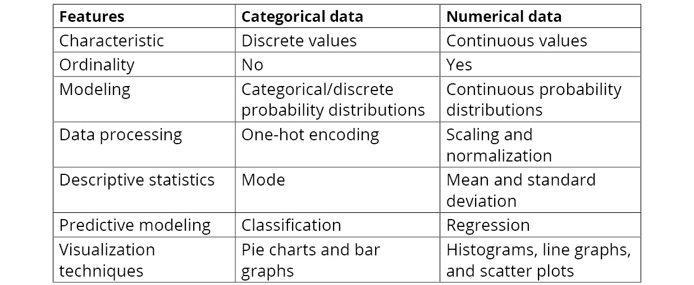

图 3.1：数据类型比较

在本节的其余部分中，我们将从下一小节中的分类数据开始，详细介绍前面的每个比较。

## 分类数据

当一个属性或变量是分类的时，它可以采用的可能值属于一组预先确定的固定值。例如，在与天气相关的数据集中，您可能有一个属性来描述每天的总体天气，在这种情况下，该属性可能位于离散值列表中，例如`"sunny"`、`"windy"`、`"cloudy"`、`"rain"`等等。此属性列*中的单元格必须*采用这些可能的值之一；例如，单元格不能包含数字或不相关的字符串，如`"apple"`。这类数据的另一个术语是*标称数据*。

由于数据的性质，在大多数情况下，分类属性的可能值之间没有顺序关系。例如，没有可以应用于我们前面描述的天气相关数据的比较操作：`"sunny"`既不大于也不小于`"windy"`，以此类推。这将与数值数据形成对比，尽管我们还没有讨论它，但数值数据表达了明确的有序性。

关于数据类型之间的差异这一主题，现在让我们讨论一下在处理分类数据时需要记住的一些要点。

如果使用概率分布对分类属性的未知变量建模，则需要分类分布。这种分布描述了变量是*K*预定义可能类别中的一个的概率。幸运的是，当我们从各种统计/机器学习模型各自的库中调用它们时，大多数建模都将在它们的后端完成，因此我们现在不必担心建模问题。

在数据处理方面，通常使用编码方案将属性中的分类值*转换为数字、机器可解释的值。因此，在分类数据中非常常见的字符串值不能提供给许多只接受数字数据的模型。*

例如，有些人倾向于使用简单的编码，即为每个可能的值分配一个正整数，然后用它们各自的数值替换它们。考虑下面的示例数据集（存储在名为“OutT0”的变量）中：

```py
weather_df
```

输出结果如下：

```py
     temp    weather
0    55      windy
1    34      cloudy
2    80      sunny
3    75      rain
4    53      sunny
```

现在，您可以潜在地调用`weather`属性上的`map()`方法，并传入字典`{'windy': 0, 'cloudy': 1, 'sunny': 2, 'rain': 3}`（`map()`方法仅应用字典在属性上定义的映射）来编码分类属性，如下所示：

```py
weather_df['weather_encoded'] = weather_df['weather'].map(\
                                {'windy': 0, 'cloudy': 1, \
                                 'sunny': 2, 'rain': 3})
```

此 DataFrame 对象现在将保存以下数据：

```py
weather_df
```

结果如下：

```py
     temp    weather    weather_encoded
0    55      windy      0
1    34      cloudy     1
2    80      sunny      2
3    75      rain       3
4    53      sunny       2
```

我们看到，分类列`weather`已通过一对一映射成功转换为`weather_encoded`中的数值数据。但是，这种技术可能有潜在的危险：新属性隐式地对其数据进行排序。由于*0<1<2<3*，我们无意中对原始分类数据进行了相同的排序；如果我们使用的模型专门将其解释为真正的数值数据，这尤其危险。

这就是为什么我们在将分类属性转换为数字形式时必须小心的原因。在前一章中，我们实际上已经讨论了一种能够转换分类数据而无需强加数字关系的技术：一种热编码。在这种技术中，我们为分类属性中的每个唯一值创建一个新属性。然后，对于数据集中的每一行，我们在新创建的属性中放置一个`1`，如果该行在原始分类属性中具有相应的值，并且在其他新属性中具有`0`的值。

下面的代码片段重申了如何使用 pandas 实现一个热编码，以及它对当前示例天气数据集的影响：

```py
pd.get_dummies(weather_df['weather'])
```

这将产生以下输出：

```py
     cloudy    rain    sunny    windy
0    0         0       0        1
1    1         0       0        0
2    0         0       1        0
3    0         1       0        0
4    0         0       1        0
```

在我们将在本章后面讨论的各种描述性统计数据中，模式（显示最多的值）通常是唯一可用于分类数据的统计数据。因此，当我们的数据集中的分类属性缺少值时，我们想用一个中心趋势统计来填充它们，这是我们将在本章后面定义的一个概念，模式是唯一应该考虑的。

在预测方面，如果分类属性是我们机器学习管道的目标（如，如果我们想要预测分类属性），则需要分类模型。与回归模型相反，回归模型对数值、连续数据、分类模型或分类器（简称分类器）进行预测，记住其目标属性可以采用的可能值，并且只在这些值中进行预测。因此，在决定应该在数据集上训练哪些机器学习模型来预测分类数据时，请确保只使用分类器。

分类数据和数值数据的最后一大区别在于可视化技术。上一章讨论了许多适用于分类数据的可视化技术，其中两种最常见的是条形图（包括堆叠和分组条形图）和饼图。

这些类型的可视化关注于每个唯一值所占据的整个数据集的部分。

例如，使用前面的天气数据集，我们可以使用以下代码创建饼图：

```py
weather_df['weather'].value_counts().plot.pie(autopct='%1.1f%%')
plt.ylabel('')
plt.show()
```

这将创建以下可视化：

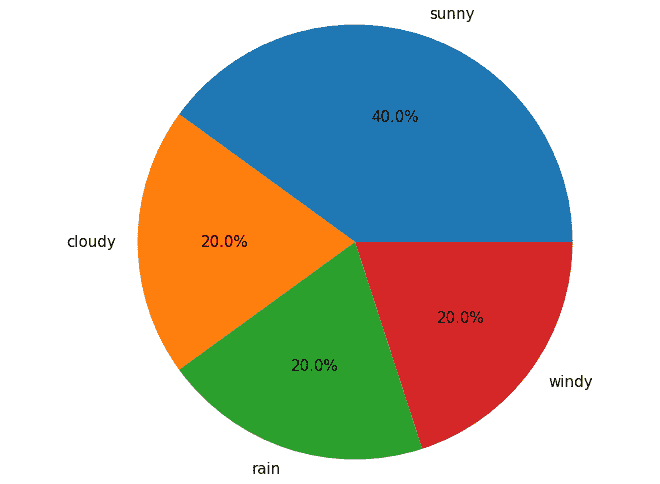

图 3.2：天气数据饼图

我们可以看到，在整个数据集中，`'sunny'`值出现的时间占 40%，而其他每个值出现的时间占 20%。

到目前为止，我们已经讨论了分类属性和数字属性之间最大的理论差异，我们将在下一节中讨论。然而，在继续之前，应该提到分类数据类型的另一个子类型：二进制数据。

二进制属性的值只能是`True`和`False`，它是一个分类属性，其可能值集包含上述两个布尔值。由于布尔值可以通过机器学习和数学模型轻松解释，因此通常不需要将二进制属性转换为任何其他形式。

事实上，原本不是布尔形式的二进制属性应该转换为`True`和`False`值。我们在上一章的样本学生数据集中遇到了这样一个例子：

```py
student_df
```

结果如下：

```py
     name    sex       class    gpa    num_classes
0    Alice   female    FY       90     4
1    Bob     male      SO       93    3
2    Carol   female    SR       97    4
3    Dan     male      SO       89    4
4    Eli     male      JR       95    3
5    Fran    female    SR       92    2
```

这里，`'sex'`列是一个分类属性，其值可以是`'female'`或`'male'`。因此，我们可以做的是对属性进行*二值化*，这是我们通过以下代码完成的，以使该数据更加机器友好（同时确保不会丢失或添加任何信息）：

```py
student_df['female_flag'] = student_df['sex'] == 'female'
student_df = student_df.drop('sex', axis=1)
student_df
```

结果如下：

```py
     name    class    gpa    num_classes    female_flag
0    Alice   FY       90     4              True
1    Bob     SO       93     3              False
2    Carol   SR       97     4              True
3    Dan     SO       89     4              False
4    Eli     JR       95     3              False
5    Fran    SR       92     2              True
```

笔记

由于新创建的列`'female_flag'`包含来自列`'sex'`的所有信息，并且只有这些信息，我们可以简单地从数据集中删除后者。

除此之外，二进制属性可以以任何其他方式（处理、预测和可视化）作为分类数据处理。

现在让我们应用我们在下面的练习中讨论的内容。

## 练习 3.01：可视化天气百分比

在本练习中，我们将获得一个样本数据集，其中包括特定城市五天内的天气。此数据集可从[下载 https://packt.live/2Ar29RG](https://packt.live/2Ar29RG) 。我们的目标是可视化该数据集中的分类信息，以使用我们迄今为止讨论过的分类数据可视化技术检查不同类型天气的百分比：

1.  In a new Jupyter notebook, import pandas, Matplotlib, and seaborn and use pandas to read in the aforementioned dataset:

    ```py
    import pandas as pd
    import matplotlib.pyplot as plt
    import seaborn as sns
    weather_df = pd.read_csv('weather_data.csv')
    weather_df.head()
    ```

    打印出此数据集的前五行时，您应该会看到以下输出：

    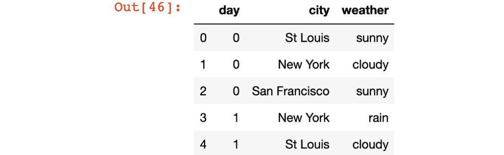

    图 3.3：天气数据集

    如您所见，该数据集的每一行都告诉我们某个城市某一天的天气情况。例如，在第`0`天，`St Louis`晴朗，而`New York`晴朗。

2.  In the next code cell in the notebook, compute the counts (the numbers of occurrences) for all the weather types in our dataset and visualize that information using the `plot.bar()` method:

    ```py
    weather_df['weather'].value_counts().plot.bar()
    plt.show()
    ```

    此代码将产生以下输出：

    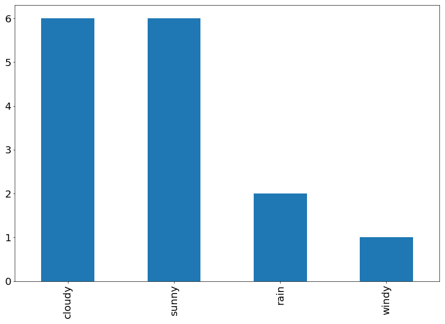

    图 3.4：天气类型计数

3.  Visualize the same information we have in the previous step as a pie chart using the `plot.pie(autopct='%1.1f%%')` method:

    ```py
    weather_df['weather'].value_counts().plot.pie(autopct='%1.1f%%')
    plt.ylabel('')
    plt.show()
    ```

    此代码将产生以下输出：

    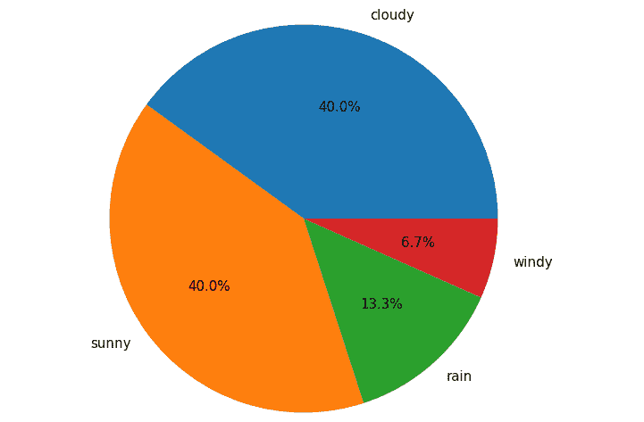

    图 3.5：天气类型计数

4.  Now, we would like to visualize these counts of weather types, together with the information on what percentage each weather type accounts for in each city. First, this information can be computed using the `groupby()` method, as follows:

    ```py
    weather_df.groupby(['weather', 'city'])['weather'].count()\
                                            .unstack('city')
    ```

    结果如下：

    ```py
    city       New York    San Francisco    St Louis
    weather            
    cloudy     3.0         NaN              3.0
    rain       1.0         NaN              1.0
    sunny      1.0         4.0              1.0
    windy      NaN         1.0              NaN
    ```

    我们看到这个对象包含了我们想要的信息。例如，查看表中的`cloudy`行，我们看到天气类型`cloudy`在纽约和圣路易斯分别出现了三次。有多个地方有`NaN`值，表示未发生。

5.  We finally visualize the table we have in the previous step as a stacked bar plot:

    ```py
    weather_df.groupby(['weather', 'city'])\
                       ['weather'].count().unstack('city')\
                       .fillna(0).plot(kind='bar', stacked=True)
    plt.show()
    ```

    这将生成以下绘图：

    

图 3.6：城市天气类型统计

在本练习中，我们将有关分类数据的知识付诸实践，以可视化从样本天气数据集计算的各种类型的计数。

笔记

要访问此特定部分的源代码，请参考[https://packt.live/2ArQAtw](https://packt.live/2ArQAtw) 。

您也可以在[在线运行此示例 https://packt.live/3gkIWAw](https://packt.live/3gkIWAw) 。

接下来，让我们转到第二种主要数据类型：数值数据。

## 数值数据

事实证明，该术语可以直观地帮助我们理解这是什么类型的数据。数值属性应包含数值和连续值或实数。属于数值属性的值可以具有特定范围；例如，它们可以是正值、负值或介于 0 和 1 之间。但是，数值属性意味着其数据可以在其给定范围内获取任何值。这与分类属性中的值明显不同，后者只属于给定的离散值集。

有许多数字数据的例子：人口成员的身高、学校学生的体重、某些地区待售房屋的价格、田径运动员的平均速度等等。只要数据可以表示为实数，就很可能是数字数据。

鉴于其性质，数字数据与分类数据有很大不同。在下面的文本中，我们将列出一些关于统计和机器学习的最重要的差异，我们应该记住这些差异。

与可用于对分类数据建模的少数概率分布不同，数值数据有许多概率分布。这些分布包括正态分布（也称为钟形曲线分布）、均匀分布、指数分布、学生 t 分布等。这些概率分布中的每一个都是为特定类型的数据建模而设计的。例如，正态分布通常用于建模具有线性增长的数量，如年龄、身高或学生的考试成绩，而指数分布用于建模给定事件发生之间的时间量。

因此，研究什么样的特定概率分布适合您试图建模的数值属性是很重要的。适当的分布将允许连贯的分析和准确的预测；另一方面，不适当的概率分布选择可能会导致不直观和不正确的结论。

在另一个主题上，许多处理技术可以应用于数值数据。其中最常见的两种包括缩放和标准化。

缩放涉及将数值属性中的所有值与固定数量相加和/或相乘，以将原始数据的范围缩放到另一个范围。当统计和机器学习模型只能处理给定范围内的值（例如，正数或 0 到 1 之间的数字可以更容易地处理和分析）时，使用此方法。

最常用的定标技术之一是最小-最大定标法，其解释如下公式，*a*和*b*为正数：


图 3.7：最小-最大缩放的公式

*X'*和*X*表示转换前后的数据，*X*max 和*X*min 分别表示数据中的最大值和最小值。可以从数学上证明，公式的输出总是大于*a*而小于*b*，但我们不需要在这里进行讨论。在下一个练习中，我们将再次回到这种缩放方法。

至于规范化，尽管该术语有时可与*缩放*互换使用，但它表示根据概率分布将数值属性具体缩放为规范化形式的过程。我们的目标是获得一个转换后的数据集，它很好地遵循我们选择的概率分布的形状。

例如，假设数值属性中的数据遵循正态分布，平均值为`4`，标准偏差为`10`。以下代码随机综合生成该数据并将其可视化：

```py
samples = np.random.normal(4, 10, size=1000)
plt.hist(samples, bins=20)
plt.show()
```

这将生成以下绘图：

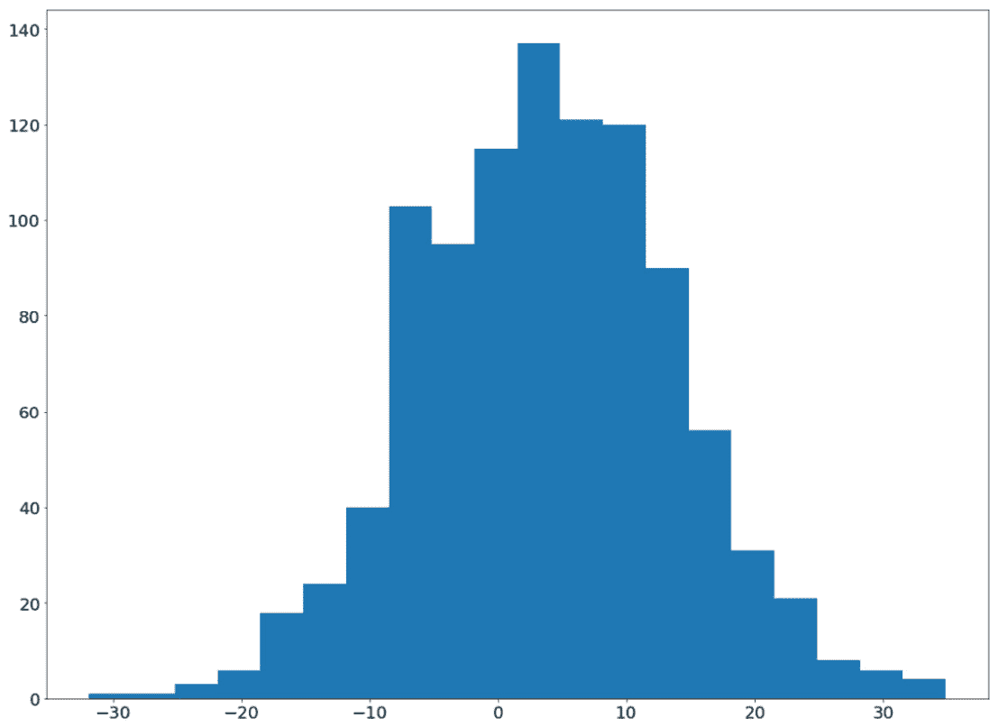

图 3.8：正态分布数据的直方图

现在，假设您有一个模型，该模型假设该数据的正态分布的标准形式，其中平均值为`0`，标准偏差为`1`，如果输入数据不是这种形式，该模型将很难从中学习。因此，您希望以某种方式将前面的数据转换为这种标准形式，而不牺牲数据的真实模式（特别是一般形状）。

这里，我们可以对正态分布数据应用归一化技术，从数据点中减去真实平均值，然后将结果除以真实标准偏差。这种缩放过程通常被称为标准缩放器。由于前面的数据已经是一个 NumPy 数组，我们可以利用矢量化并按如下方式执行规范化：

```py
normalized_samples = (samples - 4) / 10
plt.hist(normalized_samples, bins=20)
plt.show()
```

此代码将为新转换的数据生成直方图，如下所示：


图 3.9：标准化数据的直方图

我们看到，虽然数据已经成功地转移到我们想要的范围，但现在它以`0`为中心，大部分数据位于`-3`和`3`之间，这是正态分布的标准形式，但数据的一般形状没有改变。换句话说，数据点之间的相对差异没有改变。

另一方面，在实践中，当真实平均值和/或真实标准偏差不可用时，我们可以使用样本平均值和标准偏差近似这些统计数据，如下所示：

```py
sample_mean = np.mean(samples)
sample_sd = np.std(samples)
```

对于大量样本，这两个统计数据提供了一个很好的近似值，可以进一步用于这种类型的转换。有了这些，我们现在可以将这些标准化数据输入我们的统计和机器学习模型进行进一步分析。

说到均值和标准差，这两个统计量通常用于描述数值数据。为了填充数值属性中的缺失值，通常使用中心趋势度量，如平均值和中值。在某些特殊情况下，如时间序列数据集，您可以使用更复杂的缺失值插补技术，如插值，其中我们估计缺失值在序列中紧靠其前后的缺失值之间的某个位置*。*

当我们想要训练一个预测模型来定位一个数值属性时，我们会使用回归模型。回归模型不像分类器那样对条目可能的分类值进行预测，而是在连续的数值范围内寻找合理的预测。因此，与我们讨论的内容类似，我们必须注意只对目标值为数值属性的数据集应用回归模型。

最后，在可视化数值数据方面，我们已经看到了可以使用的各种可视化技术。在这之前，我们看到直方图被用来描述数值属性的分布，它告诉我们数据是如何沿着其范围分布的。

此外，线形图和散点图通常是显示属性相对于其他属性的模式的良好工具。（例如，我们将各种概率分布的 PDF 绘制为折线图。）最后，我们还看到了用于可视化二维结构的热图，该热图可用于表示数据集中数值属性之间的相关性。

在继续讨论下一个主题之前，让我们快速练习一下缩放/规范化的概念。同样，最流行的缩放/规范化方法之一称为*最小-最大缩放*，它允许我们将数值属性中的所有值转换为任意范围*【a，b】*。接下来我们将探讨这种方法。

## 练习 3.02：最小-最大缩放

在本练习中，我们将编写一个函数，用于促进对数值属性应用最小-最大缩放的过程。该函数应包含三个参数：`data`、`a`和`b`。而`data`应该是一个 NumPy 数组或一个 pandas`Series`对象，`a`和`b`应该是实值正数，表示`data`应该转换成的数值范围的端点。

参照*数值数据*部分中包含的公式，最小-最大标度如下所示：


图 3.10：最小-最大缩放的公式

让我们看一下实现目标需要遵循的步骤：

1.  Create a new Jupyter notebook and in its first code cell, import the libraries that we will be using for this exercise, as follows:

    ```py
    import pandas as pd
    import numpy as np
    import matplotlib.pyplot as plt
    ```

    在我们将使用的数据集中，第一列被命名为`'Column 1'`，包含 1000 个正态分布样本，平均值为 4，标准偏差为 10。第二列名为`'Column 2'`，包含 1000 个样本，从 1 到 2 均匀分布。第三列命名为`'Column 3'`，包含 1000 个来自参数为 2 和 5 的贝塔分布的样本。在下一个代码单元中，读入我们事先为您生成的`'data.csv'`文件（可在[中找到）https://packt.live/2YTrdKt](https://packt.live/2YTrdKt) ），作为`DataFrame`对象使用熊猫，打印出前五行：

    ```py
    df = pd.read_csv('data.csv')
    df.head()
    ```

    您应该看到以下数字：

    ```py
         Column 1    Column 2    Column 3
    0    -1.231356   1.305917    0.511994
    1    7.874195    1.291636    0.155032
    2    13.169984   1.274973    0.183988
    3    13.442203   1.549126    0.391825
    4    -8.032985   1.895236    0.398122
    ```

2.  在下一个单元格中，编写一个名为`min_max_scale()`的函数，该函数接受三个参数：`data`、`a`和`b`。如上所述，`data`应该是数据集属性中的值数组，`a`和`b`指定输入数据要转换到的范围。
3.  鉴于（隐式）需求，我们有大约`data`（一个 NumPy 数组或一个 pandas`Series`对象，两者都可以使用矢量化），使用矢量化操作实现缩放功能：

    ```py
    def min_max_scale(data, a, b):
        data_max = np.max(data)
        data_min = np.min(data)
        return a + (b - a) * (data - data_min) / (data_max \
                                                  - data_min)
    ```

4.  We will consider the data in the `'Column 1'` attribute first. To observe the effect that this function will have on our data, let's first visualize the distribution of what we currently have:

    ```py
    plt.hist(df['Column 1'], bins=20)
    plt.show()
    ```

    此代码将生成类似于以下内容的绘图：

    

    图 3.11：未标度数据的直方图

5.  Now, use the same `plt.hist()` function to visualize the returned value of the `min_max_scale()` function when called on `df['Column 1']` to scale that data to the range `[-3, 3]`:

    ```py
    plt.hist(min_max_scale(df['Column 1'], -3, 3), bins=20)
    plt.show()
    ```

    这将产生以下结果：

    

    图 3.12：缩放数据的直方图

    我们看到，虽然数据分布的一般形状保持不变，但数据的范围已有效地从`-3`更改为`3`。

6.  对`'Column 2'`属性执行相同的过程（用直方图显示缩放前后的数据）。首先，我们将原始数据可视化：

    ```py
    plt.hist(df['Column 2'], bins=20)
    plt.show()
    ```

7.  现在我们可视化缩放数据，该数据应缩放到范围`[0, 1]`：

    ```py
    plt.hist(min_max_scale(df['Column 2'], 0, 1), bins=20)
    plt.show()
    ```

8.  The second block of code should produce a graph similar to the following:

    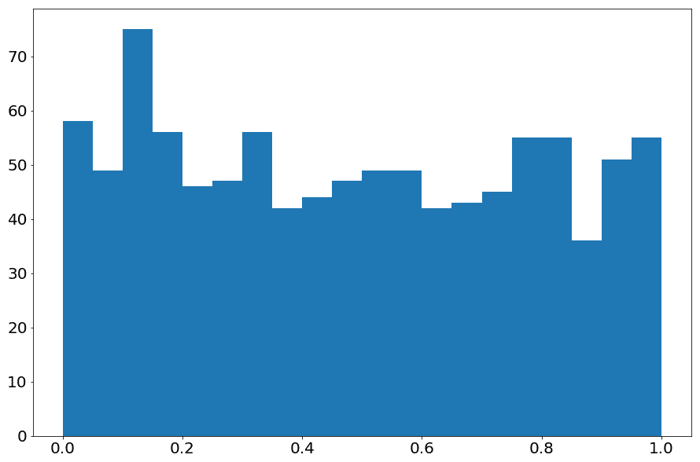

    图 3.13：缩放数据的直方图

9.  对`'Column 3'`属性执行相同的过程（用直方图显示缩放前后的数据）。首先，我们将原始数据可视化：

    ```py
    plt.hist(df['Column 3'], bins=20)
    plt.show()
    ```

10.  现在我们可视化缩放数据，该数据应缩放到范围`[10, 20]`：

    ```py
    plt.hist(min_max_scale(df['Column 3'], 10, 20), \
                              bins=20)
    plt.show()
    ```

11.  The second block of code should produce a graph similar to the following:

    

图 3.14：缩放数据的直方图

在本练习中，我们更详细地考虑了数值数据的缩放/标准化概念。我们还重新探讨了`plt.hist()`函数作为可视化数值数据分布的方法。

笔记

要访问此特定部分的源代码，请参考[https://packt.live/2VDw3JP](https://packt.live/2VDw3JP) 。

您也可以在[在线运行此示例 https://packt.live/3ggiPdO](https://packt.live/3ggiPdO) 。

本练习结束了本章中的数值数据主题。与分类数据一起，它构成了您在给定数据集中可能看到的大多数数据类型。但是，实际上，除了这两种数据类型之外，还有另一种数据类型，它不太常见，我们将在下一节中讨论。

## 序数数据

序数数据在某种程度上是分类数据（属于特定给定集合的序数属性中的值）和数字数据（其中值是数字）的组合。这一事实意味着它们之间存在有序关系。顺序数据最常见的例子是字母分数（`"A"`、`"B"`、`"C"`、`"D"`和`"E"`）、整数评分（例如，在 1 到 10 的范围内）或质量排名（例如，`"excellent"`、`"okay"`和`"bad"`，其中`"excellent"`意味着比`"okay"`更高的质量水平，其本身优于`"bad"`。

由于序号属性中的条目只能采用一组特定值中的一个，因此应使用*分类概率分布*对此类数据进行建模。出于同样的原因，可以使用属性的模式填写有序属性中缺少的值，并且分类数据的可视化技术也可以应用于有序数据。

然而，其他过程可能与我们讨论的分类数据不同。在数据处理方面，可以在每个序数值和数值/范围之间指定一对一的映射。

在字母分数示例中，通常情况下等级`"A"`对应于原始分数中的范围`[90, 100]`，其他字母分数也有自己的连续范围。在质量排名示例中，`"excellent"`、`"okay"`和`"bad"`可以分别映射为 10、5 和 0 作为示例；然而，除非可以量化值之间的质量差异程度，否则这种类型的转换是不可取的。

为了将机器学习模型与数据相匹配，并让它预测有序属性的不可见值，应该使用分类器来完成这项任务。此外，由于排名是一项独特的任务，它构成了许多不同的学习结构，因此在*机器学习排名*方面投入了大量的精力，其中专门设计和训练模型来预测排名数据。

本讨论结束了统计学和机器学习中的数据类型主题。总的来说，我们已经了解到数据集中常见的两种主要数据类型：分类数据和数字数据。根据数据所属的类型，您需要采用不同的数据处理、机器学习和可视化技术。

在下一节中，我们将讨论描述性统计以及如何在 Python 中计算它们。

# 描述性统计

如前所述，描述性统计和推断性统计是统计学领域的两个主要类别。使用描述性统计，我们的目标是计算能够传达重要信息的特定数量，或者换句话说，描述我们的数据。

在描述性统计中，有两个主要的子类别：集中趋势统计和分散统计。实际术语暗示了它们各自的含义：**中心趋势统计**负责描述给定数据分布的*中心*，而**分散统计**则传达关于数据远离中心的分布或范围的信息。

这一区别的一个最明显的例子是熟悉的正态分布，正态分布的统计数据包括均值和标准差。平均值是概率分布中所有值的平均值，适用于估计分布的中心。如我们所见，正态分布的标准形式的平均值为 0，表明其数据围绕轴上的点 0 旋转。

另一方面，标准偏差表示数据点与平均值的差异程度。在正态分布中，它被计算为与分布平均值之间的平均距离，无需详细说明。低值标准差表示数据与平均值的偏差不大，而高值标准差表示各个数据点与平均值相差很大。

总的来说，下表总结了这些类型的统计数据及其特征：

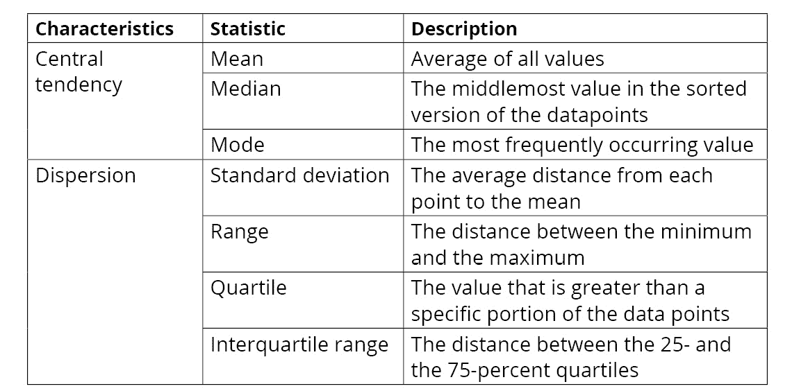

图 3.15：描述性统计类型

还有其他更专业的描述性统计，如偏斜度，用于测量数据分布的不对称性，或峰度，用于测量分布峰值的锐度。但是，它们不像我们前面列出的那样常用，因此本章将不介绍。

在下一小节中，我们将从中心趋势度量开始更深入地讨论前面的每个统计数据。

## 中心趋势

形式上，三种常用的中心趋势统计数据是平均值、中位数和模式。当所有数据点沿轴排列时，**中值**被定义为最中间的值。正如我们前面提到的，**模式**是出现最多的值。由于其特点，平均值和中值仅适用于数值数据，而模式通常用于分类数据。

这三种统计数据都以不同的方式表示数据集的中心，很好地体现了中心趋势的概念。这也是为什么它们经常被用作替换属性中缺少的值的原因。因此，对于缺少的数值，您可以选择均值或中位数作为潜在替换，而如果类别属性包含缺少的值，则可以使用该模式。

特别是，通常使用平均值来填充数值属性中缺少的值，这实际上不是任意的。如果我们将概率分布与给定的数值属性相匹配，那么该属性的平均值实际上就是样本平均值，即真实总体平均值的估计值。总体均值的另一个术语是该总体中未知值的期望值，换句话说，这就是我们应该期望该总体中的任意值。

这就是为什么在某些情况下，应使用相应分布的平均值或期望值来填充缺失值的原因。虽然中位数的情况并非如此，但对于它在替换缺失数值方面的作用，可以提出一些类似的论点。另一方面，模式是对缺失的分类值的良好估计，它是属性中最常见的值。

## 分散

与中心趋势统计不同，分散统计再次尝试量化数据集中的变化程度。一些常见的离散统计数据包括标准偏差、范围（最大值和最小值之间的差值）和四分位数。

正如我们所提到的，标准偏差计算每个数据点和数值属性的平均值之间的差值，将它们平方，取它们的平均值，最后取结果的平方根。单个数据点离平均值越远，该数量越大，反之亦然。这就是为什么它可以很好地指示数据集的分散程度。

最大值和最小值之间的距离，或 0%和 100%的四分位数是描述数据集分散程度的另一种更简单的方法。然而，由于它的简单性，有时这种统计数据传递的信息不如标准差或四分位数那么多。

四分位数定义为给定数据集的特定部分低于的阈值。例如，中位数（数值数据集的最中间值）是该数据集的 50%四分位数，因为（大约）数据集的一半小于该数字。类似地，我们可以计算常见的四分位数，如 5%、25%、75%和 95%四分位数。在量化数据的分散程度方面，这些四分位数可以说比范围更具信息性，因为它们可以解释数据的不同分布。

此外，*四分位数范围*（另一种常见的离散度统计）被定义为数据集 25%和 75%四分位数之间的差异。

到目前为止，我们已经讨论了中心趋势统计和分散统计的概念。让我们通过一个快速练习来强化其中一些重要的想法。

## 练习 3.03：可视化概率密度函数

在*练习 2.04*、*第二章*的*概率分布可视化*、*Python 的主要统计工具*中，我们考虑了将概率分布的 PDF 与其采样数据的直方图进行比较的任务。在这里，我们将实现该程序的扩展，其中我们还将可视化每个分布的各种描述性统计：

1.  在新 Jupyter 笔记本的第一个单元格中，导入 NumPy 和 Matplotlib:

    ```py
    import numpy as np
    import matplotlib.pyplot as plt
    ```

2.  在新单元中，使用`np.random.normal()`从正态分布随机生成 1000 个样本。计算平均值、中位数以及 25%和 75%四分位数描述性统计如下：

    ```py
    samples = np.random.normal(size=1000)
    mean = np.mean(samples)
    median = np.median(samples)
    q1 = np.percentile(samples, 25)
    q2 = np.percentile(samples, 75)
    ```

3.  In the next cell, visualize the samples using a histogram. We will also indicate where the various descriptive statistics are by drawing vertical lines—a red vertical line at the mean point, a black one at the median, a blue line at each of the quartiles:

    ```py
    plt.hist(samples, bins=20)
    plt.axvline(x=mean, c='red', label='Mean')
    plt.axvline(x=median, c='black', label='Median')
    plt.axvline(x=q1, c='blue', label='Interquartile')
    plt.axvline(x=q2, c='blue')
    plt.legend()
    plt.show()
    ```

    注意，这里我们结合了各种绘图函数调用中的`label`参数规范和`plt.legend()`函数。这将帮助我们创建带有适当标签的图例，如下所示：

    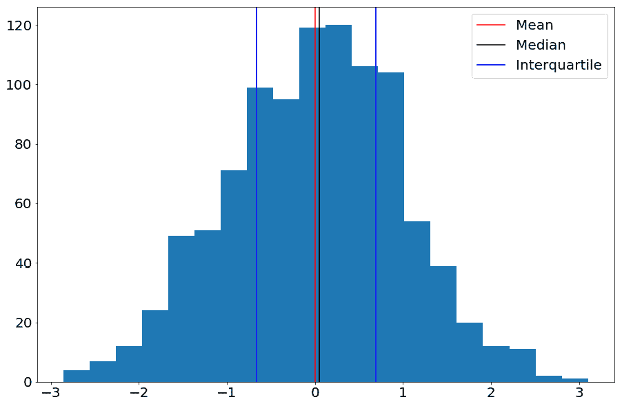

    图 3.16：正态分布的描述性统计

    这里有一件有趣的事：平均值和中位数在 x 轴上几乎重合。这是在许多其他分布中找不到的正态分布的许多数学上方便的特征之一：其平均值等于其中值和模式。

4.  Apply the same process to a Beta distribution with parameters `2` and `5`, as follows:

    ```py
    samples = np.random.beta(2, 5, size=1000)
    mean = np.mean(samples)
    median = np.median(samples)
    q1 = np.percentile(samples, 25)
    q2 = np.percentile(samples, 75)
    plt.hist(samples, bins=20)
    plt.axvline(x=mean, c='red', label='Mean')
    plt.axvline(x=median, c='black', label='Median')
    plt.axvline(x=q1, c='blue', label='Interquartile')
    plt.axvline(x=q2, c='blue')
    plt.legend()
    plt.show()
    ```

    这将生成类似于以下内容的图形：

    

    图 3.17：Beta 分布的描述性统计

5.  Apply the same process to a Gamma distribution with parameter `5`, as follows:

    ```py
    samples = np.random.gamma(5, size=1000)
    mean = np.mean(samples)
    median = np.median(samples)
    q1 = np.percentile(samples, 25)
    q2 = np.percentile(samples, 75)
    plt.hist(samples, bins=20)
    plt.axvline(x=mean, c='red', label='Mean')
    plt.axvline(x=median, c='black', label='Median')
    plt.axvline(x=q1, c='blue', label='Interquartile')
    plt.axvline(x=q2, c='blue')
    plt.legend()
    plt.show()
    ```

    这将生成类似于以下内容的图形：

    

图 3.18：伽马分布的描述性统计

通过本练习，我们了解了如何使用 NumPy 计算数据集的各种描述性统计数据，并将它们可视化为直方图。

笔记

要访问此特定部分的源代码，请参考[https://packt.live/2YTobpm](https://packt.live/2YTobpm) 。

您也可以在[在线运行此示例 https://packt.live/2CZf26h](https://packt.live/2CZf26h) 。

除了计算描述性统计之外，Python 还提供了其他描述数据的方法，我们将在下一节中讨论这些方法。

## Python 相关描述性统计

这里，我们将研究两种用于描述数据的中间方法。第一个是`describe()`方法，在`DataFrame`对象上调用。来自官方文件（可在[找到）https://pandas.pydata.org/pandas-docs/stable/reference/api/pandas.DataFrame.describe.html](https://pandas.pydata.org/pandas-docs/stable/reference/api/pandas.DataFrame.describe.html) ），函数“生成描述性统计数据，汇总数据集分布的中心趋势、分散度和形状，不包括`NaN`值。”

让我们看看这个方法的实际效果。首先，我们将创建一个具有数字属性、分类属性和顺序属性的示例数据集，如下所示：

```py
df = pd.DataFrame({'numerical': np.random.normal(size=5),\
                   'categorical': ['a', 'b', 'a', 'c', 'b'],\
                   'ordinal': [1, 2, 3, 5, 4]})
```

现在，如果我们对`df`变量调用`describe()`方法，将生成一个表格摘要：

```py
df.describe()
```

结果如下：

```py
        numerical    ordinal
count   5.000000     5.000000
mean    -0.251261    3.000000
std     0.899420     1.581139
min     -1.027348    1.000000
25%     -0.824727    2.000000
50%     -0.462354    3.000000
75%     -0.192838    4.000000
max     1.250964     5.000000
```

如您所见，打印输出中的每一行表示数据集中每个属性的不同描述性统计：值的数量（`count`）、平均值、标准偏差和各种四分位数。由于`numerical`和`ordinal`属性都被解释为数字数据（考虑到它们包含的数据），`describe()`默认情况下仅为它们生成这些报告。另一方面，`categorical`列被排除在外。要强制报告应用于所有列，我们可以指定`include`参数，如下所示：

```py
df.describe(include='all')
```

结果如下：

```py
        numerical     categorical    ordinal
count   5.000000      5              5.000000
unique  NaN           3              NaN
top     NaN           a              NaN
freq    NaN           2              NaN
mean    -0.251261     NaN            3.000000
std     0.899420      NaN            1.581139
min     -1.027348     NaN            1.000000
25%     -0.824727     NaN            2.000000
50%     -0.462354     NaN            3.000000
75%     -0.192838     NaN            4.000000
max     1.250964      NaN            5.000000
```

这迫使该方法计算适用于分类数据的其他统计信息，例如唯一值的数量（`unique`）、模式（`top`）和模式的计数/频率（`freq`）。正如我们所讨论的，大多数数字数据的描述性统计不适用于分类数据，反之亦然，这就是为什么在前面的报告中使用`NaN`值来表示不适用的原因。

总的来说，pandas 的`describe()`方法提供了一种快速总结和获取数据集及其属性概述的方法。这在探索性数据分析任务中尤其有用，在这些任务中，我们希望广泛地探索我们还不熟悉的新数据集。

Python 支持的第二种与描述性统计相关的方法是箱线图的可视化。显然，箱线图是一种可视化技术，它不是语言本身所独有的，但是 Python，特别是它的 seaborn 库，提供了一个相当方便的 API，`sns.boxplot()`函数，以促进该过程。

理论上，箱线图是可视化数值数据集分布的另一种方法。同样，它可以通过`sns.boxplot()`功能生成：

```py
sns.boxplot(np.random.normal(2, 5, size=1000))
plt.show()
```

此代码将生成大致类似于以下内容的图形：

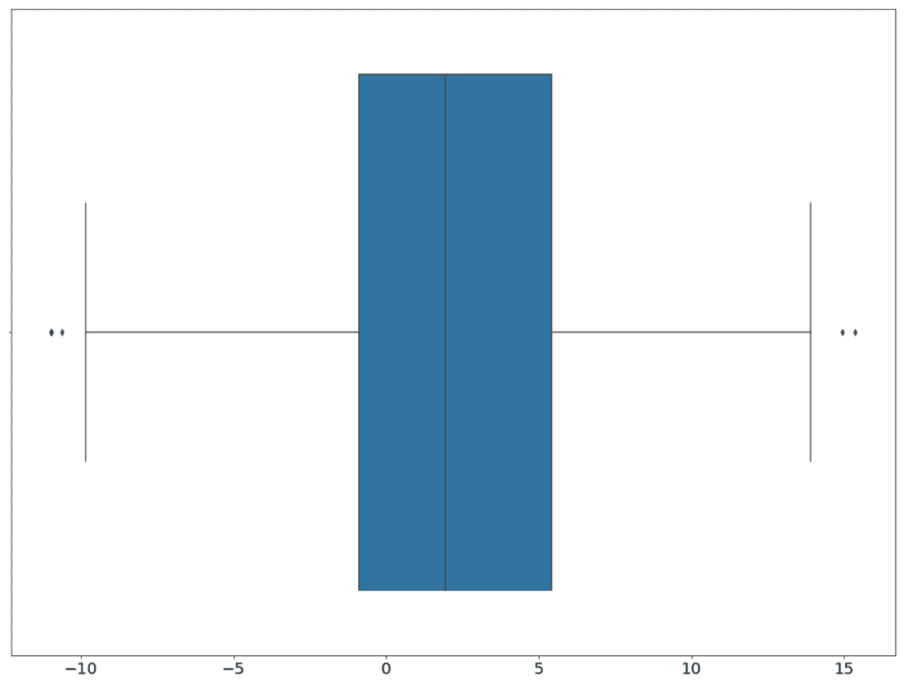

图 3.19：使用 seaborn 的箱线图

在前面的方框图中，中间的蓝色框表示输入数据的四分位数范围（从 25 到 75%分位数）。盒子中间的垂直线是中值，而左边和右边的两个阈值，而在框的外面分别表示输入数据的最小值和最大值。

需要注意的是，最小值是 25%四分位数*减去*四分位数范围乘以 1.5，最大值是 75%四分位数*加*四分位数范围乘以 1.5。通常的做法是考虑在最小值和最大值之间的这个范围之外的任何数作为离群值，在前面的图中可视为黑点。

本质上，箱线图可以直观地表示由`describe()`函数从数据中计算出的统计信息。seaborn 将此功能与其他可视化工具区分开来的是，根据 seaborn 提供的标准，可以轻松创建多个箱线图。

让我们在下一个示例中看到这一点，其中我们使用随机数据生成将样本数据集扩展到`1000`行：

```py
df = pd.DataFrame({'numerical': np.random.normal(size=1000),\
                   'categorical': np.random.choice\
                                  (['a', 'b', 'c'], size=1000),\
                   'ordinal': np.random.choice\
                              ([1, 2, 3, 4, 5], size=1000)})
```

这里，`'numerical'`属性包含标准正态分布的随机抽取，`'categorical'`属性包含从列表`['a', 'b', 'c']`中随机选择的值，`'ordinal'`也包含从列表`[1, 2, 3, 4, 5]`中随机选择的值。

我们使用该数据集的目标是生成稍微复杂的箱线图可视化——箱线图表示`'numerical'`中数据在`'categorical'`中不同值的分布。一般过程是将数据集分成不同的组，每个组对应于`'categorical'`中的唯一值，对于每个组，我们希望使用`'numerical'`属性中的相应数据生成一个箱线图。

但是，使用 seaborn，我们可以通过为`sns.boxplot()`函数指定`x`和`y`参数来简化此过程。具体来说，我们将让我们的*x*轴包含`'categorical'`中不同的唯一值，*y*轴用以下代码表示`'numerical'`中的数据：

```py
sns.boxplot(y='numerical', x='categorical', data=df)
plt.show()
```

这将生成以下绘图：


图 3.20：使用 seaborn 的多箱线图

可视化包含我们想要显示的内容：`'numerical'`属性中的数据分布，用箱线图表示，并由`'categorical'`属性中的唯一值分隔。考虑到`'ordinal'`中的唯一值，我们可以采用如下相同的过程：

```py
sns.boxplot(y='numerical', x='ordinal', data=df)
plt.show()
```

这将生成以下图表：


图 3.21：使用 seaborn 的多箱线图

可以想象，当我们想要分析数字属性相对于分类或顺序数据的分布差异时，这种可视化方法是理想的。

这就结束了本章的描述性统计主题。在下一节中，我们将讨论统计的另一个类别：推断统计。

# 推理统计学

与描述性统计不同，在描述性统计中，我们的目标是使用特定数量描述数据集的各种特征，在推断统计中，我们希望对数据集执行特定的统计建模过程，以便我们能够*推断*进一步的信息，关于数据集本身，甚至关于来自同一总体的不可见数据点。

在本节中，我们将介绍一些不同的推断统计方法。从这些讨论中，我们将看到每种方法都是针对特定的数据和情况设计的，统计学家或机器学习工程师有责任适当地应用它们。

我们将讨论的第一种方法是经典统计学中最基本的方法之一：t 检验。

## T 检验

一般来说，t 检验（也称为学生 t 检验）用于比较两个平均值（平均值）统计数据，并得出它们之间是否存在足够的差异。t 检验的主要应用是比较事件（例如，实验药物、运动常规等）对人群和对照组的影响。如果平均值差异足够大（我们称之为统计显著性），那么我们有充分的理由相信给定事件的影响。

统计学中有三种主要类型的 t 检验：独立样本 t 检验（用于比较两个独立样本的平均值）、配对样本 t 检验（用于比较同一组在不同时间的平均值）和一个样本 t 检验（用于比较一组的平均值与预定平均值）。

t 检验的一般工作流程是先声明两种方法确实相等的零假设，然后考虑 t 检验的输出，即相应的 p 值。如果 p 值大于一个固定阈值（通常选择 0.05），那么我们不能拒绝零假设。另一方面，如果 p 值低于阈值，我们可以拒绝无效假设，这意味着这两种方法是不同的。我们看到这是一种推断统计方法，因为从中我们可以*推断*关于我们数据的事实；在这种情况下，我们感兴趣的两种方式是否彼此不同。

我们将不讨论这些测试的理论细节；相反，我们将看到如何简单地利用 Python 中提供的 API，特别是 SciPy 库。我们在上一章中使用了这个库，因此如果您还不熟悉该工具，请务必回到*第 2 章*、*Python 的主要统计工具*，了解如何在您的环境中安装它。

让我们设计一个样本实验。假设我们有两个数字数组，每个都来自未知分布，我们想知道它们各自的平均值是否相等。因此，我们有一个无效假设，即这两个数组的均值相等，如果 t 检验的 p 值小于 0.05，则可以拒绝该假设。

为了生成本例的合成数据，我们将使用来自正态分布标准形式的`20`样本（对于第一个数组，平均值为`0`和标准偏差为`1`），以及来自正态分布的另一`20`样本，平均值为`0.2`和标准偏差为`1`对于第二个阵列：

```py
samples_a = np.random.normal(size=20)
samples_b = np.random.normal(0.2, 1, size=20)
```

要快速可视化此数据集，我们可以使用以下`plt.hist()`函数：

```py
plt.hist(samples_a, alpha=0.2)
plt.hist(samples_b, alpha=0.2)
plt.show()
```

这将生成以下绘图（请注意，您自己的输出可能不同）：

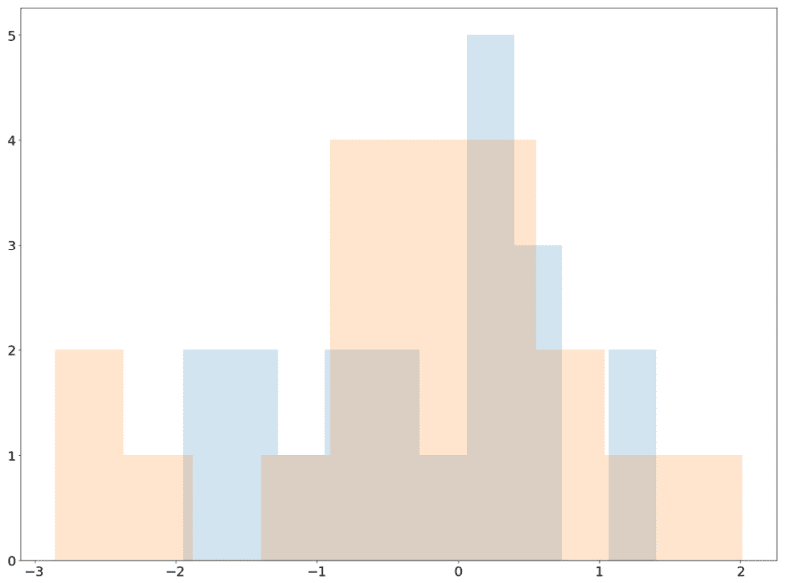

图 3.22：t 检验样本数据直方图

现在，我们将从`scipy.stats`包中调用`ttest_ind()`函数。此函数有助于进行独立样本 t 检验，并将返回一个名为`pvalue`的属性的对象；该属性包含 p 值，该值将帮助我们决定是否拒绝我们的无效假设：

```py
scipy.stats.ttest_ind(samples_a, samples_b).pvalue
```

结果如下：

```py
0.8616483548091348
```

有了这个结果，我们不会拒绝我们的无效假设。同样，您的 p 值可能与前面的输出不同，但也可能不低于 0.05。我们的最终结论是，我们没有足够的证据表明我们两个数组的平均值是不同的（即使它们实际上是由两个具有不同平均值的正态分布生成的）。

让我们重复这个实验，但这一次我们有更多的数据，每个数组现在包含 1000 个数字：

```py
samples_a = np.random.normal(size=1000)
samples_b = np.random.normal(0.2, 1, size=1000)
plt.hist(samples_a, alpha=0.2)
plt.hist(samples_b, alpha=0.2)
plt.show()
```

直方图现在如下所示：


图 3.23：t 检验样本数据直方图

再次运行 t 检验，我们发现这一次，我们得到了一个不同的结果：

```py
scipy.stats.ttest_ind(samples_a, samples_b).pvalue
```

结果如下：

```py
3.1445050317071093e-06
```

该 p 值远低于 0.05，因此拒绝了无效假设，并为我们提供了足够的证据表明两个数组具有不同的平均值。

这两个实验证明了一个我们应该记住的现象。在第一个实验中，我们的 p 值不足以让我们拒绝零假设，即使我们的数据确实是由两个具有不同平均值的分布生成的。在第二个实验中，有更多的数据，t 检验在区分这两种方法方面更具决定性。

本质上，每个阵列中只有 20 个样本，第一个 t 检验没有足够高的置信度来输出较低的 p 值，即使这两种方法确实不同。对于 1000 个样本，这种差异更加一致和稳健，因此第二次 t 检验能够积极输出较低的 p 值。一般来说，随着更多的数据被用作输入，许多其他统计方法也将被证明更具决定性。

我们看了一个独立样本 t 检验的例子，作为推断统计的一种方法来检验两个给定总体平均值之间的差异程度。总的来说，`scipy.stats`包提供了广泛的统计测试，这些测试负责后台的所有计算，并且只返回最终的测试输出。这遵循 Python 语言的一般原理，将 API 保持在较高的级别，以便用户可以灵活方便地利用复杂的方法。

笔记

有关`scipy.stats`包中可用内容的更多详细信息，请参见其官方文档[https://docs.scipy.org/doc/scipy-0.15.1/reference/tutorial/stats.html](https://docs.scipy.org/doc/scipy-0.15.1/reference/tutorial/stats.html) 。

一些最常用的测试可以从软件包中调用，包括：均值差异的 t 检验或方差分析；正态性测试，以确定样本是否来自正态分布；以及计算样本总体的平均值和标准偏差的贝叶斯可信区间。

离开`scipy.stats`包，我们看到 pandas 库还支持广泛的统计功能，特别是其方便的`describe()`方法。在下一节中，我们将研究第二种推断统计方法：数据集的相关矩阵。

## 相关矩阵

相关矩阵是包含给定数据集的每对属性之间的相关系数的二维表。两个属性之间的相关系数量化了它们的线性相关程度，或者换句话说，它们以线性方式表现的相似程度。相关系数介于-1 和+1 之间，其中+1 表示完全线性相关，0 表示不相关，而-1 表示完全负相关。

如果两个属性具有很高的线性相关性，则当一个属性增加时，另一个属性倾向于增加相同的数量乘以常数。换句话说，如果我们将两个属性中的数据绘制在散点图上，那么各个点将倾向于沿着具有正斜率的直线。对于没有相关性的两个属性，最佳拟合线倾向于水平，具有负相关性的两个属性由具有负斜率的线表示。

在某种程度上，两个属性之间的相关性可以告诉我们属性之间共享了多少信息。我们可以从两个相关的属性（无论是积极的还是消极的）中推断，它们之间存在某种潜在的关系。这就是作为推断统计工具的相关矩阵背后的思想。

在一些机器学习模型中，建议如果我们有高度相关的特征，我们应该在数据集中只保留一个，然后再将其输入模型。在大多数情况下，拥有另一个与模型训练过的属性高度相关的属性并不能提高其性能；更重要的是，在某些情况下，相关特征甚至可能误导我们的模型，并将其预测引向错误的方向。

这就是说，两个数据属性之间的相关系数，因而是数据集的相关矩阵，是我们考虑的重要统计对象。让我们通过一个简单的例子来了解这一点。

假设我们有一个包含三个属性的数据集，`'x'`、`'y'`和`'z'`。`'x'`和`'z'`中的数据是以独立的方式随机生成的，因此它们之间应该没有相关性。另一方面，我们将生成`'y'`作为`'x'`中的数据乘以 2，并添加一些随机噪声。这可以通过以下代码完成，该代码创建了一个包含 500 个条目的数据集：

```py
x = np.random.rand(500,)
y = x * 2 + np.random.normal(0, 0.3, 500)
z = np.random.rand(500,)
df = pd.DataFrame({'x': x, 'y': y, 'z': z})
```

从这里，可以使用`corr()`方法轻松计算相关矩阵（同样，它包含数据集中每对属性的相关系数）：

```py
df.corr()
```

结果如下：

```py
     x                     y                     z
x    1.000000              0.8899950.869522      0.019747 -0.017913
y    0.8899950.869522      1.000000              0.045332 -0.023455
z    0.019747 -0.017913    0.045332 -0.023455    1.000000
```

我们看到这是一个 3x3 矩阵，因为在调用的`DataFrame`对象中有三个属性。每个数字表示行和列属性之间的相关性。这种表示法的一个效果是，我们将矩阵中的所有对角值都设为 1，因为每个属性都与其自身完全相关。

我们更感兴趣的是不同属性之间的相关性：`'z'`是独立于`'x'`（因此是`'y'`）生成的，`'z'`行和列中的值相对接近于 0。与此相反，`'x'`和`'y'`之间的相关性非常接近于 1，因为一个被生成为另一个的大约两倍。

此外，通常用热图直观地表示相关矩阵。这是因为当我们的数据集中有大量属性时，热图将帮助我们更有效地识别与高度相关属性相对应的区域。可以使用 seaborn library 的`sns.heatmap()`功能显示热图：

```py
sns.heatmap(df.corr(), center=0, annot=True)
bottom, top = plt.ylim()
plt.ylim(bottom + 0.5, top - 0.5)
plt.show()
```

`annot=True`参数指定矩阵中的值应在热图的每个单元格中打印出来。

该代码将生成以下内容：


图 3.24：表示相关矩阵的热图

在这种情况下，在目视检查相关矩阵热图的同时，我们可以将重点放在明亮区域（除了对角线单元格），以识别高度相关的属性。如果数据集中存在负相关属性（我们在当前示例中没有），那么也可以使用暗区域检测这些属性。

总的来说，给定数据集的相关矩阵对于我们理解该数据集的不同属性之间的关系是一个有用的工具。我们将在接下来的练习中看到一个例子。

## 练习 3.04：识别和测试平均值的相等性

在本练习中，我们将练习两种推断统计方法来分析我们为您生成的合成数据集。数据集可从 GitHub 存储库下载，网址为[https://packt.live/3ghKkDS](https://packt.live/3ghKkDS) 。

在这里，我们的目标是首先确定该数据集中哪些属性彼此相关，然后应用 t 检验来确定任何一对属性是否具有相同的平均值。

话虽如此，让我们开始：

1.  在新的 Jupyter 笔记本中，从 SciPy 的`stats`模块中导入`pandas`、`matplotlib`、`seaborn`和`ttest_ind()`方法：

    ```py
    import pandas as pd
    from scipy.stats import ttest_ind
    import matplotlib.pyplot as plt
    import seaborn as sns
    ```

2.  Read in the dataset that you have downloaded. The first five rows should look like the following:

    

    图 3.25：读取数据集的前五行

3.  In the next code cell, use seaborn to generate the heatmap that represents the correlation matrix for this dataset. From the visualization, identify the pair of attributes that are correlated with each other the most:

    ```py
    sns.heatmap(df.corr(), center=0, annot=True)
    bottom, top = plt.ylim()
    plt.ylim(bottom + 0.5, top - 0.5)
    plt.show()
    ```

    此代码应产生以下可视化效果：

    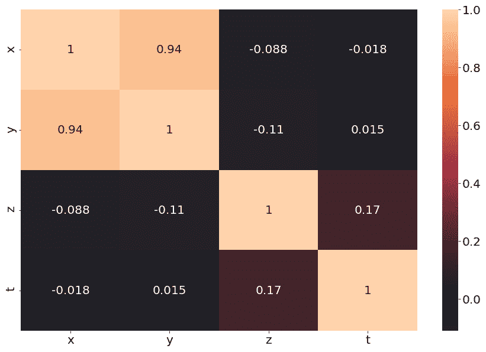

    图 3.26：数据集的相关矩阵

    从这个输出中，我们可以看到属性`'x'`和`'y'`的相关系数非常高：`0.94`。

4.  Using this `jointplot()` method in seaborn, create a combined plot with two elements: a scatter plot on a two-dimensional plane where the coordinates of the points correspond to the individual values in `'x'` and `'y'` respectively, and two histograms representing the distributions of those values. Observe the output and decide whether the two distributions have the same mean:

    ```py
    sns.jointplot(x='x', y='y', data=df)
    plt.show()
    ```

    这将产生以下输出：

    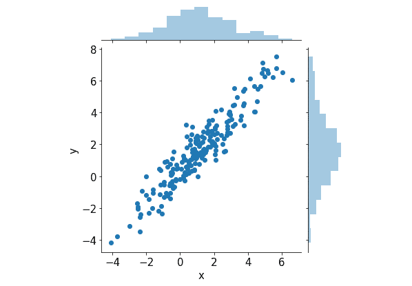

    图 3.27：相关属性的组合图

    从这个可视化中，不清楚这两个属性是否具有相同的平均值。

5.  Instead of using a visualization, run a t-test with 0.05 level of significance to decide whether the two attributes have the same mean:

    ```py
    ttest_ind(df['x'], df['y']).pvalue
    ```

    此命令将具有以下输出：

    ```py
    0.011436482008949079
    ```

    这个 p 值确实低于 0.05，这使得我们可以拒绝两个分布具有相同平均值的无效假设，即使它们高度相关。

在本练习中，我们应用了本节学习的两种推断统计方法来分析数据集中的一对相关属性。

笔记

要访问此特定部分的源代码，请参考[https://packt.live/31Au1hc](https://packt.live/31Au1hc) 。

您也可以在[在线运行此示例 https://packt.live/2YTt7L7](https://packt.live/2YTt7L7) 。

在推理统计主题的下一个也是最后一个部分中，我们将讨论使用统计和机器学习模型作为使用统计进行推理的方法的过程。

## 统计和机器学习模型

使用数学或机器学习模型对给定数据集进行建模，其本身能够将数据集中的任何潜在模式和趋势概括为看不见的数据点，这是推断统计的另一种形式。机器学习本身可以说是计算机科学发展最快的领域之一。然而，大多数机器学习模型实际上利用了数学和统计理论，这就是这两个领域紧密相连的原因。在本节中，我们将考虑在给定数据集上训练模型的过程，以及 Python 如何帮助促进该过程。

值得注意的是，机器学习模型实际上并不像人类那样学习。大多数情况下，模型都试图解决一个优化问题，使其训练误差最小化，这表示它能够很好地处理训练数据中的模式，希望该模型能够很好地泛化从与训练数据相同的分布中提取的看不见的数据。

例如，线性回归模型生成通过给定数据集中所有数据点的最佳拟合线。在模型定义中，这条线对应于到各个数据点的距离之和最小的线，通过解决距离之和最小的优化问题，线性回归模型能够输出最佳拟合线。

总的来说，每种机器学习算法都以不同的方式对数据进行建模，从而对优化问题进行建模，每种算法都适用于特定的设置。然而，Python 语言中内置的不同抽象级别允许我们跳过这些细节，并在较高级别上应用不同的机器学习模型。我们需要记住的是，统计和机器学习模型是推断统计的另一种方法，在这种方法中，我们能够根据训练数据集中表示的模式对看不见的数据进行预测。

假设我们的任务是在上一节的样本数据集上训练一个模型，其中学习特征是`'x'`和`'z'`，我们的预测目标是`'y'`。也就是说，我们的模型应该了解`'x'`或`'z'`与`'y'`之间的任何潜在关系，并从中知道如何从`'x'`和`'z'`中的数据预测`'y'`的未知值。

因为`'y'`是一个数值属性，我们需要一个回归模型，而不是一个分类器，来训练我们的数据。在这里，我们将使用统计和机器学习中最常用的回归器之一：线性回归。为此，我们需要 scikit 学习库，它是 Python 中最流行的预测数据分析工具之一。

要安装 scikit learn，请运行以下`pip`命令：

```py
$ pip install scikit-learn
```

您也可以使用`conda`命令来安装：

```py
$ conda install scikit-learn
```

现在，我们导入线性回归模型并将其拟合到我们的训练数据中：

```py
from sklearn import linear_model
model = linear_model.LinearRegression()
model.fit(df[['x', 'z']], df['y'])
```

通常，机器学习模型对象调用的`fit()`方法包含两个参数：独立特征（即，将用于进行预测的特征），在本例中为`'x'`和`'z'`，以及依赖特征或预测目标（也就是说，我们想要预测的属性），在本例中是`'y'`。

此`fit()`方法将根据给定数据启动模型的训练过程。根据模型的复杂性以及训练数据的大小，此过程可能需要大量时间。然而，对于线性回归，训练过程应该相对较快。

一旦我们的模型完成训练，我们就可以查看它的各种统计数据。可用的统计数据取决于所使用的特定模型；对于线性回归，我们通常考虑系数。回归系数是对独立特征和预测目标之间线性关系的估计。本质上，回归系数是线性回归模型估计的特定预测变量`'x'`或`'z'`的最佳拟合线斜率，以及我们想要预测的特征—`'y'`。

这些统计数据可通过以下方式获取：

```py
model.coef_
```

这将为我们提供以下输出：

```py
array([1.98861194, 0.05436268])
```

同样，您自己的实验的输出可能与前面的不完全相同。然而，这些系数有一个明显的趋势：第一个系数（表示`'x'`和`'y'`之间的估计线性关系）约为 2，而第二个系数（表示`'z'`和`'y'`之间的估计线性关系）接近 0。

这个结果与我们生成这个数据集的过程非常一致：`'y'`的生成量大致等于`'x'`中的元素乘以 2，而`'z'`是独立生成的。通过查看这些回归系数，我们可以获得关于哪些特征是预测目标的最佳（线性）预测因子的信息。有些人认为这些类型的统计是解释性/可解释性统计，因为他们给我们如何预测过程的见解。

我们更感兴趣的是对看不见的数据进行预测的过程。这可以通过调用模型对象上的`predict()`方法来实现，如下所示：

```py
model.predict([[1, 2], [2, 3]])
```

输出结果如下：

```py
array([2.10790143, 4.15087605])
```

在这里，我们将任何可以表示二维表的数据结构传递给`predict()`方法（在前面的代码中，我们使用了嵌套列表，但在理论上，您也可以使用二维 NumPy 数组或熊猫`DataFrame`对象）。此表的列数必须等于训练数据中的独立特征数；在本例中，我们有两个（`'x'`和`'z'`，因此`[[1, 2], [2, 3]]`中的每个子列表都有两个元素。

从模型产生的预测中，我们看到当`'x'`等于 1 且`'z'`等于 2 时（我们的第一个测试用例），相应的预测大约为 2。这与`'x'`的系数约为 2，而`'z'`的系数接近于 0 的事实是一致的。第二个测试用例也是如此。

这是一个机器学习模型可以用来预测数据的例子。总的来说，scikit 学习库为不同类型的问题提供了广泛的模型：分类、回归、聚类、降维等等。正如我们所看到的，模型中的 API 与`fit()`和`predict()`方法一致。这允许更大程度的灵活性和精简。

机器学习中的一个重要概念是模型选择。并非所有的模型都是平等的；一些模型，由于其设计或特征，比其他模型更适合给定的数据集。这就是为什么模型选择是整个机器学习过程中的一个重要阶段。在收集和准备训练数据集之后，机器学习工程师通常会将数据集提供给许多不同的模型，并且一些模型可能会由于性能不佳而被排除在过程之外。

我们将在下面的练习中看到这方面的演示，其中我们将介绍模型选择的过程。

## 练习 3.05：车型选择

在这个练习中，我们将通过一个样本模型选择过程，我们尝试将三个不同的模型拟合到一个合成数据集，并考虑它们的性能：

1.  In the first code cell of a new Jupyter notebook, import the following tools:

    ```py
    import numpy as np
    from sklearn.datasets import make_blobs
    from sklearn.model_selection import train_test_split
    from sklearn.metrics import accuracy_score
    from sklearn.neighbors import KNeighborsClassifier
    from sklearn.svm import SVC
    from sklearn.ensemble import GradientBoostingClassifier
    import matplotlib.pyplot as plt
    ```

    笔记

    我们还不熟悉其中的一些工具，但我们将在完成本练习时向我们解释它们。

    现在，我们要创建一个二维平面上点的合成数据集。每个点都属于一个特定的组，属于同一组的点应围绕一个公共中心点旋转。

2.  This synthetic data can be generated using the `make_blobs` function that we have imported from the `sklearn.datasets` package:

    ```py
    n_samples = 10000
    centers = [(-2, 2), (0, 0), (2, 2)]
    X, y = make_blobs(n_samples=n_samples, centers=centers, \
                      shuffle=False, random_state=0)
    ```

    如我们所见，此函数接受一个名为`n_samples`的参数，该参数指定应生成的数据点的数量。另一方面，`centers`参数指定各个点所属的组的总数及其各自的坐标。在本例中，我们有三组点，分别以`(-2, 2)`、`(0, 0)`和`(2, 2)`为中心。

3.  Lastly, by specifying the `random_state` argument as `0`, we ensure that the same data is generated every time we rerun this notebook. As we mentioned in *Chapter 1*, *Fundamentals of Python*, this is good practice in terms of reproducibility.

    我们的目标是在这些数据上训练各种模型，以便在输入新的点列表时，模型能够高精度地确定每个点应属于哪一组。

    此函数返回两个对象的元组，我们分别将它们分配给变量`X`和`y`。元组中的第一个元素包含数据集的独立特征；在这种情况下，它们是点的*x*和*y*坐标。第二个元组元素是我们的预测目标，每个点所属的组的索引。惯例是将独立特征存储在一个名为`X`的矩阵中，将预测目标存储在一个名为`y`的向量中，就像我们正在做的那样。

4.  Print out these variables to see what we are dealing with. Type `X` as the input:

    ```py
    X
    ```

    这将产生以下输出：

    ```py
    array([[-0.23594765,  2.40015721],
           [-1.02126202,  4.2408932 ],
           [-0.13244201,  1.02272212],
           ...,
           [ 0.98700332,  2.27166174],
           [ 1.89100272,  1.94274075],
           [ 0.94106874,  1.67347156]])
    ```

    现在，键入`y`作为输入：

    ```py
    y
    ```

    这将产生以下输出：

    ```py
    array([0, 0, 0, ..., 2, 2, 2])
    ```

5.  Now, in a new code cell, we'd like to visualize this dataset using a scatter plot:

    ```py
    plt.scatter(X[:, 0], X[:, 1], c=y)
    plt.show()
    ```

    对于散点图中的点，我们使用数据集中的第一个属性作为*x*坐标，第二个属性作为*y*坐标。通过将预测目标`y`传递给参数`c`，我们还可以快速指定属于同一组的点应该具有相同的颜色。

    此代码单元将生成以下散点图：

    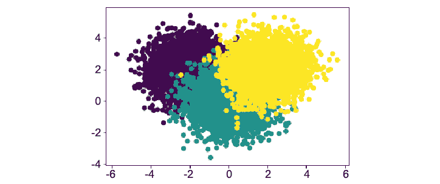

    图 3.28：机器学习问题散点图

    模型选择过程中最常见的策略是首先将数据拆分为培训数据集和测试/验证数据集。训练数据集用于训练我们想要使用的机器学习模型，测试数据集用于验证这些模型的性能。

6.  The `train_test_split()` function from the `sklearn.model_selection` package facilitates the process of splitting our dataset into the training and test datasets. In the next code cell, enter the following code:

    ```py
    X_train, X_test, \
    y_train, y_test = train_test_split(X, y, shuffle=True, \
                                       random_state=0)
    ```

    如我们所见，此函数返回一个由四个对象组成的元组，我们将其分配给前面的四个变量：`X_train`包含训练数据集独立特征中的数据，而`X_test`包含测试数据集相同特征的数据，等价物为`y_train`和`y_test`。

7.  We can inspect how the split was done by considering the shape of our training dataset:

    ```py
    X_train.shape
    (7500, 2)
    ```

    默认情况下，训练数据集是从 75%的输入数据中随机选择的，测试数据集是剩余的数据，随机洗牌。前面的输出演示了这一点，其中我们的培训数据集中有 7500 个条目，来自原始数据，其中有 10000 个条目。

8.  在下一个代码单元中，我们将初始化导入的机器学习模型，而不指定任何超参数（稍后将对此进行详细说明）：

    ```py
    models = [KNeighborsClassifier(), SVC(),\
              GradientBoostingClassifier()]
    ```

9.  Next, we will loop through each of them, train them on our training dataset, and finally compute their accuracy on the test dataset using the `accuracy_score` function, which compares the values stored in `y_test` and the predictions generated by our models in `y_pred`:

    ```py
    for model in models:
        model.fit(X_train, y_train)
        y_pred = model.predict(X_test)

        print(f'{type(model).__name__}: {accuracy_score(y_pred, y_test)}')
    ```

    再次，使用`fit()`方法对`X_train`和`y_train`上的每个模型进行训练，而`predict()`则用于让模型对`X_test`进行预测。这将产生与以下类似的输出：

    ```py
    KNeighborsClassifier: 0.8792
    SVC: 0.8956
    GradientBoostingClassifier: 0.8876
    ```

从这里，我们可以看到`SVC`模型表现最好，这在某种程度上是意料之中的，因为它是所用三种模型中最复杂的一种。在实际的模型选择过程中，您可能会合并更多任务，例如交叉验证，以确保最终选择的模型是最佳选项。

我们的模型选择工作到此结束。通过练习，我们已经熟悉了使用 scikit 学习模型的一般过程。正如我们所看到的，fit/predict API 在库中实现的所有模型中都是一致的，这为 Python 程序员带来了高度的灵活性和便利性。

本练习还总结了推断统计的一般主题。

笔记

要访问此特定部分的源代码，请参考[https://packt.live/2BowiBI](https://packt.live/2BowiBI) 。

您也可以在[在线运行此示例 https://packt.live/3dQdZ5h](https://packt.live/3dQdZ5h) 。

在本章的下一个也是最后一个部分中，我们将迭代一些可以支持各种特定统计过程的其他库。

# Python 的其他统计工具

在上一章中，我们考虑了 Python 的三个主要库，它们构成了通用数据科学/科学计算管道的大部分：用于多维矩阵计算的 NumPy、用于表格数据操作的 pandas 和用于数据可视化的 Matplotlib。

在此过程中，我们还讨论了一些支持工具，它们可以很好地补充这三个库；它们是用于实现复杂可视化的 seaborn，用于统计和科学计算能力的 SciPy，以及用于高级数据分析需求的 scikit learn。

不用说，还有其他工具和库，尽管它们不适合我们的讨论，但它们为科学计算中的特定任务提供了独特而强大的功能。在本节中，我们将简要地考虑其中的一些内容，以便能够全面了解 Python 工具对于哪些特定任务的可用性。

这些工具包括：

*   **statsmodels**: This library was originally part of SciPy's overarching ecosystem but ultimately split off into its own project. The library offers a wide range of statistical tests and analysis techniques, models, and plotting functionalities, all grouped into one comprehensive tool with a consistent API, including time-series analysis capabilities, which its predecessor SciPy somewhat lacks.

    statsmodels 的主要网站可在此处找到：[http://www.statsmodels.org/stable/index.html](http://www.statsmodels.org/stable/index.html) 。

*   **PyMC3**: In a subfield of statistics called Bayesian statistics, there are many unique concepts and procedures that can offer powerful capabilities in modeling and making predictions that are not well supported by the libraries that we have considered.

    在 PyMC3 中，实现了贝叶斯统计建模和概率编程技术，使其具有绘图、测试和诊断功能，从而成为最流行的概率编程工具，不仅适用于 Python 用户，而且适用于所有科学计算工程师。

    有关如何开始使用 PyMC3 的更多信息，请访问其主页[https://docs.pymc.io/](https://docs.pymc.io/) 。

*   **SymPy**: Moving away from statistics and machine learning, if you are looking for a Python library that supports symbolic mathematics, SymPy is most likely your best bet. The library covers a wide range of core mathematical subfields such as algebra, calculus, discrete math, geometry, and physics-related applications. SymPy is also known to have quite a simple API and extensible source code, making it a popular choice for users looking for a symbolic math library in Python.

    您可以从 SymPy 的网站[了解更多有关 SymPy 的信息 https://www.sympy.org/en/index.html](https://www.sympy.org/en/index.html) 。

*   **Bokeh**: Our last entry on this list is a visualization library. Unlike Matplotlib or seaborn, Bokeh is a visualization tool specifically designed for interactivity and web browsing. Bokeh is typically the go-to tool for visualization engineers who need to process a large amount of data in Python but would like to generate interactive reports/dashboards as web applications.

    要阅读官方文档并查看一些示例库，您可以访问主网站[https://docs.bokeh.org/en/latest/index.html](https://docs.bokeh.org/en/latest/index.html) 。

这些库为各自的统计和数学子领域提供了强大的支持。同样，也可以找到其他适合您特定需求的工具。使用像 Python 这样流行的编程语言的最大优势之一是，许多开发人员每天都在为各种目的和需要开发新的工具和库。到目前为止，我们讨论的库将帮助我们完成统计计算和建模中的大部分基本任务，并且从那里我们可以结合其他更先进的工具来进一步扩展我们的项目。

在结束本章之前，我们将通过一项活动来强化我们迄今为止所学的一些重要概念。

## 活动 3.01：重新访问社区和犯罪数据集

在这一活动中，我们将再次考虑在前一章中分析的社区和犯罪数据。这一次，我们将应用本章学到的概念，从该数据集中获得更多的见解：

1.  在存储数据集的同一目录中，创建一个新的 Jupyter 笔记本。或者，您可以在[再次下载数据集 https://packt.live/2CWXPdD](https://packt.live/2CWXPdD) 。
2.  在第一个代码单元中，导入我们将使用的库：`numpy`、`pandas`、`matplotlib`和`seaborn`。
3.  正如我们在上一章中所做的那样，读入数据集并打印出它的前五行。
4.  用 NumPy 中的`nan`对象替换每个`'?'`字符。
5.  重点关注以下列：`'population'`（包括给定区域的总人口数）、`'agePct12t21'`、`'agePct12t29'`、`'agePct16t24'`和`'agePct65up'`，每个列都包括该人口中不同年龄组的百分比。
6.  编写代码，在数据集中创建包含这些年龄组的实际人数的新列。这些数据应为`'population'`列中的数据与各年龄百分比列的乘积。
7.  使用大熊猫的`groupby()`方法计算每个州不同年龄组的总人数。
8.  在我们的数据集上调用`describe()`方法来打印其各种描述性统计数据。
9.  关注`'burglPerPop'`、`'larcPerPop'`、`'autoTheftPerPop'`、`'arsonsPerPop'`和`'nonViolPerPop'`列，每个列描述了每 10 万人所犯罪行（入室盗窃、盗窃、汽车盗窃、纵火和非暴力犯罪）的数量。
10.  在一次可视化中显示所有箱线图的同时，在箱线图中显示这些列中数据的分布。根据情节，确定五种犯罪中哪一种最常见，哪一种最不常见。
11.  关注`'PctPopUnderPov'`、`'PctLess9thGrade'`、`'PctUnemployed'`、`'ViolentCrimesPerPop'`和`'nonViolPerPop'`列。前三项描述了属于相应类别的特定地区的人口百分比（生活在贫困线以下、25 岁以上、受教育程度低于九年级、劳动力中但失业的人口百分比）。最后两个数字是每 10 万人中暴力和非暴力犯罪的数量。
12.  Compute the appropriate statistical object and visualize it accordingly to answer this question. Identify the pair of columns that correlate with each other the most.

    笔记

    此活动的解决方案可在第 659 页找到。

# 总结

本章形式化了统计学和机器学习中的各种介绍性概念，包括不同类型的数据（分类、数字和顺序）和不同的统计子类别（描述性统计和推断统计）。在我们的讨论中，我们还介绍了相关的 Python 库和工具，这些库和工具可以帮助简化与所涵盖主题对应的过程。最后，我们简要介绍了一些其他 Python 库，如 statsmodels、PyMC3 和 Bokeh，它们可以在统计和数据分析中提供更复杂和更高级的用途。

在下一章中，我们将开始本书的一个新的部分，看看数学重的主题，如序列、向量、复数和矩阵。具体来说，在下一章中，我们将深入研究函数和代数方程。

PSQ66

WRC42