# 7。使用 Python 进行基本统计

概述

在本章中，我们将学习如何使用主要的描述性统计指标，以及如何生成和理解探索性数据分析中使用的主要可视化。

本章结束时，您将能够加载并准备用于基本统计分析的数据集，计算并使用主要描述性统计指标，使用描述性统计了解数字和分类变量，并使用可视化研究变量之间的关系。

# 导言

Python 及其分析库（如 pandas 和 Matplotlib）使对许多类型的数据集执行简单和复杂的统计计算变得非常容易。本章介绍了任何统计分析的第一步：定义和理解问题，加载和准备数据集，然后分别理解变量并探索它们之间的关系。

本章由三部分组成：在第一部分中，我们将介绍本章中使用的数据集以及一个假设（但非常现实）的业务问题。然后，我们加载数据集并执行许多常见的数据准备任务，包括更改变量类型和过滤有用的观察值。数据集准备就绪后，第二部分简要介绍了描述性统计的主要指标，然后将这些知识立即应用于我们正在使用的数据集。作为本文的一部分，我们将提供一个如何将描述性统计信息转化为知识的示例。第三部分介绍学习者进行**探索性数据分析**（**EDA**的实践。从一些问题和基本计算开始，我们用一些最有用的统计可视化来补充我们对基本统计的理解，如直方图、箱线图和散点图。

本章将采用不同于其他主题处理中传统的方法；我们将更加实用，并将其用作数据分析的工具，这意味着将数据转化为信息，将信息转化为知识，而不仅仅是介绍统计概念。

# 数据准备

所有应用的统计数据都从一个数据集和一个要解决的问题开始。在现实世界中，我们从不在真空中进行统计分析；总是有一个商业问题需要解决，一个需要定量理解的话题，或者一个需要提出的科学问题。了解问题始终是任何统计分析的第一步。第二步是收集和准备数据。数据收集不是本书的主题，因此我们将直接进入数据准备阶段。因此，在进行一些统计计算之前，我们需要确保了解我们的业务问题，并准备好数据集。

## 介绍数据集

在本小节中，我们将介绍本章中使用的数据集，并执行一些基本的数据准备任务。当我们定义业务问题时，了解数据集将为您提供更多的上下文。

我们将使用**策略游戏**数据集，该数据集包含苹果应用商店（可在[上获得）中关于策略游戏的真实信息 https://www.kaggle.com/tristan581/17k-apple-app-store-strategy-games](https://www.kaggle.com/tristan581/17k-apple-app-store-strategy-games) ，根据以下许可证：归属 4.0 国际（抄送 4.0））。它收集于 2019 年 8 月，包含约 17000 场战略游戏的 18 个专栏。文件包含的列的说明如下所示：

*   **URL**：游戏的 URL
*   **ID**：分配的 ID
*   **名称**：游戏名称
*   **副标题**：名称下的次要文本
*   **图标 URL**：512 像素 x 512 像素 JPG
*   **平均用户评分**：四舍五入至最接近的 0.5
*   **用户评分计数**：国际评分数；null 表示低于 5
*   **价格**：以美元计价
*   **应用内购买**：可用应用内购买的价格
*   **说明**：应用说明
*   **开发者**：应用开发者
*   **年龄等级**：4+、9+、12+或 17+
*   **语言**：ISO2A 语言代码
*   **大小**：应用的大小，以字节为单位
*   **主要体裁**：主要体裁
*   **体裁**：应用的体裁
*   **原发布日期**：发布时间
*   **Current Version Release Date**: When it was last updated

    笔记

    您还可以从 GitHub 存储库下载数据集，网址为[https://packt.live/2O1hv2B](https://packt.live/2O1hv2B) 。

## 介绍业务问题

我们将使用这个数据集和一个虚构的业务问题来学习如何将数据转化为信息，将信息转化为有用的建议。想象一下，这是一个美好的周一早晨，你正在享受一杯优质危地马拉咖啡。作为优秀分析团队的一员，您将收到以下消息：

*您所在的游戏开发公司的首席执行官提出了一项计划，以加强该公司在游戏市场的地位。从他的行业知识和其他商业报告中，他知道吸引新客户的一个非常有效的方法是在手机游戏领域建立良好的声誉。鉴于这一事实，他有以下计划：为 iOS 平台开发一款战略游戏，这将获得大量积极关注，进而为公司带来大量新客户。他确信，只有当游戏获得用户的好评时，他的计划才会奏效。由于他是手机游戏领域的新手，他请求您帮助回答以下问题：哪些类型的策略游戏具有较高的用户评分？*

现在，您是这个业务问题的所有者。在你弄脏你的数据之前，你必须确保你理解这个问题，并且至少在原则上这个问题是可以用你拥有的数据集解决的（部分或完全）。我们将使用前面介绍的数据集进行一些统计分析，并得出一些建议，说明是什么让战略游戏在游戏行业的这个细分市场中获得了良好的评级。

## 准备数据集

让我们从加载数据集和我们将在本章中使用的库开始。首先，让我们加载我们现在将使用的库，它们是 NumPy、Seaborn、pandas 和 Matplotlib：

```py
import pandas as pd
import numpy as np
import matplotlib.pyplot as plt
import seaborn as sns
# line to allow the plots to be shown in the Jupyter Notebook
%matplotlib inline
```

现在让我们阅读数据集。这可以通过使用一行代码来完成，这要感谢 pandas 的强大功能。该数据集包含 17007 个战略游戏的 18 列。此行将读取 CSV 文件并创建一个数据帧，以便使用：

```py
games = pd.read_csv('data/appstore_games.csv')
```

检查我们是否从文件中加载了正确/预期的行数和列数始终是一个好主意：

```py
games.shape
```

这为我们提供了以下输出：

```py
(17007, 18)
```

很好，现在我们知道已经从文件中读取了所有行和列。

现在让我们快速查看一下我们新创建的数据框的前五行，看看它是什么样子的：

```py
games.head()
```

这将提供以下输出：

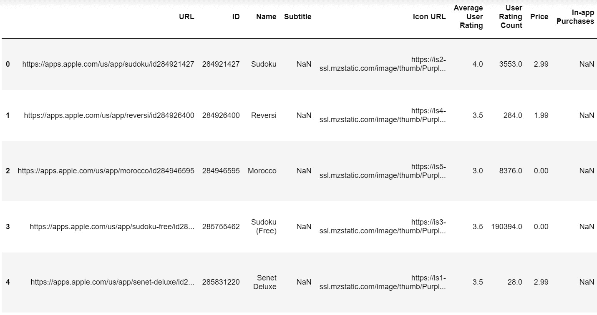

图 7.1:DataFrame 的前五行和九列

这里有几点需要注意：

*   正确读取了列名（URL、名称、ID 等）；但是，如果我们想简单地键入，文件中的名称就不那么友好，因为它们包含大小写字母，有些包含单词之间的空格。
*   数据帧是使用自动生成的整数索引加载的。我们可以通过查看最左边的列和以粗体显示的整数（`0`、`1`、`2`…）看到这一点。

让我们分别讨论这两个问题。

首先，为数据帧列的名称使用一种标准格式是很有用的。这当然是个人的选择，没有严格的指导方针。但是，我建议采用以下格式：

*   小写名称
*   无空格–使用下划线分隔单词，而不是空格

通过使用此格式，您可以通过实现以下功能来加快键入速度：

*   避免打字时出现混淆（“此字母是大写还是小写？”）。
*   利用您喜爱的 IDE 和/或 Jupyter 笔记本中的自动完成功能（使用 Jupyter 中的*选项卡*键）。

要进行更改，让我们创建一个字典（使用 dictionary comprehension Python 功能），其中包含原始列名和转换后的版本：

```py
original_colums_dict = {x: x.lower().replace(' ','_') \
                        for x in games.columns}
original_colums_dict 
```

生成的字典如下所示：

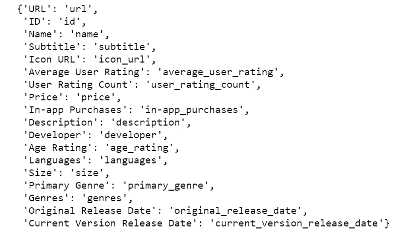

图 7.2：具有原始和转换列名的词典

现在我们可以使用此字典使用`rename`函数更改列名：

```py
games.rename(columns = original_colums_dict,\
             inplace = True)
```

第二个问题与数据帧的索引有关。始终建议使用有意义的数据帧索引，因为它将使数据处理更容易，特别是与其他表合并的问题。在本例中，我们有一个列，其中包含数据集每一行的唯一 ID（`id`），因此让我们使用此列作为数据帧的索引：

```py
games.set_index(keys = 'id', inplace = True)
```

现在，我们可以再次使用以下代码行查看修改后的数据帧的第一行和第一列：

```py
games.head()
```

结果如下所示：

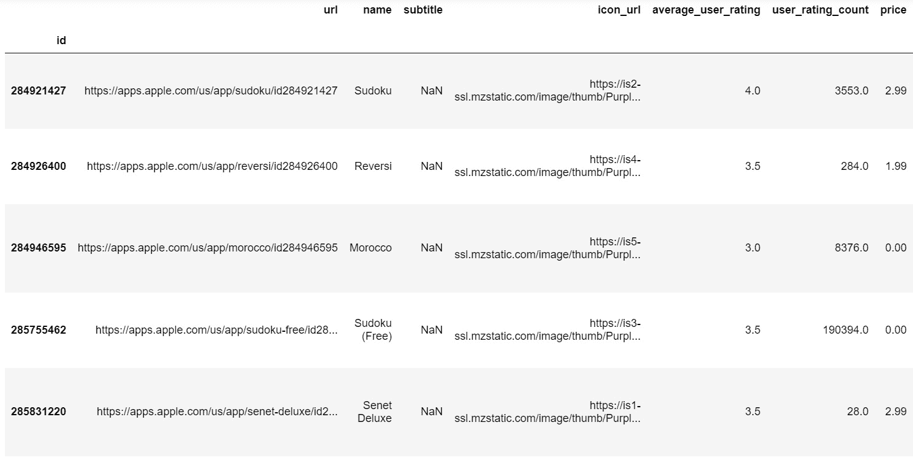

图 7.3：修改数据框的第一行和第一列

现在看起来好多了；然而，它仍然需要更多的准备。

我们知道这个数据集中有 18 列；然而，我们可以预期，有些专栏不会提供有用的信息。我们如何知道一个专栏是否能提供有用的信息？一切都取决于背景：记住，在这种情况下，我们的目标是了解是什么让战略游戏获得了很好的评级。在这种情况下，可以安全地假设游戏的 URL 和游戏图标的 URL 不会提供有关此问题的任何有用信息。因此，没有理由保留这些列。要删除列，请运行以下代码：

```py
games.drop(columns = ['url', 'icon_url'], inplace = True)
```

另一个重要的处理步骤是确保数据框中的列类型正确，这将使其他一切变得更容易：计算、可视化和创建新特性。我们可以使用`info()`方法检查我们列的类型以及其他有用信息：

```py
games.info()
```

这将提供以下输出：


图 7.4:info 方法的输出

如您所见，概念上为数字变量和分类变量的列似乎具有正确的类型：`float64`和`object`。然而，我们有两列提到日期，它们是`object`类型。让我们使用以下代码将这两列转换为`datetime`类型：

```py
games['original_release_date'] = pd.to_datetime\
                                 (games['original_release_date'])
games['current_version_release_date'] =\
pd.to_datetime(games['current_version_release_date'])
```

在运行前几行代码后，我们可以使用`info`方法再次检查列类型：

```py
games.info()
```

这将提供以下输出：

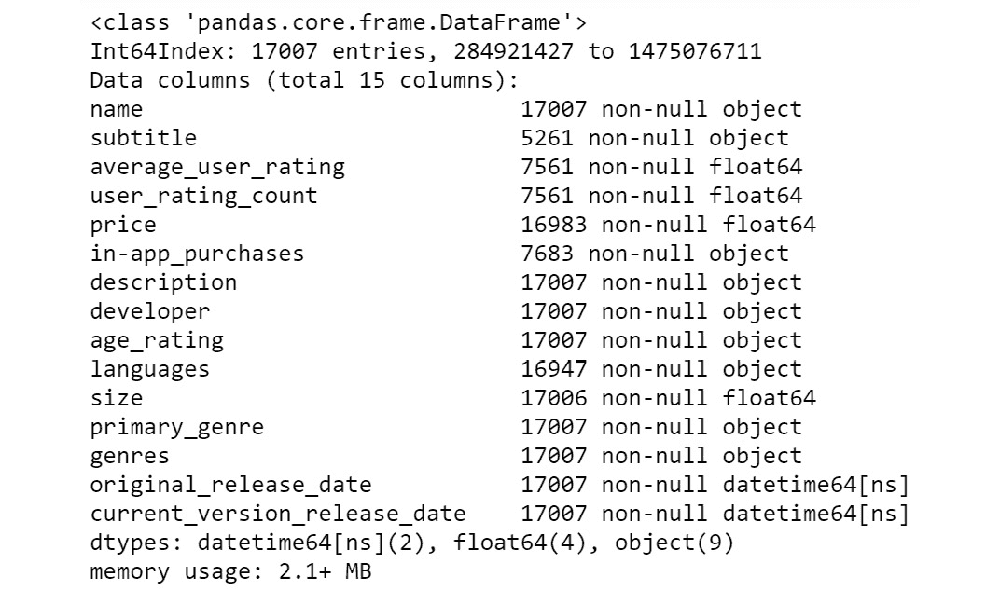

图 7.5：更改两个日期列类型后 info 方法的输出

请注意，包含日期（`original_release_date`和`current_version_release_date`的两列具有正确的`datetime64`类型。

我们的数据集现在似乎已经准备好让我们开始分析一些数据。术语*的用法似乎*是因为在分析数据集时，我们可能会发现需要进行一些额外的准备/清理。

您可以再次使用`head()`方法查看已处理的数据帧：

```py
games.head()
```

输出如下所示：


图 7.6：已处理数据帧的第一行和第一列

在使用真实数据集时，几乎可以肯定的是，您会在某些列中找到缺少的值，因此最好检查数据集的每列中有多少缺少的值。我们可以使用以下代码行执行此操作：

```py
games.isnull().sum()
```

前一行代码显示了以下输出：

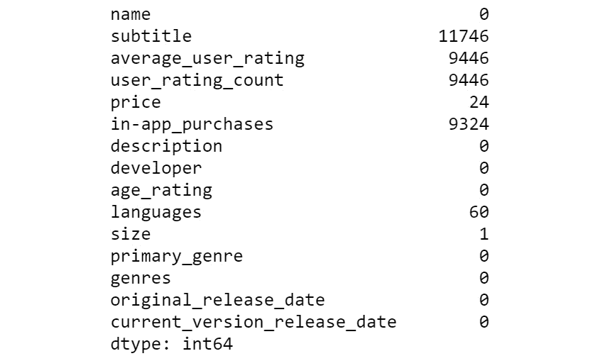

图 7.7：按列列出的空值数

我们看到，`subtitle`列中有 11000 多个缺失值，尽管对于我们在本章中进行的分析，该列可能并不重要（也许我们应该删除它？您认为如何？）。另一方面，`average_user_rating`和`user_rating_count`有相同数量的缺失值：9446。这表明这些缺失的值可能是相关的。让我们使用`np.array_equal`NumPy 函数来验证这个预感。此函数用于评估两个数组在元素方面是否相等，如果是，则返回`True`。我们将使用此函数检查这些列在相同的对应位置是否缺少值。通过这样做，我们将确认丢失的值发生在相同的行上。以下代码行完成了我们刚才解释的内容：

```py
np.array_equal(games['average_user_rating'].isnull(),\
               games['user_rating_count'].isnull())
```

这将给出结果`True`。

从结果中，我们可以得出结论，只要其中一列中缺少值，另一列也会显示缺少的值。因此，我们的猜测是正确的：如果我们没有`user_rating_count`，我们也没有`average_user_rating`（如果是这样，那么我们必须分别处理这两列中缺失的值）。回到专栏的描述（介绍数据集的*部分）中，我们发现“null 表示低于 5”，因此如果一个游戏的评分人数少于 5 人，那么我们根本就没有评分。*

继续探索缺失的价值，对于应用内购买栏，我们有 9324，一个相对较高的价值。最后，对于价格、语言和大小，我们分别缺少 24、60 和 1 个值，考虑到数据的维度，这对于我们来说并不是什么大问题。

现在我们知道数据集的某些列中缺少值，有很多方法可以处理它们。*插补*基本上是指用合理值替换缺失值。有非常复杂的方法来实现这一点，这超出了本书的范围。我们将使用非常简单的方法来处理一些缺失的值；但是，我们将等到准备工作完成后再决定如何处理这些缺失的值。插补通常是数据准备过程中的最后一步。

现在是我们决定哪些观察（游戏）与我们的分析相关的时候了；换句话说，我们必须回答这样一个问题：我们应该保留我们所有的比赛吗？

从我们的分析背景来看，有一件事是明确的：没有评级的游戏对我们的目标毫无用处，因为我们想了解评级。因此，我们应该将其排除在我们的分析之外。以下代码行将仅保留`average_user_rating`不为空的行：

```py
games = games.loc[games['average_user_rating'].notnull()]
```

请记住，`average_user_rating`中的空数是`9446`，因此最后一行代码将删除这些行。

还有一个事实我们应该注意：对游戏进行评分的人数。从数据集描述中，我们知道至少有五个用户必须对游戏进行评级，才能对游戏进行评级。出于我们将在*第 9 章*、*中间统计与 Python*中解释的原因，我们将只保留至少有 30 个用户评级的游戏（基本上，`30`大小，出于技术原因，保证平均评级可用于分析）。以下代码行将执行我们刚才描述的操作：

```py
games = games.loc[games['user_rating_count'] >= 30]
```

让我们看看使用`shape`方法我们还剩下多少观察结果：

```py
games.shape
```

结果如下：

```py
(4311, 15)
```

现在，再次检查每列中缺少多少值是一个好主意。我们将使用之前用于此任务的相同代码：

```py
games.isnull().sum()
```

这向我们显示了以下输出：

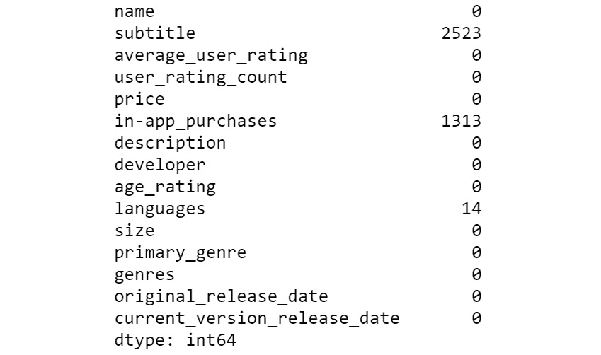

图 7.8：按列列出的空值数

现在我们看到，从可能相关的列中，只有两个缺少值：`in-app_purchases`（`1,313`）和`languages`（`14`）。

笔记

所有练习和相关测试脚本的简要说明：如果您使用**命令行界面**（**CLI**）（如 Windows 的命令提示符或 Mac 的终端）来运行测试脚本，它将抛出一个错误`Implement enable_gui in a subclass`，这与笔记本中使用的一些命令有关（如`%matplotlib inline`）. 因此，如果您想运行测试脚本，那么请使用 ipythonshell。最好在 Jupyter 笔记本上运行练习代码。

## 练习 7.01：使用字符串列生成数字列

在本练习中，我们将在数据框中创建一个新的数字变量，该变量将包含有关游戏可用语言数量的信息。这将是一个如何将文本数据转换为数字信息的示例。

1.  创建到目前为止我们一直在使用的数据帧的副本，并将其命名为`games2`，这样我们就可以使用另一个对象：

    ```py
    games2 = games.copy()
    ```

2.  Take a look at the first five values of the `languages` column using the `head` method:

    ```py
    games2['languages'].head()
    ```

    结果如下所示：

    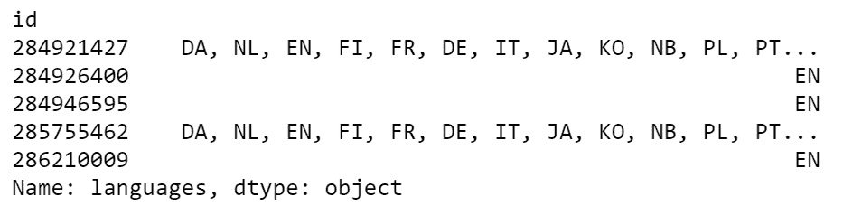

    图 7.9：语言列的前五个值

3.  如您所见，它由一系列以逗号分隔的语言缩写组成。使用`fillna()`方法将该列中缺失的值替换为`EN`，这是最常见的值：

    ```py
    games2['languages'] = games2['languages'].fillna('EN')
    ```

4.  使用`str`访问器方法中的`split`（其工作方式与字符串的`split`方法相同）方法获取不同语言的列表，并将结果序列保存在名为`list_of_languages`：

    ```py
    list_of_languages = games2['languages'].str.split(',')
    ```

    的对象中
5.  最后，让我们在 DataFrame 中创建一个名为`n_languages`的列，其中包含每个结果列表中有多少元素的计数。为此，使用带有返回列表长度的`apply`方法的`lambda`函数：

    ```py
    games2['n_languages'] = list_of_languages.apply(lambda x: len(x))
    ```

6.  新列的前 10 个元素应如下所示：

    ```py
    id
    284921427    17
    284926400     1
    284946595     1
    285755462    17
    286210009     1
    286313771     1
    286363959     1
    286566987     1
    286682679     1
    288096268     1
    Name: n_languages, dtype: int64
    ```

在本练习中，我们使用了一个文本列，并使用 pandas 的`str.split`方法和 lambda 函数从基于文本的列生成了一个数字列。

笔记

要访问此特定部分的源代码，请参考[https://packt.live/31xEnyy](https://packt.live/31xEnyy) 。

您也可以在[在线运行此示例 https://packt.live/38lpuk2](https://packt.live/38lpuk2) 。

在本节中，我们讨论了定义业务问题的重要性，并介绍了我们将在本章其余部分中使用的数据集。在我们完成所有工作之后，数据集已经到了我们可以开始理解这些值的时候了。为此，我们将使用描述性统计，这是下一节的主题。

# 计算和使用描述性统计

描述性统计是我们用来总结一组测量（数据）信息的一组方法，这有助于我们理解它。在本节中，我们将首先解释描述性统计的必要性。之后，我们将介绍最常见的描述性统计指标，包括均值、中位数和标准差。首先，我们将使用一组简单的度量从概念上理解它们，然后我们将把我们所学到的关于它们的知识应用到我们在上一节中准备的数据集中。

## 描述性统计的必要性

为什么我们需要描述性统计？下面是一个例子，它将告诉你为什么我们需要这些类型的分析工具：我们的大脑非常擅长于各种各样的任务，比如识别人脸上表达的情感。试着注意你的大脑花了多少精力去阅读下面这张脸的情绪：


图 7.10：面部表情

答：实际上什么都没有，当然，你可以对图片中发生的事情说些有意义的话。

相比之下，现在让我们给大脑一个不同的任务：我们将使用上一节中的游戏数据集，从“平均用户评分”列中随机选择 300 个观察结果，然后打印出来。下面几行代码就是这样做的：

```py
random_ratings = games['average_user_rating'].sample(n=300)
for r in random_ratings:
    print(r, end=', ')
```

输出如下：

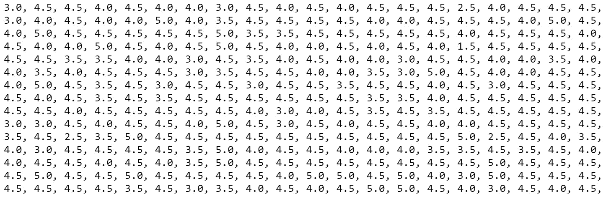

图 7.11：300 个平均用户评级的随机样本

查看输出，尝试分析它，并回答以下问题：

*   说些有意义的话要花多少精力？
*   仅仅通过看数字，你能对平均评分说些什么？

您对这些问题的回答很可能是：

*   说些有意义的话要花多少精力？*“我不得不花一些时间看这些数字。”*
*   仅仅通过看数字，你能对平均评分说些什么？*“不多，数字以.0 或.5 结尾。”*

只需看*图 7.10*，我们就可以通过说*女人笑*来自动*总结*并理解包含在数千像素中的信息。然而，在*图 7.11*的情况下，我们无法自动理解有关它们的一些信息。这就是为什么我们需要描述性统计：它允许我们通过执行相对简单的计算来总结和理解数字信息。

## 统计概念的简单复习

如果你正在读这本书，很可能你已经学习或使用了一些最常见的描述性统计，而我很难对数百本统计书籍中提出的概念给出一个原始的定义。因此，您可以查看以下页面，作为有关描述性统计度量的最重要概念的复习。

在本小节中，为了使概念解释更容易理解，我们将从策略游戏数据集中转移一点，我们将使用一组 24 个观察值。假设我们有 24 个人的身高（米）。以下是我们的原始观察结果：

```py
    1.68, 1.83, 1.75, 1.80, 1.88, 1.80, 1.89, 1.84,
    1.90, 1.65, 1.67, 1.62, 1.81, 1.73, 1.84, 1.78,
    1.76, 1.97, 1.81, 1.75, 1.65, 1.87, 1.85, 1.64.
```

我们将使用这一小部分观察数据对最重要的描述性统计数据进行概念性介绍。为了简化计算，让我们创建一个包含以下值的熊猫系列：

```py
mens_heights = pd.Series\
               ([1.68, 1.83, 1.75, 1.8, 1.88, 1.8, 1.89, 1.84,\
                 1.9, 1.65, 1.67,1.62, 1.81, 1.73, 1.84, 1.78,\
                 1.76, 1.97, 1.81, 1.75, 1.65, 1.87, 1.85, 1.64])
```

现在我们准备好回顾最常用的描述性统计。

**算术平均值**：也称为**平均值**，这是分布的*中心或一组数字的中心的度量。给定一组观测值，通过将观测值相加并除以观测值的数量来计算平均值。公式如下，其中*x bar**x̄*为平均值，*n*为观测次数：*


图 7.12：算术平均值公式

当大多数值聚集在一个*中心*周围时，平均值尤其有用且信息丰富，因为在这种情况下，平均值将接近该中心，因此将接近多个值，使其成为一组观测值的*代表性*数。在实际数据中，您将遇到的许多（可能是大多数）数值变量的值都会聚集在平均值周围，因此平均值通常是一组测量值的*典型*值的良好指标。

让我们使用内置的 pandas 方法计算一组男性身高的平均值：

```py
mens_heights.mean()
```

结果如下：

```py
1.7820833
```

这个数字告诉我们 1.78 米是一个代表 24 人身高的数值。经过计算，我们知道一个典型的男人（从我们获得样本的人群中）的身高大约为`1.78`米。

需要注意的是，平均值会受到极值的影响。在分析极值可能比最常见值大几个数量级的变量时，这尤其麻烦。

最后，值得一提的是，算术平均值通常是大多数人在说*平均值*这个词时想到的，尽管还有其他平均值，如中位数，我们将在后面定义。

**标准偏差**：这是数据扩散的度量。它测量一组测量值中的观测值的不同程度或*分散程度*。数学公式基于算术平均值，如下所示，供您参考：


图 7.13：标准偏差公式

在上式中，*s*为标准偏差，*x bar*（*x̄*为平均值，*N*为观测次数。由于一个技术细节（超出了我们的范围），公式中有*N–1*而不仅仅是*N*作为分母，但让我们暂时假设分母中有*N*：如果你仔细观察公式，你会发现我们在平方根符号中的是*相对于平均值*的平方偏差的平均值。因此，标准偏差是一种算术平均值，表示观测值与其平均值之间的距离。平方根在公式中，因此得出的数字与原始测量值的单位相同。

让我们再次使用 pandas 的内置方法，计算一组男性身高测量值的标准偏差：

```py
mens_heights.std()
```

这将产生以下结果：

```py
0.0940850
```

我们的答案是`0.094`米，或 9.4 厘米。对这个数字的解释是，*平均*男性身高与平均身高相差 9.4 厘米（本例中为 1.78 米）。请注意，我们说的平均值为*，这意味着我们可以预计男性个体的身高与平均值之间的距离比 9.4 厘米更近或更远，但 9.4 是一个信息性数字，表明我们预计典型观察值与平均值之间的距离。*

 *为了更好地理解标准偏差的概念，将前面的计算与另一组假设的测量值进行对比将是有用的。假设我们有另外 24 名男性的身高，平均值相似：

```py
mens_heights_2 = pd.Series\
                 ([1.77, 1.75, 1.75, 1.75, 1.73, 1.75, 1.73, 1.75,\
                   1.74, 1.76, 1.75, 1.75, 1.74, 1.76, 1.75, 1.76,\
                   1.76, 1.76, 1.75, 1.73, 1.74, 1.76, 1.76, 1.76])
```

让我们计算平均值，看看这 24 名男性与我们第一组的平均值相比如何：

```py
mens_heights_2.mean()
```

结果如下：

```py
1.750416
```

这比第一组的平均值低 3 厘米左右。现在让我们计算第二组的标准偏差：

```py
mens_heights_2.std()
```

结果如下：

```py
0.01082
```

这仅仅是 1 厘米，这意味着第二组的高度要均匀得多。换句话说，第二组的高度比第一组的高度更接近（即，它们的分散性更小）。由于我们只有很少的观察结果，我们可以通过仔细观察第二组的测量结果来判断这一点：注意，所有测量值都在 1.73 和 1.77 之间，因此与第一组相比，可变性较小。

在极端情况下，如果所有观测值完全相同，即它们之间没有变化，则标准偏差为零。测量值越不同，标准偏差越大。

还有其他衡量数据传播的方法，但标准差可能是最重要的。你应该确保你知道如何解释它。

**四分位数**：四分位数是位置的*度量。它们表明，当观测值从最小值（最小值）到最大值（最大值）排序时，该值处于某个相对位置。第一、第二和第三四分位数通常表示为**Q1**、**Q2**和**Q3**：*

*   **Q1**：以 25%的观察值低于该值的方式分割数据。
*   **Q2**：也称为*中位数*，这是将一组数字分成两半的数字，表示 50%的观察值低于此值，其余 50%高于此值。中位数是另一种类型的平均值。
*   **Q3**：以 75%的观察值低于该值的方式分割数据。

再次使用我们的前 24 个高度，我们可以对它们进行排序，并将这个小数据集分成四个部分，每个部分由 6 个观测值组成。如下图所示：

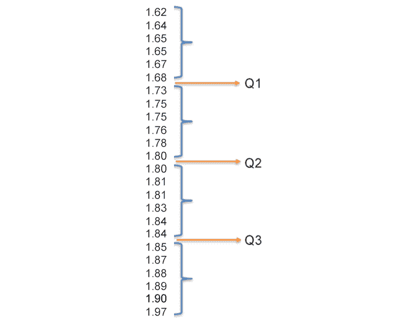

图 7.14：四分位数图解

在本例中，我们可以将数据集精确地分成*四部分。第一个由最小的六个观测值组成；第六个观测值为`1.68`，下一个观测值（属于第二个四分位数）为`1.73`。从技术上讲，任何介于`1.68`和`1.73`（`1.68`<`Q1`<`1.73`）之间的数字都可以称为*第一个四分位数*，例如`1.70`，因为*25%的观察值低于 1.70*的陈述是正确的。我们也可以选择`1.71`，因为*25%的观察值低于 1.71*的说法也是正确的。*

中位数（`Q2`将观测值分成两半。`1.80`是本例的第 12 次和第 13 次观察，因此中位数为`1.80`。（如果在第 12 次和第 13 次观察之间有一个数字，则中位数将是介于两者之间的数字。）

最后，对于第三个四分位数（`Q3`，我们从图中可以看到，`1.84`和`1.85`（比如 1.845）之间的任何数字都将是一个将底部 75%的观测值与顶部 25%的观测值分开的值。

注意，我没有给出任何计算四分位数的公式，那么四分位数是如何精确计算的呢？有一些方法我们在本书中不会讨论。确切的方法并不重要——真正重要的是你理解这个概念。现在让我们看看如何计算这些值。在下面的代码行中，我们将使用 pandas 的`quantile`方法（四分位数是**分位数**更一般概念的特例，一个接近**百分位数**的概念）：

```py
mens_heights.quantile([0.25, 0.5, 0.75])
```

结果如下：

```py
0.25    1.7175
0.50    1.8000
0.75    1.8425
dtype:  float64
```

我们必须向该方法传递一个列表，指出我们想要拆分的观察值的百分比（比例），分别为 25%、50%和 75%，分别对应于`Q1`、`Q2`和`Q3`。如您所见，第一个四分位数（`1.7175`是一个介于 1.68 和 1.73 之间的数字，中位数是`1.80`，第三个四分位数（`1.8425`是一个介于 1.84 和 1.85 之间的数字。

为了计算分位数，而不是四分位数，我们使用任何比例将观察值分为两部分：例如，假设我们将观察值分为底部 80%和顶部 20%，第 80 个百分位数相当于 0.8 个分位数，低于该分位数，将有 80%的观察值。同样，第 33 个百分位数将相当于 0.33 个分位数，低于该分位数的数值将有 33%的观察值。这解释了为什么我们必须将一个分位数列表传递给 pandas 中的分位数函数；例如，以下代码计算 0.33 和 0.8 分位数（对应于第 33 和 80 个百分位数）：

```py
mens_heights.quantile([0.33, 0.80])
```

结果是：

```py
0.33    1.750
0.80    1.858
dtype: float64
```

根据这一结果，我们 80%的观察值低于`1.858`。作为一个小练习，通过将其值与*图 7.14*中所示的范围进行比较，检查第 33 百分位是否是您所期望的。

描述性统计不仅仅是关于标准的指标集，如均值、中位数等。对数据进行的任何简单的描述性计算也被视为描述性统计，包括总和、比例、百分比等。例如，让我们计算 1.80 米以上男性的比例。有很多方法可以做到这一点，但我们将使用两步方法。首先，让我们运行以下代码行，如果观测满足条件，则给出值`True`，否则给出值`False`：

```py
mens_heights >= 1.8
```

结果如下所示：

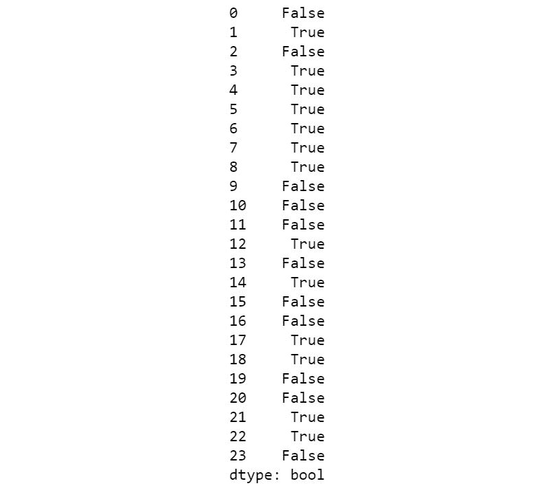

图 7.15：布尔级数

第二步是计算我们有多少`True`值。我们可以使用`sum`方法来实现这一点，它将`True`转换为 1s，`False`转换为 0s。然后我们可以用`shape`方法简单地除以我们系列中的观测值。整行代码如下所示：

```py
(mens_heights >= 1.8).sum()/mens_heights.shape[0]
```

结果如下：

```py
0.54166
```

或 24 个高度中 54%等于或大于 1.8 米。这个比例也被认为是描述性统计，因为这个数字也描述了我们的数据发生了什么。

前面的计算本可以更简洁地这样做：

```py
(mens_heights >= 1.8).mean()
```

作为一个小练习，您可以使用*图 7.12*中给出的平均值公式来推断`mean`方法为什么会给出布尔级数中真值的比例。

## 采用描述性统计

现在，我们已经更新了对描述性统计最重要度量的理解，现在是我们回到原始数据集并开始在提供给我们的业务问题的上下文中使用这些概念的时候了。

我们在前一节中回顾的描述性统计非常重要，熊猫`describe`方法（同时属于系列和数据框架）计算了所有这些数据。此外，我们将发现：

*   **计数**：列中非空值的个数
*   **最小值**：最小值
*   **最大值**：最大值

当`describe`方法用于数据帧时，它会获取所有具有数字类型的列，并计算它们的描述性统计：

```py
games.describe()
```

这将提供以下输出：

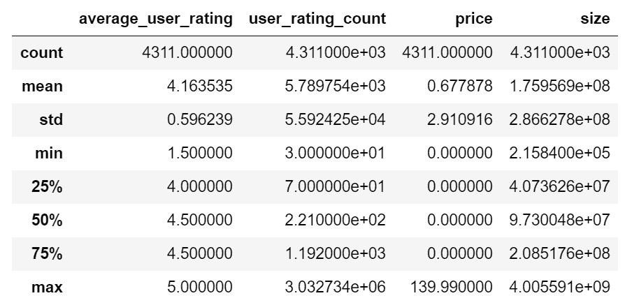

图 7.16：数据框数字列的描述性统计

在解释结果之前，您需要注意，默认情况下，pandas 以科学记数法显示输出：例如，`4.311000e+03`表示 4.311 x 103=4311。符号`"e+k"`表示（x10k）`"e-k"`表示（x10-k）。

为了将这些概念付诸实践，让我们阅读并解释来自`user_rating_count`变量的统计数据：

*   `count`：计数输出中的值为 4311。这是变量中非空观测值的数量。
*   `mean`：平均值的输出值为 5789.75。现在我们知道，在我们的数据集中，平均约有 5800 名用户对一款游戏进行评级。要提取有关这个数字的更多信息（以及它是否有用），让我们阅读其他统计数据。
*   `std`：标准偏差值为 5592.43。平均而言，在我们的数据集中，对一个游戏进行评分的用户数与 5600 名用户的平均值不同：想想看，平均评分数大约为 5800 名，与该数字的典型偏差大约为 5600 名。这告诉我们这个变量的可变性非常大（离散度很高），或者换句话说：我们有一些游戏只有很少的用户评级，我们有一些游戏有非常多的用户评级。
*   `min`、`25%`、`50%`、`75%`、`max`：这些数字告诉我们有关变量中观察值分布的重要信息。我们看到最小值是 30（请记住，我们明确选择了至少有 30 个评级的游戏），最大值超过 300 万！第一个四分位数告诉我们，数据集中 25%的游戏的用户评分低于 70；考虑到平均值为 5789.75，这是非常少的。中位数是 221 个用户评分，所以我们一半的游戏的评分低于 221！最后，第三个四分位数表明 75%的观测值低于 1192。

到目前为止，我们或多或少只阅读了结果，所以现在让我们进一步讨论如何将这些数据转换为有用的信息。

知道最大值（超过 300 万），我们可以确定该变量的*平均值*受到极端值的高度影响，即非常受欢迎的游戏。因此，对于这个变量来说，平均值可能不是很有用。也许谈论*一款游戏*的典型用户评级数字并没有什么意义，因为数据表明没有*典型*数字。事实上，我们知道超过 75%的观察结果的用户评级低于 1200。这意味着我们应该观察一些流行的游戏。让我们测试一下这个预感，并深入到收视率最高的游戏中，使用系列中的`sort_values`方法，按降序查看`user_rating_count`的前 10 个值：

```py
games['user_rating_count'].sort_values(ascending=False).head(10)
```

结果如下：

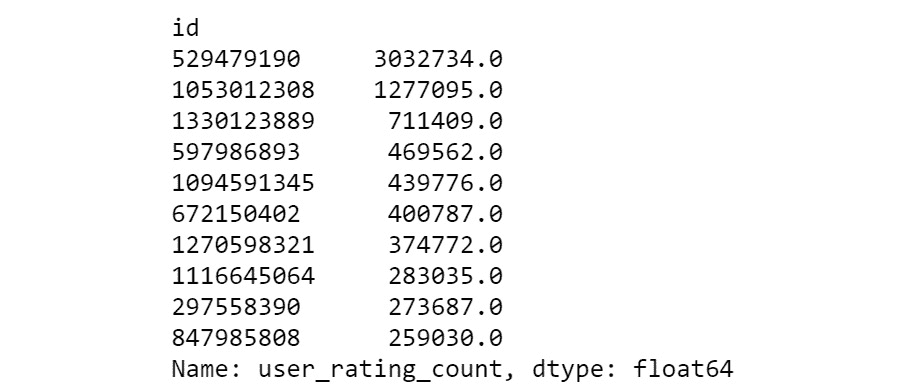

图 7.17：用户评级计数的前 10 个值

请注意，只有两款游戏的用户评分超过 100 万，这解释了我们从标准差（5592.43）观察到的高度可变性。让我们看看有多少游戏的用户评级至少为 100000。首先，我们将根据条件`>= 100000`过滤我们的列，然后我们将使用`sum`方法，该方法将计算满足该条件的值的数量：

```py
(games['user_rating_count'] >= 100000).sum()
```

结果如下：

```py
40
```

因此，只有 40 款游戏的评级超过 100000，这不到当前数据集（4311 款游戏）的 1%，也不到原始数据集（17007 款游戏）的 0.23%。

总而言之，一个游戏的用户评分是高度可变的。此外，我们样本中 25%的游戏用户评级低于 70，一半的游戏用户评级低于 221。此外，我们只有超过 10 万用户评级的`40`游戏，排名第一和第二的热门游戏分别超过 300 万和 120 万。

以下是我们向首席执行官展示信息的方式：

*来自用户评分计数的数据表明，一款战略游戏很难变得非常受欢迎，这是该游戏受欢迎程度的代表。数据告诉我们，只有不到 1%的战略游戏被认为非常受欢迎（就用户评级数量而言），而超过 75%的游戏的用户评级低于 1200，表明用户基数相对较低。请记住，在这个练习中，我们排除了那些用户评级低于 30 的游戏，因此策略游戏变得非常流行的几率远远低于 1%。*

上一段是如何从描述性统计中提取有价值信息的示例。请注意，我们不需要提及任何统计术语，如平均值、中位数或标准偏差，也不需要提及分位数、百分位数等术语。还请注意，没有使用平均值为 5789.75 的事实，因为这一事实对于我们试图传达的信息来说是不必要的。这是像首席执行官这样的人希望听到的信息，因为它清晰、信息丰富、可操作。

我们在结束本节时提出了一条非常重要的建议：不要错误地将描述性统计计算列表作为您的*分析*。另一个常见错误是包含一段包含分析的内容，如*平均值为 x*，*标准差为 y*，*最大值为 88*，基本上只是重新写入统计表中包含的信息。请记住，您的工作不仅是执行计算，还包括解释这些数字的含义及其对您试图解决的问题的影响。

## 练习 7.02：计算描述性统计

在本练习中，我们将使用描述性统计来计算平均用户评级变量的值。为此，我们将使用上一节讨论的描述性统计指标。此外，我们还将进行其他描述性计算，包括计数和比例。

1.  Calculate the descriptive statistics of the `average_user_rating` column:

    ```py
    games['average_user_rating'].describe()
    ```

    结果如下：

    ```py
    count    4311.000000
    mean        4.163535
    std         0.596239
    min         1.500000
    25%         4.000000
    50%         4.500000
    75%         4.500000
    max         5.000000
    Name: average_user_rating, dtype: float64
    ```

    如您所见，中位数和第三个四分位数的值相同，`4.5`，这意味着至少 25%的游戏的平均评分为`4.5`。

2.  Calculate the number and the proportion of games with a rating of exactly `4.5`. The `mean` method can be used for this goal:

    ```py
    ratings_of_4_5 = (games['average_user_rating'] == 4.5).sum()
    proportion_of_ratings_4_5 = (games['average_user_rating'] == 4.5)\
                                .mean()
    print(f'''The number of games with an average rating of 4.5 is \{ratings_of_4_5}, \
    which represents a proportion of {proportion_of_ratings_4_5:.3f} or \
    {100*proportion_of_ratings_4_5:.1f}%''')
    ```

    我们得到的输出如下：

    ```py
    The number of games with an average rating of 4.5 is 2062, which represents a proportion of 0.478 or 47.8%
    ```

3.  使用`unique`方法查看此变量的唯一值。你注意到了什么？

    ```py
    games['average_user_rating'].unique()
    ```

在本练习中，我们使用描述性统计来了解业务问题的另一个关键变量。

笔记

要访问此特定部分的源代码，请参考[https://packt.live/2VUWhI3](https://packt.live/2VUWhI3) 。

您也可以在[在线运行此示例 https://packt.live/2Zp0Z1u](https://packt.live/2Zp0Z1u) 。

以下是一些可能会浮现在脑海中的问题：

*   这个变量的平均值是用来理解这个变量的统计数据吗？您会选择它作为变量的*典型*值，还是选择另一个值？
*   基于标准偏差，你会认为这个变量具有高或低变异性吗？
*   如何在一个段落中总结您使用描述性统计获得的信息？

在本节中，我们了解了为什么需要并使用描述性统计。从我们介绍的第一个例子中，我们了解到我们的大脑没有能力自动理解数字信息。因此，如果我们想理解数值数据，就必须拥有这些类型的分析工具。

然后，我们简要介绍了一些最常用的描述性统计指标，包括均值、标准差和分位数。然后，我们立即使用策略游戏数据集应用这些知识，并计算数字变量的描述性统计数据。我们分析了用户评分计数变量的结果，并生成了一个摘要，其中包含非技术受众可以理解的相关信息。

最后，我们使用 pandas 内置的方法进行了所有计算，如`mean`、`std`、`describe`和`quantile`等。

现在我们已经了解了描述性统计的基础知识，我们可以扩展我们的统计工具包，并使用可视化补充我们的分析，我们将在下一节中介绍。

# 探索性数据分析

在本节中，我们将回顾我们在本章第一节中进行初步分析的业务问题，如下所示：

*您所在的游戏开发公司的首席执行官提出了一项计划，以加强该公司在游戏市场的地位。从他的行业知识和其他商业报告中，他知道吸引新客户的一个非常有效的方法是在手机游戏领域建立良好的声誉。鉴于这一事实，他有以下计划：为 iOS 平台开发一款战略游戏，这将获得大量积极关注，进而为公司带来大量新客户。他确信，只有当游戏获得用户的好评时，他的计划才会奏效。由于他是手机游戏领域的新手，他请求您帮助回答以下问题：哪些类型的策略游戏具有较高的用户评分？*

在本节中，我们将进行一些探索性的数据分析。您可以将本节视为上一节的延续，因为我们将继续使用描述性统计，除此之外，我们将使用最强大的分析工具之一：可视化来扩展我们的分析工具包。

**探索性数据分析**（**EDA**）领域（与任何其他与数据相关的领域一样）发展迅速，本节内容仅涵盖一些非常基本的概念和可视化。尽管如此，您很可能会在遇到的每个数据分析项目中使用本节中介绍的可视化。

## 什么是 EDA？

现在我们已经更新了基本的统计定义，我们已经准备好使用它们，并用可视化来补充我们从中获得的信息。简单来说，EDA 是通过将描述性统计与可视化相结合来分析数据的过程。进行 EDA 的原因和目标包括：

*   理解变量的分布
*   理解两个或多个变量之间的关系
*   检测使用数值计算无法找到的模式
*   发现数据中的异常或异常值
*   关于因果关系的假设
*   告知我们如何设计新变量（特征工程）
*   通知我们可能的形式推断统计测试

顾名思义，在进行 EDA 时，我们正在探索数据，因此没有配方或固定步骤可遵循，而且需要大量的创造力。然而，为流程提供一些结构也是非常重要的，否则我们可能会生成没有明确终点的绘图和计算。在数据分析中（就像在生活中一样），如果没有明确的目的，很容易迷失方向，因为有无数种方法可以查看任何常规大小的数据集。在开始执行 EDA 之前，我们需要定义我们试图找到的内容，这是理解业务问题的关键所在。

我建议分两步执行 EDA：

1.  **单变量步骤**：了解数据集中每个最重要的变量：分布、关键特征、极值等。
2.  **寻找关系**：考虑到商业/科学问题，*制定一份问题清单*，其答案将为您提供有关您试图解决的问题的有用信息，然后让这些问题指导 EDA 流程。

第一步通常被称为*单变量分析*，相对简单。对于第二步，我们使用*双变量*或*多变量*技术，因为我们需要寻找变量之间的关系。在下一节中，我们将进行单变量 EDA。

## 单变量 EDA

顾名思义，单变量 EDA 是关于分析单个变量的。在上一节中，我们看到了计算熊猫的主要描述性统计数据是多么容易。现在，我们将使用适当的可视化来补充从描述性统计中获得的信息。

在执行 EDA 之前，绝对有必要知道我们使用的是哪种类型的变量。作为复习，这里我们介绍了我们可能遇到的主要变量类型：

1.  **Numerical variables**: Those variables that can take numerical values:

    A.**连续**：这些变量可以在一定间隔内获取整个真实值范围，例如身高、体重和质量。

    B**离散**：这些变量只接受特定的、有限数量的值，通常是整数。例如，家庭中的子女数量或员工数量。

2.  **Categorical variables**: Those that can take only a specified number of categories as values:

    A.**序数**：类别具有某种自然顺序的变量。例如，变量`age group`可以有类别 20-29、30-39、40-49 和 50+。请注意，这些类别中有一个顺序：20-29 低于 40-49。

    B**标称**：这些是分类变量，不存在有序关系。例如，蓝色、绿色和红色是没有任何顺序的类别。

3.  **时间相关变量**：与日期或日期时间相关的变量。

让我们从识别数据集中的数字变量开始。正如我们之前在准备数据集时所做的那样，我们意识到在概念上为*数值的变量具有相应的 Python 数值数据类型。让我们在（修改后的）游戏数据框中使用`info`方法再次检查：*

```py
games.info()
```

输出如下：


图 7.18：数据集中的数值变量

我们可以看到，概念上是数字的列：`average_user_rating`、`user_rating_count`、`price`和`size`的数据类型为`float64`。

对于单个数值变量，最常用的可视化方法是直方图。让我们看看它的外观，然后描述它是如何构造的。为此，我们将使用`size`变量。由于此变量以字节为单位，因此在将其可视化之前，我们将其转换为兆字节：

```py
games['size'] = games['size']/1e6
```

现在我们可以使用熊猫的内置`hist`方法：

```py
games['size'].hist(bins=30, ec='black');
```

我们已经包括了两个附加参数：`bins`（大致）是我们看到的条数，`ec`（边颜色），是条边的颜色。得出的数字如下：


图 7.19：尺寸直方图

直方图是通过将变量的*范围*划分而成的，该范围定义为最大值减去最小值，并划分为大小相等的区间，称为 BIN。在这种情况下，最大值和最小值分别为 4005.6 和 0.2，因此范围约为 4005。由于我们指出 30 为料仓数量，每个料仓的尺寸约为 133~4005/30。因此，第一个箱子大致从最小值（约 0）到 133，第二个箱子从 133 到 266=133+133，依此类推。条形图的高度对应于特定箱子间隔内的观测数量。例如，我们看到第一个条稍微超过 2500 个观测值，这是第一个箱子中的观测值数量（从 0 到 133）。与四分位数一样，构建直方图的精确算法因使用的软件而异。Pandas 使用 Matplotlib 实现，因此如果您想了解详细信息，请查看 Matplotlib 的文档。

你应该习惯于看到直方图并试着阅读它们。例如，*大小*的直方图显示如下：

*   比赛的一个重要部分落在第一个箱子（最高的酒吧）里。
*   大多数值都低于 500 MB。
*   观察的次数（频率）随着变量的增加而减少：随着游戏规模的增加，我们观察到的游戏越来越少。
*   绘图的*x*轴一直延伸到大约 4000 MB；然而，我们甚至没有在那里看到一个条，原因是我们观察到的太少，而这个条太小，以至于无法区分它和零。这意味着我们必须至少有一个极值（一个非常大的游戏）。
*   1000MB 以上的游戏条高度很低，所以 1000MB 以上的游戏很少。

直方图是我们从描述性统计中获得的数字信息的完美补充：

```py
games['size'].describe()
```

输出如下：

```py
count        4311.000000
mean         175.956867
std          286.627800
min          0.215840
25%          40.736256
50%          97.300480
75%          208.517632
max          4005.591040
NameL size,  dtype: float64
```

中位数告诉我们，超过一半的游戏有小于 97.3 MB 的大小，最大大小的游戏是中位数的 40 倍以上，我们可以认为它是一个奇怪的异常值，或者比我们的变量中的大多数值要极端得多的观察。正如我们对用户评级计数所做的那样，我们可以通过按降序对系列进行排序，然后显示前 12 个值来检查最大的游戏：

```py
games['size'].sort_values(ascending=False).head(12)
```

输出如下：

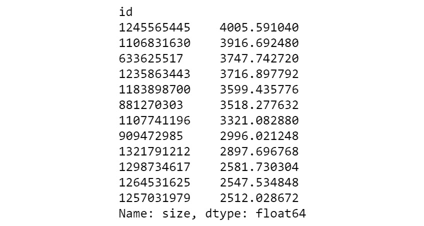

图 7.20：尺寸的最大值

我们看到实际上有一些异常值，它们不仅仅是最大值。实际上，对*异常值*没有标准定义——这取决于上下文。我们之所以称这些观察值为异常值，是因为对于一组游戏来说，它们可以被视为大尺寸，其中 75%的游戏大小小于 208MB。

好，回到直方图。熊猫的一个非常酷的特征是它能够使用`DataFrame`类的`hist`方法同时生成多个数值变量的直方图。当您的数据集中有大量数值变量，并且希望快速查看它们时，此功能将非常有用：

```py
games.hist(figsize = (10, 4), bins = 30, ec = 'black');
# This line prints the four plots without overlap
plt.tight_layout()
```

Pandas 自动获取所有数值变量，并生成带有绘图的行和列的网格（可调）。在我们的例子中，我们有四个数值变量，结果如下：


图 7.21：数据帧直方图示例

事实上，我们在`price`、`size`和`user_rating_count`中有一些极值（离群值），这使得我们无法看到这些变量的值是如何真实分布的。

根据我们对分位数（和百分位数）的了解，让我们创建一个过滤器，该过滤器将排除这三个变量中每个变量中最大值的 1%，这将有助于我们更好地理解分布：

```py
filter_price = games['price'] <= games['price'].quantile(0.99)
filter_user_rating_count = games['user_rating_count'] \
                          <= games['user_rating_count'].quantile(0.99)
filter_size = games['size'] <= games['size'].quantile(0.99)
filter_exclude_top_1_percent = filter_price \
                               & filter_user_rating_count \
                               & filter_size
games[filter_exclude_top_1_percent].hist(figsize = (10, 4),\
                                         bins = 30, ec = 'black');
# This line prints the four plots without overlap
plt.tight_layout()
```

结果如下：


图 7.22：数据帧直方图示例

现在直方图显示了更多信息，下面是我们可以从直方图中读取的一些信息：

*   大多数游戏都是免费的，在极少数不免费的游戏中，绝大多数游戏的价格不到 10 美元。
*   4.5 是最常见的平均用户评级；事实上，我们观察到很少有游戏平均得分较低（3 分或以下）。
*   大型游戏很少。
*   大多数游戏很少有用户评级。

作为练习，尝试从这些图表中提取更多信息，并用这些变量的描述性统计数据进行补充：例如，对大小变量的衰减模式或我们在用户评级计数中看到的高度集中的模式进行评论：什么可以解释这些形状？

现在，让我们讨论另一个有用的图来查看连续变量的分布：箱线图。箱线图是位置统计`Q1`、中值和`Q3`的图形表示，通常还显示最小值和最大值。可使用以下代码行生成 24 个观测值样本数据集的箱线图：

```py
mens_heights.plot(kind='box');
```

结果如下（图中添加了描述性统计注释）：

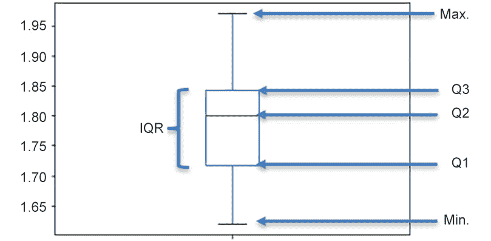

图 7.23：箱线图示例

箱线图由两个*胡须*和一个盒子组成。第一个晶须（通常）从最小值开始，然后一直到**Q1**，这标志着盒子的开始，因此第一个晶须覆盖了观察值的底部 25%。方框从**Q1**到**Q3**，覆盖了*中半部分*。盒子的高度被称为**四分位间距**（**IQR**），是一种离散度的度量，它告诉我们*是如何填充的*中间 50%的观察值是：IQR 越大意味着离散度越大。盒子中间的线对应于中值，最后，上晶须（通常）在最大值处完成。

注意，我在括号中添加了两个通常为最大值和最小值的*。当观察值高于*Q3+1.5 x IQR*（或低于*Q1-1.5 x IQR*）时，它通常被视为异常值的候选值，并以点的形式绘制。如果我们有这样的观察结果，那么上（下）晶须结束于*Q3+1.5 x IQR*（或*Q1-1.5 x IQR*）。例如，`size`变量的箱线图如下：*

 *```py
games['size'].plot(kind='box');
```

结果如下：

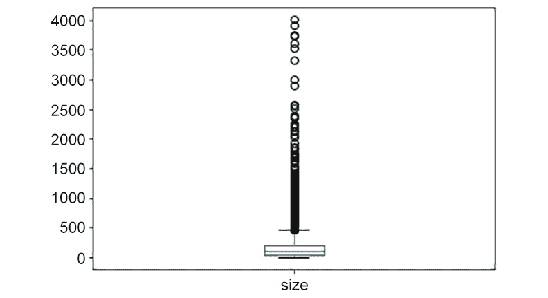

图 7.24：尺寸箱线图

在这种情况下，上须不会在最大值上结束，但会一直持续到*Q3+1.5 x IQR*。从这个图中，我们可以说变量有很多极值。虽然箱线图有时可能对单变量 EDA 有用，但直方图更可取。箱线图的最佳用途是分析数值变量与分类变量之间的关系。我们将在下一小节中回到箱线图。

为了完成本小节，让我们看看如何生成条形图，用于显示分类变量的计数、比例或百分比。让我们看一看 PosiT0}列，它是一个分类变量。下一行将计算变量每个值的游戏数：

```py
games['age_rating'].value_counts()
```

结果如下：

```py
4+     2287
9+     948
12+    925
17+    151
Name: age_rating,  dtype: int64
```

由于结果也是一个熊猫系列，我们可以链接这些方法，并使用带有参数`kind = 'bar'`的`plot`方法来获得我们的条形图：

```py
games['age_rating'].value_counts().plot(kind = 'bar');
```

结果如下所示：


图 7.25：老化等级绝对计数条形图

如果我们想要可视化比例，我们可以通过在`value_counts`方法中添加`normalize=True`参数来修改前一行代码：

```py
games['age_rating'].value_counts(normalize=True).plot(kind='bar');
```

该图看起来几乎相同，唯一的变化是*y*轴标签，现在显示比例：


图 7.26：年龄等级比例条形图

最后，另一种可视化比例的方法是使用饼图。众所周知，饼图存在一些问题，其中一个事实是，饼图不是传达信息的好方法，这就是为什么我从不使用饼图的原因。但是，它们在展示业务信息时很有用，因此，如果您的老板要求您提供饼图，以下是如何制作饼图：

```py
games['age_rating'].value_counts().plot(kind = 'pie');
```

结果是：


图 7.27：年龄等级饼图

饼图的问题在于它们只是美化文档的一种方式，而不是传递定量信息的好方式；当我们想要补充和超越数值计算所能传达的内容时，就应该使用可视化。如果我们想要传达比例（或百分比），最好显示实际值，如下所示：

```py
percentages = 100*games['age_rating'].value_counts(normalize=True)
for k, x in percentages.items():
    print(f'{k}: {x:0.1f}%')
```

这将提供以下输出：

```py
4+: 53.1%
9+: 22.0%
12+: 21.5%
17+: 3.5%
```

## 双变量 EDA：探索变量之间的关系

探索变量之间的关系是统计分析最有趣的方面之一。在探索变量对之间的关系时，仅考虑数值变量和分类变量的最广泛划分，我们有三种情况：

*   数字与数字
*   数字与范畴
*   绝对的与绝对的

对于第一种情况，散点图是可视化的选择。对于第二种情况，根据我们试图找到的内容，我们有一些选择，但通常箱线图是最有用的。最后，对于第三种情况，最常见的选择是呈现所谓的列联表：尽管存在一些用于比较分类数据的可视化选项，但它们并不常见。

正如我们在*探索性数据分析*中所说，在进行此类分析时，在开始产生可视化之前，制定一系列我们想要回答的问题通常是一个好主意。考虑到我们的业务问题，我们将尝试阐明以下三个问题：

*   大小和平均用户评级之间的关系是什么？
*   年龄评级和平均用户评级之间的关系是什么？
*   应用内购买与游戏评级之间的关系是什么？

我们将尝试使用散点图回答第一个问题。在最简单的版本中，散点图使用笛卡尔平面显示一对变量的每个点。每对点由一个点表示，点的图案表示两个绘制变量之间是否存在某种关系。下表显示了使用散点图可以检测到的一些图案的图示：

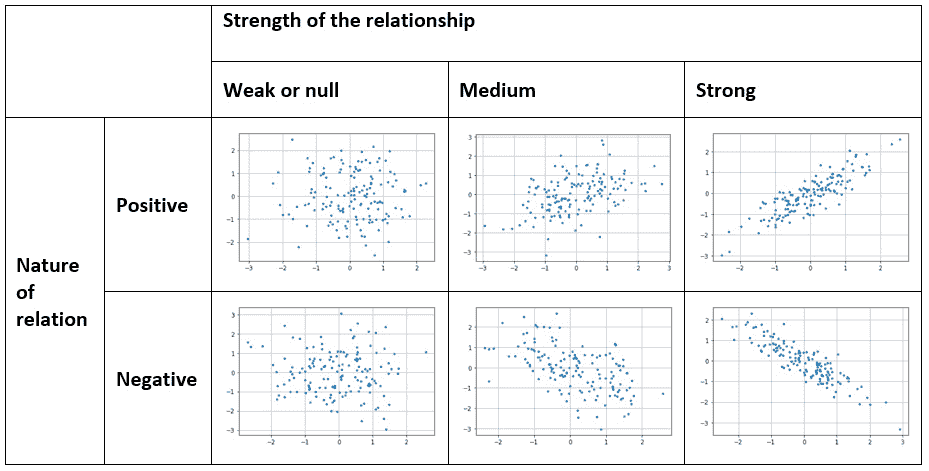

图 7.28：散点图中的模式示例

请记住，表中的示例仅供参考：通常，现实世界的数据集不提供这样容易识别的模式。

虽然我们可以使用熊猫来创建绘图，但我们将使用 Seaborn，这是一种非常流行的统计可视化技术，只需几行代码就可以生成美丽而复杂的绘图。我们将使用`scatterplot`函数，该函数获取每个轴上的变量名称和数据帧名称：

```py
sns.scatterplot(x='size', y='average_user_rating',\
                data=games, \
                # this is for controlling the size of the points
                s=20);
```

这里我们有输出：


图 7.29：大小与平均用户评级的散点图

如果我们看一下情节的右上角，它看起来像是某种大小的游戏，比如说 1500MB 以上的游戏，其评级往往为 3.5 或更高。由于尺寸是图形质量和游戏复杂性的代表，因此该图似乎表明，提高获得良好平均评级机会的方法是制作具有一定复杂性和视觉质量的游戏。然而，该图也显示了相对较小的游戏，平均得分为 5。

现在让我们来探讨数值变量和分类变量之间的关系。如果我们把平均评级作为一个分类变量，也许我们可以对评级有更多的了解；毕竟，由于数据集的某些特性，这个变量是离散的而不是连续的；它只接受整点和半点的值。以下代码使用字典中定义的映射对变量进行分类：

```py
ratings_mapping = {1.5: '1_poor', 2.: '1_poor',\
                   2.5: '1_poor', 3: '1_poor',\
                   3.5: '2_fair', 4\. : '2_fair',\
                   4.5: '3_good',5\. : '4_excellent'}
games['cat_rating'] = games['average_user_rating']\
                      .map(ratings_mapping)
```

我们创建了一个新的使用分类变量的平均用户评级量表。现在，我们可以使用箱线图查看不同类型评级的大小值分布是否发生变化：

```py
sns.boxplot(x='cat_rating', y='size', \
            data=games[games['size'] <= 600], \
            order=['1_poor', '2_fair', '3_good', '4_excellent']);
```

结果如下：


图 7.30：大小与分类用户评级的箱线图

我们将数据集限制在 600 MB 以下的游戏，以查看大小分级关系是否适用于不太大的游戏。我们看到，分布实际上是不同的，评级差的游戏通常比其他类别的游戏小（箱线图比其他类别的游戏小）。请注意，优秀游戏和优秀游戏的分布几乎相同，这可能表明，对于 600 MB 以下的游戏，复杂度和质量图形会在一定程度上影响评分。

最后，让我们回顾第三个案例：如何探索两个分类变量之间的关系。为了做到这一点，让我们探索一下年龄评级与我们刚刚创建的分类评级。我们可以生成一个表格，统计两个变量值的每个组合中有多少个观测值。这通常称为列联表。Pandas 具有方便的`crosstab`功能：

```py
pd.crosstab(games['age_rating'], games['cat_rating'])
```

结果是：


图 7.31：年龄评级与分类用户评级的列联表

计数是好的；然而，理解这些数据仍然有点棘手。为了找出这两个变量是否相关，我们需要找出年龄等级的比例是否会根据游戏的好坏而变化。例如，如果我们发现 90%的 4+游戏评级不好，同时，17+游戏中只有 15%评级不好，那么我们有理由假设这些变量有某种关系。要执行此计算，我们必须规范化前一个表的行。为此，我们添加了`normalize='index'`参数：

```py
100*pd.crosstab(games['age_rating'],\
                games['cat_rating'], \
                normalize='index')
```

我们将整个表格乘以 100，因此更容易理解为百分比：


图 7.32：年龄评级与分类用户评级的行标准化列联表

因为行已经被规范化，所以每一行加起来应该是 100。现在我们可以很容易地比较不同年龄段的不同用户评分的分布情况。例如，我们观察到，无论年龄级别如何，评分优秀的游戏所占的比例几乎相同，其他栏目的情况也差不多（或多或少）。这表明，也许游戏的年龄评级不是游戏评级的一个重要因素。

这就是统计分析成为一门艺术的地方。最初探索的结果产生了新的问题和假设，我们将使用更多的数值和视觉分析进一步探索这些问题和假设，希望经过几次迭代后，我们将产生有用的信息，我们可以将这些信息转化为关于手头问题的知识。

在结束本节之前，我将指出，虽然本书的范围集中于可视化两个变量之间的关系，但可以可视化地探索三个或更多变量之间的关系。但是，请记住，在可视化中有两个以上的变量通常会以指数形式增加分析的复杂性。

## 练习 7.03：练习 EDA

在本练习中，我们将使用方框图来可视化免费游戏是否与付费游戏具有不同的评级。

1.  First, let's take a look at the different prices we have in our dataset. For this, take a look at the unique values of price:

    ```py
    games['price'].unique()
    ```

    输出如下所示：

    ```py
    array([  2.99,   1.99,   0\.  ,   0.99,   5.99,   7.99,   4.99,
             3.99, 9.99,  19.99,   6.99,  11.99,   8.99, 139.99,
             14.99,  59.99])
    ```

2.  看起来所有的游戏都是以一定数量的美元加上`99`美分的价格出售的。我们知道，实际上，`2.99`意味着`3`美元。使用内置的`round`方法将此变量转换为整数值，使数值为漂亮的整数：

    ```py
    games['price'] = games['price'].round()
    ```

3.  Since this is a discrete numerical variable, use a bar plot to visualize the distribution of the games for each of the prices:

    ```py
    games['price'].value_counts().sort_index().plot(kind='bar');
    ```

    结果如下：

    

    图 7.33：按价格划分的观察数量条形图

4.  看起来大部分游戏都是免费的。为了简化分析，创建一个名为`cat_price`的分类变量，指示游戏是免费的还是付费的：

    ```py
    games['cat_price'] = (games['price'] == 0).astype(int)\
                          .map({0:'paid', 1:'free'})
    ```

5.  Use a boxplot to visualize the relationship between the variable created in the previous point:

    ```py
    sns.boxplot(x='cat_price', y='average_user_rating', \
                data=games);
    ```

    结果如下：

    

图 7.34：箱线图：cat_ 价格与平均用户评级

从图中，我们可以看到免费和付费游戏的平均用户评分分布几乎相同。这表明免费与付费游戏的状态并不影响游戏的评级。

在本练习中，我们使用箱线图探索可变价格的分布，并查看该变量与平均用户评级之间是否存在某种关系。

笔记

要访问此特定部分的源代码，请参考[https://packt.live/2VBV2gI](https://packt.live/2VBV2gI) 。

您也可以在[在线运行此示例 https://packt.live/2YUGv1I](https://packt.live/2YUGv1I) 。

在本节中，我们学习了 EDA，这是一个用可视化补充描述性统计的过程。我们了解了几乎所有类型的统计分析中使用的一些最有用的可视化类型。您已经熟悉了直方图、箱线图、条形图和散点图，它们都是补充数值分析和揭示数据集有用信息的强大工具。

EDA 是每个统计分析中必不可少的一步，因为它允许我们了解数据集中的变量，识别它们之间的潜在关系，并生成可以使用形式推理方法进行正式测试的假设。现在我们已经学习了描述性统计的基础知识，我们可以继续学习推断统计，但首先，我们必须学习概率论的一些基础知识，这是下一章的主题。

## 活动 7.01：寻找高评级战略游戏

你工作的游戏开发公司提出了一项计划，以加强其在游戏市场中的地位。从行业知识和其他商业报告中可以看出，吸引新客户的一个非常有效的方法是在手机游戏领域建立良好的声誉。鉴于这一事实，您的公司有以下计划：为 iOS 平台开发一款战略游戏，该游戏将获得大量积极关注，从而为公司带来大量新客户。该公司相信，只有当游戏获得用户的高评价时，这个计划才会奏效。由于您在手机游戏领域经验丰富，我们要求您回答以下问题：哪些类型的策略游戏具有较高的用户评分？

此活动的目标有两个：第一个是基于两个分类变量的组合创建一个新变量。然后，使用`groupby`方法计算用户评分的描述性统计，以查看平均用户评分与新创建的变量之间是否存在关系。

完成步骤：

1.  加载`numpy`和`pandas`库。
2.  加载策略游戏数据集（在章节的`data`文件夹中）。
3.  Perform all the transformations we did in the first section of the chapter:

    A.更改变量的名称。

    B 将列`id`设置为`index`。

    C 放下`url`和`icon_url`列。

    D 将`original_release_date`和`current_version_release_date`更改为`datetime`。

    E 从数据帧中删除`average_user_rating`为空的行。

    F 仅在数据帧中保留`user_rating_count`等于或大于 30 的行。

4.  打印数据集的维度。您必须有一个包含 4311 行和 15 列的数据框。
5.  用字符串`EN`填充`languages`列中缺少的值，以表明这些游戏只有英文版。
6.  创建一个名为`free_game`的变量，如果游戏的价格为零，则该变量的值为`free`，如果价格高于零，则该变量的值为`paid`。
7.  创建一个名为`multilingual`的变量，如果语言列只有一个语言字符串，则该变量的值为`monolingual`，如果语言列至少有两个语言字符串，则该变量的值为`multilingual`。
8.  创建一个变量，其中包含上一步创建的两个变量（`free-monolingual`、`free-multilingual`、`paid-monolingual`和`paid-multilingual`中的四个组合。
9.  计算`price_language`变量中每种类型的观测值。
10.  Use the `groupby` method on the games DataFrame, group by the newly created variable, then select the `average_user_rating` variables and calculate the descriptive statistics.

    笔记

    有关此活动的解决方案，请参见第 681 页。

在本活动中，我们展示了一种创建新分类变量的方法，该变量是由其他两个分类变量的可能组合产生的。然后，我们使用`groupby`方法计算新创建变量可能值的描述性统计数据。

# 总结

在本章中，我们了解了执行任何类型统计分析的第一步：首先，我们定义了业务问题并介绍了数据集。基于我们想要解决的问题，我们相应地准备了数据集：我们删除了一些记录，估算了缺失值，转换了一些变量的类型，并创建了新的变量。然后我们了解了描述性统计的必要性；我们学习了如何使用熊猫来计算它们，以及如何使用和解释这些计算。在最后一节中，我们学习了如何将可视化与描述性统计相结合，以更深入地理解数据集中变量之间的关系。我们在本章学到的是一些概念和技术，您可以在执行任何数据分析时将其付诸实践。然而，要想在分析中变得更复杂，你需要很好地掌握概率论的基础知识，这是我们下一章的主题。

QDN92

MWM57**