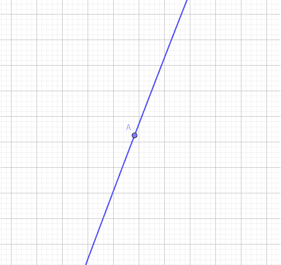
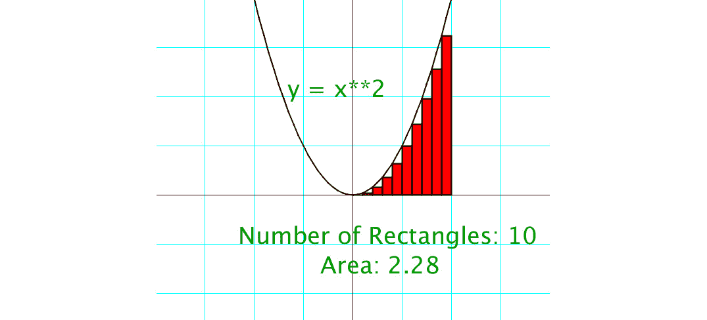
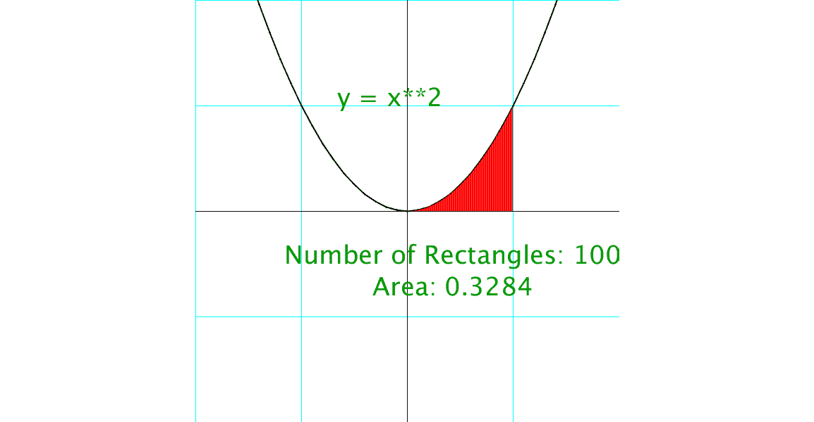
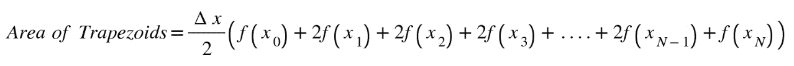
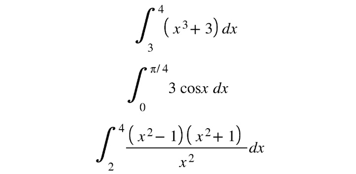
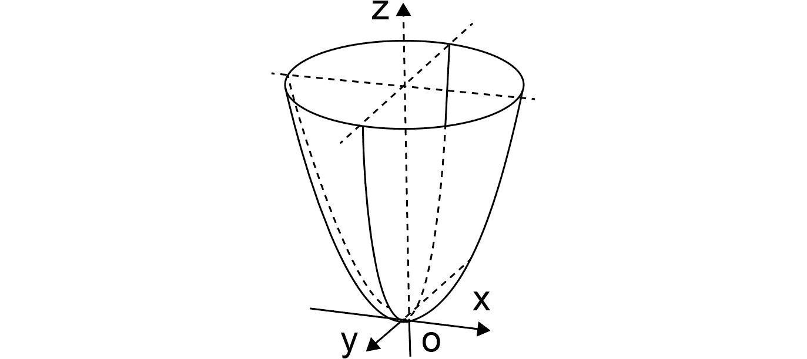
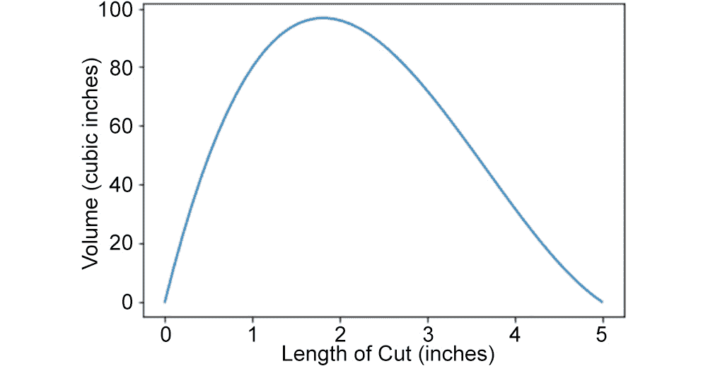
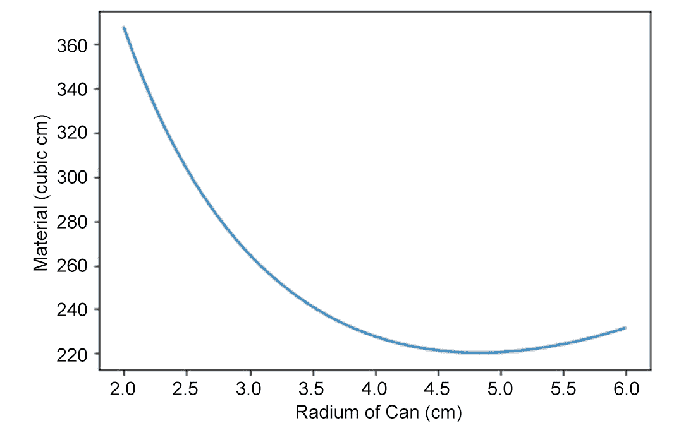
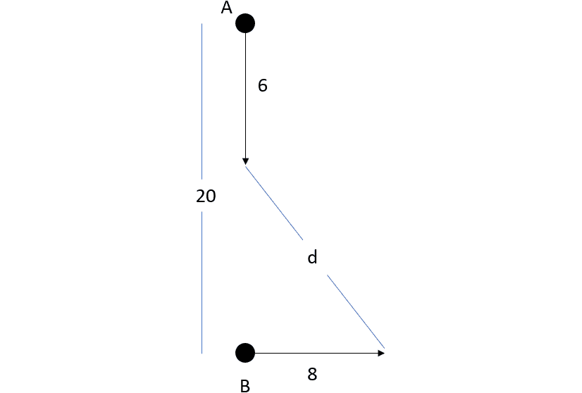
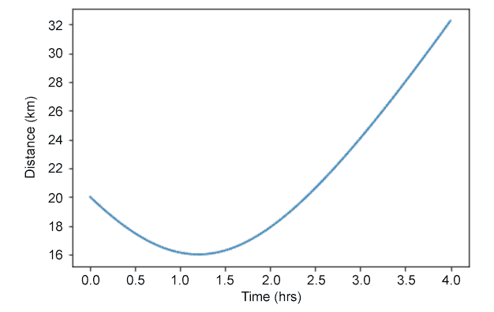

# 10。Python 基础微积分

概述

在本章中，您将学习在给定的 x 值下计算函数的导数。您还将学习计算给定值之间的函数积分，并使用求导法解决优化问题，如利润最大化或成本最小化。到本章结束时，您将能够使用微积分来解决一系列数学问题。

# 导言

微积分被称为变化的科学，因为它的工具是用来处理不断变化的数值，如行星和射弹的位置和速度。以前，没有办法在变量中表达这种变化。

微积分的第一个重要主题是**导数**。这是函数在给定点的变化率。直线遵循一种称为坡度的简单模式。这是在给定的*x*值范围内*y*值（*上升*）的变化*运行*：


图 10.1：直线的坡度

在*图 10.1*中，*x*值每增加 1 个单位，线路中的*y*值就会增加 2 个单位，所以我们将 2 除以 1 得到 2 的斜率。

但是，曲线的斜率在整个曲线上并不像在一条直线上一样恒定。因此，正如您在*图 10.2*中所看到的，该函数在**A**点的变化率与**B**点的变化率不同：


图 10.2：寻找曲线的斜率

然而，如果我们将点**A**放大得足够近，我们会看到曲线非常接近于一条直线。



图 10.3：放大曲线

这就是衍生工具的工作原理：我们使*x**运行*中的变化足够小，以至于曲线这一小部分的斜率将接近该点曲线的变化率。让我们看看它在 Python 中是什么样子。

# 写导数函数

在微积分课程中，人们对导数产生了种种恐惧，但用数值计算导数的函数却出人意料地简单。

在 Jupyter 笔记本中，我们将定义一个函数*f（x）*为抛物线*y=x*2：

```py
def f(x):
    return x**2
```

现在我们可以编写一个函数，使用经典公式计算任意点*（x，f（x））*的导数：


图 10.4：计算导数的公式

分子是*上升*，分母是*运行*。*Δx*表示 x 中的*变化，我们将用 1 除以一百万，使之成为一个非常小的小数点：*

```py
def f(x):
    return x**2
def derivative(f,x):
    """
    Returns the value of the derivative of
    the function at a given x-value.
    """
    delta_x = 1/1000000
    return (f(x+delta_x) - f(x))/delta_x
```

笔记

下面代码段中显示的三重引号（`"""`）用于表示多行代码注释的起点和终点。注释被添加到代码中，以帮助解释特定的逻辑位。

现在我们可以计算函数在任何*x*值下的导数，我们将得到一个非常精确的近似值：

```py
for i in range(-3,4):
    print(i,derivative(f,i))
```

如果运行上述代码，将获得以下输出：

```py
-3 -5.999999000749767
-2 -3.999998999582033
-1 -1.999999000079633
0 1e-06
1 2.0000009999243673
2 4.0000010006480125
3 6.000001000927568
```

这些值与实际值仅相差一点点（-5.999999，而不是-6）。我们可以将打印输出四舍五入到最接近的十分之一，我们将更清楚地看到这些值：

```py
for i in range(-3,4):
    print(i,round(derivative(f,i),1))
```

输出将是：

```py
-3 -6.0
-2 -4.0
-1 -2.0
0 0.0
1 2.0
2 4.0
3 6.0
```

我们已经计算了函数*y=x*2 在多个点的导数，我们可以看到这样的模式：导数总是*x*值的两倍。这是在该点近似曲线的直线的坡度。此方法的强大威力将在本练习中清晰可见。

## 练习 10.01：寻找其他函数的导数

我们可以用我们的导数函数来计算我们可以表达的任何函数的导数。当我们可以简单地使用*微小运行*方法计算坡度时，不需要进行繁琐的代数运算。在这里，我们的函数将找到一些复杂函数的导数。我们重用了*f*，但您也可以调用其他函数。在本练习中，您将在给定的*x*值下找到每个函数的导数：


图 10.5：给定 x 值下的函数定义

执行以下步骤：

1.  首先，我们需要从`math`模块

    ```py
    from math import sqrt
    ```

    导入平方根函数
2.  以下是方程式中前面的函数，已翻译成 Python 代码：

    ```py
    def f(x):
        return 6*x**3
    def g(x):
        return sqrt(2*x + 5)
    def h(x):
        return 1/(x-3)**3
    ```

3.  如果尚未定义导数函数：

    ```py
    def derivative(f,x):
        """Returns the value of the derivative of
        the function at a given x-value."""
        delta_x = 1/1000000
        return (f(x+delta_x) - f(x))/delta_x
    ```

4.  Then print out the derivatives by calling each function and the desired *x* value:

    ```py
    print(derivative(f,-2),derivative(g,3),derivative(h,5))
    ```

    输出结果如下：

    ```py
    71.99996399265274 0.30151133101341543 -0.18749981253729509
    ```

    您刚刚学习了一项非常重要的技能：在特定的*x*值处查找函数（任何函数）的导数。这就是微积分学生学习大量硬代数的原因：将导数作为函数，然后他们可以插入一个*x*值。然而，在 Python 中，我们只是直接计算函数的数值导数，而不做任何代数运算。

    笔记

    要访问此特定部分的源代码，请参考[https://packt.live/2AnlJOC](https://packt.live/2AnlJOC) 。

    您也可以在[在线运行此示例 https://packt.live/3gi4I7S](https://packt.live/3gi4I7S) 。

    ## 求切线方程

    微积分中的一个常见问题是求在给定点与曲线相切的直线的方程。还记得我们的点**A**和**B**吗？切线是非常接近这些点处曲线的直线，如*图 10.6*所示：

    

    图 10.6：曲线的两条切线

    让我们使用*图 10.6*中的信息。方程式如下：

    

    图 10.7：f（x）的方程

    *图 10.6*中**A**点的*x*值为-0.48，**B**点的*x*值为 0.67。使用 Python 实现这一点的好处是，不管给定的值是整数、负数还是小数，计算机都可以轻松处理数字运算。

    要找到直线方程，我们只需要一个斜率和一个点。如果你还记得你的代数，你可以用这个公式：

    

    图 10.8：直线方程

    我们给出了函数和点（*x*0*，y*0），因此，我们可以从函数在给定*x*值的导数中找到斜率*m*。切线的方程式为*y=mx+b*，我们唯一不知道的是*b*，即直线的*y*截距。但是如果我们重新排列前面的方程，我们可以在方程的右边看到它：

    

    图 10.9：点的直线方程

    我们需要使用已有的导数函数找到斜率*m*，然后将其插入*y*0*-mx*0。为此，请执行以下步骤：

5.  首先，我们将定义我们的`f(x)`函数：

    ```py
    def f(x):
        return x**3 - 2*x**2 + 1
    ```

6.  然后我们将编写一个函数，返回给定斜率和点的直线的*y*截距。称之为`point_slope`：

    ```py
    def point_slope(m,x,y):
        """Finds the y-intercept of a line
        given its slope m and a point (x,y)"""
        return y-m*x
    ```

7.  最后，我们将编写一个函数，取函数`f`和`x`值，并在`x`处找到`f`的导数，将其放入`point_slope`函数中，并以*y=mx+b*形式打印出该行的方程式。叫它`tangent_line`：

    ```py
    def tangent_line(f,x):
        """Finds the equation of the line 
        tangent to f at x."""
    ```

8.  我们通过在`x`

    ```py
        m = derivative(f,x)
    ```

    处取`f`的导数来求切线的斜率
9.  然后我们使用`point_slope`函数找到*y*截取：

    ```py
        y0 = f(x)
        b = point_slope(m,x,y0)
        print("y = ",round(m,2),"x + ",round(b,2))
    ```

10.  Now, to get the equations of the lines tangent to `f` at *x = -0.48* and *x = 0.67*, use the following code:

    ```py
    for x in [-0.48,0.67]:
        tangent_line(f,x)
    ```

    结果如下：

    ```py
    y =  2.61 x +  1.68
    y =  -1.33 x +  1.3
    ```

    在本节中，我们学习了如何找出特定值为`x`的切线方程。

    # 计算积分

    微积分的一个主要主题是微分学，这意味着要求导数，正如我们在本章到目前为止所做的那样。另一个主要主题是积分学，它涉及到使用许多小的*切片*将面积或体积相加。

    当用手计算积分时，我们被教导要逆代数求导数。但是代数变得混乱，在某些情况下，不可能。我们在学校学到的*硬*版本是黎曼求和，它要求我们将曲线下的面积切割成矩形*切片*，然后将它们相加得到面积。但是，在实际的时间内，你永远不可能处理超过 10 个切片，当然在测试中也不可能。

    然而，使用 Python，我们可以处理任意多个切片，这样就省去了我们为了得到一个代数方程而跳过很多障碍的苦差事。找到代数方程的目的是获得精确的数值，如果使用一个程序可以得到最精确的数值，那么我们一定要走这条路。

    *图 10.10*显示了一个函数及其下的区域。通常，该区域由函数本身、较低的*x*值**a**、较高的*x*值**b**和*x*轴限定。

    

    图 10.10：由函数 f（x）从 a 到 b 定义的曲线下的面积 S

    我们要做的是将区域**S**切成等宽的矩形，因为我们知道高度（*f（x）*，所以使用 Python 很容易将它们相加。*图 10.11*显示了*f（x）=x*2 的情况：

    

    图 10.11：区域 S 被切成 10 个等宽矩形

    首先，我们将定义函数并选择矩形的数量（这样两个矩形的值都很容易更改）。在本例中，我们将使用 20 个矩形，这将使我们的精确度高于*图 10.11*中所示的 10 个矩形：

    ```py
    def f(x):
        return x**2
    number_of_rectangles = 20
    ```

    然后我们定义积分函数。首先，将`(b – a)`范围除以`num`等宽，矩形数：

    ```py
    def integral(f,a,b,num):
        """Returns the sum of num rectangles
        under f between a and b"""
        width = (b-a)/num
    ```

    然后我们将在整个范围内循环，同时添加矩形的面积。我们用一行列表来理解。对于每个`n`，我们将矩形的底部（`width`乘以高度（*f（x）*，得到每个矩形的面积。最后，我们返回所有区域的总和：

    ```py
        area = sum([width*f(a+width*n) for n in range(num)])
        return area
    ```

    以下是函数调用的外观：

    ```py
    for i in range(1,21):
        print(i,integral(f,0,1,i))
    ```

    输出显示了随着矩形的增加，我们如何越来越接近面积的实际值：

    ```py
    1 0.0
    2 0.125
    3 0.18518518518518517
    4 0.21875
    5 0.24000000000000005
    6 0.2546296296296296
    7 0.26530612244897955
    8 0.2734375
    9 0.279835390946502
    10 0.2850000000000001
    11 0.2892561983471075
    12 0.292824074074074
    13 0.2958579881656805
    14 0.29846938775510196
    15 0.30074074074074075
    16 0.302734375
    17 0.3044982698961938
    18 0.3060699588477366
    19 0.3074792243767312
    20 0.3087500000000001
    ```

    它似乎在缓慢地成长。如果我们跳到 100 个矩形呢？这将产生*图 10.12*所示的情况：

    

    图 10.12：较小的矩形使面积更接近

    下面是我们如何更改`print`语句，以获得 100 个矩形的面积：

    ```py
    print(100,integral(f,0,1,100))
    ```

    输出结果如下：

    ```py
    100 0.32835000000000014
    ```

    1000 个矩形怎么样，一个手工计算起来非常困难和耗时的积分？使用 Python，我们只需将`100`更改为`1000`，并获得更精确的近似值：

    ```py
    print(1000,integral(f,0,1,1000))
    ```

    输出结果如下：

    ```py
    1000 0.33283350000000034
    ```

    将 100000 个矩形相加得到 0.3333283333。它似乎正在接近 0.333，或 1/3。但是增加更多的零不会花费我们任何东西，所以请随意增加矩形的数量，以获得更精确的结果。

    # 使用梯形

    我们可以使用梯形而不是矩形更快地得到更好的近似值。这样，我们就不会错过太多的区域，正如您在*图 10.13*中所看到的：

    

    图 10.13：使用梯形更好地逼近曲线

    以下是梯形规则的公式：

    

    图 10.14：梯形面积公式

    端点*x=a*和*x=b*处的线段高度计算一次，而所有其他高度计算两次。这是因为在梯形面积的公式中有两个*高度*。你能猜出怎样使你的积分函数变成梯形吗？

    ```py
    def trap_integral(f,a,b,num):
        """Returns the sum of num trapezoids
        under f between a and b"""
        width = (b-a)/num
        area = 0.5*width*(f(a) + f(b) + 2*sum([f(a+width*n) for n in range(1,num)]))
        return area
    ```

    现在我们将使用`5`梯形运行`trap_integral`函数：

    ```py
    print(trap_integral(f,0,1,5))
    ```

    输出结果如下：

    ```py
    0.3400000000000001
    ```

    因此，通过仅使用 5 个梯形，我们将误差降低到 3%。（记住，我们知道该函数的面积真实值为 0.333…）使用 10 个梯形，我们得到 0.335，误差为 0.6%。

    ## 练习 10.02：找到曲线下的面积

    在本练习中，我们将在给定的时间间隔内找到以下函数下的区域：

    

    图 10.15：间隔公式

    执行以下步骤以查找该区域。编写了使用梯形近似曲线下面积的`trap_integral`函数后，很容易：只需定义函数（可能需要导入`trig`函数和`pi`函数）并声明端点。让它使用 100 个梯形，因为这将非常精确和快速

11.  首先，导入您需要的`math`函数并定义`f`、`g`和`h`：

    ```py
    from math import cos,pi
    def f(x):
        return x**3 + 3
    def g(x):
        return 3*cos(x)
    def h(x):
        return ((x**2 - 1)*(x**2+1))/x**2
    ```

12.  Then call the `trap_integral` function on each function between the specified *x* values:

    ```py
    print(trap_integral(f,3,4,100))
    print(trap_integral(g,0,pi/4,100))
    print(trap_integral(h,2,4,100))
    ```

    结果如下：

    ```py
    46.75017499999999
    2.1213094390731206
    18.416792708494786
    ```

现在，你可能已经看到了这种数值方法的威力。如果你可以用 Python 来表达一个函数，你可以用这个函数来计算曲线下所有的矩形，或者更准确地说，这个函数可以计算曲线下所有的梯形。

笔记

要访问此特定部分的源代码，请参考[https://packt.live/3dTUVTG](https://packt.live/3dTUVTG) 。

您也可以在[在线运行此示例 https://packt.live/2Zsfxxi](https://packt.live/2Zsfxxi) 。

# 利用积分解决应用问题

如果一条曲线围绕*x*或*y*轴旋转，或者一条平行于其中一个轴的线旋转，形成一个 3D 对象，我们可以使用积分工具计算该实体的体积。例如，假设抛物线*y=x*2 绕其对称轴旋转形成抛物面，如*图 10.16*所示：



图 10.16：绕 z 轴旋转的抛物线

我们可以通过将抛物面上的所有*切片*相加，得到体积。和以前一样，当我们在二维中使用矩形时，现在我们在三维中使用圆柱体。在*图 10.16*中，切片向上移动，而不是向右移动，因此我们可以在脑海中翻转它，并将曲线*y=x*2 重新定义为*y=sqrt（x）*。

现在每个圆柱体的半径是*y*值，假设我们从*x=0*到*x=1*：


图 10.17：翻转抛物面的侧面

终点仍为*0*和*1*，但曲线半径为*y*值，即*sqrt（x）*。因此，每个圆形切片的体积是圆柱体的体积（*pi*半径*2*高度*），在这种情况下是*pi*r*2*厚度*或*pi*sqrt（x）*2*宽度*。

首先从`math`模块中导入`sqrt`和`pi`，定义`f(x)`：

```py
from math import sqrt, pi
def f(x):
    return sqrt(x)
```

然后我们将定义一个函数，该函数将取抛物面函数和`x`的开始值和结束值。首先定义运行卷和要使用的切片数：

```py
def vol_solid(f,a,b):
    volume = 0
    num = 1000
```

然后我们通过将*x*值的范围除以切片数量来计算切片的厚度：

```py
    width = (b-a)/num
```

现在我们计算每个圆柱形切片的体积，即*pi*r*2**宽度*。我们将其添加到运行卷中，循环完成后，返回最终卷：

```py
    for i in range(num):
    #     volume of cylindrical disk
        vol = pi*(f(a+i*width))**2*width
        volume += vol    
    return volume
```

让我们将`0`和`1`之间的所有卷相加：

```py
print(vol_solid(f,0,1))
```

输出结果如下：

```py
1.5692255304681022
```

该值是有界抛物面体积的近似值。同样，我们将函数分割成的切片越多，实际体积的近似值就越精确。

## 练习 10.03：求旋转固体的体积

这是另一个旋转实体问题：求出以下函数在给定间隔内绕*x*轴旋转时形成的实体的体积。

下图中，绿色曲线为*f（x）=4–4x*2，红色曲线为*g（x）=1-x*2。求函数之间区域绕*x*轴旋转时形成的固体体积。


图 10.18：两个功能的二维视图

固体的最终形状如下所示：


图 10.19：生成的形状类似于一个环

如上图所示，这就像一个求环面积的问题。公式如下：


图 10.20：环的面积公式

现在，要使用 Python 查找实体的体积，请执行以下步骤：

1.  照常创建`f`和`g`，第三个函数（`h`是`f`和`g`的平方差，来自环形面积公式：

    ```py
    def f(x):
        return 4 -4*x**2
    def g(x):
        return 1-x**2
    def h(x):
        return f(x)**2-g(x)**2
    ```

2.  现在，固体的体积将是给定数量（`num`的圆柱体在两个功能之间的总和。我们在积分函数中做同样的事情。圆柱体的半径与我们积分时矩形的高度相同：

    ```py
    def vol_solid(f,a,b):
        volume = 0
        num = 10000
        width = (b-a)/num
        for i in range(num):
    ```

3.  气缸的体积为*pi*r*2*h*，我们将其添加到运行总体积中：

    ```py
            vol = pi*(f(a+i*width))*width
            volume += vol    
        return volume
    ```

4.  Here's where we call `vol_solid` on the `h` function for *x* between `-1` and `1`:

    ```py
    print(vol_solid(h,-1,1))
    ```

    输出结果如下：

    ```py
    50.26548245743666
    ```

因此，所得固体的体积为 50.3 立方单位。所以，我们用我们的函数来求固体的体积，我们用它来求两条曲线之间的固体体积。

笔记

要访问此特定部分的源代码，请参考[https://packt.live/2NR9Svg](https://packt.live/2NR9Svg) 。

您也可以在[在线运行此示例 https://packt.live/3eWJaxs](https://packt.live/3eWJaxs) 。

# 利用导数解决优化问题

在许多应用问题中，我们都在寻找一个最佳点，比如误差最小，或者利润最高。传统的方法是使用函数对情况建模，求函数的导数，然后求解使导数为零的输入。这是因为导数在局部极小值和极大值处为零，如下图所示：


图 10.21：一个三次函数和我们想要找到的点

图中给出的函数为*f（x）=x*3*-2.8x*2*+1.2x+0.85*。我们感兴趣的是找到局部最大点**A**和局部最小点**B**。我们必须对函数进行微分，然后手工求解得到的方程。但使用计算机，我们可以简单地从网格左侧的*x*值开始，然后采取小步骤，检查*f（x）*，直到方向发生变化。要做到这一点，我们可以使用导数函数来检查导数何时改变符号。

首先，我们定义`f(x)`：

```py
def f(x):
    return x**3-2.8*x**2+1.2*x+0.85
```

然后我们将定义一个名为`find_max_mins`的函数，从最小*x*值开始，并采取微小的步骤，检查导数是否等于零，或者它是否改变符号，从正变为负，反之亦然。最数学的方法是检查前一个导数乘以新导数是否为负：

```py
def find_max_mins(f,start,stop,step=0.001):
    x = start
    deriv = derivative(f,x)
    while x < stop:
        x += step
        #take derivative at new x:
        newderiv = derivative(f,x)
        #if derivative changes sign
        if newderiv == 0 or deriv*newderiv < 0:
            print("Max/Min at x=",x,"y=",f(x))
            #change deriv to newderiv
            deriv = newderiv
```

最后，我们调用该函数，以便它打印出导数改变符号的所有值：

```py
find_max_mins(f,-100,100)
```

结果如下：

```py
Max/Min at x= 0.247000000113438 y= 0.9906440229999803
Max/Min at x= 1.6200000001133703 y= -0.3027919999998646
```

这些是*图 10.21*中`f`的局部最大值和局部最小值。

## 练习 10.04：找到最快的路线

我们可以用这个求极大值和极小值的过程来求一个复杂函数的最小值。在传统的微积分课程中，学生必须用代数方法求出导数，将其设为零，然后求解得到的方程。我们可以用 Python 对这种情况进行建模，并使用我们的导数和`find_max_min`函数轻松地找到最小值。情况是这样的：一座灯塔位于离海岸 6 公里的地方，而一座位于直海岸线上的小屋距离灯塔最近的海岸点 9 公里。如果你以 3 公里/小时的速度划船，以 5 公里/小时的速度行走，你应该在哪里着陆，以便尽快从灯塔到达船舱？


图 10.22：灯塔与船舱的距离

执行以下步骤以完成练习：

1.  We're aiming to minimize the time it takes to make this trip, so let's make a formula for time. Remember, time is distance divided by rate:

    

    图 10.23：计算时间的公式

2.  And there's the function we need to minimize. The optimal *x* is going to be between 0 and 9 kilometers, so we'll set those as our start and end values when we call our `find_max_mins` function:

    ```py
    from math import sqrt
    def t(x):
        return sqrt(x**2+36)/3 + (9-x)/5

    find_max_mins(t,0,9)
    ```

    输出结果如下：

    ```py
    Max/Min at x= 4.4999999999998375 y= 3.4000000000000004
    ```

沿着海滩大约有 4.5 公里。这是一个非常有用的计算：当其他约束条件已就位时，我们发现两点之间的最短距离。

笔记

要访问此特定部分的源代码，请参考[https://packt.live/31DwYxu](https://packt.live/31DwYxu) 。

您也可以在[在线运行此示例 https://packt.live/38wNRM5](https://packt.live/38wNRM5) 。

## 练习 10.05：盒子问题

所有微积分学生都会遇到一个经典问题，在这个问题中，制造商有一块长方形的材料，他们想通过从拐角处切割出相同的正方形，将其制成一个盒子，如下图所示：


图 10.24：从矩形的拐角处切割正方形

在这种情况下，这块材料是 10 英寸乘 12 英寸。问题是：找到要剪切的正方形的大小，以便最大化生成的长方体的体积：

1.  The formula for the volume of the box will be length multiplied by width multiplied by height. In terms of *x*, the length of the square cut from the corners, the length of the box is *12 – 2x*, since two corners are cut out of the 12-inch sides. Similarly, the width of the box will be *10 – 2x*. The height, once the "flaps" are bent upwards, will be *x*. So, the volume is:

    

    图 10.25：计算体积的公式

2.  以下是如何在 Python 中定义此函数：

    ```py
    def v(x):
        return x*(10-2*x)*(12-2*x)
    ```

3.  By now, you know how to put this into your `find_max_mins` function. We only want to plug in values between 0 and 5 because more than 5 inches would mean we'd be left with no side (the width is 10 inches):

    ```py
    find_max_mins(v,0,5)
    ```

    输出结果如下：

    ```py
    Max/Min at x= 1.8109999999999113 y= 96.77057492400002
    ```

通过切割边长为 1.81 英寸的正方形，可获得最大体积。以下是该卷的绘图：



图 10.26：达到的最大值曲线图

我们可以看到，当从每一侧切下 1.81 英寸的正方形时，可以达到最大体积，因为这是绘图的最大点所在。

笔记

要访问此特定部分的源代码，请参考[https://packt.live/3gc11AC](https://packt.live/3gc11AC) 。

您也可以在[在线运行此示例 https://packt.live/2NNSNmb](https://packt.live/2NNSNmb) 。

## 练习 10.06：最佳罐头

一个圆柱形容器可以容纳 355 cm3 的苏打水。什么尺寸（半径和高度）可以最大限度地降低建造罐的金属成本？您可以忽略罐的顶部：

1.  The surface area of a cylinder is the area of the bottom (a circle, so πr2) plus the area of its side, which is a rectangle of base *2πr* and a height of *h*. The volume of a cylinder is πr2h, so we put it all together:

    

    图 10.27：计算圆柱体体积的公式

2.  The volume is already set to 355\. From there, we can get an expression for *h* in terms of *r* and we'll have the surface area all in terms of one variable:

    

    图 10.28：替换公式中的值

3.  Let's express it in Python and put it in our `find_max_mins` function:

    ```py
    from math import pi
    def surf_area(r):
        return pi*r**2 + 710/r
    find_max_mins(surf_area,0.1,10)
    ```

    运行代码时，输出如下所示：

    ```py
    Max/Min at x= 4.834999999999949 y= 220.28763352297025
    ```

因此，解决方案是半径约为 4.8cm，高度为 355/（π（4.8）2）=4.9cm。这意味着这个罐子的宽度是它的两倍。这是一个 2 到 6 厘米的罐子的`surf_area`函数图。您可以看到使材质最小化的点，在 4.5 到 5 厘米之间。我们计算出它正好是 4.9 厘米：



图 10.29：找到制作罐头所需的最小材料

笔记

要访问此特定部分的源代码，请参考[https://packt.live/2Zu2bAK](https://packt.live/2Zu2bAK) 。

您也可以在[在线运行此示例 https://packt.live/38lUNeE](https://packt.live/38lUNeE) 。

## 练习 10.07：计算两艘移动船舶之间的距离

中午，A 船在 B 船以北 20 公里处。如果 A 船以 6 公里/小时的速度向南航行，B 船以 8 公里/小时的速度向东航行，则找出两船之间距离最小的时间。下图显示了这种情况：



图 10.30:A 和 B 船向南和向东移动

执行以下步骤以查找时间：

1.  The distance is velocity multiplied by time, so the distance between the two ships can be modeled by this equation:

    

    图 10.31：计算距离的公式

2.  让我们用 Python 来表达这一点，并将其放入我们的`find_max_mins`函数中：

    ```py
    from math import sqrt
    def d(t):
        return sqrt((20-6*t)**2+(8*t)**2)
    ```

3.  We assume the time will be between `0` and `4` hours:

    ```py
    find_max_mins(d,0,4)
    ```

    输出结果如下：

    ```py
    Max/Min at x= 1.1999999999999786 y= 16.0
    ```

    因此，时间为 1.2 小时，如下图中的最小点所示。十分之二小时是 12 分钟，这意味着船只将在下午 1:12 最接近。下面是距离与时间的关系图：



图 10.32：距离与时间的关系图

笔记

要访问此特定部分的源代码，请参考[https://packt.live/38k2kuF](https://packt.live/38k2kuF) 。

您也可以在[在线运行此示例 https://packt.live/31FK3GG](https://packt.live/31FK3GG) 。

## 活动 10.01：最大圆锥体体积

这是一个经典的优化问题，如果你用手去做的话，它会导致一些极其复杂的方程需要微分和求解。然而，在 Python 的帮助下进行这项工作将使微积分部分变得更加容易。从一个圆开始，切出一个θ度的扇形。然后将下图中的点**A**和**B**连接成一个圆锥体：


图 10.33：圆锥体体积

这个问题，就像盒子里的问题一样，是要找到一个可以使圆锥体的体积最大化的切出角度。这将需要您可视化切割角度，附加点以制作圆锥体，并计算生成圆锥体的体积。

完成步骤：

1.  找到`AB`的弧长。
2.  找到*h*，即所得圆锥体的高度。
3.  找到*r*，圆锥体底部的半径。
4.  Find an expression for the volume of the cone as a function of theta (*θ*), the angle cut out.

    笔记

    此活动的解决方案可在第 694 页找到。

# 总结

微积分工具使数学家和科学家能够处理不断变化的数值，而这些工具改变了科学的工作方式。突然之间，我们可以使用无限小的步长来近似曲线在某一点的斜率，或者使用无限小的矩形来近似曲线下的面积。这些工具是在计算机和自由编程软件的现代世界出现之前几百年开发出来的，但我们没有理由将自己局限于牛顿、莱布尼茨和伯努利斯的工具。

在本章中，我们学习了通过简单地将函数从一点到另一点的*上升*除以这些点之间的无穷小*运行*来获取函数的导数。我们只是让 Python 将 1 除以一百万，得到那个小数字。如果没有计算机，将这些小数插入函数将是一项艰巨的任务，但 Python 将小数插入函数就像插入整数一样容易。

我们使用导数的思想来求函数的最高或最低输出，其中导数等于零。这使我们能够找到一个函数的最佳值，例如，该函数可以产生最短的距离或最大的体积。

微积分中第二个最重要的主题是积分，它允许我们使用矩形、梯形或圆柱体逐片建立复杂的区域或体积。使用 Python，我们可以轻松地组合成百上千个切片，以精确地近似一个面积或体积。

微积分和 Python 赋予我们处理不断变化的值、无穷小的值和无穷大的值的能力，我们只触及了皮毛。

在下一章中，我们将扩展这些基本工具，以找到曲线的长度、曲面的面积，以及曲面上最有用的最小点（对于机器学习而言）。

WFT54

GLS48